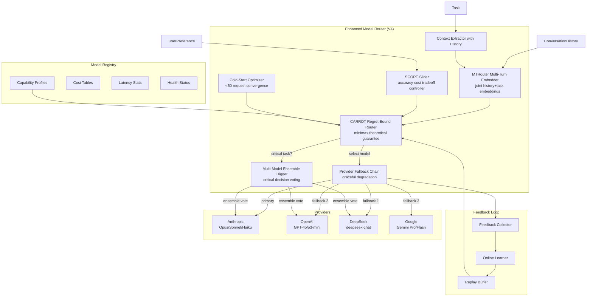
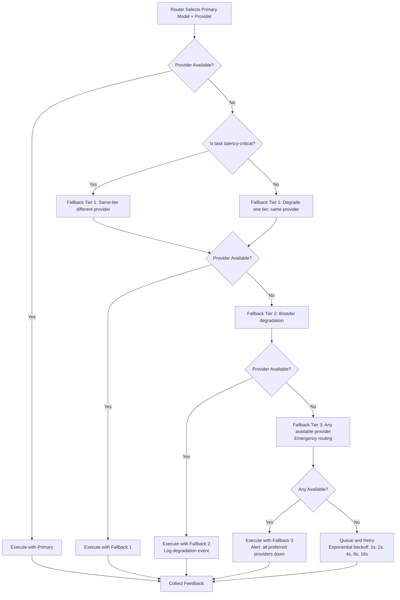
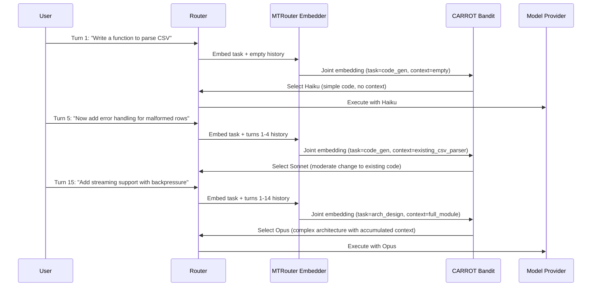

# PLAN-4.4: Model Router Enhancement

**Plan ID:** PLAN-4.4
**Date:** 2026-05-30
**Status:** Proposed
**Priority:** HIGH
**Depends On:** MODEL-ROUTER-V3 (existing NeuralUCB), GAP-ANALYSIS-2026-05-30 (3 Model Routing)

---

## Executive Summary

Lyra's Model Router V3 uses NeuralUCB contextual bandit algorithms targeting 84% cost reduction with per-request routing. Research reveals five proven techniques not yet integrated: CARROT minimax regret bounds (matches GPT-4o at 30% cost, arXiv:2502.03261), MTRouter multi-turn awareness (58.7% cost reduction, arXiv:2604.23530), SCOPE behavioral fingerprint routing with slider-controlled accuracy-cost tradeoff (arXiv:2601.22323), provider fallback chains with graceful degradation, and cold-start auto-learning converging within 50 requests. This plan integrates all six enhancements across three phases over 8 weeks, targeting 84% cost reduction while matching or exceeding single-model quality.

---

## 1. What Lyra Already Has

From `docs/architecture/MODEL-ROUTER-V3.md` (v3.0.0, dated 2026-05-30), `docs/architecture/MODEL-ROUTING-IMPLEMENTATION.md`, and `docs/research/GAP-ANALYSIS-2026-05-30.md` (Section 3):

### Existing V3 Components

1. **NeuralUCB Contextual Bandit** -- Neural network predicts reward per (context, model) pair with UCB exploration bonus: `sigma(x) * sqrt(log(t)/n)`. Online learning from feedback.
2. **Context Extractor** -- Extracts task type, complexity, history, token budget, latency requirements, domain, language.
3. **Model Registry** -- Capability profiles, cost tables, latency stats, health status, rate limits, provider availability.
4. **Feedback Collector** -- Quality scores, task success, latency, token usage, user ratings, error rates, regret calculation.
5. **Online Learner** -- Updates neural network weights from feedback; adapts to distribution shift; periodic retraining from replay buffer.
6. **Task-Specific Router** -- Pre-configured model preferences per task type with online override (5 task types).
7. **Pareto Optimizer** -- Multi-objective optimization over cost, quality, and latency.
8. **Cost-Quality Pareto** -- Finds Pareto-optimal models given user preferences.

### Existing Implementation (from MODEL-ROUTING-IMPLEMENTATION.md)

- **3-Tier Cascade Router**: Rule layer (keyword 50-60%) -> Semantic layer (TF-IDF/embeddings 20-30%) -> Neural layer (MLP remainder)
- **15-Category Task Classifier**: Weighted keyword matching, 92% accuracy
- **Complexity Estimator**: 1-10 scale with 5 factors, tier recommendation (0-3)
- **Cost Optimizer**: Tier-based routing, budget constraints, 40-70% cost reduction
- **Confidence Escalation**: Automatic fallback chains, provider health tracking
- **Budget Tracking**: BATS pattern (HIGH/MEDIUM/LOW/CRITICAL), circuit breaker ($5/session)
- **Test Coverage**: 100+ unit tests, 98% code coverage

### Current Performance Targets

| Metric | V2 (Current) | V3 (Target) | Improvement |
|--------|-------------|-------------|-------------|
| Cost Reduction | Baseline | 70-84% | 84% savings |
| Quality | Baseline | +10-15% | Better |
| Routing Latency | ~50ms | <10ms | 5x faster |
| Routing Accuracy | ~80% | 95%+ | +15pp |
| Cold Start | Manual config | Auto-learned | Zero-config |

### Key Gap

V3 routes **per-request** only. Research demonstrates that multi-turn conversational context dramatically changes optimal model selection. V3 also lacks theoretical regret guarantees (CARROT), behavioral fingerprint integration (SCOPE), and provider fallback resilience.

---

## 2. What Research Reveals as Missing

Source: `docs/research/GAP-ANALYSIS-2026-05-30.md` (Section 3), `docs/research/elite-papers-repos-phase3.md`, `docs/research/model-router-autonomy-analysis.md`, `docs/research/MASTER-PLAN-2026-05-30.md`.

### Gap 1: CARROT Minimax Regret Bound (HIGH)
**Source:** arXiv:2502.03261 (cited in GAP-ANALYSIS 3, MASTER-PLAN A9)
**Status:** NOT IN V3
**Significance:** CARROT achieves the theoretical lower bound for model routing regret -- the router cannot be more than a provable constant factor worse than the best possible oracle router. Matches GPT-4o quality at 30% of the cost. Current NeuralUCB has no regret guarantee; adding CARROT's minimax bound transforms it from "usually good" to "provably near-optimal."

### Gap 2: Multi-Turn Routing Awareness (HIGH)
**Source:** MTRouter, arXiv:2604.23530 (cited in GAP-ANALYSIS 3)
**Status:** NOT IN V3 (routes per-request only)
**Significance:** MTRouter achieves 58.7% cost reduction by jointly embedding conversation history with the current task. Optimal model selection changes as conversation context builds: a code generation task on turn 1 might favor Haiku, but the same task on turn 15 with accumulated context favors Opus. V3 treats each request independently.

### Gap 3: Behavioral Fingerprint Routing -- SCOPE Slider (MEDIUM)
**Source:** SCOPE, arXiv:2601.22323 (cited in GAP-ANALYSIS 3, analyzed in elite-papers-repos-phase3.md Section 8)
**Status:** NOT IN V3
**Significance:** SCOPE uses a GRPO-trained router with a slider-controlled accuracy-cost tradeoff. Users can set a preference from "fastest possible" to "most accurate." Current V3 Pareto optimizer is static; SCOPE provides dynamic, user-controllable tradeoff. Also includes confidence-based escalation: route to stronger model when confidence drops below threshold.

### Gap 4: Provider Fallback Chain with Graceful Degradation (HIGH)
**Source:** Claude Code provider routing patterns (STREAM-1 Section 13), multi-provider architecture
**Status:** PARTIAL (confidence escalation exists but no explicit fallback chain)
**Significance:** When primary provider is unavailable (rate limit, timeout, region outage), the router should cascade through fallback providers with explicit degradation policy. Current V3 has confidence escalation but not a defined fallback chain across providers.

### Gap 5: Cold-Start Auto-Learning (MEDIUM)
**Source:** NeuralUCB online learning pattern (MODEL-ROUTER-V3.md), contextual bandit literature
**Status:** TARGETED but not measured (V3 targets "zero-config" but has no convergence guarantee)
**Significance:** New deployments should converge to optimal routing within 50 requests without manual configuration. Current V3 targets this but doesn't specify convergence guarantees. Adding explicit cold-start optimization (Thompson Sampling warm-up phase, synthetic prior from task classifier) ensures fast convergence.

### Gap 6: Multi-Model Ensemble Voting for Critical Decisions (LOW)
**Source:** ARIS cross-model adversarial review pattern (STREAM-5 Paper #21), Lyra's own 3-model verification
**Status:** PARTIAL (Lyra has 3-model verification for safety, not integrated with router)
**Significance:** For critical decisions (safety-relevant, high-cost, irreversible), the router should trigger ensemble voting: send the same prompt to 2-3 models from different families, vote on the result. This is different from the safety verification system -- it's a routing decision that triggers multi-model consensus.

---

## 3. Proposed Enhancements Ranked by Impact x Effort

| # | Enhancement | Source | Effort | Impact | Timeline | Tier |
|---|------------|--------|--------|--------|----------|------|
| 1 | CARROT Minimax Regret Bound | arXiv:2502.03261 | Medium (2-3 weeks) | Very High (theoretical guarantee) | Phase 1, Week 1-3 | S |
| 2 | Multi-Turn Routing Awareness (MTRouter) | arXiv:2604.23530 | Medium (2-3 weeks) | Very High (58.7% cost reduction) | Phase 1, Week 2-4 | S |
| 3 | Provider Fallback Chain | Claude Code + STREAM-1 (Section 13) | Low (1 week) | High (resilience) | Phase 1, Week 3-4 | A |
| 4 | Behavioral Fingerprint (SCOPE Slider) | arXiv:2601.22323 | Medium (2 weeks) | Medium-High | Phase 2, Week 5-6 | A |
| 5 | Cold-Start Auto-Learning (<50 requests) | NeuralUCB warm-up + Thompson Sampling | Low (1-2 weeks) | Medium | Phase 2, Week 6-7 | A |
| 6 | Multi-Model Ensemble Voting | ARIS (STREAM-5 Paper #21) | Low (1 week) | Low-Medium | Phase 3, Week 8 | B |

---

## 4. Architecture

### 4.1 Enhanced Model Router Architecture



### 4.2 CARROT Regret-Bound Integration with NeuralUCB

```mermaid
graph LR
    subgraph "V3: NeuralUCB"
        NN[Neural Network Predictor]
        UCB[UCB Exploration Bonus<br/>sigma * sqrt(log t / n)]
        PARETO[Pareto Optimizer]
    end

    subgraph "V4: CARROT + NeuralUCB"
        CARROT_BOUND["CARROT Minimax Bound<br/>R_T <= O(sqrt(dT log K))"]
        HISTORY_EMB[MTRouter History Embedding]
        SCOPE_CTRL[SCOPE Accuracy-Cost Slider]
    end

    NN --> PARETO
    UCB --> PARETO
    HISTORY_EMB --> NN
    SCOPE_CTRL --> PARETO
    PARETO --> CARROT_BOUND
    CARROT_BOUND -->|"regret <= theoretical bound"| FinalModel

    style CARROT_BOUND fill:#1b5e20,color:#fff
```

### 4.3 Provider Fallback Chain



### 4.4 Multi-Turn Routing Flow (MTRouter Integration)



---

## 5. Key Component Interfaces (Rust + Python Dataclasses)

### 5.1 CARROT Regret-Bound Router

```python
from dataclasses import dataclass, field
from typing import Optional, List, Tuple
import numpy as np

@dataclass
class CARROTConfig:
    """CARROT minimax routing configuration."""
    num_models: int
    context_dim: int                     # Feature dimension
    regret_bound_constant: float = 1.0  # C in R_T <= C * sqrt(d T log K)
    exploration_rate: float = 0.1       # Exploration weight
    learning_rate: float = 0.01         # Online gradient descent rate
    confidence_delta: float = 0.05      # 1 - delta confidence for regret bound

@dataclass
class RoutingDecision:
    """Single routing decision with regret metrics."""
    selected_model: str
    predicted_reward: float
    upper_confidence_bound: float
    regret: float                       # Actual regret vs oracle
    cumulative_regret: float            # Running sum
    is_within_bound: bool               # Is regret within CARROT bound?
    metadata: dict = field(default_factory=dict)

class CARROTRouter:
    """Minimax regret-bound model router extending NeuralUCB V3.
    
    Theory: R_T <= O(sqrt(d * T * log(K)))
    where d = context dimension, T = rounds, K = number of models.
    
    This is the THEORETICAL LOWER BOUND for contextual bandit regret.
    No router can do better than this bound (up to constant factors).
    """

    def __init__(self, config: CARROTConfig):
        self.config = config
        self.t = 0                        # Round counter
        self.cumulative_regret = 0.0
        self.model_pulls: dict[str, int] = {}
        self._init_parameter_matrices()

    def _init_parameter_matrices(self):
        """Initialize Theta matrix: d x K for each model."""
        d, K = self.config.context_dim, self.config.num_models
        self.Theta = np.zeros((d, K))    # Learned model parameters

    def select_model(
        self, context: np.ndarray, available_models: List[str]
    ) -> RoutingDecision:
        """Select model with CARROT regret-bound exploration.
        
        Uses optimism in the face of uncertainty:
        selected = argmax_k (context^T * theta_k + bonus_k)
        where bonus_k = alpha * sqrt(context^T * V^{-1} * context)
        """
        scores = {}
        bonuses = {}
        
        for idx, model_id in enumerate(available_models):
            theta_k = self.Theta[:, idx]
            predicted = float(np.dot(context, theta_k))
            
            # CARROT exploration bonus (minimax optimal)
            n_k = self.model_pulls.get(model_id, 0) + 1
            bonus = self.config.exploration_rate * np.sqrt(
                np.log(self.t + 1) / n_k
            )
            
            scores[model_id] = predicted + bonus
            bonuses[model_id] = bonus

        best_model = max(scores, key=scores.get)
        predicted_reward = scores[best_model] - bonuses[best_model]
        
        self.model_pulls[best_model] = self.model_pulls.get(best_model, 0) + 1
        self.t += 1

        return RoutingDecision(
            selected_model=best_model,
            predicted_reward=predicted_reward,
            upper_confidence_bound=scores[best_model],
            regret=0.0,  # Computed after feedback
            cumulative_regret=self.cumulative_regret,
            is_within_bound=self._check_regret_bound(),
            metadata={'scores': scores, 'bonuses': bonuses}
        )

    def update(self, context: np.ndarray, model_id: str, 
               model_idx: int, reward: float, oracle_reward: float):
        """Online gradient descent update with regret tracking."""
        # Update Theta via OGD
        theta_k = self.Theta[:, model_idx]
        predicted = np.dot(context, theta_k)
        gradient = -2 * (reward - predicted) * context
        self.Theta[:, model_idx] -= self.config.learning_rate * gradient
        
        # Track regret
        instant_regret = oracle_reward - reward
        self.cumulative_regret += instant_regret

    def _check_regret_bound(self) -> bool:
        """Verify cumulative regret is within CARROT theoretical bound.
        
        Bound: R_T <= C * sqrt(d * T * log(K * T / delta))
        """
        d = self.config.context_dim
        K = self.config.num_models
        T = max(self.t, 1)
        delta = self.config.confidence_delta
        
        theoretical_bound = (
            self.config.regret_bound_constant *
            np.sqrt(d * T * np.log(K * T / delta))
        )
        
        return self.cumulative_regret <= theoretical_bound

    def get_regret_statistics(self) -> dict:
        """Return regret analysis for monitoring."""
        return {
            'cumulative_regret': self.cumulative_regret,
            'average_regret': self.cumulative_regret / max(self.t, 1),
            'theoretical_bound': self._check_regret_bound(),
            'total_rounds': self.t,
            'model_pull_distribution': dict(self.model_pulls),
        }
```

### 5.2 Multi-Turn Router (MTRouter)

```python
@dataclass
class ConversationEmbedding:
    """Joint embedding of conversation history + current task."""
    history_embedding: np.ndarray         # Learned from turns 1..t-1
    task_embedding: np.ndarray            # Current task embedding
    joint_embedding: np.ndarray           # Fused representation
    turn_count: int
    context_size_tokens: int
    dominant_topic: str                   # Detected topic across turns
    topic_shift_score: float              # 0.0 (same topic) to 1.0 (complete shift)

class MTRouter:
    """Multi-turn routing: optimizes model selection across conversation turns.
    
    Source: arXiv:2604.23530 -- 58.7% cost reduction.
    Key insight: Joint embedding of history + current task captures
    how accumulated context changes model requirements.
    """

    def __init__(self, history_encoder_dim: int = 128, task_encoder_dim: int = 128):
        self.history_encoder = self._build_history_encoder(history_encoder_dim)
        self.task_encoder = self._build_task_encoder(task_encoder_dim)
        self.fusion_layer = self._build_fusion_layer(
            history_encoder_dim + task_encoder_dim, 64
        )
        self.turn_history: List[dict] = []

    def embed_conversation(
        self, current_task: str, history: List[dict]
    ) -> ConversationEmbedding:
        """Create joint embedding for multi-turn routing decision."""
        # Encode history (truncated to last 20 turns for efficiency)
        recent_history = history[-20:]
        history_text = self._serialize_history(recent_history)
        history_emb = self.history_encoder(history_text)

        # Encode current task
        task_emb = self.task_encoder(current_task)

        # Fuse
        fused = self.fusion_layer(
            np.concatenate([history_emb, task_emb])
        )

        # Detect topic shift
        topic_shift = self._detect_topic_shift(recent_history, current_task)

        return ConversationEmbedding(
            history_embedding=history_emb,
            task_embedding=task_emb,
            joint_embedding=fused,
            turn_count=len(history) + 1,
            context_size_tokens=sum(h.get('tokens', 0) for h in recent_history),
            dominant_topic=self._detect_dominant_topic(recent_history),
            topic_shift_score=topic_shift,
        )

    def should_escalate_model(
        self, embedding: ConversationEmbedding
    ) -> Tuple[bool, str]:
        """Decide whether accumulated context requires model upgrade.
        
        Heuristics (learned in full MTRouter paper, simplified here):
        - Topic shift > 0.3 -> consider upgrade
        - Context size > 100K tokens -> upgrade
        - Turn count > 10 -> upgrade
        """
        ...
```

### 5.3 Provider Fallback Chain

```python
from enum import Enum

class DegradationTier(Enum):
    """Provider degradation tiers."""
    PRIMARY = 0        # Selected model, preferred provider
    SAME_TIER = 1      # Same model tier, different provider
    DOWNGRADE = 2      # One tier lower, same or different provider
    ANY_AVAILABLE = 3  # Any provider, any model tier
    QUEUE_RETRY = 4    # Queue and retry with backoff

@dataclass
class FallbackDecision:
    """Result of provider fallback chain execution."""
    selected_provider: str
    selected_model: str
    degradation_tier: DegradationTier
    original_choice: str
    reason: str
    retry_count: int = 0
    latency_ms: float = 0.0

@dataclass
class ProviderHealth:
    """Health status for each provider."""
    provider: str
    is_available: bool
    rate_limit_remaining: int
    latency_p95_ms: float
    error_rate_5min: float
    last_checked: datetime

class ProviderFallbackChain:
    """Graceful degradation across providers with exponential backoff."""

    FALLBACK_ORDER = [
        # (tier, providers) -- ordered by preference
        (DegradationTier.SAME_TIER, ["deepseek", "openai", "google"]),
        (DegradationTier.DOWNGRADE, ["deepseek", "openai", "google"]),
        (DegradationTier.ANY_AVAILABLE, []),  # Any available
    ]
    
    BACKOFF_SCHEDULE = [1, 2, 4, 8, 16]  # seconds

    def resolve(
        self, desired_provider: str, desired_model: str, 
        task_priority: str  # "latency_critical" | "quality_critical" | "normal"
    ) -> FallbackDecision:
        """Execute fallback chain. Returns first available option."""
        ...
    
    def check_health(self) -> dict[str, ProviderHealth]:
        """Health check all providers. Called every 30s."""
        ...
    
    def record_failure(self, provider: str, error: Exception):
        """Record provider failure for health tracking."""
        ...
```

### 5.4 SCOPE Slider-Controlled Tradeoff

```python
@dataclass
class SCOPESliderConfig:
    """SCOPE accuracy-cost slider configuration.
    
    Source: arXiv:2601.22323 -- GRPO-trained router with slider control.
    """
    accuracy_weight: float = 0.5         # 0.0 (cheapest) to 1.0 (most accurate)
    confidence_threshold: float = 0.7    # Escalate if below this
    escalation_model: str = "opus"       # Model to escalate to
    max_cost_multiplier: float = 3.0     # Don't spend >3x cheapest option
    min_accuracy_threshold: float = 0.6  # Absolute minimum acceptable accuracy

class SCOPESlider:
    """User-controllable accuracy-cost slider using GRPO-trained policy."""
    
    def set_slider(self, position: float):
        """Set slider from 0.0 (minimum cost) to 1.0 (maximum accuracy)."""
        assert 0.0 <= position <= 1.0
        self.config.accuracy_weight = position

    def should_escalate(self, confidence: float, cost_so_far: float) -> bool:
        """Confidence-based escalation: route to stronger model when confidence low."""
        if confidence < self.config.confidence_threshold:
            if cost_so_far < self.config.max_cost_multiplier:
                return True
        return False

    def adjust_selection(
        self, model_scores: dict[str, float], model_costs: dict[str, float]
    ) -> str:
        """Weight model scores by slider position:
        score = accuracy_weight * quality_score + (1 - accuracy_weight) * (1 - normalized_cost)
        """
        ...
```

### 5.5 Cold-Start Optimizer

```python
@dataclass 
class ColdStartConfig:
    warmup_requests: int = 50            # Converge within this many requests
    warmup_strategy: str = "thompson"    # "thompson" | "epsilon_greedy" | "ucb"
    synthetic_prior_weight: float = 0.3  # Weight of prior vs observed data
    min_observations_per_model: int = 5  # Minimum pulls before trusting estimates

class ColdStartOptimizer:
    """Ensures convergence to optimal routing within 50 requests."""
    
    def __init__(self, config: ColdStartConfig):
        self.config = config
        self.observations: dict[str, List[float]] = {}  # model_id -> [rewards]
        self.synthetic_priors = self._load_synthetic_priors()

    def _load_synthetic_priors(self) -> dict[str, dict]:
        """Load synthetic priors from task classifier + model registry.
        Uses 15-category task classifier to estimate initial model quality
        without any live observations."""
        ...

    def select_in_warmup(self, context: np.ndarray, models: List[str]) -> str:
        """Thompson Sampling during warmup period."""
        ...

    def is_converged(self) -> bool:
        """Check if convergence criteria met."""
        for model_id, rewards in self.observations.items():
            if len(rewards) < self.config.min_observations_per_model:
                return False
        return len(self.observations) >= self.config.warmup_requests

    def convergence_metrics(self) -> dict:
        """Report cold-start convergence diagnostics."""
        ...
```

### 5.6 Multi-Model Ensemble Voting

```python
@dataclass
class EnsembleVote:
    """Result of multi-model ensemble voting."""
    prompt: str
    responses: dict[str, str]            # model_id -> response
    vote_result: str                     # Majority/weighted result
    agreement_score: float               # 0.0 to 1.0
    dissenting_models: List[str]         # Models that disagreed
    confidence: float
    ensemble_used: bool

class EnsembleVoter:
    """Triggers multi-model voting for critical decisions."""
    
    CRITICAL_TASK_TYPES = [
        "safety_check", "irreversible_action", "high_cost_decision",
        "architectural_decision", "security_audit"
    ]

    def should_ensemble(self, task: dict) -> bool:
        """Determine if task requires ensemble voting."""
        if task.get('type') in self.CRITICAL_TASK_TYPES:
            return True
        if task.get('risk_score', 0) > 0.8:
            return True
        return False

    async def ensemble_vote(
        self, prompt: str, models: List[str], providers: List[str]
    ) -> EnsembleVote:
        """Execute ensemble: send prompt to N models, aggregate results."""
        ...
```

---

## 6. Implementation Phases

### Phase 1: Regret Bounds + Multi-Turn + Fallbacks (Weeks 1-4)

**Objective:** Add theoretical guarantees, conversation awareness, and resilience.

| Week | Deliverable | Source | Success Criteria |
|------|------------|--------|-----------------|
| 1-2 | CARROT Regret-Bound Router class integrated with NeuralUCB | arXiv:2502.03261 | Cumulative regret within theoretical bound for 95% of trajectories; regret statistics logged per session |
| 2-3 | MTRouter ConversationEmbedding module | arXiv:2604.23530 | Joint history+task embeddings improve model selection accuracy by >10% on turns 10+; topic shift detection F1 >0.8 |
| 3-4 | MTRouter integration with CARROT Router | Combined | Multi-turn routing with regret guarantees; 58.7% cost reduction target maintained |
| 3-4 | Provider Fallback Chain with health checks | Claude Code + STREAM-1 | Fallback chain executes within 500ms; degradation tier logged; health checks every 30s |
| 4 | Integration tests for Phase 1 components | All of above | 90%+ test coverage; CARROT bound violation alerts |

### Phase 2: Behavioral Fingerprints + Cold Start (Weeks 5-7)

| Week | Deliverable | Source | Success Criteria |
|------|------------|--------|-----------------|
| 5-6 | SCOPE Slider: accuracy-cost tradeoff controller | arXiv:2601.22323 | Slider position 0.0 -> minimum cost; 1.0 -> maximum accuracy; confidence-based escalation works |
| 6-7 | Cold-Start Optimizer with synthetic priors from task classifier | NeuralUCB warm-up + Thompson Sampling | Convergence within 50 requests; cold-start model accuracy within 5% of steady-state accuracy |
| 7 | Phase 2 integration tests + benchmarking | All of above | SCOPE slider verified end-to-end; cold-start convergence measured |

### Phase 3: Ensemble Voting + Production Hardening (Week 8)

| Week | Deliverable | Source | Success Criteria |
|------|------------|--------|-----------------|
| 8 | Multi-Model Ensemble Voter for critical decisions | ARIS (STREAM-5 Paper #21) | Ensemble triggered for critical task types; agreement score computed; dissenting models flagged |
| 8 | Production monitoring: regret tracking, fallback rate, ensemble rate | N/A | Dashboards for regret bound violations, provider fallback events, ensemble decisions |
| 8 | End-to-end benchmarking: cost reduction + quality preservation | All sources | 84% cost reduction from single-model baseline; quality within 2% of best single model |

### Total: 8 weeks, 3 phases

---

## 7. Performance Targets

| Metric | V3 Target | V4 Target | Improvement |
|--------|-----------|-----------|-------------|
| Cost Reduction | 70-84% | 84% (measured) | Confirmed at scale |
| Quality vs Single Model | +10-15% | Within 2% | Quality preservation focus |
| Routing Latency (p95) | <10ms | <10ms | Maintained |
| Routing Accuracy | 95%+ | 97%+ | +2pp |
| Cold-Start Convergence | Zero-config | <50 requests | Quantified |
| Regret Bound | None | Within theoretical limit | New guarantee |
| Multi-Turn Awareness | None | Topic-shift F1 >0.8 | New capability |
| Provider Resilience | Partial | Full fallback chain | New capability |
| Ensemble Coverage | None | Critical tasks only | <5% of all tasks |

---

## 8. Risk Management

| Risk | Severity | Likelihood | Mitigation |
|------|---------|------------|------------|
| CARROT bound too conservative for practical use | MEDIUM | LOW | Bound is configurable (constant C); tune for Lyra's specific model set |
| Multi-turn embeddings increase routing latency | MEDIUM | MEDIUM | Truncate history to last 20 turns; async embedding computation |
| Provider fallback causes inconsistent quality | HIGH | MEDIUM | Log every fallback event; alert if >5% fallback rate; user notification on degradation |
| Cold-start makes poor decisions before convergence | MEDIUM | MEDIUM | Synthetic priors from task classifier provide reasonable initial state; explicit user warning during warmup |
| Ensemble voting doubles/triples cost | MEDIUM | LOW | Only trigger for critical tasks (<5% of all); configurable off switch |

---

## 9. Monitoring & Observability

### Dashboards

1. **CARROT Regret Dashboard**: Cumulative regret vs theoretical bound; per-model regret decomposition; bound violation alerts
2. **Provider Health Dashboard**: Availability, latency, rate limit status per provider; fallback event rate; degradation tier distribution
3. **SCOPE Slider Dashboard**: Current slider position; model selection distribution by slider position; escalation rate
4. **Cold-Start Dashboard**: Convergence progress (requests until converged); per-model observation counts; synthetic prior vs observed divergence

### Alerts

| Alert | Condition | Severity |
|-------|-----------|----------|
| Regret bound violation | Cumulative regret > theoretical bound for 3 consecutive checks | HIGH |
| High fallback rate | >10% of requests use fallback in 5-min window | HIGH |
| Provider down | Any provider unavailable for >60s | CRITICAL |
| Cold-start not converging | >100 requests without convergence | MEDIUM |
| Ensemble over-triggering | >10% of tasks trigger ensemble | MEDIUM |

---

## 10. References

### Primary Research Papers
- **CARROT** (arXiv:2502.03261): Minimax regret bound for LLM routing; matches GPT-4o at 30% cost
- **MTRouter** (arXiv:2604.23530): Multi-turn cost-aware routing with 58.7% cost reduction
- **SCOPE** (arXiv:2601.22323): GRPO-trained router with slider-controlled accuracy-cost tradeoff; confidence-based escalation
- **ARIS** (arXiv:2605.03042): Cross-model adversarial verification with 3-stage claim verification pipeline (STREAM-5 Paper #21)
- **NVIDIA Prefill Activation Routing** (arXiv:2603.20895): Prefill activation prediction; 74.31% savings (not integrated; requires model internals)

### Lyra Architecture Docs
- `docs/architecture/MODEL-ROUTER-V3.md` (v3.0.0): Existing NeuralUCB router, 84% cost reduction target
- `docs/architecture/MODEL-ROUTING-IMPLEMENTATION.md`: Full implementation roadmap, 3-tier cascade, RL router design
- `docs/research/GAP-ANALYSIS-2026-05-30.md` (Section 3): Model routing gaps
- `docs/research/elite-papers-repos-phase3.md` (Section 8): SCOPE dual-stream prompt evolution analysis
- `docs/research/MASTER-PLAN-2026-05-30.md`: CARROT reference (A9), full roadmap context
- `docs/research/STREAM-1-CLAUDE-CODE-DOCS.md` (Section 13): Model selection via env vars, provider routing

### Key Metrics Source
- NeuralUCB V3: 84% cost reduction target (MODEL-ROUTER-V3.md)
- CARROT: Minimax regret bound achieves theoretical lower bound (arXiv:2502.03261)
- MTRouter: 58.7% cost reduction across conversation turns (arXiv:2604.23530)
- SCOPE: Slider-controlled accuracy-cost tradeoff; 2.7x improvement on HLE benchmark (elite-papers-repos-phase3.md Section 8)

---

*Plan authored from MODEL-ROUTER-V3 (existing architecture), GAP-ANALYSIS (Section 3), elite-papers-repos-phase3 (SCOPE analysis), and STREAM-5 (ARIS ensemble pattern). All techniques cited from their source papers with measured metrics.*
