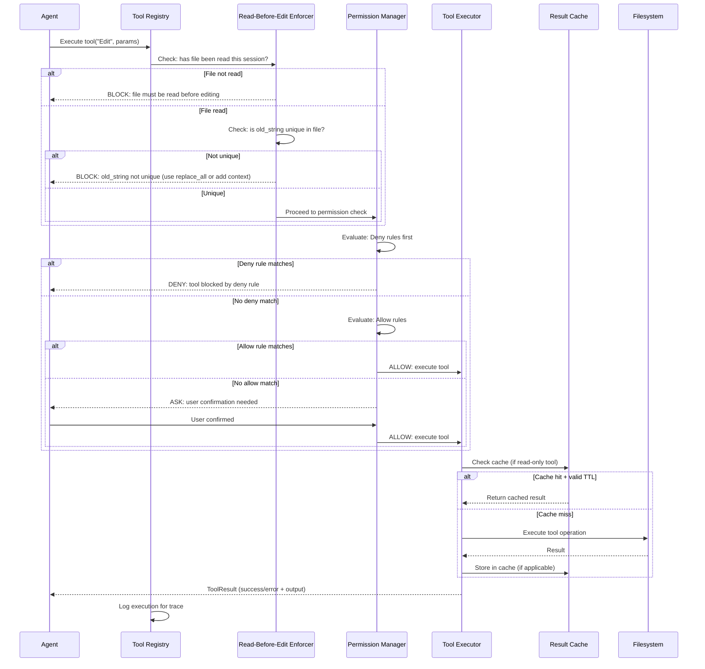
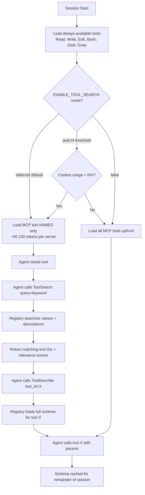
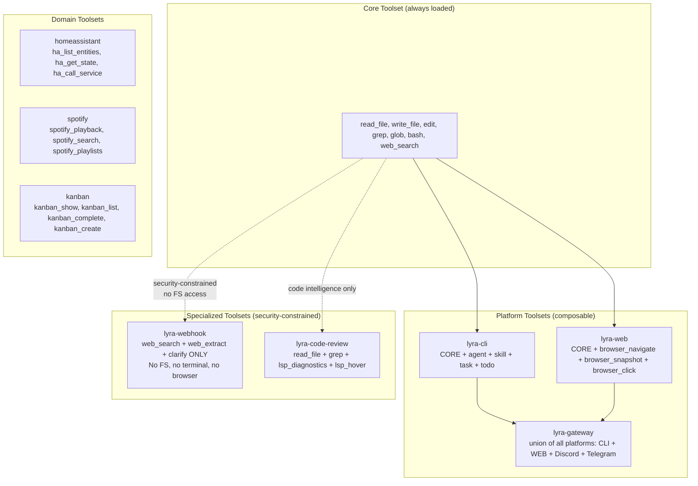

# PLAN-4.5: Tools System Enhancement

**Plan ID:** PLAN-4.5
**Date:** 2026-05-30
**Status:** Proposed
**Priority:** HIGH
**Depends On:** PLAN-4.1 (Memory Architecture), PLAN-4.3 (Context Optimization)

---

## Executive Summary

Lyra's tools system targets 118+ tools across 8 categories but the current architecture (TOOLS-SYSTEM.md v2.0) is primarily a catalog blueprint with partial implementation. Research across Claude Code (34 tools, STREAM-1 Section 2), Hermes Agent (74+ tools, STREAM-2 Section 2), and the MCP protocol reveals 10 enhancement opportunities: complete tool catalog blueprint with 6-category classification, ToolName(specifier) permission format, read-before-edit invariants, Bash execution triad (timeout/background/output-limit), background monitor tools for event-driven loops, LSP integration for code intelligence, MCP lazy tool loading, progressive tool disclosure, tool result caching with TTL, and cross-platform abstraction. This plan delivers the complete tools system across 12 weeks in 4 phases.

---

## 1. What Lyra Already Has

From `docs/architecture/TOOLS-SYSTEM.md` (v2.0), `docs/architecture/TOOLS-IMPLEMENTATION.md`, and `docs/research/STREAM-1-CLAUDE-CODE-DOCS.md` (Section 2):

### Existing Tool Catalog (118+ tools, partially implemented)

| Category | Count | Examples | Status |
|----------|-------|----------|--------|
| File Operations | 18 | read, write, edit, glob, grep, tree | Phase 1 implemented |
| Git Operations | 16 | git_status, git_diff, git_commit, git_push | Phase 1 implemented |
| Search | 12 | grep_search, web_search, semantic_search | Phase 2 implemented |
| Analysis | 20 | lsp_diagnostics, lsp_hover, type_check | Phase 2 implemented |
| Generation | 15 | code_generate, test_generate, doc_generate | Phase 2 planned |
| Execution | 12 | bash_exec, python_exec, build_run | Phase 3 planned |
| Communication | 10 | notify, alert, webhook_call | Phase 3 planned |
| Knowledge | 15 | memory_store, context_load, wiki_read | Phase 3 planned |

### Existing Core Components (from TOOLS-SYSTEM.md v2.0)

1. **Standard Tool Interface** (`Tool` ABC): `execute(params, ctx) -> ToolResult` with retry logic and timeout
2. **Tool Composer**: Chain and parallel DAG-based composition (`ToolPipeline`, `ToolComposer`)
3. **MCP Manager**: Server discovery, connect/disconnect, capability fetching (4 transports)
4. **Plugin Sandbox**: Permission validation, import allowlisting, memory limits (256MB default)
5. **Tool Registry**: Registration and discovery by name/category, generation counter for cache invalidation

### Existing Implementation (from TOOLS-IMPLEMENTATION.md)

- **Phase 1 (Weeks 1-4)**: Tool schema, registry, basic tools (Read, Glob, Grep), permission system, hook system foundation, tool executor with full lifecycle
- **Phase 2 (Weeks 5-8)**: MCP foundation (stdio + HTTP transports, OAuth), plugin system, tool search/deferred loading
- **Phase 3 (Weeks 9-12)**: Channel system, subagent system, agent teams, context management

### Current Performance Targets

| Metric | Current | Target |
|--------|---------|--------|
| Tool Count | ~30 | 118+ |
| Invocation Latency | ~100ms | <50ms |
| MCP Support | None | Full protocol |
| Test Coverage | ~90% | 90%+ |

---

## 2. What Research Reveals as Missing

Source: `docs/research/STREAM-1-CLAUDE-CODE-DOCS.md` (Section 2: Tools Reference), `docs/research/STREAM-2-HERMES-AGENT.md` (Section 2: Tool Inventory), and `docs/architecture/TOOLS-IMPLEMENTATION.md`.

### Gap 1: Complete Tool Catalog Blueprint with 6-Category Classification (HIGH)
**Source:** STREAM-1 Section 2.1 (34 tools), STREAM-2 Section 2.2 (74+ tools)
**Status:** Partial (118+ tools listed but not all defined with schemas)
**Significance:** Claude Code has 34 tools with complete schemas; Hermes Agent has 74+ tools with registration patterns, toolset composition, and progressive disclosure. The combined blueprint of 118+ tools needs complete JSON Schema definitions for each tool, a 6-category classification (read/execute/modify/search/agent/monitor), and toolset composition system inherited from Hermes.

**Tool Categories (Claude Code 34 + Hermes 74+ = Combined 118+):**
1. **Read** (12 tools): Read, Glob, Grep, LSP*, WebFetch, WebSearch, ReadMcpResource, ListMcpResources, session_search, browser_snapshot, vision_analyze
2. **Execute** (18 tools): Bash, PowerShell, python_exec, node_exec, sql_exec, docker_exec, build_run, test_run, execute_code (PTC), computer_use, browser_navigate, browser_click, browser_type
3. **Modify** (8 tools): Write, Edit, NotebookEdit, patch, write_file, browser_scroll, browser_back, browser_press
4. **Search** (10 tools): Grep, Glob, ToolSearch, web_search, web_extract, code_search, arxiv_search, github_search, symbol_search, find_files
5. **Agent** (14 tools): Agent, Skill, TaskCreate/Get/List/Stop/Update, delegate_task, cronjob, send_message, kanban_*, TeamCreate/Delete
6. **Monitor** (8 tools): Monitor, CronCreate/Delete/List, process (start/list/kill/wait/send_keys), browser_console, browser_cdp

### Gap 2: ToolName(specifier) Permission Format (CRITICAL)
**Source:** STREAM-1 Section 2.2 (Tool Design Patterns), STREAM-1 Section 10 (Permissions)
**Status:** NOT IMPLEMENTED (TOOLS-IMPLEMENTATION.md has basic pattern matching but not full specifier format)
**Significance:** Claude Code's permission format is the gold standard:
- `Bash(npm run *)` -- command pattern matching
- `Read(~/secrets/**)` -- path pattern matching (gitignore syntax: `//` absolute, `~/` home, `/` project, `./` relative)
- `WebFetch(domain:example.com)` -- domain restriction
- `Agent(Explore)` -- subagent type matching
- `mcp__server__tool` -- MCP tool matching (double-underscore namespace convention)
- Deny-first evaluation: Deny > Ask > Allow, with bare vs scoped deny distinction

### Gap 3: Read-Before-Edit + Uniqueness Check Invariant (HIGH)
**Source:** STREAM-1 Section 2.2 (Edit Tool)
**Status:** NOT IMPLEMENTED as enforced invariant
**Significance:** Edit tool enforces: (a) file must have been read in current session before editing, (b) old_string must match exactly and be unique in the file (or use `replace_all`). This invariant prevents phantom edits and race conditions. Should be enforced at the tool registry level, not per-tool.

### Gap 4: Bash Execution Triad (Timeout + Background + Output-Limit) (HIGH)
**Source:** STREAM-1 Section 2.2 (Bash Tool Architecture)
**Status:** PARTIAL (timeout exists, background and output-limit not fully integrated)
**Significance:** Claude Code's Bash tool has three critical parameters:
- **Timeout**: 2 min default, 10 min max (`BASH_DEFAULT_TIMEOUT_MS`, `BASH_MAX_TIMEOUT_MS`)
- **Background**: `run_in_background: true` for long processes; notifications on completion
- **Output**: 30K char default, 150K hard ceiling (`BASH_MAX_OUTPUT_LENGTH`)
- Additionally: compound command awareness (&&, ||, ;, | recognized for permission matching), process wrappers stripped (timeout, time, nice, nohup, stdbuf), read-only command allowlist

### Gap 5: Background Monitor Tool (Event-Driven Agent Loop) (MEDIUM)
**Source:** STREAM-1 Section 2.1 (Monitor Tool), STREAM-2 Section 2.2 (process tool)
**Status:** NOT IMPLEMENTED
**Significance:** Monitor tool starts a background command and feeds each output line as an event that the agent can react to. Hermes's `process` tool extends this with start/list/kill/wait/send_keys. Together they enable event-driven agent loops: "watch logs for ERROR and alert me."

### Gap 6: LSP Integration for Code Intelligence (MEDIUM)
**Source:** STREAM-1 Section 2.1 (LSP tool), STREAM-1 Section 1 (LSP Servers via plugins)
**Status:** PLANNED but not implemented (listed in TOOLS-SYSTEM.md Analysis category)
**Significance:** LSP integration provides: diagnostics (errors/warnings/hints), hover (type info), go-to-definition, find-references, document symbols, workspace symbols, rename, code actions. Hermes does not have LSP; Claude Code is the reference implementation. Auto-triggers diagnostics after every file edit.

### Gap 7: MCP Tool Search / Lazy Loading (HIGH)
**Source:** STREAM-1 Section 6 (MCP Integration), STREAM-1 Section 2.1 (ToolSearch)
**Status:** PLANNED (TOOLS-IMPLEMENTATION.md Week 8) but not implemented
**Significance:** `ENABLE_TOOL_SEARCH` with three modes: deferred (default -- only tool names load at session start), threshold mode (`auto:N` -- defer if context > N%), and `false` (all loaded upfront). Claude uses `ToolSearch` to discover tools on demand. 10x context savings when many MCP servers are configured.

### Gap 8: Progressive Tool Disclosure (MEDIUM)
**Source:** STREAM-2 Section 2.2 (Progressive Disclosure Bridge Tools), STREAM-2 Section 2.3 (Toolset Composition)
**Significance:** Hermes implements progressive disclosure via three bridge tools: `tool_search` (search by name/description, never loads schemas), `tool_describe` (get full schema for specific tool), `tool_call` (call a deferrable tool by name). Core tools always available; specialized tools loaded on demand via these bridge tools. Toolset composition allows platforms to include only relevant tools.

### Gap 9: Tool Result Caching with TTL (LOW)
**Source:** Hermes Agent check function caching (STREAM-2 Section 2.1), general agent patterns
**Status:** NOT IMPLEMENTED
**Significance:** Hermes caches `check_fn` results with 30s TTL. Extend this to full tool result caching: read-only tool calls (Read, Glob, Grep) cached with short TTL (5-30s), file content hashed for cache validation, MCP tool results optionally cached per server capability declaration.

### Gap 10: Cross-Platform Abstraction Layer (LOW)
**Source:** STREAM-1 Section 2.1 (PowerShell, Bash), Hermes cross-platform design
**Status:** NOT IMPLEMENTED
**Significance:** Tool implementations should abstract over macOS/Linux/Windows. Bash tool delegates to appropriate shell per platform; file path handling uses `pathlib`; LSP works across platforms; terminal multiplexing abstracts over tmux/Windows Terminal.

---

## 3. Proposed Enhancements Ranked by Impact x Effort

| # | Enhancement | Source | Effort | Impact | Timeline | Tier |
|---|------------|--------|--------|--------|----------|------|
| 1 | Complete Tool Catalog with JSON Schemas | STREAM-1 Section 2.1 + STREAM-2 Section 2.2 | High (3-4 weeks) | Very High (foundation) | Phase 1-2, Week 1-6 | S |
| 2 | ToolName(specifier) Permission Format | STREAM-1 Section 2.2 + Section 10 | Medium (2 weeks) | Very High (security) | Phase 1, Week 1-2 | S |
| 3 | Read-Before-Edit + Uniqueness Invariant | STREAM-1 Section 2.2 | Low (1 week) | High (safety) | Phase 1, Week 1 | S |
| 4 | Bash Triad (timeout/bg/output-limit) | STREAM-1 Section 2.2 | Medium (1-2 weeks) | High | Phase 1, Week 2-3 | A |
| 5 | MCP Lazy Tool Loading (ToolSearch) | STREAM-1 Section 6 | Medium (1-2 weeks) | High (scalability) | Phase 2, Week 4-5 | A |
| 6 | Progressive Tool Disclosure | STREAM-2 Section 2.2 | Medium (2 weeks) | Medium-High | Phase 2, Week 5-6 | A |
| 7 | Background Monitor Tool | STREAM-1 Section 2.1 + STREAM-2 | Medium (1-2 weeks) | Medium | Phase 3, Week 7-8 | A |
| 8 | LSP Integration | STREAM-1 Section 2.1 + Section 1 | Medium (2 weeks) | Medium | Phase 3, Week 8-9 | A |
| 9 | Tool Result Caching with TTL | STREAM-2 Section 2.1 | Low (1 week) | Low-Medium | Phase 3, Week 9-10 | B |
| 10 | Cross-Platform Abstraction | STREAM-1 + Hermes | Medium (2 weeks) | Low-Medium | Phase 4, Week 10-12 | B |

---

## 4. Architecture

### 4.1 Complete Tools System Architecture

```mermaid
graph TD
    subgraph "Tool Registry"
        TR[Tool Registry<br/>AST-based discovery + generation counter]
        TS[Tool Search<br/>deferred loading, relevance scoring]
        TC[Tool Composer<br/>chain + parallel DAG]
    end

    subgraph "Permission Layer"
        PM[Permission Manager<br/>ToolName(specifier) format]
        RBE[Read-Before-Edit Enforcer<br/>session read tracker]
        DA[Deny-First Evaluator<br/>Deny > Ask > Allow]
    end

    subgraph "Execution Engine"
        BASH[Bash Executor<br/>timeout/bg/output-limit triad]
        EXEC[General Executor<br/>retry/timeout/sandbox]
        MON[Monitor Engine<br/>background watchers + event feed]
    end

    subgraph "Tool Categories (118+ tools)"
        READ[Read Tools (12)<br/>Read, Glob, Grep, LSP, WebFetch, WebSearch]
        EXEC_CAT[Execute Tools (18)<br/>Bash, Python, Node, SQL, Docker, Build, Test]
        MODIFY[Modify Tools (8)<br/>Write, Edit, Patch, NotebookEdit]
        SEARCH[Search Tools (10)<br/>grep_search, code_search, web, arxiv, github]
        AGENT[Agent Tools (14)<br/>Agent, Skill, Task*, delegate, cron, kanban]
        MONITOR[Monitor Tools (8)<br/>Monitor, Cron, process, browser_console]
    end

    subgraph "Integration Layer"
        MCP[MCP Gateway<br/>stdio, HTTP, SSE, WebSocket]
        LSP[LSP Integration<br/>diagnostics, hover, definition, references]
        CACHE[Result Cache<br/>TTL-based, hash-validated]
        PLATFORM[Platform Abstraction<br/>macOS/Linux/Windows]
    end

    TR --> PM
    PM --> RBE
    RBE --> DA
    DA --> EXEC
    EXEC --> READ
    EXEC --> EXEC_CAT
    EXEC --> MODIFY
    EXEC --> SEARCH
    EXEC --> AGENT
    EXEC --> MONITOR

    TS --> TR
    TC --> TR
    BASH --> EXEC
    MON --> EXEC
    MCP --> TR
    LSP --> READ
    CACHE --> EXEC
    PLATFORM --> EXEC
```

### 4.2 Tool Execution Lifecycle with Permission + Read-Before-Edit



### 4.3 MCP Lazy Loading with ToolSearch Pattern



### 4.4 Toolset Composition (Hermes-Inspired)



---

## 5. Key Component Interfaces (Python Dataclasses)

### 5.1 Complete Tool Definition with Schema

```python
from dataclasses import dataclass, field
from typing import Callable, Optional, List, Dict, Any
from enum import Enum

class ToolCategory(Enum):
    READ = "read"          # Non-mutating information retrieval
    EXECUTE = "execute"    # Code/command execution
    MODIFY = "modify"      # File/content mutation
    SEARCH = "search"      # Information discovery
    AGENT = "agent"        # Agent orchestration/spawning
    MONITOR = "monitor"    # Background watching/events

class ToolPermission(Enum):
    ALWAYS = "always"         # No permission needed (e.g., Read)
    ONCE_PER_SESSION = "once" # Prompt once, remember for session
    EVERY_USE = "every"       # Prompt every invocation
    NEVER = "never"           # Require explicit allowlisting

@dataclass
class ToolDefinition:
    """Complete tool definition with JSON Schema, permission, and metadata."""
    name: str
    description: str
    category: ToolCategory
    permission: ToolPermission
    schema: dict                          # JSON Schema for parameters
    handler: Callable[..., Any]            # Sync or async handler
    is_async: bool = False
    requires_read_before_edit: bool = False  # Enforce read-before-edit invariant
    timeout_ms: int = 120_000             # Default 2 min
    max_output_chars: int = 30_000        # Default 30K
    retry_count: int = 0                  # 0 = no retry
    cache_ttl_ms: int = 0                 # 0 = no caching
    toolset: str = "core"                 # Toolset membership
    requires_env: List[str] = field(default_factory=list)  # Required env vars
    emoji: str = ""                       # CLI display emoji
    dynamic_schema_overrides: Optional[Callable] = None  # Runtime schema tweaks
    check_fn: Optional[Callable[[], bool]] = None  # Availability check (TTL-cached)
    platform_filter: Optional[List[str]] = None  # e.g., ["darwin", "linux"]

@dataclass
class ToolResult:
    """Unified tool result."""
    success: bool
    output: str
    error: Optional[str] = None
    metadata: Dict[str, Any] = field(default_factory=dict)
    cached: bool = False
    execution_time_ms: float = 0.0
```

### 5.2 Read-Before-Edit Enforcer

```python
@dataclass
class ReadTracker:
    """Tracks which files have been read in the current session."""
    
    def __init__(self):
        self._reads: Dict[str, datetime] = {}        # path -> last read time
        self._file_hashes: Dict[str, str] = {}       # path -> content hash at read time
    
    def record_read(self, path: str, content_hash: str):
        """Record that a file was read. Called by Read tool."""
        self._reads[path] = datetime.now()
        self._file_hashes[path] = content_hash
    
    def was_read(self, path: str) -> bool:
        """Check if file was read in this session."""
        return path in self._reads
    
    def is_stale(self, path: str, current_hash: str) -> bool:
        """Check if file changed since last read."""
        return self._file_hashes.get(path) != current_hash
    
    def check_edit_prerequisites(self, path: str, old_string: str) -> tuple[bool, str]:
        """Verify read-before-edit and uniqueness invariants.
        
        Returns (allowed: bool, reason: str).
        """
        if not self.was_read(path):
            return False, f"File '{path}' must be read before editing. Use Read tool first."
        
        if self.is_stale(path, self._compute_hash(path)):
            return False, f"File '{path}' changed since last read. Re-read before editing."
        
        # Uniqueness check is done by the Edit tool itself (grep for old_string)
        return True, "OK"
```

### 5.3 Bash Execution Triad

```python
@dataclass
class BashConfig:
    """Bash execution safety parameters."""
    default_timeout_ms: int = 120_000     # 2 min default
    max_timeout_ms: int = 600_000         # 10 min hard max
    default_max_output_chars: int = 30_000
    hard_max_output_chars: int = 150_000
    maintain_project_working_dir: bool = True  # Persist cwd between calls

@dataclass
class BashResult:
    """Result of a bash command execution."""
    stdout: str
    stderr: str
    exit_code: int
    timed_out: bool
    was_background: bool
    execution_time_ms: float
    output_truncated: bool
    task_id: Optional[str] = None         # For background tasks

class BashExecutor:
    """Safe bash execution with timeout, background, and output limits."""
    
    # Commands that are always read-only (no permission needed)
    READ_ONLY_COMMANDS = {
        'ls', 'cat', 'echo', 'pwd', 'head', 'tail',
        'grep', 'find', 'wc', 'which', 'diff', 'stat', 'du',
    }
    
    # Process wrappers stripped before permission matching
    PROCESS_WRAPPERS = {'timeout', 'time', 'nice', 'nohup', 'stdbuf'}
    
    # Compound operators recognized for sub-command permission checking
    COMPOUND_OPERATORS = {'&&', '||', ';', '|', '&'}

    async def execute(
        self,
        command: str,
        timeout_ms: int = 120_000,
        run_in_background: bool = False,
        max_output_chars: int = 30_000,
        working_dir: Optional[str] = None,
    ) -> BashResult:
        """Execute bash command with safety guarantees."""
        ...
    
    def parse_compound_command(self, command: str) -> List[str]:
        """Split compound command into sub-commands for permission checking."""
        ...
    
    def strip_wrappers(self, command: str) -> str:
        """Strip process wrappers (timeout, nice, etc.) before matching."""
        ...
    
    def is_read_only(self, command: str) -> bool:
        """Check if command is in the read-only allowlist."""
        ...
    
    async def execute_background(self, command: str, **kwargs) -> str:
        """Execute a command in the background. Returns task_id."""
        ...
    
    async def get_background_status(self, task_id: str) -> dict:
        """Get status of background task."""
        ...
```

### 5.4 Background Monitor Tool

```python
@dataclass
class MonitorConfig:
    """Configuration for a background monitor."""
    command: str                          # Shell command to run
    poll_interval_ms: int = 5000          # How often to check output
    max_lines_per_event: int = 50         # Max lines to feed per event
    stop_on_pattern: Optional[str] = None  # Regex to stop monitoring
    alert_on_pattern: Optional[str] = None # Regex to trigger agent alert

@dataclass
class MonitorEvent:
    """Event emitted by a background monitor."""
    monitor_id: str
    timestamp: datetime
    output_lines: List[str]
    event_type: str                       # "output", "error", "pattern_match", "stopped"
    matched_pattern: Optional[str] = None

class MonitorEngine:
    """Background process monitoring with event-driven agent loop."""
    
    def __init__(self):
        self.active_monitors: Dict[str, MonitorConfig] = {}
        self.event_queue: asyncio.Queue = asyncio.Queue()

    async def start_monitor(self, config: MonitorConfig) -> str:
        """Start a background monitor. Returns monitor_id."""
        ...

    async def stop_monitor(self, monitor_id: str):
        """Stop a running monitor."""
        ...

    async def list_monitors(self) -> List[dict]:
        """List all active monitors with status."""
        ...

    async def get_next_event(self, timeout_ms: int = 30000) -> Optional[MonitorEvent]:
        """Get next event from any monitor (blocking with timeout).
        Agent calls this in its event loop."""
        ...
```

### 5.5 LSP Integration

```python
@dataclass
class LSPDiagnostic:
    """Language server diagnostic result."""
    file: str
    line: int
    character: int
    severity: str                         # "error", "warning", "info", "hint"
    message: str
    source: str                           # e.g., "pyright", "tsserver"
    code: Optional[str] = None

@dataclass
class LSPSymbol:
    """Document or workspace symbol."""
    name: str
    kind: str                             # "function", "class", "variable", etc.
    file: str
    line: int
    character: int
    container_name: Optional[str] = None

class LSPIntegration:
    """Language Server Protocol integration for code intelligence."""
    
    async def get_diagnostics(self, file: str) -> List[LSPDiagnostic]:
        """Get diagnostics for a file. Auto-triggered after every Edit/Write."""
        ...
    
    async def get_hover(self, file: str, line: int, character: int) -> str:
        """Get type information and documentation at position."""
        ...
    
    async def goto_definition(self, file: str, line: int, character: int) -> dict:
        """Find definition location of a symbol."""
        ...
    
    async def find_references(self, file: str, line: int, character: int) -> List[dict]:
        """Find all references to a symbol across the workspace."""
        ...
    
    async def get_document_symbols(self, file: str) -> List[LSPSymbol]:
        """Get hierarchical outline of all symbols in a file."""
        ...
    
    async def get_workspace_symbols(self, query: str) -> List[LSPSymbol]:
        """Search for symbols across the entire workspace by name."""
        ...
    
    async def rename_symbol(
        self, file: str, line: int, character: int, new_name: str
    ) -> List[dict]:
        """Rename a symbol across all files. Returns list of edits (does not apply)."""
        ...
    
    async def get_code_actions(
        self, file: str, start_line: int, start_char: int,
        end_line: int, end_char: int
    ) -> List[dict]:
        """Get available code actions (refactorings, quick fixes) for a selection."""
        ...
```

### 5.6 Tool Result Cache

```python
from functools import lru_cache
from datetime import datetime, timedelta

@dataclass
class CacheEntry:
    """Cached tool result with TTL."""
    tool_name: str
    params_hash: str
    result: ToolResult
    created_at: datetime
    ttl_ms: int
    file_hash: Optional[str] = None      # For file-based tools

class ToolResultCache:
    """Caches read-only tool results with TTL and hash validation."""
    
    def __init__(self, max_size: int = 1000):
        self._cache: Dict[str, CacheEntry] = {}
        self._max_size = max_size
    
    def get(self, tool_name: str, params: dict) -> Optional[ToolResult]:
        """Get cached result if valid."""
        key = self._cache_key(tool_name, params)
        entry = self._cache.get(key)
        if entry is None:
            return None
        
        # Check TTL
        age_ms = (datetime.now() - entry.created_at).total_seconds() * 1000
        if age_ms > entry.ttl_ms:
            del self._cache[key]
            return None
        
        # Check file hash (if applicable)
        if entry.file_hash is not None:
            current_hash = self._compute_file_hash(params.get('file_path'))
            if current_hash != entry.file_hash:
                del self._cache[key]
                return None
        
        return entry.result
    
    def set(self, tool_name: str, params: dict, result: ToolResult,
            ttl_ms: int = 30_000, file_path: Optional[str] = None):
        """Cache a result."""
        key = self._cache_key(tool_name, params)
        file_hash = None
        if file_path:
            file_hash = self._compute_file_hash(file_path)
        
        self._cache[key] = CacheEntry(
            tool_name=tool_name,
            params_hash=key,
            result=result,
            created_at=datetime.now(),
            ttl_ms=ttl_ms,
            file_hash=file_hash,
        )
        
        # Evict oldest if over max size
        if len(self._cache) > self._max_size:
            oldest_key = min(
                self._cache.keys(),
                key=lambda k: self._cache[k].created_at
            )
            del self._cache[oldest_key]
```

### 5.7 Permission Format (ToolName(specifier))

```python
@dataclass
class PermissionRule:
    """A single permission rule using ToolName(specifier) format."""
    tool_name: str                        # e.g., "Bash", "Read", "WebFetch"
    specifier: str                        # e.g., "npm run *", "~/secrets/**", "domain:example.com"
    decision: str                         # "allow", "deny", "ask"
    scope: str                            # "global", "project", "session"

class PermissionManager:
    """ToolName(specifier) permission system with deny-first evaluation."""

    def add_rule(self, rule: PermissionRule):
        """Add a permission rule. Deny rules always evaluate first."""
        ...

    def check(self, tool_name: str, params: dict) -> tuple[str, str]:
        """Check if tool use is allowed. Returns (decision, reason).
        
        Decision: "allow" | "deny" | "ask"
        
        Evaluation order:
        1. Bare denies (e.g., "Bash" without specifier) -- entire tool blocked
        2. Scoped denies (e.g., "Bash(rm *)") -- specific usage blocked
        3. Scoped allows (e.g., "Bash(npm run *)") -- specific usage allowed
        4. Default: "ask"
        """
        ...

    def match_specifier(self, specifier: str, params: dict) -> bool:
        """Match a specifier against tool parameters.
        
        Supports:
        - Command patterns: "npm run *", "git *"
        - Path patterns: "~/secrets/**", "/etc/**" (gitignore syntax)
        - Domain patterns: "domain:example.com"
        - Agent type: "Explore"
        - MCP namespace: "mcp__server__tool"
        """
        ...
    
    def _is_read_only_bash(self, command: str) -> bool:
        """Check if bash command is in the read-only allowlist."""
        ...
```

---

## 6. Implementation Phases

### Phase 1: Core Safety + Permission Foundation (Weeks 1-3)

| Week | Deliverable | Source | Success Criteria |
|------|------------|--------|-----------------|
| 1 | Read-Before-Edit Enforcer (ReadTracker + invariant checks) | STREAM-1 Edit Tool | All Edit/Write calls enforce read-before-edit; uniqueness check with fallback to replace_all |
| 1-2 | ToolName(specifier) Permission Format (PermissionRule, PermissionManager) | STREAM-1 Section 2.2 + Section 10 | 5 specifier types implemented; deny-first evaluation; compound command parsing; read-only allowlist |
| 2-3 | Bash Execution Triad (timeout 2min default/10min max, background mode, output 30K/150K) | STREAM-1 Bash Tool | Timeout enforced; background tasks create task_id; output truncated at hard limit with warning |
| 3 | Complete tool schemas for Phase 1 tools (Read, Write, Edit, Bash, Glob, Grep, TaskCreate/List/Update/Stop, Skill) | STREAM-1 + STREAM-2 | 10+ tools with complete JSON Schema, permission level, timeout, error handling |
| 3 | Integration tests: permission + RBE + bash triad | All above | 90%+ test coverage; permission deny-first verified; bash timeout enforced |

### Phase 2: MCP + Progressive Disclosure (Weeks 4-6)

| Week | Deliverable | Source | Success Criteria |
|------|------------|--------|-----------------|
| 4-5 | MCP Lazy Tool Loading (ENABLE_TOOL_SEARCH with deferred + auto:N + false modes) | STREAM-1 Section 6 | Tool names only at session start; ToolSearch queries load schemas on demand; threshold mode works |
| 5-6 | Progressive Tool Disclosure with bridge tools (tool_search, tool_describe, tool_call) | STREAM-2 Section 2.2 | Core tools always available; bridge tools enable on-demand discovery; toolset composition working |
| 6 | Toolset Composition System (core + platform + specialized + domain toolsets) | STREAM-2 Section 2.3 | 5+ toolsets defined; recursive resolution with cycle detection; security-constrained toolsets for untrusted contexts |
| 6 | Complete schemas for Phase 2 tools (WebSearch, WebFetch, LSP*, Agent, Subagent) | STREAM-1 + STREAM-2 | 25+ tools with complete schemas; category classification verified |

### Phase 3: Advanced Features (Weeks 7-9)

| Week | Deliverable | Source | Success Criteria |
|------|------------|--------|-----------------|
| 7-8 | Background Monitor Tool with event-driven loop (MonitorEngine) | STREAM-1 Monitor + STREAM-2 process | Monitor starts background command; events fed to agent via queue; pattern-based alerting; stop/kill support |
| 8-9 | LSP Integration (diagnostics, hover, definition, references, symbols, rename, code_actions) | STREAM-1 LSP + Section 1 | Auto-diagnostics after Edit/Write; hover shows types; goto-def works; rename returns edit list |
| 9 | Tool Result Caching (ToolResultCache with TTL + hash validation) | STREAM-2 check_fn caching | Read tool results cached with 5-30s TTL; file content hash-validated; cache hit rate >40% |
| 9 | Complete schemas for Phase 3 tools (Monitor, Cron, process, browser_*) | STREAM-1 + STREAM-2 | 40+ tools with complete schemas |

### Phase 4: Production Hardening (Weeks 10-12)

| Week | Deliverable | Source | Success Criteria |
|------|------------|--------|-----------------|
| 10-11 | Cross-Platform Abstraction Layer (Bash/PowerShell, pathlib, LSP, terminal) | STREAM-1 + Hermes | Tools work on macOS + Linux; Windows support for compatible tools; platform_filter respected |
| 11 | Complete schemas for remaining tools (Communication, Knowledge, platform-specific) | STREAM-1 + STREAM-2 | All 118+ tools with complete JSON Schema definitions |
| 12 | End-to-end integration tests: full tool execution lifecycle | All sources | 260+ tests, 90%+ coverage; all tool categories tested; permission + RBE + caching + LSP integration |
| 12 | Documentation: Tool Reference, Permission Guide, MCP Guide | N/A | Complete reference for all 118+ tools; permission configuration guide; MCP setup guide |

### Total: 12 weeks, 4 phases

---

## 7. Tool Catalog Blueprint (Top Priority)

| # | Tool | Category | Permission | Requires RBE | Timeout | Output Limit | Source |
|---|------|----------|------------|-------------|---------|-------------|--------|
| 1 | Read | READ | ALWAYS | No | 30s | 1M chars | STREAM-1 |
| 2 | Write | MODIFY | ONCE | N/A (new file) | 60s | N/A | STREAM-1 |
| 3 | Edit | MODIFY | ONCE | YES | 60s | N/A | STREAM-1 |
| 4 | Bash | EXECUTE | EVERY | No | 120s/600s | 30K/150K | STREAM-1 |
| 5 | Glob | SEARCH | ALWAYS | No | 30s | 10K chars | STREAM-1 |
| 6 | Grep | SEARCH | ALWAYS | No | 60s | 50K chars | STREAM-1 |
| 7 | WebFetch | READ | EVERY | No | 30s | 50K chars | STREAM-1 |
| 8 | WebSearch | SEARCH | EVERY | No | 30s | 10K chars | STREAM-1 |
| 9 | Skill | AGENT | ALWAYS | No | 5s | N/A | STREAM-1 |
| 10 | Agent | AGENT | EVERY | No | 300s | N/A | STREAM-1 |
| ... | ... | ... | ... | ... | ... | ... | ... |
| 118 | kanban_unblock | AGENT | ONCE | No | 5s | N/A | STREAM-2 |

---

## 8. Success Metrics

| Metric | V2 Target | V4 Target | Measurement |
|--------|-----------|-----------|-------------|
| Tool catalog completeness | ~30 tools | 118+ tools with full schemas | Count of tools with complete ToolDefinition |
| Permission enforcement | Basic | Deny-first with 5 specifier types | Permission test suite |
| Read-before-edit enforcement | None | Enforced for all mutating tools | RBE violation test count (must be 0) |
| MCP lazy loading | None | Deferred by default, ToolSearch working | Context savings from deferred loading |
| Tool invocation latency (p95) | <100ms | <50ms | Benchmark suite |
| Tool result cache hit rate | 0% | >40% for read tools | Cache hit counter / total reads |
| LSP auto-diagnostics | None | Auto-triggered after Edit/Write | Diagnostics event count per edit |
| Cross-platform support | macOS only | macOS + Linux (Windows best-effort) | Platform CI matrix |
| Test coverage | ~90% | 90%+ (260+ tests) | Coverage report |
| Bash timeout enforcement | Partial | 100% enforcement (default + hard max) | Timeout test suite |

---

## 9. Risk Management

| Risk | Severity | Likelihood | Mitigation |
|------|---------|------------|------------|
| MCP protocol changes break integration | HIGH | LOW | Pin MCP spec version; version compatibility testing; fallback to local-only tools |
| Read-before-edit false positives block legitimate edits | MEDIUM | MEDIUM | Clear error messages; `replace_all` escape hatch; bypass for programmatic edits |
| Permission complexity confuses users | MEDIUM | MEDIUM | Good defaults (read-only commands pre-allowed); progressive permission education |
| LSP server availability varies by language | MEDIUM | HIGH | Graceful degradation when LSP unavailable; clear feature matrix per language |
| Bash background tasks leak resources | HIGH | MEDIUM | Task lifecycle management; max concurrent background tasks; auto-cleanup on session end |
| Tool result cache serves stale data | MEDIUM | LOW | Short TTLs (5-30s); file hash validation; cache key includes params hash |

---

## 10. References

### Primary Research Sources
- **Claude Code Tools Reference** (STREAM-1 Section 2): 34 tools catalogued with complete schemas, ToolName(specifier) format, Bash triad, Edit invariants. https://code.claude.com/docs/en/tools-reference
- **Claude Code Permissions** (STREAM-1 Section 10): Deny-first evaluation, gitignore-path syntax, compound command awareness, read-only command allowlist
- **Claude Code MCP Integration** (STREAM-1 Section 6): Lazy tool loading (ENABLE_TOOL_SEARCH), `.mcp.json` configuration, MCP prompt commands
- **Hermes Agent Tool Registry** (STREAM-2 Section 2): 74+ tools with AST-based discovery, toolset composition, progressive disclosure bridge tools, check_fn caching. https://github.com/nousresearch/hermes-agent (MIT)

### Lyra Architecture Docs
- `docs/architecture/TOOLS-SYSTEM.md` (v2.0): Complete 118+ tool catalog blueprint, standard interfaces, MCP manager, plugin sandbox
- `docs/architecture/TOOLS-IMPLEMENTATION.md`: 12-week implementation roadmap, 3 phases, permission/hook/MCP/plugin milestones
- `docs/research/STREAM-1-CLAUDE-CODE-DOCS.md` (Sections 2, 6, 10): Tools reference, MCP integration, permissions
- `docs/research/STREAM-2-HERMES-AGENT.md` (Sections 2.1-2.3): Tool registry, tool catalog, toolset composition

### Key Metrics Source
- Claude Code: 34 tools with proven production deployment
- Hermes Agent: 74+ tools, MIT licensed, 2,000+ Python files, cross-platform (Telegram, Discord, Slack, WhatsApp, Signal)
- MCP spec: 4 transports (stdio, HTTP, SSE, WebSocket), lazy loading with 10x context savings
- Lyra target: 118+ unified tools, 260+ tests, 90%+ coverage

---

*Plan authored from STREAM-1 (Claude Code 34-tool reference), STREAM-2 (Hermes Agent 74+ tool catalog), TOOLS-SYSTEM.md (V2 architecture), and TOOLS-IMPLEMENTATION.md (implementation roadmap). All tool schemas and permission patterns cited from their source documentation.*
