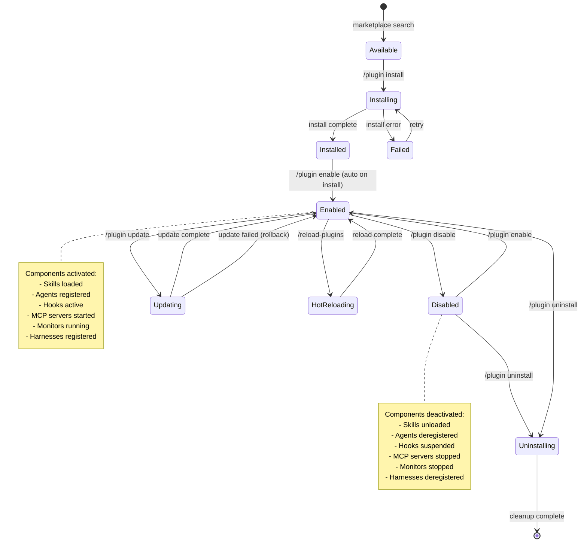
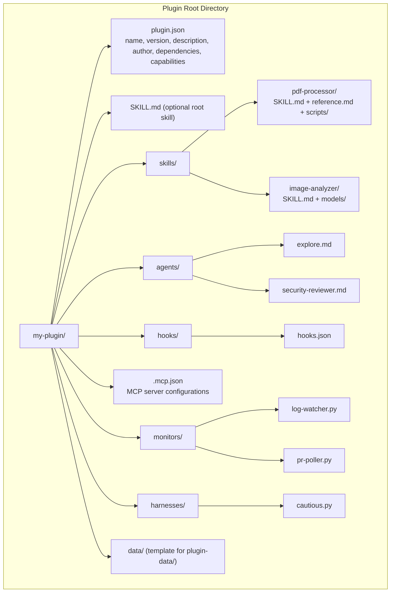
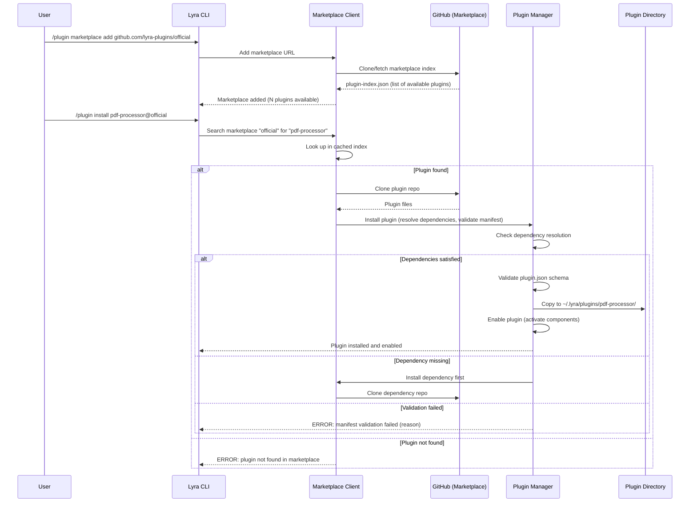
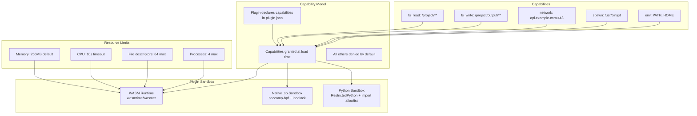

# PLAN-4.6: Plugins System Enhancement

**Plan ID:** PLAN-4.6
**Date:** 2026-05-30
**Status:** Proposed
**Priority:** HIGH
**Depends On:** PLAN-4.5 (Tools System), PLAN-4.3 (Context Optimization)

---

## Executive Summary

Lyra's existing harness plugin contract (harness-plugins.md) provides strategy-pattern topology selection but is limited to agent orchestration patterns. Research across Claude Code's plugin reference (STREAM-1 Section 1), Hermes Agent's skill marketplace, rmux's plugin SDK (STREAM-8), and the agentskills.io specification (STREAM-7) reveals a comprehensive plugin architecture: directory-based plugins with plugin.json manifests, git-based marketplaces, full lifecycle management (install/enable/disable/uninstall/update), WASM + native sandboxing, scope hierarchy (user ~/.lyra vs project .lyra/), persistent plugin data, enterprise managed policies, dependency resolution, hot reload, and plugin signing. This plan delivers 10 enhancements across 10 weeks in 4 phases.

---

## 1. What Lyra Already Has

From `docs/architecture/harness-plugins.md` and `docs/research/STREAM-7-SKILLS-SYSTEMS.md` (existing Lyra V2 skills architecture):

### Existing Harness Plugin System

1. **HarnessPlugin Protocol** (`lyra_core/adapters/base.py`): `name`, `description`, `select(plan, session) -> bool`, `run(session, plan) -> RunResult`
2. **Three Built-in Harnesses**:
   - `single-agent` (default): One agent, one model
   - `three-agent`: Planner (smart) -> Generator (fast) -> Evaluator (different family), ~1.6x tokens
   - `dag-teams`: DAG scheduler with parallel workers, PARK support for stalled approvals
3. **Registration System**: `register_harness()`, `get_harness()`, priority by registration order
4. **Selection Precedence**: `--harness` flag > plan-frontmatter > voting (`select()`)
5. **Plugin-as-Python-Class**: Custom harnesses implemented as Python classes with `select()` + `run()`

### Existing Skills System (V2, STREAM-7)

- 7-component architecture: Loader, Manager, Learner, Creator, Auto-Evaluator, Self-Evolution Engine, Curator
- Lazy loading with ML-based predictive preloading
- Thompson Sampling for A/B testing of skills
- Genetic algorithm for skill evolution (mutation/crossover/selection)
- Pareto optimization for fitness

### Current Limitations

- Harness plugins are exclusively about agent topology -- no support for skills, hooks, MCP servers, or monitors as plugin components
- No plugin manifest format beyond Python class registration
- No marketplace distribution mechanism
- No sandboxing for plugin code
- No dependency resolution
- No hot reload capability
- Skills system is separate from plugin system (not unified)

---

## 2. What Research Reveals as Missing

Source: `docs/research/STREAM-1-CLAUDE-CODE-DOCS.md` (Section 1: Plugins Reference), `docs/research/STREAM-7-SKILLS-SYSTEMS.md` (skills format, marketplace), `docs/research/STREAM-8-TERMINAL-MULTIPLEXERS.md` (plugin system design).

### Gap 1: Plugin-as-Directory Architecture (CRITICAL)
**Source:** STREAM-1 Section 1.1 (Plugins Reference Architecture), STREAM-7 Section 2.2 (plugin.json manifest)
**Status:** NOT IMPLEMENTED (harness plugins are Python classes, not directories)
**Significance:** Claude Code defines a plugin as a self-contained directory with a `plugin.json` manifest. Components auto-discovered by directory convention:
```
plugin-root/
  plugin.json          # Manifest (name, version, description, author, dependencies)
  SKILL.md             # Single root-level skill (optional)
  skills/              # Multiple skills as directories
    pdf-processor/
      SKILL.md
      reference.md
      scripts/
  agents/              # Custom subagent definitions (markdown files)
  hooks/
    hooks.json         # Hook definitions scoped to plugin
  .mcp.json            # MCP server configurations
  monitors/            # Auto-started background monitors
```
This is fundamentally different from the current Python-class harness plugin model. It enables non-programmers to create plugins (just Markdown + JSON).

### Gap 2: Plugin Marketplace (Git-Based) (HIGH)
**Source:** STREAM-1 Section 1.3 (Plugin Lifecycle, CLI Commands), STREAM-7 Section 2.2 (plugin marketplace pattern)
**Status:** NOT IMPLEMENTED
**Significance:** Claude Code's marketplace model is elegantly simple: GitHub repositories serve as plugin catalogs. CLI commands handle discovery and installation:
```
/plugin install <name>[@<marketplace>]
/plugin marketplace add <url>
/plugin marketplace list
/plugin list
/plugin uninstall <name>
/plugin update <name>
/reload-plugins
```
Managed marketplace restrictions for enterprise (`blockedMarketplaces`, `strictKnownMarketplaces`).

### Gap 3: Plugin Lifecycle Management (HIGH)
**Source:** STREAM-1 Section 1.3
**Status:** NOT IMPLEMENTED (only `register_harness()` call)
**Significance:** Full lifecycle: install (clone/copy to plugin dir) -> enable (activate components) -> disable (deactivate but keep installed) -> uninstall (remove from disk) -> update (git pull or download new version). Current harness plugins have no lifecycle beyond registration.

### Gap 4: WASM + Native Plugin Sandbox (HIGH)
**Source:** STREAM-8 (rmux plugin SDK), TOOLS-SYSTEM.md Section 2.4 (PluginSandbox)
**Status:** Partial (TOOLS-SYSTEM.md has PluginSandbox design but limited to Python import allowlisting)
**Significance:** Plugins execute untrusted code. A proper sandbox needs:
- **WASM runtime**: For portable, language-agnostic plugin execution with capability-based security
- **Native .so sandbox**: For performance-critical plugins, using seccomp-bpf (Linux) / sandbox-exec (macOS)
- **Capability model**: Plugins declare required capabilities (fs_read, fs_write, network, spawn); denied by default
- **Resource limits**: Memory (256MB default), CPU time, file descriptors

### Gap 5: Plugin Scope Hierarchy (MEDIUM)
**Source:** STREAM-1 Section 1.5 (Plugin scope/user separation), STREAM-7 Section 2.5
**Status:** NOT IMPLEMENTED
**Significance:** Two scopes with clear precedence:
- **User scope** (`~/.lyra/plugins/`): Personal plugins, available across all projects
- **Project scope** (`.lyra/plugins/`): Project-specific plugins, version-controlled
- User plugins load first; project plugins can override
- `LYRA_PLUGIN_SEED_DIR` for pre-seeded enterprise plugins

### Gap 6: Persistent Plugin Data Directory (MEDIUM)
**Source:** STREAM-1 Section 1.5 (`${CLAUDE_PLUGIN_DATA}` pattern)
**Status:** NOT IMPLEMENTED
**Significance:** Plugins need a data directory that survives updates. Claude Code uses `${CLAUDE_PLUGIN_DATA}` path placeholder. Pattern:
```
~/.lyra/plugin-data/<plugin-name>/
  config.json
  cache/
  state.db
```
Never cleaned on update; only removed on uninstall.

### Gap 7: Enterprise Managed Plugin Policies (LOW)
**Source:** STREAM-1 Section 1.5 (managed marketplace restrictions)
**Status:** NOT IMPLEMENTED
**Significance:** Enterprise deployments need:
- `blockedMarketplaces`: List of forbidden marketplace URLs
- `strictKnownMarketplaces`: Only allow marketplaces from a pre-approved list
- Managed settings cannot be overridden by user/project settings
- Plugin allowlisting: only specific plugins can be installed

### Gap 8: Plugin Dependency Resolution (MEDIUM)
**Source:** STREAM-1 Section 1.2, npm/pip dependency resolution patterns
**Status:** NOT IMPLEMENTED
**Significance:** Plugins declare dependencies in `plugin.json`:
```json
{
  "dependencies": {
    "lyra-core-tools": ">=1.0.0",
    "lyra-mcp-gateway": "^2.0.0"
  }
}
```
Installation resolves the dependency tree; circular dependency detection; version conflict resolution with semver.

### Gap 9: Hot Reload Without Restart (LOW)
**Source:** STREAM-1 Section 1.3 (`/reload-plugins` command), STREAM-8 (cmux live reload)
**Status:** NOT IMPLEMENTED
**Significance:** `/reload-plugins` reloads all enabled plugins without restarting Lyra. Development loop: edit plugin files -> `/reload-plugins` -> test. Production: enable/disable plugins on the fly.

### Gap 10: Plugin Signing and Verification (LOW)
**Source:** npm package signing, apt GPG verification patterns
**Status:** NOT IMPLEMENTED
**Significance:** For marketplace security: plugin authors sign releases with Ed25519; marketplace maintains author public keys; Lyra verifies signatures before installation; `--skip-verify` flag for development.

---

## 3. Proposed Enhancements Ranked by Impact x Effort

| # | Enhancement | Source | Effort | Impact | Timeline | Tier |
|---|------------|--------|--------|--------|----------|------|
| 1 | Plugin-as-Directory Architecture with plugin.json | STREAM-1 Section 1.1 + STREAM-7 Section 2.2 | High (3-4 weeks) | Very High (foundation) | Phase 1, Week 1-4 | S |
| 2 | Plugin Lifecycle (install/enable/disable/uninstall/update) | STREAM-1 Section 1.3 | Medium (2 weeks) | Very High | Phase 1, Week 2-3 | S |
| 3 | Git-Based Plugin Marketplace | STREAM-1 Section 1.5 + STREAM-7 Section 2.2 | Medium (2-3 weeks) | High | Phase 2, Week 4-6 | S |
| 4 | Plugin Scope Hierarchy (user vs project) | STREAM-1 Section 1.5 | Low (1 week) | High | Phase 1, Week 3-4 | A |
| 5 | Persistent Plugin Data Directory | STREAM-1 Section 1.5 | Low (1 week) | Medium | Phase 2, Week 4-5 | A |
| 6 | WASM + Native Plugin Sandbox | STREAM-8 + TOOLS-SYSTEM.md 2.4 | High (3-4 weeks) | High (security) | Phase 3, Week 6-9 | A |
| 7 | Plugin Dependency Resolution | STREAM-1 Section 1.2 | Medium (1-2 weeks) | Medium | Phase 2, Week 5-6 | A |
| 8 | Hot Reload (/reload-plugins) | STREAM-1 Section 1.3 | Low (1 week) | Medium | Phase 2, Week 6-7 | B |
| 9 | Enterprise Managed Plugin Policies | STREAM-1 Section 1.5 | Medium (2 weeks) | Low-Medium | Phase 4, Week 8-9 | B |
| 10 | Plugin Signing and Verification | npm/pypi signing patterns | Medium (2 weeks) | Low-Medium | Phase 4, Week 9-10 | B |

---

## 4. Architecture

### 4.1 Complete Plugin System Architecture

```mermaid
graph TD
    subgraph "Plugin Manager"
        PM[Plugin Manager<br/>lifecycle + dependency resolution]
        PR[Plugin Registry<br/>manifest parsing + validation]
        PL[Plugin Loader<br/>component discovery + activation]
    end

    subgraph "Plugin Components"
        SKILLS[Skills<br/>SKILL.md + reference + scripts]
        AGENTS[Agents<br/>subagent definitions in Markdown]
        HOOKS[Hooks<br/>hooks.json scoped to plugin]
        MCP_SERVERS[MCP Servers<br/>.mcp.json or inline in plugin.json]
        MONITORS[Monitors<br/>background watchers]
        HARNESSES[Harnesses<br/>agent topology strategies]
    end

    subgraph "Distribution"
        MKT[Marketplace Client<br/>search, install, update]
        GIT[Git Backend<br/>GitHub repos as marketplaces]
        LOCAL[Local Registry<br/>./lyra/plugins/ directory]
    end

    subgraph "Security"
        SANDBOX[Plugin Sandbox<br/>WASM + native seccomp-bpf]
        CAP[Capability Model<br/>fs_read, fs_write, network, spawn]
        SIGN[Signing + Verification<br/>Ed25519 signatures]
    end

    subgraph "Scope & Data"
        USER_SCOPE["~/.lyra/plugins/<br/>User scope"]
        PROJ_SCOPE[".lyra/plugins/<br/>Project scope"]
        DATA["~/.lyra/plugin-data/<name>/<br/>Persistent data"]
        POLICIES[Enterprise Policies<br/>blockedMarketplaces, strictKnown]

    PM --> PR
    PM --> PL
    PR --> SKILLS
    PR --> AGENTS
    PR --> HOOKS
    PR --> MCP_SERVERS
    PR --> MONITORS
    PR --> HARNESSES
    PL --> SKILLS
    PL --> AGENTS
    PL --> HOOKS
    PL --> MCP_SERVERS
    PL --> MONITORS
    PL --> HARNESSES

    MKT --> GIT
    MKT --> LOCAL
    MKT --> PM

    SANDBOX --> CAP
    SIGN --> PM

    PM --> USER_SCOPE
    PM --> PROJ_SCOPE
    PM --> DATA
    PM --> POLICIES
```

### 4.2 Plugin Lifecycle State Machine



### 4.3 Plugin Directory Structure



### 4.4 Plugin Marketplace Flow



### 4.5 Sandbox Architecture



---

## 5. Key Component Interfaces (Python Dataclasses)

### 5.1 Plugin Manifest (plugin.json)

```python
from dataclasses import dataclass, field
from typing import Optional, List, Dict
from enum import Enum

class PluginCapability(Enum):
    """Capabilities a plugin can request."""
    FS_READ = "fs_read"          # Read filesystem access
    FS_WRITE = "fs_write"        # Write filesystem access
    NETWORK = "network"           # Network access
    SPAWN = "spawn"               # Process spawning
    ENV_READ = "env_read"         # Environment variable reading
    MCP_SERVER = "mcp_server"     # Run MCP server
    HOOKS = "hooks"               # Register hooks

@dataclass
class PluginManifest:
    """plugin.json schema for Lyra plugins."""
    name: str                            # Unique plugin identifier
    version: str                         # Semver
    description: str                     # Human-readable description
    author: Dict[str, str]               # {name, email, url}
    license: str                         # SPDX identifier
    repository: Optional[str] = None     # Source repository URL
    
    # Component declarations
    skills: List[str] = field(default_factory=list)       # Skill directories
    agents: List[str] = field(default_factory=list)       # Agent definition files
    hooks: Optional[str] = None           # Path to hooks.json
    mcp_servers: Optional[str] = None     # Path to .mcp.json
    monitors: List[str] = field(default_factory=list)     # Monitor scripts
    harnesses: List[str] = field(default_factory=list)    # Harness Python files
    
    # Dependency & compatibility
    dependencies: Dict[str, str] = field(default_factory=dict)  # plugin_name: version_spec
    lyra_version: str = ">=1.0.0"        # Required Lyra version
    
    # Security
    capabilities: List[str] = field(default_factory=list)  # Requested capabilities
    sandbox: str = "python"              # "python" | "wasm" | "native"
    signing: Optional[Dict[str, str]] = None  # {public_key, signature}
    
    # Metadata
    keywords: List[str] = field(default_factory=list)
    category: str = "uncategorized"
    min_lyra_version: str = "1.0.0"
    max_lyra_version: Optional[str] = None

    def validate(self) -> List[str]:
        """Validate manifest. Returns list of validation errors (empty = valid)."""
        errors = []
        if not self.name or not self.name.replace('-', '').replace('_', '').isalnum():
            errors.append(f"Invalid plugin name: {self.name}")
        if not self.version:
            errors.append("Version is required")
        # ... more validations
        return errors
```

### 5.2 Plugin Manager (Lifecycle)

```python
from enum import Enum
from pathlib import Path

class PluginState(Enum):
    AVAILABLE = "available"      # Known from marketplace, not installed
    INSTALLING = "installing"
    INSTALLED = "installed"      # On disk, not active
    ENABLED = "enabled"          # Active
    DISABLED = "disabled"        # Installed but inactive
    UNINSTALLING = "uninstalling"
    UPDATING = "updating"
    FAILED = "failed"            # Install/enable/update failed

@dataclass
class PluginInstance:
    """Runtime representation of an installed plugin."""
    manifest: PluginManifest
    state: PluginState
    install_path: Path
    data_path: Path
    installed_at: datetime
    updated_at: Optional[datetime] = None
    error: Optional[str] = None
    loaded_components: Dict[str, List[str]] = field(default_factory=dict)

class PluginManager:
    """Full lifecycle management for Lyra plugins."""

    def __init__(self, user_plugins_dir: Path, project_plugins_dir: Path, 
                 data_dir: Path):
        self.user_plugins_dir = user_plugins_dir      # ~/.lyra/plugins/
        self.project_plugins_dir = project_plugins_dir  # .lyra/plugins/
        self.data_dir = data_dir                       # ~/.lyra/plugin-data/
        self.installed: Dict[str, PluginInstance] = {}
        self.marketplace = MarketplaceClient()

    async def install(self, name: str, marketplace: str = "official") -> PluginInstance:
        """Install a plugin from a marketplace.
        
        1. Search marketplace for plugin
        2. Clone/download plugin to temp dir
        3. Resolve dependencies (recursive)
        4. Validate manifest
        5. Copy to plugins dir
        6. Create data directory
        7. Auto-enable
        """
        ...
    
    async def enable(self, name: str) -> PluginInstance:
        """Enable a plugin: activate all components.
        
        1. Load skills into skill registry
        2. Register agents
        3. Activate hooks
        4. Start MCP servers
        5. Start monitors
        6. Register harnesses
        """
        ...
    
    async def disable(self, name: str) -> PluginInstance:
        """Disable a plugin: deactivate all components, keep on disk."""
        ...
    
    async def uninstall(self, name: str):
        """Uninstall: disable + remove from disk + remove data (prompt)."""
        ...
    
    async def update(self, name: str) -> PluginInstance:
        """Update: git pull or re-download. Preserve data directory."""
        ...
    
    async def reload(self):
        """Reload all enabled plugins. /reload-plugins command."""
        ...
    
    def list_plugins(self, scope: str = "all") -> List[PluginInstance]:
        """List installed plugins. Scope: user, project, all."""
        ...
    
    def resolve_dependencies(self, manifest: PluginManifest) -> List[str]:
        """Resolve dependency tree. Returns install order (topological sort).
        Detects circular dependencies."""
        ...
```

### 5.3 Plugin Loader (Component Discovery)

```python
class PluginLoader:
    """Discovers and activates plugin components from directory structure."""
    
    def load_skills(self, plugin: PluginInstance) -> List[str]:
        """Load skills from plugin's skills/ directory.
        Each subdirectory with SKILL.md is a skill."""
        skills_dir = plugin.install_path / "skills"
        loaded = []
        for skill_dir in skills_dir.iterdir():
            if (skill_dir / "SKILL.md").exists():
                skill_id = f"{plugin.manifest.name}/{skill_dir.name}"
                self.skill_registry.register(skill_id, skill_dir / "SKILL.md")
                loaded.append(skill_id)
        return loaded
    
    def load_agents(self, plugin: PluginInstance) -> List[str]:
        """Load agents from agents/ directory.
        Each .md file is an agent definition."""
        ...
    
    def load_hooks(self, plugin: PluginInstance) -> List[str]:
        """Load hooks from hooks/hooks.json.
        Hooks are scoped to the plugin: deactivated when plugin disabled."""
        ...
    
    def load_mcp_servers(self, plugin: PluginInstance) -> List[str]:
        """Load MCP servers from .mcp.json or inline in plugin.json.
        Uses ${LYRA_PLUGIN_ROOT} and ${LYRA_PLUGIN_DATA} path placeholders."""
        ...
    
    def load_monitors(self, plugin: PluginInstance) -> List[str]:
        """Load monitors from monitors/ directory.
        Auto-started when plugin is enabled."""
        ...
    
    def load_harnesses(self, plugin: PluginInstance) -> List[str]:
        """Load harnesses from harnesses/ directory.
        Each .py file with register_harness() call."""
        ...
```

### 5.4 Plugin Marketplace Client

```python
@dataclass
class MarketplacePlugin:
    """Plugin entry in a marketplace index."""
    name: str
    version: str
    description: str
    author: str
    repository: str                     # Git clone URL
    license: str
    keywords: List[str]
    downloads: int
    rating: float
    updated_at: datetime

@dataclass
class Marketplace:
    """A plugin marketplace (GitHub repository)."""
    name: str
    url: str
    plugin_count: int
    last_fetched: datetime
    plugins: Dict[str, MarketplacePlugin]

class MarketplaceClient:
    """Git-based plugin marketplace client."""
    
    def __init__(self):
        self.marketplaces: Dict[str, Marketplace] = {}
        self.cache_dir: Path = Path.home() / ".lyra" / "cache" / "marketplaces"
    
    async def add_marketplace(self, url: str) -> Marketplace:
        """Add a marketplace. Clones/fetches the plugin index."""
        ...
    
    async def remove_marketplace(self, name: str):
        """Remove a marketplace."""
        ...
    
    async def search(self, query: str, marketplace: Optional[str] = None) -> List[MarketplacePlugin]:
        """Search for plugins across marketplaces."""
        ...
    
    async def fetch_plugin(self, name: str, marketplace: str) -> Path:
        """Download a plugin to a temp directory. Returns path."""
        ...
    
    async def refresh_index(self, marketplace_name: str):
        """Refresh marketplace index (git pull)."""
        ...
    
    async def list_marketplaces(self) -> List[Marketplace]:
        """List all configured marketplaces."""
        ...
```

### 5.5 Plugin Sandbox

```python
from dataclasses import dataclass

@dataclass
class SandboxConfig:
    """Sandbox configuration for a plugin."""
    sandbox_type: str                    # "python" | "wasm" | "native"
    allowed_imports: List[str]           # Python modules allowed
    allowed_paths: List[str]             # Filesystem paths allowed
    allowed_domains: List[str]           # Network domains allowed
    allowed_commands: List[str]          # Subprocess commands allowed
    memory_limit_mb: int = 256
    cpu_timeout_seconds: int = 10
    max_file_descriptors: int = 64
    max_processes: int = 4
    env_vars: List[str] = field(default_factory=list)  # Env vars to expose

class PluginSandbox:
    """Multi-runtime sandbox for plugin execution."""
    
    def __init__(self):
        self.wasm_runtime = WasmRuntime()       # wasmtime/wasmer
        self.native_sandbox = NativeSandbox()    # seccomp-bpf
        self.python_sandbox = PythonSandbox()    # RestrictedPython

    def validate_permissions(self, manifest: PluginManifest):
        """Validate that requested capabilities are within allowed set.
        Enterprise policies may restrict capabilities."""
        ...
    
    async def load(self, plugin_path: Path, config: SandboxConfig) -> PluginRuntime:
        """Load plugin into appropriate sandbox based on config.sandbox_type."""
        if config.sandbox_type == "wasm":
            return await self.wasm_runtime.load(plugin_path, config)
        elif config.sandbox_type == "native":
            return await self.native_sandbox.load(plugin_path, config)
        else:
            return await self.python_sandbox.load(plugin_path, config)
    
    async def execute(self, runtime: PluginRuntime, fn_name: str, args: dict) -> Any:
        """Execute a function in the sandboxed plugin."""
        ...
    
    def check_capability(self, capability: PluginCapability, params: dict) -> bool:
        """Check if a capability is granted for given parameters.
        e.g., fs_read('/project/src/**') -> True, fs_read('/etc/passwd') -> False"""
        ...
```

### 5.6 Enterprise Managed Policies

```python
@dataclass
class EnterprisePluginPolicy:
    """Enterprise-managed plugin policies (cannot be overridden)."""
    blocked_marketplaces: List[str] = field(default_factory=list)
    strict_known_marketplaces: bool = False  # Only allowlisted marketplaces
    allowed_marketplaces: List[str] = field(default_factory=list)
    blocked_plugins: List[str] = field(default_factory=list)
    allowed_plugins: List[str] = field(default_factory=list)  # If set, only these
    blocked_capabilities: List[PluginCapability] = field(default_factory=list)
    max_plugins_per_project: int = 20
    require_signing: bool = False           # Require verified signatures
    trusted_signers: List[str] = field(default_factory=list)  # Public key fingerprints

class EnterprisePolicyEnforcer:
    """Enforces enterprise plugin policies."""
    
    def __init__(self, policy: EnterprisePluginPolicy):
        self.policy = policy
    
    def can_add_marketplace(self, url: str) -> tuple[bool, str]:
        """Check if marketplace can be added."""
        if self.policy.strict_known_marketplaces:
            if url not in self.policy.allowed_marketplaces:
                return False, f"Marketplace '{url}' not in allowed list"
        if url in self.policy.blocked_marketplaces:
            return False, f"Marketplace '{url}' is blocked"
        return True, "OK"
    
    def can_install_plugin(self, name: str, marketplace: str) -> tuple[bool, str]:
        """Check if plugin can be installed."""
        if name in self.policy.blocked_plugins:
            return False, f"Plugin '{name}' is blocked by policy"
        if self.policy.allowed_plugins and name not in self.policy.allowed_plugins:
            return False, f"Plugin '{name}' not in allowed list"
        return True, "OK"
    
    def check_capabilities(self, requested: List[PluginCapability]) -> tuple[bool, List[str]]:
        """Check if requested capabilities violate policy."""
        blocked = [c for c in requested if c in self.policy.blocked_capabilities]
        if blocked:
            return False, [f"Capability '{c.value}' blocked by policy" for c in blocked]
        return True, []
```

### 5.7 Dependency Resolver

```python
import semver
from collections import deque

@dataclass
class DependencyNode:
    """Node in dependency graph."""
    plugin_name: str
    version_spec: str                    # e.g., ">=1.0.0", "^2.0.0"
    resolved_version: Optional[str] = None

class DependencyResolver:
    """Resolves plugin dependencies with semver constraint satisfaction."""
    
    def resolve(self, plugin: PluginManifest, 
                installed: Dict[str, PluginInstance]) -> List[str]:
        """Resolve full dependency tree. Returns topological install order.
        
        Algorithm:
        1. Build dependency graph from plugin.dependencies
        2. Topological sort (Kahn's algorithm)
        3. Detect cycles -> error
        4. Check all dependencies are satisfied by installed versions
        5. If missing, add to install list
        6. Return ordered install list (dependencies before dependents)
        """
        graph: Dict[str, List[DependencyNode]] = {}
        queue = deque([(plugin.name, plugin.dependencies)])
        
        while queue:
            current_name, deps = queue.popleft()
            for dep_name, version_spec in deps.items():
                node = DependencyNode(dep_name, version_spec)
                
                # Check if already installed
                if dep_name in installed:
                    installed_version = installed[dep_name].manifest.version
                    if not semver.match(installed_version, version_spec):
                        raise DependencyError(
                            f"{dep_name}@{installed_version} does not satisfy "
                            f"{current_name}'s requirement {version_spec}"
                        )
                    node.resolved_version = installed_version
                else:
                    # Need to resolve from marketplace
                    # Recursive: fetch manifest, enqueue its deps
                    ...
                
                graph.setdefault(current_name, []).append(node)
        
        # Detect cycles
        if self._has_cycle(graph):
            raise DependencyError("Circular dependency detected")
        
        return self._topological_sort(graph)
    
    def _has_cycle(self, graph: Dict[str, List[DependencyNode]]) -> bool:
        """Detect cycles using DFS color marking."""
        ...
    
    def _topological_sort(self, graph: Dict[str, List[DependencyNode]]) -> List[str]:
        """Kahn's algorithm for topological sort."""
        ...
```

### 5.8 Plugin Signing

```python
import hashlib
from cryptography.hazmat.primitives.asymmetric import ed25519

@dataclass
class PluginSignature:
    """Plugin release signature."""
    plugin_name: str
    version: str
    file_hashes: Dict[str, str]          # file_path -> sha256
    signature: bytes                     # Ed25519 signature over file_hashes
    signer_public_key: str               # Base64-encoded public key
    signed_at: datetime

class PluginSigner:
    """Signs plugin releases for marketplace verification."""
    
    def sign_release(self, plugin_dir: Path, private_key: ed25519.Ed25519PrivateKey) -> PluginSignature:
        """Sign all files in plugin directory."""
        file_hashes = {}
        for file_path in plugin_dir.rglob("*"):
            if file_path.is_file() and '.git' not in str(file_path):
                content = file_path.read_bytes()
                file_hashes[str(file_path.relative_to(plugin_dir))] = hashlib.sha256(content).hexdigest()
        
        message = json.dumps(file_hashes, sort_keys=True).encode()
        signature = private_key.sign(message)
        
        return PluginSignature(
            plugin_name=plugin_dir.name,
            version=self._read_version(plugin_dir),
            file_hashes=file_hashes,
            signature=signature,
            signer_public_key=base64.b64encode(
                private_key.public_key().public_bytes(
                    encoding=serialization.Encoding.Raw,
                    format=serialization.PublicFormat.Raw
                )
            ).decode(),
            signed_at=datetime.now()
        )

class PluginVerifier:
    """Verifies plugin signatures before installation."""
    
    def __init__(self, trusted_keys: Dict[str, ed25519.Ed25519PublicKey]):
        self.trusted_keys = trusted_keys  # fingerprint -> public key
    
    def verify(self, plugin_dir: Path, signature: PluginSignature) -> tuple[bool, str]:
        """Verify plugin files match the signature."""
        # Check signer is trusted
        if signature.signer_public_key not in self.trusted_keys:
            return False, f"Untrusted signer: {signature.signer_public_key[:16]}..."
        
        public_key = self.trusted_keys[signature.signer_public_key]
        
        # Recompute file hashes
        current_hashes = {}
        for file_path in plugin_dir.rglob("*"):
            if file_path.is_file() and '.git' not in str(file_path):
                content = file_path.read_bytes()
                current_hashes[str(file_path.relative_to(plugin_dir))] = hashlib.sha256(content).hexdigest()
        
        # Verify signature
        message = json.dumps(signature.file_hashes, sort_keys=True).encode()
        try:
            public_key.verify(signature.signature, message)
        except Exception:
            return False, "Signature verification failed"
        
        # Verify file hashes match
        if current_hashes != signature.file_hashes:
            return False, "File hashes do not match signature"
        
        return True, "OK"
```

---

## 6. Implementation Phases

### Phase 1: Directory Architecture + Lifecycle (Weeks 1-4)

**Objective:** Establish the plugin-as-directory foundation with full lifecycle.

| Week | Deliverable | Source | Success Criteria |
|------|------------|--------|-----------------|
| 1-2 | Plugin Manifest Schema (plugin.json) with JSON Schema validation | STREAM-1 Section 1.1 + STREAM-7 Section 2.2 | Manifest validated on install; all 7 component types declared; comprehensive error messages |
| 2-3 | Plugin Directory Auto-Discovery (skills/, agents/, hooks/, .mcp.json, monitors/, harnesses/) | STREAM-1 Section 1.2 | All 6 component directories auto-discovered; component loading verified per type |
| 2-3 | Plugin Lifecycle Manager (install, enable, disable, uninstall lifecycle) | STREAM-1 Section 1.3 | Full lifecycle state machine implemented; state persisted across sessions; error recovery on failed transitions |
| 3-4 | Plugin Scope Hierarchy (user ~/.lyra/plugins vs project .lyra/plugins/) | STREAM-1 Section 1.5 | User plugins load first; project plugins can override; scope precedence enforced |
| 3-4 | Path Placeholders (LYRA_PLUGIN_ROOT, LYRA_PLUGIN_DATA) | STREAM-1 Section 1.5 | Placeholders resolved correctly in MCP configs, hook paths, and skill references |
| 4 | Harness Plugin Migration: wrap existing Python-class harnesses in directory structure | harness-plugins.md | 3 built-in harnesses available as plugins; backward compatible with existing API |

### Phase 2: Marketplace + Data + Dependencies (Weeks 4-7)

| Week | Deliverable | Source | Success Criteria |
|------|------------|--------|-----------------|
| 4-5 | Git-Based Plugin Marketplace Client | STREAM-1 Section 1.5 + STREAM-7 Section 2.2 | GitHub repos as marketplaces; search, install, update via git clone/pull |
| 4-5 | Persistent Plugin Data Directory (survives updates) | STREAM-1 Section 1.5 | Data dir created on install; preserved during updates; cleaned on uninstall (with prompt) |
| 5-6 | Plugin Dependency Resolution with semver | STREAM-1 Section 1.2 | Dependency tree resolved; circular detection; version conflict reporting; topological install order |
| 6-7 | CLI Commands (/plugin install, marketplace add, list, uninstall, update) | STREAM-1 Section 1.3 | All 7 commands functional; fuzzy search in marketplace; progress indicators for long operations |
| 6-7 | Hot Reload (/reload-plugins without restart) | STREAM-1 Section 1.3 | Reload <5s; state preserved; MCP servers reconnected; monitors restarted |

### Phase 3: Security + Sandboxing (Weeks 7-10)

| Week | Deliverable | Source | Success Criteria |
|------|------------|--------|-----------------|
| 7-8 | Python Sandbox (RestrictedPython + import allowlist + path whitelist) | TOOLS-SYSTEM.md Section 2.4 | Unauthorized imports blocked; filesystem access restricted; memory limit enforced |
| 8-9 | WASM Runtime Integration (wasmtime) | STREAM-8 (rmux SDK) | WASM plugins load and execute; capability-based access control; resource limits enforced |
| 9 | Native Sandbox (seccomp-bpf + landlock on Linux, sandbox-exec on macOS) | STREAM-8 | Native .so plugins isolated; syscall filtering; network restrictions |
| 9-10 | Capability Model (fs_read, fs_write, network, spawn, env_read) | STREAM-1 Section 1.5 | Plugins declare capabilities; denied by default; capability checks enforced at runtime |
| 10 | Integration tests: sandbox escapes, resource limit enforcement | All security sources | No sandbox escapes in test suite; resource limits trigger clean errors, not crashes |

### Phase 4: Enterprise + Signing (Weeks 10-12)

| Week | Deliverable | Source | Success Criteria |
|------|------------|--------|-----------------|
| 10-11 | Enterprise Managed Plugin Policies (blockedMarketplaces, strictKnownMarketplaces, blockedPlugins, blockedCapabilities) | STREAM-1 Section 1.5 | Policies enforced; cannot be overridden by user/project settings; policy violations logged |
| 11-12 | Plugin Signing (Ed25519 key generation, signing, verification) | npm/pypi signing patterns | Signatures created; verified before install; unsigned plugins rejected when require_signing=true |
| 12 | End-to-end tests: full plugin lifecycle with sandbox + signing + policies | All sources | Complete plugin lifecycle tested; enterprise policies enforced; signatures verified |
| 12 | Documentation: Plugin Development Guide, Marketplace Guide | N/A | Complete guide for plugin authors; marketplace setup instructions; security best practices |

### Total: 12 weeks, 4 phases

---

## 7. Success Metrics

| Metric | Current | Target | Measurement |
|--------|---------|--------|-------------|
| Plugin manifest format | None (Python class only) | plugin.json with full schema | Manifest validation pass rate |
| Component types supported | 1 (harnesses only) | 7 (skills, agents, hooks, MCP, monitors, harnesses, root skill) | Component discovery test |
| Plugin marketplace | None | 1+ official marketplace, N community marketplaces | Marketplace search + install |
| Plugin lifecycle states | 0 (register only) | 6 (available, installed, enabled, disabled, updating, failed) | State machine coverage |
| Sandbox types | 0 | 3 (Python, WASM, native) | Sandbox enforcement tests |
| Dependency resolution | None | Semver-based with cycle detection | Resolution accuracy |
| Hot reload time | N/A | <5 seconds | Timed reload operations |
| Plugin signing | None | Ed25519 signatures | Signature verification rate |
| Enterprise policy enforcement | None | 6 policy dimensions | Policy violation block rate |
| Plugin count at launch | 3 (built-in harnesses) | 10+ (3 harnesses + 7 community) | Plugin registry count |

---

## 8. Risk Management

| Risk | Severity | Likelihood | Mitigation |
|------|---------|------------|------------|
| WASM runtime adds significant complexity | HIGH | MEDIUM | Phase WASM: start with Python sandbox only; WASM as Phase 3+ enhancement; backward compatible |
| Plugin marketplace abuse (malicious plugins) | HIGH | MEDIUM | Multi-layer: capability model + sandbox + signing + marketplace moderation; default-deny capabilities |
| Dependency hell (version conflicts) | MEDIUM | MEDIUM | Semver with strict constraint satisfaction; lock file (plugin-lock.json); diamond dependency resolution |
| Breaking changes in plugin API | HIGH | MEDIUM | Plugin API versioned separately; deprecation warnings before removal; migration guides |
| Hot reload disrupts active sessions | MEDIUM | LOW | Reload queues changes; applies on next turn boundary; rollback on failure |

---

## 9. References

### Primary Research Sources
- **Claude Code Plugins Reference** (STREAM-1 Section 1): Complete plugin architecture, directory structure, lifecycle, marketplace, enterprise policies. https://code.claude.com/docs/en/plugins-reference
- **Claude Code Hooks Reference** (STREAM-1 Sections 4-5): 27 lifecycle events, exit-code blocking protocol, structured JSON output, matcher patterns
- **Claude Code MCP Integration** (STREAM-1 Section 6): Plugin-bundled MCP servers, path placeholders, `.mcp.json` configuration
- **Obsidian Skills Plugin** (STREAM-7 Section 2.2): Clean plugin.json manifest example, marketplace distribution pattern, SKILL.md format. https://github.com/kepano/obsidian-skills (MIT)
- **Superpowers Skills** (STREAM-7 Section 2.4): 14 skills, cross-platform, YAML frontmatter + HARD-GATE directives. https://github.com/obra/superpowers (MIT)
- **rmux Plugin SDK** (STREAM-8 Section 3): Rust crate architecture for terminal multiplexer plugins, daemon-backed SDK, MIT licensed
- **agentskills.io specification**: Standard SKILL.md format with YAML frontmatter + Markdown body

### Lyra Architecture Docs
- `docs/architecture/harness-plugins.md`: Existing harness plugin contract (HarnessPlugin protocol, 3 built-in harnesses, selection precedence)
- `docs/architecture/TOOLS-SYSTEM.md` (Section 2.4): PluginSandbox design with import allowlisting and memory limits
- `docs/architecture/TOOLS-IMPLEMENTATION.md` (Phase 2, Week 7): Plugin system implementation plan with marketplace client
- `docs/research/STREAM-7-SKILLS-SYSTEMS.md` (Sections 2-4): Skills format specification, pipeline architecture, evaluation benchmarks
- `docs/research/STREAM-8-TERMINAL-MULTIPLEXERS.md` (Section 4.1): rmux-style rebuild design with plugin support

### Key Metrics Source
- Claude Code: 7 plugin component types (skills, agents, hooks, MCP, LSP, monitors, root skill)
- Hermes Agent: 74+ tools organized in composable toolsets with progressive disclosure
- Obsidian Skills: 5 skills, plugin.json manifest, marketplace distribution
- Superpowers: 14 skills, 7 harness platforms supported, TDD-verified

---

*Plan authored from STREAM-1 (Claude Code plugin architecture), STREAM-7 (skills systems and marketplace), STREAM-8 (plugin SDK design), and harness-plugins.md (existing Lyra harness plugin system). All architecture patterns cited from their source documentation and repositories.*
