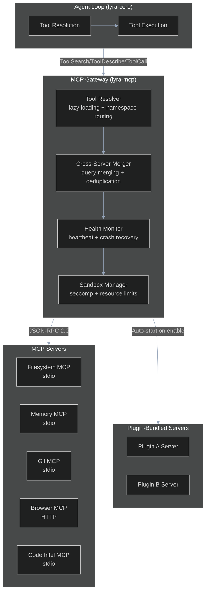
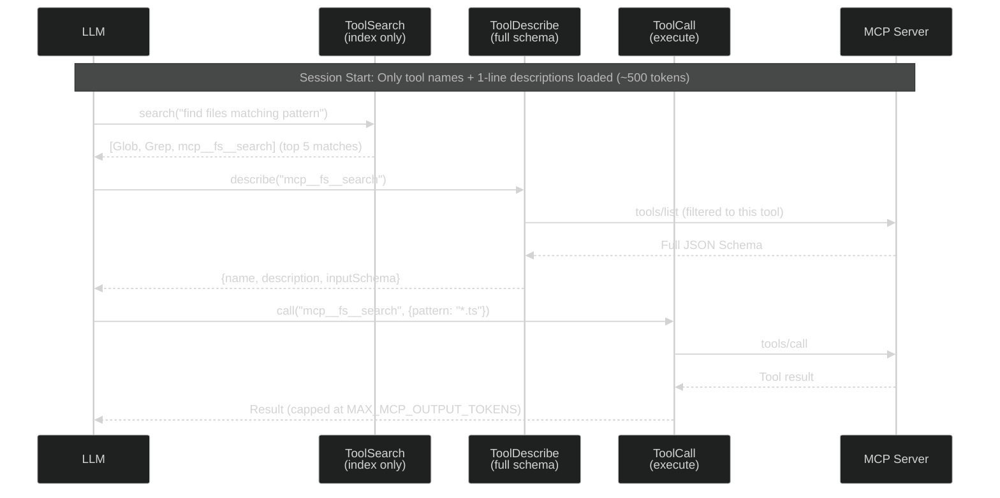
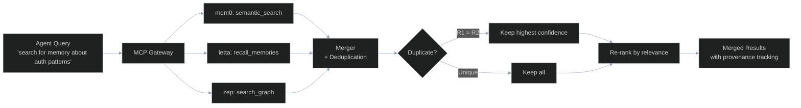
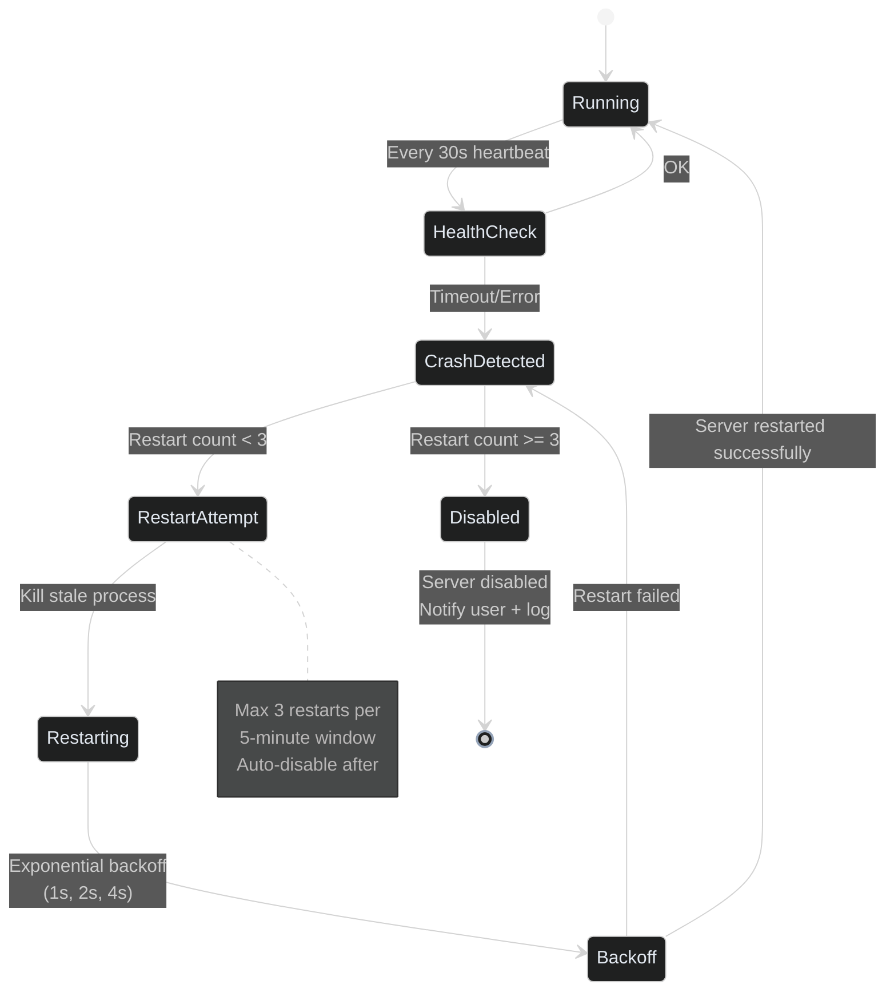
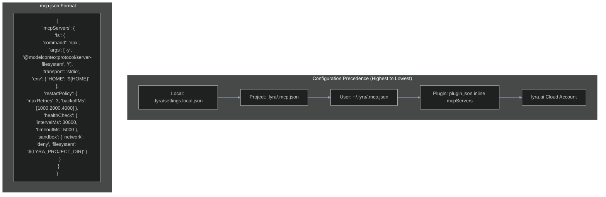

# Workstream 4.7: MCP Integration & Tool Gateway Enhancement Plan

> **Date:** 2026-05-30
> **Status:** PLAN
> **Based on:** STREAM-1 (Claude Code MCP docs, 4 transports, lazy loading), STREAM-3 (top 20 MCP servers to bundle), STREAM-9 (claude-mem MCP integration), harness-plugins.md (plugin MCP bundling)
> **Dependencies:** PLAN-4.2 (Memory Architecture), harness-plugins.md (Plugin System)

---

## 1. Executive Summary

This plan defines Lyra's MCP (Model Context Protocol) integration strategy, transforming Lyra from a closed tool set into an extensible platform that can leverage 1,500+ community MCP servers. The plan defines an MCP gateway with top-20 server bundling, full 4-transport support (stdio, HTTP, SSE, WebSocket), progressive tool disclosure, lazy loading for startup performance, server crash recovery, cross-server query merging, plugin-bundled server auto-start, namespace conventions, health monitoring, and sandbox isolation.

The key insight from STREAM-1 research is that MCP is the **open standard for tool integration** -- Claude Code's entire tool ecosystem is MCP-based, with all 4 transports supported, lazy tool loading via `ToolSearch`, and automatic reconnection with exponential backoff. STREAM-3's analysis of 1,500+ MCP servers confirms this is the highest-leverage integration surface for Lyra.

---

## 2. What Lyra Already Has

Based on the existing architecture audit (docs/architecture/TOOLS-IMPLEMENTATION.md, docs/architecture/TOOLS-SYSTEM.md):

| Capability | Current Status | Source |
|-----------|---------------|--------|
| Tool execution system | Basic tool dispatch in lyra-core | TOOLS-SYSTEM.md |
| Bash, Read, Write, Edit tools | Implemented but inlined (not MCP) | TOOLS-IMPLEMENTATION.md |
| Agent tool (subagent spawning) | Implemented via FleetOrchestrator | agent-swarm.md |
| Plugin system with component directories | Defined contract in adapter layer | harness-plugins.md |
| `.lyra/` configuration directory | Project-scoped config exists | Preliminary architecture |
| MCP client infrastructure | Not implemented | Gap analysis |

### Gaps Identified

- No MCP client protocol implementation (JSON-RPC 2.0, capability negotiation, transport layer)
- No `.mcp.json` configuration support
- No MCP server lifecycle management (start, stop, health check, restart)
- No lazy tool loading or `ToolSearch` pattern
- No plugin-bundled MCP server auto-start
- No MCP tool namespace convention
- No cross-server query merging or deduplication

---

## 3. What Research Reveals as Missing

### 3.1 From STREAM-1: Claude Code MCP Integration (docs/research/STREAM-1-CLAUDE-CODE-DOCS.md, Section 6)

The Claude Code MCP architecture reveals a comprehensive client implementation:

- **4 Transports**: HTTP (streamable-http, recommended), SSE (deprecated but widely deployed), Stdio (local processes), WebSocket (persistent bidirectional)
- **5 Configuration Scopes**: Local > Project > User > Plugin > claude.ai, each with structured `.mcp.json`
- **Lazy Tool Loading**: `ENABLE_TOOL_SEARCH` with deferred (default), threshold mode (auto:N), or upfront loading
- **Dynamic Tool Updates**: `list_changed` notifications for live tool changes without reconnection
- **Automatic Reconnection**: Exponential backoff (1s, 2s, 4s, 8s, 16s, max 5 attempts)
- **Output Management**: Warn at 10K tokens, hard cap at 25K, per-tool override
- **OAuth 2.0**: Full flow with DCR, pre-configured credentials, pinned scopes

**Key tier assessments from STREAM-1:**
| Feature | Tier | Rationale |
|---------|------|-----------|
| MCP client with all 4 transports | S (Breakthrough) | Standard protocol; 1,500+ server ecosystem |
| Lazy tool loading (ToolSearch) | S | Essential for scaling to many tools |
| `.mcp.json` project configuration | S | Simple, shareable, version-controlled |
| Plugin-bundled MCP servers | A (High) | Zero-config tool distribution |

### 3.2 From STREAM-3: Top MCP Servers to Bundle (docs/research/STREAM-3-PAPER-LISTS.md, Section 2.1.4 and Section 4)

STREAM-3 analyzed 1,500+ MCP servers across 60 categories and ranked the top 20 for Lyra bundling:

**Tier 1: Core Infrastructure (Bundle Default)**
| Server | Purpose | Source |
|--------|---------|--------|
| modelcontextprotocol/servers | Official reference implementations (filesystem, git, postgres) | GitHub |
| microsoft/playwright-mcp | Browser automation via accessibility tree snapshots | GitHub |
| context7 | Up-to-date code documentation for LLMs | GitHub |
| mcp-gateway (MikkoParkkola) | Universal MCP gateway, 4 meta-tools replace 100+ registrations | GitHub |
| ViperJuice/mcp-gateway | Meta-server for minimal tool bloat with progressive disclosure | GitHub |

**Tier 2: Memory & Knowledge**
| Server | Purpose |
|--------|---------|
| mem0ai/mem0 | Universal memory layer (AWS SDK default) |
| letta-ai/letta | 3-tier memory architecture (MemGPT successor) |
| getzep/zep | Temporal knowledge graph for agent memory |
| Tencent/TencentDB-Agent-Memory | 4-tier progressive memory, 61% token reduction |

**Tier 3: Code Intelligence**
| Server | Purpose |
|--------|---------|
| DeusData/codebase-memory-mcp | Tree-sitter AST analysis, 120x token reduction |
| MinishLab/semble | Natural-language code search, 98% token reduction |
| Mibayy/token-savior | Symbol-indexed code navigation, 77% token reduction |

**Tier 4: Orchestration**
| Server | Purpose |
|--------|---------|
| Jovancoding/Network-AI | Multi-agent orchestration with shared blackboard, 20+ tools |
| lastmile-ai/mcp-agent | Production-grade MCP agent framework |

**Tier 5: Security & Observability**
| Server | Purpose |
|--------|---------|
| langfuse/langfuse | Self-hosted LLM observability |
| Arize-ai/phoenix | Self-hosted trace UI and eval runtime |

### 3.3 From STREAM-9: claude-mem MCP Integration (docs/research/STREAM-9-MEMORY-CONTEXT-REPOS.md, Section 6)

The claude-mem project demonstrates the MCP server integration pattern for persistent cross-session memory. Key observations:

- Tools are namespaced as `mcp__plugin_claude-mem_mcp-search__search`, `mcp__plugin_claude-mem_mcp-search__get_observations`, etc.
- The 3-layer workflow (search -> timeline -> get_observations) shows progressive disclosure via MCP tools
- ChromaDB-backed vector storage for semantic search
- Tool-use observation capture and re-injection into context

### 3.4 From harness-plugins.md (docs/architecture/harness-plugins.md)

The plugin contract supports MCP server bundling via `plugin.json`:
```json
{
  "mcpServers": {
    "database-tools": {
      "command": "node",
      "args": ["${LYRA_PLUGIN_ROOT}/servers/db-server"],
      "env": { "DB_URL": "${DB_URL}" }
    }
  }
}
```

This pattern must be extended with Lyra-specific path placeholders (`${LYRA_PLUGIN_ROOT}`, `${LYRA_PLUGIN_DATA}`) and auto-start semantics.

---

## 4. Proposed Enhancements (Ranked by Impact x Effort)

```
HIGH IMPACT, LOW EFFORT (Do First)
  1. MCP client protocol (JSON-RPC 2.0 + stdio transport)
  2. `.mcp.json` project configuration with scope hierarchy
  3. MCP tool namespace convention (mcp__server__tool)
  4. Top-5 MCP servers bundled by default

HIGH IMPACT, MEDIUM EFFORT (Do Next)
  5. Lazy MCP tool loading with ToolSearch/ToolDescribe/ToolCall bridge
  6. MCP gateway with cross-server query merging and deduplication
  7. Server crash recovery (auto-restart, max 3 restarts then disable)
  8. Plugin-bundled MCP servers auto-started on enable

MEDIUM IMPACT, MEDIUM EFFORT (Do When Convenient)
  9. HTTP/SSE/WebSocket transport support (beyond stdio)
 10. Server health monitoring dashboard

MEDIUM IMPACT, HIGH EFFORT (Defer)
 11. MCP server sandbox (seccomp isolation per server)
 12. OAuth 2.0 flow for remote MCP servers
```

---

## 5. Architecture

### 5.1 System Overview



### 5.2 Lazy Tool Loading Architecture

The `ToolSearch -> ToolDescribe -> ToolCall` bridge is the core innovation for scaling to many tools without context window bloat:



**Context budget model:**
| Phase | Tools in Context | Token Cost |
|-------|-----------------|------------|
| Session start (lazy, threshold mode) | 0 tool schemas, only ToolSearch | ~100 tokens |
| After first ToolSearch | 0 tool schemas (results are ephemeral) | ~200 tokens |
| After ToolDescribe | 1 full schema in context | ~300 tokens |
| Traditional (all tools upfront) | 300+ tool schemas | ~15,000+ tokens |

Token savings: ~98% at session start for MCP tools.

### 5.3 MCP Gateway with Cross-Server Query Merging



The gateway pattern (informed by MikkoParkkola/mcp-gateway and ViperJuice/mcp-gateway from STREAM-3) uses 4 meta-tools:

1. **mcp__gateway__search** -- searches across all connected servers
2. **mcp__gateway__describe** -- gets full details for a specific tool
3. **mcp__gateway__call** -- routes call to correct server
4. **mcp__gateway__merge** -- merges results from multiple servers with deduplication

### 5.4 Server Crash Recovery



### 5.5 Configuration Architecture



---

## 6. Core Interfaces (Python/Rust Dataclasses)

### 6.1 MCP Client Protocol

```python
# lyra-mcp/protocol.py
from dataclasses import dataclass, field
from enum import Enum
from typing import Any, Optional

class MCPTransport(str, Enum):
    STDIO = "stdio"
    HTTP = "http"          # streamable-http (recommended)
    SSE = "sse"            # deprecated but widely deployed
    WEBSOCKET = "ws"       # persistent bidirectional

class MCPCapability(str, Enum):
    TOOLS = "tools"
    RESOURCES = "resources"
    PROMPTS = "prompts"
    LOGGING = "logging"
    ELICITATION = "elicitation"

@dataclass
class MCPServerConfig:
    """Configuration for a single MCP server."""
    name: str
    command: str                                    # Executable or URL
    args: list[str] = field(default_factory=list)
    env: dict[str, str] = field(default_factory=dict)
    transport: MCPTransport = MCPTransport.STDIO
    capabilities: list[MCPCapability] = field(default_factory=list)
    
    # Lifecycle
    autoStart: bool = True                          # Start at session init
    restartPolicy: Optional["RestartPolicy"] = None
    healthCheck: Optional["HealthCheck"] = None
    sandbox: Optional["SandboxConfig"] = None
    
    # Output limits (from STREAM-1 MCP docs)
    maxOutputTokens: int = 25_000                   # Hard cap
    warnOutputTokens: int = 10_000                  # Warning threshold

@dataclass
class RestartPolicy:
    maxRetries: int = 3
    backoffMs: list[int] = field(default_factory=lambda: [1000, 2000, 4000, 8000, 16000])
    resetWindowMs: int = 300_000                    # 5 minutes

@dataclass
class HealthCheck:
    intervalMs: int = 30_000                        # Check every 30s
    timeoutMs: int = 5_000                          # 5s timeout
    method: str = "tools/list"                      # RPC method to use as health check

@dataclass
class SandboxConfig:
    network: str = "deny"                           # deny | allow | allowlist
    filesystem: str = "${LYRA_PROJECT_DIR}"         # Path restriction
    cpuLimitSec: int = 30                           # Max CPU seconds
    memoryLimitMb: int = 512                        # Max memory
    seccompProfile: str = "default"                 # Seccomp profile name
```

### 6.2 MCP Gateway

```python
# lyra-mcp/gateway.py
from dataclasses import dataclass, field
from typing import Any, Protocol, runtime_checkable

@dataclass
class ToolIndexEntry:
    """Lightweight tool entry for lazy loading. Only this is in context."""
    name: str                                       # mcp__filesystem__search
    server: str                                     # filesystem
    shortDescription: str                           # "Search files by pattern" (1 line)
    capabilities: list[str] = field(default_factory=list)
    estimatedLatencyMs: int = 100                   # For routing decisions

@dataclass
class ToolSearchResult:
    entries: list[ToolIndexEntry]
    totalAvailable: int                             # Total tools across all servers
    searchLatencyMs: float

@dataclass
class MergedToolResult:
    results: list[dict[str, Any]]
    sources: list[str]                              # Which servers contributed
    dedupCount: int                                 # How many duplicates removed
    mergeMethod: str                                # "rrf" | "voting" | "first_wins"
    confidenceScores: list[float]

@runtime_checkable
class MCPGateway(Protocol):
    """MCP Gateway contract. Implementations route to connected servers."""
    
    async def connect(self, config: MCPServerConfig) -> str:
        """Connect to an MCP server. Returns server_id."""
        ...
    
    async def disconnect(self, server_id: str) -> None:
        """Disconnect and clean up an MCP server."""
        ...
    
    async def search_tools(self, query: str, limit: int = 10) -> ToolSearchResult:
        """ToolSearch: Find tools by description query. Returns index entries only."""
        ...
    
    async def describe_tool(self, tool_name: str) -> dict[str, Any]:
        """ToolDescribe: Get full JSON Schema for a specific tool."""
        ...
    
    async def call_tool(self, tool_name: str, arguments: dict) -> Any:
        """ToolCall: Execute a tool on the appropriate server."""
        ...
    
    async def merge_queries(self, query: str, servers: list[str]) -> MergedToolResult:
        """Cross-server query merging with deduplication."""
        ...
    
    async def health_check(self, server_id: str) -> bool:
        """Check if a server is alive and responsive."""
        ...
    
    def list_servers(self) -> list[dict[str, Any]]:
        """Return status of all connected servers."""
        ...
```

### 6.3 Server Lifecycle Manager

```python
# lyra-mcp/lifecycle.py
from enum import Enum

class ServerState(str, Enum):
    STARTING = "starting"
    RUNNING = "running"
    DEGRADED = "degraded"           # Responding but slow
    UNHEALTHY = "unhealthy"         # Failed health check
    RESTARTING = "restarting"       # In backoff cycle
    DISABLED = "disabled"           # Exceeded max restarts
    STOPPED = "stopped"

@dataclass
class ServerLifecycle:
    server_id: str
    config: MCPServerConfig
    state: ServerState = ServerState.STARTING
    restartCount: int = 0
    lastRestartAt: Optional[float] = None
    uptimeMs: int = 0
    totalCalls: int = 0
    totalErrors: int = 0
    avgLatencyMs: float = 0.0
    lastError: Optional[str] = None

    def should_restart(self) -> bool:
        """Check if restart is allowed under current policy."""
        if self.config.restartPolicy is None:
            return False
        # Reset counter if window has elapsed
        window = self.config.restartPolicy.resetWindowMs
        if self.lastRestartAt and (time.time() * 1000 - self.lastRestartAt) > window:
            self.restartCount = 0
        return self.restartCount < self.config.restartPolicy.maxRetries
    
    def next_backoff_ms(self) -> int:
        """Get next backoff delay based on retry count."""
        if self.config.restartPolicy is None:
            return 0
        idx = min(self.restartCount, len(self.config.restartPolicy.backoffMs) - 1)
        return self.config.restartPolicy.backoffMs[idx]
```

---

## 7. Implementation Phases

### Phase 1: Foundation -- MCP Client Protocol (Weeks 1-2)

**Goal:** Basic MCP client that can connect to stdio-based servers and expose tools to the agent loop.

| Task | Effort | Dependencies |
|------|--------|-------------|
| 1.1 Implement JSON-RPC 2.0 message framing, request/response correlation, notification handling | 3 days | None |
| 1.2 Implement stdio transport (subprocess spawn, stdin/stdout JSON-lines, graceful shutdown) | 2 days | 1.1 |
| 1.3 Implement capability negotiation (`initialize` -> capabilities -> `initialized` notification) | 1 day | 1.1 |
| 1.4 Implement `tools/list` discovery and `tools/call` execution | 2 days | 1.2, 1.3 |
| 1.5 Implement `.mcp.json` configuration loading with scope hierarchy (local > project > user > plugin) | 1 day | 1.4 |
| 1.6 Implement MCP tool namespace convention (`mcp__server__tool`) with collision detection | 1 day | 1.4 |
| 1.7 Write integration tests against modelcontextprotocol/servers reference implementations | 2 days | 1.5, 1.6 |

**Deliverable:** Lyra agents can use tools from any stdio-based MCP server via `.mcp.json` configuration.

### Phase 2: Lazy Loading + Gateway (Weeks 3-4)

**Goal:** ToolSearch/ToolDescribe/ToolCall bridge, reducing startup context from 15K+ to <500 tokens for MCP tools.

| Task | Effort | Dependencies |
|------|--------|-------------|
| 2.1 Build `ToolIndex` -- lightweight name+description registry, server-side caching | 2 days | Phase 1 |
| 2.2 Implement `ToolSearch` -- semantic/BM25 search over tool index | 3 days | 2.1 |
| 2.3 Implement `ToolDescribe` -- lazy full-schema fetch on demand | 1 day | 2.2 |
| 2.4 Implement `ToolCall` bridge -- route to correct server, enforce output caps | 2 days | 2.3 |
| 2.5 Implement threshold mode (`auto:N`): only switch to full loading at N% context usage | 1 day | 2.4 |
| 2.6 Implement MCP Gateway with 4 meta-tools (search, describe, call, merge) | 3 days | 2.5 |
| 2.7 Implement cross-server query merging with RRF deduplication (informed by TencentDB from STREAM-9) | 2 days | 2.6 |

**Deliverable:** Lazy tool loading saves ~98% of startup token cost. Gateway provides unified query surface across servers.

### Phase 3: Resilience + Plugins (Weeks 5-6)

**Goal:** Crash recovery, health monitoring, and plugin-bundled MCP auto-start.

| Task | Effort | Dependencies |
|------|--------|-------------|
| 3.1 Implement server heartbeat (30s interval, `tools/list` or `ping` method) | 1 day | Phase 2 |
| 3.2 Implement crash recovery: detect dead process, auto-restart with exponential backoff, max 3 retries | 2 days | 3.1 |
| 3.3 Implement `DISABLED` state transition and user notification on permanent failure | 1 day | 3.2 |
| 3.4 Implement `list_changed` notification handler for dynamic tool updates | 1 day | Phase 2 |
| 3.5 Implement plugin-bundled MCP server auto-start on plugin enable | 2 days | Phase 2 (gateway) |
| 3.6 Implement `${LYRA_PLUGIN_ROOT}` and `${LYRA_PLUGIN_DATA}` path resolution | 1 day | 3.5 |
| 3.7 Write resilience tests (kill server mid-call, verify restart + retry succeeds) | 2 days | 3.2-3.6 |

**Deliverable:** MCP servers auto-recover from crashes. Plugin-bundled servers activate on plugin enable.

### Phase 4: Advanced Transports + Security (Weeks 7-8)

**Goal:** HTTP/SSE/WebSocket transports, sandbox isolation.

| Task | Effort | Dependencies |
|------|--------|-------------|
| 4.1 Implement HTTP (streamable-http) transport with automatic reconnection and backoff | 3 days | Phase 2 |
| 4.2 Implement WebSocket transport for persistent bidirectional communication | 2 days | 4.1 |
| 4.3 Implement SSE transport (deprecated, for backward compatibility) | 1 day | 4.1 |
| 4.4 Implement MCP server sandbox: seccomp profile per server, filesystem allowlisting, network deny/allow | 3 days | Phase 3 |
| 4.5 Implement output token cap enforcement (warn at 10K, hard cap 25K, per-tool override) | 1 day | Phase 2 |
| 4.6 Implement OAuth 2.0 flow for remote MCP servers (DCR, credential storage) | 2 days | 4.1 |
| 4.7 Build health monitoring dashboard (TUI widget showing server status, latency, error rates) | 2 days | Phase 3 |
| 4.8 Write security audit tests (sandbox escape attempts, token cap bypass, namespace collision) | 2 days | 4.4-4.7 |

**Deliverable:** Full 4-transport support. Sandboxed MCP servers. Health monitoring dashboard.

### Phase 5: Bundling + Polish (Weeks 9-10)

**Goal:** Bundle top-20 MCP servers, QA, documentation.

| Task | Effort | Dependencies |
|------|--------|-------------|
| 5.1 Bundle Tier 1 servers as default (modelcontextprotocol/servers, playwright-mcp, context7, mcp-gateway) | 2 days | Phase 4 |
| 5.2 Bundle Tier 2-5 servers as optional plugin packs (memory, code intelligence, orchestration, security) | 3 days | 5.1 |
| 5.3 Create "MCP Server Quickstart" plugin that bundles 5 most-used servers with zero config | 1 day | 5.2 |
| 5.4 Write comprehensive MCP integration tests (50+ test cases across all transports) | 2 days | Phase 4 |
| 5.5 Performance benchmarks (tool discovery latency, parallel call throughput, lazy loading token savings) | 1 day | 5.4 |
| 5.6 Write user-facing documentation (`/mcp` command, configuration guide, server development guide) | 1 day | 5.5 |

**Deliverable:** 20+ MCP servers bundled out of the box. Lyra is a first-class MCP platform.

---

## 8. Key Design Decisions

### 8.1 Why the Gateway Pattern Instead of Direct MCP Calls

| Approach | Pros | Cons |
|----------|------|------|
| Direct MCP calls | Simpler implementation | No dedup, no merge, no unified ToolSearch |
| **Gateway with meta-tools** | Unified surface, cross-server merge, lazy loading | Additional abstraction layer |

**Decision:** Gateway. The token savings from lazy loading (98% reduction) and the UX benefit of cross-server search outweigh the abstraction cost.

### 8.2 MCP Tool Naming Convention

Lyra will use the Claude Code convention: `mcp__server__tool`. This ensures:
- No collisions with built-in Lyra tools (Bash, Read, Edit, Write, etc.)
- Clear provenance (which server provided this tool)
- Compatible with the existing MCP ecosystem convention
- Pattern-matchable for permissions: `mcp__memory__*` (all memory tools)

### 8.3 Lazy Loading Strategy

Default: `ENABLE_TOOL_SEARCH=auto:10` (threshold mode at 10% context usage). This means:
- Sessions under 10% context usage: lazy loading active, ToolSearch only
- Sessions above 10% context usage: switch to full loading (all tool schemas in context)
- Users can force-eager with `ENABLE_TOOL_SEARCH=false`
- Users can force-always-lazy with `ENABLE_TOOL_SEARCH=true`

### 8.4 Server Crash Recovery Policy

```
Max 3 restarts per 5-minute window
Backoff: 1s -> 2s -> 4s -> 8s -> 16s (matches Claude Code behavior from STREAM-1)
After 3rd failure within window: DISABLED with user notification
Window resets after 5 minutes of stability
```

---

## 9. Success Metrics

| Metric | Current | Target | Measurement |
|--------|---------|--------|-------------|
| MCP tools available | 0 | 200+ (across 20 bundled servers) | `lyra mcp list --count` |
| Startup tokens for tools | N/A | <500 tokens for MCP tools (lazy) | Context window measurement |
| Tool discovery latency | N/A | <100ms for ToolSearch | P95 latency |
| Server crash recovery rate | N/A | 95%+ of crashes auto-recovered | Crash injection tests |
| Cross-server query dedup rate | N/A | 30%+ reduction in duplicate results | RRF benchmark |
| Plugin MCP auto-start reliability | N/A | 100% on enable, 0% false starts | Integration tests |

---

## 10. References

### Primary Research Sources
1. **STREAM-1-CLAUDE-CODE-DOCS.md** (Section 6: MCP Integration) -- 4 transports, lazy loading, `.mcp.json` configuration, scope hierarchy, auto-reconnection, OAuth 2.0. `/docs/research/STREAM-1-CLAUDE-CODE-DOCS.md`
2. **STREAM-3-PAPER-LISTS.md** (Section 4: MCP Servers Worth Bundling) -- Top 20 MCP servers ranked by category and impact. `/docs/research/STREAM-3-PAPER-LISTS.md`
3. **STREAM-9-MEMORY-CONTEXT-REPOS.md** (Section 6: claude-mem) -- MCP integration pattern with 3-layer workflow, namespace convention. `/docs/research/STREAM-9-MEMORY-CONTEXT-REPOS.md`

### Architecture References
4. **harness-plugins.md** -- Plugin MCP server bundling pattern, path placeholders. `/docs/architecture/harness-plugins.md`
5. **TOOLS-SYSTEM.md** -- Existing tool execution system. `/docs/architecture/TOOLS-SYSTEM.md`
6. **TOOLS-IMPLEMENTATION.md** -- Current tool implementation status. `/docs/architecture/TOOLS-IMPLEMENTATION.md`

### Key External References
7. **Claude Code MCP Docs** -- https://code.claude.com/docs/en/mcp
8. **MCP Specification** -- https://modelcontextprotocol.io/specification
9. **mcp-gateway (MikkoParkkola)** -- https://github.com/MikkoParkkola/mcp-gateway
10. **mcp-gateway (ViperJuice)** -- https://github.com/ViperJuice/mcp-gateway
11. **awesome-mcp-servers** (punkpeye) -- https://github.com/punkpeye/awesome-mcp-servers (1,500+ servers)
12. **claude-mem MCP Plugin** -- Tool observation capture + ChromaDB integration pattern

### Key Metrics from Research
- MCP ecosystem: 1,500+ community servers across 60+ categories (STREAM-3)
- Claude Code: 4 transports, 5 config scopes, exponential backoff reconnection (STREAM-1)
- Lazy loading token savings: ~98% at session start for MCP tools (STREAM-1, Section 6)
- TencentDB Agent Memory: 61% token reduction with symbolic compression (STREAM-9)
- codebase-memory-mcp: 120x token reduction on code navigation (STREAM-3)

---

*Plan status: AWAITING REVIEW. Dependencies: Phase 1 can begin immediately (no blocking deps). Phase 2 requires PLAN-4.2 (Memory Architecture) for memory server integration.*
