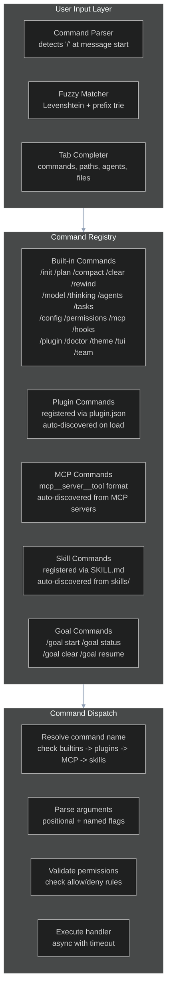
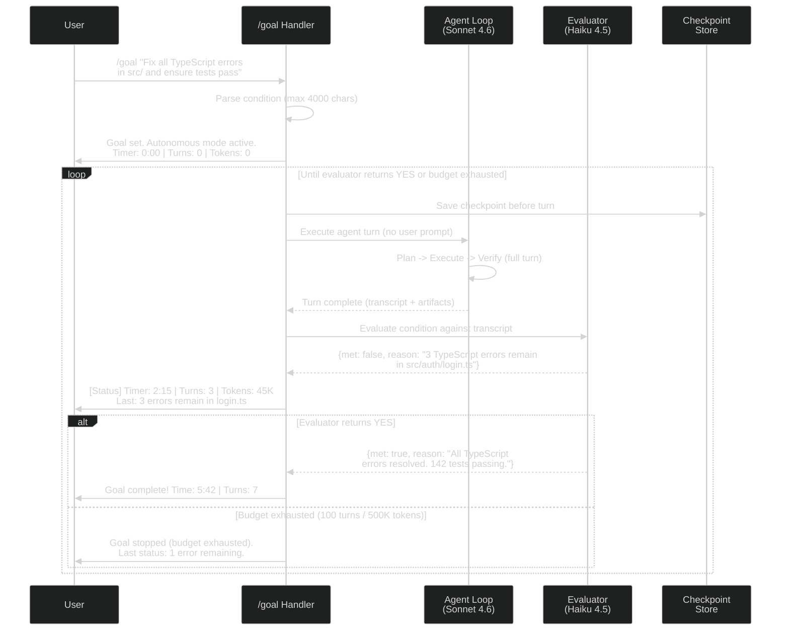
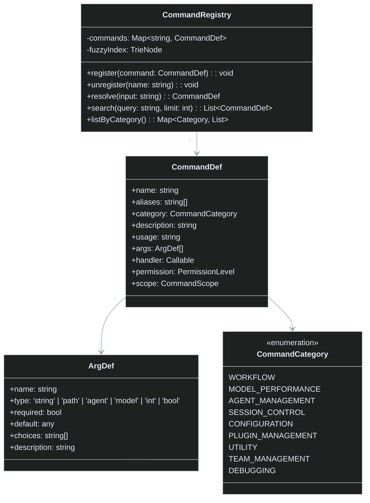

# Workstream 4.8: Commands & Interactive Mode Enhancement Plan

> **Date:** 2026-05-30
> **Status:** PLAN
> **Based on:** STREAM-1 (Slash commands, goal system, interactive mode, 34-tool catalog), STREAM-8 (Keybindings, tmux 64-command model, cmux inline agents), PLAN-4.1 (25 themes, 80+ keybindings), UI-UX-SYSTEM.md (Textual TUI, rich interactions)
> **Dependencies:** PLAN-4.1 (UI/UX), PLAN-4.10 (Sessions)

---

## 1. Executive Summary

This plan defines Lyra's command and interactive mode surface -- the slash command system, goal-based autonomous execution loop, interactive REPL, command palette with fuzzy search, keyboard shortcut system (80+ bindings across 6 contexts), status line with real-time metrics, command history with search/replay, tab completion, inline help system, and batch/script mode for headless execution.

The key insight from STREAM-1 is that commands are recognized only at the **start of a message**, with text after the command name passed as arguments. Claude Code's 27 slash commands span workflow (`/plan`, `/compact`), model/routing (`/model`, `/thinking`), agent management (`/agents`, `/tasks`), session control (`/clear`, `/rewind`), configuration (`/config`, `/permissions`, `/mcp`), and plugin management (`/plugin install`, `/reload-plugins`). STREAM-8 reveals tmux's 64-command model as the gold standard for terminal command surfaces.

---

## 2. What Lyra Already Has

Based on the existing architecture audit (PLAN-4.1-UI-UX.md, UI-UX-SYSTEM.md, STREAM-8):

| Capability | Current Status | Source |
|-----------|---------------|--------|
| Basic CLI with command dispatch | Implemented in lyra-cli | CLI package |
| Keybinding system (6 contexts proposed) | Partially implemented | PLAN-4.1 |
| Color theme system (25 themes) | Proposed, OKLCH engine defined | PLAN-4.1, UI-UX-SYSTEM.md |
| Keyboard shortcuts | Basic shortcuts only | PLAN-4.1 |
| Autocomplete / suggestions | Not implemented | Gap |
| Command palette (/ menu) | Not implemented | Gap |
| Goal-based autonomous execution | Not implemented | Gap |
| Status line with metrics | Not implemented | Gap |

### Gaps Identified

- No slash command system with fuzzy filtering and argument passing
- No goal-based autonomous execution loop with evaluator model
- No interactive REPL (current mode is one-shot prompts)
- No command palette with discoverable command registry
- No keyboard shortcut system with context-aware bindings
- No status line with real-time agent/fleet metrics
- No command history with search and replay
- No tab completion for commands, paths, agent names
- No inline help system with contextual suggestions
- No batch/headless script execution mode

---

## 3. What Research Reveals as Missing

### 3.1 From STREAM-1: Interactive Mode & Commands (docs/research/STREAM-1-CLAUDE-CODE-DOCS.md, Sections 7, 8)

**Interactive Mode features to adopt:**
| Feature | Tier | Description |
|---------|------|-------------|
| `/` command palette with fuzzy filter | S (Breakthrough) | Universal command discovery pattern |
| `!` shell mode (direct exec + context injection) | A (High) | Clean separation of shell vs agent |
| `@` file mention with autocomplete | A | Natural file reference UX |
| `/btw` side questions (ephemeral, cache-reusing) | A | Cheap Q&A without context pollution |
| Full keyboard shortcut matrix | A | Terminal UX baseline |
| Vim keybindings for prompt editing | B (Medium) | Power user feature |
| Prompt suggestions from git history | B | Smart defaults |
| Session recap on return | B | UX quality-of-life |

**Command architecture to adopt:**
| Command | Category | Tier |
|---------|----------|------|
| `/init` | Workflow | A |
| `/plan` (plan-mode before coding) | Workflow | A |
| `/compact` (context compression) | Workflow | A |
| `/clear` | Session | A |
| `/rewind` (checkpoint restore) | Session | A |
| `/model` | Model/Performance | A |
| `/thinking` | Model/Performance | B |
| `/agents` | Agent Management | A |
| `/tasks` | Agent Management | B |
| `/batch` (parallel worktree) | Parallel | B |
| `/config` | Configuration | B |
| `/permissions` | Configuration | A |
| `/mcp` | Configuration | A |
| `/hooks` | Configuration | A |
| `/plugin install/list/uninstall` | Plugin | A |
| `/doctor` | Utility | B |
| `/theme` | Utility | B |
| `/tui` | Utility | B |
| `/team` | Team Management | A |

### 3.2 Goal System Architecture (From STREAM-1, Section 3)

The goal system is a **session-scoped autonomous execution loop** using a separate evaluator model:

```
1. User sets goal with `/goal` command + condition (up to 4,000 characters)
2. Claude works autonomously across turns (no per-turn user prompts needed)
3. After each turn, small fast model (Haiku) evaluates condition against transcript
4. Evaluator returns: {yes/no} + reason
5. If yes: goal complete, session stops
6. If no: continues to next turn
7. Status display: timer, turn count, token spend, evaluator reason
8. Resume: active goals restored on `--resume`/`--continue`
9. Non-interactive: works with `-p` flag for headless execution
```

**Key insight from STREAM-1 (S-Tier):** "Separate evaluator model for goal completion -- cheap model watches expensive model." This generalizes to code review, test validation, and any boolean completion check.

### 3.3 From STREAM-8: Terminal Multiplexer Command Model (docs/research/STREAM-8-TERMINAL-MULTIPLEXERS.md)

tmux provides the architectural blueprint with 64 commands organized by object hierarchy:
- **Session commands**: `new-session`, `attach-session`, `detach-client`, `kill-session`, `rename-session`
- **Window commands**: `new-window`, `select-window`, `kill-window`, `rename-window`
- **Pane commands**: `split-window`, `kill-pane`, `select-pane`, `resize-pane`, `swap-pane`
- **Buffer commands**: `list-buffers`, `choose-buffer`, `copy-mode`
- **Management**: `list-commands`, `list-keys`, `display-message`, `source-file`

Each command is a separate file (`cmd-new-session.c`, `cmd-split-window.c`) with a common argument parser supporting boolean flags, string options, and target specifiers. This pattern is directly portable to Lyra's TypeScript CLI as a directory of command modules.

### 3.4 From PLAN-4.1: Keybinding & Theme Foundation (docs/research/PLAN-4.1-UI-UX.md)

PLAN-4.1 defines 6 keyboard contexts already:
1. **Global** -- Quit, help, theme switch, session management
2. **Chat** -- Send, edit, history navigation, multi-line input
3. **Agent View** -- Agent selection, status, spawn, terminate
4. **File Browser** -- Navigate, select, preview, diff
5. **Diff View** -- Accept/reject hunks, navigate changes
6. **Research View** -- Navigate sources, expand/collapse, cite

And 80+ keybindings across categories: Navigation (20+), Editing (15+), Agent Control (15+), View Management (10+), Quick Actions (10+), Research (10+).

---

## 4. Proposed Enhancements (Ranked by Impact x Effort)

```
HIGH IMPACT, LOW EFFORT (Do First)
  1. Slash command system with registry and fuzzy filtering
  2. Tab completion for commands, file paths, and agent names
  3. Command history with reverse search (Ctrl+R) and replay
  4. Status line with real-time metrics (token usage, agent status)

HIGH IMPACT, MEDIUM EFFORT (Do Next)
  5. Goal-based autonomous execution loop (/goal with evaluator model)
  6. Interactive REPL with syntax highlighting and autocomplete
  7. Command palette with fuzzy search and categorization
  8. Inline help system (/help with contextual suggestions)

MEDIUM IMPACT, MEDIUM EFFORT (Do When Convenient)
  9. Keyboard shortcut system (80+ bindings, 6 contexts, configurable)
 10. Batch/script mode for headless execution (-p flag, --goal flag)

MEDIUM IMPACT, HIGH EFFORT (Defer)
 11. `/btw` side questions (ephemeral chat with cache reuse)
 12. Prompt suggestions from command history (ghost text)
```

---

## 5. Architecture

### 5.1 Command System Overview



### 5.2 Goal-Based Autonomous Execution Loop



**Evaluator model specification (from STREAM-1):**
| Parameter | Recommended Value | Rationale |
|-----------|------------------|-----------|
| Model | Haiku 4.5 (or equivalent fast model) | Cheap, fast; 90% of Sonnet quality at 3x cost savings |
| Context | Transcript of last turn + original goal condition | Minimal context for binary decision |
| Output format | `{met: boolean, reason: string}` | Structured, machine-parsable |
| Fallback | After 3 evaluator failures, stop with error | Prevent infinite loops on evaluator crash |

### 5.3 Interactive REPL Architecture

```mermaid
%%{init: {'theme': 'dark', 'themeVariables': { 'primaryColor': '#8b5cf6', 'primaryTextColor': '#e2e8f0', 'lineColor': '#94a3b8', 'secondaryColor': '#1e293b', 'tertiaryColor': '#0d1117'}}}%%
graph TB
    subgraph REPL["Interactive REPL Loop"]
        PROMPT[Display Prompt<br/>lyra> _]
        READLINE[Readline Engine<br/>syntax highlighting<br/>autocomplete<br/>vim/emacs modes]
        PARSE_LINE[Parse Input Line<br/>command | shell | agent message]
        DISPATCH[Dispatch<br/>to command handler<br/>or agent loop]
        OUTPUT[Render Output<br/>styled TUI<br/>streaming agent responses]
    end

    subgraph Readline["Readline Features"]
        HL[Syntax Highlighting<br/>commands in purple<br/>paths in cyan<br/>strings in green]
        AC[Autocomplete<br/>Tab: commands<br/>Shift+Tab: file paths<br/>Ctrl+Space: agent names]
        VIM[Vim Mode<br/>Normal/Insert/Visual<br/>hjkl, w, e, b<br/>dd, yy, p, u, .]
        GHOST[Ghost Text<br/>grayed-out suggestions<br/>from history + git]
    end

    subgraph StatusLine["Status Line (Bottom)"]
        TOKENS["Tokens: 24.5K/200K"]
        AGENTS["Agents: 2 active (3 idle)"]
        GOAL["Goal: TypeScript fixes (5/7 turns)"]
        MODE["Mode: plan | auto | default"]
        CLOCK["15:42:03"]
    end

    PROMPT --> READLINE
    READLINE --> Readline
    READLINE --> PARSE_LINE
    PARSE_LINE --> DISPATCH
    DISPATCH --> OUTPUT
    OUTPUT --> StatusLine
    StatusLine --> PROMPT
```

### 5.4 Command Registry Architecture



---

## 6. Core Interfaces (Python/Rust Dataclasses)

### 6.1 Command System

```python
# lyra-cli/commands/registry.py
from dataclasses import dataclass, field
from enum import Enum
from typing import Any, Callable, Optional

class CommandCategory(str, Enum):
    WORKFLOW = "workflow"
    MODEL_PERFORMANCE = "model_performance"
    AGENT_MANAGEMENT = "agent_management"
    SESSION_CONTROL = "session_control"
    CONFIGURATION = "configuration"
    PLUGIN_MANAGEMENT = "plugin_management"
    UTILITY = "utility"
    TEAM_MANAGEMENT = "team_management"
    DEBUGGING = "debugging"
    FLEET = "fleet"

class CommandScope(str, Enum):
    SESSION = "session"       # Active only during current session
    PERSISTENT = "persistent" # Survives across sessions
    PROJECT = "project"       # Scoped to current project
    USER = "user"             # Scoped to user config

@dataclass
class ArgDef:
    name: str
    type: str = "string"      # string | path | agent | model | int | bool
    required: bool = False
    default: Any = None
    choices: list[str] = field(default_factory=list)
    description: str = ""
    positional: bool = True

@dataclass
class CommandDef:
    name: str
    category: CommandCategory
    description: str
    usage: str                # e.g., "/model <name>"
    args: list[ArgDef] = field(default_factory=list)
    aliases: list[str] = field(default_factory=list)
    handler: Optional[Callable] = None
    permission: str = "default"  # default | admin | always_allowed
    scope: CommandScope = CommandScope.SESSION
    hidden: bool = False      # Hide from /help but still usable
    
    def format_help(self) -> str:
        """Generate help text for this command."""
        lines = [f"/{self.name} -- {self.description}"]
        lines.append(f"  Usage: {self.usage}")
        for arg in self.args:
            req = "(required)" if arg.required else "(optional)"
            lines.append(f"  {arg.name}: {arg.type} {req} -- {arg.description}")
        if self.aliases:
            lines.append(f"  Aliases: {', '.join('/' + a for a in self.aliases)}")
        return "\n".join(lines)

@dataclass
class CommandMatch:
    command: CommandDef
    score: float              # Fuzzy match score (0-1)
    matchedAlias: Optional[str] = None

@dataclass
class ParseResult:
    command: CommandDef
    parsed_args: dict[str, Any]
    raw_input: str
    errors: list[str] = field(default_factory=list)
```

### 6.2 Goal System

```python
# lyra-cli/goal.py
from dataclasses import dataclass, field
from enum import Enum
from typing import Optional
import time

class GoalState(str, Enum):
    ACTIVE = "active"
    PAUSED = "paused"
    COMPLETED = "completed"
    FAILED = "failed"           # Budget exhausted or evaluator error
    CANCELLED = "cancelled"     # User stopped

@dataclass
class Goal:
    condition: str              # Up to 4000 characters
    state: GoalState = GoalState.ACTIVE
    turns_completed: int = 0
    tokens_spent: int = 0
    started_at: float = field(default_factory=time.time)
    completed_at: Optional[float] = None
    last_evaluator_reason: Optional[str] = None
    
    # Budget constraints
    max_turns: int = 100
    max_tokens: int = 500_000
    max_duration_seconds: int = 3600  # 1 hour
    
    # Evaluator config
    evaluator_model: str = "haiku"
    evaluator_temperature: float = 0.0  # Deterministic evaluation
    
    def status_line(self) -> str:
        """Format status for the status bar."""
        elapsed = time.time() - self.started_at
        elapsed_str = f"{int(elapsed // 60)}:{int(elapsed % 60):02d}"
        return (f"Goal: {self.condition[:60]}... | "
                f"Time: {elapsed_str} | "
                f"Turns: {self.turns_completed}/{self.max_turns} | "
                f"Tokens: {self.tokens_spent:,}/{self.max_tokens:,}")

@dataclass
class EvaluatorResult:
    met: bool
    reason: str
    confidence: float = 1.0
    suggestions: list[str] = field(default_factory=list)
    # If not met, what remains to be done?

class GoalManager:
    """Manages goal lifecycle and evaluator interaction."""
    
    async def set_goal(self, condition: str, **kwargs) -> Goal:
        """Create and activate a new goal."""
        ...
    
    async def evaluate(self, goal: Goal, transcript: str) -> EvaluatorResult:
        """Run evaluator model against transcript. Returns yes/no + reason."""
        ...
    
    async def pause(self) -> None:
        """Pause goal execution (user requested)."""
        ...
    
    async def resume(self) -> Goal:
        """Resume a paused or restored goal."""
        ...
    
    async def clear(self) -> None:
        """Cancel active goal."""
        ...
    
    def get_status(self) -> Optional[Goal]:
        """Get current active goal."""
        ...
```

### 6.3 Keyboard Shortcut System

```python
# lyra-cli/keybindings.py
from dataclasses import dataclass, field
from enum import Enum

class KeyContext(str, Enum):
    GLOBAL = "global"
    CHAT = "chat"
    AGENT_VIEW = "agent_view"
    FILE_BROWSER = "file_browser"
    DIFF_VIEW = "diff_view"
    RESEARCH_VIEW = "research_view"

@dataclass
class KeyBinding:
    key: str                  # "Ctrl+C", "Alt+P", "Esc+Esc", etc.
    command: str              # Command name or inline action
    context: KeyContext
    description: str
    args: dict = field(default_factory=dict)
    condition: Optional[str] = None  # Optional condition (e.g., "text_selected")

@dataclass
class Keymap:
    name: str                 # "default", "vim", "emacs"
    bindings: dict[KeyContext, list[KeyBinding]] = field(default_factory=dict)
    
    def resolve(self, key: str, context: KeyContext) -> Optional[KeyBinding]:
        """Find binding for key+context combination."""
        ...
    
    def list_context(self, context: KeyContext) -> list[KeyBinding]:
        """List all bindings for a given context."""
        ...

# Default keymap (from STREAM-1 and PLAN-4.1):
DEFAULT_KEYMAP = {
    KeyContext.GLOBAL: [
        KeyBinding("Ctrl+C", "interrupt_or_clear", KeyContext.GLOBAL, "Interrupt agent or clear input"),
        KeyBinding("Ctrl+D", "exit_session", KeyContext.GLOBAL, "Exit session (EOF)"),
        KeyBinding("Ctrl+L", "redraw_screen", KeyContext.GLOBAL, "Redraw terminal"),
        KeyBinding("Ctrl+R", "reverse_search_history", KeyContext.GLOBAL, "Search command history"),
        KeyBinding("Ctrl+T", "toggle_task_list", KeyContext.GLOBAL, "Toggle task list"),
        KeyBinding("Ctrl+B", "toggle_background_tasks", KeyContext.GLOBAL, "Show background tasks"),
        KeyBinding("Esc", "interrupt_agent", KeyContext.GLOBAL, "Interrupt Claude mid-turn"),
        KeyBinding("Esc+Esc", "open_rewind_menu", KeyContext.GLOBAL, "Open checkpoint rewind menu"),
        KeyBinding("Option+P", "cycle_permission_mode", KeyContext.GLOBAL, "Switch permission mode"),
        KeyBinding("Option+T", "toggle_thinking", KeyContext.GLOBAL, "Toggle extended thinking"),
        KeyBinding("Alt+O", "toggle_fast_mode", KeyContext.GLOBAL, "Toggle fast mode"),
        KeyBinding("Ctrl+O", "toggle_transcript", KeyContext.GLOBAL, "Toggle transcript viewer"),
    ],
    KeyContext.CHAT: [
        KeyBinding("Ctrl+A", "line_start", KeyContext.CHAT, "Go to line start"),
        KeyBinding("Ctrl+E", "line_end", KeyContext.CHAT, "Go to line end"),
        KeyBinding("Ctrl+K", "delete_to_end", KeyContext.CHAT, "Delete to end of line"),
        KeyBinding("Ctrl+U", "delete_from_start", KeyContext.CHAT, "Delete from start of line"),
        KeyBinding("Ctrl+W", "delete_prev_word", KeyContext.CHAT, "Delete previous word"),
        KeyBinding("Ctrl+Y", "paste", KeyContext.CHAT, "Yank/paste"),
        KeyBinding("Tab", "autocomplete", KeyContext.CHAT, "Autocomplete command/path"),
        KeyBinding("Shift+Enter", "newline", KeyContext.CHAT, "Insert newline (multiline input)"),
        KeyBinding("Option+Enter", "submit_multiline", KeyContext.CHAT, "Submit multiline input"),
    ],
    KeyContext.AGENT_VIEW: [
        KeyBinding("j/k", "navigate_agents", KeyContext.AGENT_VIEW, "Move up/down agent list"),
        KeyBinding("Enter", "select_agent", KeyContext.AGENT_VIEW, "Select agent for detail view"),
        KeyBinding("s", "spawn_agent", KeyContext.AGENT_VIEW, "Spawn new agent"),
        KeyBinding("x", "terminate_agent", KeyContext.AGENT_VIEW, "Terminate selected agent"),
        KeyBinding("p", "pause_agent", KeyContext.AGENT_VIEW, "Pause/resume agent"),
        KeyBinding("f", "filter_agents", KeyContext.AGENT_VIEW, "Filter agents by type/status"),
        KeyBinding("r", "route_task", KeyContext.AGENT_VIEW, "Route task to agent"),
    ],
    # ... FILE_BROWSER, DIFF_VIEW, RESEARCH_VIEW follow same pattern
}
```

### 6.4 REPL Engine

```python
# lyra-cli/repl.py
from dataclasses import dataclass

class REPLMode(str, Enum):
    COMMAND = "command"       # /command mode
    SHELL = "shell"           # !shell mode
    AGENT = "agent"           # Default agent chat mode
    BATCH = "batch"           # Headless script mode

@dataclass
class REPLConfig:
    mode: REPLMode = REPLMode.AGENT
    prompt: str = "lyra> "
    history_file: str = "~/.lyra/history"
    max_history: int = 10_000
    syntax_highlighting: bool = True
    vim_mode: bool = False
    ghost_text: bool = True       # Grayed-out suggestions
    status_line: bool = True
    
    # Autocomplete sources
    complete_commands: bool = True
    complete_paths: bool = True
    complete_agent_names: bool = True

class InteractiveREPL:
    """Main REPL loop with readline, highlighting, and autocomplete."""
    
    def __init__(self, config: REPLConfig):
        self.config = config
        self.history = CommandHistory(config.history_file, config.max_history)
        self.completer = TabCompleter()
        self.highlighter = SyntaxHighlighter()
        self.status = StatusLine()
    
    async def run(self) -> None:
        """Start the interactive REPL loop."""
        ...
    
    async def process_input(self, line: str) -> None:
        """Parse and dispatch a single input line."""
        if line.startswith("/"):
            await self.dispatch_command(line[1:])
        elif line.startswith("!"):
            await self.dispatch_shell(line[1:])
        elif line.startswith("@"):
            await self.dispatch_file_mention(line[1:])
        else:
            await self.dispatch_agent_message(line)
    
    async def dispatch_command(self, cmd_str: str) -> None:
        """Parse and execute a slash command."""
        ...
    
    async def dispatch_shell(self, cmd_str: str) -> None:
        """Execute a shell command and inject output into context."""
        ...
```

---

## 7. Implementation Phases

### Phase 1: Command Framework (Weeks 1-2)

**Goal:** Full slash command registry with fuzzy matching, argument parsing, and dispatch.

| Task | Effort | Dependencies |
|------|--------|-------------|
| 1.1 Build CommandRegistry with registration, fuzzy search trie, and dispatch | 3 days | None |
| 1.2 Implement `/plugin`, `/model`, `/thinking`, `/theme` commands | 2 days | 1.1 |
| 1.3 Implement `/config`, `/permissions`, `/mcp`, `/hooks` commands | 2 days | 1.1 |
| 1.4 Implement `/agents`, `/tasks`, `/fleet` commands | 2 days | 1.1 |
| 1.5 Implement `/clear`, `/compact`, `/rewind`, `/recap` commands | 1 day | 1.1 |
| 1.6 Implement `/help` with contextual suggestions (command-category grouping) | 1 day | 1.1 |
| 1.7 Write tests for command parsing edge cases (whitespace, quotes, escapes) | 1 day | 1.2-1.6 |

**Deliverable:** 20+ slash commands with fuzzy search, argument parsing, and inline help.

### Phase 2: Goal-Based Autonomous Loop (Weeks 3-4)

**Goal:** `/goal` command with Haiku evaluator, autonomous multi-turn execution, status display.

| Task | Effort | Dependencies |
|------|--------|-------------|
| 2.1 Build GoalManager: set, evaluate, pause, resume, clear lifecycle | 2 days | None |
| 2.2 Implement evaluator model integration (Haiku 4.5 + structured output `{met, reason}`) | 2 days | 2.1 |
| 2.3 Implement autonomous execution loop (turn -> evaluate -> continue/stop) | 3 days | 2.2 |
| 2.4 Implement budget constraints (max turns, max tokens, max duration) | 1 day | 2.3 |
| 2.5 Implement status display (timer, turn count, token spend, evaluator reason) | 1 day | 2.3 |
| 2.6 Implement checkpoint integration (save before each turn, restore on resume) | 2 days | 2.3 (requires PLAN-4.10) |
| 2.7 Implement headless mode (`-p` flag with `--goal` for CI/CD) | 1 day | 2.3 |
| 2.8 Write tests (goal completion, timeout, evaluator failure, resume from checkpoint) | 2 days | 2.1-2.7 |

**Deliverable:** Autonomous multi-turn execution with evaluator-governed completion. Works in interactive and headless modes.

### Phase 3: Interactive REPL (Weeks 5-6)

**Goal:** Full interactive REPL with syntax highlighting, autocomplete, history search, status line.

| Task | Effort | Dependencies |
|------|--------|-------------|
| 3.1 Build readline engine with syntax highlighting (commands=purple, paths=cyan, strings=green) | 3 days | Phase 1 |
| 3.2 Implement tab completion (commands, file paths with `@`, agent names, MCP tool names) | 2 days | 3.1 |
| 3.3 Implement command history with reverse search (Ctrl+R) and replay | 2 days | 3.1 |
| 3.4 Implement vim mode toggle (Normal/Insert/Visual with standard keybindings) | 2 days | 3.1 |
| 3.5 Implement status line with real-time metrics (see Section 6.4 StatusLine) | 2 days | Phase 2 |
| 3.6 Implement `!` shell mode (direct exec + context injection) | 1 day | 3.1 |
| 3.7 Implement `@` file mention with autocomplete | 1 day | 3.2 |
| 3.8 Implement ghost text suggestions from command history + git history | 1 day | 3.3 |
| 3.9 Write integration tests for REPL flow (command -> agent -> output -> history) | 2 days | 3.1-3.8 |

**Deliverable:** Full-featured interactive REPL matching Claude Code's interactive mode.

### Phase 4: Keybindings + Palette + Batch (Weeks 7-8)

**Goal:** Complete keyboard shortcut system, command palette, and batch execution mode.

| Task | Effort | Dependencies |
|------|--------|-------------|
| 4.1 Implement keybinding engine with 6 contexts and configurable keymaps | 3 days | Phase 3 |
| 4.2 Implement default keymap with 80+ bindings (from STREAM-1 + PLAN-4.1) | 2 days | 4.1 |
| 4.3 Implement command palette UI (`Ctrl+Shift+P` or `/` at prompt start) | 2 days | Phase 1 |
| 4.4 Implement batch/script mode: `lyra batch script.lyra` with YAML task definitions | 2 days | Phase 2 |
| 4.5 Implement `--goal` flag for headless goal execution in CI/CD pipelines | 1 day | Phase 2 |
| 4.6 Implement `lyra run -p "fix all lint errors" --goal "tests pass + coverage >= 80%"` | 1 day | 4.5 |
| 4.7 Write end-to-end tests for all keyboard shortcuts across all 6 contexts | 2 days | 4.2 |
| 4.8 Performance optimization: ensure <16ms latency on keypress for responsive feel | 1 day | 4.1-4.6 |

**Deliverable:** 80+ keyboard shortcuts. Command palette. Headless batch script mode.

### Phase 5: Polish + Advanced Features (Weeks 9-10)

**Goal:** `/btw` side questions, prompt suggestions, TUI polish, documentation.

| Task | Effort | Dependencies |
|------|--------|-------------|
| 5.1 Implement `/btw` side questions (ephemeral chat, sees full conversation, no tool access, can fork to full session) | 3 days | Phase 3 |
| 5.2 Implement prompt suggestion engine (train on local git history + Lyra-specific patterns) | 2 days | Phase 3 |
| 5.3 Implement session recap on return (summary after 3+ minutes idle, 3+ turns) | 1 day | PLAN-4.10 |
| 5.4 TUI polish: smooth animations, responsive resizing, terminal compatibility matrix | 2 days | Phase 4 |
| 5.5 Write user documentation (command reference, keybinding cheat sheet, goal-writing guide) | 1 day | All |
| 5.6 Accessibility audit (screen reader compatibility, high-contrast theme, key remapping for accessibility) | 1 day | Phase 4 |

**Deliverable:** Polished interactive experience. `/btw` side questions. Prompt suggestions.

---

## 8. Key Design Decisions

### 8.1 Command Precedence

```
Builtin commands > Plugin commands > MCP commands > Skill commands
```

Rationale: Builtins take precedence over plugins (security). Plugins take precedence over MCP (intentionality). MCP takes precedence over skills (explicitness).

### 8.2 Goal Evaluator Model

The evaluator model must be a **different, smaller, cheaper model** than the main agent model. This follows Claude Code's pattern from STREAM-1: "Separate evaluator model for goal completion -- cheap model watches expensive model."

| Component | Model | Rationale |
|-----------|-------|-----------|
| Main agent loop | Sonnet 4.6 (or user's choice) | Full reasoning for task execution |
| Goal evaluator | Haiku 4.5 (default) | Cheap, fast; ~3x cheaper per turn |

### 8.3 Keyboard Shortcut Architecture

Following tmux's prefix-key pattern from STREAM-8:
- **No prefix key** for most shortcuts (Ctrl+C, Ctrl+D, Ctrl+O, etc. -- direct bindings)
- **Option/Opt+T** for model/thinking toggles
- **Esc** for agent interrupt (matches Claude Code from STREAM-1)
- **Esc+Esc** for rewind menu (matches Claude Code from STREAM-1)
- Custom keymaps in `~/.lyra/keybindings.json`

---

## 9. Success Metrics

| Metric | Current | Target | Measurement |
|--------|---------|--------|-------------|
| Slash commands available | ~5 (basic CLI args) | 25+ builtin + plugin/MCP/skill auto-discovered | `/help` count |
| Command discovery time | Manual search | <2 seconds via fuzzy palette | User study |
| Goal autonomous turns | Not supported | 10+ turns without human input | Goal success rate |
| Keybinding coverage | ~10 shortcuts | 80+ across 6 contexts | Keymap count |
| REPL input latency | N/A | <16ms per keystroke (60fps feel) | Latency benchmark |
| Command history items | Not persisted | 10,000 items persisted to disk | History file size |

---

## 10. References

### Primary Research Sources
1. **STREAM-1-CLAUDE-CODE-DOCS.md** (Sections 7-8: Interactive Mode, Commands) -- 27 slash commands, goal system with evaluator model, keyboard shortcuts, vim mode, `/btw` side questions. `/docs/research/STREAM-1-CLAUDE-CODE-DOCS.md`
2. **STREAM-8-TERMINAL-MULTIPLEXERS.md** (Section 1: tmux, Section 2: cmux, Section 3: rmux) -- 64-command model, keybindings, session management, notification rings. `/docs/research/STREAM-8-TERMINAL-MULTIPLEXERS.md`

### Architecture References
3. **PLAN-4.1-UI-UX.md** -- 25 themes, 6 context keybinding system, 80+ bindings. `/docs/research/PLAN-4.1-UI-UX.md`
4. **UI-UX-SYSTEM.md** -- Textual TUI framework, rich interactions, CSS-like styling. `/docs/architecture/UI-UX-SYSTEM.md`

### Key External References
5. **Claude Code Interactive Mode Docs** -- https://code.claude.com/docs/en/interactive-mode
6. **Claude Code Commands Docs** -- https://code.claude.com/docs/en/commands
7. **Claude Code Goal System** -- https://code.claude.com/docs/en/goal
8. **tmux Source** (ISC license) -- https://github.com/tmux/tmux
9. **rmux Source** (MIT license) -- https://github.com/acheronfail/rmux

### Key Metrics from Research
- Claude Code: 27 lifecycle hook events, 34 tools, interactive mode with vim keybindings (STREAM-1)
- tmux: 64 commands, 15+ year evolution of terminal UX patterns (STREAM-8)
- Goal system: 3x cost reduction via Haiku evaluator vs Sonnet agent (STREAM-1, Section 3)

---

*Plan status: AWAITING REVIEW. Dependencies: Phase 2 (Goal System) requires PLAN-4.10 (Session Checkpoint). Phase 3 (REPL) builds on Phase 1 (Commands). Phase 4 (Keybindings) requires PLAN-4.1 (UI/UX foundation).*
