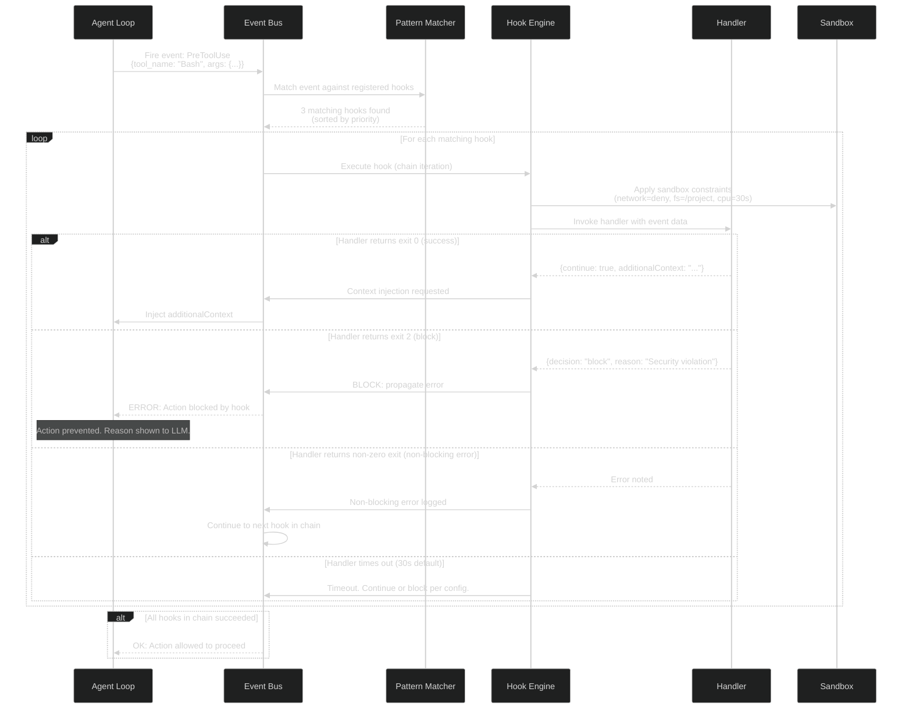
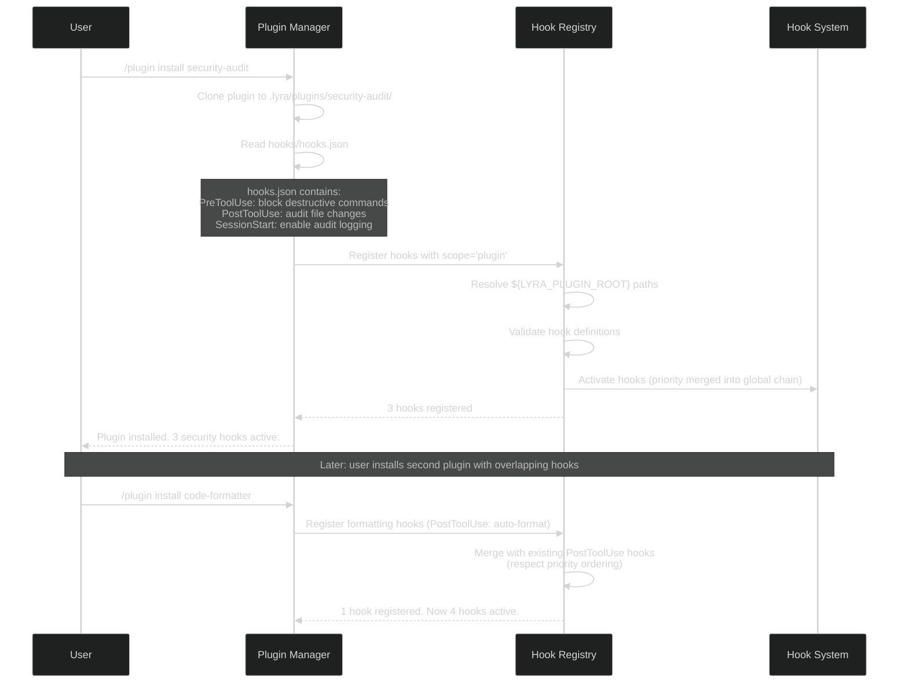

# Workstream 4.9: Hooks & Automation Enhancement Plan

> **Date:** 2026-05-30
> **Status:** PLAN
> **Based on:** STREAM-1 (27 lifecycle hooks, exit code protocol, JSON output protocol, matcher patterns), PLAN-5.3 (15 CESP hook points for sound), STREAM-11 (Hook integration patterns, checkpoint recovery), harness-plugins.md (hook bundles in plugins)
> **Dependencies:** PLAN-4.7 (MCP Integration -- for MCP tool hooks), harness-plugins.md (Plugin System)

---

## 1. Executive Summary

This plan defines Lyra's hooks and automation system -- a deterministic control plane that executes shell commands, HTTP calls, MCP tools, prompts, or agent checks at 27 lifecycle events. Hooks provide the "always happens" guarantees that the LLM's probabilistic output cannot. The plan covers hook priority ordering, chaining with error propagation, plugin-bundled hook auto-activation, condition matching via regex patterns, async execution with timeout, output injection into context, a community marketplace, debugging/dry-run mode, and sandboxed execution.

The key insight from STREAM-1 is that hooks are the **deterministic control plane** layered between the LLM's agent loop and the permission system -- creating a three-layer architecture: Agent Loop (AI-driven) -> Hook System (rule-driven) -> Permission System (user-configured). This architecture is clean, separable, and proven in production (Claude Code).

---

## 2. What Lyra Already Has

Based on the existing architecture audit:

| Capability | Current Status | Source |
|-----------|---------------|--------|
| Basic event system | Not formalized as hook events | Gap analysis |
| Plugin system with component dirs | Plugin contract defined in adapter layer | harness-plugins.md |
| Permission system | ToolName(specifier) proposed but not implemented | Gap analysis |
| CESP sound hook points (15 events) | Proposed in PLAN-5.3 | PLAN-5.3-VOICE-UX.md |
| Agent lifecycle tracking | FleetOrchestrator tracks agent spawn/terminate | agent-swarm.md |
| Sandbox infrastructure | Not implemented | Gap analysis |

### Gaps Identified

- No formal hook event taxonomy (27 events from STREAM-1 not implemented)
- No hook configuration system (`.lyra/settings.json` hooks key)
- No hook handler types (command, HTTP, MCP tool, prompt-based, agent-based)
- No exit code protocol for hook blocking (exit 2 = block)
- No JSON output protocol for structured hook responses
- No matcher patterns for conditional hook execution
- No hook priority ordering or chaining
- No plugin-bundled hooks auto-activation
- No async hook execution with timeout
- No hook debugging or dry-run mode
- No hook marketplace
- No hook sandbox for security

---

## 3. What Research Reveals as Missing

### 3.1 From STREAM-1: Complete Hook Architecture (docs/research/STREAM-1-CLAUDE-CODE-DOCS.md, Sections 4, 5)

**27 Lifecycle Events (Complete Taxonomy):**

**Once per session:**
| Event | Trigger | Purpose |
|-------|---------|---------|
| `SessionStart` | Session creation | Initialize environment, set env vars |
| `SessionEnd` | Session termination | Cleanup, persist state, send notifications |
| `Setup` | First session setup | One-time setup, install deps |

**Once per turn:**
| Event | Trigger | Purpose |
|-------|---------|---------|
| `UserPromptSubmit` | User sends message | Validate input, pre-process |
| `UserPromptExpansion` | Prompt expanded with context | Inspect full resolved prompt |
| `Stop` | Turn completes | Post-turn validation, notification |
| `StopFailure` | Turn fails | Error notification, crash recovery |

**Per tool call:**
| Event | Trigger | Purpose |
|-------|---------|---------|
| `PreToolUse` | Before tool executes | Block dangerous calls, modify params |
| `PostToolUse` | After tool executes | Format output, inject context, lint |
| `PostToolUseFailure` | Tool execution fails | Error handling, retry logic |
| `PostToolBatch` | Batch of tool calls complete | Aggregate results, report |
| `PermissionRequest` | Tool needs user permission | Pre-validate before asking user |
| `PermissionDenied` | User denies permission | Log, notify, offer alternatives |

**Agent lifecycle:**
| Event | Trigger | Purpose |
|-------|---------|---------|
| `SubagentStart` | Subagent spawns | Configure agent, set permissions |
| `SubagentStop` | Subagent completes | Validate output, merge results |
| `TeammateIdle` | Teammate has no tasks | Reassign work, suggest next task |

**Task management:**
| Event | Trigger | Purpose |
|-------|---------|---------|
| `TaskCreated` | New task created | Validate task structure |
| `TaskCompleted` | Task marked done | Verify completion criteria |

**Notifications:**
| Event | Trigger | Purpose |
|-------|---------|---------|
| `Notification` | System notification emitted | Route to channels (Slack, email) |
| `MessageDisplay` | Message shown to user | Format for display |
| `Elicitation` | MCP server requests input | Pre-fill, auto-answer |
| `ElicitationResult` | User provides input | Validate response |

**Configuration:**
| Event | Trigger | Purpose |
|-------|---------|---------|
| `ConfigChange` | Settings changed | Validate new config, restart services |
| `CwdChanged` | Working directory changed | Update env vars, activate venv |
| `FileChanged` | File modified externally | Trigger re-index, notify |
| `InstructionsLoaded` | Instructions loaded | Inject additional context |

**Worktree:**
| Event | Trigger | Purpose |
|-------|---------|---------|
| `WorktreeCreate` | Git worktree created | Configure worktree environment |
| `WorktreeRemove` | Git worktree removed | Cleanup worktree resources |

**Compaction:**
| Event | Trigger | Purpose |
|-------|---------|---------|
| `PreCompact` | Context about to compact | Preserve critical info before compaction |
| `PostCompact` | Context compacted | Verify nothing critical was lost |

### 3.2 Exit Code Protocol (From STREAM-1, Section 5)

| Exit Code | Meaning | Behavior |
|-----------|---------|----------|
| **0** | Success | JSON on stdout parsed; context may be added |
| **2** | Blocking error | Action blocked. Stderr shown to agent |
| **Any other** | Non-blocking error | Error noted, execution continues |

**Events that support exit code 2 blocking:**
`PreToolUse`, `PermissionRequest`, `UserPromptSubmit`, `Stop`, `SubagentStop`, `TeammateIdle`, `TaskCreated`, `TaskCompleted`, `ConfigChange`, `PreCompact`, `Elicitation`, `WorktreeCreate`

### 3.3 JSON Output Protocol (From STREAM-1, Section 5)

**Universal response:**
```json
{
  "continue": false,
  "stopReason": "Critical security violation detected",
  "suppressOutput": true
}
```

**Decision control:**
```json
{
  "decision": "block",
  "reason": "Cannot modify files outside project directory"
}
```

**PreToolUse-specific:**
```json
{
  "hookSpecificOutput": {
    "hookEventName": "PreToolUse",
    "permissionDecision": "deny",
    "permissionDecisionReason": "Attempted to delete protected file"
  }
}
```

**Context injection (PostToolUse):**
```json
{
  "hookSpecificOutput": {
    "hookEventName": "PostToolUse",
    "additionalContext": "This file is auto-generated. Do not edit directly."
  }
}
```

### 3.4 Matcher Patterns (From STREAM-1, Section 5)

| Pattern | Behavior |
|---------|----------|
| `"*"`, `""`, omitted | Match all events of this type |
| Letters, digits, `_`, `|` | Exact match or pipe-separated list |
| Any other character | JavaScript regex |
| `mcp__server__tool` | MCP tool matching |
| `Bash(rm *)` | Command pattern matching |

### 3.5 Hook Configuration Scopes (From STREAM-1, Section 4)

| Location | Scope | Shareable |
|----------|-------|-----------|
| `~/.lyra/settings.json` | All projects (user) | No |
| `.lyra/settings.json` | Single project | Yes (committable) |
| `.lyra/settings.local.json` | Single project | No (gitignored) |
| Plugin `hooks/hooks.json` | When plugin enabled | Yes (bundled) |
| Skill/Agent frontmatter | While component active | Yes (in component file) |

### 3.6 Handler Types (From STREAM-1, Section 4)

1. **Command hooks** (`type: "command"`): Shell commands. Async mode for background.
2. **HTTP hooks** (`type: "http"`): POST to external endpoint. Webhook integration.
3. **MCP tool hooks** (`type: "mcp_tool"`): Call MCP server tools. Leverage MCP ecosystem.
4. **Prompt-based hooks** (`type: "prompt"`): Model evaluates condition (single-turn). LLM-as-judge.
5. **Agent-based hooks** (`type: "agent"`): Subagent with tools verifies condition. Complex rule evaluation.

### 3.7 From STREAM-11: Hook Integration Patterns (docs/research/STREAM-11-WORKFLOWS-SWARMS-SAFETY.md)

STREAM-11 reveals that hooks integrate deeply with swarm orchestration and safety:

- **Checkpoint recovery hooks**: `PreToolUse` hooks save state before each risky operation; if crash occurs, `SessionStart` hook restores from last checkpoint
- **Safety guardrail hooks**: `PreToolUse(Bash(rm *))` hooks block destructive commands at the hook level (before permission system)
- **Agent coordination hooks**: `SubagentStop` hooks validate subagent outputs against task requirements; `TeammateIdle` hooks auto-reassign work
- **Context preservation hooks**: `PreCompact` hooks extract critical context before compaction, re-inject on `PostCompact`

### 3.8 From PLAN-5.3: CESP Hook Points for Sound (docs/research/PLAN-5.3-VOICE-UX.md)

15 CESP (Continuous Event Sound Protocol) hook points informed by sound design research:
- `SessionStart` (welcome chime), `SessionEnd` (goodbye chime)
- `UserPromptSubmit` (submit whoosh), `Stop` (completion ping)
- `PreToolUse(start)` (tool activation beep), `PostToolUse(success)` (success chime), `PostToolUseFailure` (error buzz)
- `SubagentStart` (agent spawn swell), `SubagentStop` (agent complete chord)
- `PermissionRequest` (attention ping), `PermissionDenied` (denied buzz)
- `TaskCreated` (task add pop), `TaskCompleted` (task done ding)
- `Notification` (notification chime)
- `Elicitation` (input request tone), `ElicitationResult` (received acknowledgment)

---

## 4. Proposed Enhancements (Ranked by Impact x Effort)

```
HIGH IMPACT, LOW EFFORT (Do First)
  1. Hook event taxonomy (27 events from STREAM-1, implemented as typed event bus)
  2. Exit code protocol (0=success, 2=block, other=non-blocking-error)
  3. JSON output protocol for structured hook responses
  4. Matcher pattern system (exact, regex, wildcard, pipe-separated)

HIGH IMPACT, MEDIUM EFFORT (Do Next)
  5. Hook handler types (command, HTTP, MCP tool, prompt-based, agent-based)
  6. Hook configuration with 5 scopes (user, project, local, plugin, component)
  7. Plugin-bundled hooks auto-activated on enable
  8. Hook priority and ordering (before/after semantics)

MEDIUM IMPACT, MEDIUM EFFORT (Do When Convenient)
  9. Hook chaining with error propagation
 10. Async hook execution with timeout (non-blocking background verification)
 11. Hook output injection into agent context
 12. Hook debugging and dry-run mode

MEDIUM IMPACT, HIGH EFFORT (Defer)
 13. Hook marketplace (community-contributed hook bundles)
 14. Security: hook sandbox (deny network, limit filesystem, cap CPU)
```

---

## 5. Architecture

### 5.1 Three-Layer Architecture

```mermaid
%%{init: {'theme': 'dark', 'themeVariables': { 'primaryColor': '#8b5cf6', 'primaryTextColor': '#e2e8f0', 'lineColor': '#94a3b8', 'secondaryColor': '#1e293b', 'tertiaryColor': '#0d1117'}}}%%
graph TB
    subgraph Layer1["Layer 1: Agent Loop (AI-Driven)"]
        LLM[LLM decides what to do]
        TOOLS[Tools execute actions]
        LLM --> TOOLS
        TOOLS --> LLM
    end

    subgraph Layer2["Layer 2: Hook System (Rule-Driven)"]
        EVENTS[27 Lifecycle Events]
        MATCHER[Pattern Matcher<br/>exact | regex | wildcard]
        HANDLERS[5 Handler Types<br/>command | HTTP | MCP | prompt | agent]
        CHAIN[Hook Chain Engine<br/>priority ordering | error propagation]
        
        EVENTS --> MATCHER
        MATCHER --> HANDLERS
        HANDLERS --> CHAIN
    end

    subgraph Layer3["Layer 3: Permission System (User-Configured)"]
        RULES[ToolName specifier rules]
        MODES[Permission modes<br/>default | plan | auto | acceptEdits]
        DENY[Deny-first evaluation]
        
        RULES --> MODES
        MODES --> DENY
    end

    Layer1 -->|Events fire| Layer2
    Layer2 -->|Block/Allow/Inject| Layer1
    Layer2 -->|Permission decisions| Layer3
    Layer3 -->|Deny/Allow/Ask| Layer1
```

### 5.2 Hook Execution Pipeline



### 5.3 Hook Configuration Architecture

```mermaid
%%{init: {'theme': 'dark', 'themeVariables': { 'primaryColor': '#8b5cf6', 'primaryTextColor': '#e2e8f0', 'lineColor': '#94a3b8', 'secondaryColor': '#1e293b', 'tertiaryColor': '#0d1117'}}}%%
graph TB
    subgraph ConfigSources["Hook Configuration Sources (Precedence: Top = Highest)"]
        direction TB
        MANAGED["Managed Settings<br/>(organization-wide, cannot override)"]
        LOCAL["Local Project<br/>.lyra/settings.local.json<br/>(gitignored)"]
        PROJECT["Shared Project<br/>.lyra/settings.json<br/>(committable)"]
        USER["User Settings<br/>~/.lyra/settings.json<br/>(all projects)"]
        PLUGIN["Plugin Hooks<br/>hooks/hooks.json<br/>(activated on plugin enable)"]
        COMPONENT["Component Hooks<br/>Skill/Agent frontmatter<br/>(activated while component active)"]
    end

    subgraph HookDef["Hook Definition Format"]
        direction LR
        JSON["{
  'hooks': {
    'PreToolUse': [
      {
        'matchers': ['Bash(rm *)', 'Bash(sudo *)'],
        'handler': {
          'type': 'command',
          'command': 'lyra-hook-guard',
          'args': ['--event', '${LYRA_EVENT}', '--tool', '${LYRA_TOOL_NAME}'],
          'timeoutMs': 5000,
          'async': false
        },
        'priority': 100,
        'scope': 'project',
        'condition': '${LYRA_TOOL_NAME}.startsWith(\"Bash\")'
      }
    ]
  }
}"]
    end
```

### 5.4 Plugin-Bundled Hook Auto-Activation



---

## 6. Core Interfaces

### 6.1 Hook Event System

```python
# lyra-hooks/events.py
from dataclasses import dataclass, field
from enum import Enum
from typing import Any, Optional
import time

class HookEvent(str, Enum):
    # Once per session
    SESSION_START = "SessionStart"
    SESSION_END = "SessionEnd"
    SETUP = "Setup"
    
    # Once per turn
    USER_PROMPT_SUBMIT = "UserPromptSubmit"
    USER_PROMPT_EXPANSION = "UserPromptExpansion"
    STOP = "Stop"
    STOP_FAILURE = "StopFailure"
    
    # Per tool call
    PRE_TOOL_USE = "PreToolUse"
    POST_TOOL_USE = "PostToolUse"
    POST_TOOL_USE_FAILURE = "PostToolUseFailure"
    POST_TOOL_BATCH = "PostToolBatch"
    PERMISSION_REQUEST = "PermissionRequest"
    PERMISSION_DENIED = "PermissionDenied"
    
    # Agent lifecycle
    SUBAGENT_START = "SubagentStart"
    SUBAGENT_STOP = "SubagentStop"
    TEAMMATE_IDLE = "TeammateIdle"
    
    # Task management
    TASK_CREATED = "TaskCreated"
    TASK_COMPLETED = "TaskCompleted"
    
    # Notifications
    NOTIFICATION = "Notification"
    MESSAGE_DISPLAY = "MessageDisplay"
    ELICITATION = "Elicitation"
    ELICITATION_RESULT = "ElicitationResult"
    
    # Configuration
    CONFIG_CHANGE = "ConfigChange"
    CWD_CHANGED = "CwdChanged"
    FILE_CHANGED = "FileChanged"
    INSTRUCTIONS_LOADED = "InstructionsLoaded"
    
    # Worktree
    WORKTREE_CREATE = "WorktreeCreate"
    WORKTREE_REMOVE = "WorktreeRemove"
    
    # Compaction
    PRE_COMPACT = "PreCompact"
    POST_COMPACT = "PostCompact"

@dataclass
class HookEventData:
    """Data passed to hook handlers for a specific event."""
    event: HookEvent
    session_id: str
    transcript_path: str
    cwd: str
    permission_mode: str
    timestamp: float = field(default_factory=time.time)
    
    # Event-specific data (populated based on event type)
    tool_name: Optional[str] = None
    tool_input: Optional[dict] = None
    tool_output: Optional[str] = None
    agent_name: Optional[str] = None
    task_id: Optional[str] = None
    notification_message: Optional[str] = None
    config_key: Optional[str] = None
    
    # Environment variables for hook scripts
    def env_vars(self) -> dict[str, str]:
        return {
            "LYRA_EVENT": self.event.value,
            "LYRA_SESSION_ID": self.session_id,
            "LYRA_TOOL_NAME": self.tool_name or "",
            "LYRA_AGENT_NAME": self.agent_name or "",
            "LYRA_CWD": self.cwd,
            "LYRA_TRANSCRIPT_PATH": self.transcript_path,
        }

# Exit codes
class HookExitCode:
    SUCCESS = 0
    BLOCK = 2           # Blocking error
    # Any other exit code = non-blocking error
```

### 6.2 Hook Definition and Matching

```python
# lyra-hooks/registry.py
from dataclasses import dataclass, field
from enum import Enum
from typing import Any, Callable, Optional, Pattern
import re

class HandlerType(str, Enum):
    COMMAND = "command"
    HTTP = "http"
    MCP_TOOL = "mcp_tool"
    PROMPT = "prompt"
    AGENT = "agent"

class HookScope(str, Enum):
    MANAGED = "managed"
    LOCAL = "local"
    PROJECT = "project"
    USER = "user"
    PLUGIN = "plugin"
    COMPONENT = "component"

@dataclass
class HookHandler:
    """Defines what to execute when a hook fires."""
    type: HandlerType
    
    # For command type
    command: Optional[str] = None
    args: list[str] = field(default_factory=list)
    env: dict[str, str] = field(default_factory=dict)
    
    # For HTTP type
    url: Optional[str] = None
    method: str = "POST"
    headers: dict[str, str] = field(default_factory=dict)
    
    # For MCP tool type
    mcp_server: Optional[str] = None
    mcp_tool: Optional[str] = None
    
    # For prompt/agent type
    model: Optional[str] = None
    prompt: Optional[str] = None
    
    # Common
    timeoutMs: int = 30_000           # 30 second default timeout
    async_mode: bool = False          # Run in background (non-blocking)
    retryCount: int = 0               # Number of retries on failure

@dataclass
class HookDefinition:
    """A single hook registration."""
    event: HookEvent
    matchers: list[str] = field(default_factory=list)  # Patterns to match against
    handler: HookHandler = field(default_factory=HookHandler)
    
    # Metadata
    name: str = ""
    description: str = ""
    priority: int = 50               # 0-100, higher = earlier execution
    scope: HookScope = HookScope.PROJECT
    source_plugin: Optional[str] = None  # If from a plugin
    
    # Advanced
    condition: Optional[str] = None   # Expression to evaluate (optional)
    allowFailure: bool = False        # If True, hook failure doesn't abort chain
    sandbox: Optional["HookSandboxConfig"] = None
    
    def matches(self, event_data: HookEventData) -> bool:
        """Check if this hook should fire for the given event data."""
        if self.event != event_data.event:
            return False
        
        if not self.matchers or "*" in self.matchers or "" in self.matchers:
            return True
        
        target = event_data.tool_name or ""
        for pattern_str in self.matchers:
            if self._match_pattern(pattern_str, target):
                return True
        return False
    
    def _match_pattern(self, pattern_str: str, target: str) -> bool:
        """Match a single pattern against a target string.
        
        Rules (from STREAM-1, Section 5):
        - Letters, digits, _, | -> exact or pipe-separated list
        - Wildcard * -> match all
        - Empty string -> match all
        - Any other char -> JavaScript regex
        """
        if pattern_str in ("*", ""):
            return True
        if re.match(r'^[\w|]+$', pattern_str):
            return target in pattern_str.split("|")
        try:
            return bool(re.search(pattern_str, target))
        except re.error:
            return False

@dataclass
class HookSandboxConfig:
    network: str = "deny"            # deny | allow | allowlist
    filesystem_root: str = "${LYRA_PROJECT_DIR}"
    cpuTimeoutSec: int = 30
    memoryLimitMb: int = 256
    env_allowlist: list[str] = field(default_factory=lambda: ["HOME", "PATH", "LYRA_*"])
```

### 6.3 Hook Response Protocol

```python
# lyra-hooks/responses.py
from dataclasses import dataclass, field
from enum import Enum
from typing import Any, Optional

class HookDecision(str, Enum):
    ALLOW = "allow"
    BLOCK = "block"
    ASK = "ask"

@dataclass
class HookResponse:
    """Parsed response from a hook handler."""
    exit_code: int
    stdout: str = ""
    stderr: str = ""
    
    # Parsed from JSON stdout (if exit code 0)
    continue_execution: bool = True
    stop_reason: Optional[str] = None
    suppress_output: bool = False
    decision: Optional[HookDecision] = None
    decision_reason: Optional[str] = None
    
    # Context injection (PostToolUse)
    additional_context: Optional[str] = None
    
    # PreToolUse-specific (from hookSpecificOutput)
    permission_decision: Optional[str] = None
    permission_decision_reason: Optional[str] = None
    
    # Timing
    execution_time_ms: float = 0.0
    
    @classmethod
    def parse(cls, exit_code: int, stdout: str, stderr: str, elapsed_ms: float) -> "HookResponse":
        """Parse hook output into structured response."""
        response = cls(
            exit_code=exit_code,
            stdout=stdout,
            stderr=stderr,
            execution_time_ms=elapsed_ms,
        )
        
        if exit_code == 0:
            try:
                data = json.loads(stdout)
                response.continue_execution = data.get("continue", True)
                response.stop_reason = data.get("stopReason")
                response.suppress_output = data.get("suppressOutput", False)
                response.decision = HookDecision(data["decision"]) if "decision" in data else None
                response.decision_reason = data.get("reason")
                
                # Extract hookSpecificOutput
                hso = data.get("hookSpecificOutput", {})
                response.additional_context = hso.get("additionalContext")
                response.permission_decision = hso.get("permissionDecision")
                response.permission_decision_reason = hso.get("permissionDecisionReason")
            except (json.JSONDecodeError, KeyError):
                pass
        elif exit_code == 2:
            response.continue_execution = False
            response.decision = HookDecision.BLOCK
            response.decision_reason = stderr.strip()
        
        return response
    
    def is_blocking(self) -> bool:
        return self.exit_code == 2 or self.decision == HookDecision.BLOCK
```

### 6.4 Hook Chain Engine

```python
# lyra-hooks/chain.py
from dataclasses import dataclass, field
from typing import Any

@dataclass
class HookChainResult:
    """Result of executing a chain of hooks for a single event."""
    allowed: bool
    blocked_by: Optional[str] = None       # Name of hook that blocked
    block_reason: Optional[str] = None
    injected_context: list[str] = field(default_factory=list)
    hook_results: list[HookResponse] = field(default_factory=list)
    total_execution_time_ms: float = 0.0
    errors: list[str] = field(default_factory=list)

class HookChainEngine:
    """Executes a chain of hooks for a single event with priority ordering,
    error propagation, and context accumulation."""
    
    def __init__(self, registry: "HookRegistry"):
        self.registry = registry
        self.sandbox = HookSandbox()
    
    async def execute_chain(
        self, event_data: HookEventData
    ) -> HookChainResult:
        """Execute all matching hooks in priority order.
        
        Chain execution rules:
        1. Sort hooks by priority (high to low)
        2. For before-same-event hooks, run in priority order
        3. For after-same-event hooks, run in reverse priority order
        4. First BLOCK (exit 2) stops the chain
        5. Non-blocking errors are logged but don't stop chain
        6. Context from ALL successful hooks is accumulated
        7. If any hook returns suppressOutput, hide terminal output
        """
        ...
    
    async def _execute_single_hook(
        self, hook: HookDefinition, event_data: HookEventData
    ) -> HookResponse:
        """Execute a single hook with sandbox, timeout, and retry."""
        ...
```

---

## 7. Implementation Phases

### Phase 1: Event Bus + Core Protocol (Weeks 1-2)

**Goal:** Event taxonomy, exit code protocol, JSON output protocol, matcher patterns.

| Task | Effort | Dependencies |
|------|--------|-------------|
| 1.1 Implement 27-event taxonomy as typed enum with event data classes | 2 days | None |
| 1.2 Implement event bus with pub/sub: fire events from agent loop, tools, sessions | 3 days | 1.1 |
| 1.3 Implement exit code protocol (0=success, 2=block, other=non-blocking) | 1 day | 1.2 |
| 1.4 Implement JSON output protocol parser (hookResponse parsing from STREAM-1) | 1 day | 1.3 |
| 1.5 Implement matcher pattern engine (exact, regex, wildcard, pipe-separated, MCP namespace) | 2 days | 1.2 |
| 1.6 Wire up 3 events to agent loop: PreToolUse, PostToolUse, SessionStart | 2 days | 1.1-1.5 |
| 1.7 Write tests for all 27 event data shapes, exit code semantics, matcher edge cases | 1 day | 1.1-1.6 |

**Deliverable:** Event bus fires on agent loop events. Hook handlers can receive structured event data and respond with exit codes.

### Phase 2: Handler Types + Configuration (Weeks 3-4)

**Goal:** All 5 handler types, 5 configuration scopes, hook chaining with priority.

| Task | Effort | Dependencies |
|------|--------|-------------|
| 2.1 Implement command handler (subprocess spawn, stdin/stdout, timeout, env vars) | 2 days | Phase 1 |
| 2.2 Implement HTTP handler (POST to external endpoints, headers, retry) | 1 day | Phase 1 |
| 2.3 Implement MCP tool handler (call MCP server tool, parse response) | 2 days | Phase 1, PLAN-4.7 |
| 2.4 Implement prompt-based handler (LLM evaluates condition, returns structured output) | 2 days | Phase 1 |
| 2.5 Implement agent-based handler (subagent with tools verifies condition) | 2 days | Phase 1 |
| 2.6 Implement hook configuration loader (5 scopes: managed > local > project > user > plugin) | 2 days | Phase 1 |
| 2.7 Implement hook chain engine: priority sorting, sequential execution, error propagation | 2 days | 2.1-2.5 |
| 2.8 Implement context injection: accumulate additionalContext from successful PostToolUse hooks | 1 day | 2.7 |

**Deliverable:** All 5 handler types work. Configuration loaded from 5 scopes with correct precedence.

### Phase 3: Plugin Hooks + Advanced Features (Weeks 5-6)

**Goal:** Plugin-bundled hooks auto-activated, async execution, output injection.

| Task | Effort | Dependencies |
|------|--------|-------------|
| 3.1 Implement plugin hook auto-activation: read `hooks/hooks.json` on plugin enable, register hooks | 2 days | Phase 2 |
| 3.2 Implement `${LYRA_PLUGIN_ROOT}` and `${LYRA_PLUGIN_DATA}` path resolution in hook configs | 1 day | 3.1 |
| 3.3 Implement async hook execution with timeout (30s default, configurable per hook) | 2 days | Phase 2 |
| 3.4 Implement re-wake capability: async hooks can signal completion and re-insert context | 1 day | 3.3 |
| 3.5 Implement hook output injection: agent sees additionalContext from PostToolUse hooks | 1 day | Phase 2 |
| 3.6 Implement hook debugging: `lyra hooks debug` shows which hooks fire for given event+tool | 2 days | Phase 2 |
| 3.7 Implement dry-run mode: `lyra hooks dry-run --event PreToolUse --tool Bash(rm *)` | 1 day | 3.6 |
| 3.8 Write integration tests for hook chaining scenarios (block mid-chain, inject context, async timeout) | 2 days | 3.1-3.7 |

**Deliverable:** Plugin hooks auto-activate. Async hooks work. Debugging/dry-run available.

### Phase 4: Security + Sound + Polish (Weeks 7-8)

**Goal:** Hook sandbox, sound event hooks, hook marketplace infrastructure.

| Task | Effort | Dependencies |
|------|--------|-------------|
| 4.1 Implement hook sandbox: per-hook seccomp profile, filesystem allowlisting, network deny/allow, CPU/memory limits | 3 days | Phase 2 |
| 4.2 Implement 15 CESP sound hook points (integrate with PLAN-5.3 sound system) | 2 days | Phase 3 |
| 4.3 Implement security-focused built-in hooks: block `rm -rf /`, block `sudo`, validate commit messages | 2 days | Phase 3 |
| 4.4 Implement hook marketplace infrastructure: git-based registry, versioning, `lyra hooks install` | 2 days | Phase 3 |
| 4.5 Write security audit: sandbox escape tests, privilege escalation tests, env var leakage tests | 2 days | 4.1, 4.3 |
| 4.6 Write hook development guide: template hook, testing patterns, marketplace publishing | 1 day | All |

**Deliverable:** Sandboxed hooks. CESP sound events. Security hooks bundle. Marketplace infrastructure.

---

## 8. Key Design Decisions

### 8.1 Why Exit Code 2 for Blocking (vs. JSON Property)

STREAM-1 uses exit code 2 for blocking because:
1. **Fail-safe default**: If the hook script crashes (non-zero exit), it defaults to non-blocking. Only explicit exit 2 blocks.
2. **Shell-native**: Any shell script can signal blocking without needing JSON parsing.
3. **Security boundary**: The kernel enforces the exit code; a hook can't falsely claim "success" if it crashes.

### 8.2 Hook Handler Separation

Hooks are **not** the agent. They are deterministic shell commands, HTTP calls, or MCP tools. The prompt-based and agent-based handler types are reserved for cases where deterministic rules are insufficient (subjective quality checks, complex multi-factor verification).

### 8.3 Hook Sandbox Principles

Following defense-in-depth from STREAM-11 and NVIDIA OpenShell:
1. **Network isolation by default**: Hooks get no network access unless explicitly allowlisted.
2. **Filesystem chroot**: Hooks see only the project directory (or explicit allowlist).
3. **CPU/Memory caps**: Prevent runaway hooks from consuming resources.
4. **Environment variable filtering**: Only whitelisted env vars passed to hooks.

---

## 9. Success Metrics

| Metric | Current | Target | Measurement |
|--------|---------|--------|-------------|
| Hook events implemented | 0 | 27 (full STREAM-1 taxonomy) | Event enum count |
| Handler types supported | 0 | 5 (command, HTTP, MCP, prompt, agent) | Handler registry |
| Hook config scopes | 0 | 5 (managed, local, project, user, plugin) | Config loader |
| Plugin hook auto-activation | N/A | 100% on plugin enable | Integration test |
| Hook execution latency | N/A | <100ms for command hooks (P95) | Latency benchmark |
| Hook security | None | Sandbox for all command hooks | Security audit |
| CESP sound events | Proposed | 15 events with sound triggers | Sound config |

---

## 10. References

### Primary Research Sources
1. **STREAM-1-CLAUDE-CODE-DOCS.md** (Sections 4-5: Hooks Guide, Hooks Reference) -- 27 lifecycle events, exit code protocol, JSON output protocol, 5 handler types, 5 configuration scopes, matcher patterns, path placeholders. `/docs/research/STREAM-1-CLAUDE-CODE-DOCS.md`
2. **STREAM-11-WORKFLOWS-SWARMS-SAFETY.md** (Section C: Safety Architecture) -- Hook integration with swarm orchestration, checkpoint recovery hooks, safety guardrail hooks. `/docs/research/STREAM-11-WORKFLOWS-SWARMS-SAFETY.md`

### Architecture References
3. **harness-plugins.md** -- Hook bundles in plugins, `hooks/hooks.json` format, auto-activation on enable. `/docs/architecture/harness-plugins.md`
4. **PLAN-5.3-VOICE-UX.md** -- 15 CESP hook points for sound design, audio event triggers. `/docs/research/PLAN-5.3-VOICE-UX.md`

### Key External References
5. **Claude Code Hooks Guide** -- https://code.claude.com/docs/en/hooks-guide
6. **Claude Code Hooks Reference** -- https://code.claude.com/docs/en/hooks (27 events, exit codes, JSON protocol)
7. **NVIDIA OpenShell** -- https://github.com/NVIDIA/OpenShell (Kernel-level sandbox enforcement)
8. **CESP v1.0 Specification** -- Continuous Event Sound Protocol for agent UX

### Key Metrics from Research
- Claude Code: 27 lifecycle events, 5 handler types (command, HTTP, MCP tool, prompt, agent) -- STREAM-1
- 3-layer architecture: Agent Loop -> Hook System -> Permission System -- STREAM-1
- Exit code 2 = block (12 blocking-capable events) -- STREAM-1
- Hook scopes: managed > local > project > user > plugin > component -- STREAM-1
- CESP: 15 sound hook points for audio UX -- PLAN-5.3

---

*Plan status: AWAITING REVIEW. Dependencies: Phase 2 (MCP tool handler) requires PLAN-4.7 (MCP Integration). Phase 4 (Sound hooks) requires PLAN-5.3 (Voice UX). Phase 4 (Sandbox) requires infrastructure from the security system.*
