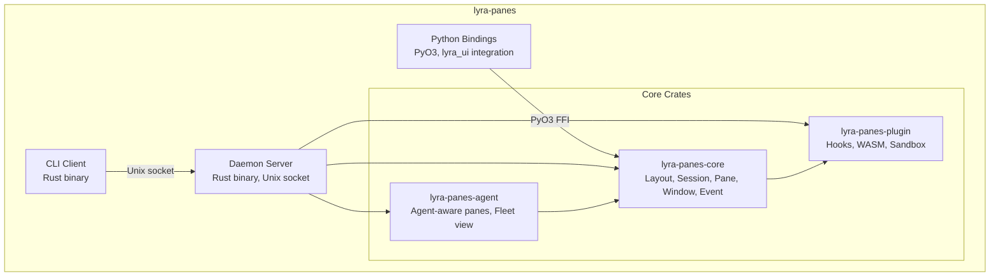

# Investigation 5.1: rmux-Style Rebuild for Lyra

> **Based on:** STREAM-8 (Terminal Multiplexers), tmux, cmux, rmux, Warp, AlphaClaw
> **Status:** PLAN — Ready for implementation

---

## 1. Executive Summary

Lyra should build a clean from-scratch terminal multiplexer in Rust, drawing architectural patterns from rmux (MIT-licensed, 12-crate workspace), command model from tmux (ISC-licensed, 64 commands), and agent-aware notifications from cmux (design inspiration only — GPL-3.0). All reference code is permissively licensed.

**Recommendation:** Build as `lyra-panes` — a Rust workspace with Python bindings. MIT license. 11-week build plan.

---

## 2. License Analysis

| Repo | License | Compatible with MIT? | Can Reuse? |
|------|---------|---------------------|-----------|
| tmux | ISC (BSD-equivalent) | YES | Architecture patterns, command model |
| rmux | MIT OR Apache-2.0 | YES | Crate structure, SDK patterns, Rust idioms |
| cmux | GPL-3.0 | NO | Design inspiration only (workspace model, notification rings) |
| Warp | AGPL-3.0 | NO (warpui crate is MIT) | warpui patterns only |
| AlphaClaw | MIT | YES | Watchdog, Git-rollback, browser observability patterns |
| AgentsMesh | BSL-1.1 | NO for production | Multi-tenancy design inspiration only |

---

## 3. Proposed Architecture: `lyra-panes`

### 3.1 Crate Structure (Rust Workspace)

```
lyra-panes/                          # Cargo workspace root
├── Cargo.toml                       # Workspace definition
├── lyra-panes-core/                 # Core abstractions
│   ├── src/
│   │   ├── layout.rs                # Layout tree (splits, panes, windows)
│   │   ├── session.rs               # Session lifecycle (create, attach, detach, kill)
│   │   ├── pane.rs                  # Pane + agent association metadata
│   │   ├── window.rs                # Window management (tab equivalent)
│   │   └── event.rs                 # Event types (pane:created, agent:spawned, etc.)
│   └── Cargo.toml
├── lyra-panes-daemon/               # Daemon/server process
│   ├── src/
│   │   ├── server.rs                # Unix socket server (like tmux daemon)
│   │   ├── client_handler.rs        # Per-client connection state
│   │   ├── session_manager.rs       # Session GC, lease-based cleanup
│   │   └── broadcast.rs             # Broadcast to all attached clients
│   └── Cargo.toml
├── lyra-panes-cli/                  # CLI client
│   ├── src/
│   │   ├── main.rs                  # Subcommands: attach, new-session, list, kill
│   │   ├── keybindings.rs           # Key table definitions
│   │   └── status.rs                # Status line rendering
│   └── Cargo.toml
├── lyra-panes-plugin/              # Plugin/hook system
│   ├── src/
│   │   ├── hook.rs                  # Hook callbacks (pre-pane-create, post-agent-spawn, etc.)
│   │   ├── plugin.rs                # Plugin manifest + loader (WASM + native .so)
│   │   └── sandbox.rs               # Plugin sandbox (seccomp, capability-based)
│   └── Cargo.toml
├── lyra-panes-python/              # Python bindings (PyO3)
│   ├── src/
│   │   └── lib.rs                   # Exposes lyra-panes-core to Python via PyO3
│   └── Cargo.toml
└── lyra-panes-agent/               # Agent integration layer
    ├── src/
    │   ├── agent_pane.rs            # Agent-aware pane: metadata, tool access, permissions
    │   ├── fleet_view.rs            # Fleet-wide pane overview
    │   └── multiplex.rs             # Multi-agent session multiplexing
    └── Cargo.toml
```

### 3.2 Component Diagram



### 3.3 Layout Model

```
Session
├── Window 0: "main"
│   ├── Pane 0 (left, 50%): lyra-cli session [Agent: analyzer-1]
│   ├── Pane 1 (right-top, 25%): htop
│   └── Pane 2 (right-bottom, 25%): tail -f /var/log/lyra/agent.log
├── Window 1: "research"
│   ├── Pane 0 (top, 60%): lyra-research output [Agent: researcher-3]
│   └── Pane 1 (bottom, 40%): research notes vim
└── Window 2: "fleet"
    ├── Pane 0 (left, 33%): Agent swarm status [Fleet: swarm-1]
    ├── Pane 1 (center, 33%): Agent metrics dashboard
    └── Pane 2 (right, 33%): Shared task board
```

Each pane carries agent metadata: `agent_id`, `fleet_id`, `role`, `permissions`, `tool_access`.

---

## 4. Key Features

### 4.1 Session Management
- **Lifecycle:** Create → Attach → Detach → Kill (with lease-based GC for orphaned sessions)
- **Reattach:** Reconnect to running session from any terminal
- **Multiplex:** Multiple clients attached to same session (collaborative agent debugging)
- **Snapshot/Restore:** Save session layout to JSON, restore later

### 4.2 Agent-Aware Panes
- **Agent association:** `lyra-panes-agent` tracks which agent owns each pane
- **Permission gating:** Panes inherit agent permissions; tool access scoped to pane
- **Fleet view:** Consolidated view of all agent panes across sessions
- **Broadcast:** Send command to all agent panes in a fleet simultaneously

### 4.3 Key Bindings

```
Prefix: Ctrl-a (tmux-compatible default)

Window Management:
  Ctrl-a c      New window (with agent spawn prompt)
  Ctrl-a n/p    Next/previous window
  Ctrl-a 0-9    Go to window N
  Ctrl-a &      Kill window (with agent terminate confirmation)

Pane Management:
  Ctrl-a %      Split vertical
  Ctrl-a "      Split horizontal
  Ctrl-a o      Next pane
  Ctrl-a x      Kill pane
  Ctrl-a z      Zoom pane (agent focus mode)
  Ctrl-a Space  Cycle layouts

Agent Mode (Ctrl-a a):
  Ctrl-a a s    Spawn agent in current pane
  Ctrl-a a k    Kill agent in current pane
  Ctrl-a a r    Route agent to different model
  Ctrl-a a v    View agent trace/log
  Ctrl-a a f    Fleet overview
  Ctrl-a a d    Delegate task to agent
```

### 4.4 Plugin System
- **Hook callbacks:** pre-pane-create, post-agent-spawn, on-session-attach, etc.
- **Plugin format:** WASM (sandboxed) + native .so (trusted)
- **Manifest:** `plugin.json` in plugin directory
- **Sandbox:** seccomp-bpf + capability-based permissions

---

## 5. Build Plan (11 weeks)

| Phase | Weeks | Deliverables |
|-------|-------|-------------|
| **P1: Core Layout** | 1-2 | lyra-panes-core crate: Layout tree, Pane, Window, Session structs. Unit tests. |
| **P2: Daemon + CLI** | 3-4 | Unix socket server, CLI attach/new/list/kill. Basic tmux-compatible terminal. |
| **P3: Agent Integration** | 5-6 | lyra-panes-agent: agent-pane association, fleet view, permission gating. |
| **P4: Python Bindings** | 7-8 | PyO3 FFI for lyra_ui integration. Python API for pane management. |
| **P5: Plugins + Hooks** | 9-10 | WASM plugin system, hook callbacks, sandbox. Plugin marketplace integration. |
| **P6: Polish** | 11 | Status line, themes (25 OKLCH themes), documentation, performance tuning. |

---

## 6. References

| Source | License | Key Pattern |
|--------|---------|-------------|
| [tmux](https://github.com/tmux/tmux) | ISC | 64-command model, client-server, hooks |
| [rmux](https://github.com/Helvesec/rmux) | MIT | 12-crate workspace, daemon-backed SDK |
| [cmux](https://github.com/manaflow-ai/cmux) | GPL-3.0 | Agent-aware notifications, workspace model (inspiration only) |
| [AlphaClaw](https://github.com/chrysb/alphaclaw) | MIT | Watchdog state machine, Git-backed rollback |
| [Warp](https://github.com/warpdotdev/warp) | AGPL-3.0 | warpui crate (MIT) for terminal UI patterns |
