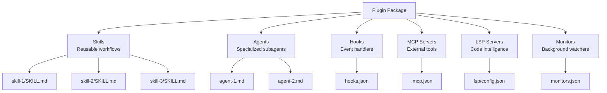
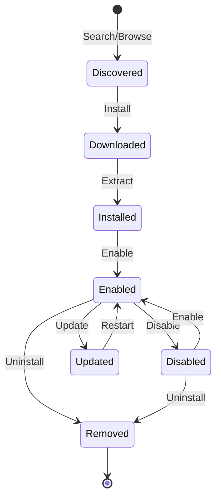

# Plugin System Design for Lyra

**Version:** 1.0  
**Date:** 2026-05-29  
**Status:** Design Specification

---

## 1. Overview

This document specifies the plugin system design for Lyra, enabling:
1. **Modular distribution** — bundle skills, agents, hooks, MCP servers, LSP servers
2. **Marketplace integration** — discover, install, update plugins
3. **Lifecycle management** — install, enable, disable, update, remove
4. **Isolation and security** — sandboxed execution, permission management
5. **Dependency resolution** — automatic dependency installation

---

## 2. Plugin Architecture

### 2.1 Plugin Components



### 2.2 Plugin Lifecycle



### 2.3 Plugin API Specification

```python
from dataclasses import dataclass, field
from pathlib import Path
from typing import Literal

@dataclass
class PluginAuthor:
    name: str
    email: str | None = None
    url: str | None = None

@dataclass
class PluginDependency:
    plugin_id: str
    version: str  # semver range

@dataclass
class PluginSkillRef:
    id: str
    path: str
    featured: bool = False

@dataclass
class PluginAgentRef:
    id: str
    path: str

@dataclass
class PluginHooksRef:
    path: str

@dataclass
class PluginMCPRef:
    path: str

@dataclass
class PluginLSPRef:
    path: str

@dataclass
class PluginMonitorsRef:
    path: str

@dataclass
class PluginLyraConfig:
    min_version: str
    max_version: str | None = None

@dataclass
class PluginManifest:
    # Required
    name: str
    version: str
    description: str
    
    # Author
    author: PluginAuthor
    
    # URLs
    repository: str
    homepage: str | None = None
    
    # Metadata
    license: str
    keywords: list[str] = field(default_factory=list)
    category: str | None = None
    
    # Lyra compatibility
    lyra: PluginLyraConfig | None = None
    
    # Dependencies
    dependencies: dict[str, str] = field(default_factory=dict)
    
    # Components
    skills: list[PluginSkillRef] = field(default_factory=list)
    agents: list[PluginAgentRef] = field(default_factory=list)
    hooks: PluginHooksRef | None = None
    mcp_servers: PluginMCPRef | None = None
    lsp_servers: PluginLSPRef | None = None
    monitors: PluginMonitorsRef | None = None
    
    # Installation
    install_script: str | None = None
    uninstall_script: str | None = None
    
    # Runtime
    enabled: bool = True
    installed_at: str | None = None
    updated_at: str | None = None
```

---

## 3. Plugin Lifecycle Management

### 3.1 Plugin Manager

```python
from pathlib import Path
import json
import shutil
import subprocess
from typing import Literal

class PluginManager:
    """Manages plugin lifecycle: install, enable, disable, update, remove."""
    
    def __init__(self, plugins_dir: Path):
        self.plugins_dir = plugins_dir
        self.plugins_dir.mkdir(parents=True, exist_ok=True)
        self.registry = PluginRegistry(plugins_dir / "registry.json")
    
    def install(self, source: str) -> PluginManifest:
        """Install plugin from source (git URL, marketplace ID, local path)."""
        # 1. Download/copy plugin
        plugin_dir = self._download_plugin(source)
        
        # 2. Load manifest
        manifest = self._load_manifest(plugin_dir / ".claude-plugin" / "plugin.json")
        
        # 3. Check compatibility
        self._check_compatibility(manifest)
        
        # 4. Resolve dependencies
        self._resolve_dependencies(manifest)
        
        # 5. Run install script
        if manifest.install_script:
            self._run_script(plugin_dir / manifest.install_script)
        
        # 6. Register plugin
        self.registry.register(manifest, plugin_dir)
        
        # 7. Enable by default
        self.enable(manifest.name)
        
        return manifest
    
    def uninstall(self, plugin_id: str):
        """Uninstall plugin."""
        manifest = self.registry.get(plugin_id)
        if not manifest:
            raise ValueError(f"Plugin {plugin_id} not found")
        
        plugin_dir = self.registry.get_path(plugin_id)
        
        # 1. Disable first
        self.disable(plugin_id)
        
        # 2. Run uninstall script
        if manifest.uninstall_script:
            self._run_script(plugin_dir / manifest.uninstall_script)
        
        # 3. Remove from registry
        self.registry.unregister(plugin_id)
        
        # 4. Delete directory
        shutil.rmtree(plugin_dir)
    
    def enable(self, plugin_id: str):
        """Enable plugin."""
        manifest = self.registry.get(plugin_id)
        if not manifest:
            raise ValueError(f"Plugin {plugin_id} not found")
        
        manifest.enabled = True
        self.registry.update(manifest)
    
    def disable(self, plugin_id: str):
        """Disable plugin."""
        manifest = self.registry.get(plugin_id)
        if not manifest:
            raise ValueError(f"Plugin {plugin_id} not found")
        
        manifest.enabled = False
        self.registry.update(manifest)
    
    def update(self, plugin_id: str) -> PluginManifest:
        """Update plugin to latest version."""
        manifest = self.registry.get(plugin_id)
        if not manifest:
            raise ValueError(f"Plugin {plugin_id} not found")
        
        # 1. Check for updates
        latest = self._check_for_updates(manifest)
        if latest.version == manifest.version:
            return manifest
        
        # 2. Download new version
        new_dir = self._download_plugin(manifest.repository)
        
        # 3. Backup old version
        old_dir = self.registry.get_path(plugin_id)
        backup_dir = old_dir.with_suffix(".backup")
        shutil.move(old_dir, backup_dir)
        
        try:
            # 4. Install new version
            shutil.move(new_dir, old_dir)
            
            # 5. Run update script
            if latest.install_script:
                self._run_script(old_dir / latest.install_script)
            
            # 6. Update registry
            self.registry.update(latest)
            
            # 7. Remove backup
            shutil.rmtree(backup_dir)
            
            return latest
        
        except Exception as e:
            # Rollback on failure
            shutil.rmtree(old_dir)
            shutil.move(backup_dir, old_dir)
            raise e
    
    def list(self, enabled_only: bool = False) -> list[PluginManifest]:
        """List installed plugins."""
        plugins = self.registry.list()
        if enabled_only:
            plugins = [p for p in plugins if p.enabled]
        return plugins
    
    def _download_plugin(self, source: str) -> Path:
        """Download plugin from source."""
        if source.startswith("http://") or source.startswith("https://"):
            # Git clone
            return self._git_clone(source)
        elif source.startswith("marketplace:"):
            # Marketplace download
            return self._marketplace_download(source[12:])
        else:
            # Local path
            return Path(source)
    
    def _git_clone(self, url: str) -> Path:
        """Clone git repository."""
        temp_dir = self.plugins_dir / ".temp" / Path(url).stem
        temp_dir.parent.mkdir(parents=True, exist_ok=True)
        
        subprocess.run(
            ["git", "clone", url, str(temp_dir)],
            check=True,
            capture_output=True,
        )
        
        return temp_dir
    
    def _marketplace_download(self, plugin_id: str) -> Path:
        """Download from marketplace."""
        # TODO: Implement marketplace API client
        raise NotImplementedError("Marketplace download not yet implemented")
    
    def _load_manifest(self, path: Path) -> PluginManifest:
        """Load plugin manifest from JSON."""
        with path.open() as f:
            data = json.load(f)
        return PluginManifest(**data)
    
    def _check_compatibility(self, manifest: PluginManifest):
        """Check if plugin is compatible with current Lyra version."""
        if not manifest.lyra:
            return
        
        from packaging import version
        current = version.parse(LYRA_VERSION)
        min_ver = version.parse(manifest.lyra.min_version)
        
        if current < min_ver:
            raise ValueError(
                f"Plugin requires Lyra {manifest.lyra.min_version}, "
                f"but current version is {LYRA_VERSION}"
            )
        
        if manifest.lyra.max_version:
            max_ver = version.parse(manifest.lyra.max_version)
            if current > max_ver:
                raise ValueError(
                    f"Plugin requires Lyra <={manifest.lyra.max_version}, "
                    f"but current version is {LYRA_VERSION}"
                )
    
    def _resolve_dependencies(self, manifest: PluginManifest):
        """Resolve and install plugin dependencies."""
        for dep_id, dep_version in manifest.dependencies.items():
            # Check if already installed
            dep = self.registry.get(dep_id)
            if dep:
                # Check version compatibility
                from packaging import version
                if not self._version_matches(dep.version, dep_version):
                    raise ValueError(
                        f"Dependency {dep_id} version {dep.version} "
                        f"does not match required {dep_version}"
                    )
            else:
                # Install dependency
                self.install(f"marketplace:{dep_id}")
    
    def _version_matches(self, version: str, constraint: str) -> bool:
        """Check if version matches constraint."""
        from packaging import version as pkg_version
        v = pkg_version.parse(version)
        
        if constraint.startswith("^"):
            base = pkg_version.parse(constraint[1:])
            return v >= base and v.major == base.major
        elif constraint.startswith("~"):
            base = pkg_version.parse(constraint[1:])
            return v >= base and v.major == base.major and v.minor == base.minor
        else:
            return v == pkg_version.parse(constraint)
    
    def _run_script(self, script_path: Path):
        """Run installation/uninstallation script."""
        if not script_path.exists():
            return
        
        subprocess.run(
            ["bash", str(script_path)],
            check=True,
            capture_output=True,
        )
    
    def _check_for_updates(self, manifest: PluginManifest) -> PluginManifest:
        """Check for plugin updates."""
        # TODO: Implement update checking
        return manifest
```

### 3.2 Plugin Registry

```python
class PluginRegistry:
    """Registry of installed plugins."""
    
    def __init__(self, registry_path: Path):
        self.registry_path = registry_path
        self.plugins: dict[str, tuple[PluginManifest, Path]] = {}
        self._load()
    
    def register(self, manifest: PluginManifest, path: Path):
        """Register a plugin."""
        self.plugins[manifest.name] = (manifest, path)
        self._save()
    
    def unregister(self, plugin_id: str):
        """Unregister a plugin."""
        if plugin_id in self.plugins:
            del self.plugins[plugin_id]
            self._save()
    
    def update(self, manifest: PluginManifest):
        """Update plugin manifest."""
        if manifest.name in self.plugins:
            _, path = self.plugins[manifest.name]
            self.plugins[manifest.name] = (manifest, path)
            self._save()
    
    def get(self, plugin_id: str) -> PluginManifest | None:
        """Get plugin manifest."""
        if plugin_id in self.plugins:
            return self.plugins[plugin_id][0]
        return None
    
    def get_path(self, plugin_id: str) -> Path | None:
        """Get plugin installation path."""
        if plugin_id in self.plugins:
            return self.plugins[plugin_id][1]
        return None
    
    def list(self) -> list[PluginManifest]:
        """List all registered plugins."""
        return [manifest for manifest, _ in self.plugins.values()]
    
    def _load(self):
        """Load registry from disk."""
        if not self.registry_path.exists():
            return
        
        with self.registry_path.open() as f:
            data = json.load(f)
        
        for plugin_data in data["plugins"]:
            manifest = PluginManifest(**plugin_data["manifest"])
            path = Path(plugin_data["path"])
            self.plugins[manifest.name] = (manifest, path)
    
    def _save(self):
        """Save registry to disk."""
        data = {
            "plugins": [
                {
                    "manifest": manifest.__dict__,
                    "path": str(path),
                }
                for manifest, path in self.plugins.values()
            ]
        }
        
        self.registry_path.parent.mkdir(parents=True, exist_ok=True)
        with self.registry_path.open("w") as f:
            json.dump(data, f, indent=2)
```

---

## 4. Plugin Isolation and Security

### 4.1 Sandboxing

```python
class PluginSandbox:
    """Sandboxes plugin execution for security."""
    
    def __init__(self, plugin_id: str):
        self.plugin_id = plugin_id
        self.allowed_paths: set[Path] = set()
        self.allowed_tools: set[str] = set()
        self.denied_tools: set[str] = set()
    
    def allow_path(self, path: Path):
        """Allow plugin to access path."""
        self.allowed_paths.add(path)
    
    def allow_tool(self, tool: str):
        """Allow plugin to use tool."""
        self.allowed_tools.add(tool)
    
    def deny_tool(self, tool: str):
        """Deny plugin from using tool."""
        self.denied_tools.add(tool)
    
    def check_path_access(self, path: Path) -> bool:
        """Check if plugin can access path."""
        path = path.resolve()
        
        for allowed in self.allowed_paths:
            if path.is_relative_to(allowed):
                return True
        
        return False
    
    def check_tool_access(self, tool: str) -> bool:
        """Check if plugin can use tool."""
        if tool in self.denied_tools:
            return False
        
        if self.allowed_tools and tool not in self.allowed_tools:
            return False
        
        return True
```

### 4.2 Permission Management

```python
class PluginPermissionManager:
    """Manages plugin permissions."""
    
    def __init__(self):
        self.permissions: dict[str, PluginPermissions] = {}
    
    def grant(self, plugin_id: str, permission: str):
        """Grant permission to plugin."""
        if plugin_id not in self.permissions:
            self.permissions[plugin_id] = PluginPermissions()
        
        self.permissions[plugin_id].granted.add(permission)
    
    def revoke(self, plugin_id: str, permission: str):
        """Revoke permission from plugin."""
        if plugin_id in self.permissions:
            self.permissions[plugin_id].granted.discard(permission)
    
    def check(self, plugin_id: str, permission: str) -> bool:
        """Check if plugin has permission."""
        if plugin_id not in self.permissions:
            return False
        
        return permission in self.permissions[plugin_id].granted
    
    def list_permissions(self, plugin_id: str) -> set[str]:
        """List all permissions for plugin."""
        if plugin_id not in self.permissions:
            return set()
        
        return self.permissions[plugin_id].granted.copy()

@dataclass
class PluginPermissions:
    granted: set[str] = field(default_factory=set)
    denied: set[str] = field(default_factory=set)
```

---

## 5. Plugin Marketplace

### 5.1 Marketplace API

```python
class PluginMarketplace:
    """Client for plugin marketplace API."""
    
    def __init__(self, api_url: str):
        self.api_url = api_url
    
    def search(self, query: str, category: str | None = None) -> list[PluginListing]:
        """Search for plugins."""
        params = {"q": query}
        if category:
            params["category"] = category
        
        response = requests.get(f"{self.api_url}/search", params=params)
        response.raise_for_status()
        
        return [PluginListing(**item) for item in response.json()["results"]]
    
    def get(self, plugin_id: str) -> PluginListing:
        """Get plugin details."""
        response = requests.get(f"{self.api_url}/plugins/{plugin_id}")
        response.raise_for_status()
        
        return PluginListing(**response.json())
    
    def download(self, plugin_id: str, version: str | None = None) -> Path:
        """Download plugin package."""
        params = {}
        if version:
            params["version"] = version
        
        response = requests.get(
            f"{self.api_url}/plugins/{plugin_id}/download",
            params=params,
            stream=True,
        )
        response.raise_for_status()
        
        # Save to temp file
        temp_file = Path(tempfile.mktemp(suffix=".tar.gz"))
        with temp_file.open("wb") as f:
            for chunk in response.iter_content(chunk_size=8192):
                f.write(chunk)
        
        # Extract
        extract_dir = Path(tempfile.mkdtemp())
        with tarfile.open(temp_file) as tar:
            tar.extractall(extract_dir)
        
        temp_file.unlink()
        return extract_dir
    
    def list_categories(self) -> list[str]:
        """List all plugin categories."""
        response = requests.get(f"{self.api_url}/categories")
        response.raise_for_status()
        
        return response.json()["categories"]
    
    def get_featured(self) -> list[PluginListing]:
        """Get featured plugins."""
        response = requests.get(f"{self.api_url}/featured")
        response.raise_for_status()
        
        return [PluginListing(**item) for item in response.json()["plugins"]]

@dataclass
class PluginListing:
    """Plugin listing in marketplace."""
    id: str
    name: str
    version: str
    description: str
    author: PluginAuthor
    category: str
    keywords: list[str]
    downloads: int
    rating: float
    repository: str
    homepage: str | None = None
    license: str = "MIT"
    created_at: str = ""
    updated_at: str = ""
```

### 5.2 Marketplace CLI

```bash
# Search for plugins
lyra plugin search "code review"

# List categories
lyra plugin categories

# Get featured plugins
lyra plugin featured

# Install from marketplace
lyra plugin install engineering

# Install specific version
lyra plugin install engineering@1.2.0

# Install from git
lyra plugin install https://github.com/user/lyra-plugin-custom

# Install from local path
lyra plugin install ./my-plugin

# List installed plugins
lyra plugin list

# List enabled plugins only
lyra plugin list --enabled

# Enable plugin
lyra plugin enable engineering

# Disable plugin
lyra plugin disable engineering

# Update plugin
lyra plugin update engineering

# Update all plugins
lyra plugin update --all

# Uninstall plugin
lyra plugin uninstall engineering

# Show plugin info
lyra plugin info engineering

# Show plugin permissions
lyra plugin permissions engineering
```

---

## 6. Plugin Development Kit (PDK)

### 6.1 Plugin Template

```bash
# Create new plugin from template
lyra plugin create my-plugin --category engineering

# Generated structure:
my-plugin/
├── .claude-plugin/
│   └── plugin.json
├── skills/
│   └── example-skill/
│       └── SKILL.md
├── agents/
│   └── example-agent.md
├── hooks/
│   └── hooks.json
├── tests/
│   └── test_skills.py
├── README.md
├── LICENSE
└── CHANGELOG.md
```

### 6.2 Plugin Testing Framework

```python
import pytest
from lyra_skills import SkillLoader, SkillExecutor

class TestMyPlugin:
    """Test suite for my-plugin."""
    
    @pytest.fixture
    def loader(self):
        """Load plugin skills."""
        return SkillLoader(["./skills"])
    
    @pytest.fixture
    def executor(self):
        """Create skill executor."""
        return SkillExecutor()
    
    def test_skill_loads(self, loader):
        """Test that skill loads correctly."""
        skills = loader.load_all()
        assert len(skills) > 0
        assert any(s.name == "example-skill" for s in skills)
    
    async def test_skill_executes(self, loader, executor):
        """Test that skill executes successfully."""
        skill = loader.get("example-skill")
        result = await executor.execute(skill, {"input": "test"})
        assert result["success"] is True
    
    def test_skill_parameters(self, loader):
        """Test that skill parameters are valid."""
        skill = loader.get("example-skill")
        assert len(skill.parameters) > 0
        assert all(p.name for p in skill.parameters)
```

### 6.3 Plugin Publishing

```bash
# Validate plugin
lyra plugin validate ./my-plugin

# Package plugin
lyra plugin package ./my-plugin

# Publish to marketplace
lyra plugin publish ./my-plugin-1.0.0.tar.gz

# Publish with API key
lyra plugin publish ./my-plugin-1.0.0.tar.gz --api-key $LYRA_API_KEY
```

---

## 7. Integration with Lyra Core

### 7.1 Plugin Loader Integration

```python
# In lyra-core/src/lyra_core/agent_loop.py

class AgentLoop:
    def __init__(self):
        # ... existing code ...
        
        # Add plugin manager
        self.plugin_manager = PluginManager(Path.home() / ".lyra" / "plugins")
        
        # Load enabled plugins
        self._load_plugins()
    
    def _load_plugins(self):
        """Load all enabled plugins."""
        for plugin in self.plugin_manager.list(enabled_only=True):
            self._load_plugin(plugin)
    
    def _load_plugin(self, plugin: PluginManifest):
        """Load a single plugin."""
        plugin_dir = self.plugin_manager.registry.get_path(plugin.name)
        
        # Load skills
        for skill_ref in plugin.skills:
            skill_path = plugin_dir / skill_ref.path
            self.skill_loader.load_skill(skill_path)
        
        # Load agents
        for agent_ref in plugin.agents:
            agent_path = plugin_dir / agent_ref.path
            self.agent_registry.load_agent(agent_path)
        
        # Load hooks
        if plugin.hooks:
            hooks_path = plugin_dir / plugin.hooks.path
            self.hook_engine.load_hooks(hooks_path)
        
        # Load MCP servers
        if plugin.mcp_servers:
            mcp_path = plugin_dir / plugin.mcp_servers.path
            self.mcp_manager.load_servers(mcp_path)
        
        # Load LSP servers
        if plugin.lsp_servers:
            lsp_path = plugin_dir / plugin.lsp_servers.path
            self.lsp_manager.load_servers(lsp_path)
```

### 7.2 CLI Integration

```python
# In lyra-cli/src/lyra_cli/commands/plugin.py

import typer
from rich.console import Console
from rich.table import Table

app = typer.Typer(name="plugin", help="Manage Lyra plugins")
console = Console()

@app.command()
def search(query: str, category: str | None = None):
    """Search for plugins in marketplace."""
    marketplace = PluginMarketplace(MARKETPLACE_URL)
    results = marketplace.search(query, category)
    
    table = Table(title=f"Search Results for '{query}'")
    table.add_column("Name", style="cyan")
    table.add_column("Version", style="green")
    table.add_column("Description")
    table.add_column("Downloads", justify="right")
    table.add_column("Rating", justify="right")
    
    for plugin in results:
        table.add_row(
            plugin.name,
            plugin.version,
            plugin.description[:50] + "...",
            str(plugin.downloads),
            f"{plugin.rating:.1f}⭐",
        )
    
    console.print(table)

@app.command()
def install(source: str):
    """Install a plugin."""
    manager = PluginManager(Path.home() / ".lyra" / "plugins")
    
    with console.status(f"Installing {source}..."):
        manifest = manager.install(source)
    
    console.print(f"✓ Installed {manifest.name} v{manifest.version}", style="green")

@app.command()
def list(enabled: bool = False):
    """List installed plugins."""
    manager = PluginManager(Path.home() / ".lyra" / "plugins")
    plugins = manager.list(enabled_only=enabled)
    
    table = Table(title="Installed Plugins")
    table.add_column("Name", style="cyan")
    table.add_column("Version", style="green")
    table.add_column("Status")
    table.add_column("Skills", justify="right")
    
    for plugin in plugins:
        status = "✓ Enabled" if plugin.enabled else "✗ Disabled"
        status_style = "green" if plugin.enabled else "red"
        
        table.add_row(
            plugin.name,
            plugin.version,
            f"[{status_style}]{status}[/{status_style}]",
            str(len(plugin.skills)),
        )
    
    console.print(table)
```

---

## 8. Implementation Roadmap

### Phase 1: Core Plugin System (Week 1-2)
- [ ] Implement PluginManifest schema
- [ ] Implement PluginManager (install, uninstall, enable, disable)
- [ ] Implement PluginRegistry
- [ ] Add CLI commands (install, list, enable, disable)
- [ ] Write tests

### Phase 2: Dependency Resolution (Week 3)
- [ ] Implement version resolution
- [ ] Implement dependency installation
- [ ] Add dependency conflict detection
- [ ] Write tests

### Phase 3: Marketplace Integration (Week 4-5)
- [ ] Implement PluginMarketplace API client
- [ ] Add search, download, publish commands
- [ ] Implement plugin packaging
- [ ] Write tests

### Phase 4: Security & Isolation (Week 6)
- [ ] Implement PluginSandbox
- [ ] Implement PluginPermissionManager
- [ ] Add permission CLI commands
- [ ] Write tests

### Phase 5: Plugin Development Kit (Week 7-8)
- [ ] Create plugin template
- [ ] Implement plugin testing framework
- [ ] Add plugin validation
- [ ] Write documentation

### Phase 6: Integration & Testing (Week 9-10)
- [ ] Integrate with AgentLoop
- [ ] Integrate with SkillLoader
- [ ] Integrate with HookEngine
- [ ] End-to-end testing
- [ ] Performance optimization

---

## 9. Success Metrics

1. **Installation Success Rate:** >95% of plugin installations succeed
2. **Discovery Time:** <2s to search and display results
3. **Load Time:** <100ms to load enabled plugins at startup
4. **Marketplace Coverage:** 50+ plugins in first 6 months
5. **Community Adoption:** 1000+ plugin downloads in first 3 months

---

## 10. References

1. Claude Code Plugins Reference: https://code.claude.com/docs/en/plugins-reference
2. npm Package Manager: https://docs.npmjs.com/
3. VS Code Extension API: https://code.visualstudio.com/api
4. Semantic Versioning: https://semver.org/
5. Plugin Architecture Patterns: https://martinfowler.com/articles/plugins.html
