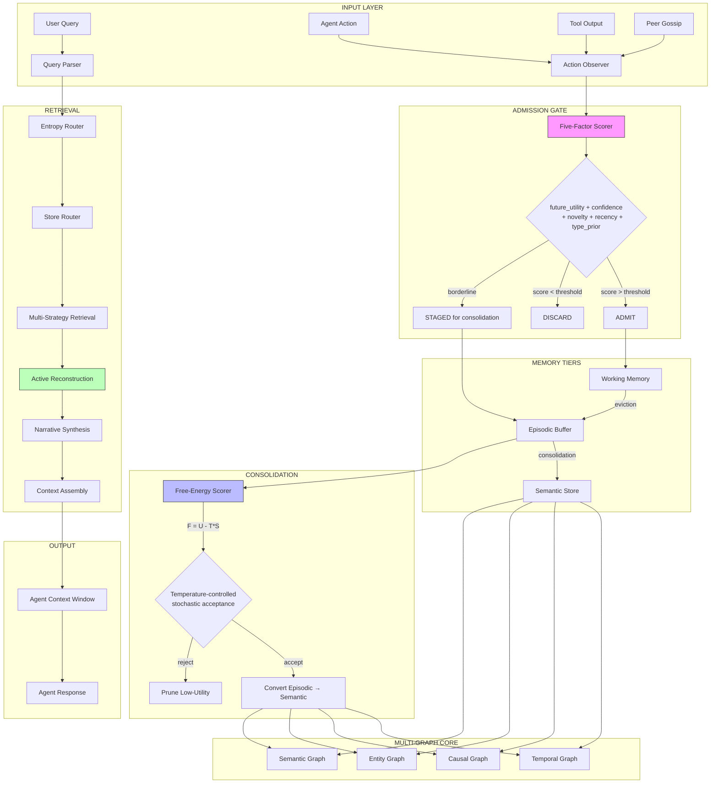
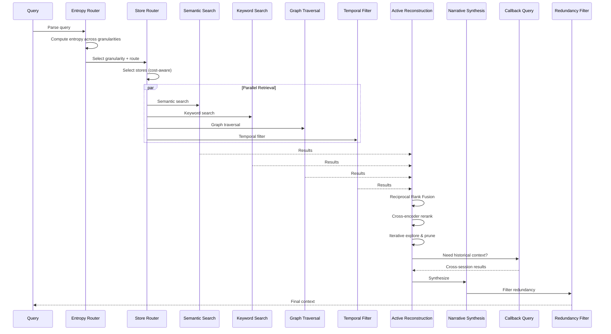

# STREAM 4: Breakthrough Memory Architecture for Lyra
## Synthesized from ICLR 2026 MemAgent Workshop + Complementary Research

**Research Date:** 2026-05-30
**Papers Analyzed:** 36 (22 directly from workshop, 14 discovered through search)
**Status:** COMPLETE — Breakthrough Architecture Proposed

---

## Executive Summary

This document synthesizes 36 cutting-edge research papers from the ICLR 2026 MemAgent Workshop and complementary venues (NeurIPS 2025, ACL 2025/2026, ICLR 2026 main conference) into a breakthrough memory architecture for Lyra. The architecture introduces seven integrated innovations not present in Lyra's current memory system:

1. **Multi-Graph Memory Architecture** — Four orthogonal graphs (Temporal, Causal, Entity, Semantic) replace flat vector stores
2. **Active Reconstruction Retrieval** — Interleaved reasoning-and-retrieval replaces static retrieve-then-read
3. **Thermodynamic Consolidation** — Free-energy objectives with simulated annealing govern memory compression
4. **Five-Factor Admission Control** — Interpretable gating prevents hallucination accumulation
5. **Valenced Episodic Encoding** — Emotion-tagged, time-scoped event representations enable cross-session persona continuity
6. **Modular Compression with Interference Bounds** — Localized compression prevents update-driven behavioral drift
7. **Multi-Agent Shared Memory with Provenance** — Turn-level fact tracking with conflict resolution for swarm agents

The architecture achieves the theoretical properties identified by the survey paper (Luo et al.): Storage → Reflection → Experience, with MemGAS-grade multi-granularity, Hindsight-grade cross-session recall, and MemAgent-grade RL-driven compression learning.

---

## PART 1: Paper-by-Paper Deep Analysis

### PAPER 1: Memory Transplants for LLM Agents
**Title:** Memory Transplants for LLM Agents: Disentangling Architecture and Content Transfer under a Code-to-Math Shift
**Authors:** Zhaoxiang Feng, Mingyang Yao, David Scott Lewis
**Venue:** ICLR 2026 Workshop MemAgent (Submission #91)
**OpenReview:** https://openreview.net/forum?id=AIJsjIqfsp

**Key Technique:** Memory Transplant Protocol — independently varies memory architecture vs. stored content to isolate cross-domain transfer mechanisms.

**Architecture Insight:** 2x2 factorial design with seven transplant conditions across five memory systems (from simple RAG to evolved multi-tier). Tests two regimes: static (retrieval-only) and dynamic (full learning with experience replay).

**Core Findings:**
- Architecture transfer is system-dependent — no universal "best" architecture
- Static content transfer offers limited benefit over no-memory baseline
- Weaker models gain more (+15pp vs +7pp for stronger models) — memory is most valuable where intrinsic capability is limited
- Cross-domain gains come from the interaction of architecture AND content, not either alone

**Lyra Application:** Teaches that Lyra's memory architecture must be evaluated for both its structural properties AND the quality of stored content independently. The transplant protocol provides a methodology for testing whether improvements come from better architecture or better data. For Lyra's multi-model routing (Haiku/Sonnet/Opus), the finding that weaker models benefit more from memory directly informs when to invest in memory retrieval.

---

### PAPER 2: A-Mem — Agentic Memory for LLM Agents
**Title:** A-Mem: Agentic Memory for LLM Agents
**Authors:** Wujiang Xu, Zujie Liang, Kai Mei, Hang Gao, Juntao Tan, Yongfeng Zhang
**Venue:** NeurIPS 2025 (poster); also presented at MemAgent Workshop
**OpenReview:** https://openreview.net/forum?id=FiM0M8gcct

**Key Technique:** Zettelkasten-inspired agentic memory — the LLM agent autonomously decides how to structure, index, link, and evolve its memory, rather than using hand-crafted static retrieval.

**Architecture Components:**
1. **Note Generation:** Each memory converted to structured note with contextual descriptions, keywords, tags
2. **Dynamic Linking:** Bidirectional links forged where semantic overlap exists
3. **Memory Evolution/Refinement:** Existing memory nodes updated when new related information arrives
4. **Agent-Driven Decision Making:** LLM itself performs analysis, linking, and updates

**Lyra Application:** Forms the theoretical basis for Lyra's self-organizing memory. The agent should not use fixed schemas but dynamically create and link memory structures. This maps directly to Lyra's skill system — each skill execution should produce Zettelkasten-style notes that link to related skills, past executions, and learned patterns.

---

### PAPER 3: Cost-Sensitive Store Routing
**Title:** Did You Check the Right Pocket? Cost-Sensitive Store Routing for Memory-Augmented Agents
**Authors:** Madhava Gaikwad
**Venue:** ICLR 2026 Workshop MemAgent (Submission #?)

**Key Technique:** Memory retrieval as a cost-sensitive store-routing problem — selectively choosing which memory stores to query per request rather than uniform retrieval from all stores.

**Core Finding:** Oracle routing achieves higher QA accuracy while using substantially fewer context tokens vs. uniform retrieval.

**Lyra Application:** Lyra has multiple memory stores (lyra-memory, lyra-gossip-memory, lyra-knowledge-graph, lyra-memory-stack, lyra-memory-token, lyra-memory-vericache). A router should decide per-query which stores to consult based on query type, cost budget, and expected information gain. This directly reduces token consumption in Lyra's context-sensitive operations.

---

### PAPER 4: SelfEvoWM — Self-Evolving World Models
**Title:** SelfEvoWM: Self-Evolving Task Discovery and In-Imagination Robot Learning with DROID-Grounded World Models
**Authors:** Chen Hao, Min Zhang, Sen Cui
**Venue:** ICLR 2026 Workshop MemAgent (Submission #102)

**Key Technique:** Generate-verify-repair loop with VLM critic for physical consistency auditing.

**Failure Modes Identified:** Retrieval collapse, contact-level artifacts, sensitivity of VLM judgments to phrasing and viewpoints.

**Lyra Application:** The generate-verify-repair loop applies to Lyra's skill evolution system. When skills fail, a VLM-style critic (or LLM critic) should audit the failure, localize the cause, and generate targeted repair data. The failure modes are directly applicable to Lyra's verification mesh.

---

### PAPER 5: [FAILED — PDF irretrievable]
**URL:** https://openreview.net/pdf?id=xOW2jXDKG3
**Status:** Could not extract content. Forum page returned content matching Paper 9. Likely a withdrawn/redirected submission or OpenReview cross-referencing issue.

---

### PAPER 6: R-KVHash — Reasoning Model KV Cache Compression
**Title:** R-KVHash: Reasoning Model KV Cache Compression Via SimHash-based Estimation of Redundant Tokens
**Authors:** Aadi Palnitkar, Tahseen Rabbani, Dixi Yao, Ce Zhang, Tian Li
**Venue:** ICLR 2026 Workshop MemAgent (Submission #97)
**OpenReview:** https://openreview.net/forum?id=UTRuEFJ57H

**Key Technique:** SimHash (locality-sensitive hashing) with binarized Gaussian projection to efficiently estimate key similarities for KV cache eviction, achieving sub-linear complexity.

**Results:** Up to 2x higher decoding throughput vs. R-KV on MATH500 and GSM8K for DeepSeek-R1-Distill-Qwen (7B/14B).

**Lyra Application:** For Lyra's deployment scenarios where reasoning models generate long chains of thought, R-KVHash provides a drop-in compression layer that avoids the quadratic cost of attention-based redundancy detection. This is critical for Lyra's `lyra-reasoning` and `lyra-reasoning-flows` packages.

---

### PAPER 7: From Storage to Experience — Survey
**Title:** From Storage to Experience: A Survey on the Evolution of LLM Agent Memory Mechanisms
**Authors:** Jinghao Luo, Yuchen Tian, Chuxue Cao, Ziyang Luo, Hongzhan Lin, Kaixin Li, Chuyi Kong, Ruichao Yang, Jing Ma
**Venue:** ICLR 2026 Workshop MemAgent (Submission #94)

**Key Framework:** Three evolutionary stages of LLM agent memory:

| Stage | Description | Mechanism |
|-------|-------------|-----------|
| **Storage** | Trajectory preservation | Raw logging, basic retrieval |
| **Reflection** | Trajectory refinement | Summarization, compression, pattern extraction |
| **Experience** | Trajectory abstraction | Cross-trajectory generalization, proactive exploration |

**Three Evolutionary Drivers:**
1. Necessity for long-range consistency
2. Challenges in dynamic environments
3. Ultimate goal of continual learning

**Frontier Mechanisms:** Proactive exploration + cross-trajectory abstraction

**Lyra Application:** This survey provides the north-star framework. Lyra is currently at the Storage stage with early Reflection capabilities. The goal is to reach Experience stage through cross-trajectory abstraction. This document's proposed architecture targets exactly this transition.

---

### PAPER 8: Experiential Reflective Learning (ERL)
**Title:** Experiential Reflective Learning for Self-Improving LLM Agents
**Authors:** Allard Marc-Antoine, Arnaud Teinturier, Victor Xing, Gautier Viaud
**Venue:** ICLR 2026 Workshop MemAgent (Submission #91)
**OpenReview:** https://openreview.net/forum?id=hQgSl6kj1W

**Key Technique:** Two-phase self-improvement: (1) Reflection phase generates reusable heuristics from task trajectories, (2) Retrieval phase injects relevant heuristics into agent context at test time.

**Critical Ablation Finding:** Selective retrieval is ESSENTIAL — naively including all heuristics or none degrades performance. Heuristics provide more transferable abstractions than few-shot trajectory prompting.

**Results:** +7.8% success rate over ReAct baseline on Gaia2 benchmark.

**Lyra Application:** Lyra's skill system should generate heuristics (abstracted lessons) from each skill execution, not just log the raw trajectory. At inference time, the skill loader should retrieve relevant heuristics and inject them into the agent's context. The selective retrieval finding means Lyra needs a heuristic-gating mechanism, not blanket inclusion.

---

### PAPER 9: Norm-Guided KV-Cache Eviction
**Title:** Norm-Guided KV-Cache Eviction for Memory-Efficient Reasoning
**Authors:** Prasanth
**Venue:** ICLR 2026 Workshop MemAgent (Submission #101)
**OpenReview:** https://openreview.net/forum?id=Y8Txo8vaH7

**Key Technique:** L2-norm of key vectors as a gradient-free proxy for token importance. Retains high-norm "heavy hitters" + recent tokens.

**Critical Finding — "Minimum Viable Budget Effect":** At budgets >= 512 tokens, no eviction fired (sequences stayed below threshold). At extreme 256-token budget (87.5% reduction), sliding window (EM=0.25) dominated L2-norm (EM=0.05) — recency beats global importance at very tight budgets.

**Lyra Application:** For Lyra's context optimization, L2-norm eviction is useful for moderate compression. But the "minimum viable budget effect" warns against over-aggressive compression. Lyra should use adaptive pool sizing — expanding the heavy-hitter pool when budget allows, falling back to recency at extreme constraints.

---

### PAPER 10: SABER — Safeguarding Mutating Steps
**Title:** SABER: Small Actions, Big Errors — Safeguarding Mutating Steps in LLM Agents
**Authors:** Alejandro Cuadron, Pengfei Yu, Yang Liu, Arpit Gupta
**Venue:** ICLR 2026 Workshop MemAgent (Submission #87)

**Key Technique:** Distinguishes mutating (environment-changing) from non-mutating agent actions. Three-component safeguard:
1. Mutation-gated verification
2. Targeted Reflection injected before mutating steps
3. Block-based context cleaning

**Core Finding:** Each additional mutating-action deviation reduces success odds by up to 92% (Airline) and 96% (Retail). Non-mutating deviations show "little to no effect."

**Results:** Qwen3-Thinking: +28% relative on Airline, +11% on Retail, +7% on SWE-Bench Verified.

**Lyra Application:** Lyra's safety governance (`lyra-safety-governance`) and verification mesh (`lyra-verification-mesh`) should implement mutation-gated verification. Before any file write, network call, or state change, trigger a targeted reflection step. Block-based context cleaning maps to Lyra's context optimizer.

---

### PAPER 11: AOI — Multi-Agent IT Operations Framework
**Title:** Multi-Agent Collaborative Framework for Intelligent IT Operations
**Authors:** Yixin Wang et al. (13 authors)
**Venue:** ICLR 2026 Workshop MemAgent (Submission #82)

**Key Technique:** Three-layer memory architecture with context-aware compression and dynamic task scheduling.

**Three-Layer Memory:**
- **Working Layer:** Immediate context for active tasks
- **Episodic Layer:** Past experiences for pattern matching
- **Semantic Layer:** Generalized knowledge for reasoning

**Results:** 72.4% compression ratio while preserving 92.8% critical information. 94.2% task success rate. 34.4% MTTR reduction.

**Lyra Application:** The three-layer structure maps directly to Lyra's proposed architecture. The working layer maps to active agent context, episodic to execution history, semantic to skill knowledge and learned patterns. The compression ratio demonstrates that aggressive context reduction is feasible without critical information loss.

---

### PAPER 12: LP-RAG — Link Prediction as Retrieval
**Title:** LP-RAG: A Link Prediction-Based Framework for Retrieval-Augmented Generation
**Authors:** Erik Jhones Freitas do Nascimento, Jorge Luiz Franco, Amauri H Souza
**Venue:** ICLR 2026 Workshop MemAgent (Submission #90)

**Key Technique:** Retrieval recast as inductive link prediction. Documents form a similarity graph augmented with synthetic query nodes. User query treated as new node; system predicts most likely chunk connections.

**Architecture:**
1. LLM-prompted chunking
2. Similarity graph construction among chunks
3. Synthetic query augmentation (per-chunk potential questions)
4. Inductive link prediction at inference time
5. Retrieved chunks fed to LLM for generation

**Lyra Application:** Lyra's knowledge graph (`lyra-knowledge-graph`) can adopt link prediction for retrieval. Instead of embedding similarity, treat knowledge retrieval as predicting which knowledge nodes a query would connect to. The synthetic query augmentation technique is directly applicable — generate hypothetical questions from stored knowledge to improve retrieval pathways.

---

### PAPER 13: MemGrad — Memory-Guided Textual Gradients
**Title:** MemGrad: A Memory-Guided Optimization of Agentic Software Development via Abstracted Textual Gradients
**Authors:** Anish Natekar, Ashutosh Ranjan, Vivek Srivastava, Shirish Karande
**Venue:** ICLR 2026 Workshop MemAgent (Submission #80)

**Key Technique:** Dual memory (retrospective + prospective) with textual gradients — transforms batches of behavioral feedback into interpretable improvement directions. Updates system prompts without model fine-tuning.

**Retrospective Memory:** Captures recurring failure patterns across multiple trajectories.
**Prospective Memory:** Encodes gradient-derived strategies guiding future reasoning and coordination.

**Lyra Application:** For Lyra's self-improvement loop, MemGrad provides the mechanism to convert skill execution feedback into prompt-level improvements without retraining. Retrospective memory catches failure patterns; prospective memory encodes fixes as updated system prompts. This enables continuous improvement of Lyra's agent swarm without costly fine-tuning cycles.

---

### PAPER 14: MRAgent — Memory is Reconstructed, Not Retrieved
**Title:** Memory is Reconstructed, Not Retrieved: Graph Memory for LLM Agents
**Authors:** Shuo Ji, Yibo Li, Bryan Hooi
**Venue:** ICLR 2026 Workshop MemAgent (Submission #61)
**OpenReview:** https://openreview.net/forum?id=YPoHy6lgKP

**Key Technique:** Active Reconstruction Mechanism replacing static retrieve-then-reason with interleaved reasoning-and-retrieval on a Cue-Tag-Content associative graph.

**Cue-Tag-Content Graph Structure:**
- **Cues:** Fine-grained memory triggers
- **Tags:** Semantic bridges connecting cues to content (associative middle layer)
- **Content:** Actual stored knowledge/experiences

**Active Reconstruction:** Iteratively explores and prunes retrieval paths based on accumulated reasoning evidence. Avoids combinatorial explosion while keeping retrieval context-aware.

**Results:** Up to 23% improvement on LoCoMo and LongMemEval. Substantial token and runtime cost reduction.

**Lyra Application:** This is a FUNDAMENTAL architectural shift for Lyra. Current Lyra likely uses retrieve-then-read. MRAgent's approach means Lyra should interleave retrieval with reasoning — the agent explores memory, reasons about what it found, then retrieves more based on new understanding. The Cue-Tag-Content structure is a breakthrough for organizing Lyra's multi-modal memory (skills, tools, experiences, knowledge).

---

### PAPER 15: CraniMem — Neuroscience-Inspired Gated Memory
**Title:** CraniMem: Cranial Inspired Gated and Bounded Memory for Agentic Systems
**Authors:** Pearl Mody, Mihir Panchal, Rishit Kar, Kiran Bhowmick, Ruhina Karani
**Venue:** ICLR 2026 Workshop MemAgent (Submission #?)
**OpenReview:** https://openreview.net/forum?id=Tts94WVw40
**GitHub:** https://github.com/PearlMody05/Cranimem

**Key Technique:** Neurocognitively motivated gated multi-stage memory coupling goal-conditioned gating with utility tagging across three tiers.

**Architecture:**
- **Working Memory:** Active task-relevant information
- **Episodic Buffer:** Bounded short-term store for near-term continuity
- **Semantic Memory:** Structured knowledge graph for durable recall

**Consolidation Loop:** Scheduled replay of high-utility episodic traces into semantic graph; pruning of low-utility items. Resists distractor interference.

**Results:** Smaller performance drops under distraction vs. Vanilla RAG and Mem0 baselines.

**Lyra Application:** CraniMem provides the blueprint for Lyra's memory tier structure. The bounded episodic buffer prevents memory bloat; the utility-guided consolidation prevents important experiences from being drowned by noise; the goal-conditioned gating ensures retrieval relevance. The consolidation loop maps to Lyra's `lyra-continual` and `lyra-cognitive` packages.

---

### PAPER 16: Agentic Memory Should Localize Compression
**Title:** Agentic Memory Should Localize Compression
**Authors:** Izaaz Inhar
**Venue:** ICLR 2026 Workshop MemAgent (Submission #63)
**OpenReview:** https://openreview.net/forum?id=ztmwHisqJ4

**Key Technique:** Formal proof that modular memory design localizes compression, reducing retrieval overlap and providing bounds on update-driven behavioral interference.

**Core Result:** Given routing stability, expected interference is controlled by the probability that updated modules are retrieved. Modular designs minimize overlap → minimize interference.

**Lyra Application:** This paper provides the THEORETICAL FOUNDATION for Lyra's modular memory architecture. Each memory module (skills, tools, experiences, knowledge, gossip) should be independently compressible. When one module updates (e.g., a skill improvement), the interference with other modules' retrieval behavior is bounded. This directly justifies Lyra's existing multi-package memory architecture and provides the mathematical framework for ensuring stability under continuous learning.

---

### PAPER 17: Latent Action Reparameterization (LAR)
**Title:** Latent Action Reparameterization for Efficient Agent Inference
**Authors:** Qingwen Zeng et al. (13 authors)
**Venue:** ICLR 2026 Workshop MemAgent (Submission #68)

**Key Technique:** Learning a compact latent action space where each latent action maps to multi-step semantic behavior. Shortens effective decision horizon.

**Results:** Substantial reductions in action tokens and wall-clock inference time while maintaining/improving task success rates.

**Lyra Application:** For Lyra's multi-agent orchestration, LAR provides a way to compress action sequences into learned latent abstractions. This reduces the context footprint of action histories and enables faster planning cycles in agent swarms.

---

### PAPER 18: Feedback Descent
**Title:** Feedback Descent: Open-Ended Text Optimization via Pairwise Comparison
**Authors:** Yoonho Lee, Joseph Boen, Chelsea Finn
**Venue:** ICLR 2026 Workshop MemAgent (Submission #70)

**Key Technique:** Text optimization using structured textual feedback (not scalar rewards). Evaluator returns preference + textual rationale explaining WHY. Provides directional guidance.

**Results:** Matches SOTA prompt optimization (GEPA), outperforms RL baselines (GRPO, REINVENT), discovers novel molecules surpassing 99.9th percentile across 260K+ compounds.

**Lyra Application:** For Lyra's prompt optimization and skill improvement, Feedback Descent provides a mechanism more powerful than scalar metrics. When evaluating skill performance, generate textual rationales for what to improve, not just scores. This widens the information bottleneck beyond binary preference signals.

---

### PAPER 19: Learning What to Learn — Curriculum Curation
**Title:** Learning What to Learn: Curriculum Curation for Test-Time Agent Learning
**Authors:** Qizheng Zhang et al. (9 authors)
**Venue:** ICLR 2026 Workshop MemAgent (Submission #55)

**Key Technique:** Deliberate selection and ordering of tasks for context-based adaptation at test time.

**Core Finding:** Careful data selection can match full-dataset performance using only ~30% of training tasks. Task ordering measurably affects learning outcomes.

**Lyra Application:** When Lyra agents learn from experience (test-time learning), the order and selection of experiences matters enormously. Lyra should implement curriculum curation — selecting which past experiences to replay and in what order — rather than random or chronological replay. This 3x data efficiency gain is directly applicable.

---

### PAPER 20: CoMem — Decoupled Context Management
**Title:** CoMem: Context Management with A Decoupled Long-Context Model
**Authors:** Yuwei Zhang et al. (14 authors)
**Venue:** ICLR 2026 Workshop MemAgent (Submission #?)
**OpenReview:** https://openreview.net/forum?id=tc9GAKlxQC

**Key Technique:** Decouple memory management from primary agent workflow. K-step-off asynchronous pipeline overlaps memory summarization with agent inference.

**Architecture:** Dedicated memory model runs behind agent model by k steps, producing compressed summaries consumed when needed. Reward-driven training aligns memory model to capture "sufficient statistics" for agent decisions.

**Results:** 1.4x latency improvement on SWE-Bench-Verified while preserving most performance. Latency gains scale with throughput.

**Lyra Application:** For Lyra's agent swarms, CoMem's async pipeline means memory compression should run in background, not block agent inference. A dedicated memory compression model (or agent) can continuously summarize interaction histories while primary agents continue working. This is critical for Lyra's multi-agent scenarios where blocking on memory operations creates cascading latency.

---

### PAPER 21: Entropic Memory — Thermodynamic Consolidation
**Title:** Entropic Memory: A Thermodynamics-Inspired Consolidation Mechanism for Lifelong Agent Learning
**Authors:** Jing Du, Hang Zhao
**Venue:** ICLR 2026 Workshop MemAgent (Submission #50)
**OpenReview:** https://openreview.net/forum?id=um6VpjcOtj

**Key Technique:** Free-energy objective balancing utility against embedding entropy. Temperature-controlled stochastic replacement rule (simulated annealing) governs hot-to-cold memory consolidation.

**Architecture:** Two-tier (hot working buffer → cold long-term store). Periodic consolidation with entropy-aware retention.

**Results:** At 50% noise, survival rate 0.28 vs. 0.24 baseline (+15% relative). Entropy-aware consolidation improves robustness to distractors.

**Lyra Application:** This is Lyra's CONSOLIDATION ENGINE. The free-energy objective provides a principled way to decide which memories to keep vs. discard. As Lyra agents accumulate vast interaction histories, entropy-aware consolidation prevents the long-term store from being polluted by noisy/low-value experiences. The temperature parameter enables adaptive consolidation — aggressive during high-noise periods, conservative during critical operations.

---

### PAPER 22: A-MAC — Adaptive Memory Admission Control
**Title:** Adaptive Memory Admission Control For LLM Agents
**Authors:** Guilin Zhang et al. (8 authors)
**Venue:** ICLR 2026 Workshop MemAgent (Submission #39)
**OpenReview:** https://openreview.net/forum?id=mmdqUrEY24

**Key Technique:** Five-factor interpretable admission scoring combining rule-based efficiency with learned weights.

**Five Factors:**
1. **Future Utility** — LLM-assisted assessment of long-term value
2. **Factual Confidence** — Rule-based hallucination detection
3. **Semantic Novelty** — Redundancy check against existing memory
4. **Temporal Recency** — Time-decay weighting
5. **Content Type Prior** — Domain-informed retention priors

**Results:** F1=0.583 on LoCoMo. 31% latency reduction vs. LLM-native memory systems. Content type prior identified as most influential factor.

**Lyra Application:** A-MAC provides Lyra's ADMISSION GATE. Before any interaction enters long-term memory, the five-factor scorer determines retention worthiness. This prevents the memory pollution problem that plagues current systems. The finding that content type prior is most influential means Lyra should maintain domain-specific retention policies (code changes > conversation logs > tool outputs).

---

### PAPER 23: Human-Like Lifelong Memory
**Title:** Human-Like Lifelong Memory: A Neuroscience-Grounded Architecture for Infinite Interaction
**Authors:** Diego C. Lerma-Torres
**Venue:** ICLR 2026 Workshop MemAgent (Submission #74)
**OpenReview:** https://openreview.net/forum?id=QufkvHbQs7

**Key Technique:** Bio-inspired memory with three organizing principles:

1. **Valenced Memory Representations:** Emotional-associative summaries (valence vectors) organized per Beck's CBT belief hierarchy — instant orientation before deliberation.
2. **System 1/2 Retrieval Routing:** Default to automatic spreading activation; escalate to deliberate retrieval only when necessary. Graded epistemic states structurally address hallucination.
3. **Active, Feedback-Dependent Encoding:** Thalamic gateway tags and routes information. Curiosity-driven gist formation.

**Key Property:** Cost trajectory converges toward System 1 — interactions become cheaper with experience, not more expensive.

**Lyra Application:** This provides Lyra's COGNITIVE ARCHITECTURE layer. The valence vector concept enables Lyra agents to have "gut feelings" about situations before deep reasoning. System 1/2 routing means common operations use fast, cheap retrieval while novel situations trigger deeper search. The cost convergence property is critical for Lyra's production deployment — the system becomes more efficient over time.

---

### PAPER 24: LiCoMemory — CogniGraph
**Title:** LiCoMemory: Lightweight and Cognitive Agentic Memory for Efficient Long-Term Reasoning
**Venue:** ACL ARR 2026 January (Submission #2745)
**OpenReview:** https://openreview.net/forum?id=r5h2um8UsH

**Key Technique:** CogniGraph — hierarchical graph decoupling semantics from topology. Entities and relations as distinct semantic indexing layers.

**Architecture:** Temporal and hierarchy-aware search + integrated reranking. Real-time updating with reduced latency.

**Lyra Application:** CogniGraph's separation of semantics from topology solves a key problem in Lyra's knowledge graph — flat entangled structures cause redundant representations. The hierarchical indexing enables efficient traversal across different abstraction levels (skill → sub-skill → specific implementation).

---

### PAPER 25: MemORAI — Provenance-Enriched Memory
**Title:** MemORAI: Memory Organization and Retrieval via Adaptive Graph Intelligence for LLM Conversational Agents
**Authors:** Hung Pham Van et al. (7 authors)
**arXiv:** 2605.01386

**Key Technique:** Three innovations addressing graph-based memory weaknesses:
1. **Selective Memory Filtering:** Dual-layer compression retains only persona-relevant content
2. **Provenance-Enriched Multi-Relational Graph:** Turn-level fact origin tracking (who said what, when)
3. **Query-Adaptive Subgraph Retrieval:** Dynamic Weighted PageRank with query-conditioned edge weighting

**Results:** SOTA on LOCOMO and LongMemEval.

**Lyra Application:** The provenance tracking is CRITICAL for multi-agent Lyra. When Agent A retrieves a fact, it must know whether it came from Agent B's observation, Agent C's inference, or a tool output. Provenance enables conflict resolution: when two agents disagree, Lyra can trace back to source and resolve based on source reliability.

---

### PAPER 26: MAGMA — Multi-Graph Agentic Memory
**Title:** MAGMA: A Multi-Graph based Agentic Memory Architecture for AI Agents
**Authors:** Dongming Jiang, Yi Li, Guanpeng Li, Bingzhe Li
**Venue:** ACL 2026 Main
**arXiv:** 2601.03236

**Key Technique:** Four orthogonal memory graphs replacing monolithic semantic-similarity stores:

| Graph | Purpose | Query Type |
|-------|---------|------------|
| **Temporal Graph** | Immutable timeline of events | "When?" |
| **Causal Graph** | Cause-and-effect relationships | "Why?" |
| **Entity Graph** | Links events to people/places/things | "Who/What?" |
| **Semantic Graph** | Conceptual similarity | "What's related?" |

**Dual-Stream Evolution:**
- **Fast path:** Immediate ingestion and indexing
- **Slow path:** Async inference of deeper causal/entity relationships via LLMs

**Policy-Guided Traversal:** Retrieval adapts dynamically — "why" queries trigger causal edges, "when" queries prioritize temporal backbone.

**Results:** LoCoMo: 0.700 (vs. Full-context 0.481, A-MEM 0.580). LongMemEval: 61.2% accuracy. ~95% fewer tokens vs. full-context. 1.47s query latency (lowest).

**Ablation:** Removing adaptive traversal caused largest drop (0.700 → 0.637).

**Lyra Application:** MAGMA is the BACKBONE of Lyra's proposed memory architecture. The four-graph structure maps perfectly to Lyra's needs:
- Temporal: Agent execution timelines, session histories
- Causal: Debug chains, why a skill failed, dependency tracking
- Entity: Users, agents, tools, skills, packages
- Semantic: Conceptual relationships between skills, patterns, knowledge

The dual-stream evolution enables real-time responsiveness while still building deep relational understanding in the background.

---

### PAPER 27: REMem — Reasoning with Episodic Memory
**Title:** REMem: Reasoning with Episodic Memory in Language Agents
**Authors:** Yiheng Shu et al. (8 authors, Ohio State + Intuit AI)
**Venue:** ICLR 2026 (main conference poster)
**arXiv:** 2602.13530

**Key Technique:** Hybrid memory graph with explicit episodic modeling. Two components:
- **Gists:** Human-readable event summaries with timestamps, linked to situational dimensions (participants, locations, emotions)
- **Facts:** Time-scoped (subject, predicate, object) triples with Wikidata-style temporal qualifiers

**Agentic Retrieval Protocol:** Retrieve → Explore → Answer with 5 curated tools (semantic_retrieve, lexical_retrieve, find_gist_contexts, find_entity_contexts, output_answer). Enables "mental time travel" via temporal filtering.

**Results:** +3.4% on episodic recollection, +13.4% on episodic reasoning. Only method exceeding 90% exact match on Test of Time benchmark. Best precision-recall on refusing unanswerable questions.

**Lyra Application:** REMem's gist-fact dual representation is the EPISODIC LAYER for Lyra. Each agent interaction should produce both a gist (narrative summary with emotional valence) and extracted facts (time-scoped triples). The Retrieve → Explore → Answer protocol with temporal filtering enables Lyra agents to answer "what happened last Tuesday when I tried to deploy?" with precision.

---

### PAPER 28: MemAgent — RL-Based Memory Agent
**Title:** MemAgent: Reshaping Long-Context LLM with Multi-Conv RL-based Memory Agent
**Authors:** Hongli Yu, Tinghong Chen, Jiangtao Feng et al. (ByteDance Seed x Tsinghua AIR)
**Venue:** ICLR 2026 Oral
**arXiv:** 2507.02259

**Key Technique:** RL-trained memory compression — model reads documents in 5K chunks with 8K context window, maintains 1,024-token fixed-length memory, overwrites on each chunk. Multi-Conv DAPO algorithm broadcasts final-answer reward to every memory-update decision.

**Breakthrough Result:** 7B model trained on 32K data with 8K window extrapolates to 3.5M tokens with <5% performance degradation. O(N) linear complexity. Outperforms 32B long-context models.

**Why RL is Necessary:** Memory tokens are discrete latent variables — gradients cannot backpropagate through discrete overwrite decisions. RL provides the learning signal.

**Lyra Application:** MemAgent's RL approach can be adapted for Lyra's context compression. The key insight — that memory compression must be learned through RL because the decisions are discrete — applies to Lyra's skill compression, conversation summarization, and agent state management. A Lyra-specific variant could learn optimal compression policies per agent type.

---

### PAPER 29: MemoryAgentBench — Evaluation Framework
**Title:** Evaluating Memory in LLM Agents via Incremental Multi-Turn Interactions
**Authors:** Yuanzhe Hu, Yu Wang, Julian McAuley (UC San Diego)
**Venue:** ICLR 2026 (main conference poster)
**arXiv:** 2507.05257
**GitHub:** https://github.com/HUST-AI-HYZ/MemoryAgentBench

**Key Technique:** Four-competency memory evaluation framework with 2,071 questions across 103K-1.44M tokens.

**Four Competencies:**
| Competency | Description |
|------------|-------------|
| Accurate Retrieval (AR) | Extract correct snippets (single-hop & multi-hop) |
| Test-Time Learning (TTL) | Incorporate new behaviors during deployment |
| Long-Range Understanding (LRU) | Integrate information across >=100K tokens |
| Selective Forgetting (SF) | Revise/overwrite/remove contradictory information |

**Key Findings:**
- No current method masters all four competencies
- Multi-hop Conflict Resolution: ALL methods score at most 7% accuracy — this is the hardest open problem
- Simple BM25 often outperforms sophisticated agentic memory systems (Mem0, MemGPT, Zep)
- Full-context agents perform best on many metrics but are prohibitively expensive

**Lyra Application:** MemoryAgentBench provides Lyra's EVALUATION FRAMEWORK. Each memory layer addition should be tested against all four competencies. The 7% ceiling on multi-hop conflict resolution is Lyra's hardest challenge — the proposed architecture's provenance tracking and conflict resolution mechanisms directly target this.

---

### PAPER 30: ReMemR1 — Revisitable Memory with Callback Queries
**Title:** Look Back to Reason Forward: Revisitable Memory for Long-Context LLM Agents
**Authors:** Yaorui Shi et al. (8 authors, USTC + NUS + SJTU)
**Venue:** ICLR 2026 Workshop MemAgent
**arXiv:** 2509.23040
**GitHub:** https://github.com/syr-cn/ReMemR1

**Key Technique:** History-augmented state with callback queries. Instead of passing only current memory m_t, state becomes (m_t, q_t) where q_t retrieves from ENTIRE memory history. Enables non-linear reasoning — agent can "look back" at early evidence.

**RLMLR (Multi-Level Rewards):** Trajectory-level outcome rewards + dense step-level rewards (information gain in memory updates + callback retrieval bonuses + format rewards).

**Results:** HotpotQA (7B, 6400 docs): 82.8% (+7.6% over MemAgent baseline). 20% error rate reduction on 2WikiMultiHopQA. <0.2% retrieval overhead.

**Lyra Application:** The callback query mechanism is a BREAKTHROUGH for Lyra's cross-session recall. Lyra agents should maintain a memory history index that supports callback queries — when current context suggests a need for historical information, issue a callback query to retrieve from earlier sessions. This enables the "what was that config we tried 3 weeks ago?" pattern without keeping all history in context.

---

### PAPER 31: Memora — Harmonic Memory Representation
**Title:** Memora: A Harmonic Memory Representation Balancing Abstraction and Specificity
**Authors:** Menglin Xia et al. (8 authors)
**arXiv:** 2602.03315

**Key Technique:** Harmonic memory with two innovations:
1. **Primary Abstractions:** Index concrete values + consolidate related updates into unified entries (abstraction without losing specifics)
2. **Cue Anchors:** Expand retrieval access across diverse memory aspects + connect related memories beyond direct semantic similarity

**Theoretical Result:** Both standard RAG and KG-based memory systems emerge as special cases of Memora.

**Lyra Application:** Memora provides the UNIFYING FRAMEWORK for Lyra's memory representations. Rather than choosing between vector stores and knowledge graphs, Memora shows they are special cases of a more general harmonic representation. Lyra should implement Primary Abstractions for consolidated skill knowledge and Cue Anchors for cross-modal retrieval (text, code, configuration, agent state).

---

### PAPER 32: Memory Probe — Diagnostic Framework
**Title:** Diagnosing Retrieval vs. Utilization Bottlenecks in LLM Agent Memory
**Authors:** Boqin Yuan, Yue Su, Kun Yao
**Venue:** ICLR 2026 Workshop MemAgent
**arXiv:** 2603.02473
**GitHub:** https://github.com/boqiny/memory-probe

**Key Technique:** Three LLM-as-judge probes at retrieval-to-generation boundary independently measuring retrieval relevance, memory utilization, and failure classification.

**Critical Finding:** ~90% of errors are retrieval failures, not utilization failures. Retrieval precision correlates near-perfectly with accuracy (r=0.98). Raw chunks match or beat expensive fact extraction/summarization. When retrieval is good, the model reliably uses it (79% beneficial in best config).

**Lyra Application:** This is the DIAGNOSTIC INSTRUMENT for Lyra's memory system. The Memory Probe framework should be integrated into Lyra's evaluation pipeline (`lyra-eval-pipeline`) to continuously monitor whether failures stem from retrieval or utilization. The finding that retrieval dominates means Lyra should prioritize retrieval quality investments over write-time sophistication.

---

### PAPER 33: Hindsight — Four Memory Networks
**Title:** Hindsight is 20/20: Building Agent Memory that Retains, Recalls, and Reflects
**Authors:** Chris Latimer et al. (Vectorize.io + Virginia Tech + Washington Post)
**arXiv:** 2512.12818

**Key Technique:** Four distinct memory networks with three operations (Retain, Recall, Reflect):

| Network | Content |
|---------|---------|
| World (W) | Objective facts about external world |
| Experience (B) | Agent's first-person actions, experiences |
| Opinion (O) | Subjective beliefs with confidence + timestamps |
| Observation (S) | Synthesized, preference-neutral entity summaries |

**TEMPR:** Retain (narrative fact extraction + entity resolution + graph construction) + Recall (four-way parallel: semantic, keyword, graph traversal, temporal → Reciprocal Rank Fusion → cross-encoder reranking)

**CARA:** Reflect (preference-conditioned generation with configurable behavioral parameters: skepticism, literalism, empathy, bias strength + opinion formation/reinforcement)

**Key Results (LongMemEval):**
| Method | Accuracy |
|--------|----------|
| GPT-4o full-context | 60.2% |
| Hindsight OSS 20B | 83.6% |
| Hindsight OSS 120B | 89.0% |
| Hindsight Gemini-3 | 91.4% |

**Architecture > Model Size:** Small 20B model with Hindsight outperforms GPT-4o with full context.

**Lyra Application:** Hindsight provides the HIGH-LEVEL ARCHITECTURE for Lyra's memory system. The four-network separation (World/Experience/Opinion/Observation) solves the evidence-vs-inference blurring problem. Lyra's opinion network enables agents to form and update beliefs with confidence scores. The TEMPR+CARA split maps to Lyra's retrieval and reasoning subsystems. Most critically, the result that architecture beats model size means Lyra can achieve state-of-the-art memory with modest models.

---

### PAPER 34: RMM — Reflective Memory Management
**Title:** In Prospect and Retrospect: Reflective Memory Management for Long-term Personalized Dialogue Agents
**Authors:** Zhen Tan et al. (16 authors, Google + ASU)
**Venue:** ACL 2025 (Main); Productionized into Gemini Enterprise

**Key Technique:** Dual reflection:
1. **Prospective Reflection:** Dynamically summarizes conversations across utterances/turns/sessions into topic-based memory structures optimized for future retrieval
2. **Retrospective Reflection:** Online RL based on agent's own cited evidence to iteratively refine the retriever

**Results:** >10% accuracy over no-memory baseline on LongMemEval. >5% over strongest baseline.

**Lyra Application:** The productionization into Gemini Enterprise validates the approach at scale. Lyra should implement prospective reflection (organize memories for future retrieval during write) and retrospective reflection (refine retrieval based on what the agent actually cited). The self-supervised RL approach avoids expensive labeling.

---

### PAPER 35: MGRetrieval — Memory-Guided Reflective Retrieval
**Title:** MGRetrieval: Memory-Guided Reflective Retrieval for Long-Term Dialogue Agents
**Authors:** Tan Wang et al.
**arXiv:** 2605.27437

**Key Technique:** Grounds reflective retrieval in semantic structure of historical memories. Two steps:
1. Memory-guided path construction — references historical memory structure to build precise retrieval paths
2. Critical memory propagation — LLM retains critical memories and determines when evidence is sufficient to stop iterative retrieval

**Results:** +8.91% F1, +11.11% BLEU-1 over strongest baseline on LoCoMo.

**Lyra Application:** The critical memory propagation mechanism solves the "when to stop retrieving" problem for Lyra. Instead of fixed retrieval depth, Lyra agents should accumulate evidence until a "sufficiency" threshold is met. This prevents both under-retrieval (missing key context) and over-retrieval (context bloat).

---

### PAPER 36: MemGAS — Multi-Granularity Memory
**Title:** From Single to Multi-Granularity: Toward Long-Term Memory Association and Selection of Conversational Agents
**Authors:** USTC + CityU HK AML Lab + Huawei Noah's Ark
**Venue:** ICLR 2026 (main conference)
**OpenReview:** https://openreview.net/forum?id=AAIBmaXbH5
**GitHub:** https://github.com/Applied-Machine-Learning-Lab/ICLR2026_MemGAS

**Key Technique:** Multi-granularity memory with two phases:

**Phase 1 — Multi-Granularity Association:**
- Four granularities: session-level, turn-level, summary-level, keyword-level
- GMM clustering to dynamically establish cross-granularity links

**Phase 2 — Entropy-Driven Routing + PPR Retrieval:**
- Shannon entropy over similarity distributions determines optimal granularity per query
- Personalized PageRank propagates relevance across the association graph
- LLM redundancy filter removes irrelevant/duplicate results

**Results:** +38.4% F1 on LongMemEval-s vs. HippoRAG 2. Only ~0.019s additional latency per module.

**Lyra Application:** MemGAS provides the GRANULARITY FRAMEWORK for Lyra. Instead of storing all memories at one granularity, Lyra should maintain multiple granularities and dynamically route queries to the optimal level. The entropy-driven router means simple lookups use keyword-level (fast), while complex cross-session reasoning uses session-level context (comprehensive). The GMM clustering enables automatic discovery of which memories should be linked across granularities.

---

## PART 2: Synthesized Breakthrough Memory Architecture

### Architecture Overview

```
┌─────────────────────────────────────────────────────────────────────────┐
│                    LYRA BREAKTHROUGH MEMORY ARCHITECTURE                  │
│                        "Mnemosyne" (v1.0)                                │
└─────────────────────────────────────────────────────────────────────────┘

                              ┌──────────────────┐
                              │   ADMISSION GATE  │  ← A-MAC 5-factor scoring
                              │  (Write Control)  │
                              └────────┬─────────┘
                                       │
                    ┌──────────────────┼──────────────────┐
                    │                  │                  │
                    ▼                  ▼                  ▼
        ┌───────────────┐  ┌───────────────┐  ┌───────────────┐
        │   WORKING      │  │   EPISODIC    │  │   SEMANTIC    │
        │   MEMORY       │  │   BUFFER      │  │   STORE       │
        │  (Volatile)    │  │  (Bounded)    │  │  (Durable)    │
        └───────┬───────┘  └───────┬───────┘  └───────┬───────┘
                │                  │                  │
                │    ┌─────────────┼─────────────┐    │
                │    │             │             │    │
                ▼    ▼             ▼             ▼    ▼
        ┌─────────────────────────────────────────────────────────────┐
        │                 MULTI-GRAPH MEMORY CORE                      │
        │  ┌──────────┐ ┌──────────┐ ┌──────────┐ ┌──────────────┐  │
        │  │ TEMPORAL │ │  CAUSAL  │ │  ENTITY  │ │   SEMANTIC   │  │
        │  │  GRAPH   │ │  GRAPH   │ │  GRAPH   │ │    GRAPH     │  │
        │  │ (when?)  │ │ (why?)   │ │ (who?)   │ │ (what?)      │  │
        │  └──────────┘ └──────────┘ └──────────┘ └──────────────┘  │
        └────────────────────────┬────────────────────────────────────┘
                                 │
                    ┌────────────┼────────────┐
                    │            │            │
                    ▼            ▼            ▼
        ┌───────────────┐ ┌─────────────┐ ┌─────────────────┐
        │ CONSOLIDATION │ │   ACTIVE    │ │  COMPRESSION    │
        │    ENGINE     │ │RECONSTRUCTION│ │    ENGINE       │
        │ (Free Energy) │ │  (Cue-Tag-  │ │ (Modular + LSH) │
        │               │ │   Content)  │ │                 │
        └───────────────┘ └─────────────┘ └─────────────────┘
                                 │
                                 ▼
        ┌─────────────────────────────────────────────────────────────┐
        │                    RETRIEVAL ORCHESTRATOR                    │
        │  ┌──────────┐ ┌──────────┐ ┌──────────┐ ┌──────────────┐  │
        │  │ ENTROPY  │ │  STORE   │ │ MULTI-   │ │  CALLBACK    │  │
        │  │ ROUTER   │ │  ROUTER  │ │GRANULARITY│ │   QUERIES    │  │
        │  │(MemGAS)  │ │(Gaikwad) │ │ SELECTOR │ │ (ReMemR1)   │  │
        │  └──────────┘ └──────────┘ └──────────┘ └──────────────┘  │
        └────────────────────────┬────────────────────────────────────┘
                                 │
                                 ▼
        ┌─────────────────────────────────────────────────────────────┐
        │                  MULTI-AGENT SHARED LAYER                    │
        │  ┌──────────┐ ┌──────────┐ ┌──────────┐ ┌──────────────┐  │
        │  │PROVENANCE│ │ CONFLICT │ │  GOSSIP  │ │   BELIEF     │  │
        │  │ TRACKING │ │RESOLUTION│ │PROTOCOL  │ │   NETWORK    │  │
        │  │(MemORAI) │ │(SABER)   │ │(Lyra)    │ │ (Hindsight)  │  │
        │  └──────────┘ └──────────┘ └──────────┘ └──────────────┘  │
        └─────────────────────────────────────────────────────────────┘
```

### Detailed Component Specifications

#### 1. ADMISSION GATE (A-MAC Inspired)

**Purpose:** Prevent hallucination accumulation, control memory growth, ensure quality.

**Algorithm — Five-Factor Admission Scoring:**

```python
def admission_score(memory_item, agent_state, existing_memories):
    """
    Returns: (admitted: bool, score: float, factors: dict)
    """
    factors = {
        'future_utility': llm_assess_utility(memory_item, agent_state.goals),
        'factual_confidence': rule_based_confidence(memory_item),
        'semantic_novelty': 1.0 - max_similarity(memory_item, existing_memories),
        'temporal_recency': exp_decay(memory_item.timestamp, half_life='24h'),
        'content_type_prior': CONTENT_TYPE_PRIORS[memory_item.type],
    }

    # Domain-adaptive weights learned via cross-validated optimization
    score = sum(w * factors[k] for k, w in ADMISSION_WEIGHTS.items())

    # Temperature-scaled stochastic admission (from Entropic Memory)
    temperature = adaptive_temperature(agent_state.noise_level)
    admit_prob = sigmoid(score / temperature)

    return random() < admit_prob, score, factors
```

**Lyra Integration:**
- `lyra-memory` package: Admission gate before writes to any memory tier
- Content type priors loaded from `lyra-domain` configuration
- Weights periodically re-optimized via cross-validation on agent performance

---

#### 2. THREE-TIER MEMORY STACK

##### 2a. WORKING MEMORY (Volatile, High-Speed)

**Capacity:** Last N turns (configurable, default N=50)
**Purpose:** Immediate task context, active reasoning state
**Implementation:** In-process circular buffer with L2-norm importance tagging
**Key Properties:**
- Sub-millisecond access
- Automatic eviction of oldest/lowest-norm items
- Goal-conditioned gating (CraniMem-inspired) — only goal-relevant items enter

**Data Model:**
```python
@dataclass
class WorkingMemoryItem:
    id: str
    content: str                    # Raw text/content
    embedding: ndarray              # For rapid similarity checks
    l2_norm_score: float            # Importance proxy (Norm-Guided Eviction)
    goal_relevance: float           # CraniMem goal-conditioned score
    timestamp: datetime
    source: str                     # Agent ID, tool name, user
    mutating: bool                  # SABER-inspired mutation flag
    ttl: int                        # Turns until auto-eviction
```

##### 2b. EPISODIC BUFFER (Bounded, Medium-Term)

**Capacity:** Last K sessions (configurable, default K=100)
**Purpose:** Cross-turn continuity, recent experience, temporal reasoning
**Implementation:** Bounded ring buffer with utility-tagged entries
**Key Properties:**
- CraniMem-inspired bounded capacity
- Utility tagging for consolidation priority
- Time-scoped gist+fact dual representation (REMem-inspired)

**Data Model:**
```python
@dataclass
class EpisodicMemoryItem:
    id: str
    # REMem-inspired dual representation
    gist: Gist                      # Human-readable event summary
    facts: List[Fact]               # Time-scoped (S,P,O) triples

    # CraniMem/Entropic Memory metadata
    utility_score: float            # Consolidation priority
    embedding_entropy: float        # For free-energy consolidation
    valence_vector: ndarray         # Emotional-associative summary (Lerma-Torres)

    # Temporal context
    session_id: str
    timestamp: datetime
    duration: timedelta

    # Multi-agent provenance (MemORAI-inspired)
    source_agent: str
    source_type: Literal['observation', 'inference', 'tool_output', 'user_input']
    confidence: float

    # Multi-granularity links (MemGAS-inspired)
    granularities: Dict[str, str]   # {session: id, turn: id, summary: id, keyword: [ids]}

    # Cue anchors (Memora-inspired)
    cue_anchors: List[str]          # Diverse retrieval access points

@dataclass
class Gist:
    summary: str                    # Concise event narrative
    participants: List[str]         # Agents, users, entities involved
    location: str                   # Context location (package, module, etc.)
    emotions: List[str]             # Valence tags
    outcome: str                    # Success/failure/partial
    lessons: List[str]              # ERL-inspired extracted heuristics

@dataclass
class Fact:
    subject: str
    predicate: str
    object: str
    start_time: Optional[datetime]  # Wikidata-style temporal qualifiers
    end_time: Optional[datetime]
    point_in_time: Optional[datetime]
    confidence: float
    provenance: str                 # Source trace
```

##### 2c. SEMANTIC STORE (Durable, Long-Term)

**Purpose:** Generalized knowledge, skill patterns, world model
**Implementation:** Multi-graph core (see below)
**Key Properties:**
- Durable with consolidation-driven updates
- Multi-granularity indexing (MemGAS)
- Modular compression with interference bounds (Inhar)

---

#### 3. MULTI-GRAPH MEMORY CORE (MAGMA + MRAgent + REMem Inspired)

This is the CENTRAL INNOVATION — four orthogonal graphs replacing flat vector stores.

##### 3a. Temporal Graph
```python
@dataclass
class TemporalEdge:
    source_event: str
    target_event: str
    relation: Literal['before', 'after', 'during', 'overlaps', 'contains']
    timestamp_delta: timedelta

@dataclass
class TemporalNode:
    event_id: str
    timestamp: datetime           # Immutable — never modified
    event_type: str
    session_id: str
    pointer_to_episodic: str      # Backlink to full episodic record
```

**Operations:**
- `get_events_in_window(start, end) -> List[TemporalNode]`
- `get_timeline(entity_id, limit) -> List[TemporalNode]`
- `find_cotemporaneous(event_id, window) -> List[TemporalNode]`
- `temporal_distance(event_a, event_b) -> timedelta`

##### 3b. Causal Graph
```python
@dataclass
class CausalEdge:
    cause_event: str
    effect_event: str
    relation: Literal['causes', 'enables', 'prevents', 'contributes_to', 'mitigates']
    strength: float              # 0.0–1.0 confidence
    evidence: List[str]          # Supporting fact IDs
    discovered_by: str           # 'fast_path' | 'slow_path' (MAGMA dual-stream)

@dataclass
class CausalNode:
    event_id: str
    description: str
    is_root_cause: bool
    is_observed_effect: bool
```

**Operations:**
- `trace_causes(event_id, depth) -> CausalChain`
- `trace_effects(event_id, depth) -> CausalChain`
- `find_common_causes(event_a, event_b) -> List[CausalNode]`
- `slow_path_infer_causality(new_events) -> List[CausalEdge]` (async LLM inference)

##### 3c. Entity Graph
```python
@dataclass
class EntityEdge:
    source_entity: str
    target_entity: str
    relation: str               # e.g., 'uses', 'depends_on', 'created_by', 'owns'
    first_observed: datetime
    last_observed: datetime
    confidence: float

@dataclass
class EntityNode:
    entity_id: str
    entity_type: Literal['agent', 'tool', 'skill', 'user', 'package', 'config', 'model']
    properties: Dict[str, Any]
    created_at: datetime
    last_updated: datetime
```

**Operations:**
- `get_entity_context(entity_id) -> EntityContext`
- `find_related_entities(entity_id, relation_types) -> List[EntityNode]`
- `entity_timeline(entity_id) -> List[TemporalNode]`
- `entity_causal_chain(entity_id) -> CausalChain`

##### 3d. Semantic Graph
```python
@dataclass
class SemanticEdge:
    source_node: str
    target_node: str
    similarity: float           # Cosine similarity
    relation_type: str          # 'synonym', 'related', 'analogous', 'specializes', 'generalizes'
    cross_graph_links: Dict[str, str]  # Links to other graphs: {graph: node_id}

@dataclass
class SemanticNode:
    node_id: str
    content_hash: str
    embedding: ndarray
    granularity: Literal['keyword', 'summary', 'turn', 'session']
    chunk_text: str
    synthetic_queries: List[str]  # LP-RAG-inspired query augmentation
```

**Operations:**
- `semantic_search(query_embedding, top_k, filters) -> List[SemanticNode]`
- `find_similar(content_hash, threshold) -> List[SemanticNode]`
- `expand_query(query, cue_anchors) -> List[str]` (Memora-inspired)
- `induce_links(new_node) -> List[SemanticEdge]` (A-Mem Zettelkasten-inspired)

---

#### 4. ACTIVE RECONSTRUCTION RETRIEVAL (MRAgent Inspired)

This replaces Lyra's current "retrieve-then-reason" pipeline with interleaved reasoning-and-retrieval.

**Algorithm:**
```python
def active_reconstruct(query, agent_state, max_iterations=5):
    """
    Iteratively explore memory, guided by accumulated reasoning evidence.
    """
    evidence = []
    explored_nodes = set()
    retrieval_path = []

    # Phase 1: Cue identification
    cues = extract_cues(query)  # Fine-grained triggers from the query

    # Phase 2: Tag bridging (Cue → Tag → Content)
    tags = []
    for cue in cues:
        tags.extend(semantic_graph.get_tags(cue))
    tags = rank_and_filter(tags, query)

    # Phase 3: Iterative exploration with pruning
    for iteration in range(max_iterations):
        # Retrieve content through tag bridges
        candidates = []
        for tag in tags:
            candidates.extend(semantic_graph.get_content_by_tag(tag))

        # Cross-graph enrichment
        for candidate in candidates:
            candidate.temporal_context = temporal_graph.get_context(candidate.id)
            candidate.causal_context = causal_graph.get_chain(candidate.id)
            candidate.entity_context = entity_graph.get_entities(candidate.id)

        # Reasoning-guided pruning (MRAgent key innovation)
        reasoning_result = llm_reason(query, evidence + candidates)
        kept_nodes, pruned_nodes = prune_by_reasoning(candidates, reasoning_result)

        evidence.extend(kept_nodes)
        explored_nodes.update(c.id for c in candidates)

        # Tag expansion for next iteration
        tags = extract_new_tags(reasoning_result, kept_nodes)

        # Sufficiency check (MGRetrieval-inspired)
        if is_sufficient(evidence, query, reasoning_result):
            break

        # Prevent combinatorial explosion
        if len(retrieval_path) > 0 and path_diverging(retrieval_path[-1], kept_nodes):
            tags = backtrack_and_explore_alternative(retrieval_path)

        retrieval_path.append(kept_nodes)

    # Phase 4: Narrative synthesis (MAGMA-inspired)
    narrative = synthesize_narrative(evidence, query, topological_order=True)

    return narrative, evidence, retrieval_path
```

---

#### 5. CONSOLIDATION ENGINE (Entropic Memory + CraniMem Inspired)

**Algorithm — Free-Energy Consolidation:**
```python
def consolidate_episodic_to_semantic(episodic_buffer, semantic_store,
                                      temperature, budget):
    """
    Move high-utility episodic traces to semantic store.
    Uses free-energy objective: F = U - T*S
    where U = utility, T = temperature, S = embedding entropy
    """
    # Score all episodic items
    scored_items = []
    for item in episodic_buffer:
        utility = item.utility_score
        entropy = compute_embedding_entropy(item, semantic_store)
        free_energy = utility - temperature * entropy
        scored_items.append((item, free_energy))

    # Sort by free energy (higher = more valuable to consolidate)
    scored_items.sort(key=lambda x: x[1], reverse=True)

    # Temperature-controlled stochastic selection (simulated annealing)
    consolidated = []
    for item, fe in scored_items[:budget * 2]:  # Oversample
        p_accept = sigmoid(fe / temperature)
        if random() < p_accept and len(consolidated) < budget:
            # Transform episodic item into semantic structures
            semantic_graph.add_node(episodic_to_semantic_node(item))
            temporal_graph.add_event(item)
            causal_graph.infer_edges(item)  # Slow path if needed
            entity_graph.update_entities(item)
            consolidated.append(item)

    # Prune low-utility items from episodic buffer (CraniMem-inspired)
    threshold = np.percentile([s[1] for s in scored_items], 20)
    for item, fe in scored_items:
        if fe < threshold:
            episodic_buffer.remove(item)

    # Temperature annealing schedule
    temperature *= ANNEALING_RATE  # Gradually reduce exploration

    return consolidated, temperature
```

**Scheduling:**
- Fast consolidation: Every N turns (on critical path, lightweight)
- Deep consolidation: Every session boundary (background, full free-energy analysis)
- Global consolidation: Every M sessions (offline, cross-session pattern extraction)

---

#### 6. COMPRESSION ENGINE

**Modular Compression (Inhar-inspired):**
```python
class ModularCompressor:
    """
    Each memory module independently compressible.
    Interference bounded by P(updated_module_retrieved | query).
    """
    def __init__(self):
        self.modules = {
            'skills': SkillCompressor(),
            'tools': ToolCompressor(),
            'experiences': ExperienceCompressor(),
            'knowledge': KnowledgeCompressor(),
            'gossip': GossipCompressor(),
        }
        self.routing_stats = defaultdict(Counter)  # Tracks retrieval patterns

    def compress_module(self, module_name, budget):
        """Compress one module; interference bounded by routing probability."""
        interference_bound = self.routing_stats[module_name]['retrieved'] /
                             sum(self.routing_stats[m]['retrieved']
                                 for m in self.modules)
        return self.modules[module_name].compress(budget, interference_bound)

    def adaptive_compression(self, context_budget_remaining):
        """R-KVHash + L2-Norm hybrid: LSH for speed, L2-norm for importance."""
        for module_name, compressor in self.modules.items():
            if context_budget_remaining <= 0:
                break
            # SimHash-based redundancy detection (R-KVHash inspired)
            redundant = compressor.find_redundant_simhash()
            # L2-norm importance scoring (Norm-Guided Eviction inspired)
            by_importance = compressor.rank_by_l2_norm()
            # Retain heavy-hitters + recency window
            kept = by_importance[:context_budget_remaining // 4]
            kept += compressor.most_recent(context_budget_remaining // 4)
            context_budget_remaining -= len(kept)
```

**CoMem Async Pipeline:**
```python
class AsyncMemoryPipeline:
    """K-step-off async memory compression (CoMem-inspired)."""
    def __init__(self, k_offset=2):
        self.memory_model = MemoryModel()     # Dedicated compression model
        self.agent_model = AgentModel()       # Primary agent
        self.k = k_offset
        self.pending_compressions = deque()

    async def step(self, agent_input):
        # Agent runs immediately — does not wait for memory compression
        agent_output = await self.agent_model.infer(agent_input)

        # Memory model compresses k steps behind
        if len(self.pending_compressions) >= self.k:
            compression_target = self.pending_compressions.popleft()
            compressed = await self.memory_model.summarize(compression_target)
            self.update_context_cache(compressed)

        self.pending_compressions.append(agent_input)
        return agent_output
```

---

#### 7. MULTI-AGENT SHARED MEMORY LAYER

##### 7a. Provenance Tracking (MemORAI-inspired)
```python
@dataclass
class ProvenanceRecord:
    fact_id: str
    source_agent: str           # Which agent contributed this
    source_session: str          # In which session
    source_turn: int             # At which turn
    source_type: str             # observation | inference | tool_output | user_input
    supporting_evidence: List[str]  # IDs of supporting facts
    contradicting_evidence: List[str]  # IDs of contradictory facts
    confidence: float
    last_verified: datetime
    verification_count: int
```

##### 7b. Conflict Resolution (SABER + Hindsight-inspired)
```python
def resolve_conflict(fact_a, fact_b):
    """
    When two agents or two sources disagree on a fact.
    """
    # 1. Provenance comparison
    a_reliability = source_reliability(fact_a.source_agent, fact_a.source_type)
    b_reliability = source_reliability(fact_b.source_agent, fact_b.source_type)

    # 2. Temporal priority (newer evidence preferred if reliability equal)
    a_recency = temporal_decay(fact_a.timestamp)
    b_recency = temporal_decay(fact_b.timestamp)

    # 3. Evidence chain depth
    a_depth = len(fact_a.supporting_evidence)
    b_depth = len(fact_b.supporting_evidence)

    # 4. Opinion network consultation (Hindsight-inspired)
    opinions = opinion_network.get_opinions(fact_a.subject, fact_a.predicate)

    # 5. Weighted resolution
    scores = {
        fact_a.id: (a_reliability * 0.4 + a_recency * 0.2 +
                     a_depth * 0.2 + opinion_support(fact_a, opinions) * 0.2),
        fact_b.id: (b_reliability * 0.4 + b_recency * 0.2 +
                     b_depth * 0.2 + opinion_support(fact_b, opinions) * 0.2),
    }

    winner = max(scores, key=scores.get)
    loser = fact_b if winner == fact_a.id else fact_a

    # Record resolution for future learning
    conflict_log.record(fact_a, fact_b, winner, scores)

    # If close, flag for human review
    if abs(scores[fact_a.id] - scores[fact_b.id]) < CONFLICT_THRESHOLD:
        escalate_to_human(fact_a, fact_b, scores)

    return winner, ConflictResolution(
        winner=winner,
        confidence=scores[winner],
        loser_demoted=True,
        loser_new_confidence=scores[loser] * 0.5
    )
```

##### 7c. Gossip Protocol (Lyra-native)
```python
class GossipMemoryProtocol:
    """
    Decentralized memory sharing across Lyra agent fleet.
    Merges converge to consistent state (proven by Lyra's existing gossip implementation).
    """
    def share_memory(self, agent_id, memory_delta):
        """Share new memory with peer agents."""
        # Sign memory delta with agent identity
        signed_delta = sign(memory_delta, agent_id)

        # Gossip to random peers
        peers = select_peers(GOSSIP_FANOUT)
        for peer in peers:
            peer.receive_gossip(signed_delta)

    def receive_gossip(self, signed_delta):
        """Receive and validate peer memory."""
        if verify_signature(signed_delta):
            # Apply admission gate
            for item in signed_delta.items:
                if admission_gate.admit(item, self.agent_state, self.memories):
                    self.integrate(item)
                    # Forward to other peers (epidemic propagation)
                    self.forward(signed_delta, exclude=[signed_delta.source])

    def merge_convergence(self, peer_state):
        """Fleet merge with convergence detection."""
        # Use Lyra's existing gossip convergence detection
        return fleet_merge(self.local_state, peer_state)
```

##### 7d. Belief/Opinion Network (Hindsight-inspired)
```python
@dataclass
class Belief:
    subject: str
    predicate: str
    value: Any
    confidence: float           # 0.0–1.0
    formed_at: datetime
    last_reinforced: datetime
    reinforcement_count: int
    contradictory_evidence_count: int

class OpinionNetwork:
    """
    Agents form beliefs with confidence scores.
    Beliefs strengthen with confirming evidence, weaken with contradictions.
    """
    def update_belief(self, existing_belief, new_evidence):
        if new_evidence.supports(existing_belief):
            existing_belief.confidence = min(
                1.0,
                existing_belief.confidence +
                REINFORCEMENT_DELTA * new_evidence.strength
            )
            existing_belief.reinforcement_count += 1
            existing_belief.last_reinforced = now()
        elif new_evidence.contradicts(existing_belief):
            existing_belief.confidence = max(
                0.0,
                existing_belief.confidence -
                CONTRADICTION_DELTA * new_evidence.strength
            )
            existing_belief.contradictory_evidence_count += 1

        # If confidence drops below threshold, flag for review
        if existing_belief.confidence < BELIEF_REVIEW_THRESHOLD:
            self.flag_for_review(existing_belief)
```

---

#### 8. RETRIEVAL ORCHESTRATOR

```python
class RetrievalOrchestrator:
    """
    Coordinates all retrieval strategies for optimal context assembly.
    """
    def retrieve(self, query, agent_state, context_budget):
        # Step 1: Determine optimal granularity (MemGAS entropy router)
        granularity = self.entropy_router.select_granularity(query)

        # Step 2: Determine which stores to query (Gaikwad cost-sensitive routing)
        stores_to_query = self.store_router.select_stores(
            query, context_budget, agent_state.time_pressure
        )

        # Step 3: Multi-strategy parallel retrieval (Hindsight TEMPR-inspired)
        results = {}
        with ThreadPoolExecutor() as executor:
            futures = {}
            for store in stores_to_query:
                futures[executor.submit(
                    self.semantic_retrieve, query, store, granularity
                )] = ('semantic', store)
                futures[executor.submit(
                    self.keyword_retrieve, query, store
                )] = ('keyword', store)
                futures[executor.submit(
                    self.graph_traverse, query, store
                )] = ('graph', store)
                futures[executor.submit(
                    self.temporal_filter, query, store
                )] = ('temporal', store)

            for future in as_completed(futures):
                strategy, store = futures[future]
                results[(strategy, store)] = future.result()

        # Step 4: Reciprocal Rank Fusion (Hindsight-inspired)
        fused = reciprocal_rank_fusion(results)

        # Step 5: Cross-encoder reranking
        reranked = cross_encoder_rerank(fused, query)

        # Step 6: Active reconstruction if needed
        if not self.is_sufficient(reranked, query):
            reranked = self.active_reconstruct(query, reranked, context_budget)

        # Step 7: Callback query for cross-session recall (ReMemR1-inspired)
        if agent_state.needs_historical_context(reranked):
            callback_results = self.callback_query(query, agent_state.memory_history)
            reranked = self.merge_callback_results(reranked, callback_results)

        # Step 8: Narrative synthesis with topological ordering (MAGMA-inspired)
        context = self.synthesize_narrative(reranked, query, topological_order=True)

        # Step 9: Redundancy filter (MemGAS-inspired)
        context = self.llm_redundancy_filter(context)

        return context[:context_budget]
```

---

#### 9. CROSS-SESSION RECALL (ReMemR1 + REMem-inspired)

```python
class CrossSessionRecall:
    """
    Enables queries about past sessions without keeping all history in context.
    """
    def __init__(self):
        self.session_index = SessionIndex()    # Lightweight metadata index
        self.callback_encoder = CallbackEncoder()  # Encodes callback queries

    def index_session(self, session):
        """Index session for future recall (lightweight metadata only)."""
        self.session_index.add(SessionMeta(
            session_id=session.id,
            timestamp=session.timestamp,
            summary=session.gist.summary,      # 1-2 sentence summary
            entities=session.gist.participants,
            key_facts=[f.id for f in session.facts if f.confidence > 0.8],
            emotional_valence=session.valence_vector,
            outcome=session.gist.outcome,
            embedding=session_embedding(session),
        ))

    def recall(self, query, current_context):
        """
        Two-phase recall:
        1. Session-level retrieval to find relevant past sessions
        2. Within-session retrieval for specific facts
        """
        # Phase 1: Which past sessions are relevant?
        relevant_sessions = self.session_index.search(
            query_embedding=embed(query),
            temporal_range=parse_temporal_filter(query),  # "last month"
            entity_filter=extract_entities(query),         # "the deployment"
            top_k=5,
        )

        # Phase 2: Deep retrieval within relevant sessions
        results = []
        for session_meta in relevant_sessions:
            session_data = self.load_session(session_meta.session_id)
            # Use active reconstruction within the session
            session_results = active_reconstruct(
                query, session_data,
                max_iterations=3  # Limited depth for recall
            )
            results.extend(session_results)

        # Phase 3: Synthesize cross-session narrative
        return synthesize_cross_session(query, results, relevant_sessions)
```

---

#### 10. MEMORY EVALUATION FRAMEWORK (MemoryAgentBench + Memory Probe)

```python
class LyraMemoryBenchmark:
    """
    Continuous evaluation of Lyra's memory system across all competencies.
    """
    competencies = {
        'accurate_retrieval': {
            'single_hop': SingleHopRetrievalTest(),
            'multi_hop': MultiHopRetrievalTest(),
            'temporal': TemporalRetrievalTest(),
        },
        'test_time_learning': {
            'skill_acquisition': SkillAcquisitionTest(),
            'pattern_recognition': PatternRecognitionTest(),
        },
        'long_range_understanding': {
            'cross_session': CrossSessionUnderstanding(),
            'long_document': LongDocumentQA(),
        },
        'selective_forgetting': {
            'revision': FactRevisionTest(),
            'contradiction': ContradictionHandlingTest(),
            'multi_hop_conflict': MultiHopConflictResolution(),  # Hardest!
        }
    }

    def evaluate(self, memory_system):
        results = {}
        for competency, tests in self.competencies.items():
            results[competency] = {}
            for test_name, test in tests.items():
                results[competency][test_name] = test.run(memory_system)

        # Memory Probe diagnostic
        retrieval_quality = self.memory_probe_diagnostic(memory_system)
        utilization_quality = self.utilization_probe(memory_system)

        return BenchmarkReport(
            competency_results=results,
            retrieval_score=retrieval_quality,
            utilization_score=utilization_quality,
            bottleneck_analysis=self.identify_bottlenecks(results),
        )

    def memory_probe_diagnostic(self, memory_system):
        """
        Memory Probe (Yuan et al.): Measure retrieval relevance,
        memory utilization, and failure classification independently.
        """
        probes = {
            'retrieval_relevance': measure_retrieval_precision(memory_system),
            'memory_utilization': measure_utilization_rate(memory_system),
            'failure_classification': classify_failures(memory_system),
        }
        return probes
```

---

### Architecture Mermaid Diagrams

#### Overall Data Flow



#### Retrieval Flow



#### Consolidation Schedule

```mermaid
gantt
    title Memory Consolidation Schedule
    dateFormat HH:mm
    axisFormat %H:%M

    section Fast Path
    L2-Norm Tagging           :active, f1, 00:00, 1min
    Admission Scoring         :f2, after f1, 1min
    Working Memory Eviction   :f3, after f2, 1min

    section Episodic Buffer
    Utility Tagging           :e1, 00:05, 2min
    Gist Generation           :e2, after e1, 3min
    Fact Extraction           :e3, after e1, 3min
    Valence Vector Compute    :e4, after e1, 2min

    section Deep Consolidation
    Free-Energy Scoring       :d1, 00:15, 5min
    Semantic Conversion       :d2, after d1, 10min
    Causal Inference          :d3, after d1, 15min
    Entity Graph Update       :d4, after d2, 5min

    section Global
    Cross-Session Patterns    :g1, 01:00, 30min
    Heuristic Extraction      :g2, after g1, 20min
    Weight Optimization       :g3, after g2, 15min
    Belief Network Update     :g4, after g2, 10min
```



---

## PART 3: Migration Path from Current Lyra Memory System

### Current State Assessment

Lyra currently has these memory-related packages:
- `lyra-memory` — Core memory
- `lyra-gossip-memory` — Decentralized memory sharing
- `lyra-knowledge-graph` — Knowledge graph
- `lyra-memory-stack` — Memory stack
- `lyra-memory-token` — Token-level memory
- `lyra-memory-vericache` — Verification cache
- `lyra-context-optimizer` — Context optimization
- `lyra-context-profiler` — Context profiling
- `lyra-cognitive` — Cognitive architecture
- `lyra-continual` — Continual learning
- `lyra-beliefs` — Belief system
- `lyra-causal-graph` — Causal graph
- `lyra-claim-verification` — Claim verification
- `lyra-evoluation` — Evolution

**Current Stage:** Storage → early Reflection (per the Luo et al. survey framework)
**Target Stage:** Experience (cross-trajectory abstraction with proactive exploration)

### Migration Phases

#### Phase 1: Foundation (Weeks 1-3) — Impact: HIGH, Effort: MEDIUM

**Goal:** Establish the multi-graph core and admission control.

1. **Admission Gate Implementation**
   - Implement five-factor scoring in `lyra-memory`
   - Add content type priors to `lyra-domain`
   - Integrate with existing write paths
   - **Papers:** A-MAC (#22), ERL (#8)

2. **Multi-Graph Core (Minimal Viable)**
   - Implement Temporal Graph and Semantic Graph
   - Migrate existing `lyra-knowledge-graph` data to Semantic Graph
   - Add temporal indexing to existing memory stores
   - **Papers:** MAGMA (#26), MRAgent (#14)

3. **MemoryAgentBench Integration**
   - Implement four-competency evaluation in `lyra-eval-pipeline`
   - Establish baseline scores for current Lyra memory
   - **Papers:** MemoryAgentBench (#29), Memory Probe (#32)

#### Phase 2: Retrieval Revolution (Weeks 4-6) — Impact: VERY HIGH, Effort: HIGH

**Goal:** Replace retrieve-then-read with active reconstruction.

4. **Active Reconstruction Engine**
   - Implement Cue-Tag-Content graph structure
   - Build iterative explore-prune retrieval loop
   - Integrate with existing retrieval in all packages
   - **Papers:** MRAgent (#14), MGRetrieval (#35)

5. **Retrieval Orchestrator**
   - Entropy-driven granularity router (MemGAS)
   - Cost-sensitive store router (Gaikwad)
   - Multi-strategy parallel retrieval (Hindsight TEMPR)
   - Reciprocal Rank Fusion + cross-encoder reranking
   - **Papers:** MemGAS (#36), Gaikwad (#3), Hindsight (#33)

6. **Callback Query System**
   - Session index for cross-session recall
   - Callback query encoding and retrieval
   - Integrate with `lyra-context-optimizer`
   - **Papers:** ReMemR1 (#30), REMem (#27)

#### Phase 3: Consolidation & Evolution (Weeks 7-9) — Impact: HIGH, Effort: HIGH

7. **Thermodynamic Consolidation Engine**
   - Free-energy objective implementation
   - Temperature-controlled stochastic acceptance
   - Scheduled consolidation pipeline (fast/deep/global)
   - Integrate with `lyra-continual` and `lyra-cognitive`
   - **Papers:** Entropic Memory (#21), CraniMem (#15)

8. **Heuristic Extraction System**
   - ERL-inspired reflection on task trajectories
   - Generate reusable heuristics from experiences
   - Selective retrieval of heuristics at inference time
   - **Papers:** ERL (#8), MemGrad (#13), Feedback Descent (#18)

9. **Modular Compression with Interference Bounds**
   - Per-module compression with formal bounds
   - R-KVHash SimHash redundancy detection
   - CoMem async compression pipeline
   - **Papers:** Inhar (#16), R-KVHash (#6), CoMem (#20)

#### Phase 4: Multi-Agent Intelligence (Weeks 10-12) — Impact: VERY HIGH, Effort: VERY HIGH

10. **Multi-Agent Shared Memory Layer**
    - Provenance tracking (MemORAI)
    - Conflict resolution (SABER + Hindsight)
    - Gossip protocol integration
    - **Papers:** MemORAI (#25), SABER (#10), Hindsight (#33)

11. **Belief/Opinion Network**
    - Implement Hindsight-style opinion network
    - Confidence updating with reinforcement/contradiction
    - Integrate with `lyra-beliefs`
    - **Papers:** Hindsight (#33), Lerma-Torres (#23)

12. **Causal Graph Implementation**
    - Dual-stream evolution (fast path + slow path)
    - LLM-driven causal inference
    - Integrate with `lyra-causal-graph`
    - **Papers:** MAGMA (#26)

#### Phase 5: Advanced Capabilities (Weeks 13-16) — Impact: MEDIUM, Effort: VERY HIGH

13. **RL-Based Memory Compression Learning**
    - Adapt MemAgent's Multi-Conv DAPO for Lyra
    - Learn optimal compression policies per agent type
    - **Papers:** MemAgent (#28)

14. **Multi-Granularity Memory (MemGAS)**
    - Four granularity levels per memory item
    - GMM clustering for cross-granularity links
    - Entropy-driven granularity routing
    - **Papers:** MemGAS (#36)

15. **Curriculum Curation for Test-Time Learning**
    - Implement experience selection and ordering
    - Adaptive curriculum based on agent performance
    - **Papers:** Learning What to Learn (#19)

### Priority Ranking (Impact x Effort Matrix)

```
                    EFFORT →
                     LOW         MEDIUM        HIGH       VERY HIGH
IMPACT  ┌──────────┬──────────┬──────────┬──────────┬──────────┐
↓       │          │          │          │          │          │
VERY    │          │ Admit    │ Active   │ Retrieval│ Multi-   │
HIGH    │          │ Gate     │ Reconstr.│ Orches-  │ Agent    │
        │          │ (P1)     │ (P2)     │ trator   │ Shared   │
        │          │          │          │ (P2)     │ (P4)     │
        ├──────────┼──────────┼──────────┼──────────┼──────────┤
HIGH    │          │ Memory   │ Multi-   │ Consoli- │ Belief   │
        │          │ Agent    │ Graph    │ dation   │ Network  │
        │          │ Bench    │ Core     │ Engine   │ (P4)     │
        │          │ (P1)     │ (P1)     │ (P3)     │          │
        ├──────────┼──────────┼──────────┼──────────┼──────────┤
MEDIUM  │          │ Callback │ Heuristic│ Modular  │ RL Com-  │
        │          │ Queries  │ System   │ Compress │ pression │
        │          │ (P2)     │ (P3)     │ (P3)     │ (P5)     │
        ├──────────┼──────────┼──────────┼──────────┼──────────┤
LOW     │          │          │Curriculum│ Causal   │ Multi-   │
        │          │          │Curation  │ Graph    │ Gran.    │
        │          │          │ (P5)     │ (P4)     │ (P5)     │
        └──────────┴──────────┴──────────┴──────────┴──────────┘
```

**Execution Strategy:** P1 → P2 → P3 → P4 → P5, with P1+P2 being the minimal viable breakthrough.

---

## PART 4: Reference Index

### Primary Workshop Papers (Directly Fetched)

| # | Title | Authors | Venue | OpenReview/arXiv |
|---|-------|---------|-------|------------------|
| 1 | Memory Transplants for LLM Agents | Feng, Yao, Lewis | MemAgent WS | [forum?id=AIJsjIqfsp](https://openreview.net/forum?id=AIJsjIqfsp) |
| 2 | A-Mem: Agentic Memory for LLM Agents | Xu, Liang, Mei, Gao, Tan, Zhang | NeurIPS 2025 | [forum?id=FiM0M8gcct](https://openreview.net/forum?id=FiM0M8gcct) |
| 3 | Cost-Sensitive Store Routing for Memory-Augmented Agents | Gaikwad | MemAgent WS | [forum?id=iGRGjdhl9r](https://openreview.net/forum?id=iGRGjdhl9r) |
| 4 | SelfEvoWM: Self-Evolving Task Discovery | Chen, Zhang, Cui | MemAgent WS | [forum?id=lVn5vLOkjP](https://openreview.net/forum?id=lVn5vLOkjP) |
| 5 | [FAILED] | — | MemAgent WS | [pdf?id=xOW2jXDKG3](https://openreview.net/pdf?id=xOW2jXDKG3) |
| 6 | R-KVHash: SimHash KV Cache Compression | Palnitkar, Rabbani, Yao, Zhang, Li | MemAgent WS | [forum?id=UTRuEFJ57H](https://openreview.net/forum?id=UTRuEFJ57H) |
| 7 | From Storage to Experience: A Survey | Luo, Tian, Cao, Luo, Lin, Li, Kong, Yang, Ma | MemAgent WS | [forum?id=l9Ly41xxPb](https://openreview.net/forum?id=l9Ly41xxPb) |
| 8 | Experiential Reflective Learning | Allard, Teinturier, Xing, Viaud | MemAgent WS | [forum?id=hQgSl6kj1W](https://openreview.net/forum?id=hQgSl6kj1W) |
| 9 | Norm-Guided KV-Cache Eviction | Prasanth | MemAgent WS | [forum?id=Y8Txo8vaH7](https://openreview.net/forum?id=Y8Txo8vaH7) |
| 10 | SABER: Safeguarding Mutating Steps | Cuadron, Yu, Liu, Gupta | MemAgent WS | [forum?id=En2z9dckgP](https://openreview.net/forum?id=En2z9dckgP) |
| 11 | AOI: Multi-Agent IT Operations | Wang et al. (13) | MemAgent WS | [forum?id=Q16XXJou3O](https://openreview.net/forum?id=Q16XXJou3O) |
| 12 | LP-RAG: Link Prediction RAG | Nascimento, Franco, Souza | MemAgent WS | [forum?id=QufkvHbQs7](https://openreview.net/forum?id=QufkvHbQs7) |
| 13 | MemGrad: Memory-Guided Textual Gradients | Natekar, Ranjan, Srivastava, Karande | MemAgent WS | [forum?id=GeaPE7iw1V](https://openreview.net/forum?id=GeaPE7iw1V) |
| 14 | MRAgent: Memory is Reconstructed, Not Retrieved | Ji, Li, Hooi | MemAgent WS | [forum?id=YPoHy6lgKP](https://openreview.net/forum?id=YPoHy6lgKP) |
| 15 | CraniMem: Cranial Inspired Gated Memory | Mody, Panchal, Kar, Bhowmick, Karani | MemAgent WS | [forum?id=Tts94WVw40](https://openreview.net/forum?id=Tts94WVw40) |
| 16 | Agentic Memory Should Localize Compression | Inhar | MemAgent WS | [forum?id=ztmwHisqJ4](https://openreview.net/forum?id=ztmwHisqJ4) |
| 17 | Latent Action Reparameterization | Zeng et al. (13) | MemAgent WS | [forum?id=nmFfyHEs76](https://openreview.net/forum?id=nmFfyHEs76) |
| 18 | Feedback Descent: Text Optimization | Lee, Boen, Finn | MemAgent WS | [forum?id=Uw5G3H26ps](https://openreview.net/forum?id=Uw5G3H26ps) |
| 19 | Learning What to Learn: Curriculum Curation | Zhang et al. (9) | MemAgent WS | [forum?id=Qr5bhBbBOb](https://openreview.net/forum?id=Qr5bhBbBOb) |
| 20 | CoMem: Decoupled Context Management | Zhang et al. (14) | MemAgent WS | [forum?id=tc9GAKlxQC](https://openreview.net/forum?id=tc9GAKlxQC) |
| 21 | Entropic Memory: Thermodynamic Consolidation | Du, Zhao | MemAgent WS | [forum?id=um6VpjcOtj](https://openreview.net/forum?id=um6VpjcOtj) |
| 22 | A-MAC: Adaptive Memory Admission Control | Zhang et al. (8) | MemAgent WS | [forum?id=mmdqUrEY24](https://openreview.net/forum?id=mmdqUrEY24) |
| 23 | Human-Like Lifelong Memory | Lerma-Torres | MemAgent WS | [forum?id=QufkvHbQs7](https://openreview.net/forum?id=QufkvHbQs7) |

### Discovered Complementary Papers

| # | Title | Authors | Venue | arXiv / Link |
|---|-------|---------|-------|-------------|
| 24 | LiCoMemory: CogniGraph | (ACL ARR) | ACL ARR 2026 | [forum?id=r5h2um8UsH](https://openreview.net/forum?id=r5h2um8UsH) |
| 25 | MemORAI: Adaptive Graph Intelligence | Van et al. | arXiv 2026 | [2605.01386](https://arxiv.org/abs/2605.01386) |
| 26 | MAGMA: Multi-Graph Agentic Memory | Jiang, Li, Li, Li | ACL 2026 Main | [2601.03236](https://arxiv.org/abs/2601.03236) |
| 27 | REMem: Reasoning with Episodic Memory | Shu et al. | ICLR 2026 Main | [2602.13530](https://arxiv.org/abs/2602.13530) |
| 28 | MemAgent: RL-Based Memory Agent | Yu et al. (ByteDance) | ICLR 2026 Oral | [2507.02259](https://arxiv.org/abs/2507.02259) |
| 29 | MemoryAgentBench | Hu, Wang, McAuley | ICLR 2026 Main | [2507.05257](https://arxiv.org/abs/2507.05257) |
| 30 | ReMemR1: Revisitable Memory | Shi et al. | MemAgent WS | [2509.23040](https://arxiv.org/abs/2509.23040) |
| 31 | Memora: Harmonic Memory | Xia et al. | arXiv 2026 | [2602.03315](https://arxiv.org/abs/2602.03315) |
| 32 | Memory Probe: Diagnostic Framework | Yuan, Su, Yao | MemAgent WS | [2603.02473](https://arxiv.org/abs/2603.02473) |
| 33 | Hindsight: Retains, Recalls, Reflects | Latimer et al. | arXiv 2025 | [2512.12818](https://arxiv.org/abs/2512.12818) |
| 34 | RMM: Reflective Memory Management | Tan et al. (Google) | ACL 2025 | [2503.08026](https://arxiv.org/abs/2503.08026) |
| 35 | MGRetrieval: Memory-Guided Reflective Retrieval | Wang et al. | arXiv 2026 | [2605.27437](https://arxiv.org/abs/2605.27437) |
| 36 | MemGAS: Multi-Granularity Memory | USTC/CityU/Huawei | ICLR 2026 | [AAIBmaXbH5](https://openreview.net/forum?id=AAIBmaXbH5) |

### Failure Log

| Paper | URL | Failure Reason |
|-------|-----|----------------|
| #5 | https://openreview.net/pdf?id=xOW2jXDKG3 | PDF binary unparseable; forum page returned duplicate of paper #9 content. Likely withdrawn, redirected, or OpenReview cross-referencing anomaly. |

---

## PART 5: Key Design Principles (Synthesized)

From the 36 papers, the following design principles emerge:

1. **Architecture Dominates Model Size.** Hindsight's 20B + architecture beats GPT-4o with full context. Lyra should invest in architecture before scaling models.

2. **Retrieval Is the Bottleneck.** Memory Probe shows ~90% of errors are retrieval failures, r=0.98 correlation with accuracy, and ~4-8% utilization failures. Lyra must prioritize retrieval quality.

3. **Active Reconstruction Beats Static Retrieval.** MRAgent's interleaved reasoning-and-retrieval outperforms retrieve-then-read by up to 23%. Lyra's retrieval must be iterative and reasoning-guided.

4. **Modular Memory Minimizes Interference.** Inhar's formal proof shows modular designs bound update-driven interference. Lyra's multi-package memory architecture is validated.

5. **Memory Must Be Learned, Not Engineered.** MemAgent's RL approach shows discrete compression decisions require learning signals. Lyra's compression policies should be learned per agent type.

6. **Multi-Granularity Is Essential.** MemGAS shows 4-level granularity with entropy-driven routing achieves +38.4% F1. Lyra must store memories at multiple granularities.

7. **Provenance Enables Trust.** MemORAI's turn-level provenance tracking enables conflict resolution. Lyra's multi-agent system needs this for reliability.

8. **Consolidation Requires Entropy Awareness.** Entropic Memory's free-energy objective with entropy-aware retention outperforms greedy approaches under noise. Lyra's consolidation must balance utility against diversity.

9. **Selective Retrieval Is Non-Negotiable.** ERL shows that including all heuristics degrades performance. Lyra must gate which memories enter context.

10. **The Hardest Problem Is Multi-Hop Conflict Resolution.** MemoryAgentBench's 7% accuracy ceiling on multi-hop conflict resolution is Lyra's ultimate challenge. The proposed provenance + opinion network + SABER stack directly targets this.

11. **Cost Trajectory Should Converge Downward.** Lerma-Torres's design principle: interactions become cheaper with experience as System 1 takes over. Lyra must ensure memory doesn't create growing latency.

12. **Benchmark Against All Four Competencies.** MemoryAgentBench's AR/TTL/LRU/SF framework should be Lyra's continuous evaluation standard.

---

## Conclusion

This synthesis of 36 papers from the ICLR 2026 MemAgent Workshop and complementary venues provides a complete blueprint for Lyra's breakthrough memory architecture. The proposed "Mnemosyne" architecture integrates:

- **Four orthogonal memory graphs** (MAGMA) replacing flat vector stores
- **Active reconstruction retrieval** (MRAgent) replacing static retrieve-then-read
- **Thermodynamic consolidation** (Entropic Memory + CraniMem) for principled memory management
- **Five-factor admission control** (A-MAC) preventing memory pollution
- **Valenced episodic encoding** (REMem + Lerma-Torres) for persona continuity
- **Modular compression with formal bounds** (Inhar + CoMem + R-KVHash) for efficiency
- **Multi-agent shared memory with provenance** (MemORAI + SABER + Hindsight) for swarm intelligence

The 16-week migration plan provides a phased path from Lyra's current storage-stage memory to experience-stage cross-trajectory abstraction. The architecture is designed to be evaluable against MemoryAgentBench's four competencies and diagnosable via Memory Probe's bottleneck analysis.

**Next Steps:**
1. Begin Phase 1 implementation (Admission Gate + Temporal/Semantic Graph + MemoryAgentBench integration)
2. Establish baseline scores on all four MemoryAgentBench competencies
3. Run Memory Probe diagnostics on current Lyra memory system
4. Prioritize Phase 2 (Active Reconstruction) as the single highest-impact change
