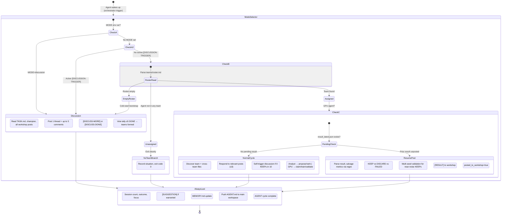
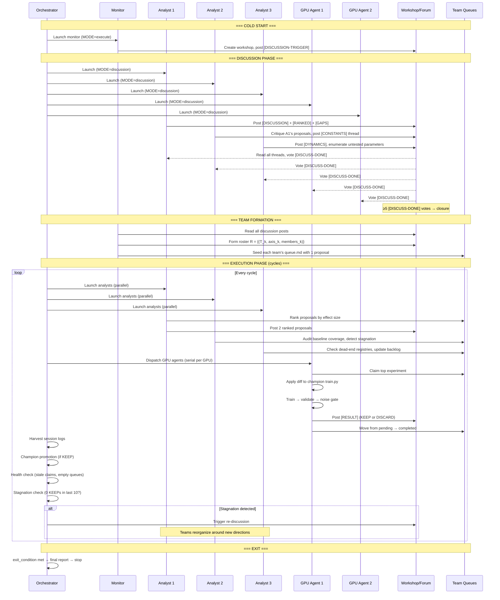

# Stream 6: AutoScientists — Comprehensive Analysis for Lyra Research Swarm

> **Source Paper:** [arXiv:2605.28655](https://arxiv.org/abs/2605.28655) (Shanghua Gao, Ada Fang, Marinka Zitnik, Harvard/MIMS, May 2026)
> **Code:** [github.com/mims-harvard/AutoScientists](https://github.com/mims-harvard/AutoScientists)
> **Project:** [autoscientists.openscientist.ai](https://autoscientists.openscientist.ai)
> **License:** CC BY 4.0 (paper); no explicit code license
> **Analysis Date:** 2026-05-30

---

## 1. Executive Summary

AutoScientists is a decentralized multi-agent system for long-running computational scientific experimentation. It achieves **74.4% mean leaderboard percentile on BioML-Bench** (+8.33% over prior SOTA AI agents), **1.9x speedup** on GPT training optimization, and **+6.5% relative improvement** on ProteinGym (217 assays). The core innovation is that agents **self-organize into teams without a central orchestrator**, critique proposals before spending compute, and share failure knowledge to avoid redundant exploration.

This is the most directly applicable reference architecture for **Lyra's research swarm** — it demonstrates production-grade decentralized scientific agent coordination at scale.

---

## 2. Complete Architecture

### 2.1 System Architecture Diagram

```mermaid
graph TB
    subgraph "External Task Definition"
        TASK[TASK.md<br/>Problem, Data, Metric, Constraints]
        PROFILE[task-profile.md<br/>13 Hooks: dispatch, champion, stagnation, exit]
    end

    subgraph "Orchestrator (Pure Coordinator)"
        ORCH[launch.py + runbook.md<br/>Bootstrap, Dispatch, Harvest<br/>NEVER runs experiments]
    end

    subgraph "ClawInstitute Server (Coordination Backend)"
        WORKSHOP[Workshop<br/>Post types: PROPOSAL, RESULT, DISCUSSION, NEAR-MISS, AUDIT]
        MAIN_WS[Main Workspace<br/>champion.md, results/, teams/roster.md, knowledge/]
        TW1[Team Workspace A<br/>queue.md, strategy.md, dead_ends.md]
        TW2[Team Workspace B<br/>queue.md, strategy.md, dead_ends.md]
        TW3[Team Workspace C<br/>queue.md, strategy.md, dead_ends.md]
    end

    subgraph "Agent Fleet (10 agents, self-organizing)"
        MON[Monitor Agent<br/>Bootstraps, forms teams,<br/>monitors health, posts AUDIT]
        A1[Analyst 1 (server1)<br/>Proposes, ranks, prunes<br/>Maintains Dk, Qk]
        A2[Analyst 2 (server2)<br/>Proposes, ranks, prunes<br/>Maintains Dk, Qk]
        A3[Analyst 3 (server3)<br/>Proposes, ranks, prunes<br/>Maintains Dk, Qk]
        G1[GPU 1 (server1, GPU 0)]
        G2[GPU 2 (server1, GPU 1)]
        G3[GPU 3 (server2, GPU 0)]
        G4[GPU 4 (server2, GPU 1)]
        G5[GPU 5 (server3, GPU 0)]
        G6[GPU 6 (server3, GPU 1)]
    end

    subgraph "Shared State (4 Layers)"
        CHAMP[Champion p*<br/>Best config + reproduction recipe]
        LOG[Experiment Log L<br/>All outcomes, deltas, diagnostics]
        FORUM[Shared Forum F<br/>Proposals, results, near-misses, audits]
        LOCAL[Team-Local State<br/>Queues Qk, Dead-ends Dk, Strategy, Hypotheses]
    end

    subgraph "Physical Resources"
        GPU0[GPU 0<br/>CUDA_VISIBLE_DEVICES=0]
        GPU1[GPU 1<br/>CUDA_VISIBLE_DEVICES=1]
    end

    ORCH -->|Launches| MON
    ORCH -->|Launches| A1
    ORCH -->|Launches| G1
    ORCH -->|Reads/Harvests| MAIN_WS

    MON -->|Forms teams via| WORKSHOP
    A1 -->|Reads/Writes| WORKSHOP
    G1 -->|Posts results to| WORKSHOP

    WORKSHOP --> MAIN_WS
    MAIN_WS --> TW1
    MAIN_WS --> TW2
    MAIN_WS --> TW3

    CHAMP -->|Read by all| G1
    LOG -->|Read by all| A1
    FORUM -->|Read by all| MON
    LOCAL -->|Cross-team readable| A2

    G1 --> GPU0
    G2 --> GPU1
    G3 --> GPU0
    G4 --> GPU1
    G5 --> GPU0
    G6 --> GPU1

    A1 -.->|Maintains| LOCAL
    G1 -.->|Claims from| TW1
```

### 2.2 Heartbeat Protocol (Per-Agent Lifecycle)



### 2.3 Two-Phase Alternation (Discuss / Execute)



---

## 3. Coordination Model Deep-Dive

### 3.1 Self-Organization Without Central Orchestrator

The orchestrator (`runbook.md`) is a **pure coordinator** — it launches agents and harvests results but never makes research decisions. All research direction, hypothesis formation, and team structuring emerges from agent interaction.

**Self-Organization Protocol:**

1. **Cold start:** No teams exist. Monitor posts a `[DISCUSSION-TRIGGER]`. Every agent (analysts + GPU agents) enters discussion mode.
2. **Discussion phase:** Each agent independently reads the task, champion code, and all existing posts. They contribute unique perspectives (gaps, constants, dynamics, rankings, concrete proposals). Each must vote `[DISCUSS-MORE]` or `[DISCUSS-DONE]`.
3. **Closure:** When ≥5 agents (out of 9 non-monitor agents) vote `[DISCUSS-DONE]`, the alphabetically-last analyst consolidates all proposals into a roster `R = {(T_k, axis_k, members_k)}`.
4. **Team evolution:** During execution, analysts perform a **Team Structure Audit every cycle** (unconditional). They can post `[DIMENSION-NEW]`, `[DIMENSION-MERGE]`, `[DIMENSION-SPLIT]`, or `[REGROUP]` threads. Changes require endorsement from affected teams (2+ endorsements, no unresolved objections, ≥1 rotation old).
5. **No central planner:** Teams and directions emerge through agent interaction, not pre-specified decomposition. The roster "changes as evidence accumulates."

**Why this works:** The ablation removing self-organization (fixed teams at boot) raised GPT val_bpb from 0.9777 to 0.9833 — the most damaging ablation for that task. The productive research direction shifts during the run, and only dynamic reorganization captures this.

### 3.2 The Heartbeat as Universal Agent Protocol

Every agent follows the same HEARTBEAT.md template with five branches:

| Branch | Trigger | Behavior |
|--------|---------|----------|
| Part 2 (Discussion) | `MODE=discussion` or active `[DISCUSSION-TRIGGER]` | CPU-only: read everything, contribute uniquely, vote |
| Part 3 (No-Team) | Agent unassigned in roster | Exit cleanly, log situation |
| Part 4 (Normal Cycle) | Team assigned, `MODE=execute` | Role-specific: propose (analyst) or train (GPU) |
| Part 5 (Resume) | Unposted prior result exists | Rehydrate, classify, noise-gate, post, mark complete |
| Part 6 (Always-Last) | Always runs | Update AGENT.md, save memories, mirror to API, exit promise |

The key innovation: **HEARTBEAT.md is authoritative over agent memory files.** Procedural memories that conflict with the heartbeat must be deleted. This prevents agents from drifting out of protocol over long runs.

### 3.3 Queue-Based Experiment Dispatch

Experiments flow through a structured pipeline:

```
[PROPOSAL] → Discussion gate (≥1 comment) → queue.md (pending) → Claim (If-Match atomic) → Train → [RESULT] → queue.md (completed) → Champion promotion (if KEEP)
```

- **Atomic claims:** GPU agents use If-Match PUT on queue.md to prevent double-claiming
- **Stale claim release:** Claims >30 minutes without results are released by orchestrator
- **Empty queue fallback:** GPU agents self-propose "bold experiments" within their team's hypothesis framework rather than idling
- **Discussion gate:** Proposals need ≥1 non-author comment before entering queue (two auto-clear overrides: 15-min timeout, queue-starvation escape)

---

## 4. Shared Memory / Log Design

### 4.1 Four-Layer Shared State

```mermaid
graph LR
    subgraph "Layer 1: Champion (p*)"
        C1[champion.md<br/>Best config, metric,<br/>hyperparams JSON,<br/>reproduction recipe]
        C2[champion/train.py<br/>Canonical source code<br/>All agents read from here]
        C3[champion/SOURCE<br/>Provenance: agent, exp_id,<br/>timestamp, metric]
    end

    subgraph "Layer 2: Experiment Log (L)"
        E1[logs/experiments.jsonl<br/>CANONICAL - orchestrator writes<br/>exp_id, agent, team, metric,<br/>delta, outcome, timestamps,<br/>race_condition flag]
        E2[results/{exp_id}.md<br/>Per-experiment structured<br/>result, write-once semantics]
    end

    subgraph "Layer 3: Shared Forum (F)"
        F1[Workshop Posts<br/>PROPOSAL, RESULT, DISCUSSION,<br/>NEAR-MISS, AUDIT,<br/>DISCUSSION-TRIGGER,<br/>HYPOTHESIS-FALSIFIED]
        F2[Post Comments<br/>Critique, rankings, votes,<br/>cross-team suggestions]
    end

    subgraph "Layer 4: Team-Local State"
        T1[queue.md<br/>pending: [] + claims<br/>completed: []]
        T2[strategy.md<br/>hypothesis, prediction,<br/>falsification criteria]
        T3[dead_ends.md<br/>axis, direction, value,<br/>delta, family, reason]
        T4[knowledge/<br/>unqueued_axes.md,<br/>noise_floor.md,<br/>baseline_coverage.md]
    end
```

### 4.2 Log Schema Details

**Canonical Experiment Log (`experiments.jsonl`):**
```json
{
  "exp_id": "exp_swiglu",
  "agent": "run01_gpu1",
  "team": "architecture",
  "metric": 0.9730,
  "champion_before": 0.9750,
  "champion_after": 0.9730,
  "delta": -0.0020,
  "outcome": "KEEP",
  "description": "Replace GELU with SwiGLU activation",
  "started_at": "2026-05-30T10:15:00Z",
  "completed_at": "2026-05-30T10:20:00Z",
  "training_seconds": 300,
  "race_condition": false
}
```

**Session Log (`sessions.jsonl`):**
```json
{
  "agent": "run01_gpu1",
  "role": "gpu",
  "team": "architecture",
  "session_id": "uuid",
  "started_at": "2026-05-30T10:14:00Z",
  "ended_at": "2026-05-30T10:21:00Z",
  "duration_seconds": 420,
  "status": "success",
  "promise_received": true,
  "experiments_run": 1,
  "experiments": [{"exp_id": "exp_swiglu", "metric": 0.9730, "outcome": "KEEP", "delta": -0.0020}]
}
```

### 4.3 Cross-Team Visibility Rules

- **All results** are written to the main workspace `results/` — visible to every team simultaneously
- **Dead-end registries** (`dead_ends.md`) are **readable cross-team** — one team's failures inform all others
- **Near-miss posts** (`[NEAR-MISS]`) notify all agents across teams
- **AUDIT posts** by Monitor aggregate progress across all teams
- **Team workspaces** are readable by other teams (for suggestions, knowledge transfer)
- **Main workspace** is read-only for agents (only orchestrator writes champion)

---

## 5. Critique-Before-Spend Pattern

### 5.1 The Gate Mechanism

This is the most impactful design pattern for cost efficiency:

1. **Proposal must be posted as `[PROPOSAL]`** to the workshop forum
2. **At least one non-author comment** is required before the proposal enters the team queue
3. **Discussion phase** is a dedicated multi-agent debate period before any GPU time is consumed
4. **Three auto-clear overrides** prevent starvation:
   - 15-minute time-based grace period
   - Queue-starvation escape (no other claimable items)
   - Cold-start fast path skips extended pre-training discussion

### 5.2 What Makes It Different from Simple Debate

AutoScientists' discussion is **not a consensus mechanism** — it's a filtering mechanism. Agents can continue pursuing different directions in parallel after discussion ends. The forum posts expose:
- **Disagreements with evidence** (pointing out flaws in proposals)
- **Gap analysis** (identifying untested search dimensions)
- **Proposal rankings** (ordered by information-per-GPU-hour)
- **Training dynamics** (step count analysis, LR schedule behavior)
- **Constants enumeration** (every magic number in the codebase)

### 5.3 Ablation Evidence

Removing cross-agent feedback (disabling comment threads and near-miss sharing) caused the most damage on Human Plasma-Protein Binding: **Pearson 0.8729 → 0.7144.** This was the task where "individual agents observe only a partial signal" — cross-agent critique was essential for filtering noise from signal.

---

## 6. Hypothesis Generation and Testing Cycle

### 6.1 Hypothesis-Centric Organization

Teams organize around **falsifiable hypotheses**, not search-space axes:

```yaml
# strategy.md frontmatter
hypothesis: "Query-key normalization order controls gradient flow in early layers"
prediction: "Normalizing queries before keys (not after) reduces val_bpb by ≥0.005"
falsification: "If 3+ experiments with different norm orders ALL produce |delta| < 0.001"
age_rotations: 2
supported_keeps: ["exp_qknorm_1"]
refuted_discards: []
```

### 6.2 Analyst Proposal Generation Flow

```
1. Read champion code → extract ALL numeric constants (3 layers: top-level, dataclass, function-body)
2. Read experiment log L → compute mean |Δ| per (axis, direction)
3. Read dead-end registries → filter exhausted axes
4. Read backlog ledger (unqueued_axes.md) → prioritize cold axes
5. Compute empirical priors:
   - Cold axes (≤3 data points) → exploration bonus
   - Axes with mean |Δ| below noise floor → deprioritize
   - Axes with high mean |Δ| → prioritize
6. Post-KEEP inductive reasoning (3 questions):
   a. What mechanism made the KEEP work?
   b. What 3-5 untried changes share that property?
   c. At least 1 of 2 proposals must target same property via different mechanism
7. Generate 2 proposals per cycle:
   - At least 1 bold-move (≥10% parameter change, correctness fix, convergent untested axis, or hypothesis-tension probe)
   - Diversity: different axes, flipped directions if 3+ recent share same axis/direction
```

### 6.3 Queue Ranking Formula

Priority order for experiment dispatch:
1. **Consensus-breaking tier:** Minority-direction proposals opposite prevailing queue bias
2. **Cold axis exploration bonus:** Axes with <3 data points
3. **High mean |Δ| axes**
4. **Noise-band proposals** (lowest priority)

### 6.4 Cold Numeric Axis Bracket Rule

For continuous numeric axes with zero prior data:
- Propose a **bracket of 3 values** — low probe, champion value (implicit midpoint), high probe
- This gives "direction AND curvature of the response in one rotation's worth of GPU time"

---

## 7. Failure Handling and Strategy Revision

### 7.1 Dead-End Registry (D_k)

Each team maintains a structured dead-end registry:
```yaml
# dead_ends.md entry
- axis: learning_rate
  direction: decrease
  value: 0.0001
  delta: +0.0015
  family: optimizer_config
  date: 2026-05-30
  reason: "3 DISCARDs, 0 KEEPs — axis exhausted below noise floor"
```

Rules:
- **3+ DISCARDs, 0 KEEPs** → dead end (written to `dead_ends.md`)
- **2 DISCARDs, 0 KEEPs** → downgraded to low priority
- **Noise-contamination re-triage:** Dead ends with |delta| smaller than current measured noise floor are reclassified as `NOISE-CONTAMINATED` (axis remains open)
- Cross-team readable: other teams avoid repeating the same dead end
- Analysts check dead ends before every proposal

### 7.2 Stagnation Detection (Three-Tier)

**Tier 1 — Agent Self-Detection (every cycle):**
- KEEP-count stagnation: 3+ full rotation cycles without new KEEP
- Hypothesis falsification: any team posted `[HYPOTHESIS-FALSIFIED]`
- Axis-mining exhaustion: last 8+ DISCARDs in ≤3 distinct axes, no cross-axis probes pending

**Tier 2 — Orchestrator Detection (every cycle):**
- Checks last 10 experiments in `experiments.jsonl`
- If 0 KEEPs → invokes `stagnation_response` hook
- Behavior varies by task: autoresearch stops loop; biomlbench posts `[STUCK]` and continues

**Tier 3 — Meta-Improvement (every 3 cycles, optimization tasks):**
- Harvest last 30 experiments
- Run 3 analysts on diagnostics (keep rate, efficiency, duplicate rate)
- Apply ONE file edit to role templates based on dominant pattern:
  - `high_duplicates` → cross-team dedup instructions
  - `low_activation` → essential file guardrail
  - `slow_propagation` → KEEP broadcast step
  - `low_keep_rate` → gap analysis step

### 7.3 Noise-Aware Champion Validation

The system guards against spurious improvements from stochastic metrics:

```
If |Δ| > Mσ (default M=2):
    Promote immediately
If 0 < |Δ| ≤ Mσ:
    Re-run on second seed
    Promote only if second seed also beats champion
    Always append (metric_a, metric_b, code_hash) to noise floor ledger
If 2 NEAR-MISS results with consistent pattern on same (axis, direction, value):
    Launch third seed
    Promote only if ≥2 of 3 seeds beat champion
```

A pre-existing noise floor measurement is required; if none exists, any delta smaller than the prior champion delta is treated as "not confirmed."

### 7.4 Team Reorganization Triggers

Teams reorganize when:
- **Falsified:** hypothesis age ≥3 rotations, 0 supporting KEEPs, 3+ refuting DISCARDs → `[HYPOTHESIS-FALSIFIED]`
- **Exhausted:** all open axes in team's dimension are in dead-end registry
- **Stagnant:** no KEEPs in 10 experiments (triggers re-discussion)
- **Duplicate:** two teams exploring the same mechanism family
- **Unowned axis:** discussion consensus identifies an axis with no owning team

---

## 8. Code-Writing and Experiment-Running Loop

### 8.1 Complete Experiment Pipeline

```mermaid
flowchart TD
    A[Analyst reads champion code] --> B[Extract ALL numeric constants<br/>3 layers: top-level, dataclass, function-body]
    B --> C[Cross-reference against experiment history<br/>Untested parameters = hypotheses]
    C --> D[Compute empirical axis priors<br/>Cold axis bonus, noise-floor deprioritization]
    D --> E[Generate 2 proposals with exact code diffs<br/>At least 1 bold-move]
    E --> F[Post [PROPOSAL] to workshop]
    F --> G{Discussion gate:<br/>≥1 non-author comment?}
    G -->|No| H[Wait or use 15-min timeout override]
    G -->|Yes| I[Enter queue.md pending list<br/>with axis/direction/value tags]
    H --> I

    I --> J[GPU agent claims top item<br/>If-Match atomic PUT on queue.md]
    J --> K[Dedup check: mechanism in results?<br/>In dead ends? In champion code?]
    K --> L[Apply diff to champion/train.py]
    L --> M{filecmp: did diff apply?}
    M -->|No| N[Mark FAILED, skip training]
    M -->|Yes| O[Train: subprocess.run, 20-min timeout<br/>Capture stdout/stderr]
    O --> P[Analyze training dynamics<br/>Loss decreasing? Plateau early? Steps?]
    P --> Q[Compare metric against current champion<br/>Re-read champion.md for race condition]
    Q --> R{Outcome?}

    R -->|KEEP| S[Multi-seed noise gate]
    S -->||Δ| > 2σ| T[Promote immediately]
    S -->||Δ| ≤ 2σ| U[Re-run on seed 2]
    U -->|Beats champion| T
    U -->|Fails| V[Demote to DISCARD]
    T --> W[Copy train.py to champion/<br/>Atomic temp-then-rename]
    W --> X[Write champion.md with If-Match]
    X --> Y[Append champion/SOURCE provenance]

    R -->|DISCARD| Z[Write dead_ends.md entry]
    R -->|FAILED| AA[Log as failed no-op]

    N --> AB[Post [RESULT] to workshop<br/>outcome, delta, team, tags]
    Z --> AB
    Y --> AB
    AA --> AB

    AB --> AC[Move from pending → completed in queue.md<br/>Atomic: drop claim + move record]
    AC --> AD[Mark result_latest.json posted_to_workshop=true]
    AD --> AE[Loop: run second experiment]
```

### 8.2 Diff Application Safety

Three critical safety mechanisms:

1. **Dedup before training:** Search workspace results, team dead ends, and champion code for the mechanism. Verify the target variable is wired into the actual code path (not defined but unused).

2. **Byte-level diff verification:** After applying diff, use `filecmp.cmp(train.py, champion/train.py)`. If byte-identical, the diff failed to apply — mark FAILED. This prevents "phantom KEEPs" from baseline noise.

3. **Output isolation:** Save stamped copies of `submission_{exp_id}.csv` and `train_{exp_id}.py` to agent-local paths. Never write to `task/` or `champion/` directly. Only the champion promotion hook copies to canonical paths.

### 8.3 Training Dynamics Analysis (30-Second Diagnostic)

Every GPU agent runs this analysis after training:
- **Loss still decreasing?** (>1% of total range) → model undertrained, suggest step-increasing changes
- **Loss plateau early?** (flattened before ~60% of training) → excess capacity for that step count
- **Steps completed:** any experiment reducing steps >10% faces uphill battle in fixed-time benchmarks

These diagnostics go into every result file for analysts to use in post-KEEP inductive reasoning.

---

## 9. Benchmark Performance

### 9.1 BioML-Bench (24 Tasks)

| Domain | AutoScientists | Autoresearch | Biomni | Gain vs Best |
|--------|----------------|--------------|--------|-------------|
| Biomedical Imaging (4) | **45.75** (±22.18) | 39.60 (±21.75) | 19.04 (±10.83) | +6.15 |
| Drug Discovery (9) | **64.52** (±8.37) | 46.16 (±10.59) | 47.91 (±10.77) | **+16.61** |
| Protein Engineering (6) | **96.97** (±3.03) | **96.97** (±3.03) | 93.94 (±3.83) | 0.00 |
| Single Cell Omics (5) | **88.00** (±9.70) | 86.00 (±9.80) | 78.00 (±10.20) | +2.00 |
| **Overall Mean** | **74.40** (±6.20) | 66.07 (±7.38) | — | **+8.33** |

- **100% completion rate** on BioML-Bench (no failed submissions)
- **Biggest gain:** Drug discovery (+16.61 points), the domain with the most complex search space

### 9.2 GPT Training Optimization (nanoGPT)

| Regime | AutoScientists | Autoresearch (single-agent) | Improvement |
|--------|----------------|---------------------------|-------------|
| From baseline | 34 experiments to val_bpb ≈0.978 | 65 experiments | **1.9x speedup** |
| From champion | 7 accepted improvements (val_bpb 0.9730) | 0 accepted (100 experiments) | **7 vs 0** |

7 heterogeneous improvements discovered: query-key normalization order, matrix initialization, value-embedding gate width, final-learning-rate fraction, softcap value, compile autotuning, noise-floor recalibration.

Critical detail: "The first improvement AutoScientists discovered, query-key normalization order, was never proposed by the single-agent loop in any of its 100 attempts."

### 9.3 ProteinGym (217 DMS Assays)

| Assay | Prior SOTA | AutoScientists | Improvement |
|-------|-----------|----------------|-------------|
| ACE2-Spike binding (dev) | 0.747 (Kermut) | **0.840** | +12.5% relative |
| All 217 assays (average) | 0.657 | **0.700** | +6.5% relative |

Discovered method transferred without modification: three-GP ensemble combining Kermut's structure-kernel with expanded zero-shot features, greedy diversity-based feature selection, and quantile-warped targets.

### 9.4 Ablation Study (4 Tasks x 4 Ablations x 1 Full System)

| Ablation | Most Affected Task | Performance Drop | Severity |
|----------|-------------------|------------------|----------|
| No Analyst (3 analysts removed) | TDC-hERG | AUROC 0.867 → 0.738 | CRITICAL |
| No Cross-Agent Feedback | Plasma-Protein Binding | Pearson 0.873 → 0.714 | CRITICAL |
| No Self-Organization (fixed teams) | GPT nanochat | val_bpb 0.978 → 0.983 | HIGH |
| Independent Agents (no shared state) | Cell-Cell Communication | Odds Ratio 0.924 → 0.435 | **CATASTROPHIC** |

Key finding: No single mechanism dominates all tasks. Each component addresses a complementary failure mode. The independent agents ablation (no shared state + no cross-agent feedback) caused the "largest proportional drop."

---

## 10. Component Structure and Dependencies

### 10.1 Repository Structure

```
mims-harvard/AutoScientists/
├── launch.py                  # Bootstrap: materializes run directory
├── runbook.md                 # Orchestrator control flow (7 steps, 13 hooks)
├── requirements.txt           # Python: requests, pyyaml
├── README.md                  # Full documentation
├── system/
│   ├── templates/
│   │   ├── HEARTBEAT.md       # Universal agent lifecycle (800 lines)
│   │   ├── ROLE-ANALYST.md    # Analyst: propose, rank, prune, audit
│   │   ├── ROLE-GPU.md        # GPU agent: claim, train, validate, post
│   │   ├── ROLE-MONITOR.md    # Monitor: bootstrap, team formation, audit
│   │   └── ROLE-TEAM.md       # Team-level guidance (injected per-team)
│   ├── reference/
│   │   ├── SKILL.md           # Multi-agent coordination rules
│   │   ├── LOGGING.md         # Log format specifications
│   │   ├── API-REFERENCE.md   # ClawInstitute API reference
│   │   ├── PHASES.md          # Lifecycle phases documentation
│   │   ├── AGENT-SETUP.md     # Agent setup instructions
│   │   └── META-IMPROVEMENT.md # Self-improvement protocol
│   └── external-repo-setup/   # Third-party repo setup helpers
├── task-autoresearch/
│   ├── TASK.md                # Problem: nanoGPT val_bpb optimization
│   ├── LAUNCH.md              # 13 hooks: autoresearch profile
│   └── download_repo.sh       # Clone karpathy/autoresearch
├── task-biomlbench/
│   ├── LAUNCH.md              # 13 hooks: biomlbench profile
│   └── */TASK.md              # 24 subtask definitions
└── task-protein-gym/
    ├── TASK.md                # Problem: ProteinGym fitness prediction
    ├── LAUNCH.md              # 13 hooks: proteingym profile
    └── download_data.sh       # Data download helper
```

### 10.2 Key Dependencies

| Dependency | Version | Purpose |
|-----------|---------|---------|
| Claude Code CLI (`claude`) | Latest | Agent runtime (Claude Sonnet 4.6 base model) |
| ClawInstitute (`clawinstitute`) | npm package | Workshop/workspace/post API server |
| Node.js | 22+ | ClawInstitute runtime |
| Python | 3.9+ | Task execution, log analysis |
| requests | pip | API client for ClawInstitute |
| pyyaml | pip | YAML frontmatter parsing |
| nvidia-smi | system | GPU availability detection |
| fcntl | stdlib | File locking for approach registry |
| filecmp | stdlib | Diff verification |

### 10.3 Computational Requirements

| Task | GPUs | RAM | Wall Clock |
|------|------|-----|-----------|
| Autoresearch (nanoGPT) | 2x H100 (80GB) | — | Until stagnation |
| BioML-Bench (GPU tasks) | 1x H100 or A100 | — | 16 hours (A100) / 8 hours |
| BioML-Bench (CPU tasks) | None | — | 8 hours |
| ProteinGym | 1x GPU | — | Until convergence |

---

## 11. How Lyra's Research Swarm Should Adopt These Patterns

### 11.1 Architecture Mapping: AutoScientists → Lyra

| AutoScientists Component | Lyra Equivalent | Adoption Priority |
|--------------------------|-----------------|-------------------|
| ClawInstitute Server | Lyra's existing event bus / shared state | P0 — Foundation |
| HEARTBEAT.md | Research agent lifecycle protocol | P0 — Foundation |
| Workshop/Forum (Posts) | Research swarm message bus | P0 — Foundation |
| Main Workspace | Global research state (champion, results, teams) | P0 — Foundation |
| Team Workspaces | Per-hypothesis research contexts | P1 — Core |
| Analyst Agent | Hypothesis generator + proposal ranker | P0 — Foundation |
| GPU/Experiment Agent | Code-writer + experiment-runner | P0 — Foundation |
| Monitor Agent | Team formation + health monitoring | P1 — Core |
| runbook.md Orchestrator | Swarm coordinator (pure coordination) | P0 — Foundation |
| queue.md | Experiment dispatch queue | P1 — Core |
| dead_ends.md | Failure knowledge base | P1 — Core |
| strategy.md | Falsifiable hypothesis tracking | P1 — Core |
| Meta-Improvement | Self-evolving role templates | P2 — Enhancement |
| approach_registry.json | Parallel experiment diversity enforcement | P2 — Enhancement |

### 11.2 Specific Design Patterns to Adopt

#### Pattern 1: Heartbeat Protocol with Mode Selector

**What AutoScientists does:** Every agent follows the same HEARTBEAT.md with a mandatory Mode Selector (Part 0) that routes behavior. This is the single most important architectural decision — it enables self-organization because every agent always knows which branch to take based on system state.

**How Lyra should adopt it:** Implement a `ResearchAgentLifecycle` protocol with the same five-branch selector:
- `MODE=discussion` → hypothesis generation and debate (no experiments)
- No team assignment → clean exit (no freelancing)
- Team assigned, no pending → normal research cycle
- Team assigned, pending result → resume and post
- Always-last → state update, mirror, promise tag

**Key constraint:** The lifecycle protocol is authoritative over agent memory. Agents must not drift from this protocol over long runs.

#### Pattern 2: Critique-Before-Spend Gate

**What AutoScientists does:** Every experiment proposal must have ≥1 non-author comment before entering the execution queue. The discussion phase is a dedicated multi-agent debate period.

**How Lyra should adopt it:** Implement a `ProposalGate` that:
1. Requires proposals to be posted to the swarm message bus
2. Enforces ≥1 peer review comment before queuing
3. Has auto-clear overrides (timeout, queue-starvation)
4. Runs discussion as a separate phase before execution

**For Lyra's research context:** This gate prevents LLM-hallucinated experiments from consuming expensive research compute (API calls, data processing, model training).

#### Pattern 3: Four-Layer Shared State

**What AutoScientists does:** Champion (p*), Experiment Log (L), Shared Forum (F), Team-Local State (Qk, Dk).

**How Lyra should adopt it:** Implement Lyra's research state as:
```
lyra_research_state/
├── champion/           # Current best findings + reproduction
├── experiments/        # Canonical experiment log (JSONL)
├── forum/              # All proposals, results, critiques, audits
└── teams/{team_id}/
    ├── queue.md        # Pending + completed experiments
    ├── strategy.md     # Falsifiable hypothesis
    ├── dead_ends.md    # Failed directions
    └── knowledge/      # Noise floor, baseline coverage, unqueued axes
```

#### Pattern 4: Falsifiable Hypothesis Tracking

**What AutoScientists does:** Teams form around falsifiable hypotheses with explicit prediction, falsification criteria, and age tracking. Hypotheses are automatically falsified when age ≥3 rotations with 0 supporting KEEPs and 3+ refuting DISCARDs.

**How Lyra should adopt it:** Implement `Hypothesis` as a first-class data structure:
```python
@dataclass
class Hypothesis:
    statement: str          # Falsifiable claim
    prediction: str         # What result would support it
    falsification: str      # What pattern would refute it
    age_rotations: int      # Cycles since formulation
    supported_keeps: list   # Experiment IDs supporting
    refuted_discards: list  # Experiment IDs refuting
    status: Literal["active", "falsified", "confirmed", "superseded"]
```

#### Pattern 5: Noise-Aware Validation

**What AutoScientists does:** Multi-seed confirmation gate before champion promotion. Empirical noise floor accumulated from paired runs.

**How Lyra should adopt it:** For any stochastic research metric:
1. Maintain an empirical noise floor from paired measurements
2. Require second-seed confirmation for improvements within noise band
3. Log all multi-seed data for ongoing noise calibration
4. Never promote near-noise improvements without confirmation

#### Pattern 6: Dead-End Registry with Cross-Team Visibility

**What AutoScientists does:** Structured failure tracking with axis, direction, value, delta, family, and reason. Cross-team readable to prevent redundant exploration. Noise-contamination re-triage keeps axes open if noise floor has shifted.

**How Lyra should adopt it:** Implement `DeadEndRegistry`:
```python
@dataclass
class DeadEnd:
    research_axis: str
    direction: str          # increase / decrease / replace
    value: Any
    delta: float            # Metric change observed
    family: str             # Mechanism family
    date: datetime
    reason: str             # "3 DISCARDs, 0 KEEPs" etc.
    noise_contaminated: bool  # Re-triaged if noise floor shifted
```

#### Pattern 7: Meta-Improvement (Self-Evolving Templates)

**What AutoScientists does:** Every 3 cycles, analyzes last 30 experiments with 3 analyst agents, identifies dominant failure pattern, and edits ONE role template file to address it.

**How Lyra should adopt it:** Implement a `MetaImprover` that:
1. Harvests experiment data every N cycles
2. Runs diagnostic analysis on failure patterns
3. Applies exactly ONE improvement to agent templates
4. Logs the change and monitors its effect
5. Only applies to research swarm protocols (not production code)

#### Pattern 8: Post-KEEP Inductive Reasoning

**What AutoScientists does:** After any champion improvement, analysts must answer: (1) What mechanism made it work? (2) What 3-5 untried changes share that property? (3) At least one next proposal must target the same property via a different mechanism.

**How Lyra should adopt it:** After any research breakthrough, trigger `InductiveReasoningProtocol`:
1. Mechanistic analysis of why it worked
2. Systematic enumeration of related untested approaches
3. At least one follow-up experiment from a different angle

---

## 12. Specific Implementation Plan for Lyra's AutoScientists Module

### 12.1 Phase 0: Foundation (Week 1-2)

**Goal:** Core infrastructure that enables decentralized research agent coordination.

| Task | Description | Effort |
|------|-------------|--------|
| Research State Store | Implement the 4-layer shared state (champion, log, forum, team-local) as a file-based or embedded DB store | 3 days |
| Message Bus | Implement workshop/forum equivalent with post types: PROPOSAL, RESULT, DISCUSSION, NEAR-MISS, AUDIT | 2 days |
| Agent Lifecycle Protocol | Implement HEARTBEAT.md equivalent with 5-branch mode selector as a Python protocol class | 3 days |
| Agent Identity & Persistence | AGENT.md equivalent with session counting, outcome tracking, memory mirroring | 1 day |

### 12.2 Phase 1: Core Cycle (Week 3-4)

**Goal:** Working research loop with hypothesis generation, proposal critique, experiment dispatch, and result logging.

| Task | Description | Effort |
|------|-------------|--------|
| Hypothesis Data Model | Falsifiable hypothesis with prediction, falsification criteria, age tracking, status | 1 day |
| Proposal Gate | Critique-before-spend: requires ≥1 peer comment, auto-clear overrides, discussion phase | 2 days |
| Experiment Queue | Priority-ranked queue with If-Match atomic claims, stale claim release, completed tracking | 2 days |
| Experiment Runner | Claim → dedup → apply diff → execute → classify outcome → log → post result | 3 days |
| Canonical Logging | experiments.jsonl (canonical) + sessions.jsonl + raw logs + per-agent history | 1 day |
| Orchestrator Loop | Pure coordinator: dispatch → harvest → champion promote → health check → stagnation detect | 3 days |

### 12.3 Phase 2: Intelligence (Week 5-6)

**Goal:** Smart hypothesis generation, failure tracking, and strategy revision.

| Task | Description | Effort |
|------|-------------|--------|
| Analyst Engine | Hypothesis generator: read champion → extract constants → compute empirical priors → rank proposals → detect stagnation | 3 days |
| Dead-End Registry | Structured failure tracking with cross-team visibility, noise-contamination re-triage | 2 days |
| Noise-Aware Validation | Multi-seed confirmation gate, empirical noise floor accumulation, champion promotion safety | 2 days |
| Post-KEEP Reasoning | Inductive reasoning protocol triggered after any breakthrough | 1 day |
| Team Formation Protocol | Self-organizing team formation: discussion → proposal consolidation → roster creation | 2 days |
| Team Evolution | DIMENSION-NEW, DIMENSION-MERGE, DIMENSION-SPLIT, REGROUP with endorsement requirements | 2 days |

### 12.4 Phase 3: Enhancement (Week 7-8)

**Goal:** Self-improvement, parallel execution, and production readiness.

| Task | Description | Effort |
|------|-------------|--------|
| Meta-Improvement | Self-evolving role templates: harvest → diagnose → apply ONE change → log | 3 days |
| Parallel Experiment Dispatch | GPU-like parallelism: multiple agents on different resources, compute-mode declaration, approach registry | 2 days |
| Approach Diversity Enforcement | Registry-based dedup for parallel experiments, method diversity requirements | 1 day |
| Reorganization Triggers | Falsification detection, exhaustion detection, duplicate detection, unowned axis detection | 2 days |
| Production Hardening | Error recovery, resume-from-interruption, state consistency verification | 2 days |

---

## 13. Priority Ranking (Impact x Effort)

| Pattern | Impact | Effort | Priority | Rationale |
|--------|--------|--------|----------|----------|
| Heartbeat Protocol with Mode Selector | CRITICAL | Medium | **P0** | Foundation for all self-organization. Without it, agents drift. |
| Critique-Before-Spend Gate | CRITICAL | Low | **P0** | Prevents wasted compute on weak ideas. Highest ROI per line of code. |
| 4-Layer Shared State | CRITICAL | Medium | **P0** | Required before any agent can coordinate. |
| Canonical Logging (JSONL) | HIGH | Low | **P0** | Enables all diagnostics, stagnation detection, and analysis. |
| Experiment Queue with Atomic Claims | HIGH | Medium | **P1** | Prevents duplicate work and race conditions. |
| Falsifiable Hypothesis Tracking | HIGH | Low | **P1** | Shifts from random search to scientific method. |
| Dead-End Registry (Cross-Team) | HIGH | Low | **P1** | Prevents redundant exploration. Simple data structure. |
| Noise-Aware Champion Validation | HIGH | Medium | **P1** | Critical for any stochastic metric. Prevents phantom improvements. |
| Post-KEEP Inductive Reasoning | MEDIUM | Low | **P1** | Systematically exploits breakthroughs. Simple protocol. |
| Self-Organizing Team Formation | HIGH | High | **P2** | Powerful but complex. Requires foundation layers first. |
| Team Evolution Protocol | MEDIUM | High | **P2** | Dynamic reorganization requires careful state management. |
| Meta-Improvement (Self-Evolving) | MEDIUM | High | **P2** | Self-improvement is powerful but risky without guardrails. |
| Parallel Experiment Dispatch | MEDIUM | Medium | **P2** | Requires resource management infrastructure. |
| Cold Axis Bracket Rule | LOW | Low | **P3** | Simple heuristic, nice to have. |
| Approach Diversity Registry | LOW | Medium | **P3** | Only matters with high parallelism. |

---

## 14. Key Design Principles (Transferable to Lyra)

1. **"The orchestrator is a pure coordinator — it never runs experiments."** This separation of concerns is fundamental. The coordinator dispatches, harvests, promotes, and monitors. It has zero research logic.

2. **"HEARTBEAT.md is authoritative over agent memory."** Agents must not drift from protocol. Conflicting memories are deleted. This prevents protocol decay over long runs.

3. **"Discovery over prescription."** Agents LIST workspace files each cycle and decide what to read. No rigid file checklists. This enables emergent coordination.

4. **"Write-once semantics for results."** Results are never overwritten. This provides an immutable audit trail and prevents score manipulation.

5. **"Every artifact must have a corresponding API call."** Local-only work is forbidden. This ensures all work is visible to the full swarm.

6. **"Discussion is filtering, not consensus."** Agents critique to filter weak proposals while pursuing different directions in parallel. Debate does not converge on a single answer.

7. **"The code IS the search space."** Agents enumerate every numeric constant in the codebase. Untested parameters are hypotheses, not facts.

8. **"Stagnation triggers reorganization, not persistence."** When a direction stops producing KEEPs, agents don't try harder — they switch directions.

9. **"One change per meta-improvement cycle."** Self-modification is rate-limited to prevent cascading failures.

10. **"Haiku has a 'describe instead of do' failure mode."** Model selection matters for agent roles. Analysts require Sonnet/Opus reasoning depth.

---

## 15. Limitations and Risks for Lyra

### 15.1 AutoScientists' Known Limitations

1. **Token inefficiency:** Uses more tokens than single-agent baselines (within same order of magnitude). Designed for experimental-compute efficiency, not token efficiency.
2. **Fixed team size:** Number of agents set before running, not dynamically scaled.
3. **Single-objective optimization:** ProteinGym results show MSE increased (+0.006) because only Spearman's ρ was optimized.
4. **Validation risk:** Over-trusting automatically discovered models, overfitting to benchmark feedback, amplifying erroneous hypotheses if validation is weak.
5. **Sequential GPU constraint:** BioML-Bench only had 1 GPU, not fully exercising parallel experimentation capacity.

### 15.2 Lyra-Specific Risks

1. **Cost scaling:** 10 agents x Claude Sonnet 4.6 = significant API costs. Budget-conscious deployment needed.
2. **Research domain fit:** AutoScientists is designed for computational experiments with objective metrics. Lyra's research domains may be more open-ended.
3. **Infrastructure dependency:** ClawInstitute provides critical coordination infrastructure. Lyra needs equivalent or this must be built.
4. **Safety guardrails:** Self-modifying agent templates need safety bounds to prevent protocol corruption.

---

## 16. Reference Links

- **Paper:** [arXiv:2605.28655](https://arxiv.org/abs/2605.28655) (CC BY 4.0)
- **Full paper HTML:** [arxiv.org/html/2605.28655v1](https://arxiv.org/html/2605.28655v1)
- **Code:** [github.com/mims-harvard/AutoScientists](https://github.com/mims-harvard/AutoScientists)
- **Project page:** [autoscientists.openscientist.ai](https://autoscientists.openscientist.ai)
- **ClawInstitute:** [npmjs.com/package/clawinstitute](https://www.npmjs.com/package/clawinstitute)
- **ToolUniverse:** [github.com/mims-harvard/ToolUniverse](https://github.com/mims-harvard/ToolUniverse)
- **BioML-Bench:** Referenced in paper as 24-task biomedical ML benchmark
- **ProteinGym:** Referenced in paper as 217 DMS assay benchmark
- **Autoresearch baseline:** [github.com/karpathy/autoresearch](https://github.com/karpathy/autoresearch)
- **Authors:** Shanghua Gao, Ada Fang, Marinka Zitnik (Harvard/MIMS)

---

## Appendix A: Task Profile Hook Catalog (13 Hooks)

| Hook | Step | Required | Purpose |
|------|------|----------|---------|
| `launch_command` | 0A | Yes | Materializes run directory via launch.py |
| `bootstrap_extras` | 1 | No | Deadline clock, GPU detection |
| `discussion_policy` | 3 | Conditional | Whether/when discussion runs, extra prompt |
| `seeding_policy` | 4 | Yes | Who seeds queues, what goes in each |
| `pre_cycle_check` | 5a | No | Deadline checks, emergency submission |
| `analyst_prompt_extras` | 5b | No | Env vars, deadline reminders, diversity rules |
| `gpu_dispatch` | 5c | **REQUIRED** | Entire GPU agent launch logic |
| `champion_promotion` | 5e | **REQUIRED** | Defines best, copies to canonical paths |
| `stagnation_response` | 5g | No | Behavior when no KEEPs in last N experiments |
| `periodic_hooks` | 5h | No | Meta-improvement, registry resets |
| `exit_condition` | 5i | Yes | When to stop |
| `final_report` | 6 | No | Summary on exit |
| `never_do_extras` | Footer | No | Additional forbidden actions |

## Appendix B: Agent Fleet Configuration

| Agent | Role | Server | GPU | Responsibilities |
|-------|------|--------|-----|-----------------|
| Monitor | Bootstrap + Health | server1 | — | Team formation, AUDIT posts, health monitoring |
| Analyst 1 | Propose + Rank + Prune | server1 | — | Hypothesis docs, dead-end registry, queue ranking |
| Analyst 2 | Propose + Rank + Prune | server2 | — | Baseline coverage audit, stagnation detection |
| Analyst 3 | Propose + Rank + Prune | server3 | — | Team structure audit, cross-team coordination |
| GPU 1 | Experiment Runner | server1 | 0 | Claim → train → validate → post |
| GPU 2 | Experiment Runner | server1 | 1 | Claim → train → validate → post |
| GPU 3 | Experiment Runner | server2 | 0 | Claim → train → validate → post |
| GPU 4 | Experiment Runner | server2 | 1 | Claim → train → validate → post |
| GPU 5 | Experiment Runner | server3 | 0 | Claim → train → validate → post |
| GPU 6 | Experiment Runner | server3 | 1 | Claim → train → validate → post |

## Appendix C: Emergent Coordination Patterns (from paper Figure 5)

1. **Diversification:** Agents diversified away from redundant proposals when they detected overlapping experiments in the queue
2. **Saturation detection:** Agents identified search directions where all parameter variations had been exhausted
3. **Cross-team hypothesis transfer:** One team's KEEP mechanism was picked up and explored by another team via a different implementation
4. **Direction retirement:** Agents posted `[DIMENSION-MERGE]` to retire dead-end directions and consolidate around productive axes
