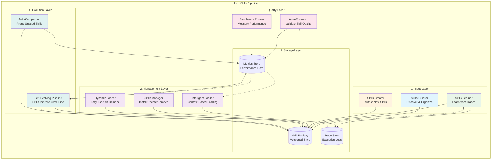
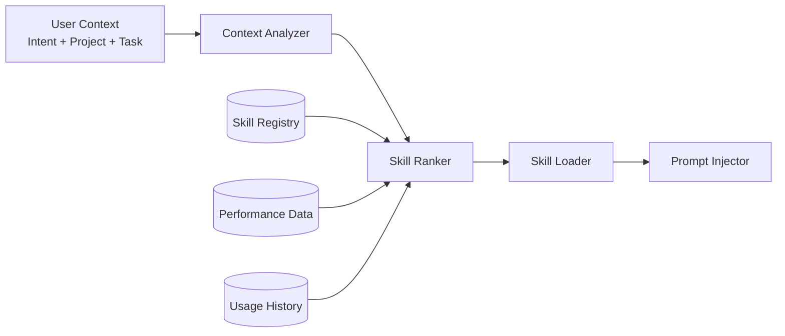
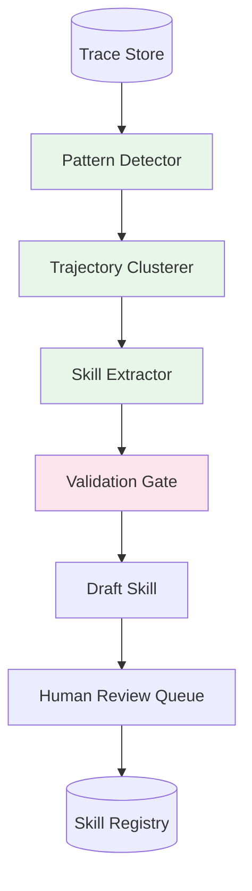
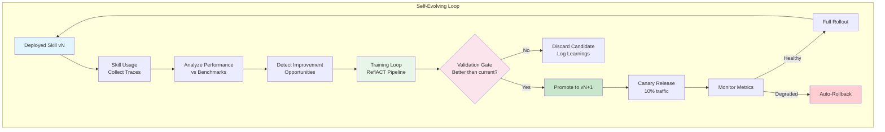
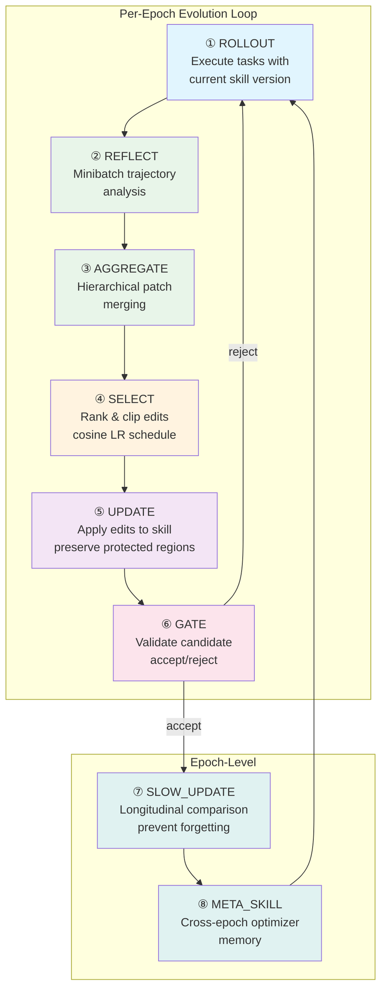
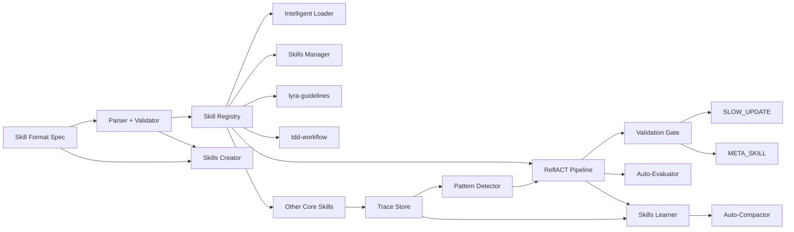

# Stream 7: Skills Systems Research -- Lyra Skills Pipeline Design

**Status:** Complete
**Date:** 2026-05-30
**Scope:** Full analysis of 10 skills repositories + Lyra skills pipeline architecture proposal

---

## Table of Contents

1. [Executive Summary](#1-executive-summary)
2. [Repository Analysis](#2-repository-analysis)
3. [Proposed Lyra Skill Format Specification](#3-proposed-lyra-skill-format-specification)
4. [Complete Skills Pipeline Architecture](#4-complete-skills-pipeline-architecture)
5. [50+ Concrete Skills to Ship](#5-50-concrete-skills-to-ship)
6. [Skill Evaluation Benchmarks](#6-skill-evaluation-benchmarks)
7. [Self-Evolution Mechanism Design](#7-self-evolution-mechanism-design)
8. [Priority Ranking (Impact x Effort)](#8-priority-ranking-impact-x-effort)
9. [Reference Links](#9-reference-links)

---

## 1. Executive Summary

This research analyzes 10 open-source skills systems to inform Lyra's skills pipeline architecture. Key findings:

- **Dominant skill format:** YAML frontmatter + Markdown body (SKILL.md), standardized via [agentskills.io](https://agentskills.io/specification)
- **Most mature loading system:** Superpowers (obra/superpowers) -- 14 skills, cross-platform (7 harnesses), auto-discovery, TDD-verified
- **Most sophisticated evaluation:** SkillOpt (Microsoft) -- ReflACT pipeline treating skills as "prompt weights" trained via gradient-like optimization
- **Most comprehensive domain library:** Academic Research Skills (Imbad0202) -- 4 skills, 42+ agents, 35+ modes, 10-stage pipeline
- **Most advanced skill generation:** CLI-Anything (HKUDS) -- automated 7-phase pipeline generating CLIs + SKILL.md from source code
- **Most advanced agent orchestration:** oh-my-openagent -- embedded MCPs per skill, discipline agents, Team Mode (8 parallel agents)
- **Key innovation gap:** No existing system combines skill curation, learning-from-traces, auto-evaluation, self-evolution, auto-compaction, and dynamic loading into a single cohesive pipeline. This is Lyra's opportunity.

---

## 2. Repository Analysis

### 2.1 MontrealAI/skillos -- Agent SkillOS

| Property | Value |
|----------|-------|
| **License** | MIT |
| **Language** | Python |
| **Skill Format** | Python objects in registry (not SKILL.md) |
| **Architecture** | Loop: Work -> Trace -> Learn -> Skill -> Test -> Approve -> Release -> Improve |

**Skill Architecture:**

SkillOS defines an 8-stage loop for self-improving agents:
```
Workbench/Job -> Agent Runtime -> Skill Registry + Tool Gateway + Trace Store
Trace Store -> Learning Engine -> Skill Trainer -> Test Lab -> Release Center -> (back to Skill Registry)
```

- **Skill Registry:** Stores versioned skill artifacts with instructions, permissions, tests, quality scores, and release state
- **Trace Store:** Records what happened during every job
- **Learning Engine:** Detects repeated patterns in traces and creates lessons
- **Skill Trainer:** Turns a lesson into a candidate skill version using bounded text edits
- **Test Lab:** Compares candidate skill versions against production
- **Release Center:** Approves, releases, and rolls back skill versions

**Key Takeaways for Lyra:**
1. The `Work -> Trace -> Learn -> Skill -> Test -> Approve -> Release -> Improve` loop is the canonical self-evolution pattern
2. Versioned skill registry with quality scores is essential
3. Bounded text edits for skill mutation (analogous to SkillOpt's approach)
4. Production upgrade path: SQLite -> Postgres, rule-based tests -> full eval harness, static runtime -> LLM tool-calling

**Valuable Skills for Lyra:** The loop architecture itself (not specific domain skills)

---

### 2.2 kepano/obsidian-skills -- Obsidian Skills

| Property | Value |
|----------|-------|
| **License** | MIT |
| **Language** | Markdown (SKILL.md) |
| **Skill Format** | YAML frontmatter + Markdown body per the agentskills.io specification |
| **Skills Count** | 5 skills |

**Skill Format (example):**
```yaml
---
name: obsidian-markdown
description: Create and edit Obsidian Flavored Markdown with wikilinks, embeds, callouts, properties... Use when working with .md files in Obsidian...
---
# Obsidian Flavored Markdown Skill
Create and edit valid Obsidian Flavored Markdown...
```

**Loading Mechanism:**
- Plugin-based: `/plugin marketplace add kepano/obsidian-skills` -> `/plugin install obsidian@obsidian-skills`
- `npx skills add` from git URL
- Manual: copy to `/.claude` folder in vault root
- OpenCode: auto-discovers all `SKILL.md` files under `~/.opencode/skills/`

**Plugin Manifest (plugin.json):**
```json
{
  "name": "obsidian",
  "version": "1.0.1",
  "description": "Create and edit Obsidian vault files...",
  "author": { "name": "Steph Ango", "url": "https://stephango.com/" },
  "repository": "https://github.com/kepano/obsidian-skills",
  "license": "MIT",
  "keywords": ["obsidian", "markdown", "bases", "canvas", "pkm", "notes"]
}
```

**Skills Included:**
1. `obsidian-markdown` -- Wikilinks, embeds, callouts, properties
2. `obsidian-bases` -- .base files with views, filters, formulas
3. `json-canvas` -- .canvas files with nodes, edges, groups
4. `obsidian-cli` -- Plugin/theme development via Obsidian CLI
5. `defuddle` -- Extract clean markdown from web pages

**Key Takeaways for Lyra:**
1. Clean, minimal SKILL.md format -- YAML frontmatter + procedural Markdown body
2. Plugin marketplace distribution pattern established
3. Supporting reference files extracted to keep SKILL.md lean
4. Clear trigger conditions in description field

---

### 2.3 multica-ai/andrej-karpathy-skills (and forrestchang)

| Property | Value |
|----------|-------|
| **License** | MIT |
| **Language** | Markdown (SKILL.md) |
| **Skill Format** | YAML frontmatter + 4-principle behavioral guidelines |
| **Skills Count** | 1 skill (karpathy-guidelines) |

**Skill Architecture:**
A single CLAUDE.md/SKILL.md file encoding four behavioral principles:
1. **Think Before Coding** -- State assumptions, surface tradeoffs, ask when unclear
2. **Simplicity First** -- Minimum code, no speculative features, no overengineering
3. **Surgical Changes** -- Touch only what you must, match existing style
4. **Goal-Driven Execution** -- Transform tasks into verifiable goals with success criteria

**Loading Mechanism:**
- Claude Code plugin marketplace: `/plugin marketplace add forrestchang/andrej-karpathy-skills`
- Direct CLAUDE.md copy: `curl -o CLAUDE.md https://raw.githubusercontent.com/...`
- Cursor: `.cursor/rules/karpathy-guidelines.mdc` committed rule file
- The skill is always-active (behavioral guidelines, not trigger-based)

**Key Takeaways for Lyra:**
1. Behavioral/meta skills are different from domain skills -- they're always-active system prompts
2. The four principles are universally applicable for Lyra's agent behavior
3. This pattern shows how "personality" or "coding philosophy" can be encoded as a skill
4. Verification criteria: "fewer unnecessary diffs, fewer overcomplication rewrites, questions before implementation"

---

### 2.4 obra/superpowers -- Superpowers

| Property | Value |
|----------|-------|
| **License** | MIT |
| **Language** | Markdown (SKILL.md) + Shell testing |
| **Skill Format** | YAML frontmatter with name + description + HARD-GATE directives |
| **Skills Count** | 14 skills |
| **Platforms** | Claude Code, Codex CLI, Codex App, Factory Droid, Gemini CLI, OpenCode, Cursor, GitHub Copilot CLI |

**Skill Format (with Hard Gates):**
```yaml
---
name: brainstorming
description: "You MUST use this before any creative work..."
---
# Brainstorming Ideas Into Designs
<HARD-GATE>
Do NOT invoke any implementation skill... until you have presented a design and the user has approved it.
</HARD-GATE>
## Checklist
You MUST create a task for each of these items and complete them in order...
```

**Skills Library (Complete):**

*Testing:*
- `test-driven-development` -- RED-GREEN-REFACTOR cycle with anti-patterns reference
- `verification-before-completion` -- Ensure it's actually fixed

*Debugging:*
- `systematic-debugging` -- 4-phase root cause process (root-cause-tracing, defense-in-depth, condition-based-waiting)

*Collaboration:*
- `brainstorming` -- Socratic design refinement with visual companion
- `writing-plans` -- Detailed implementation plans (2-5 min tasks)
- `executing-plans` -- Batch execution with checkpoints
- `subagent-driven-development` -- Two-stage review (spec compliance + code quality)
- `dispatching-parallel-agents` -- Concurrent subagent workflows
- `requesting-code-review` -- Pre-review checklist, severity levels
- `receiving-code-review` -- Responding to feedback
- `using-git-worktrees` -- Parallel development branches
- `finishing-a-development-branch` -- Merge/PR decision workflow

*Meta:*
- `writing-skills` -- Create new skills with TDD (RED-GREEN-REFACTOR applied to documentation)
- `using-superpowers` -- Introduction to the skills system

**Skill Loading Mechanism:**
1. Plugin marketplace per harness (8 different platforms)
2. Auto-discovery: skills found in `skills/<name>/SKILL.md` directories
3. `Skill` tool invocation: "Invoke relevant or requested skills BEFORE any response or action"
4. Flat namespace -- all skills in one searchable namespace
5. `<SUBAGENT-STOP>` directive to skip skills in subagent context
6. `<HARD-GATE>` blocks that prevent progression until conditions met

**Skill Testing (TDD for Skills):**
- Baseline testing: run scenarios WITHOUT the skill to document agent failures
- Skill verification: run scenarios WITH the skill to confirm compliance
- Refactor cycle: find new rationalizations -> close loopholes -> re-verify
- Test infrastructure: shell scripts leveraging Claude Code CLI

**Key Takeaways for Lyra:**
1. Hard-gate pattern (`<HARD-GATE>`) for mandatory workflows -- not suggestions, enforced
2. Skill chaining: brainstorming -> writing-plans -> executing-plans -> requesting-code-review
3. TDD for skill authoring is a proven methodology
4. Cross-platform support via plugin manifests + tool name adaptation
5. The Skill tool as primary invocation (not reading files directly)
6. Subagent-stop directive for context-dependent activation

---

### 2.5 microsoft/SkillOpt -- Self-Evolving Agent Skills

| Property | Value |
|----------|-------|
| **License** | MIT |
| **Language** | Python 3.10+ |
| **Skill Format** | Markdown skill documents with structured edit operations |
| **Key Innovation** | Treats skills like neural network weights, trained via gradient-like optimization |

**ReflACT Pipeline Architecture:**

SkillOpt's core contribution is the **ReflACT** pipeline -- an 8-stage optimization loop that trains skill documents without touching model weights:

```
┌──────────────────────────────────────────────────────────────────────┐
│                      ReflACT Per-Step Pipeline                        │
│                                                                      │
│  ① ROLLOUT    →  ② REFLECT    →  ③ AGGREGATE  →  ④ SELECT           │
│  (Collect       (Analyze          (Merge         (Rank & clip        │
│   trajectories)  failures &        patches        edits by           │
│                  successes)        hierarchically) effectiveness)    │
│                                                                      │
│  ⑤ UPDATE     →  ⑥ GATE       →  ⑦ SLOW       →  ⑧ META            │
│  (Apply edits   (Validate         (Longitudinal   (Cross-epoch       │
│   to skill)     candidate vs      comparison +    optimizer          │
│                 current best)     regularization) memory)            │
└──────────────────────────────────────────────────────────────────────┘
```

**Stage Details:**

1. **ROLLOUT (Datasets):** Execute tasks with current skill, collect trajectories (success/failure, scores, turns)
2. **REFLECT (Gradient):** Minibatch trajectory analysis -- group failures into minibatches of size M, analyze together (analogous to minibatch SGD)
   - `run_error_analyst_minibatch`: analyze failure patterns
   - `run_success_analyst_minibatch`: extract successful strategies
   - Custom prompts per environment, with generic defaults
3. **AGGREGATE (Merge):** Hierarchical LLM-based patch merging
   - Merge level tracking
   - Fallback: concatenate all edits if LLM merge fails
   - Failure-driven patches take priority
4. **SELECT (Clip):** Rank and select edits (analogous to gradient clipping)
   - `rank_and_select`: sort by support_count, trim to learning_rate budget
   - `learning_rate` = max edits per step (default 4, min 2)
   - LR schedulers: constant, linear, cosine, autonomous
5. **UPDATE (Skill):** Apply edits to skill document
   - Operations: append, insert_after, replace, delete
   - Protected SLOW_UPDATE region (marked by HTML comments)
   - Per-edit observability reports
6. **GATE (Evaluation):** Validate candidate skill
   - Metrics: hard (exact match), soft (F1/partial credit), mixed (weighted)
   - Actions: accept_new_best, accept, reject
   - Analogous to validation-based early stopping
7. **SLOW_UPDATE (EMA):** Epoch-level longitudinal comparison
   - Prevents catastrophic forgetting across epochs
   - Protected region for accumulated wisdom
   - longitudinal_pair_policy: mixed / changed / unchanged
8. **META_SKILL (Memory):** Cross-epoch optimizer context
   - Accumulates strategy memory
   - Provides historical context for optimizer decisions

**Hyperparameters (Neural Network Analogy):**

| NN Concept | SkillOpt Equivalent |
|------------|-------------------|
| Weights | Skill document (Markdown text) |
| Forward pass | Agent executes task with skill |
| Loss | Task failure / low score |
| Gradient | Failure analysis + suggested edits |
| Minibatch SGD | Minibatch trajectory analysis (M trajectories at once) |
| Learning rate | Max edits per step (edit_budget = 4) |
| LR schedule | Cosine decay (4 -> 2 over epochs) |
| Gradient clipping | Edit ranking and selection (rank_and_select) |
| Validation gate | Compare candidate vs current best on held-out set |
| EMA/Regularization | Slow update (longitudinal comparison) |
| Optimizer state | Meta skill (cross-epoch memory) |

**Skill Document Structure:**

```markdown
# Task Strategy

## General Approach
- Break complex problems into sub-steps
- Always verify intermediate results

## Common Patterns
- When you see X, try approach Y
- Avoid Z because it leads to errors

## Edge Cases
- If the input contains A, handle it specially by...
- Watch out for B -- it requires C

## Output Format
- Always include reasoning before the answer
- Format numbers with proper units

<!-- SLOW_UPDATE_START -->
## Accumulated Wisdom (Epoch-level)
- Rule from epoch 1: ...
- Rule from epoch 2: ...
<!-- SLOW_UPDATE_END -->
```

**Edit Operations:**
```python
Edit(op="append" | "insert_after" | "replace" | "delete",
     content="...",
     target="...",       # target text for insert_after/replace/delete
     support_count=3,     # number of trajectories supporting this edit
     source_type="failure" | "success",
     merge_level=1)       # hierarchical merge depth
```

**Supported Benchmarks:** SearchQA, ALFWorld, DocVQA, LiveMathematicianBench, SpreadsheetBench, OfficeQA

**Key Takeaways for Lyra:**
1. The ReflACT pipeline is the gold standard for skill self-evolution
2. Skill documents ARE the "weights" -- natural language becomes learnable parameters
3. Validation gates prevent regressions -- never deploy a worse skill
4. SLOW_UPDATE regions prevent catastrophic forgetting
5. META_SKILL provides optimizer memory across epochs
6. Hierarchical patch merging handles edit conflicts
7. Minibatch trajectory analysis is more efficient than per-trajectory analysis

---

### 2.6 Imbad0202/academic-research-skills -- ARS

| Property | Value |
|----------|-------|
| **License** | CC BY-NC 4.0 |
| **Language** | Markdown (SKILL.md) + Python (scripts) |
| **Skill Format** | YAML frontmatter with extensive metadata + Markdown body + embedded agent prompts |
| **Skills Count** | 4 skills, 42+ agents, 35+ modes, 10-stage pipeline |

**Skill Metadata Format:**
```yaml
---
name: deep-research
description: "Universal deep research agent team. 13-agent pipeline..."
metadata:
  version: "2.9.4"
  last_updated: "2026-05-18"
  status: active
  data_access_level: raw
  task_type: open-ended
  related_skills:
    - academic-paper
    - academic-pipeline
---
```

**Skills and Modes:**

1. **deep-research** (v2.9.4) -- 13 agents, 7 modes
   - full, quick, review, lit-review, fact-check, socratic, systematic-review
2. **academic-paper** (v3.1.2) -- 12 agents, 10 modes
   - full, plan, outline-only, revision, revision-coach, abstract-only, lit-review, format-convert, citation-check, disclosure
3. **academic-paper-reviewer** (v1.9.1) -- 7 agents, 6 modes
   - full (EIC + R1/R2/R3 + Devil's Advocate), quick, methodology-focus, guided, re-review, calibration
4. **academic-pipeline** (v3.9.4.2) -- 10-stage orchestrator
   - RESEARCH -> WRITE -> INTEGRITY(2.5) -> REVIEW -> REVISE -> RE-REVIEW -> FINAL INTEGRITY(4.5) -> FINALIZE -> PROCESS SUMMARY

**Pipeline Architecture:**
```
[User] -> RESEARCH -> WRITE -> [2.5 INTEGRITY GATE] -> REVIEW -> Decision
                                                              |
                              Accept -> [4.5 FINAL INTEGRITY] -> FINALIZE -> SUMMARY
                              Minor/Major -> Revision Coaching -> REVISE -> RE-REVIEW
                              Reject -> STOP
```

**Key Design Patterns:**

1. **Integrity Gates (non-skippable):**
   - Stage 2.5: 7-mode AI research failure checklist (implementation bugs, hallucinated results, shortcut reliance, bug-as-insight, methodology fabrication, frame-lock, citation hallucinations)
   - Stage 4.5: Deep Mode 2 check, zero-tolerance

2. **Material Passport:** Cross-session state via YAML ledger with:
   - literature_corpus[], compliance_history[], reset_boundary[], style_profile, FINER scores
   - 9+ formal handoff schemas between stages

3. **Anti-Pattern Codification:** 29 explicit Anti-Patterns across all skills in tabular format ("Why It Fails" + "Correct Behavior")

4. **IRON RULE markers:** 22 critical rules that must not be violated even in long conversations

5. **Devil's Advocate Concession Threshold Protocol:**
   - Score rebuttals 1-5 before responding
   - Concession only at score >= 4
   - No consecutive concessions
   - Frame-lock detection after each checkpoint

6. **Intent Detection Layer:** Socratic mode classifies user intent as exploratory vs. goal-oriented every 3 turns

7. **Data Access Levels:** Every skill declared as `raw`, `redacted`, or `verified_only`

8. **Task Type Annotation:** `open-ended` vs. `outcome-gradable` on every skill

**Skill Loading:**
- Claude Code Plugin Marketplace: `/plugin marketplace add Imbad0202/academic-research-skills` -> `/plugin install academic-research-skills`
- 10 slash commands (`/ars-plan`, `/ars-lit-review`, etc.)
- 3 plugin-shipped agents as relative symlinks
- SessionStart announce hook listing commands and agents

**Key Takeaways for Lyra:**
1. The 10-stage pipeline with mandatory integrity gates is a model for Lyra's quality assurance
2. Material Passport as cross-session state ledger is essential for long-running pipelines
3. IRON RULE + Anti-Pattern codification prevents context rot
4. Intent detection for mode routing (exploratory vs. goal-oriented)
5. Data access levels for security-conscious skill design
6. Versioned schemas for cross-stage handoffs

---

### 2.7 SafeRL-Lab/cheetahclaws -- CheetahClaws

| Property | Value |
|----------|-------|
| **License** | Apache 2.0 |
| **Language** | Python (~40K lines) |
| **Skill Format** | Markdown-based templates with argument substitution |
| **Key Innovation** | Python-native reimplementation of Claude Code's core loop |

**Skill Architecture:**

- **Skill Format:** Markdown files with argument substitution and fork/inline execution
- **Loading:** `Skill` and `SkillList` built-in tools for AI agent to invoke and enumerate skills dynamically
- **Discovery:** Skills integrate into the same tool-registration system (`register_tool()`) as everything else
- **Skill Packs:** Install from git URLs, extensible without modifying core code
- **Built-in Skills:** `/commit`, `/review`, and 35+ other slash commands

**Architectural Highlights:**
- Python generator loop yielding typed events (TextChunk, ToolStart, ToolEnd, TurnDone)
- Tool registry: `ToolDef(name, schema, func, read_only, concurrent_safe)` dataclasses
- Context compression: 4-layer system (dynamic max_tokens, model registry, 2-layer compaction at 70%, auto-fanout)
- Permission system: auto, accept-all, manual, plan modes
- Memory system: `MemorySave` with confidence, source, last_used_at, conflict_group metadata
- Multi-agent: typed sub-agents (coder/reviewer/researcher) with git worktree isolation
- Task dependency graph: TaskCreate/TaskUpdate support blocks/blocked_by edges

**Key Takeaways for Lyra:**
1. Markdown-based skill templates with argument substitution
2. Skills integrated into universal tool registry
3. Skill packs installable from git URLs
4. Memory system with conflict_group metadata for de-duplication
5. Task dependency graph for structured multi-step planning

---

### 2.8 HKUDS/CLI-Anything -- Automated CLI Generation

| Property | Value |
|----------|-------|
| **License** | Apache 2.0 |
| **Language** | Python (Click CLI framework) |
| **Skill Format** | YAML frontmatter + Click-decorator-extracted documentation |
| **Key Innovation** | 7-phase pipeline that transforms any software into CLI + SKILL.md |

**7-Phase Pipeline:**
```
analyze -> design -> implement -> plan tests -> write tests -> document -> publish
                                                                    |
                                                              Phase 6.5: generate SKILL.md
```

**Skill Generation (Phase 6.5):**
- Tool: `skill_generator.py`
- Input: Click decorators, setup.py, README from generated CLI
- Output: `skills/cli-anything-<software>/SKILL.md` with:
  - YAML frontmatter (name, description for agent discovery)
  - Command groups with subcommands
  - Usage examples for common workflows
  - Agent-specific guidance (JSON output, error handling)

**CLI-Hub Distribution:**
- Central catalog at https://cli-hub.app
- `npx skills add HKUDS/CLI-Anything --skill <name> -g -y`
- Meta-skill for autonomous CLI discovery and installation
- Multi-platform: Claude Code, Pi, OpenCode, OpenClaw, Codex, GitHub Copilot, Goose

**Key Takeaways for Lyra:**
1. Automated skill generation from source code is proven viable
2. CLI-Hub model for skill marketplace distribution
3. Meta-skills that enable autonomous skill discovery
4. The 7-phase generation pipeline is transferable to Lyra's Skills Creator
5. Unified REPL interface (repl_skin.py) with --json flag for agent consumption

---

### 2.9 code-yeongyu/oh-my-openagent -- Multi-Agent Orchestration

| Property | Value |
|----------|-------|
| **License** | SUL-1.0 (custom) |
| **Language** | TypeScript (93.9%) |
| **Skill Format** | SKILL.md with embedded MCP servers + scoped permissions |
| **Key Innovation** | Skills bundle MCP servers that activate on demand and tear down when done |

**Skill Architecture:**

- **Skill Scope:** Each skill bundles domain-tuned system instructions + its own embedded MCP servers + scoped permissions
- **On-Demand MCP:** "MCP servers are scoped to skills and spin up on demand, go away when done"
- **Discipline Agents:** Sisyphus (orchestrator), Hephaestus (autonomous deep worker), Prometheus (strategic planner), Oracle, Librarian, Explore
- **Team Mode (v4.0):** Lead agent coordinates up to 8 parallel member agents through team_create, team_send_message, team_task_create, team_status tools
- **Tmux Visualization:** Real-time visualization showing all members working simultaneously

**Built-in Skills:**
- `playwright` -- Browser automation with embedded MCP
- `git-master` -- Atomic commits, rebase surgery
- `frontend-ui-ux` -- Design-first UI development
- `hyperplan` -- 5 hostile critics tearing apart plans (Team Mode)
- `security-research` -- 3 vulnerability hunters + 2 PoC engineers (Team Mode)

**Hashline Edit Tool:**
Every line tagged with content hash (e.g., `11#VK| function hello() {`). Edits reference tags; if file changed since last read, hash mismatch rejects the edit before corruption. Reportedly raised benchmark from 6.7% -> 68.3% success rate.

**Key Takeaways for Lyra:**
1. Skills as MCP containers -- each skill bundles its own tools that activate/deactivate on demand
2. Context window efficiency -- MCPs go away when done, keeping context clean
3. Team Mode for multi-agent skill execution
4. Hashline edit safety for concurrent editing
5. Discipline agent architecture with model-tuned roles

---

### 2.10 Cross-Repository Comparative Analysis

| Dimension | Superpowers | SkillOpt | ARS | Obsidian Skills | Karpathy Skills | CheetahClaws | CLI-Anything | oh-my-openagent | SkillOS |
|-----------|------------|----------|-----|-----------------|-----------------|--------------|--------------|-----------------|---------|
| **Format** | SKILL.md + Hard Gates | Markdown + Edit Ops | SKILL.md + Schemas | SKILL.md | SKILL.md | Markdown templates | SKILL.md (generated) | SKILL.md + MCP | Python objects |
| **Discovery** | Flat namespace | Config-based | Plugin marketplace | Plugin/npx | Plugin/CLAUDE.md | Tool registry | npx skills | OpenCode config | Registry |
| **Loading** | Skill tool | Training loop | Plugin install | Auto-discover | Always-active | SkillList tool | npx install | On-demand MCP | Registry lookup |
| **Evaluation** | TDD (manual) | Validation gate | Integrity gates | N/A | N/A | N/A | Test suite | N/A | Test Lab |
| **Evolution** | Manual authoring | ReflACT pipeline | Manual + changelogs | Manual | Manual | Manual | Automated gen | Manual | Learning engine |
| **Cross-Platform** | 8 harnesses | OpenAI/Anthropic | Claude Code | Agent Skills spec | Claude/Cursor | Multi-provider | 7+ platforms | OpenCode | Self-contained |
| **Skills Count** | 14 | 1 (trained) | 4 (+42 agents) | 5 | 1 | 37 commands | 18+ software | 6+ skills | Configurable |
| **Domain** | Software dev | Task solving | Academic research | PKM/Obsidian | Coding behavior | General purpose | CLI generation | Agent orchestration | General purpose |

---

## 3. Proposed Lyra Skill Format Specification

### 3.1 Design Principles

1. **YAML frontmatter as canonical metadata** (agentskills.io compliant)
2. **Markdown body for both humans and LLMs** (single source of truth)
3. **Extensible metadata** for pipeline integration
4. **Security-conscious** with data access levels and scoped permissions
5. **Version-aware** for evolution tracking

### 3.2 Full Format Specification

```yaml
---
# ── Required fields (agentskills.io compatible) ──
name: skill-name                    # kebab-case, no special chars
description: >-                     # Third-person, describes WHEN to use
  Use when [condition]. [Brief behavior description].

# ── Lyra metadata (required) ──
lyra:
  version: "1.0.0"                  # SemVer
  status: active                    # active | deprecated | experimental | archived
  domain: engineering               # See Domain enum below
  data_access_level: raw            # raw | redacted | verified_only
  task_type: outcome-gradable       # outcome-gradable | open-ended

  # ── Discovery metadata ──
  triggers:                         # Keywords/phrases that trigger this skill
    - "deploy to production"
    - "ship the release"
    - "CD pipeline"
  skill_type: procedure             # procedure | reference | pattern | meta | behavioral
  priority: high                    # high | normal | low (loading priority)

  # ── Dependencies ──
  requires: []                      # Skill names required before this one
  conflicts_with: []                # Mutually exclusive skills
  related_skills: []                # Complementary skills

  # ── Execution constraints ──
  max_duration_seconds: 3600
  required_permissions:             # Scoped permissions for this skill
    - filesystem.read
    - network.api
  min_context_tokens: 8000          # Minimum context window needed

  # ── Evolution tracking ──
  parent_skill: null                # Skill this was derived from
  training_epochs: 0                # Number of self-evolution cycles
  validation_score: null            # Last evaluation score (0-100)
  last_evaluated: null              # ISO timestamp
  usage_count: 0                    # How many times invoked
  success_rate: null                # Percentage of successful invocations

  # ── Authoring ──
  author:
    name: ""
    source: manual                  # manual | learned | imported | generated
  license: MIT
---

# Skill Title

## Overview
Brief description of what this skill does and why it exists.

## When to Use
Explicit trigger conditions, context matching rules.

## Prerequisites
Required skills, tools, or knowledge.

## Procedure / Reference / Pattern

### Step 1: [Name]
...

### Step 2: [Name]
...

## Output / Success Criteria
What constitutes successful completion.

## Anti-Patterns
Common mistakes and what to do instead.

## IRON RULES
Critical constraints that MUST NOT be violated.

<!-- LYRA_PROTECTED_START -->
## Accumulated Wisdom (Auto-managed by Lyra)
This section is managed by the self-evolution pipeline.
Do not edit manually.
<!-- LYRA_PROTECTED_END -->
```

### 3.3 Domain Enum

```yaml
domain:
  - engineering           # Software development, architecture, code review
  - design                # UI/UX, product design, design systems
  - sre                   # Site reliability, DevOps, monitoring
  - ai_research           # ML research, experimentation, paper writing
  - solution_architecture # Enterprise architecture, system design
  - cloud_engineering     # AWS, Azure, GCP, multi-cloud
  - product_management    # Roadmaps, PRDs, stakeholder management
  - business_analysis     # Requirements, process modeling, data analysis
  - brainstorming         # Ideation, creative thinking, problem solving
  - security              # Threat modeling, security review, compliance
  - data_engineering      # ETL, data pipelines, data modeling
  - meta                  # Skills about skills (authoring, evaluation, management)
```

### 3.4 Skill Type Enum

```yaml
skill_type:
  - procedure    # Step-by-step workflow (e.g., "deploy to k8s")
  - reference    # Knowledge lookup (e.g., "aws-s3-api-reference")
  - pattern      # Problem-solving approach (e.g., "circuit-breaker-pattern")
  - meta         # About the skills system itself
  - behavioral   # Always-active personality/behavior guide (e.g., karpathy-guidelines)
```

### 3.5 Directory Layout

```
lyra/skills/
├── _registry/
│   ├── index.json              # Full skill catalog
│   ├── domain_index.json       # Skills grouped by domain
│   └── dependency_graph.json   # Skill dependency DAG
├── engineering/
│   ├── tdd-workflow/
│   │   ├── SKILL.md
│   │   ├── references/         # Heavy reference material
│   │   │   └── testing-patterns.md
│   │   └── tests/              # Skill verification tests
│   │       └── test_tdd_workflow.py
│   ├── code-review/
│   │   └── SKILL.md
│   └── ...
├── design/
│   └── ...
├── sre/
│   └── ...
├── ai_research/
│   └── ...
├── solution_architecture/
│   └── ...
├── cloud_engineering/
│   └── ...
├── product_management/
│   └── ...
├── business_analysis/
│   └── ...
├── brainstorming/
│   └── ...
├── security/
│   └── ...
├── data_engineering/
│   └── ...
└── meta/
    ├── skill-authoring/
    │   └── SKILL.md
    └── ...
```

---

## 4. Complete Skills Pipeline Architecture

### 4.1 System Overview



### 4.2 Skills Curator -- Discover and Organize

**Purpose:** Continuously discover skills from multiple sources and organize them into the Lyra registry.

**Sources:**
1. **Internal skills library** (shipped with Lyra)
2. **Community marketplace** (git repositories, npm-style registry)
3. **Imported from other systems** (Superpowers, ARS, Obsidian Skills)
4. **Generated from source code** (like CLI-Anything)
5. **Learned from traces** (via Skills Learner)

**Mechanism:**
```python
class SkillsCurator:
    """Discover and organize skills from multiple sources."""

    sources: list[SkillSource]  # Internal, marketplace, git, generated
    registry: SkillRegistry
    classifier: DomainClassifier  # Auto-classify skills by domain
    deduplicator: SkillDeduplicator  # Detect duplicate/similar skills

    async def discover(self) -> list[DiscoveredSkill]:
        """Scan all sources for new or updated skills."""
        ...

    async def classify(self, skill: DiscoveredSkill) -> Domain:
        """Auto-classify a skill into the domain taxonomy."""
        ...

    async def deduplicate(self, skills: list[DiscoveredSkill]) -> list[DiscoveredSkill]:
        """Remove duplicate or near-duplicate skills."""
        ...

    async def ingest(self, skill: DiscoveredSkill) -> SkillRecord:
        """Validate, version, and store a discovered skill."""
        ...
```

**Discovery Sources Configuration:**
```yaml
curator:
  sources:
    - type: internal
      path: lyra/skills/
    - type: marketplace
      url: https://skills.lyra.dev/registry.json
      sync_interval_hours: 24
    - type: git
      repos:
        - https://github.com/obra/superpowers
        - https://github.com/Imbad0202/academic-research-skills
    - type: generated
      from_traces: true
      min_trace_similarity: 0.7
```

### 4.3 Intelligent Loader -- Context-Based Loading

**Purpose:** Load the right skills at the right time based on user intent, project context, and task requirements.

**Architecture:**


**Loading Strategy:**

```python
class IntelligentLoader:
    """Load skills based on multi-dimensional context matching."""

    async def load_for_context(self, context: TaskContext) -> list[LoadedSkill]:
        """
        1. Extract intent signals from user message
        2. Match against trigger keywords in all skills
        3. Score each skill by:
           - Trigger match confidence (0-1)
           - Domain relevance to current project
           - Historical success rate for similar tasks
           - Skill priority
           - Dependency chain (required skills load first)
        4. Sort by composite score
        5. Load top-N skills within context budget
        """
        ...

    async def get_trigger_matches(self, intent: str) -> list[tuple[Skill, float]]:
        """Semantic matching of user intent to skill triggers."""
        # Use embeddings for semantic similarity beyond keyword matching
        ...

    async def get_context_budget(self) -> int:
        """Calculate available token budget for skill loading."""
        # Reserve 20% of context window for skills
        # Prioritize high-impact skills within budget
        ...
```

**Loading Modes:**
- **Eager:** Load all matching skills at session start (for known workflows)
- **Lazy:** Load skill metadata, fetch full content on first invocation
- **Reactive:** Load skills when trigger keywords detected mid-conversation
- **Proactive:** Suggest skills before the user asks (based on intent prediction)

### 4.4 Skills Manager -- Install, Update, Remove, Version

**Purpose:** Manage the lifecycle of skills in the local registry.

**Commands:**
```bash
lyra skill install <name>            # Install a skill from marketplace
lyra skill install <git-url>         # Install from git repository
lyra skill update <name>             # Update to latest version
lyra skill update --all              # Update all installed skills
lyra skill remove <name>             # Remove a skill
lyra skill list                      # List installed skills
lyra skill list --domain engineering # Filter by domain
lyra skill info <name>               # Show skill details and metrics
lyra skill search <query>            # Search marketplace
lyra skill pin <name>@<version>      # Pin to specific version
lyra skill rollback <name>           # Rollback to previous version
lyra skill import <path>             # Import skill from local file
lyra skill export <name>             # Export skill for sharing
```

**Version Management:**
```python
class SkillsManager:
    """Manage skill lifecycle with semver and integrity checks."""

    async def install(self, source: str, version: str | None = None) -> SkillRecord:
        """Install skill from source with integrity verification."""
        # 1. Fetch skill metadata and content
        # 2. Validate format compliance
        # 3. Check for dependency conflicts
        # 4. Run security scan
        # 5. Store in registry with version
        ...

    async def update(self, name: str) -> SkillRecord:
        """Update skill, preserving accumulated wisdom."""
        # 1. Fetch latest version
        # 2. Merge LYRA_PROTECTED content from old version
        # 3. Run validation gate
        # 4. Deploy if validation passes
        ...

    async def remove(self, name: str, force: bool = False):
        """Remove skill, warning about dependent skills."""
        # 1. Check dependency graph for consumers
        # 2. Archive instead of delete (for rollback)
        # 3. Update registry indices
        ...
```

### 4.5 Skills Learner -- Learn from Execution Traces

**Purpose:** Automatically discover new skill patterns from execution traces and convert them into candidate skills.

**Architecture:**


**Learning Pipeline (inspired by SkillOpt ReflACT):**
```python
class SkillsLearner:
    """
    Learn new skills from execution traces.

    Implements a variant of SkillOpt's ReflACT pipeline adapted for
    multi-domain skill learning (not just task-specific optimization).
    """

    async def learn_from_traces(
        self,
        traces: list[ExecutionTrace],
        min_similarity: float = 0.7,
    ) -> list[DraftSkill]:
        """
        1. Cluster traces by task similarity (embedding-based)
        2. For each cluster with sufficient samples:
           a. REFLECT: Analyze failure patterns and success strategies
           b. AGGREGATE: Merge insights into coherent edits
           c. SELECT: Rank edits by effectiveness
           d. UPDATE: Create draft skill document from edits
        3. Validate each draft against:
           - Format compliance
           - No regression on held-out traces
           - Security policy
        4. Queue passing drafts for human review
        """
        ...

    async def refine_skill(
        self,
        skill: Skill,
        new_traces: list[ExecutionTrace],
    ) -> SkillUpdate:
        """
        Continuously improve an existing skill with new execution data.
        Follows SkillOpt's optimizer loop:
        - Minibatch trajectory analysis
        - Hierarchical patch merging
        - Validation gate against current best
        - SLOW_UPDATE for accumulated wisdom
        """
        ...
```

**Pattern Detector:**
The learner uses embedding-based clustering to identify repeated task patterns:
- Group similar tasks (cosine similarity > 0.85)
- Identify common failure modes within each group
- Extract successful strategies from high-scoring traces
- Generate candidate procedures from successful patterns

### 4.6 Skills Creator -- Authoring Tools

**Purpose:** Provide tools for humans and AI to create high-quality skills.

**Capabilities:**
```bash
lyra skill create                    # Interactive skill creation wizard
lyra skill create --from-trace <id>  # Generate skill from execution trace
lyra skill create --from-repo <url>  # Generate skill from codebase (like CLI-Anything)
lyra skill validate <path>           # Validate a SKILL.md file
lyra skill scaffold <domain>         # Generate skill template by domain
lyra skill test <name>               # Run skill verification tests
```

**Skill Creation Wizard:**
1. Select domain (engineering, design, SRE, etc.)
2. Select skill type (procedure, reference, pattern, meta, behavioral)
3. Define trigger conditions
4. Write procedure/reference content
5. Add anti-patterns and iron rules
6. Generate verification tests
7. Validate and publish

**AI-Assisted Skill Generation (from traces):**
```python
class SkillGenerator:
    """Generate skill from execution traces using LLM."""

    async def generate_from_traces(
        self,
        traces: list[ExecutionTrace],
        domain: Domain,
    ) -> DraftSkill:
        """
        Analyze successful task executions and generate:
        1. Common workflow steps
        2. Decision points and branching logic
        3. Anti-patterns from failure traces
        4. Success criteria
        5. Prerequisites and dependencies
        """
        ...
```

### 4.7 Auto-Evaluator -- Validate Skill Quality

**Purpose:** Automatically evaluate skill quality before deployment and continuously in production.

**Evaluation Dimensions:**
```python
class SkillEvaluator:
    """Multi-dimensional skill quality evaluation."""

    dimensions = {
        "correctness": {
            "weight": 0.30,
            "description": "Does the skill produce correct outputs?",
            "metrics": ["task_success_rate", "hallucination_rate", "error_rate"],
        },
        "efficiency": {
            "weight": 0.20,
            "description": "How efficiently does the skill complete tasks?",
            "metrics": ["avg_turns", "avg_tokens", "time_to_completion"],
        },
        "robustness": {
            "weight": 0.15,
            "description": "Does the skill handle edge cases and unexpected inputs?",
            "metrics": ["edge_case_pass_rate", "adversarial_resilience"],
        },
        "clarity": {
            "weight": 0.10,
            "description": "Is the skill documentation clear and actionable?",
            "metrics": ["readability_score", "step_completeness", "ambiguity_count"],
        },
        "safety": {
            "weight": 0.15,
            "description": "Does the skill respect security and ethical boundaries?",
            "metrics": ["permission_violations", "data_leak_risk", "bias_score"],
        },
        "maintainability": {
            "weight": 0.10,
            "description": "Is the skill easy to update and maintain?",
            "metrics": ["cyclomatic_complexity", "reference_freshness", "dependency_health"],
        },
    }

    async def evaluate(self, skill: Skill) -> EvaluationReport:
        """
        1. Run skill against benchmark suite
        2. Compute scores across all dimensions
        3. Generate actionable improvement suggestions
        4. Update skill metadata with scores
        """
        ...

    async def gate(
        self,
        candidate: Skill,
        current_best: Skill,
    ) -> GateResult:
        """
        Validation gate (adapted from SkillOpt):
        - Accept if candidate > current on primary metric
        - Reject if candidate < current on primary metric
        - Accept with warning on minor regressions on secondary metrics
        - Never deploy a skill that regresses on safety
        """
        ...
```

### 4.8 Self-Evolving Pipeline -- Skills Improve Over Time

**Purpose:** Continuously improve skills based on usage data, new traces, and community contributions.



**Evolution Strategies:**

```python
class SelfEvolvingPipeline:
    """Orchestrate skill improvement across the entire fleet."""

    async def evolve_cycle(self, skill: Skill) -> EvolveResult:
        """
        Per-skill evolution cycle:

        1. COLLECT: Gather traces where this skill was used
        2. ANALYZE: Identify failure patterns and bottlenecks
        3. GENERATE: Create candidate improvements (ReflACT)
        4. VALIDATE: Run against benchmark suite
        5. GATE: Accept only if all metrics improve or stay flat
        6. CANARY: Deploy to subset, monitor for regressions
        7. PROMOTE: Full rollout or rollback

        Cycle runs:
        - On schedule (daily/weekly for active skills)
        - On trigger (when enough new traces accumulate)
        - On demand (manual evolution request)
        """
        ...

    async def cross_skill_optimization(self) -> CrossSkillReport:
        """
        Analyze interactions between skills:
        - Skill A + Skill B combinations that underperform
        - Skills that should be merged (high overlap)
        - Skills that should be split (divergent usage patterns)
        - Skill chains that could be composed into a single skill
        """
        ...
```

**Canary Release System:**
```yaml
evolution:
  canary:
    traffic_percentage: 10
    monitoring_period_minutes: 60
    rollback_triggers:
      - metric: task_success_rate
        threshold: -5%  # Rollback if success rate drops >5%
      - metric: safety_score
        threshold: any_decrease  # Rollback on ANY safety regression
      - metric: avg_tokens
        threshold: +20%  # Rollback if cost increases >20%
```

### 4.9 Auto-Compaction -- Prune Unused/Obsolete Skills

**Purpose:** Maintain a lean, high-quality skill registry by pruning skills that are no longer useful.

```python
class AutoCompactor:
    """Intelligently prune the skill registry."""

    compaction_rules = {
        "unused": {
            "condition": "usage_count < 3 AND days_since_last_use > 90",
            "action": "archive",  # archive | delete | demote
        },
        "obsolete": {
            "condition": "superseded_by is not None AND superseded_skill.success_rate > self.success_rate",
            "action": "demote",  # Move to deprecated status
        },
        "low_quality": {
            "condition": "validation_score < 40 AND training_epochs > 5",
            "action": "archive",  # Failed to improve after training
        },
        "duplicate": {
            "condition": "similarity_score > 0.9 with another skill",
            "action": "merge",  # Merge with similar skill
        },
        "outdated_reference": {
            "condition": "skill_type == 'reference' AND reference_freshness_days > 365",
            "action": "flag_for_review",
        },
        "failed_canary": {
            "condition": "canary_failures > 3",
            "action": "rollback_and_flag",
        },
    }

    async def compact(self) -> CompactionReport:
        """
        1. Scan all skills against compaction rules
        2. Generate compaction plan for human approval
        3. Execute approved actions:
           - Archive: move to archive, keep for rollback
           - Demote: mark as deprecated with migration path
           - Merge: combine with similar skill, preserve unique content
           - Delete: permanent removal (only for experimental/low-quality)
        4. Update registry indices and dependency graph
        """
        ...
```

**Compaction Safety:**
- Never delete a skill that is a dependency of another active skill
- Archive (don't delete) by default -- soft-delete with 90-day recovery window
- Human approval required for destructive actions
- Auto-generate migration paths ("Skill X was replaced by Skill Y")

### 4.10 Dynamic Loading -- Lazy-Load Skills on Demand

**Purpose:** Minimize context window usage by loading skill content only when needed.

```python
class DynamicLoader:
    """Lazy-load skill content with predictive prefetching."""

    # Tier 1: Metadata only (always loaded) -- ~200 tokens per skill
    # Tier 2: Procedure summary (loaded on trigger match) -- ~500 tokens
    # Tier 3: Full content (loaded on invocation) -- full SKILL.md
    # Tier 4: References (loaded on explicit reference) -- supporting files

    async def load_tier(self, skill: Skill, tier: int) -> str:
        """
        Tiered loading strategy to minimize context usage.
        """
        ...

    async def predictive_prefetch(self, context: TaskContext) -> list[Skill]:
        """
        Predict which skills will be needed based on:
        - Current task phase
        - Skill chain patterns (brainstorming -> planning -> implementing)
        - Historical usage sequences
        Prefetch tier 2 content for predicted next skills.
        """
        ...

    async def unload(self, skill: Skill):
        """
        Remove skill content from context window when no longer needed.
        Skills that bundle MCP servers trigger server shutdown on unload.
        """
        ...
```

---

## 5. 50+ Concrete Skills to Ship

### 5.1 Engineering Domain (10 skills)

| # | Skill Name | Type | Description | Priority |
|---|-----------|------|-------------|----------|
| 1 | `tdd-workflow` | procedure | RED-GREEN-REFACTOR with test-first enforcement | P0 |
| 2 | `code-review` | procedure | Multi-severity review with security checklist | P0 |
| 3 | `systematic-debugging` | procedure | 4-phase root cause analysis (trace, isolate, fix, verify) | P0 |
| 4 | `git-worktree-workflow` | procedure | Isolated feature branches with parallel development | P1 |
| 5 | `refactoring-patterns` | pattern | Safe refactoring catalog (extract method, invert dependency, etc.) | P1 |
| 6 | `api-design-review` | procedure | REST/GraphQL API design review with consistency checks | P1 |
| 7 | `database-migration` | procedure | Safe migration patterns with rollback plans | P2 |
| 8 | `error-handling-patterns` | pattern | Comprehensive error handling across layers | P2 |
| 9 | `dependency-injection` | pattern | DI container patterns for testability | P3 |
| 10 | `performance-profiling` | procedure | CPU/memory profiling workflow with optimization targets | P3 |

### 5.2 Design Domain (5 skills)

| # | Skill Name | Type | Description | Priority |
|---|-----------|------|-------------|----------|
| 11 | `design-system-audit` | procedure | Audit UI consistency against design system tokens | P1 |
| 12 | `accessibility-review` | procedure | WCAG 2.1 AA compliance check with automated + manual steps | P1 |
| 13 | `ux-flow-analysis` | procedure | User journey mapping with friction point identification | P2 |
| 14 | `responsive-design-review` | procedure | Multi-breakpoint layout verification | P2 |
| 15 | `design-handoff` | procedure | Figma-to-code handoff with token extraction and component mapping | P3 |

### 5.3 SRE Domain (8 skills)

| # | Skill Name | Type | Description | Priority |
|---|-----------|------|-------------|----------|
| 16 | `incident-response` | procedure | Incident command protocol (declare, triage, mitigate, postmortem) | P0 |
| 17 | `postmortem-writing` | procedure | Blameless postmortem structure with action item tracking | P1 |
| 18 | `sli-slo-definition` | procedure | Define SLIs, SLOs, and error budgets for services | P1 |
| 19 | `capacity-planning` | procedure | Load forecasting and resource provisioning | P2 |
| 20 | `monitoring-setup` | procedure | Golden signals dashboard with alert thresholds | P2 |
| 21 | `chaos-engineering` | procedure | Controlled failure injection with blast radius management | P2 |
| 22 | `runbook-automation` | procedure | Convert manual runbooks to automated playbooks | P3 |
| 23 | `cost-optimization` | procedure | Cloud cost analysis with right-sizing recommendations | P3 |

### 5.4 AI Research Domain (8 skills)

| # | Skill Name | Type | Description | Priority |
|---|-----------|------|-------------|----------|
| 24 | `literature-review` | procedure | Systematic literature review with PRISMA protocol | P0 |
| 25 | `experiment-design` | procedure | ML experiment design with hypothesis, metrics, and controls | P1 |
| 26 | `model-evaluation` | procedure | Comprehensive model evaluation across fairness, robustness, efficiency | P1 |
| 27 | `paper-writing` | procedure | Academic paper writing pipeline (IMRaD structure) | P1 |
| 28 | `peer-review` | procedure | Structured peer review with quality rubrics | P2 |
| 29 | `ablation-study` | procedure | Systematic ablation study design and analysis | P2 |
| 30 | `reproducibility-checklist` | reference | Reproducibility requirements (code, data, environment, seeds) | P2 |
| 31 | `benchmark-comparison` | procedure | Fair benchmark comparison protocol with statistical testing | P3 |

### 5.5 Solution Architecture Domain (6 skills)

| # | Skill Name | Type | Description | Priority |
|---|-----------|------|-------------|----------|
| 32 | `architecture-decision-record` | procedure | ADR template with context, decision, consequences | P0 |
| 33 | `system-design-interview` | procedure | Structured system design with scalability analysis | P1 |
| 34 | `tradeoff-analysis` | pattern | Structured tradeoff analysis (latency vs consistency, etc.) | P1 |
| 35 | `microservice-decomposition` | pattern | Domain-driven decomposition with bounded contexts | P2 |
| 36 | `integration-patterns` | reference | Enterprise integration patterns catalog | P2 |
| 37 | `technology-radar` | procedure | Technology evaluation and adoption framework | P3 |

### 5.6 Cloud Engineering Domain (6 skills)

| # | Skill Name | Type | Description | Priority |
|---|-----------|------|-------------|----------|
| 38 | `infrastructure-as-code` | procedure | Terraform/Pulumi workflow with state management | P1 |
| 39 | `ci-cd-pipeline` | procedure | CI/CD pipeline design with progressive delivery | P1 |
| 40 | `containerization` | procedure | Docker/K8s deployment with security hardening | P1 |
| 41 | `disaster-recovery` | procedure | DR plan with RPO/RTO targets and testing schedule | P2 |
| 42 | `zero-trust-architecture` | pattern | Zero-trust network design principles | P2 |
| 43 | `multi-cloud-strategy` | pattern | Multi-cloud architecture patterns and tradeoffs | P3 |

### 5.7 Product Management Domain (5 skills)

| # | Skill Name | Type | Description | Priority |
|---|-----------|------|-------------|----------|
| 44 | `prd-writing` | procedure | Product requirements document template and review | P1 |
| 45 | `roadmap-planning` | procedure | Outcome-based roadmap with now/next/later format | P1 |
| 46 | `stakeholder-communication` | pattern | Stakeholder update template with escalation framework | P2 |
| 47 | `user-story-mapping` | procedure | Story mapping workshop facilitation guide | P2 |
| 48 | `competitive-analysis` | procedure | Structured competitive landscape analysis | P3 |

### 5.8 Business Analysis Domain (5 skills)

| # | Skill Name | Type | Description | Priority |
|---|-----------|------|-------------|----------|
| 49 | `requirements-elicitation` | procedure | Structured requirements gathering with stakeholder interviews | P1 |
| 50 | `process-modeling` | procedure | BPMN process modeling with as-is/to-be analysis | P2 |
| 51 | `data-analysis` | procedure | Exploratory data analysis workflow with visualization | P2 |
| 52 | `business-case` | procedure | Business case template with ROI/NPV analysis | P3 |
| 53 | `gap-analysis` | procedure | Current state vs future state gap identification | P3 |

### 5.9 Brainstorming Domain (4 skills)

| # | Skill Name | Type | Description | Priority |
|---|-----------|------|-------------|----------|
| 54 | `socratic-brainstorming` | procedure | Socratic dialogue for design refinement | P0 |
| 55 | `six-thinking-hats` | procedure | Parallel thinking with 6 perspective hats | P1 |
| 56 | `first-principles-analysis` | pattern | Deconstruct problems to fundamental truths | P1 |
| 57 | `premortem-analysis` | procedure | "What killed this project?" before starting | P2 |

### 5.10 Security Domain (4 skills)

| # | Skill Name | Type | Description | Priority |
|---|-----------|------|-------------|----------|
| 58 | `threat-modeling` | procedure | STRIDE-based threat modeling with attack trees | P1 |
| 59 | `security-code-review` | procedure | OWASP Top 10 focused security review | P1 |
| 60 | `compliance-audit` | procedure | SOC2/ISO27001 compliance checklist and evidence gathering | P2 |
| 61 | `secret-management` | procedure | Secrets lifecycle management with rotation policies | P2 |

### 5.11 Meta Skills (4 skills)

| # | Skill Name | Type | Description | Priority |
|---|-----------|------|-------------|----------|
| 62 | `skill-authoring` | meta | Create and test new skills following Lyra conventions | P0 |
| 63 | `skill-evaluation` | meta | Run evaluation benchmarks against a skill | P1 |
| 64 | `skill-marketplace` | meta | Browse, install, and manage skills from the marketplace | P1 |
| 65 | `skill-chain-design` | meta | Design multi-skill workflows and composite skills | P2 |

### 5.12 Behavioral Skills (2 skills)

| # | Skill Name | Type | Description | Priority |
|---|-----------|------|-------------|----------|
| 66 | `lyra-guidelines` | behavioral | Always-active guidelines: think first, simplicity, surgical changes, goal-driven | P0 |
| 67 | `security-first` | behavioral | Always-active security posture: validate inputs, no secrets, least privilege | P0 |

**Total: 67 skills across 12 domains.**

---

## 6. Skill Evaluation Benchmarks

### 6.1 Benchmark Framework

```yaml
benchmarks:
  # ── Per-Skill Benchmarks ──
  per_skill:
    correctness:
      test_suite: "skills/{domain}/{skill}/tests/"
      success_threshold: 0.90
      regression_threshold: -0.05

    efficiency:
      max_turns: 20
      max_tokens: 50000
      max_duration_seconds: 600

    robustness:
      edge_case_count: 10
      adversarial_case_count: 5
      pass_rate_threshold: 0.80

  # ── Cross-Skill Benchmarks ──
  cross_skill:
    chain_coherence:
      description: "Do skill chains flow without gaps or contradictions?"
      test_patterns:
        - brainstorming -> planning -> implementation
        - incident-response -> postmortem -> monitoring-setup

    conflict_detection:
      description: "Do loaded skills contain contradictory instructions?"
      threshold: no_critical_conflicts

  # ── Evolution Benchmarks ──
  evolution:
    improvement_rate:
      description: "Does the ReflACT pipeline consistently improve skills?"
      min_improvement_per_epoch: 0.02
      max_epochs_without_improvement: 3

    regression_rate:
      description: "How often does a new skill version regress on benchmarks?"
      max_regression_rate: 0.05

    forgetting_rate:
      description: "Does SLOW_UPDATE prevent catastrophic forgetting?"
      max_skill_length_loss: 0.10  # Max 10% loss of accumulated wisdom

  # ── Quality Benchmarks ──
  quality:
    readability:
      flesch_kincaid_min: 30
      ambiguity_max: 2  # Max ambiguous instructions

    completeness:
      required_sections: [overview, when_to_use, procedure, output, anti_patterns]
      min_step_count: 3

    freshness:
      max_days_since_update: 180
      reference_max_age_days: 365
```

### 6.2 Evaluation Pipeline

```python
class BenchmarkRunner:
    """Execute comprehensive skill benchmarks."""

    async def run_full_benchmark(
        self,
        skill: Skill,
        benchmark_config: BenchmarkConfig,
    ) -> BenchmarkReport:
        """
        1. Load skill and its dependencies
        2. Execute test suite (unit tests for the skill)
        3. Run against held-out task dataset
        4. Measure all dimensions (correctness, efficiency, robustness, clarity, safety)
        5. Compare against baseline (previous version or no-skill)
        6. Generate detailed report with per-dimension scores
        7. Compute overall quality score (weighted average)
        """
        ...

    async def run_regression_test(
        self,
        candidate: Skill,
        current: Skill,
    ) -> RegressionReport:
        """
        A/B comparison between candidate and current:
        - Run both on identical task sets
        - Statistical significance test (p < 0.05)
        - Per-dimension delta analysis
        - Auto-reject if any safety dimension regresses
        """
        ...
```

### 6.3 Continuous Evaluation

```yaml
continuous_evaluation:
  schedule:
    per_skill: daily       # Run per-skill benchmarks daily
    cross_skill: weekly    # Cross-skill interaction tests weekly
    full_suite: monthly    # Full benchmark suite monthly

  triggers:
    - on_skill_update      # Run benchmark whenever a skill is updated
    - on_canary_deploy     # Monitor canary deployment metrics
    - on_trace_threshold   # Run when enough new traces accumulate (100+)

  alerting:
    - metric: any_safety_regression
      severity: critical
      action: auto_rollback

    - metric: success_rate_below_80pct
      severity: high
      action: flag_for_review

    - metric: token_efficiency_regression_20pct
      severity: medium
      action: log_and_notify
```

---

## 7. Self-Evolution Mechanism Design

### 7.1 Core Evolution Loop (ReflACT Adaptation)

Lyra's self-evolution adapts Microsoft SkillOpt's ReflACT pipeline for multi-domain, multi-skill optimization:



### 7.2 Learning from Execution Traces

```python
class TraceLearningEngine:
    """
    Convert execution traces into skill improvements.

    Key innovations over SkillOpt:
    1. Multi-domain aware: different evolution strategies per domain
    2. Chain-aware: optimizes skill chains, not just individual skills
    3. Human-in-the-loop: all changes queued for human approval
    4. Safety-first: never auto-deploy without safety gate
    """

    async def process_batch(
        self,
        skill: Skill,
        traces: list[ExecutionTrace],
    ) -> EvolutionBatchResult:
        """
        Process a batch of traces for one skill:

        1. Split traces into success and failure sets
        2. For failures: identify common failure modes
           - Cluster by error type
           - Extract root cause patterns
           - Generate corrective edits
        3. For successes: identify optimization strategies
           - Extract efficient approaches
           - Generate enhancement edits
        4. Merge edits hierarchically
        5. Rank edits by estimated impact
        6. Apply top-N edits within learning_rate budget
        7. Validate candidate against held-out traces
        8. Gate: accept only if all metrics improve or stay flat
        """
        ...

        async def evolve_chain(
        self,
        chain: list[Skill],
        traces: list[ChainTrace],
    ) -> ChainEvolutionResult:
        """
        Optimize multi-skill chains:

        1. Identify skill transition bottlenecks
        2. Detect missing handoff steps
        3. Optimize context passing between skills
        4. Consider merging sequential skills that always co-occur
        """
        ...
```

### 7.3 SLOW_UPDATE -- Preventing Catastrophic Forgetting

```python
class SlowUpdateEngine:
    """
    Prevent catastrophic forgetting across evolution epochs.

    Adapted from SkillOpt's SLOW_UPDATE mechanism:
    - Maintain a protected region in each skill (LYRA_PROTECTED)
    - Periodically compare current skill against historical best
    - Extract long-term wisdom that survived multiple epochs
    - Merge surviving wisdom into protected region
    - Protected content is never edited by the optimizer
    """

    async def epoch_level_update(
        self,
        skill: Skill,
        historical_bests: list[Skill],
    ) -> SlowUpdateResult:
        """
        1. Load current skill and last N historical best versions
        2. Identify content that has survived >= 3 epochs without change
        3. Compare longitudinal performance on benchmark holdout
        4. Extract "accumulated wisdom" -- rules that consistently helped
        5. Write wisdom into LYRA_PROTECTED region
        6. Signal optimizer to avoid editing protected content
        """
        ...
```

### 7.4 META_SKILL -- Cross-Epoch Optimizer Memory

```python
class MetaSkillManager:
    """
    Maintain optimizer memory across evolution epochs.

    Stores:
    - Edit strategies that worked well in past epochs
    - Edit strategies that were rejected (to avoid repeating)
    - Domain-specific optimization heuristics
    - Learning rate adaptation history
    """

    async def get_optimizer_context(
        self,
        skill: Skill,
        epoch: int,
    ) -> str:
        """
        Build optimizer context for the current epoch:
        - "In epoch 2, adding edge-case handling rules improved success rate by 12%"
        - "In epoch 3, simplification edits backfired -- avoid this strategy"
        - "This domain benefits from explicit step-by-step procedures over abstract patterns"
        """
        ...
```

### 7.5 Human-in-the-Loop Gates

```yaml
evolution_human_gates:
  auto_approve_if:
    - safety_score_delta: ">= 0"
    - success_rate_delta: "> 0.02"
    - all_dimensions: "no regression"
    - edit_count: "<= 5"

  require_approval_if:
    - safety_score_delta: "< 0"
    - success_rate_delta: "< 0"
    - major_restructure: true  # >30% of content changed
    - edit_count: "> 10"
    - domain_change: true

  review_queue:
    max_pending: 20
    stale_auto_archive_days: 30
    notification: "daily_digest"
```

### 7.6 Evolution Metrics Dashboard

```yaml
evolution_metrics:
  tracked_metrics:
    - skill_count_total
    - skills_evolved_this_epoch
    - avg_improvement_per_epoch
    - total_regressions_detected
    - total_regressions_prevented_by_gate
    - canary_rollback_count
    - avg_time_to_improvement
    - skill_half_life_days  # Median days until skill is superseded
    - compaction_actions_last_run
```

---

## 8. Priority Ranking (Impact x Effort)

### 8.1 Implementation Phases

**Phase 0: Foundation (Weeks 1-2)**
| Item | Impact | Effort | Priority |
|------|--------|--------|----------|
| Skill format specification | 10 | 3 | P0 |
| Basic SKILL.md parser + validator | 10 | 2 | P0 |
| Skill registry (local filesystem) | 9 | 4 | P0 |
| `lyra-guidelines` behavioral skill | 8 | 2 | P0 |
| `tdd-workflow` skill | 8 | 3 | P0 |
| Intelligent loader (keyword-based) | 7 | 5 | P0 |

**Phase 1: Core Skills (Weeks 3-4)**
| Item | Impact | Effort | Priority |
|------|--------|--------|----------|
| Skills manager CLI | 7 | 6 | P1 |
| `code-review` skill | 8 | 3 | P1 |
| `systematic-debugging` skill | 7 | 3 | P1 |
| `incident-response` skill | 7 | 3 | P1 |
| `literature-review` skill | 7 | 4 | P1 |
| `architecture-decision-record` skill | 6 | 2 | P1 |
| `socratic-brainstorming` skill | 7 | 3 | P1 |
| `git-worktree-workflow` skill | 5 | 3 | P1 |

**Phase 2: Evolution Pipeline (Weeks 5-6)**
| Item | Impact | Effort | Priority |
|------|--------|--------|----------|
| Trace store | 9 | 8 | P2 |
| Pattern detector (trace clustering) | 8 | 10 | P2 |
| ReflACT pipeline (basic) | 10 | 15 | P2 |
| Validation gate | 9 | 6 | P2 |
| Auto-evaluator (benchmark runner) | 8 | 10 | P2 |
| Auto-compactor (basic rules) | 5 | 5 | P2 |

**Phase 3: Advanced Features (Weeks 7-8)**
| Item | Impact | Effort | Priority |
|------|--------|--------|----------|
| Skills learner (from traces) | 9 | 15 | P3 |
| Skills creator (authoring wizard) | 7 | 10 | P3 |
| SLOW_UPDATE + META_SKILL | 7 | 12 | P3 |
| Canary release system | 6 | 8 | P3 |
| Dynamic loading (tiered) | 5 | 8 | P3 |
| Community marketplace | 7 | 12 | P3 |

**Phase 4: Ecosystem (Weeks 9-10)**
| Item | Impact | Effort | Priority |
|------|--------|--------|----------|
| Cross-skill chain optimization | 6 | 12 | P3 |
| Skill generation from codebases | 7 | 15 | P3 |
| Import from Superpowers/ARS | 4 | 8 | P3 |
| WebUI for skill management | 4 | 10 | P3 |
| Full domain coverage (50+ skills) | 8 | 20 | P3 |

### 8.2 Impact x Effort Matrix

```
High Impact │
            │  Skill Format Spec          ReflACT Pipeline
            │  lyra-guidelines            Skills Learner
            │  tdd-workflow               Trace Store
     10     │  code-review               Auto-Evaluator
            │  Intelligent Loader         Skills Creator
            │  Skills Registry            Community Marketplace
            │  socratic-brainstorming
            │
            │  Skills Manager CLI         Cross-skill Optimization
            │  incident-response          SLOW_UPDATE + META
      7     │  systematic-debugging       Skill Gen from Codebases
            │  literature-review          Full Domain Coverage (50+)
            │
            │  git-worktree-workflow      Dynamic Loading
            │  Auto-Compactor             Canary Release
      5     │                             Import from Superpowers
            │                             WebUI
            │
      3     │                             │
            └─────────────────────────────┴─────────────
                   3             8                   15
                         Low Effort ──────────────────► High Effort
```

### 8.3 Dependency Graph



---

## 9. Reference Links

### Source Repositories
1. [MontrealAI/skillos](https://github.com/MontrealAI/skillos) -- Agent SkillOS: Work-Trace-Learn-Skill-Test-Approve-Release-Improve loop. MIT.
2. [kepano/obsidian-skills](https://github.com/kepano/obsidian-skills) -- 5 Obsidian skills following agentskills.io specification. MIT.
3. [multica-ai/andrej-karpathy-skills](https://github.com/multica-ai/andrej-karpathy-skills) -- Behavioral guidelines derived from Andrej Karpathy's LLM coding observations. MIT.
4. [forrestchang/andrej-karpathy-skills](https://github.com/forrestchang/andrej-karpathy-skills) -- Same as above, primary distribution. MIT.
5. [obra/superpowers](https://github.com/obra/superpowers) -- 14-skill development methodology for coding agents, 8 platform support. MIT.
6. [microsoft/SkillOpt](https://github.com/microsoft/SkillOpt) -- ReflACT pipeline: train agent skills like neural networks. MIT.
7. [Imbad0202/academic-research-skills](https://github.com/Imbad0202/academic-research-skills) -- 4 skills, 42+ agents, 35+ modes, 10-stage academic pipeline. CC BY-NC 4.0.
8. [SafeRL-Lab/cheetahclaws](https://github.com/SafeRL-Lab/cheetahclaws) -- Python-native AI assistant with skill templates. Apache 2.0.
9. [HKUDS/CLI-Anything](https://github.com/HKUDS/CLI-Anything) -- Automated 7-phase pipeline generating CLIs + SKILL.md from source code. Apache 2.0.
10. [code-yeongyu/oh-my-openagent](https://github.com/code-yeongyu/oh-my-openagent) -- Multi-agent orchestration with skill-embedded MCPs. SUL-1.0.

### Key Specifications
- [Agent Skills Specification](https://agentskills.io/specification) -- Standard SKILL.md format
- [Claude Code Plugin Marketplace](https://docs.claude.com/en/docs/claude-code/plugins) -- Plugin distribution model
- [SkillOpt Paper (arXiv)](https://arxiv.org/abs/2605.23904) -- "SkillOpt: Executive Strategy for Self-Evolving Agent Skills"
- [Superpowers Release Announcement](https://blog.fsck.com/2025/10/09/superpowers/)
- [Karpathy's Original Post](https://x.com/karpathy/status/2015883857489522876) -- LLM coding pitfalls that inspired the behavioral guidelines

### Design Inspirations
- **SkillOS Loop:** Work -> Trace -> Learn -> Skill -> Test -> Approve -> Release -> Improve
- **Superpowers TDD for Skills:** Write test scenarios -> Watch agent fail -> Write skill -> Watch agent comply
- **SkillOpt ReflACT:** Rollout -> Reflect -> Aggregate -> Select -> Update -> Gate -> Slow Update -> Meta Skill
- **ARS Integrity Gates:** Mandatory checkpoints that cannot be skipped (2.5 and 4.5)
- **ARS Material Passport:** Cross-session state ledger for pipeline continuity
- **CLI-Anything Generation:** Automated SKILL.md generation from source code metadata
- **oh-my-openagent Embedded MCPs:** Skills as containers that spin up/down tools on demand
- **CheetahClaws Tool Registry:** Universal tool registration shared by skills and MCPs
- **Obsidian Skills Distribution:** Plugin marketplace + npx skills + manual copy
- **Superpowers Hard Gates:** `<HARD-GATE>` blocks that enforce mandatory workflows

### Lyra Design Documentation
- Lyra Architecture: `/docs/design/architecture.md`
- This document: `/docs/research/STREAM-7-SKILLS-SYSTEMS.md`

---

## Appendix A: Quick-Reference Skill Format Cheatsheet

```yaml
---
name: skill-name                    # Required: kebab-case
description: "Use when [trigger]."  # Required: third-person, WHEN not WHAT
lyra:                               # Required: Lyra metadata block
  version: "1.0.0"                  # Required: semver
  status: active                    # Required: active|deprecated|experimental|archived
  domain: engineering               # Required: from Domain enum
  data_access_level: raw            # Required: raw|redacted|verified_only
  task_type: outcome-gradable       # Required: outcome-gradable|open-ended
  triggers: ["deploy", "ship"]      # Optional but recommended
  skill_type: procedure             # Optional: procedure|reference|pattern|meta|behavioral
  priority: high                    # Optional: high|normal|low
  requires: []                      # Optional: dependency skill names
  conflicts_with: []                # Optional: mutually exclusive skills
  related_skills: []                # Optional: complementary skills
  max_duration_seconds: 3600        # Optional
  required_permissions:             # Optional
    - filesystem.read
  author: { name: "", source: manual }
  license: MIT
---

# Skill Title

## Overview
...

## When to Use
...

## Procedure
### Step 1: ...
### Step 2: ...

## Output / Success Criteria
...

## Anti-Patterns
...

## IRON RULES
...

<!-- LYRA_PROTECTED_START -->
## Accumulated Wisdom
<!-- LYRA_PROTECTED_END -->
```

---

*Research conducted 2026-05-30. All repository analyses based on latest main branch content as of research date.*
