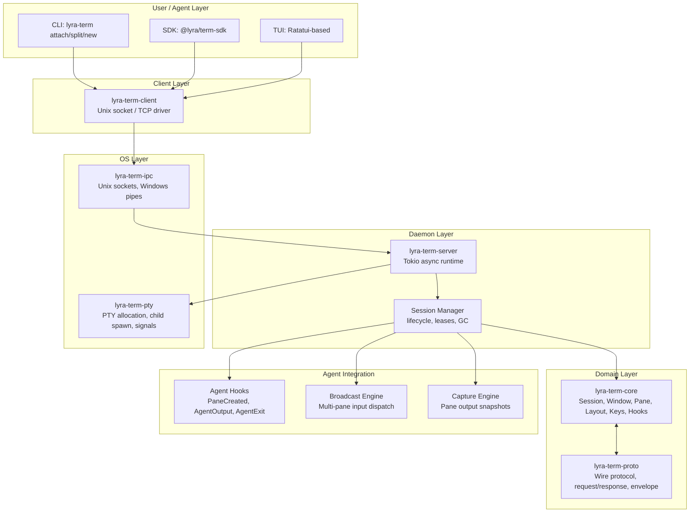
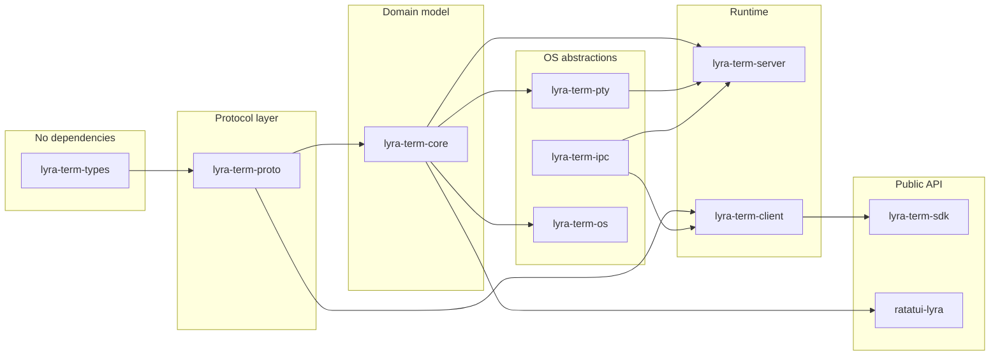
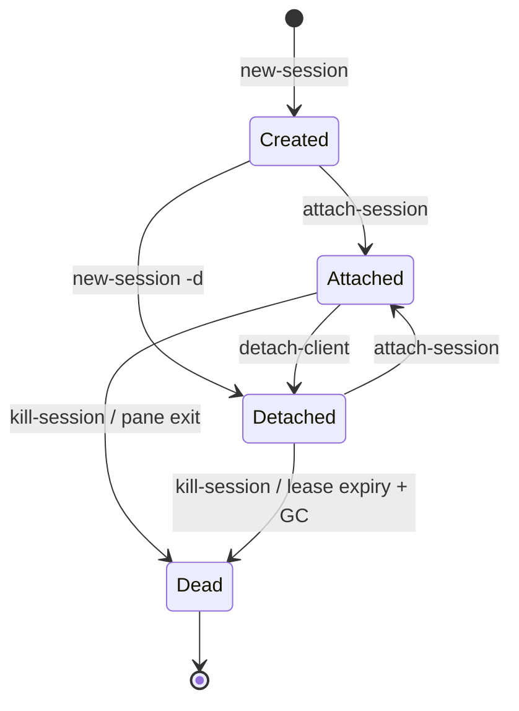
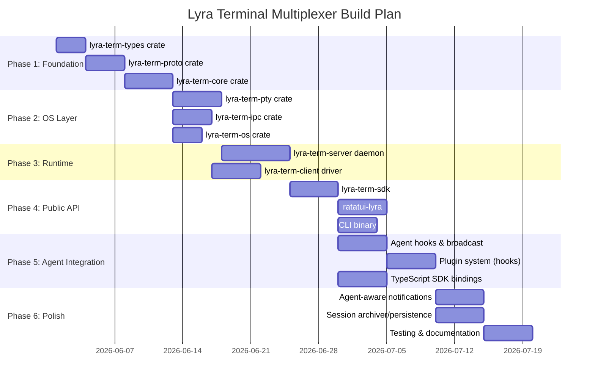

# Stream 8: Terminal Multiplexer & Multi-Agent Orchestration Research

**Research Date:** 2026-05-30
**Status:** Complete
**Scope:** tmux/cmux/rmux/Warp/AlphaClaw/AgentsMesh deep analysis; rmux-style rebuild design; multi-tenancy evaluation

---

## Table of Contents

1. [Executive Summary](#executive-summary)
2. [Repository Analyses](#repository-analyses)
   - [tmux (Reference Architecture)](#1-tmux---reference-architecture)
   - [cmux (AI-Native Terminal)](#2-cmux---ai-native-terminal)
   - [rmux (Rust Multiplexer SDK)](#3-rmux---rust-multiplexer-sdk)
   - [Warp (Agentic Development Environment)](#4-warp---agentic-development-environment)
   - [AlphaClaw (Agent Harness)](#5-alphaclaw---agent-harness)
   - [AgentsMesh (Multi-Tenant Agent Platform)](#6-agentsmesh---multi-tenant-agent-platform)
3. [License Compatibility Matrix](#license-compatibility-matrix)
4. [A. rmux-Style Rebuild Design for Lyra](#a-rmux-style-rebuild-design-for-lyra)
   - [Architecture Overview](#architecture-overview)
   - [Pane/Split Management](#panesplit-management)
   - [Session Management](#session-management)
   - [Key Bindings](#key-bindings)
   - [Plugin System](#plugin-system)
   - [Build Plan with Phases](#build-plan-with-phases)
5. [B. Multi-Tenancy Evaluation (AgentsMesh)](#b-multi-tenancy-evaluation-agentsmesh)
6. [Priority Ranking (Impact x Effort)](#priority-ranking-impact--effort)
7. [Reference Links](#reference-links)

---

## Executive Summary

This research analyzes six key repositories to inform Lyra's terminal multiplexer rebuild and multi-tenancy strategy. The analysis spans classic terminal multiplexers (tmux), AI-native terminals (cmux), Rust-based multiplexer SDKs (rmux), agentic development environments (Warp), agent harnesses (AlphaClaw), and multi-tenant agent platforms (AgentsMesh).

**Key Findings:**

- **rmux is the most valuable reference architecture** -- MIT-licensed, clean Rust crate structure, daemon-backed SDK, tmux-compatible CLI, and explicit multi-agent orchestration demos
- **cmux is GPL-3.0 (incompatible with MIT Lyra)** but its Claude Code Teams integration, notification rings, and workspace model are valuable design inspirations
- **AgentsMesh has a BSL-1.1 license (restricted production use)** but its multi-tenant model (Organization > Team > User hierarchy with row-level isolation) is well-architected; the concept should be adapted, not adopted
- **tmux provides the architectural blueprint** (ISC-licensed, permissive) for session/window/pane management with 64+ commands, key bindings, and hooks
- **Warp is AGPL-3.0 (incompatible)** but its warpui crate is MIT-licensed; its agentic workflow concept is noteworthy
- **AlphaClaw is MIT-licensed** and offers excellent patterns for watchdog/monitoring, Git-backed rollback, and browser-based observability

**Recommendations:**

1. **Build Lyra's terminal multiplexer as a clean from-scratch Rust implementation** drawing on rmux's crate architecture, tmux's command model, and cmux's agent-aware notifications
2. **Skip full multi-tenancy** for now -- adapt lightweight tenant isolation concepts (AgentPod-style sandboxing) but defer full Organization > Team > User hierarchy

---

## Repository Analyses

### 1. tmux -- Reference Architecture

| Attribute | Details |
|-----------|---------|
| **Language** | C (~64,000 lines across 64 command files) |
| **License** | ISC (BSD-equivalent permissive -- compatible with MIT) |
| **Version** | 3.6b |
| **Platform** | Linux, macOS, BSD |
| **Architecture** | Client-server with daemon (single `tmux` binary re-execs) |

#### Architecture

tmux follows a classic Unix client-server model:

```
Client (tmux attach)  <--Unix Socket-->  Server (tmux daemon)
                                              |
                                    +---------+---------+
                                    |         |         |
                                 Session  Session   Session
                                    |         |
                                  Window   Window
                                    |
                               +----+----+
                               |    |    |
                             Pane Pane Pane
```

**Key Data Structures** (from `tmux.h`):

- **`struct session`** (line 69): id, name, windows collection, active window, working directory, attached clients list, options, alerts, creation/activity timestamps
- **`struct winlink`** (line 80): session-to-window link with index, window pointer, status text, flags
- **`struct window`**: collection of panes in a layout (even-horizontal, even-vertical, tiled), active pane reference, name, dimensions
- **`struct window_pane`** (line 1053): PTY fd, process ID, screen buffer, mode, geometry, pipe/IO state
- **`struct cmd`** (line 44): command definition with name, alias, argument specification, entry function
- **`struct window_mode`** (line 1149): polymorphic pane mode (copy-mode, choose-tree, etc.) with virtual function table (init, free, resize, key, command)

**Command Architecture (64 commands):**
Each `cmd-*.c` file implements one command (e.g., `cmd-new-session.c`, `cmd-split-window.c`, `cmd-kill-pane.c`). Commands are registered in a global table. The argument parser supports boolean flags, string options, and target specifiers.

**Key Abstractions:**

1. **Sessions** -- independent workspaces, each with own windows, detachable/re-attachable
2. **Windows** -- collection of panes arranged in a layout, linked to a session via winlink
3. **Panes** -- individual PTY-backed terminal instances, each with independent shell/process
4. **Clients** -- attached terminal emulators that render panes and handle key input
5. **Hooks** -- event system (session-created, pane-died, client-attached, etc.)
6. **Options** -- global, server, session, window, and pane-scoped configuration
7. **Key Bindings** -- prefix-key based (default Ctrl-b) with command binding tables
8. **Buffer/Paste** -- clipboard buffer stack with named buffers
9. **Formats** -- templating system for status line and command output

#### Most Valuable Capabilities for Lyra

| Capability | Relevance |
|-----------|-----------|
| Client-server detachable sessions | Core to agent persistence across connections |
| Pane split/join/swap/resize | Essential for multi-agent view management |
| Hooks system (session-created, pane-died) | Integration point for Lyra's agent lifecycle events |
| Formats/templating | Structured output for agent status monitoring |
| Command queue with batch execution | Parallel agent command dispatch |
| Copy mode with search | Agent output inspection and log review |

---

### 2. cmux -- AI-Native Terminal

| Attribute | Details |
|-----------|---------|
| **Language** | Swift (AppKit), Zig (daemon), TypeScript (web/backend) |
| **License** | GPL-3.0 (with commercial option) -- **INCOMPATIBLE with MIT** |
| **Platform** | macOS only |
| **Architecture** | Native macOS app (AppKit) + GhosttyKit (GPU rendering) + Zig daemon + Vercel web backend |

#### Architecture

cmux is a Ghostty-based macOS terminal built specifically for AI coding agents. Its architecture has several layers:

- **App Layer (Swift/AppKit):** Native macOS window management, tab/split rendering, notification UI
- **Terminal Core (GhosttyKit/libghostty):** GPU-accelerated terminal rendering via Zig-built xcframework
- **Daemon (cmuxd, Zig):** Background process management, socket communication
- **CLI Layer (Swift):** Scriptable CLI for workspace/surface/tab management
- **Web Backend (TypeScript/Effect-TS):** Cloud VM management, account services

**Key Abstractions:**

1. **Workspaces** -- top-level containers with vertical tabs
2. **Surfaces** -- split panes within a tab (horizontal/vertical splits)
3. **Tabs** -- vertical sidebar tabs showing git branch, PR status, working directory, listening ports
4. **Notification Rings** -- blue rings on panes when agents need attention; tabs light up
5. **Notification Panel** -- sidebar aggregating all pending notifications
6. **In-App Browser** -- scriptable browser split alongside terminal (ported from agent-browser)
7. **Claude Code Teams Integration** -- `cmux claude-teams` wraps Claude Code's teammate mode:
   - Auto-injects `--teammate-mode auto` flag
   - Spawns teammates as native splits with sidebar metadata
   - Configures tmux-compatible environment shims (fake tmux path)
   - Manages teammate lifecycle tracking
8. **Agent Hook System** -- `CMUXCLI+AgentHookDefinitions.swift`, `CMUXCLI+HermesAgentHooks.swift`, `CMUXCLI+TmuxCompatSupport.swift`
9. **Socket API** -- Scriptable via Unix socket for automation (create workspaces, split panes, send keystrokes)

#### Most Valuable Capabilities for Lyra (DESIGN INSPIRATION ONLY)

Since cmux is GPL-3.0, Lyra cannot directly use or derive from its code. However, the concepts are valuable:

| Concept | Lyra Application |
|---------|-----------------|
| Agent-aware notification rings | Visual indicators when agent panes need attention |
| Claude Code Teams integration | First-class agent-to-pane mapping with metadata |
| Scriptable socket API | External orchestration via CLI/socket |
| Workspace/tab metadata (git branch, PR, ports) | Agent context display in pane headers |
| In-app browser split | Web inspection alongside agent terminal |
| tmux-compatible environment shims | Interop with existing tools expecting tmux |

---

### 3. rmux -- Rust Multiplexer SDK

| Attribute | Details |
|-----------|---------|
| **Language** | Rust |
| **License** | MIT OR Apache-2.0 -- **FULLY COMPATIBLE with MIT** |
| **Version** | 0.3.1 (published May 25, 2026) |
| **Platform** | Linux, macOS, Windows |
| **Architecture** | Daemon-backed, crate-based, tmux-compatible CLI + SDK |

#### Architecture

rmux is the most architecturally relevant reference for Lyra. It is organized as a Cargo workspace with 12+ crates:

```
rmux (root binary -- CLI + hidden daemon mode)
 |
 +-- crates/rmux-types       Pure data types (no dependencies)
 +-- crates/rmux-proto        Wire protocol (identity, envelope, codec, requests/responses)
 +-- crates/rmux-core         Domain model (Session, Window, Pane, Layout, Grid, Keys, Options, Hooks)
 +-- crates/rmux-os           OS abstractions (signals, temp dirs, file locks)
 +-- crates/rmux-ipc          IPC transport (Unix sockets, Windows named pipes)
 +-- crates/rmux-pty          PTY allocation, child process management, terminal sizing
 +-- crates/rmux-client       TCP/Unix-socket client driver
 +-- crates/rmux-server       Daemon runtime (Tokio async, session lifecycle, connection management)
 +-- crates/rmux-sdk          Public SDK facade (ensure_session, broadcast, capture, snapshot, commands)
 +-- crates/rmux-render-core  Terminal rendering primitives (grid, style, screen)
 +-- crates/ratatui-rmux      Ratatui integration for TUI apps
 +-- xtask                    Build tooling
```

**Key Design Principles:**

1. **Pure Domain Model** (`rmux-core`): `Session`, `Window`, `Pane` are pure data structures with no OS, network, or PTY dependencies. The `#![forbid(unsafe_code)]` directive enforces safety.
2. **Protocol-First** (`rmux-proto`): All communication uses a typed request/response protocol with capability negotiation. The `FrameLedger` tracks all v1 frame kinds.
3. **Daemon-Backed SDK** (`rmux-sdk`): The public SDK connects to a daemon (or starts one), then offers typed operations: `ensure_session`, `broadcast` to panes, `capture` pane output, `snapshot` sessions, `wait` for events.
4. **Target Resolution**: Explicit target types (`SessionName`, `SessionId`, `WindowId`, `PaneId`) with a `SessionPaneTarget` resolver.
5. **Command Parser** (`command_parser`): tmux-compatible command syntax parsed from strings.
6. **Hook System** (`hooks`): Event dispatch with global root, binding store, scope validation, registered hooks fire on lifecycle events.
7. **Key Bindings** (`keys`): Full key code system with modifiers, key tables, binding stores.
8. **PTY Abstraction** (`rmux-pty`): Platform-specific PTY allocation behind a uniform API (`PtyPair`, `PtyMaster`, `PtyIo`, `PtyChild`).

**Agent-Specific Features:**

- **Broadcast to pane groups** (`BroadcastResult`): Send input to multiple panes, with partial failure reporting per pane
- **Capture builder** (`CaptureBuilder`): Capture pane output regions (rects) for agent inspection
- **Snapshot** (`snapshot`): Structured session/window/pane state snapshots for observability
- **Pane event stream** (`PaneNotification`, `PaneEvent`): Real-time pane lifecycle events
- **Session lease** (`EnsureSessionPolicy`): Owned session leases prevent daemon cleanup during agent work

#### Most Valuable Capabilities for Lyra

| Capability | Relevance |
|-----------|-----------|
| Crate architecture with pure domain model | Directly adoptable for Lyra's multiplexer |
| Daemon-backed SDK pattern | Agents connect via typed API, not raw terminals |
| Broadcast to pane groups | Multi-agent orchestration -- send to N agent panes |
| Pane capture/snapshot | Agent output observability and state inspection |
| tmux-compatible CLI surface | Drop-in interop with existing tooling |
| Hook system with lifecycle events | Integration with Lyra's agent lifecycle |
| Capability negotiation protocol | Safe versioning between daemon and clients |
| Session leases with TTL | Prevent daemon from killing active agent sessions |
| `#![forbid(unsafe_code)]` safety | Critical for security-sensitive agent operations |

---

### 4. Warp -- Agentic Development Environment

| Attribute | Details |
|-----------|---------|
| **Language** | Rust (98.2%) |
| **License** | AGPL-3.0 (main code) / MIT (warpui and warpui_core crates only) -- **INCOMPATIBLE** |
| **Platform** | macOS, Linux |
| **Architecture** | Rust/Tokio async, warpui crate for UI, agentic workflow engine |

#### Architecture

- **Rust/Tokio async runtime** -- Core infrastructure
- **warpui / warpui_core crates** -- UI framework (these are MIT-licensed and reusable)
- **Command signatures v2** -- Structured command definitions
- **"Oz" agentic open-source management** -- Automated agents triage issues, write specs, implement changes, review PRs
- **Issue-to-PR workflow** with readiness labels (`ready-to-spec`, `ready-to-implement`)
- **Web-compiled terminal** for viewing active agent sessions

#### Most Valuable Capabilities for Lyra

| Concept | Lyra Application |
|---------|-----------------|
| Agentic issue-to-PR workflow | Automated development lifecycle |
| "Oz" automated triage agents | CI/CD integrated agent workflows |
| Command signatures as structured definitions | Type-safe command dispatching |

**Note:** Warp's main code is AGPL-3.0, making it incompatible with MIT-licensed Lyra. Only the `warpui` and `warpui_core` crates (MIT) could theoretically be reused as dependencies, but they are Rust crates and Lyra is TypeScript.

---

### 5. AlphaClaw -- Agent Harness

| Attribute | Details |
|-----------|---------|
| **Language** | Node.js/TypeScript |
| **License** | MIT -- **FULLY COMPATIBLE** |
| **Platform** | Docker/Linux (primarily) |
| **Architecture** | Web dashboard + managed gateway + watchdog + cron + channel orchestration |

#### Architecture

AlphaClaw wraps OpenClaw with infrastructure management:

```
Browser Dashboard (web UI)
    |
    +-- Gateway Manager (spawns/monitors/restarts OpenClaw)
    |       |
    |       +-- Watchdog (crash detection, auto-repair, notifications)
    |       +-- Live Terminal (browser-based PTY access)
    |
    +-- Channel Orchestration (Telegram, Discord, Slack)
    +-- Cron Jobs (scheduled agent tasks)
    +-- Git Sync (auto-commits to GitHub)
    +-- File Explorer (browser-based workspace editing)
    +-- Prompt Hardening (anti-drift system prompts)
```

**Key Abstractions:**

1. **Watchdog** (`lib/server/watchdog.js`):
   - Crash detection with crash-loop recovery
   - Auto-repair (`openclaw doctor --fix`)
   - Configurable notification channels (Telegram/Discord/Slack)
   - Live interactive terminal for monitoring gateway output from browser
   - State machine: stopped -> starting -> healthy -> degraded -> crash-recovery
   - Crash loop detection window (timestamp-based, configurable threshold)
   - Expected restart in-progress detection (grace period for intentional restarts)
   - Health check with configurable intervals and timeout

2. **Gateway Manager**: Spawns, monitors, restarts, and proxies the OpenClaw gateway as a managed child process

3. **Channel Orchestration**: Per-agent channel bindings with credential sync

4. **Git Sync**: Automatic hourly commits with configurable cron schedule

5. **Prompt Hardening**: Bootstrap prompts injected on every message to maintain agent discipline

#### Most Valuable Capabilities for Lyra

| Capability | Relevance |
|-----------|-----------|
| Watchdog state machine with crash-loop detection | Agent health monitoring for Lyra's orchestration |
| Browser-based interactive terminal | Remote agent terminal access |
| Prompt hardening (anti-drift) | Agent discipline maintenance across long sessions |
| Git sync for agent workspace | Version-controlled agent actions |
| Channel orchestration | Multi-channel agent coordination |

---

### 6. AgentsMesh -- Multi-Tenant Agent Platform

| Attribute | Details |
|-----------|---------|
| **Language** | Go (backend), TypeScript/Next.js (web), Rust (core clients), Zig (runner) |
| **License** | BSL-1.1 (Business Source License) -- **production use restricted until 2030**, then GPL-2.0 |
| **Platform** | Linux, macOS, Windows (runner); web dashboard |
| **Architecture** | Control plane (gRPC/mTLS) + Data plane (Relay/WebSocket) + Runner daemon |

#### Architecture

AgentsMesh separates control plane from data plane:

```
Control Plane (gRPC + mTLS)
    |
    +-- Backend (Go/Gin) -- Organization, Pod, Ticket, Runner management
    |       |
    |       +-- Proto definitions (30+ services)
    |       +-- Domain layer (agentpod, user, organization, ticket, ticket_relations)
    |       +-- Middleware (tenant isolation, auth, audit, rate limiting)
    |       +-- Sharded connection management (256 shards for 100K+ runners)
    |
    +-- Web Frontend (Next.js) -- Dashboard, web terminal, kanban, topology viz
    |
Data Plane (WebSocket/Relay)
    |
    +-- Relay cluster -- Terminal I/O streaming (Browser <-> Relay <-> Runner)
    +-- Runner daemon -- Local agent execution, PTY management, sandboxing
```

**Key Abstractions:**

1. **AgentPod** -- Remote AI workstation:
   - Web terminal (browser-based PTY)
   - Git worktree isolation (each pod has isolated workspace)
   - Real-time streaming via Relay
   - Supports Claude Code, Codex CLI, Gemini CLI, Aider, OpenCode, custom agents
   - Status machine: initializing -> running -> paused -> disconnected -> orphaned -> completed -> terminated -> error
   - Agent status: executing -> waiting -> idle
   - Permission modes: default, plan, acceptEdits, dontAsk, bypassPermissions
   - PTY and ACP interaction modes

2. **Multi-Tenant Model** (Organization > Team > User):
   - **Organization**: Top-level tenant boundary with slug-based routing
   - **Member roles**: owner, admin, member
   - **Tenant middleware** (`tenant.go`): Extracts org_slug from URL, validates membership, creates `TenantContext{OrganizationID, OrganizationSlug, UserID, UserRole, PodID}`
   - **Row-level isolation**: All DB queries scoped by `organization_id`
   - **API key scoping**: Keys bound to organizations with role-based access

3. **Ticket System**: Kanban board with ticket-pod binding, progress tracking, MR/PR integration, subtask support, assignees, labels

4. **Runner**: Lightweight daemon running on user infrastructure:
   - Self-hosted (code never leaves user's environment)
   - gRPC with mTLS for control commands
   - WebSocket relay for terminal data streaming
   - Git worktree creation and management
   - Agent process spawning and supervision

5. **Relay**: Terminal data plane:
   - Bidirectional WebSocket streaming
   - Browser <-> Relay <-> Runner architecture
   - PTY read error detection and propagation

6. **Mesh/Channel**: Multi-agent collaboration topology:
   - Agent channels for coordination
   - Pod bindings to channels
   - Real-time topology visualization
   - Channel @mention with pod prompt forwarding

#### Multi-Tenant Implementation Deep-Dive

The tenant isolation model uses a layered approach:

```
Request Flow:
  HTTP Request (with org_slug in URL)
      |
      v
  AuthMiddleware -- extracts user from JWT/session, sets user_id
      |
      v
  TenantMiddleware -- resolves org_slug, validates membership, creates TenantContext
      |
      v
  Domain Handler -- uses TenantContext to scope queries by organization_id
      |
      v
  Database -- all queries include WHERE organization_id = ?
```

The `TenantContext` struct carries:
- `OrganizationID int64` -- for DB row-level scoping
- `OrganizationSlug string` -- URL routing key
- `UserID int64` -- for audit logging and ownership
- `UserRole string` -- owner/admin/member for RBAC
- `PodID *int64` -- optional pod-scoped context

---

## License Compatibility Matrix

| Repository | License | MIT-Compatible? | Can Lyra Use Code? | Recommendation |
|-----------|---------|----------------|-------------------|----------------|
| **tmux** | ISC (BSD-equivalent) | YES | N/A (C code) | Reference architecture only |
| **cmux** | GPL-3.0 (+ commercial) | NO | NO | Design inspiration only |
| **rmux** | MIT OR Apache-2.0 | YES | YES (as reference) | Primary reference; crate architecture adoptable |
| **Warp** | AGPL-3.0 / MIT (warpui only) | Partial | NO (main) | Reference only |
| **AlphaClaw** | MIT | YES | YES | Watchdog patterns adoptable |
| **AgentsMesh** | BSL-1.1 (-> GPL-2.0 in 2030) | NO | NO | Design inspiration only |

**CRITICAL NOTE:** rmux is MIT-licensed. This means Lyra (also MIT) can:
- Study rmux's architecture and design patterns
- Implement similar abstractions in Lyra's own code
- NOT directly copy/paste rmux source code into Lyra without attribution

The clean from-scratch rebuild design below draws architectural inspiration from all compatible sources while being an original implementation.

---

## A. rmux-Style Rebuild Design for Lyra

### Architecture Overview

Lyra's terminal multiplexer ("lyra-term") is designed as a from-scratch Rust implementation, organized as a Cargo workspace with clean crate boundaries.



**Crate Dependency Graph:**



### Pane/Split Management

**Data Model:**

```rust
/// Unique pane identifier, stable across the pane's lifetime.
struct PaneId(u32);

/// Layout direction for splits.
enum SplitDirection {
    Horizontal,  // left/right
    Vertical,    // top/bottom
}

/// Pane geometry in terminal coordinates.
struct PaneGeometry {
    x: u16,
    y: u16,
    cols: u16,
    rows: u16,
}

/// Layout tree for window arrangements.
enum Layout {
    /// A single leaf pane.
    Leaf { pane_id: PaneId },
    /// A split container with children.
    Split {
        direction: SplitDirection,
        children: Vec<Layout>,
        sizes: Vec<f64>,  // proportional sizes (0.0-1.0)
    },
}

/// Pure in-memory pane state.
struct Pane {
    id: PaneId,
    index: u32,
    geometry: PaneGeometry,
    title: String,
    foreground_process: Option<String>,
    cursor_position: (u16, u16),
    scrollback: Vec<String>,
    alerts: AlertFlags,
    environment: HashMap<String, String>,
}
```

**Layout Operations:**

```rust
impl Window {
    /// Split the active pane in the given direction.
    fn split_pane(&mut self, direction: SplitDirection, size: Option<f64>) -> PaneId;

    /// Join two panes into one (opposite of split).
    fn join_panes(&mut self, source: PaneId, target: PaneId) -> Result<()>;

    /// Resize a pane.
    fn resize_pane(&mut self, pane: PaneId, adjustment: ResizeAdjustment) -> Result<()>;

    /// Swap two panes in the layout.
    fn swap_panes(&mut self, source: PaneId, target: PaneId) -> Result<()>;

    /// Rotate panes in the window.
    fn rotate_panes(&mut self, direction: RotationDirection) -> Result<()>;

    /// Move a pane to a new window.
    fn break_pane(&mut self, pane: PaneId) -> Result<(WindowId, PaneId)>;

    /// Recalculate geometry for all panes after resize.
    fn recalculate_layout(&mut self, terminal_size: TerminalSize);
}
```

**Agent-Aware Pane Metadata:**

```rust
struct AgentPaneMetadata {
    agent_id: String,
    agent_type: AgentType,  // ClaudeCode, Codex, Gemini, Custom
    task_description: String,
    status: AgentTaskStatus,  // Running, Waiting, Completed, Error
    started_at: DateTime<Utc>,
    last_output_at: DateTime<Utc>,
}

impl Pane {
    /// Attach agent metadata to a pane.
    fn attach_agent(&mut self, metadata: AgentPaneMetadata);

    /// Get the agent associated with this pane, if any.
    fn agent(&self) -> Option<&AgentPaneMetadata>;
}
```

### Session Management

**Data Model:**

```rust
/// Unique session identifier.
struct SessionId(u64);

/// Named session reference.
struct SessionName(String);  // validated: [a-zA-Z0-9_.-]{1,64}

/// Detached session.
struct Session {
    id: SessionId,
    name: SessionName,
    group_name: Option<SessionName>,
    windows: BTreeMap<u32, Window>,
    active_window: u32,
    last_window: Option<u32>,
    created_at: Instant,
    activity_at: Instant,
    last_attached_at: Option<Instant>,
    working_directory: Option<PathBuf>,
    options: SessionOptions,
    environment: HashMap<String, String>,
    lease: Option<SessionLease>,
}

struct SessionLease {
    owner_id: String,
    ttl: Duration,
    expires_at: Instant,
}
```

**Session Lifecycle:**



**Session Store:**

```rust
struct SessionStore {
    sessions: BTreeMap<SessionId, Session>,
    name_index: HashMap<SessionName, SessionId>,
    next_id: SessionId,
    gc_config: GcConfig,
}

impl SessionStore {
    fn create(&mut self, name: SessionName, size: TerminalSize) -> SessionId;
    fn get(&self, target: &SessionTarget) -> Option<&Session>;
    fn get_mut(&mut self, target: &SessionTarget) -> Option<&mut Session>;
    fn kill(&mut self, target: &SessionTarget) -> Result<()>;
    fn list(&self) -> Vec<SessionInfo>;
    fn gc_expired_leases(&mut self);
    fn attach_client(&mut self, session_id: SessionId, client_id: ClientId);
    fn detach_client(&mut self, session_id: SessionId, client_id: ClientId);
}
```

### Key Bindings

**Design:**

Following tmux's model with Lyra-specific extensions:

```rust
struct KeyBinding {
    key: KeyCode,
    command: String,       // e.g., "split-window -h"
    table: KeyTable,       // prefix, root, copy-mode, agent-mode
    description: String,
}

enum KeyTable {
    Prefix,     // Default: Ctrl-a (Lyra prefix)
    Root,       // No prefix needed
    CopyMode,   // Scroll/search in pane history
    AgentMode,  // Agent-specific commands (new for Lyra)
}

struct KeyBindingStore {
    tables: HashMap<KeyTable, Vec<KeyBinding>>,
}

impl Default for KeyBindingStore {
    fn default() -> Self {
        let mut store = Self { tables: HashMap::new() };

        // Prefix table (after Ctrl-a)
        store.bind(KeyTable::Prefix, "c", "new-window");
        store.bind(KeyTable::Prefix, "\"", "split-window");      // horizontal
        store.bind(KeyTable::Prefix, "%", "split-window -h");    // vertical
        store.bind(KeyTable::Prefix, "x", "kill-pane");
        store.bind(KeyTable::Prefix, "d", "detach-client");
        store.bind(KeyTable::Prefix, "n", "next-window");
        store.bind(KeyTable::Prefix, "p", "previous-window");
        store.bind(KeyTable::Prefix, "[", "copy-mode");
        store.bind(KeyTable::Prefix, ":", "command-prompt");

        // Lyra-specific agent bindings
        store.bind(KeyTable::Prefix, "A", "agent-attach");       // attach agent to pane
        store.bind(KeyTable::Prefix, "a", "agent-status");       // show agent status
        store.bind(KeyTable::Prefix, "b", "agent-broadcast");    // broadcast to all agents
        store.bind(KeyTable::Prefix, "g", "agent-log");          // view agent log

        store
    }
}
```

**Human-Friendly Defaults:**

Lyra's default prefix is `Ctrl-a` (not `Ctrl-b` like tmux) to avoid conflicts when running inside tmux. An ergonomic profile for agent users adds:

```
Ctrl-a |     split-window -h    (vertical split -- easy reach)
Ctrl-a -     split-window       (horizontal split -- easy reach)
Ctrl-a h/j/k/l  select-pane -L/-D/-U/-R  (vim-style pane navigation)
Ctrl-a Shift+H/J/K/L  resize-pane -L/-D/-U/-R 5
```

### Plugin System

**Design:**

Lyra's plugin system follows a hook-based architecture where plugins register callbacks for lifecycle events:

```rust
/// A plugin that extends Lyra's terminal multiplexer.
trait LyraPlugin: Send + Sync {
    /// Unique plugin identifier.
    fn id(&self) -> &str;

    /// Human-readable name.
    fn name(&self) -> &str;

    /// Plugin version.
    fn version(&self) -> semver::Version;

    /// Hooks this plugin subscribes to.
    fn hooks(&self) -> Vec<HookBinding>;

    /// Initialize the plugin.
    fn init(&mut self, ctx: &PluginContext) -> Result<()>;

    /// Handle a hook event.
    fn on_hook(&self, event: &HookEvent, ctx: &PluginContext) -> Result<()>;

    /// Cleanup when plugin is unloaded.
    fn shutdown(&mut self, ctx: &PluginContext) -> Result<()>;
}

/// Available hook events.
enum HookEvent {
    SessionCreated { session_id: SessionId, session_name: SessionName },
    SessionClosed { session_id: SessionId },
    PaneCreated { pane_id: PaneId, session_id: SessionId, window_id: WindowId },
    PaneExited { pane_id: PaneId, exit_code: i32 },
    AgentAttached { pane_id: PaneId, agent_id: String },
    AgentOutput { pane_id: PaneId, agent_id: String, output: String },
    AgentCompleted { pane_id: PaneId, agent_id: String, exit_code: i32 },
    ClientAttached { client_id: ClientId, session_id: SessionId },
    ClientDetached { client_id: ClientId, session_id: SessionId },
    BroadcastSent { target_count: usize, success_count: usize },
}

/// Plugin registration.
struct HookBinding {
    event: HookEventType,
    priority: HookPriority,  // High, Normal, Low
    handler: HookHandler,
}
```

**Built-in Plugins:**

1. **Agent Watcher** -- Monitors agent pane output for completion/error patterns, updates status
2. **Notification Relay** -- Forwards pane alerts to system notification center or webhooks
3. **Session Archiver** -- Persists session state for crash recovery
4. **Metrics Collector** -- Emits Prometheus metrics for pane/session counts, agent activity
5. **Command Logger** -- Audit log of all commands executed across panes

**Plugin Distribution:**

Plugins are distributed as dynamically loaded `.wasm` modules (via Wasmtime) or native `.so`/`.dylib` shared libraries:

```rust
struct PluginLoader {
    wasm_engine: wasmtime::Engine,
    native_registry: HashMap<String, Box<dyn LyraPlugin>>,
    wasm_registry: HashMap<String, wasmtime::Instance>,
}

impl PluginLoader {
    fn load_wasm(&mut self, path: &Path) -> Result<()>;
    fn load_native(&mut self, path: &Path) -> Result<()>;
    fn unload(&mut self, plugin_id: &str) -> Result<()>;
}
```

### Build Plan with Phases



#### Phase 1: Foundation (Week 1-2)

**Crates:** `lyra-term-types`, `lyra-term-proto`, `lyra-term-core`

- Pure data types: `PaneId`, `SessionId`, `WindowId`, `SessionName`
- Wire protocol: request/response envelopes, frame codec, capability negotiation
- Domain model: `Session`, `Window`, `Pane`, `Layout`, `KeyBinding`, `HookStore`
- Command parser: tmux-compatible + Lyra-specific commands
- Key binding system with multiple key tables
- 100% unit test coverage of domain logic

#### Phase 2: OS Layer (Week 3)

**Crates:** `lyra-term-pty`, `lyra-term-ipc`, `lyra-term-os`

- PTY allocation and child process management (Linux: `openpty`, macOS: `forkpty`, Windows: ConPTY)
- Unix socket and Windows named pipe transport
- Signal handling, temp directories, file locking
- Platform abstraction behind uniform traits

#### Phase 3: Runtime (Week 4-5)

**Crates:** `lyra-term-server`, `lyra-term-client`

- Daemon with Tokio async runtime
- Session lifecycle management (create, attach, detach, kill, GC)
- Connection management (accept, authenticate, heartbeat)
- Client driver with connection pool and reconnection
- Session lease management with TTL

#### Phase 4: Public API (Week 6-7)

**Crates:** `lyra-term-sdk`, `ratatui-lyra`, CLI binary

- Public SDK facade: `LyraTerm::builder().connect_or_start()`
- Session ensures: `ensure_session().policy(CreateOrReuse).detached(true)`
- Pane broadcast, capture, snapshot APIs
- Ratatui integration for TUI rendering
- CLI binary with tmux-compatible surface + Lyra extensions

#### Phase 5: Agent Integration (Week 8-9)

- Agent hook system: `AgentAttached`, `AgentOutput`, `AgentCompleted`
- Broadcast engine: `broadcast_to_agents(input).partial_failure_report()`
- Plugin system: hook registration, WASM + native loading
- TypeScript SDK bindings via napi-rs

#### Phase 6: Polish (Week 10-11)

- Agent-aware notification indicators (inspired by cmux blue rings)
- Session persistence and crash recovery
- Integration tests with real PTY-backed agent processes
- Documentation: API docs, user guide, plugin developer guide
- Performance benchmarks and profiling

---

## B. Multi-Tenancy Evaluation (AgentsMesh)

### What Multi-Tenancy Means in This Context

In AgentsMesh, multi-tenancy means that a single platform instance serves multiple **organizations** with strict isolation between them. Each organization is an independent tenant with:

1. **Organization-level namespace**: All resources (pods, tickets, runners, repositories) are scoped to an organization
2. **Member management**: Users belong to organizations with role-based access (owner, admin, member)
3. **Row-level database isolation**: Every query includes `WHERE organization_id = ?`
4. **Tenant context injection**: Middleware resolves `org_slug` from URL, validates membership, and injects `TenantContext` into the request pipeline
5. **API key scoping**: API keys are bound to specific organizations
6. **Self-hosted runners**: Each organization's runners run on their own infrastructure

The hierarchy is:
```
Organization (tenant boundary)
  +-- Team (optional grouping within org)
       +-- User (with role: owner, admin, member)
            +-- API Keys (scoped to org + user)
       +-- AgentPod (AI workspace)
       +-- Ticket (task with pod binding)
       +-- Runner (execution daemon)
       +-- Repository (Git provider integration)
```

### Pros

| Benefit | Details |
|---------|---------|
| **Isolation** | Each organization's data, agents, and resources are completely isolated. One tenant's crash or resource exhaustion cannot affect another. |
| **Resource Management** | Per-tenant quotas for pods, runners, tokens, and API rate limits prevent noisy-neighbor problems. |
| **Security** | Row-level isolation prevents cross-tenant data leakage. mTLS ensures only authorized runners connect. RBAC ensures users can only access their organization's resources. |
| **Scaling** | Stateless middleware + sharded connection management (256 shards) enables horizontal scaling to thousands of tenants and 100K+ runners. |
| **Billing/Usage Tracking** | Per-tenant token usage, pod hours, and runner metrics enable accurate billing and cost allocation. |
| **Enterprise Readiness** | SSO, audit logs, and air-gapped deployment support make it viable for enterprise customers. |
| **Self-Hosted Flexibility** | Runners run on tenant-owned infrastructure, satisfying data residency and compliance requirements. |

### Cons

| Drawback | Details |
|----------|---------|
| **Complexity** | Multi-tenancy adds significant architectural complexity: tenant middleware, row-level scoping, auth with org resolution, cross-tenant operation prevention. Every new feature must consider tenant boundaries. |
| **Operational Overhead** | Managing tenant lifecycle (provisioning, deprovisioning, quota enforcement, billing) requires dedicated infrastructure and operational tooling. |
| **Coordination Challenges** | Cross-tenant operations (e.g., shared agent pools, org-to-org collaboration) are inherently difficult and can create security holes. |
| **Performance Overhead** | Row-level isolation via `WHERE organization_id = ?` adds index overhead. Tenant context resolution on every request adds latency. |
| **Testing Complexity** | Every test must run within a tenant context. Test fixtures must include organization and membership setup. |
| **Premature for Early-Stage** | If Lyra is primarily used by single teams or individuals, the overhead of full multi-tenancy may outweigh benefits. YAGNI principle applies. |
| **License Restrictions** | AgentsMesh is BSL-1.1 -- cannot directly adopt its multi-tenant implementation. Must be a clean from-scratch design. |

### Clear Recommendation: ADAPT (not adopt, not skip)

**Recommendation:** Adapt lightweight tenant isolation concepts from AgentsMesh but defer the full Organization > Team > User hierarchy.

**Reasoning:**

1. **Lyra's current state does not warrant full multi-tenancy.** Lyra is a developer tool, not a SaaS platform. Most users will run Lyra on their own machine or team server, not as a multi-tenant cloud service.

2. **AgentPod-style isolation IS valuable.** The core concept of isolated workspaces (AgentPods) with Git worktree isolation, dedicated PTY sessions, and resource boundaries is directly applicable to Lyra's agent orchestration. This provides "multi-agent isolation" even without multi-tenant isolation.

3. **Full multi-tenancy can be layered later.** The architecture should anticipate multi-tenancy (reserve the `organization_id` field, use context objects) but not implement tenant middleware until needed.

**What to adapt now:**

```
AgentPod-style resource isolation:
  - Each agent session gets a dedicated Git worktree
  - PTY sessions are isolated per agent
  - Resource limits (CPU, memory, token budget) per agent pod
  - Agent-to-agent communication via typed channels (not raw terminal sharing)
  - Pod lifecycle management (create, run, pause, terminate, archive)
```

**What to defer:**

```
Full multi-tenant platform:
  - Organization/Team/User hierarchy
  - Multi-org routing middleware
  - Row-level DB isolation by organization_id
  - Per-org billing and usage tracking
  - SSO and enterprise features
```

**Architecture for future multi-tenancy:**

Use a `WorkspaceContext` (simpler than `TenantContext`) that can evolve into full tenant context:

```typescript
// Current (Phase 1-5)
interface WorkspaceContext {
    workspaceId: string;
    userId: string;
    agentPods: Map<string, AgentPodState>;
}

// Future (Phase 6+, when multi-tenancy needed)
interface WorkspaceContext {
    workspaceId: string;
    organizationId?: string;  // nullable -- added later
    teamId?: string;          // nullable -- added later
    userId: string;
    role?: 'owner' | 'admin' | 'member';  // added later
    agentPods: Map<string, AgentPodState>;
}
```

---

## Priority Ranking (Impact x Effort)

| # | Feature | Impact (1-10) | Effort (1-10) | Impact/Effort | Priority |
|---|---------|--------------|---------------|---------------|----------|
| 1 | lyra-term-core (domain model) | 9 | 3 | 3.0 | **P0 -- Foundation** |
| 2 | lyra-term-pty (PTY management) | 8 | 4 | 2.0 | **P0 -- Foundation** |
| 3 | lyra-term-server (daemon) | 9 | 5 | 1.8 | **P0 -- Foundation** |
| 4 | Agent hooks (pane lifecycle) | 8 | 3 | 2.7 | **P1 -- Agent Integration** |
| 5 | Broadcast engine | 7 | 3 | 2.3 | **P1 -- Agent Integration** |
| 6 | lyra-term-sdk (public API) | 8 | 4 | 2.0 | **P1 -- Developer UX** |
| 7 | TypeScript SDK bindings | 7 | 4 | 1.8 | **P1 -- Developer UX** |
| 8 | CLI binary (tmux-compatible) | 6 | 4 | 1.5 | **P2 -- Usability** |
| 9 | Agent-aware notifications | 6 | 4 | 1.5 | **P2 -- Usability** |
| 10 | Plugin system (hooks + WASM) | 7 | 6 | 1.2 | **P2 -- Extensibility** |
| 11 | Ratatui integration (TUI) | 5 | 5 | 1.0 | **P3 -- Polish** |
| 12 | Session persistence/archiver | 5 | 4 | 1.25 | **P3 -- Reliability** |
| 13 | AgentPod-style isolation | 6 | 5 | 1.2 | **P3 -- Security** |
| 14 | Full multi-tenancy (Org/Team/User) | 4 | 8 | 0.5 | **DEFER** |

**Priority Legend:**
- **P0 (Foundation):** Must-have; blocks all other work
- **P1 (Agent Integration):** Core value proposition; enables agent orchestration
- **P2 (Usability/Extensibility):** Significant UX improvement; enables ecosystem
- **P3 (Polish/Security):** Production readiness; can ship without
- **DEFER:** Revisit when market validates need

---

## Reference Links

### Primary Repositories
- [tmux](https://github.com/tmux/tmux) -- ISC-licensed, C
- [cmux](https://github.com/manaflow-ai/cmux) -- GPL-3.0, Swift/Zig
- [rmux](https://github.com/Helvesec/rmux) -- MIT OR Apache-2.0, Rust
- [Warp](https://github.com/warpdotdev/warp) -- AGPL-3.0/MIT (warpui), Rust
- [AlphaClaw](https://github.com/chrysb/alphaclaw) -- MIT, Node.js
- [AgentsMesh](https://github.com/AgentsMesh/AgentsMesh) -- BSL-1.1, Go

### rmux Resources
- [rmux Documentation](https://rmux.io/docs/)
- [rmux CLI Reference](https://rmux.io/docs/cli/)
- [rmux SDK Examples](https://rmux.io/docs/examples/)
- [rmux Demos](https://rmux.io/#demo-orchestration) -- Multi Agents Orchestration, Agent Broadcast Arena, Mini-Zellij, Terminal Browser Mirroring

### cmux Resources
- [cmux Website](https://cmux.com)
- [cmux Documentation](https://cmux.com/docs/custom-commands)
- [Zen of cmux](https://cmux.com/blog/zen-of-cmux)
- [cmux Demo Video](https://www.youtube.com/watch?v=i-WxO5YUTOs)

### AgentsMesh Resources
- [AgentsMesh Website](https://agentsmesh.ai)
- [AgentsMesh Documentation](https://agentsmesh.ai/docs)
- [AgentsMesh Demo Video](https://youtu.be/VaXImaly3dM)

### Related Research (Lyra)
- [agent-fleet-orchestration-research.md](./agent-fleet-orchestration-research.md) -- Prior fleet orchestration analysis
- [CLI_PATTERNS.md](../CLI_PATTERNS.md) -- CLI patterns library
- [architecture.md](../architecture.md) -- Lyra architecture documentation

---

**Generated:** 2026-05-30
**Researcher:** Claude Opus 4.7 (Stream 8 -- Terminal Multiplexers & Multi-Tenancy)
