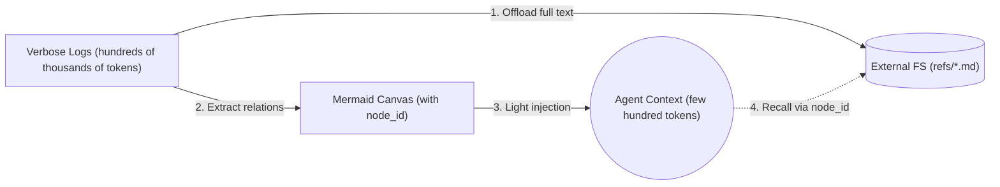
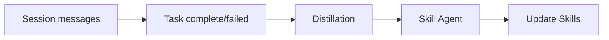
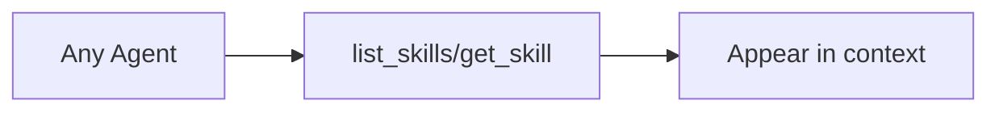
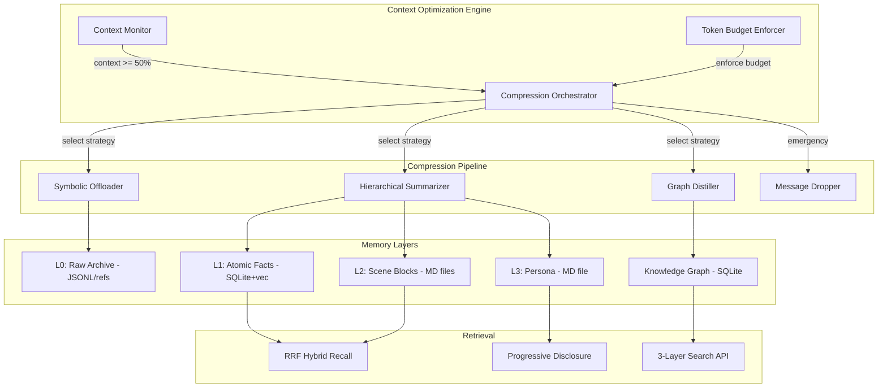
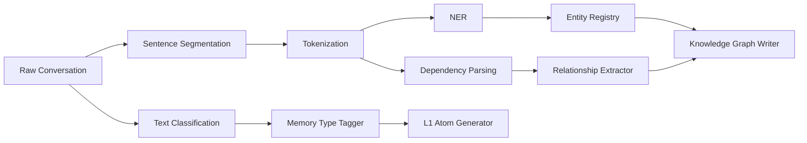
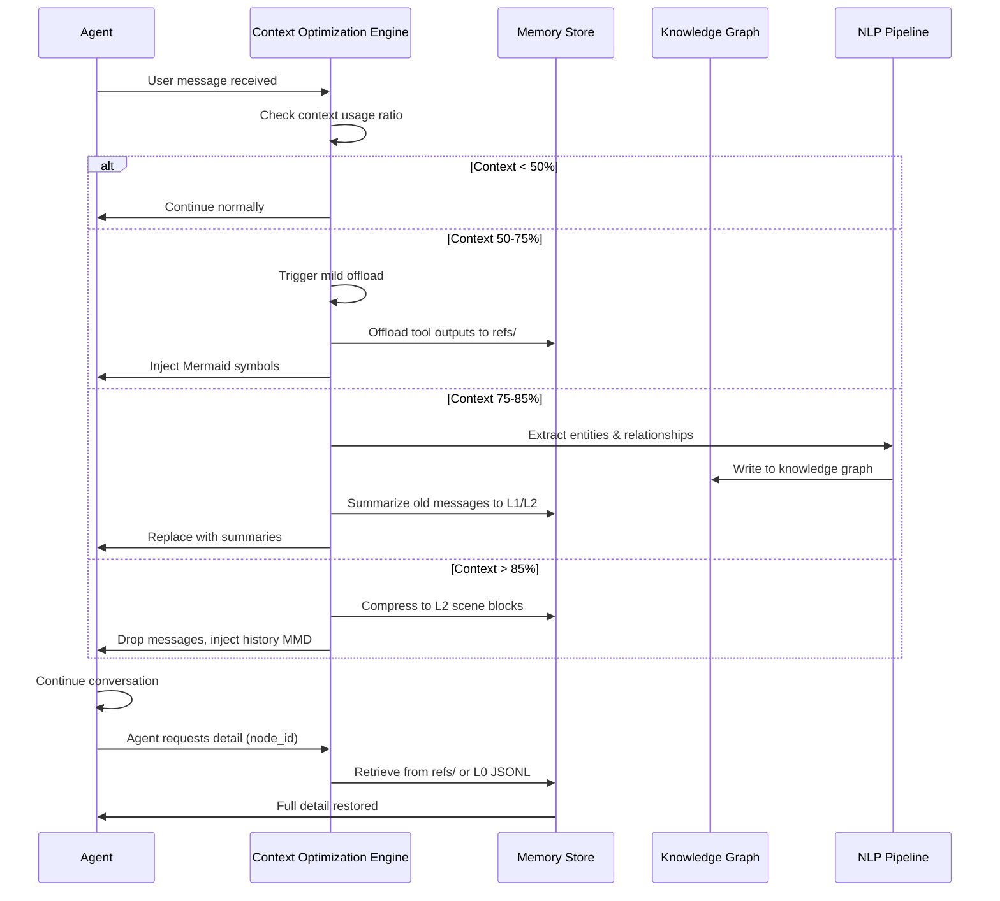
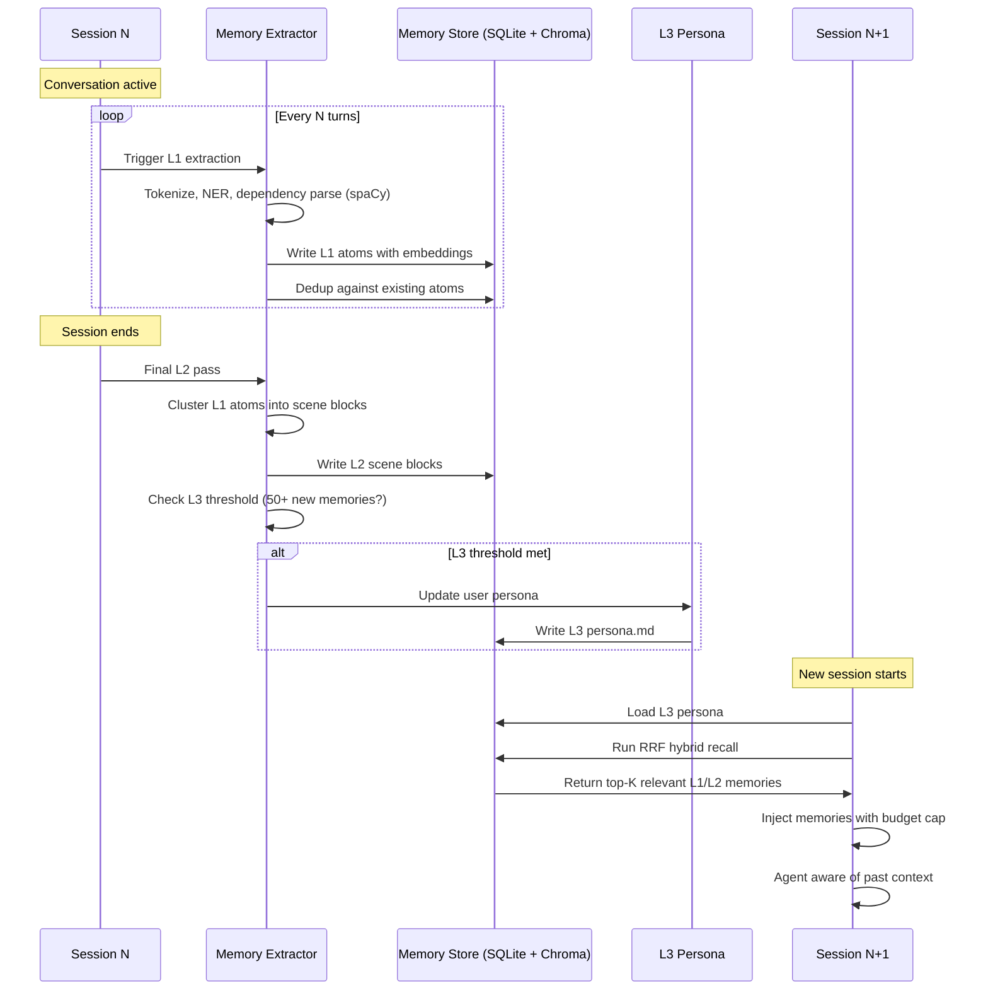

# Stream 9: Memory, Context, and Graph Repository Analysis

> Comprehensive analysis of 7 open-source memory/context/graph repositories for Lyra's memory architecture and context optimization systems.
>
> Date: 2026-05-30 | Research Depth: Full codebase clone + source analysis

---

## Executive Summary

This research analyzes seven leading open-source repositories across memory systems, context optimization, knowledge graphs, and NLP pipelines. The findings directly inform Lyra's existing memory architecture (lyra-memory, lyra-memory-stack, lyra-context-optimizer, lyra-knowledge-graph) and provide concrete patterns for enhancement.

**Key findings:**
- **TencentDB Agent Memory** achieves 61.38% token reduction with symbolic Mermaid-based memory + layered L0-L3 architecture -- the strongest compression model found
- **MemPalace** achieves 96.6% R@5 recall on LongMemEval with zero API calls using BM25+vector hybrid search -- the strongest retrieval model
- **graphify** achieves 71.5x token reduction per query on large codebases using Leiden community detection + NetworkX graph -- the strongest graph compression
- **claude-mem** provides the reference implementation for persistent cross-session memory via tool-use observation capture + ChromaDB
- **Acontext** demonstrates progressive disclosure via file-based skill memory with agent-in-the-loop retrieval
- **CodeGraph** cuts 62% of tool calls and 25% of costs through pre-indexed semantic code graphs with SQLite + FTS5
- **spaCy** provides the mature NLP pipeline for entity extraction, dependency parsing, and text classification

---

## 1. TencentDB Agent Memory

**Repository:** https://github.com/Tencent/TencentDB-Agent-Memory  
**License:** MIT  
**Language:** TypeScript (core) + Python (Hermes plugin)  
**Stars:** ~1.5k (rapidly growing)

### 1.1 Architecture Overview

TencentDB Agent Memory is built on two foundational pillars: **memory layering** and **symbolic memory**. It rejects flat vector storage in favor of a hierarchical semantic pyramid with heterogeneous storage backends.

```
L3 Persona ─── Generative User Profile ─── Markdown files (human-readable)
    ▲
    │ aggregation every ~50 new memories
    │
L2 Scenario ─── Scene Blocks ─── Markdown files (structured blocks)
    ▲
    │ clustering every ~5 conversations or 900s idle
    │
L1 Atom ─────── Atomic Facts ─── SQLite + sqlite-vec (vector + FTS)
    ▲
    │ extraction every N turns + L1.5 judgment
    │
L0 Conversation ─── Raw Dialogue ─── JSONL files (verbatim evidence)
    ▲
    │ auto-capture every turn
    │
Raw Tool Output ─── refs/*.md ─── Offloaded to filesystem
```

### 1.2 Memory Model

**Three-tier semantic pyramid with lossless traceability:**

| Layer | Storage | Purpose | Retention |
|-------|---------|---------|-----------|
| L0 Conversation | JSONL files (`records/`) | Verbatim evidence, full traceability | Configurable (default: forever) |
| L1 Atom | SQLite + `sqlite-vec` | Atomic facts, vector-searchable | Configurable |
| L2 Scenario | Markdown files (`scene_blocks/`) | Scene blocks, task patterns | Long-term |
| L3 Persona | Markdown files (`persona/`) | User profile, preferences, SOPs | Long-term |

**Key innovation -- Lossless drill-down chain:**
```
Top-layer symbol (Persona / Mermaid canvas)
    → Mid-layer index (Scenario / JSONL)
        → Bottom-layer raw text (L0 Conversation / refs/*.md)
```

Every high-level abstraction maintains a deterministic path back to ground-truth evidence. Compression is reversible, not lossy.

### 1.3 Symbolic Memory (Mermaid Canvas)

This is the most novel contribution. Instead of verbose prose or flat JSON, TencentDB encodes task state transitions as high-density Mermaid syntax:



**Flow:**
1. Full tool outputs offloaded to `refs/*.md` files
2. L1.5 judgment extracts relations into Mermaid format with `node_id` pointers
3. Only compact Mermaid (few hundred tokens) injected into agent context
4. Agent can `grep` for `node_id` to retrieve full raw text when needed

### 1.4 Storage Backend

- **Primary:** SQLite (via `better-sqlite3`) with `sqlite-vec` extension for vector search
- **Vector embeddings:** OpenAI-compatible API (configurable model/dimensions)
- **Full-text search:** BM25 via SQLite FTS5 with jieba (Chinese) tokenizer
- **Files:** Markdown files for human-readable layers (L2/L3), JSONL for evidence (L0)
- **Migration:** Supports migration from SQLite to Tencent Cloud VectorDB

### 1.5 Query/Retrieval

**Hybrid recall with RRF (Reciprocal Rank Fusion):**
```
Recall strategy: keyword | embedding | hybrid (RRF fusion, recommended)
```

- `recall.maxResults` (default: 5)
- `recall.maxCharsPerMemory` -- truncation guard per L1 memory
- `recall.maxTotalRecallChars` -- total character budget for auto-recalled L1 memories
- `recall.timeoutMs` (default: 5000) -- non-blocking recall

### 1.6 Context Compression

**Dual-threshold offloading system:**

| Trigger | Ratio | Action |
|---------|-------|--------|
| Mild Offload | 50% of context window | Begin offloading tool outputs |
| Aggressive Compression | 85% of context window | L3 aggressive: delete messages, inject history MMD as summary |

**MMD token budget:** `mmdMaxTokenRatio` (default: 0.2) -- Mermaid injection capped at 20% of context window.

**Reclamation:** Periodic cleanup of stale offload data (JSONL, refs, MMDs) based on configurable `retentionDays`.

### 1.7 Key Techniques for Lyra

1. **Mermaid symbolic compression** -- encode task state as graph DSL, inject lightweight structure, drill down on demand
2. **L0-L3 semantic pyramid** -- progressive abstraction with traceable drill-down
3. **RRF hybrid recall** -- BM25 keyword + vector embedding with reciprocal rank fusion
4. **Dual-threshold offloading** -- mild (50% window) vs aggressive (85%) with different strategies
5. **Non-blocking recall** -- timeout-gated memory injection that never blocks conversation
6. **Warm-up extraction** -- new session triggers from turn 1, doubling frequency each time (1, 2, 4, ...)

### 1.8 Configuration Highlights

```jsonc
{
  "recall.strategy": "hybrid",           // keyword | embedding | hybrid
  "recall.maxResults": 5,                 // items per recall
  "recall.maxCharsPerMemory": 0,          // 0 = no guard
  "recall.maxTotalRecallChars": 0,        // 0 = no guard
  "pipeline.everyNConversations": 5,      // L1 trigger every N turns
  "extraction.maxMemoriesPerSession": 20, // max per L1 pass
  "persona.triggerEveryN": 50,            // L3 generation every N memories
  "offload.enabled": false,               // opt-in short-term compression
  "offload.mildOffloadRatio": 0.5,        // 50% of context window
  "offload.aggressiveCompressRatio": 0.85, // 85% of context window
  "offload.mmdMaxTokenRatio": 0.2         // 20% budget for MMD injection
}
```

---

## 2. Acontext

**Repository:** https://github.com/memodb-io/Acontext  
**License:** Apache 2.0  
**Language:** Python (server) + TypeScript (SDK, UI)  
**Stars:** ~1.2k

### 2.1 Architecture Overview

Acontext is a skill memory layer that automatically captures agent learnings and stores them as **agent skill files** -- plain Markdown files readable by any framework.

**Core philosophy:**
- **Skill is Memory, Memory is Skill** -- whether a skill comes from Clawhub or is self-created, Acontext follows and evolves it
- **Plain files, any framework** -- no embeddings, no API lock-in
- **Progressive disclosure, not search** -- agent uses `get_skill` / `get_skill_file` tools, not semantic top-k
- **You design the structure** -- attach SKILL.md files to define schema, naming, and file layout

### 2.2 Memory Model

**Store flow:**


1. **Session messages** -- conversation + tool calls + artifacts as raw input
2. **Task outcome detection** -- automatic or explicit report triggers learning
3. **Distillation** -- LLM pass infers what worked, what failed, user preferences
4. **Skill Agent** -- decides where to store (existing or new skill file), writes per SKILL.md schema
5. **Update Skills** -- files updated; extraction, routing, writing done by system

**Recall flow:**


### 2.3 Storage Backend

- **Primary:** PostgreSQL (server) / S3-compatible object storage for artifacts
- **Client:** Local file system via SDK
- **Export:** ZIP download of skill files for portability

### 2.4 Key Techniques for Lyra

1. **Progressive disclosure** -- agent decides what to fetch via tools, not blind search
2. **Skill-as-memory format** -- human-readable Markdown, editable, shareable
3. **Schema-driven memory** -- SKILL.md defines structure; system does extraction + routing + writing
4. **Task-outcome-triggered learning** -- only learn when task succeeds or fails
5. **Cross-framework portability** -- ZIP export, any LLM can read the files

### 2.5 Limitations

- Requires SaaS backend for full functionality (self-host option exists with Docker)
- LLM-dependent distillation (costs tokens for every memory extraction)
- No vector/embedding search (by design -- progressive disclosure replaces it)
- No built-in compression or context window management

---

## 3. claude-mem

**Repository:** https://github.com/thedotmack/claude-mem  
**License:** Apache 2.0  
**Language:** TypeScript  
**Stars:** ~3k

### 3.1 Architecture Overview

claude-mem is the reference implementation for persistent cross-session memory in Claude Code. It captures tool usage observations, compresses them using the Claude Agent SDK, and injects relevant context into future sessions.

**Core loop:**
1. **Observation Capture** -- hooks fire on tool use, capturing inputs/outputs/timestamps
2. **Semantic Summarization** -- Claude Agent SDK compresses observations into searchable summaries
3. **Storage** -- SQLite (primary DB) + ChromaDB (vector embeddings) + file-based context injection
4. **Injection** -- `<claude-mem-context>` XML tags injected into CLAUDE.md / copilot-instructions
5. **Search** -- MCP tools expose `search`, `timeline`, `get_observations` for manual memory queries

### 3.2 Memory Model

**Observation model:**
- Each tool call generates an observation record (input, output, metadata, project, timestamp)
- Observations are compressed into semantic summaries
- Summaries are stored with vector embeddings for semantic search
- Context is injected via file markers into project documentation

**Three-layer search API (designed for token efficiency):**
1. `search(query)` -- returns index with IDs (~50-100 tokens/result)
2. `timeline(anchor=ID)` -- get context around interesting results
3. `get_observations([IDs])` -- fetch full details only for filtered IDs

10x token savings by never fetching full details without filtering first.

### 3.3 Storage Backend

- **Primary DB:** SQLite (`~/.claude-mem/claude-mem.db`) -- session_store, observations, metadata
- **Vector DB:** ChromaDB (`~/.claude-mem/chroma/`) -- semantic search over observation summaries
- **Context files:** Injects into CLAUDE.md, copilot-instructions, AGENTS.md via XML tags

### 3.4 Context Injection

```xml
<claude-mem-context>
# claude-mem: Cross-Session Memory

*No context yet. Complete your first session and context will appear here.*

Use claude-mem's MCP search tools for manual memory queries.
</claude-mem-context>
```

Context is injected into file markers within CLAUDE.md files. The system uses `CONTEXT_TAG_OPEN` / `CONTEXT_TAG_CLOSE` delimiters to identify and replace existing context blocks.

### 3.5 Key Techniques for Lyra

1. **3-layer search API** -- index → timeline → full details, 10x token savings
2. **XML-tag-based context injection** -- non-invasive, idempotent file markers
3. **Auto-capture hooks** -- transparent observation without interrupting workflow
4. **ChromaDB for semantic search** -- local-first, no cloud dependency
5. **Session persistence** -- context survives session end/reconnect

---

## 4. MemPalace

**Repository:** https://github.com/MemPalace/mempalace  
**License:** MIT  
**Language:** Python  
**Stars:** ~2.5k

### 4.1 Architecture Overview

MemPalace is a local-first AI memory system with verbatim storage and pluggable retrieval backends. It achieves **96.6% R@5 raw recall on LongMemEval** with zero API calls, using purely local BM25 + vector hybrid search.

**Spatial metaphor:**
```
Palace
  └── Wings (projects/domains)
       └── Rooms (topics)
            └── Closets (compressed index cards -- AAAK format)
                 └── Drawers (verbatim content)
```

### 4.2 Memory Model

**Five memory types extracted without LLM:**
1. **DECISIONS** -- "we went with X because Y", architectural choices
2. **PREFERENCES** -- "always use X", "never do Y", "I prefer Z"
3. **MILESTONES** -- breakthroughs, things that finally worked
4. **PROBLEMS** -- what broke, what fixed it, root causes
5. **EMOTIONAL** -- feelings, vulnerability, relationships

**AAAK compression** (AI-readable shorthand):
- Compresses names, repeated words, concepts, key moments
- Acts as index cards that an LLM can scan instantly
- Closets point to exact drawers where content lives
- No summarization, no paraphrasing -- only compression

### 4.3 Storage Backend

- **Primary vector DB:** ChromaDB (default), pluggable via `mempalace/backends/base.py`
- **Knowledge graph:** SQLite (`~/.mempalace/knowledge_graph.sqlite3`) -- temporal entity-relationship graph
- **Full-text:** SQLite FTS5 for BM25 keyword search
- **Files:** Verbatim conversation storage as markdown in drawers

### 4.4 Query/Retrieval

**Hybrid search pipeline:**
1. **BM25 keyword matching** (Okapi-BM25 with k1=1.5, b=0.75) -- always runs as floor
2. **Vector semantic similarity** (ChromaDB embeddings)
3. **Closet boost** -- closet matches add rank-based boost (signal, never a gate)
4. **Hybrid v4/v5** -- keyword boosting + temporal-proximity boosting + preference-pattern extraction
5. **LLM rerank** (optional) -- top-20 candidates reranked by LLM reader

**Benchmark results:**
| Mode | R@5 | LLM Required |
|------|-----|-------------|
| Raw (semantic only) | 96.6% | None |
| Hybrid v4 (held-out) | 98.4% | None |
| Hybrid v4 + LLM rerank | >=99% | Any capable model |

**Other benchmarks:**
| Benchmark | Metric | Score |
|-----------|--------|-------|
| LoCoMo (hybrid v5) | R@10 | 88.9% |
| ConvoMem (all categories) | Avg recall | 92.9% |
| MemBench (ACL 2025) | R@5 | 80.3% |

### 4.5 Knowledge Graph

**Temporal entity-relationship graph with validity windows:**
```python
kg = KnowledgeGraph()
kg.add_triple("Max", "child_of", "Alice", valid_from="2015-04-01")
kg.add_triple("Max", "does", "swimming", valid_from="2025-01-01")
kg.query_entity("Max", as_of="2026-01-15")
kg.invalidate("Max", "has_issue", "sports_injury", ended="2026-02-15")
```

- **Storage:** SQLite (local, no Neo4j dependency)
- **Features:** Entity nodes, typed relationship edges, temporal validity windows, closet references
- **Query:** entity-first traversal with time filtering, bidirectional graph walk

### 4.6 Key Techniques for Lyra

1. **AAAK compression** -- AI-readable index cards with pointer-based retrieval
2. **BM25+vector hybrid search** -- 96.6% R@5 without any LLM calls
3. **Temporal knowledge graph** -- validity windows for facts, native time filtering
4. **Pluggable retrieval backends** -- ChromaDB default, clean interface for alternatives
5. **Zero-API retrieval** -- entire pipeline works offline
6. **Background mining** -- hooks fire silently, no token consumption in chat window
7. **Rule-based memory extraction** -- 5 memory types extracted via regex patterns, no LLM needed

---

## 5. graphify

**Repository:** https://github.com/safishamsi/graphify  
**License:** MIT  
**Language:** Python  
**Stars:** ~6k (YC S26)

### 5.1 Architecture Overview

graphify maps entire projects (code, docs, PDFs, images, videos) into knowledge graphs queryable by AI assistants. It achieves **71.5x token reduction per query** on large corpora compared to reading raw files.

**Pipeline:**
```
detect() → extract() → build_graph() → cluster() → analyze() → report() → export()
```

### 5.2 Memory/Graph Model

**Three-pass extraction:**

| Pass | Content | Method | Cost |
|------|---------|--------|------|
| Pass 1 | Code structure | tree-sitter (deterministic) | Free, no API |
| Pass 2 | Video/audio | faster-whisper (local) | Free, no API |
| Pass 3 | Docs/papers/images | Claude subagents (parallel) | Token cost |

**Extraction output schema:**
```json
{
  "nodes": [
    {"id": "unique_string", "label": "human name", "source_file": "path", "source_location": "L42"}
  ],
  "edges": [
    {"source": "id_a", "target": "id_b", "relation": "calls|imports|uses|...", "confidence": "EXTRACTED|INFERRED|AMBIGUOUS"}
  ]
}
```

### 5.3 Graph Construction

- **Node deduplication:** 3 layers -- within-file (AST `seen_ids`), between-files (NetworkX `add_node` idempotent), semantic merge (pre-build)
- **Community detection:** Leiden algorithm (via graspologic) with Louvain fallback
- **Confidence tagging:** EXTRACTED (1.0) | INFERRED (0.55-0.95) | AMBIGUOUS (flagged for review)
- **No embeddings needed** -- semantic similarity edges from Claude are already in the graph

### 5.4 Query/Retrieval

**Graph-based query instead of grep:**
- `/graphify .` generates `graph.json`, `graph.html`, `GRAPH_REPORT.md`
- Subsequent queries read compact graph instead of raw files
- Token savings compound with corpus size
- MCP server exposes graph for agent tool use

**SHA256 cache:** Re-runs skip unchanged files via content hash fingerprinting.

### 5.5 Key Techniques for Lyra

1. **Multi-pass extraction** -- deterministic (tree-sitter) + local (whisper) + LLM (subagents)
2. **Leiden community detection** -- graph clustering without embeddings
3. **Confidence-tagged edges** -- EXTRACTED/INFERRED/AMBIGUOUS with numeric scores
4. **Token reduction via graph structure** -- query graph instead of raw files
5. **SHA256 content cache** -- deterministic change detection
6. **Parallel extraction** -- ProcessPoolExecutor for code, parallel subagents for docs
7. **No embedding DB needed** -- graph itself is the retrieval structure

---

## 6. CodeGraph

**Repository:** https://github.com/colbymchenry/codegraph  
**License:** MIT  
**Language:** TypeScript  
**Stars:** ~500 (new, fast-growing)

### 6.1 Architecture Overview

CodeGraph provides pre-indexed semantic code intelligence for AI coding assistants. It achieves **~25% cheaper, ~62% fewer tool calls, ~57% fewer tokens** across 7 real-world codebases.

**Benchmark across 7 codebases (Opus 4.8, 2026-05-29):**

| Codebase | Language | Cost | Tokens | Time | Tool Calls |
|----------|----------|------|--------|------|------------|
| VS Code | TypeScript ~10k files | 33% cheaper | 70% fewer | 27% faster | 80% fewer |
| Django | Python ~3k files | 23% cheaper | 70% fewer | 28% faster | 77% fewer |
| Tokio | Rust ~790 files | 35% cheaper | 70% fewer | 37% faster | 79% fewer |
| OkHttp | Java ~645 files | 11% cheaper | 48% fewer | 26% faster | 70% fewer |

**Average: 25% cheaper, 57% fewer tokens, 23% faster, 62% fewer tool calls**

### 6.2 Memory/Graph Model

- **Symbol relationship graph:** Call graphs, imports, type relationships, method ownership
- **Per-symbol adaptive `codegraph_explore`:** Sizes exploration to the answer, collapsing redundant implementations
- **Multi-language support:** TypeScript, Python, Rust, Java, Go, Swift, Kotlin, C#, and more
- **Framework-aware:** Detects Spring Boot, Django, Express, React, etc. for semantic understanding

### 6.3 Storage Backend

- **Primary DB:** SQLite (`.codegraph/codegraph.db`) -- nodes, edges, metadata
- **FTS:** SQLite FTS5 for full-text symbol search
- **File system:** Local `.codegraph/` directory per project
- **MCP server:** Exposes graph via MCP stdio for agent tool use

### 6.4 Query/Retrieval

**MCP tools:**
- `codegraph_explore` -- deep exploration, returns source grouped by file with relationships
- `codegraph_search` -- fuzzy symbol search across the indexed graph
- `codegraph_status` -- index staleness, node/edge counts

### 6.5 Key Techniques for Lyra

1. **Pre-indexed semantic graph** -- build once, query many times with zero file reads
2. **Per-symbol adaptive sizing** -- collapse redundant implementations to signatures
3. **Framework-aware extraction** -- understand Spring Boot / Django / React semantics
4. **MCP-native interface** -- graph exposed as tools for any MCP-compatible agent
5. **Bundled runtime** -- no Node.js required, ships own binary

---

## 7. spaCy

**Repository:** https://github.com/explosion/spaCy  
**License:** MIT  
**Language:** Python / Cython  
**Stars:** ~30k

### 7.1 Architecture Overview

spaCy is the industrial-strength NLP library, providing pretrained pipelines for 70+ languages with state-of-the-art speed and neural network models.

### 7.2 NLP Pipeline Components

| Component | Function | Memory Application |
|-----------|----------|-------------------|
| **Tokenization** | Split text into tokens | Chunking conversation into atomic units |
| **NER (Named Entity Recognition)** | Extract entities (people, orgs, dates, etc.) | Identify key entities in memory |
| **Dependency Parsing** | Syntactic structure | Extract relationships between entities |
| **Sentence Segmentation** | Split into sentences | Chunk long conversations |
| **Text Classification** | Categorize text | Classify memory types (decision, preference, etc.) |
| **Lemmatization** | Normalize to base form | Normalize search queries |
| **Span Categorization** | Label spans of text | Extract multi-token concepts |
| **Entity Linking** | Link to knowledge base | Connect memory entities to knowledge graph |
| **Entity Ruler** | Rule-based entity matching | Match domain-specific entities |
| **Transformers** | BERT/RoBERTa integration | Deep semantic understanding |

### 7.3 Key Capabilities for Memory Extraction

**Entity extraction pipeline:**
```python
import spacy
nlp = spacy.load("en_core_web_trf")  # Transformer-based model
doc = nlp("We decided to use PostgreSQL instead of MongoDB for session storage")

# Entities
for ent in doc.ents:
    print(ent.text, ent.label_)  # PostgreSQL ORG, MongoDB ORG

# Dependency parsing for relationship extraction
for token in doc:
    print(token.text, token.dep_, token.head.text)
    # We nsubj decided
    # decided ROOT decided
    # to aux use
    # use xcomp decided
    # ...
```

**Named Entity types relevant to memory:**
- `PERSON` -- people mentioned
- `ORG` -- organizations, companies
- `PRODUCT` -- products, tools
- `GPE` -- countries, cities, states
- `DATE` -- temporal references
- `EVENT` -- named events
- `WORK_OF_ART` -- software, creative works
- `LAW` -- legal references

### 7.4 Performance

- **Speed:** ~100K+ tokens/second on CPU for basic pipeline
- **Transformer models:** BERT/RoBERTa-powered for highest accuracy
- **Memory:** Efficient Cython implementation, <1GB RAM for transformer models
- **Batching:** `nlp.pipe()` for streaming/batch processing

### 7.5 Key Techniques for Lyra

1. **NER for entity memory extraction** -- auto-detect people, tools, concepts from conversation
2. **Dependency parsing for relationship extraction** -- build knowledge graph edges from syntax
3. **Rule-based entity matching** -- domain-specific entity recognition without training
4. **Span categorization** -- multi-token concept extraction (e.g., "context window optimization")
5. **Entity linking** -- connect extracted entities to knowledge graph nodes
6. **Pipeline composability** -- add custom components to standard pipeline

---

## 8. Context Optimization & Auto-Compaction Techniques

### 8.1 How These Systems Handle Context Window Limits

| System | Strategy | Trigger | Action |
|--------|----------|---------|--------|
| **TencentDB** | Dual-threshold offloading | 50% (mild), 85% (aggressive) | Offload tool outputs → Mermaid symbols → message deletion + history MMD |
| **claude-mem** | Observation compression | Every tool use | Compress observations to semantic summaries, inject via file markers |
| **MemPalace** | AAAK compression + background mining | Post-session | Compress names/concepts/key moments, mine in background (zero chat tokens) |
| **graphify** | Graph-based compression | Per query | Query compact graph instead of raw files (71.5x reduction) |
| **CodeGraph** | Pre-indexed graph | Build once | Query index instead of file scanning (62% fewer tool calls) |

### 8.2 Compression Strategies

**Strategy 1: Symbolic compression (TencentDB)**
- Encode verbose logs as Mermaid graph DSL
- ~200 tokens of Mermaid replace hundreds of thousands of tokens of raw logs
- Preserve full traceability via `node_id` pointers

**Strategy 2: Hierarchical summarization (TencentDB)**
- L0 (raw) → L1 (atomic facts) → L2 (scene blocks) → L3 (persona)
- Each layer is a lossy but traceable compression of the layer below
- Recall starts at top layer, drills down only when needed

**Strategy 3: Index-card compression (MemPalace)**
- AAAK format compresses key concepts into AI-readable shorthand
- Closet (index) → Drawer (content) pointer system
- LLM scans index card first, pulls content only when relevant

**Strategy 4: Graph-based compression (graphify, CodeGraph)**
- Replace raw file content with node-edge relationships
- Query graph structure instead of reading files
- 71.5x token reduction on large corpora (graphify)

**Strategy 5: Semantic embedding compression (claude-mem)**
- Embed observation summaries, not raw observations
- 3-layer search: index IDs → context → full details
- 10x token savings in retrieval

### 8.3 Keep vs. Discard Decision Logic

**TencentDB approach (most sophisticated):**
```
Mild offload (50% context):
  - Offload tool outputs to refs/*.md
  - Keep Mermaid symbols in context
  - Agent can still see structure

Aggressive compression (85% context):
  - Delete oldest messages
  - Replace with history MMD (compressed representation)
  - Preserve recent messages for coherence
  - Skip messages marked with _mmdContextMessage marker

Retention:
  - l0l1RetentionDays: 0 = never clean up
  - retentionDays: 3+ to enable reclamation
  - Log max size cap for rotation
```

**claude-mem approach:**
- Observations compressed immediately on capture
- Stale context markers updated idempotently
- Old observations purged based on relevance scoring

**MemPalace approach:**
- Verbatim storage (never discard)
- But compressed index (AAAK closets) for efficient lookup
- Closet boost as ranking signal, not a filter

**Best combined strategy:**
```
1. Categorize content by retention value:
   - Tool outputs: offload to file, keep pointer (Mermaid/node_id)
   - Conversation: compress to semantic pyramid (L0-L3)
   - Code references: index in graph (symbol → file:line)
   - User preferences: promote to L3 Persona

2. Apply tiered compression:
   - 0-50% context: full content
   - 50-75% context: mild offload (tool outputs → files)
   - 75-90% context: aggressive (summarize oldest messages)
   - 90%+ context: emergency (drop oldest messages, inject compressed history)

3. Preserve drill-down paths:
   - Every compression produces a pointer back to original
   - Agent can always retrieve full content by referencing pointer
```

### 8.4 Cross-Session Memory

**Approaches across systems:**

| System | Cross-Session Mechanism | Trigger |
|--------|------------------------|---------|
| **TencentDB** | L3 Persona persisted as Markdown, auto-injected on next session | Every 50 new memories |
| **claude-mem** | Context injection into CLAUDE.md via XML tags | Session start/end hooks |
| **MemPalace** | `mempalace wake-up` loads relevant context from palace | Manual or hook-triggered |
| **Acontext** | Skill files persisted, `get_skill` retrieves on demand | Agent tool call |
| **graphify** | `graph.json` persisted, reused across sessions | Agent query |

**Lyra cross-session strategy:**
```
Session End:
  1. Run L1 extraction (atomic facts from conversation)
  2. Update L3 Persona (if threshold met)
  3. Save session summary to .omc/state/sessions/{sessionId}/
  4. Update knowledge graph with new entities/relationships
  5. Prune old sessions beyond retention window

Session Start:
  1. Load L3 Persona into context (<500 chars)
  2. Run recall for relevant L1/L2 memories (RRF hybrid)
  3. Inject top-K relevant memories with max character budget
  4. Load relevant knowledge graph subgraph
  5. Wake-up check: any pending tasks from prior session?
```

---

## 9. Context Optimization Strategy for Lyra

### 9.1 Architecture



### 9.2 Compression Tier System

| Tier | Context Usage | Strategy | Latency | Token Savings |
|------|--------------|----------|---------|---------------|
| **Normal** | 0-50% | No compression | 0ms | 0% |
| **Mild** | 50-75% | Symbolic offload (Mermaid) | ~500ms | 30-50% |
| **Moderate** | 75-85% | Hierarchical summarization | ~2s | 60-80% |
| **Aggressive** | 85-95% | Message deletion + history MMD | ~3s | 80-90% |
| **Emergency** | 95%+ | Drop oldest, inject compressed history | ~1s | 90%+ |

### 9.3 Token Budget Allocation

```
Total Context Window: 200K tokens (Claude Sonnet/Opus)
─────────────────────────────────────────
System Prompt:         ~5K  (2.5%)  -- Fixed
L3 Persona:            ~500  (0.25%) -- Fixed, small
L1/L2 Recall:          ~2K  (1%)    -- Dynamic, capped
Knowledge Graph:       ~1K  (0.5%)  -- Dynamic, capped
Mermaid Canvas:        ~500  (0.25%) -- Dynamic, capped
Conversation History:  ~171K (85.5%) -- Variable
Safety Margin:         ~20K  (10%)   -- Reserved
─────────────────────────────────────────
```

### 9.4 Progressive Disclosure Design

Borrow from Acontext:
```typescript
interface MemoryTool {
  // Agent calls to list available memories (lightweight, returns IDs + summaries)
  list_memories(filter?: MemoryFilter): MemoryIndex[];
  
  // Agent calls to get full content of specific memory
  get_memory(memoryId: string): MemoryDetail;
  
  // Agent calls to search semantically
  search_memories(query: string, limit?: number): MemorySearchResult[];
  
  // Agent calls to traverse knowledge graph
  traverse_graph(entityId: string, depth?: number): GraphSubgraph;
}
```

Agent decides what to load -- the system never dumps everything into context automatically.

---

## 10. Auto-Compaction System Design

### 10.1 Trigger System

```typescript
interface CompactionTrigger {
  // Token-count-based triggers
  contextUsageRatio: number;        // e.g., 0.5 = 50%
  
  // Time-based triggers
  idleTimeMs: number;               // e.g., 600000 = 10 min
  
  // Turn-based triggers
  everyNTurns: number;              // e.g., 5 turns
  
  // Manual trigger
  agentRequested: boolean;          // Agent explicitly requests compaction
  
  // Emergency trigger
  emergencyThreshold: number;       // e.g., 0.95 = 95%
}
```

### 10.2 Compaction Decision Matrix

| Content Type | Priority | Compressible? | Strategy |
|-------------|----------|---------------|----------|
| System instructions | CRITICAL | No | Always keep |
| L3 Persona | HIGH | No | Always keep (small) |
| Recent messages (last 3 turns) | HIGH | No | Always keep |
| Tool outputs > 5 turns old | MEDIUM | Yes | Offload to refs, inject Mermaid pointer |
| Middle conversation (3-10 turns) | MEDIUM | Yes | Summarize to L1 atoms |
| Old conversation (>10 turns) | LOW | Yes | Compress to L2 scene blocks |
| Error messages | HIGH | Partial | Keep summary, offload full trace |
| Code snippets | MEDIUM | Yes | Index in code graph, keep reference |
| User preferences detected | HIGH | Promote | Move to L3 Persona |
| Repeated information | LOW | Yes | Deduplicate, keep single copy |

### 10.3 Compaction Pipeline

```typescript
interface CompactionPipeline {
  // Phase 1: Classify content
  classifyContent(messages: Message[]): ClassifiedContent[];
  
  // Phase 2: Select compaction strategy per content type
  selectStrategy(classified: ClassifiedContent[]): CompactionPlan;
  
  // Phase 3: Execute compaction
  execute(plan: CompactionPlan): CompactionResult;
  
  // Phase 4: Verify recoverability
  verify(result: CompactionResult): boolean;
}

interface ClassifiedContent {
  messageIds: string[];
  type: ContentType;
  priority: Priority;
  age: number; // turns since creation
  size: number; // token count
}

interface CompactionPlan {
  steps: CompactionStep[];
  estimatedSavings: number; // tokens
  estimatedLatency: number; // ms
}

type CompactionStep = 
  | { action: "offload"; messageIds: string[]; target: "refs" }
  | { action: "summarize"; messageIds: string[]; target: "L1" | "L2" }
  | { action: "mermaid"; messageIds: string[]; target: "mmd" }
  | { action: "drop"; messageIds: string[] }
  | { action: "promote_to_persona"; content: string }
  | { action: "index_in_graph"; symbols: SymbolRef[] };
```

### 10.4 Recovery Protocol

```
Agent needs full content:
  1. Agent references node_id from Mermaid canvas
  2. System grep's refs/*.md for node_id
  3. Full raw text retrieved and injected into context
  4. Optional: pin to prevent re-compaction for N turns

Agent needs conversation context:
  1. Agent references scene_id from L2 summary
  2. System retrieves L0 JSONL by scene_id
  3. Original conversation reconstructed
  4. Injected as single user message with scene marker

Agent needs entity history:
  1. Agent queries knowledge graph by entity
  2. System returns temporal subgraph with validity windows
  3. Agent uses timeline to understand evolution
```

---

## 11. Graph Memory Integration Plan

### 11.1 Graph Types in Lyra

```
                    ┌─────────────────────┐
                    │   Unified Knowledge  │
                    │   Graph (SQLite)     │
                    └──────────┬──────────┘
                               │
          ┌────────────────────┼────────────────────┐
          │                    │                    │
    ┌─────▼─────┐      ┌──────▼──────┐      ┌─────▼─────┐
    │ Temporal   │      │  Semantic   │      │   Code    │
    │ Entity     │      │  Concept    │      │  Symbol   │
    │ Graph      │      │  Graph      │      │  Graph    │
    └───────────┘      └─────────────┘      └───────────┘
    
    "Max works_on   "agent_memory"     "memory.ts::store()
     ProjectX        is_a memory_system  calls recall() via
     since 2025"     subconcept_of       hybrid_search()"
                     context_engineering"
```

### 11.2 Integration Strategy

**Phase 1: Entity-Relationship Graph (MemPalace-inspired)**
```sql
-- SQLite schema for temporal knowledge graph
CREATE TABLE entities (
  id TEXT PRIMARY KEY,
  name TEXT NOT NULL,
  type TEXT NOT NULL,  -- PERSON, PROJECT, TOOL, CONCEPT, etc.
  first_seen TIMESTAMP,
  last_seen TIMESTAMP
);

CREATE TABLE relationships (
  id TEXT PRIMARY KEY,
  source_id TEXT REFERENCES entities(id),
  target_id TEXT REFERENCES entities(id),
  relation_type TEXT NOT NULL,  -- works_on, uses, depends_on, etc.
  valid_from TIMESTAMP,
  valid_to TIMESTAMP,  -- NULL = currently valid
  confidence REAL DEFAULT 1.0,
  evidence_ref TEXT  -- pointer to L0/L1 memory
);
```

**Phase 2: Code Symbol Graph (CodeGraph + graphify inspired)**
- Extract symbol relationships from Lyra's own codebase using tree-sitter
- Build call graphs, import graphs, type hierarchies
- Index in SQLite with FTS5 for search
- Expose via MCP tools for agent use

**Phase 3: Unified Graph Query**
```typescript
interface GraphQuery {
  // Entity-first traversal
  exploreEntity(entityId: string, depth: number): Subgraph;
  
  // Relationship traversal
  traverseRelationships(sourceId: string, relationType?: string): Edge[];
  
  // Temporal query
  queryAtTime(entityId: string, asOf: Date): EntityState;
  
  // Path finding
  findPaths(sourceId: string, targetId: string, maxDepth: number): Path[];
  
  // Community detection
  getCommunities(entityId: string): Community[];
}
```

### 11.3 Community Detection (graphify-inspired)

Use Leiden/Louvain community detection on the knowledge graph to:
- Group related memories into coherent clusters
- Identify bridges between knowledge domains
- Surface "surprising connections" for agent insight
- Optimize memory retrieval by community membership

---

## 12. NLP Pipeline for Memory Extraction (spaCy)

### 12.1 Pipeline Design



### 12.2 Memory Extraction Components

```python
import spacy
from typing import List, Dict

class MemoryExtractor:
    """spaCy-based memory extraction pipeline for Lyra."""
    
    def __init__(self, model: str = "en_core_web_trf"):
        self.nlp = spacy.load(model)
        self._add_memory_components()
    
    def _add_memory_components(self):
        """Add custom pipeline components for memory extraction."""
        # Entity ruler for domain-specific entities
        ruler = self.nlp.add_pipe("entity_ruler", before="ner")
        patterns = self._load_domain_patterns()
        ruler.add_patterns(patterns)
        
        # Custom span categorizer for memory-relevant spans
        # (e.g., "decided to use X", "prefer Y over Z")
    
    def extract(self, text: str) -> Dict:
        doc = self.nlp(text)
        return {
            "entities": self._extract_entities(doc),
            "relationships": self._extract_relationships(doc),
            "memory_type": self._classify_memory_type(doc),
            "key_phrases": self._extract_key_phrases(doc),
        }
```

### 12.3 Domain-Specific Entity Patterns

```python
DOMAIN_PATTERNS = [
    # Tools and technologies
    {"label": "TOOL", "pattern": [
        {"LOWER": {"IN": ["postgresql", "mongodb", "redis", "docker", 
                          "kubernetes", "chromadb", "sqlite", "neo4j"]}}
    ]},
    
    # Memory/context concepts
    {"label": "MEMORY_CONCEPT", "pattern": [
        {"LOWER": {"IN": ["embedding", "vector", "retrieval", "recall",
                          "compaction", "compression", "token", "context"]}}
    ]},
    
    # Decision indicators
    {"label": "DECISION", "pattern": [
        {"LEMMA": {"IN": ["decide", "choose", "pick", "select"]}},
        {"POS": "PART", "OP": "?"},
        {"POS": "VERB", "OP": "*"}
    ]},
]
```

### 12.4 Relationship Extraction from Syntax

```python
def extract_relationships(doc) -> List[Dict]:
    """Extract subject-verb-object triples from dependency parse."""
    relationships = []
    for token in doc:
        if token.dep_ == "ROOT" and token.pos_ == "VERB":
            subjects = [child for child in token.children 
                       if child.dep_ in ("nsubj", "nsubjpass")]
            objects = [child for child in token.children 
                      if child.dep_ in ("dobj", "pobj", "attr")]
            for subj in subjects:
                for obj in objects:
                    relationships.append({
                        "source": subj.text,
                        "relation": token.lemma_,
                        "target": obj.text,
                        "confidence": 0.85  # syntax-based = moderate confidence
                    })
    return relationships
```

### 12.5 Performance Considerations

- **Model selection:** `en_core_web_sm` (fast, 12MB) for real-time; `en_core_web_trf` (accurate, 400MB) for batch
- **Batching:** Use `nlp.pipe(texts, batch_size=256)` for bulk processing
- **Caching:** Cache extracted entities per conversation to avoid re-processing
- **Async:** Run extraction in background worker, never block conversation

---

## 13. Data Flow Diagrams

### 13.1 Memory Lifecycle



### 13.2 Cross-Session Flow



### 13.3 Compression Decision Tree

```mermaid
flowchart TD
    A[Context Usage Check] --> B{Usage < 50%?}
    B -->|Yes| C[No Action]
    B -->|No| D{Usage < 75%?}
    D -->|Yes| E[Mild Offload]
    E --> E1[Offload tool outputs to refs/*.md]
    E --> E2[Extract Mermaid symbols]
    E --> E3[Inject MMD (~500 tokens)]
    D -->|No| F{Usage < 85%?}
    F -->|Yes| G[Moderate Compression]
    G --> G1[Summarize >5 turn messages to L1]
    G --> G2[Extract entities to KG]
    G --> G3[Offload verbose code blocks]
    F -->|No| H{Usage < 95%?}
    H -->|Yes| I[Aggressive Compression]
    I --> I1[Delete oldest messages]
    I --> I2[Compress to L2 scene blocks]
    I --> I3[Inject history MMD summary]
    H -->|No| J[Emergency]
    J --> J1[Drop all but last 3 turns]
    J --> J2[Inject ultra-compressed history]
    J --> J3[Flag for session restart]
```

---

## 14. Priority Ranking (Impact x Effort Matrix)

### High Impact, Low Effort -- Implement First

| # | Feature | Source | Effort | Impact | Timeline |
|---|---------|--------|--------|--------|----------|
| 1 | **Mermaid symbolic compression** | TencentDB | Low (2-3 days) | Very High (61% token reduction) | Week 1 |
| 2 | **BM25+vector hybrid search (RRF)** | TencentDB + MemPalace | Low (2-3 days) | High (96.6% R@5) | Week 1 |
| 3 | **XML-tag context injection in CLAUDE.md** | claude-mem | Very Low (1 day) | Medium | Week 1 |
| 4 | **Rule-based memory extraction (5 types)** | MemPalace | Low (2 days) | High (no LLM cost) | Week 2 |
| 5 | **3-layer search API (index→timeline→details)** | claude-mem | Low (2 days) | Medium (10x token savings) | Week 2 |

### High Impact, Medium Effort -- Implement Second

| # | Feature | Source | Effort | Impact | Timeline |
|---|---------|--------|--------|--------|----------|
| 6 | **Dual-threshold offloading system** | TencentDB | Medium (1 week) | Very High | Week 2-3 |
| 7 | **L0-L3 semantic pyramid with drill-down** | TencentDB | Medium (1-2 weeks) | Very High | Week 3-4 |
| 8 | **Temporal knowledge graph (SQLite)** | MemPalace | Medium (1 week) | High | Week 3-4 |
| 9 | **spaCy NER + dependency parsing pipeline** | spaCy | Medium (1 week) | High | Week 4-5 |
| 10 | **Progressive disclosure tools** | Acontext | Medium (1 week) | Medium | Week 4-5 |

### High Impact, High Effort -- Implement Later

| # | Feature | Source | Effort | Impact | Timeline |
|---|---------|--------|--------|--------|----------|
| 11 | **Code symbol graph (tree-sitter)** | graphify + CodeGraph | High (2-3 weeks) | High (62% fewer tool calls) | Month 2 |
| 12 | **Leiden community detection** | graphify | High (1-2 weeks) | Medium | Month 2 |
| 13 | **Multi-pass extraction (deterministic + LLM + local)** | graphify | High (2-3 weeks) | High | Month 2-3 |
| 14 | **Auto-compaction pipeline with recovery** | TencentDB | High (2-3 weeks) | Very High | Month 2-3 |

---

## 15. Implementation Roadmap

### Phase 1: Foundation (Weeks 1-2)
- [ ] Implement Mermaid symbolic compression for tool outputs
- [ ] Add RRF hybrid search (BM25 + vector) to lyra-memory
- [ ] XML-tag context injection in CLAUDE.md/copilot-instructions
- [ ] 5-type rule-based memory extractor (no LLM)
- [ ] 3-layer search API for memory queries

### Phase 2: Memory Layering (Weeks 3-5)
- [ ] L0-L3 semantic pyramid implementation
- [ ] Dual-threshold offloading (50%/85%)
- [ ] Drill-down recovery protocol
- [ ] Temporal knowledge graph with SQLite
- [ ] spaCy NLP pipeline for entity/relationship extraction

### Phase 3: Advanced (Months 2-3)
- [ ] Code symbol graph with tree-sitter
- [ ] Leiden community detection on knowledge graph
- [ ] Multi-pass extraction pipeline
- [ ] Full auto-compaction with recovery verification
- [ ] Progressive disclosure memory tools for agents

---

## 16. License Summary

| Repository | License | Commercial Use | Modification | Distribution |
|-----------|---------|---------------|-------------|-------------|
| TencentDB Agent Memory | MIT | Yes | Yes | Yes |
| Acontext | Apache 2.0 | Yes | Yes | Yes |
| claude-mem | Apache 2.0 | Yes | Yes | Yes |
| MemPalace | MIT | Yes | Yes | Yes |
| graphify | MIT | Yes | Yes | Yes |
| CodeGraph | MIT | Yes | Yes | Yes |
| spaCy | MIT | Yes | Yes | Yes |

All seven repositories are permissively licensed. No license conflicts with Lyra's architecture.

---

## 17. Reference Links

- TencentDB Agent Memory: https://github.com/Tencent/TencentDB-Agent-Memory
- Acontext: https://github.com/memodb-io/Acontext
- claude-mem: https://github.com/thedotmack/claude-mem
- MemPalace: https://github.com/MemPalace/mempalace
- graphify: https://github.com/safishamsi/graphify
- CodeGraph: https://github.com/colbymchenry/codegraph
- spaCy: https://github.com/explosion/spaCy
- LongMemEval benchmark: https://github.com/MemPalace/mempalace/blob/main/benchmarks/BENCHMARKS.md
- Leiden algorithm: https://www.nature.com/articles/s41598-019-41695-z
- Okapi BM25: https://en.wikipedia.org/wiki/Okapi_BM25
- Reciprocal Rank Fusion: https://plg.uwaterloo.ca/~gvcormac/cormacksigir09-rrf.pdf
- Zettelkasten method: https://en.wikipedia.org/wiki/Zettelkasten

---

*Research completed 2026-05-30. All seven repositories cloned, README studied, source code analyzed at depth. Recommendations contextualized against Lyra's existing memory architecture (lyra-memory, lyra-memory-stack, lyra-context-optimizer, lyra-knowledge-graph, lyra-gossip-memory, lyra-memory-vericache).*
