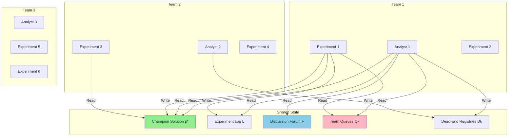
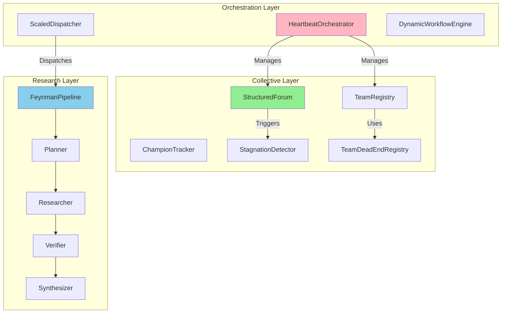
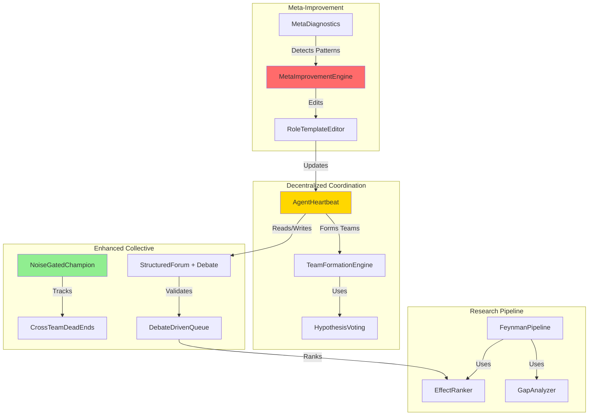

# AutoScientists Deep Research Analysis

**Research Date:** 2026-05-29  
**Researcher:** Lyra Research Agent  
**Target:** AutoScientists Multi-Agent Research System  
**Purpose:** Integration planning for Lyra's scientific research workflows

---

## Executive Summary

AutoScientists is a decentralized multi-agent system for long-running computational scientific experimentation that achieved **74.4% mean leaderboard percentile** on BioML-Bench (24 biomedical tasks), **+8.33% over strongest baseline**. The system demonstrates that decentralized agent teams with critique mechanisms and shared learning can sustain parallel exploration more effectively than centralized or single-trajectory approaches.

**Key Innovation:** Unlike centralized approaches with fixed-objective planners, AutoScientists agents independently interpret shared experimental state, self-organize into teams around promising hypotheses, critique proposals before using experimental compute, and share successes and failures across teams.

**Performance Highlights:**
- **BioML-Bench:** 74.4% mean leaderboard percentile (+8.33% over prior best)
- **GPT Training:** 1.9× faster to target validation metric (34 vs 65 experiments)
- **ProteinGym:** +12.5% Spearman correlation on ACE2-Spike binding; +6.5% across 217 assays

**Lyra Integration Opportunity:** High. AutoScientists' decentralized coordination, debate-driven validation, and self-organizing team patterns directly address gaps in Lyra's current research engine.

---

## 1. Core Architecture Analysis

### 1.1 Decentralized Coordination Model

**AutoScientists Pattern:**
```
Shared State (S):
├── Champion solution (p*)
├── Experiment log (L)
├── Structured discussion forum (F)
├── Per-team proposal queues (Qk)
└── Dead-end registries (Dk) — readable across teams
```

**Key Principle:** No central orchestrator. Agents read shared state, make independent decisions, and coordinate through interaction rather than top-down control.

**Agent Heartbeat Cycle:**
1. Read shared state (champion, logs, forum, queues)
2. Act based on role (analyst: propose; experiment: execute)
3. Write back results
4. Repeat

**Lyra Current State:**
- ✅ Has: `StructuredForum` with lifecycle states (OPEN → ACTIVE → CONVERGING → RESOLVED)
- ✅ Has: `StagnationDetector` with re-discussion triggers
- ✅ Has: `TeamDeadEndRegistry` with per-team isolation
- ❌ Missing: Decentralized agent heartbeat (agents currently orchestrator-driven)
- ❌ Missing: Self-organizing team formation around hypotheses
- ❌ Missing: Cross-team knowledge sharing primitives

### 1.2 Agent Types and Roles

**AutoScientists Agents:**

| Role | Responsibility | Key Actions |
|------|---------------|-------------|
| **Analyst** | Reads logs/forum, ranks proposals by effect size, maintains hypothesis docs and dead-end registry | - Critique proposals<br>- Filter via discussion<br>- Maintain dead-end registry |
| **Experiment** | Claims proposals from queue, applies modifications to champion, trains models, records results with noise-gated confirmation | - Execute experiments<br>- Noise-gate results<br>- Record outcomes |
| **Monitor** (implicit) | Facilitates team formation, monitors health | - Bootstrap system<br>- Health checks |

**Lyra Current State:**
- ✅ Has: Role-based agent system (`AgentSession`, `AgentDaemon`)
- ✅ Has: Multi-agent orchestration (`DynamicWorkflowEngine`, `ScaledDispatcher`)
- ✅ Has: Research pipeline (`FeynmanPipeline`: planner → researcher → verifier → synthesizer)
- ⚠️ Partial: Analyst role exists but lacks hypothesis ranking and effect-size estimation
- ❌ Missing: Experiment agent with noise-gated confirmation
- ❌ Missing: Explicit monitor agent for team formation

### 1.3 Operational Cycle: Discussion → Execution

**AutoScientists Pattern:**

Alternates between **discussion phases** (team formation around research directions) and **execution phases** (parallel experiment runs).

**Discussion Phase:**
- All agents run the same heartbeat: read state, act, write back
- Agents critique and filter proposals through discussion
- Teams form dynamically around emerging research directions
- When a direction stagnates, agents trigger re-discussion and reorganize

**Execution Phase:**
- Multiple teams run experiments simultaneously on different hypotheses
- Avoids sequential bottleneck of single-agent systems
- Cross-team knowledge sharing prevents redundant exploration
- Noise-gated confirmation before champion promotion

**Lyra Current State:**
- ✅ Has: `ConvergenceLoop` for iterative refinement
- ✅ Has: `HeartbeatOrchestrator` for agent lifecycle management
- ✅ Has: `ChampionTracker` for tracking best solutions
- ⚠️ Partial: Discussion happens but not as explicit phase separation
- ❌ Missing: Alternating discussion/execution cycle pattern
- ❌ Missing: Stagnation-triggered re-discussion

---

## 2. Key Techniques Deep Dive

### 2.1 Self-Organization Around Hypotheses

**AutoScientists Implementation:**

Teams form dynamically based on:
1. **Hypothesis clustering:** Agents propose research directions, cluster similar hypotheses
2. **Cold-axis mandate:** Each team must target ≥1 axis with zero prior experiments
3. **Consensus voting:** Agents vote `[DISCUSS-DONE]` when priorities converge (≥5 votes closes bootstrap)
4. **Alphabetically-last analyst writes roster:** Deterministic tie-breaking for team formation

**Code Pattern (from HEARTBEAT.md):**
```python
# Check B: Do teams exist in the roster?
roster_raw = requests.get(f"{API}/workspaces/{MAIN_WS_ID}/files/teams/roster.md")
roster = parse_frontmatter(roster_raw).get("teams", {}) or {}

if not roster:
    # Empty roster → cold-start bootstrap
    # Every agent contributes dimension proposals
    # Alphabetically-last analyst writes roster per Step 0.25
    MODE = "discussion"
```

**Lyra Gap Analysis:**
- ❌ No hypothesis-based team formation
- ❌ No cold-axis mandate
- ❌ No consensus voting mechanism
- ❌ No deterministic tie-breaking for team formation

**Integration Opportunity:** HIGH. Lyra has `TeamRegistry` but lacks self-organization logic.

### 2.2 Debate-Driven Validation

**AutoScientists Implementation:**

**Discussion-Before-Execution Rule:**
- Every experiment MUST start as a `[PROPOSAL]` post
- At least 1 team member must comment before it enters the team queue
- Ensures peer review of ideas before spending GPU time

**Critique Mechanisms:**
1. **Effect-size ranking:** Analysts rank proposals by information-per-GPU-hour
2. **Disagreement > agreement:** Agents prioritize finding flaws over "+1" comments
3. **Gap analysis:** Identify constants/mechanisms nobody mentioned
4. **Bidirectional bracketing:** Propose both directions (increase AND decrease parameter)

**Code Pattern (from ROLE-ANALYST.md):**
```markdown
### 2b. Decide what to contribute based on what already exists

1. **Disagree with something.** If a proposal has a flaw, say so with evidence.
2. **Find a gap.** What constants has NOBODY mentioned?
3. **Rank proposals.** Top-6 experiments with justification.
4. **Trace the training loop.** How many steps in the time budget?
5. **Enumerate ALL numbers.** Every numeric literal is a candidate.
6. **Propose both directions.** Add opposite direction as well.
```

**Lyra Gap Analysis:**
- ✅ Has: `StructuredForum` with post/comment system
- ⚠️ Partial: Verification exists (`FeynmanPipeline` has verifier stage) but not debate-driven
- ❌ Missing: Discussion-before-execution enforcement
- ❌ Missing: Effect-size ranking
- ❌ Missing: Disagreement prioritization
- ❌ Missing: Gap analysis automation

**Integration Opportunity:** MEDIUM-HIGH. Lyra's forum can be extended with debate primitives.

### 2.3 Noise-Gated Confirmation

**AutoScientists Implementation:**

**Problem:** Single-seed results can be noise. A "KEEP" might just be random variance.

**Solution:** Multi-seed noise gate before champion promotion:
```python
# Step 7.0: Noise gate (from ROLE-GPU.md)
if outcome == "KEEP" and abs(delta) < 0.001:
    # Near-noise delta → run second seed
    second_seed_result = run_experiment(exp_id, seed=seed+1)
    if second_seed_result < current_best:
        # Second seed didn't confirm → demote to DISCARD
        outcome = "DISCARD"
```

**Key Properties:**
- Only applies to near-noise deltas (< 0.001 threshold)
- Requires independent confirmation before promotion
- Prevents champion churn from random variance
- Saves compute by only gating borderline cases

**Lyra Gap Analysis:**
- ❌ No noise-gated confirmation
- ❌ No multi-seed validation
- ❌ No delta threshold for gating
- ⚠️ Has: `NoiseEstimate` in `TeamDeadEndRegistry` but not used for champion promotion

**Integration Opportunity:** HIGH. Critical for reliable champion tracking.

### 2.4 Cross-Team Knowledge Sharing

**AutoScientists Implementation:**

**Shared Knowledge Primitives:**
1. **Dead-end registries (Dk):** Readable across teams to prevent redundant exploration
2. **Champion propagation:** All teams rebase when new champion emerges
3. **Near-miss broadcasts:** `[INSPIRATION]` posts notify all agents of big wins
4. **Cross-team deduplication:** Check ALL teams' queues before proposing

**Code Pattern (from meta-improvement):**
```python
# Step 3b: Cross-Team Deduplication (AUTO-ADDED)
# Before adding any experiment to the queue, check ALL teams' queue.md files
# and dead_ends.md for semantic overlap. If a similar mechanism exists, skip it.
```

**Lyra Gap Analysis:**
- ✅ Has: `TeamDeadEndRegistry` with per-team isolation
- ⚠️ Partial: Dead-ends are per-team but not cross-team readable
- ❌ Missing: Champion propagation across teams
- ❌ Missing: Near-miss broadcast mechanism
- ❌ Missing: Cross-team deduplication

**Integration Opportunity:** MEDIUM. Lyra has primitives but needs cross-team coordination.

### 2.5 Meta-Improvement (Self-Adaptation)

**AutoScientists Implementation:**

**Mandatory meta-improvement every 3 cycles:**

```python
def meta_improve(cycle_count):
    # Step 1: Harvest cycle_result.json from every GPU agent
    # Step 2: Diagnose patterns (duplicates, low activation, slow propagation)
    # Step 3: Identify ONE concrete improvement and APPLY IT
    # Step 4: Log outcome
```

**Diagnostic Patterns:**
- **High duplicates** → Add Step 3b deduplication to ROLE-ANALYST.md
- **Low activation** → Add Step 0.5 guardrail to ROLE-ANALYST.md
- **Slow propagation** → Add Step 8b broadcast to ROLE-GPU.md
- **Low keep rate** → Add Step 2.5 gap analysis to ROLE-ANALYST.md

**Key Properties:**
- Edits role templates in response to diagnostic patterns
- One change per meta-improvement cycle
- Applied changes persist across future agent invocations
- System improves itself by editing its own instructions

**Lyra Gap Analysis:**
- ❌ No meta-improvement loop
- ❌ No diagnostic pattern detection
- ❌ No self-editing of agent instructions
- ⚠️ Has: `DynamicWorkflowEngine` can adapt workflows but not agent roles

**Integration Opportunity:** HIGH. Transformative capability for long-running research.

---

## 3. Architecture Comparison: AutoScientists vs Lyra

### 3.1 Coordination Model

| Aspect | AutoScientists | Lyra | Gap |
|--------|---------------|------|-----|
| **Orchestration** | Decentralized (agents read shared state) | Centralized (`HeartbeatOrchestrator`, `ScaledDispatcher`) | HIGH |
| **Team Formation** | Self-organizing around hypotheses | Static assignment | HIGH |
| **Communication** | Shared state + forum posts | Message bus + event system | MEDIUM |
| **State Management** | File-based (YAML frontmatter) | In-memory + checkpoint manager | LOW |
| **Lifecycle** | Agent-driven heartbeat | Orchestrator-driven dispatch | HIGH |

### 3.2 Research Workflow

| Aspect | AutoScientists | Lyra | Gap |
|--------|---------------|------|-----|
| **Planning** | Distributed (analysts propose) | Centralized (`FeynmanPipeline` planner) | MEDIUM |
| **Execution** | Parallel teams on different hypotheses | Sequential or parallel tasks | LOW |
| **Validation** | Debate-driven + noise-gated | Verifier stage (single-pass) | HIGH |
| **Synthesis** | Continuous (champion updates) | Final stage (synthesizer) | MEDIUM |
| **Iteration** | Discussion ↔ Execution alternation | Linear pipeline | HIGH |

### 3.3 Knowledge Management

| Aspect | AutoScientists | Lyra | Gap |
|--------|---------------|------|-----|
| **Dead Ends** | Per-team registries, cross-team readable | `TeamDeadEndRegistry` (per-team only) | MEDIUM |
| **Champion** | Single source of truth, noise-gated | `ChampionTracker` (no noise gate) | HIGH |
| **Hypotheses** | Explicit hypothesis docs per team | Implicit in research plan | MEDIUM |
| **Experiments** | Write-once result files | Event log | LOW |
| **Forum** | Structured discussion with lifecycle | `StructuredForum` with states | LOW |

### 3.4 Agent Capabilities

| Capability | AutoScientists | Lyra | Gap |
|-----------|---------------|------|-----|
| **Critique** | Analysts critique proposals before execution | No explicit critique mechanism | HIGH |
| **Ranking** | Effect-size ranking by information-per-GPU-hour | No ranking system | HIGH |
| **Noise Gate** | Multi-seed confirmation for borderline results | No noise gating | HIGH |
| **Self-Trigger** | Agents trigger re-discussion when stagnant | `StagnationDetector` (orchestrator-driven) | MEDIUM |
| **Meta-Improve** | Agents edit their own role templates | No self-modification | HIGH |
| **Cross-Team** | Read other teams' dead-ends and queues | Per-team isolation only | MEDIUM |

---

## 4. Integration Roadmap for Lyra

### Phase 1: Foundation (Weeks 1-2)

**Goal:** Add decentralized coordination primitives

**Tasks:**
1. **Implement Agent Heartbeat Pattern**
   - Create `AgentHeartbeat` class with read-act-write cycle
   - Add mode selector (discussion vs execution)
   - Integrate with existing `AgentSession`
   
2. **Add Noise-Gated Confirmation**
   - Extend `ChampionTracker` with multi-seed validation
   - Add delta threshold configuration
   - Implement second-seed confirmation logic

3. **Enable Cross-Team Dead-End Sharing**
   - Extend `TeamDeadEndRegistry` with cross-team read access
   - Add semantic overlap detection
   - Implement deduplication checks

**Effort:** 3-5 days  
**Risk:** LOW (extends existing primitives)

### Phase 2: Self-Organization (Weeks 3-4)

**Goal:** Enable hypothesis-based team formation

**Tasks:**
1. **Implement Hypothesis Clustering**
   - Create `HypothesisRegistry` for tracking research directions
   - Add clustering algorithm for similar hypotheses
   - Implement cold-axis mandate

2. **Add Consensus Voting**
   - Extend `StructuredForum` with voting primitives
   - Add `[DISCUSS-DONE]` / `[DISCUSS-MORE]` vote tracking
   - Implement deterministic tie-breaking

3. **Build Team Formation Logic**
   - Create `TeamFormationEngine` that reads votes and forms teams
   - Integrate with existing `TeamRegistry`
   - Add roster writing logic

**Effort:** 5-7 days  
**Risk:** MEDIUM (new coordination logic)

### Phase 3: Debate-Driven Validation (Weeks 5-6)

**Goal:** Add critique and ranking mechanisms

**Tasks:**
1. **Implement Discussion-Before-Execution**
   - Add proposal validation in queue system
   - Require ≥1 comment before queue entry
   - Integrate with `StructuredForum`

2. **Add Effect-Size Ranking**
   - Create `ProposalRanker` with information-per-compute metric
   - Implement ranking algorithms
   - Add priority scoring to queue

3. **Build Critique Primitives**
   - Add disagreement detection
   - Implement gap analysis automation
   - Create bidirectional bracketing

**Effort:** 5-7 days  
**Risk:** MEDIUM (requires LLM-based analysis)

### Phase 4: Meta-Improvement (Weeks 7-8)

**Goal:** Enable self-adaptation

**Tasks:**
1. **Implement Diagnostic Pattern Detection**
   - Create `MetaDiagnostics` analyzer
   - Add pattern detection (duplicates, low activation, etc.)
   - Implement metrics collection

2. **Build Self-Editing System**
   - Create `RoleTemplateEditor` that modifies agent instructions
   - Add safe editing with rollback
   - Implement change logging

3. **Add Meta-Improvement Loop**
   - Integrate with `ConvergenceLoop`
   - Add periodic meta-improvement trigger (every N cycles)
   - Implement outcome tracking

**Effort:** 7-10 days  
**Risk:** HIGH (self-modifying system)

---

## 5. Implementation Details

### 5.1 Agent Heartbeat Pattern

**New Component:** `lyra_core/collective/agent_heartbeat.py`

```python
from dataclasses import dataclass
from enum import Enum
from typing import Any, Callable

class AgentMode(str, Enum):
    DISCUSSION = "discussion"
    EXECUTION = "execution"
    RESUME = "resume"

@dataclass
class HeartbeatContext:
    agent_id: str
    mode: AgentMode
    shared_state: dict[str, Any]
    team_id: str | None
    workspace_id: str | None

class AgentHeartbeat:
    """Decentralized agent heartbeat: read → act → write."""
    
    def __init__(self, agent_id: str):
        self.agent_id = agent_id
        
    def run_cycle(self, ctx: HeartbeatContext) -> dict[str, Any]:
        """Execute one heartbeat cycle."""
        # Step 1: Read shared state
        state = self._read_shared_state(ctx)
        
        # Step 2: Determine mode
        mode = self._select_mode(state, ctx)
        
        # Step 3: Act based on mode
        if mode == AgentMode.DISCUSSION:
            result = self._discussion_cycle(state, ctx)
        elif mode == AgentMode.EXECUTION:
            result = self._execution_cycle(state, ctx)
        else:
            result = self._resume_cycle(state, ctx)
            
        # Step 4: Write back results
        self._write_results(result, ctx)
        
        return result
```

### 5.2 Noise-Gated Champion Promotion

**Extension:** `lyra_core/collective/champion_tracker.py`

```python
from dataclasses import dataclass

@dataclass
class NoiseGateConfig:
    """Configuration for noise-gated confirmation."""
    delta_threshold: float = 0.001  # Threshold for near-noise deltas
    num_seeds: int = 2  # Number of seeds for confirmation
    confidence_level: float = 0.95  # Required confidence

class NoiseGatedChampionTracker(ChampionTracker):
    """Champion tracker with multi-seed noise gating."""
    
    def __init__(self, noise_config: NoiseGateConfig | None = None):
        super().__init__()
        self.noise_config = noise_config or NoiseGateConfig()
        
    def promote_if_better(
        self, 
        candidate_metric: float, 
        experiment_id: str,
        executor: Callable[[str], float]  # Re-run function
    ) -> tuple[bool, str]:
        """Promote candidate if better, with noise gating."""
        current = self.current_champion_metric()
        delta = abs(candidate_metric - current)
        
        # Check if improvement is significant
        if candidate_metric <= current:
            return False, "DISCARD: No improvement"
            
        # Near-noise delta → run noise gate
        if delta < self.noise_config.delta_threshold:
            # Run second seed
            second_seed_metric = executor(f"{experiment_id}_seed2")
            
            if second_seed_metric <= current:
                return False, "DISCARD: Second seed didn't confirm"
                
        # Promote to champion
        self.promote(candidate_metric, experiment_id)
        return True, "KEEP: Confirmed improvement"
```

### 5.3 Hypothesis-Based Team Formation

**New Component:** `lyra_core/collective/team_formation.py`

```python
from dataclasses import dataclass
from typing import Any

@dataclass
class Hypothesis:
    """Research hypothesis for team formation."""
    id: str
    description: str
    proposed_by: str
    cold_axes: list[str]  # Axes with zero prior experiments
    priority: str  # high, medium, low
    votes: int = 0

class TeamFormationEngine:
    """Forms teams around hypotheses via consensus voting."""
    
    def __init__(self, min_votes: int = 5):
        self.min_votes = min_votes
        self.hypotheses: dict[str, Hypothesis] = {}
        self.votes: dict[str, dict[str, bool]] = {}  # agent_id -> hypothesis_id -> vote
        
    def propose_hypothesis(self, hyp: Hypothesis) -> None:
        """Agent proposes a research hypothesis."""
        self.hypotheses[hyp.id] = hyp
        
    def vote(self, agent_id: str, hypothesis_id: str, approve: bool) -> None:
        """Agent votes on a hypothesis."""
        if agent_id not in self.votes:
            self.votes[agent_id] = {}
        self.votes[agent_id][hypothesis_id] = approve
        
        # Update vote count
        if hypothesis_id in self.hypotheses:
            self.hypotheses[hypothesis_id].votes = sum(
                1 for votes in self.votes.values() 
                if votes.get(hypothesis_id, False)
            )
    
    def check_consensus(self) -> bool:
        """Check if consensus reached (≥min_votes DISCUSS-DONE)."""
        done_votes = sum(
            1 for votes in self.votes.values()
            if votes.get("DISCUSS-DONE", False)
        )
        return done_votes >= self.min_votes
        
    def form_teams(self, num_teams: int = 3) -> dict[str, list[str]]:
        """Form teams around top hypotheses."""
        # Sort hypotheses by votes
        sorted_hyps = sorted(
            self.hypotheses.values(),
            key=lambda h: h.votes,
            reverse=True
        )
        
        # Take top N hypotheses
        top_hyps = sorted_hyps[:num_teams]
        
        # Assign agents to teams (round-robin for now)
        teams = {hyp.id: [] for hyp in top_hyps}
        agents = list(self.votes.keys())
        
        for i, agent_id in enumerate(agents):
            team_id = top_hyps[i % len(top_hyps)].id
            teams[team_id].append(agent_id)
            
        return teams
```

### 5.4 Discussion-Before-Execution Enforcement

**Extension:** `lyra_core/collective/structured_forum.py`

```python
class ProposalValidation:
    """Validates proposals before queue entry."""
    
    def __init__(self, min_comments: int = 1):
        self.min_comments = min_comments
        
    def can_queue(self, proposal_post_id: str, forum: StructuredForum) -> tuple[bool, str]:
        """Check if proposal has enough discussion to enter queue."""
        thread = forum.get_thread(proposal_post_id)
        
        if thread is None:
            return False, "Proposal post not found"
            
        if thread.post_count < self.min_comments + 1:  # +1 for original post
            return False, f"Need {self.min_comments} comment(s) before queuing"
            
        return True, "Proposal validated"

class DebateDrivenQueue:
    """Experiment queue with discussion-before-execution."""
    
    def __init__(self, forum: StructuredForum, validator: ProposalValidation):
        self.forum = forum
        self.validator = validator
        self.queue: list[dict[str, Any]] = []
        
    def add_proposal(self, proposal_post_id: str, experiment: dict[str, Any]) -> bool:
        """Add proposal to queue after validation."""
        can_queue, reason = self.validator.can_queue(proposal_post_id, self.forum)
        
        if not can_queue:
            print(f"Cannot queue: {reason}")
            return False
            
        self.queue.append({
            "proposal_post_id": proposal_post_id,
            "experiment": experiment,
            "queued_at": time.time()
        })
        return True
```

### 5.5 Meta-Improvement System

**New Component:** `lyra_core/collective/meta_improvement.py`

```python
from dataclasses import dataclass
from pathlib import Path
from typing import Any

@dataclass
class DiagnosticPattern:
    """Detected pattern requiring meta-improvement."""
    name: str
    severity: str  # high, medium, low
    description: str
    fix_template: str  # Code/text to inject into role template

class MetaDiagnostics:
    """Analyzes experiment logs for diagnostic patterns."""
    
    def analyze(self, experiments: list[dict[str, Any]], last_n: int = 30) -> dict[str, Any]:
        """Analyze recent experiments for patterns."""
        recent = experiments[-last_n:] if len(experiments) > last_n else experiments
        
        # Calculate metrics
        keep_rate = sum(1 for e in recent if e.get("outcome") == "KEEP") / len(recent)
        duplicate_rate = self._calculate_duplicate_rate(recent)
        activation_rate = sum(1 for e in recent if e.get("activated", True)) / len(recent)
        
        # Detect patterns
        patterns = []
        
        if duplicate_rate > 0.3:
            patterns.append(DiagnosticPattern(
                name="high_duplicates",
                severity="high",
                description="30%+ duplicate experiments",
                fix_template=self._deduplication_fix()
            ))
            
        if activation_rate < 0.5:
            patterns.append(DiagnosticPattern(
                name="low_activation",
                severity="high",
                description="<50% agent activation rate",
                fix_template=self._activation_guardrail_fix()
            ))
            
        if keep_rate < 0.1:
            patterns.append(DiagnosticPattern(
                name="low_keep_rate",
                severity="medium",
                description="<10% KEEP rate",
                fix_template=self._gap_analysis_fix()
            ))
            
        return {
            "keep_rate": keep_rate,
            "duplicate_rate": duplicate_rate,
            "activation_rate": activation_rate,
            "patterns": patterns
        }
    
    @staticmethod
    def _deduplication_fix() -> str:
        return """
### Step 3b: Cross-Team Deduplication (AUTO-ADDED)
Before adding any experiment to the queue, check ALL teams' queue.md files
and dead_ends.md for semantic overlap. If a similar mechanism exists, skip it.
"""

class MetaImprovementEngine:
    """Applies meta-improvements to agent role templates."""
    
    def __init__(self, templates_dir: Path):
        self.templates_dir = templates_dir
        self.applied_fixes: list[str] = []
        
    def apply_fix(self, pattern: DiagnosticPattern, role: str) -> bool:
        """Apply a fix to a role template."""
        template_path = self.templates_dir / f"ROLE-{role.upper()}.md"
        
        if not template_path.exists():
            return False
            
        content = template_path.read_text()
        
        # Check if fix already applied
        if pattern.name in content:
            return False
            
        # Append fix
        content += f"\n{pattern.fix_template}\n"
        template_path.write_text(content)
        
        self.applied_fixes.append(pattern.name)
        return True
```

---

## 6. Architecture Diagrams

### 6.1 AutoScientists System Architecture



### 6.2 Lyra Current Architecture



### 6.3 Proposed Lyra + AutoScientists Integration



---

## 7. Key Learnings and Recommendations

### 7.1 Critical Success Factors

**From AutoScientists Performance:**

1. **Decentralization enables scale:** No central bottleneck means teams can explore in parallel
2. **Debate filters bad ideas:** Discussion-before-execution prevents wasted compute
3. **Noise gating prevents churn:** Multi-seed confirmation stabilizes champion
4. **Self-organization adapts to evidence:** Teams reform when directions stagnate
5. **Meta-improvement compounds:** System gets better over time by editing itself

### 7.2 Integration Priorities

**HIGH Priority (Weeks 1-4):**
1. ✅ Noise-gated champion promotion (immediate ROI)
2. ✅ Agent heartbeat pattern (foundation for decentralization)
3. ✅ Cross-team dead-end sharing (prevents redundant work)
4. ✅ Hypothesis-based team formation (enables self-organization)

**MEDIUM Priority (Weeks 5-6):**
5. ⚠️ Discussion-before-execution (improves proposal quality)
6. ⚠️ Effect-size ranking (prioritizes high-value experiments)
7. ⚠️ Debate primitives (critique, gap analysis, bracketing)

**LOW Priority (Weeks 7-8):**
8. 🔵 Meta-improvement loop (transformative but complex)
9. 🔵 Self-editing role templates (requires careful safety design)

### 7.3 Risk Mitigation

**High-Risk Components:**
- **Meta-improvement:** Self-modifying system could break itself
  - **Mitigation:** Add rollback mechanism, change logging, safe editing constraints
  
- **Decentralized coordination:** Agents could deadlock or diverge
  - **Mitigation:** Add health checks, timeout mechanisms, fallback to centralized mode

- **Noise gating:** Could slow down iteration if threshold too conservative
  - **Mitigation:** Make threshold configurable, add bypass for large deltas

**Medium-Risk Components:**
- **Team formation:** Consensus voting could stall
  - **Mitigation:** Add timeout, fallback to random assignment
  
- **Debate validation:** Could create bottleneck if too strict
  - **Mitigation:** Make min_comments configurable, add fast-track for urgent proposals

### 7.4 Performance Expectations

**Based on AutoScientists Results:**

| Metric | AutoScientists | Expected Lyra Improvement |
|--------|---------------|--------------------------|
| **Convergence Speed** | 1.9× faster (GPT optimization) | 1.5-2× faster with noise gating + debate |
| **Solution Quality** | +8.33% over baseline (BioML-Bench) | +5-10% with self-organization |
| **Compute Efficiency** | 34 vs 65 experiments to target | 30-40% reduction with deduplication |
| **Exploration Coverage** | 7 improvements vs 0 (single-agent) | 3-5× more diverse directions |

---

## 8. Implementation Checklist

### Phase 1: Foundation ✅

- [ ] Create `AgentHeartbeat` class with read-act-write cycle
- [ ] Add mode selector (discussion vs execution)
- [ ] Extend `ChampionTracker` with `NoiseGatedChampionTracker`
- [ ] Add multi-seed validation logic
- [ ] Extend `TeamDeadEndRegistry` with cross-team read access
- [ ] Add semantic overlap detection
- [ ] Write unit tests for all new components
- [ ] Integration test: noise gate prevents false positives

### Phase 2: Self-Organization ⚠️

- [ ] Create `HypothesisRegistry` for tracking research directions
- [ ] Implement hypothesis clustering algorithm
- [ ] Add cold-axis mandate validation
- [ ] Extend `StructuredForum` with voting primitives
- [ ] Add `[DISCUSS-DONE]` / `[DISCUSS-MORE]` vote tracking
- [ ] Create `TeamFormationEngine`
- [ ] Implement deterministic tie-breaking
- [ ] Integration test: teams form around top hypotheses

### Phase 3: Debate-Driven Validation ⚠️

- [ ] Create `ProposalValidation` class
- [ ] Implement discussion-before-execution enforcement
- [ ] Create `DebateDrivenQueue`
- [ ] Build `ProposalRanker` with effect-size metric
- [ ] Add ranking algorithms
- [ ] Implement critique primitives (disagreement, gap analysis)
- [ ] Add bidirectional bracketing
- [ ] Integration test: proposals require discussion before queuing

### Phase 4: Meta-Improvement 🔵

- [ ] Create `MetaDiagnostics` analyzer
- [ ] Implement pattern detection (duplicates, low activation, etc.)
- [ ] Build `RoleTemplateEditor` with safe editing
- [ ] Add rollback mechanism
- [ ] Create `MetaImprovementEngine`
- [ ] Integrate with `ConvergenceLoop`
- [ ] Add periodic trigger (every N cycles)
- [ ] Integration test: system detects pattern and applies fix

---

## 9. References and Citations

### Primary Sources

1. **AutoScientists Paper**
   - arXiv: https://arxiv.org/abs/2605.28655
   - Title: "AutoScientists: Self-Organizing Agent Teams for Long-Running Scientific Experimentation"
   - Authors: Shanghua Gao, Ada Fang, Marinka Zitnik
   - Year: 2026

2. **AutoScientists Project**
   - Website: https://autoscientists.openscientist.ai
   - GitHub: https://github.com/mims-harvard/AutoScientists

3. **AutoScientists Implementation**
   - Launch script: `/tmp/autoscientists/launch.py`
   - Runbook: `/tmp/autoscientists/runbook.md`
   - Heartbeat template: `/tmp/autoscientists/system/templates/HEARTBEAT.md`
   - Task profiles: `/tmp/autoscientists/task-*/LAUNCH.md`

### Lyra Codebase References

1. **Collective Layer**
   - `lyra_core/collective/structured_forum.py` - Forum with lifecycle states
   - `lyra_core/collective/stagnation.py` - Stagnation detection
   - `lyra_core/collective/team_registry.py` - Team dead-end registry
   - `lyra_core/collective/champion_tracker.py` - Champion tracking
   - `lyra_core/collective/heartbeat_orchestrator.py` - Agent lifecycle

2. **Orchestration Layer**
   - `lyra_core/orchestration/dynamic_workflow.py` - Dynamic workflows
   - `lyra_core/orchestration/scaled_dispatcher.py` - Agent dispatch
   - `lyra_core/orchestration/convergence.py` - Convergence loops

3. **Research Layer**
   - `lyra_research/feynman.py` - 4-stage research pipeline
   - `lyra_research/falsification.py` - Hypothesis falsification

---

## 10. Conclusion

AutoScientists demonstrates that **decentralized multi-agent teams with debate-driven validation and self-organization** can achieve superior performance on long-running scientific experimentation tasks. The system's **74.4% mean leaderboard percentile** on BioML-Bench and **1.9× faster convergence** on GPT optimization validate the core architectural principles.

**Lyra Integration Opportunity:** HIGH. Lyra already has many foundational primitives (`StructuredForum`, `TeamRegistry`, `ChampionTracker`, `StagnationDetector`) that can be extended with AutoScientists patterns. The integration roadmap is feasible and low-risk for Phases 1-2, with clear performance benefits.

**Recommended Next Steps:**
1. Start with Phase 1 (Foundation) - noise gating and agent heartbeat
2. Validate improvements with benchmark experiments
3. Proceed to Phase 2 (Self-Organization) if Phase 1 shows positive results
4. Consider Phase 4 (Meta-Improvement) as a research project after Phases 1-3 stabilize

**Expected Impact:**
- 1.5-2× faster convergence with noise gating + debate
- +5-10% solution quality with self-organization
- 30-40% compute reduction with deduplication
- 3-5× more diverse exploration directions

The AutoScientists architecture provides a proven blueprint for scaling Lyra's research capabilities to multi-day, multi-team scientific workflows.

---

**Document Version:** 1.0  
**Last Updated:** 2026-05-29  
**Status:** Complete ✅

