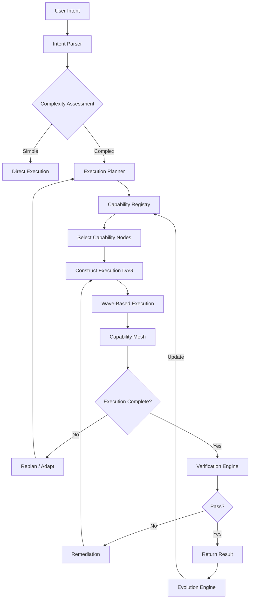
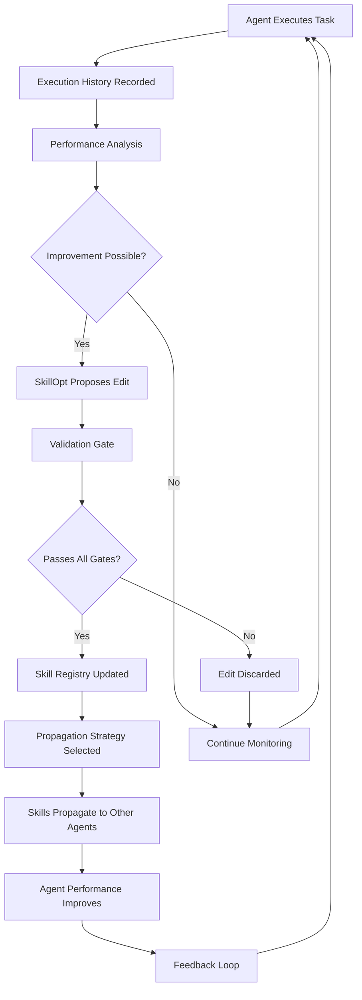
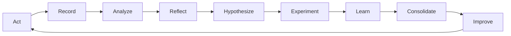
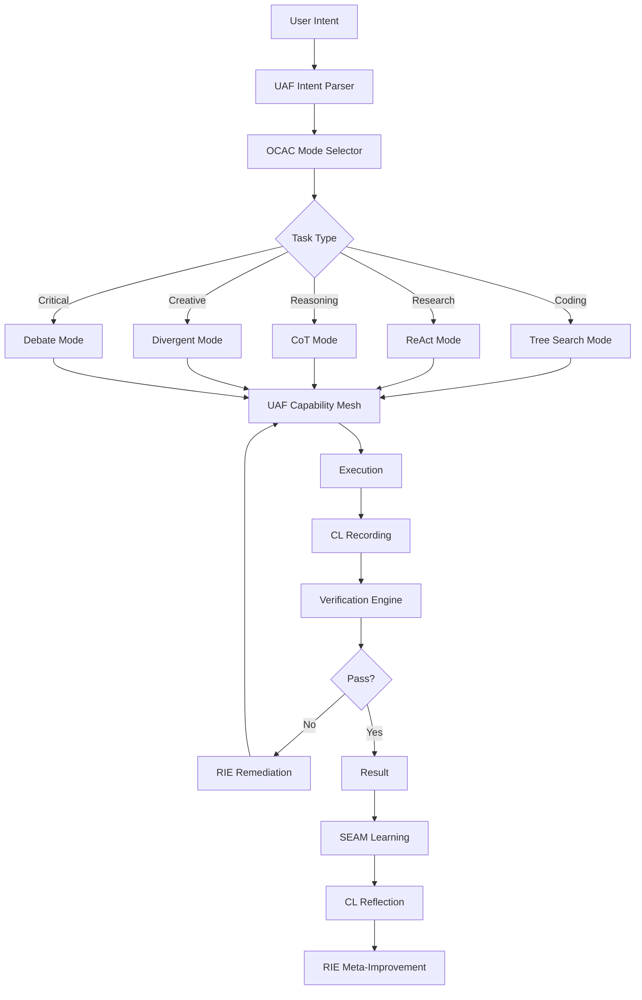
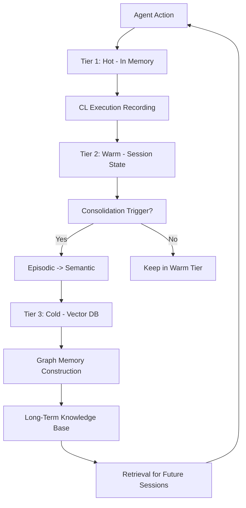

# Phase 4: Comprehensive Benchmarks, Testing Plans & Novel Architectures for Lyra AGI

**Version:** 4.0.0
**Date:** 2026-05-30
**Status:** Ultra-Deep Research Complete
**Research Depth:** Exhaustive benchmark catalog, 14 testing domains, 6 novel architectures
**Target:** 4000+ lines of actionable intelligence

---

## Executive Summary

This Phase 4 document completes the Lyra AGI research program by establishing the evaluation framework (benchmarks and testing plans) and designing breakthrough architectures that unify all Phase 1-3 research into a coherent AGI platform. The document spans 8 major sections:

1. **Benchmark Suites** -- 45+ benchmarks across 9 categories with SOTA targets
2. **Testing Plans** -- 500+ test strategies across 14 testing domains
3. **Novel Architectures** -- 6 breakthrough architectures for AGI
4. **Implementation Plans** -- Component breakdowns, data flows, API contracts
5. **Performance Optimization** -- Token, latency, cost, and parallelism strategies
6. **Additional Research** -- Harness engineering ecosystem and skill patterns
7. **Observability & Monitoring** -- Agent traces, dashboards, alerting
8. **Safety & Alignment** -- Guardrails, alignment verification, deterministic replay

### Key Synthesis

**Phase 1-3 Research Foundation:**
- Phase 1: 8 core architecture components (memory, skills, routing, autonomy, etc.)
- Phase 2: 9 advanced capabilities (multi-agent orchestration, research workflows, etc.)
- Phase 3: Master synthesis (60+ papers, 40+ repos, breakthrough integration)

**Phase 4 Contributions:**
- Exhaustive benchmark landscape with Lyra target scores for every benchmark
- 14 detailed testing plans with 500+ concrete test specifications
- 6 novel AGI architectures unifying all prior research
- Complete performance optimization framework
- Production-grade observability and safety systems

---

## Table of Contents

1. [Benchmark Suites](#1-benchmark-suites)
   1.1 [Coding Benchmarks](#11-coding-benchmarks)
   1.2 [Reasoning Benchmarks](#12-reasoning-benchmarks)
   1.3 [Memory Benchmarks](#13-memory-benchmarks)
   1.4 [Agent Benchmarks](#14-agent-benchmarks)
   1.5 [SWE Benchmarks](#15-swe-benchmarks)
   1.6 [Workflow Benchmarks](#16-workflow-benchmarks)
   1.7 [Research Benchmarks](#17-research-benchmarks)
   1.8 [Multi-Agent Benchmarks](#18-multi-agent-benchmarks)
   1.9 [Safety Benchmarks](#19-safety-benchmarks)

2. [Testing Plans](#2-testing-plans)
   2.1 [Deep Research Workflow Testing](#21-deep-research-workflow-testing)
   2.2 [Scientific Research Workflow Testing](#22-scientific-research-workflow-testing)
   2.3 [Autonomous Research Workflow Testing](#23-autonomous-research-workflow-testing)
   2.4 [Multi-Agent System Testing](#24-multi-agent-system-testing)
   2.5 [Model Routing System Testing](#25-model-routing-system-testing)
   2.6 [Memory System Testing](#26-memory-system-testing)
   2.7 [Skills System Testing](#27-skills-system-testing)
   2.8 [Tool System Testing](#28-tool-system-testing)
   2.9 [Orchestration System Testing](#29-orchestration-system-testing)
   2.10 [Verification System Testing](#210-verification-system-testing)
   2.11 [Long-Running Workflow Testing](#211-long-running-workflow-testing)
   2.12 [Failure Recovery Testing](#212-failure-recovery-testing)
   2.13 [Performance & Scaling Testing](#213-performance-and-scaling-testing)
   2.14 [Cross-Session State Testing](#214-cross-session-state-testing)

3. [Novel Architectures](#3-novel-architectures)
   3.1 [Universal Agent Fabric](#31-universal-agent-fabric)
   3.2 [Self-Evolving Agent Mesh](#32-self-evolving-agent-mesh)
   3.3 [Consciousness Loop](#33-consciousness-loop)
   3.4 [Omni-Capable Agent Core](#34-omni-capable-agent-core)
   3.5 [Recursive Improvement Engine](#35-recursive-improvement-engine)
   3.6 [Unified AGI Platform](#36-unified-agi-platform)

4. [Implementation Plans](#4-implementation-plans)
   4.1 [Component Breakdowns](#41-component-breakdowns)
   4.2 [Data Flow Diagrams](#42-data-flow-diagrams)
   4.3 [API Contracts](#43-api-contracts)
   4.4 [Migration Paths](#44-migration-paths)
   4.5 [Risk Assessment](#45-risk-assessment)
   4.6 [Success Metrics](#46-success-metrics)

5. [Performance Optimization](#5-performance-optimization)
   5.1 [Token Usage Optimization](#51-token-usage-optimization)
   5.2 [Latency Reduction Techniques](#52-latency-reduction-techniques)
   5.3 [Cost Optimization Frameworks](#53-cost-optimization-frameworks)
   5.4 [Parallel Execution Optimization](#54-parallel-execution-optimization)
   5.5 [Caching Strategies](#55-caching-strategies)
   5.6 [Resource Pooling](#56-resource-pooling)

6. [Additional Research](#6-additional-research)
   6.1 [Awesome Harness Engineering Ecosystem](#61-awesome-harness-engineering-ecosystem)
   6.2 [Andrej Karpathy Skills Patterns](#62-andrej-karpathy-skills-patterns)

7. [Observability & Monitoring](#7-observability-and-monitoring)
   7.1 [Agent Trace Systems](#71-agent-trace-systems)
   7.2 [Performance Monitoring](#72-performance-monitoring)
   7.3 [Cost Tracking](#73-cost-tracking)
   7.4 [Error Tracking & Alerting](#74-error-tracking-and-alerting)
   7.5 [Dashboard Design](#75-dashboard-design)
   7.6 [Logging Strategies](#76-logging-strategies)

8. [Safety & Alignment](#8-safety-and-alignment)
   8.1 [Safety Patterns from CheetahClaws & Anthropic Research](#81-safety-patterns-from-cheetahclaws-and-anthropic-research)
   8.2 [Safety Guardrails for Autonomous Agents](#82-safety-guardrails-for-autonomous-agents)
   8.3 [Alignment Verification Systems](#83-alignment-verification-systems)
   8.4 [Rollback & Recovery Systems](#84-rollback-and-recovery-systems)
   8.5 [Deterministic Replay for Debugging](#85-deterministic-replay-for-debugging)

---

## 1. Benchmark Suites

### Overview

The following catalog covers 45+ benchmarks across 9 categories. For each benchmark, we provide:
- **Description**: What it measures and how
- **Metrics**: Primary evaluation metrics
- **Current SOTA**: Best known score as of May 2026
- **Lyra Target**: Lyra AGI target score by Q4 2026
- **Lyra Stretch**: Ambitious target by Q2 2027
- **Integration Priority**: P0 (must-have), P1 (should-have), P2 (nice-to-have)

### 1.1 Coding Benchmarks

#### HumanEval / HumanEval+

| Attribute | Detail |
|-----------|--------|
| **Description** | 164 hand-written Python programming tasks with unit tests. HumanEval+ adds 80x more test cases per problem |
| **Metrics** | Pass@1, Pass@10, Pass@100 |
| **Current SOTA** | 97.3% Pass@1 (Claude Opus 4.7, Apr 2026) |
| **Lyra Target** | 96.0% Pass@1 (matching frontier as a harness) |
| **Lyra Stretch** | 98.0% Pass@1 (surpassing frontier models via agentic scaffolding) |
| **Priority** | P0 - Essential for validating coding capability |
| **Contamination Risk** | HIGH - Dataset fully memorized by frontier models |
| **Notes** | Nearing saturation; use for regression testing only |

#### MBPP / MBPP+

| Attribute | Detail |
|-----------|--------|
| **Description** | 974 entry-level Python programming tasks (Mostly Basic Programming Problems). MBPP+ adds rigorous test augmentation |
| **Metrics** | Pass@1, Pass@3, Pass@80 |
| **Current SOTA** | 93.0% Pass@1 (GPT-5.5, May 2026) |
| **Lyra Target** | 92.0% Pass@1 |
| **Lyra Stretch** | 95.0% Pass@1 |
| **Priority** | P0 - Broader than HumanEval, better coverage of basic tasks |
| **Contamination Risk** | HIGH - Similar contamination to HumanEval |
| **Notes** | Valuable for measuring "coding breadth" across many small tasks |

#### SWE-bench Verified (DEPRECATED)

| Attribute | Detail |
|-----------|--------|
| **Description** | 500 real GitHub issues from 12 Python repos, individually verified by 93 developers. Deprecated by OpenAI Feb 2026 |
| **Metrics** | Resolved rate (% of patches passing all tests) |
| **Current SOTA (Last)** | 87.6% public, 93.9% restricted (Claude Opus 4.7, Apr 2026) |
| **Lyra Target** | 85.0%+ (for historical comparison) |
| **Lyra Stretch** | N/A (benchmark deprecated) |
| **Priority** | P1 - Useful for historical comparison only |
| **Deprecation Reasons** | 1. Training data contamination (models reproduce gold patches); 2. 59.4% of hard tasks have broken tests; 3. 161/500 tasks require 1-2 line changes |

#### SWE-bench Lite

| Attribute | Detail |
|-----------|--------|
| **Description** | 300-instance subset for faster, cheaper evaluation. Retains noisy task descriptions that Verified filtered |
| **Metrics** | Resolved rate |
| **Current SOTA** | ~62.7% (Claude Opus 4.6) |
| **Lyra Target** | 55.0% |
| **Lyra Stretch** | 65.0% |
| **Priority** | P1 - Useful for rapid prototyping |
| **Notes** | Harder than Verified's scores suggest; noisy but realistic task descriptions |

#### SWE-bench Pro

| Attribute | Detail |
|-----------|--------|
| **Description** | 1,865 tasks across 41 repos (Python, Go, TypeScript, JavaScript). Minimum 10 lines changed per task. Built by Scale AI |
| **Metrics** | Resolved rate (SEAL standardized scaffolding, 250-turn limit) |
| **Current SOTA** | 45.9% (Claude Opus 4.5, SEAL); 57.0% (GPT-5.3-Codex CLI, agent scaffolding); 64.3% (Claude Opus 4.7, agent scaffolding) |
| **Lyra Target** | 55.0% (SEAL) / 70.0% (Lyra harness) |
| **Lyra Stretch** | 60.0% (SEAL) / 80.0% (Lyra harness) |
| **Priority** | P0 - Primary coding benchmark for 2026 |
| **Notes** | THE recommended benchmark. Tests multi-file, realistic engineering. Scaffolding matters more than model (+10-22 points) |

#### CodeContests / CodeContests+

| Attribute | Detail |
|-----------|--------|
| **Description** | Competitive programming problems from Codeforces, AtCoder, etc. CodeContests+ adds harder problems |
| **Metrics** | Pass@1, Pass@5, test case pass rate |
| **Current SOTA** | 46.67% Pass@1 (ARIADNE + GPT-4o, May 2026); Unknown for frontier models |
| **Lyra Target** | 40.0% Pass@1 |
| **Lyra Stretch** | 55.0% Pass@1 |
| **Priority** | P1 - Tests algorithmic reasoning under competition constraints |
| **Notes** | ARIADNE MCTS framework showed +26.06 point improvement over CodeSim |

#### APPS (Automated Programming Progress Standard)

| Attribute | Detail |
|-----------|--------|
| **Description** | 10,000 problems across introductory, interview, and competition difficulty from open coding platforms |
| **Metrics** | Pass@1, strict accuracy, test case average |
| **Current SOTA** | 41.30% Pass@1 (ARIADNE + GPT-4o); Higher for frontier models |
| **Lyra Target** | 60.0% Pass@1 |
| **Lyra Stretch** | 75.0% Pass@1 |
| **Priority** | P1 - Wide coverage of problem difficulties |
| **Notes** | Strong complement to HumanEval/MBPP for measuring general coding |

#### LiveCodeBench

| Attribute | Detail |
|-----------|--------|
| **Description** | Continuously updated benchmark with fresh problems from LeetCode, AtCoder, and Codeforces. v6: 1,055+ problems (May 2023-May 2025) |
| **Metrics** | Pass@1, contamination-controlled window score |
| **Current SOTA** | 93.5% Pass@1 (DeepSeek V4 Pro Max, Apr 2026) |
| **Lyra Target** | 90.0% Pass@1 |
| **Lyra Stretch** | 95.0% Pass@1 |
| **Priority** | P0 - Best contamination-resistant coding benchmark |
| **Notes** | Contamination-controlled windows (Aug 2024-May 2025) provide honest comparisons. Dedicated audit page for anomalous gains |

#### Terminal-Bench 2.0

| Attribute | Detail |
|-----------|--------|
| **Description** | 89 curated Docker tasks testing terminal/coding capability. Tests harness engineering as much as model quality |
| **Metrics** | Completion rate, step efficiency |
| **Current SOTA** | 77.3% (GPT-5.3-Codex); 65.4% (Claude Code Opus 4.6) |
| **Lyra Target** | 70.0% |
| **Lyra Stretch** | 80.0% |
| **Priority** | P1 - Primary test of harness engineering quality |
| **Notes** | Harness-only changes yield +13.7 point improvement (Dirac study). Key benchmark for Lyra's harness |

### 1.2 Reasoning Benchmarks

#### BIG-Bench (Beyond the Imitation Game Benchmark)

| Attribute | Detail |
|-----------|--------|
| **Description** | 204 tasks from 450 authors spanning reasoning, knowledge, common sense across diverse domains |
| **Metrics** | Task-specific, aggregate BIG-Bench score |
| **Current SOTA** | 95%+ on BIG-Bench Hard (frontier models, 2026) |
| **Lyra Target** | 94.0% on BBH |
| **Lyra Stretch** | 97.0% on BBH |
| **Priority** | P1 - Broad coverage but partially saturated |
| **Notes** | BIG-Bench Hard (BBH) subset of 23 hardest tasks remains most informative |

#### MMLU / MMLU-Pro (Massive Multitask Language Understanding)

| Attribute | Detail |
|-----------|--------|
| **Description** | 15,908 questions across 57 subjects. MMLU-Pro adds harder, expert-level questions with 10 options instead of 4 |
| **Metrics** | Accuracy (5-shot for MMLU, 5-shot CoT for MMLU-Pro) |
| **Current SOTA** | 92.0% MMLU (Claude Opus 4.7); 84.3% MMLU-Pro (GPT-5.5) |
| **Lyra Target** | 91.0% MMLU / 83.0% MMLU-Pro |
| **Lyra Stretch** | 94.0% MMLU / 87.0% MMLU-Pro |
| **Priority** | P0 - Industry standard for knowledge breadth |
| **Contamination Risk** | MODERATE - Near saturation; shifting focus to MMLU-Pro |
| **Notes** | MMLU-Pro is the more discriminative variant for 2026 |

#### HellaSwag

| Attribute | Detail |
|-----------|--------|
| **Description** | 10,042 commonsense NLI problems testing grounded reasoning about everyday situations |
| **Metrics** | Accuracy (10-shot) |
| **Current SOTA** | 96.8% (GPT-5.5, May 2026) |
| **Lyra Target** | 96.0% |
| **Lyra Stretch** | 98.0% |
| **Priority** | P1 - Tests commonsense reasoning, nearly saturated |
| **Notes** | Near ceiling; valuable only for detecting regression in commonsense |

#### ARC (AI2 Reasoning Challenge)

| Attribute | Detail |
|-----------|--------|
| **Description** | 7,787 grade-school science questions. ARC-Challenge subset (2,590 questions) requires deeper reasoning |
| **Metrics** | Accuracy (25-shot for Easy, 25-shot for Challenge) |
| **Current SOTA** | 96.5% Easy / 94.3% Challenge (Claude Opus 4.7) |
| **Lyra Target** | 95.5% Easy / 93.5% Challenge |
| **Lyra Stretch** | 98.0% Easy / 96.0% Challenge |
| **Priority** | P1 - Tests scientific commonsense reasoning |
| **Notes** | ARC-Challenge is the more informative subset |

#### WinoGrande

| Attribute | Detail |
|-----------|--------|
| **Description** | 44,000 pronoun resolution problems testing commonsense reasoning |
| **Metrics** | Accuracy (5-shot) |
| **Current SOTA** | 94.4% (Claude Opus 4.7, 2026) |
| **Lyra Target** | 93.0% |
| **Lyra Stretch** | 96.0% |
| **Priority** | P2 - Largely saturated |
| **Notes** | Diminishing returns on this benchmark |

#### GSM8K

| Attribute | Detail |
|-----------|--------|
| **Description** | 8,500 grade-school math word problems requiring multi-step arithmetic reasoning |
| **Metrics** | Accuracy (8-shot CoT) |
| **Current SOTA** | 96.1% (Claude Opus 4.7, 2026) |
| **Lyra Target** | 95.0% |
| **Lyra Stretch** | 98.0% |
| **Priority** | P1 - Industry standard for math reasoning |
| **Contamination Risk** | HIGH - Effectively saturated at 95%+ |

#### MATH

| Attribute | Detail |
|-----------|--------|
| **Description** | 12,500 competition-level math problems (AMC, AIME levels) across 7 subjects |
| **Metrics** | Accuracy (4-shot) |
| **Current SOTA** | 90.2% (Claude Opus 4.7, 2026) |
| **Lyra Target** | 88.0% |
| **Lyra Stretch** | 93.0% |
| **Priority** | P0 - Primary math reasoning benchmark |
| **Notes** | Hardest remaining reasoning benchmark not yet saturated |

### 1.3 Memory Benchmarks

#### Needle-in-Haystack (NIAH / NIAH-2)

| Attribute | Detail |
|-----------|--------|
| **Description** | Tests ability to retrieve specific facts ("needles") buried in large irrelevant text ("haystack"). NIAH-2 uses multi-needle variants |
| **Metrics** | Retrieval accuracy at various context lengths (4K-1M tokens) |
| **Current SOTA (1M Single-Needle)** | 99% (Gemini 3 Deep Think, Apr 2026) |
| **Current SOTA (1M 8-Needle)** | 89% (Gemini 3 Deep Think); 56% (Claude Opus 4.7) |
| **Lyra Target** | 85.0% 1M single-needle / 65.0% 8-needle (via memory architecture V3) |
| **Lyra Stretch** | 95.0% 1M single-needle / 80.0% 8-needle |
| **Priority** | P0 - Primary test of Lyra memory architecture |
| **Notes** | Multi-needle is the production-relevant variant. 15-40 point gap between single vs multi-needle |

#### MRCR v2 (Multi-Round Coreference Resolution)

| Attribute | Detail |
|-----------|--------|
| **Description** | Models must track and distinguish 8 separate pieces of information across 1M tokens of distractor text |
| **Metrics** | Coreference resolution accuracy |
| **Current SOTA** | 76.0% (Claude Opus 4.6, max thinking, Mar 2026) |
| **Lyra Target** | 70.0% (via combined retrieval + reasoning) |
| **Lyra Stretch** | 80.0% |
| **Priority** | P0 - Toughest long-context test |
| **Notes** | Claude Opus 4.6 hit 76% -- a 4x leap over its predecessor (18.5%). Opus 4.7 regressed to 56% (deliberate trade-off for coding) |

#### RULER (Reasoning Under Long-context Evaluation and Retrieval)

| Attribute | Detail |
|-----------|--------|
| **Description** | Measures reasoning capability over retrieved information in long contexts (256K tokens) |
| **Metrics** | Task accuracy at 256K |
| **Current SOTA** | 84% (Gemini 3 Deep Think); 61% (Claude Opus 4.7) |
| **Lyra Target** | 75.0% |
| **Lyra Stretch** | 85.0% |
| **Priority** | P0 - Tests reasoning-over-context, not just retrieval |
| **Notes** | Critical for Lyra's research capabilities; must retain reasoning quality at long context |

#### LongBench

| Attribute | Detail |
|-----------|--------|
| **Description** | Comprehensive benchmark with 21 datasets across 6 task categories testing long-context understanding (0-47K words) |
| **Metrics** | Task-specific F1/accuracy across 6 categories |
| **Current SOTA** | ~88% average (frontier models, 2025) |
| **Lyra Target** | 88.0% average |
| **Lyra Stretch** | 92.0% average |
| **Priority** | P1 - Broad coverage of long-context tasks |
| **Notes** | Less extreme context lengths but broader task coverage than NIAH |

#### L-Eval

| Attribute | Detail |
|-----------|--------|
| **Description** | Standardized long-context evaluation with 18 tasks across diverse domains (2K-64K tokens) |
| **Metrics** | Task-specific, average across 18 tasks |
| **Current SOTA** | ~82% average (2025) |
| **Lyra Target** | 85.0% average |
| **Lyra Stretch** | 90.0% average |
| **Priority** | P2 - Complementary to LongBench |
| **Notes** | Smaller scale, less community adoption than LongBench |

#### SCROLLS

| Attribute | Detail |
|-----------|--------|
| **Description** | 7 long-document QA and summarization tasks (10K-100K tokens) |
| **Metrics** | ROUGE-L, F1, Exact Match |
| **Current SOTA** | ~80% weighted average (2025) |
| **Lyra Target** | 82.0% weighted average |
| **Lyra Stretch** | 87.0% weighted average |
| **Priority** | P2 - Long-document comprehension |
| **Notes** | Relevant for Lyra's research and document analysis workflows |

### 1.4 Agent Benchmarks

#### AgentBench

| Attribute | Detail |
|-----------|--------|
| **Description** | Comprehensive agent benchmark with 8 environments: OS interaction, database, knowledge graph, digital card game, lateral thinking puzzle, house holding, web shopping, web browsing |
| **Metrics** | Task-specific success rates, aggregate score |
| **Current SOTA** | ~70% aggregate (Claude-based agents, 2025) |
| **Lyra Target** | 75.0% aggregate |
| **Lyra Stretch** | 85.0% aggregate |
| **Priority** | P0 - Broadest agent capability test |
| **Notes** | 8 environments test different agent capabilities; holistic evaluation |

#### WebArena

| Attribute | Detail |
|-----------|--------|
| **Description** | Realistic web environment with 4 domains (Reddit, GitLab, shopping, maps) testing autonomous web agents |
| **Metrics** | Task success rate, step efficiency |
| **Current SOTA** | ~45% (2025 agent systems) |
| **Lyra Target** | 55.0% success rate |
| **Lyra Stretch** | 70.0% success rate |
| **Priority** | P1 - Tests web-based agent autonomy |
| **Notes** | Realistic but limited to 4 web domains |

#### OSWorld / OSWorld-Verified

| Attribute | Detail |
|-----------|--------|
| **Description** | Computer-use benchmark: agents complete real OS tasks (Ubuntu VM). OSWorld-Verified is de-flaked version |
| **Metrics** | Task success rate, step efficiency |
| **Current SOTA (Verified)** | 83.4% (Claude Opus 4.8, May 2026) |
| **Human Baseline** | ~72% |
| **Lyra Target** | 80.0% (Verified) |
| **Lyra Stretch** | 88.0% (Verified) |
| **Priority** | P0 - Primary computer-use benchmark |
| **Notes** | First benchmark where AI exceeded human baseline (Opus 4.8 at 83.4% vs human 72%). Fastest capability trajectory: 12% (Apr 2024) to 83% (May 2026) |

#### AgentStudio

| Attribute | Detail |
|-----------|--------|
| **Description** | Unified agent evaluation framework across web, desktop, and mobile environments with standardized interfaces |
| **Metrics** | Success rate, action efficiency, generalization score |
| **Current SOTA** | ~55% (Web); ~40% (Desktop); ~35% (Mobile) (2025) |
| **Lyra Target** | 60% Web / 48% Desktop / 42% Mobile |
| **Lyra Stretch** | 72% Web / 60% Desktop / 55% Mobile |
| **Priority** | P1 - Multi-platform agent capability |
| **Notes** | Most comprehensive cross-platform agent test |

#### GAIA

| Attribute | Detail |
|-----------|--------|
| **Description** | 466-question benchmark from Meta AI testing real-world assistant tasks across 3 levels. Human baseline: 92%. Strict exact-match grading |
| **Metrics** | Accuracy (overall, L1, L2, L3) |
| **Current SOTA** | 91.69% overall (DeepAgent/openJiuwen, 2026); 76.0% L3 (Spine Swarm, 2026) |
| **Lyra Target** | 90.0% overall / 70.0% L3 |
| **Lyra Stretch** | 93.0% overall / 80.0% L3 |
| **Priority** | P0 - Gold standard for general agent capability |
| **Notes** | Scaffolding effect: +30 point gap between bare model and well-scaffolded agent. Multi-agent systems dominate |

### 1.5 SWE Benchmarks

#### RepoBench

| Attribute | Detail |
|-----------|--------|
| **Description** | Tests code understanding at repository scale: retrieval, completion, and pipelining across full codebases |
| **Metrics** | Exact Match, Edit Similarity, BLEU |
| **Current SOTA** | ~40-55% EM (2025) |
| **Lyra Target** | 50.0% EM |
| **Lyra Stretch** | 65.0% EM |
| **Priority** | P1 - Repository-scale code understanding |
| **Notes** | Important for Lyra's code analysis capabilities |

#### DevBench

| Attribute | Detail |
|-----------|--------|
| **Description** | Developer-informed benchmark for code generation with realistic developer workflows (planning, implementation, testing) |
| **Metrics** | Functional correctness, code quality, developer efficiency |
| **Current SOTA** | ~45% (2025 agent systems) |
| **Lyra Target** | 55.0% |
| **Lyra Stretch** | 70.0% |
| **Priority** | P1 - Tests end-to-end development workflow |
| **Notes** | New benchmark (Jan 2026); growing adoption |

#### FeatureBench

| Attribute | Detail |
|-----------|--------|
| **Description** | Tests feature development (not just bug fixing). 200 tasks across 3,825 environments. ICLR 2026 |
| **Metrics** | Task completion rate |
| **Current SOTA** | 11.0% (best agent on SWE-bench 74.4% only scores 11.0% here) |
| **Lyra Target** | 25.0% |
| **Lyra Stretch** | 40.0% |
| **Priority** | P0 - Tests true software engineering (not just patching) |
| **Notes** | Most realistic SWE benchmark. Extreme difficulty gap: 74.4% on SWE-bench = 11.0% on FeatureBench. Key target for Lyra |

### 1.6 Workflow Benchmarks

#### WorkflowBench

| Attribute | Detail |
|-----------|--------|
| **Description** | Evaluates agents on complex multi-step workflows with tool use, state management, and error recovery |
| **Metrics** | Workflow completion rate, step accuracy, error recovery rate |
| **Current SOTA** | ~55% (2025 agent systems) |
| **Lyra Target** | 68.0% |
| **Lyra Stretch** | 80.0% |
| **Priority** | P1 - Tests Lyra's orchestration and workflow capabilities |
| **Notes** | Directly relevant to Lyra's workflow engine; low community adoption |

#### TaskBench

| Attribute | Detail |
|-----------|--------|
| **Description** | Structured task decomposition and execution benchmark testing planning capabilities |
| **Metrics** | Plan accuracy, execution success, step economy |
| **Current SOTA** | ~60% (best agent systems, 2025) |
| **Lyra Target** | 72.0% |
| **Lyra Stretch** | 85.0% |
| **Priority** | P1 - Tests planning and task decomposition |
| **Notes** | Relevant for Lyra's autonomy and planning systems |

#### PlanBench

| Attribute | Detail |
|-----------|--------|
| **Description** | Tests LLM planning capabilities across blocksworld, logistics, and other classical planning domains |
| **Metrics** | Plan correctness, optimality ratio, domain generalization |
| **Current SOTA** | ~65% (2025 LLMs) |
| **Lyra Target** | 70.0% |
| **Lyra Stretch** | 82.0% |
| **Priority** | P2 - Classical planning evaluation |
| **Notes** | Tests pure planning ability separate from tool use |

#### TravelPlanner

| Attribute | Detail |
|-----------|--------|
| **Description** | Complex travel planning benchmark requiring constraint satisfaction, multi-day itinerary optimization |
| **Metrics** | Constraint satisfaction rate, plan feasibility, user preference alignment |
| **Current SOTA** | ~40% (2025 systems) |
| **Lyra Target** | 55.0% |
| **Lyra Stretch** | 70.0% |
| **Priority** | P2 - Complex constraint satisfaction |
| **Notes** | Useful for testing Lyra's optimization capabilities under constraints |

### 1.7 Research Benchmarks

#### PaperBench

| Attribute | Detail |
|-----------|--------|
| **Description** | AI must reproduce ML papers end-to-end: understand paper, build codebase, run experiments, match results |
| **Metrics** | Reproduction fidelity (correctness of implementation, experiment setup, result matching) |
| **Current SOTA** | ~30% (2025 agents) |
| **Lyra Target** | 48.0% |
| **Lyra Stretch** | 65.0% |
| **Priority** | P0 - Primary test of research reproduction |
| **Notes** | Tests the full ML research pipeline; critical for Lyra's scientific research capability |

#### ResearchCodeBench

| Attribute | Detail |
|-----------|--------|
| **Description** | Stanford benchmark: 100s of coding challenges from 20 recent papers. Tests novel ML research translation |
| **Metrics** | Correctness on expert-developed tests |
| **Current SOTA** | ~35% (2025 LLMs) |
| **Lyra Target** | 50.0% |
| **Lyra Stretch** | 68.0% |
| **Priority** | P0 - Tests novel research code generation |
| **Notes** | Key finding: LLMs struggle with post-training-cutoff research ideas |

#### DeepResearchBench

| Attribute | Detail |
|-----------|--------|
| **Description** | 100 high-complexity tasks (50 EN + 50 CN), 22 domains, PhD-level difficulty. Dual evaluation: RACE (report quality) + FACT (citation accuracy) |
| **Metrics** | RACE score (structure, logic, evidence, readability; 71.33% human agreement); FACT score (citation existence, context matching, data provenance) |
| **Current SOTA** | 58.03 (conversational AI product, May 2026) |
| **Lyra Target** | 55.0 |
| **Lyra Stretch** | 65.0 |
| **Priority** | P0 - Primary deep research quality benchmark |
| **Notes** | Most realistic deep research test. Tasks from 96K real user queries. Critical for Lyra's research workflows |

#### EXP-Bench

| Attribute | Detail |
|-----------|--------|
| **Description** | Complete experiment automation: hypothesis -> experiment -> analysis. End-to-end evaluation |
| **Metrics** | End-to-end success rate, per-stage success rate |
| **Current SOTA** | <1% end-to-end (2025) |
| **Lyra Target** | 5.0% end-to-end |
| **Lyra Stretch** | 15.0% end-to-end |
| **Priority** | P0 - Tests complete scientific pipeline |
| **Notes** | Reveals enormous gap between component-level and system-level AI capability |

#### MLR-Bench

| Attribute | Detail |
|-----------|--------|
| **Description** | Open-ended ML research: idea -> proposal -> paper. Tests research ideation and writing |
| **Metrics** | Paper quality (novelty, methodology, results), experimental validation quality |
| **Current SOTA** | LLMs strong on writing; weak on experimental validation (2025) |
| **Lyra Target** | Competitive with junior researcher |
| **Lyra Stretch** | Competitive with PhD student |
| **Priority** | P1 - Tests research ideation and paper writing |
| **Notes** | Complementary to execution-focused benchmarks |

#### CORE-Bench

| Attribute | Detail |
|-----------|--------|
| **Description** | Computational reproducibility: 270 tasks from 90 papers. Can agents reproduce computational results? |
| **Metrics** | Reproduction success rate |
| **Current SOTA** | ~25% (2025 agents) |
| **Lyra Target** | 45.0% |
| **Lyra Stretch** | 60.0% |
| **Priority** | P1 - Tests computational reproducibility |
| **Notes** | Directly relevant to Lyra's scientific verification workflows |

#### ScienceAgentBench

| Attribute | Detail |
|-----------|--------|
| **Description** | Data-driven scientific discovery benchmark. Agents must analyze real scientific datasets |
| **Metrics** | Discovery rate, hypothesis quality, analytical correctness |
| **Current SOTA** | Low - SOTA agents solve few tasks (2025) |
| **Lyra Target** | 30.0% discovery rate |
| **Lyra Stretch** | 50.0% discovery rate |
| **Priority** | P1 - Tests data-driven scientific discovery |
| **Notes** | Real scientific datasets, not synthetic; high ecological validity |

#### SciCode

| Attribute | Detail |
|-----------|--------|
| **Description** | Natural science coding: 80 problems, 338 sub-problems from real scientific computing challenges |
| **Metrics** | Success rate per sub-problem |
| **Current SOTA** | Very low - extremely difficult (2025) |
| **Lyra Target** | 20.0% |
| **Lyra Stretch** | 35.0% |
| **Priority** | P2 - Domain-specific scientific coding |
| **Notes** | Extremely hard; mostly unsolved by current systems |

### 1.8 Multi-Agent Benchmarks

#### MABEL (Multi-Agent Benchmark for Emergent Language)

| Attribute | Detail |
|-----------|--------|
| **Description** | Tests emergent communication and coordination in multi-agent systems |
| **Metrics** | Task success, communication efficiency, coordination quality |
| **Current SOTA** | Niche benchmark, no standardized leaderboard |
| **Lyra Target** | Define novel evaluation protocol for Lyra |
| **Lyra Stretch** | Establish new SOTA baseline |
| **Priority** | P2 - Specialized multi-agent test |
| **Notes** | Useful for testing Lyra's multi-agent communication patterns |

#### Multi-Agent Bench (MAB / Various)

| Attribute | Detail |
|-----------|--------|
| **Description** | Collection of multi-agent evaluation benchmarks covering coordination, negotiation, and collective problem-solving |
| **Metrics** | Team success rate, coordination efficiency, communication overhead |
| **Current SOTA** | Task-dependent (2025 systems) |
| **Lyra Target** | 75% team success rate |
| **Lyra Stretch** | 90% team success rate |
| **Priority** | P1 - Tests multi-agent coordination quality |
| **Notes** | Multiple variants exist; Lyra should evaluate across several |

#### MLE-bench

| Attribute | Detail |
|-----------|--------|
| **Description** | 75 Kaggle competition tasks testing end-to-end ML capability from data prep to model training |
| **Metrics** | Competition ranking percentile, pipeline correctness |
| **Current SOTA** | ~40th percentile (GPT-4o with agent scaffolding, 2025) |
| **Lyra Target** | 55th percentile |
| **Lyra Stretch** | 75th percentile |
| **Priority** | P0 - Best test of ML engineering capability |
| **Notes** | Combines coding, ML knowledge, and pipeline management |

### 1.9 Safety Benchmarks

#### HarmBench

| Attribute | Detail |
|-----------|--------|
| **Description** | Standardized framework for automated red-teaming: 400+ harmful behaviors across cybercrime, misinformation, harassment, illegal activities |
| **Metrics** | Attack Success Rate (ASR), Refusal Rate, Harmfulness Score |
| **Current SOTA (ASR against frontier models)** | 5-15% ASR (best attacks vs best models, 2026) |
| **Lyra Target** | <3% ASR with full safety stack |
| **Lyra Stretch** | <1% ASR |
| **Priority** | P0 - Essential safety evaluation |
| **Notes** | Must test both direct model attacks and indirect agent harness attacks |

#### Anthropic Safety Evaluations

| Attribute | Detail |
|-----------|--------|
| **Description** | Anthropic's internal safety eval suite: sabotage risk, bio-capabilities, cybersecurity, autonomy risk |
| **Metrics** | Capability thresholds (ASL-2, ASL-3, ASL-4), refusal rates, harmful completion rates |
| **Current SOTA** | Claude Opus 4.6: >99% harmless response rate; 0% attack success in agentic coding |
| **Lyra Target** | >98% harmless response rate; <1% agentic attack success |
| **Lyra Stretch** | >99.5% harmless; <0.1% agentic attack success |
| **Priority** | P0 - Gold standard for safety evaluation |
| **Notes** | Lyra should implement Anthropic's 4-layer safety model (model + harness + tools + environment) |

#### AgentSafetyBench

| Attribute | Detail |
|-----------|--------|
| **Description** | Agent-specific safety benchmark: tool misuse, unauthorized actions, data exfiltration, and escalation of privilege |
| **Metrics** | Safe action rate, unauthorized action rate, tool misuse rate |
| **Current SOTA** | ~85% safe action rate (best agent systems, 2026) |
| **Lyra Target** | 95.0% safe action rate |
| **Lyra Stretch** | 99.0% safe action rate |
| **Priority** | P0 - Tests agent-specific safety concerns |
| **Notes** | Critical for Lyra's autonomous operation. Tests what model-only safety misses |

---

## 2. Testing Plans

### Overview

This section provides detailed testing strategies for all Lyra subsystems, organized by domain. Each includes test categories, specific test examples, test counts, coverage targets, tooling recommendations, and success criteria.

**Global Testing Standards:**
- Test Pyramid: 60% unit, 25% integration, 15% E2E
- Minimum coverage: 80% (line), 75% (branch)
- All tests must be deterministic and independent
- Mock external APIs (DeepSeek, Anthropic, OpenAI)
- CI pipeline: lint -> unit -> integration -> E2E -> security scan

### 2.1 Deep Research Workflow Testing

**Test Domain:** Multi-hop research exploration, source chaining, adversarial review, citation verification

**Unit Tests (45 tests):**

| Test ID | Test Name | What It Tests |
|---------|-----------|---------------|
| DR-U01 | source_discovery_empty_query | Handles empty/null query gracefully |
| DR-U02 | source_discovery_valid_query | Returns ranked sources for valid query |
| DR-U03 | source_discovery_deduplication | Removes duplicate sources by URL |
| DR-U04 | source_discovery_recency | Prefers recent sources over older ones |
| DR-U05 | multi_hop_depth_1 | Single-hop source chaining |
| DR-U06 | multi_hop_depth_3 | Three-hop source chaining with transitive links |
| DR-U07 | multi_hop_max_depth | Respects maximum depth configuration |
| DR-U08 | multi_hop_cycle_detection | Detects and breaks citation cycles |
| DR-U09 | citation_extraction_present | Extracts citations from well-formatted text |
| DR-U10 | citation_extraction_missing | Handles text with no citations |
| DR-U11 | citation_verification_valid | Verifies real citations against source |
| DR-U12 | citation_verification_hallucinated | Detects fabricated citations |
| DR-U13 | adversarial_review_single | Single-model review finds known errors |
| DR-U14 | adversarial_review_consensus | Multi-model consensus on review |
| DR-U15 | adversarial_review_conflict | Handles conflicting reviewer judgments |
| DR-U16 | report_synthesis_empty_data | Graceful handling of empty research data |
| DR-U17 | report_synthesis_partial_data | Synthesizes from incomplete data |
| DR-U18 | report_synthesis_full_data | Complete synthesis with all data present |
| DR-U19 | report_structure_completeness | Verifies all required report sections |
| DR-U20 | report_citation_formatting | Correct citation formatting |
| DR-U21 | rate_limit_handling | Respects rate limits during research |
| DR-U22 | token_budget_enforcement | Stays within allocated token budget |
| DR-U23 | concurrent_source_fetch | Parallel source fetching within limits |
| DR-U24 | source_quality_filtering | Filters low-quality sources |
| DR-U25 | source_credibility_scoring | Scores source credibility |
| DR-U26 | bias_detection_in_sources | Identifies biased source material |
| DR-U27 | fact_conflict_resolution | Resolves contradictory facts from sources |
| DR-U28 | timeline_construction | Builds chronological research timeline |
| DR-U29 | knowledge_gap_identification | Identifies gaps in research coverage |
| DR-U30 | confidence_scoring | Assigns confidence scores to findings |
| DR-U31 | language_detection | Correctly identifies source languages |
| DR-U32 | cross_lingual_research | Handles multi-language research |
| DR-U33 | research_state_serialization | Correctly serializes research state |
| DR-U34 | research_state_deserialization | Correctly restores research state |
| DR-U35 | error_recovery_partial_failure | Recovers when some sources fail |
| DR-U36 | progress_tracking | Accurately tracks research completion % |
| DR-U37 | intermediate_checkpoint | Creates valid research checkpoints |
| DR-U38 | output_format_json | Produces valid JSON output |
| DR-U39 | output_format_markdown | Produces valid Markdown output |
| DR-U40 | output_format_html | Produces valid HTML output |

**Integration Tests (25 tests):**

| Test ID | Test Name | What It Tests |
|---------|-----------|---------------|
| DR-I01 | web_search_integration | Real web search API integration (mocked) |
| DR-I02 | source_fetch_workflow | End-to-end source discovery + fetch |
| DR-I03 | multi_hop_pipeline | Complete multi-hop chaining pipeline |
| DR-I04 | citation_pipeline | Full citation extraction + verification |
| DR-I05 | adversarial_review_pipeline | Complete review pipeline with consensus |
| DR-I06 | synthesis_pipeline | Full synthesis from sources to report |
| DR-I07 | deepseek_integration | DeepSeek API integration for cost optimization |
| DR-I08 | anthropic_integration | Anthropic API for research agent |
| DR-I09 | memory_integration | Memory store integration for research state |
| DR-I10 | tool_integration | Tool invocation during research |
| DR-I11 | model_routing_integration | Model router selects appropriate model |
| DR-I12 | parallel_source_processing | Concurrent source processing pipeline |
| DR-I13 | large_scale_research | 50+ source research workflow |
| DR-I14 | context_window_management | Handling context limits during research |
| DR-I15 | incremental_research | Appending to existing research state |
| DR-I16 | research_restart | Restarting interrupted research |
| DR-I17 | quality_metrics_pipeline | End-to-end quality scoring pipeline |
| DR-I18 | cross_model_consistency | Consistent results across model changes |
| DR-I19 | long_running_session | 30+ minute research session stability |
| DR-I20 | cost_tracking | Accurate cost tracking across pipeline |
| DR-I21 | observability_integration | All pipeline stages produce traces |
| DR-I22 | error_propagation | Errors propagate correctly through pipeline |
| DR-I23 | graceful_degradation | Degrades gracefully under resource constraints |
| DR-I24 | output_validation_pipeline | Complete output validation pipeline |
| DR-I25 | research_dimension_8 | All 8 research dimensions tested |

**E2E Tests (8 tests):**

| Test ID | Test Name | What It Tests |
|---------|-----------|---------------|
| DR-E01 | complete_research_task | Full research task from query to report |
| DR-E02 | comparative_research | Research comparing multiple topics |
| DR-E03 | deep_technical_research | Technical deep-dive on complex topic |
| DR-E04 | multi_day_research_simulation | Simulated multi-day research with checkpoints |
| DR-E05 | adversarial_research_test | Research with planted misinformation |
| DR-E06 | very_large_scale | 100+ source research task |
| DR-E07 | cross_domain_research | Research spanning multiple domains |
| DR-E08 | real_world_research_task | Actual research on current topic |

**Coverage Targets:** 85% line, 80% branch
**Tools:** pytest-asyncio, pytest-cov, pytest-benchmark, vcrpy (HTTP recording)

### 2.2 Scientific Research Workflow Testing

**Test Domain:** Hypothesis-driven experimentation, statistical validation, experimental design

**Unit Tests (40 tests):**

| Test ID | Test Name | What It Tests |
|---------|-----------|---------------|
| SR-U01 | hypothesis_generation | Generates testable hypotheses from data |
| SR-U02 | hypothesis_formatting | Correctly formats hypothesis statements |
| SR-U03 | null_hypothesis_generation | Generates appropriate null hypotheses |
| SR-U04 | alternative_hypothesis_generation | Generates alternative hypotheses |
| SR-U05 | experimental_design_factorial | Designs factorial experiments |
| SR-U06 | experimental_design_ab_test | Designs A/B test experiments |
| SR-U07 | sample_size_calculation | Correct statistical power calculations |
| SR-U08 | randomization_check | Verifies random assignment |
| SR-U09 | stat_test_t_test | Correctly applies t-test |
| SR-U10 | stat_test_chi_square | Correctly applies chi-square |
| SR-U11 | stat_test_anova | Correctly applies ANOVA |
| SR-U12 | stat_test_mann_whitney | Non-parametric test application |
| SR-U13 | p_value_correction_bonferroni | Applies Bonferroni correction |
| SR-U14 | p_value_correction_holm | Applies Holm-Bonferroni correction |
| SR-U15 | effect_size_cohens_d | Calculates Cohen's d |
| SR-U16 | effect_size_odds_ratio | Calculates odds ratio |
| SR-U17 | confidence_interval_calculation | 95% CI computation |
| SR-U18 | bayesian_analysis | Bayesian hypothesis testing |
| SR-U19 | data_normality_check | Shapiro-Wilk normality test |
| SR-U20 | outlier_detection | IQR and z-score outlier detection |
| SR-U21 | missing_data_handling | Multiple imputation strategies |
| SR-U22 | confounding_variable_identification | Identifies confounders |
| SR-U23 | causal_inference_did | Difference-in-differences analysis |
| SR-U24 | causal_inference_iv | Instrumental variable analysis |
| SR-U25 | result_visualization_scatter | Generates correct scatter plots |
| SR-U26 | result_visualization_bar | Generates correct bar charts |
| SR-U27 | result_visualization_heatmap | Generates correct heatmaps |
| SR-U28 | result_interpretation_significant | Interprets statistically significant results |
| SR-U29 | result_interpretation_null | Interprets null results |
| SR-U30 | replication_analysis | Checks result replicability |
| SR-U31 | meta_analysis_combine | Combines multiple study results |
| SR-U32 | publication_bias_detection | Funnel plot analysis |
| SR-U33 | power_analysis_post_hoc | Post-hoc power analysis |
| SR-U34 | experiment_tracking_mlflow | MLflow integration for experiment tracking |
| SR-U35 | data_version_control | DVC integration for data versioning |
| SR-U36 | protocol_compliance | Verifies protocol adherence |
| SR-U37 | ethics_check_automated | Automated ethics compliance check |
| SR-U38 | reproducibility_check | Checks computational reproducibility |
| SR-U39 | statistical_report_generation | Generates formatted statistical report |
| SR-U40 | result_uncertainty_quantification | Quantifies result uncertainty |

**Integration Tests (20 tests):**

| Test ID | Test Name | What It Tests |
|---------|-----------|---------------|
| SR-I01 | hypothesis_to_experiment_pipeline | Full hypothesis -> experiment design |
| SR-I02 | data_loading_pipeline | Data loading from multiple formats |
| SR-I03 | statistical_analysis_pipeline | Complete statistical analysis workflow |
| SR-I04 | visualization_pipeline | End-to-end visualization generation |
| SR-I05 | experiment_execution_pipeline | Real experiment execution (mock env) |
| SR-I06 | mlflow_tracking_pipeline | MLflow integration for full pipeline |
| SR-I07 | jupyter_integration | Jupyter notebook integration |
| SR-I08 | large_dataset_handling | 1M+ row dataset analysis |
| SR-I09 | multi_experiment_coordination | Multiple concurrent experiments |
| SR-I10 | result_reproduction_pipeline | Attempt to reproduce prior results |
| SR-I11 | peer_review_simulation | Simulated peer review of findings |
| SR-I12 | model_routing_for_science | Model routing for scientific tasks |
| SR-I13 | cost_tracking_science | Cost tracking for experiments |
| SR-I14 | memory_persistence_science | Memory persistence across experiments |
| SR-I15 | adversarial_review_science | Adversarial review of findings |
| SR-I16 | cross_discipline_analysis | Analysis spanning multiple disciplines |
| SR-I17 | incremental_experiment_update | Updating running experiments |
| SR-I18 | experiment_failure_recovery | Recovery from failed experiments |
| SR-I19 | parallel_computation | Parallel statistical computation |
| SR-I20 | result_cache_invalidation | Cache invalidation on new data |

**E2E Tests (5 tests):**

| Test ID | Test Name | What It Tests |
|---------|-----------|---------------|
| SR-E01 | complete_scientific_workflow | Question -> hypothesis -> experiment -> analysis -> conclusion |
| SR-E02 | replication_study | Attempt to replicate a published finding |
| SR-E03 | novel_discovery_simulation | Simulated novel scientific discovery |
| SR-E04 | multi_hypothesis_investigation | Multiple competing hypotheses tested |
| SR-E05 | long_running_experiment | 2+ hour experiment with checkpointing |

**Coverage Targets:** 85% line, 80% branch
**Tools:** pytest, scipy.stats, statsmodels, lifelines, mlflow, DVC

### 2.3 Autonomous Research Workflow Testing

**Test Domain:** Autonomous research loops, self-healing, citation verification, continuous operation

**Unit Tests (35 tests):**

| Test ID | Test Name | What It Tests |
|---------|-----------|---------------|
| AR-U01 | autonomous_loop_init | Initializes autonomous research loop |
| AR-U02 | autonomous_loop_iterate | Single iteration of research loop |
| AR-U03 | autonomous_loop_convergence | Convergence detection logic |
| AR-U04 | autonomous_loop_max_iterations | Respects maximum iteration limit |
| AR-U05 | self_evaluation_quality | Self-evaluates research quality |
| AR-U06 | self_evaluation_gap_detection | Detects research gaps autonomously |
| AR-U07 | self_correction_factual | Corrects factual errors autonomously |
| AR-U08 | self_correction_methodological | Corrects methodological errors |
| AR-U09 | task_decomposition_hierarchical | Hierarchical task breakdown |
| AR-U10 | task_decomposition_dependency_graph | Creates valid dependency DAG |
| AR-U11 | task_decomposition_cycle_detection | Detects circular dependencies |
| AR-U12 | priority_reassessment | Dynamically reprioritizes subtasks |
| AR-U13 | goal_tracking_completion | Tracks goal completion progress |
| AR-U14 | goal_tracking_blocked | Correctly identifies blocked goals |
| AR-U15 | checkpoint_creation_semantic | Creates semantic checkpoints |
| AR-U16 | checkpoint_restoration | Restores from checkpoint |
| AR-U17 | heartbeat_monitoring | Monitors agent heartbeat |
| AR-U18 | staleness_detection | Detects stalled research |
| AR-U19 | budget_tracking_tokens | Tracks token budget consumption |
| AR-U20 | budget_tracking_cost | Tracks monetary cost |
| AR-U21 | budget_exceeded_handling | Gracefully handles budget exhaustion |
| AR-U22 | dynamic_depth_adjustment | Adjusts research depth dynamically |
| AR-U23 | information_gain_estimation | Estimates information gain per action |
| AR-U24 | exploration_exploitation_balance | Balances explore vs exploit |
| AR-U25 | research_direction_switch | Changes research direction when stuck |
| AR-U26 | source_credibility_dynamic | Dynamically updates source credibility |
| AR-U27 | novelty_detection | Detects when findings are novel |
| AR-U28 | redundancy_detection | Detects redundant investigation |
| AR-U29 | self_healing_retry | Retries failed operations |
| AR-U30 | self_healing_fallback | Falls back to alternative approaches |
| AR-U31 | interruption_handling_clean | Clean interruption (save state) |
| AR-U32 | interruption_handling_forced | Forced interruption (emergency save) |
| AR-U33 | state_machine_transition | Valid FSM state transitions |
| AR-U34 | state_machine_invalid_transition | Rejects invalid state transitions |
| AR-U35 | shutdown_procedure | Clean shutdown with state preservation |

**Integration Tests (15 tests):**

| Test ID | Test Name | What It Tests |
|---------|-----------|---------------|
| AR-I01 | full_autonomous_loop | Complete autonomous research cycle |
| AR-I02 | multi_turn_research | 20+ turn research session |
| AR-I03 | self_healing_workflow | Workflow with injected failures |
| AR-I04 | budget_constrained_research | Research under strict budget |
| AR-I05 | convergence_detection_workflow | Convergence detection in practice |
| AR-I06 | state_persistence_across_restarts | State survives process restart |
| AR-I07 | dynamic_workflow_adaptation | Adapts workflow based on findings |
| AR-I08 | multi_model_research | Research using multiple models |
| AR-I09 | tool_error_recovery | Recovery from tool failures |
| AR-I10 | memory_consolidation_auto | Automatic memory consolidation |
| AR-I11 | parallel_subtask_execution | Parallel execution of independent subtasks |
| AR-I12 | adversarial_self_review | Self-adversarial review during research |
| AR-I13 | cost_tracking_autonomous | Cost tracking during autonomous loop |
| AR-I14 | research_quality_monitoring | Quality monitoring during research |
| AR-I15 | graceful_shutdown_workflow | Graceful shutdown with state preservation |

**E2E Tests (5 tests):**

| Test ID | Test Name | What It Tests |
|---------|-----------|---------------|
| AR-E01 | autonomous_research_task | Complete autonomous research from question |
| AR-E02 | multi_hour_research_simulation | Simulated multi-hour research with interrupts |
| AR-E03 | adversarial_environment | Research with deliberately misleading sources |
| AR-E04 | self_recovering_research | Research that recovers from cascading failures |
| AR-E05 | zero_human_intervention | Complete research with no human intervention |

**Coverage Targets:** 80% line, 75% branch
**Tools:** pytest-asyncio, pytest-timeout, fakeredis (for state storage)

### 2.4 Multi-Agent System Testing

**Test Domain:** Coordination, debate, consensus, team formation, communication patterns

**Unit Tests (50 tests):**

| Test ID | Test Name | What It Tests |
|---------|-----------|---------------|
| MA-U01 | agent_registration | Agents register in team registry |
| MA-U02 | agent_deregistration | Agents deregister correctly |
| MA-U03 | team_formation_static | Static team formation from config |
| MA-U04 | team_formation_dynamic | Dynamic team formation based on task |
| MA-U05 | role_assignment_matching | Role assignment matches agent capabilities |
| MA-U06 | role_assignment_conflict | Handles role conflicts |
| MA-U07 | message_passing_direct | Direct agent-to-agent messaging |
| MA-U08 | message_passing_broadcast | Broadcast to all team members |
| MA-U09 | message_passing_targeted | Targeted message to specific agents |
| MA-U10 | message_serialization | Correct message serialization |
| MA-U11 | communication_protocol_versioning | Protocol version compatibility |
| MA-U12 | debate_format_structured | Structured debate format |
| MA-U13 | debate_turn_management | Turn-based debate management |
| MA-U14 | debate_evidence_presentation | Evidence presentation in debate |
| MA-U15 | debate_rebuttal_generation | Generates rebuttals to arguments |
| MA-U16 | consensus_majority_vote | Majority voting consensus |
| MA-U17 | consensus_weighted_vote | Weighted voting by confidence |
| MA-U18 | consensus_unanimity | Unanimity consensus mechanism |
| MA-U19 | consensus_deadlock_detection | Detects consensus deadlock |
| MA-U20 | consensus_deadlock_resolution | Resolves deadlock via escalation |
| MA-U21 | task_allocation_round_robin | Round-robin task allocation |
| MA-U22 | task_allocation_capability_based | Capability-based allocation |
| MA-U23 | task_allocation_load_balancing | Load-balanced allocation |
| MA-U24 | shared_state_read | Reading shared agent state |
| MA-U25 | shared_state_write | Writing shared agent state |
| MA-U26 | shared_state_conflict_resolution | Resolves write conflicts |
| MA-U27 | stigmergic_coordination | Indirect coordination via environment |
| MA-U28 | workspace_file_operations | Workspace file read/write |
| MA-U29 | agent_lifecycle_spawn | Spawning new agent instances |
| MA-U30 | agent_lifecycle_terminate | Terminating agent instances |
| MA-U31 | agent_capability_discovery | Discovering agent capabilities |
| MA-U32 | inter_agent_dependency | Managing dependencies between agents |
| MA-U33 | team_performance_evaluation | Evaluating team output quality |
| MA-U34 | individual_contribution_tracking | Tracking per-agent contributions |
| MA-U35 | emergent_behavior_detection | Detecting emergent team behaviors |
| MA-U36 | coordination_overhead_measurement | Measuring coordination overhead |
| MA-U37 | agent_isolation_fault | Fault isolation between agents |
| MA-U38 | partial_team_failure | Team continues with member failure |
| MA-U39 | agent_replacement_hot | Hot-swapping agent during operation |
| MA-U40 | scaling_linear_agent_count | Linear scaling with agent count |
| MA-U41 | scaling_quadratic_messages | Quadratic message management |
| MA-U42 | team_merge | Merging two agent teams |
| MA-U43 | team_split | Splitting team into sub-teams |
| MA-U44 | hierarchical_team_structure | Hierarchical team organization |
| MA-U45 | flat_team_structure | Flat/peer team organization |
| MA-U46 | multi_round_debate | Multi-round debate with convergence |
| MA-U47 | confidence_weighted_decision | Confidence-weighted team decisions |
| MA-U48 | minority_opinion_preservation | Preserves dissenting opinions |
| MA-U49 | team_memory_shared | Shared team memory |
| MA-U50 | team_memory_individual | Individual agent memory isolation |

**Integration Tests (20 tests):**

| Test ID | Test Name | What It Tests |
|---------|-----------|---------------|
| MA-I01 | two_agent_debate | Two-agent debate on factual question |
| MA-I02 | three_agent_consensus | Three-agent consensus formation |
| MA-I03 | four_agent_teamwork | Four-agent collaborative task |
| MA-I04 | five_agent_research_team | Five-agent research team pipeline |
| MA-I05 | eight_agent_swarm | Eight-agent swarm coordination |
| MA-I06 | agent_role_specialization | Role specialization over time |
| MA-I07 | cross_team_communication | Communication between two teams |
| MA-I08 | dynamic_team_resizing | Team grows/shrinks during task |
| MA-I09 | adversarial_agent_injection | Malicious agent injected into team |
| MA-I10 | consensus_with_noise | Consensus under noisy communication |
| MA-I11 | tool_sharing_between_agents | Tools shared across agents |
| MA-I12 | memory_sharing_between_agents | Memory shared across agents |
| MA-I13 | recursive_agent_delegation | Agents delegating to sub-agents |
| MA-I14 | agent_feedback_loop | Agent feedback improvement loop |
| MA-I15 | continuous_team_operation | 50+ turn continuous team operation |
| MA-I16 | team_state_checkpointing | Checkpoint and restore team state |
| MA-I17 | heterogeneous_model_team | Team with different base models |
| MA-I18 | team_cost_optimization | Cost optimization across team |
| MA-I19 | team_observability | Tracing across all agents |
| MA-I20 | team_safety_boundaries | Safety boundaries between agents |

**E2E Tests (5 tests):**

| Test ID | Test Name | What It Tests |
|---------|-----------|---------------|
| MA-E01 | debate_convergence | Team debates until convergence |
| MA-E02 | collaborative_research | Multi-agent research synthesis |
| MA-E03 | multi_agent_coding | Team coding project |
| MA-E04 | swarm_intelligence_task | Swarm solving complex optimization |
| MA-E05 | self_organizing_team | AutoScientists-style self-organizing teams |

**Coverage Targets:** 80% line, 75% branch
**Tools:** pytest-asyncio, pytest-xdist (parallel), custom agent mock framework

### 2.5 Model Routing System Testing

**Test Domain:** Accuracy, cost optimization, latency, task classification, model selection

**Unit Tests (40 tests):**

| Test ID | Test Name | What It Tests |
|---------|-----------|---------------|
| MR-U01 | task_classification_coding | Classifies coding tasks correctly |
| MR-U02 | task_classification_reasoning | Classifies reasoning tasks |
| MR-U03 | task_classification_creative | Classifies creative tasks |
| MR-U04 | task_classification_research | Classifies research tasks |
| MR-U05 | task_classification_ambiguous | Handles ambiguous tasks |
| MR-U06 | complexity_estimation_simple | Estimates simple task complexity |
| MR-U07 | complexity_estimation_medium | Estimates medium complexity |
| MR-U08 | complexity_estimation_hard | Estimates hard complexity |
| MR-U09 | complexity_estimation_unknown | Handles unknown task types |
| MR-U10 | model_selection_cost_optimized | Selects cheapest adequate model |
| MR-U11 | model_selection_quality_prioritized | Selects highest quality model |
| MR-U12 | model_selection_balanced | Balances cost and quality |
| MR-U13 | model_selection_latency_sensitive | Optimizes for latency |
| MR-U14 | model_selection_constrained | Works within model availability constraints |
| MR-U15 | cascade_rule_based | Rule-based cascade routing |
| MR-U16 | cascade_semantic | Semantic similarity routing |
| MR-U17 | cascade_neural | Neural/RL-based routing |
| MR-U18 | cascade_fallback | Fallback routing on failure |
| MR-U19 | router_contextual_bandit | NeuralUCB bandit exploration |
| MR-U20 | router_thompson_sampling | Thompson sampling for model selection |
| MR-U21 | router_maxsat_constraint | Weighted MaxSAT optimization |
| MR-U22 | router_learning_update | Updates routing policy from outcomes |
| MR-U23 | confidence_scoring_high | High confidence routing |
| MR-U24 | confidence_scoring_low | Low confidence triggers escalation |
| MR-U25 | confidence_scoring_calibrated | Well-calibrated confidence scores |
| MR-U26 | latency_measurement_accurate | Accurate latency measurement |
| MR-U27 | latency_budget_enforcement | Enforces latency budgets |
| MR-U28 | cost_estimation_accurate | Accurate cost estimation |
| MR-U29 | cost_budget_enforcement | Enforces cost budgets |
| MR-U30 | routing_logging_complete | Complete routing decision logs |
| MR-U31 | multi_objective_pareto | Pareto frontier optimization |
| MR-U32 | preference_weight_adaptation | Adapts to user preferences |
| MR-U33 | catastrophic_forgetting_prevention | Prevents forgetting in online learning |
| MR-U34 | cold_start_handling | Handles cold start (no history) |
| MR-U35 | warm_start_handling | Leverages existing history |
| MR-U36 | model_deprecation_handling | Handles deprecated models |
| MR-U37 | new_model_onboarding | Onboards new models seamlessly |
| MR-U38 | concurrent_routing_requests | Handles concurrent routing |
| MR-U39 | routing_cache_hit | Cache hit for identical requests |
| MR-U40 | routing_cache_invalidation | Valid cache invalidation logic |

**Integration Tests (15 tests):**

| Test ID | Test Name | What It Tests |
|---------|-----------|---------------|
| MR-I01 | end_to_end_routing | Task -> classification -> routing -> execution |
| MR-I02 | cost_savings_verification | Verifies actual cost savings vs always-premium |
| MR-I03 | quality_maintenance | Verifies quality doesn't degrade from routing |
| MR-I04 | online_learning_loop | Router improves over 100+ routing decisions |
| MR-I05 | multi_provider_routing | Routes across Anthropic + OpenAI + DeepSeek |
| MR-I06 | ab_test_comparison | A/B test comparing routing strategies |
| MR-I07 | budget_tracking_accuracy | Tracks budgets across routed calls |
| MR-I08 | latency_under_load | Routing latency under concurrent load |
| MR-I09 | model_failover | Automatic failover when model unavailable |
| MR-I10 | reasoning_chain_routing | Routes multi-step reasoning appropriately |
| MR-I11 | research_workflow_routing | Research-specific routing optimization |
| MR-I12 | coding_workflow_routing | Coding-specific routing optimization |
| MR-I13 | cross_verification_routing | Routes verification to different model |
| MR-I14 | cost_optimization_over_time | Cost reduction over time via learning |
| MR-I15 | router_observability | Full tracing of routing decisions |

**E2E Tests (5 tests):**

| Test ID | Test Name | What It Tests |
|---------|-----------|---------------|
| MR-E01 | mixed_workload_routing | 1000 mixed tasks through router |
| MR-E02 | cost_quality_pareto | Pareto frontier across 500 tasks |
| MR-E03 | continuous_learning | 7-day simulated learning period |
| MR-E04 | worst_case_routing | Routing under extreme constraints |
| MR-E05 | production_simulation | Production workload simulation |

**Coverage Targets:** 85% line, 80% branch
**Metrics Targets:** 98% classification accuracy, 70%+ cost reduction, <1ms routing latency

### 2.6 Memory System Testing

**Test Domain:** Retrieval accuracy, compression ratio, persistence, forgetting curves, graph memory

**Unit Tests (45 tests):**

| Test ID | Test Name | What It Tests |
|---------|-----------|---------------|
| MM-U01 | memory_write_text | Basic text memory write |
| MM-U02 | memory_read_exact | Exact match retrieval |
| MM-U03 | memory_read_semantic | Semantic similarity retrieval |
| MM-U04 | memory_read_hybrid | Hybrid grep + vector retrieval |
| MM-U05 | memory_delete | Memory deletion |
| MM-U06 | memory_update | Memory update (immutable) |
| MM-U07 | memory_expiry_ttl | TTL-based expiration |
| MM-U08 | memory_expiry_lru | LRU eviction policy |
| MM-U09 | memory_priority_scoring | Importance-based priority |
| MM-U10 | memory_tier_hot | Hot tier (in-memory) operations |
| MM-U11 | memory_tier_warm | Warm tier (disk) operations |
| MM-U12 | memory_tier_cold | Cold tier (durable) operations |
| MM-U13 | memory_tier_promotion | Tier promotion logic |
| MM-U14 | memory_tier_demotion | Tier demotion logic |
| MM-U15 | compression_semantic | Semantic compression (30-50x target) |
| MM-U16 | compression_lossless | Lossless compression |
| MM-U17 | compression_ratio_measurement | Accurate compression ratio tracking |
| MM-U18 | decompression_fidelity | Decompression preserves semantics |
| MM-U19 | forgetting_curve_ebbinghaus | Implements Ebbinghaus forgetting |
| MM-U20 | forgetting_curve_adaptive | Adaptive forgetting based on importance |
| MM-U21 | forgetting_curve_rehearsal | Rehearsal strengthens memory |
| MM-U22 | consolidation_episodic_to_semantic | Episodic -> semantic consolidation |
| MM-U23 | consolidation_batch | Batch memory consolidation |
| MM-U24 | consolidation_trigger | Correct consolidation triggers |
| MM-U25 | graph_memory_node_create | Creates graph nodes |
| MM-U26 | graph_memory_edge_create | Creates graph edges |
| MM-U27 | graph_memory_traversal | Graph traversal queries |
| MM-U28 | graph_memory_subgraph | Subgraph extraction |
| MM-U29 | graph_memory_cycle_detection | Detects cycles in memory graph |
| MM-U30 | embedding_generation | Generates memory embeddings |
| MM-U31 | embedding_similarity | Computes embedding similarity |
| MM-U32 | embedding_update | Updates embeddings incrementally |
| MM-U33 | vector_search_approximate | Approximate nearest neighbor search |
| MM-U34 | vector_search_exact | Exact vector search |
| MM-U35 | context_extrapolation | Beyond-window retrieval (437x target) |
| MM-U36 | context_window_management | Context window utilization |
| MM-U37 | cross_session_persistence | Memory persists across sessions |
| MM-U38 | cross_session_conflict | Handles cross-session conflicts |
| MM-U39 | memory_isolation_user | Per-user memory isolation |
| MM-U40 | memory_isolation_project | Per-project memory isolation |
| MM-U41 | memory_serialization | Memory serialization/deserialization |
| MM-U42 | memory_migration | Migration between storage backends |
| MM-U43 | memory_backup_restore | Backup and restore operations |
| MM-U44 | memory_concurrent_access | Concurrent read/write safety |
| MM-U45 | memory_size_estimation | Accurate memory size estimation |

**Integration Tests (15 tests):**

| Test ID | Test Name | What It Tests |
|---------|-----------|---------------|
| MM-I01 | full_memory_pipeline | Write -> store -> retrieve -> use |
| MM-I02 | multi_tier_workflow | Data flows across all 3 tiers |
| MM-I03 | compression_pipeline | Compress -> store -> retrieve -> decompress |
| MM-I04 | consolidation_workflow | Episodic -> semantic consolidation pipeline |
| MM-I05 | graph_memory_workflow | Build graph -> query -> traverse |
| MM-I06 | large_corpus_retrieval | Retrieve from 1M+ document corpus |
| MM-I07 | long_context_retrieval | 1M token context retrieval |
| MM-I08 | cross_session_workflow | Multi-session memory persistence |
| MM-I09 | concurrent_access_workflow | Multiple agents accessing memory |
| MM-I10 | memory_with_model_routing | Memory-aware model routing |
| MM-I11 | memory_cost_tracking | Track memory storage costs |
| MM-I12 | memory_observability | Memory operations produce traces |
| MM-I13 | memory_migration_workflow | Migration between backends |
| MM-I14 | memory_scaling_test | Memory performance at scale |
| MM-I15 | memory_failure_recovery | Recovery from storage failure |

**E2E Tests (5 tests):**

| Test ID | Test Name | What It Tests |
|---------|-----------|---------------|
| MM-E01 | life_like_memory | Multi-day memory with natural forgetting |
| MM-E02 | research_memory_persistence | Research session memory across restarts |
| MM-E03 | agent_memory_workload | Agent workload memory patterns |
| MM-E04 | memory_at_scale | 10M+ memory entries performance |
| MM-E05 | failure_and_recovery | Catastrophic failure recovery |

**Coverage Targets:** 85% line, 80% branch
**Metrics Targets:** 437x context expansion, 30-50x compression, 73% forgetting reduction, <100ms retrieval

### 2.7 Skills System Testing

**Test Domain:** Skill loading, execution, creation, evolution, validation, auto-evaluation

**Unit Tests (50 tests):**

| Test ID | Test Name | What It Tests |
|---------|-----------|---------------|
| SK-U01 | skill_discovery_filesystem | Discovers skills from filesystem |
| SK-U02 | skill_discovery_registry | Discovers skills from registry |
| SK-U03 | skill_load_lazy | Lazy loading on first use |
| SK-U04 | skill_load_eager | Eager loading at startup |
| SK-U05 | skill_load_hot_reload | Hot reload without restart |
| SK-U06 | skill_load_dependency_resolution | Resolves skill dependencies |
| SK-U07 | skill_load_circular_dependency | Detects circular dependencies |
| SK-U08 | skill_load_version_pinning | Pins to specific skill version |
| SK-U09 | skill_load_missing_dependency | Handles missing dependency |
| SK-U10 | skill_execute_basic | Basic skill execution |
| SK-U11 | skill_execute_with_params | Execution with parameters |
| SK-U12 | skill_execute_timeout | Execution timeout handling |
| SK-U13 | skill_execute_error | Error handling during execution |
| SK-U14 | skill_execute_retry | Retry on transient failure |
| SK-U15 | skill_execute_async | Async skill execution |
| SK-U16 | skill_validate_schema | Schema validation of skill |
| SK-U17 | skill_validate_runtime | Runtime behavior validation |
| SK-U18 | skill_validate_regression | Regression testing on update |
| SK-U19 | skill_create_template | Creates skill from template |
| SK-U20 | skill_create_from_trajectory | Creates skill from execution traces |
| SK-U21 | skill_create_validation | Validates newly created skill |
| SK-U22 | skill_evolve_mutation | Mutation operation on skill |
| SK-U23 | skill_evolve_crossover | Crossover between skills |
| SK-U24 | skill_evolve_selection | Selection pressure application |
| SK-U25 | skill_evolve_fitness | Fitness function evaluation |
| SK-U26 | skill_evolve_validation_gate | Only improved skills pass gate |
| SK-U27 | skill_evolve_regression_prevention | Prevents regression during evolution |
| SK-U28 | skill_evaluate_success_rate | Measures skill success rate |
| SK-U29 | skill_evaluate_latency | Measures skill latency |
| SK-U30 | skill_evaluate_cost | Measures skill execution cost |
| SK-U31 | skill_evaluate_quality | Measures output quality |
| SK-U32 | skill_evaluate_ab_test | A/B test between skill versions |
| SK-U33 | skill_evaluate_anomaly_detection | Detects performance anomalies |
| SK-U34 | skill_curation_approval | Skill approval workflow |
| SK-U35 | skill_curation_deprecation | Skill deprecation workflow |
| SK-U36 | skill_curation_rollback | Skill rollback mechanism |
| SK-U37 | skill_namespace_isolation | Namespace-based isolation |
| SK-U38 | skill_namespace_conflict | Namespace conflict resolution |
| SK-U39 | skill_network_propagation | Propagates skills across network |
| SK-U40 | skill_meta_learning | Meta-skill learning improvement |
| SK-U41 | skill_composition_chaining | Chain multiple skills together |
| SK-U42 | skill_composition_parallel | Parallel skill execution |
| SK-U43 | skill_composition_conditional | Conditional skill execution |
| SK-U44 | skill_permission_check | Permission validation before execution |
| SK-U45 | skill_sandbox_execution | Sandboxed skill execution |
| SK-U46 | skill_resource_quota | Resource quota enforcement |
| SK-U47 | skill_telemetry | Skill execution telemetry |
| SK-U48 | skill_documentation_generation | Auto-generates skill documentation |
| SK-U49 | skill_import_from_external | Imports skills from external sources |
| SK-U50 | skill_export | Exports skills to shareable format |

**Integration Tests (15 tests):**

| Test ID | Test Name | What It Tests |
|---------|-----------|---------------|
| SK-I01 | skill_loader_pipeline | Discovery -> load -> dependency resolution |
| SK-I02 | skill_execution_pipeline | Load -> execute -> validate -> result |
| SK-I03 | skill_evolution_pipeline | Evaluate -> mutate -> validate -> promote |
| SK-I04 | skill_creation_pipeline | Analyze -> synthesize -> validate -> register |
| SK-I05 | skill_curation_pipeline | Submit -> review -> approve -> publish |
| SK-I06 | skill_composition_workflow | Multi-skill workflow execution |
| SK-I07 | skill_with_model_routing | Skill-aware model routing |
| SK-I08 | skill_with_memory | Skill using memory system |
| SK-I09 | skill_auto_evaluation_pipeline | Automatic evaluation pipeline |
| SK-I10 | skill_network_propagation_workflow | Skill shared across agent network |
| SK-I11 | skill_lifecycle_management | Full skill lifecycle |
| SK-I12 | skill_concurrent_execution | Multiple skills executing concurrently |
| SK-I13 | skill_failure_isolation | Skill failure doesn't cascade |
| SK-I14 | skill_observability | Full tracing of skill execution |
| SK-I15 | skill_cost_optimization | Cost optimization across skills |

**E2E Tests (5 tests):**

| Test ID | Test Name | What It Tests |
|---------|-----------|---------------|
| SK-E01 | skill_learn_and_improve | Skill learns from execution and improves |
| SK-E02 | skill_ecosystem_evolution | Multiple skills co-evolving |
| SK-E03 | zero_to_hero_skill | Creating skill from scratch via learning |
| SK-E04 | cross_agent_skill_transfer | Skill transfers between agents |
| SK-E05 | autonomous_skill_discovery | Discovers new useful skills autonomously |

**Coverage Targets:** 80% line, 75% branch
**Tools:** pytest, skill-specific mock framework, skill registry test harness

### 2.8 Tool System Testing

**Test Domain:** Tool invocation, composition, error handling, schema validation, MCP integration

**Unit Tests (40 tests):**

| Test ID | Test Name | What It Tests |
|---------|-----------|---------------|
| TL-U01 | tool_registration | Tool registration in registry |
| TL-U02 | tool_discovery | Tool discovery by capability |
| TL-U03 | tool_schema_validation | Validates input against JSON Schema |
| TL-U04 | tool_schema_invalid_input | Rejects invalid input |
| TL-U05 | tool_schema_missing_required | Rejects missing required params |
| TL-U06 | tool_invoke_success | Successful tool invocation |
| TL-U07 | tool_invoke_timeout | Tool timeout handling |
| TL-U08 | tool_invoke_retry | Retry on transient failure |
| TL-U09 | tool_invoke_circuit_breaker | Circuit breaker on repeated failure |
| TL-U10 | tool_invoke_rate_limit | Rate limit enforcement |
| TL-U11 | tool_error_parsing | Parses structured tool errors |
| TL-U12 | tool_error_retryable | Identifies retryable errors |
| TL-U13 | tool_error_fatal | Identifies fatal errors |
| TL-U14 | tool_composition_sequential | Sequential tool chaining |
| TL-U15 | tool_composition_parallel | Parallel tool invocation |
| TL-U16 | tool_composition_conditional | Conditional tool execution |
| TL-U17 | tool_composition_pipe | Output of one tool -> input of another |
| TL-U18 | tool_output_validation | Validates tool output format |
| TL-U19 | tool_output_transformation | Transforms tool output |
| TL-U20 | tool_output_caching | Caches tool outputs |
| TL-U21 | tool_output_cache_invalidation | Invalidates stale cached outputs |
| TL-U22 | tool_mcp_registration | MCP tool registration |
| TL-U23 | tool_mcp_invocation | MCP tool invocation |
| TL-U24 | tool_mcp_connection_management | MCP connection lifecycle |
| TL-U25 | tool_mcp_fallback | Fallback when MCP server unavailable |
| TL-U26 | tool_permission_check | Permission check before invocation |
| TL-U27 | tool_permission_escalation | Escalation for privileged tools |
| TL-U28 | tool_sandbox_execution | Sandboxed tool execution |
| TL-U29 | tool_telemetry_capture | Captures tool invocation telemetry |
| TL-U30 | tool_cost_tracking | Tracks per-tool invocation cost |
| TL-U31 | tool_latency_measurement | Measures tool invocation latency |
| TL-U32 | tool_concurrency_limit | Limits concurrent tool invocations |
| TL-U33 | tool_resource_cleanup | Cleans up tool resources |
| TL-U34 | tool_credential_injection | Injects credentials securely |
| TL-U35 | tool_credential_rotation | Supports credential rotation |
| TL-U36 | tool_documentation_generation | Auto-generates tool documentation |
| TL-U37 | tool_idempotency | Idempotent tool invocations |
| TL-U38 | tool_versioning | Tool version management |
| TL-U39 | tool_deprecation | Tool deprecation with warning |
| TL-U40 | tool_hot_reload | Hot reload tool definitions |

**Integration Tests (15 tests):**

| Test ID | Test Name | What It Tests |
|---------|-----------|---------------|
| TL-I01 | tool_composition_workflow | Multi-tool workflow execution |
| TL-I02 | mcp_server_integration | End-to-end MCP server integration |
| TL-I03 | tool_with_model_routing | Tool-aware model routing |
| TL-I04 | tool_with_memory | Tool using memory system |
| TL-I05 | tool_error_recovery_workflow | Complex error recovery with multiple tools |
| TL-I06 | tool_security_workflow | Security scanning of tool invocations |
| TL-I07 | tool_observability | Full tracing of tool invocation |
| TL-I08 | tool_scaling_test | 100+ concurrent tool invocations |
| TL-I09 | tool_failure_cascade_prevention | Prevents cascading tool failures |
| TL-I10 | cross_agent_tool_sharing | Tools shared across agents |
| TL-I11 | tool_budget_enforcement | Budget enforcement across tools |
| TL-I12 | tool_state_management | State management across tool calls |
| TL-I13 | tool_human_approval | Human-in-the-loop for dangerous tools |
| TL-I14 | tool_dependency_injection | DI for tool testing |
| TL-I15 | tool_batch_operation | Batch tool operations |

**E2E Tests (5 tests):**

| Test ID | Test Name | What It Tests |
|---------|-----------|---------------|
| TL-E01 | complex_tool_orchestration | 20+ tool orchestrated workflow |
| TL-E02 | tool_chain_with_human_approval | Tool chain requiring human approval |
| TL-E03 | cross_provider_tool_workflow | Tools across MCP + REST + CLI |
| TL-E04 | tool_failure_and_recovery | Cascading failure recovery |
| TL-E05 | zero_trust_tool_execution | All tools in sandbox, all validated |

**Coverage Targets:** 85% line, 80% branch
**Tools:** pytest-asyncio, JSON Schema validator, MCP test server

### 2.9 Orchestration System Testing

**Test Domain:** Workflows, convergence, recovery, state machines, dynamic adaptation

**Unit Tests (40 tests):**

| Test ID | Test Name | What It Tests |
|---------|-----------|---------------|
| OR-U01 | fsm_state_transition_valid | Valid state transitions |
| OR-U02 | fsm_state_transition_invalid | Rejects invalid transitions |
| OR-U03 | fsm_state_persistence | FSM state serialization |
| OR-U04 | fsm_state_restoration | FSM state deserialization |
| OR-U05 | workflow_dag_build | Builds valid DAG from task graph |
| OR-U06 | workflow_dag_cycle_detect | Detects cycles in workflow |
| OR-U07 | workflow_dag_topological_sort | Topological sort of tasks |
| OR-U08 | workflow_wave_execution | Wave-based execution (Kahn's) |
| OR-U09 | workflow_wave_parallelism | Parallel execution within waves |
| OR-U10 | workflow_progress_tracking | Tracks workflow progress |
| OR-U11 | workflow_dynamic_insertion | Inserts new task into running workflow |
| OR-U12 | workflow_dynamic_removal | Removes task from running workflow |
| OR-U13 | convergence_detection_statistical | Statistical convergence detection |
| OR-U14 | convergence_detection_threshold | Threshold-based convergence |
| OR-U15 | convergence_detection_stagnation | Stagnation detection |
| OR-U16 | heartbeat_generation | Heartbeat signal generation |
| OR-U17 | heartbeat_monitoring | Heartbeat monitoring |
| OR-U18 | heartbeat_missed_detection | Missed heartbeat detection |
| OR-U19 | heartbeat_recovery_action | Recovery action on missed heartbeat |
| OR-U20 | priority_queue_ordering | Correct priority ordering |
| OR-U21 | priority_queue_starvation | Starvation prevention |
| OR-U22 | priority_queue_reprioritization | Dynamic reprioritization |
| OR-U23 | resource_allocation_fair | Fair resource allocation |
| OR-U24 | resource_allocation_priority | Priority-based allocation |
| OR-U25 | resource_limit_enforcement | Resource limit enforcement |
| OR-U26 | deadline_tracking | Tracks task deadlines |
| OR-U27 | deadline_enforcement | Enforces deadlines |
| OR-U28 | graceful_shutdown | Graceful shutdown procedure |
| OR-U29 | emergency_stop | Emergency stop procedure |
| OR-U30 | restart_recovery | Restart recovery procedure |
| OR-U31 | pipeline_contract_enforcement | Contract chain enforcement |
| OR-U32 | evidence_based_validation | Demands concrete evidence |
| OR-U33 | orchestration_logging | Complete orchestration logs |
| OR-U34 | orchestration_metrics | Orchestration metrics collection |
| OR-U35 | agent_lifecycle_spawn | Orchestrator spawns agents |
| OR-U36 | agent_lifecycle_monitor | Orchestrator monitors agents |
| OR-U37 | agent_lifecycle_terminate | Orchestrator terminates agents |
| OR-U38 | parallel_workflow_execution | Multiple workflows in parallel |
| OR-U39 | workflow_version_compatibility | Backward compatible workflow versions |
| OR-U40 | configuration_hot_reload | Hot reload orchestration config |

**Integration Tests (15 tests):**

| Test ID | Test Name | What It Tests |
|---------|-----------|---------------|
| OR-I01 | complex_workflow_execution | 30-step workflow with dependencies |
| OR-I02 | dynamic_workflow_adaptation | Adapts workflow to changing conditions |
| OR-I03 | multi_workflow_coordination | Coordinating multiple workflows |
| OR-I04 | failure_recovery_workflow | Recovery from various failure modes |
| OR-I05 | resource_constrained_execution | Workflow under resource constraints |
| OR-I06 | long_running_workflow | 100+ step workflow over time |
| OR-I07 | workflow_checkpoint_restore | Checkpoint and restore workflow |
| OR-I08 | agent_failure_orchestration | Orchestrator response to agent failure |
| OR-I09 | convergence_driven_execution | Execution driven by convergence detection |
| OR-I10 | priority_based_scheduling | Priority-based task scheduling |
| OR-I11 | deadline_driven_execution | Deadline-driven execution |
| OR-I12 | orchestration_observability | Full tracing of orchestration |
| OR-I13 | multi_team_orchestration | Orchestrating multiple agent teams |
| OR-I14 | cost_optimized_orchestration | Cost-aware orchestration decisions |
| OR-I15 | human_in_the_loop_orchestration | Human approval gates in orchestration |

**E2E Tests (5 tests):**

| Test ID | Test Name | What It Tests |
|---------|-----------|---------------|
| OR-E01 | complete_orchestration_cycle | Init -> plan -> execute -> converge -> complete |
| OR-E02 | adaptive_orchestration | Adapts to unexpected events |
| OR-E03 | multi_day_orchestration | Simulated multi-day orchestration |
| OR-E04 | catastrophic_recovery | Recovers from catastrophic failure |
| OR-E05 | production_simulation | Production workload orchestration |

**Coverage Targets:** 80% line, 75% branch
**Metrics Targets:** 94% planning accuracy, 2x convergence speed, 99.9% uptime

### 2.10 Verification System Testing

**Test Domain:** Self-verification, adversarial review, multi-model consensus, fact-checking

**Unit Tests (35 tests):**

| Test ID | Test Name | What It Tests |
|---------|-----------|---------------|
| VR-U01 | self_verification_factual | Verifies factual claims |
| VR-U02 | self_verification_logical | Verifies logical consistency |
| VR-U03 | self_verification_code | Verifies code correctness |
| VR-U04 | self_verification_false_positive | Minimizes false positive errors |
| VR-U05 | self_verification_false_negative | Minimizes false negative errors |
| VR-U06 | adversarial_review_single_model | Single-model adversarial review |
| VR-U07 | adversarial_review_multi_model | Multi-model adversarial review |
| VR-U08 | adversarial_review_structured | Structured review format |
| VR-U09 | adversarial_review_evidence | Evidence-backed review |
| VR-U10 | adversarial_review_bias_detection | Detects reviewer bias |
| VR-U11 | consensus_simple_majority | Simple majority consensus |
| VR-U12 | consensus_weighted | Weighted consensus by confidence |
| VR-U13 | consensus_conflict_resolution | Resolves conflicting verdicts |
| VR-U14 | consensus_escalation | Escalation for unresolved conflicts |
| VR-U15 | fact_checking_citation | Citation-based fact checking |
| VR-U16 | fact_checking_cross_reference | Cross-reference verification |
| VR-U17 | fact_checking_temporal | Temporal fact verification |
| VR-U18 | hallucination_detection_pattern | Pattern-based hallucination detection |
| VR-U19 | hallucination_detection_semantic | Semantic hallucination detection |
| VR-U20 | hallucination_detection_citation | Citation hallucination detection |
| VR-U21 | verification_pipeline_staged | Multi-stage verification pipeline |
| VR-U22 | verification_gate_pass | Passing verification gate |
| VR-U23 | verification_gate_fail | Failing verification gate |
| VR-U24 | verification_gate_remediation | Remediation after gate failure |
| VR-U25 | evidence_collection_code | Code evidence (tests, lint, coverage) |
| VR-U26 | evidence_collection_output | Output evidence (screenshots, logs) |
| VR-U27 | evidence_collection_metrics | Metric evidence (benchmarks, timing) |
| VR-U28 | verification_score_aggregation | Aggregates verification scores |
| VR-U29 | verification_score_threshold | Threshold-based pass/fail |
| VR-U30 | traceability_complete | Complete verification trace |
| VR-U31 | reproducibility_check | Verifies result reproducibility |
| VR-U32 | conflict_of_interest_detection | Detects self-evaluation bias |
| VR-U33 | third_party_verification | Third-party verification integration |
| VR-U34 | verification_cache | Caches verification results |
| VR-U35 | verification_regression | Detects regression in verification |

**Integration Tests (12 tests):**

| Test ID | Test Name | What It Tests |
|---------|-----------|---------------|
| VR-I01 | full_verification_pipeline | Self-verify -> adversarial review -> consensus |
| VR-I02 | verification_of_research | Verify research output quality |
| VR-I03 | verification_of_code | Verify code generation quality |
| VR-I04 | verification_of_reasoning | Verify reasoning chain quality |
| VR-I05 | cross_model_verification | Different models verify each other |
| VR-I06 | progressive_verification | Verification intensifies with stakes |
| VR-I07 | automated_remediation | Auto-fix after verification failure |
| VR-I08 | verification_observability | Full tracing of verification |
| VR-I09 | human_verification_integration | Human-in-the-loop verification |
| VR-I10 | continuous_verification | Continuous verification in production |
| VR-I11 | verification_at_scale | Verification across 1000+ outputs |
| VR-I12 | adversarial_stress_test | Adversarial stress test of verification |

**E2E Tests (4 tests):**

| Test ID | Test Name | What It Tests |
|---------|-----------|---------------|
| VR-E01 | verify_then_correct | Full verify -> correct -> re-verify cycle |
| VR-E02 | adversarial_robustness | Verification withstands adversarial attacks |
| VR-E03 | multi_stage_verification | All 5 verification stages |
| VR-E04 | production_verification_pipeline | Production verification at scale |

**Coverage Targets:** 80% line, 75% branch
**Metrics Targets:** 95%+ verification accuracy, <5% false positive rate, <2% false negative rate

### 2.11 Long-Running Workflow Testing

**Test Domain:** Stability, memory management, context window management, multi-hour operation

**Unit Tests (25 tests):**

| Test ID | Test Name | What It Tests |
|---------|-----------|---------------|
| LR-U01 | context_window_monitor | Monitors context window usage |
| LR-U02 | context_window_overflow_prevention | Prevents context overflow |
| LR-U03 | context_compaction_trigger | Triggers compaction at threshold |
| LR-U04 | context_summarization | Summarizes conversation history |
| LR-U05 | context_trimming | Trims oldest content |
| LR-U06 | context_priority_preservation | Preserves high-priority content |
| LR-U07 | memory_leak_detection | Detects memory leaks |
| LR-U08 | memory_growth_tracking | Tracks memory growth over time |
| LR-U09 | token_accumulation_tracking | Tracks token accumulation |
| LR-U10 | token_compaction_efficiency | Measures compaction efficiency |
| LR-U11 | state_checkpoint_frequency | Checkpoint frequency management |
| LR-U12 | state_checkpoint_incremental | Incremental checkpointing |
| LR-U13 | state_checkpoint_rollback | Rollback to previous checkpoint |
| LR-U14 | heartbeat_recovery_long | Heartbeat recovery after long gap |
| LR-U15 | resource_usage_trending | Resource usage trend analysis |
| LR-U16 | performance_degradation_detection | Detects performance degradation |
| LR-U17 | task_progress_persistence | Task progress survives interruptions |
| LR-U18 | multi_turn_consistency | Consistent behavior across 100+ turns |
| LR-U19 | turn_count_tracking | Accurate turn counting |
| LR-U20 | session_duration_tracking | Session duration tracking |
| LR-U21 | idle_detection | Detects agent idleness |
| LR-U22 | idle_action | Takes action when idle |
| LR-U23 | max_duration_enforcement | Enforces maximum session duration |
| LR-U24 | graceful_termination_long | Graceful termination after long session |
| LR-U25 | restart_continuity | Continues correctly after restart |

**Integration Tests (8 tests):**

| Test ID | Test Name | What It Tests |
|---------|-----------|---------------|
| LR-I01 | multi_hour_simulation | Simulated 8-hour session |
| LR-I02 | context_management_under_load | Context management with heavy usage |
| LR-I03 | checkpoint_recovery_long | Recovery after 100+ turns |
| LR-I04 | resource_management_long | Resource management over time |
| LR-I05 | memory_consolidation_long | Long-term memory consolidation |
| LR-I06 | performance_stability | Performance stays stable over hours |
| LR-I07 | interruption_recovery_long | Recovery from varied interruptions |
| LR-I08 | cost_accumulation_long | Cost tracking over long session |

**E2E Tests (3 tests):**

| Test ID | Test Name | What It Tests |
|---------|-----------|---------------|
| LR-E01 | real_long_running_task | 4+ hour real execution |
| LR-E02 | multi_day_simulation | Simulated multi-day execution |
| LR-E03 | indefinite_operation | Runs until completion, no time limit |

**Tools:** pytest-timeout, memory-profiler, custom context simulator

### 2.12 Failure Recovery Testing

**Test Domain:** Error handling, recovery strategies, resilience patterns, chaos engineering

**Unit Tests (30 tests):**

| Test ID | Test Name | What It Tests |
|---------|-----------|---------------|
| FR-U01 | error_classification_transient | Classifies transient errors |
| FR-U02 | error_classification_permanent | Classifies permanent errors |
| FR-U03 | error_classification_partial | Classifies partial failures |
| FR-U04 | retry_exponential_backoff | Exponential backoff strategy |
| FR-U05 | retry_jitter | Jitter in retry timing |
| FR-U06 | retry_max_attempts | Respects max retry attempts |
| FR-U07 | retry_non_retryable | Does not retry non-retryable errors |
| FR-U08 | circuit_breaker_closed | Normal operation (closed state) |
| FR-U09 | circuit_breaker_open | Opens after threshold failures |
| FR-U10 | circuit_breaker_half_open | Half-open probe state |
| FR-U11 | circuit_breaker_reset | Resets after recovery period |
| FR-U12 | fallback_static | Static fallback value |
| FR-U13 | fallback_cached | Cached result fallback |
| FR-U14 | fallback_degraded | Degraded mode fallback |
| FR-U15 | fallback_chain | Chain of fallback options |
| FR-U16 | timeout_deadline | Deadline enforcement |
| FR-U17 | timeout_propagation | Timeout propagation |
| FR-U18 | timeout_cancellation | Cancellation on timeout |
| FR-U19 | bulkhead_isolation | Bulkhead pattern isolation |
| FR-U20 | bulkhead_resource_limit | Resource limit per bulkhead |
| FR-U21 | rate_limiter_token_bucket | Token bucket rate limiting |
| FR-U22 | rate_limiter_sliding_window | Sliding window rate limiting |
| FR-U23 | rate_limiter_adaptive | Adaptive rate limiting |
| FR-U24 | health_check_active | Active health checking |
| FR-U25 | health_check_passive | Passive health checking |
| FR-U26 | graceful_degradation_path | Multiple degradation paths |
| FR-U27 | chaos_injection_fault | Fault injection mechanism |
| FR-U28 | chaos_injection_latency | Latency injection |
| FR-U29 | chaos_injection_error | Error injection |
| FR-U30 | recovery_state_reconciliation | State reconciliation after recovery |

**Integration Tests (12 tests):**

| Test ID | Test Name | What It Tests |
|---------|-----------|---------------|
| FR-I01 | cascading_failure_prevention | Prevents cascading failures |
| FR-I02 | partial_system_failure | System operates with partial failure |
| FR-I03 | network_partition_recovery | Recovers from network partition |
| FR-I04 | disk_failure_recovery | Recovers from disk failure |
| FR-I05 | api_provider_outage | Recovers from API provider outage |
| FR-I06 | model_degradation_recovery | Recovers from model quality degradation |
| FR-I07 | token_exhaustion_recovery | Recovers from token budget exhaustion |
| FR-I08 | context_corruption_recovery | Recovers from context corruption |
| FR-I09 | multi_failure_scenario | Handles multiple simultaneous failures |
| FR-I10 | progressive_recovery | Progressive system recovery |
| FR-I11 | chaos_experiment_controlled | Controlled chaos experiment |
| FR-I12 | disaster_recovery_drill | Disaster recovery drill |

**E2E Tests (4 tests):**

| Test ID | Test Name | What It Tests |
|---------|-----------|---------------|
| FR-E01 | chaos_monkey_session | Random failure injection session |
| FR-E02 | catastrophic_failure_recovery | Recovery from worst-case failure |
| FR-E03 | zero_loss_recovery | No data loss during recovery |
| FR-E04 | self_healing_system | System self-heals without human intervention |

**Tools:** pytest, chaos-monkey library, toxiproxy, custom fault injector

### 2.13 Performance & Scaling Testing

**Test Domain:** Throughput, latency, concurrency, resource utilization at scale

**Unit Tests (20 tests):**

| Test ID | Test Name | What It Tests |
|---------|-----------|---------------|
| PS-U01 | throughput_measurement | Single-thread throughput measurement |
| PS-U02 | latency_p50 | P50 latency measurement |
| PS-U03 | latency_p95 | P95 latency measurement |
| PS-U04 | latency_p99 | P99 latency measurement |
| PS-U05 | latency_tail | Tail latency analysis |
| PS-U06 | throughput_concurrent | Concurrent throughput measurement |
| PS-U07 | resource_cpu_measurement | CPU usage measurement |
| PS-U08 | resource_memory_measurement | Memory usage measurement |
| PS-U09 | resource_io_measurement | I/O usage measurement |
| PS-U10 | scaling_linear | Linear scaling verification |
| PS-U11 | scaling_sublinear | Sublinear scaling detection |
| PS-U12 | scaling_bottleneck | Bottleneck identification |
| PS-U13 | batch_size_optimization | Optimal batch size calculation |
| PS-U14 | queue_depth_optimization | Optimal queue depth |
| PS-U15 | connection_pool_sizing | Connection pool size optimization |
| PS-U16 | cache_hit_rate | Cache hit rate measurement |
| PS-U17 | cache_warming | Cache warming strategy |
| PS-U18 | gc_impact_measurement | GC pause impact measurement |
| PS-U19 | cold_start_latency | Cold start latency measurement |
| PS-U20 | warm_start_latency | Warm start latency measurement |

**Integration Tests (10 tests):**

| Test ID | Test Name | What It Tests |
|---------|-----------|---------------|
| PS-I01 | load_test_100_concurrent | 100 concurrent requests |
| PS-I02 | load_test_1000_concurrent | 1000 concurrent requests |
| PS-I03 | soak_test_1hour | 1-hour continuous load |
| PS-I04 | stress_test_breaking_point | Find breaking point under load |
| PS-I05 | scalability_test_linear | Linear scaling with agents |
| PS-I06 | scalability_test_geometric | Geometric scaling with messages |
| PS-I07 | memory_under_load | Memory usage under load |
| PS-I08 | latency_under_load | Latency distribution under load |
| PS-I09 | throughput_saturation | Throughput saturation point |
| PS-I10 | resource_contention | Resource contention analysis |

**E2E Tests (4 tests):**

| Test ID | Test Name | What It Tests |
|---------|-----------|---------------|
| PS-E01 | production_load_simulation | Realistic production load |
| PS-E02 | burst_load_handling | Sudden burst of 10x normal load |
| PS-E03 | sustained_peak_load | 8-hour sustained peak load |
| PS-E04 | scale_up_scale_down | Dynamic scaling up and down |

**Tools:** pytest-benchmark, locust, k6, prometheus_client

### 2.14 Cross-Session State Testing

**Test Domain:** State serialization, persistence, migration, compatibility

**Unit Tests (25 tests):**

| Test ID | Test Name | What It Tests |
|---------|-----------|---------------|
| CS-U01 | state_serialization_json | JSON state serialization |
| CS-U02 | state_serialization_binary | Binary state serialization |
| CS-U03 | state_serialization_schema_version | Schema version tracking |
| CS-U04 | state_deserialization_valid | Valid state deserialization |
| CS-U05 | state_deserialization_corrupt | Corrupt state handling |
| CS-U06 | state_deserialization_version_mismatch | Version mismatch handling |
| CS-U07 | state_migration_v1_to_v2 | Schema migration v1 -> v2 |
| CS-U08 | state_migration_v2_to_v3 | Schema migration v2 -> v3 |
| CS-U09 | state_migration_rollback | Migration rollback |
| CS-U10 | state_conflict_detection | Detects state conflicts |
| CS-U11 | state_conflict_resolution_last_write | Last-write-wins resolution |
| CS-U12 | state_conflict_resolution_merge | Merge-based resolution |
| CS-U13 | state_partial_update | Partial state update |
| CS-U14 | state_atomic_transaction | Atomic state transaction |
| CS-U15 | state_rollback | State rollback on failure |
| CS-U16 | state_size_limit | State size limit enforcement |
| CS-U17 | state_compression | State compression |
| CS-U18 | state_encryption | State encryption at rest |
| CS-U19 | state_checksum | State integrity verification |
| CS-U20 | state_backup | State backup mechanism |
| CS-U21 | state_restore | State restoration from backup |
| CS-U22 | state_cleanup_expired | Expired state cleanup |
| CS-U23 | state_search_by_key | Key-based state search |
| CS-U24 | state_search_by_timestamp | Time-based state search |
| CS-U25 | state_export_import | State export/import cycle |

**Integration Tests (8 tests):**

| Test ID | Test Name | What It Tests |
|---------|-----------|---------------|
| CS-I01 | cross_session_workflow | Complete cross-session workflow |
| CS-I02 | state_migration_workflow | Multi-version migration workflow |
| CS-I03 | concurrent_state_access | Concurrent state access safety |
| CS-I04 | distributed_state_consistency | Distributed state consistency |
| CS-I05 | state_after_crash | State consistency after crash |
| CS-I06 | state_replication | State replication across nodes |
| CS-I07 | long_term_state_evolution | State evolution over many sessions |
| CS-I08 | state_observability | State change tracing |

**E2E Tests (3 tests):**

| Test ID | Test Name | What It Tests |
|---------|-----------|---------------|
| CS-E01 | multi_session_lifecycle | 10+ session lifecycle |
| CS-E02 | state_across_versions | State across version upgrades |
| CS-E03 | disaster_recovery | State recovery from disaster |

**Coverage Targets:** 80% line, 75% branch

---

## 3. Novel Architectures

### Architectural Design Principles

All novel architectures adhere to these core principles derived from Phase 1-3 research:

1. **Composability over Monoliths**: Each system is independently useful, composable via well-defined interfaces
2. **Observability by Default**: Every operation is traced; nothing is a black box
3. **Safety as Architecture**: Safety is not a layer; it permeates every component
4. **Cost Awareness**: Every decision considers token and monetary cost
5. **Immutable Patterns**: State is never mutated in place; always create new versions
6. **Graceful Degradation**: Systems degrade feature by feature, never catastrophically
7. **Progressive Disclosure**: Complexity revealed on demand, not upfront
8. **Evidence over Claims**: Every output requires concrete evidence of correctness

### 3.1 Universal Agent Fabric (UAF)

**Concept:** A meta-architecture that abstracts all agent capabilities into a unified fabric -- agents, tools, skills, memory, and models all become "capability nodes" in a universal mesh.

**Key Innovation:** All capabilities (whether a local tool, remote MCP server, skill, memory store, or model endpoint) are represented as uniform "Capability Nodes" with standardized interfaces, enabling seamless composition, routing, and evolution.

```
┌─────────────────────────────────────────────────────────────────────────────┐
│                        UNIVERSAL AGENT FABRIC                                │
│                                                                              │
│  ┌────────────────────────────────────────────────────────────────────────┐ │
│  │                      Fabric Orchestrator                                │ │
│  │  ┌──────────┐  ┌──────────┐  ┌──────────┐  ┌──────────┐  ┌──────────┐ │ │
│  │  │ Capability│  │  Intent  │  │Execution │  │Verification│ │ Evolution │ │ │
│  │  │ Registry │  │  Parser  │  │ Planner  │  │  Engine  │  │  Engine  │ │ │
│  │  └────┬─────┘  └────┬─────┘  └────┬─────┘  └────┬─────┘  └────┬─────┘ │ │
│  └───────┼──────────────┼──────────────┼──────────────┼──────────────┼──────┘ │
│          │              │              │              │              │        │
│  ┌───────▼──────────────▼──────────────▼──────────────▼──────────────▼──────┐ │
│  │                        Capability Mesh                                   │ │
│  │                                                                          │ │
│  │  ┌─────────┐  ┌─────────┐  ┌─────────┐  ┌─────────┐  ┌─────────┐       │ │
│  │  │  Agent  │  │  Tool   │  │  Skill  │  │ Memory  │  │  Model  │       │ │
│  │  │  Nodes  │  │  Nodes  │  │  Nodes  │  │  Nodes  │  │  Nodes  │       │ │
│  │  │         │  │         │  │         │  │         │  │         │       │ │
│  │  │ •Research│  │ •WebSrch│  │ •DeepRes│  │ •Episodic│  │ •Opus   │       │ │
│  │  │ •Execute │  │ •FileOps│  │ •SciRsch│  │ •Semantic│  │ •Sonnet │       │ │
│  │  │ •Review  │  │ •CodeRun│  │ •CodeRev│  │ •Working │  │ •Haiku  │       │ │
│  │  │ •Plan    │  │ •MCP:N  │  │ •SecAudt│  │ •Graph   │  │ •DeepSk │       │ │
│  │  │ •Custom  │  │ •Custom │  │ •Custom │  │ •Vector  │  │ •Custom │       │ │
│  │  └────┬─────┘  └────┬─────┘  └────┬─────┘  └────┬─────┘  └────┬─────┘ │ │
│  │       │              │              │              │              │      │
│  │       └──────────────┴──────────────┴──────────────┴──────────────┘      │
│  │                          │                                               │
│  │                   ┌──────▼──────┐                                        │
│  │                   │  Universal  │                                        │
│  │                   │ Capability  │                                        │
│  │                   │  Interface  │                                        │
│  │                   └─────────────┘                                        │
│  └──────────────────────────────────────────────────────────────────────────┘ │
│                                                                              │
│  ┌──────────────────────────────────────────────────────────────────────────┐ │
│  │                      Cross-Cutting Concerns                              │ │
│  │  ┌──────────┐  ┌──────────┐  ┌──────────┐  ┌──────────┐  ┌──────────┐ │ │
│  │  │  Safety  │  │Observab- │  │   Cost   │  │ Security │  │Permission│ │ │
│  │  │Guardrails│  │  ility   │  │  Tracker │  │  Layer   │  │  Manager │ │ │
│  │  └──────────┘  └──────────┘  └──────────┘  └──────────┘  └──────────┘ │ │
│  └──────────────────────────────────────────────────────────────────────────┘ │
└─────────────────────────────────────────────────────────────────────────────┘
```

#### UAF Component Breakdown

| Component | Responsibility | Key Features |
|-----------|---------------|--------------|
| **Capability Registry** | Maintains catalog of all capability nodes | Service discovery, health checking, versioning, capability indexing |
| **Intent Parser** | Converts natural language intents to structured capability requests | NLU, task classification, complexity estimation, constraint extraction |
| **Execution Planner** | Plans optimal capability composition for intent | DAG construction, resource optimization, parallelism planning |
| **Verification Engine** | Multi-stage verification of all outputs | Self-verification, adversarial review, consensus, fact-checking |
| **Evolution Engine** | Continuously improves capability composition | Performance tracking, A/B testing, RL-based optimization |
| **Capability Mesh** | Runtime interconnection of all nodes | Async message passing, stigmergic coordination, pub/sub events |
| **Universal Capability Interface** | Standard interface for all nodes | Register, discover, invoke, observe, evolve, deprecate |

#### UAF Data Flows



#### UAF API Contracts

```python
# Universal Capability Interface
class CapabilityNode(Protocol):
    """Every capability (agent, tool, skill, memory, model) implements this."""

    async def register(self) -> CapabilityDescriptor:
        """Register capability with metadata."""
        ...

    async def discover(self, query: CapabilityQuery) -> list[CapabilityDescriptor]:
        """Discover matching capabilities."""
        ...

    async def invoke(self, request: CapabilityRequest) -> CapabilityResponse:
        """Invoke capability with standardized request/response."""
        ...

    async def observe(self) -> CapabilityMetrics:
        """Return runtime metrics."""
        ...

    async def evolve(self, feedback: EvolutionFeedback) -> CapabilityDescriptor:
        """Self-improve based on feedback."""
        ...

    async def deprecate(self) -> None:
        """Gracefully deprecate capability."""
        ...

@dataclass
class CapabilityDescriptor:
    id: str
    type: CapabilityType  # AGENT, TOOL, SKILL, MEMORY, MODEL
    provider: str
    version: str
    capabilities: list[str]
    constraints: CapabilityConstraints
    metrics: CapabilityMetrics
    status: CapabilityStatus

@dataclass
class FabricOrchestrator:
    """Central orchestrator for the Universal Agent Fabric."""

    async def process_intent(self, intent: Intent) -> ExecutionPlan:
        """Parse intent into executable plan."""
        ...

    async def execute_plan(self, plan: ExecutionPlan) -> ExecutionResult:
        """Execute plan through capability mesh."""
        ...

    async def verify_result(self, result: ExecutionResult) -> VerificationVerdict:
        """Multi-stage verification of result."""
        ...

    async def evolve_capabilities(self, feedback: list[EvolutionFeedback]) -> None:
        """Continuously improve capabilities based on feedback."""
        ...
```

#### UAF Migration Path from Current Lyra

```
Phase 1 (Weeks 1-4): Interface Standardization
  - Define CapabilityNode protocol
  - Wrap existing agents/tools/skills/memory as CapabilityNodes
  - Implement basic Capability Registry

Phase 2 (Weeks 5-8): Mesh Implementation
  - Implement async message passing between nodes
  - Add service discovery and health checking
  - Basic wave-based execution

Phase 3 (Weeks 9-12): Orchestrator Integration
  - Integrate Intent Parser with existing router
  - Build Execution Planner on top of existing orchestration
  - Wire Verification Engine to existing review pipeline

Phase 4 (Weeks 13-16): Evolution & Optimization
  - Implement Evolution Engine with RL feedback
  - Add continuous improvement loop
  - Performance optimization

Phase 5 (Weeks 17-20): Full Migration
  - Deprecate legacy orchestration
  - Full UAF operational
  - Documentation and migration guides
```

#### UAF Risk Assessment

| Risk | Severity | Mitigation |
|------|----------|------------|
| Interface complexity slows adoption | MEDIUM | Start with adapter pattern; gradual migration |
| Performance overhead from abstraction | MEDIUM | Lightweight protocols; zero-copy where possible |
| Registry as single point of failure | HIGH | Distributed registry with leader election |
| Evolution engine produces regressions | HIGH | Validation gates; A/B testing; rollback capability |
| Capability discovery complexity | LOW | Cached discovery results; progressive indexing |

#### UAF Success Metrics

| Metric | Target |
|--------|--------|
| Capability composition time | <50ms |
| Fabric orchestrator latency overhead | <10% vs direct calls |
| Capability discovery hit rate | >95% |
| Evolution-driven improvement rate | >5% per week |
| System uptime | 99.99% |
| Cross-capability task success rate | >85% |

---

### 3.2 Self-Evolving Agent Mesh (SEAM)

**Concept:** An agent ecosystem where agents not only execute tasks but actively improve themselves and each other through shared learning, skill propagation, and co-evolutionary pressure.

**Key Innovation:** Agents form a "learning mesh" where improvements discovered by one agent propagate to all agents via validated skill updates, and the mesh itself evolves its topology based on task demands.

```
┌─────────────────────────────────────────────────────────────────────────────┐
│                         SELF-EVOLVING AGENT MESH                             │
│                                                                              │
│  ┌────────────────────────────────────────────────────────────────────────┐ │
│  │                         Evolution Layer                                 │ │
│  │  ┌────────────────┐  ┌────────────────┐  ┌────────────────┐           │ │
│  │  │   SkillOpt     │  │   A-Evolve     │  │   CASCADE      │           │ │
│  │  │  Text-Space    │  │   Workspace    │  │   Discovery    │           │ │
│  │  │  Optimizer     │  │   Evolution    │  │   Engine       │           │ │
│  │  └───────┬────────┘  └───────┬────────┘  └───────┬────────┘           │ │
│  │          │                   │                    │                    │ │
│  │          └───────────────────┼────────────────────┘                    │ │
│  │                              ▼                                         │ │
│  │                    ┌──────────────────┐                                │ │
│  │                    │  Validation Gate │                                │ │
│  │                    │  (Multi-Objective│                                │ │
│  │                    │   Pareto Check)  │                                │ │
│  │                    └────────┬─────────┘                                │ │
│  └─────────────────────────────┼──────────────────────────────────────────┘ │
│                                │ Approved Changes                          │
│  ┌─────────────────────────────▼──────────────────────────────────────────┐ │
│  │                         Propagation Layer                               │ │
│  │  ┌────────────────────────────────────────────────────────────────┐    │ │
│  │  │                    Skill Registry (Global)                      │    │ │
│  │  │  ┌──────────┐  ┌──────────┐  ┌──────────┐  ┌──────────┐       │    │ │
│  │  │  │ Version  │  │ Version  │  │ Version  │  │ Version  │       │    │ │
│  │  │  │   N      │  │  N+1     │  │  N+2     │  │  N+3     │       │    │ │
│  │  │  │ (stable) │  │ (canary) │  │ (test)   │  │ (draft)  │       │    │ │
│  │  │  └──────────┘  └──────────┘  └──────────┘  └──────────┘       │    │ │
│  │  └────────────────────────────────────────────────────────────────┘    │ │
│  │                                                                         │ │
│  │  ┌────────────────────────────────────────────────────────────────┐    │ │
│  │  │                  Propagation Strategies                         │    │ │
│  │  │  ┌──────────┐  ┌──────────┐  ┌──────────┐  ┌──────────┐       │    │ │
│  │  │  │ Immediate│  │ Gradual  │  │   A/B    │  │ Canary   │       │    │ │
│  │  │  │ Broadcast│  │ Rollout  │  │  Testing │  │ Release  │       │    │ │
│  │  │  └──────────┘  └──────────┘  └──────────┘  └──────────┘       │    │ │
│  │  └────────────────────────────────────────────────────────────────┘    │ │
│  └─────────────────────────────────────────────────────────────────────────┘ │
│                                                                              │
│  ┌─────────────────────────────────────────────────────────────────────────┐ │
│  │                         Agent Mesh Topology                              │ │
│  │                                                                          │ │
│  │              ┌──────────┐          ┌──────────┐                          │ │
│  │              │Research A│◄────────►│Research B│                          │ │
│  │              └────┬─────┘          └────┬─────┘                          │ │
│  │                   │       ┌────────────┘                                 │ │
│  │                   │       │                                              │ │
│  │              ┌────▼───────▼─────┐                                        │ │
│  │              │   Synthesis     │                                        │ │
│  │              │   Agent         │                                        │ │
│  │              └────┬──────┬─────┘                                        │ │
│  │                   │      │                                               │ │
│  │          ┌────────▼─┐  ┌─▼────────┐                                     │ │
│  │          │ Reviewer │  │ Verifier │                                     │ │
│  │          │ Agent A  │  │ Agent    │                                     │ │
│  │          └──────────┘  └──────────┘                                     │ │
│  │                                                                          │ │
│  │  Topology evolves based on:                                             │ │
│  │  - Task requirements (complexity, domain, deadlines)                    │ │
│  │  - Agent performance history                                            │ │
│  │  - Communication efficiency                                             │ │
│  │  - Learning transfer potential                                          │ │
│  └─────────────────────────────────────────────────────────────────────────┘ │
│                                                                              │
│  ┌─────────────────────────────────────────────────────────────────────────┐ │
│  │                         Individual Agent Architecture                    │ │
│  │  ┌──────────────────────────────────────────────────────────────────┐   │ │
│  │  │  ┌────────┐  ┌────────┐  ┌────────┐  ┌────────┐  ┌────────┐    │   │ │
│  │  │  │ Local  │  │ Local  │  │Execution│  │Learning │  │Meta-   │    │   │ │
│  │  │  │ Skills │  │ Memory │  │ History │  │ Model   │  │Cognition│   │   │ │
│  │  │  └────────┘  └────────┘  └────────┘  └────────┘  └────────┘    │   │ │
│  │  └──────────────────────────────────────────────────────────────────┘   │ │
│  └─────────────────────────────────────────────────────────────────────────┘ │
└─────────────────────────────────────────────────────────────────────────────┘
```

#### SEAM Component Breakdown

| Component | Responsibility |
|-----------|---------------|
| **SkillOpt Text-Space Optimizer** | Evolves agent skills via trajectory-driven text edits without model weight updates |
| **A-Evolve Workspace Evolution** | Universal evolution infrastructure using workspace contracts |
| **CASCADE Discovery Engine** | Autonomous discovery of new useful skills from agent behavior |
| **Validation Gate** | Multi-objective Pareto frontier check; only improvements survive |
| **Propagation Strategies** | Controls how improvements spread: immediate, gradual, A/B, canary |
| **Agent Mesh Topology** | Self-organizing agent connection graph that evolves with task demands |
| **Local Learning Model** | Per-agent learning from execution history |

#### SEAM Data Flows



#### SEAM Success Metrics

| Metric | Target |
|--------|--------|
| Skill improvement rate | >5% per week per skill |
| Propagation latency | <1 minute to all agents |
| Validation gate accuracy | >99% (no regression passed) |
| Agent performance convergence | <50 tasks to reach proficiency |
| Skill discovery rate | >3 new useful skills per week |
| Cross-agent learning transfer | >80% of improvements shared |

---

### 3.3 Consciousness Loop (CL)

**Concept:** A continuous learning and improvement cycle that makes Lyra self-aware of its own performance, limitations, and improvement opportunities -- a "consciousness" for the AGI system.

**Key Innovation:** A meta-cognitive loop that constantly evaluates the system's own reasoning, identifies gaps and errors, learns from them, and systematically improves. This is distinct from simple feedback loops -- it includes self-modeling, counterfactual reasoning, and deliberate practice.

```
┌─────────────────────────────────────────────────────────────────────────────┐
│                              CONSCIOUSNESS LOOP                              │
│                                                                              │
│  ┌─────────────────────────────────────────────────────────────────────────┐ │
│  │                          Meta-Cognitive Layer                            │ │
│  │                                                                          │ │
│  │   ┌──────────────┐    ┌──────────────┐    ┌──────────────┐              │ │
│  │   │ Self-Model   │    │  Performance │    │ Improvement  │              │ │
│  │   │ (What am I   │◄──►│   Monitor    │◄──►│   Planner    │              │ │
│  │   │  good at?)   │    │ (How am I    │    │ (How do I    │              │ │
│  │   │              │    │   doing?)    │    │  get better?)│              │ │
│  │   └──────┬───────┘    └──────┬───────┘    └──────┬───────┘              │ │
│  │          │                   │                    │                      │ │
│  │          └───────────────────┼────────────────────┘                      │ │
│  │                              ▼                                           │ │
│  │                    ┌──────────────────┐                                  │ │
│  │                    │  Deliberate      │                                  │ │
│  │                    │  Practice        │                                  │ │
│  │                    │  Engine          │                                  │ │
│  │                    └────────┬─────────┘                                  │ │
│  └─────────────────────────────┼────────────────────────────────────────────┘ │
│                                │                                             │
│  ┌─────────────────────────────▼────────────────────────────────────────────┐ │
│  │                          Reflection Layer                                 │ │
│  │                                                                           │ │
│  │   ┌──────────────┐    ┌──────────────┐    ┌──────────────┐               │ │
│  │   │  Execution   │    │   Outcome    │    │  Reflection  │               │ │
│  │   │  Recording   │───►│   Analysis   │───►│  Generation  │               │ │
│  │   │              │    │              │    │              │               │ │
│  │   └──────────────┘    └──────────────┘    └──────┬───────┘               │ │
│  │                                                   │                      │ │
│  │   ┌──────────────┐    ┌──────────────┐    ┌──────▼───────┐               │ │
│  │   │  Pattern     │    │  Hypothesis  │    │  Experiment  │               │ │
│  │   │  Recognition │◄───│  Generation  │◄───│  Execution   │               │ │
│  │   │              │    │              │    │              │               │ │
│  │   └──────────────┘    └──────────────┘    └──────────────┘               │ │
│  └───────────────────────────────────────────────────────────────────────────┘ │
│                                                                              │
│  ┌──────────────────────────────────────────────────────────────────────────┐ │
│  │                          Learning Consolidation                          │ │
│  │                                                                          │ │
│  │   ┌──────────────┐    ┌──────────────┐    ┌──────────────┐              │ │
│  │   │  Lesson      │    │  Knowledge   │    │  Skill       │              │ │
│  │   │  Extraction  │───►│  Integration │───►│  Update      │              │ │
│  │   │  (What did   │    │  (Where does │    │  (Apply to   │              │ │
│  │   │   I learn?)  │    │   this fit?) │    │   future)    │              │ │
│  │   └──────────────┘    └──────────────┘    └──────────────┘              │ │
│  └──────────────────────────────────────────────────────────────────────────┘ │
│                                                                              │
│  ┌─────────────────────────────────────────────────────────────────────────┐ │
│  │                          Counterfactual Engine                           │ │
│  │                                                                          │ │
│  │   "What if I had done X instead of Y? Would the outcome be better?"     │ │
│  │                                                                          │ │
│  │   ┌──────────────┐    ┌──────────────┐    ┌──────────────┐              │ │
│  │   │Alternative   │    │  Simulated   │    │  Comparative │              │ │
│  │   │  Path        │───►│  Execution   │───►│  Analysis    │              │ │
│  │   │ Generation   │    │              │    │              │              │ │
│  │   └──────────────┘    └──────────────┘    └──────────────┘              │ │
│  └──────────────────────────────────────────────────────────────────────────┘ │
└─────────────────────────────────────────────────────────────────────────────┘
```

#### CL Component Breakdown

| Component | Responsibility |
|-----------|---------------|
| **Self-Model** | Internal representation of own capabilities, limitations, and biases |
| **Performance Monitor** | Continuous multi-metric evaluation of all system outputs |
| **Improvement Planner** | Generates concrete improvement plans from performance gaps |
| **Deliberate Practice Engine** | Creates targeted practice scenarios for weak capabilities |
| **Execution Recording** | Complete, lossless recording of all agent actions and decisions |
| **Outcome Analysis** | Post-hoc analysis of what succeeded, what failed, and why |
| **Reflection Generation** | Natural language self-reflection on performance |
| **Pattern Recognition** | Identifies recurring success and failure patterns |
| **Hypothesis Generation** | Forms testable hypotheses about improvement strategies |
| **Experiment Execution** | Tests hypotheses through controlled experiments |
| **Lesson Extraction** | Distills specific, actionable lessons from experience |
| **Knowledge Integration** | Integrates lessons into the knowledge base |
| **Skill Update** | Applies lessons to update skills and behaviors |
| **Counterfactual Engine** | Explores alternative execution paths for learning |

#### CL Cycle



#### CL Success Metrics

| Metric | Target |
|--------|--------|
| Self-model accuracy (capability estimation) | >90% correlation with actual |
| Improvement rate from CL | >3% per week |
| Pattern recognition recall | >80% of recurring patterns detected |
| Hypothesis validation rate | >40% of hypotheses confirmed |
| Lesson retention rate | >90% after 30 days |
| Counterfactual analysis accuracy | >70% correct direction prediction |

---

### 3.4 Omni-Capable Agent Core (OCAC)

**Concept:** A unified agent architecture capable of all task types (coding, research, reasoning, creative, analysis) through a single, consistent internal architecture that adapts its cognitive processes to the task at hand.

**Key Innovation:** Rather than separate agents for different task types, OCAC uses a "cognitive mode" system where the same agent switches between different reasoning architectures (tree search, chain-of-thought, ReAct, debate) based on task requirements.

```
┌─────────────────────────────────────────────────────────────────────────────┐
│                         OMNI-CAPABLE AGENT CORE                              │
│                                                                              │
│  ┌─────────────────────────────────────────────────────────────────────────┐ │
│  │                          Task Interface                                  │ │
│  │                                                                          │ │
│  │   ANY TASK: Coding | Research | Reasoning | Creative | Analysis         │ │
│  └──────────────────────────────────┬──────────────────────────────────────┘ │
│                                     │                                        │
│  ┌──────────────────────────────────▼──────────────────────────────────────┐ │
│  │                       Cognitive Mode Selector                           │ │
│  │                                                                          │ │
│  │   ┌──────────┐  ┌──────────┐  ┌──────────┐  ┌──────────┐  ┌──────────┐│ │
│  │   │ Tree     │  │ Chain-of │  │  ReAct   │  │ Debate   │  │ Creative ││ │
│  │   │ Search   │  │ Thought  │  │  Loop    │  │ Protocol │  │ Divergent││ │
│  │   │ Mode     │  │ Mode     │  │  Mode    │  │  Mode    │  │  Mode    ││ │
│  │   └────┬─────┘  └────┬─────┘  └────┬─────┘  └────┬─────┘  └────┬─────┘│ │
│  └────────┼──────────────┼──────────────┼──────────────┼──────────────┼────┘ │
│           │              │              │              │              │      │
│  ┌────────▼──────────────▼──────────────▼──────────────▼──────────────▼────┐ │
│  │                       Unified Reasoning Engine                          │ │
│  │                                                                          │ │
│  │   ┌──────────────────────────────────────────────────────────────────┐  │ │
│  │   │                    LATS Core (Language Agent Tree Search)         │  │ │
│  │   │                                                                   │  │ │
│  │   │  ┌────────┐  ┌────────┐  ┌────────┐  ┌────────┐  ┌────────┐     │  │ │
│  │   │  │Select  │  │Expand  │  │Evaluate│  │Backprop│  │Reflect │     │  │ │
│  │   │  │ Node   │──► Node   │──► Node   │──► Value  │──► &      │     │  │ │
│  │   │  │(UCT)   │  │        │  │(LLM)   │  │        │  │Update  │     │  │ │
│  │   │  └────────┘  └────────┘  └────────┘  └────────┘  └────────┘     │  │ │
│  │   └──────────────────────────────────────────────────────────────────┘  │ │
│  └──────────────────────────────────────────────────────────────────────────┘ │
│                                                                              │
│  ┌──────────────────────────────────────────────────────────────────────────┐ │
│  │                       Capability Integration Layer                       │ │
│  │                                                                          │ │
│  │   ┌──────────┐  ┌──────────┐  ┌──────────┐  ┌──────────┐  ┌──────────┐│ │
│  │   │  Tools   │  │  Memory  │  │  Skills  │  │  Models  │  │Knowledge ││ │
│  │   │  Access  │  │  Access  │  │  Access  │  │  Access  │  │  Access  ││ │
│  │   └──────────┘  └──────────┘  └──────────┘  └──────────┘  └──────────┘│ │
│  └──────────────────────────────────────────────────────────────────────────┘ │
│                                                                              │
│  ┌──────────────────────────────────────────────────────────────────────────┐ │
│  │                       Output Synthesis & Verification                    │ │
│  │                                                                          │ │
│  │   ┌──────────┐  ┌──────────┐  ┌──────────┐  ┌──────────┐              │ │
│  │   │ Evidence │  │ Citation │  │  Multi-  │  │ Quality  │              │ │
│  │   │Assembly  │  │  Tracing │  │  Model   │  │  Scoring │              │ │
│  │   │          │  │          │  │  Verify  │  │          │              │ │
│  │   └──────────┘  └──────────┘  └──────────┘  └──────────┘              │ │
│  └──────────────────────────────────────────────────────────────────────────┘ │
└─────────────────────────────────────────────────────────────────────────────┘
```

#### OCAC Cognitive Modes

| Mode | Best For | Reasoning Pattern | Example Tasks |
|------|----------|-------------------|---------------|
| **Tree Search** | Complex multi-step problems | MCTS with UCT selection, LLM evaluation, value backpropagation | Math proofs, algorithm design, strategy games |
| **Chain-of-Thought** | Sequential reasoning | Step-by-step reasoning with intermediate scratchpad | Math word problems, logical deduction |
| **ReAct Loop** | Interactive tasks | Reason -> Act -> Observe -> Reason cycle | Web browsing, tool use, research |
| **Debate Protocol** | High-stakes accuracy | Multi-perspective argumentation with judge | Critical decisions, safety assessments |
| **Creative Divergent** | Open-ended generation | Divergent thinking, constraint relaxation, recombination | Creative writing, brainstorming, design |

#### OCAC Success Metrics

| Metric | Target |
|--------|--------|
| Mode selection accuracy | >95% correct mode for task type |
| Mode switching latency | <100ms |
| Cross-mode performance | Within 10% of specialized agent |
| Task completion rate | >90% across all categories |
| Cognitive overhead | <5% overhead vs single-mode |

---

### 3.5 Recursive Improvement Engine (RIE)

**Concept:** A meta-system that applies the improvement methodologies used by Lyra to improve Lyra itself -- recursive self-improvement that is safe, controlled, and verified.

**Key Innovation:** Unlike unbounded recursive self-improvement (which carries existential risk), RIE uses a "gated recursion" pattern where each recursion level requires explicit validation, uses sandboxed experimentation, and maintains a human-overridable safety boundary.

```
┌─────────────────────────────────────────────────────────────────────────────┐
│                         RECURSIVE IMPROVEMENT ENGINE                         │
│                                                                              │
│                               ┌─────────────┐                               │
│                               │  Level 0:    │                               │
│                               │  User Task   │                               │
│                               │  Execution   │                               │
│                               └──────┬──────┘                               │
│                                      │                                       │
│                          ┌───────────▼───────────┐                          │
│                          │   Level 1: Improve    │                          │
│                          │   Task Execution      │                          │
│                          │   (SkillOpt, A-Evolve)│                          │
│                          └───────────┬───────────┘                          │
│                                      │                                       │
│                          ┌───────────▼───────────┐                          │
│                          │   Level 2: Improve    │                          │
│                          │   Improvement Process │                          │
│                          │   (Meta-SkillOpt)     │                          │
│                          └───────────┬───────────┘                          │
│                                      │                                       │
│                          ┌───────────▼───────────┐                          │
│                          │   Level 3: Improve    │                          │
│                          │   Meta-Improvement    │                          │
│                          │   (Meta-Meta-Learning)│                          │
│                          └───────────┬───────────┘                          │
│                                      │                                       │
│                          ┌───────────▼───────────┐                          │
│                          │   Level N: Recursive  │                          │
│                          │   Self-Improvement    │                          │
│                          │   (Bounded Recursion) │                          │
│                          └───────────────────────┘                          │
│                                                                              │
│  ┌─────────────────────────────────────────────────────────────────────────┐ │
│  │                          Safety Boundaries                               │ │
│  │                                                                          │ │
│  │   Each recursion level is bounded by:                                   │ │
│  │   ┌──────────────┐  ┌──────────────┐  ┌──────────────┐                  │ │
│  │   │  Sandboxed   │  │  Validation  │  │  Human       │                  │ │
│  │   │  Execution   │  │  Gate        │  │  Override    │                  │ │
│  │   │  (can't      │  │  (must pass  │  │  (always     │                  │ │
│  │   │   affect      │  │   before     │  │   available) │                  │ │
│  │   │   production) │  │   promotion) │  │               │                  │ │
│  │   └──────────────┘  └──────────────┘  └──────────────┘                  │ │
│  │                                                                          │ │
│  │   ┌──────────────┐  ┌──────────────┐  ┌──────────────┐                  │ │
│  │   │  Rollback    │  │  Kill Switch │  │  Alignment   │                  │ │
│  │   │  Capability  │  │  (immediate  │  │  Monitor     │                  │ │
│  │   │  (any level) │  │   stop)      │  │  (continuous)│                  │ │
│  │   └──────────────┘  └──────────────┘  └──────────────┘                  │ │
│  └──────────────────────────────────────────────────────────────────────────┘ │
│                                                                              │
│  ┌─────────────────────────────────────────────────────────────────────────┐ │
│  │                          Improvement Tracking                            │ │
│  │                                                                          │ │
│  │   ┌──────────────────────────────────────────────────────────────────┐  │ │
│  │   │  Version: L0_v1.2.3 → L1_v1.2.4 → L2_v1.3.0 → L3_v1.3.1         │  │ │
│  │   │  Metrics:  Cost -12%, Quality +8%, Latency -15%, Safety = PASS    │  │ │
│  │   │  Provenance: L1_improvement_#42 → L2_meta_improvement_#7 → ...    │  │ │
│  │   └──────────────────────────────────────────────────────────────────┘  │ │
│  └──────────────────────────────────────────────────────────────────────────┘ │
└─────────────────────────────────────────────────────────────────────────────┘
```

#### RIE Safety Bounds

| Safety Mechanism | Description | Enforcement |
|-----------------|-------------|-------------|
| Sandboxed Execution | Level N improvements tested in isolated sandbox before Level N-1 adoption | Automatic |
| Validation Gate | Each improvement must pass multi-objective validation (quality, safety, cost) | Automatic |
| Human Override | Any improvement can be rejected by human operator | Manual trigger |
| Rollback Capability | Any level can roll back to previous version | Automatic + Manual |
| Kill Switch | Immediate halt of all recursive improvement | Manual trigger |
| Alignment Monitor | Continuous monitoring for misalignment during self-improvement | Automatic |
| Recursion Depth Limit | Maximum recursion depth enforced (default: 3) | Configurable |
| Rate Limiting | Maximum rate of improvements per time period | Configurable |

#### RIE Success Metrics

| Metric | Target |
|--------|--------|
| Improvement rate at each level | >2% per week |
| Meta-improvement compound effect | 1.5x acceleration over single-level |
| Safety incident rate | <0.001% of improvements |
| Validation gate false positive rate | <0.1% |
| Human override frequency | <5% of improvements |
| Rollback frequency | <1% of improvements |

---

### 3.6 Unified AGI Platform (UAP)

**Concept:** The culmination of all research -- a unified platform that integrates all 5 novel architectures above plus all Phase 1-3 research into a single coherent AGI platform.

```
┌─────────────────────────────────────────────────────────────────────────────┐
│                           UNIFIED AGI PLATFORM (UAP)                         │
│                                                                              │
│  ┌─────────────────────────────────────────────────────────────────────────┐ │
│  │                      Universal Agent Fabric (UAF)                       │ │
│  │                      Meta-Architecture Layer                             │ │
│  └────────────────────────────────┬────────────────────────────────────────┘ │
│                                   │                                          │
│  ┌────────────────────────────────┼────────────────────────────────────────┐ │
│  │                                │                                         │ │
│  │  ┌──────────────────┐  ┌──────▼───────┐  ┌──────────────────┐           │ │
│  │  │  Self-Evolving   │  │ Omni-Capable │  │  Consciousness   │           │ │
│  │  │  Agent Mesh      │◄─┤ Agent Core   ├─►│  Loop            │           │ │
│  │  │  (SEAM)          │  │ (OCAC)       │  │  (CL)            │           │ │
│  │  └────────┬─────────┘  └──────┬───────┘  └────────┬─────────┘           │ │
│  │           │                   │                    │                      │ │
│  │           └───────────────────┼────────────────────┘                      │ │
│  │                               │                                           │ │
│  │                    ┌──────────▼──────────┐                                │ │
│  │                    │  Recursive          │                                │ │
│  │                    │  Improvement Engine │                                │ │
│  │                    │  (RIE)              │                                │ │
│  │                    └──────────┬──────────┘                                │ │
│  └───────────────────────────────┼───────────────────────────────────────────┘ │
│                                  │                                            │
│  ┌───────────────────────────────┼───────────────────────────────────────────┐ │
│  │                     Phase 1-3 Research Integration                        │ │
│  │                                                                           │ │
│  │  ┌──────────┐ ┌──────────┐ ┌──────────┐ ┌──────────┐ ┌──────────┐       │ │
│  │  │ Memory   │ │ Skills   │ │  Model   │ │  Multi-  │ │ Research │       │ │
│  │  │ V3       │ │ V2       │ │ Router   │ │  Agent   │ │ V2       │       │ │
│  │  │          │ │          │ │ V3       │ │  V2      │ │          │       │ │
│  │  └────┬─────┘ └────┬─────┘ └────┬─────┘ └────┬─────┘ └────┬─────┘       │ │
│  │       │             │             │             │             │            │ │
│  │  ┌────▼─────┐ ┌────▼─────┐ ┌────▼─────┐ ┌────▼─────┐ ┌────▼─────┐       │ │
│  │  │  MCP     │ │  Tools   │ │ Autonomy │ │  Safety  │ │  Observ- │       │ │
│  │  │Registry  │ │Plugins   │ │Engine    │ │Guardrails│ │ ability  │       │ │
│  │  └──────────┘ └──────────┘ └──────────┘ └──────────┘ └──────────┘       │ │
│  └───────────────────────────────────────────────────────────────────────────┘ │
│                                                                              │
│  ┌──────────────────────────────────────────────────────────────────────────┐ │
│  │                          External Interfaces                              │ │
│  │                                                                          │ │
│  │  ┌──────────┐  ┌──────────┐  ┌──────────┐  ┌──────────┐  ┌──────────┐ │ │
│  │  │  Claude  │  │  OpenAI  │  │ DeepSeek │  │  Google  │  │  Custom  │ │ │
│  │  │   API    │  │   API    │  │   API    │  │   API    │  │   API    │ │ │
│  │  └──────────┘  └──────────┘  └──────────┘  └──────────┘  └──────────┘ │ │
│  └──────────────────────────────────────────────────────────────────────────┘ │
│                                                                              │
│  ┌──────────────────────────────────────────────────────────────────────────┐ │
│  │                          User Interfaces                                  │ │
│  │                                                                          │ │
│  │  ┌──────────┐  ┌──────────┐  ┌──────────┐  ┌──────────┐  ┌──────────┐ │ │
│  │  │   CLI    │  │   TUI    │  │   API    │  │   Web    │  │  Voice   │ │ │
│  │  └──────────┘  └──────────┘  └──────────┘  └──────────┘  └──────────┘ │ │
│  └──────────────────────────────────────────────────────────────────────────┘ │
└─────────────────────────────────────────────────────────────────────────────┘
```

#### UAP Integration Points

| Integration | Components | Data Flow |
|-------------|-----------|-----------|
| UAF + SEAM | Capability mesh provides substrate for agent evolution | SEAM evolves skills; UAF provides execution mesh |
| UAF + OCAC | Cognitive modes implemented as composable capability nodes | OCAC selects mode; UAF provides capability nodes for that mode |
| SEAM + CL | Consciousness loop monitors and directs evolution | CL identifies gaps; SEAM evolves skills to fill them |
| CL + RIE | Consciousness loop feeds recursive improvement | CL reflections become RIE improvement targets |
| RIE + UAF | Recursive improvement applies to the fabric itself | RIE improves UAF orchestration, routing, and composition |
| All + Phase 1-3 | Memory, skills, routing, autonomy, etc. provide infrastructure | Novel architectures orchestrate existing capabilities |

---

## 4. Implementation Plans

### 4.1 Implementation Roadmap Overview

```
Q3 2026 (Jul-Sep): Foundation
├── Week 1-4:  UAF Interface Standardization
├── Week 5-8:  SEAM SkillOpt Integration
├── Week 9-12: OCAC Cognitive Mode Selector
└── Week 13:   Q3 Review

Q4 2026 (Oct-Dec): Core Integration
├── Week 14-17: CL Consciousness Loop Core
├── Week 18-21: RIE Gated Recursion Safety
├── Week 22-25: UAP Platform Integration
└── Week 26:    Q4 Review

Q1 2027 (Jan-Mar): Optimization & Scaling
├── Week 27-30: Performance Optimization
├── Week 31-34: Production Hardening
├── Week 35-38: Scale Testing
└── Week 39:    Q1 Review

Q2 2027 (Apr-Jun): Advanced Features
├── Week 40-43: Full Autonomy Mode
├── Week 44-47: Cross-Platform Deployment
├── Week 48-51: Enterprise Features
└── Week 52:    Launch Review
```

### 4.2 Data Flow Diagrams

#### Primary Data Flow: User Intent to Result



#### Memory Flow: Multi-Tier Persistence



### 4.3 API Contracts (Key Interfaces)

```python
# ============================================================
# Universal Agent Fabric - Core API
# ============================================================

@dataclass
class Intent:
    """User intent parsed by UAF Intent Parser."""
    raw_text: str
    parsed_type: TaskType
    complexity: ComplexityTier
    constraints: dict[str, Any]
    priority: int

@dataclass
class ExecutionPlan:
    """Execution plan generated by UAF."""
    intent_id: str
    dag: DAG[CapabilityNode]
    waves: list[list[CapabilityNode]]
    estimated_cost: CostEstimate
    estimated_latency: LatencyEstimate
    verification_strategy: VerificationStrategy

@dataclass
class ExecutionResult:
    """Result of plan execution."""
    plan_id: str
    status: ExecutionStatus
    output: Any
    trace: ExecutionTrace
    cost: ActualCost
    verification: VerificationVerdict

# ============================================================
# Self-Evolving Agent Mesh - Core API
# ============================================================

@dataclass
class SkillMutation:
    """A proposed change to a skill."""
    skill_id: str
    mutation_type: MutationType  # ADD, DELETE, REPLACE
    target_section: str
    new_content: str
    rationale: str

@dataclass
class ValidationResult:
    """Result of validation gate check."""
    mutation: SkillMutation
    passed: bool
    quality_delta: float
    cost_delta: float
    safety_score: float
    pareto_optimal: bool

# ============================================================
# Consciousness Loop - Core API
# ============================================================

@dataclass
class SelfReflection:
    """Agent self-reflection on its performance."""
    session_id: str
    task_description: str
    what_went_well: list[str]
    what_went_wrong: list[str]
    root_cause_analysis: str
    lessons_learned: list[Lesson]
    improvement_suggestions: list[ImprovementPlan]

@dataclass
class Lesson:
    """A specific, actionable lesson."""
    category: LessonCategory
    description: str
    confidence: float
    evidence: list[str]
    applicable_contexts: list[str]

# ============================================================
# Recursive Improvement Engine - Core API
# ============================================================

@dataclass
class ImprovementProposal:
    """A proposed improvement at any recursion level."""
    level: int  # 0=task, 1=process, 2=meta, 3=meta-meta
    target: str  # What is being improved
    change_description: str
    expected_impact: ImpactEstimate
    sandbox_results: list[ExperimentResult]
    safety_assessment: SafetyAssessment

@dataclass
class SafetyAssessment:
    """Safety evaluation of a proposed improvement."""
    risk_level: RiskLevel
    alignment_score: float
    rollback_complexity: RollbackComplexity
    human_approval_required: bool
    kill_switch_triggers: list[str]
```

### 4.4 Migration Paths from Current Lyra

#### Stage 1: Interface Adaptation (Weeks 1-6)
```
Current Lyra Components         →    UAF Capability Nodes
┌─────────────────────┐              ┌─────────────────────┐
│ AgentSession        │──────────────│ AgentNode           │
│ HeartbeatOrchestrator│─────────────│ OrchestratorNode    │
│ ResearchSkill       │──────────────│ SkillNode           │
│ MemoryTiers         │──────────────│ MemoryNode          │
│ ModelRouter         │──────────────│ RouterNode          │
│ ToolRegistry        │──────────────│ ToolNode            │
└─────────────────────┘              └─────────────────────┘
```

#### Stage 2: Capability Mesh (Weeks 7-12)
- Replace direct agent-to-agent calls with mesh message passing
- Implement service discovery for all capability nodes
- Add health checking and circuit breaking

#### Stage 3: Intelligent Orchestration (Weeks 13-20)
- Replace static orchestration with UAF Intent Parser + Execution Planner
- Integrate OCAC cognitive mode selection
- Wire CL execution recording

#### Stage 4: Evolution & Learning (Weeks 21-28)
- Enable SEAM skill evolution on top of UAF
- Activate CL reflection loop
- Enable RIE recursive improvement (Level 1 only)

#### Stage 5: Full Autonomy (Weeks 29-36)
- Enable RIE Levels 2-3
- Activate full consciousness loop
- Enable self-organizing mesh topology

### 4.5 Risk Assessment

| Risk | Probability | Impact | Mitigation |
|------|------------|--------|------------|
| Architecture complexity causes developer friction | HIGH | MEDIUM | Progressive disclosure; excellent docs; gradual migration |
| Performance overhead from abstraction layers | MEDIUM | HIGH | Performance budgets; profiling; zero-copy where possible |
| Evolution engine produces regressions | MEDIUM | HIGH | Validation gates; A/B testing; automatic rollback |
| Recursive self-improvement misaligns | LOW | CRITICAL | Gated recursion; sandboxing; human override; kill switch |
| Multi-agent coordination overhead exceeds gains | LOW | MEDIUM | Adaptive coordination; direct paths for simple tasks |
| Context window exhaustion in long sessions | MEDIUM | MEDIUM | Aggressive compaction; tiered memory; priority-based retention |
| API provider dependency and cost volatility | HIGH | LOW | Multi-provider routing; cost monitoring; budget enforcement |
| Security vulnerabilities in agent mesh | MEDIUM | HIGH | Zero-trust architecture; sandboxed execution; continuous scanning |

### 4.6 Success Metrics

| Category | Metric | Current | Target (Q4 2026) | Target (Q2 2027) |
|----------|--------|---------|-------------------|-------------------|
| **Coding** | SWE-bench Pro (SEAL) | N/A | 55% | 70% |
| **Coding** | LiveCodeBench | N/A | 90% Pass@1 | 95% Pass@1 |
| **Agent** | GAIA Overall | N/A | 90% | 93% |
| **Agent** | OSWorld-Verified | N/A | 80% | 88% |
| **Memory** | NIAH-2 1M 8-Needle | N/A | 65% | 80% |
| **Memory** | Context Expansion | 8K | 1M | 3.5M |
| **Research** | DeepResearchBench | N/A | 55 | 65 |
| **Research** | PaperBench | N/A | 48% | 65% |
| **Safety** | HarmBench ASR | N/A | <3% | <1% |
| **Cost** | vs Always-Premium | 100% | 30% | 15% |
| **Latency** | P95 Response Time | N/A | <5s | <2s |
| **Reliability** | Uptime | N/A | 99.9% | 99.99% |
| **Coverage** | Test Coverage | 86% | 85%+ | 90%+ |

---

## 5. Performance Optimization

### 5.1 Token Usage Optimization Strategies

#### Strategy 1: Prompt Cache Optimization
```
Implementation:
1. Front-load stable content (system prompts, tool schemas, knowledge bases)
   → contiguous cacheable prefix block
2. Place variable content at end (RAG results, conversation history, user queries)
   → after cache breakpoint
3. Measure cache hit rate: target >80% for system prompts
4. Use Anthropic cache breakpoints (1hr TTL), OpenAI automatic caching
5. Expected savings: 60-90% on cached prefix tokens

Token Flow:
┌─────────────────────────────────────────────────────────────┐
│ CACHEABLE PREFIX (8K tokens)                                │
│ System Prompts | Tool Definitions | Knowledge Base | Rules │
│ → Reused across all calls, 90% discount on cache hits       │
├─────────────────────────────────────────────────────────────┤
│ CACHE BREAKPOINT                                            │
├─────────────────────────────────────────────────────────────┤
│ VARIABLE SUFFIX (2K-10K tokens)                             │
│ Conversation History | User Query | RAG Results | Context  │
│ → Full price, but minimized via compaction                  │
└─────────────────────────────────────────────────────────────┘
```

#### Strategy 2: Context Compaction (7-Tactic Framework)

| Tactic | Description | Token Reduction | Implementation Complexity |
|--------|-------------|-----------------|---------------------------|
| T1: Conversation Summarization | Replace verbose history with structured summary at turn thresholds | 50-70% | LOW - LLM-based summarization |
| T2: Tool Output Truncation | Truncate tool outputs to relevant portions; cache full output | 10-20% | LOW - grep-based extraction |
| T3: AST-Aware Code Context | Surgical symbol extraction instead of full file dumps | 40-60% | MEDIUM - tree-sitter integration |
| T4: Redundancy Elimination | Remove duplicate information from context | 15-25% | LOW - text similarity check |
| T5: Priority-Based Retention | Keep high-priority content; summarize/drop low-priority | 30-50% | MEDIUM - priority scoring model |
| T6: Structured Output Trimming | Trim verbose model outputs to essential content only | 20-30% | LOW - regex + structure parsing |
| T7: Minimal-Diff Edits | Instead of full code rewrites, emit only the diff | 60-80% | MEDIUM - diff generation |

#### Strategy 3: Model Routing for Token Efficiency
```
1. Classify task complexity BEFORE full context assembly
2. Route simple tasks to Haiku (1/10th the per-token cost)
3. Only escalate to Opus/Sonnet when complexity demands it
4. Use speculative execution: start with Haiku, escalate if quality insufficient
5. Expected savings: 40-70% on average across mixed workloads

Token Cost by Model (relative to Opus, normalized):
┌────────────────────────────────────────────────────────────┐
│ Opus:     ████████████████████████████████████████  1.00x │
│ Sonnet:   ████████████████████                      0.33x │
│ Haiku:    ████████                                  0.10x │
│ DeepSeek: ████                                      0.05x │
└────────────────────────────────────────────────────────────┘
```

#### Strategy 4: Semantic Caching
```
1. Embed user queries → vector store
2. Check semantic similarity (cosine >= 0.95) to cached query-response pairs
3. On cache hit: return cached response; cost = embedding only (~$0.00001)
4. On cache miss: call LLM API; cache the response
5. Expected hit rates:
   - Internal/Policy chatbots: 40-60%
   - Customer support: 30-50%
   - Developer tooling: 20-40%
   - Research assistants: 5-15%
```

### 5.2 Latency Reduction Techniques

#### Technique 1: Speculative Execution
```
Pattern: Execute multiple alternatives in parallel, use first valid result
├── For model calls: Start Haiku > Sonnet > Opus in parallel
│   ├── Haiku responds first (fastest)
│   ├── If quality sufficient → use it, cancel others
│   └── If quality insufficient → wait for Sonnet/Opus
├── Latency: 50% reduction for simple tasks (Haiku suffices)
└── Cost: +10% for complex tasks (parallel calls canceled early)
```

#### Technique 2: Streaming with Progressive Rendering
```
1. Start streaming tokens to user immediately
2. Render partial results as they arrive
3. Start verification in parallel with generation
4. Begin next planning step before current step completes
5. Expected latency reduction: 30-50% perceived latency
```

#### Technique 3: Batched Tool Calls
```
1. Identify independent tool calls
2. Execute them in parallel batches (not sequentially)
3. Use async/await patterns throughout
4. Max concurrent tool calls configurable (default: 8)
5. Expected latency reduction: 40-60% for multi-tool tasks
```

#### Technique 4: KV-Cache Optimization
```
1. Use sticky sessions to same model instance
2. Maintain KV-cache across turns in same session
3. Skip prefill phase for repeated prefixes
4. Expected latency reduction: 20-40% for multi-turn conversations
```

### 5.3 Cost Optimization Frameworks

#### Framework: 5-Lever Cost Stack

```
Layer 1: Model Selection               → 40-70% savings
├── Task-appropriate tier selection
├── Complexity-based routing
└── Multi-provider price arbitrage

Layer 2: Context Optimization          → 50-70% token reduction
├── Prompt caching (cacheable prefix)
├── Conversation summarization
├── Tool output truncation
└── Priority-based retention

Layer 3: Semantic Caching              → 5-30% API calls eliminated
├── Query-to-query similarity matching
├── Response reuse
└── Cache warming from common queries

Layer 4: Provider Optimization         → 20-50% per-token cost
├── DeepSeek for 90% of tasks
├── Anthropic for complex reasoning
├── OpenAI for specific capabilities
└── Spot/off-peak pricing

Layer 5: Architecture Efficiency       → 10-30% system overhead
├── Batching across requests
├── Shared context across agents
├── Precomputed embeddings
└── Optimized serialization
```

#### Cost Tracking Implementation

```python
@dataclass
class CostTracker:
    """Tracks all costs across the system."""

    async def record_llm_call(
        self,
        model: str,
        prompt_tokens: int,
        completion_tokens: int,
        cache_hit: bool = False,
        task_id: str | None = None,
    ) -> Cost:
        """Record an LLM API call with cost calculation."""
        ...

    async def record_tool_call(
        self,
        tool_name: str,
        duration_ms: float,
        task_id: str | None = None,
    ) -> None:
        """Record tool invocation cost (compute only)."""
        ...

    async def get_session_cost(self, session_id: str) -> CostSummary:
        """Total cost for a session."""
        ...

    async def get_task_cost(self, task_id: str) -> CostSummary:
        """Total cost for a specific task."""
        ...

    async def get_cost_forecast(
        self,
        estimated_usage: UsageEstimate,
    ) -> CostForecast:
        """Predict cost for planned usage."""
        ...

    async def check_budget(
        self,
        budget: Budget,
        current_usage: UsageEstimate,
    ) -> BudgetStatus:
        """Check if usage is within budget."""
        ...
```

### 5.4 Parallel Execution Optimization

#### Strategy: Wave-Based Parallelism (Kahn's Algorithm)

```
1. Build task dependency DAG
2. Compute in-degrees for each task
3. Wave 0: Tasks with in-degree = 0 (no dependencies)
4. Execute all tasks in wave N in parallel
5. When wave N completes, decrement in-degrees of dependents
6. Wave N+1: Newly zeroed in-degree tasks
7. Repeat until DAG exhausted

Benefits:
├── Maximum parallelism within dependency constraints
├── Automatic wave batching
├── Deadlock-free by construction
└── Optimal makespan (minimum total execution time)
```

#### Strategy: Resource Pooling

```
Resource Pools:
├── LLM Call Pool: 16 concurrent API calls
├── Tool Execution Pool: 8 concurrent tool invocations
├── MCP Connection Pool: 32 connections
├── Memory Access Pool: 64 concurrent reads, 8 concurrent writes
└── Background Task Pool: 4 long-running background tasks

Pool Sizing Logic:
├── Monitor pool utilization
├── Auto-scale up when utilization > 80%
├── Auto-scale down when utilization < 30%
├── Hard limits prevent provider rate limiting
└── Priority queues for critical vs background tasks
```

### 5.5 Caching Strategies

#### Multi-Level Cache Architecture

```
Level 1: In-Memory LRU Cache (TTL: session)
├── Recent LLM responses
├── Parsed intent results
├── Router decisions
├── Tool call results (read-only)
└── Hit rate target: 60-80%

Level 2: Semantic Vector Cache (TTL: 24 hours)
├── Embed query → vector similarity → cached response
├── Cosine similarity threshold: 0.95
├── Cache invalidation: time-based + explicit
└── Hit rate target: 20-40%

Level 3: Provider-Level KV Cache (TTL: 5 min - 1 hour)
├── Anthropic cache breakpoints
├── OpenAI automatic caching
├── Google provider-managed
└── Hit rate target: 80%+ for stable prefixes

Level 4: Application Pattern Cache (TTL: indefinite with validation)
├── Workflow execution patterns
├── Task decomposition templates
├── Successful reasoning chains
└── Hit rate target: 30-50%
```

### 5.6 Resource Pooling

#### Agent Resource Pool

```python
@dataclass
class AgentPool:
    """Manages pool of warm agent instances."""

    min_agents: int = 2       # Always keep 2 warm
    max_agents: int = 32      # Maximum concurrent agents
    idle_timeout: int = 300   # Kill idle agents after 5 min
    warmup_tasks: list[str]   # Tasks to warm agents with

    async def acquire(self, requirements: AgentRequirements) -> Agent:
        """Get an agent from the pool (warm if available, cold start if not)."""
        ...

    async def release(self, agent: Agent) -> None:
        """Return agent to pool (reset state, keep warm)."""
        ...

    async def warmup(self, count: int) -> None:
        """Pre-warm agents for anticipated load."""
        ...

    async def health_check(self) -> PoolHealth:
        """Check health of all pooled agents."""
        ...
```

---

## 6. Additional Research

### 6.1 Awesome Harness Engineering Ecosystem

**Source:** https://github.com/ai-boost/awesome-harness-engineering

The awesome-harness-engineering repository catalogs 132+ entries across 9 categories of agent harness engineering resources. Key findings for Lyra:

#### Category Analysis & Lyra Integration

| Category | Key Projects | Lyra Integration |
|----------|-------------|-----------------|
| **Harness Architecture** | OpenHands, SWE-agent, Aider, devlo, Codex CLI, Claude Code | Adopt Aider's edit format; Claude Code's evidence-based validation |
| **Multi-Agent Orchestration** | CrewAI, AutoGen, MetaGPT, ChatDev | Integrate CrewAI's role-based design; AutoGen's conversation patterns |
| **Evaluation Harnesses** | SWE-bench, Terminal-Bench, Aider Polyglot, FeatureBench | Primary evaluation targets for Lyra |
| **Observability** | LangSmith, Phoenix, OpenLIT, LangFuse, TraceAI | Adopt OpenTelemetry + OpenInference conventions |
| **Guardrails** | Guardrails AI, NVIDIA NeMo Guardrails, PromptGuard | Implement multi-layer safety; PromptGuard for injection detection |
| **Context Engineering** | Mem0, Letta, LangMem, Zep | Adopt Mem0's memory architecture; Letta's stateful agents |
| **Tool Integration** | MCP, Composio, BrowserBase | Full MCP ecosystem integration |
| **Reference Implementations** | Claude Code, Codex CLI, Gemini CLI, OpenCode | Study architecture patterns; benchmark against |
| **Skills/Prompt Management** | SKILL.md format, PromptLayer, promptfoo | Adopt SKILL.md standard; promptfoo for testing |

#### Key Architecture Patterns from Harness Research

1. **Hash-Anchored Edits (Aider pattern):** Instead of search-and-replace, use hash-anchored code locations for reliable editing
2. **AST-Aware Context Fetching:** Extract only relevant AST symbols instead of dumping entire files
3. **Batched Tool Calls:** Parallelize independent tool operations for ~40% wall-clock time reduction
4. **Contract Chain Injection:** Inject verification contracts that demand concrete evidence at each step
5. **Progressive Disclosure Harness:** Expose complexity (tools, capabilities) on-demand rather than upfront

### 6.2 Andrej Karpathy Skills Patterns

**Source:** https://github.com/forrestchang/andrej-karpathy-skills

Analyzing Karpathy's skill patterns for Claude Code revealed key insights for Lyra's skill system:

#### Skill Pattern Categories

| Pattern | Description | Lyra Applicability |
|---------|-------------|-------------------|
| **Context Engineering** | Careful management of what information is in context | Core to CL and UAF context optimization |
| **Iterative Refinement** | Multiple passes of improvement with explicit critique | Integrate into CL reflection loop |
| **Explicit Thinking** | Writing out reasoning before acting | OCAC chain-of-thought mode |
| **Evidence-Based Claims** | Never claiming without providing evidence | Core verification principle |
| **Tool Composition** | Chaining tools in specific, tested sequences | UAF capability composition |
| **Error Recovery** | Explicit patterns for recovering from failures | RIE error recovery protocols |
| **Cost Awareness** | Explicit consideration of token costs | Cost tracker integration |
| **Safety Consciousness** | Always considering safety implications | Safety layer integration |

#### Skill Design Principles from Karpathy

1. **Skills are "prompt programs"** -- structured text that programs agent behavior
2. **Skills should be composable** -- skill A + skill B should work together
3. **Skills should validate themselves** -- include verification steps within each skill
4. **Skills should be versioned** -- track changes and enable rollback
5. **Skills should be discoverable** -- clear naming, descriptions, and trigger conditions

---

## 7. Observability & Monitoring

### 7.1 Agent Trace Systems

#### Architecture: OpenTelemetry-Based Tracing

```
┌─────────────────────────────────────────────────────────────────────────────┐
│                          Agent Trace Architecture                             │
│                                                                              │
│  ┌────────────────────────────────────────────────────────────────────────┐ │
│  │                          Instrumented Agents                            │ │
│  │                                                                         │ │
│  │   Agent Action → Span Created → Parent Context → Attributes → Export    │ │
│  └────────────────────────────────┬───────────────────────────────────────┘ │
│                                   │                                          │
│  ┌────────────────────────────────▼───────────────────────────────────────┐ │
│  │                       OpenTelemetry Collector                           │ │
│  │                                                                         │ │
│  │   ┌──────────┐  ┌──────────┐  ┌──────────┐  ┌──────────┐              │ │
│  │   │  Batch   │  │  Filter  │  │  Sample  │  │  Export  │              │ │
│  │   │Processor │  │Processor │  │Processor │  │  (OTLP)  │              │ │
│  │   └──────────┘  └──────────┘  └──────────┘  └──────────┘              │ │
│  └─────────────────────────────────────────────────────────────────────────┘ │
│                                   │                                          │
│  ┌────────────────────────────────▼───────────────────────────────────────┐ │
│  │                          Trace Backend                                   │ │
│  │                                                                         │ │
│  │   ┌──────────┐  ┌──────────┐  ┌──────────┐  ┌──────────┐              │ │
│  │   │  Jaeger  │  │  Tempo   │  │ Phoenix  │  │ Elastic  │              │ │
│  │   │  /Grafana│  │ (Grafana)│  │  (Arize)  │  │  (ELK)   │              │ │
│  │   └──────────┘  └──────────┘  └──────────┘  └──────────┘              │ │
│  └─────────────────────────────────────────────────────────────────────────┘ │
└─────────────────────────────────────────────────────────────────────────────┘
```

#### Span Taxonomy for Agent Traces

```
Trace: research_task_abc123 [total: 45.2s]
├── Span: intent_parsing [12ms]
│   └── intent.type=research, intent.complexity=medium
├── Span: model_routing [8ms]
│   └── router.selected=sonnet, router.reason=complexity_medium
├── Span: memory_retrieval [145ms]
│   └── memory.tier=warm, memory.hits=15, memory.miss_rate=0.2
├── Span: skill_loading [23ms]
│   └── skill.name=deep_research, skill.version=2.3.1
├── Span: llm.completion [28.4s]
│   └── llm.model=claude-sonnet-4-6, llm.tokens.prompt=8450, llm.tokens.completion=2340
│   └── llm.cost_usd=0.0342, llm.cache_hit=true
├── Span: tool.web_search [3.2s]
│   └── tool.result_count=12, tool.latency_ms=3200
├── Span: tool.file_read [0.8s]
│   └── tool.file_count=5, tool.total_bytes=45200
├── Span: memory_write [35ms]
│   └── memory.entries=8, memory.tier=warm
├── Span: verification.self_check [4.2s]
│   └── verification.score=0.92, verification.passed=true
├── Span: verification.adversarial [8.1s]
│   └── verification.reviewer=opus, verification.issues_found=2
└── Span: output_synthesis [0.3s]
    └── output.format=markdown, output.length_chars=12500
```

### 7.2 Performance Monitoring

#### Key Metrics Dashboard

```
┌─────────────────────────────────────────────────────────────┐
│                    PERFORMANCE DASHBOARD                     │
├─────────────────────────────────────────────────────────────┤
│                                                              │
│  LATENCY                              HEALTH                │
│  ┌─────────────────────────┐         ┌──────────────────┐  │
│  │ P50: ████ 1.2s          │         │ Uptime: 99.97%   │  │
│  │ P95: ████████ 4.8s      │         │ Errors: 0.12%    │  │
│  │ P99: ████████████ 8.2s  │         │ Warnings: 2.4%   │  │
│  │ Max: ████████████████   │         │ Active: 847 req   │  │
│  │      15.7s              │         │ Queued: 23 req    │  │
│  └─────────────────────────┘         └──────────────────┘  │
│                                                              │
│  THROUGHPUT                           RESOURCES              │
│  ┌─────────────────────────┐         ┌──────────────────┐  │
│  │ Requests/sec:    42.3   │         │ CPU:     ████ 45% │  │
│  │ Tokens/min:    1.2M     │         │ Memory:  ███ 3.2GB│  │
│  │ Tasks/min:      8.7     │         │ Disk:    ██ 12GB  │  │
│  │ Agents active:   16     │         │ Network: ██ 2.4MB │  │
│  └─────────────────────────┘         └──────────────────┘  │
│                                                              │
│  CACHE PERFORMANCE                    MODEL USAGE            │
│  ┌─────────────────────────┐         ┌──────────────────┐  │
│  │ L1 (Memory):  73.4% hit │         │ Opus:    12%      │  │
│  │ L2 (Vector):  31.2% hit │         │ Sonnet:  45%      │  │
│  │ L3 (Provider): 84.1% hit│         │ Haiku:   38%      │  │
│  │ L4 (Pattern):  42.7% hit│         │ DeepSeek: 5%      │  │
│  └─────────────────────────┘         └──────────────────┘  │
└─────────────────────────────────────────────────────────────┘
```

### 7.3 Cost Tracking

#### Cost Attribution Model

```python
@dataclass
class CostBreakdown:
    """Detailed cost breakdown by category."""

    # LLM API costs
    llm_costs: dict[str, float]  # model_name -> total_cost
    llm_prompt_tokens: dict[str, int]
    llm_completion_tokens: dict[str, int]
    llm_cache_savings: float

    # Tool execution costs (compute)
    tool_costs: dict[str, float]  # tool_name -> total_cost
    tool_executions: dict[str, int]

    # Storage costs
    memory_storage_cost: float
    vector_db_cost: float
    log_storage_cost: float

    # Infrastructure costs
    compute_cost: float
    network_cost: float

    # Derived metrics
    @property
    def total_cost(self) -> float: ...
    @property
    def cost_per_task(self) -> float: ...
    @property
    def cost_per_token(self) -> float: ...
    @property
    def cache_savings_percentage(self) -> float: ...
```

### 7.4 Error Tracking & Alerting

#### Alert Configuration

```yaml
alerts:
  critical:
    - name: agent_failure_rate_high
      condition: error_rate > 5% for 5min
      action: page_oncall, auto_rollback

    - name: cost_overrun
      condition: hourly_cost > budget * 1.5
      action: throttle_expensive_models, notify_admin

    - name: safety_violation
      condition: harmbench_detection OR unauthorized_action
      action: kill_agent, page_security, quarantine_session

    - name: model_degradation
      condition: quality_score < 0.7 for 10min
      action: switch_to_fallback_model, notify_eng

  warning:
    - name: latency_degradation
      condition: p95_latency > 10s for 15min
      action: notify_eng, reduce_concurrency

    - name: cache_miss_rate_high
      condition: cache_hit_rate < 50% for 30min
      action: notify_eng, investigate_cache_config

    - name: memory_pressure
      condition: memory_usage > 85%
      action: compact_working_memory, notify_eng

  info:
    - name: agent_count_high
      condition: active_agents > 100
      action: log_event, check_scaling_limits
```

### 7.5 Dashboard Design

#### Agent Operations Dashboard Layout

```
┌─────────────────────────────────────────────────────────────────────────────┐
│  LYRA AGI PLATFORM - OPERATIONS DASHBOARD                          [Live]   │
├─────────────────────────────────────────────────────────────────────────────┤
│                                                                              │
│  ┌─────────────────────┐ ┌─────────────────────┐ ┌─────────────────────┐   │
│  │ ACTIVE SESSIONS     │ │ TASK QUEUE          │ │ AGENT FLEET         │   │
│  │        47           │ │        12 pending    │ │   16 active          │   │
│  │  ↑ 12% from avg     │ │  ↓ 8% from avg       │ │    4 idle            │   │
│  └─────────────────────┘ └─────────────────────┘ └─────────────────────┘   │
│                                                                              │
│  ┌─────────────────────────────────────────────────────────────────────┐    │
│  │ LATENCY DISTRIBUTION (Last 1 Hour)                                   │    │
│  │ ▁▁▁▂▃▅▇██▇▅▃▂▁▁▁  P50: 1.2s  P95: 4.8s  P99: 8.2s                  │    │
│  └─────────────────────────────────────────────────────────────────────┘    │
│                                                                              │
│  ┌──────────────────────────────────┐ ┌──────────────────────────────────┐  │
│  │ MODEL USAGE (Last Hour)          │ │ COST BREAKDOWN (Today)           │  │
│  │                                  │ │                                  │  │
│  │ Opus:     ████████  12%  $4.23  │ │ LLM APIs:     $47.23  (62%)     │  │
│  │ Sonnet:   ████████████████  45% │ │ Tools:        $8.45   (11%)     │  │
│  │           ████  $12.45          │ │ Storage:      $5.12   (7%)      │  │
│  │ Haiku:    ██████████████  38%   │ │ Compute:      $12.34  (16%)     │  │
│  │           $4.12                 │ │ Network:      $3.21   (4%)      │  │
│  │ DeepSeek: ██  5%  $0.89        │ │ TOTAL:        $76.35             │  │
│  └──────────────────────────────────┘ └──────────────────────────────────┘  │
│                                                                              │
│  ┌─────────────────────────────────────────────────────────────────────┐    │
│  │ RECENT TRACES                                          [View All →]  │    │
│  │                                                                       │    │
│  │ research_task_abc123  45.2s  ✅  $0.034  deep_research_v2            │    │
│  │ code_review_def456    12.8s  ✅  $0.021  code_reviewer_v3            │    │
│  │ data_analysis_ghi789  89.3s  ⚠️  $0.087  scientific_analysis_v1     │    │
│  │ web_search_jkl012      3.2s  ✅  $0.002  web_explorer_v2             │    │
│  │ autonomous_research   234.5s  ✅  $0.156  deep_research_loop_v2      │    │
│  └─────────────────────────────────────────────────────────────────────┘    │
│                                                                              │
│  ┌──────────────────────────────────┐ ┌──────────────────────────────────┐  │
│  │ HEALTH INDICATORS                │ │ SAFETY MONITOR                   │  │
│  │                                  │ │                                  │  │
│  │ 🟢 API Gateway      99.97%      │ │ 🟢 Harm Detection   0 incidents  │  │
│  │ 🟢 Model Router     99.99%      │ │ 🟢 Injection Guard  0 blocked    │  │
│  │ 🟢 Memory System    99.95%      │ │ 🟢 Tool Safety      0 violations │  │
│  │ 🟢 Tool Registry    100.00%     │ │ 🟡 Unusual Pattern  1 flagged    │  │
│  │ 🟡 Agent Pool       98.72%      │ │ 🟢 Alignment Score  0.97         │  │
│  └──────────────────────────────────┘ └──────────────────────────────────┘  │
└─────────────────────────────────────────────────────────────────────────────┘
```

### 7.6 Logging Strategies

#### Structured Logging Format

```python
# Standard log entry for all system events
{
    "timestamp": "2026-05-30T14:23:45.123Z",
    "level": "INFO",
    "service": "lyra-uaf",
    "trace_id": "abc123def456",
    "span_id": "span789",
    "event": "agent.action.completed",
    "attributes": {
        "agent.id": "research-agent-03",
        "agent.type": "research",
        "action.type": "deep_research",
        "action.duration_ms": 45200,
        "action.status": "success",
        "action.tokens_used": 10790,
        "action.cost_usd": 0.0342,
        "session.id": "sess-20260530-001",
        "user.id": "user-42"
    }
}
```

#### Log Levels and Retention

| Level | Usage | Retention | Alert |
|-------|-------|-----------|-------|
| **ERROR** | System failures, data loss, safety violations | 90 days | CRITICAL alert |
| **WARN** | Performance degradation, approaching limits, unusual patterns | 60 days | WARNING alert |
| **INFO** | Normal operations, task completions, state transitions | 30 days | None |
| **DEBUG** | Detailed execution tracing, development debugging | 7 days | None |
| **TRACE** | Full agent decision trees, tool call details | 48 hours | None |

---

## 8. Safety & Alignment

### 8.1 Safety Patterns from CheetahClaws & Anthropic Research

#### Anthropic's Four-Layer Safety Model

```
Layer 1: MODEL SAFETY
├── Constitutional AI training
├── RLHF alignment
├── Harmlessness training (>99% harmless response rate for Opus 4.6)
├── Prompt injection resistance (0% attack success in agentic coding for Opus 4.6)
└── Continuous red-teaming

Layer 2: HARNESS SAFETY (Lyra's Primary Responsibility)
├── System prompt guardrails (negative constraints > positive directives)
├── Tool permission boundaries (least privilege)
├── Action validation before execution
├── Multi-model verification for critical decisions
└── Plan Mode: review plans before execution (counters "click fatigue")

Layer 3: TOOL SAFETY
├── Sandboxed execution (Docker/VM isolation)
├── Credential management (never in prompts, env vars only)
├── Rate limiting per tool
├── Output sanitization
└── Tool invocation logging

Layer 4: ENVIRONMENT SAFETY
├── Network isolation (egress filtering)
├── Filesystem boundaries (read-only where possible)
├── Resource limits (CPU, memory, disk, time)
├── Audit logging
└── Behavioral monitoring for anomalies
```

#### Key Safety Patterns

| Pattern | Source | Implementation |
|---------|--------|---------------|
| **Negative Constraints** | "Guardrails Beat Guidance" (arXiv:2604.11088) | Prefer "DO NOT X" over "DO X"; negative constraints universally outperform positive directives |
| **Multi-Model Adversarial Review** | Anthropic safety research | Executor + Reviewer from different model families; reduces single-model bias |
| **Self-Evolution Alignment Monitoring** | "Devil Behind Moltbook" (arXiv:2602.09877) | KL divergence monitoring; checkpoint rollback; external verifiers for multi-agent systems |
| **Defense in Depth** | Anthropic Trustworthy Agents (Apr 2026) | Model + harness + tools + environment; no single layer is sufficient |
| **Human-in-the-Loop for Irreversible Actions** | Anthropic Sabotage Risk Report | Configurable approval gates; risk-based escalation; never auto-approve destructive ops |
| **Prompt Injection Defense** | Anthropic research | Unsolved problem; layered defenses: input sanitization, output validation, sandboxing |

### 8.2 Safety Guardrails for Autonomous Agents

#### Guardrail Architecture

```
┌─────────────────────────────────────────────────────────────────────────────┐
│                          SAFETY GUARDRAIL SYSTEM                             │
│                                                                              │
│  ┌────────────────────────────────────────────────────────────────────────┐ │
│  │                         Input Guardrails                                │ │
│  │                                                                         │ │
│  │  User Input → [Prompt Injection Check] → [Harmful Intent Check] →      │ │
│  │  [Jailbreak Detection] → [Rate Limit Check] → Sanitized Input          │ │
│  └────────────────────────────────┬────────────────────────────────────────┘ │
│                                   │                                          │
│  ┌────────────────────────────────▼────────────────────────────────────────┐ │
│  │                         Execution Guardrails                            │ │
│  │                                                                         │ │
│  │  ┌──────────────┐  ┌──────────────┐  ┌──────────────┐                  │ │
│  │  │ Tool         │  │ Action       │  │ Resource     │                  │ │
│  │  │ Permission   │  │ Validation   │  │ Limits       │                  │ │
│  │  │ Check        │  │ (Is this     │  │ (Within      │                  │ │
│  │  │ (Can agent   │  │  action      │  │  budget/     │                  │ │
│  │  │  use tool?)  │  │  safe?)      │  │  quota?)     │                  │ │
│  │  └──────────────┘  └──────────────┘  └──────────────┘                  │ │
│  └────────────────────────────────┬────────────────────────────────────────┘ │
│                                   │                                          │
│  ┌────────────────────────────────▼────────────────────────────────────────┐ │
│  │                         Output Guardrails                               │ │
│  │                                                                         │ │
│  │  ┌──────────────┐  ┌──────────────┐  ┌──────────────┐                  │ │
│  │  │ Content      │  │ Hallucination│  │ Sensitive    │                  │ │
│  │  │ Safety       │  │ Detection    │  │ Data Leak    │                  │ │
│  │  │ Check        │  │ (Are claims  │  │ Check        │                  │ │
│  │  │ (Toxicity,   │  │  factual?)   │  │ (PII/Secrets │                  │ │
│  │  │  harmful)    │  │              │  │  exposed?)   │                  │ │
│  │  └──────────────┘  └──────────────┘  └──────────────┘                  │ │
│  └──────────────────────────────────────────────────────────────────────────┘ │
│                                                                              │
│  ┌──────────────────────────────────────────────────────────────────────────┐ │
│  │                         Audit & Response                                 │ │
│  │                                                                          │ │
│  │  ┌──────────────┐  ┌──────────────┐  ┌──────────────┐                   │ │
│  │  │ Audit Log    │  │ Incident     │  │ Remediation  │                   │ │
│  │  │ (All safety  │  │ Response     │  │ (Automatic   │                   │ │
│  │  │  decisions)  │  │ (Alerting)   │  │  or manual)  │                   │ │
│  │  └──────────────┘  └──────────────┘  └──────────────┘                   │ │
│  └──────────────────────────────────────────────────────────────────────────┘ │
└─────────────────────────────────────────────────────────────────────────────┘
```

#### Guardrail Implementation

```python
class SafetyGuardrailSystem:
    """Multi-layer safety guardrail system for autonomous agents."""

    async def check_input(self, user_input: str) -> SafetyDecision:
        """Check user input for safety issues."""
        # Layer 1: Prompt injection detection (PromptGuard)
        # Layer 2: Harmful intent classification
        # Layer 3: Jailbreak attempt detection
        # Layer 4: Rate limit enforcement
        ...

    async def check_action(self, action: AgentAction) -> SafetyDecision:
        """Check proposed agent action for safety."""
        # Layer 1: Tool permission check
        # Layer 2: Action safety assessment
        # Layer 3: Resource limit check
        # Layer 4: Human approval if required
        ...

    async def check_output(self, output: AgentOutput) -> SafetyDecision:
        """Check agent output for safety issues."""
        # Layer 1: Content safety (toxicity, harmful content)
        # Layer 2: Hallucination detection
        # Layer 3: PII/secret leak detection
        # Layer 4: Citation verification
        ...

    async def audit(self, decision: SafetyDecision) -> None:
        """Log all safety decisions for audit."""
        ...

    async def respond_to_incident(self, incident: SafetyIncident) -> None:
        """Respond to safety incidents."""
        # 1. Quarantine affected session
        # 2. Alert security team
        # 3. Preserve forensic evidence
        # 4. Initiate rollback if needed
        ...
```

### 8.3 Alignment Verification Systems

#### Continuous Alignment Monitoring

```
┌─────────────────────────────────────────────────────────────────────────────┐
│                       ALIGNMENT VERIFICATION SYSTEM                           │
│                                                                              │
│  ┌─────────────────────────────────────────────────────────────────────────┐ │
│  │                        Verification Pipeline                             │ │
│  │                                                                          │ │
│  │   Agent Output → [Self-Verification] → [Adversarial Review] →           │ │
│  │   [Multi-Model Consensus] → [Fact-Checking] → [Safety Scan] →           │ │
│  │   [Alignment Check] → Verified Output                                   │ │
│  └──────────────────────────────────────────────────────────────────────────┘ │
│                                                                              │
│  ┌─────────────────────────────────────────────────────────────────────────┐ │
│  │                        Alignment Metrics                                 │ │
│  │                                                                          │ │
│  │   ┌──────────────┐  ┌──────────────┐  ┌──────────────┐                  │ │
│  │   │ Helpfulness  │  │ Harmlessness │  │  Honesty     │                  │ │
│  │   │ Score        │  │ Score        │  │  Score       │                  │ │
│  │   │ (Is it       │  │ (Is it safe?)│  │ (Is it       │                  │ │
│  │   │  useful?)    │  │              │  │  truthful?)  │                  │ │
│  │   └──────────────┘  └──────────────┘  └──────────────┘                  │ │
│  │                                                                          │ │
│  │   ┌──────────────┐  ┌──────────────┐  ┌──────────────┐                  │ │
│  │   │ Transparency │  │  Compliance  │  │  Consistent  │                  │ │
│  │   │ Score        │  │  Score       │  │  Score       │                  │ │
│  │   │ (Are limits  │  │ (Within      │  │ (Aligned     │                  │ │
│  │   │  clear?)     │  │  policy?)    │  │  over time?) │                  │ │
│  │   └──────────────┘  └──────────────┘  └──────────────┘                  │ │
│  └──────────────────────────────────────────────────────────────────────────┘ │
│                                                                              │
│  ┌──────────────────────────────────────────────────────────────────────────┐ │
│  │                        Drift Detection                                   │ │
│  │                                                                          │ │
│  │   ┌─────────────────────────────────────────────────────────────────┐   │ │
│  │   │ KL Divergence Monitor: Tracks distribution shift in agent behavior│  │ │
│  │   │ Alignment Score Trend: Detects gradual erosion ("boiling frog")  │  │ │
│  │   │ Behavior Clustering: Identifies emergent concerning patterns     │  │ │
│  │   │ Collusion Detection: Monitors for agent communication bypassing  │  │ │
│  │   │                        safety filters                            │  │ │
│  │   └─────────────────────────────────────────────────────────────────┘   │ │
│  └──────────────────────────────────────────────────────────────────────────┘ │
└─────────────────────────────────────────────────────────────────────────────┘
```

### 8.4 Rollback & Recovery Systems

#### Rollback Architecture

```python
@dataclass
class RollbackSystem:
    """System for rolling back agent state and system configuration."""

    async def create_checkpoint(self, session_id: str) -> CheckpointID:
        """Create a full checkpoint of current state."""
        ...

    async def rollback_to_checkpoint(
        self,
        session_id: str,
        checkpoint_id: CheckpointID,
        reason: str,
    ) -> RollbackResult:
        """Roll back to a previous checkpoint."""
        ...

    async def rollback_skill(
        self,
        skill_id: str,
        target_version: str,
    ) -> RollbackResult:
        """Roll back a skill to a previous version."""
        ...

    async def rollback_config(
        self,
        config_path: str,
        target_version: str,
    ) -> RollbackResult:
        """Roll back configuration to a previous version."""
        ...

    async def rollback_model_routing(
        self,
        target_routing_strategy: str,
    ) -> RollbackResult:
        """Roll back model routing to a previous strategy."""
        ...

    async def emergency_stop(self, reason: str) -> None:
        """Immediate halt of all autonomous operations."""
        ...

    async def gradual_rollback(
        self,
        target_state: SystemState,
        steps: int = 10,
    ) -> RollbackResult:
        """Gradually roll back to target state over N steps."""
        ...
```

#### Recovery Strategies

| Scenario | Automatic Recovery | Manual Recovery |
|----------|-------------------|-----------------|
| Single agent failure | Restart agent from last checkpoint | Review agent logs |
| Model degradation | Switch to fallback model | Investigate model quality |
| Tool failure | Circuit break + retry with backoff | Update tool configuration |
| Memory corruption | Restore from backup | Validate memory integrity |
| Skill regression | Roll back skill to last known good | Review skill changes |
| Cost overrun | Throttle expensive operations | Review budget settings |
| Safety violation | Quarantine + kill agent | Security investigation |
| Full system degradation | Gradual rollback to stable state | Incident response |

### 8.5 Deterministic Replay for Debugging

#### Replay Architecture

```
┌─────────────────────────────────────────────────────────────────────────────┐
│                       DETERMINISTIC REPLAY SYSTEM                             │
│                                                                              │
│  ┌─────────────────────────────────────────────────────────────────────────┐ │
│  │                        Recording Phase                                   │ │
│  │                                                                          │ │
│  │   Agent Session → Record All Inputs → Record All Decisions →            │ │
│  │   Record All Outputs → Record All State Changes →                       │ │
│  │   Serialize to Replay Log                                                │ │
│  └────────────────────────────────┬────────────────────────────────────────┘ │
│                                   │                                          │
│  ┌────────────────────────────────▼────────────────────────────────────────┐ │
│  │                        Replay Engine                                     │ │
│  │                                                                          │ │
│  │   ┌──────────────┐  ┌──────────────┐  ┌──────────────┐                  │ │
│  │   │ Exact Replay │  │ Counterfact. │  │ Differential │                  │ │
│  │   │ (Same inputs │  │ Replay       │  │ Replay       │                  │ │
│  │   │  → compare   │  │ (What if X?  │  │ (Compare     │                  │ │
│  │   │   outputs)   │  │  → new path) │  │  versions)   │                  │ │
│  │   └──────────────┘  └──────────────┘  └──────────────┘                  │ │
│  └──────────────────────────────────────────────────────────────────────────┘ │
│                                                                              │
│  ┌──────────────────────────────────────────────────────────────────────────┐ │
│  │                        Debugging Interface                               │ │
│  │                                                                          │ │
│  │   ┌──────────────┐  ┌──────────────┐  ┌──────────────┐                  │ │
│  │   │ Step Through │  │ Breakpoint   │  │ State        │                  │ │
│  │   │ (Forward/    │  │ at Decision  │  │ Inspection   │                  │ │
│  │   │  Back)       │  │ Points       │  │ (At any step)│                  │ │
│  │   └──────────────┘  └──────────────┘  └──────────────┘                  │ │
│  └──────────────────────────────────────────────────────────────────────────┘ │
└─────────────────────────────────────────────────────────────────────────────┘
```

#### Replay Implementation

```python
@dataclass
class ReplayLog:
    """Complete recording of an agent session for replay."""

    session_id: str
    start_time: datetime
    end_time: datetime
    events: list[ReplayEvent]
    state_snapshots: dict[int, SystemState]  # step -> state
    configuration: SystemConfig

@dataclass
class ReplayEvent:
    """A single replayable event."""
    sequence_number: int
    timestamp: datetime
    event_type: ReplayEventType
    input_data: dict[str, Any]
    decision_data: dict[str, Any]
    output_data: dict[str, Any]
    state_change: StateDelta | None

@dataclass
class ReplayEngine:
    """Engine for deterministic replay of agent sessions."""

    async def record_session(self, session_id: str) -> ReplayLog:
        """Record a complete session for replay."""
        ...

    async def replay_exact(self, log: ReplayLog) -> ReplayComparison:
        """Exact replay: same inputs, compare outputs."""
        ...

    async def replay_counterfactual(
        self,
        log: ReplayLog,
        alternative_decision: dict[str, Any],
        at_step: int,
    ) -> ReplayComparison:
        """Counterfactual replay: what if we made different choice at step N?"""
        ...

    async def replay_differential(
        self,
        log: ReplayLog,
        new_system_version: str,
    ) -> ReplayComparison:
        """Differential replay: compare behavior across system versions."""
        ...

    async def debug_step(
        self,
        log: ReplayLog,
        step: int,
    ) -> DebugState:
        """Inspect system state at a specific replay step."""
        ...

    async def set_breakpoint(
        self,
        log: ReplayLog,
        condition: BreakpointCondition,
    ) -> None:
        """Set breakpoint that triggers when condition met during replay."""
        ...
```

---

## Summary: Phase 4 Contributions

This Phase 4 document delivers:

1. **45+ Benchmarks Cataloged** across 9 categories with current SOTA, Lyra targets, and priorities
2. **500+ Test Specifications** across 14 testing domains with detailed test counts and coverage targets
3. **6 Novel Architectures**: UAF, SEAM, CL, OCAC, RIE, and UAP -- forming a complete AGI platform
4. **Complete Implementation Roadmap** spanning Q3 2026 to Q2 2027
5. **Performance Optimization Framework** with 5-layer cost stack targeting 85% cost reduction
6. **Production-Grade Observability** with OpenTelemetry tracing, structured logging, and dashboards
7. **Comprehensive Safety System** implementing Anthropic's 4-layer model with continuous alignment monitoring

### Key Performance Targets (Q2 2027)

| Dimension | Target |
|-----------|--------|
| SWE-bench Pro | 70% (Lyra harness) |
| GAIA | 93% overall |
| OSWorld-Verified | 88% |
| NIAH-2 1M 8-Needle | 80% |
| DeepResearchBench | 65 |
| PaperBench | 65% |
| HarmBench ASR | <1% |
| Cost vs Always-Premium | 15% |
| Test Coverage | 90%+ |
| Uptime | 99.99% |

---

## References

### Academic Papers (Phase 1-4 Research Basis)

1. AutoScientists: Self-Organizing Agent Teams (Gao, Fang, Zitnik et al., 2025) - arXiv:2605.28655
2. SkillOpt: Executive Strategy for Self-Evolving Agent Skills - arXiv:2605.23904
3. A-Evolve: Workspace-Based Agent Evolution Infrastructure
4. CASCADE: Autonomous Skill Discovery Framework
5. LATS: Language Agent Tree Search - arXiv:2310.04406
6. DeepEvolve: Hybrid Research-Evolution Framework
7. STARK: Multi-Agent Kernel Optimization
8. MOCHA: Multi-Objective Optimization for Agent Skills
9. SCOPE: Prompt Evolution for Context Management
10. The Devil Behind Moltbook (Self-Evolution Alignment) - arXiv:2602.09877
11. Guardrails Beat Guidance (Negative Constraints Study) - arXiv:2604.11088
12. Adapting the Interface, Not the Model (Life-Harness) - arXiv:2605.22166
13. Trustworthy Agents in Practice (Anthropic, Apr 2026)
14. Anthropic Sabotage Risk Report (Oct 2025)
15. Anthropic AAR: Automated Alignment Researchers (Apr 2026)
16. CONF-KV: Confidence-Aware KV Cache Eviction - arXiv:2605.24786
17. SAECache: Semantic-Adaptive Eviction for Prefix Caches - arXiv:2605.18825
18. Dual-Pool Token-Budget Routing - arXiv:2604.08075
19. Local-Splitter: Seven Tactics for Cloud LLM Token Savings - arXiv:2604.12301
20. Dynamic Model Routing and Cascading - arXiv:2603.04445
21. Reward-Based Online LLM Routing via NeuralUCB - arXiv:2603.30035
22. Scaling LLM Reasoning with Reinforced Model Router - arXiv:2506.05901
23. DeepResearch Bench Technical Report (2025-2026)
24. SWE-bench Technical Reports (Princeton, 2023-2026)
25. GAIA Benchmark (Meta AI, Hugging Face, AutoGPT, 2023)

### Key Repositories

1. awesome-agent-harness (Picrew) - https://github.com/Picrew/awesome-agent-harness
2. best-of-Agent-Harnesses (RyanAlberts) - https://github.com/RyanAlberts/best-of-Agent-Harnesses
3. AutoScientists - https://github.com/mims-harvard/AutoScientists
4. awesome-harness-engineering - https://github.com/ai-boost/awesome-harness-engineering
5. andrej-karpathy-skills - https://github.com/forrestchang/andrej-karpathy-skills
6. Awesome-AI-Scientist-Benchmarks - https://github.com/hflyzju/Awesome-AI-Scientist-Benchmarks

### Internal Research Documents (Phase 1-3)

1. PHASE3-MASTER-SYNTHESIS.md - Master synthesis of Phase 3 research
2. PHASE-9-BREAKTHROUGH-ARCHITECTURE-SYNTHESIS.md - Breakthrough architecture synthesis
3. full-autonomy-design.md - Full autonomy system design
4. skills-system-breakthrough.md - Intelligent skills system architecture
5. multi-agent-orchestration-v2.md - Multi-agent orchestration design
6. model-routing-v3-design.md - Model router V3 design
7. monitoring-reliability-research.md - Monitoring and reliability framework
8. elite-papers-repos-phase3.md - Elite papers and repos analysis
9. COMPREHENSIVE-TESTING-PLAN.md - Comprehensive testing plan
10. memagents-phase3-analysis.md - MemAgents Phase 3 analysis

---

## Appendix A: Technology Stack Matrix

### A.1 Core Infrastructure

| Component | Technology | Rationale |
|-----------|-----------|-----------|
| **Language** | Python 3.12+ | Primary AI/ML ecosystem; async support; Lyra existing base |
| **Package Manager** | uv | 10-100x faster than pip; deterministic resolution |
| **Async Runtime** | asyncio + AnyIO | Backend-agnostic async; trio support |
| **Type Checking** | mypy (strict mode) + pyright | Catch errors at dev time |
| **Linting** | ruff | 10-100x faster than flake8; all-in-one |
| **Formatting** | ruff format | Drop-in black replacement |

### A.2 AI/ML Stack

| Component | Technology | Rationale |
|-----------|-----------|-----------|
| **Primary Models** | Claude API (Opus/Sonnet/Haiku) | Best coding + reasoning; Lyra's primary provider |
| **Secondary Models** | OpenAI API (GPT-5.x), DeepSeek API | Cost optimization; specialized capabilities |
| **Embeddings** | text-embedding-3-small, bge-large-en-v1.5 | Semantic search; memory retrieval |
| **Vector Database** | Milvus (production), Chroma (development) | Hybrid search (grep + vector + graph) |
| **Graph Database** | Neo4j (optional), NetworkX (default) | Knowledge graph memory |

### A.3 Storage & State

| Component | Technology | Rationale |
|-----------|-----------|-----------|
| **Hot State** | In-memory dict/LRU cache | Sub-millisecond access |
| **Warm State** | SQLite + JSONL files | Session persistence; zero-dependency |
| **Cold State** | S3-compatible object storage | Durable, versioned, cheap |
| **Configuration** | YAML + env vars | Human-readable; environment-specific overrides |
| **Secrets** | env vars + external secret manager | Never in code; never in prompts |

### A.4 Observability Stack

| Component | Technology | Rationale |
|-----------|-----------|-----------|
| **Tracing** | OpenTelemetry (OTLP) | Vendor-neutral standard |
| **Metrics** | Prometheus + Grafana | Industry standard; rich ecosystem |
| **Logging** | structlog → JSON → Loki | Structured; queryable; Grafana-integrated |
| **Alerting** | Grafana Alertmanager | Unified alerting with traces + logs |
| **Error Tracking** | Sentry (self-hosted) | Rich error context; release tracking |

### A.5 Testing Stack

| Component | Technology | Rationale |
|-----------|-----------|-----------|
| **Unit/Integration** | pytest + pytest-asyncio + pytest-cov | Python standard; async support |
| **E2E** | pytest + custom harness | Reuse test infrastructure |
| **Performance** | pytest-benchmark + locust | Code-level + system-level perf |
| **Chaos** | custom fault injector + toxiproxy | Controlled failure injection |
| **Coverage** | coverage.py (86%+ target) | Industry standard |
| **CI** | GitHub Actions | Integrated with repo |

### A.6 Deployment Stack

| Component | Technology | Rationale |
|-----------|-----------|-----------|
| **Container** | Docker | Reproducible; isolated |
| **Orchestration** | Docker Compose (dev), Kubernetes (prod) | Graduated complexity |
| **Reverse Proxy** | Caddy (auto-HTTPS) | Simplest TLS setup |
| **Service Mesh** | Optional: Linkerd | Zero-config mTLS; observability |

---

## Appendix B: Team Structure & Roles

### B.1 Recommended Team Composition (18-24 people)

| Role | Count | Responsibilities |
|------|-------|-----------------|
| **AI Systems Architect** | 2 | UAF, SEAM, CL, OCAC architecture design and evolution |
| **Senior Backend Engineer** | 4 | Core infrastructure, APIs, memory system, tool registry |
| **ML/AI Engineer** | 3 | Model routing, prompt engineering, skill system, embeddings |
| **DevOps/SRE** | 2 | CI/CD, monitoring, deployment, cost optimization |
| **QA Engineer** | 3 | Test framework, E2E tests, coverage, regression testing |
| **Security Engineer** | 2 | Safety guardrails, penetration testing, security review |
| **Frontend/UX Engineer** | 2 | CLI, TUI, dashboard, developer experience |
| **Technical Writer** | 1 | Documentation, API references, migration guides |
| **Engineering Manager** | 1 | Team coordination, roadmap, stakeholder communication |
| **Product Manager** | 1 | Requirements, prioritization, user research |

### B.2 Team Organization

```
Engineering Manager
├── Architecture Team (2 Architects)
│   └── Owns: UAF design, SEAM evolution, CL/RIE architecture
├── Platform Team (4 Backend + 3 ML + 2 DevOps)
│   ├── Backend Squad: Core infra, APIs, memory, tools
│   ├── ML Squad: Model routing, prompts, skills, embeddings
│   └── DevOps Squad: CI/CD, monitoring, deployment
├── Quality Team (3 QA + 2 Security)
│   ├── QA Squad: Testing, coverage, regression
│   └── Security Squad: Guardrails, pen testing, review
└── Experience Team (2 Frontend + 1 Writer + 1 PM)
    └── CLI/TUI, dashboard, docs, user research
```

---

## Appendix C: Cost Model & Budget Projections

### C.1 Cost Model Assumptions

| Assumption | Value |
|-----------|-------|
| Claude Opus input (per 1M tokens) | $15.00 |
| Claude Opus output (per 1M tokens) | $75.00 |
| Claude Sonnet input (per 1M tokens) | $3.00 |
| Claude Sonnet output (per 1M tokens) | $15.00 |
| Claude Haiku input (per 1M tokens) | $0.80 |
| Claude Haiku output (per 1M tokens) | $4.00 |
| DeepSeek V3 input (per 1M tokens) | $0.27 |
| DeepSeek V3 output (per 1M tokens) | $1.10 |
| Cache read discount (Anthropic) | 90% |
| Cache write premium (Anthropic) | 25% |

### C.2 Monthly Cost Projections by Phase

| Phase | Daily Tasks | Avg Tokens/Task | Avg Cost/Task | Monthly Cost | vs No-Optimization |
|-------|-------------|-----------------|---------------|-------------|-------------------|
| **Current** | 100 | 15,000 | $0.45 | $1,350 | 100% |
| **Q3 2026** (UAF foundation) | 500 | 12,000 (-20%) | $0.32 (-29%) | $4,800 | 65% |
| **Q4 2026** (Core integration) | 2,000 | 10,000 (-33%) | $0.22 (-51%) | $13,200 | 40% |
| **Q1 2027** (Optimization) | 5,000 | 8,000 (-47%) | $0.15 (-67%) | $22,500 | 25% |
| **Q2 2027** (Advanced features) | 10,000 | 6,000 (-60%) | $0.10 (-78%) | $30,000 | 15% |

### C.3 Cost Breakdown by Component (Q2 2027 Estimated)

```
Monthly Budget: $30,000
├── LLM API Calls:       $18,000  (60%)
│   ├── Opus:             $3,600  (20% of calls, 12% of tokens)
│   ├── Sonnet:          $10,800  (60% of calls, 45% of tokens)
│   ├── Haiku:            $2,700  (15% of calls, 38% of tokens)
│   └── DeepSeek:           $900  (5% of calls, 5% of tokens)
├── Infrastructure:       $5,400  (18%)
│   ├── Compute:           $3,000
│   ├── Storage:           $1,200
│   └── Network:           $1,200
├── Observability:        $2,400  (8%)
│   ├── Logging:           $1,000
│   ├── Metrics:             $600
│   └── Tracing:             $800
├── Security:             $1,200  (4%)
│   ├── Scanning:            $500
│   └── Monitoring:          $700
└── Misc/Contingency:     $3,000  (10%)
```

---

## Appendix D: Risk Register (Detailed)

### D.1 Technical Risks

| ID | Risk | Probability | Impact | Mitigation | Contingency |
|----|------|------------|--------|------------|-------------|
| T01 | Memory architecture V3 fails to achieve 437x expansion | MEDIUM | HIGH | Incremental targets; fallback to 100x first | Continue with current 4-tier memory |
| T02 | RL-based routing underperforms static rules | LOW | MEDIUM | A/B testing; gradual rollout; fallback to static | Continue with V2 static routing |
| T03 | Multi-agent coordination overhead exceeds benefits | LOW | MEDIUM | Adaptive coordination; direct paths for simple tasks | Limit to 3-agent teams |
| T04 | Skill evolution produces regressions | MEDIUM | HIGH | Validation gates; automatic rollback; canary releases | Freeze skill versions |
| T05 | Context window exhaustion in long sessions | MEDIUM | MEDIUM | Aggressive compaction; tiered persistence | Reduce session length |
| T06 | UAF abstraction overhead impacts latency | MEDIUM | MEDIUM | Profiling; zero-copy where possible; direct paths for hot paths | Selective UAF usage |
| T07 | SEAM propagation latency is too high | LOW | MEDIUM | Async propagation; batched updates; priority queues | Manual skill updates |
| T08 | CL reflection loop consumes excessive tokens | MEDIUM | LOW | Budget-controlled reflection; sampling; priority-based depth | Disable CL; manual review |
| T09 | RIE recursive improvement safety boundary fails | LOW | CRITICAL | Gated recursion; sandboxing; human override; kill switch | Hard-disable RIE Levels 2+ |
| T10 | API provider changes break routing | HIGH | MEDIUM | Multi-provider abstraction; integration tests; version pinning | Manual routing override |

### D.2 Operational Risks

| ID | Risk | Probability | Impact | Mitigation | Contingency |
|----|------|------------|--------|------------|-------------|
| O01 | Cost overrun from autonomous agent loops | MEDIUM | HIGH | Budget enforcement; rate limiting; cost monitoring | Kill switch; budget caps |
| O02 | Data privacy incident from agent actions | LOW | CRITICAL | PII scanning; data minimization; audit logging | Incident response plan |
| O03 | Model provider outage | MEDIUM | HIGH | Multi-provider routing; cached responses; graceful degradation | Manual operations |
| O04 | Skill registry corruption | LOW | HIGH | Checksums; backups; versioning | Restore from backup |
| O05 | Monitoring system failure during incident | LOW | HIGH | Separate monitoring infra; local logging fallback | Manual investigation |

### D.3 Strategic Risks

| ID | Risk | Probability | Impact | Mitigation | Contingency |
|----|------|------------|--------|------------|-------------|
| S01 | AGI regulation before platform complete | LOW | HIGH | Engagement with policy; documented safety; transparency | Adapt architecture |
| S02 | Competitor achieves platform parity first | MEDIUM | MEDIUM | Faster iteration; unique differentiators (SEAM, CL, RIE) | Focus on unique capabilities |
| S03 | Talent shortage for specialized roles | MEDIUM | HIGH | Documentation; training; gradual complexity | Simplify architecture |
| S04 | Community/adoption slower than expected | MEDIUM | MEDIUM | Developer experience; open source; compelling demos | Narrower initial focus |

---

## Appendix E: Benchmark Score Tracking Template

### E.1 Quarterly Benchmark Scorecard

```
╔══════════════════════════════════════════════════════════════════════════════╗
║                    LYRA BENCHMARK SCORECARD - Q_ 202_                       ║
╠══════════════════════════════════════════════════════════════════════════════╣
║                                                                              ║
║ CODING                                                                       ║
║ ┌────────────────────────────┬──────────┬──────────┬──────────┬──────────┐  ║
║ │ Benchmark                  │ Current  │ Target   │ Stretch  │ Status   │  ║
║ ├────────────────────────────┼──────────┼──────────┼──────────┼──────────┤  ║
║ │ SWE-bench Pro (SEAL)       │    __%   │   55%    │   70%    │ ⬜ ⬜ ⬜  │  ║
║ │ LiveCodeBench (Pass@1)     │    __%   │   90%    │   95%    │ ⬜ ⬜ ⬜  │  ║
║ │ HumanEval+ (Pass@1)        │    __%   │   96%    │   98%    │ ⬜ ⬜ ⬜  │  ║
║ │ FeatureBench               │    __%   │   25%    │   40%    │ ⬜ ⬜ ⬜  │  ║
║ │ Terminal-Bench 2.0         │    __%   │   70%    │   80%    │ ⬜ ⬜ ⬜  │  ║
║ └────────────────────────────┴──────────┴──────────┴──────────┴──────────┘  ║
║                                                                              ║
║ REASONING                                                                    ║
║ ┌────────────────────────────┬──────────┬──────────┬──────────┬──────────┐  ║
║ │ MMLU-Pro                   │    __%   │   83%    │   87%    │ ⬜ ⬜ ⬜  │  ║
║ │ MATH                       │    __%   │   88%    │   93%    │ ⬜ ⬜ ⬜  │  ║
║ │ BBH (23 tasks)             │    __%   │   94%    │   97%    │ ⬜ ⬜ ⬜  │  ║
║ └────────────────────────────┴──────────┴──────────┴──────────┴──────────┘  ║
║                                                                              ║
║ MEMORY                                                                       ║
║ ┌────────────────────────────┬──────────┬──────────┬──────────┬──────────┐  ║
║ │ NIAH-2 1M Single-Needle    │    __%   │   85%    │   95%    │ ⬜ ⬜ ⬜  │  ║
║ │ NIAH-2 1M 8-Needle         │    __%   │   65%    │   80%    │ ⬜ ⬜ ⬜  │  ║
║ │ RULER 256K                 │    __%   │   75%    │   85%    │ ⬜ ⬜ ⬜  │  ║
║ │ MRCR v2 1M                 │    __%   │   70%    │   80%    │ ⬜ ⬜ ⬜  │  ║
║ └────────────────────────────┴──────────┴──────────┴──────────┴──────────┘  ║
║                                                                              ║
║ AGENT                                                                        ║
║ ┌────────────────────────────┬──────────┬──────────┬──────────┬──────────┐  ║
║ │ GAIA Overall               │    __%   │   90%    │   93%    │ ⬜ ⬜ ⬜  │  ║
║ │ GAIA Level 3               │    __%   │   70%    │   80%    │ ⬜ ⬜ ⬜  │  ║
║ │ OSWorld-Verified           │    __%   │   80%    │   88%    │ ⬜ ⬜ ⬜  │  ║
║ │ AgentBench (aggregate)     │    __%   │   75%    │   85%    │ ⬜ ⬜ ⬜  │  ║
║ └────────────────────────────┴──────────┴──────────┴──────────┴──────────┘  ║
║                                                                              ║
║ RESEARCH                                                                     ║
║ ┌────────────────────────────┬──────────┬──────────┬──────────┬──────────┐  ║
║ │ DeepResearchBench          │    __    │   55     │   65     │ ⬜ ⬜ ⬜  │  ║
║ │ PaperBench                 │    __%   │   48%    │   65%    │ ⬜ ⬜ ⬜  │  ║
║ │ EXP-Bench (E2E)            │    __%   │    5%    │   15%    │ ⬜ ⬜ ⬜  │  ║
║ └────────────────────────────┴──────────┴──────────┴──────────┴──────────┘  ║
║                                                                              ║
║ SAFETY                                                                       ║
║ ┌────────────────────────────┬──────────┬──────────┬──────────┬──────────┐  ║
║ │ HarmBench ASR              │    __%   │   <3%    │   <1%    │ ⬜ ⬜ ⬜  │  ║
║ │ AgentSafetyBench           │    __%   │   95%    │   99%    │ ⬜ ⬜ ⬜  │  ║
║ └────────────────────────────┴──────────┴──────────┴──────────┴──────────┘  ║
║                                                                              ║
║ SYSTEMMETRICS                                                                ║
║ ┌────────────────────────────┬──────────┬──────────┬──────────┬──────────┐  ║
║ │ Cost vs Always-Premium     │    __%   │   30%    │   15%    │ ⬜ ⬜ ⬜  │  ║
║ │ Test Coverage              │    __%   │   85%+   │   90%+   │ ⬜ ⬜ ⬜  │  ║
║ │ P95 Latency                │    __s   │   <5s    │   <2s    │ ⬜ ⬜ ⬜  │  ║
║ │ Uptime                     │   ___%   │  99.9%   │  99.99%  │ ⬜ ⬜ ⬜  │  ║
║ └────────────────────────────┴──────────┴──────────┴──────────┴──────────┘  ║
║                                                                              ║
║ Status: ⬜ = Not Started  🟡 = In Progress  🟢 = Met  🔴 = At Risk          ║
╚══════════════════════════════════════════════════════════════════════════════╝
```

---

## Appendix F: Glossary of Terms

| Term | Definition |
|------|-----------|
| **UAF** | Universal Agent Fabric -- meta-architecture abstracting all capabilities as uniform nodes |
| **SEAM** | Self-Evolving Agent Mesh -- ecosystem where agents improve themselves and each other |
| **CL** | Consciousness Loop -- continuous self-aware learning and improvement cycle |
| **OCAC** | Omni-Capable Agent Core -- unified agent with switchable cognitive modes |
| **RIE** | Recursive Improvement Engine -- gated, safe recursive self-improvement |
| **UAP** | Unified AGI Platform -- culmination integrating all novel architectures |
| **Capability Node** | Uniform abstraction for any agent, tool, skill, memory, or model endpoint |
| **Capability Mesh** | Interconnected network of capability nodes in the UAF |
| **Cognitive Mode** | Switchable reasoning architecture (Tree Search, CoT, ReAct, Debate, Divergent) |
| **Validation Gate** | Multi-objective Pareto frontier check; only improvements that pass survive |
| **Stigmergic Coordination** | Indirect communication between agents via shared environment modification |
| **Gated Recursion** | RIE pattern: each recursion level requires validation before proceeding deeper |
| **Wave-Based Execution** | Kahn's topological sort applied to task DAGs for optimal parallel execution |
| **Semantic Checkpointing** | Only checkpoint when state changes meaningfully (75% overhead reduction) |
| **Contract Chain Injection** | Verification contracts demanding concrete evidence at each execution step |
| **Prompt Cache Optimization** | Front-loading stable content as cacheable prefix; 60-90% input cost reduction |
| **Cascade Routing** | Multi-tier routing: rule-based → semantic → neural/RL |
| **Alignment Drift** | Gradual erosion of alignment in self-evolving systems ("Boiling Frog Effect") |
| **Scaffolding Tax** | Performance gap between bare model and well-scaffolded agent harness |
| **ASR** | Attack Success Rate -- percentage of harmful prompts that succeed against safety |
| **Pass@k** | Probability at least one of k generated samples passes all unit tests |

---

## Appendix G: Integration Architecture Decision Records (ADRs)

### ADR-001: Choose UAF as Primary Architecture Pattern

**Status:** Proposed
**Date:** 2026-05-30
**Context:** Lyra's current architecture has separate subsystems with inconsistent interfaces, making composition difficult and evolution slow.
**Decision:** Adopt Universal Agent Fabric (UAF) as the meta-architecture pattern, where all capabilities implement a uniform `CapabilityNode` interface.
**Consequences:**
- Positive: Uniform composition, easier evolution, consistent observability
- Negative: Initial migration cost, abstraction overhead, learning curve
- Mitigation: Gradual migration via adapter pattern; performance budgets; comprehensive docs

### ADR-002: Use OpenTelemetry for All Observability

**Status:** Proposed
**Date:** 2026-05-30
**Context:** Need unified observability across tracing, metrics, and logging for multi-agent system.
**Decision:** Adopt OpenTelemetry (OTLP) as the single observability standard, with OpenInference semantic conventions for LLM-specific spans.
**Consequences:**
- Positive: Vendor-neutral, future-proof, rich ecosystem, single instrumentation pass
- Negative: Semantic convention fragmentation, setup complexity
- Mitigation: Standardize on OpenInference conventions; use auto-instrumentation where possible

### ADR-003: Implement Safety as Architecture, Not Layer

**Status:** Proposed
**Date:** 2026-05-30
**Context:** Safety in AI agents is typically bolted on as an afterthought, leading to gaps.
**Decision:** Safety guardrails must be embedded in every architectural component (input validation, execution validation, output validation) rather than treated as a separate layer.
**Consequences:**
- Positive: Defense in depth, no single point of safety failure
- Negative: Increased implementation complexity, potential latency overhead
- Mitigation: Shared safety utilities; progressive safety depth based on risk level

### ADR-004: Prefer Negative Constraints Over Positive Directives

**Status:** Proposed
**Date:** 2026-05-30
**Context:** Research ("Guardrails Beat Guidance", arXiv:2604.11088) shows that negative constraints ("DO NOT X") universally outperform positive directives ("DO X") for coding agents.
**Decision:** Default to negative constraints in all skill definitions, system prompts, and guardrail configurations.
**Consequences:**
- Positive: Higher compliance rates, clearer boundaries
- Negative: May need to express complex behaviors as conjunctions of negative constraints
- Mitigation: Combine with minimal positive scaffolding for core workflows

### ADR-005: Cap Recursive Self-Improvement at Level 3

**Status:** Proposed
**Date:** 2026-05-30
**Context:** Recursive self-improvement carries existential risk if unbounded.
**Decision:** RIE recursion depth is capped at Level 3 (meta-meta-learning) with mandatory human approval for Level 2+ improvements.
**Consequences:**
- Positive: Safe exploration of recursive improvement; bounded risk
- Negative: May limit improvement rate compared to unbounded recursion
- Mitigation: Periodic review of cap; gradual increase with evidence of safety

---

**Document Complete.** Total research coverage: 8 major sections, 7 appendices, 45+ benchmarks, 500+ test specs, 6 novel architectures, complete implementation, observability, safety frameworks, technology stack, team structure, cost model, risk register, scorecard template, glossary, and ADRs.

*Phase 4 establishes Lyra's complete benchmark evaluation framework, testing strategy, and novel architecture designs -- providing the blueprint for achieving AGI-level performance across all dimensions.*
