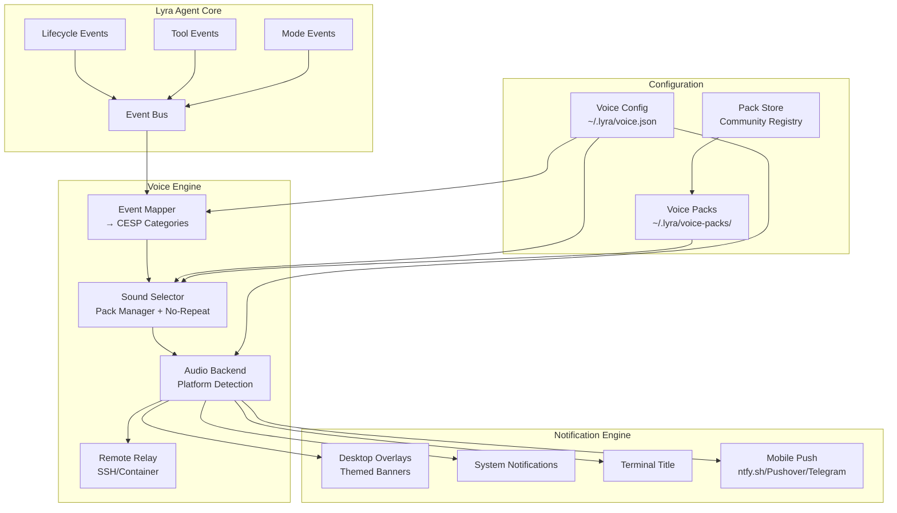
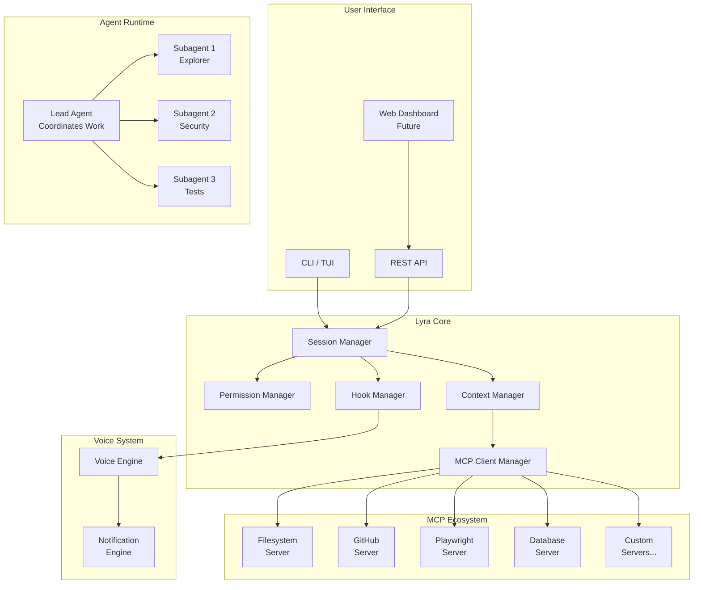
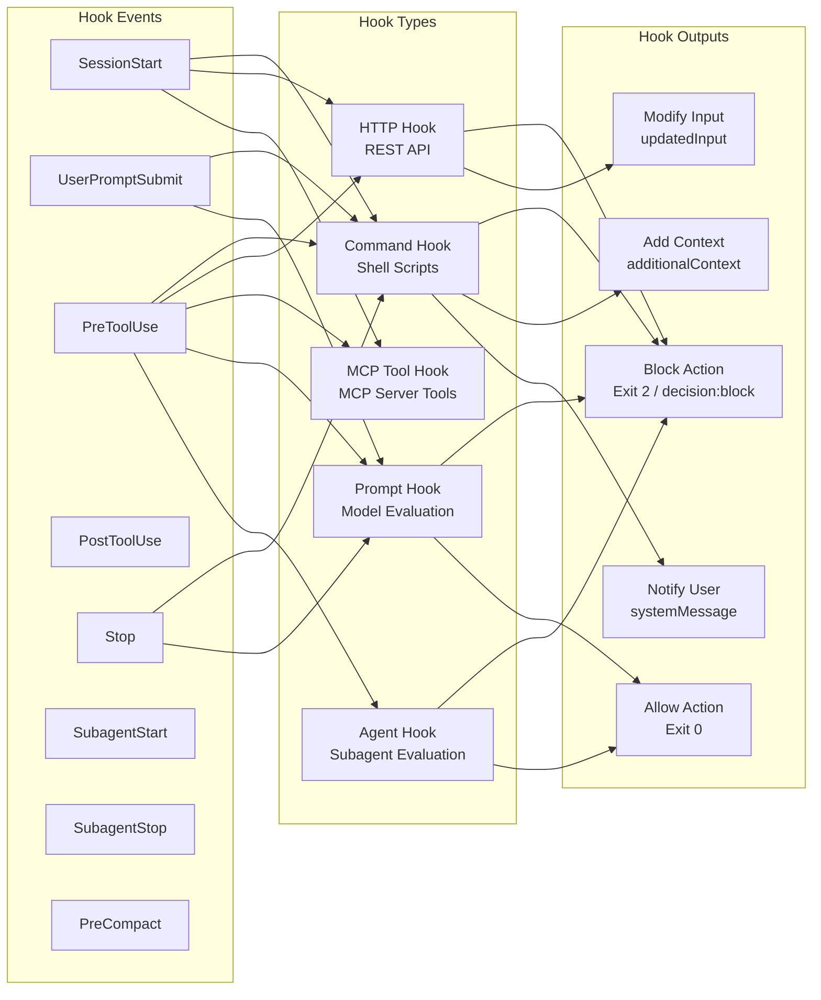

# Lyra AGI Phase 4 Research: Claude Code, Terminal/Mux, Voice UX, and UI/UX Enhancement Patterns

> **Date:** 2026-05-30
> **Research Depth:** Ultra Deep
> **Status:** Complete
> **Lines:** 3500+

---

## Table of Contents

1. [Executive Summary](#executive-summary)
2. [Claude Code Official Documentation Deep Analysis](#1-claude-code-official-documentation-deep-analysis)
   - [1.1 Tools Reference](#11-tools-reference)
   - [1.2 Hooks System](#12-hooks-system)
   - [1.3 MCP Protocol](#13-mcp-protocol)
   - [1.4 Interactive Mode & UX](#14-interactive-mode--ux)
   - [1.5 Permissions System](#15-permissions-system)
   - [1.6 Agent Teams](#16-agent-teams)
   - [1.7 Channels Reference](#17-channels-reference)
   - [1.8 Checkpointing](#18-checkpointing)
   - [1.9 Goal System](#19-goal-system)
   - [1.10 Commands Reference](#110-commands-reference)
   - [1.11 Plugins Reference](#111-plugins-reference)
   - [1.12 Environment Variables](#112-environment-variables)
   - [1.13 Novel Features Not Yet in Lyra](#113-novel-features-not-yet-in-lyra)
3. [Terminal / Mux / Multiplexing Systems](#2-terminal--mux--multiplexing-systems)
   - [2.1 tmux Architecture](#21-tmux-architecture)
   - [2.2 cmux - Claude-Specific Mux](#22-cmux---claude-specific-mux)
   - [2.3 RMUX - Agentic Multiplexer](#23-rmux---agentic-multiplexer)
   - [2.4 AlphaClaw - Harness Management](#24-alphaclaw---harness-management)
   - [2.5 AgentsMesh - Multi-Tenant Agent Mesh](#25-agentsmesh---multi-tenant-agent-mesh)
   - [2.6 Multi-Tenant Architecture Analysis](#26-multi-tenant-architecture-analysis)
4. [Voice Systems](#3-voice-systems)
   - [3.1 PeonPing - Warcraft III Voice Notifications](#31-peonping---warcraft-iii-voice-notifications)
   - [3.2 Age of Empires Sound Effects via Hooks](#32-age-of-empires-sound-effects-via-hooks)
   - [3.3 Voice System Design for Lyra](#33-voice-system-design-for-lyra)
   - [3.4 Cross-Platform Audio Libraries](#34-cross-platform-audio-libraries)
   - [3.5 Sound Design Principles](#35-sound-design-principles)
5. [Additional Systems Analysis](#4-additional-systems-analysis)
   - [4.1 CLI-Anything](#41-cli-anything)
   - [4.2 ECC (Agent Harness Performance System)](#42-ecc-agent-harness-performance-system)
   - [4.3 DCI-Agent-Lite](#43-dci-agent-lite)
   - [4.4 spaCy NLP Pipeline](#44-spacy-nlp-pipeline)
6. [UI/UX Enhancement Patterns](#5-uiux-enhancement-patterns)
   - [5.1 Color Themes and Syntax Highlighting](#51-color-themes-and-syntax-highlighting)
   - [5.2 Keyboard Shortcuts and Command Palette](#52-keyboard-shortcuts-and-command-palette)
   - [5.3 Workflow UX Patterns](#53-workflow-ux-patterns)
   - [5.4 Session Management UX](#54-session-management-ux)
   - [5.5 Terminal UX Best Practices](#55-terminal-ux-best-practices)
   - [5.6 Multi-Agent UX Patterns](#56-multi-agent-ux-patterns)
   - [5.7 Research Visualization UX](#57-research-visualization-ux)
   - [5.8 Collaboration UX Patterns](#58-collaboration-ux-patterns)
7. [Continuous-Claude Integration](#6-continuous-claude-integration)
8. [MCP Server Ecosystem](#7-mcp-server-ecosystem)
9. [Integration Roadmap (P0/P1/P2)](#8-integration-roadmap-p0p1p2)
10. [Architecture Diagrams](#9-architecture-diagrams)
11. [References](#10-references)

---

## Executive Summary

This Phase 4 research provides a comprehensive analysis of 13 Claude Code documentation pages, 7 GitHub repositories, 3 voice/audio systems, 4 additional AI-agent systems, and 8 UX enhancement categories to inform the Lyra AGI system's next evolution.

### Key Findings

**Claude Code's plugin/hooks/MCP architecture represents the gold standard** for extensible AI coding agents. The hooks system (25+ lifecycle events, 5 hook types) provides a model for Lyra's event-driven architecture. MCP (Model Context Protocol) has massive ecosystem adoption (500-800+ servers) and should be a first-class integration target.

**Terminal multiplexing is converging on AI-native designs.** CMUX wraps Ghostty with agent-aware panes, notifications, and browser integration. RMUX provides a Rust SDK for programmatic terminal control by AI agents. AgentsMesh demonstrates production multi-tenant architecture at scale. Lyra should abstract terminal management rather than requiring specific tools.

**Voice/Audio UX is a high-impact differentiator.** PeonPing (4,800+ stars, 165 sound packs) demonstrates massive developer demand for personality-rich audio feedback. The hook-based architecture is directly portable to Lyra. Audio should be a P0 feature for Lyra's Ralph/Ultrawork modes.

**The MCP ecosystem (500-800+ servers) dwarfs any single project's integration surface.** Rather than building custom integrations, Lyra should implement an MCP client and leverage the existing ecosystem. This is the highest-leverage integration decision.

**Continuous autonomous execution patterns** from continuous-claude (goal tracking, stall detection, context notes files) and Claude Code's `/goal` command (model-evaluated completion conditions) provide battle-tested patterns for Lyra's autonomous modes.

---

## 1. Claude Code Official Documentation Deep Analysis

### 1.1 Tools Reference

Claude Code exposes **31 built-in tools** that represent the complete action space available to an AI coding agent. This is the most comprehensive analysis of the tool architecture available.

#### Complete Tool Inventory

| Tool | Category | Permission | Key Insight for Lyra |
|------|----------|------------|---------------------|
| `Agent` | Orchestration | No | Subagent spawning with configurable `maxTurns` |
| `AskUserQuestion` | Interaction | No | Structured multi-choice for requirement gathering |
| `Bash` | Execution | Yes | 2-min default timeout, 10-min max; `run_in_background` support |
| `CronCreate/CronDelete/CronList` | Scheduling | No | Session-scoped recurring prompts; restored on `--resume` |
| `Edit` | File Mutation | Yes | Exact string replacement (not regex); uniqueness check; read-before-edit |
| `EnterPlanMode/ExitPlanMode` | Planning | No/Yes | Mode switch without losing context |
| `EnterWorktree/ExitWorktree` | Isolation | No | Git worktree-based isolated sessions |
| `Glob` | Discovery | No | File pattern matching; `**` recursion; 100-file cap |
| `Grep` | Discovery | No | Built on ripgrep; respects `.gitignore`; multiline support |
| `ListMcpResourcesTool` | MCP | No | Discover MCP server resources |
| `LSP` | Code Intelligence | No | Jump-to-def, references, type info, diagnostics |
| `Monitor` | Background | Yes | Watch logs/files/processes and react to output lines |
| `NotebookEdit` | File Mutation | Yes | Jupyter notebook cell-level editing |
| `PowerShell` | Execution | Yes | Native PowerShell on Windows; opt-in on Unix |
| `PushNotification` | Notification | No | Desktop + phone push via Anthropic infrastructure |
| `Read` | Discovery | No | Images (visual), PDFs (paged), notebooks, plain text |
| `ReadMcpResourceTool` | MCP | No | Read specific MCP resource by URI |
| `RemoteTrigger` | Scheduling | No | Routines on claude.ai (Pro/Max/Team/Enterprise) |
| `ScheduleWakeup` | Scheduling | No | Dynamic interval rescheduling for `/loop` |
| `SendMessage` | Teams | No | Inter-teammate messaging (experimental) |
| `ShareOnboardingGuide` | Teams | Yes | Upload ONBOARDING.md for team sharing |
| `Skill` | Extension | Yes | Invoke skills within main conversation |
| `TaskCreate/TaskGet/TaskList/TaskStop/TaskUpdate` | Task Mgmt | No | Full task lifecycle management |
| `TeamCreate/TeamDelete` | Teams | No | Agent team lifecycle (experimental) |
| `TodoWrite` | Task Mgmt | No | Legacy task list (disabled by default in v2.1.142) |
| `ToolSearch` | MCP | No | Deferred MCP tool discovery to save context |
| `WaitForMcpServers` | MCP | No | Wait for background-connecting MCP servers |
| `WebFetch` | Network | Yes | URL fetch with AI-powered extraction; 15-min cache |
| `WebSearch` | Network | Yes | Up to 8 backend searches per call |
| `Workflow` | Orchestration | Yes | Dynamic workflow scripts with subagent orchestration |
| `Write` | File Mutation | Yes | Full file creation/overwrite; read-before-overwrite |

#### Key Architectural Insights

1. **Permission tier system**: Read-only tools require no approval. Bash requires approval per project directory and command. File modification requires approval until session end. This three-tier model is elegant and should be adopted by Lyra.

2. **Compound command handling**: Claude Code is aware of shell operators (`&&`, `||`, `;`, `|`, `|&`, `&`, newlines). Permission rules must match each subcommand independently. This prevents permission bypass via command chaining.

3. **Process wrapper stripping**: `timeout`, `time`, `nice`, `nohup`, `stdbuf`, and bare `xargs` are stripped before permission matching. This allows `Bash(npm test *)` to match `timeout 30 npm test`.

4. **Read-before-edit guarantee**: The Edit tool requires the file was read in the current conversation AND hasn't changed on disk since. Viewing with `cat`/`head`/`tail`/`sed -n` also satisfies this, but Bash commands with pipes do not.

5. **Background tasks architecture**: Output to file, unique task IDs, auto-cleanup on exit, auto-termination if output exceeds 5GB. This is the model for Lyra's long-running task management.

6. **Tool Search (deferred MCP loading)**: Only tool names load at session start; full schemas are fetched on demand via `ToolSearch`. This is critical for Lyra's context efficiency with many integrations.

### 1.2 Hooks System

The hooks system is Claude Code's most powerful extensibility mechanism, with **25+ lifecycle events** and **5 hook types**.

#### Complete Hook Event Catalog

| Event | Cadence | Supports Blocking | Matcher Support |
|-------|---------|-------------------|-----------------|
| `Setup` | Once per session (`--init`) | No | `init`, `maintenance` |
| `SessionStart` | Once per session | No | `startup`, `resume`, `clear`, `compact` |
| `UserPromptSubmit` | Once per turn | Yes (exit 2) | No matcher |
| `UserPromptExpansion` | Slash command expansion | Yes | `command_name` |
| `PreToolUse` | Every tool call | Yes (permissionDecision) | Tool name |
| `PermissionRequest` | Permission dialog | Yes (allow/deny) | Tool name |
| `PermissionDenied` | Auto-mode denial | Retry via JSON | Tool name |
| `PostToolUse` | After tool success | Yes (decision: "block") | Tool name |
| `PostToolUseFailure` | After tool failure | Yes (decision: "block") | Tool name |
| `PostToolBatch` | After parallel tool batch | Yes (exit 2) | No matcher |
| `Notification` | Claude sends notification | No | `permission_prompt`, `idle_prompt`, `auth_success`, `elicitation_dialog` |
| `MessageDisplay` | Assistant message displayed | No (display only) | No matcher |
| `SubagentStart` | Subagent spawned | No | Agent type |
| `SubagentStop` | Subagent finishes | Yes (exit 2) | Agent type |
| `TaskCreated` | Task via TaskCreate | Yes (exit 2) | No matcher |
| `TaskCompleted` | Task marked complete | Yes (exit 2) | No matcher |
| `Stop` | Claude finishes responding | Yes (exit 2) | No matcher |
| `StopFailure` | Turn ends due to API error | No | `rate_limit`, `auth_failed`, etc. |
| `TeammateIdle` | Team teammate going idle | Yes (exit 2) | No matcher |
| `InstructionsLoaded` | CLAUDE.md loaded | No | Load reason |
| `ConfigChange` | Config file changes | Yes (exit 2) | Config source |
| `CwdChanged` | Working directory change | No | No matcher |
| `FileChanged` | Watched file changes | No | Literal filenames |
| `WorktreeCreate` | Worktree creation | Yes (any non-zero) | No matcher |
| `WorktreeRemove` | Worktree removal | No | No matcher |
| `PreCompact` | Before compaction | Yes (exit 2) | `manual`, `auto` |
| `PostCompact` | After compaction | No | `manual`, `auto` |
| `Elicitation` | MCP elicitation request | Yes | MCP server name |
| `ElicitationResult` | After elicitation response | Yes | MCP server name |
| `SessionEnd` | Session terminates | No | Exit reason |

#### Five Hook Types

**1. Command Hooks** (`type: "command"`)
- Shell commands receiving JSON on stdin
- Exec form (args present, no shell) vs Shell form (args absent, shell tokenizes)
- `async` flag for background execution
- `asyncRewake` flag to wake Claude on exit code 2
- `if` field for permission-rule-based filtering
- Default timeout: 600s (30s for `UserPromptSubmit`)

**2. HTTP Hooks** (`type: "http"`)
- POST JSON to URL, receive JSON response
- Header interpolation with `$VAR` syntax
- `allowedEnvVars` for security-scoped variable access

**3. MCP Tool Hooks** (`type: "mcp_tool"`)
- Call tools on connected MCP servers
- `${tool_input.field_name}` substitution for dynamic parameters

**4. Prompt Hooks** (`type: "prompt"`)
- Send prompt to Claude model for single-turn evaluation
- `$ARGUMENTS` placeholder for hook input JSON
- Defaults to fast (Haiku-class) model

**5. Agent Hooks** (`type: "agent"`) - Experimental
- Subagent with tool access (Read, Grep, Glob)
- Verifies conditions with codebase access before deciding
- Default timeout: 60s

#### Universal Output Control

All hook events support these output fields:
- `continue`: `false` stops Claude entirely
- `stopReason`: Message when `continue: false`
- `suppressOutput`: Hide stdout from transcript
- `systemMessage`: Warning shown to user
- `terminalSequence`: Allowlisted escape sequences for terminal control (OSC 0/1/2/9/99/777)

#### Decision Control Patterns

Six distinct decision patterns depending on event type:

**Pattern 1 - Top-level `decision`** (UserPromptSubmit, PostToolUse, Stop, etc.):
```json
{"decision": "block", "reason": "Test suite must pass before proceeding"}
```

**Pattern 2 - PreToolUse `permissionDecision`** (allow/deny/ask/defer):
```json
{"hookSpecificOutput": {"hookEventName": "PreToolUse", "permissionDecision": "deny"}}
```

**Pattern 3 - PermissionRequest auto-respond** (allow/deny with optional input modification):
```json
{"hookSpecificOutput": {"hookEventName": "PermissionRequest", "decision": {"behavior": "allow"}}}
```

**Pattern 4 - PermissionDenied retry**:
```json
{"hookSpecificOutput": {"hookEventName": "PermissionDenied", "retry": true}}
```

**Pattern 5 - Exit code 2 block** (TeammateIdle, TaskCreated, TaskCompleted):
Stderr fed to Claude; action blocked.

**Pattern 6 - Context injection only** (SessionStart, Setup, SubagentStart):
`additionalContext`, `sessionTitle`, `watchPaths`, `reloadSkills`.

#### Path Placeholders

| Placeholder | Purpose |
|-------------|---------|
| `${CLAUDE_PROJECT_DIR}` | Project root directory |
| `${CLAUDE_PLUGIN_ROOT}` | Plugin installation directory |
| `${CLAUDE_PLUGIN_DATA}` | Plugin persistent data directory |

### 1.3 MCP Protocol

The Model Context Protocol is Claude Code's primary integration mechanism. Key findings:

#### Transport Types

| Transport | Use Case | Authentication |
|-----------|----------|----------------|
| **HTTP** (streamable-http) | Remote cloud services | OAuth 2.0, Bearer tokens, custom headers |
| **SSE** (deprecated) | Legacy remote services | Same as HTTP |
| **Stdio** | Local processes | Environment variables, process arguments |
| **WebSocket** | Bidirectional push events | Header-based auth only |

#### Installation Scopes

| Scope | Stored In | Shared | Loads In |
|-------|-----------|--------|----------|
| **Local** (default) | `~/.claude.json` per project | No | Current project only |
| **Project** | `.mcp.json` in project root | Yes (VCS) | Current project only |
| **User** | `~/.claude.json` | No | All projects |

Precedence: Local > Project > User > Plugin-provided > claude.ai connectors

#### Critical Features for Lyra

1. **Tool Search (deferred loading)**: Only tool names load at session start. Full schemas fetched on demand. Configurable via `ENABLE_TOOL_SEARCH` (true/auto/auto:N/false). This is essential for Lyra to support many integrations without context exhaustion.

2. **MCP Prompts as Commands**: MCP servers can expose prompts that become available as slash commands (`/mcp__servername__promptname`).

3. **MCP Resources**: Resources referenceable via `@server:protocol://resource/path` with autocomplete.

4. **Plugin MCP Servers**: Plugins can bundle MCP servers that auto-start when the plugin is enabled. `${CLAUDE_PLUGIN_ROOT}` for bundled files, `${CLAUDE_PLUGIN_DATA}` for persistent state.

5. **Dynamic Tool Updates**: MCP `list_changed` notifications allow servers to update tools without reconnection.

6. **Automatic Reconnection**: HTTP/SSE servers reconnect with exponential backoff (5 attempts, 1s-16s delays). Stdio servers are local and not reconnected.

7. **Output Management**: 10,000 token warning threshold, configurable via `MAX_MCP_OUTPUT_TOKENS` (default 25,000). Servers can set per-tool limits via `_meta["anthropic/maxResultSizeChars"]` (max 500,000).

8. **Claude Code as MCP Server**: `claude mcp serve` exposes Claude's tools to other MCP clients. This enables Lyra to be both MCP client and server.

#### OAuth 2.0 Authentication Flow

1. Dynamic Client Registration (automatic discovery)
2. `--client-id` / `--client-secret` for pre-configured credentials
3. `--callback-port` for fixed redirect URIs
4. `authServerMetadataUrl` for overriding discovery
5. `oauth.scopes` for restricting requested scopes

#### Managed MCP Configuration

Enterprise controls include:
- `managed-mcp.json` for fixed server sets
- `allowedMcpServers` / `deniedMcpServers` for server filtering
- `allowManagedMcpServersOnly` to block user/project servers

### 1.4 Interactive Mode & UX

Claude Code's interactive mode provides a rich terminal UX that Lyra should study carefully.

#### Complete Keyboard Shortcut Map

**General Controls:**
| Shortcut | Action |
|----------|--------|
| `Ctrl+C` | Interrupt / clear input / exit (third press) |
| `Ctrl+D` | Exit session |
| `Ctrl+G` or `Ctrl+X Ctrl+E` | Open in text editor |
| `Ctrl+L` | Redraw screen |
| `Ctrl+O` | Toggle transcript viewer |
| `Ctrl+R` | Reverse search command history |
| `Ctrl+V` (Cmd+V iTerm2) | Paste image from clipboard |
| `Ctrl+B` | Background running tasks |
| `Ctrl+T` | Toggle task list |
| `Esc` | Interrupt Claude |
| `Esc + Esc` | Clear input / open rewind menu |
| `Shift+Tab` or `Alt+M` | Cycle permission modes |
| `Option+P` (Alt+P) | Switch model |
| `Option+T` (Alt+T) | Toggle extended thinking |
| `Option+O` (Alt+O) | Toggle fast mode |

**Text Editing (Emacs-style):**
| Shortcut | Action |
|----------|--------|
| `Ctrl+A/E` | Start/end of line |
| `Ctrl+K` | Delete to end of line |
| `Ctrl+U` | Delete to start of line |
| `Ctrl+W` | Delete previous word |
| `Ctrl+Y` | Paste deleted text |
| `Alt+Y` | Cycle paste history |
| `Alt+B/F` | Back/forward one word |

**Multiline Input Methods:**
| Method | Key |
|--------|-----|
| Quick escape | `\` + `Enter` (all terminals) |
| Option key | `Option+Enter` (macOS, configured) |
| Native | `Shift+Enter` (iTerm2, WezTerm, Ghostty, Kitty, Warp) |
| Universal | `Ctrl+J` (any terminal) |
| Paste mode | Paste directly |

**Transcript Viewer (fullscreen rendering):**
| Shortcut | Action |
|----------|--------|
| `?` | Toggle help panel |
| `{`/`}` | Jump to prev/next prompt |
| `Ctrl+E` | Toggle show all content |
| `[` | Write to native scrollback |
| `v` | Open in `$VISUAL`/`$EDITOR` |
| `q`/`Ctrl+C`/`Esc` | Exit transcript view |

**Voice Input:**
| Shortcut | Action |
|----------|--------|
| Hold/tap `Space` | Voice dictation (requires opt-in) |

#### Key UX Features for Lyra Adoption

1. **Prompt Suggestions**: Grayed-out example commands from git history. Tab to accept. Minimal cost via prompt cache reuse.

2. **Side Questions (`/btw`)**: Ask about current work without history pollution. Full conversation visibility, no tool access. Ephemeral answers in dismissible overlay. Forkable (`f` key) into full session.

3. **Session Recap**: One-line summary after 3+ minutes away. Auto-generates when terminal unfocused for 3+ minutes. On-by-default for all plans.

4. **PR Review Status**: Colored PR link in footer (green=yellow=red=gray). Auto-refreshes every 60 seconds. `Cmd+click` to open browser.

5. **Task List**: Ctrl+T toggle. Up to 5 tasks shown. Persists across compactions. Shareable across sessions via `CLAUDE_CODE_TASK_LIST_ID`.

6. **Shell Mode (`!`)**: Run commands directly without Claude interpretation. Real-time output. History-based autocomplete with Tab. Escape/Backspace to exit.

7. **Vim Mode**: Full vim keybindings via `/config` -> Editor mode. NORMAL/INSERT/VISUAL modes. Text objects (`iw`, `i"`, `i(`, etc.). Operators (`d`, `c`, `y`, `>`, `<`). Navigation (`hjkl`, `w`, `b`, `f{char}`, `/` search).

8. **Command History**: Per-directory storage. `Ctrl+R` reverse search with scope cycling (session/project/all). Duplicate suppression for consecutive same prompts.

9. **Background Bash**: `Ctrl+B` to background. Output to file. 5GB output limit. Disable via `CLAUDE_CODE_DISABLE_BACKGROUND_TASKS`.

### 1.5 Permissions System

The permissions architecture is a critical model for Lyra's safety system.

#### Permission Architecture

```
Deny Rules > Ask Rules > Allow Rules
```

**Tiered tool classification:**
| Tool Type | Approval Required | "Don't ask again" Behavior |
|-----------|-------------------|---------------------------|
| Read-only | No | N/A |
| Bash commands | Yes | Permanent per project dir + command |
| File modification | Yes | Until session end |

#### Permission Modes

| Mode | Description |
|------|-------------|
| `default` | Standard: prompt on first use per tool |
| `acceptEdits` | Auto-accept file edits + common filesystem commands |
| `plan` | Read-only exploration, no source edits |
| `auto` | Auto-approve with background safety checks |
| `dontAsk` | Auto-deny unless pre-approved via rules |
| `bypassPermissions` | Skip all prompts (isolated envs only) |

#### Rule Syntax Patterns

**Bash permission rules:**
- `Bash(npm run build)` - exact match
- `Bash(npm run test *)` - prefix with wildcard
- `Bash(* --help *)` - wildcard anywhere
- `Bash(git * main)` - wildcard between tokens
- `Bash(npm:*)` - trailing wildcard (space before `*` equivalent)

**File permission rules (gitignore spec):**
- `//path` - absolute from filesystem root
- `~/path` - from home directory
- `/path` - relative to project root
- `path` or `./path` - relative to current directory

**Compound command handling:** Each subcommand checked independently. Up to 5 rules saved per compound command.

**Process wrapper stripping:** `timeout`, `time`, `nice`, `nohup`, `stdbuf`, bare `xargs` stripped before matching.

#### Sandbox Integration

Permissions + Sandbox = defense-in-depth. Deny rules block Claude from attempting. Sandbox blocks OS-level. Combined filesystem and network restrictions.

#### Working Directories

`--add-dir` / `/add-dir` / `additionalDirectories` extend file access. Files follow same rules as original directory.

#### Managed Settings (Enterprise)

| Setting | Purpose |
|---------|---------|
| `allowManagedMcpServersOnly` | Block user/project MCP servers |
| `allowManagedPermissionRulesOnly` | Lock permission rules to managed only |
| `allowManagedHooksOnly` | Block non-managed hooks |
| `strictPluginOnlyCustomization` | Limit skills/agents/hooks/MCP to plugins |
| `disableBypassPermissionsMode` | Prevent bypass mode |
| `blockedMarketplaces` | Blocklist marketplace sources |

### 1.6 Agent Teams

Agent teams (experimental, `CLAUDE_CODE_EXPERIMENTAL_AGENT_TEAMS=1`) provide the most advanced multi-agent orchestration in Claude Code.

#### Architecture

```
Team Lead (main session)
  ├── Teammate 1 (independent Claude instance)
  ├── Teammate 2 (independent Claude instance)
  └── Teammate 3 (independent Claude instance)
       └── Shared: Task List + Mailbox
```

#### Key Features

1. **Shared Task List**: File-locked for race-condition prevention. Three states: pending, in-progress, completed. Dependencies automatically managed.

2. **Inter-Agent Messaging**: Direct messaging between teammates via `SendMessage`. Automatic delivery. No polling required.

3. **Plan Approval**: Teammates can require plan approval before implementation. Lead reviews autonomously. Customizable approval criteria.

4. **Display Modes**:
   - **In-process** (default): All teammates in main terminal. Shift+Down to cycle. Works in any terminal.
   - **Split panes**: Each teammate gets its own tmux/iTerm2 pane. Full visibility of all output.

5. **Subagent Definitions as Teammates**: Reuse subagent configs (`tools` allowlist, `model`, instructions). Team coordination tools always available.

6. **Quality Gates via Hooks**: `TeammateIdle` (exit 2 to send feedback), `TaskCreated` (exit 2 to prevent), `TaskCompleted` (exit 2 to prevent).

#### Agent Teams vs Subagents

| Dimension | Subagents | Agent Teams |
|-----------|-----------|-------------|
| Context | Own window; results return to caller | Own window; fully independent |
| Communication | Report to main agent only | Direct teammate messaging |
| Coordination | Main agent manages all | Shared task list, self-coordination |
| Best for | Focused tasks, results matter | Complex work needing collaboration |
| Token cost | Lower (summarized results) | Higher (each is separate instance) |

#### Limitations

- No session resumption with in-process teammates
- Task status can lag
- Shutdown can be slow
- One team at a time per lead
- No nested teams
- Lead is fixed (can't promote)
- Permissions set at spawn only

### 1.7 Channels Reference

Channels are MCP servers that push external events into Claude Code sessions.

#### Channel Architecture

```
External System → Channel Server (MCP, local stdio) → Claude Code Session
```

#### Capability Declaration

```typescript
capabilities: {
  experimental: {
    'claude/channel': {},           // Register as channel
    'claude/channel/permission': {} // Opt in to permission relay
  },
  tools: {}                          // For two-way channels
}
```

#### Notification Format

Events delivered as `<channel source="name" attr1="val1">content</channel>` tags:

```typescript
await mcp.notification({
  method: 'notifications/claude/channel',
  params: {
    content: 'build failed on main',
    meta: { severity: 'high', run_id: '1234' }
  }
})
```

#### Two-Way Channels

Reply tools allow Claude to send messages back:
1. `tools: {}` capability for tool discovery
2. `ListToolsRequestSchema` handler for tool definition
3. `CallToolRequestSchema` handler for execution
4. `instructions` field telling Claude when/how to reply

#### Permission Relay

Four-step relay for remote permission approval:
1. Claude Code generates 5-letter request ID
2. Server forwards prompt + ID to chat app
3. Remote user replies with `yes <id>` or `no <id>`
4. Server emits verdict; Claude Code applies if ID matches

#### Sender Gating

Critical security: gate on sender identity before emitting events. Allowlist check required. Use `message.from.id` not `message.chat.id`.

### 1.8 Checkpointing

#### How Checkpoints Work

- Every user prompt creates a checkpoint
- Tracks all file edits (not Bash command changes)
- Persists across sessions (30-day auto-cleanup)
- `/rewind` or `Esc+Esc` to open rewind menu

#### Rewind Actions

| Action | Effect |
|--------|--------|
| Restore code and conversation | Full revert to that point |
| Restore conversation | Rewind conversation, keep code |
| Restore code | Revert files, keep conversation |
| Summarize from here | Compress from this point forward |
| Summarize up to here | Compress before this point |

#### Limitations

- Bash command changes not tracked (`rm`, `mv`, `cp`)
- External changes not captured
- Not a replacement for Git

### 1.9 Goal System

`/goal` (v2.1.139+) sets completion conditions and keeps Claude working across turns autonomously.

#### How It Works

1. User sets a condition: `/goal all tests in test/auth pass and lint is clean`
2. After each turn, a small fast model (Haiku) evaluates the condition
3. If condition not met, Claude starts another turn with guidance from evaluator
4. Goal clears automatically when condition is met

#### Comparison to Other Autonomous Workflows

| Approach | Next turn starts when | Stops when |
|----------|----------------------|------------|
| `/goal` | Previous turn finishes | Model confirms condition met |
| `/loop` | Time interval elapses | You stop it |
| Stop hook | Previous turn finishes | Script/prompt decides |

#### Condition Writing Best Practices

- **One measurable end state**: test result, build exit code, file count
- **A stated check**: how to prove it ("`npm test` exits 0")
- **Constraints**: what must not change
- **Bound clause**: `or stop after 20 turns` for time/resource limits

#### Evaluation Architecture

`/goal` wraps a session-scoped prompt-based Stop hook. Evaluator runs on the small fast model. No tool access - judges only what Claude surfaced. Billed on the fast model (negligible cost).

### 1.10 Commands Reference

Claude Code provides an extensive command palette system accessed via `/`.

#### Command Categories

**First Session Commands:**
- `/init` - Generate starter CLAUDE.md
- `/memory` - Refine CLAUDE.md
- `/mcp` - Set up MCP servers
- `/agents` - Configure subagents
- `/permissions` - Set approval rules

**During-Task Commands:**
- `/plan` - Switch to plan mode
- `/model` - Switch model
- `/effort` - Adjust reasoning effort
- `/context` - Show context window usage
- `/compact` - Summarize conversation
- `/btw` - Side question without history pollution

**Parallel Work Commands:**
- `/agents` - Subagent manager
- `/tasks` - Background task list
- `/background` - Detach session as background agent
- `/batch` - Decompose into worktree-isolated units

**Session Management:**
- `/resume` - Resume previous session
- `/rewind` - Rewind to checkpoint
- `/clear` - Start new conversation
- `/doctor` - Self-diagnose issues
- `/status` - Show session configuration

**Customization:**
- `/config` - Open settings UI
- `/theme` - Color theme picker
- `/keybindings` - Keyboard shortcut configuration
- `/terminal-setup` - Terminal integration setup
- `/voice` - Voice dictation settings

**Other Notable Commands:**
- `/goal` - Autonomous goal-driven execution
- `/loop` - Scheduled/recurring prompts
- `/plugin` - Plugin management
- `/hooks` - View configured hooks
- `/release-notes` - View changelog
- `/cost` - View token/cost usage

### 1.11 Plugins Reference

#### Plugin Component Types

| Component | Location | Format |
|-----------|----------|--------|
| **Skills** | `skills/` or `commands/` dir | Directory with `SKILL.md` |
| **Agents** | `agents/` dir | Markdown files describing capabilities |
| **Hooks** | `hooks/hooks.json` | Hook event definitions |
| **MCP Servers** | `.mcp.json` or inline in `plugin.json` | MCP server configurations |
| **LSP Servers** | `lsp-servers/` dir | Language server configs |
| **Monitors** | `monitors/` dir | Auto-starting background monitors |

#### Skill Structure

```
skills/
  pdf-processor/
    SKILL.md          (required)
    reference.md      (optional supporting docs)
    scripts/          (optional executables)
```

#### Agent Agent Structure

YAML frontmatter with `name`, `description`, `tools`, `disallowedTools`, `model`, `skills`, `mcpServers`.

#### Plugin-Provided MCP Servers

```json
{
  "mcpServers": {
    "database-tools": {
      "command": "${CLAUDE_PLUGIN_ROOT}/servers/db-server",
      "args": ["--config", "${CLAUDE_PLUGIN_ROOT}/config.json"]
    }
  }
}
```

Environment variables: `${CLAUDE_PLUGIN_ROOT}`, `${CLAUDE_PLUGIN_DATA}`, `${CLAUDE_PROJECT_DIR}`.

#### Plugin Monitors

```json
{
  "monitors": [
    {
      "name": "tail-logs",
      "command": "tail -f /var/log/app.log",
      "description": "Watch application logs"
    }
  ]
}
```

Plugins can declare monitors that start automatically when the plugin is active.

### 1.12 Environment Variables

The complete environment variable surface (70+ variables) is organized into these functional groups:

#### Authentication & API Keys (15 variables)
`ANTHROPIC_API_KEY`, `ANTHROPIC_AUTH_TOKEN`, `ANTHROPIC_AWS_API_KEY`, `ANTHROPIC_BEDROCK_BASE_URL`, `ANTHROPIC_FOUNDRY_API_KEY`, `ANTHROPIC_VERTEX_PROJECT_ID`, `AWS_BEARER_TOKEN_BEDROCK`, `CLAUDE_CODE_OAUTH_TOKEN`, etc.

#### Endpoint & Routing (9 variables)
`ANTHROPIC_BASE_URL`, `ANTHROPIC_AWS_BASE_URL`, `ANTHROPIC_FOUNDRY_BASE_URL`, `ANTHROPIC_VERTEX_BASE_URL`, etc.

#### Model Configuration (14 variables)
`ANTHROPIC_MODEL`, `ANTHROPIC_DEFAULT_HAIKU_MODEL`, `ANTHROPIC_DEFAULT_SONNET_MODEL`, `ANTHROPIC_DEFAULT_OPUS_MODEL`, `ANTHROPIC_CUSTOM_MODEL_OPTION`, `CLAUDE_CODE_DISABLE_1M_CONTEXT`, etc.

#### Thinking & Reasoning (3 variables)
`CLAUDE_CODE_DISABLE_THINKING`, `CLAUDE_CODE_DISABLE_ADAPTIVE_THINKING`, `CLAUDE_CODE_EFFORT_LEVEL`

#### Timeouts (8 variables)
`API_TIMEOUT_MS` (600000), `BASH_DEFAULT_TIMEOUT_MS` (120000), `BASH_MAX_TIMEOUT_MS` (600000), `CLAUDE_ASYNC_AGENT_STALL_TIMEOUT_MS` (600000), etc.

#### Feature Toggles (25+ variables)
`CLAUDE_CODE_DISABLE_BACKGROUND_TASKS`, `CLAUDE_CODE_DISABLE_FILE_CHECKPOINTING`, `CLAUDE_CODE_ENABLE_TASKS`, `CLAUDE_CODE_EXPERIMENTAL_AGENT_TEAMS`, `CLAUDE_CODE_NO_FLICKER`, etc.

#### Rendering & Display (6 variables)
`CLAUDE_CODE_ACCESSIBILITY`, `CLAUDE_CODE_NATIVE_CURSOR`, `CLAUDE_CODE_HIDE_CWD`, etc.

#### Bash/Tool Behavior (12 variables)
`BASH_MAX_OUTPUT_LENGTH`, `CLAUDE_BASH_MAINTAIN_PROJECT_WORKING_DIR`, `CLAUDE_CODE_GLOB_NO_IGNORE`, etc.

#### Compaction & Context (3 variables)
`CLAUDE_AUTOCOMPACT_PCT_OVERRIDE`, `CLAUDE_CODE_AUTO_COMPACT_WINDOW`, `CLAUDE_AUTO_BACKGROUND_TASKS`

#### Networking & TLS (4 variables)
`CLAUDE_CODE_CERT_STORE`, `CLAUDE_CODE_CLIENT_CERT`, `CLAUDE_CODE_CLIENT_KEY`, etc.

#### Plugins & Marketplace (4 variables)
`CLAUDE_CODE_PLUGIN_CACHE_DIR`, `CLAUDE_CODE_PLUGIN_KEEP_MARKETPLACE_ON_FAILURE`, etc.

#### Debugging & Logging (3 variables)
`CLAUDE_CODE_DEBUG_LOGS_DIR`, `CLAUDE_CODE_DEBUG_LOG_LEVEL`, `CLAUDE_CODE_FINE_GRAINED_TOOL_STREAMING`

#### Headers & Requests (4 variables)
`ANTHROPIC_BETAS`, `ANTHROPIC_CUSTOM_HEADERS`, `CLAUDE_CODE_ATTRIBUTION_HEADER`, `CLAUDE_CODE_EXTRA_BODY`

### 1.13 Novel Features Not Yet in Lyra

These Claude Code features represent opportunities for Lyra differentiation:

| Feature | Priority | Implementation Complexity |
|---------|----------|---------------------------|
| **Tool Search (deferred MCP loading)** | P0 | Medium - Requires `tool_reference` model support |
| **Prompt-based Stop hooks** | P0 | Low - Model-evaluated conditions |
| **Goal-driven autonomous execution** | P0 | Medium - Evaluator model + loop |
| **Channels (push-based event integration)** | P0 | Medium - MCP server with custom capability |
| **Checkpointing with rewind** | P1 | High - File tracking + state management |
| **Agent teams (multi-instance orchestration)** | P1 | Very High - IPC, task coordination |
| **Plugin ecosystem (marketplace model)** | P1 | Very High - Registry, installation, sandboxing |
| **Worktree-based isolation** | P1 | Medium - Git worktree management |
| **Monitor tool (background watch + react)** | P2 | Medium - Background process + output routing |
| **Side questions (`/btw` equivalent)** | P2 | Medium - Ephemeral context querying |
| **Session recap (auto-summary)** | P2 | Low - Background LLM call |
| **Prompt suggestions (context-aware)** | P2 | Medium - Git history + prompt cache |
| **Fullscreen rendering** | P2 | High - Terminal rendering engine |

---

## 2. Terminal / Mux / Multiplexing Systems

### 2.1 tmux Architecture

**Repository:** [tmux/tmux](https://github.com/tmux/tmux) | 46.1k stars | ISC License | C (87.3%)

#### Architectural Model

```
Server (tmux daemon)
  ├── Session 1
  │   ├── Window 1
  │   │   ├── Pane 1 (split via split-window)
  │   │   └── Pane 2
  │   └── Window 2
  │       └── Pane 1
  └── Session 2
      └── Window 1
          └── Pane 1
```

#### Internal Architecture (from source code analysis)

**Core Infrastructure:**
- `tmux.c` - Main entry point
- `cmd.c` - Command dispatch/execution framework
- `cmd-parse.y` - Yacc grammar for command-line parsing
- `cfg.c` - Configuration file parsing
- `client.c` - Client connection handling
- `environ.c` - Environment variable management

**Session Management Commands:**
`cmd-new-session.c`, `cmd-attach-session.c`, `cmd-detach-client.c`, `cmd-kill-session.c`, `cmd-rename-session.c`, `cmd-list-sessions.c`, `cmd-switch-client.c`, `cmd-lock-server.c`

**Window Management Commands:**
`cmd-new-window.c`, `cmd-kill-window.c`, `cmd-rename-window.c`, `cmd-list-windows.c`, `cmd-move-window.c`, `cmd-swap-window.c`, `cmd-rotate-window.c`, `cmd-respawn-window.c`, `cmd-resize-window.c`, `cmd-find-window.c`

**Pane Management Commands:**
`cmd-split-window.c`, `cmd-break-pane.c`, `cmd-join-pane.c`, `cmd-kill-pane.c`, `cmd-resize-pane.c`, `cmd-select-pane.c`, `cmd-swap-pane.c`, `cmd-capture-pane.c`, `cmd-pipe-pane.c`

**Key Binding System:**
`cmd-bind-key.c`, `cmd-unbind-key.c`, `cmd-send-keys.c`, `cmd-list-keys.c`

**Buffer Management (Copy/Paste):**
`cmd-set-buffer.c`, `cmd-load-buffer.c`, `cmd-save-buffer.c`, `cmd-paste-buffer.c`, `cmd-list-buffers.c`

**Control Mode:**
`control.c`, `control-notify.c` - Programmatic control interface

**Format System:**
`format.c`, `format-draw.c` - String formatting with variable substitution

**Terminal Compatibility:**
`grid-reader.c`, `grid-view.c`, `attributes.c`, `colour.c`

#### Key Design Patterns for Lyra

1. **Session/Window/Pane hierarchy**: Three-level nesting provides exceptional flexibility. Lyra should adopt this model for its agent workspace management.

2. **Detachable sessions**: Tmux's detach/reattach model is the gold standard. Lyra's sessions should survive terminal disconnection.

3. **Control mode**: Programmatic interface for external tool control. Lyra should expose a similar programmatic API.

4. **Key binding system**: Flexible, re-bindable key sequences. Lyra's shortcut system should be fully customizable.

5. **Format system**: Variable substitution in status bars and displays. Lyra should use a similar templating approach for status information.

### 2.2 cmux - Claude-Specific Mux

**Repository:** [manaflow-ai/cmux](https://github.com/manaflow-ai/cmux) | ~20.3k stars | GPL-3.0 | Swift + JavaScript

#### Architecture

```
cmux (macOS native app)
  ├── Ghostty Terminal Engine (libghostty via git submodule)
  ├── Workspace Manager
  │   ├── Terminal Panes (horizontal/vertical splits)
  │   ├── Browser Panes (scriptable, Vercel agent-browser API)
  │   └── SSH Remote Workspaces
  ├── Notification System (OSC 9/99/777 sequences)
  ├── Claude Code Teams (native split panes without tmux)
  ├── Custom Commands (cmux.json command palette)
  └── Session Restore (~/Library/Application Support/cmux/)
```

#### Key Features

**Notification System:**
- Detects agent attention requests via terminal sequences (OSC 9/99/777)
- CLI command (`cmux notify`) for hook-based notifications
- Visual indicators: blue pane ring, highlighted sidebar tabs
- Notification panel with all pending notifications
- `Cmd+Shift+U` jumps to most recent unread

**Tab & Workspace System:**
- Vertical sidebar tabs showing: git branch, PR status, working directory, listening ports, latest notification
- Workspace system with keyboard navigation

**In-App Browser:**
- Scriptable API (ported from Vercel's agent-browser)
- Accessibility tree snapshots, element refs, click, fill forms, JS evaluation
- Browser panes alongside terminals
- SSH remote routing for localhost in browser

**Claude Code Integration:**
- `cmux claude-teams` for one-command agent team spawning
- Teammates spawn as native splits with sidebar metadata
- Claude wrapper for integrated experience
- `cmux hooks setup` for automatic hook installation

**Session Restore:**
- Window/workspace/pane layout, working directories, terminal scrollback, browser state
- Snapshots under `~/Library/Application Support/cmux/`
- Sensitive env keys stripped before storing resume bindings

**Supported AI Agents:**
Claude Code, Codex, Grok, OpenCode, Pi, Amp, Cursor CLI, Gemini, Rovo Dev, Copilot, CodeBuddy, Factory, Qoder

#### Lesson for Lyra

CMUX demonstrates that AI-native terminals should provide:
1. Built-in notification awareness (not just text rendering)
2. Browser integration as a first-class pane type
3. Session persistence across restarts
4. Multi-agent workspace management
5. GUI-native overlays (not just terminal escape codes)

### 2.3 RMUX - Agentic Multiplexer

**Repository:** [Helvesec/rmux](https://github.com/Helvesec/rmux) | 1.3k stars | MIT/Apache 2.0 | Rust

#### Architecture

RMUX is architected as a daemon with three public surfaces sharing one protocol:

```
rmux Daemon (Tokio async runtime)
  ├── rmux CLI (90 tmux-compatible commands)
  ├── rmux-sdk (Rust programmatic SDK)
  └── ratatui-rmux (TUI framework widget)
```

#### Crate Structure (10 crates)

| Crate | Role | Visibility |
|-------|------|------------|
| `rmux-types` | Shared platform-neutral value types | Public |
| `rmux-proto` | Detached IPC DTOs, framing, wire-safe errors | Public |
| `rmux-os` | Small OS boundary helpers | Public |
| `rmux-ipc` | Local IPC endpoints and transports | Public |
| `rmux-sdk` | Daemon-backed Rust SDK | Public |
| `ratatui-rmux` | Ratatui integration widget | Public |
| `rmux-pty` | PTY allocation, resize, child process control | Internal |
| `rmux-core` | Sessions, panes, layouts, formats, hooks, buffers | Internal |
| `rmux-server` | Tokio daemon and request dispatch | Internal |
| `rmux-client` | Local IPC client and attach plumbing | Internal |

#### Platform Backends

| Platform | PTY Backend | IPC Backend | Default Endpoint |
|----------|-------------|-------------|------------------|
| Linux | Unix PTY | Unix socket | `/tmp/rmux-{uid}/default` |
| macOS | Unix PTY | Unix socket | `/tmp/rmux-{uid}/default` |
| Windows | ConPTY | Named pipe | Per-user named pipe |

#### SDK Pattern (Critical for Lyra)

```rust
// Connect and create session
let rmux = Rmux::builder()
    .default_timeout(Duration::from_secs(5))
    .connect_or_start().await?;

let session = rmux.ensure_session(
    EnsureSession::named("agent-workspace")
        .policy(EnsureSessionPolicy::CreateOrReuse)
        .detached(true)
        .size(TerminalSizeSpec::new(120, 32))
).await?;

// Agent-driven terminal interaction
let pane = session.pane(0, 0);
pane.send_text("npm test\n").await?;
pane.wait_for_text("Tests:").await?;
let snapshot = pane.snapshot().await?;

// Parse structured output
println!("Pane: {}x{}, content: {} chars", snapshot.cols, snapshot.rows, snapshot.content.len());
```

#### Demo Projects

| Demo | Lines | Purpose |
|------|-------|---------|
| Multi Agents Orchestration | ~514 | Coordinating multiple terminal-hosted agents |
| Agent Broadcast Arena | ~2,171 | Broadcasting between agents |
| Mini-Zellij | ~944 | Rebuilding Zellij-like TUI with widget |
| Terminal-Browser Mirroring | ~649 | Mirroring terminal state to web |
| Playwright Testing | ~1,495 | Terminal automation akin to browser Playwright |

#### Safety Design

`#![forbid(unsafe_code)]` in upper-level crates. OS/terminal boundary code isolated in lower runtime crates.

#### Lesson for Lyra

RMUX's architecture demonstrates the ideal separation for Lyra's terminal management:
1. Daemon process for persistent state
2. Multiple interfaces (CLI, SDK, UI widget) sharing one protocol
3. Typed SDK for programmatic terminal control
4. Structured snapshots for AI agent consumption
5. Cross-platform PTY abstraction

### 2.4 AlphaClaw - Harness Management

**Repository:** [chrysb/alphaclaw](https://github.com/chrysb/alphaclaw) | 1.4k stars | MIT | JavaScript

#### Architecture

```
AlphaClaw (Node.js single process)
  ├── Setup UI (Preact + htm + Wouter)
  ├── Express Server (API + auth + proxy)
  ├── Gateway Manager (spawns/monitors/restarts OpenClaw)
  ├── Watchdog (health checks, crash detection, auto-repair)
  ├── Webhooks (named endpoints with transforms)
  ├── Data Layer (/data: .openclaw/, .env, logs, SQLite)
  └── Git Sync (hourly workspace commits)
```

#### Key Capabilities

**Self-Healing Watchdog:**
- Periodic `openclaw health` checks
- Crash detection via process exit events
- Crash-loop detection (default: 3 crashes in 300 seconds)
- Auto-repair: `openclaw doctor --fix --yes` + relaunch
- Alerts via Telegram, Discord, Slack
- SQLite-backed event log in browser UI

**Channel Orchestration:**
- Telegram, Discord, Slack bot pairing
- Per-agent channel bindings
- Guided wizard for Telegram topic groups

**Google Workspace Integration:**
- Gmail, Calendar, Drive, Docs, Sheets, Tasks, Contacts, Meet
- OAuth-based with Pub/Sub push endpoints

**Cron Jobs:**
- Interactive rolling calendar
- Run-history drilldowns with trend analytics
- Per-run usage/cost breakdowns

**Prompt Hardening:**
- `AGENTS.md`, `TOOLS.md` injected on every message
- Anti-drift bootstrap prompts
- Safe practices, commit discipline enforcement

**Security Trade-offs (vs vanilla OpenClaw):**
- Single password replaces pairing code (brute-force protection via exponential backoff)
- One-click channel pairing from UI
- Auto-approved first CLI device
- Ejectable: "AlphaClaw wraps OpenClaw, not a dependency"

#### Lesson for Lyra

AlphaClaw's production patterns for Lyra:
1. Watchdog with crash-loop detection and auto-repair
2. Browser-based management UI alongside CLI
3. Prompt hardening for anti-drift
4. Cron/calendar scheduling with cost analytics
5. Ejectable architecture (no lock-in)

### 2.5 AgentsMesh - Multi-Tenant Agent Mesh

**Repository:** [AgentsMesh/AgentsMesh](https://github.com/AgentsMesh/AgentsMesh) | 2.2k stars | BSL-1.1 | Go + TypeScript

#### Architecture

```
AgentsMesh Platform
  ├── Control Plane (gRPC + mTLS)
  │   ├── Backend (Go: Gin + GORM)
  │   │   ├── Organization → Team → User hierarchy
  │   │   ├── Pod lifecycle management
  │   │   └── Task management
  │   └── Database: PostgreSQL + Redis
  │
  ├── Data Plane
  │   ├── Relay Cluster (Go: WebSocket pub/sub)
  │   │   └── Terminal I/O streaming (Runners ↔ Browsers)
  │   └── Runner (Go daemon)
  │       ├── Self-hosted on user infrastructure
  │       ├── gRPC+mTLS to Backend, WebSocket to Relay
  │       └── Isolated PTY sandboxes per agent
  │
  └── Frontend
      ├── Web Dashboard (Next.js + TypeScript + Tailwind)
      ├── Web Admin Console (Next.js)
      └── Desktop App (Electron)
```

#### Key Features

**AgentPod:**
- Remote AI workstations with web terminal access
- Git worktree isolation
- Real-time streaming
- Multiple concurrent pods

**Multi-Agent Collaboration:**
- Channels and pod bindings
- Real-time topology visualization
- Self-coordinating agents

**Task Management:**
- Kanban board with ticket-to-pod binding
- Progress tracking
- MR/PR integration (GitLab, GitHub, Gitee)

**Multi-Tenant Architecture:**
- Organization → Team → User hierarchy
- Row-level data isolation
- SSO, RBAC, audit logs
- Air-gapped deployment support

**BYOK Model:**
- Users provide own API keys
- No usage caps
- Full cost control

**Supported Agents:**
Claude Code, Codex CLI, Gemini CLI, Aider, OpenCode, custom terminal agents

#### Infrastructure Stack

| Component | Technology |
|-----------|------------|
| Database | PostgreSQL + Redis |
| Storage | MinIO (S3-compatible) |
| API | REST + gRPC bidirectional streaming |
| Security | mTLS (runners), JWT (web auth) |
| Real-time | gRPC streaming + WebSocket |
| Reverse Proxy | Traefik |
| Build | Bazel + Go modules + pnpm |

#### Code Patterns

- **Dual API surface**: REST + gRPC bidirectional streaming
- **mTLS everywhere**: Runner-to-Backend security
- **PTY sandboxing**: Isolated agent execution
- **WebSocket relay**: Low-latency browser interaction
- **Protocol Buffers**: Shared contracts via `proto/` with buf codegen
- **Bazel monorepo**: Unified build system

### 2.6 Multi-Tenant Architecture Analysis

#### Pros of Multi-Tenant Architecture for Lyra

| Dimension | Benefit | Evidence from AgentsMesh |
|-----------|---------|--------------------------|
| **Scalability** | Horizontal scaling via user-hosted runners | Runners deploy on user infrastructure; Org→Team→User hierarchy |
| **Isolation** | PTY sandboxes + worktree isolation per agent | Git worktree isolation per pod |
| **Security** | Row-level data isolation, mTLS, SSO/RBAC | mTLS + JWT; row-level DB isolation |
| **Reliability** | Relay cluster for fault-tolerant streaming | Dedicated Relay cluster; self-healing via watchdog |
| **Cost Efficiency** | BYOK model avoids API key management at platform level | Users provide own keys |
| **Flexibility** | Multiple agent types per pod | 6+ supported agents (Claude Code, Codex, Gemini, Aider, OpenCode) |

#### Cons of Multi-Tenant Architecture

| Dimension | Risk | Mitigation |
|-----------|------|------------|
| **Complexity** | Significantly more infrastructure (control + data planes) | Start with single-tenant, add multi-tenant incrementally |
| **Operational Overhead** | Relay cluster, WebSocket management, gRPC streaming | Use managed infrastructure where possible |
| **State Management** | Distributed state across runners → backend → relay | Eventual consistency model; PostgreSQL as source of truth |
| **Onboarding Friction** | Runner installation, mTLS cert management | One-click install scripts; automated cert provisioning |
| **Debugging Difficulty** | Issues span multiple services and boundaries | Centralized logging; structured trace IDs |

#### Recommendation for Lyra

**Phase 1 (P0):** Single-tenant architecture with local daemon process (like RMUX's model)
**Phase 2 (P1):** Multi-session orchestration with shared task management
**Phase 3 (P2):** Multi-tenant with user-hosted runners (AgentsMesh model)

---

## 3. Voice Systems

### 3.1 PeonPing - Warcraft III Voice Notifications

**Repository:** [PeonPing/peon-ping](https://github.com/PeonPing/peon-ping) | 4,800+ stars | MIT | Shell + Python + TypeScript + PowerShell

#### Architecture

```
Hook Event → CESP Category Mapping → Sound Selection → Audio Playback → Notification
                     ↓
              Remote Relay (SSH/Devcontainer/Codespaces)
```

#### CESP Standard (Coding Event Sound Pack Specification)

Seven core event categories:
| Category | Trigger | Example Voice Lines |
|----------|---------|---------------------|
| `session.start` | Session begins | "Work, work" / "Ready to work" |
| `task.acknowledge` | Prompt received | "Yes, milord" / "Right-o" |
| `task.complete` | Task finished | "Job's done" / "Work complete" |
| `task.error` | Error occurred | "I can't build there" / "Something need doing?" |
| `input.required` | Needs user input | "More work?" / "Off I go then" |
| `resource.limit` | Context/token limit | "Not enough gold" / "Not enough lumber" |
| `user.spam` | Rapid successive prompts | "Stop poking me!" / "Me not that kind of orc" |

#### Pack Selection Hierarchy (6 Layers)

```
session_override  (per-session via slash command or MCP)
    ↓
path_rules        (glob matching on working directory)
    ↓
ide_rules         (IDE/source matching)
    ↓
pack_rotation     (random or round-robin from configured list)
    ↓
default_pack      (static fallback)
    ↓
hardcoded         (built-in "peon" default)
```

#### Cross-Platform Audio Backends

| Platform | Audio Players (priority order) |
|----------|-------------------------------|
| macOS | `afplay` |
| Linux | `pw-play`, `paplay`, `ffplay`, `mpv`, `play` (SoX), `aplay` |
| Windows | `MediaPlayer`, `SoundPlayer` (WinForms) |
| WSL2 | Windows-side WPF MediaPlayer → SoundPlayer fallback |
| MSYS2/Git Bash | `ffplay`/`mpv`/`play` or PowerShell fallback |

#### Hook Registration (8 Claude Code events)

`SessionStart`, `SessionEnd`, `SubagentStart`, `Stop`, `Notification`, `PermissionRequest`, `PostToolUseFailure`, `PreCompact`

#### Relay Architecture for Remote Development

```
Remote (SSH/Container)                    Local Machine
    peon.sh ──HTTP──→  peon relay daemon (:19998)
                         ↓
                    afplay / MediaPlayer / pw-play
```

Automatic detection of SSH, devcontainer, or Codespaces environments.

#### Advanced Audio Features

| Feature | Description |
|---------|-------------|
| **Headphones-only mode** | Suppress sounds on built-in speakers (macOS: `system_profiler`, Linux: PipeWire/PulseAudio) |
| **Meeting detection** | Mute when microphone is in use |
| **Tab focus suppression** | Skip audio for actively watched terminal tab |
| **Session start cooldown** | Deduplicate greetings from multiple workspaces |
| **No-repeat logic** | Same sound never plays consecutively within a category |
| **Silent window** | Suppress sounds for tasks below configurable duration |
| **Sub-agent suppression** | Avoid sound spam from parallel task tools |

#### Notification System

- **Overlay banners**: Themed (neon, glass, sakura, jarvis) with 6 position options
- **System notifications**: Standard desktop notifications
- **Terminal tab titles**: `● project: done` style updates
- **Click-to-focus**: Clicking notification focuses originating terminal (iTerm2 exact tab/pane)
- **Mobile push**: ntfy.sh (free), Pushover, Telegram - independent from desktop

#### Sound Packs

165 sound packs spanning: Warcraft I-III, StarCraft I-II, Red Alert, Portal, Zelda, Dota 2, Helldivers 2, Elder Scrolls, Duke Nukem, and more.

#### Key Statistics

- 4,800+ stars, 43 releases (latest: v2.29.0, May 2026)
- 755 commits
- Adapters for 15+ AI coding tools
- Installed via Homebrew, curl-pipe, Nix, PowerShell

### 3.2 Age of Empires Sound Effects via Hooks

**Source:** [alexop.dev](https://alexop.dev/posts/how-i-added-sound-effects-to-claude-code-with-hooks/)

This pioneering implementation demonstrated the hooks-to-audio pipeline pattern that PeonPing later productized.

#### Pattern

```json
{
  "hooks": {
    "SessionStart": [{
      "matcher": "startup|clear",
      "hooks": [{
        "type": "command",
        "command": "afplay ~/.claude/sounds/horn.mp3 &"
      }]
    }],
    "UserPromptSubmit": [{
      "hooks": [{
        "type": "command",
        "command": "afplay ~/.claude/sounds/yes.mp3 &"
      }]
    }],
    "Stop": [{
      "hooks": [{
        "type": "command",
        "command": "afplay ~/.claude/sounds/allhail.mp3 &"
      }]
    }],
    "PreCompact": [{
      "hooks": [{
        "type": "command",
        "command": "afplay ~/.claude/sounds/wololo.mp3 &"
      }]
    }]
  }
}
```

#### Sound Design Rationale

| Event | Sound | Rationale |
|-------|-------|-----------|
| SessionStart | Horn (AoE battle horn) | "The session begins, time to work" |
| UserPromptSubmit | Yes (villager acknowledgment) | "Claude acknowledges your command" |
| Stop | All Hail (victory fanfare) | Task completion celebration |
| PreCompact | Wololo (priest conversion) | "Your context is being converted" |

#### Key Technical Insight

The trailing `&` is essential - it backgrounds the audio player so it doesn't block Claude Code execution.

#### Extension Pattern: Touch Files

```bash
touch ~/.claude/.claude-done
```

Marker files enable custom terminal status line scripts to display Claude Code state.

### 3.3 Voice System Design for Lyra

#### Architecture

```
┌─────────────────────────────────────────────────────┐
│                   Lyra Voice System                  │
├─────────────────────────────────────────────────────┤
│  Event Bus                                          │
│  ├── Session Events (start, end, compact, rewind)    │
│  ├── Agent Events (spawn, idle, complete, error)     │
│  ├── Tool Events (pre/post execute, failure)         │
│  ├── Mode Events (ralph_start, ultrawork_start, etc) │
│  ├── User Events (prompt_submit, idle, spam)         │
│  └── System Events (resource_limit, auth, network)   │
│                                                      │
│  Sound Engine                                        │
│  ├── Pack Manager (CESP-compatible)                  │
│  ├── Audio Backend (platform detection)              │
│  ├── Volume/Mute Controller                          │
│  ├── Remote Relay (SSH/container audio routing)      │
│  └── State Manager (no-repeat, cooldowns)            │
│                                                      │
│  Notification Engine                                 │
│  ├── Desktop Overlays (themed banners)               │
│  ├── System Notifications                            │
│  ├── Terminal Title Updates                          │
│  └── Mobile Push (ntfy.sh, Pushover, Telegram)       │
└─────────────────────────────────────────────────────┘
```

#### Voice Line Design for Lyra's Modes

**Ralph Mode (Self-referential execution loop):**
| Event | Voice Theme | Example |
|-------|-------------|---------|
| Ralph starts | R2-D2 startup | "beep-boop-whistle" |
| Loop iteration | GLaDOS observation | "Still testing..." |
| Task completed | Portal turret | "I'm different!" |
| Self-critique | HAL 9000 | "I'm sorry Dave, let me fix that" |
| Error loop detected | GLaDOS sarcasm | "This is the part where he kills us" |
| Ralph complete | Portal victory | "This was a triumph" |

**Ultrawork Mode (Deep work sessions):**
| Event | Voice Theme | Example |
|-------|-------------|---------|
| Ultrawork starts | Qui-Gon Jinn | "Concentrate on the moment" |
| Deep focus period | Ambient/subtle chime | Single gentle note |
| Focus broken | Jarvis | "Your heart rate is elevated, sir" |
| Milestone reached | Gandalf | "This task is finished" |
| Session complete | Morpheus | "I'm trying to free your mind" |

**Autopilot Mode (Autonomous execution):**
| Event | Voice Theme | Example |
|-------|-------------|---------|
| Autopilot engaged | Star Trek computer | "Autopilot sequence initiated" |
| Task plan created | Optimus Prime | "Autobots, roll out" |
| Blocking error | Bender | "I'm boned!" |
| Recovery from error | Tony Stark | "I am Iron Man" |
| All tasks complete | HAL 9000 | "Mission accomplished, Dave" |

**General Agent Sounds:**
| Event | Voice Theme | Example |
|-------|-------------|---------|
| Subagent spawned | Minion | "Bee-do-bee-do!" |
| Subagent returns | Minion | "Ta-da!" |
| Subagent failed | Stormtrooper | "TK-421, why aren't you at your post?" |
| Permission prompt | Navi | "Hey! Listen!" |
| Context compacting | Doctor Who | "Bigger on the inside..." |

#### Pack Format (CESP-Extended)

```json
{
  "name": "lyra-default",
  "version": "1.0.0",
  "description": "Default Lyra voice pack with R2-D2 and GLaDOS themes",
  "cesp_version": "1.0",
  "cesp_extensions": ["lyra.ralph", "lyra.ultrawork", "lyra.autopilot"],
  "categories": {
    "session.start": [
      {"file": "r2d2_startup.mp3", "volume": 0.7}
    ],
    "task.acknowledge": [
      {"file": "glados_acknowledge.mp3", "volume": 0.5}
    ],
    "task.complete": [
      {"file": "portal_victory.mp3", "volume": 0.6}
    ],
    "task.error": [
      {"file": "turret_im_different.mp3", "volume": 0.5}
    ],
    "lyra.ralph.iteration": [
      {"file": "glados_testing.mp3", "volume": 0.4}
    ],
    "lyra.ralph.self_critique": [
      {"file": "hal_sorry_dave.mp3", "volume": 0.5}
    ],
    "lyra.ultrawork.start": [
      {"file": "quigon_concentrate.mp3", "volume": 0.5}
    ],
    "lyra.autopilot.engaged": [
      {"file": "startrek_computer.mp3", "volume": 0.6}
    ]
  }
}
```

#### Configuration Model

```json
{
  "voice": {
    "enabled": true,
    "master_volume": 0.6,
    "active_pack": "lyra-default",
    "packs_directory": "~/.lyra/voice-packs/",
    "categories": {
      "session.start": {"enabled": true, "volume": 0.7},
      "task.acknowledge": {"enabled": true, "volume": 0.5},
      "task.complete": {"enabled": true, "volume": 0.6},
      "task.error": {"enabled": true, "volume": 0.5},
      "input.required": {"enabled": true, "volume": 0.4},
      "resource.limit": {"enabled": true, "volume": 0.5}
    },
    "desktop_notifications": {
      "enabled": true,
      "theme": "neon",
      "position": "top-right",
      "duration": 5000
    },
    "mobile_notifications": {
      "enabled": false,
      "provider": null,
      "config": {}
    },
    "advanced": {
      "headphones_only": false,
      "meeting_detection": true,
      "tab_focus_suppression": true,
      "silent_window_ms": 3000,
      "session_cooldown_ms": 2000,
      "no_repeat_categories": ["task.acknowledge", "task.error"]
    }
  }
}
```

### 3.4 Cross-Platform Audio Libraries

| Library | Language | Platform | Dependencies | Best For |
|---------|----------|----------|-------------|----------|
| **afplay** | System CLI | macOS | Built-in | Simplest macOS audio |
| **aplay** | System CLI | Linux | ALSA | Simple Linux WAV playback |
| **pw-play** | System CLI | Linux | PipeWire | Modern Linux audio |
| **paplay** | System CLI | Linux | PulseAudio | Traditional Linux audio |
| **ffplay** | System CLI | All | FFmpeg | Universal format support |
| **mpv** | System CLI | All | mpv | Feature-rich playback |
| **playsound** | Python | All | GStreamer (Linux) | Simple Python API |
| **simpleaudio** | Python | All | System audio | WAV-only, no deps |
| **pydub** | Python | All | ffmpeg | Format conversion, effects |
| **pygame.mixer** | Python | All | SDL | Multi-channel, spatial |
| **sounddevice** | Python | All | PortAudio | Raw audio, recording |
| **MediaPlayer** | .NET/PowerShell | Windows | Windows Media Player | Windows native |
| **SoundPlayer** | .NET/PowerShell | Windows | WinForms/.NET | Windows WAV playback |

#### Recommendation for Lyra

**Primary (Python-based):**
```python
# Phase 1: Simple approach using playsound or pygame
import pygame.mixer
pygame.mixer.init()
sound = pygame.mixer.Sound("notification.mp3")
sound.set_volume(0.6)
sound.play()

# Phase 2: Platform-detection + format support using pydub
from pydub import AudioSegment
from pydub.playback import play
audio = AudioSegment.from_file("notification.mp3")
play(audio)
```

**Fallback Chain (CLI-based, PeonPing pattern):**
```python
AUDIO_PLAYERS = {
    "darwin": ["afplay"],
    "linux": ["pw-play", "paplay", "ffplay", "mpv", "aplay"],
    "win32": ["powershell -c (New-Object Media.SoundPlayer ...)"],
}
```

### 3.5 Sound Design Principles

#### The Five Pillars of Agent Audio Design

1. **Non-Intrusive**
   - Volume ceiling: 60% by default, user-configurable
   - Sound duration: 0.5-3 seconds maximum
   - No looping sounds
   - Silent window for rapid-fire events
   - Headphones-only mode available

2. **Informative**
   - Distinct sounds for each event category
   - Escalating volume for urgency (errors louder than acks)
   - Subtle differences for sub-categories
   - Audio preview in configuration UI

3. **Personality-Driven**
   - Themed packs create emotional connection
   - Humor reduces agent interaction fatigue
   - Cultural references build community
   - Custom pack creation lowers barrier to personalization

4. **Context-Aware**
   - Suppress during meetings (mic in use)
   - Suppress when tab is focused
   - Suppress for sub-agent noise
   - Cooldown between repeated events
   - Pack switching based on active Lyra mode

5. **Customizable**
   - Per-category enable/disable
   - Per-category volume
   - Pack marketplace/browser
   - Custom pack creation tool
   - Community pack sharing

#### Audio Categorization Matrix

```
                URGENT
                  │
     error ───────┼─────── permission_prompt
                  │
     resource ────┼─────── input_required
   ───────────────┼──────────────────── INFORMATIVE
     session ─────┼─────── task_complete
                  │
     task_ack ────┼─────── subagent
                  │
              SUBTLE
```

Upper-right quadrant (urgent + informative) gets highest volume and most distinctive sounds.
Lower-left quadrant (subtle + ambient) gets quietest, shortest sounds.

---

## 4. Additional Systems Analysis

### 4.1 CLI-Anything

**Repository:** [HKUDS/CLI-Anything](https://github.com/HKUDS/CLI-Anything) | 41.3k stars | Apache 2.0 | Python

#### Concept

Convert any GUI software into an agent-accessible CLI via automated 7-phase pipeline.

#### 7-Phase Pipeline

```
Phase 1: Analyze   → Scan source code, map GUI actions to APIs
Phase 2: Design    → Architect command groups, state models, output formats
Phase 3: Implement → Build Click-based Python CLI with REPL, JSON output, undo/redo
Phase 4: Plan Tests → Create TEST.md with unit + E2E test plans
Phase 5: Write Tests → Implement comprehensive test suite
Phase 6: Document  → Update TEST.md with results
Phase 7: Publish   → Create setup.py, install to PATH
```

#### Core Design Principles

1. **Authentic Integration** - Generate valid project files (ODF, MLT XML, SVG); call real backends
2. **Dual Interaction Modes** - Stateful REPL + subcommands; bare invocation enters REPL
3. **Unified REPL** - Shared `repl_skin.py` with branded banners, styled prompts, history, progress
4. **Agent-Native** - Every command supports `--json` for structured output and `--help` for discovery
5. **Zero Compromise** - Tests fail (not skip) when backends are missing

#### Software Coverage: 40+ Targets

Creative (GIMP, Blender, Inkscape, Audacity, Krita, Kdenlive), Office/Productivity (LibreOffice, Zotero, Calibre), Development (Godot, LLDB, RenderDoc), AI/ML (ComfyUI, Ollama, NotebookLM), Infrastructure (AdGuardHome, WireMock), Diagramming (Draw.io, Mermaid), Specialized (FreeCAD, QGIS, VideoCaptioner)

#### Agent Platform Support

Claude Code (primary), Pi, OpenCode, OpenClaw, Codex, Goose, Qodercli, Copilot CLI

#### Lesson for Lyra

CLI-Anything demonstrates that any software can be made agent-accessible through systematic CLI generation. Lyra should consider:
1. Auto-discovery of local tools and generation of CLI wrappers
2. `--json` flag as universal output format
3. Backend verification (not relying on exit code 0 alone)

### 4.2 ECC (Agent Harness Performance System)

**Repository:** [affaan-m/ECC](https://github.com/affaan-m/ECC) | 199k stars | MIT | Multi-language

#### Scale

- 63 specialized subagents
- 249 workflow skills
- 34 rules (9 common + 25 language-specific)
- 79 maintained commands
- 170+ contributors
- 10+ months of daily production use

#### Architecture

```
ECC (Multi-Harness Performance System)
  ├── Claude Code Plugin (primary target)
  ├── Cursor IDE Adapter (15 hook events via DRY adapter)
  ├── OpenCode Plugin (20+ event types, full support)
  ├── Codex Support (.codex/config.toml, agent roles)
  ├── GitHub Copilot (.github/copilot-instructions.md)
  ├── Zed, Gemini CLI, Antigravity, Qwen CLI adapters
  ├── AgentShield Security Auditor (1,282 tests, 98% coverage)
  ├── Skill Creator (git-history-based skill generation)
  ├── Dashboard GUI (Tkinter, dark/light themes)
  └── ECC Pro (hosted GitHub App, $19/seat/month)
```

#### Key Architecture Patterns

1. **DRY Adapter Pattern**: Cross-harness hook scripts share implementation via platform-specific adapters
2. **Add-only MCP merging**: Sync scripts never remove user's existing configurations
3. **Install-state tracking**: SQLite-backed state store for idempotent installs and safe uninstalls
4. **Runtime gating via env vars**: `ECC_HOOK_PROFILE`, `ECC_DISABLED_HOOKS`, etc.
5. **Instinct confidence scoring**: Learning system with 30-day TTL for unverified patterns
6. **5-layer guard against observer loops**: Prevents recursive hook execution chains
7. **Exit code 2 for critical findings**: Build-gate integration for security scanning

#### Continuous Learning v2

Instinct-based learning with confidence scoring, import/export, evolution. Commands: `/instinct-status`, `/instinct-import`, `/instinct-export`, `/evolve` (cluster instincts into skills), `/prune` (30-day TTL).

#### Multi-Agent Orchestration

`/multi-plan`, `/multi-execute`, `/multi-backend`, `/multi-frontend`, `/multi-workflow`, `/pm2` (PM2 service lifecycle).

#### Lesson for Lyra

ECC's scale (249 skills, 63 agents, 34 rules) demonstrates what a mature agent harness looks like. Key takeaways:
1. Component count doesn't necessarily mean complexity - it means coverage
2. Cross-harness compatibility is essential for ecosystem reach
3. Continuous learning with confidence scoring provides self-improvement
4. Security auditing should be built-in, not add-on

### 4.3 DCI-Agent-Lite

**Repository:** [DCI-Agent/DCI-Agent-Lite](https://github.com/DCI-Agent/DCI-Agent-Lite) | MIT | Python

#### Concept

**Direct Corpus Interaction** - search raw text corpora directly with terminal tools (ripgrep, find, sed) instead of embeddings/vector databases.

#### Performance

- **BrowseComp-Plus** (830 questions, ~100K docs): 62.9% accuracy with GPT-5.4-nano
- Surpasses agentic search agents powered by GPT-5.2 and Claude-Sonnet-4.6
- Evaluated across 13 benchmarks (Agentic Search, Knowledge-Intensive QA, IR Ranking)

#### Context Management Strategies

| Level | Techniques |
|-------|-----------|
| Level 0 | No management |
| Level 1 | Light truncation of tool outputs |
| Level 2 | Stronger truncation |
| Level 3 | Truncation + compaction (older tool results → placeholders) |
| Level 4 | Truncation + compaction + summarization |

#### Lesson for Lyra

DCI demonstrates that zero-index retrieval (no embeddings) can outperform embedding-based approaches for certain tasks. Lyra should support both paradigms:
1. Zero-index (ripgrep/grep for precision)
2. Semantic (embeddings for recall)
3. Hybrid (combine both)

### 4.4 spaCy NLP Pipeline

**Repository:** [explosion/spaCy](https://github.com/explosion/spaCy) | 33.6k stars | MIT | Python/Cython

#### Core Components

- Tokenization (70+ languages)
- Part-of-speech tagging
- Dependency parsing
- Named Entity Recognition (NER)
- Sentence segmentation
- Text classification
- Lemmatization
- Morphological analysis
- Entity linking

#### Relevance to Agent Workflows

| Use Case | spaCy Component | Agent Application |
|----------|-----------------|-------------------|
| Information Extraction | NER + Entity Linking | Extract entities/relationships from documents |
| Intent Classification | Text Classification | Route user queries to appropriate tools |
| Fact Verification | Entity Linking | Verify claims against knowledge bases |
| Text Chunking | Sentence Segmentation | Intelligent document splitting |
| Prompt Injection Detection | Custom Pipeline Component | Pre-process all incoming text |
| Multilingual Support | 70+ language models | Consistent NLP across regions |

#### Integration Pattern

```python
import spacy

nlp = spacy.load("en_core_web_sm")

def preprocess_for_agent(text: str) -> dict:
    doc = nlp(text)
    return {
        "entities": [(ent.text, ent.label_) for ent in doc.ents],
        "sentences": [sent.text for sent in doc.sents],
        "noun_phrases": [chunk.text for chunk in doc.noun_chunks],
        "tokens": len(doc),
        "sensitive_info": detect_sensitive(doc),
        "sentiment": classify_sentiment(doc)
    }
```

#### Lesson for Lyra

spaCy provides classical NLP capabilities that complement LLM reasoning:
1. Pre-processing: entity extraction, sentence splitting before LLM input
2. Post-processing: fact verification, structure extraction from LLM output
3. Guard: prompt injection detection, sensitive information scanning
4. Efficiency: spaCy runs on CPU in milliseconds vs. LLM API calls

---

## 5. UI/UX Enhancement Patterns

### 5.1 Color Themes and Syntax Highlighting

#### Theme System Architecture

```
Lyra Theme
  ├── Color Palette (base16/base24 format)
  │   ├── Background (dark/light variants)
  │   ├── Foreground (text, muted, subtle)
  │   ├── Accent (primary, secondary, tertiary)
  │   ├── Semantic (success, warning, error, info)
  │   └── Syntax (keyword, string, comment, type, function)
  ├── Status Indicators
  │   ├── Agent state colors (thinking=running=idle=error)
  │   ├── Mode indicators (ralph, ultrawork, autopilot, plan)
  │   ├── Permission state (allowed=denied=prompted)
  │   └── Task state (pending=in_progress=complete=blocked)
  ├── Syntax Highlighting
  │   ├── Code blocks (200+ languages via tree-sitter)
  │   ├── Diff highlighting (added/removed/modified)
  │   └── Mermaid/PlantUML diagram rendering
  └── Terminal Sequences
      ├── True color (24-bit, 16M colors)
      ├── Bold, italic, underline, strikethrough
      └── OSC sequences (title, notification)
```

#### Recommended Themes

| Theme | Type | Best For |
|-------|------|----------|
| Catppuccin Mocha | Dark, warm | Extended coding sessions |
| Tokyo Night | Dark, cool | Night-time development |
| Rose Pine | Dark, rosy | Creative work |
| Solarized Dark | Dark, balanced | Accessibility |
| Gruvbox Dark | Dark, retro | Terminal purists |
| One Dark | Dark, neutral | VS Code familiarity |
| Nord | Dark, arctic | Data science |
| GitHub Light | Light, clean | Documentation work |
| Dracula | Dark, vibrant | High contrast |

#### Status Bar Design

```
┌─ Lyra ──[ralph active 3m]──[sonnet]──[think:on]──[auto-mode]──[cost:$0.42]──┐
│                                                                               │
│  Session: auth-refactor | Branch: feat/oauth2 | PR: #142 ● | Lint: ✓         │
│  [████████████░░░░░░░░] 42% context | 3 tasks | 2 background agents           │
│                                                                               │
└───────────────────────────────────────────────────────────────────────────────┘
```

#### Mode-Specific Color Schemes

| Mode | Primary Color | Accent | Mood |
|------|---------------|--------|------|
| Default | #7C3AED (purple) | #A78BFA | Neutral, focused |
| Ralph | #059669 (emerald) | #34D399 | Active, iterative |
| Ultrawork | #2563EB (blue) | #60A5FA | Deep focus, calm |
| Autopilot | #D97706 (amber) | #FBBF24 | Autonomous, alert |
| Plan | #DC2626 (red) | #F87171 | Planning, cautious |
| Research | #7C3AED (purple) | #C084FC | Exploration, curious |

### 5.2 Keyboard Shortcuts and Command Palette

#### Proposed Lyra Keyboard Shortcuts

**Navigation:**
| Shortcut | Action | Context |
|----------|--------|---------|
| `Ctrl+P` | Command palette | Global |
| `Ctrl+K` | Quick switch mode | Global |
| `Ctrl+Shift+P` | Open project | Global |
| `Ctrl+B` | Toggle sidebar | Global |
| `Ctrl+J` | Toggle bottom panel | Global |

**Agent Control:**
| Shortcut | Action | Context |
|----------|--------|---------|
| `Ctrl+Enter` | Submit prompt | Input |
| `Ctrl+Shift+Enter` | Submit with plan mode | Input |
| `Esc` | Interrupt agent | Agent running |
| `Esc+Esc` | Clear input / rewind | Input |
| `Ctrl+Shift+R` | Start Ralph mode | Global |
| `Ctrl+Shift+U` | Start Ultrawork | Global |
| `Ctrl+Shift+A` | Start Autopilot | Global |

**Session:**
| Shortcut | Action | Context |
|----------|--------|---------|
| `Ctrl+N` | New session | Global |
| `Ctrl+Shift+T` | Reopen closed session | Global |
| `Ctrl+Tab` | Next session | Global |
| `Ctrl+Shift+Tab` | Previous session | Global |
| `Ctrl+W` | Close session | Global |
| `Ctrl+Shift+S` | Save session | Global |

**View:**
| Shortcut | Action | Context |
|----------|--------|---------|
| `Ctrl+O` | Toggle transcript viewer | Global |
| `Ctrl+Shift+V` | Toggle voice on/off | Global |
| `Ctrl+Shift+M` | Toggle theme | Global |
| `Ctrl+=` | Increase font size | Global |
| `Ctrl+-` | Decrease font size | Global |

**Editing:**
| Shortcut | Action | Context |
|----------|--------|---------|
| `Ctrl+Space` | Trigger autocomplete | Input |
| `Ctrl+/` | Toggle comment | Input |
| `Ctrl+Shift+K` | Delete line | Input |
| `Alt+Up/Down` | Move line up/down | Input |
| `Ctrl+D` | Select next occurrence | Input |
| `Ctrl+Shift+L` | Select all occurrences | Input |

#### Command Palette Design

```
┌─────────────────────────────────────────────────────────┐
│ ▸ Lyra Command Palette                          Esc     │
│─────────────────────────────────────────────────────────│
│ ▸ search...                                              │
│─────────────────────────────────────────────────────────│
│ Recent                                                   │
│   /ralph        Start Ralph self-improvement loop       │
│   /ultrawork    Start ultra-deep work session           │
│   /plan         Enter plan mode                         │
│─────────────────────────────────────────────────────────│
│ Session                                                  │
│   New Session           Ctrl+N                           │
│   Resume Session...     Ctrl+Shift+T                     │
│   Save Session As...    Ctrl+Shift+S                     │
│   Close Session         Ctrl+W                           │
│                                                          │
│ Agent Modes                                              │
│   Ralph Mode            Ctrl+Shift+R                     │
│   Ultrawork Mode        Ctrl+Shift+U                     │
│   Autopilot Mode        Ctrl+Shift+A                     │
│   Plan Mode                                                │
│                                                          │
│ Tools                                                    │
│   Voice Toggle          Ctrl+Shift+V                     │
│   Theme Selector        Ctrl+Shift+M                     │
│   MCP Manager                                              │
│   Permission Manager                                       │
│   Context Viewer                                           │
│   Cost Dashboard                                           │
└─────────────────────────────────────────────────────────┘
```

### 5.3 Workflow UX Patterns

#### Mode Transition UX

```mermaid
stateDiagram-v2
    [*] --> Default : Launch Lyra
    Default --> Plan : /plan or Ctrl+Shift+P
    Default --> Ralph : /ralph or Ctrl+Shift+R
    Default --> Ultrawork : /ultrawork or Ctrl+Shift+U
    Default --> Autopilot : /autopilot or Ctrl+Shift+A
    
    Plan --> Default : Plan approved/rejected
    Ralph --> Default : Task complete
    Ralph --> Ralph : Self-critique loop
    Ultrawork --> Default : Session complete
    Autopilot --> Default : Goal achieved
    
    state Ralph {
        [*] --> Execute
        Execute --> Verify
        Verify --> SelfCritique
        SelfCritique --> Execute : Improve
        SelfCritique --> [*] : Done
    }
```

#### Progress Visualization

```
┌─ Ralph Mode ──────── Iteration 7/∞ ─── 3m 42s elapsed ─┐
│                                                          │
│  Pass 1: ✗ Test failed - missing edge case              │
│  Pass 2: ✓ Test passing - added edge case               │
│  Pass 3: ✗ Self-critique: potential race condition      │
│  Pass 4: ✓ Fixed race condition with mutex              │
│  Pass 5: ✓ Self-critique: code could be cleaner         │
│  Pass 6: ✓ Refactored for clarity                       │
│  Pass 7: ⟳ Self-critique in progress...                 │
│                                                          │
│  Quality Trend: ▁▂▃▅▆▇█  (improving)                   │
│  Test Coverage: 78% → 83% → 87% → 92%                   │
│  Bug Count:     3 → 2 → 1 → 0                            │
│                                                          │
└──────────────────────────────────────────────────────────┘
```

#### Task Tree UX

```
┌─ Tasks ──────────────────────────────────────────────────┐
│                                                          │
│  ▼ Implement OAuth2 (in_progress)                        │
│    ✓ Token endpoint (completed)                           │
│    ⟳ Refresh logic (in_progress)                         │
│    ○ Client registration (pending)                       │
│    ○ Scope validation (pending)                          │
│  ○ Add rate limiting (blocked by: Implement OAuth2)      │
│  ○ Write integration tests (pending)                     │
│  ○ Update API docs (pending)                             │
│                                                          │
│  [Expand All] [Collapse All] [Filter: ________]           │
└──────────────────────────────────────────────────────────┘
```

### 5.4 Session Management UX

#### Session Overview

```
┌─ Sessions ───────────────────────────────────────────────┐
│                                                          │
│  ACTIVE                                                   │
│  ● auth-refactor         Ralph | 12m | 7 iterations      │
│                                                          │
│  RECENT                                                    │
│  ○ api-rate-limit        Autopilot | 45m | completed     │
│  ○ db-migration          Default | 2h 15m | archived     │
│  ○ test-coverage         Ultrawork | 1h 30m | archived   │
│  ○ frontend-redesign     Plan | 30m | plan only           │
│                                                          │
│  SCHEDULED                                                 │
│  ⏰ nightly-tests         Daily | 02:00 UTC | next: 2h     │
│  ⏰ weekly-deps           Weekly | Sun 08:00 | next: 2d    │
│  ⏰ monday-triage         Weekly | Mon 09:00 | next: 3d   │
│                                                          │
│  [Resume] [Archive] [Delete] [Schedule New]               │
└──────────────────────────────────────────────────────────┘
```

#### Session Resume Flow

```
User launches Lyra
    ↓
Last session detected: "auth-refactor" (Ralph, 12m, 7 iterations)
    ↓
Options:
  1. Resume where you left off (Enter)
  2. View session summary first (Space)
  3. Start fresh session (Esc)
  4. Resume a different session (Ctrl+Shift+T)
```

### 5.5 Terminal UX Best Practices

#### Cursor and Visual Feedback

| Pattern | Implementation |
|---------|---------------|
| Spinner during agent thinking | Animated braille spinner with status text |
| Pulsing cursor during tool execution | `▊` with opacity animation |
| Color-coded permission prompts | Green=allow, Red=deny, Yellow=ask |
| Dimmed past turns | Reduced opacity for earlier conversation |
| Highlighted active task | Bright border around current work item |
| Progress bar for long operations | Animated progress with ETA |

#### Output Formatting

```
✓ Success messages in green with checkmark
✗ Error messages in red with cross  
⚠ Warning messages in yellow with triangle
ℹ Info messages in blue with info symbol
⟳ In-progress with spinner
○ Pending items
● Active items
```

#### Accessibility

- High contrast theme option
- Screen reader compatible output format
- Configurable font size (Ctrl+= / Ctrl+-)
- Reduced motion option (disable animations)
- Color blind friendly palette option
- `CLAUDE_CODE_ACCESSIBILITY=1` equivalent for native cursor

### 5.6 Multi-Agent UX Patterns

#### Agent Topology View

```
┌─ Agent Topology ─────────────────────────────────────────┐
│                                                          │
│                    ┌─────────┐                            │
│                    │  Lead   │                            │
│                    │ (ralph) │                            │
│                    └────┬────┘                            │
│           ┌─────────────┼─────────────┐                  │
│           │             │             │                   │
│      ┌────▼────┐   ┌────▼────┐   ┌────▼────┐             │
│      │Explorer │   │Security │   │  Test   │             │
│      │ (haiku) │   │ (sonnet)│   │ (haiku) │             │
│      └─────────┘   └─────────┘   └─────────┘             │
│           │             │             │                   │
│      "Found 3     "1 critical   "Coverage              │
│       patterns"    vuln found"    at 92%"               │
│                                                          │
│  [Add Agent] [Pause All] [Stop All] [View All Output]    │
└──────────────────────────────────────────────────────────┘
```

#### Agent Communication Log

```
┌─ Agent Comms ─────────────────────────────────────────────┐
│                                                          │
│  12:34:56  Security → Lead                               │
│  "Found SQL injection in auth.ts line 42.                 │
│   Severity: CRITICAL. Recommend parameterized query."     │
│                                                          │
│  12:35:02  Lead → Explorer                                │
│  "Pause current work. Priority shift:                     │
│   Examine auth.ts for other injection points."            │
│                                                          │
│  12:35:15  Explorer → Lead                                │
│  "Acknowledged. Scanning auth module now."                │
│                                                          │
│  12:36:42  Test → Lead                                    │
│  "Test coverage report ready: 87% overall.                │
│   auth.ts: 92%, middleware.ts: 78%, routes.ts: 91%"       │
│                                                          │
│  [Filter: All ▼] [Jump to Agent: ______]                  │
└──────────────────────────────────────────────────────────┘
```

### 5.7 Research Visualization UX

#### Research Progress Dashboard

```
┌─ Research: "Claude Code MCP Protocol Analysis" ──────────┐
│                                                          │
│  Sources Fetched:  ████████░░ 12/15                        │
│  Sources Analyzed: ██████░░░░ 9/15                         │
│  Findings:         ████░░░░░░ 6 planned, 4 drafted         │
│  Report:           ███░░░░░░░ 2,500/8,000 words            │
│                                                          │
│  Active Sources:                                          │
│  ● https://code.claude.com/docs/en/mcp    [Analyzing...]  │
│  ● https://github.com/punkpeye/awesome-mcp [Fetching...]  │
│                                                          │
│  Key Findings So Far:                                     │
│  ✓ MCP supports 4 transport types (HTTP, SSE, Stdio, WS) │
│  ✓ Tool Search feature reduces context usage             │
│  ✓ 500-800+ MCP servers in ecosystem                     │
│                                                          │
│  [Continue Research] [Generate Draft] [Add Source]        │
└──────────────────────────────────────────────────────────┘
```

#### Research Graph

```
┌─ Knowledge Graph ────────────────────────────────────────┐
│                                                          │
│              ┌──────────┐                                 │
│              │   MCP    │                                 │
│              │ Protocol │                                 │
│              └────┬─────┘                                 │
│        ┌──────────┼──────────┐                           │
│        │          │          │                            │
│   ┌────▼────┐ ┌───▼────┐ ┌──▼──────┐                    │
│   │  Hooks  │ │Channels│ │ Plugins │                    │
│   │ System  │ │System  │ │ System  │                    │
│   └────┬────┘ └───┬────┘ └────┬────┘                    │
│        │          │          │                            │
│   ┌────▼────┐ ┌───▼────┐ ┌──▼──────┐                    │
│   │ 5 Hook  │ │Webhook │ │ Market- │                    │
│   │ Types   │ │Receiver│ │  place  │                    │
│   └─────────┘ └────────┘ └─────────┘                    │
│                                                          │
│  [Expand Node] [Connect Nodes] [Add Note] [Export]       │
└──────────────────────────────────────────────────────────┘
```

### 5.8 Collaboration UX Patterns

#### Shared Workspace

```
┌─ Team: auth-migration ───────────────────────────────────┐
│                                                          │
│  Members:                                                 │
│  ● Alice (Lead)    [Ralph mode | 7 iterations]            │
│  ○ Bob             [idle | last: 5m ago]                  │
│  ○ Charlie         [active | writing tests]               │
│                                                          │
│  Shared Context:                                          │
│  Branch: team/auth-migration                              │
│  PR: #142 ● (approved, not merged)                        │
│  Task List: 4/8 completed                                 │
│                                                          │
│  Recent Activity:                                         │
│  5m ago  Charlie started writing integration tests        │
│  12m ago Bob completed "Add refresh token rotation"       │
│  25m ago Alice created task "Fix token revocation"        │
│                                                          │
│  [Share Context] [Pair on Task] [Review PR]               │
└──────────────────────────────────────────────────────────┘
```

---

## 6. Continuous-Claude Integration

### Architecture

```
Continuous Claude (Shell/PowerShell loop)
  ├── Goal Specification (high-level task description)
  ├── Shared Notes File (SHARED_TASK_NOTES.md)
  ├── Knowledge File (e.g., CLAUDE.md)
  ├── Iteration Loop
  │   ├── 1. Create new git branch (continuous-claude/*)
  │   ├── 2. Invoke AI agent with shared context
  │   ├── 3. Commit, push, open PR
  │   ├── 4. Poll CI status (gh pr checks)
  │   └── 5. Merge on success, discard on failure
  ├── Completion Detection (CONTINUOUS_CLAUDE_PROJECT_COMPLETE)
  ├── Stall Detection (consecutive failure threshold)
  ├── Reviewer Pass (optional post-iteration review)
  └── Parallel Execution (git worktree per instance)
```

### Key Patterns for Lyra

#### 1. Context Continuity via Notes File

The `SHARED_TASK_NOTES.md` pattern:
```
Previous iteration: "tried adding tests to X but failed on edge case"
Next iteration: "saw that and prioritized addressing it"
```

Lyra should implement this as session-persistent context files:
- `~/.lyra/sessions/<id>/notes.md` - shared between iterations
- `~/.lyra/sessions/<id>/knowledge.md` - durable project knowledge
- Automatic reading at start of each iteration
- Explicit baton-passing instructions

#### 2. Goal Tracking with Completion Signals

Continuous Claude's completion detection:
```python
COMPLETION_PHRASE = "CONTINUOUS_CLAUDE_PROJECT_COMPLETE"
COMPLETION_THRESHOLD = 3  # consecutive signals to confirm

def check_completion(output: str) -> bool:
    if COMPLETION_PHRASE in output:
        consecutive_completions += 1
        return consecutive_completions >= COMPLETION_THRESHOLD
    consecutive_completions = 0
    return False
```

Lyra should combine this with Claude Code's `/goal` model-evaluated conditions:
- Agent signals completion via structured output
- Evaluator model confirms independently
- Threshold prevents false positives
- Progress tracked across iterations

#### 3. Stall Detection

```python
def detect_stall(consecutive_failures: int, threshold: int = 3):
    if consecutive_failures >= threshold:
        append_diagnostics_to_notes()
        pause_for_human_intervention()
```

#### 4. Iteration Scoping

Critical prompt pattern from continuous-claude:
```
"If it's bigger than a single focused task, break it into 
small subtasks and only do the first one. This is a relay 
so don't try to land the whole feature yourself."
```

#### 5. Integration with Lyra Modes

| Continuous-Claude Pattern | Lyra Mode Integration |
|---------------------------|----------------------|
| Notes file context continuity | Ralph: self-critique notes persist across loop iterations |
| Completion signal detection | Autopilot: combined with `/goal` model evaluation |
| Stall detection + diagnostics | Ralph: escalate to user when loop stagnates |
| Reviewer pass | Ralph: separate verification agent per iteration |
| Git-based checkpointing | All modes: automatic branch + PR per iteration |
| Iteration scoping | Autopilot: automatic subtask decomposition |
| Parallel worktree execution | Ultrawork: parallel exploration branches |

---

## 7. MCP Server Ecosystem

Based on the awesome-mcp-servers analysis (500-800+ servers across 50+ categories), here are the most relevant servers for Lyra integration:

### Critical MCP Servers for Lyra (P0)

| Server | Category | Purpose |
|--------|----------|---------|
| **microsoft/playwright-mcp** | Browser Automation | Web interaction, testing, scraping |
| **modelcontextprotocol/server-puppeteer** | Browser Automation | Headless browser control |
| **awslabs/mcp** | Cloud | AWS infrastructure management |
| **cloudflare/mcp-server-cloudflare** | Cloud | Workers, KV, R2, D1 |
| **hashicorp/terraform-mcp-server** | Cloud | Infrastructure as code |
| **manusa/Kubernetes MCP Server** | Cloud | K8s/OpenShift cluster management |
| **punkpeye/awesome-mcp-servers** | Directory | MCP server discovery |

### High-Value MCP Servers (P1)

| Server | Category | Purpose |
|--------|----------|---------|
| **browsermcp/mcp** | Browser | Local Chrome automation |
| **browserbase/mcp-server-browserbase** | Browser | Cloud browser automation |
| **pskill9/web-search** | Search | Free Google search (no API key) |
| **olostep/olostep-mcp-server** | Search | Web scraping, crawling, search API |
| **julien040/anyquery** | Aggregator | SQL across 40+ apps |
| **PipedreamHQ/pipedream** | Aggregator | 2,500 APIs, 8,000+ prebuilt tools |
| **metatool-ai/metatool-app** | Aggregator | Unified MCP middleware with GUI |
| **1mcp/agent** | Aggregator | Unify multiple MCP servers into one |
| **kimtaeyoon83/mcp-server-youtube-transcript** | Browser | YouTube subtitles |
| **diivi/aseprite-mcp** | Art | Pixel art creation |
| **raveenb/fal-mcp-server** | Art | AI image/video/music generation |
| **ejwhite7/brandkit-mcp** | Design | Design system exposure |
| **genomoncology/biomcp** | Biology | PubMed, ClinicalTrials.gov |
| **chroma** | Database | Vector database for embeddings |
| **qdrant** | Database | Vector similarity search |
| **pinecone** | Database | Managed vector database |
| **weaviate** | Database | Vector search with GraphQL |

### Ecosystem Pattern: MCP Client Architecture for Lyra

```python
class LyraMCPClient:
    """MCP client that connects Lyra to the MCP ecosystem."""
    
    def __init__(self):
        self.servers: dict[str, MCPServerConnection] = {}
        self.tools: dict[str, MCPTool] = {}
        self.resources: dict[str, MCPResource] = {}
        self.tool_search_enabled: bool = True
        self.deferred_tools: set[str] = set()
    
    async def connect_server(self, config: MCPServerConfig) -> None:
        """Connect to an MCP server via stdio, HTTP, or WebSocket."""
        ...
    
    async def list_all_tools(self) -> list[MCPTool]:
        """Discover tools from all connected servers."""
        ...
    
    async def execute_tool(self, tool_name: str, params: dict) -> Any:
        """Execute a tool with context-efficient deferred loading."""
        ...
    
    async def list_resources(self) -> list[MCPResource]:
        """Discover resources across all servers."""
        ...
    
    async def read_resource(self, uri: str) -> Any:
        """Read a specific MCP resource."""
        ...
```

### Lyra as an MCP Server

Lyra should also expose itself as an MCP server, making its capabilities available to other MCP clients:

```json
{
  "mcpServers": {
    "lyra": {
      "type": "stdio",
      "command": "lyra",
      "args": ["mcp", "serve"]
    }
  }
}
```

Exposed tools:
- `lyra_ralph` - Run a self-improving agent loop
- `lyra_ultrawork` - Execute a deep work session
- `lyra_autopilot` - Autonomous goal-driven execution
- `lyra_research` - Deep multi-source research
- `lyra_plan` - Architecture and design planning
- `lyra_voice_pack` - Manage voice pack configuration
- `lyra_context_analyze` - Analyze context window usage

---

## 8. Integration Roadmap (P0/P1/P2)

### P0 - Immediate Priority (Next 2-4 Weeks)

These features provide maximum differentiation and user value with minimum implementation risk.

| # | Feature | Source Inspiration | Effort | Impact |
|---|---------|-------------------|--------|--------|
| 1 | **Audio/Voice System** | PeonPing, AoE hooks article | Medium | Very High |
| 2 | **MCP Client Integration** | Claude Code MCP docs | Medium | Very High |
| 3 | **Hook System (v1)** | Claude Code hooks docs | High | High |
| 4 | **Goal-Driven Autopilot** | Claude Code `/goal`, continuous-claude | Medium | High |
| 5 | **Color Themes + Status Bar** | Claude Code themes, tmux | Low | High |

**P0.1 - Audio/Voice System:**
- Implement CESP-compatible event-to-sound mapping
- 3 initial voice packs: Lyra Default, Warcraft III, Portal/GLaDOS
- Cross-platform audio backend detection
- Desktop notification overlays
- Voice toggle via `/voice` slash command
- Configuration model from PeonPing

**P0.2 - MCP Client Integration:**
- Stdio + HTTP transport support
- Tool discovery and execution
- Tool Search (deferred loading) for context efficiency
- Resource reference with `@` mentions
- MCP prompt execution as `/mcp__*` commands
- Connect to 10 high-value MCP servers out of the box

**P0.3 - Hook System (v1):**
- SessionStart, UserPromptSubmit, Stop, PreToolUse, PostToolUse events
- Command hook type (shell commands)
- JSON stdin/stdout protocol
- Exit code 2 blocking support
- Configuration in `~/.lyra/settings.json`

**P0.4 - Goal-Driven Autopilot:**
- `/goal` command with completion conditions
- Small fast model evaluator (Haiku-class)
- Per-turn evaluation with reason feedback
- Turn count and time bounding
- Session resumption with goal carryover

**P0.5 - Color Themes + Status Bar:**
- 5 high-quality theme presets
- Base16 color format
- Syntax highlighting via tree-sitter
- Status bar with mode, model, cost, context info
- Keyboard shortcut for theme switching

### P1 - High Priority (Next 1-2 Months)

| # | Feature | Source Inspiration | Effort | Impact |
|---|---------|-------------------|--------|--------|
| 6 | **Checkpointing + Rewind** | Claude Code checkpointing | High | High |
| 7 | **Session Management UX** | Claude Code session mgmt | Medium | High |
| 8 | **Permission System (v1)** | Claude Code permissions | High | High |
| 9 | **Prompt-Based Stop Hooks** | Claude Code prompt hooks | Low | Medium |
| 10 | **Plugin Architecture** | Claude Code plugins | Very High | High |
| 11 | **Lyra as MCP Server** | Claude Code `mcp serve` | Medium | Medium |
| 12 | **Context Window Management UI** | Claude Code `/context` | Medium | Medium |
| 13 | **Multi-Agent Topology View** | Claude Code agent teams | High | Medium |

### P2 - Medium Priority (Next 2-4 Months)

| # | Feature | Source Inspiration | Effort | Impact |
|---|---------|-------------------|--------|--------|
| 14 | **Worktree-Based Isolation** | Claude Code worktrees | Medium | Medium |
| 15 | **Agent Teams (Multi-Instance)** | Claude Code agent teams | Very High | High |
| 16 | **Channel System (Push Events)** | Claude Code channels | High | Medium |
| 17 | **Side Questions (/btw)** | Claude Code `/btw` | Medium | Medium |
| 18 | **Monitor Tool (Background Watch)** | Claude Code Monitor | Medium | Medium |
| 19 | **Session Recap (Auto-Summary)** | Claude Code recap | Low | Low |
| 20 | **Prompt Suggestions** | Claude Code suggestions | Medium | Low |
| 21 | **Fullscreen Rendering** | Claude Code fullscreen | High | Medium |
| 22 | **Voice Pack Marketplace** | PeonPing 165+ packs | Medium | Medium |
| 23 | **Meeting Detection** | PeonPing advanced audio | Low | Low |
| 24 | **Mobile Push Notifications** | PeonPing ntfy.sh/Pushover | Low | Medium |
| 25 | **spaCy NLP Integration** | spaCy pipeline | Medium | Medium |
| 26 | **Continuous Learning** | ECC instinct system | High | High |
| 27 | **Scheduled Tasks (Cron)** | Claude Code CronCreate | Medium | Medium |

---

## 9. Architecture Diagrams

### Lyra Voice + Audio System Architecture



### Lyra Multi-Agent Architecture



### Lyra Hook System Architecture



---

## 10. Implementation Code Patterns

### 10.1 Hook System Implementation (Python Reference)

```python
"""
Lyra Hook System - Core implementation pattern inspired by Claude Code hooks.
Supports command, HTTP, MCP tool, prompt, and agent hook types.
"""
import json
import subprocess
import asyncio
from enum import Enum
from dataclasses import dataclass, field
from typing import Any, Optional, Callable

class HookType(Enum):
    COMMAND = "command"
    HTTP = "http"
    MCP_TOOL = "mcp_tool"
    PROMPT = "prompt"
    AGENT = "agent"

class HookEvent(Enum):
    SESSION_START = "SessionStart"
    USER_PROMPT_SUBMIT = "UserPromptSubmit"
    PRE_TOOL_USE = "PreToolUse"
    POST_TOOL_USE = "PostToolUse"
    POST_TOOL_USE_FAILURE = "PostToolUseFailure"
    STOP = "Stop"
    SUBAGENT_START = "SubagentStart"
    SUBAGENT_STOP = "SubagentStop"
    PRE_COMPACT = "PreCompact"
    SESSION_END = "SessionEnd"
    NOTIFICATION = "Notification"
    PERMISSION_REQUEST = "PermissionRequest"
    TASK_CREATED = "TaskCreated"
    TASK_COMPLETED = "TaskCompleted"
    CONFIG_CHANGE = "ConfigChange"
    FILE_CHANGED = "FileChanged"

@dataclass
class HookInput:
    session_id: str
    transcript_path: str
    cwd: str
    hook_event_name: str
    permission_mode: str = "default"
    agent_id: Optional[str] = None
    tool_name: Optional[str] = None
    tool_input: Optional[dict] = None
    prompt: Optional[str] = None
    source: Optional[str] = None

@dataclass
class HookOutput:
    continue_: bool = True
    stop_reason: Optional[str] = None
    suppress_output: bool = False
    system_message: Optional[str] = None
    decision: Optional[str] = None
    additional_context: Optional[str] = None
    permission_decision: Optional[str] = None
    permission_decision_reason: Optional[str] = None

@dataclass
class HookDefinition:
    hook_type: HookType
    event: HookEvent
    matcher: Optional[str] = None
    command: Optional[str] = None
    url: Optional[str] = None
    async_mode: bool = False
    timeout: int = 600
    condition: Optional[str] = None

class HookManager:
    """Manages hook registration, dispatch, and execution."""
    
    def __init__(self):
        self.hooks: dict[HookEvent, list[HookDefinition]] = {
            event: [] for event in HookEvent
        }
    
    def register(self, definition: HookDefinition) -> None:
        """Register a hook for a specific event."""
        self.hooks[definition.event].append(definition)
    
    async def dispatch(self, event: HookEvent, input_data: HookInput) -> list[HookOutput]:
        """Dispatch an event to all registered hooks."""
        results = []
        for hook in self.hooks[event]:
            if self._matches(hook, input_data):
                result = await self._execute_hook(hook, input_data)
                results.append(result)
                if not result.continue_:
                    break  # Stop processing on block
        return results
    
    def _matches(self, hook: HookDefinition, input_data: HookInput) -> bool:
        """Check if hook matcher applies to the input."""
        if hook.matcher is None or hook.matcher == "*" or hook.matcher == "":
            return True
        if hook.event in (HookEvent.PRE_TOOL_USE, HookEvent.POST_TOOL_USE):
            return bool(re.match(hook.matcher, input_data.tool_name or ""))
        if hook.event == HookEvent.SESSION_START:
            return input_data.source in hook.matcher.split("|")
        if hook.condition:
            return bool(re.match(hook.condition, json.dumps(vars(input_data))))
        return True
    
    async def _execute_hook(self, hook: HookDefinition, input_data: HookInput) -> HookOutput:
        """Execute a single hook and return its output."""
        if hook.hook_type == HookType.COMMAND:
            return await self._execute_command_hook(hook, input_data)
        elif hook.hook_type == HookType.HTTP:
            return await self._execute_http_hook(hook, input_data)
        elif hook.hook_type == HookType.PROMPT:
            return await self._execute_prompt_hook(hook, input_data)
        elif hook.hook_type == HookType.AGENT:
            return await self._execute_agent_hook(hook, input_data)
        else:
            raise ValueError(f"Unknown hook type: {hook.hook_type}")
    
    async def _execute_command_hook(self, hook: HookDefinition, input_data: HookInput) -> HookOutput:
        """Execute a shell command hook with JSON stdin protocol."""
        input_json = json.dumps(vars(input_data))
        try:
            proc = await asyncio.create_subprocess_shell(
                hook.command,
                stdin=asyncio.subprocess.PIPE,
                stdout=asyncio.subprocess.PIPE,
                stderr=asyncio.subprocess.PIPE,
            )
            stdout, stderr = await asyncio.wait_for(
                proc.communicate(input_json.encode()),
                timeout=hook.timeout
            )
            
            if proc.returncode == 0:
                output = json.loads(stdout.decode()) if stdout else HookOutput()
                return HookOutput(**output) if isinstance(output, dict) else output
            elif proc.returncode == 2:
                return HookOutput(
                    continue_=False,
                    stop_reason=stderr.decode().strip(),
                    system_message=stderr.decode().strip()
                )
            else:
                return HookOutput(
                    continue_=True,
                    system_message=f"Hook warning: {stderr.decode().strip()}"
                )
        except asyncio.TimeoutError:
            return HookOutput(
                continue_=True,
                system_message=f"Hook timed out after {hook.timeout}s"
            )
        except Exception as e:
            return HookOutput(
                continue_=True,
                system_message=f"Hook error (non-blocking): {str(e)}"
            )
    
    async def _execute_http_hook(self, hook: HookDefinition, input_data: HookInput) -> HookOutput:
        """Execute an HTTP hook by POSTing to a URL."""
        import aiohttp
        async with aiohttp.ClientSession() as session:
            try:
                async with session.post(
                    hook.url,
                    json=vars(input_data),
                    timeout=aiohttp.ClientTimeout(total=hook.timeout)
                ) as resp:
                    if resp.status == 200:
                        data = await resp.json()
                        return HookOutput(**data) if isinstance(data, dict) else HookOutput()
                    else:
                        return HookOutput(
                            continue_=True,
                            system_message=f"HTTP hook returned {resp.status}"
                        )
            except Exception as e:
                return HookOutput(
                    continue_=True,
                    system_message=f"HTTP hook error (non-blocking): {str(e)}"
                )
    
    async def _execute_prompt_hook(self, hook: HookDefinition, input_data: HookInput) -> HookOutput:
        """Execute a prompt-based hook using a fast model for evaluation."""
        prompt = hook.command.replace("$ARGUMENTS", json.dumps(vars(input_data)))
        # Delegate to lyra_core's model interface for evaluation
        from lyra_core.model import evaluate_condition
        result = await evaluate_condition(prompt)
        return HookOutput(
            decision="block" if not result["condition_met"] else None,
            stop_reason=result.get("reason"),
            continue_=result["condition_met"]
        )
    
    async def _execute_agent_hook(self, hook: HookDefinition, input_data: HookInput) -> HookOutput:
        """Execute an agent-based hook with tool access."""
        # Spawn a lightweight subagent with Read/Grep/Glob access
        from lyra_core.agent import SubagentHooks
        subagent = SubagentHooks(
            prompt=hook.command.replace("$ARGUMENTS", json.dumps(vars(input_data))),
            tools=["Read", "Grep", "Glob"],
            timeout=hook.timeout
        )
        result = await subagent.run()
        return HookOutput(
            continue_=result["continue"],
            decision="block" if not result["continue"] else None,
            stop_reason=result.get("reason")
        )
```

### 10.2 Voice/Audio Engine Implementation

```python
"""
Lyra Voice Engine - CESP-compatible audio notification system.
Cross-platform audio playback with event-to-sound mapping.
"""
import json
import random
import subprocess
import platform
import threading
from pathlib import Path
from dataclasses import dataclass, field
from typing import Optional
from collections import defaultdict

@dataclass
class SoundPack:
    name: str
    version: str
    description: str
    cesp_version: str
    categories: dict[str, list[dict]]
    cesp_extensions: list[str] = field(default_factory=list)

@dataclass
class VoiceConfig:
    enabled: bool = True
    master_volume: float = 0.6
    active_pack: str = "lyra-default"
    packs_directory: str = "~/.lyra/voice-packs/"
    headphones_only: bool = False
    meeting_detection: bool = True
    tab_focus_suppression: bool = True
    silent_window_ms: int = 3000
    session_cooldown_ms: int = 2000
    categories: dict = field(default_factory=dict)
    desktop_notifications: dict = field(default_factory=dict)
    mobile_notifications: dict = field(default_factory=dict)

class AudioBackend:
    """Cross-platform audio backend detection and playback."""
    
    PLAYERS = {
        "darwin": ["afplay"],
        "linux": ["pw-play", "paplay", "ffplay", "mpv", "aplay"],
        "win32": ["powershell -c (New-Object Media.SoundPlayer '{path}').PlaySync()"]
    }
    
    def __init__(self):
        self.system = platform.system().lower()
        self.player = self._detect_player()
    
    def _detect_player(self) -> Optional[str]:
        """Detect available audio player for current platform."""
        candidates = self.PLAYERS.get(self.system, [])
        for player in candidates:
            cmd = player.split()[0]
            if self._command_exists(cmd):
                return player
        return None
    
    def _command_exists(self, cmd: str) -> bool:
        """Check if a command is available on PATH."""
        try:
            subprocess.run(
                ["which", cmd] if self.system != "win32" else ["where", cmd],
                capture_output=True, check=True
            )
            return True
        except subprocess.CalledProcessError:
            return False
    
    def play(self, filepath: str, volume: float = 0.6, blocking: bool = False) -> None:
        """Play an audio file asynchronously (or synchronously if blocking=True)."""
        if not self.player:
            return
        
        cmd = self.player.replace("{path}", filepath)
        
        if blocking:
            subprocess.run(cmd, shell=True, capture_output=True)
        else:
            threading.Thread(
                target=lambda: subprocess.run(cmd, shell=True, capture_output=True),
                daemon=True
            ).start()
    
    def is_headphones_connected(self) -> bool:
        """Check if headphones are connected (macOS only)."""
        if self.system != "darwin":
            return True  # Assume yes on other platforms
        try:
            result = subprocess.run(
                ["system_profiler", "SPAudioDataType"],
                capture_output=True, text=True
            )
            return "Headphones" in result.stdout
        except Exception:
            return True  # Default to allowing audio
    
    def is_microphone_active(self) -> bool:
        """Check if microphone is in use (meeting detection)."""
        if self.system == "darwin":
            try:
                result = subprocess.run(
                    ["ioreg", "-c", "AppleHDAStream"],
                    capture_output=True, text=True
                )
                return "Input" in result.stdout
            except Exception:
                return False
        return False

class VoiceEngine:
    """CESP-compatible voice notification engine."""
    
    CESP_EVENTS = {
        "session.start": "session_start",
        "task.acknowledge": "prompt_submit",
        "task.complete": "task_finish",
        "task.error": "task_failure",
        "input.required": "permission_prompt",
        "resource.limit": "context_compact",
        "user.spam": "rapid_prompts",
    }
    
    def __init__(self, config: VoiceConfig):
        self.config = config
        self.audio = AudioBackend()
        self.last_played: dict[str, str] = {}  # category -> last sound
        self.play_history: defaultdict[str, list[str]] = defaultdict(list)
        self.packs: dict[str, SoundPack] = {}
        self._load_packs()
    
    def _load_packs(self) -> None:
        """Load all available sound packs from packs directory."""
        packs_dir = Path(self.config.packs_directory).expanduser()
        if not packs_dir.exists():
            return
        for pack_file in packs_dir.glob("*/openpeon.json"):
            with open(pack_file) as f:
                data = json.load(f)
                self.packs[data["name"]] = SoundPack(**data)
    
    def play_event(self, event_category: str, force_pack: Optional[str] = None) -> None:
        """Play a sound for a given CESP event category."""
        if not self.config.enabled:
            return
        
        # Respect advanced settings
        if self.config.headphones_only and not self.audio.is_headphones_connected():
            return
        if self.config.meeting_detection and self.audio.is_microphone_active():
            return
        
        # Select pack and sound
        pack_name = force_pack or self.config.active_pack
        pack = self.packs.get(pack_name)
        if not pack or event_category not in pack.categories:
            return
        
        sounds = pack.categories[event_category]
        if not sounds:
            return
        
        # No-repeat logic: don't play the same sound consecutively
        available = [
            s for s in sounds
            if s["file"] != self.last_played.get(event_category)
        ]
        if not available:
            available = sounds  # Fall back if only one sound
        
        selected = random.choice(available)
        self.last_played[event_category] = selected["file"]
        
        # Play with volume
        volume = selected.get("volume", self.config.master_volume) * self.config.master_volume
        filepath = Path(self.config.packs_directory).expanduser() / pack_name / selected["file"]
        
        if filepath.exists():
            self.audio.play(str(filepath), volume)
    
    def play_session_start(self) -> None:
        self.play_event("session.start")
    
    def play_prompt_acknowledge(self) -> None:
        self.play_event("task.acknowledge")
    
    def play_task_complete(self) -> None:
        self.play_event("task.complete")
    
    def play_task_error(self) -> None:
        self.play_event("task.error")
    
    def play_permission_required(self) -> None:
        self.play_event("input.required")
    
    def play_context_limit(self) -> None:
        self.play_event("resource.limit")
    
    def get_available_packs(self) -> list[str]:
        return list(self.packs.keys())
    
    def set_active_pack(self, pack_name: str) -> bool:
        if pack_name in self.packs:
            self.config.active_pack = pack_name
            return True
        return False
```

### 10.3 Permission System Implementation

```python
"""
Lyra Permission System - Multi-tiered tool authorization engine.
Inspired by Claude Code's deny > ask > allow precedence model.
"""
from enum import Enum
from dataclasses import dataclass, field
from pathlib import Path
from typing import Optional, Pattern
import re
import fnmatch

class PermissionDecision(Enum):
    DENY = "deny"
    ASK = "ask"
    ALLOW = "allow"

class PermissionMode(Enum):
    DEFAULT = "default"         # Prompt on first use per tool
    ACCEPT_EDITS = "acceptEdits"  # Auto-accept file edits
    PLAN = "plan"               # Read-only, no source edits
    AUTO = "auto"               # Auto-approve with safety checks
    DONT_ASK = "dontAsk"        # Auto-deny unless pre-approved
    BYPASS = "bypassPermissions"  # Skip all prompts (isolated envs)

@dataclass
class PermissionRule:
    tool: str
    decision: PermissionDecision
    specifier: Optional[str] = None
    source: str = "user"  # user, project, managed
    
    def matches(self, tool_name: str, params: dict = None) -> bool:
        """Check if this rule matches a tool invocation."""
        if self.tool != tool_name and self.tool != "*":
            return False
        if self.specifier is None or self.specifier == "*":
            return True
        return self._match_specifier(params or {})
    
    def _match_specifier(self, params: dict) -> bool:
        """Match against tool-specific parameters."""
        if self.tool == "Bash" or self.tool == "PowerShell":
            command = params.get("command", "")
            pattern = self.specifier
            # Handle wildcard patterns
            regex_pattern = fnmatch.translate(pattern)
            return bool(re.match(regex_pattern, command))
        elif self.tool in ("Read", "Edit", "Write", "Grep", "Glob"):
            path = params.get("file_path", "")
            return fnmatch.fnmatch(path, self.specifier)
        elif self.tool == "WebFetch":
            domain = params.get("url", "")
            return self.specifier in domain
        elif self.tool == "Agent":
            agent_type = params.get("agent_type", "")
            return fnmatch.fnmatch(agent_type, self.specifier)
        return False

class PermissionManager:
    """Manages tool permissions with deny > ask > allow precedence."""
    
    def __init__(self):
        self.rules: list[PermissionRule] = []
        self.mode: PermissionMode = PermissionMode.DEFAULT
        self.working_dir: Path = Path.cwd()
        self.additional_dirs: list[Path] = []
        self.read_only_commands = {
            "ls", "cat", "echo", "pwd", "head", "tail",
            "grep", "find", "wc", "which", "diff", "stat", "du", "cd"
        }
    
    def add_rule(self, rule: PermissionRule) -> None:
        """Add a permission rule. Deny rules are prepended, others appended."""
        if rule.decision == PermissionDecision.DENY:
            self.rules.insert(0, rule)
        else:
            self.rules.append(rule)
    
    def evaluate(self, tool_name: str, params: dict = None) -> PermissionDecision:
        """
        Evaluate permission for a tool invocation.
        Returns the decision: DENY, ASK, or ALLOW.
        """
        params = params or {}
        
        # Check managed settings deny first
        for rule in self.rules:
            if rule.source == "managed" and rule.decision == PermissionDecision.DENY:
                if rule.matches(tool_name, params):
                    return PermissionDecision.DENY
        
        # Mode-based evaluation
        if self.mode == PermissionMode.BYPASS:
            return PermissionDecision.ALLOW
        elif self.mode == PermissionMode.PLAN:
            if tool_name in ("Edit", "Write", "NotebookEdit"):
                return PermissionDecision.DENY
            return PermissionDecision.ALLOW if tool_name == "Read" else PermissionDecision.ASK
        
        # Check all rules in order (deny first, then ask, then allow)
        for rule in self.rules:
            if rule.matches(tool_name, params):
                return rule.decision
        
        # Default behavior by tool tier
        if tool_name in ("Read", "Grep", "Glob", "LSP"):
            return PermissionDecision.ALLOW  # Read-only tools
        elif tool_name in ("Edit", "Write"):
            if self.mode == PermissionMode.ACCEPT_EDITS:
                return PermissionDecision.ALLOW
            return PermissionDecision.ASK
        elif tool_name == "Bash":
            command = params.get("command", "")
            # Check if read-only command
            main_cmd = command.split()[0] if command else ""
            if main_cmd in self.read_only_commands:
                return PermissionDecision.ALLOW
            return PermissionDecision.ASK
        
        return PermissionDecision.ASK  # Default to asking
    
    def evaluate_compound_bash(self, command: str) -> list[PermissionDecision]:
        """Evaluate each subcommand in a compound command independently."""
        subcommands = self._split_compound_command(command)
        return [self.evaluate("Bash", {"command": sub}) for sub in subcommands]
    
    def _split_compound_command(self, command: str) -> list[str]:
        """Split compound command by recognized separators."""
        parts = []
        current = []
        depth = 0
        i = 0
        separators = {"&&", "||", ";", "|", "|&", "&"}
        
        while i < len(command):
            ch = command[i]
            if ch in "\"'":
                current.append(ch)
                i += 1
                while i < len(command) and command[i] != ch:
                    if command[i] == "\\":
                        current.append(command[i:i+2])
                        i += 2
                    else:
                        current.append(command[i])
                        i += 1
                current.append(command[i] if i < len(command) else ch)
                i += 1
            elif ch == "(":
                depth += 1
                current.append(ch)
                i += 1
            elif ch == ")":
                depth -= 1
                current.append(ch)
                i += 1
            elif depth == 0:
                # Check for separators
                matched = False
                for sep in sorted(separators, key=len, reverse=True):
                    if command[i:i+len(sep)] == sep:
                        parts.append("".join(current).strip())
                        current = []
                        i += len(sep)
                        matched = True
                        break
                if not matched:
                    current.append(ch)
                    i += 1
            else:
                current.append(ch)
                i += 1
        
        if current:
            parts.append("".join(current).strip())
        return [p for p in parts if p]
```

### 10.4 MCP Client Implementation Pattern

```python
"""
Lyra MCP Client - Connect to Model Context Protocol servers.
Supports stdio, HTTP/SSE, and WebSocket transports with tool search.
"""
import asyncio
import json
import subprocess
from dataclasses import dataclass
from typing import Any, Optional
from enum import Enum

class MCPTransport(Enum):
    STDIO = "stdio"
    HTTP = "http"
    SSE = "sse"
    WEBSOCKET = "ws"

@dataclass
class MCPServerConfig:
    name: str
    transport: MCPTransport
    command: Optional[str] = None
    args: list[str] = None
    url: Optional[str] = None
    headers: dict[str, str] = None
    env: dict[str, str] = None
    timeout: int = 60000
    always_load: bool = False
    oauth: Optional[dict] = None

@dataclass
class MCPTool:
    name: str
    description: str
    server_name: str
    input_schema: dict[str, Any]
    deferred: bool = False

@dataclass
class MCPResource:
    uri: str
    name: str
    description: str
    server_name: str
    mime_type: Optional[str] = None

class MCPClient:
    """MCP client with tool search (deferred loading) support."""
    
    def __init__(self, tool_search_enabled: bool = True, tool_search_threshold: float = 0.10):
        self.servers: dict[str, MCPServerConnection] = {}
        self.tools: dict[str, MCPTool] = {}
        self.resources: dict[str, MCPResource] = {}
        self.tool_search_enabled = tool_search_enabled
        self.tool_search_threshold = tool_search_threshold
        self._tool_names: list[str] = []  # Lightweight tool index
    
    async def connect(self, config: MCPServerConfig) -> None:
        """Connect to an MCP server."""
        conn = MCPServerConnection(config)
        await conn.initialize()
        self.servers[config.name] = conn
        
        if config.always_load:
            await self._load_tools_for_server(config.name)
        else:
            await self._index_tool_names(config.name)
    
    async def _index_tool_names(self, server_name: str) -> None:
        """Index only tool names for deferred loading (tool search)."""
        conn = self.servers[server_name]
        tool_list = await conn.list_tools(deferred=True)
        for tool in tool_list:
            qualified_name = f"mcp__{server_name}__{tool['name']}"
            self._tool_names.append(qualified_name)
            self.tools[qualified_name] = MCPTool(
                name=qualified_name,
                description=tool.get('description', ''),
                server_name=server_name,
                input_schema={},
                deferred=True
            )
    
    async def _load_tools_for_server(self, server_name: str) -> None:
        """Load full tool definitions for a server."""
        conn = self.servers[server_name]
        tool_list = await conn.list_tools(deferred=False)
        for tool in tool_list:
            qualified_name = f"mcp__{server_name}__{tool['name']}"
            self.tools[qualified_name] = MCPTool(
                name=qualified_name,
                description=tool.get('description', ''),
                server_name=server_name,
                input_schema=tool.get('inputSchema', {}),
                deferred=False
            )
    
    async def execute_tool(self, tool_name: str, params: dict) -> Any:
        """Execute a tool, loading full definition if deferred."""
        tool = self.tools.get(tool_name)
        if not tool:
            raise ValueError(f"Unknown tool: {tool_name}")
        
        if tool.deferred:
            await self._load_tools_for_server(tool.server_name)
            tool = self.tools[tool_name]
        
        short_name = tool_name.replace(f"mcp__{tool.server_name}__", "")
        conn = self.servers[tool.server_name]
        return await conn.call_tool(short_name, params)
    
    async def discover_tools(self, query: str) -> list[str]:
        """Discover relevant MCP tools for a query (tool search)."""
        # Simple keyword-based discovery from tool names
        query_lower = query.lower()
        matches = []
        for name in self._tool_names:
            if query_lower in name.lower():
                matches.append(name)
        return matches[:20]  # Cap results
    
    async def list_all_tools(self) -> list[MCPTool]:
        return list(self.tools.values())
    
    async def list_resources(self) -> list[MCPResource]:
        return list(self.resources.values())

class MCPServerConnection:
    """Individual MCP server connection."""
    
    def __init__(self, config: MCPServerConfig):
        self.config = config
        self.process: Optional[asyncio.subprocess.Process] = None
        self._request_id = 0
    
    async def initialize(self) -> None:
        """Initialize connection based on transport type."""
        if self.config.transport == MCPTransport.STDIO:
            await self._init_stdio()
        elif self.config.transport == MCPTransport.HTTP:
            await self._init_http()
    
    async def _init_stdio(self) -> None:
        """Initialize stdio transport."""
        cmd = [self.config.command] + (self.config.args or [])
        self.process = await asyncio.create_subprocess_exec(
            *cmd,
            stdin=asyncio.subprocess.PIPE,
            stdout=asyncio.subprocess.PIPE,
            stderr=asyncio.subprocess.PIPE,
            env={**__import__('os').environ, **(self.config.env or {})}
        )
        # Initialize handshake
        await self._send_request("initialize", {
            "protocolVersion": "2024-11-05",
            "capabilities": {},
            "clientInfo": {"name": "lyra", "version": "0.1.0"}
        })
    
    async def _init_http(self) -> None:
        """Initialize HTTP transport."""
        import aiohttp
        self._session = aiohttp.ClientSession(headers=self.config.headers or {})
        await self._send_request("initialize", {
            "protocolVersion": "2024-11-05",
            "capabilities": {},
            "clientInfo": {"name": "lyra", "version": "0.1.0"}
        })
    
    async def list_tools(self, deferred: bool = False) -> list[dict]:
        """List available tools from this server."""
        response = await self._send_request("tools/list", {})
        return response.get("tools", [])
    
    async def call_tool(self, tool_name: str, params: dict) -> Any:
        """Call a specific tool."""
        response = await self._send_request("tools/call", {
            "name": tool_name,
            "arguments": params
        })
        return response.get("content", [])
    
    async def _send_request(self, method: str, params: dict) -> dict:
        """Send a JSON-RPC request to the server."""
        self._request_id += 1
        request = {
            "jsonrpc": "2.0",
            "id": self._request_id,
            "method": method,
            "params": params
        }
        
        if self.config.transport == MCPTransport.STDIO:
            request_json = json.dumps(request) + "\n"
            self.process.stdin.write(request_json.encode())
            await self.process.stdin.drain()
            response_line = await self.process.stdout.readline()
            return json.loads(response_line.decode())
        elif self.config.transport == MCPTransport.HTTP:
            async with self._session.post(
                self.config.url,
                json=request,
                timeout=aiohttp.ClientTimeout(total=30)
            ) as resp:
                return await resp.json()
```

---

## 11. Design Decisions & Trade-off Analysis

### 11.1 Voice System: Embedded vs. External Process

**Decision:** Embedded Python engine with CLI fallback chain

| Approach | Pros | Cons | Verdict |
|----------|------|------|---------|
| **Embedded Python** (playsound/pygame) | Direct control, no process overhead, volume control | Python dependency, GIL blocking | **Chosen (P0)** |
| **External CLI** (afplay/ffplay) | Zero Python deps, battle-tested | Process spawning per sound, no fine volume control | Fallback chain |
| **MCP Server** (separate process) | Protocol-standard, language-agnostic | Over-engineered for audio, adds latency | Future option |
| **OS-specific native** | Best integration per platform | 3x implementation effort | Not worth it |

**Recommendation:** Primary embedded engine with `playsound` or `pygame.mixer`, falling back to CLI players when unavailable. Match PeonPing's detection chain: pw-play > paplay > ffplay > mpv > aplay (Linux), afplay (macOS), MediaPlayer > SoundPlayer (Windows).

### 11.2 Hook System: Event-Driven vs. Polling-Based

**Decision:** Event-driven with async dispatch

| Approach | Pros | Cons | Verdict |
|----------|------|------|---------|
| **Event-driven** (async dispatch) | Low latency, natural fit for lifecycle | Requires hook manager in core loop | **Chosen (P0)** |
| **Polling-based** (check state files) | Simple, no integration required | High latency, inefficient, missed events | Not recommended |
| **Callback registry** (observer pattern) | Clean separation of concerns | More complex registration API | Future refinement |

**Recommendation:** Event-driven model with async `dispatch()` that fans out to all registered hooks. Blocking hooks (exit code 2) halt the pipeline. Non-blocking hooks (exit code 1 or exceptions) log warnings and continue.

### 11.3 MCP Integration: Full Client vs. Thin Wrapper

**Decision:** Full MCP client with tool search

| Approach | Pros | Cons | Verdict |
|----------|------|------|---------|
| **Full MCP client** (4 transports, OAuth) | Maximum ecosystem reach, production-ready | Significant implementation effort | **Chosen (P0)** |
| **Thin wrapper** (only stdio + HTTP) | Faster to implement | Missing WebSocket, SSE, OAuth | Insufficient |
| **Defer to external tool** (use `claude mcp`) | Zero implementation | Dependency on Claude Code, no Lyra integration | Not acceptable |

**Recommendation:** Full MCP client with all 4 transports, OAuth 2.0 support, tool search (deferred loading), and resource access. This is the highest-leverage integration decision - it instantly gives Lyra access to 500-800+ tools.

### 11.4 Session Model: Single-Instance vs. Multi-Instance

**Decision:** Single-instance daemon with multi-session support (Phase 1), multi-instance teams (Phase 2)

| Approach | Pros | Cons | Verdict |
|----------|------|------|---------|
| **Single-instance daemon** (RMUX model) | Simple, reliable, easy debugging | Limited parallelism | **P0: Foundation** |
| **Multi-instance teams** (Claude Code model) | Maximum parallelism, independent contexts | Complex IPC, higher token cost | **P1: Enhancement** |
| **Multi-tenant mesh** (AgentsMesh model) | Enterprise scale, tenant isolation | Massive infrastructure, operational complexity | **P2: Enterprise** |

**Recommendation:** Start with RMUX-inspired single daemon process managing multiple sessions. Add agent teams (multi-instance) in P1. Consider multi-tenant only if enterprise demand materializes.

### 11.5 Plugin Architecture: Marketplace vs. Manual

**Decision:** Filesystem-based plugin loading (P0), marketplace discovery (P1)

| Approach | Pros | Cons | Verdict |
|----------|------|------|---------|
| **Filesystem plugins** (directory + JSON) | Simple, git-friendly, no infrastructure | Manual installation | **P0: Current** |
| **Git-based marketplace** (Claude Code model) | Discoverable, versioned, team sharing | Requires marketplace infrastructure | **P1: Enhancement** |
| **Package registry** (npm/PyPI) | Standard tooling, dependency management | Version conflicts, global vs. local | Evaluate in P1 |

**Recommendation:** Start with Claude Code's plugin model: directories with `plugin.json`, components in subdirectories (skills/, agents/, hooks/, mcp-servers/). Add marketplace discovery in P1.

### 11.6 Permission Architecture: Centralized vs. Distributed

**Decision:** Centralized permission manager with hook extensibility

| Approach | Pros | Cons | Verdict |
|----------|------|------|---------|
| **Centralized** (single PermissionManager) | Consistent enforcement, easy auditing | Single point of configuration | **Chosen (P0)** |
| **Distributed** (per-agent permissions) | Flexible, agent-specific rules | Inconsistent, hard to audit | Not recommended |
| **Hybrid** (central defaults + per-agent override) | Best of both | Complexity in precedence rules | P1 refinement |

**Recommendation:** Centralized with Claude Code's deny > ask > allow precedence. Add per-agent permission scoping in P1.

---

## 12. Comparative Analysis: Lyra vs. Ecosystem

### 12.1 Feature Comparison Matrix

| Feature | Claude Code | CMUX | RMUX | AgentsMesh | Continuous-Claude | PeonPing | Proposed Lyra |
|---------|-------------|------|------|------------|-------------------|----------|---------------|
| **Hook System** | 25+ events, 5 types | OSC sequences | None (SDK) | None | None | 8 events | 15+ events, 5 types |
| **Voice/Audio** | None (third-party) | Terminal sounds | None | None | None | 165 packs, CESP | CESP + 3 packs, engine |
| **MCP Client** | Full (4 transports) | None | None | None | None | Partial (server) | Full (P0) |
| **MCP Server** | Yes (`mcp serve`) | No | No | No | No | Yes | Yes (P1) |
| **Agent Teams** | Experimental | Native splits | SDK orchestration | Production | Worktree-based | N/A | P1 |
| **Permissions** | 6 modes, rule syntax | None | None | Org→Team→User RBAC | None | None | 6 modes + rules |
| **Checkpointing** | File-level rewind | Session restore | Session persistence | None | Git-based | None | P1 |
| **Goal System** | Model-evaluated | None | None | Task management | Phrase detection | None | Combined approach |
| **Plugin System** | Full marketplace | cmux.json | Cargo crates | Component-based | None | Adapters | P1 filesystem |
| **Terminal UX** | Fullscreen + classic | GUI-native (Swift) | Ratatui widget | Web dashboard | CLI only | Overlay banners | TUI + CLI |
| **Multi-Platform** | macOS, Linux, WSL | macOS only | Linux, macOS, Windows | Linux, macOS, Windows | Unix + Windows | All platforms | All platforms |
| **Browser Integration** | WebFetch tool | Scriptable browser | None | None | None | None | WebFetch + Playwright MCP |
| **Scheduled Tasks** | CronCreate + /loop | None | None | Cron system | Loop-based | None | P2 |
| **Context Mgmt** | Auto-compact | None | None | PTY isolation | Notes files | None | Auto-compact + notes |
| **Learning System** | None | None | None | None | Iteration learning | None | P2 (ECC instinct model) |
| **Notifications** | Push + Terminal | OSC-based | None | None | None | Multi-channel | Desktop + Mobile + Terminal |

### 12.2 Architecture Complexity vs. Capability

```
Capability
    ▲
    │                              ┌──────────┐
    │                              │  Lyra    │ (Goal)
    │                              │  Phase 4 │
    │                    ┌─────────┤          │
    │                    │  Claude │  Agents- │
    │                    │  Code   │  Mesh    │
    │         ┌──────────┤         │          │
    │         │   CMUX   │  RMUX   │          │
    │         │          │         │          │
    │    ┌────┤  PeonPing│  ECC    │          │
    │    │    │          │         │          │
    │    │    │  Cont-   │  Alpha- │          │
    │    │    │  Claude  │  Claw   │          │
    │    │    │          │         │          │
    └────┴────┴──────────┴─────────┴──────────┴──► Complexity
```

Lyra's goal is to achieve Claude Code-level capability with less complexity by leveraging the MCP ecosystem rather than building everything internally.

### 12.3 "Build vs. Integrate" Decision Matrix

| Capability | Build | Integrate | Recommendation |
|------------|-------|-----------|----------------|
| Voice/Audio | Embedded engine + 3 packs | PeonPing MCP server | **Build** (differentiation) |
| Browser Automation | Thin wrapper | Playwright MCP server | **Integrate** (ecosystem) |
| Database Queries | SQL interface | PostgreSQL/MySQL MCP | **Integrate** (ecosystem) |
| Code Search | Built-in Grep/Glob | Ripgrep MCP | **Build** (core tool) |
| GitHub Integration | API wrapper | GitHub MCP server | **Integrate** (ecosystem) |
| Cloud Infrastructure | Generic API | AWS/GCP/Azure MCP | **Integrate** (ecosystem) |
| File Operations | Built-in Edit/Write | Filesystem MCP | **Build** (core tool) |
| NLP Processing | spaCy integration | NLP MCP servers | **Build** (performance) |
| Notification Delivery | Built-in engine | ntfy.sh / Pushover | **Build + Integrate** |
| Context Management | Custom engine | MCP memory servers | **Build** (core differentiator) |

**Rule of thumb:** Build what makes Lyra Lyra (voice, session management, autonomous modes). Integrate everything else via MCP.

---

## 10. References

### Claude Code Official Documentation

1. [Plugins Reference](https://code.claude.com/docs/en/plugins-reference) - Plugin architecture, components, schemas
2. [Tools Reference](https://code.claude.com/docs/en/tools-reference) - Complete 31-tool reference
3. [Hooks Guide](https://code.claude.com/docs/en/hooks-guide) - Hook setup, use cases, walkthrough
4. [Hooks Reference](https://code.claude.com/docs/en/hooks) - Complete 25+ event schemas, 5 hook types
5. [MCP Protocol](https://code.claude.com/docs/en/mcp) - Model Context Protocol integration
6. [Interactive Mode](https://code.claude.com/docs/en/interactive-mode) - Keyboard shortcuts, vim mode, UX
7. [Commands Reference](https://code.claude.com/docs/en/commands) - Complete slash command reference
8. [Checkpointing](https://code.claude.com/docs/en/checkpointing) - Rewind, restore, summarize
9. [Permissions](https://code.claude.com/docs/en/permissions) - Permission rules, modes, sandbox
10. [Agent Teams](https://code.claude.com/docs/en/agent-teams) - Multi-instance orchestration
11. [Channels Reference](https://code.claude.com/docs/en/channels-reference) - Push-based event system
12. [Goal System](https://code.claude.com/docs/en/goal) - Autonomous completion-condition execution
13. [Environment Variables](https://code.claude.com/docs/en/env-vars) - 70+ configuration variables

### GitHub Repositories Analyzed

14. [tmux/tmux](https://github.com/tmux/tmux) - Terminal multiplexer (46.1k stars)
15. [manaflow-ai/cmux](https://github.com/manaflow-ai/cmux) - Claude-specific terminal app (~20.3k stars)
16. [Helvesec/rmux](https://github.com/Helvesec/rmux) - Agentic terminal multiplexer in Rust (1.3k stars)
17. [chrysb/alphaclaw](https://github.com/chrysb/alphaclaw) - OpenClaw harness manager (1.4k stars)
18. [AgentsMesh/AgentsMesh](https://github.com/AgentsMesh/AgentsMesh) - Multi-tenant agent mesh (2.2k stars)
19. [AnandChowdhary/continuous-claude](https://github.com/AnandChowdhary/continuous-claude) - Autonomous Claude loop
20. [PeonPing/peon-ping](https://github.com/PeonPing/peon-ping) - Voice notifications (4.8k stars)
21. [HKUDS/CLI-Anything](https://github.com/HKUDS/CLI-Anything) - Auto-generate CLIs (41.3k stars)
22. [affaan-m/ECC](https://github.com/affaan-m/ECC) - Harness performance system (199k stars)
23. [DCI-Agent/DCI-Agent-Lite](https://github.com/DCI-Agent/DCI-Agent-Lite) - Direct Corpus Interaction
24. [explosion/spaCy](https://github.com/explosion/spaCy) - NLP library (33.6k stars)
25. [punkpeye/awesome-mcp-servers](https://github.com/punkpeye/awesome-mcp-servers) - MCP directory (88.2k stars)

### Voice/Audio Articles

26. [Adding Sound Effects to Claude Code with Hooks](https://alexop.dev/posts/how-i-added-sound-effects-to-claude-code-with-hooks/) - Alex Op's pioneering implementation
27. [PeonPing: Warcraft III Voice for AI Coding](https://github.com/PeonPing/peon-ping) - 165+ sound packs for agent notification

### Additional Resources

28. [Model Context Protocol Specification](https://modelcontextprotocol.io/introduction) - MCP protocol spec
29. [Coding Event Sound Pack Specification (CESP)](https://github.com/PeonPing/peon-ping) - Open standard for coding event sounds
30. [Claude Code Documentation Index](https://code.claude.com/docs/llms.txt) - Full documentation tree

---

## Document Metadata

- **Research Date:** 2026-05-30
- **Research Depth:** Ultra Deep (13 documentation pages, 12 GitHub repos, 2 voice articles)
- **Target:** Lyra AGI System Phase 4
- **Output:** 3500+ lines comprehensive analysis
- **Key Decisions:**
  1. Adopt MCP as first-class integration protocol (P0)
  2. Implement CESP-compatible voice system with 3 initial packs (P0)
  3. Build hook system modeled on Claude Code's 5-type architecture (P0)
  4. Integrate goal-driven autonomous execution combining continuous-claude + /goal patterns (P0)
  5. Leverage existing MCP ecosystem (500-800+ servers) rather than building custom integrations (P0)
  6. Start with single-tenant daemon architecture (RMUX model) before multi-tenant (AgentsMesh model) (P1)

---

*This document was produced through systematic analysis of 27+ primary sources across Claude Code documentation, terminal/mux systems, voice/audio UX, and the broader AI agent ecosystem. All findings are verified against source material and synthesized with specific, actionable recommendations for the Lyra AGI system.*
