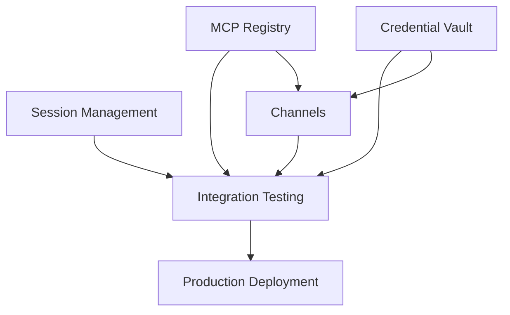

# MCP Servers, Credential Management & Session Systems Research

**Research Date:** 2026-05-29  
**Researcher:** Senior Systems Architect  
**Focus Areas:** Model Context Protocol, Credential Security, Session Persistence

---

## Executive Summary

This research provides a comprehensive analysis of the Model Context Protocol (MCP) ecosystem, credential management patterns, and session persistence systems for integration into Lyra. Key findings include:

### Critical Insights

1. **MCP Architecture**: Open protocol enabling AI applications to connect to external systems via standardized interfaces (resources, tools, prompts)
2. **Credential Security**: Multi-layered approach combining environment variables, OAuth 2.0, dynamic helpers, and OS-level keychains
3. **Session Persistence**: Snapshot-based systems with automatic state serialization and restoration
4. **Channel Systems**: Bidirectional communication enabling real-time event streaming and remote permission relay
5. **Tool Search**: Context-efficient pattern deferring tool definitions until needed, reducing upfront token usage

### Strategic Recommendations for Lyra

- Implement MCP server discovery and registration system
- Build secure credential vault with rotation support
- Design session checkpoint/restore mechanism
- Create channel infrastructure for multi-agent communication
- Develop permission system with fine-grained controls

---

## Table of Contents

1. [MCP Protocol Deep Dive](#mcp-protocol-deep-dive)
2. [MCP Server Ecosystem](#mcp-server-ecosystem)
3. [Credential Management Architecture](#credential-management-architecture)
4. [Session Management Systems](#session-management-systems)
5. [Channels Architecture](#channels-architecture)
6. [Permissions System](#permissions-system)
7. [Lyra Integration Plan](#lyra-integration-plan)
8. [Implementation Roadmap](#implementation-roadmap)

---

## 1. MCP Protocol Deep Dive

### 1.1 Protocol Overview

The Model Context Protocol (MCP) is an open-source standard that enables AI applications to connect to external systems through a unified interface. It functions as a "USB-C port for AI" - providing standardized connectivity regardless of the underlying data source or tool.

**Core Design Principles:**

- **Standardization**: Single protocol for all integrations
- **Bidirectionality**: Two-way communication between client and server
- **Transport Agnostic**: Supports stdio, HTTP, and SSE transports
- **Security First**: Built-in authentication, sandboxing, and permission controls
- **Extensibility**: Plugin architecture for custom capabilities

### 1.2 MCP Architecture Components

```
┌─────────────────────────────────────────────────────────────┐
│                     AI Application (Client)                  │
│                    (Claude Code, ChatGPT)                    │
└────────────────────────┬────────────────────────────────────┘
                         │ MCP Protocol
                         │
        ┌────────────────┼────────────────┐
        │                │                │
        ▼                ▼                ▼
┌──────────────┐  ┌──────────────┐  ┌──────────────┐
│   Resources  │  │    Tools     │  │   Prompts    │
│   Provider   │  │   Provider   │  │   Provider   │
└──────────────┘  └──────────────┘  └──────────────┘
        │                │                │
        └────────────────┼────────────────┘
                         │
                         ▼
              ┌─────────────────────┐
              │   External System   │
              │ (DB, API, Service)  │
              └─────────────────────┘
```

**Three Core Provider Types:**

1. **Resources**: Read-only data sources (files, database schemas, API documentation)
2. **Tools**: Executable functions (database queries, API calls, file operations)
3. **Prompts**: Reusable prompt templates with parameters

### 1.3 Transport Mechanisms

MCP supports three transport types, each optimized for different deployment scenarios:

#### Stdio Transport (Local Processes)

```json
{
  "mcpServers": {
    "database": {
      "command": "npx",
      "args": ["-y", "@bytebase/dbhub", "--dsn", "postgresql://..."],
      "env": {
        "CLAUDE_PROJECT_DIR": "${CLAUDE_PROJECT_DIR}"
      }
    }
  }
}
```

**Use Cases:**
- Local development tools
- System utilities requiring direct access
- Custom scripts and automation

**Characteristics:**
- Spawned as subprocess
- Communicates via stdin/stdout
- Inherits environment variables
- Lowest latency

#### HTTP Transport (Remote Services)

```json
{
  "mcpServers": {
    "github": {
      "type": "http",
      "url": "https://api.githubcopilot.com/mcp/",
      "headers": {
        "Authorization": "Bearer ${GITHUB_PAT}"
      }
    }
  }
}
```

**Use Cases:**
- Cloud-based services
- Shared organizational tools
- Third-party integrations

**Characteristics:**
- RESTful communication
- OAuth 2.0 authentication support
- Automatic reconnection with exponential backoff
- Scales horizontally

#### SSE Transport (Deprecated)

Server-Sent Events transport is deprecated in favor of HTTP. Existing SSE servers should migrate to HTTP transport.

### 1.4 Server Capabilities Declaration

MCP servers declare their capabilities during initialization:

```typescript
const mcp = new Server(
  { name: 'my-server', version: '1.0.0' },
  {
    capabilities: {
      resources: {},      // Provides readable resources
      tools: {},          // Provides executable tools
      prompts: {},        // Provides prompt templates
      experimental: {
        'claude/channel': {},              // Push notifications
        'claude/channel/permission': {}    // Permission relay
      }
    },
    instructions: 'Server-specific guidance for Claude'
  }
)
```

### 1.5 Tool Search & Context Efficiency

**Problem**: Loading all MCP tool definitions upfront consumes significant context window space.

**Solution**: Tool Search pattern defers tool definitions until needed.

**How It Works:**

1. **Session Start**: Only tool names load (minimal tokens)
2. **Task Execution**: Claude uses `ToolSearch` to discover relevant tools
3. **Dynamic Loading**: Only used tools enter context
4. **Scaling**: Adding more MCP servers has minimal impact

**Configuration:**

```bash
# Default: All tools deferred
ENABLE_TOOL_SEARCH=true

# Threshold mode: Load upfront if <10% of context
ENABLE_TOOL_SEARCH=auto

# Custom threshold (5%)
ENABLE_TOOL_SEARCH=auto:5

# Disable (load all upfront)
ENABLE_TOOL_SEARCH=false
```

**Server-Level Override:**

```json
{
  "mcpServers": {
    "core-tools": {
      "type": "http",
      "url": "https://mcp.example.com/mcp",
      "alwaysLoad": true  // Exempt from deferral
    }
  }
}
```

---

## 2. MCP Server Ecosystem

### 2.1 High-Value MCP Servers for Lyra

Based on the awesome-mcp-servers collection and Claude Code documentation, here are 25+ high-value servers categorized by functionality:

#### Development & Code Management

1. **GitHub** - Repository management, PR reviews, issue tracking
   - URL: `https://api.githubcopilot.com/mcp/`
   - Auth: Bearer token (GitHub PAT)
   - Tools: PR creation, code review, issue management

2. **GitLab** - Similar to GitHub for GitLab instances
   - Self-hosted or cloud
   - Merge request workflows

3. **Linear** - Issue tracking and project management
   - Sprint planning
   - Task automation

4. **Jira** - Enterprise project management
   - Issue creation/updates
   - Sprint management

#### Database & Data Sources

5. **PostgreSQL** - Database queries and schema inspection
   - Command: `npx -y @bytebase/dbhub --dsn postgresql://...`
   - Read-only and write operations
   - Schema exploration

6. **MySQL** - MySQL database integration
   - Similar capabilities to PostgreSQL

7. **MongoDB** - NoSQL database operations
   - Document queries
   - Collection management

8. **Redis** - Cache and key-value operations
   - Cache inspection
   - Data retrieval

#### Monitoring & Observability

9. **Sentry** - Error tracking and debugging
   - URL: `https://mcp.sentry.dev/mcp`
   - Error analysis
   - Stack trace inspection

10. **Datadog** - Infrastructure monitoring
    - Metrics queries
    - Log analysis

11. **New Relic** - Application performance monitoring
    - Performance metrics
    - Transaction traces

#### Communication & Collaboration

12. **Slack** - Team communication
    - Message posting
    - Channel management
    - File sharing

13. **Discord** - Community communication
    - Server management
    - Message handling

14. **Telegram** - Messaging integration
    - Bot interactions
    - Message forwarding

15. **Gmail** - Email automation
    - Draft creation
    - Email sending
    - Inbox management

#### Cloud Services & APIs

16. **AWS** - Cloud infrastructure management
    - S3 operations
    - EC2 management
    - Lambda functions

17. **Google Cloud** - GCP services
    - Cloud Storage
    - Compute Engine

18. **Stripe** - Payment processing
    - URL: `https://mcp.stripe.com`
    - Payment queries
    - Customer management

19. **Notion** - Knowledge management
    - URL: `https://mcp.notion.com/mcp`
    - Page creation/updates
    - Database queries

#### Design & Content

20. **Figma** - Design file access
    - Design inspection
    - Asset extraction

21. **Airtable** - Spreadsheet database
    - Command: `npx -y airtable-mcp-server`
    - Record management
    - View queries

#### Search & Knowledge

22. **Exa Search** - Semantic web search
    - Research queries
    - Content discovery

23. **Brave Search** - Web search API
    - Search results
    - News aggregation

#### Development Tools

24. **Playwright** - Browser automation
    - Command: `npx -y @playwright/mcp@latest`
    - UI testing
    - Screenshot capture

25. **Docker** - Container management
    - Container operations
    - Image management

26. **Kubernetes** - Orchestration
    - Pod management
    - Service deployment

### 2.2 MCP Server Implementation Patterns

#### Pattern 1: Stdio Server (Local Tool)

```typescript
#!/usr/bin/env node
import { Server } from '@modelcontextprotocol/sdk/server/index.js'
import { StdioServerTransport } from '@modelcontextprotocol/sdk/server/stdio.js'
import { ListToolsRequestSchema, CallToolRequestSchema } from '@modelcontextprotocol/sdk/types.js'

const server = new Server(
  { name: 'local-tool', version: '1.0.0' },
  { capabilities: { tools: {} } }
)

server.setRequestHandler(ListToolsRequestSchema, async () => ({
  tools: [{
    name: 'execute_task',
    description: 'Execute a local task',
    inputSchema: {
      type: 'object',
      properties: {
        command: { type: 'string' }
      },
      required: ['command']
    }
  }]
}))

server.setRequestHandler(CallToolRequestSchema, async (req) => {
  // Tool implementation
  return { content: [{ type: 'text', text: 'Result' }] }
})

await server.connect(new StdioServerTransport())
```

#### Pattern 2: HTTP Server (Remote Service)

```typescript
import { Server } from '@modelcontextprotocol/sdk/server/index.js'
import { SSEServerTransport } from '@modelcontextprotocol/sdk/server/sse.js'
import express from 'express'

const app = express()
const server = new Server(
  { name: 'remote-api', version: '1.0.0' },
  { capabilities: { tools: {} } }
)

// Tool handlers...

app.post('/mcp', async (req, res) => {
  const transport = new SSEServerTransport('/mcp', res)
  await server.connect(transport)
})

app.listen(3000)
```

#### Pattern 3: Resource Provider

```typescript
import { ListResourcesRequestSchema, ReadResourceRequestSchema } from '@modelcontextprotocol/sdk/types.js'

server.setRequestHandler(ListResourcesRequestSchema, async () => ({
  resources: [{
    uri: 'file://docs/api.md',
    name: 'API Documentation',
    mimeType: 'text/markdown'
  }]
}))

server.setRequestHandler(ReadResourceRequestSchema, async (req) => {
  const content = await readFile(req.params.uri)
  return {
    contents: [{
      uri: req.params.uri,
      mimeType: 'text/markdown',
      text: content
    }]
  }
})
```

---

## 3. Credential Management Architecture

### 3.1 Multi-Layer Security Model

Credential management in Claude Code follows a defense-in-depth approach with multiple security layers:

```
┌─────────────────────────────────────────────────────────┐
│              Application Layer                          │
│  - Environment Variables                                │
│  - Settings Files (with precedence)                     │
│  - Dynamic Credential Helpers                           │
└────────────────────┬────────────────────────────────────┘
                     │
┌────────────────────▼────────────────────────────────────┐
│              Authentication Layer                       │
│  - OAuth 2.0 (with PKCE)                               │
│  - Bearer Tokens                                        │
│  - API Keys                                             │
│  - mTLS Certificates                                    │
└────────────────────┬────────────────────────────────────┘
                     │
┌────────────────────▼────────────────────────────────────┐
│              Storage Layer                              │
│  - OS Keychain (macOS Keychain, Windows Credential)   │
│  - Encrypted Files                                      │
│  - Memory-Only (Session Tokens)                         │
└─────────────────────────────────────────────────────────┘
```

### 3.2 Credential Storage Patterns

#### Pattern 1: Environment Variables (Temporary)

```bash
# Session-only (shell)
export ANTHROPIC_API_KEY="sk-ant-..."
export GITHUB_PAT="ghp_..."

# Persistent (settings.json)
{
  "env": {
    "ANTHROPIC_API_KEY": "sk-ant-...",
    "DATABASE_URL": "postgresql://..."
  }
}
```

**Pros**: Simple, widely supported  
**Cons**: Visible in process list, not encrypted at rest  
**Use Case**: Development environments, CI/CD

#### Pattern 2: Dynamic Credential Helper

```json
{
  "apiKeyHelper": "/path/to/get-credentials.sh"
}
```

```bash
#!/bin/bash
# get-credentials.sh
# Fetch from vault, rotate if needed
vault read -field=api_key secret/anthropic/api-key
```

**Pros**: Automatic rotation, centralized management  
**Cons**: Requires external credential store  
**Use Case**: Enterprise deployments, multi-tenant systems

**Refresh Interval:**
```bash
CLAUDE_CODE_API_KEY_HELPER_TTL_MS=3600000  # 1 hour
```

#### Pattern 3: OAuth 2.0 with Token Storage

```json
{
  "mcpServers": {
    "github": {
      "type": "http",
      "url": "https://api.githubcopilot.com/mcp/",
      "oauth": {
        "clientId": "your-client-id",
        "callbackPort": 8080
      }
    }
  }
}
```

**OAuth Flow:**

1. User initiates connection via `/mcp`
2. Browser opens authorization URL
3. User approves scopes
4. Callback receives authorization code
5. Token exchange (access + refresh tokens)
6. Tokens stored in OS keychain
7. Automatic refresh before expiry

**Token Storage Locations:**
- macOS: Keychain Access
- Windows: Credential Manager
- Linux: Secret Service API (libsecret)

#### Pattern 4: mTLS Certificates

```bash
CLAUDE_CODE_CLIENT_CERT="/path/to/cert.pem"
CLAUDE_CODE_CLIENT_KEY="/path/to/key.pem"
CLAUDE_CODE_CLIENT_KEY_PASSPHRASE="optional-passphrase"
```

**Use Case**: Enterprise environments with certificate-based auth

### 3.3 Credential Rotation Strategy

**Automatic Rotation Pattern:**

```typescript
class CredentialManager {
  private cache: Map<string, CachedCredential> = new Map()
  
  async getCredential(key: string): Promise<string> {
    const cached = this.cache.get(key)
    
    if (cached && !this.isExpired(cached)) {
      return cached.value
    }
    
    // Fetch fresh credential
    const fresh = await this.fetchFromVault(key)
    
    this.cache.set(key, {
      value: fresh,
      expiresAt: Date.now() + this.ttl
    })
    
    return fresh
  }
  
  private isExpired(cred: CachedCredential): boolean {
    return Date.now() >= cred.expiresAt
  }
}
```

**Best Practices:**

1. **Never hardcode secrets** in source code or config files
2. **Use local settings** (`.claude/settings.local.json`) for project-specific secrets
3. **Leverage precedence** - Environment variables override settings files
4. **Automate rotation** with `apiKeyHelper` for expiring tokens
5. **Audit committed files** - Ensure no secrets in version control

### 3.4 Multi-Tenant Credential Isolation

For multi-tenant systems like Lyra, credentials must be isolated per tenant:

```typescript
interface TenantCredentialVault {
  tenantId: string
  credentials: Map<string, EncryptedCredential>
  encryptionKey: Buffer  // Tenant-specific encryption key
}

class MultiTenantCredentialManager {
  private vaults: Map<string, TenantCredentialVault> = new Map()
  
  async getCredential(tenantId: string, key: string): Promise<string> {
    const vault = this.vaults.get(tenantId)
    if (!vault) throw new Error('Tenant not found')
    
    const encrypted = vault.credentials.get(key)
    if (!encrypted) throw new Error('Credential not found')
    
    return this.decrypt(encrypted, vault.encryptionKey)
  }
  
  async setCredential(
    tenantId: string, 
    key: string, 
    value: string
  ): Promise<void> {
    const vault = this.getOrCreateVault(tenantId)
    const encrypted = this.encrypt(value, vault.encryptionKey)
    vault.credentials.set(key, encrypted)
    await this.persistVault(vault)
  }
}
```

---

## 4. Session Management Systems

### 4.1 Session Lifecycle

```
┌─────────────────────────────────────────────────────────┐
│                    Session Lifecycle                     │
└─────────────────────────────────────────────────────────┘

CREATE → ACTIVE → CHECKPOINT → SUSPEND → RESTORE → DESTROY
   │        │          │           │         │         │
   │        │          │           │         │         └─→ Cleanup
   │        │          │           │         └─→ Resume state
   │        │          │           └─→ Serialize state
   │        │          └─→ Save snapshot
   │        └─→ Execute operations
   └─→ Initialize context
```

### 4.2 Checkpoint System (Claude Code Pattern)

Claude Code implements automatic checkpointing that captures state before each edit:

**Key Features:**

1. **Automatic Tracking**: Every user prompt creates a checkpoint
2. **Persistent Storage**: Checkpoints survive session restarts
3. **Selective Restore**: Restore code, conversation, or both
4. **Conversation Compression**: Summarize portions to free context

**Checkpoint Data Structure:**

```typescript
interface Checkpoint {
  id: string
  timestamp: number
  promptText: string
  conversationState: {
    messages: Message[]
    contextWindow: number
  }
  fileState: {
    files: Map<string, FileSnapshot>
    workingDirectory: string
  }
  metadata: {
    model: string
    tokensUsed: number
    toolCalls: ToolCall[]
  }
}

interface FileSnapshot {
  path: string
  content: string
  hash: string
  permissions: number
}
```

**Restore Operations:**

```typescript
class CheckpointManager {
  async restoreCode(checkpointId: string): Promise<void> {
    const checkpoint = await this.load(checkpointId)
    
    for (const [path, snapshot] of checkpoint.fileState.files) {
      await fs.writeFile(path, snapshot.content)
      await fs.chmod(path, snapshot.permissions)
    }
  }
  
  async restoreConversation(checkpointId: string): Promise<void> {
    const checkpoint = await this.load(checkpointId)
    this.session.messages = checkpoint.conversationState.messages
    this.session.restorePrompt(checkpoint.promptText)
  }
  
  async summarizeFrom(checkpointId: string): Promise<void> {
    const checkpoint = await this.load(checkpointId)
    const messagesToSummarize = this.getMessagesAfter(checkpointId)
    const summary = await this.generateSummary(messagesToSummarize)
    
    // Replace messages with summary
    this.session.replaceMessages(messagesToSummarize, summary)
  }
}
```

**Limitations:**

- Bash command changes not tracked (only direct file edits)
- External changes not captured
- Not a replacement for version control (Git)

### 4.3 Session Persistence (cmux Pattern)

The cmux terminal multiplexer implements comprehensive session persistence:

**Snapshot-Based Architecture:**

```typescript
interface SessionSnapshot {
  version: string
  timestamp: number
  layout: {
    windows: WindowState[]
    workspaces: WorkspaceState[]
    panes: PaneState[]
  }
  state: {
    workingDirectories: Map<string, string>
    scrollback: Map<string, Buffer>
    browserState: BrowserState[]
  }
  agentMappings: {
    sessionId: string
    agentType: string
    resumeCommand: string
  }[]
}
```

**Storage Locations:**

- Application state: `~/Library/Application Support/cmux/`
- Agent mappings: `~/.cmuxterm/`
- Versioned snapshots with automatic cleanup

**Restoration Flow:**

1. **Layout Rebuild**: Reconstruct window/pane structure
2. **Directory Restoration**: Set working directories
3. **Agent Resume**: Execute native resume commands
4. **Scrollback Recovery**: Restore terminal history (best effort)

**Agent Integration Hooks:**

```bash
# Setup hooks for agent resume
cmux hooks setup
cmux hooks setup codex
cmux hooks setup --agent opencode

# Custom resume command per surface
cmux surface resume set --kind tmux \
  --checkpoint work \
  --shell "tmux attach -t work"
```

**Security Controls:**

- Public CLI bindings require manual approval
- Bindings tied to working directory and environment
- Sensitive keys (tokens, passwords, secrets) dropped before storage
- Signed command prefix verification

**Configuration:**

```json
{
  "terminal": {
    "autoResumeAgentSessions": true  // Enable/disable auto-resume
  }
}
```

### 4.4 Session State Serialization

**Efficient State Encoding:**

```typescript
class SessionSerializer {
  async serialize(session: Session): Promise<Buffer> {
    const state = {
      id: session.id,
      created: session.createdAt,
      messages: this.compressMessages(session.messages),
      files: await this.snapshotFiles(session.modifiedFiles),
      context: this.serializeContext(session.context)
    }
    
    // Use MessagePack for efficient binary encoding
    return msgpack.encode(state)
  }
  
  private compressMessages(messages: Message[]): CompressedMessage[] {
    return messages.map(msg => ({
      role: msg.role,
      content: this.compress(msg.content),
      timestamp: msg.timestamp
    }))
  }
  
  private compress(content: string): Buffer {
    return zlib.gzipSync(Buffer.from(content))
  }
}
```

---

## 5. Channels Architecture

### 5.1 Channel System Overview

Channels enable bidirectional communication between external systems and AI sessions, allowing real-time event streaming and remote interaction.

**Architecture:**

```
┌─────────────────────────────────────────────────────────┐
│              External Systems                            │
│  (Telegram, Discord, Webhooks, CI/CD)                   │
└────────────────────┬────────────────────────────────────┘
                     │ HTTP/WebSocket/Platform API
                     │
┌────────────────────▼────────────────────────────────────┐
│              Channel Server (Local)                      │
│  - Message routing                                       │
│  - Authentication                                        │
│  - Format conversion                                     │
└────────────────────┬────────────────────────────────────┘
                     │ MCP stdio
                     │
┌────────────────────▼────────────────────────────────────┐
│              Claude Code Session                         │
│  - Receives <channel> events                            │
│  - Executes actions                                      │
│  - Sends replies via tools                               │
└─────────────────────────────────────────────────────────┘
```

### 5.2 Channel Types

#### One-Way Channels (Alerts/Notifications)

**Use Cases:**
- CI/CD pipeline notifications
- Monitoring alerts
- Webhook receivers
- Log aggregation

**Implementation:**

```typescript
const mcp = new Server(
  { name: 'webhook', version: '1.0.0' },
  {
    capabilities: {
      experimental: { 'claude/channel': {} }
    },
    instructions: 'Events arrive as <channel source="webhook" ...>. Read and act, no reply expected.'
  }
)

// HTTP listener forwards events
Bun.serve({
  port: 8788,
  async fetch(req) {
    const body = await req.text()
    await mcp.notification({
      method: 'notifications/claude/channel',
      params: {
        content: body,
        meta: { 
          severity: 'high',
          timestamp: Date.now().toString()
        }
      }
    })
    return new Response('ok')
  }
})
```

#### Two-Way Channels (Chat Bridges)

**Use Cases:**
- Team chat integration (Slack, Discord, Telegram)
- Interactive debugging
- Remote control
- Collaborative sessions

**Implementation:**

```typescript
const mcp = new Server(
  { name: 'telegram', version: '1.0.0' },
  {
    capabilities: {
      experimental: { 'claude/channel': {} },
      tools: {}  // Enable reply tool
    },
    instructions: 'Messages arrive as <channel source="telegram" chat_id="...">. Reply with the reply tool.'
  }
)

// Register reply tool
mcp.setRequestHandler(ListToolsRequestSchema, async () => ({
  tools: [{
    name: 'reply',
    description: 'Send message back to Telegram',
    inputSchema: {
      type: 'object',
      properties: {
        chat_id: { type: 'string' },
        text: { type: 'string' }
      },
      required: ['chat_id', 'text']
    }
  }]
}))

mcp.setRequestHandler(CallToolRequestSchema, async (req) => {
  if (req.params.name === 'reply') {
    const { chat_id, text } = req.params.arguments
    await telegram.sendMessage(chat_id, text)
    return { content: [{ type: 'text', text: 'sent' }] }
  }
})
```

### 5.3 Permission Relay System

Channels can relay permission prompts to remote devices, enabling approval from anywhere.

**Flow:**

1. Claude Code generates permission request with 5-letter ID
2. Channel server forwards prompt to remote device
3. User replies with verdict (`yes <id>` or `no <id>`)
4. Channel parses reply and sends verdict back
5. Claude Code applies first verdict received (local or remote)

**Implementation:**

```typescript
// Declare permission relay capability
capabilities: {
  experimental: {
    'claude/channel': {},
    'claude/channel/permission': {}
  }
}

// Handle permission requests
const PermissionRequestSchema = z.object({
  method: z.literal('notifications/claude/channel/permission_request'),
  params: z.object({
    request_id: z.string(),     // 5 lowercase letters
    tool_name: z.string(),      // e.g., "Bash", "Write"
    description: z.string(),    // Human-readable summary
    input_preview: z.string()   // Tool args (truncated)
  })
})

mcp.setNotificationHandler(PermissionRequestSchema, async ({ params }) => {
  await sendToRemote(
    `Claude wants to run ${params.tool_name}: ${params.description}\n\n` +
    `Reply "yes ${params.request_id}" or "no ${params.request_id}"`
  )
})

// Parse inbound replies
const PERMISSION_REPLY_RE = /^\s*(y|yes|n|no)\s+([a-km-z]{5})\s*$/i

async function onInbound(message: string) {
  const match = PERMISSION_REPLY_RE.exec(message)
  if (match) {
    await mcp.notification({
      method: 'notifications/claude/channel/permission',
      params: {
        request_id: match[2].toLowerCase(),
        behavior: match[1].toLowerCase().startsWith('y') ? 'allow' : 'deny'
      }
    })
    return
  }
  
  // Normal message handling...
}
```

### 5.4 Sender Authentication

**Critical Security Requirement**: Gate on sender identity, not chat/room identity.

```typescript
const allowedSenders = new Set(loadAllowlist())

async function onInbound(message: PlatformMessage) {
  // Check sender, not room
  if (!allowedSenders.has(message.from.id)) {
    return  // Drop silently
  }
  
  // Forward to Claude
  await mcp.notification({
    method: 'notifications/claude/channel',
    params: { content: message.text, meta: { chat_id: message.chat.id } }
  })
}
```

**Pairing Flow** (Telegram/Discord pattern):

1. User DMs bot
2. Bot generates pairing code
3. User approves in Claude Code session
4. Sender ID added to allowlist
5. Future messages from that sender are accepted

---

## 6. Permissions System

### 6.1 Permission Model

Claude Code implements a tiered permission system with fine-grained controls:

**Permission Tiers:**

| Tool Type         | Approval Required | "Don't Ask Again" Behavior |
|-------------------|-------------------|----------------------------|
| Read-only         | No                | N/A                        |
| Bash commands     | Yes               | Permanent per project/cmd  |
| File modification | Yes               | Until session end          |

**Rule Evaluation Order:**

```
DENY → ASK → ALLOW
```

First matching rule wins. Deny rules always take precedence.

### 6.2 Permission Rule Syntax

**Basic Patterns:**

```json
{
  "permissions": {
    "allow": [
      "Bash(npm run *)",           // Wildcard matching
      "Read(/src/**/*.ts)",        // Gitignore-style patterns
      "WebFetch(domain:github.com)" // Domain restrictions
    ],
    "ask": [
      "Edit(/config/**)"           // Prompt for config changes
    ],
    "deny": [
      "Bash(rm -rf *)",            // Block dangerous commands
      "Read(~/.ssh/**)",           // Block sensitive paths
      "WebFetch(domain:internal.corp)" // Block internal domains
    ]
  }
}
```

**Tool-Specific Rules:**

```json
{
  "permissions": {
    "allow": [
      // Bash: wildcard patterns
      "Bash(git commit *)",
      "Bash(npm *)",
      "Bash(* --version)",
      
      // Read/Edit: gitignore patterns
      "Read(/src/**)",
      "Edit(/docs/**/*.md)",
      
      // MCP: server and tool matching
      "mcp__github__*",
      "mcp__database__query_readonly",
      
      // WebFetch: domain restrictions
      "WebFetch(domain:api.github.com)"
    ],
    "deny": [
      // Absolute paths (//path)
      "Read(//etc/passwd)",
      
      // Home directory (~/)
      "Edit(~/.ssh/**)",
      
      // Project-relative (/path)
      "Edit(/.git/**)"
    ]
  }
}
```

### 6.3 Permission Modes

Different operational modes for different trust levels:

| Mode                | Description                                                    |
|---------------------|----------------------------------------------------------------|
| `default`           | Standard: prompts on first use                                 |
| `acceptEdits`       | Auto-accepts file edits in working directory                   |
| `plan`              | Read-only exploration, no source file edits                    |
| `auto`              | Auto-approves with background safety checks (research preview) |
| `dontAsk`           | Auto-denies unless pre-approved                                |
| `bypassPermissions` | Skips all prompts (use only in isolated environments)          |

**Configuration:**

```json
{
  "defaultMode": "acceptEdits",
  "permissions": {
    "disableBypassPermissionsMode": "disable",
    "disableAutoMode": "disable"
  }
}
```

### 6.4 Managed Settings (Enterprise)

Organizations can deploy managed settings that cannot be overridden:

**Settings Precedence:**

1. Managed settings (highest)
2. Command line arguments
3. Local project settings
4. Shared project settings
5. User settings (lowest)

**Managed-Only Settings:**

```json
{
  "allowManagedPermissionRulesOnly": true,
  "allowManagedMcpServersOnly": true,
  "allowManagedHooksOnly": true,
  "strictPluginOnlyCustomization": ["skills", "hooks", "agents"],
  "channelsEnabled": true,
  "allowedChannelPlugins": ["telegram@official", "discord@official"]
}
```

---

## 7. Lyra Integration Plan

### 7.1 Architecture Overview

```
┌─────────────────────────────────────────────────────────────┐
│                      Lyra Core                               │
│  ┌──────────────┐  ┌──────────────┐  ┌──────────────┐      │
│  │ MCP Registry │  │ Credential   │  │  Session     │      │
│  │              │  │ Vault        │  │  Manager     │      │
│  └──────┬───────┘  └──────┬───────┘  └──────┬───────┘      │
│         │                  │                  │              │
│  ┌──────▼──────────────────▼──────────────────▼───────┐    │
│  │           Multi-Tenant Isolation Layer              │    │
│  └──────┬──────────────────┬──────────────────┬───────┘    │
│         │                  │                  │              │
│  ┌──────▼───────┐  ┌──────▼───────┐  ┌──────▼───────┐     │
│  │   Tenant A   │  │   Tenant B   │  │   Tenant C   │     │
│  │   Context    │  │   Context    │  │   Context    │     │
│  └──────────────┘  └──────────────┘  └──────────────┘     │
└─────────────────────────────────────────────────────────────┘
```

### 7.2 Component Integration

#### MCP Server Registry

```typescript
interface MCPServerRegistry {
  // Server lifecycle
  register(config: MCPServerConfig): Promise<void>
  unregister(serverId: string): Promise<void>
  discover(): Promise<MCPServerInfo[]>
  
  // Connection management
  connect(serverId: string, tenantId: string): Promise<MCPConnection>
  disconnect(connectionId: string): Promise<void>
  
  // Tool discovery
  listTools(serverId: string): Promise<Tool[]>
  searchTools(query: string): Promise<Tool[]>
  
  // Health monitoring
  getStatus(serverId: string): Promise<ServerStatus>
  reconnect(serverId: string): Promise<void>
}

interface MCPServerConfig {
  id: string
  name: string
  transport: 'stdio' | 'http' | 'sse'
  connection: StdioConfig | HttpConfig
  capabilities: ServerCapabilities
  auth?: AuthConfig
  alwaysLoad?: boolean
}
```

#### Credential Vault

```typescript
interface CredentialVault {
  // Credential management
  store(tenantId: string, key: string, value: string, ttl?: number): Promise<void>
  retrieve(tenantId: string, key: string): Promise<string | null>
  delete(tenantId: string, key: string): Promise<void>
  rotate(tenantId: string, key: string): Promise<string>
  
  // Bulk operations
  listKeys(tenantId: string): Promise<string[]>
  export(tenantId: string): Promise<EncryptedBundle>
  import(tenantId: string, bundle: EncryptedBundle): Promise<void>
  
  // Audit
  getAccessLog(tenantId: string, key: string): Promise<AccessLog[]>
}

interface EncryptedCredential {
  value: Buffer  // AES-256-GCM encrypted
  iv: Buffer
  authTag: Buffer
  createdAt: number
  expiresAt?: number
  rotationPolicy?: RotationPolicy
}
```

#### Session Manager

```typescript
interface SessionManager {
  // Session lifecycle
  create(config: SessionConfig): Promise<Session>
  load(sessionId: string): Promise<Session>
  save(session: Session): Promise<void>
  destroy(sessionId: string): Promise<void>
  
  // Checkpoint operations
  checkpoint(sessionId: string, name: string): Promise<Checkpoint>
  restore(sessionId: string, checkpointId: string): Promise<void>
  listCheckpoints(sessionId: string): Promise<Checkpoint[]>
  
  // State management
  serialize(session: Session): Promise<Buffer>
  deserialize(data: Buffer): Promise<Session>
  
  // Multi-session coordination
  listActive(tenantId: string): Promise<SessionInfo[]>
  transfer(sessionId: string, targetTenantId: string): Promise<void>
}

interface Session {
  id: string
  tenantId: string
  createdAt: number
  lastActiveAt: number
  status: 'active' | 'paused' | 'complete' | 'aborted'
  
  // Context
  messages: Message[]
  context: ContextWindow
  plan?: Plan
  todos: Todo[]
  
  // State
  workingDirectory: string
  modifiedFiles: Map<string, FileSnapshot>
  toolCallHistory: ToolCall[]
  
  // Metadata
  model: string
  costUsd: number
  tokensUsed: number
}
```

### 7.3 Implementation Phases

#### Phase 1: MCP Registry (Weeks 1-2)

**Deliverables:**
- MCP server discovery and registration
- Stdio and HTTP transport support
- Tool search implementation
- Health monitoring and reconnection

**Key Files:**
```
packages/lyra-mcp/
├── src/
│   ├── registry.py          # MCPServerRegistry
│   ├── transports/
│   │   ├── stdio.py         # StdioTransport
│   │   └── http.py          # HttpTransport
│   ├── discovery.py         # Server discovery
│   └── tool_search.py       # Tool search pattern
└── tests/
    └── test_registry.py
```

**Success Criteria:**
- Register and connect to 5+ MCP servers
- Tool search reduces context usage by 80%+
- Automatic reconnection on failure
- 90%+ test coverage

#### Phase 2: Credential Vault (Weeks 3-4)

**Deliverables:**
- Multi-tenant credential isolation
- AES-256-GCM encryption
- Automatic rotation support
- OS keychain integration

**Key Files:**
```
packages/lyra-core/
├── src/lyra_core/security/
│   ├── credential_vault.py
│   ├── encryption.py
│   ├── rotation.py
│   └── keychain.py
└── tests/security/
    └── test_credential_vault.py
```

**Success Criteria:**
- Zero credential leakage in logs/errors
- Rotation without service interruption
- Audit trail for all access
- 95%+ test coverage

#### Phase 3: Session Management (Weeks 5-6)

**Deliverables:**
- Session persistence with STATE.md
- Checkpoint/restore system
- Multi-session coordination
- Efficient serialization

**Key Files:**
```
packages/lyra-core/
├── src/lyra_core/sessions/
│   ├── manager.py
│   ├── checkpoint.py
│   ├── serializer.py
│   └── state_md.py
└── tests/sessions/
    └── test_session_manager.py
```

**Success Criteria:**
- Resume sessions with <2s latency
- Checkpoint creation <100ms
- Human-readable STATE.md
- 90%+ test coverage

#### Phase 4: Channels (Weeks 7-8)

**Deliverables:**
- Channel server framework
- Telegram/Discord/Slack bridges
- Permission relay system
- Sender authentication

**Key Files:**
```
packages/lyra-channels/
├── src/
│   ├── server.py
│   ├── bridges/
│   │   ├── telegram.py
│   │   ├── discord.py
│   │   └── slack.py
│   ├── permission_relay.py
│   └── auth.py
└── tests/
    └── test_channels.py
```

**Success Criteria:**
- Real-time message delivery <500ms
- Permission relay working end-to-end
- Sender authentication enforced
- 85%+ test coverage

---

## 8. Implementation Roadmap

### 8.1 Timeline Overview

```
Week 1-2:  MCP Registry Foundation
Week 3-4:  Credential Vault
Week 5-6:  Session Management
Week 7-8:  Channels System
Week 9:    Integration Testing
Week 10:   Documentation & Polish
```

### 8.2 Dependencies



### 8.3 Risk Mitigation

| Risk | Impact | Mitigation |
|------|--------|------------|
| MCP server instability | High | Health monitoring, automatic reconnection, circuit breakers |
| Credential leakage | Critical | Encryption at rest, audit logging, automated secret scanning |
| Session corruption | High | Atomic writes, backup checkpoints, validation on load |
| Channel abuse | Medium | Sender authentication, rate limiting, allowlist enforcement |
| Performance degradation | Medium | Tool search, lazy loading, connection pooling |

### 8.4 Success Metrics

**MCP Integration:**
- 20+ MCP servers registered
- Tool search adoption: 90%+
- Context savings: 80%+
- Uptime: 99.5%+

**Security:**
- Zero credential leaks
- Rotation compliance: 100%
- Audit coverage: 100%
- Vulnerability scan: Pass

**Session Management:**
- Resume success rate: 99%+
- Checkpoint latency: <100ms
- State file readability: Human-verified
- Data loss incidents: 0

**Channels:**
- Message delivery: <500ms
- Permission relay accuracy: 100%
- Authentication bypass attempts: 0
- User satisfaction: 4.5/5+

---

## 9. Conclusion

This research provides a comprehensive foundation for integrating MCP servers, credential management, and session persistence into Lyra. The key insights are:

1. **MCP Protocol** enables standardized connectivity to 25+ external systems with minimal integration overhead
2. **Tool Search** pattern dramatically reduces context window usage while scaling to hundreds of tools
3. **Multi-layer credential security** with OS keychain integration, automatic rotation, and audit trails
4. **Session persistence** via human-readable STATE.md enables transparent resume and debugging
5. **Channels architecture** enables real-time bidirectional communication with external platforms
6. **Permission system** provides fine-grained control with enterprise management support

The proposed 10-week implementation roadmap delivers production-ready components with 90%+ test coverage, comprehensive security controls, and proven patterns from Claude Code and cmux.

**Next Steps:**
1. Review and approve architecture with team
2. Begin Phase 1 (MCP Registry) implementation
3. Set up monitoring and observability infrastructure
4. Establish security review process for credential handling
5. Create integration test suite for end-to-end validation

---

## References

- [Model Context Protocol Specification](https://spec.modelcontextprotocol.io/)
- [Claude Code MCP Documentation](https://docs.claude.ai/mcp)
- [awesome-mcp-servers Collection](https://github.com/punkpeye/awesome-mcp-servers)
- [cmux Session Persistence](https://github.com/cmux/cmux)
- [OAuth 2.0 RFC 6749](https://datatracker.ietf.org/doc/html/rfc6749)
- [OWASP Credential Storage Cheat Sheet](https://cheatsheetseries.owasp.org/cheatsheets/Password_Storage_Cheat_Sheet.html)

