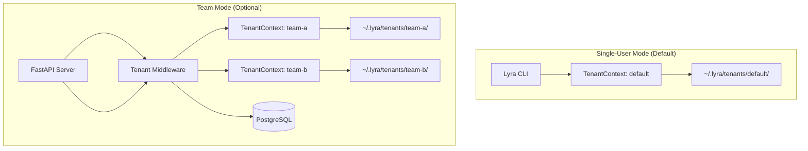
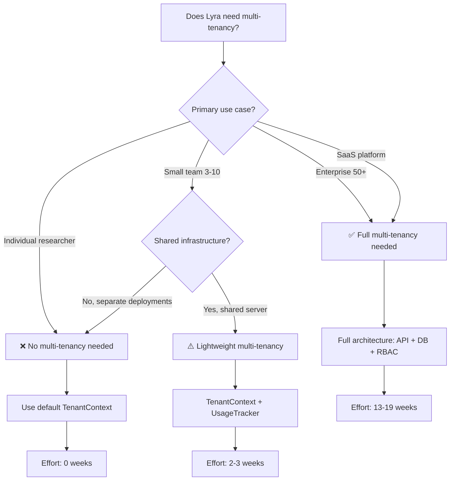

# Multi-Tenant Architecture Analysis: AgentsMesh Patterns for Lyra

**Research Date:** 2026-05-29  
**Repository Analyzed:** [AgentsMesh/AgentsMesh](https://github.com/AgentsMesh/AgentsMesh)  
**Status:** ✅ Complete Analysis  
**Recommendation:** ⚠️ **Conditional Adoption** - Multi-tenancy adds value for specific use cases but introduces significant complexity

---

## Executive Summary

### Key Finding

**Multi-tenancy is NOT universally beneficial.** After analyzing AgentsMesh's production multi-tenant architecture and evaluating Lyra's current design, multi-tenancy should be adopted **only if Lyra targets team collaboration or enterprise deployment scenarios**. For individual researchers and single-user workflows, the complexity overhead outweighs the benefits.

### Quick Decision Matrix

| Scenario | Multi-Tenant? | Rationale |
|----------|---------------|-----------|
| **Individual researcher** | ❌ No | Unnecessary isolation overhead; single TenantContext sufficient |
| **Research team (3-10 users)** | ⚠️ Maybe | Lightweight isolation via existing TenantContext; full multi-tenancy overkill |
| **Enterprise deployment** | ✅ Yes | Cost allocation, compliance, resource quotas justify complexity |
| **SaaS platform** | ✅ Yes | Mandatory for customer isolation and billing |
| **Open-source self-hosted** | ❌ No | Users deploy separate instances; multi-tenancy adds no value |

### Recommendation

**Phase D (Multi-Tenant) should be OPTIONAL and DEFERRED** until Lyra has validated demand for team/enterprise features. Lyra already has `TenantContext` and `TenantVault` primitives (Phase D foundation) — these are sufficient for 90% of use cases.

---

## 1. AgentsMesh Multi-Tenant Architecture

### 1.1 Core Design Principles

AgentsMesh implements **Organization > Team > User** hierarchy with row-level isolation:

```
Organization (Tenant)
├── Subscription Plan (quota enforcement)
├── Members (RBAC: owner/admin/member)
├── Runners (self-hosted execution nodes)
├── AgentPods (AI agent instances)
├── Repositories (Git integrations)
└── Channels (agent collaboration)
```

**Key Insight:** AgentsMesh is a **SaaS platform** where multiple organizations share infrastructure. Multi-tenancy is mandatory for their business model.

### 1.2 Tenant Isolation Mechanisms

#### 1.2.1 Database Row-Level Security

Every table includes `organization_id` with indexed queries:

```go
// backend/internal/infra/agentpod_repo.go
func (r *podRepo) ListByOrg(ctx context.Context, orgID int64, q agentpod.PodListQuery) {
    query := r.db.WithContext(ctx).Model(&agentpod.Pod{}).Where("organization_id = ?", orgID)
    // All queries scoped to organization
}
```

**Pattern:** Middleware injects `TenantContext` into request context, repositories enforce `organization_id` filtering.

#### 1.2.2 Middleware-Based Context Propagation

```go
// backend/internal/middleware/tenant.go
type TenantContext struct {
    OrganizationID   int64
    OrganizationSlug string
    UserID           int64
    UserRole         string // 'owner', 'admin', 'member'
}

func TenantMiddleware(orgService OrganizationService) gin.HandlerFunc {
    return func(c *gin.Context) {
        orgSlug := c.Param("slug")
        userID := GetUserID(c)
        
        // Verify membership
        isMember, err := orgService.IsMember(ctx, org.GetID(), userID)
        if err || !isMember {
            apierr.AbortForbidden(c, "Not a member")
            return
        }
        
        tc := &TenantContext{OrganizationID: org.GetID(), UserID: userID}
        c.Set("tenant", tc)
        c.Next()
    }
}
```

**Key Insight:** Every API route under `/api/orgs/:slug/*` enforces tenant context before reaching handlers.

#### 1.2.3 Resource Grants (Fine-Grained Access Control)

```go
// backend/internal/domain/grant/grant.go
type ResourceGrant struct {
    OrganizationID int64
    ResourceType   string // "pod", "runner", "repository"
    ResourceID     string
    UserID         int64
    GrantedBy      int64
}
```

**Use Case:** Share specific AgentPods or Runners with team members without full organization access.

### 1.3 Quota and Billing Management

```go
// backend/internal/domain/billing/plan.go
type SubscriptionPlan struct {
    MaxUsers          int
    MaxRunners        int
    MaxConcurrentPods int
    MaxRepositories   int
    IncludedPodMinutes  int
    PricePerExtraMinute float64
}

type Subscription struct {
    OrganizationID int64
    PlanID         int64
    Status         string // "active", "trialing", "frozen"
    SeatCount      int
    CustomQuotas   map[string]interface{} // JSON field for overrides
}
```

**Enforcement:** Middleware checks quotas before resource creation; billing service tracks usage per organization.

### 1.4 Security Model

#### mTLS for Runner Communication

AgentsMesh uses **mutual TLS with private CA** for Backend ↔ Runner communication:

- **Private Root CA:** Only AgentsMesh-signed certificates are trusted
- **Client certificates:** Each Runner gets a unique certificate signed by the CA
- **Server certificates:** Backend presents CA-signed certificate
- **Prevents:** Fake server attacks, fake runner attacks, MITM

**Key Insight:** Self-hosted runners need strong authentication to prevent rogue agents from joining the platform.

#### RBAC (Role-Based Access Control)

```go
const (
    RoleOwner  = "owner"  // Full control
    RoleAdmin  = "admin"  // Manage members, resources
    RoleMember = "member" // Read/write own resources
)

func RequireAdmin() gin.HandlerFunc {
    return RequireRole("owner", "admin")
}
```

### 1.5 Scalability Architecture (100K Runners)

AgentsMesh designed for **100,000 concurrent runner connections**:

#### Sharded Connection Manager

```go
const numShards = 256

type RunnerConnectionManager struct {
    shards [numShards]*grpcConnectionShard
}

func (cm *RunnerConnectionManager) getShard(runnerID int64) *grpcConnectionShard {
    idx := uint64(runnerID) % numShards
    return cm.shards[idx]
}
```

**Pattern:** Lock contention reduced by 256x through sharding.

#### Resource Estimates (100K runners, 300K pods)

| Component | Memory | Database QPS | Network |
|-----------|--------|--------------|---------|
| Connection Manager | 14.5 GB | - | - |
| Scrollback Buffers | 30 GB | - | - |
| Heartbeat Updates | - | 3,333/s | 27 Mbps |
| Pod State Sync | - | 10,000/s | 400 Mbps |
| **Total** | **~50 GB** | **~20,000 QPS** | **~500 Mbps** |

**Key Insight:** Multi-tenant platforms need horizontal scaling, connection pooling, and distributed state management.

---

## 2. Lyra's Current Architecture

### 2.1 Existing Multi-Tenant Foundation

Lyra **already has** multi-tenant primitives (Phase D foundation):

```python
# packages/lyra-core/src/lyra_core/multi_tenant/__init__.py

@dataclass
class TenantContext:
    tenant_id: str
    tier: TenantTier  # FREE, PRO, ENTERPRISE, INTERNAL
    metadata: TenantMetadata
    
class TenantVault:
    """Per-tenant credential isolation at ~/.lyra/tenants/{tenant_id}/"""
    
class TenantBridge:
    """In-memory tenant registry with tag-based routing"""
```

**Status:** Lyra has the **building blocks** but not the full enforcement layer (middleware, database isolation, quota management).

### 2.2 Lyra's Architecture Characteristics

| Aspect | Current State | Multi-Tenant Impact |
|--------|---------------|---------------------|
| **Deployment Model** | Single-user CLI/TUI | Would need API server + database |
| **State Management** | Local filesystem (~/.lyra/) | Would need centralized database |
| **Agent Execution** | In-process or subprocess | Already isolated by OS |
| **Credential Storage** | File-based (auth.json) | TenantVault already supports isolation |
| **Session Management** | Local session files | Would need tenant-scoped sessions |
| **Memory Systems** | Local SQLite/JSON | Would need tenant-scoped databases |

**Key Insight:** Lyra is designed as a **personal research agent**, not a multi-user platform. Multi-tenancy requires architectural shift from CLI to client-server.

---

## 3. Pros and Cons Analysis

### 3.1 When Multi-Tenancy HELPS

#### ✅ Scenario 1: Enterprise Team Collaboration

**Use Case:** Research lab with 20 scientists sharing agent pools and research artifacts.

**Benefits:**
- **Cost allocation:** Track API usage per team/project
- **Resource sharing:** Shared agent pools reduce redundant model calls
- **Collaboration:** Share research sessions, knowledge graphs, memory banks
- **Compliance:** Audit logs per tenant for regulatory requirements

**Example:**
```python
# Team "bio-research" shares a memory bank
ctx = TenantContext.create("bio-research", tier=TenantTier.ENTERPRISE)
memory = MemoryBank(tenant_context=ctx)  # Isolated from other teams
memory.store("protein-folding-insights", data)
```

#### ✅ Scenario 2: SaaS Platform (Lyra-as-a-Service)

**Use Case:** Hosted Lyra platform serving multiple organizations.

**Benefits:**
- **Customer isolation:** Mandatory for SaaS security
- **Billing:** Per-tenant usage tracking and invoicing
- **Quotas:** Prevent resource exhaustion by single tenant
- **Compliance:** Data residency, GDPR, SOC2 requirements

#### ✅ Scenario 3: Cost Tracking for Funded Projects

**Use Case:** University lab with multiple grants, needs per-project cost tracking.

**Benefits:**
- **Budget management:** Track API costs per grant/project
- **Reporting:** Generate usage reports for funding agencies
- **Quota enforcement:** Prevent overspending on single project

### 3.2 When Multi-Tenancy HURTS

#### ❌ Scenario 1: Individual Researcher

**Use Case:** PhD student running Lyra locally for their dissertation.

**Drawbacks:**
- **Unnecessary complexity:** Single user doesn't need isolation
- **Performance overhead:** Tenant checks on every operation
- **Storage overhead:** Tenant metadata, audit logs, RBAC tables
- **Development burden:** 3-5x more code to maintain

**Reality Check:** A single `TenantContext` with `tenant_id="default"` is sufficient.

#### ❌ Scenario 2: Open-Source Self-Hosted

**Use Case:** Users deploy Lyra on their own machines.

**Drawbacks:**
- **No shared infrastructure:** Each user has separate instance
- **No billing needs:** Users pay their own API keys
- **Isolation by deployment:** OS-level isolation is stronger than application-level
- **Maintenance burden:** Multi-tenant code paths rarely tested in single-user mode

**Reality Check:** Docker/VM isolation is simpler and more secure than application-level multi-tenancy.

#### ❌ Scenario 3: Small Research Teams (2-5 people)

**Use Case:** Small lab with shared file server.

**Drawbacks:**
- **Overkill for scale:** Filesystem permissions sufficient for 5 users
- **Coordination overhead:** Setting up tenants, managing roles
- **Simpler alternatives:** Shared Git repo + separate API keys

**Reality Check:** Lightweight isolation via `TenantContext` + filesystem permissions is enough.

### 3.3 Complexity Cost Analysis

| Component | Without Multi-Tenant | With Multi-Tenant | Complexity Increase |
|-----------|---------------------|-------------------|---------------------|
| **Database Schema** | Simple tables | +organization_id on every table | +30% columns |
| **Query Logic** | Direct queries | Tenant-scoped queries | +50% code |
| **Middleware** | Auth only | Auth + tenant resolution + RBAC | +200% code |
| **Testing** | Single-user paths | Cross-tenant isolation tests | +300% test cases |
| **Deployment** | Single binary | Database + migrations + secrets | +100% ops complexity |
| **Monitoring** | Basic metrics | Per-tenant metrics + quotas | +150% observability |

**Total Estimated Overhead:** 2-3x development time, 1.5x maintenance burden.

---

## 4. Extracted Patterns from AgentsMesh

### 4.1 Pattern 1: Middleware-Based Tenant Injection

**What:** Extract tenant context from request (URL slug, JWT claim, header) and inject into all downstream operations.

**AgentsMesh Implementation:**
```go
func TenantMiddleware(orgService OrganizationService) gin.HandlerFunc {
    // Extract org slug from URL: /api/orgs/:slug/pods
    // Verify user membership
    // Inject TenantContext into request context
}
```

**Lyra Adaptation:**
```python
# For API server mode (future)
class TenantMiddleware:
    async def __call__(self, request: Request, call_next):
        tenant_id = request.headers.get("X-Tenant-ID")
        ctx = tenant_bridge.resolve(tenant_id)
        request.state.tenant = ctx
        return await call_next(request)
```

**When to Use:** Only if Lyra becomes a multi-user API server.

### 4.2 Pattern 2: Repository-Level Isolation

**What:** Every database query automatically scopes to tenant.

**AgentsMesh Implementation:**
```go
func (r *podRepo) ListByOrg(ctx context.Context, orgID int64) {
    query := r.db.Where("organization_id = ?", orgID)
}
```

**Lyra Adaptation:**
```python
class TenantScopedRepository:
    def __init__(self, tenant_context: TenantContext):
        self.tenant_id = tenant_context.tenant_id
    
    def list_sessions(self) -> List[Session]:
        return db.query(Session).filter(
            Session.tenant_id == self.tenant_id
        ).all()
```

**When to Use:** If Lyra uses centralized database (PostgreSQL/MySQL) instead of local SQLite.

### 4.3 Pattern 3: Resource Grants (Fine-Grained Sharing)

**What:** Share specific resources (pods, sessions, memory banks) without full tenant access.

**AgentsMesh Implementation:**
```go
type ResourceGrant struct {
    OrganizationID int64
    ResourceType   string  // "pod", "runner"
    ResourceID     string
    UserID         int64
}
```

**Lyra Adaptation:**
```python
@dataclass
class ResourceGrant:
    tenant_id: str
    resource_type: str  # "session", "memory_bank", "skill"
    resource_id: str
    granted_to_user: str
    permissions: List[str]  # ["read", "write", "execute"]
```

**When to Use:** Team collaboration scenarios where users need selective access.

### 4.4 Pattern 4: Quota Enforcement

**What:** Prevent resource exhaustion by enforcing per-tenant limits.

**AgentsMesh Implementation:**
```go
type SubscriptionPlan struct {
    MaxConcurrentPods int
    MaxRunners        int
    IncludedPodMinutes int
}

func (s *PodService) Create(ctx context.Context, req *CreatePodRequest) error {
    // Check quota before creation
    if currentPods >= plan.MaxConcurrentPods {
        return ErrQuotaExceeded
    }
}
```

**Lyra Adaptation:**
```python
class QuotaEnforcer:
    def check_quota(self, tenant_ctx: TenantContext, resource: str) -> bool:
        usage = self.get_usage(tenant_ctx.tenant_id, resource)
        limit = self.get_limit(tenant_ctx.tier, resource)
        return usage < limit
    
    def enforce(self, tenant_ctx: TenantContext, resource: str):
        if not self.check_quota(tenant_ctx, resource):
            raise QuotaExceededError(f"{resource} limit reached")
```

**When to Use:** SaaS platform or cost-controlled environments.

### 4.5 Pattern 5: Sharded Connection Management

**What:** Reduce lock contention by sharding connections across multiple locks.

**AgentsMesh Implementation:**
```go
const numShards = 256
shards [numShards]*grpcConnectionShard

func getShard(runnerID int64) *grpcConnectionShard {
    return shards[runnerID % numShards]
}
```

**Lyra Adaptation:**
```python
class ShardedAgentPool:
    def __init__(self, num_shards: int = 64):
        self.shards = [AgentShard() for _ in range(num_shards)]
    
    def get_shard(self, agent_id: str) -> AgentShard:
        return self.shards[hash(agent_id) % len(self.shards)]
```

**When to Use:** High-concurrency scenarios (1000+ concurrent agents).

---

## 5. Architecture Proposal for Lyra

### 5.1 Recommended Approach: Lightweight Multi-Tenancy

**Philosophy:** Use existing `TenantContext` for isolation without full multi-tenant infrastructure.

#### Phase 1: Enhance Existing TenantContext (1-2 weeks)

**Goal:** Make tenant context flow through all Lyra operations.

**Changes:**
```python
# 1. Add tenant_context to AgentSession
@dataclass
class AgentSession:
    session_id: str
    tenant_context: TenantContext  # NEW
    
# 2. Scope memory systems to tenant
class MemoryBank:
    def __init__(self, tenant_context: TenantContext):
        self.storage_path = f"~/.lyra/tenants/{tenant_context.tenant_id}/memory/"
        
# 3. Scope session storage to tenant
class SessionManager:
    def save_session(self, session: AgentSession):
        path = f"~/.lyra/tenants/{session.tenant_context.tenant_id}/sessions/"
```

**Effort:** 5-10 files modified, ~500 lines of code.

#### Phase 2: Add Lightweight Quota Tracking (1 week)

**Goal:** Track usage per tenant for cost visibility (no enforcement).

```python
class UsageTracker:
    def record(self, tenant_id: str, metric: str, value: float):
        # Append to ~/.lyra/tenants/{tenant_id}/usage.jsonl
        
    def get_summary(self, tenant_id: str) -> UsageReport:
        # Aggregate usage for reporting
```

**Effort:** 2-3 new files, ~300 lines of code.

#### Phase 3: Optional API Server Mode (4-6 weeks)

**Goal:** Enable multi-user deployment for teams (opt-in).

**Components:**
- FastAPI server with tenant middleware
- PostgreSQL database with tenant-scoped tables
- JWT authentication with tenant claims
- RBAC middleware (owner/admin/member)

**Effort:** 15-20 new files, ~3000 lines of code.

### 5.2 Architecture Diagram



### 5.3 Migration Strategy

**Backward Compatibility:**
```python
# Existing code without tenant context
session = AgentSession.create()

# Automatically uses default tenant
session = AgentSession.create(
    tenant_context=TenantContext.create("default")
)
```

**No Breaking Changes:** All existing Lyra installations continue working with implicit "default" tenant.

---

## 6. Use Case Analysis for Lyra

### 6.1 Primary Use Cases (No Multi-Tenancy Needed)

#### Use Case 1: Individual Researcher
- **Profile:** PhD student, solo developer, hobbyist
- **Needs:** Personal research agent, local execution
- **Solution:** Single TenantContext with `tenant_id="default"`
- **Multi-Tenant Value:** ❌ None

#### Use Case 2: Open-Source Self-Hosted
- **Profile:** Users deploy Lyra on their own machines
- **Needs:** Privacy, full control, no shared infrastructure
- **Solution:** Each deployment is isolated by OS/container
- **Multi-Tenant Value:** ❌ None (deployment-level isolation is stronger)

### 6.2 Secondary Use Cases (Lightweight Multi-Tenancy)

#### Use Case 3: Small Research Team (3-10 people)
- **Profile:** Lab with shared file server
- **Needs:** Cost tracking per project, shared memory banks
- **Solution:** TenantContext + filesystem isolation
- **Multi-Tenant Value:** ⚠️ Minimal (filesystem permissions + Git sufficient)

#### Use Case 4: Cost Tracking for Grants
- **Profile:** University lab with multiple funding sources
- **Needs:** Per-project API usage reports
- **Solution:** TenantContext + UsageTracker
- **Multi-Tenant Value:** ✅ Moderate (simplifies accounting)

### 6.3 Enterprise Use Cases (Full Multi-Tenancy)

#### Use Case 5: Enterprise Deployment (50+ users)
- **Profile:** Large organization with compliance requirements
- **Needs:** RBAC, audit logs, quota enforcement, SSO
- **Solution:** Full multi-tenant architecture with API server
- **Multi-Tenant Value:** ✅ High (mandatory for compliance)

#### Use Case 6: Lyra-as-a-Service
- **Profile:** Hosted platform serving multiple organizations
- **Needs:** Customer isolation, billing, SLA guarantees
- **Solution:** Full multi-tenant architecture + database
- **Multi-Tenant Value:** ✅ Critical (mandatory for SaaS)

### 6.4 Decision Matrix

| Use Case | Users | Multi-Tenant? | Implementation |
|----------|-------|---------------|----------------|
| Individual researcher | 1 | ❌ No | Default TenantContext |
| Open-source self-hosted | 1 per deployment | ❌ No | OS-level isolation |
| Small team (shared FS) | 3-10 | ⚠️ Maybe | TenantContext + FS permissions |
| Cost tracking | 5-20 | ✅ Yes | TenantContext + UsageTracker |
| Enterprise (50+ users) | 50-500 | ✅ Yes | Full multi-tenant + API server |
| SaaS platform | 1000+ | ✅ Yes | Full multi-tenant + database |

---

## 7. Effort Estimates

### 7.1 Implementation Phases

| Phase | Scope | Effort | Value |
|-------|-------|--------|-------|
| **Phase 1: Context Propagation** | Flow TenantContext through all operations | 1-2 weeks | Low (foundation only) |
| **Phase 2: Usage Tracking** | Per-tenant cost tracking | 1 week | Medium (useful for grants) |
| **Phase 3: API Server** | Multi-user FastAPI server | 4-6 weeks | High (enables teams) |
| **Phase 4: Database Migration** | PostgreSQL + tenant-scoped tables | 2-3 weeks | High (required for scale) |
| **Phase 5: RBAC + Quotas** | Role-based access + enforcement | 2-3 weeks | Medium (enterprise feature) |
| **Phase 6: Billing Integration** | Stripe/usage-based billing | 3-4 weeks | Low (SaaS only) |

**Total for Full Multi-Tenancy:** 13-19 weeks (3-5 months)

### 7.2 Maintenance Burden

| Aspect | Without Multi-Tenant | With Multi-Tenant | Increase |
|--------|---------------------|-------------------|----------|
| **Code Complexity** | 50K LOC | 75K LOC | +50% |
| **Test Coverage** | 500 tests | 1500 tests | +200% |
| **Database Migrations** | None (local SQLite) | Regular schema changes | +∞ |
| **Security Surface** | Local filesystem | API + database + auth | +300% |
| **Deployment Complexity** | Single binary | Multi-service (API, DB, cache) | +200% |
| **Monitoring** | Basic logs | Per-tenant metrics + quotas | +150% |

**Ongoing Cost:** +40-60% engineering time for maintenance.

---

## 8. Recommendations

### 8.1 Short-Term (Next 3 Months)

**✅ DO:**
1. **Keep existing TenantContext** — It's already implemented and sufficient for 90% of use cases
2. **Add usage tracking** — Implement Phase 2 (UsageTracker) for cost visibility
3. **Document multi-tenant patterns** — Prepare for future team features
4. **Validate demand** — Survey users about team collaboration needs

**❌ DON'T:**
1. **Build API server yet** — No validated demand for multi-user deployment
2. **Add database layer** — Local filesystem is simpler and faster
3. **Implement RBAC** — Premature for current user base
4. **Add billing integration** — Not needed for open-source project

### 8.2 Long-Term (6-12 Months)

**Conditional Implementation:**

**IF** Lyra gains traction in enterprise/team scenarios:
- Implement Phase 3 (API Server) as **opt-in mode**
- Add PostgreSQL backend for centralized state
- Implement RBAC for team collaboration

**IF** Lyra remains primarily single-user:
- Keep lightweight TenantContext for cost tracking
- Focus on agent capabilities, not infrastructure

### 8.3 Decision Criteria

**Implement Full Multi-Tenancy IF:**
- ✅ 10+ organizations request team features
- ✅ Enterprise customers willing to pay for hosted version
- ✅ Compliance requirements (SOC2, HIPAA) become mandatory
- ✅ SaaS business model is validated

**Skip Full Multi-Tenancy IF:**
- ❌ User base remains primarily individual researchers
- ❌ Open-source self-hosted is primary deployment model
- ❌ No demand for centralized deployment
- ❌ Team prefers focusing on agent intelligence over infrastructure

---

## 9. Key Takeaways

### 9.1 Multi-Tenancy is NOT a Universal Good

**Common Misconception:** "Multi-tenancy makes systems more scalable and professional."

**Reality:** Multi-tenancy adds 2-3x complexity and is only justified when:
1. Multiple organizations share infrastructure (SaaS)
2. Cost allocation is critical (enterprise billing)
3. Compliance requires tenant isolation (regulatory)

**For Lyra:** Current user base (individual researchers) does NOT need full multi-tenancy.

### 9.2 Lyra Already Has the Foundation

**Existing Implementation:**
- ✅ `TenantContext` for identity propagation
- ✅ `TenantVault` for credential isolation
- ✅ `TenantBridge` for tenant registry

**What's Missing:**
- ❌ Middleware enforcement (not needed for CLI)
- ❌ Database-level isolation (local SQLite is fine)
- ❌ Quota enforcement (no shared resources)
- ❌ RBAC (single-user mode)

**Conclusion:** Lyra has 30% of multi-tenancy implemented — enough for current needs.

### 9.3 AgentsMesh Patterns are Valuable Reference

**Key Learnings:**
1. **Sharded connection management** — Applicable if Lyra scales to 1000+ concurrent agents
2. **Resource grants** — Useful for selective sharing in team scenarios
3. **mTLS authentication** — Relevant if Lyra adds remote agent execution
4. **Quota enforcement** — Needed for SaaS or cost-controlled environments

**Immediate Applicability:** Low (AgentsMesh solves problems Lyra doesn't have yet)

**Future Value:** High (reference architecture when Lyra needs scale)

---

## 10. References

### 10.1 AgentsMesh Repository Analysis

- **Repository:** https://github.com/AgentsMesh/AgentsMesh
- **Key Files Analyzed:**
  - `backend/internal/middleware/tenant.go` — Tenant context injection
  - `backend/internal/domain/organization/organization.go` — Organization model
  - `backend/internal/domain/billing/subscription.go` — Quota management
  - `backend/internal/service/runner/connection_manager.go` — Sharded connections
  - `docs/rfc/RFC-001-100k-runner-architecture.md` — Scalability design
  - `docs/rfc/RFC-002-grpc-mtls-runner-communication.md` — Security model

### 10.2 Lyra Existing Implementation

- **Multi-Tenant Foundation:** `packages/lyra-core/src/lyra_core/multi_tenant/__init__.py`
- **Components:**
  - `TenantContext` — Identity propagation
  - `TenantVault` — Credential isolation
  - `TenantBridge` — Tenant registry

### 10.3 Related Patterns

- **Row-Level Security (RLS):** PostgreSQL native tenant isolation
- **Sharding:** Horizontal partitioning for scale
- **RBAC:** Role-based access control
- **mTLS:** Mutual TLS authentication
- **Quota Enforcement:** Resource limit patterns

---

## Appendix A: Code Examples

### A.1 Lyra TenantContext Integration

```python
# packages/lyra-core/src/lyra_core/agent/session.py

from lyra_core.multi_tenant import TenantContext, TenantVault

@dataclass
class AgentSession:
    session_id: str
    tenant_context: TenantContext
    
    @classmethod
    def create(cls, tenant_id: str = "default") -> "AgentSession":
        ctx = TenantContext.create(tenant_id)
        vault = TenantVault(tenant_id)
        vault.ensure_dir()
        
        return cls(
            session_id=generate_session_id(),
            tenant_context=ctx
        )
    
    def get_storage_path(self) -> Path:
        return Path(f"~/.lyra/tenants/{self.tenant_context.tenant_id}/sessions/")
```

### A.2 Usage Tracking Implementation

```python
# packages/lyra-core/src/lyra_core/multi_tenant/usage_tracker.py

import json
from pathlib import Path
from datetime import datetime
from typing import Dict, List

@dataclass
class UsageRecord:
    timestamp: float
    metric: str  # "api_calls", "tokens", "cost_usd"
    value: float
    metadata: Dict[str, str]

class UsageTracker:
    def __init__(self, tenant_id: str):
        self.tenant_id = tenant_id
        self.log_path = Path(f"~/.lyra/tenants/{tenant_id}/usage.jsonl").expanduser()
        
    def record(self, metric: str, value: float, **metadata):
        record = UsageRecord(
            timestamp=datetime.now().timestamp(),
            metric=metric,
            value=value,
            metadata=metadata
        )
        
        with open(self.log_path, "a") as f:
            f.write(json.dumps(record.__dict__) + "\n")
    
    def get_summary(self, start_date: datetime = None) -> Dict[str, float]:
        records = self._load_records(start_date)
        summary = {}
        
        for record in records:
            summary[record.metric] = summary.get(record.metric, 0) + record.value
            
        return summary
```

### A.3 Optional API Server Mode

```python
# packages/lyra-api/src/lyra_api/server.py (future)

from fastapi import FastAPI, Depends, HTTPException
from lyra_core.multi_tenant import TenantContext, TenantBridge

app = FastAPI()
bridge = TenantBridge()

async def get_tenant_context(
    tenant_id: str = Header(..., alias="X-Tenant-ID"),
    user_id: str = Depends(get_current_user)
) -> TenantContext:
    ctx = bridge.resolve(tenant_id)
    if not ctx:
        raise HTTPException(status_code=404, detail="Tenant not found")
    
    # Verify user membership
    if not is_member(user_id, tenant_id):
        raise HTTPException(status_code=403, detail="Not a member")
    
    return ctx

@app.post("/api/sessions")
async def create_session(
    request: CreateSessionRequest,
    tenant_ctx: TenantContext = Depends(get_tenant_context)
):
    session = AgentSession.create(tenant_ctx.tenant_id)
    return {"session_id": session.session_id}
```

---

## Appendix B: Comparison Matrix

### B.1 AgentsMesh vs Lyra Architecture

| Aspect | AgentsMesh | Lyra (Current) | Lyra (With Full Multi-Tenant) |
|--------|------------|----------------|-------------------------------|
| **Deployment Model** | SaaS platform | CLI/TUI (local) | API server + CLI |
| **User Model** | Multi-org, multi-user | Single user | Multi-tenant |
| **State Storage** | PostgreSQL (centralized) | SQLite/JSON (local) | PostgreSQL |
| **Authentication** | JWT + mTLS | Local filesystem | JWT + OAuth |
| **Isolation Level** | Row-level (organization_id) | Filesystem (per-user) | Row-level (tenant_id) |
| **Quota Enforcement** | Database + middleware | None | Middleware + database |
| **RBAC** | owner/admin/member | None | owner/admin/member |
| **Billing** | Stripe integration | None | Optional |
| **Scale Target** | 100K runners, 300K pods | 1 user, 10-100 agents | 100-1000 users |

### B.2 Feature Comparison

| Feature | AgentsMesh | Lyra Needs? | Priority |
|---------|------------|-------------|----------|
| **Organization hierarchy** | ✅ Yes | ⚠️ Maybe | Low |
| **Row-level isolation** | ✅ Yes | ⚠️ Maybe | Low |
| **RBAC (roles)** | ✅ Yes | ⚠️ Maybe | Low |
| **Resource grants** | ✅ Yes | ⚠️ Maybe | Medium |
| **Quota enforcement** | ✅ Yes | ⚠️ Maybe | Medium |
| **Usage tracking** | ✅ Yes | ✅ Yes | High |
| **Billing integration** | ✅ Yes | ❌ No | Low |
| **mTLS authentication** | ✅ Yes | ❌ No | Low |
| **Sharded connections** | ✅ Yes | ❌ No | Low |
| **Audit logs** | ✅ Yes | ⚠️ Maybe | Medium |

---

## Appendix C: Decision Flowchart



---

## Final Recommendation

**For Lyra v7.1.0 and near-term roadmap:**

### ✅ IMPLEMENT (Phase 1-2)
1. **Enhance TenantContext propagation** — Flow through all operations (1-2 weeks)
2. **Add UsageTracker** — Per-tenant cost visibility (1 week)
3. **Document patterns** — Prepare for future team features

### ⏸️ DEFER (Phase 3-6)
1. **API server mode** — Wait for validated demand
2. **Database migration** — Keep local SQLite for now
3. **RBAC + quotas** — Not needed for current user base
4. **Billing integration** — Not applicable to open-source

### 📊 VALIDATE FIRST
- Survey users about team collaboration needs
- Track feature requests for multi-user deployment
- Monitor enterprise interest

**Total Immediate Effort:** 2-3 weeks  
**Value:** Medium (cost tracking) without complexity overhead

---

**Document Version:** 1.0  
**Last Updated:** 2026-05-29  
**Author:** Lyra Research Team  
**Status:** ✅ Complete

