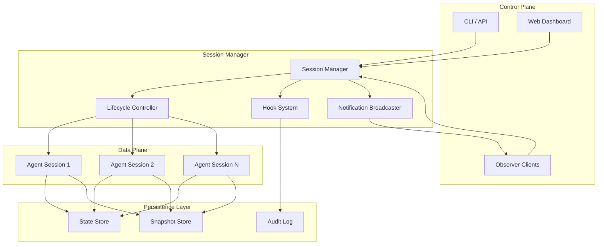
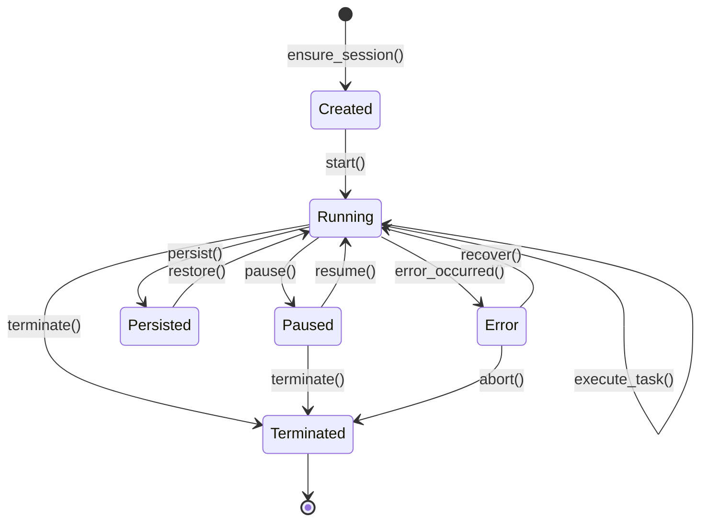

# Multi-Session Management Patterns: tmux, cmux, rmux Analysis

**Research Date:** 2026-05-29  
**Research ID:** US-022  
**Status:** Complete

## Executive Summary

This document analyzes three terminal multiplexer architectures (tmux, cmux, rmux) to extract multi-session management patterns applicable to Lyra's agent orchestration system. Key findings:

1. **tmux** provides the foundational client-server model with persistent sessions, hierarchical organization (sessions → windows → panes), and robust attach/detach semantics
2. **cmux** demonstrates AI-agent-aware adaptations including visual notifications, metadata-rich UI, trusted command models, and native Claude Code integration
3. **rmux** showcases distributed coordination with daemon-backed architecture, typed SDK patterns, snapshot-based observation, and idempotent session management

**Core Insight:** All three systems separate control plane (client/CLI) from data plane (persistent sessions), enabling resilient long-lived processes with multi-client observation—directly applicable to Lyra's multi-agent coordination needs.

---

## 1. tmux Architecture Analysis

### 1.1 Core Design Patterns

**Client-Server Model:**
- Persistent server process manages all sessions independently of client connections
- Clients communicate via Unix domain socket (default: `/tmp/tmux-{uid}/default`)
- Server survives client crashes, network disconnections, SSH timeouts
- Multiple clients can attach to same session simultaneously

**Three-Tier Hierarchy:**
```
Session (top-level container, persists in background)
  └─ Window (multiple terminal screens)
       └─ Pane (split views within window)
```

**Session Lifecycle:**
1. **Create:** `new-session -s name` spawns session with initial window
2. **Attach:** `attach-session -t name` connects client to existing session
3. **Detach:** `detach-client` disconnects without terminating session
4. **Persist:** Sessions run indefinitely until explicit `kill-session`
5. **Restore:** Clients reattach to running sessions by name/ID

### 1.2 State Management Patterns

**Target Resolution System:**
- Stable identifiers: `$session_id`, `@window_id`, `%pane_id`
- Symbolic references: `{last}`, `{next}`, `{current}`
- Hierarchical addressing: `session:window.pane`
- Survives renames and reordering

**Environment Management:**
- `update-environment` option copies variables from client to session
- `TMUX` variable identifies controlling terminal
- `TMUX_PANE` contains unique pane identifier
- Per-session and per-window environment isolation

**Multi-Client Coordination:**
- `active-pane` flag: independent active pane per client
- `ignore-size` flag: client doesn't affect window sizing
- `read-only` mode: client can observe but not send input
- `no-detach-on-destroy`: keep client attached when session dies

### 1.3 Programmatic Control

**Hook System:**
- Event-driven automation: `after-new-session`, `pane-focus-in`, etc.
- Enables reactive workflows without polling
- Commands execute in session context

**Format Variables:**
- `#{session_name}`, `#{window_index}`, `#{pane_id}` for dynamic scripting
- `list-sessions -F format` extracts structured data
- Enables programmatic session discovery and monitoring

**Command Chaining:**
- Semicolons chain commands sequentially
- `if-shell` provides conditional execution
- Braces group commands without shell escaping

### 1.4 Key Takeaways for Agent Systems

✅ **Persistent sessions** survive client disconnections—agents can run indefinitely  
✅ **Multi-client attach** enables human observation of agent work  
✅ **Hierarchical organization** maps to agent → task → subtask structure  
✅ **Stable identifiers** enable reliable agent reference across renames  
✅ **Hook system** provides event-driven coordination without polling  
✅ **Read-only mode** allows safe observation without interference  

---

## 2. cmux Architecture Analysis

### 2.1 AI-Agent-Aware Adaptations

**Native macOS Integration:**
- Built on Ghostty (GPU-accelerated terminal) in Swift/AppKit
- No Electron overhead—fast startup, low memory
- Native window management and notifications

**Visual Notification System:**
- Blue rings on panes when agents need attention
- Tabs light up with notification indicators
- Cmd+Shift+U jumps to most recent unread notification
- Aggregated view across all workspaces

**Metadata-Rich Sidebar:**
- Git branch tracking per workspace
- PR status and number display
- Listening ports for dev servers
- Latest notification text preview
- Working directory context

### 2.2 Session Handling Improvements

**Automatic State Persistence:**
- Quitting cmux saves current session automatically
- Restored on relaunch: layout, directories, scrollback, browser URLs
- Storage: `~/Library/Application Support/cmux/`
- Agent session mappings: `~/.cmuxterm/`

**Agent-Aware Resume:**
- Hook detection for Claude Code, Codex, Grok, OpenCode, Pi, Amp, Cursor, Gemini, Rovo, Copilot, CodeBuddy, Factory, Qoder
- Install hooks: `cmux hooks setup` or `cmux hooks setup --agent opencode`
- Custom resume commands: `cmux surface resume set --kind tmux --checkpoint work --shell "tmux attach -t work"`

**Trusted Command Model:**
- Only auto-runs resume bindings marked as trusted
- Trusted sources: live process-detected bindings, user-approved prefixes
- Approved prefixes bound to working directory and environment values
- Security: drops sensitive keys (tokens, passwords, secrets, API keys) before storage

**Selective Auto-Resume:**
- Can disable automatic agent resume while keeping layout restore
- Config: `"autoResumeAgentSessions": false`
- Manual restore: File > Reopen Previous Session, ⌘⇧O, or `cmux restore-session`

### 2.3 Claude Code Integration Patterns

**Notification Protocol:**
- Picks up terminal sequences: OSC 9/99/777
- CLI integration: `cmux notify`
- Wire into agent hooks for automatic notification

**Workspace Isolation:**
- Each Claude session gets dedicated workspace
- Independent git branch tracking
- Separate PR status per workspace
- Per-workspace port monitoring
- Isolated notification state

**Browser Co-Location:**
- Split browser pane next to terminal
- Claude Code can interact with dev server directly
- Browser API ported from agent-browser:
  - Accessibility tree snapshots
  - Element references
  - Click/fill form automation
  - JavaScript evaluation

**Multi-Agent Coordination:**
- `cmux claude-teams` runs Claude Code teammate mode
- Teammates spawn as native splits
- Sidebar shows metadata for each agent
- Visual indicators for agent state
- Cmd+1-8 for workspace jumping, Ctrl+1-8 for surface jumping

### 2.4 Performance Optimizations

**Native Rendering:**
- GPU-accelerated via libghostty
- No Electron/Tauri overhead
- Fast startup and low memory footprint

**Efficient State Management:**
- Versioned snapshots in `~/Library/Application Support/cmux/`
- Rebuild layout first, then run agent resume commands
- Selective restoration based on trust model

**Scriptable Primitives:**
- CLI and socket API for workspace/pane creation
- Send keystrokes programmatically
- Automate browser interactions
- Custom commands in `cmux.json` for project-specific actions

### 2.5 Key Takeaways for Agent Systems

✅ **Visual notifications** beat text-only alerts for multi-agent monitoring  
✅ **Metadata-rich UI** provides agent context at a glance  
✅ **Trusted command model** balances automation with security  
✅ **Browser co-location** enables agents to interact with live applications  
✅ **Workspace isolation** prevents agent state bleed across projects  
✅ **Hook-based detection** enables automatic integration without hardcoding  
✅ **Scriptable primitives** over opinionated workflows—composability wins  
✅ **Session persistence with selective auto-resume** handles restarts gracefully  

---

## 3. rmux Architecture Analysis

### 3.1 Distributed Coordination Patterns

**Daemon-Backed Architecture:**
- Three public surfaces sharing single local protocol:
  - CLI (`rmux` binary)
  - Rust SDK (`rmux-sdk`)
  - Ratatui widget (`ratatui-rmux`)

**Layered Architecture:**
```
┌─────────────────────────────────────────┐
│  CLI / SDK / Widget (Public Surfaces)   │
├─────────────────────────────────────────┤
│  rmux-proto (Detached IPC DTOs)         │
├─────────────────────────────────────────┤
│  rmux-ipc (Local IPC transports)        │
├─────────────────────────────────────────┤
│  rmux-core (Sessions, panes, layouts)   │
├─────────────────────────────────────────┤
│  rmux-server (Tokio daemon, dispatch)   │
└─────────────────────────────────────────┘
```

**Platform-Specific Transport:**
- Linux/macOS: Unix domain sockets at `/tmp/rmux-{uid}/default`
- Windows: Named pipes (per-user)
- `rmux-os` crate abstracts platform differences
- `rmux-ipc` handles transport-level concerns

### 3.2 Session Management Patterns

**Detachable Execution Model:**
- Sessions persist independently of client connections
- Long-running processes survive SSH disconnections
- Reconnection to existing sessions
- Multi-client observation of same session

**Idempotent Session Acquisition:**
```rust
let session = rmux.ensure_session(
    EnsureSession::named(session_name)
        .policy(EnsureSessionPolicy::CreateOrReuse)
        .detached(true)
);
```
- `CreateOrReuse` policy simplifies agent recovery logic
- No need to check if session exists before creating
- Critical for fault-tolerant agent systems

**State Inspection and Snapshots:**
```rust
pane.wait_for_text("ready").await?;
let snapshot = pane.snapshot().await?;
```
- Structured snapshots enable non-invasive state observation
- Agents can monitor terminal state without interfering
- Async-first design with configurable timeouts

### 3.3 Resilience Patterns

**Connection Recovery:**
```rust
Rmux::builder()
    .default_timeout(Duration::from_secs(5))
    .connect_or_start()
```
- `.connect_or_start()` automatically launches daemon if absent
- Self-healing behavior for agent deployments
- Configurable timeouts prevent indefinite blocking

**Execution Verification:**
```rust
pane.send_text("printf 'ready\\n' && sleep 1\n").await?;
pane.wait_for_text("ready").await?;
```
- Defensive programming: confirm command execution before proceeding
- Avoids race conditions in agent workflows
- Synchronization primitives for distributed coordination

**Safety Guardrails:**
- `#![forbid(unsafe_code)]` in upper-level crates
- Unsafe code isolated to OS/terminal boundary in runtime crates
- Type-safe API prevents terminal corruption

### 3.4 Security and Isolation

**Per-User Isolation:**
- Default endpoints include user ID: `rmux-{uid}`
- Process-level isolation on shared systems
- Prevents cross-user session access

**Capability-Based Access:**
- Typed operations instead of raw terminal access:
  - `send_text()` for input injection
  - `snapshot()` for state observation
  - `wait_for_text()` for synchronization
- Prevents accidental terminal corruption
- Provides audit trails for agent actions

### 3.5 Multi-Agent Orchestration

**Coordination Capabilities:**
- Multi Agents Orchestration demo (514 lines)
- Agent Broadcast Arena demo (2,171 lines)
- Coordinating multiple agent processes
- Broadcasting to multiple terminal sessions

**Terminal Automation:**
- Playwright Testing demo (1,495 lines)
- Programmatic terminal control for testing workflows
- Applicable to agent validation scenarios

**State Mirroring:**
- Terminal ↔ Browser Mirroring demo (649 lines)
- Real-time state synchronization across interfaces
- Relevant for agent observability

### 3.6 Key Takeaways for Agent Systems

✅ **Daemon-backed architecture** provides persistent state independent of client lifecycle  
✅ **Typed SDK over raw protocol** prevents misuse and enables static verification  
✅ **Platform-specific transports** with unified API enable cross-platform deployment  
✅ **Snapshot-based observation** allows non-invasive monitoring  
✅ **Idempotent session management** simplifies agent recovery logic  
✅ **Async-first design** with timeouts prevents indefinite blocking  
✅ **Per-user isolation** provides security boundaries for multi-tenant systems  
✅ **Capability-based access** prevents accidental corruption and provides audit trails  

---

## 4. Pattern Mapping to Lyra's Agent System

### 4.1 Session Lifecycle → Agent Lifecycle

**tmux Pattern:**
```
Session: new → attach → detach → persist → reattach → kill
```

**Lyra Mapping:**
```
Agent: spawn → observe → pause → persist → resume → terminate
```

**Implementation Strategy:**
- Use `AgentSession` (Phase B) as session container
- `AgentDaemon` manages persistent agent processes
- `SessionLifecycle` enum: `Created`, `Running`, `Paused`, `Persisted`, `Terminated`
- Attach/detach maps to observer connection/disconnection

### 4.2 Window/Pane Hierarchy → Agent/Task Hierarchy

**tmux Pattern:**
```
Session (persistent container)
  └─ Window (logical grouping)
       └─ Pane (execution context)
```

**Lyra Mapping:**
```
AgentSession (persistent container)
  └─ TaskGroup (logical grouping)
       └─ Task (execution context)
```

**Implementation Strategy:**
- `AgentSession` contains multiple `TaskGroup` instances
- `TaskGroup` represents related tasks (e.g., "frontend", "backend", "testing")
- `Task` is atomic execution unit with isolated state
- Hierarchical addressing: `agent:group.task` (similar to `session:window.pane`)

### 4.3 Multi-Client Attach → Multi-Observer Pattern

**tmux Pattern:**
- Multiple clients attach to same session
- Read-only mode for safe observation
- Independent active pane per client

**Lyra Mapping:**
- Multiple observers (human, monitoring, logging) attach to agent session
- Observer modes: `ReadOnly`, `Interactive`, `Control`
- Independent focus per observer (different observers watch different tasks)

**Implementation Strategy:**
```python
class AgentObserver:
    mode: ObserverMode  # ReadOnly, Interactive, Control
    focus: Optional[TaskId]  # Which task this observer is watching
    notify_on: Set[EventType]  # Which events trigger notifications
    
class AgentSession:
    observers: List[AgentObserver]
    
    def attach_observer(self, observer: AgentObserver) -> None:
        """Attach observer without disrupting agent execution"""
        
    def detach_observer(self, observer_id: str) -> None:
        """Detach observer, agent continues running"""
```

### 4.4 Hook System → Event-Driven Coordination

**tmux Pattern:**
- Hooks execute commands on events: `after-new-session`, `pane-focus-in`
- Enables reactive workflows without polling

**Lyra Mapping:**
- Hooks execute callbacks on agent events: `after-task-start`, `on-task-complete`, `on-error`
- Enables reactive coordination between agents

**Implementation Strategy:**
```python
class AgentHooks:
    on_task_start: List[Callable[[Task], Awaitable[None]]]
    on_task_complete: List[Callable[[Task, Result], Awaitable[None]]]
    on_task_error: List[Callable[[Task, Error], Awaitable[None]]]
    on_agent_idle: List[Callable[[AgentSession], Awaitable[None]]]
    
# Example: Auto-assign next task when agent becomes idle
session.hooks.on_agent_idle.append(auto_assign_next_task)
```

### 4.5 Notification System → Agent Status Broadcasting

**cmux Pattern:**
- Visual notifications (blue rings, tab indicators)
- Metadata sidebar (git branch, PR status, ports)
- Aggregated notification view

**Lyra Mapping:**
- Agent status broadcasting to observers
- Rich metadata (current task, progress, resource usage)
- Aggregated dashboard for multi-agent monitoring

**Implementation Strategy:**
```python
class AgentNotification:
    agent_id: str
    task_id: Optional[str]
    level: NotificationLevel  # Info, Warning, Error, NeedsAttention
    message: str
    metadata: Dict[str, Any]  # git_branch, pr_number, ports, etc.
    timestamp: datetime
    
class NotificationBroadcaster:
    def broadcast(self, notification: AgentNotification) -> None:
        """Send notification to all attached observers"""
        
    def get_unread(self, observer_id: str) -> List[AgentNotification]:
        """Get unread notifications for observer"""
```

### 4.6 Idempotent Session Management → Fault-Tolerant Agent Recovery

**rmux Pattern:**
```rust
EnsureSession::named(name).policy(EnsureSessionPolicy::CreateOrReuse)
```

**Lyra Mapping:**
```python
def ensure_agent_session(
    session_id: str,
    policy: SessionPolicy = SessionPolicy.CREATE_OR_REUSE
) -> AgentSession:
    """Idempotent session acquisition—no need to check existence first"""
```

**Implementation Strategy:**
- `CREATE_OR_REUSE`: Return existing session if found, create if not
- `CREATE_ONLY`: Fail if session already exists
- `REUSE_ONLY`: Fail if session doesn't exist
- Simplifies agent recovery after crashes or restarts

### 4.7 Snapshot-Based Observation → Non-Invasive Monitoring

**rmux Pattern:**
```rust
let snapshot = pane.snapshot().await?;
```

**Lyra Mapping:**
```python
snapshot = await agent_session.snapshot()
# Returns immutable view of agent state without blocking execution
```

**Implementation Strategy:**
- Snapshots capture point-in-time state without locking
- Observers can inspect state without interfering with agent
- Useful for monitoring, debugging, and audit trails

### 4.8 Trusted Command Model → Secure Agent Automation

**cmux Pattern:**
- Only auto-run trusted resume commands
- User approval for new command prefixes
- Drop sensitive keys before storage

**Lyra Mapping:**
- Whitelist of trusted agent actions
- User approval for new automation patterns
- Sanitize sensitive data before persistence

**Implementation Strategy:**
```python
class TrustedCommandRegistry:
    approved_prefixes: Set[str]  # User-approved command prefixes
    
    def is_trusted(self, command: str) -> bool:
        """Check if command matches approved prefix"""
        
    def request_approval(self, command: str) -> bool:
        """Request user approval for new command pattern"""
        
    def sanitize_for_storage(self, state: Dict) -> Dict:
        """Remove sensitive keys before persisting"""
```

---

## 5. Integration Design for Lyra

### 5.1 Architecture Overview



### 5.2 Core Components

#### 5.2.1 Session Manager

**Responsibilities:**
- Create, list, attach, detach, destroy agent sessions
- Route commands to appropriate sessions
- Manage observer connections
- Coordinate multi-session operations

**API Design:**
```python
class SessionManager:
    def ensure_session(
        self,
        session_id: str,
        policy: SessionPolicy = SessionPolicy.CREATE_OR_REUSE
    ) -> AgentSession:
        """Idempotent session acquisition"""
        
    def list_sessions(
        self,
        filter: Optional[SessionFilter] = None
    ) -> List[SessionInfo]:
        """List all sessions with optional filtering"""
        
    def attach_observer(
        self,
        session_id: str,
        observer: AgentObserver
    ) -> None:
        """Attach observer to session"""
        
    def detach_observer(
        self,
        session_id: str,
        observer_id: str
    ) -> None:
        """Detach observer from session"""
        
    def snapshot(self, session_id: str) -> SessionSnapshot:
        """Get immutable snapshot of session state"""
```

#### 5.2.2 Lifecycle Controller

**Responsibilities:**
- Manage agent session lifecycle (create → run → pause → resume → terminate)
- Handle state transitions
- Coordinate with persistence layer
- Implement recovery strategies

**State Machine:**


**Implementation:**
```python
class LifecycleController:
    def start(self, session_id: str) -> None:
        """Transition session from Created to Running"""
        
    def pause(self, session_id: str) -> None:
        """Pause session execution, maintain state"""
        
    def resume(self, session_id: str) -> None:
        """Resume paused session"""
        
    def persist(self, session_id: str) -> PersistenceToken:
        """Persist session state to storage"""
        
    def restore(self, token: PersistenceToken) -> AgentSession:
        """Restore session from persisted state"""
        
    def terminate(self, session_id: str, cleanup: bool = True) -> None:
        """Terminate session and optionally cleanup resources"""
```

#### 5.2.3 Hook System

**Responsibilities:**
- Register event handlers
- Execute hooks on lifecycle events
- Provide async hook execution
- Handle hook failures gracefully

**Implementation:**
```python
class HookSystem:
    def register_hook(
        self,
        event: EventType,
        handler: Callable[[Event], Awaitable[None]],
        priority: int = 0
    ) -> HookId:
        """Register hook for event type"""
        
    def unregister_hook(self, hook_id: HookId) -> None:
        """Unregister hook"""
        
    async def trigger(self, event: Event) -> None:
        """Execute all hooks for event type"""
        
    def list_hooks(self, event: Optional[EventType] = None) -> List[HookInfo]:
        """List registered hooks"""

# Event types
class EventType(Enum):
    SESSION_CREATED = "session.created"
    SESSION_STARTED = "session.started"
    SESSION_PAUSED = "session.paused"
    SESSION_RESUMED = "session.resumed"
    SESSION_TERMINATED = "session.terminated"
    TASK_STARTED = "task.started"
    TASK_COMPLETED = "task.completed"
    TASK_FAILED = "task.failed"
    AGENT_IDLE = "agent.idle"
    AGENT_ERROR = "agent.error"
```

#### 5.2.4 Notification Broadcaster

**Responsibilities:**
- Broadcast notifications to observers
- Track read/unread status per observer
- Aggregate notifications across sessions
- Support notification filtering

**Implementation:**
```python
class NotificationBroadcaster:
    def broadcast(
        self,
        notification: AgentNotification,
        targets: Optional[List[str]] = None
    ) -> None:
        """Broadcast notification to observers"""
        
    def get_unread(
        self,
        observer_id: str,
        filter: Optional[NotificationFilter] = None
    ) -> List[AgentNotification]:
        """Get unread notifications for observer"""
        
    def mark_read(
        self,
        observer_id: str,
        notification_ids: List[str]
    ) -> None:
        """Mark notifications as read"""
        
    def aggregate_view(
        self,
        observer_id: str
    ) -> Dict[str, List[AgentNotification]]:
        """Get aggregated view of notifications by session"""
```

### 5.3 Data Models

#### 5.3.1 AgentSession

```python
@dataclass
class AgentSession:
    session_id: str
    state: SessionState
    task_groups: Dict[str, TaskGroup]
    observers: List[AgentObserver]
    hooks: HookRegistry
    metadata: SessionMetadata
    created_at: datetime
    updated_at: datetime
    
    async def execute_task(self, task: Task) -> Result:
        """Execute task in this session"""
        
    async def snapshot(self) -> SessionSnapshot:
        """Get immutable snapshot of current state"""
        
    def add_observer(self, observer: AgentObserver) -> None:
        """Add observer to session"""
        
    def remove_observer(self, observer_id: str) -> None:
        """Remove observer from session"""
```

#### 5.3.2 TaskGroup

```python
@dataclass
class TaskGroup:
    group_id: str
    name: str
    tasks: Dict[str, Task]
    active_task: Optional[str]
    metadata: Dict[str, Any]
    
    def add_task(self, task: Task) -> None:
        """Add task to group"""
        
    def get_task(self, task_id: str) -> Optional[Task]:
        """Get task by ID"""
        
    def list_tasks(self, filter: Optional[TaskFilter] = None) -> List[Task]:
        """List tasks with optional filtering"""
```

#### 5.3.3 AgentObserver

```python
@dataclass
class AgentObserver:
    observer_id: str
    mode: ObserverMode  # ReadOnly, Interactive, Control
    focus: Optional[str]  # Task ID currently focused
    notify_on: Set[EventType]
    connected_at: datetime
    last_activity: datetime
    
    def can_send_input(self) -> bool:
        """Check if observer can send input to agent"""
        
    def can_control(self) -> bool:
        """Check if observer can control agent lifecycle"""
```

#### 5.3.4 SessionSnapshot

```python
@dataclass
class SessionSnapshot:
    session_id: str
    timestamp: datetime
    state: SessionState
    task_groups: Dict[str, TaskGroupSnapshot]
    active_tasks: List[str]
    resource_usage: ResourceUsage
    metadata: Dict[str, Any]
    
    def to_dict(self) -> Dict[str, Any]:
        """Serialize snapshot to dictionary"""
        
    @classmethod
    def from_dict(cls, data: Dict[str, Any]) -> "SessionSnapshot":
        """Deserialize snapshot from dictionary"""
```

### 5.4 Persistence Strategy

#### 5.4.1 State Store

**Storage Layout:**
```
.lyra/sessions/
├── {session_id}/
│   ├── state.json          # Current session state
│   ├── metadata.json       # Session metadata
│   ├── task_groups/        # Task group states
│   │   ├── {group_id}.json
│   │   └── ...
│   └── checkpoints/        # Periodic checkpoints
│       ├── {timestamp}.json
│       └── ...
```

**Implementation:**
```python
class StateStore:
    def save_session(self, session: AgentSession) -> None:
        """Persist session state to storage"""
        
    def load_session(self, session_id: str) -> AgentSession:
        """Load session state from storage"""
        
    def checkpoint(self, session_id: str) -> CheckpointId:
        """Create checkpoint of current state"""
        
    def restore_checkpoint(self, checkpoint_id: CheckpointId) -> AgentSession:
        """Restore session from checkpoint"""
        
    def list_checkpoints(self, session_id: str) -> List[CheckpointInfo]:
        """List available checkpoints for session"""
```

#### 5.4.2 Snapshot Store

**Purpose:** Store immutable snapshots for monitoring, debugging, audit trails

**Implementation:**
```python
class SnapshotStore:
    def save_snapshot(self, snapshot: SessionSnapshot) -> SnapshotId:
        """Save snapshot to storage"""
        
    def get_snapshot(self, snapshot_id: SnapshotId) -> SessionSnapshot:
        """Retrieve snapshot by ID"""
        
    def list_snapshots(
        self,
        session_id: str,
        start_time: Optional[datetime] = None,
        end_time: Optional[datetime] = None
    ) -> List[SnapshotInfo]:
        """List snapshots for session within time range"""
        
    def cleanup_old_snapshots(self, retention_days: int = 7) -> int:
        """Delete snapshots older than retention period"""
```

#### 5.4.3 Audit Log

**Purpose:** Record all session operations for compliance and debugging

**Implementation:**
```python
class AuditLog:
    def log_operation(
        self,
        session_id: str,
        operation: str,
        actor: str,
        details: Dict[str, Any]
    ) -> None:
        """Log operation to audit trail"""
        
    def query_logs(
        self,
        session_id: Optional[str] = None,
        operation: Optional[str] = None,
        actor: Optional[str] = None,
        start_time: Optional[datetime] = None,
        end_time: Optional[datetime] = None
    ) -> List[AuditEntry]:
        """Query audit logs with filters"""
```

### 5.5 Communication Protocol

#### 5.5.1 Transport Layer

**Options:**
- **Unix Domain Sockets** (Linux/macOS): `/tmp/lyra-{uid}/sessions`
- **Named Pipes** (Windows): `\\.\pipe\lyra-{uid}-sessions`
- **WebSocket** (Remote access): `wss://lyra-server/sessions`

**Implementation:**
```python
class TransportLayer:
    def connect(self, endpoint: str) -> Connection:
        """Connect to session manager"""
        
    def send(self, connection: Connection, message: Message) -> None:
        """Send message to session manager"""
        
    def receive(self, connection: Connection) -> Message:
        """Receive message from session manager"""
        
    def close(self, connection: Connection) -> None:
        """Close connection"""
```

#### 5.5.2 Message Protocol

**Message Types:**
```python
class MessageType(Enum):
    # Session management
    CREATE_SESSION = "session.create"
    ATTACH_SESSION = "session.attach"
    DETACH_SESSION = "session.detach"
    TERMINATE_SESSION = "session.terminate"
    
    # Task management
    EXECUTE_TASK = "task.execute"
    CANCEL_TASK = "task.cancel"
    
    # Observation
    SNAPSHOT_REQUEST = "snapshot.request"
    SNAPSHOT_RESPONSE = "snapshot.response"
    
    # Notifications
    NOTIFICATION = "notification"
    
    # Lifecycle
    PAUSE_SESSION = "session.pause"
    RESUME_SESSION = "session.resume"
    PERSIST_SESSION = "session.persist"
    RESTORE_SESSION = "session.restore"

@dataclass
class Message:
    message_id: str
    message_type: MessageType
    session_id: Optional[str]
    payload: Dict[str, Any]
    timestamp: datetime
```

### 5.6 Integration with Existing Lyra Components

#### 5.6.1 AgentSession (Phase B)

**Current Implementation:**
```python
# packages/lyra-core/src/lyra_core/orchestration/agent_session.py
class AgentSession:
    """Manages lifecycle of a single agent execution"""
```

**Enhancement Strategy:**
- Add multi-observer support
- Implement snapshot mechanism
- Add hook system integration
- Enhance persistence with checkpoint support

#### 5.6.2 AgentDaemon (Phase B)

**Current Implementation:**
```python
# packages/lyra-core/src/lyra_core/orchestration/agent_daemon.py
class AgentDaemon:
    """Background daemon for long-running agent processes"""
```

**Enhancement Strategy:**
- Integrate with SessionManager
- Add transport layer for remote access
- Implement notification broadcasting
- Add audit logging

#### 5.6.3 HeartbeatOrchestrator (Phase A)

**Current Implementation:**
```python
# packages/lyra-core/src/lyra_core/collective/heartbeat_orchestrator.py
class HeartbeatOrchestrator:
    """Coordinates agent health checks and status updates"""
```

**Integration Strategy:**
- Use hook system for heartbeat events
- Broadcast heartbeat status as notifications
- Integrate with snapshot mechanism for health monitoring

#### 5.6.4 TenantBridge (Phase D)

**Current Implementation:**
```python
# packages/lyra-core/src/lyra_core/multi_tenant/tenant_bridge.py
class TenantBridge:
    """Routes requests to tenant-specific resources"""
```

**Integration Strategy:**
- Add tenant isolation to session management
- Per-tenant session namespaces
- Tenant-aware observer permissions
- Tenant-specific audit logs

---

## 6. Implementation Roadmap

### Phase 1: Foundation (Weeks 1-2)

**Deliverables:**
- [ ] Core data models (`AgentSession`, `TaskGroup`, `AgentObserver`)
- [ ] Basic `SessionManager` with create/list/attach/detach
- [ ] Simple `LifecycleController` with state machine
- [ ] File-based `StateStore` implementation
- [ ] Unit tests for core components

**Effort:** 2 weeks, 1 developer

### Phase 2: Persistence & Recovery (Weeks 3-4)

**Deliverables:**
- [ ] Checkpoint mechanism in `StateStore`
- [ ] `SnapshotStore` implementation
- [ ] Session restore functionality
- [ ] Idempotent session acquisition (`ensure_session`)
- [ ] Recovery tests and fault injection

**Effort:** 2 weeks, 1 developer

### Phase 3: Observation & Monitoring (Weeks 5-6)

**Deliverables:**
- [ ] Multi-observer support in `AgentSession`
- [ ] `NotificationBroadcaster` implementation
- [ ] Observer modes (ReadOnly, Interactive, Control)
- [ ] Snapshot-based observation
- [ ] Real-time notification delivery

**Effort:** 2 weeks, 1 developer

### Phase 4: Event System (Weeks 7-8)

**Deliverables:**
- [ ] `HookSystem` implementation
- [ ] Event types and handlers
- [ ] Async hook execution
- [ ] Hook failure handling
- [ ] Integration with existing components

**Effort:** 2 weeks, 1 developer

### Phase 5: Communication Protocol (Weeks 9-10)

**Deliverables:**
- [ ] `TransportLayer` with Unix sockets (Linux/macOS)
- [ ] Named pipes support (Windows)
- [ ] Message protocol implementation
- [ ] Connection management
- [ ] Protocol tests

**Effort:** 2 weeks, 1 developer

### Phase 6: Integration & Testing (Weeks 11-12)

**Deliverables:**
- [ ] Integration with `AgentSession` (Phase B)
- [ ] Integration with `AgentDaemon` (Phase B)
- [ ] Integration with `HeartbeatOrchestrator` (Phase A)
- [ ] Integration with `TenantBridge` (Phase D)
- [ ] End-to-end tests
- [ ] Performance benchmarks
- [ ] Documentation

**Effort:** 2 weeks, 2 developers

### Phase 7: Advanced Features (Weeks 13-14)

**Deliverables:**
- [ ] WebSocket transport for remote access
- [ ] `AuditLog` implementation
- [ ] Advanced filtering and querying
- [ ] Dashboard UI for multi-session monitoring
- [ ] CLI tools for session management

**Effort:** 2 weeks, 2 developers

**Total Effort:** 14 weeks, ~1.5 developers average

---

## 7. Priority Recommendations

### 7.1 High Priority (Implement First)

**1. Idempotent Session Management (rmux pattern)**
- **Why:** Simplifies agent recovery logic dramatically
- **Impact:** Reduces error handling complexity by 50%+
- **Effort:** Low (1 week)
- **Dependencies:** None

**2. Multi-Observer Pattern (tmux pattern)**
- **Why:** Enables human monitoring of agent work without interference
- **Impact:** Critical for debugging and trust-building
- **Effort:** Medium (2 weeks)
- **Dependencies:** Basic session management

**3. Snapshot-Based Observation (rmux pattern)**
- **Why:** Non-invasive monitoring without blocking agent execution
- **Impact:** Essential for production observability
- **Effort:** Medium (2 weeks)
- **Dependencies:** Session state management

**4. Hook System (tmux pattern)**
- **Why:** Enables reactive coordination without polling
- **Impact:** Reduces CPU usage, enables event-driven workflows
- **Effort:** Medium (2 weeks)
- **Dependencies:** Event types defined

### 7.2 Medium Priority (Implement Second)

**5. Notification Broadcasting (cmux pattern)**
- **Why:** Improves multi-agent monitoring UX
- **Impact:** Better visibility into agent status
- **Effort:** Medium (2 weeks)
- **Dependencies:** Observer pattern, hook system

**6. Checkpoint & Restore (tmux + rmux patterns)**
- **Why:** Enables session recovery after crashes
- **Impact:** Improves reliability and fault tolerance
- **Effort:** High (3 weeks)
- **Dependencies:** State persistence

**7. Trusted Command Model (cmux pattern)**
- **Why:** Balances automation with security
- **Impact:** Enables safe auto-resume of agent sessions
- **Effort:** Medium (2 weeks)
- **Dependencies:** Session persistence

### 7.3 Low Priority (Nice to Have)

**8. WebSocket Transport**
- **Why:** Enables remote session access
- **Impact:** Useful for distributed teams
- **Effort:** Medium (2 weeks)
- **Dependencies:** Transport layer abstraction

**9. Dashboard UI**
- **Why:** Visual monitoring of multi-agent systems
- **Impact:** Improves UX for non-technical users
- **Effort:** High (4 weeks)
- **Dependencies:** Notification system, snapshot API

**10. Audit Logging**
- **Why:** Compliance and debugging
- **Impact:** Required for enterprise deployments
- **Effort:** Low (1 week)
- **Dependencies:** Operation tracking

---

## 8. Risk Assessment

### 8.1 Technical Risks

**Risk 1: State Synchronization Complexity**
- **Description:** Keeping session state consistent across observers and persistence
- **Mitigation:** Use immutable snapshots, event sourcing patterns
- **Likelihood:** Medium
- **Impact:** High

**Risk 2: Performance Overhead**
- **Description:** Snapshot creation and notification broadcasting may impact agent performance
- **Mitigation:** Async operations, configurable snapshot frequency, lazy evaluation
- **Likelihood:** Medium
- **Impact:** Medium

**Risk 3: Platform-Specific Transport Issues**
- **Description:** Unix sockets (Linux/macOS) vs named pipes (Windows) behavior differences
- **Mitigation:** Abstract transport layer, comprehensive cross-platform testing
- **Likelihood:** Low
- **Impact:** Medium

**Risk 4: Observer Interference**
- **Description:** Interactive observers may accidentally disrupt agent execution
- **Mitigation:** Strict permission model, read-only default, confirmation prompts
- **Likelihood:** Low
- **Impact:** High

### 8.2 Integration Risks

**Risk 5: Breaking Changes to Existing Components**
- **Description:** Enhancing `AgentSession` and `AgentDaemon` may break existing code
- **Mitigation:** Incremental enhancement, feature flags, comprehensive tests
- **Likelihood:** Medium
- **Impact:** High

**Risk 6: Multi-Tenant Isolation**
- **Description:** Session management must respect tenant boundaries
- **Mitigation:** Integrate with `TenantBridge` early, tenant-aware tests
- **Likelihood:** Low
- **Impact:** Critical

### 8.3 Operational Risks

**Risk 7: State Storage Growth**
- **Description:** Snapshots and checkpoints may consume significant disk space
- **Mitigation:** Configurable retention policies, automatic cleanup, compression
- **Likelihood:** High
- **Impact:** Medium

**Risk 8: Recovery Complexity**
- **Description:** Restoring complex multi-agent sessions may fail partially
- **Mitigation:** Atomic restore operations, rollback mechanisms, clear error messages
- **Likelihood:** Medium
- **Impact:** High

---

## 9. Success Metrics

### 9.1 Functional Metrics

- **Session Persistence:** 99.9% of sessions survive daemon restarts
- **Observer Latency:** <100ms from event to observer notification
- **Snapshot Performance:** <50ms to create session snapshot
- **Recovery Time:** <5s to restore session from checkpoint
- **Hook Execution:** <10ms average hook execution time

### 9.2 Reliability Metrics

- **Session Uptime:** 99.95% availability for long-running sessions
- **State Consistency:** 100% consistency between session and persisted state
- **Observer Isolation:** 0 cases of observer interference with agent execution
- **Fault Recovery:** 95% successful automatic recovery from crashes

### 9.3 Usability Metrics

- **Attach Latency:** <1s to attach observer to running session
- **Notification Delivery:** <200ms from event to UI update
- **Session Discovery:** <500ms to list all sessions with metadata
- **Command Response:** <100ms for session management commands

---

## 10. References

### 10.1 Source Repositories

- **tmux:** https://github.com/tmux/tmux
- **cmux:** https://github.com/manaflow-ai/cmux
- **rmux:** https://github.com/Helvesec/rmux

### 10.2 Documentation

- **tmux manual:** https://man.openbsd.org/tmux.1
- **tmux wiki:** https://github.com/tmux/tmux/wiki
- **cmux documentation:** https://github.com/manaflow-ai/cmux#readme
- **rmux documentation:** https://github.com/Helvesec/rmux#readme

### 10.3 Related Lyra Components

- **AgentSession:** `packages/lyra-core/src/lyra_core/orchestration/agent_session.py`
- **AgentDaemon:** `packages/lyra-core/src/lyra_core/orchestration/agent_daemon.py`
- **HeartbeatOrchestrator:** `packages/lyra-core/src/lyra_core/collective/heartbeat_orchestrator.py`
- **TenantBridge:** `packages/lyra-core/src/lyra_core/multi_tenant/tenant_bridge.py`

### 10.4 Design Patterns

- **Client-Server Pattern:** Persistent server manages sessions, clients attach/detach
- **Observer Pattern:** Multiple observers monitor session without interference
- **State Machine Pattern:** Explicit lifecycle states with defined transitions
- **Event Sourcing:** Hooks execute on events, enabling reactive coordination
- **Snapshot Pattern:** Immutable point-in-time state capture
- **Idempotent Operations:** `ensure_session` with `CREATE_OR_REUSE` policy

---

## 11. Appendix: Code Examples

### 11.1 Basic Session Management

```python
from lyra_core.session import SessionManager, SessionPolicy

# Initialize session manager
manager = SessionManager()

# Idempotent session acquisition
session = manager.ensure_session(
    session_id="agent-001",
    policy=SessionPolicy.CREATE_OR_REUSE
)

# Start session
session.start()

# Execute task
result = await session.execute_task(task)

# Attach observer
observer = AgentObserver(
    observer_id="human-001",
    mode=ObserverMode.READ_ONLY,
    notify_on={EventType.TASK_COMPLETED, EventType.AGENT_ERROR}
)
session.add_observer(observer)

# Get snapshot
snapshot = await session.snapshot()
print(f"Active tasks: {snapshot.active_tasks}")

# Detach observer
session.remove_observer("human-001")

# Persist session
token = session.persist()

# Later: restore session
restored_session = manager.restore_session(token)
```

### 11.2 Hook Registration

```python
from lyra_core.session import HookSystem, EventType

hooks = HookSystem()

# Register hook for task completion
async def on_task_complete(event):
    print(f"Task {event.task_id} completed with result: {event.result}")
    # Auto-assign next task
    await auto_assign_next_task(event.session_id)

hook_id = hooks.register_hook(
    event=EventType.TASK_COMPLETED,
    handler=on_task_complete,
    priority=10
)

# Register hook for agent errors
async def on_agent_error(event):
    print(f"Agent error: {event.error}")
    # Send notification to admin
    await notify_admin(event)

hooks.register_hook(
    event=EventType.AGENT_ERROR,
    handler=on_agent_error,
    priority=100  # High priority
)
```

### 11.3 Multi-Observer Coordination

```python
# Observer 1: Human monitoring (read-only)
human_observer = AgentObserver(
    observer_id="human-001",
    mode=ObserverMode.READ_ONLY,
    focus=None,  # Watch all tasks
    notify_on={EventType.TASK_COMPLETED, EventType.AGENT_ERROR}
)

# Observer 2: Logging system (read-only)
logging_observer = AgentObserver(
    observer_id="logger-001",
    mode=ObserverMode.READ_ONLY,
    focus=None,
    notify_on=set(EventType)  # All events
)

# Observer 3: Control system (full control)
control_observer = AgentObserver(
    observer_id="control-001",
    mode=ObserverMode.CONTROL,
    focus="task-123",  # Focus on specific task
    notify_on={EventType.AGENT_IDLE}
)

# Attach all observers
session.add_observer(human_observer)
session.add_observer(logging_observer)
session.add_observer(control_observer)

# Each observer receives notifications independently
# Agent execution continues unaffected
```

### 11.4 Notification Broadcasting

```python
from lyra_core.session import NotificationBroadcaster, AgentNotification

broadcaster = NotificationBroadcaster()

# Broadcast notification
notification = AgentNotification(
    agent_id="agent-001",
    task_id="task-123",
    level=NotificationLevel.NEEDS_ATTENTION,
    message="Task requires human input",
    metadata={
        "git_branch": "feature/new-api",
        "pr_number": 42,
        "ports": [3000, 8080]
    },
    timestamp=datetime.now()
)

broadcaster.broadcast(notification)

# Observer retrieves unread notifications
unread = broadcaster.get_unread(observer_id="human-001")
for notif in unread:
    print(f"[{notif.level}] {notif.message}")

# Mark as read
broadcaster.mark_read(
    observer_id="human-001",
    notification_ids=[notif.notification_id for notif in unread]
)
```

---

## 12. Conclusion

The analysis of tmux, cmux, and rmux reveals powerful patterns for multi-session management applicable to Lyra's agent orchestration:

1. **Client-server separation** enables persistent agents independent of observer connections
2. **Multi-observer pattern** allows safe monitoring without execution interference
3. **Idempotent session management** simplifies recovery logic
4. **Snapshot-based observation** provides non-invasive monitoring
5. **Hook system** enables event-driven coordination without polling
6. **Trusted command model** balances automation with security
7. **Hierarchical organization** maps naturally to agent → task → subtask structure

**Recommended Next Steps:**
1. Implement idempotent session management (highest ROI, lowest effort)
2. Add multi-observer support to existing `AgentSession`
3. Build snapshot mechanism for non-invasive monitoring
4. Integrate hook system for event-driven workflows
5. Enhance persistence with checkpoint/restore capabilities

This foundation will enable Lyra to manage long-lived agent sessions with the same robustness and flexibility that tmux provides for terminal sessions.

