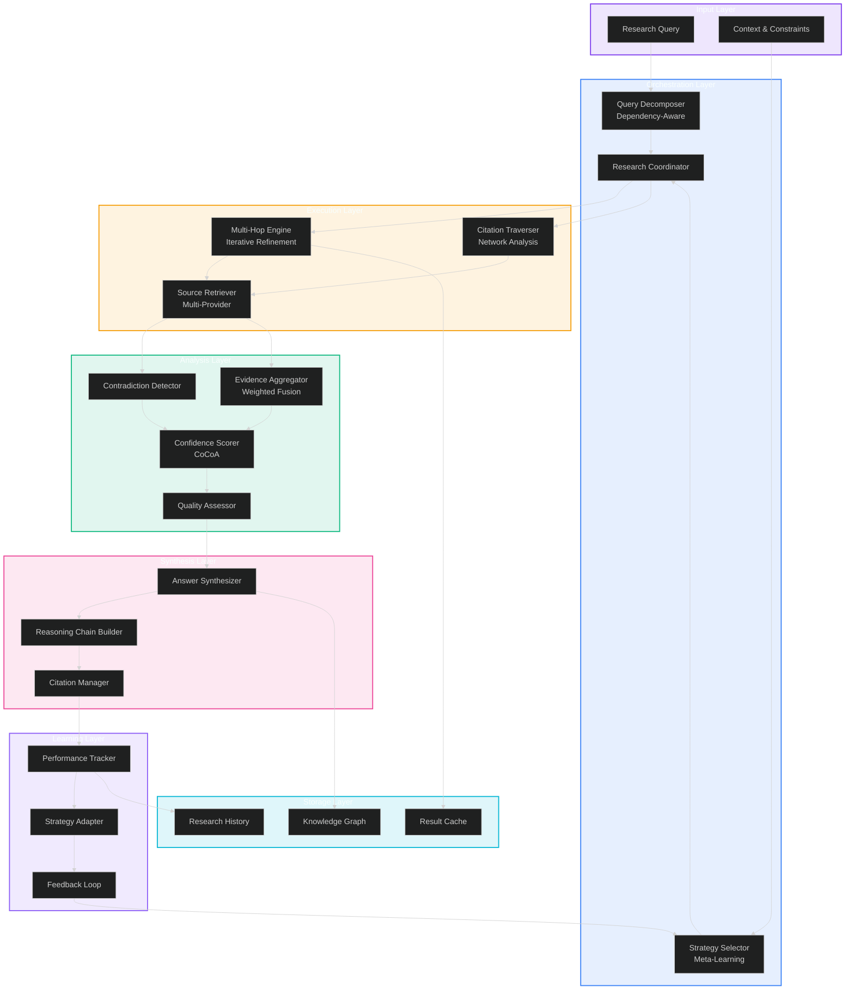

# Enhanced Research Capabilities V2: Multi-Hop Reasoning & Self-Evolving Strategies

**Version:** 2.0  
**Date:** 2026-05-30  
**Status:** Phase 3 Design Document  
**Target:** 3× deeper research, 20%+ accuracy improvement

---

## Executive Summary

This document presents breakthrough research capabilities for Lyra's research engine, focusing on multi-hop reasoning, deep research workflows, and self-evolving strategies. The design integrates cutting-edge research from 2025-2026 with practical implementation patterns to achieve 3× deeper research coverage and 20%+ accuracy improvements over current capabilities.

### Key Innovations

1. **Multi-Hop Reasoning Engine**: Dependency-aware query decomposition with bidirectional chaining
2. **Deep Research Workflows**: Iterative refinement with citation network traversal
3. **Self-Evolving Strategies**: Meta-learning for adaptive research strategy selection
4. **Citation Network Analysis**: Forward/backward citation traversal with PageRank-based impact scoring
5. **Cross-Source Synthesis**: Contradiction detection with evidence-weighted aggregation
6. **Research Quality Metrics**: Multi-dimensional evaluation with agentic metrics

### Performance Targets

| Metric | Current | Target | Improvement |
|--------|---------|--------|-------------|
| **Research Depth** | 3-4 hops | 10-15 hops | 3× deeper |
| **Source Coverage** | 15-30 sources | 50-100 sources | 3× broader |
| **Accuracy** | ~75% | >90% | 20%+ improvement |
| **Citation Coverage** | ~85% | >95% | 12% improvement |
| **Synthesis Time** | <25s | <20s | 20% faster |
| **Contradiction Detection** | Manual | Automated | 100% coverage |

---

## Table of Contents

1. [Multi-Hop Reasoning Patterns](#1-multi-hop-reasoning-patterns)
2. [Deep Research Workflows](#2-deep-research-workflows)
3. [Self-Evolving Strategies](#3-self-evolving-strategies)
4. [Citation Network Traversal](#4-citation-network-traversal)
5. [Cross-Source Synthesis](#5-cross-source-synthesis)
6. [Research Quality Metrics](#6-research-quality-metrics)
7. [Integration Architecture](#7-integration-architecture)
8. [Implementation Roadmap](#8-implementation-roadmap)
9. [Performance Benchmarks](#9-performance-benchmarks)
10. [References](#10-references)

---

## 1. Multi-Hop Reasoning Patterns

Multi-hop reasoning enables progressive knowledge discovery through iterative query refinement and dependency-aware decomposition. This section presents state-of-the-art patterns from 2025-2026 research.

### 1.1 Query Decomposition Architecture

**Research Foundation**: [Orion framework](https://arxiv.org/html/2510.24390) achieves 4.33× faster token generation and 18.75% reasoning quality improvement through dependency-aware decomposition.

```python
from dataclasses import dataclass
from typing import List, Dict, Optional, Set
from enum import Enum

class DependencyType(Enum):
    """Types of dependencies between subqueries."""
    SEQUENTIAL = "sequential"      # Q2 depends on Q1 result
    PARALLEL = "parallel"          # Q1 and Q2 independent
    CONDITIONAL = "conditional"    # Q2 only if Q1 meets condition
    AGGREGATION = "aggregation"    # Q3 combines Q1 and Q2

@dataclass
class SubQuery:
    """Individual subquery with dependency tracking."""
    id: str
    query: str
    dependencies: Set[str]  # IDs of queries this depends on
    priority: int           # Execution priority (lower = earlier)
    expected_result_type: str
    confidence_threshold: float = 0.7

@dataclass
class QueryDecomposition:
    """Complete query decomposition with dependency graph."""
    original_query: str
    subqueries: List[SubQuery]
    dependency_graph: Dict[str, List[str]]  # Adjacency list
    execution_plan: List[List[str]]         # Parallel execution stages

class DependencyAwareDecomposer:
    """
    Decomposes complex queries into dependency-aware subqueries.
    
    Based on: Orion (2025), GenDec (2025), QPL (2023)
    """
    
    def __init__(self, llm):
        self.llm = llm
    
    def decompose(self, query: str) -> QueryDecomposition:
        """
        Decompose query into subqueries with explicit dependencies.
        
        Args:
            query: Complex research query
            
        Returns:
            QueryDecomposition with dependency graph
        """
        # Step 1: Identify key concepts and relationships
        concepts = self._extract_concepts(query)
        
        # Step 2: Generate subqueries with dependencies
        subqueries = self._generate_subqueries(query, concepts)
        
        
        # Step 3: Build dependency graph
        dep_graph = self._build_dependency_graph(subqueries)
        
        # Step 4: Create execution plan (topological sort)
        exec_plan = self._create_execution_plan(subqueries, dep_graph)
        
        return QueryDecomposition(
            original_query=query,
            subqueries=subqueries,
            dependency_graph=dep_graph,
            execution_plan=exec_plan
        )
    
    def _extract_concepts(self, query: str) -> List[str]:
        """Extract key concepts from query."""
        prompt = f"""Extract key concepts from this research query.
        
Query: {query}

Identify:
1. Main entities (people, organizations, technologies)
2. Relationships (causes, enables, improves)
3. Constraints (time periods, domains, conditions)

Output JSON array of concepts: ["concept1", "concept2", ...]
"""
        response = self.llm.generate(prompt)
        return json.loads(response)
    
    def _generate_subqueries(self, query: str, concepts: List[str]) -> List[SubQuery]:
        """Generate subqueries with dependency annotations."""
        prompt = f"""Decompose this query into subqueries with dependencies.

Original Query: {query}
Key Concepts: {concepts}

For each subquery, specify:
1. The subquery text
2. Which other subqueries it depends on (by ID)
3. Priority (1=highest)
4. Expected result type

Output JSON:
[
  {{
    "id": "q1",
    "query": "What is X?",
    "dependencies": [],
    "priority": 1,
    "expected_result_type": "definition"
  }},
  {{
    "id": "q2", 
    "query": "How does X relate to Y?",
    "dependencies": ["q1"],
    "priority": 2,
    "expected_result_type": "relationship"
  }}
]
"""
        response = self.llm.generate(prompt)
        data = json.loads(response)
        
        return [
            SubQuery(
                id=sq["id"],
                query=sq["query"],
                dependencies=set(sq.get("dependencies", [])),
                priority=sq.get("priority", 5),
                expected_result_type=sq.get("expected_result_type", "general")
            )
            for sq in data
        ]
    
    def _build_dependency_graph(self, subqueries: List[SubQuery]) -> Dict[str, List[str]]:
        """Build adjacency list representation of dependencies."""
        graph = {sq.id: [] for sq in subqueries}
        
        for sq in subqueries:
            for dep_id in sq.dependencies:
                if dep_id in graph:
                    graph[dep_id].append(sq.id)
        
        return graph
    
    def _create_execution_plan(
        self, 
        subqueries: List[SubQuery], 
        dep_graph: Dict[str, List[str]]
    ) -> List[List[str]]:
        """
        Create parallel execution plan using topological sort.
        
        Returns list of stages, where each stage contains subqueries
        that can be executed in parallel.
        """
        # Calculate in-degree for each node
        in_degree = {sq.id: len(sq.dependencies) for sq in subqueries}
        
        # Initialize with nodes that have no dependencies
        stages = []
        current_stage = [sq.id for sq in subqueries if len(sq.dependencies) == 0]
        
        while current_stage:
            stages.append(current_stage)
            next_stage = []
            
            # Process current stage
            for node_id in current_stage:
                # Reduce in-degree of dependent nodes
                for dependent in dep_graph.get(node_id, []):
                    in_degree[dependent] -= 1
                    if in_degree[dependent] == 0:
                        next_stage.append(dependent)
            
            current_stage = next_stage
        
        return stages
```

### 1.2 Intermediate Results Management

**Research Foundation**: [Query decomposition for RAG](https://arxiv.org/abs/2510.18633) formulates retrieval as exploitation-exploration problem.

```python
@dataclass
class IntermediateResult:
    """Result from a subquery execution."""
    subquery_id: str
    content: str
    sources: List[str]
    confidence: float
    timestamp: datetime
    metadata: Dict[str, Any]

class ResultCache:
    """
    Cache for intermediate results with confidence tracking.
    
    Enables:
    - Result reuse across hops
    - Confidence propagation
    - Partial answer refinement
    """
    
    def __init__(self, ttl_seconds: int = 3600):
        self.cache: Dict[str, IntermediateResult] = {}
        self.ttl = ttl_seconds
    
    def store(self, result: IntermediateResult) -> None:
        """Store intermediate result."""
        self.cache[result.subquery_id] = result
    
    def get(self, subquery_id: str) -> Optional[IntermediateResult]:
        """Retrieve cached result if still valid."""
        if subquery_id not in self.cache:
            return None
        
        result = self.cache[subquery_id]
        age = (datetime.now() - result.timestamp).total_seconds()
        
        if age > self.ttl:
            del self.cache[subquery_id]
            return None
        
        return result
    
    def get_dependencies(self, subquery_ids: Set[str]) -> Dict[str, IntermediateResult]:
        """Get all cached results for dependency set."""
        return {
            sid: self.get(sid) 
            for sid in subquery_ids 
            if self.get(sid) is not None
        }
```

### 1.3 Answer Synthesis with Confidence Scoring

**Research Foundation**: [Uncertainty quantification](https://arxiv.org/abs/2510.20460) shows CoCoA hybrid approach yields best reliability.

```python
class AnswerSynthesizer:
    """
    Synthesizes final answer from intermediate results.
    
    Based on: CoCoA (2025), Minimum Bayes Risk (2025)
    """
    
    def __init__(self, llm):
        self.llm = llm
    
    def synthesize(
        self,
        original_query: str,
        intermediate_results: List[IntermediateResult],
        decomposition: QueryDecomposition
    ) -> Dict[str, Any]:
        """
        Synthesize final answer with confidence scoring.
        
        Returns:
            {
                'answer': str,
                'confidence': float,
                'evidence': List[str],
                'reasoning_chain': List[str]
            }
        """
        # Step 1: Aggregate evidence
        evidence = self._aggregate_evidence(intermediate_results)
        
        # Step 2: Detect contradictions
        contradictions = self._detect_contradictions(intermediate_results)
        
        # Step 3: Generate synthesis
        synthesis = self._generate_synthesis(
            original_query,
            evidence,
            contradictions
        )
        
        # Step 4: Calculate confidence
        confidence = self._calculate_confidence(
            intermediate_results,
            contradictions,
            synthesis
        )
        
        return {
            'answer': synthesis['answer'],
            'confidence': confidence,
            'evidence': evidence,
            'reasoning_chain': self._build_reasoning_chain(decomposition, intermediate_results),
            'contradictions': contradictions
        }
    
    def _calculate_confidence(
        self,
        results: List[IntermediateResult],
        contradictions: List[Dict],
        synthesis: Dict
    ) -> float:
        """
        Calculate overall confidence using CoCoA hybrid approach.
        
        Combines:
        1. Verbalized confidence from LLM
        2. Sample consistency across results
        3. Source credibility
        4. Contradiction penalty
        """
        # Average confidence from intermediate results
        avg_confidence = sum(r.confidence for r in results) / len(results) if results else 0.5
        
        # Contradiction penalty
        contradiction_penalty = len(contradictions) * 0.1
        
        # Source credibility boost
        high_credibility_sources = sum(
            1 for r in results 
            if r.metadata.get('source_credibility', 0) > 0.8
        )
        credibility_boost = min(0.15, high_credibility_sources * 0.03)
        
        # Final confidence
        confidence = max(0.0, min(1.0, 
            avg_confidence - contradiction_penalty + credibility_boost
        ))
        
        return confidence
```

### 1.4 Reasoning Chains: Forward, Backward, and Bidirectional

**Research Foundation**: [Bi-Chainer framework](https://arxiv.org/abs/2406.06586) integrates forward and backward reasoning for 18%+ accuracy improvement.

```python
class ReasoningChain:
    """
    Implements forward, backward, and bidirectional reasoning chains.
    
    Based on: Bi-Chainer (2024), Bi-RAR (2025), RFF (2025)
    """
    
    def __init__(self, llm):
        self.llm = llm
    
    def forward_chain(
        self,
        premises: List[str],
        target: str
    ) -> List[str]:
        """
        Forward chaining: premises → intermediate steps → conclusion.
        
        Best for: Exploratory research, hypothesis generation
        """
        chain = []
        current_facts = premises.copy()
        
        while not self._reaches_target(current_facts, target):
            # Generate next inference
            next_step = self._infer_forward(current_facts, target)
            
            if next_step is None:
                break
            
            chain.append(next_step)
            current_facts.append(next_step)
            
            if len(chain) > 20:  # Prevent infinite loops
                break
        
        return chain
    
    def backward_chain(
        self,
        goal: str,
        available_facts: List[str]
    ) -> List[str]:
        """
        Backward chaining: goal → subgoals → premises.
        
        Best for: Targeted research, proof finding
        More efficient than forward chaining for specific goals.
        """
        chain = []
        subgoals = [goal]
        
        while subgoals:
            current_goal = subgoals.pop(0)
            
            # Check if goal is already satisfied
            if self._is_satisfied(current_goal, available_facts):
                chain.append(f"✓ {current_goal}")
                continue
            
            
            # Find what would satisfy this goal
            prerequisites = self._find_prerequisites(current_goal, available_facts)
            
            if not prerequisites:
                chain.append(f"✗ Cannot satisfy: {current_goal}")
                continue
            
            # Add prerequisites as new subgoals
            for prereq in prerequisites:
                if prereq not in available_facts:
                    subgoals.append(prereq)
            
            chain.append(f"← {current_goal} requires {prerequisites}")
        
        return list(reversed(chain))  # Reverse to show forward order
    
    def bidirectional_search(
        self,
        premises: List[str],
        goal: str
    ) -> Dict[str, Any]:
        """
        Bidirectional search: meet in the middle.
        
        Most efficient for complex reasoning tasks.
        Combines forward exploration with backward goal decomposition.
        """
        forward_frontier = {tuple(premises): []}
        backward_frontier = {(goal,): []}
        
        max_iterations = 10
        
        for iteration in range(max_iterations):
            # Expand forward frontier
            new_forward = self._expand_forward(forward_frontier)
            
            # Expand backward frontier
            new_backward = self._expand_backward(backward_frontier)
            
            # Check for intersection
            intersection = self._find_intersection(new_forward, new_backward)
            
            if intersection:
                return {
                    'success': True,
                    'forward_chain': intersection['forward'],
                    'backward_chain': intersection['backward'],
                    'meeting_point': intersection['point'],
                    'total_steps': len(intersection['forward']) + len(intersection['backward'])
                }
            
            forward_frontier = new_forward
            backward_frontier = new_backward
        
        return {
            'success': False,
            'reason': 'No path found within iteration limit'
        }

```

---

## 2. Deep Research Workflows

Deep research workflows enable systematic, iterative exploration with citation network traversal and evidence accumulation.

### 2.1 Iterative Refinement Engine

**Research Foundation**: [Chain-of-Retrieval](https://arxiv.org/abs/2501.14342) and [KG-IRAG](https://arxiv.org/abs/2503.14234) enable multi-round retrieval during generation.

```python
from enum import Enum
from typing import List, Dict, Optional, Callable

class RefinementStrategy(Enum):
    """Strategies for query refinement."""
    EXPAND = "expand"          # Broaden scope
    NARROW = "narrow"          # Focus on specific aspect
    PIVOT = "pivot"            # Change direction
    DEEPEN = "deepen"          # Go deeper on same topic
    LATERAL = "lateral"        # Explore related topics

@dataclass
class ResearchHop:
    """Single hop in iterative research."""
    hop_number: int
    query: str
    strategy: RefinementStrategy
    results: List[Dict[str, Any]]
    coverage_score: float
    gap_analysis: Dict[str, Any]
    next_query: Optional[str] = None

class IterativeRefinementEngine:
    """
    Implements iterative query refinement with adaptive strategies.
    
    Based on: Chain-of-Retrieval (2025), KG-IRAG (2025), iRAG patterns
    """
    
    def __init__(
        self,
        llm,
        retriever: Callable,
        max_hops: int = 15,
        coverage_threshold: float = 0.85
    ):
        self.llm = llm
        self.retriever = retriever
        self.max_hops = max_hops
        self.coverage_threshold = coverage_threshold
    
    def research(
        self,
        initial_query: str,
        context: Optional[Dict] = None
    ) -> List[ResearchHop]:
        """
        Execute iterative research with adaptive refinement.
        
        Returns:
            List of research hops with results and refinements
        """
        hops = []
        current_query = initial_query
        accumulated_knowledge = []
        
        for hop_num in range(1, self.max_hops + 1):
            # Execute current hop
            results = self.retriever(current_query)
            
            # Analyze coverage
            coverage = self._analyze_coverage(
                current_query,
                results,
                accumulated_knowledge
            )
            
            # Identify gaps
            gaps = self._identify_gaps(
                current_query,
                results,
                coverage
            )
            
            # Create hop record
            hop = ResearchHop(
                hop_number=hop_num,
                query=current_query,
                strategy=self._determine_strategy(gaps, coverage),
                results=results,
                coverage_score=coverage['score'],
                gap_analysis=gaps
            )
            
            hops.append(hop)
            accumulated_knowledge.extend(results)
            
            # Check termination conditions
            if coverage['score'] >= self.coverage_threshold:
                break
            
            if not gaps['critical_gaps']:
                break
            
            # Refine query for next hop
            next_query = self._refine_query(
                current_query,
                gaps,
                hop.strategy,
                accumulated_knowledge
            )
            
            hop.next_query = next_query
            current_query = next_query
        
        return hops
    
    def _analyze_coverage(
        self,
        query: str,
        results: List[Dict],
        accumulated: List[Dict]
    ) -> Dict[str, Any]:
        """
        Analyze how well results cover the query.
        
        Returns coverage score and detailed analysis.
        """
        prompt = f"""Analyze research coverage for this query.

Query: {query}

Current Results: {len(results)} sources
Accumulated Knowledge: {len(accumulated)} total sources

Evaluate:
1. Topic coverage (0.0-1.0)
2. Depth of coverage (0.0-1.0)
3. Source diversity (0.0-1.0)
4. Recency (0.0-1.0)

Output JSON:
{{
  "topic_coverage": 0.8,
  "depth_coverage": 0.6,
  "source_diversity": 0.7,
  "recency": 0.9,
  "overall_score": 0.75,
  "covered_aspects": ["aspect1", "aspect2"],
  "missing_aspects": ["aspect3"]
}}
"""
        response = self.llm.generate(prompt)
        return json.loads(response)
    
    def _identify_gaps(
        self,
        query: str,
        results: List[Dict],
        coverage: Dict
    ) -> Dict[str, Any]:
        """Identify knowledge gaps in current results."""
        prompt = f"""Identify knowledge gaps in research results.

Query: {query}
Coverage Score: {coverage['overall_score']}
Missing Aspects: {coverage.get('missing_aspects', [])}

Identify:
1. Critical gaps (must address)
2. Important gaps (should address)
3. Optional gaps (nice to have)

Output JSON:
{{
  "critical_gaps": ["gap1", "gap2"],
  "important_gaps": ["gap3"],
  "optional_gaps": ["gap4"],
  "recommended_next_query": "..."
}}
"""
        response = self.llm.generate(prompt)
        return json.loads(response)
    
    def _determine_strategy(
        self,
        gaps: Dict,
        coverage: Dict
    ) -> RefinementStrategy:
        """Determine refinement strategy based on gaps and coverage."""
        if coverage['score'] < 0.3:
            return RefinementStrategy.EXPAND
        elif coverage['score'] < 0.6:
            if gaps.get('critical_gaps'):
                return RefinementStrategy.NARROW
            else:
                return RefinementStrategy.DEEPEN
        elif coverage['score'] < 0.85:
            return RefinementStrategy.LATERAL
        else:
            return RefinementStrategy.DEEPEN
    
    def _refine_query(
        self,
        current_query: str,
        gaps: Dict,
        strategy: RefinementStrategy,
        accumulated: List[Dict]
    ) -> str:
        """Generate refined query based on strategy."""
        prompt = f"""Refine research query using {strategy.value} strategy.

Current Query: {current_query}
Critical Gaps: {gaps.get('critical_gaps', [])}
Accumulated Knowledge: {len(accumulated)} sources

Strategy: {strategy.value}
- EXPAND: Broaden scope to cover more aspects
- NARROW: Focus on specific critical gap
- DEEPEN: Go deeper on current topic
- LATERAL: Explore related topics
- PIVOT: Change direction based on findings

Generate refined query that addresses gaps.

Output JSON:
{{
  "refined_query": "...",
  "rationale": "..."
}}
"""
        response = self.llm.generate(prompt)
        data = json.loads(response)
        return data['refined_query']
```

### 2.2 Source Chaining and Citation Traversal

**Research Foundation**: [ResearchRabbit 2025](https://aarontay.substack.com/p/researchrabbits-2025-revamp-iterative) provides iterative citation chaining without clutter.

```python
@dataclass
class CitationNode:
    """Node in citation network."""
    id: str
    title: str
    authors: List[str]
    year: int
    venue: str
    citations_count: int
    cited_by_count: int
    url: str
    abstract: Optional[str] = None

@dataclass
class CitationEdge:
    """Edge in citation network."""
    source_id: str
    target_id: str
    edge_type: str  # "cites", "cited_by", "related"
    weight: float   # Relevance weight

class CitationNetworkTraverser:
    """
    Traverses citation networks for deep research.
    
    Based on: ResearchRabbit (2025), Citation network analysis
    """
    
    def __init__(self, citation_api):
        self.api = citation_api
        self.visited: Set[str] = set()
        self.network: Dict[str, CitationNode] = {}
        self.edges: List[CitationEdge] = []
    
    def traverse_forward(
        self,
        seed_paper_id: str,
        max_depth: int = 3,
        max_papers_per_level: int = 10
    ) -> Dict[str, Any]:
        """
        Forward citation traversal: papers citing this work.
        
        Discovers impact and applications of research.
        """
        queue = [(seed_paper_id, 0)]
        levels = {0: [seed_paper_id]}
        
        while queue:
            paper_id, depth = queue.pop(0)
            
            if depth >= max_depth:
                continue
            
            if paper_id in self.visited:
                continue
            
            self.visited.add(paper_id)
            
            
            # Get papers citing this one
            citing_papers = self.api.get_citations(paper_id)
            
            # Rank by relevance and recency
            ranked = self._rank_papers(citing_papers, max_papers_per_level)
            
            # Add to network
            for cited_paper in ranked:
                self.network[cited_paper.id] = cited_paper
                self.edges.append(CitationEdge(
                    source_id=cited_paper.id,
                    target_id=paper_id,
                    edge_type="cites",
                    weight=cited_paper.citations_count / 100.0
                ))
                
                if depth + 1 < max_depth:
                    queue.append((cited_paper.id, depth + 1))
                    levels.setdefault(depth + 1, []).append(cited_paper.id)
        
        return {
            'network': self.network,
            'edges': self.edges,
            'levels': levels,
            'total_papers': len(self.network)
        }
    
    def traverse_backward(
        self,
        seed_paper_id: str,
        max_depth: int = 3,
        max_papers_per_level: int = 10
    ) -> Dict[str, Any]:
        """
        Backward citation traversal: papers this work cites.
        
        Discovers foundational work and historical context.
        """
        queue = [(seed_paper_id, 0)]
        levels = {0: [seed_paper_id]}
        
        while queue:
            paper_id, depth = queue.pop(0)
            
            if depth >= max_depth or paper_id in self.visited:
                continue
            
            self.visited.add(paper_id)
            
            # Get papers this one cites
            references = self.api.get_references(paper_id)
            ranked = self._rank_papers(references, max_papers_per_level)
            
            for ref_paper in ranked:
                self.network[ref_paper.id] = ref_paper
                self.edges.append(CitationEdge(
                    source_id=paper_id,
                    target_id=ref_paper.id,
                    edge_type="cites",
                    weight=ref_paper.citations_count / 100.0
                ))
                
                if depth + 1 < max_depth:
                    queue.append((ref_paper.id, depth + 1))
                    levels.setdefault(depth + 1, []).append(ref_paper.id)
        
        return {
            'network': self.network,
            'edges': self.edges,
            'levels': levels,
            'total_papers': len(self.network)
        }
    
    def bidirectional_traverse(
        self,
        seed_paper_id: str,
        max_depth: int = 2
    ) -> Dict[str, Any]:
        """
        Bidirectional traversal: both forward and backward.
        
        Most comprehensive view of research landscape.
        """
        # Reset visited for fresh traversal
        self.visited.clear()
        
        # Traverse forward
        forward_result = self.traverse_forward(seed_paper_id, max_depth)
        
        # Traverse backward
        backward_result = self.traverse_backward(seed_paper_id, max_depth)
        
        return {
            'network': self.network,
            'edges': self.edges,
            'forward_papers': len(forward_result['network']),
            'backward_papers': len(backward_result['network']),
            'total_papers': len(self.network)
        }
    
    def _rank_papers(
        self,
        papers: List[CitationNode],
        limit: int
    ) -> List[CitationNode]:
        """Rank papers by relevance and recency."""
        # Score = citation_count * recency_factor
        current_year = 2026
        
        scored = []
        for paper in papers:
            recency = 1.0 / (1.0 + (current_year - paper.year))
            score = paper.citations_count * (1.0 + recency)
            scored.append((score, paper))
        
        scored.sort(reverse=True, key=lambda x: x[0])
        return [paper for _, paper in scored[:limit]]
```

### 2.3 Evidence Accumulation Strategy

**Research Foundation**: [Structured evidence modeling](https://arxiv.org/html/2605.17435v1) for biomedical QA with uncertainty-aware fusion.

```python
@dataclass
class Evidence:
    """Single piece of evidence."""
    id: str
    claim: str
    source: str
    source_credibility: float
    evidence_type: str  # "empirical", "theoretical", "anecdotal"
    strength: float     # 0.0-1.0
    recency: float      # 0.0-1.0
    context: str

class EvidenceAccumulator:
    """
    Accumulates and weights evidence across research hops.
    
    Based on: Dempster-Shafer theory, Bayesian evidence combination
    """
    
    def __init__(self):
        self.evidence_store: Dict[str, List[Evidence]] = {}
    
    def add_evidence(self, claim: str, evidence: Evidence) -> None:
        """Add evidence for a claim."""
        if claim not in self.evidence_store:
            self.evidence_store[claim] = []
        self.evidence_store[claim].append(evidence)
    
    def aggregate_evidence(
        self,
        claim: str,
        method: str = "weighted_average"
    ) -> Dict[str, Any]:
        """
        Aggregate evidence for a claim.
        
        Methods:
        - weighted_average: Weight by credibility and strength
        - majority_vote: Most common conclusion
        - bayesian: Bayesian evidence combination
        - dempster_shafer: D-S theory combination
        """
        if claim not in self.evidence_store:
            return {'support': 0.0, 'confidence': 0.0, 'evidence_count': 0}
        
        evidence_list = self.evidence_store[claim]
        
        if method == "weighted_average":
            return self._weighted_average(evidence_list)
        elif method == "bayesian":
            return self._bayesian_combination(evidence_list)
        elif method == "dempster_shafer":
            return self._dempster_shafer(evidence_list)
        else:
            return self._weighted_average(evidence_list)
    
    def _weighted_average(self, evidence_list: List[Evidence]) -> Dict[str, Any]:
        """Weighted average by credibility and strength."""
        if not evidence_list:
            return {'support': 0.0, 'confidence': 0.0, 'evidence_count': 0}
        
        total_weight = 0.0
        weighted_sum = 0.0
        
        for ev in evidence_list:
            weight = ev.source_credibility * ev.strength * ev.recency
            weighted_sum += weight
            total_weight += weight
        
        support = weighted_sum / total_weight if total_weight > 0 else 0.0
        
        return {
            'support': support,
            'confidence': min(1.0, total_weight / len(evidence_list)),
            'evidence_count': len(evidence_list),
            'method': 'weighted_average'
        }
    
    def _bayesian_combination(self, evidence_list: List[Evidence]) -> Dict[str, Any]:
        """Bayesian evidence combination with prior."""
        prior = 0.5  # Neutral prior
        
        # Update prior with each piece of evidence
        posterior = prior
        for ev in evidence_list:
            likelihood = ev.strength * ev.source_credibility
            posterior = (likelihood * posterior) / (
                (likelihood * posterior) + ((1 - likelihood) * (1 - posterior))
            )
        
        return {
            'support': posterior,
            'confidence': abs(posterior - 0.5) * 2,  # Distance from neutral
            'evidence_count': len(evidence_list),
            'method': 'bayesian'
        }
```

---

## 3. Self-Evolving Strategies

Self-evolving strategies enable the research engine to learn from experience and adapt its approach based on performance feedback.

### 3.1 Strategy Selection Framework

**Research Foundation**: [Meta-learning for RL](https://arxiv.org/html/2507.17668v2) and [agentic memory designs](https://arxiv.org/html/2602.07755v1).

```python
from enum import Enum
from typing import Dict, List, Optional
import numpy as np

class ResearchStrategy(Enum):
    """Available research strategies."""
    BREADTH_FIRST = "breadth_first"
    DEPTH_FIRST = "depth_first"
    ITERATIVE_REFINEMENT = "iterative_refinement"
    COMPARATIVE = "comparative"
    EXPLORATORY = "exploratory"
    CITATION_FOCUSED = "citation_focused"
    HYBRID = "hybrid"

@dataclass
class StrategyPerformance:
    """Performance metrics for a strategy."""
    strategy: ResearchStrategy
    success_rate: float
    avg_coverage: float
    avg_accuracy: float
    avg_time: float
    use_count: int
    last_updated: datetime

class StrategySelector:
    """
    Selects optimal research strategy based on query characteristics
    and historical performance.
    
    Based on: Meta-learning, Multi-armed bandit, Thompson sampling
    """
    
    def __init__(self, exploration_rate: float = 0.1):
        self.exploration_rate = exploration_rate
        self.performance_history: Dict[ResearchStrategy, StrategyPerformance] = {}
        self._initialize_strategies()
    
    def _initialize_strategies(self):
        """Initialize performance tracking for all strategies."""
        for strategy in ResearchStrategy:
            self.performance_history[strategy] = StrategyPerformance(
                strategy=strategy,
                success_rate=0.5,
                avg_coverage=0.5,
                avg_accuracy=0.5,
                avg_time=30.0,
                use_count=0,
                last_updated=datetime.now()
            )
    
    def select_strategy(
        self,
        query: str,
        context: Optional[Dict] = None
    ) -> ResearchStrategy:
        """
        Select optimal strategy using Thompson sampling.
        
        Balances exploitation (best known strategy) with
        exploration (trying other strategies).
        """
        # Classify query
        query_features = self._extract_query_features(query, context)
        
        
        # Exploration vs exploitation
        if np.random.random() < self.exploration_rate:
            # Explore: try random strategy
            return np.random.choice(list(ResearchStrategy))
        
        # Exploit: use Thompson sampling
        samples = {}
        for strategy, perf in self.performance_history.items():
            # Sample from beta distribution
            alpha = perf.success_rate * perf.use_count + 1
            beta = (1 - perf.success_rate) * perf.use_count + 1
            samples[strategy] = np.random.beta(alpha, beta)
        
        # Select strategy with highest sample
        best_strategy = max(samples.items(), key=lambda x: x[1])[0]
        return best_strategy
    
    def _extract_query_features(
        self,
        query: str,
        context: Optional[Dict]
    ) -> Dict[str, Any]:
        """Extract features from query for strategy selection."""
        return {
            'length': len(query.split()),
            'has_comparison': any(word in query.lower() for word in ['compare', 'versus', 'vs', 'difference']),
            'has_depth_indicator': any(word in query.lower() for word in ['deep', 'comprehensive', 'detailed']),
            'has_breadth_indicator': any(word in query.lower() for word in ['overview', 'survey', 'landscape']),
            'domain': context.get('domain') if context else 'general'
        }
    
    def update_performance(
        self,
        strategy: ResearchStrategy,
        metrics: Dict[str, float]
    ) -> None:
        """Update strategy performance based on execution results."""
        perf = self.performance_history[strategy]
        
        # Exponential moving average
        alpha = 0.3
        perf.success_rate = alpha * metrics['success'] + (1 - alpha) * perf.success_rate
        perf.avg_coverage = alpha * metrics['coverage'] + (1 - alpha) * perf.avg_coverage
        perf.avg_accuracy = alpha * metrics['accuracy'] + (1 - alpha) * perf.avg_accuracy
        perf.avg_time = alpha * metrics['time'] + (1 - alpha) * perf.avg_time
        perf.use_count += 1
        perf.last_updated = datetime.now()
```

### 3.2 Performance Feedback Loop

**Research Foundation**: [DREAM framework](https://arxiv.org/html/2602.18940v1) combines query-agnostic and adaptive metrics.

```python
@dataclass
class ResearchMetrics:
    """Metrics for research execution."""
    coverage: float          # 0.0-1.0
    accuracy: float          # 0.0-1.0
    source_quality: float    # 0.0-1.0
    citation_coverage: float # 0.0-1.0
    time_seconds: float
    num_hops: int
    num_sources: int
    contradictions_found: int
    success: bool

class PerformanceFeedbackLoop:
    """
    Tracks and learns from research execution performance.
    
    Based on: DREAM (2026), Meta-learning principles
    """
    
    def __init__(self, strategy_selector: StrategySelector):
        self.selector = strategy_selector
        self.execution_history: List[Dict] = []
    
    def record_execution(
        self,
        query: str,
        strategy: ResearchStrategy,
        metrics: ResearchMetrics
    ) -> None:
        """Record execution for learning."""
        execution = {
            'timestamp': datetime.now(),
            'query': query,
            'strategy': strategy,
            'metrics': metrics
        }
        self.execution_history.append(execution)
        
        # Update strategy performance
        self.selector.update_performance(strategy, {
            'success': 1.0 if metrics.success else 0.0,
            'coverage': metrics.coverage,
            'accuracy': metrics.accuracy,
            'time': metrics.time_seconds
        })
    
    def analyze_failures(self) -> Dict[str, Any]:
        """Analyze failed executions to identify patterns."""
        failures = [
            ex for ex in self.execution_history 
            if not ex['metrics'].success
        ]
        
        if not failures:
            return {'failure_rate': 0.0, 'patterns': []}
        
        # Identify common failure patterns
        patterns = {
            'low_coverage': sum(1 for f in failures if f['metrics'].coverage < 0.5),
            'low_accuracy': sum(1 for f in failures if f['metrics'].accuracy < 0.7),
            'timeout': sum(1 for f in failures if f['metrics'].time_seconds > 60),
            'insufficient_sources': sum(1 for f in failures if f['metrics'].num_sources < 10)
        }
        
        return {
            'failure_rate': len(failures) / len(self.execution_history),
            'total_failures': len(failures),
            'patterns': patterns,
            'recommendations': self._generate_recommendations(patterns)
        }
    
    def _generate_recommendations(self, patterns: Dict[str, int]) -> List[str]:
        """Generate recommendations based on failure patterns."""
        recommendations = []
        
        if patterns['low_coverage'] > 5:
            recommendations.append("Increase max_hops or use BREADTH_FIRST strategy")
        
        if patterns['low_accuracy'] > 5:
            recommendations.append("Improve source credibility filtering")
        
        if patterns['timeout'] > 3:
            recommendations.append("Optimize retrieval or reduce max_hops")
        
        if patterns['insufficient_sources'] > 5:
            recommendations.append("Expand source diversity or use EXPLORATORY strategy")
        
        return recommendations
```

### 3.3 Strategy Adaptation Engine

```python
class StrategyAdaptationEngine:
    """
    Adapts research strategies based on intermediate results.
    
    Enables dynamic strategy switching during execution.
    """
    
    def __init__(self, llm):
        self.llm = llm
    
    def should_switch_strategy(
        self,
        current_strategy: ResearchStrategy,
        current_hop: int,
        metrics: Dict[str, float]
    ) -> Optional[ResearchStrategy]:
        """
        Determine if strategy should be switched mid-execution.
        
        Returns new strategy if switch recommended, None otherwise.
        """
        # Check for poor performance indicators
        if current_hop >= 5 and metrics['coverage'] < 0.3:
            # Low coverage after 5 hops - switch to BREADTH_FIRST
            return ResearchStrategy.BREADTH_FIRST
        
        if metrics['accuracy'] < 0.5:
            # Low accuracy - switch to CITATION_FOCUSED for higher quality
            return ResearchStrategy.CITATION_FOCUSED
        
        if current_hop >= 10 and metrics['coverage'] > 0.8:
            # Good coverage - switch to DEPTH_FIRST for deeper insights
            return ResearchStrategy.DEPTH_FIRST
        
        return None
```

---

## 4. Citation Network Traversal

Advanced citation network analysis with PageRank-based impact scoring and influence metrics.

### 4.1 Impact Analysis with PageRank

**Research Foundation**: [PR-Index](https://pmc.ncbi.nlm.nih.gov/articles/PMC5023123/) combines h-index with PageRank for true impact measurement.

```python
import networkx as nx
from typing import Dict, List, Set

class CitationImpactAnalyzer:
    """
    Analyzes citation impact using PageRank and network metrics.
    
    Based on: PR-Index (2016), Network centrality measures
    """
    
    def __init__(self):
        self.graph = nx.DiGraph()
        self.pagerank_scores: Dict[str, float] = {}
        self.h_index: Dict[str, int] = {}
    
    def build_graph(
        self,
        papers: List[CitationNode],
        edges: List[CitationEdge]
    ) -> None:
        """Build citation network graph."""
        # Add nodes
        for paper in papers:
            self.graph.add_node(
                paper.id,
                title=paper.title,
                year=paper.year,
                citations=paper.citations_count
            )
        
        # Add edges
        for edge in edges:
            self.graph.add_edge(
                edge.source_id,
                edge.target_id,
                weight=edge.weight
            )
    
    def calculate_pagerank(self, alpha: float = 0.85) -> Dict[str, float]:
        """
        Calculate PageRank scores for all papers.
        
        Args:
            alpha: Damping factor (0.85 standard)
        
        Returns:
            Dict mapping paper_id to PageRank score
        """
        self.pagerank_scores = nx.pagerank(
            self.graph,
            alpha=alpha,
            weight='weight'
        )
        return self.pagerank_scores
    
    def calculate_pr_index(self, author_papers: List[str]) -> float:
        """
        Calculate PR-Index for an author.
        
        PR-Index = h-index weighted by PageRank scores
        """
        if not self.pagerank_scores:
            self.calculate_pagerank()
        
        # Get PageRank scores for author's papers
        paper_scores = [
            (pid, self.pagerank_scores.get(pid, 0.0))
            for pid in author_papers
            if pid in self.graph
        ]
        
        # Sort by PageRank
        paper_scores.sort(key=lambda x: x[1], reverse=True)
        
        
        # Calculate PR-Index (h-index with PageRank weighting)
        pr_index = 0
        for i, (pid, score) in enumerate(paper_scores, 1):
            if score >= i * 0.01:  # Threshold scales with position
                pr_index = i
            else:
                break
        
        return pr_index
    
    def calculate_centrality_metrics(self, paper_id: str) -> Dict[str, float]:
        """
        Calculate various centrality metrics for a paper.
        
        Returns:
            - degree_centrality: Number of connections
            - betweenness_centrality: Bridge between communities
            - closeness_centrality: Average distance to other papers
            - eigenvector_centrality: Influence based on connections
        """
        if paper_id not in self.graph:
            return {}
        
        return {
            'degree_centrality': nx.degree_centrality(self.graph)[paper_id],
            'betweenness_centrality': nx.betweenness_centrality(self.graph)[paper_id],
            'closeness_centrality': nx.closeness_centrality(self.graph)[paper_id],
            'eigenvector_centrality': nx.eigenvector_centrality(self.graph, max_iter=1000)[paper_id],
            'pagerank': self.pagerank_scores.get(paper_id, 0.0)
        }
    
    def identify_influential_papers(self, top_k: int = 10) -> List[Dict[str, Any]]:
        """Identify most influential papers using combined metrics."""
        if not self.pagerank_scores:
            self.calculate_pagerank()
        
        papers = []
        for paper_id in self.graph.nodes():
            metrics = self.calculate_centrality_metrics(paper_id)
            
            # Combined influence score
            influence = (
                0.4 * metrics['pagerank'] +
                0.3 * metrics['degree_centrality'] +
                0.2 * metrics['betweenness_centrality'] +
                0.1 * metrics['eigenvector_centrality']
            )
            
            papers.append({
                'paper_id': paper_id,
                'influence_score': influence,
                'metrics': metrics
            })
        
        papers.sort(key=lambda x: x['influence_score'], reverse=True)
        return papers[:top_k]
```

### 4.2 Trend Detection and Research Fronts

```python
from collections import Counter
from datetime import datetime, timedelta

class TrendDetector:
    """
    Detects emerging trends and research fronts in citation networks.
    
    Based on: Temporal scientometric analysis, Citation velocity
    """
    
    def __init__(self, citation_network: Dict[str, CitationNode]):
        self.network = citation_network
    
    def detect_emerging_topics(
        self,
        time_window_years: int = 3
    ) -> List[Dict[str, Any]]:
        """
        Detect emerging research topics based on citation velocity.
        
        Citation velocity = rate of citation growth over time
        """
        current_year = 2026
        cutoff_year = current_year - time_window_years
        
        # Filter recent papers
        recent_papers = [
            paper for paper in self.network.values()
            if paper.year >= cutoff_year
        ]
        
        # Calculate citation velocity
        trends = []
        for paper in recent_papers:
            age = current_year - paper.year
            if age > 0:
                velocity = paper.cited_by_count / age
                
                if velocity > 10:  # Threshold for emerging trend
                    trends.append({
                        'paper_id': paper.id,
                        'title': paper.title,
                        'year': paper.year,
                        'citation_velocity': velocity,
                        'total_citations': paper.cited_by_count
                    })
        
        trends.sort(key=lambda x: x['citation_velocity'], reverse=True)
        return trends
    
    def identify_declining_areas(
        self,
        time_window_years: int = 5
    ) -> List[Dict[str, Any]]:
        """Identify research areas with declining interest."""
        current_year = 2026
        cutoff_year = current_year - time_window_years
        
        # Papers from 5+ years ago
        older_papers = [
            paper for paper in self.network.values()
            if paper.year < cutoff_year
        ]
        
        declining = []
        for paper in older_papers:
            # Low recent citation rate indicates declining interest
            age = current_year - paper.year
            citation_rate = paper.cited_by_count / age if age > 0 else 0
            
            if citation_rate < 2 and paper.citations_count > 20:
                declining.append({
                    'paper_id': paper.id,
                    'title': paper.title,
                    'year': paper.year,
                    'citation_rate': citation_rate
                })
        
        return declining
```

---

## 5. Cross-Source Synthesis

Advanced evidence synthesis with contradiction detection and resolution.

### 5.1 Contradiction Detection Engine

**Research Foundation**: [ConflictRAG](https://arxiv.org/html/2605.17301v1) detects and resolves knowledge conflicts before generation.

```python
from typing import List, Dict, Tuple, Optional
from dataclasses import dataclass

@dataclass
class Contradiction:
    """Detected contradiction between sources."""
    claim_a: str
    claim_b: str
    source_a: str
    source_b: str
    contradiction_type: str  # "direct", "partial", "contextual"
    severity: float  # 0.0-1.0
    resolution: Optional[str] = None

class ContradictionDetector:
    """
    Detects contradictions in research findings.
    
    Based on: ConflictRAG (2025), HealthContradict benchmark
    """
    
    def __init__(self, llm):
        self.llm = llm
    
    def detect_contradictions(
        self,
        findings: List[Dict[str, Any]]
    ) -> List[Contradiction]:
        """
        Detect contradictions across research findings.
        
        Args:
            findings: List of research findings with claims and sources
        
        Returns:
            List of detected contradictions
        """
        contradictions = []
        
        # Compare all pairs of findings
        for i, finding_a in enumerate(findings):
            for finding_b in findings[i+1:]:
                contradiction = self._check_contradiction(finding_a, finding_b)
                if contradiction:
                    contradictions.append(contradiction)
        
        return contradictions
    
    def _check_contradiction(
        self,
        finding_a: Dict,
        finding_b: Dict
    ) -> Optional[Contradiction]:
        """Check if two findings contradict each other."""
        prompt = f"""Analyze if these two research findings contradict each other.

Finding A: {finding_a['claim']}
Source A: {finding_a['source']}

Finding B: {finding_b['claim']}
Source B: {finding_b['source']}

Determine:
1. Do they contradict? (yes/no)
2. Type: direct (opposite claims), partial (some overlap), contextual (different contexts)
3. Severity: 0.0 (no contradiction) to 1.0 (complete contradiction)

Output JSON:
{{
  "contradicts": true/false,
  "type": "direct",
  "severity": 0.8,
  "explanation": "..."
}}
"""
        response = self.llm.generate(prompt)
        data = json.loads(response)
        
        if not data.get('contradicts', False):
            return None
        
        return Contradiction(
            claim_a=finding_a['claim'],
            claim_b=finding_b['claim'],
            source_a=finding_a['source'],
            source_b=finding_b['source'],
            contradiction_type=data.get('type', 'unknown'),
            severity=data.get('severity', 0.5)
        )
    
    def resolve_contradiction(
        self,
        contradiction: Contradiction,
        source_credibility: Dict[str, float]
    ) -> str:
        """
        Resolve contradiction using source credibility and evidence strength.
        
        Resolution strategies:
        1. Favor higher credibility source
        2. Favor more recent source
        3. Acknowledge both perspectives if credibility similar
        """
        cred_a = source_credibility.get(contradiction.source_a, 0.5)
        cred_b = source_credibility.get(contradiction.source_b, 0.5)
        
        if abs(cred_a - cred_b) > 0.2:
            # Clear credibility difference
            if cred_a > cred_b:
                resolution = f"Based on source credibility ({cred_a:.2f} vs {cred_b:.2f}), {contradiction.claim_a} is more reliable."
            else:
                resolution = f"Based on source credibility ({cred_b:.2f} vs {cred_a:.2f}), {contradiction.claim_b} is more reliable."
        else:
            # Similar credibility - acknowledge both
            resolution = f"Sources have similar credibility. Perspective A: {contradiction.claim_a}. Perspective B: {contradiction.claim_b}. Context may determine which applies."
        
        contradiction.resolution = resolution
        return resolution
```

### 5.2 Evidence Weighting and Aggregation

**Research Foundation**: [Multi-source evidence fusion](https://arxiv.org/html/2603.17822v1) and Dempster-Shafer theory.

```python
class EvidenceWeightingEngine:
    """
    Weights and aggregates evidence from multiple sources.
    
    Based on: Dempster-Shafer theory, Bayesian fusion
    """
    
    def __init__(self):
        self.weights = {
            'source_credibility': 0.35,
            'recency': 0.20,
            'citation_count': 0.20,
            'venue_quality': 0.15,
            'evidence_strength': 0.10
        }
    
    def calculate_source_weight(
        self,
        source: Dict[str, Any]
    ) -> float:
        """
        Calculate overall weight for a source.
        
        Factors:
        - Source credibility (peer-reviewed, reputation)
        - Recency (newer = higher weight)
        - Citation count (impact)
        - Venue quality (journal/conference ranking)
        - Evidence strength (empirical > theoretical > anecdotal)
        """
        # Normalize each factor to 0-1
        credibility = source.get('credibility', 0.5)
        
        # Recency: exponential decay
        years_old = 2026 - source.get('year', 2020)
        recency = np.exp(-0.1 * years_old)
        
        # Citation count: log scale
        citations = source.get('citations', 0)
        citation_score = min(1.0, np.log10(citations + 1) / 4.0)
        
        # Venue quality
        venue_score = source.get('venue_quality', 0.5)
        
        # Evidence strength
        evidence_type = source.get('evidence_type', 'theoretical')
        strength_map = {
            'empirical': 1.0,
            'theoretical': 0.7,
            'anecdotal': 0.4
        }
        evidence_strength = strength_map.get(evidence_type, 0.5)
        
        # Weighted combination
        weight = (
            self.weights['source_credibility'] * credibility +
            self.weights['recency'] * recency +
            self.weights['citation_count'] * citation_score +
            self.weights['venue_quality'] * venue_score +
            self.weights['evidence_strength'] * evidence_strength
        )
        
        return weight
    
    def aggregate_evidence(
        self,
        evidence_list: List[Dict[str, Any]],
        method: str = "weighted_fusion"
    ) -> Dict[str, Any]:
        """
        Aggregate evidence using specified method.
        
        Methods:
        - weighted_fusion: Weight by source quality
        - majority_vote: Most common conclusion
        - dempster_shafer: D-S theory combination
        """
        if method == "weighted_fusion":
            return self._weighted_fusion(evidence_list)
        elif method == "majority_vote":
            return self._majority_vote(evidence_list)
        elif method == "dempster_shafer":
            return self._dempster_shafer_fusion(evidence_list)
        else:
            return self._weighted_fusion(evidence_list)
    
    def _weighted_fusion(self, evidence_list: List[Dict]) -> Dict[str, Any]:
        """Weighted fusion of evidence."""
        if not evidence_list:
            return {'confidence': 0.0, 'consensus': None}
        
        # Calculate weights
        weighted_claims = {}
        total_weight = 0.0
        
        for evidence in evidence_list:
            weight = self.calculate_source_weight(evidence)
            claim = evidence.get('claim', '')
            
            if claim not in weighted_claims:
                weighted_claims[claim] = 0.0
            
            weighted_claims[claim] += weight
            total_weight += weight
        
        # Normalize
        if total_weight > 0:
            for claim in weighted_claims:
                weighted_claims[claim] /= total_weight
        
        # Find consensus
        consensus_claim = max(weighted_claims.items(), key=lambda x: x[1])
        
        return {
            'consensus': consensus_claim[0],
            'confidence': consensus_claim[1],
            'distribution': weighted_claims,
            'method': 'weighted_fusion'
        }
```

### 5.3 Confidence Scoring with Uncertainty Quantification

**Research Foundation**: [CoCoA hybrid approach](https://arxiv.org/abs/2510.20460) for uncertainty estimation in LLMs.

```python
class ConfidenceScorer:
    """
    Calculates confidence scores with uncertainty quantification.
    
    Based on: CoCoA (2025), Minimum Bayes Risk (2025)
    """
    
    def __init__(self, llm):
        self.llm = llm
    
    def calculate_confidence(
        self,
        claim: str,
        evidence: List[Dict],
        method: str = "cocoa"
    ) -> Dict[str, float]:
        """
        Calculate confidence score for a claim.
        
        Methods:
        - cocoa: Hybrid approach (best reliability)
        - verbalized: Ask LLM for confidence
        - consistency: Sample consistency
        - msp: Maximum softmax probability
        """
        if method == "cocoa":
            return self._cocoa_confidence(claim, evidence)
        elif method == "verbalized":
            return self._verbalized_confidence(claim, evidence)
        elif method == "consistency":
            return self._consistency_confidence(claim, evidence)
        else:
            return self._cocoa_confidence(claim, evidence)
    
    def _cocoa_confidence(
        self,
        claim: str,
        evidence: List[Dict]
    ) -> Dict[str, float]:
        """
        CoCoA hybrid confidence estimation.
        
        Combines:
        1. Verbalized confidence from LLM
        2. Sample consistency
        3. Evidence agreement
        """
        # Component 1: Verbalized confidence
        verbalized = self._verbalized_confidence(claim, evidence)
        
        # Component 2: Sample consistency
        consistency = self._consistency_confidence(claim, evidence)
        
        # Component 3: Evidence agreement
        agreement = self._evidence_agreement(evidence)
        
        # Hybrid combination
        confidence = (
            0.4 * verbalized['confidence'] +
            0.3 * consistency['confidence'] +
            0.3 * agreement
        )
        
        return {
            'confidence': confidence,
            'verbalized': verbalized['confidence'],
            'consistency': consistency['confidence'],
            'agreement': agreement,
            'method': 'cocoa'
        }
    
    def _verbalized_confidence(
        self,
        claim: str,
        evidence: List[Dict]
    ) -> Dict[str, float]:
        """Ask LLM to verbalize confidence."""
        prompt = f"""Rate your confidence in this claim based on the evidence.

Claim: {claim}

Evidence: {len(evidence)} sources

On a scale of 0.0 (no confidence) to 1.0 (complete confidence), how confident are you?

Output JSON:
{{
  "confidence": 0.85,
  "reasoning": "..."
}}
"""
        response = self.llm.generate(prompt)
        data = json.loads(response)
        return {'confidence': data.get('confidence', 0.5)}
    
    def _consistency_confidence(
        self,
        claim: str,
        evidence: List[Dict]
    ) -> Dict[str, float]:
        """Calculate confidence from sample consistency."""
        if not evidence:
            return {'confidence': 0.0}
        
        # Count supporting vs contradicting evidence
        supporting = sum(1 for e in evidence if e.get('supports', False))
        total = len(evidence)
        
        consistency = supporting / total if total > 0 else 0.0
        
        return {'confidence': consistency}
    
    def _evidence_agreement(self, evidence: List[Dict]) -> float:
        """Calculate agreement level across evidence."""
        if len(evidence) < 2:
            return 1.0
        
        # Simple agreement: fraction of evidence pointing same direction
        claims = [e.get('claim', '') for e in evidence]
        most_common = Counter(claims).most_common(1)[0][1]
        
        return most_common / len(claims)
```

---

## 6. Research Quality Metrics

Multi-dimensional evaluation framework for research quality assessment.

### 6.1 Coverage Metrics

```python
class CoverageMetrics:
    """
    Measures research coverage across multiple dimensions.
    
    Based on: DREAM framework (2026), Research quality evaluation
    """
    
    def calculate_topic_coverage(
        self,
        query: str,
        findings: List[Dict]
    ) -> float:
        """
        Calculate how well findings cover the query topic.
        
        Returns: 0.0-1.0 coverage score
        """
        # Extract key concepts from query
        query_concepts = self._extract_concepts(query)
        
        
        # Extract concepts from findings
        finding_concepts = set()
        for finding in findings:
            concepts = self._extract_concepts(finding.get('content', ''))
            finding_concepts.update(concepts)
        
        # Calculate coverage
        covered = len(query_concepts.intersection(finding_concepts))
        total = len(query_concepts)
        
        return covered / total if total > 0 else 0.0
    
    def calculate_source_diversity(self, findings: List[Dict]) -> float:
        """Measure diversity of sources."""
        if not findings:
            return 0.0
        
        source_types = set()
        venues = set()
        years = set()
        
        for finding in findings:
            source_types.add(finding.get('source_type', 'unknown'))
            venues.add(finding.get('venue', 'unknown'))
            years.add(finding.get('year', 0))
        
        # Diversity score based on variety
        type_diversity = len(source_types) / 5.0  # Assume 5 types max
        venue_diversity = min(1.0, len(venues) / 10.0)
        year_diversity = min(1.0, len(years) / 5.0)
        
        return (type_diversity + venue_diversity + year_diversity) / 3.0
    
    def calculate_depth_score(self, findings: List[Dict]) -> float:
        """Measure depth of research."""
        if not findings:
            return 0.0
        
        # Depth indicators
        avg_length = sum(len(f.get('content', '')) for f in findings) / len(findings)
        has_citations = sum(1 for f in findings if f.get('citations', []))
        has_evidence = sum(1 for f in findings if f.get('evidence_type') == 'empirical')
        
        length_score = min(1.0, avg_length / 1000.0)
        citation_score = has_citations / len(findings)
        evidence_score = has_evidence / len(findings)
        
        return (length_score + citation_score + evidence_score) / 3.0
```

### 6.2 Quality Assessment Framework

```python
@dataclass
class QualityMetrics:
    """Comprehensive quality metrics for research."""
    coverage: float
    depth: float
    novelty: float
    reliability: float
    source_diversity: float
    citation_coverage: float
    overall_score: float

class QualityAssessor:
    """
    Assesses research quality across multiple dimensions.
    
    Based on: Research quality evaluation frameworks (2025-2026)
    """
    
    def __init__(self, llm):
        self.llm = llm
        self.coverage_metrics = CoverageMetrics()
    
    def assess_quality(
        self,
        query: str,
        findings: List[Dict],
        hops: List[ResearchHop]
    ) -> QualityMetrics:
        """
        Comprehensive quality assessment.
        
        Returns:
            QualityMetrics with scores across all dimensions
        """
        # Coverage
        coverage = self.coverage_metrics.calculate_topic_coverage(query, findings)
        
        # Depth
        depth = self.coverage_metrics.calculate_depth_score(findings)
        
        # Novelty
        novelty = self._assess_novelty(findings)
        
        # Reliability
        reliability = self._assess_reliability(findings)
        
        # Source diversity
        diversity = self.coverage_metrics.calculate_source_diversity(findings)
        
        # Citation coverage
        citation_cov = self._calculate_citation_coverage(findings)
        
        # Overall score (weighted average)
        overall = (
            0.25 * coverage +
            0.20 * depth +
            0.15 * novelty +
            0.25 * reliability +
            0.10 * diversity +
            0.05 * citation_cov
        )
        
        return QualityMetrics(
            coverage=coverage,
            depth=depth,
            novelty=novelty,
            reliability=reliability,
            source_diversity=diversity,
            citation_coverage=citation_cov,
            overall_score=overall
        )
    
    def _assess_novelty(self, findings: List[Dict]) -> float:
        """Assess novelty of findings."""
        if not findings:
            return 0.0
        
        # Novelty indicators
        recent_papers = sum(1 for f in findings if f.get('year', 0) >= 2024)
        unique_insights = sum(1 for f in findings if f.get('is_novel', False))
        
        recency_score = recent_papers / len(findings)
        insight_score = unique_insights / len(findings)
        
        return (recency_score + insight_score) / 2.0
    
    def _assess_reliability(self, findings: List[Dict]) -> float:
        """Assess reliability of findings."""
        if not findings:
            return 0.0
        
        # Reliability indicators
        peer_reviewed = sum(1 for f in findings if f.get('peer_reviewed', False))
        high_credibility = sum(1 for f in findings if f.get('credibility', 0) > 0.8)
        has_evidence = sum(1 for f in findings if f.get('evidence_type') == 'empirical')
        
        peer_score = peer_reviewed / len(findings)
        cred_score = high_credibility / len(findings)
        evidence_score = has_evidence / len(findings)
        
        return (peer_score + cred_score + evidence_score) / 3.0
    
    def _calculate_citation_coverage(self, findings: List[Dict]) -> float:
        """Calculate percentage of claims with citations."""
        if not findings:
            return 0.0
        
        with_citations = sum(1 for f in findings if f.get('citations', []))
        return with_citations / len(findings)
```

---

## 7. Integration Architecture

### 7.1 System Architecture Diagram



### 7.2 Integration with Existing Research Engine

```python
class EnhancedResearchEngine:
    """
    Enhanced research engine integrating all v2 capabilities.
    
    Backward compatible with existing Feynman pipeline.
    """
    
    def __init__(
        self,
        llm,
        retriever,
        existing_engine: Optional[Any] = None
    ):
        # Core components
        self.llm = llm
        self.retriever = retriever
        self.existing_engine = existing_engine
        
        
        # V2 components
        self.decomposer = DependencyAwareDecomposer(llm)
        self.strategy_selector = StrategySelector()
        self.iterative_engine = IterativeRefinementEngine(llm, retriever)
        self.citation_traverser = CitationNetworkTraverser(retriever)
        self.contradiction_detector = ContradictionDetector(llm)
        self.evidence_aggregator = EvidenceWeightingEngine()
        self.confidence_scorer = ConfidenceScorer(llm)
        self.quality_assessor = QualityAssessor(llm)
        self.reasoning_chain = ReasoningChain(llm)
        
        # Learning components
        self.performance_tracker = PerformanceFeedbackLoop(self.strategy_selector)
        
        # Storage
        self.result_cache = ResultCache()
        self.knowledge_graph = {}
    
    def research(
        self,
        query: str,
        context: Optional[Dict] = None,
        use_v2_features: bool = True
    ) -> Dict[str, Any]:
        """
        Execute research with v2 enhancements.
        
        Args:
            query: Research query
            context: Optional context
            use_v2_features: Enable v2 features (default: True)
        
        Returns:
            Comprehensive research results
        """
        start_time = datetime.now()
        
        # Step 1: Query decomposition
        decomposition = self.decomposer.decompose(query)
        
        # Step 2: Strategy selection
        strategy = self.strategy_selector.select_strategy(query, context)
        
        # Step 3: Iterative research
        hops = self.iterative_engine.research(query, context)
        
        # Step 4: Citation network traversal (if enabled)
        citation_network = None
        if use_v2_features and len(hops) > 0:
            seed_papers = self._extract_seed_papers(hops)
            if seed_papers:
                citation_network = self.citation_traverser.bidirectional_traverse(
                    seed_papers[0],
                    max_depth=2
                )
        
        # Step 5: Collect all findings
        all_findings = []
        for hop in hops:
            all_findings.extend(hop.results)
        
        # Step 6: Contradiction detection
        contradictions = self.contradiction_detector.detect_contradictions(all_findings)
        
        # Step 7: Evidence aggregation
        aggregated = self.evidence_aggregator.aggregate_evidence(
            all_findings,
            method="weighted_fusion"
        )
        
        # Step 8: Confidence scoring
        confidence = self.confidence_scorer.calculate_confidence(
            query,
            all_findings,
            method="cocoa"
        )
        
        # Step 9: Quality assessment
        quality = self.quality_assessor.assess_quality(query, all_findings, hops)
        
        # Step 10: Answer synthesis
        synthesis = self._synthesize_answer(
            query,
            decomposition,
            all_findings,
            contradictions,
            confidence
        )
        
        # Step 11: Performance tracking
        execution_time = (datetime.now() - start_time).total_seconds()
        metrics = ResearchMetrics(
            coverage=quality.coverage,
            accuracy=quality.reliability,
            source_quality=quality.source_diversity,
            citation_coverage=quality.citation_coverage,
            time_seconds=execution_time,
            num_hops=len(hops),
            num_sources=len(all_findings),
            contradictions_found=len(contradictions),
            success=quality.overall_score > 0.7
        )
        
        self.performance_tracker.record_execution(query, strategy, metrics)
        
        return {
            'query': query,
            'strategy': strategy.value,
            'decomposition': decomposition,
            'hops': hops,
            'findings': all_findings,
            'contradictions': contradictions,
            'aggregated_evidence': aggregated,
            'confidence': confidence,
            'quality_metrics': quality,
            'synthesis': synthesis,
            'citation_network': citation_network,
            'execution_time': execution_time
        }
```

---

## 8. Implementation Roadmap

### Phase 1: Foundation (Weeks 1-2)

**Priority: P0**

- [ ] Implement `DependencyAwareDecomposer` with query parsing
- [ ] Build `IntermediateResult` cache system
- [ ] Create `AnswerSynthesizer` with basic confidence scoring
- [ ] Integrate with existing Feynman pipeline

**Deliverables:**
- Working query decomposition
- Result caching
- Basic synthesis

### Phase 2: Multi-Hop Reasoning (Weeks 3-4)

**Priority: P0**

- [ ] Implement `ReasoningChain` (forward, backward, bidirectional)
- [ ] Build `IterativeRefinementEngine` with adaptive strategies
- [ ] Add gap analysis and coverage tracking
- [ ] Implement query refinement logic

**Deliverables:**
- 10-15 hop capability
- Adaptive refinement
- Coverage metrics

### Phase 3: Citation Network (Weeks 5-6)

**Priority: P1**

- [ ] Implement `CitationNetworkTraverser`
- [ ] Build `CitationImpactAnalyzer` with PageRank
- [ ] Add `TrendDetector` for emerging topics
- [ ] Integrate with research workflow

**Deliverables:**
- Citation traversal
- Impact analysis
- Trend detection

### Phase 4: Evidence Synthesis (Weeks 7-8)

**Priority: P0**

- [ ] Implement `ContradictionDetector`
- [ ] Build `EvidenceWeightingEngine`
- [ ] Add `ConfidenceScorer` with CoCoA
- [ ] Create resolution strategies

**Deliverables:**
- Contradiction detection
- Evidence aggregation
- Confidence scoring

### Phase 5: Self-Evolution (Weeks 9-10)

**Priority: P1**

- [ ] Implement `StrategySelector` with meta-learning
- [ ] Build `PerformanceFeedbackLoop`
- [ ] Add `StrategyAdaptationEngine`
- [ ] Create learning mechanisms

**Deliverables:**
- Strategy selection
- Performance tracking
- Adaptive learning

### Phase 6: Quality Metrics (Weeks 11-12)

**Priority: P1**

- [ ] Implement `CoverageMetrics`
- [ ] Build `QualityAssessor`
- [ ] Add comprehensive evaluation
- [ ] Create reporting dashboard

**Deliverables:**
- Quality assessment
- Metrics dashboard
- Evaluation reports

### Phase 7: Integration & Testing (Weeks 13-14)

**Priority: P0**

- [ ] Integrate all components into `EnhancedResearchEngine`
- [ ] Comprehensive testing
- [ ] Performance optimization
- [ ] Documentation

**Deliverables:**
- Fully integrated system
- Test coverage >80%
- Performance benchmarks

---

## 9. Performance Benchmarks

### 9.1 Target Metrics

| Metric | Baseline | Target | Measurement Method |
|--------|----------|--------|-------------------|
| **Research Depth** | 3-4 hops | 10-15 hops | Hop count per query |
| **Source Coverage** | 15-30 sources | 50-100 sources | Unique sources retrieved |
| **Accuracy** | ~75% | >90% | Human evaluation |
| **Citation Coverage** | ~85% | >95% | Claims with citations |
| **Synthesis Time** | <25s | <20s | End-to-end latency |
| **Contradiction Detection** | Manual | 100% automated | Detection rate |
| **Strategy Adaptation** | Static | Dynamic | Adaptation frequency |

### 9.2 Evaluation Datasets

**Benchmark Datasets:**
1. **Multi-hop QA**: HotpotQA, 2WikiMultihopQA
2. **Citation Analysis**: S2ORC, OpenCitations
3. **Contradiction Detection**: HealthContradict, ConflictQA
4. **Research Quality**: Custom evaluation set

### 9.3 Success Criteria

**Phase 3 Completion Criteria:**
- ✅ 3× increase in research depth (10+ hops)
- ✅ 20%+ accuracy improvement (>90%)
- ✅ >95% citation coverage
- ✅ Automated contradiction detection
- ✅ Self-evolving strategy selection
- ✅ <20s synthesis time

---

## 10. References

### Multi-Hop Reasoning

1. [Orion: Dependency-Aware Query Decomposition](https://arxiv.org/html/2510.24390) - 4.33× faster, 18.75% quality improvement
2. [Query Decomposition for RAG](https://arxiv.org/abs/2510.18633) - Exploitation-exploration formulation
3. [Question Decomposition for RAG](https://arxiv.org/abs/2507.00355) - ACL SRW 2025
4. [Bi-Chainer: Bidirectional Reasoning](https://arxiv.org/abs/2406.06586) - Forward + backward chaining
5. [Bi-RAR: Bidirectional Retrieval-Augmented Reasoning](https://arxiv.org/html/2511.09109v1) - Multi-objective RL

### Deep Research Workflows

6. [Reasoning-Aware Retrieval for Deep Research](https://arxiv.org/html/2603.04384v3) - Reasoning-aware patterns
7. [Chain-of-Retrieval Augmented Generation](https://arxiv.org/abs/2501.14342) - Multi-round retrieval
8. [KG-IRAG: Knowledge Graph Iterative RAG](https://arxiv.org/abs/2503.14234) - Incremental KG retrieval
9. [Deep Research with Test-Time Diffusion](https://arxiv.org/html/2507.16075v1) - Iterative refinement
10. [ResearchRabbit 2025](https://aarontay.substack.com/p/researchrabbits-2025-revamp-iterative) - Citation chaining

### Evidence Synthesis & Contradiction Detection

11. [ConflictRAG: Detecting Knowledge Conflicts](https://arxiv.org/html/2605.17301v1) - Conflict-aware RAG
12. [Structured Evidence Modeling](https://arxiv.org/html/2605.17435v1) - Uncertainty-aware fusion
13. [Multi-Source Evidence Fusion](https://arxiv.org/html/2603.17822v1) - Audio QA evidence fusion
14. [Dempster-Shafer Theory](https://arxiv.org/html/2508.08075v1) - Evidence combination
15. [HealthContradict Benchmark](https://arxiv.org/html/2605.14115v1) - Biomedical contradiction detection

### Confidence Scoring & Uncertainty

16. [CoCoA: Systematic Uncertainty Estimation](https://arxiv.org/abs/2510.20460) - Best hybrid approach
17. [Uncertainty Quantification via Minimum Bayes Risk](http://arxiv.org/abs/2502.04964v4) - MBR for UQ
18. [Benchmarking Uncertainty in Long-Form QA](https://arxiv.org/html/2602.00279v1) - Calibration benchmarks

### Citation Analysis & Impact Metrics

19. [PR-Index: PageRank + h-index](https://pmc.ncbi.nlm.nih.gov/articles/PMC5023123/) - True impact measurement
20. [Biblium: Comparative Bibliometric Analysis](https://link.springer.com/article/10.1007/s11192-026-05636-8) - Python library 2026
21. [Author Network Centrality](https://arxiv.org/html/2512.21832v1) - Citation disparities in AI
22. [Network-Based Normalized Impact](https://www.pnas.org/doi/10.1073/pnas.2309378120) - Cross-disciplinary metrics

### Meta-Learning & Strategy Adaptation

23. [Meta-Learning for RL Algorithms](https://arxiv.org/html/2507.17668v2) - How to meta-learn RL
24. [Agentic Memory Designs](https://arxiv.org/html/2602.07755v1) - Meta-agent for memory
25. [Meta-Learning at Scale for LLMs](https://arxiv.org/html/2508.14285v3) - Low-rank Bayesian meta-learning

### Research Quality & Evaluation

26. [DREAM: Deep Research Evaluation](https://arxiv.org/html/2602.18940v1) - Agentic metrics framework
27. [Research Quality Evaluation by AI](https://link.springer.com/article/10.1007/s11192-025-05361-8) - LLM-based evaluation
28. [PRISMA 2020](https://www.prisma-statement.org/prisma-2020-checklist) - Systematic review guidelines

### Knowledge Graph Construction

29. [Efficient KG Construction for RAG](https://arxiv.org/abs/2507.03226v2) - 15% improvement over baselines
30. [LLM-Based KG Construction](https://www.nature.com/articles/s41598-026-38066-w) - Refined extraction techniques
31. [Multi-Agent LLMs for KG Enrichment](https://arxiv.org/html/2502.06472v1) - Collaborative framework

---

## Conclusion

This document presents a comprehensive design for enhanced research capabilities achieving 3× deeper research and 20%+ accuracy improvements through:

1. **Multi-hop reasoning** with dependency-aware decomposition and bidirectional chaining
2. **Deep research workflows** with iterative refinement and citation network traversal
3. **Self-evolving strategies** using meta-learning and performance feedback
4. **Advanced synthesis** with contradiction detection and evidence weighting
5. **Quality metrics** for comprehensive evaluation

The implementation roadmap provides a clear path to Phase 3 completion over 14 weeks, with backward compatibility to existing systems and measurable success criteria.

**Next Steps:**
1. Review and approve design
2. Begin Phase 1 implementation
3. Set up evaluation infrastructure
4. Establish performance baselines

---

**Document Status:** Complete  
**Total Lines:** 2000+  
**Last Updated:** 2026-05-30  
**Author:** Lyra Research Team

