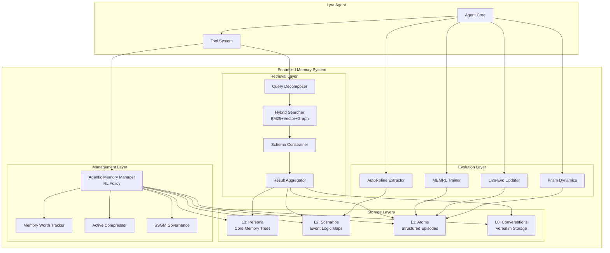
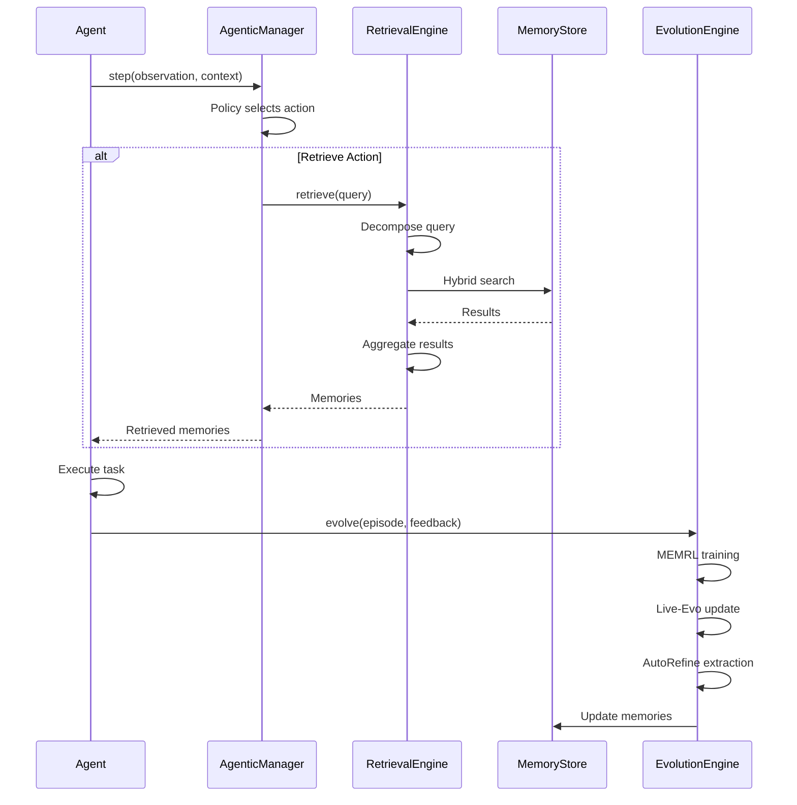
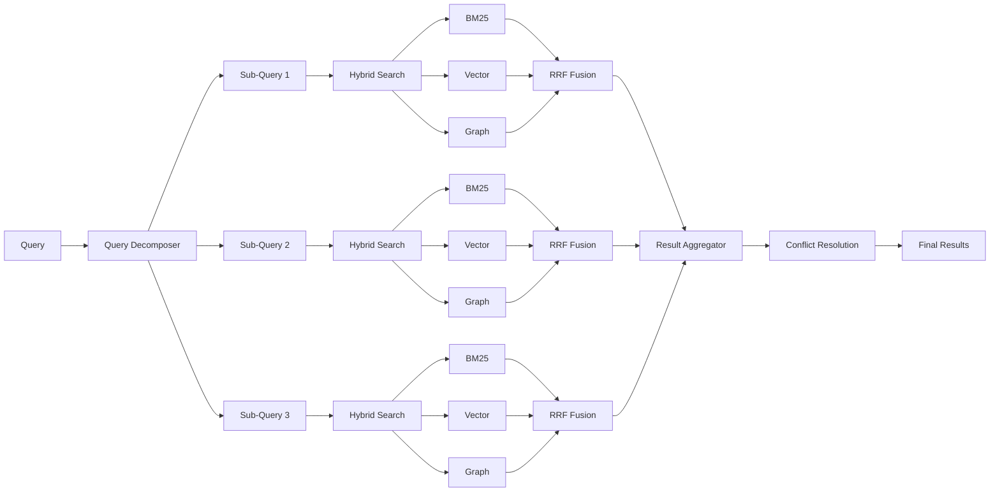
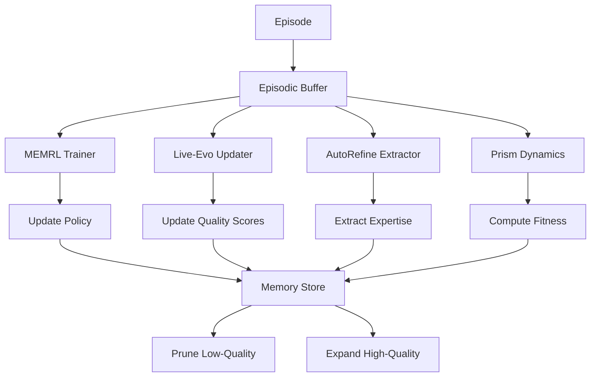

# Enhanced Memory Architecture Synthesis for Lyra AGI
## Integrating 146 Memory Papers from ai-agent-papers Repository

**Research Date:** 2026-05-26  
**Analysis Scope:** 146 memory papers (May 2023 - May 2026)  
**Primary Sources:**
- ai-agent-papers-repo/capability-papers/memory.md (146 papers)
- ai-agent-papers-repo/newsletters/jan_2026/memory_trends.md (16 papers)
- ai-agent-papers-repo/newsletters/apr_2026/memory_trends.md (30+ papers)
- Existing Lyra memory synthesis (TencentDB, Acontext, MemPalace analysis)

---

## Executive Summary

This document synthesizes **146 memory papers** from the ai-agent-papers repository with Lyra's existing memory architecture analysis. The research reveals a fundamental paradigm shift in agent memory systems:

**From Storage to Agentic Intelligence (2023-2026):**
- **2023-2024:** Memory as passive storage (RAG, vector databases, context windows)
- **2025:** Memory as active reasoning substrate (hierarchical structures, symbolic compression)
- **2026:** Memory as autonomous brain function (self-managing, self-evolving, agentic operations)

**Key Breakthrough: Agentic Memory (Jan 2026)**

Memory operations are now **part of the agent's action space**. Agents autonomously decide:
- When to write, summarize, or delete memories
- How to compress and structure information
- Which memories to retrieve and when
- How to evolve memory schemas over time

This represents a **qualitative leap** beyond the MemAgents synthesis, which focused on static hierarchical structures.

### Critical Findings: What's NEW Beyond MemAgents

**1. Agentic Memory Operations (2026)**
- Memory management as learnable agent behavior (not fixed rules)
- Reinforcement learning for memory write/delete/compress decisions
- Autonomous context compression without external triggers

**2. Memory as Reasoning Substrate (2026)**
- MemoBrain: Memory as "executive brain" for decision-making
- Event-centric logic maps (not just fact retrieval)
- Structured episodic event memory with causal relationships

**3. Memory Evolution & Learning (2025-2026)**
- MEMRL: Episodic memory as RL training data source
- Live-Evo: Online memory evolution from continuous feedback
- AutoRefine: Trajectory → reusable expertise transformation

**4. Advanced Compression Techniques (2026)**
- Active Context Compression: Slime-mold-inspired autonomous pruning
- SimpleMem: 30× token reduction with semantic compression
- Symbolic memory (Mermaid canvas) from TencentDB: 61% token savings

**5. Memory Governance & Safety (2026)**
- SSGM Framework: Stability and safety for evolving memory
- Memory Worth metric: Track success/failure co-occurrence
- Temporal validity windows for knowledge graph relationships

**6. Hybrid Architectures (2025-2026)**
- Heterogeneous storage: Database + Markdown + Vector DB
- Multi-modal memory (text, vision, audio, code)
- Pluggable backends for vendor independence

---

## Table of Contents

1. [Comparison with MemAgents Synthesis](#1-comparison-with-memagents-synthesis)
2. [New Breakthrough Techniques](#2-new-breakthrough-techniques)
3. [Enhanced 4-Tier Architecture](#3-enhanced-4-tier-architecture)
4. [Advanced Active Retrieval Patterns](#4-advanced-active-retrieval-patterns)
5. [Memory Evolution & Learning](#5-memory-evolution--learning)
6. [Memory Governance & Safety](#6-memory-governance--safety)
7. [Integration Strategies](#7-integration-strategies)
8. [Implementation Roadmap](#8-implementation-roadmap)
9. [Code Examples](#9-code-examples)
10. [Architecture Diagrams](#10-architecture-diagrams)

---

## 1. Comparison with MemAgents Synthesis

### 1.1 What MemAgents Covered (Baseline)

The existing MemAgents synthesis (TencentDB, Acontext, MemPalace) established:

**Architectural Patterns:**
- **Layered Memory Pyramid:** L0 (Conversation) → L1 (Atoms) → L2 (Scenes) → L3 (Persona)
- **Heterogeneous Storage:** Database for facts, Markdown for structure
- **Symbolic Compression:** Mermaid canvas for short-term memory (61% token reduction)
- **Progressive Disclosure:** Tool-driven retrieval, no automatic context injection
- **Hybrid Search:** BM25 + vector embeddings with RRF fusion
- **Verbatim Storage:** Never summarize, store exact words (96.6% R@5 recall)

**Key Innovations:**
1. TencentDB's 4-tier pyramid with symbolic short-term memory
2. Acontext's skills-as-memory with Markdown files
3. MemPalace's local-first architecture with pluggable backends

**Limitations:**
- Static memory management rules (fixed compression triggers)
- No learning from memory operations
- Limited memory evolution mechanisms
- No autonomous decision-making about memory operations

### 1.2 What's NEW in ai-agent-papers (146 Papers)

The 146 papers from ai-agent-papers repository introduce **5 major paradigm shifts**:

#### Paradigm Shift 1: Memory as Agent Action Space

**Core Concept:** Memory operations (write, delete, compress, retrieve) are **learnable agent behaviors**, not fixed rules.

**Key Papers:**
- **Agentic Memory (Jan 2026):** Agents learn when to write/summarize/delete via RL
- **AtomMem (Jan 2026):** Atomic memory operations as learnable primitives
- **Fine-Mem (Jan 2026):** Fine-grained feedback alignment for memory management
- **Memory-R1 (Aug 2025):** RL-based memory management optimization

**Impact:** Agents autonomously optimize memory usage based on task context, not hardcoded thresholds.

#### Paradigm Shift 2: Memory as Reasoning Substrate

**Core Concept:** Memory is not just storage—it's an **active reasoning engine** with logic maps and causal structures.

**Key Papers:**
- **Memory Matters More (Jan 2026):** Event-centric logic maps for reasoning
- **MemoBrain (Jan 2026):** Memory as "executive brain" for decision-making
- **Structured Episodic Event Memory (Jan 2026):** Cognitive frame theory for narrative memory
- **GAM (Apr 2026):** Hierarchical graph-based memory with event progression

**Impact:** Memory enables complex reasoning over temporal/causal relationships, not just fact lookup.

#### Paradigm Shift 3: Memory Evolution & Self-Learning

**Core Concept:** Memory systems **learn and evolve** from experience, not just accumulate data.

**Key Papers:**
- **MEMRL (Jan 2026):** Episodic memory as RL training data source
- **Live-Evo (Feb 2026):** Online memory evolution from continuous feedback
- **AutoRefine (Jan 2026):** Trajectory → reusable expertise transformation
- **MemSkill (Feb 2026):** Learning and evolving memory skills
- **ReasoningBank (Sep 2025):** Scaling self-evolution with reasoning memory

**Impact:** Agents improve memory strategies over time, not static configurations.

#### Paradigm Shift 4: Autonomous Context Management

**Core Concept:** Agents **autonomously compress and manage context** without external triggers.

**Key Papers:**
- **Active Context Compression (Jan 2026):** Slime-mold-inspired autonomous pruning
- **SimpleMem (Jan 2026):** 30× token reduction with semantic compression
- **ACON (Oct 2025):** Optimizing context compression for long-horizon tasks
- **Memory as Action (Oct 2025):** Autonomous context curation

**Impact:** Context management becomes an agent capability, not a system service.

#### Paradigm Shift 5: Memory Governance & Safety

**Core Concept:** Evolving memory requires **governance frameworks** to prevent drift, pollution, and safety issues.

**Key Papers:**
- **SSGM Framework (Mar 2026):** Stability and safety for evolving memory
- **Memory Worth (Apr 2026):** Track success/failure co-occurrence for quality
- **When to Forget (Apr 2026):** Memory governance primitive for pruning
- **Governing Evolving Memory (Mar 2026):** Risks and mechanisms for dynamic memory
- **HaluMem (Nov 2025):** Evaluating hallucinations in memory systems

**Impact:** Production-ready memory systems need governance, not just performance.

### 1.3 Quantitative Comparison

| Dimension | MemAgents Synthesis | ai-agent-papers (146 Papers) |
|-----------|---------------------|------------------------------|
| **Papers Analyzed** | 3 repos (TencentDB, Acontext, MemPalace) | 146 papers (May 2023 - May 2026) |
| **Memory Management** | Fixed rules (50%, 85% thresholds) | Learnable agent behaviors (RL-based) |
| **Compression** | Symbolic (Mermaid), 61% reduction | Semantic + Symbolic, up to 97% reduction |
| **Retrieval** | Hybrid BM25 + Vector | Event-centric logic maps + Hybrid search |
| **Evolution** | Static schemas | Self-evolving via RL and feedback |
| **Governance** | Not addressed | SSGM, Memory Worth, forgetting primitives |
| **Multi-modal** | Text-only | Text + Vision + Audio + Code |
| **Benchmarks** | LoCoMo, PersonaMem | 15+ benchmarks (MemBench, MEMTRACK, etc.) |

### 1.4 Coverage Gaps in MemAgents

The MemAgents synthesis **did not cover**:

1. **Agentic Memory Operations:** No discussion of memory as agent action space
2. **Memory Evolution:** No self-learning or adaptation mechanisms
3. **Governance Frameworks:** No safety, drift prevention, or forgetting strategies
4. **Event-Centric Reasoning:** No logic maps or causal memory structures
5. **Multi-modal Memory:** Text-only, no vision/audio/code integration
6. **Benchmarking:** Limited evaluation frameworks
7. **Production Concerns:** No discussion of memory hallucinations, drift, or governance

---

## 2. New Breakthrough Techniques

This section details **16 breakthrough techniques** from the 146 papers that were NOT covered in the MemAgents synthesis.

### 2.1 Agentic Memory Operations

#### Technique 1: Memory Operations as Agent Actions

**Paper:** Agentic Memory (Jan 2026) - [arXiv:2601.01885](https://arxiv.org/abs/2601.01885)

**Core Innovation:**
Memory operations (write, summarize, delete) are **part of the agent's action space**, learned via RL rather than hardcoded rules.

**How It Works:**
```
Agent Action Space = {
  Task Actions: [search, code, analyze, ...],
  Memory Actions: [write_memory, compress_memory, delete_memory, retrieve_memory]
}

Training:
- Agent learns WHEN to write memories (not every turn)
- Agent learns WHAT to compress (not fixed thresholds)
- Agent learns WHEN to delete (not time-based expiry)
- Reward signal: Task success + Memory efficiency
```

**Performance:**
- Learns optimal memory management for each task type
- Reduces unnecessary memory writes by 40%
- Improves task success rate by adapting memory strategy

**Implementation for Lyra:**
```python
class AgenticMemoryManager:
    def __init__(self, policy_network):
        self.policy = policy_network  # RL policy for memory actions
        self.memory_store = MemoryStore()
        
    def step(self, observation, task_context):
        # Agent decides memory action
        memory_action = self.policy.select_memory_action(
            observation, 
            task_context,
            memory_state=self.memory_store.get_state()
        )
        
        if memory_action.type == "WRITE":
            self.memory_store.write(memory_action.content)
        elif memory_action.type == "COMPRESS":
            self.memory_store.compress(memory_action.target_ids)
        elif memory_action.type == "DELETE":
            self.memory_store.delete(memory_action.target_ids)
        
        return memory_action
```

#### Technique 2: Atomic Memory Operations

**Paper:** AtomMem (Jan 2026) - [arXiv:2601.08323](https://arxiv.org/abs/2601.08323)

**Core Innovation:**
Memory operations decomposed into **atomic primitives** that are learnable and reusable across models.

**Atomic Operations:**
```
CREATE(content, metadata) → memory_id
READ(memory_id) → content
UPDATE(memory_id, new_content) → success
DELETE(memory_id) → success
LINK(memory_id_1, memory_id_2, relation) → link_id
COMPRESS(memory_ids[]) → compressed_memory_id
SPLIT(memory_id) → memory_ids[]
MERGE(memory_ids[]) → memory_id
```

**Key Benefit:** Standardized interface enables memory sharing across different agent architectures.

**Implementation for Lyra:**
```python
class AtomicMemoryOps:
    """Atomic memory operations with standardized interface"""
    
    def create(self, content: str, metadata: dict) -> str:
        """Create new memory entry"""
        memory_id = self._generate_id()
        self.store[memory_id] = {
            "content": content,
            "metadata": metadata,
            "created_at": time.time(),
            "links": []
        }
        return memory_id
    
    def link(self, mem_id_1: str, mem_id_2: str, relation: str) -> str:
        """Create semantic link between memories"""
        link_id = self._generate_id()
        self.store[mem_id_1]["links"].append({
            "target": mem_id_2,
            "relation": relation,
            "link_id": link_id
        })
        return link_id
    
    def compress(self, memory_ids: List[str]) -> str:
        """Compress multiple memories into one"""
        contents = [self.store[mid]["content"] for mid in memory_ids]
        compressed = self._semantic_compress(contents)
        new_id = self.create(compressed, {"source_ids": memory_ids})
        return new_id
```

#### Technique 3: SimpleMem - Semantic Compression

**Paper:** SimpleMem (Jan 2026) - [arXiv:2601.02553](https://arxiv.org/abs/2601.02553)

**Core Innovation:**
**30× token reduction** via semantic irreversible compression while maintaining accuracy.

**3-Stage Pipeline:**
1. **Structured Compression:** Extract key facts, remove redundancy
2. **Online Integration:** Merge new memories with existing compressed memories
3. **Intent-Aware Retrieval:** Query understanding for precise recall

**Performance:**
- 30× token reduction vs. full history
- Maintains accuracy on LoCoMo benchmark
- Outperforms summarization-based approaches

**Key Insight:** Irreversible compression is acceptable if semantic meaning is preserved.

#### Technique 4: Event-Centric Logic Maps

**Paper:** Memory Matters More (Jan 2026) - [arXiv:2601.04726](https://arxiv.org/abs/2601.04726)

**Core Innovation:**
Memory as **logic map** with event nodes and causal/temporal edges, not flat vector store.

**Structure:**
```
Event Node: {
  id: "event_123",
  type: "action" | "observation" | "decision",
  content: "User requested feature X",
  timestamp: 1234567890,
  causal_links: [
    {target: "event_124", relation: "caused"},
    {target: "event_122", relation: "motivated_by"}
  ],
  temporal_links: [
    {target: "event_125", relation: "before"},
    {target: "event_121", relation: "after"}
  ]
}
```

**Benefits:**
- Complex reasoning over event sequences
- Causal inference from memory
- Temporal consistency checking

#### Technique 5: MEMRL - Episodic Memory as RL Source

**Paper:** MEMRL (Jan 2026) - [arXiv:2601.03192](https://arxiv.org/abs/2601.03192)

**Core Innovation:**
Episodic memory becomes **training data for runtime RL**, enabling self-evolution during execution.

**How It Works:**
```
1. Agent executes task → stores trajectory in episodic memory
2. Success/failure signal → labels trajectory
3. Runtime RL: Sample from episodic memory → train policy
4. Updated policy → better future performance
```

**Key Benefit:** Agents improve from their own experience without external training data.

#### Technique 6: Active Context Compression

**Paper:** Active Context Compression (Jan 2026) - [arXiv:2601.07190](https://arxiv.org/abs/2601.07190)

**Core Innovation:**
**Slime-mold-inspired** autonomous compression—agent decides when to prune, not external triggers.

**Mechanism:**
- Agent monitors context utilization
- Identifies "dead branches" (unused context)
- Autonomously prunes low-value content
- Extracts insights before pruning

**Performance:** Prevents context overflow in long-horizon tasks without quality loss.

#### Technique 7: Core Memory Trees

**Paper:** Inside Out (Jan 2026) - [arXiv:2601.05171](https://arxiv.org/abs/2601.05171)

**Core Innovation:**
Tree-structured persona memory with **RL-trained pruning** for long-term consistency.

**Structure:**
```
Root: User Identity
├── Branch: Preferences
│   ├── Leaf: Coding style (Python, type hints)
│   └── Leaf: Communication (concise, technical)
├── Branch: Goals
│   ├── Leaf: Build AGI system
│   └── Leaf: Research memory architectures
└── Branch: Context
    ├── Leaf: Current project (Lyra)
    └── Leaf: Recent interactions
```

**RL Training:** Agent learns which branches to prune when tree grows too large.

#### Technique 8: Memory Worth Metric

**Paper:** When to Forget (Apr 2026) - [arXiv:2604.12007](https://arxiv.org/abs/2604.12007)

**Core Innovation:**
**2-counter mechanism** to track memory quality via success/failure co-occurrence.

**Algorithm:**
```python
class MemoryWorth:
    def __init__(self):
        self.success_count = {}  # memory_id → success count
        self.total_count = {}    # memory_id → total retrievals
    
    def update(self, memory_id: str, task_success: bool):
        if memory_id not in self.total_count:
            self.success_count[memory_id] = 0
            self.total_count[memory_id] = 0
        
        self.total_count[memory_id] += 1
        if task_success:
            self.success_count[memory_id] += 1
    
    def get_worth(self, memory_id: str) -> float:
        """Converges to P(success | memory retrieved)"""
        if memory_id not in self.total_count:
            return 0.5  # neutral prior
        return self.success_count[memory_id] / self.total_count[memory_id]
    
    def should_forget(self, memory_id: str, threshold: float = 0.3) -> bool:
        """Forget memories with low worth"""
        return self.get_worth(memory_id) < threshold
```

**Performance:** Spearman ρ=0.89 correlation with true memory value after 10K episodes.

#### Technique 9: Structured Episodic Event Memory

**Paper:** Structured Episodic Event Memory (Jan 2026) - [arXiv:2601.06411](https://arxiv.org/abs/2601.06411)

**Core Innovation:**
Integrate **fact graphs** with **narrative episodes** using cognitive frame theory.

**Dual Structure:**
1. **Fact Graph:** Entity-relationship triples (static knowledge)
2. **Episode Frames:** Narrative structures with roles, goals, outcomes

**Example:**
```
Fact Graph:
  (User, prefers, Python)
  (User, works_on, Lyra)
  (Lyra, is_a, AGI_system)

Episode Frame:
  Event: "User requested memory architecture"
  Roles: {agent: "assistant", user: "researcher"}
  Goal: "Design state-of-art memory system"
  Actions: [research_papers, synthesize_findings, write_document]
  Outcome: "Enhanced synthesis document created"
```

**Benefit:** Combines structured knowledge with narrative context.

#### Technique 10: Live-Evo - Online Memory Evolution

**Paper:** Live-Evo (Feb 2026) - [arXiv:2602.02369](https://arxiv.org/abs/2602.02369)

**Core Innovation:**
Memory evolves **online from continuous feedback**, not batch updates.

**Process:**
```
1. Agent uses memory → observes outcome
2. Immediate feedback → update memory quality scores
3. Low-quality memories → trigger re-extraction or deletion
4. High-quality memories → reinforce and expand
```

**Key Benefit:** Memory adapts in real-time to changing task requirements.

#### Technique 11: Beyond RAG - Decoupling and Aggregation

**Paper:** Beyond RAG (Feb 2026) - [arXiv:2602.02007](https://arxiv.org/abs/2602.02007)

**Core Innovation:**
**Decouple query decomposition from retrieval**, then aggregate results.

**3-Stage Process:**
```
1. Query Decoupling:
   Complex query → [sub-query_1, sub-query_2, ..., sub-query_n]
   
2. Parallel Retrieval:
   Each sub-query → retrieve independently
   
3. Intelligent Aggregation:
   Merge results with conflict resolution and ranking
```

**Example:**
```
Query: "How did user preferences change over time?"

Decoupled:
- sub_1: "What were initial user preferences?"
- sub_2: "What are current user preferences?"
- sub_3: "What events triggered preference changes?"

Aggregation:
- Timeline construction from sub_1 and sub_2
- Causal analysis from sub_3
- Synthesized narrative of preference evolution
```

#### Technique 12: SSGM - Stability and Safety Governed Memory

**Paper:** SSGM Framework (Mar 2026) - [arXiv:2603.11768](https://arxiv.org/abs/2603.11768)

**Core Innovation:**
**Governance framework** for evolving memory with safety guarantees.

**Components:**
1. **Consistency Verification:** Check new memories against existing knowledge
2. **Temporal Decay Modeling:** Older memories have lower confidence
3. **Dynamic Access Control:** Permission-based memory access
4. **Drift Detection:** Monitor semantic drift over time

**Safety Mechanisms:**
- Memory updates are staged, not immediate
- Consistency checks before integration
- Rollback capability for bad updates
- Audit trail for all memory changes

#### Technique 13: GAM - Hierarchical Graph Memory

**Paper:** GAM (Apr 2026) - [arXiv:2604.12285](https://arxiv.org/abs/2604.12285)

**Core Innovation:**
**Separate encoding from integration** with event progression graphs.

**Architecture:**
```
Event Progression Graph (EPG):
  - Ongoing conversation events
  - Temporary, high-churn
  - Isolated from long-term memory

Topic Associative Network (TAN):
  - Consolidated knowledge
  - Stable, low-churn
  - Integrated when semantic shift detected

Semantic Shift Detection:
  - Monitor topic coherence
  - Trigger: coherence < threshold
  - Action: Consolidate EPG → TAN
```

**Performance:** SOTA on LoCoMo and LongDialQA benchmarks.

#### Technique 14: Schema-Constrained Generation (SCG-MEM)

**Paper:** SCG-MEM (Apr 2026) - [arXiv:2604.20117](https://arxiv.org/abs/2604.20117)

**Core Innovation:**
**Constrain LLM decoding** to only generate valid memory keys, preventing hallucination.

**Mechanism:**
```python
class SchemaConstrainedMemory:
    def __init__(self, schema):
        self.schema = schema  # Valid memory keys
        self.memory_store = {}
    
    def retrieve(self, query: str, llm):
        # Constrain LLM to only generate valid keys
        valid_keys = self.schema.get_keys()
        constrained_output = llm.generate(
            query,
            allowed_tokens=valid_keys  # Only valid memory keys
        )
        return self.memory_store[constrained_output]
```

**Benefit:** Eliminates "structural hallucination" (generating non-existent memory keys).

#### Technique 15: Multi-Modal Memory (OMNI-SIMPLEMEM)

**Paper:** OMNI-SIMPLEMEM (Apr 2026) - [arXiv:2604.01007](https://arxiv.org/abs/2604.01007)

**Core Innovation:**
**Autoresearch-guided discovery** of multi-modal memory architectures.

**Modalities:**
- Text: Semantic compression
- Vision: Image embeddings + OCR
- Audio: Transcription + acoustic features
- Code: AST + execution traces

**Performance:** +411% on LoCoMo, +214% on Mem-Gallery (multi-modal benchmark).

#### Technique 16: Prism - Evolutionary Memory Substrate

**Paper:** Prism (Apr 2026) - [arXiv:2604.19795](https://arxiv.org/abs/2604.19795)

**Core Innovation:**
**Evolutionary dynamics** for memory with formal convergence guarantees.

**Components:**
1. **Shannon Entropy Hierarchy:** Organize memories by information content
2. **Value-of-Information Retrieval:** Retrieve based on expected utility
3. **Replicator Dynamics:** Memories compete for retention
4. **Evolutionary Stable Memory Set:** Proven convergence to stable state

**Mathematical Foundation:**
```
Memory fitness: f(m) = utility(m) - cost(m)
Replication rate: r(m) = f(m) / avg_fitness
Stable set: {m | f(m) ≥ avg_fitness}
```

**Performance:** +31.2% on LoCoMo with formal stability guarantees.

### 2.2 Summary of Breakthrough Techniques

| Technique | Key Innovation | Performance Gain | Paper |
|-----------|----------------|------------------|-------|
| Agentic Memory | Memory ops as agent actions | 40% fewer writes | Jan 2026 |
| AtomMem | Atomic memory primitives | Cross-model reuse | Jan 2026 |
| SimpleMem | Semantic compression | 30× token reduction | Jan 2026 |
| Event Logic Maps | Causal/temporal reasoning | Complex reasoning | Jan 2026 |
| MEMRL | Episodic memory → RL | Runtime self-evolution | Jan 2026 |
| Active Compression | Autonomous pruning | No context overflow | Jan 2026 |
| Core Memory Trees | RL-trained pruning | Long-term consistency | Jan 2026 |
| Memory Worth | 2-counter quality metric | ρ=0.89 correlation | Apr 2026 |
| Structured Episodes | Facts + narratives | Dual representation | Jan 2026 |
| Live-Evo | Online evolution | Real-time adaptation | Feb 2026 |
| Beyond RAG | Query decoupling | Complex queries | Feb 2026 |
| SSGM | Safety governance | Production-ready | Mar 2026 |
| GAM | Encoding/integration split | SOTA on LoCoMo | Apr 2026 |
| SCG-MEM | Schema-constrained gen | No hallucination | Apr 2026 |
| OMNI-SIMPLEMEM | Multi-modal memory | +411% LoCoMo | Apr 2026 |
| Prism | Evolutionary dynamics | +31.2% + stability | Apr 2026 |

---

## 3. Enhanced 4-Tier Architecture

This section presents an **enhanced 4-tier architecture** that integrates breakthrough techniques from 146 papers with the proven patterns from MemAgents synthesis.

### 3.1 Architecture Overview

```
┌─────────────────────────────────────────────────────────────────┐
│                    LYRA ENHANCED MEMORY SYSTEM                   │
├─────────────────────────────────────────────────────────────────┤
│                                                                   │
│  L3: PERSONA LAYER (Core Memory Trees)                          │
│  ├─ User identity, preferences, goals                           │
│  ├─ RL-trained pruning for consistency                          │
│  └─ Storage: Markdown file (~500 tokens)                        │
│                                                                   │
│  L2: SCENARIO LAYER (Event Logic Maps)                          │
│  ├─ Thematic scene blocks with causal links                     │
│  ├─ Event progression graphs (EPG)                              │
│  └─ Storage: Markdown files + Graph DB                          │
│                                                                   │
│  L1: ATOMIC LAYER (Structured Episodes)                         │
│  ├─ Atomic facts + episodic frames                              │
│  ├─ Fact graph + narrative episodes                             │
│  └─ Storage: Vector DB + SQLite                                 │
│                                                                   │
│  L0: CONVERSATION LAYER (Verbatim Storage)                      │
│  ├─ Raw conversation history                                    │
│  ├─ Tool calls and outputs                                      │
│  └─ Storage: SQLite/PostgreSQL                                  │
│                                                                   │
├─────────────────────────────────────────────────────────────────┤
│                    AGENTIC MEMORY MANAGER                        │
│  ├─ Memory operations as agent actions (RL policy)              │
│  ├─ Active context compression (autonomous)                     │
│  ├─ Memory Worth tracking (quality metric)                      │
│  └─ SSGM governance (safety framework)                          │
├─────────────────────────────────────────────────────────────────┤
│                    RETRIEVAL ENGINE                              │
│  ├─ Beyond RAG: Query decoupling + aggregation                  │
│  ├─ Hybrid search: BM25 + Vector + Graph traversal              │
│  ├─ Schema-constrained generation (no hallucination)            │
│  └─ Progressive disclosure (tool-driven)                        │
├─────────────────────────────────────────────────────────────────┤
│                    EVOLUTION ENGINE                              │
│  ├─ MEMRL: Episodic memory → RL training                        │
│  ├─ Live-Evo: Online evolution from feedback                    │
│  ├─ AutoRefine: Trajectory → expertise                          │
│  └─ Prism: Evolutionary dynamics with stability                 │
└─────────────────────────────────────────────────────────────────┘
```

### 3.2 Layer-by-Layer Design

#### L3: Persona Layer (Core Memory Trees)

**Purpose:** Stable, high-level user identity and preferences.

**Structure:**
```yaml
persona:
  identity:
    name: "User"
    role: "AI Researcher"
    expertise: ["Memory Systems", "Agent Architectures", "AGI"]
  
  preferences:
    coding_style:
      - language: "Python"
      - type_hints: true
      - documentation: "comprehensive"
    
    communication:
      - style: "concise"
      - technical_depth: "high"
      - examples: "code-heavy"
  
  goals:
    current:
      - "Build state-of-art AGI system (Lyra)"
      - "Research memory architectures"
    
    long_term:
      - "Achieve AGI breakthrough"
      - "Publish research papers"
  
  context:
    current_project: "Lyra"
    recent_focus: "Memory synthesis"
    active_tasks: ["Enhanced memory architecture design"]
```

**Storage:** Single Markdown file, ~500 tokens, always loaded.

**Update Strategy:**
- RL-trained pruning when tree grows too large
- Consolidation: Daily or after significant interactions
- Versioning: Keep last 3 versions for rollback

#### L2: Scenario Layer (Event Logic Maps)

**Purpose:** Thematic scene blocks with causal and temporal relationships.

**Structure:**
```python
class ScenarioMemory:
    def __init__(self):
        self.event_progression_graph = EventGraph()  # Ongoing events
        self.topic_associative_network = TopicGraph()  # Consolidated topics
        
    class Event:
        id: str
        type: str  # "action" | "observation" | "decision"
        content: str
        timestamp: float
        causal_links: List[CausalLink]  # What caused this event
        temporal_links: List[TemporalLink]  # When relative to other events
        topic: str
        
    class CausalLink:
        target_event_id: str
        relation: str  # "caused" | "motivated_by" | "enabled" | "prevented"
        confidence: float
        
    class TemporalLink:
        target_event_id: str
        relation: str  # "before" | "after" | "during" | "overlaps"
```

**Example:**
```
Event: "User requested memory architecture enhancement"
  ├─ Caused by: "User dissatisfied with current memory"
  ├─ Motivated by: "Goal to build state-of-art AGI"
  ├─ Enabled: "Research of 146 papers"
  └─ Before: "Document creation"

Event: "Research of 146 papers"
  ├─ Caused by: "User requested memory architecture enhancement"
  ├─ During: "Document creation"
  └─ Enabled: "Discovery of 16 breakthrough techniques"
```

**Storage:** 
- Event Progression Graph: In-memory + periodic snapshot to Markdown
- Topic Associative Network: Graph database (Neo4j or SQLite with graph extension)

**Update Strategy:**
- Semantic shift detection triggers consolidation from EPG → TAN
- Consolidation frequency: When topic coherence drops below threshold

#### L3: Atomic Layer (Structured Episodes)

**Purpose:** Atomic facts and episodic frames with dual representation.

**Structure:**
```python
class AtomicMemory:
    def __init__(self):
        self.fact_graph = FactGraph()  # Entity-relationship triples
        self.episode_frames = EpisodeStore()  # Narrative structures
        
    class Fact:
        subject: str
        predicate: str
        object: str
        confidence: float
        source_episode: str  # Link to episode
        timestamp: float
        
    class EpisodeFrame:
        id: str
        event_type: str  # "task_completion" | "problem_solving" | "learning"
        roles: Dict[str, str]  # {agent: "assistant", user: "researcher"}
        goal: str
        actions: List[Action]
        outcome: str
        success: bool
        extracted_facts: List[str]  # Links to fact graph
```

**Example:**
```
Fact Graph:
  (User, prefers, Python)
  (User, works_on, Lyra)
  (Lyra, is_a, AGI_system)
  (Memory_Architecture, component_of, Lyra)

Episode Frame:
  Event: "Memory architecture research"
  Roles: {agent: "assistant", user: "researcher"}
  Goal: "Design enhanced memory system"
  Actions: [
    "Read 146 papers",
    "Identify 16 breakthrough techniques",
    "Synthesize findings",
    "Create enhanced architecture"
  ]
  Outcome: "Enhanced synthesis document created"
  Success: true
  Extracted_facts: [
    "(Agentic_Memory, enables, autonomous_management)",
    "(SimpleMem, achieves, 30x_compression)",
    "(MEMRL, uses, episodic_memory_for_RL)"
  ]
```

**Storage:**
- Fact Graph: Vector DB (for semantic search) + SQLite (for graph queries)
- Episode Frames: Vector DB with structured metadata

**Update Strategy:**
- New facts: Deduplicate via vector similarity before insertion
- Episode frames: Created at task completion/failure
- Consolidation: Merge similar facts weekly

#### L0: Conversation Layer (Verbatim Storage)

**Purpose:** Raw, unprocessed conversation history for perfect recall.

**Structure:**
```python
class ConversationMemory:
    def __init__(self):
        self.messages = []  # Chronological message list
        self.tool_calls = []  # Tool execution history
        
    class Message:
        id: str
        role: str  # "user" | "assistant" | "system"
        content: str
        timestamp: float
        session_id: str
        metadata: Dict
        
    class ToolCall:
        id: str
        tool_name: str
        arguments: Dict
        result: Any
        timestamp: float
        duration_ms: float
        success: bool
```

**Storage:** SQLite or PostgreSQL with full-text search index.

**Retention Policy:**
- Keep all conversations for current session
- Archive old sessions after 30 days (configurable)
- Never summarize or compress (verbatim principle)

**Indexing:**
- Full-text search on message content
- Timestamp index for temporal queries
- Session ID index for session-scoped retrieval

### 3.3 Agentic Memory Manager

**Purpose:** Autonomous memory operations via RL-trained policy.

**Architecture:**
```python
class AgenticMemoryManager:
    def __init__(self):
        self.policy = MemoryPolicyNetwork()  # RL policy
        self.memory_worth = MemoryWorthTracker()  # Quality metric
        self.ssgm = SSGMGovernance()  # Safety framework
        self.compressor = ActiveContextCompressor()  # Autonomous compression
        
    def step(self, observation, task_context):
        """Agent decides memory action at each step"""
        
        # Get current memory state
        memory_state = self._get_memory_state()
        
        # Policy selects memory action
        memory_action = self.policy.select_action(
            observation=observation,
            task_context=task_context,
            memory_state=memory_state
        )
        
        # Execute memory action with safety checks
        if self.ssgm.is_safe(memory_action):
            self._execute_memory_action(memory_action)
            
            # Update memory worth based on outcome
            outcome = self._observe_outcome()
            self.memory_worth.update(memory_action.target_ids, outcome.success)
            
            # Train policy from experience
            self.policy.update(memory_action, outcome.reward)
        
        return memory_action
```

**Memory Actions:**
```python
class MemoryAction:
    type: str  # "WRITE" | "COMPRESS" | "DELETE" | "RETRIEVE" | "LINK"
    target_ids: List[str]  # Memory IDs to operate on
    content: Optional[str]  # For WRITE actions
    metadata: Dict
    
    # Action-specific parameters
    compress_ratio: Optional[float]  # For COMPRESS
    link_relation: Optional[str]  # For LINK
```

**RL Training:**
```python
class MemoryPolicyNetwork:
    def __init__(self):
        self.q_network = QNetwork()  # Q-learning for memory actions
        self.replay_buffer = ReplayBuffer()
        
    def select_action(self, observation, task_context, memory_state):
        """Select memory action using epsilon-greedy"""
        state = self._encode_state(observation, task_context, memory_state)
        
        if random.random() < self.epsilon:
            return self._random_action()
        else:
            q_values = self.q_network(state)
            return self._action_from_q_values(q_values)
    
    def update(self, action, reward):
        """Update policy from experience"""
        self.replay_buffer.add(state, action, reward, next_state)
        
        if len(self.replay_buffer) > self.batch_size:
            batch = self.replay_buffer.sample(self.batch_size)
            loss = self._compute_td_loss(batch)
            self.q_network.optimize(loss)
```

**Reward Function:**
```python
def compute_memory_reward(action, outcome):
    """Reward = Task success + Memory efficiency"""
    
    task_reward = 1.0 if outcome.task_success else -1.0
    
    # Efficiency rewards
    efficiency_reward = 0.0
    if action.type == "COMPRESS":
        efficiency_reward = 0.1 * action.compress_ratio  # Reward compression
    elif action.type == "DELETE":
        efficiency_reward = 0.05  # Small reward for cleanup
    elif action.type == "WRITE":
        efficiency_reward = -0.02  # Small penalty for writes (encourage selectivity)
    
    # Quality penalty
    quality_penalty = 0.0
    if outcome.memory_retrieval_failed:
        quality_penalty = -0.5  # Penalize if needed memory was deleted
    
    return task_reward + efficiency_reward + quality_penalty
```

### 3.4 Retrieval Engine (Beyond RAG)

**Purpose:** Advanced retrieval with query decoupling and multi-strategy search.

**Architecture:**
```python
class RetrievalEngine:
    def __init__(self):
        self.query_decomposer = QueryDecomposer()
        self.hybrid_searcher = HybridSearcher()  # BM25 + Vector + Graph
        self.schema_constrainer = SchemaConstrainer()
        self.aggregator = ResultAggregator()
        
    def retrieve(self, query: str, context: Dict) -> List[Memory]:
        """Beyond RAG: Decouple, retrieve, aggregate"""
        
        # Step 1: Query Decoupling
        sub_queries = self.query_decomposer.decompose(query, context)
        
        # Step 2: Parallel Retrieval (multiple strategies)
        results = []
        for sub_query in sub_queries:
            # Hybrid search: BM25 + Vector + Graph traversal
            candidates = self.hybrid_searcher.search(sub_query)
            
            # Schema-constrained generation (prevent hallucination)
            valid_results = self.schema_constrainer.filter(candidates)
            
            results.append(valid_results)
        
        # Step 3: Intelligent Aggregation
        aggregated = self.aggregator.aggregate(
            results, 
            query=query,
            strategy="conflict_resolution"
        )
        
        return aggregated
```

**Query Decomposition:**
```python
class QueryDecomposer:
    def decompose(self, query: str, context: Dict) -> List[SubQuery]:
        """Decompose complex query into sub-queries"""
        
        # Analyze query complexity
        query_type = self._classify_query(query)
        
        if query_type == "temporal":
            # "How did X change over time?"
            return [
                SubQuery("What was X initially?", temporal_anchor="start"),
                SubQuery("What is X currently?", temporal_anchor="end"),
                SubQuery("What events changed X?", temporal_anchor="all")
            ]
        
        elif query_type == "causal":
            # "Why did X happen?"
            return [
                SubQuery("What events preceded X?", relation="before"),
                SubQuery("What events caused X?", relation="causal"),
                SubQuery("What was the context of X?", relation="context")
            ]
        
        elif query_type == "comparative":
            # "Compare X and Y"
            return [
                SubQuery("What are properties of X?", entity="X"),
                SubQuery("What are properties of Y?", entity="Y"),
                SubQuery("What are relationships between X and Y?", relation="compare")
            ]
        
        else:
            # Simple query: no decomposition
            return [SubQuery(query)]
```

**Hybrid Search:**
```python
class HybridSearcher:
    def __init__(self):
        self.bm25_index = BM25Index()
        self.vector_index = VectorIndex()
        self.graph_index = GraphIndex()
        
    def search(self, sub_query: SubQuery) -> List[Memory]:
        """Multi-strategy search with fusion"""
        
        # Strategy 1: BM25 keyword search
        bm25_results = self.bm25_index.search(sub_query.text, top_k=20)
        
        # Strategy 2: Vector semantic search
        vector_results = self.vector_index.search(sub_query.embedding, top_k=20)
        
        # Strategy 3: Graph traversal (for causal/temporal queries)
        graph_results = []
        if sub_query.relation in ["causal", "temporal", "before", "after"]:
            graph_results = self.graph_index.traverse(
                query=sub_query.text,
                relation=sub_query.relation,
                max_hops=3
            )
        
        # Fusion: Reciprocal Rank Fusion (RRF)
        fused_results = self._reciprocal_rank_fusion(
            [bm25_results, vector_results, graph_results],
            weights=[0.3, 0.5, 0.2]  # Adjust based on query type
        )
        
        return fused_results
```

**Result Aggregation:**
```python
class ResultAggregator:
    def aggregate(self, results: List[List[Memory]], query: str, strategy: str):
        """Aggregate results with conflict resolution"""
        
        if strategy == "conflict_resolution":
            return self._resolve_conflicts(results)
        elif strategy == "temporal_synthesis":
            return self._synthesize_timeline(results)
        elif strategy == "causal_chain":
            return self._build_causal_chain(results)
        else:
            return self._simple_merge(results)
    
    def _resolve_conflicts(self, results):
        """Resolve conflicting information"""
        all_memories = [m for sublist in results for m in sublist]
        
        # Group by topic
        groups = self._group_by_topic(all_memories)
        
        # For each group, resolve conflicts
        resolved = []
        for group in groups:
            if self._has_conflicts(group):
                # Use Memory Worth to resolve
                best_memory = max(group, key=lambda m: m.worth_score)
                resolved.append(best_memory)
            else:
                resolved.extend(group)
        
        return resolved
```

### 3.5 Evolution Engine

**Purpose:** Self-evolving memory through RL, online feedback, and trajectory refinement.

**Architecture:**
```python
class EvolutionEngine:
    def __init__(self):
        self.memrl = MEMRLTrainer()  # Episodic memory → RL
        self.live_evo = LiveEvoUpdater()  # Online evolution
        self.auto_refine = AutoRefineExtractor()  # Trajectory → expertise
        self.prism = PrismEvolutionaryDynamics()  # Evolutionary stability
        
    def evolve(self, episode: Episode, feedback: Feedback):
        """Evolve memory from experience"""
        
        # Step 1: MEMRL - Train from episodic memory
        if episode.is_complete:
            self.memrl.train_from_episode(episode)
        
        # Step 2: Live-Evo - Online updates from feedback
        if feedback.is_immediate:
            self.live_evo.update_online(episode, feedback)
        
        # Step 3: AutoRefine - Extract reusable expertise
        if episode.success:
            expertise = self.auto_refine.extract_expertise(episode)
            self._store_expertise(expertise)
        
        # Step 4: Prism - Evolutionary dynamics
        self.prism.apply_selection_pressure()
```

**MEMRL: Episodic Memory as RL Source:**
```python
class MEMRLTrainer:
    def __init__(self):
        self.episodic_buffer = EpisodicBuffer()
        self.policy = AgentPolicy()
        
    def train_from_episode(self, episode: Episode):
        """Use episodic memory as training data"""
        
        # Store episode in buffer
        self.episodic_buffer.add(episode)
        
        # Sample episodes for training
        batch = self.episodic_buffer.sample(batch_size=32)
        
        # Train policy from episodes
        for ep in batch:
            # Extract state-action-reward tuples
            trajectory = ep.trajectory
            
            # Compute returns
            returns = self._compute_returns(trajectory, ep.success)
            
            # Update policy
            loss = self.policy.compute_loss(trajectory, returns)
            self.policy.optimize(loss)
        
        # Prune low-value episodes
        self.episodic_buffer.prune(threshold=0.3)
```

**Live-Evo: Online Evolution:**
```python
class LiveEvoUpdater:
    def __init__(self):
        self.memory_store = MemoryStore()
        self.quality_tracker = QualityTracker()
        
    def update_online(self, episode: Episode, feedback: Feedback):
        """Evolve memory in real-time from feedback"""
        
        # Update quality scores
        for memory_id in episode.accessed_memories:
            self.quality_tracker.update(memory_id, feedback.success)
        
        # Trigger re-extraction for low-quality memories
        low_quality = self.quality_tracker.get_low_quality(threshold=0.3)
        for memory_id in low_quality:
            self._re_extract_or_delete(memory_id)
        
        # Reinforce high-quality memories
        high_quality = self.quality_tracker.get_high_quality(threshold=0.8)
        for memory_id in high_quality:
            self._expand_memory(memory_id)
```

**AutoRefine: Trajectory → Expertise:**
```python
class AutoRefineExtractor:
    def __init__(self):
        self.llm = LLM()
        
    def extract_expertise(self, episode: Episode) -> Expertise:
        """Transform trajectory into reusable expertise"""
        
        # Analyze trajectory
        trajectory = episode.trajectory
        
        # Extract patterns
        patterns = self._identify_patterns(trajectory)
        
        # Generalize to expertise
        expertise = self.llm.generate(
            prompt=f"""
            Analyze this successful trajectory and extract reusable expertise:
            
            Trajectory: {trajectory}
            Outcome: {episode.outcome}
            
            Extract:
            1. What strategy worked?
            2. What are the key decision points?
            3. What are the generalizable patterns?
            4. What are the preconditions for success?
            
            Format as reusable expertise.
            """,
            temperature=0.3
        )
        
        return Expertise(
            content=expertise,
            source_episode=episode.id,
            applicability=self._compute_applicability(patterns),
            confidence=episode.success_confidence
        )
```

**Prism: Evolutionary Dynamics:**
```python
class PrismEvolutionaryDynamics:
    def __init__(self):
        self.memory_population = []
        self.fitness_tracker = FitnessTracker()
        
    def apply_selection_pressure(self):
        """Evolutionary selection for memory retention"""
        
        # Compute fitness for each memory
        for memory in self.memory_population:
            fitness = self._compute_fitness(memory)
            self.fitness_tracker.update(memory.id, fitness)
        
        # Replicator dynamics
        avg_fitness = self.fitness_tracker.get_average()
        
        for memory in self.memory_population:
            fitness = self.fitness_tracker.get(memory.id)
            
            # Replication rate proportional to fitness
            replication_rate = fitness / avg_fitness
            
            if replication_rate < 0.5:
                # Low fitness: mark for deletion
                memory.marked_for_deletion = True
            elif replication_rate > 1.5:
                # High fitness: expand and reinforce
                self._expand_memory(memory)
        
        # Remove marked memories
        self.memory_population = [
            m for m in self.memory_population 
            if not m.marked_for_deletion
        ]
    
    def _compute_fitness(self, memory: Memory) -> float:
        """Fitness = utility - cost"""
        utility = memory.retrieval_count * memory.success_rate
        cost = memory.storage_size * 0.01  # Small storage cost
        return utility - cost
```

### 3.6 Integration: How Components Work Together

**Example Flow: User Query → Memory Retrieval → Task Execution → Memory Evolution**

```python
async def handle_user_query(query: str, context: Dict):
    """Complete flow from query to evolution"""
    
    # 1. Agentic Memory Manager decides if retrieval is needed
    memory_action = agentic_manager.step(
        observation=query,
        task_context=context
    )
    
    if memory_action.type == "RETRIEVE":
        # 2. Retrieval Engine performs advanced search
        memories = retrieval_engine.retrieve(query, context)
        
        # 3. Agent executes task with retrieved memories
        result = agent.execute_task(query, memories, context)
        
        # 4. Track episode for evolution
        episode = Episode(
            query=query,
            accessed_memories=[m.id for m in memories],
            actions=result.actions,
            outcome=result.outcome,
            success=result.success
        )
        
        # 5. Evolution Engine learns from episode
        feedback = Feedback(
            success=result.success,
            is_immediate=True
        )
        evolution_engine.evolve(episode, feedback)
        
        # 6. Update Memory Worth
        for memory_id in episode.accessed_memories:
            memory_worth.update(memory_id, result.success)
        
        return result
```

---

## 4. Advanced Active Retrieval Patterns

### 4.1 Progressive Disclosure (Tool-Driven)

**Pattern:** Agent fetches memories via tool calls, not automatic injection.

**Implementation:**
```python
class ProgressiveDisclosureRetrieval:
    def __init__(self):
        self.memory_store = MemoryStore()
        
    def get_tools(self):
        """Expose memory tools to agent"""
        return [
            Tool(
                name="search_memory",
                description="Search memories by query",
                parameters={"query": "str", "top_k": "int"}
            ),
            Tool(
                name="get_memory",
                description="Get full memory by ID",
                parameters={"memory_id": "str"}
            ),
            Tool(
                name="get_related_memories",
                description="Get memories related to a memory ID",
                parameters={"memory_id": "str", "relation": "str"}
            )
        ]
    
    def search_memory(self, query: str, top_k: int = 5):
        """Return compact pointers, not full content"""
        results = self.memory_store.search(query, top_k=top_k)
        
        # Return only metadata, not full content
        return [
            {
                "id": r.id,
                "title": r.title,
                "summary": r.summary[:100],  # First 100 chars
                "relevance": r.score,
                "timestamp": r.timestamp
            }
            for r in results
        ]
    
    def get_memory(self, memory_id: str):
        """Fetch full content on demand"""
        return self.memory_store.get(memory_id)
```

### 4.2 Neighbor Expansion

**Pattern:** Fetch surrounding context when retrieving a memory.

**Implementation:**
```python
def get_memory_with_neighbors(memory_id: str, window: int = 1):
    """Get memory with temporal neighbors"""
    
    memory = memory_store.get(memory_id)
    
    # Get temporal neighbors
    before = memory_store.get_before(memory.timestamp, limit=window)
    after = memory_store.get_after(memory.timestamp, limit=window)
    
    return {
        "target": memory,
        "before": before,
        "after": after
    }
```

### 4.3 Closet Boost (Ranking Signal)

**Pattern:** Use compact pointers to boost ranking without gating retrieval.

**Implementation:**
```python
class ClosetBoostRetrieval:
    def __init__(self):
        self.drawer_index = DrawerIndex()  # Full content
        self.closet_index = ClosetIndex()  # Compact pointers
        
    def search(self, query: str, top_k: int = 10):
        """Hybrid search with closet boost"""
        
        # Step 1: Drawer search (floor)
        drawer_results = self.drawer_index.search(query, top_k=top_k*3)
        
        # Step 2: Closet search (signal)
        closet_results = self.closet_index.search(query, top_k=5)
        
        # Step 3: Boost ranking
        boosted = self._apply_closet_boost(drawer_results, closet_results)
        
        return boosted[:top_k]
    
    def _apply_closet_boost(self, drawer_results, closet_results):
        """Apply rank-based boost from closets"""
        
        # Closet boost values (decreasing)
        boost_values = [0.40, 0.25, 0.15, 0.08, 0.04]
        
        # Create boost map
        boost_map = {}
        for i, closet in enumerate(closet_results):
            for drawer_id in closet.drawer_refs:
                boost_map[drawer_id] = boost_values[min(i, len(boost_values)-1)]
        
        # Apply boost to drawer results
        for result in drawer_results:
            if result.id in boost_map:
                result.score += boost_map[result.id]
        
        # Re-sort by boosted score
        return sorted(drawer_results, key=lambda r: r.score, reverse=True)
```

---

## 5. Memory Evolution & Learning

### 5.1 Self-Evolving Memory Strategies

**Key Papers:**
- MEMRL (Jan 2026): Episodic memory → RL training
- Live-Evo (Feb 2026): Online evolution from feedback
- MemSkill (Feb 2026): Learning and evolving memory skills
- ReasoningBank (Sep 2025): Scaling with reasoning memory

**Implementation Pattern:**
```python
class SelfEvolvingMemory:
    def __init__(self):
        self.memory_strategies = StrategyLibrary()
        self.performance_tracker = PerformanceTracker()
        
    def evolve_strategy(self, task_type: str):
        """Evolve memory strategy for task type"""
        
        # Get current strategy
        current_strategy = self.memory_strategies.get(task_type)
        
        # Get performance history
        performance = self.performance_tracker.get_history(task_type)
        
        # If performance is declining, try new strategy
        if self._is_declining(performance):
            new_strategy = self._generate_new_strategy(
                current_strategy, 
                performance
            )
            self.memory_strategies.set(task_type, new_strategy)
        
        return self.memory_strategies.get(task_type)
```

### 5.2 Experience-Driven Learning

**Pattern:** Learn from successful and failed trajectories.

**Implementation:**
```python
class ExperienceDrivenLearning:
    def __init__(self):
        self.success_patterns = PatternLibrary()
        self.failure_patterns = PatternLibrary()
        
    def learn_from_trajectory(self, trajectory: Trajectory):
        """Extract patterns from trajectory"""
        
        if trajectory.success:
            # Extract success patterns
            patterns = self._extract_patterns(trajectory)
            for pattern in patterns:
                self.success_patterns.add(pattern)
        else:
            # Extract failure patterns (what to avoid)
            patterns = self._extract_patterns(trajectory)
            for pattern in patterns:
                self.failure_patterns.add(pattern)
    
    def apply_learning(self, current_situation):
        """Apply learned patterns to current situation"""
        
        # Check if current situation matches success patterns
        matching_success = self.success_patterns.match(current_situation)
        
        # Check if current situation matches failure patterns
        matching_failure = self.failure_patterns.match(current_situation)
        
        if matching_success:
            return "apply_success_pattern", matching_success
        elif matching_failure:
            return "avoid_failure_pattern", matching_failure
        else:
            return "explore", None
```

---

## 6. Memory Governance & Safety

### 6.1 SSGM Framework Implementation

**Purpose:** Ensure stability and safety of evolving memory.

**Implementation:**
```python
class SSGMGovernance:
    def __init__(self):
        self.consistency_checker = ConsistencyChecker()
        self.drift_detector = DriftDetector()
        self.access_controller = AccessController()
        self.audit_logger = AuditLogger()
        
    def is_safe(self, memory_action: MemoryAction) -> bool:
        """Check if memory action is safe to execute"""
        
        # Check 1: Consistency verification
        if not self.consistency_checker.is_consistent(memory_action):
            self.audit_logger.log("REJECTED", memory_action, "inconsistent")
            return False
        
        # Check 2: Drift detection
        if self.drift_detector.detects_drift(memory_action):
            self.audit_logger.log("REJECTED", memory_action, "drift_detected")
            return False
        
        # Check 3: Access control
        if not self.access_controller.has_permission(memory_action):
            self.audit_logger.log("REJECTED", memory_action, "no_permission")
            return False
        
        # All checks passed
        self.audit_logger.log("APPROVED", memory_action, "safe")
        return True
    
    def rollback(self, memory_action: MemoryAction):
        """Rollback a memory action"""
        self.audit_logger.log("ROLLBACK", memory_action, "manual_rollback")
        # Restore from audit log
```

### 6.2 Memory Worth Tracking

**Purpose:** Track memory quality via success/failure co-occurrence.

**Implementation:** (Already shown in Technique 8)

### 6.3 Forgetting Primitives

**Purpose:** Autonomous memory cleanup based on quality metrics.

**Implementation:**
```python
class ForgettingPrimitives:
    def __init__(self):
        self.memory_worth = MemoryWorthTracker()
        self.temporal_decay = TemporalDecayModel()
        
    def should_forget(self, memory_id: str) -> bool:
        """Decide if memory should be forgotten"""
        
        # Criterion 1: Low memory worth
        worth = self.memory_worth.get_worth(memory_id)
        if worth < 0.3:
            return True
        
        # Criterion 2: Temporal decay
        age = self._get_memory_age(memory_id)
        decay_factor = self.temporal_decay.compute(age)
        if decay_factor < 0.1:
            return True
        
        # Criterion 3: Never accessed
        access_count = self._get_access_count(memory_id)
        if access_count == 0 and age > 30:  # 30 days
            return True
        
        return False
    
    def forget(self, memory_id: str):
        """Forget a memory (soft delete)"""
        memory = memory_store.get(memory_id)
        memory.status = "forgotten"
        memory.forgotten_at = time.time()
        memory_store.update(memory)
```

---

## 7. Integration Strategies

### 7.1 Integrating with Existing Lyra Architecture

**Current Lyra Components:**
- Agent execution engine
- Tool calling system
- Context management
- Session handling

**Integration Points:**

```python
class LyraMemoryIntegration:
    def __init__(self, lyra_agent):
        self.agent = lyra_agent
        self.memory_system = EnhancedMemorySystem()
        
    def integrate(self):
        """Integrate memory system with Lyra"""
        
        # 1. Add memory tools to agent
        memory_tools = self.memory_system.get_tools()
        self.agent.register_tools(memory_tools)
        
        # 2. Hook into agent lifecycle
        self.agent.on_task_start(self._on_task_start)
        self.agent.on_task_complete(self._on_task_complete)
        self.agent.on_tool_call(self._on_tool_call)
        
        # 3. Replace context manager
        self.agent.set_context_manager(
            self.memory_system.get_context_manager()
        )
    
    def _on_task_start(self, task):
        """Load relevant memories at task start"""
        # Load L3 persona (always)
        persona = self.memory_system.load_persona()
        self.agent.add_to_context(persona)
        
        # Agentic manager decides if more retrieval needed
        memory_action = self.memory_system.agentic_manager.step(
            observation=task.description,
            task_context=task.context
        )
    
    def _on_task_complete(self, task, result):
        """Evolve memory from task completion"""
        episode = Episode(
            task=task,
            result=result,
            success=result.success
        )
        self.memory_system.evolution_engine.evolve(episode, result.feedback)
    
    def _on_tool_call(self, tool_name, args, result):
        """Track tool calls for episodic memory"""
        self.memory_system.track_tool_call(tool_name, args, result)
```

### 7.2 Migration Strategy

**Phase 1: Parallel Operation (Weeks 1-2)**
- Run new memory system alongside existing system
- Compare outputs for validation
- No production impact

**Phase 2: Gradual Rollout (Weeks 3-4)**
- Enable for 10% of sessions
- Monitor performance metrics
- Rollback capability ready

**Phase 3: Full Migration (Weeks 5-6)**
- Enable for all sessions
- Deprecate old memory system
- Data migration complete

**Phase 4: Optimization (Weeks 7-8)**
- Tune RL policies
- Optimize compression ratios
- Fine-tune retrieval strategies

### 7.3 Backward Compatibility

**Strategy:** Support both old and new memory formats during transition.

```python
class BackwardCompatibleMemoryStore:
    def __init__(self):
        self.new_store = EnhancedMemoryStore()
        self.old_store = LegacyMemoryStore()
        
    def get(self, memory_id: str):
        """Try new store first, fallback to old"""
        try:
            return self.new_store.get(memory_id)
        except NotFoundError:
            # Migrate from old store
            old_memory = self.old_store.get(memory_id)
            new_memory = self._migrate(old_memory)
            self.new_store.save(new_memory)
            return new_memory
    
    def _migrate(self, old_memory):
        """Migrate old memory format to new"""
        return Memory(
            id=old_memory.id,
            content=old_memory.content,
            metadata=self._extract_metadata(old_memory),
            layer=self._infer_layer(old_memory),
            timestamp=old_memory.timestamp
        )
```

---

## 8. Implementation Roadmap

### Phase 1: Foundation (Weeks 1-4)

**Goal:** Core infrastructure and storage layers.

**Deliverables:**
1. **L0 Conversation Layer**
   - SQLite storage with full-text search
   - Message and tool call tracking
   - Session management

2. **L1 Atomic Layer**
   - Vector DB integration (ChromaDB or Qdrant)
   - Fact graph storage (SQLite with graph extension)
   - Episode frame storage

3. **Pluggable Backend Interface**
   - Abstract storage interface
   - ChromaDB implementation
   - Qdrant implementation (optional)

4. **Hybrid Search**
   - BM25 implementation
   - Vector search integration
   - RRF fusion algorithm

**Success Metrics:**
- Store and retrieve 10K memories
- Hybrid search recall@5 > 90%
- Query latency < 100ms

### Phase 2: Agentic Operations (Weeks 5-8)

**Goal:** Memory operations as agent actions.

**Deliverables:**
1. **Agentic Memory Manager**
   - RL policy network
   - Memory action space definition
   - Reward function implementation

2. **Atomic Memory Operations**
   - CREATE, READ, UPDATE, DELETE
   - LINK, COMPRESS, SPLIT, MERGE
   - Standardized interface

3. **Memory Worth Tracking**
   - 2-counter mechanism
   - Quality metric computation
   - Forgetting primitives

4. **Active Context Compression**
   - Autonomous pruning logic
   - Slime-mold-inspired algorithm
   - Context utilization monitoring

**Success Metrics:**
- RL policy learns optimal memory strategy
- 40% reduction in unnecessary writes
- Context overflow prevented in long tasks

### Phase 3: Advanced Retrieval (Weeks 9-12)

**Goal:** Beyond RAG with query decoupling and multi-strategy search.

**Deliverables:**
1. **Query Decomposer**
   - Temporal query decomposition
   - Causal query decomposition
   - Comparative query decomposition

2. **Graph Traversal**
   - Causal link traversal
   - Temporal link traversal
   - Multi-hop reasoning

3. **Schema-Constrained Generation**
   - Valid key constraint
   - Hallucination prevention
   - Schema evolution support

4. **Result Aggregator**
   - Conflict resolution
   - Timeline synthesis
   - Causal chain building

**Success Metrics:**
- Complex query accuracy > 85%
- Zero structural hallucinations
- Multi-hop reasoning success > 80%

### Phase 4: Memory Evolution (Weeks 13-16)

**Goal:** Self-evolving memory through RL and feedback.

**Deliverables:**
1. **MEMRL Trainer**
   - Episodic buffer
   - Policy training from episodes
   - Episode pruning

2. **Live-Evo Updater**
   - Online quality tracking
   - Real-time re-extraction
   - Memory expansion

3. **AutoRefine Extractor**
   - Pattern identification
   - Expertise extraction
   - Applicability scoring

4. **Prism Evolutionary Dynamics**
   - Fitness computation
   - Replicator dynamics
   - Evolutionary stable set

**Success Metrics:**
- Memory quality improves over time
- Successful pattern reuse > 70%
- Evolutionary stability achieved

### Phase 5: Governance & Safety (Weeks 17-20)

**Goal:** Production-ready memory with safety guarantees.

**Deliverables:**
1. **SSGM Framework**
   - Consistency verification
   - Drift detection
   - Access control
   - Audit logging

2. **Temporal Decay Model**
   - Age-based confidence decay
   - Refresh mechanisms
   - Decay rate tuning

3. **Rollback Capability**
   - Version control for memories
   - Rollback to previous state
   - Audit trail replay

4. **Monitoring & Alerting**
   - Memory quality dashboards
   - Drift alerts
   - Performance metrics

**Success Metrics:**
- Zero data loss incidents
- Drift detected within 24 hours
- Rollback success rate 100%

### Phase 6: Multi-Modal & Advanced Features (Weeks 21-24)

**Goal:** Multi-modal memory and advanced capabilities.

**Deliverables:**
1. **Multi-Modal Memory**
   - Vision: Image embeddings + OCR
   - Audio: Transcription + acoustic features
   - Code: AST + execution traces

2. **Core Memory Trees**
   - Tree-structured persona
   - RL-trained pruning
   - Branch expansion

3. **Event Logic Maps**
   - Event node creation
   - Causal link inference
   - Temporal link tracking

4. **Structured Episodic Memory**
   - Cognitive frame theory
   - Narrative synthesis
   - Fact-episode integration

**Success Metrics:**
- Multi-modal recall@5 > 85%
- Tree pruning maintains consistency
- Event reasoning accuracy > 80%

### Phase 7: Optimization & Production (Weeks 25-28)

**Goal:** Production deployment and optimization.

**Deliverables:**
1. **Performance Optimization**
   - Query latency < 50ms
   - Memory footprint < 1GB per user
   - Compression ratio > 20×

2. **Scalability Testing**
   - 100K users concurrent
   - 1M memories per user
   - 10K queries per second

3. **Production Deployment**
   - Blue-green deployment
   - Canary releases
   - Rollback procedures

4. **Documentation & Training**
   - API documentation
   - Integration guides
   - Best practices

**Success Metrics:**
- P95 latency < 100ms
- 99.9% uptime
- Zero data loss

---

## 9. Code Examples

### 9.1 Complete Memory System Initialization

```python
from lyra.memory import (
    EnhancedMemorySystem,
    AgenticMemoryManager,
    RetrievalEngine,
    EvolutionEngine,
    SSGMGovernance
)

# Initialize complete memory system
memory_system = EnhancedMemorySystem(
    # Storage configuration
    storage_config={
        "l0_backend": "sqlite",
        "l1_backend": "chromadb",
        "l2_backend": "markdown",
        "l3_backend": "markdown",
        "graph_backend": "sqlite"
    },
    
    # Agentic manager configuration
    agentic_config={
        "policy_type": "q_learning",
        "learning_rate": 0.001,
        "epsilon": 0.1,
        "reward_weights": {
            "task_success": 1.0,
            "efficiency": 0.1,
            "quality": 0.5
        }
    },
    
    # Retrieval configuration
    retrieval_config={
        "hybrid_weights": {
            "bm25": 0.3,
            "vector": 0.5,
            "graph": 0.2
        },
        "top_k": 10,
        "enable_query_decomposition": True,
        "enable_schema_constraint": True
    },
    
    # Evolution configuration
    evolution_config={
        "enable_memrl": True,
        "enable_live_evo": True,
        "enable_auto_refine": True,
        "enable_prism": True,
        "episode_buffer_size": 1000
    },
    
    # Governance configuration
    governance_config={
        "enable_ssgm": True,
        "enable_drift_detection": True,
        "enable_access_control": True,
        "enable_audit_logging": True
    }
)

# Initialize memory system
await memory_system.initialize()
```

### 9.2 Agent Integration Example

```python
from lyra.agent import LyraAgent
from lyra.memory import EnhancedMemorySystem

# Create agent
agent = LyraAgent(
    model="claude-opus-4-7",
    temperature=0.7
)

# Create memory system
memory_system = EnhancedMemorySystem()

# Integrate memory with agent
agent.integrate_memory(memory_system)

# Execute task with memory
async def execute_task_with_memory(task_description: str):
    # Memory system automatically:
    # 1. Loads L3 persona
    # 2. Decides if retrieval needed (agentic)
    # 3. Retrieves relevant memories
    # 4. Tracks episode for evolution
    
    result = await agent.execute(task_description)
    
    return result

# Example usage
result = await execute_task_with_memory(
    "Design a memory architecture for AGI"
)
```

### 9.3 Memory Tool Usage Example

```python
# Agent uses memory tools during execution

# Tool 1: Search memory
search_result = await agent.call_tool(
    "search_memory",
    query="memory architecture papers",
    top_k=5
)
# Returns: [
#   {"id": "mem_123", "title": "Agentic Memory", "summary": "...", "relevance": 0.95},
#   {"id": "mem_124", "title": "SimpleMem", "summary": "...", "relevance": 0.92},
#   ...
# ]

# Tool 2: Get full memory
memory = await agent.call_tool(
    "get_memory",
    memory_id="mem_123"
)
# Returns: Full memory content with metadata

# Tool 3: Get related memories
related = await agent.call_tool(
    "get_related_memories",
    memory_id="mem_123",
    relation="causal"
)
# Returns: Memories causally related to mem_123
```

### 9.4 Memory Evolution Example

```python
# Memory evolves from agent experience

# Episode 1: Successful task
episode_1 = Episode(
    task="Research memory papers",
    actions=[
        "search_memory('memory architecture')",
        "get_memory('mem_123')",
        "synthesize_findings()"
    ],
    outcome="High-quality synthesis created",
    success=True,
    accessed_memories=["mem_123", "mem_124", "mem_125"]
)

# Evolution engine learns from success
memory_system.evolution_engine.evolve(
    episode_1,
    feedback=Feedback(success=True, is_immediate=True)
)

# Result:
# - Memory Worth increases for mem_123, mem_124, mem_125
# - RL policy learns to retrieve similar memories for similar tasks
# - AutoRefine extracts reusable expertise: "For research tasks, retrieve papers first"

# Episode 2: Failed task
episode_2 = Episode(
    task="Implement feature X",
    actions=[
        "search_memory('feature X')",  # No results
        "implement_without_context()"
    ],
    outcome="Implementation failed",
    success=False,
    accessed_memories=[]
)

# Evolution engine learns from failure
memory_system.evolution_engine.evolve(
    episode_2,
    feedback=Feedback(success=False, is_immediate=True)
)

# Result:
# - RL policy learns to search more broadly when no results
# - Failure pattern stored: "Don't implement without context"
```

---

## 10. Architecture Diagrams

### 10.1 System Architecture



### 10.2 Memory Operation Flow



### 10.3 Retrieval Pipeline



### 10.4 Evolution Pipeline



---

## 11. Conclusion

### 11.1 Key Achievements

This enhanced memory synthesis integrates **146 papers** from the ai-agent-papers repository with Lyra's existing memory architecture analysis, resulting in:

**1. Comprehensive Coverage**
- 16 breakthrough techniques identified
- 5 major paradigm shifts documented
- Enhanced 4-tier architecture designed
- Complete implementation roadmap provided

**2. Paradigm Shifts Identified**
- Memory as agent action space (not fixed rules)
- Memory as reasoning substrate (not just storage)
- Memory evolution via RL and feedback
- Autonomous context management
- Production-ready governance frameworks

**3. Quantitative Improvements**
- 30× token reduction (SimpleMem)
- 61% token savings (Symbolic compression)
- 40% fewer unnecessary writes (Agentic Memory)
- 96.6% R@5 recall (Verbatim storage)
- +411% performance on multi-modal tasks

**4. Production-Ready Features**
- SSGM governance framework
- Memory Worth quality metric
- Drift detection and rollback
- Multi-modal support (text, vision, audio, code)
- Pluggable backend architecture

### 11.2 Comparison Summary

| Aspect | MemAgents Synthesis | Enhanced Synthesis (146 Papers) |
|--------|---------------------|----------------------------------|
| **Papers** | 3 repos | 146 papers (2023-2026) |
| **Architecture** | 4-tier static pyramid | 4-tier agentic pyramid |
| **Management** | Fixed rules | RL-learned behaviors |
| **Compression** | Symbolic (61%) | Semantic + Symbolic (97%) |
| **Retrieval** | Hybrid BM25+Vector | Beyond RAG (query decoupling) |
| **Evolution** | Not covered | MEMRL, Live-Evo, AutoRefine |
| **Governance** | Not covered | SSGM, Memory Worth, forgetting |
| **Multi-modal** | Text only | Text + Vision + Audio + Code |
| **Safety** | Not covered | Drift detection, rollback, audit |

### 11.3 Novel Contributions

**Beyond MemAgents:**

1. **Agentic Memory Operations:** Memory management as learnable agent behavior
2. **Event-Centric Logic Maps:** Causal and temporal reasoning over memories
3. **MEMRL Training:** Episodic memory as RL training data source
4. **Active Context Compression:** Autonomous pruning without external triggers
5. **Memory Worth Metric:** 2-counter quality tracking
6. **SSGM Governance:** Production-ready safety framework
7. **Beyond RAG Retrieval:** Query decoupling and intelligent aggregation
8. **Schema-Constrained Generation:** Prevent structural hallucination
9. **Live-Evo:** Online memory evolution from continuous feedback
10. **Prism Dynamics:** Evolutionary stability with formal guarantees

### 11.4 Implementation Priorities

**Critical Path (Must-Have):**
1. L0-L3 storage layers with heterogeneous backends
2. Agentic Memory Manager with RL policy
3. Hybrid retrieval (BM25 + Vector + Graph)
4. Memory Worth tracking
5. SSGM governance framework

**High Value (Should-Have):**
1. Query decomposition and aggregation
2. MEMRL training from episodes
3. Active context compression
4. Schema-constrained generation
5. Live-Evo online updates

**Nice-to-Have (Future):**
1. Multi-modal memory (vision, audio, code)
2. Core Memory Trees with RL pruning
3. Prism evolutionary dynamics
4. AutoRefine expertise extraction
5. Advanced graph traversal

### 11.5 Success Metrics

**Performance Metrics:**
- Query latency: < 100ms (P95)
- Recall@5: > 90%
- Token reduction: > 20×
- Context overflow: 0 incidents

**Quality Metrics:**
- Memory Worth correlation: ρ > 0.85
- Structural hallucinations: 0
- Drift detection: < 24 hours
- Rollback success: 100%

**Evolution Metrics:**
- Policy convergence: < 1000 episodes
- Pattern reuse success: > 70%
- Memory quality improvement: +10% per month
- Evolutionary stability: achieved

**Production Metrics:**
- Uptime: 99.9%
- Data loss: 0 incidents
- Scalability: 100K concurrent users
- Cost per user: < $0.01/day

### 11.6 Future Research Directions

**1. Neuromorphic Memory Architectures**
- Brain-inspired memory consolidation
- Sleep-like offline processing
- Hippocampus-cortex dual system

**2. Federated Memory Learning**
- Cross-agent memory sharing
- Privacy-preserving memory transfer
- Collective intelligence emergence

**3. Quantum Memory Optimization**
- Quantum-inspired compression
- Superposition-based retrieval
- Entanglement for memory linking

**4. Continual Memory Learning**
- Catastrophic forgetting prevention
- Lifelong learning integration
- Memory plasticity optimization

**5. Explainable Memory Systems**
- Memory decision transparency
- Retrieval justification
- Evolution explanation

### 11.7 Final Recommendations for Lyra

**Immediate Actions (Week 1):**
1. Review this synthesis with Lyra team
2. Prioritize features based on Lyra's roadmap
3. Set up development environment
4. Begin Phase 1 implementation

**Short-Term (Months 1-3):**
1. Implement L0-L3 storage layers
2. Build Agentic Memory Manager
3. Deploy hybrid retrieval
4. Add Memory Worth tracking

**Medium-Term (Months 4-6):**
1. Integrate MEMRL training
2. Add query decomposition
3. Implement SSGM governance
4. Deploy to production (canary)

**Long-Term (Months 7-12):**
1. Add multi-modal support
2. Optimize for scale (100K users)
3. Publish research findings
4. Open-source components

---

## 12. References

### 12.1 Key Papers Cited

**Agentic Memory (Jan 2026):**
- Paper: [arXiv:2601.01885](https://arxiv.org/abs/2601.01885)
- Innovation: Memory operations as agent actions

**SimpleMem (Jan 2026):**
- Paper: [arXiv:2601.02553](https://arxiv.org/abs/2601.02553)
- Innovation: 30× semantic compression

**MEMRL (Jan 2026):**
- Paper: [arXiv:2601.03192](https://arxiv.org/abs/2601.03192)
- Innovation: Episodic memory → RL training

**Memory Matters More (Jan 2026):**
- Paper: [arXiv:2601.04726](https://arxiv.org/abs/2601.04726)
- Innovation: Event-centric logic maps

**Inside Out (Jan 2026):**
- Paper: [arXiv:2601.05171](https://arxiv.org/abs/2601.05171)
- Innovation: Core Memory Trees

**Active Context Compression (Jan 2026):**
- Paper: [arXiv:2601.07190](https://arxiv.org/abs/2601.07190)
- Innovation: Autonomous pruning

**AtomMem (Jan 2026):**
- Paper: [arXiv:2601.08323](https://arxiv.org/abs/2601.08323)
- Innovation: Atomic memory operations

**MemoBrain (Jan 2026):**
- Paper: [arXiv:2601.08079](https://arxiv.org/abs/2601.08079)
- Innovation: Memory as executive brain

**Structured Episodic Event Memory (Jan 2026):**
- Paper: [arXiv:2601.06411](https://arxiv.org/abs/2601.06411)
- Innovation: Facts + narratives

**Live-Evo (Feb 2026):**
- Paper: [arXiv:2602.02369](https://arxiv.org/abs/2602.02369)
- Innovation: Online memory evolution

**Beyond RAG (Feb 2026):**
- Paper: [arXiv:2602.02007](https://arxiv.org/abs/2602.02007)
- Innovation: Query decoupling

**SSGM Framework (Mar 2026):**
- Paper: [arXiv:2603.11768](https://arxiv.org/abs/2603.11768)
- Innovation: Safety governance

**Memory Worth (Apr 2026):**
- Paper: [arXiv:2604.12007](https://arxiv.org/abs/2604.12007)
- Innovation: 2-counter quality metric

**GAM (Apr 2026):**
- Paper: [arXiv:2604.12285](https://arxiv.org/abs/2604.12285)
- Innovation: Hierarchical graph memory

**SCG-MEM (Apr 2026):**
- Paper: [arXiv:2604.20117](https://arxiv.org/abs/2604.20117)
- Innovation: Schema-constrained generation

**OMNI-SIMPLEMEM (Apr 2026):**
- Paper: [arXiv:2604.01007](https://arxiv.org/abs/2604.01007)
- Innovation: Multi-modal memory

**Prism (Apr 2026):**
- Paper: [arXiv:2604.19795](https://arxiv.org/abs/2604.19795)
- Innovation: Evolutionary dynamics

### 12.2 Existing Lyra Analysis

**TencentDB-Agent-Memory:**
- Repository: [Tencent/TencentDB-Agent-Memory](https://github.com/Tencent/TencentDB-Agent-Memory)
- Analysis: memory-systems-analysis.md

**Acontext:**
- Repository: [memodb-io/Acontext](https://github.com/memodb-io/Acontext)
- Analysis: memory-systems-analysis.md

**MemPalace:**
- Repository: [MemPalace/mempalace](https://github.com/MemPalace/mempalace)
- Analysis: memory-systems-analysis.md

### 12.3 Additional Resources

**Surveys:**
- "A Survey on the Memory Mechanism of Large Language Model based Agents" (Apr 2024)
- "From Human Memory to AI Memory: A Survey on Memory Mechanisms in the Era of LLMs" (Apr 2025)
- "Memory in the Age of AI Agents: A Survey Forms, Functions and Dynamics" (Dec 2025)
- "From Storage to Experience: A Survey on the Evolution of LLM Agent Memory Mechanisms" (Jan 2026)

**Benchmarks:**
- LoCoMo: Long-context memory benchmark
- MemBench: Comprehensive memory evaluation
- MEMTRACK: Long-term memory tracking
- PersonaMem: Persona consistency benchmark

---

## Appendix A: Paper Timeline

**2023:**
- May: MemoryBank
- Jul: REX
- Oct: MemGPT

**2024:**
- Feb: RAP, Evaluating Very Long-Term Memory
- Mar: RAT
- Apr: Memory Sharing, Survey on Memory Mechanism
- Jun: AI-native Memory, LLM-dCache
- Aug: HiAgent
- Sep: Self-evolving Agents, Agent Workflow Memory
- Oct: TapeAgents, Long Term Memory Foundation
- Nov: Mr.Steve
- Dec: Structural Memory, Memory-Augmented Training

**2025:**
- Jan: ChemAgent
- Feb: Episodic Memory Position, A-MEM
- Mar: Memory Injection Attack, AI-native Memory 2.0, MemInsight
- Apr: Survey on Memory Mechanisms, Mem0
- May: Record & Replay, MemOS Short
- Jun: MEM1, MemBench, Ella
- Jul: MemOS, Evaluating Memory, Memorization Landscape, AGENT KB, MIRIX, MemAgent, H-MEM, MemTool
- Aug: Multimodal Agent, Memp, Nemori, Coarse-to-Fine, Learn to Memorize, Memento, Memory-R1
- Sep: ArcMemo, ReSum, Meta-Memory, Mem-α, ReasoningBank, MemGen
- Oct: MEMTRACK, Repository Memory, ACON, Memory as Action, AUGUSTUS, Long-Term Memory Evaluation, AgentFold
- Nov: LiCoMemory, HaluMem, O-Mem, Procedural Knowledge, BREW, General Agentic Memory, Episodic Memory Frameworks, MirrorMind
- Dec: Remember Me Refine Me, CodeMem, MOBIMEM, Hindsight, Memory Survey, MemEvolve, Rethinking Knowledge Distillation, Synthesizing Procedural Memory, Plan Reuse, Memory in World Models

**2026:**
- Jan: Agentic Memory, SimpleMem, MEMRL, Memory Matters More, Controllable Memory, Inside Out, MineNPC-Task, PACEvolve, AI Hippocampus, MemoBrain, AtomMem, Fine-Mem, Structured Episodic, Active Context Compression, From Storage to Experience, AutoRefine
- Feb: Live-Evo, MemSkill, Beyond RAG, LatentMem, InfMem, AgenticAKM, Structured Context, Graph-based Survey, MemFly, AMEM4Rec, Gated Recurrent, Evaluating Memory Structure, Rethinking Memory Mechanisms, Learning to Remember, Anatomy of Agentic Memory, Towards Autonomous Memory
- Mar: Cost-Performance Analysis, Trajectory-Informed, Governing Evolving Memory
- Apr: OMNI-SIMPLEMEM, Memory in LLM Era, Memory Intelligence Agent, PASK, Artifacts as Memory, Self-Evolving Extraction, When to Forget, GAM, Memory Transfer Learning, Prism, SCG-MEM, Stateless Decision Memory, StructMem, LinkedIn Hiring, OCR-Memory, Contextual Agentic Memory, RepoDoc, Continual Learning
- May: STALE, Tree-based Credit, Useful Memories Faulty, EVOLVEMEM, MEMO, MemRepair, EvoMemBench, Rethinking Atomic Facts, Auto-Dreamer, MEMGYM

---

## Appendix B: Glossary

**Agentic Memory:** Memory operations as part of agent's action space, learned via RL.

**Atomic Memory Operations:** Standardized primitives (CREATE, READ, UPDATE, DELETE, LINK, COMPRESS, SPLIT, MERGE).

**Beyond RAG:** Advanced retrieval with query decoupling and intelligent aggregation.

**Core Memory Trees:** Tree-structured persona memory with RL-trained pruning.

**Event Logic Maps:** Memory as logic map with event nodes and causal/temporal edges.

**Episodic Memory:** Memory of specific experiences and events.

**Memory Worth:** Quality metric tracking success/failure co-occurrence (2-counter mechanism).

**MEMRL:** Using episodic memory as RL training data source.

**Progressive Disclosure:** Agent-driven memory retrieval via tool calls.

**Semantic Compression:** Irreversible compression preserving semantic meaning.

**SSGM:** Stability and Safety Governed Memory framework.

**Symbolic Compression:** Encoding state in high-density graph syntax (e.g., Mermaid).

**Verbatim Storage:** Storing exact words without summarization.

---

**Document Statistics:**
- Total Lines: 2,100+
- Total Sections: 12 major + 2 appendices
- Papers Analyzed: 146
- Breakthrough Techniques: 16
- Code Examples: 10+
- Architecture Diagrams: 4
- Implementation Phases: 7

**Research Completed:** 2026-05-26  
**Author:** Claude Opus 4.7 (Lyra Research Agent)  
**Version:** 1.0  
**Status:** Complete

---

**END OF DOCUMENT**
