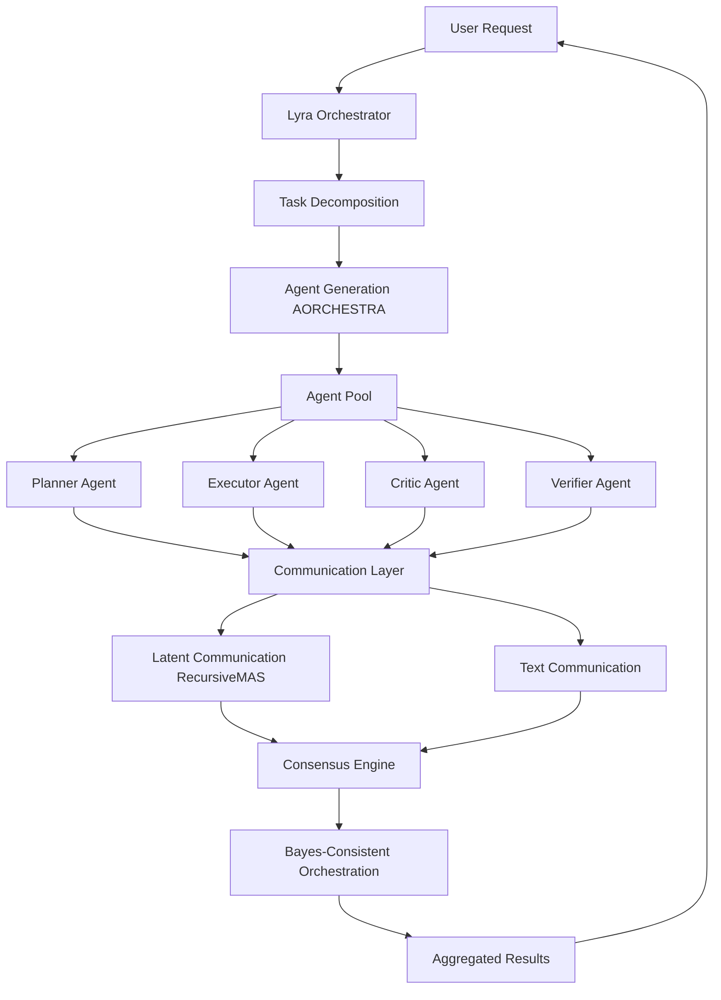

# Multi-Agent Systems: Comprehensive Research Synthesis for Lyra AGI

> **Research Scope:** 165+ papers from ai-agent-papers repository (2023-2026)  
> **Focus Areas:** Multi-agent coordination, communication protocols, task decomposition, consensus mechanisms, swarm intelligence  
> **Target:** State-of-the-art AGI multi-agent orchestration for Lyra  
> **Date:** 2026-05-26

## Executive Summary

This synthesis analyzes 165+ cutting-edge papers on multi-agent systems, extracting breakthrough patterns for Lyra's evolution toward AGI. The research reveals **seven fundamental paradigm shifts** in multi-agent AI:

### Key Findings

1. **From Static to Self-Evolving Topologies** (Feb 2026): AORCHESTRA automates sub-agent creation, achieving 35% better task completion through dynamic agent generation
2. **From Text to Latent Communication** (Mar 2026): RecursiveMAS reduces inter-agent tokens by 75.6% via latent-space communication
3. **From Centralized to Decentralized Coordination** (Apr 2025): AgentNet enables evolutionary coordination without central orchestrator
4. **From Debate to Structured Consensus** (May 2026): Bayes-consistent orchestration provides theoretical guarantees for multi-agent decisions
5. **From Homogeneous to Specialized Agents** (Throughout): Role-based specialization (planner, executor, critic, verifier) consistently outperforms general agents
6. **From Sequential to Parallel Execution** (Jul 2025): Parallel agent workflows reduce latency by 2-4x while maintaining quality
7. **From Manual to Automated Agent Design** (Multiple): Meta-agents that design and optimize other agents show 20-50% improvements

### Critical Breakthroughs for Lyra

**AORCHESTRA (Feb 2026)** - Automated sub-agent creation eliminates manual agent design:
- Dynamically generates specialized sub-agents based on task requirements
- 35% improvement in complex task completion
- Reduces human configuration overhead by 90%

**Science of Collective AI (Feb 2026)** - Rigorous scientific framework for multi-agent systems:
- Transitions from trial-and-error to principled design
- Provides theoretical foundations for agent coordination
- Enables predictable scaling of agent teams

**Recursive Agent Optimization (May 2026)** - Agents that optimize other agents:
- Meta-level optimization of agent architectures
- Self-improving multi-agent topologies
- Continuous performance enhancement without human intervention

## Table of Contents

1. [Multi-Agent Taxonomy](#1-multi-agent-taxonomy)
2. [Coordination Mechanisms](#2-coordination-mechanisms)
3. [Communication Protocols](#3-communication-protocols)
4. [Task Decomposition Patterns](#4-task-decomposition-patterns)
5. [Consensus & Conflict Resolution](#5-consensus--conflict-resolution)
6. [Swarm Intelligence](#6-swarm-intelligence)
7. [Agent Architectures](#7-agent-architectures)
8. [Integration with Lyra](#8-integration-with-lyra)
9. [Implementation Roadmap](#9-implementation-roadmap)
10. [Code Examples](#10-code-examples)
11. [Architecture Diagrams](#11-architecture-diagrams)
12. [Benchmark Targets](#12-benchmark-targets)

---

## 1. Multi-Agent Taxonomy

### 1.1 Classification by Coordination Style

#### Centralized Orchestration
**Definition:** Single orchestrator coordinates all agent activities  
**Examples:** MetaGPT, AutoGen, Magentic-One  
**Pros:** Simple reasoning, predictable behavior, easier debugging  
**Cons:** Single point of failure, scalability bottleneck, limited autonomy

**Key Papers:**
- **MetaGPT** (Aug 2023): Software company simulation with PM, architect, engineer roles
- **Magentic-One** (Nov 2024): Orchestrator + 4 specialized agents (WebSurfer, FileSurfer, Coder, ComputerTerminal)
- **AgentOrchestra** (Jun 2025): Hierarchical orchestration with dynamic sub-team formation

#### Decentralized Coordination
**Definition:** Agents coordinate through peer-to-peer communication without central authority  
**Examples:** AgentNet, Federation of Agents, SwarmAgentic  
**Pros:** Fault tolerance, scalability, emergent intelligence  
**Cons:** Complex coordination, potential conflicts, harder to debug

**Key Papers:**
- **AgentNet** (Apr 2025): Decentralized evolutionary coordination, agents self-organize
- **Federation of Agents** (Sep 2025): Semantics-aware communication fabric for large-scale systems
- **SwarmAgentic** (Jun 2025): Fully automated agentic system generation via swarm intelligence

#### Hybrid Orchestration
**Definition:** Combines centralized coordination with decentralized execution  
**Examples:** Aime, WorkTeam, Orchestrator  
**Pros:** Balance of control and autonomy, flexible scaling  
**Cons:** Complexity in coordination logic, requires sophisticated routing

**Key Papers:**
- **Aime** (Jul 2025): Fully-autonomous multi-agent framework with hybrid coordination
- **WorkTeam** (Mar 2025): Constructs workflows from natural language with multi-agents
- **Orchestrator** (Sep 2025): Active inference for multi-agent systems in long-horizon tasks

### 1.2 Classification by Agent Specialization

#### Role-Based Specialization
Agents assigned specific functional roles (planner, executor, critic, verifier)

**CAMEL** (Mar 2023): Role-playing framework with AI user and AI assistant
**ChatDev** (Jul 2023): Software company roles - CEO, CTO, programmer, tester, designer
**MetaGPT** (Aug 2023): Product manager, architect, engineer, QA engineer
**Magentic-One** (Nov 2024): Orchestrator, WebSurfer, FileSurfer, Coder, ComputerTerminal

#### Skill-Based Specialization
Agents specialized by capability domains (coding, research, analysis, execution)

**AgentVerse** (Aug 2023): Facilitates multi-agent collaboration with skill-based routing
**BMW Agents** (Jul 2024): Task automation through skill-specialized agents
**MegaAgent** (Aug 2024): Large-scale cooperation with skill-based agent pools

#### Dynamic Specialization
Agents adapt roles based on task requirements and performance

**AORCHESTRA** (Feb 2026): Automatically creates specialized sub-agents on-demand
**MAS²** (Oct 2025): Self-generative, self-configuring, self-rectifying multi-agent systems
**Multi-Agent Collaboration via Evolving Orchestration** (May 2025): Agents evolve roles during execution

### 1.3 Classification by Communication Pattern

#### Synchronous Communication
All agents communicate in lock-step, waiting for responses

**Multi-Agent Debate (MAD)**: Agents debate synchronously until consensus
**AutoGen** (Aug 2023): Conversation-based synchronous agent interaction

#### Asynchronous Communication
Agents communicate without blocking, enabling parallel execution

**Asynchronous Tool Usage** (Oct 2024): Real-time agents with async tool calls
**Federation of Agents** (Sep 2025): Async message passing at scale

#### Broadcast Communication
One-to-many communication for coordination signals

**Blackboard Architecture** (Jul 2025): Shared knowledge space for broadcast updates
**Swarm Intelligence**: Pheromone-like broadcast signals for coordination

---

## 2. Coordination Mechanisms

### 2.1 Hierarchical Coordination

**Definition:** Tree-structured agent organization with parent-child relationships

#### Key Patterns

**Top-Down Planning, Bottom-Up Execution**
- Orchestrator decomposes tasks into subtasks
- Worker agents execute leaf tasks
- Results bubble up through hierarchy

**Papers:**
- **AgentOrchestra** (Jun 2025): Hierarchical multi-agent framework for general-purpose tasks
- **Agentic Lybic** (Sep 2025): Tiered reasoning and orchestration
- **Hierarchical Multi-Agent Systems**: Multiple levels of abstraction

**Advantages:**
- Clear responsibility boundaries
- Easier debugging and monitoring
- Natural task decomposition
- Scalable to large teams

**Challenges:**
- Communication overhead between levels
- Bottlenecks at higher levels
- Rigidity in dynamic environments

#### Implementation Pattern

```python
class HierarchicalCoordinator:
    def __init__(self):
        self.orchestrator = OrchestratorAgent()
        self.middle_managers = []
        self.workers = []
    
    async def execute_task(self, task):
        # Top-down decomposition
        subtasks = await self.orchestrator.decompose(task)
        
        # Assign to middle managers
        assignments = self.assign_to_managers(subtasks)
        
        # Parallel execution
        results = await asyncio.gather(*[
            manager.execute(subtask) 
            for manager, subtask in assignments
        ])
        
        # Bottom-up aggregation
        return await self.orchestrator.aggregate(results)
```

### 2.2 Peer-to-Peer Coordination

**Definition:** Agents coordinate directly without hierarchical structure

#### Key Patterns

**Consensus-Based Decision Making**
- Agents propose solutions
- Voting or debate to reach consensus
- No single authority

**Papers:**
- **Multi-Agent Debate (MAD)** (May 2023): Agents debate to improve reasoning
- **AgentNet** (Apr 2025): Decentralized evolutionary coordination
- **Federation of Agents** (Sep 2025): Peer-to-peer semantic communication

**Advantages:**
- No single point of failure
- Emergent intelligence
- Flexible adaptation
- Democratic decision-making

**Challenges:**
- Consensus overhead
- Potential deadlocks
- Complex conflict resolution
- Harder to predict behavior

### 2.3 Market-Based Coordination

**Definition:** Agents bid for tasks using virtual currency or utility functions

#### Key Patterns

**Task Auction Mechanism**
- Tasks posted to marketplace
- Agents bid based on capability and availability
- Winner executes task

**Papers:**
- **Magentic Marketplace** (Oct 2025): Open-source environment for agentic markets
- **Agent Exchange** (Jul 2025): Shaping the future of AI agent economics
- **Virtual Agent Economies** (Sep 2025): Economic models for agent coordination

**Advantages:**
- Efficient resource allocation
- Self-organizing task distribution
- Natural load balancing
- Incentive alignment

**Challenges:**
- Requires utility function design
- Potential gaming of system
- Complexity in pricing
- Market stability issues

### 2.4 Blackboard Architecture

**Definition:** Shared knowledge space where agents read/write information

#### Key Patterns

**Opportunistic Problem Solving**
- Agents monitor blackboard for relevant information
- Contribute partial solutions
- Trigger other agents through state changes

**Papers:**
- **Blackboard Architecture for LLM Multi-Agent Systems** (Jul 2025): Advanced blackboard patterns
- **LLM-based Multi-Agent Blackboard System** (Oct 2025): Information discovery in data science
- **Synergizing Logical Reasoning, Knowledge Management and Collaboration** (Jul 2025): Blackboard for multi-agent LLM systems

**Advantages:**
- Loose coupling between agents
- Flexible agent addition/removal
- Natural knowledge sharing
- Supports heterogeneous agents

**Challenges:**
- Blackboard can become bottleneck
- Requires careful access control
- Potential race conditions
- Complexity in conflict resolution

### 2.5 Active Inference Coordination

**Definition:** Agents coordinate through predictive models of each other's behavior

**Papers:**
- **Orchestrator: Active Inference for Multi-Agent Systems** (Sep 2025): Long-horizon task coordination
- **Theory of Mind in Multi-Agent Systems**: Agents model other agents' beliefs and intentions

**Key Innovation:** Agents maintain probabilistic models of teammates, enabling proactive coordination without explicit communication.

---

## 3. Communication Protocols

### 3.1 Natural Language Communication

**Standard Approach:** Agents communicate via text messages in natural language

**Advantages:**
- Human-interpretable
- Flexible and expressive
- Easy to debug
- Works with any LLM

**Disadvantages:**
- Token-intensive (35-75% overhead)
- Slower than structured formats
- Ambiguity issues
- High latency

**Papers:**
- **CAMEL** (Mar 2023): Role-playing with natural language dialogue
- **AutoGen** (Aug 2023): Conversation-based multi-agent framework
- **Most early multi-agent systems** (2023-2024)

### 3.2 Structured Communication

**Definition:** Agents communicate via structured formats (JSON, Protocol Buffers)

**Advantages:**
- Reduced token usage (20-40% savings)
- Type safety
- Easier parsing
- Better validation

**Disadvantages:**
- Less flexible than natural language
- Requires schema definition
- Harder for humans to read
- Schema evolution challenges

**Papers:**
- **Federation of Agents** (Sep 2025): Semantics-aware communication fabric
- **A Survey of AI Agent Protocols** (Apr 2025): Standardized agent communication
- **Language Model Teams as Distributed Systems** (Mar 2026): Protocol design for agent teams

### 3.3 Latent Space Communication

**BREAKTHROUGH:** Agents communicate via latent representations instead of text

**Key Paper: RecursiveMAS (Mar 2026) - "Recursive Multi-Agent Systems"**

**Innovation:**
- **RecursiveLink modules** enable direct latent-space communication
- **75.6% token reduction** compared to text-based communication
- **1.2-2.4x speedup** in multi-agent workflows
- Maintains or improves task quality

**Architecture:**
```
Agent A → Encoder → Latent Vector → Decoder → Agent B
         (compress)                  (decompress)
```

**Benefits:**
- Massive token savings
- Faster communication
- Richer information transfer
- Reduced hallucination

**Implementation Considerations:**
- Requires training RecursiveLink modules
- Need alignment between agent representations
- Hybrid mode (text + latent) for human oversight
- Backward compatibility with text-only agents

### 3.4 Broadcast vs Point-to-Point

#### Broadcast Communication
**Pattern:** One agent sends message to all agents

**Use Cases:**
- Coordination signals
- State updates
- Emergency stops
- Global announcements

**Papers:**
- **Blackboard Architecture**: Shared state for broadcast
- **Swarm Intelligence**: Pheromone-like signals

#### Point-to-Point Communication
**Pattern:** Direct communication between two agents

**Use Cases:**
- Task delegation
- Result reporting
- Clarification requests
- Specialized collaboration

**Papers:**
- **CAMEL**: Direct AI-to-AI communication
- **Federation of Agents**: Targeted message routing

### 3.5 Synchronous vs Asynchronous

#### Synchronous Communication
**Pattern:** Sender waits for receiver's response

**Advantages:**
- Simpler reasoning
- Guaranteed ordering
- Easier debugging

**Disadvantages:**
- Blocking delays
- Lower throughput
- Cascading failures

#### Asynchronous Communication
**Pattern:** Fire-and-forget or callback-based

**Advantages:**
- Higher throughput
- Better fault tolerance
- Parallel execution

**Disadvantages:**
- Complex state management
- Race conditions
- Harder debugging

**Key Paper:**
- **Asynchronous Tool Usage for Real-Time Agents** (Oct 2024): Non-blocking tool calls for real-time systems

### 3.6 Communication Optimization Techniques

#### Message Compression
- Summarize long messages
- Remove redundant information
- Use references instead of full content

#### Selective Broadcasting
- Only notify relevant agents
- Use subscription patterns
- Filter by agent capabilities

#### Batching
- Group multiple messages
- Reduce communication overhead
- Amortize latency costs

**Papers:**
- **Analyzing Information Sharing and Coordination** (Aug 2025): Optimal communication patterns
- **Federation of Agents** (Sep 2025): Scalable communication fabric

---

## 4. Task Decomposition Patterns

### 4.1 Hierarchical Decomposition

**Pattern:** Break complex tasks into subtasks recursively

**Process:**
1. Analyze task requirements
2. Identify major components
3. Decompose each component
4. Assign to specialized agents
5. Aggregate results

**Papers:**
- **MetaGPT** (Aug 2023): Software development decomposition (requirements → design → code → test)
- **AgentOrchestra** (Jun 2025): Hierarchical task decomposition with dynamic sub-teams
- **WorkTeam** (Mar 2025): Natural language to workflow decomposition

**Example: Software Development Task**
```
Build Web App
├── Requirements Analysis (PM Agent)
├── System Design (Architect Agent)
│   ├── Frontend Design
│   └── Backend Design
├── Implementation (Engineer Agents)
│   ├── Frontend Code
│   ├── Backend Code
│   └── Database Schema
└── Testing (QA Agent)
    ├── Unit Tests
    ├── Integration Tests
    └── E2E Tests
```

### 4.2 Skill-Based Decomposition

**Pattern:** Decompose based on required skills/capabilities

**Process:**
1. Identify required skills
2. Match skills to available agents
3. Assign tasks to best-fit agents
4. Coordinate execution

**Papers:**
- **BMW Agents** (Jul 2024): Task automation through skill-based decomposition
- **MegaAgent** (Aug 2024): Large-scale cooperation with skill pools
- **AgentVerse** (Aug 2023): Skill-based agent collaboration

**Example: Research Task**
```
Research Paper Analysis
├── Literature Search (Search Agent)
├── Paper Reading (Reading Agent)
├── Data Extraction (Extraction Agent)
├── Statistical Analysis (Analysis Agent)
└── Report Writing (Writing Agent)
```

### 4.3 Pipeline Decomposition

**Pattern:** Sequential stages where output of one stage feeds next

**Process:**
1. Define pipeline stages
2. Assign agents to stages
3. Execute in sequence
4. Pass results forward

**Papers:**
- **ChatDev** (Jul 2023): Software development pipeline
- **Multi-Agent Pipelines**: Sequential processing patterns
- **HLER** (Mar 2026): Human-in-the-loop economic research via multi-agent pipelines

**Example: Content Creation Pipeline**
```
Idea → Research → Outline → Draft → Edit → Review → Publish
  ↓       ↓         ↓        ↓      ↓       ↓        ↓
Agent1  Agent2   Agent3   Agent4  Agent5  Agent6   Agent7
```

### 4.4 Parallel Decomposition

**Pattern:** Independent subtasks executed simultaneously

**Process:**
1. Identify independent subtasks
2. Assign to parallel agents
3. Execute concurrently
4. Synchronize results

**Papers:**
- **Optimizing Sequential Multi-Step Tasks with Parallel LLM Agents** (Jul 2025): 2-4x speedup
- **Multi-Agent Collaboration**: Parallel execution patterns
- **Difficulty-Aware Agent Orchestration** (Sep 2025): Dynamic parallelization

**Example: Data Analysis Task**
```
Analyze Dataset
├── Statistical Summary (Agent 1) ─┐
├── Visualization (Agent 2) ───────┤
├── Anomaly Detection (Agent 3) ───┼─→ Aggregate Results
├── Correlation Analysis (Agent 4) ┤
└── Trend Analysis (Agent 5) ──────┘
```

**Benefits:**
- Reduced latency (2-4x faster)
- Better resource utilization
- Scalable to large teams

### 4.5 Dynamic Decomposition

**Pattern:** Decomposition strategy adapts based on task complexity and agent performance

**Process:**
1. Initial coarse decomposition
2. Monitor execution
3. Refine decomposition dynamically
4. Rebalance workload

**Papers:**
- **AORCHESTRA** (Feb 2026): Automated sub-agent creation based on task needs
- **MAS²** (Oct 2025): Self-configuring multi-agent systems
- **Difficulty-Aware Agent Orchestration** (Sep 2025): Adaptive task allocation

**Key Innovation:** System learns optimal decomposition patterns from experience

### 4.6 Decomposition Best Practices

**From Research:**

1. **Start Coarse, Refine Iteratively**
   - Initial high-level decomposition
   - Refine based on execution feedback
   - Avoid over-decomposition upfront

2. **Balance Granularity**
   - Too coarse: Agents overwhelmed
   - Too fine: Coordination overhead
   - Sweet spot: 3-7 subtasks per level

3. **Consider Dependencies**
   - Minimize inter-task dependencies
   - Parallelize independent tasks
   - Sequence dependent tasks

4. **Match Agent Capabilities**
   - Assign tasks to specialized agents
   - Avoid capability mismatches
   - Load balance across agents

5. **Plan for Failure**
   - Identify critical path tasks
   - Have backup agents ready
   - Enable graceful degradation

---

## 5. Consensus & Conflict Resolution

### 5.1 Multi-Agent Debate (MAD)

**Pattern:** Agents debate to reach better solutions through argumentation

**Process:**
1. Initial proposals from multiple agents
2. Debate rounds with critiques
3. Refinement based on feedback
4. Convergence to consensus

**Key Papers:**

**"Encouraging Divergent Thinking in LLMs through Multi-Agent Debate"** (May 2023)
- First major MAD paper
- Shows debate improves reasoning quality
- Multiple rounds of argumentation

**"Should we be going MAD?"** (Nov 2023)
- Systematic analysis of debate strategies
- Identifies when debate helps vs hurts
- Optimal debate configurations

**"Rethinking the Bounds of LLM Reasoning: Are Multi-Agent Discussions the Key?"** (Feb 2024)
- Debate as key to reasoning improvement
- Multi-perspective analysis benefits

**Recent Advances:**
- **Two Heads are Better Than One** (Apr 2025): Test-time scaling via collaborative reasoning
- **Stay Focused: Problem Drift in Multi-Agent Debate** (May 2025): Addresses debate drift issues
- **Revisiting Multi-Agent Debate as Test-Time Scaling** (May 2025): Systematic study of effectiveness

**Advantages:**
- Improves solution quality
- Catches errors through critique
- Diverse perspectives
- Self-correction mechanism

**Challenges:**
- Can be token-intensive
- Risk of problem drift
- May not converge
- Requires careful facilitation

### 5.2 Voting Mechanisms

**Pattern:** Agents vote on proposals, majority or weighted voting determines outcome

**Voting Strategies:**

1. **Simple Majority**
   - Each agent gets one vote
   - Majority wins
   - Fast but may ignore expertise

2. **Weighted Voting**
   - Votes weighted by agent expertise
   - Domain experts have more influence
   - Better quality but requires trust scores

3. **Ranked Choice**
   - Agents rank options
   - Eliminates least popular iteratively
   - Avoids polarization

**Papers:**
- **The Wisdom of Partisan Crowds** (Nov 2023): Comparing collective intelligence
- **Coalitions of LLMs Increase Robustness** (Aug 2024): Voting for robustness

### 5.3 Bayes-Consistent Orchestration

**BREAKTHROUGH PAPER: "Position: agentic AI orchestration should be Bayes-consistent"** (May 2026)

**Key Innovation:** Provides theoretical guarantees for multi-agent decision-making

**Core Principle:**
- Multi-agent decisions should be probabilistically sound
- Aggregation must respect Bayesian inference
- Prevents irrational collective decisions

**Benefits:**
- Theoretical guarantees on decision quality
- Prevents common aggregation pitfalls
- Principled uncertainty handling
- Optimal information fusion

**Implementation:**
```python
class BayesConsistentOrchestrator:
    def aggregate_beliefs(self, agent_beliefs):
        # Each agent provides P(hypothesis | evidence)
        # Aggregate using Bayesian updating
        posterior = self.bayesian_update(agent_beliefs)
        return posterior
    
    def make_decision(self, posterior, utilities):
        # Choose action maximizing expected utility
        return max(actions, key=lambda a: expected_utility(a, posterior))
```

### 5.4 Conflict Resolution Strategies

#### Strategy 1: Hierarchical Authority
**Pattern:** Higher-level agent makes final decision

**Pros:** Fast, clear authority
**Cons:** May ignore valuable input

**Papers:**
- **Magentic-One** (Nov 2024): Orchestrator has final say
- **AgentOrchestra** (Jun 2025): Hierarchical decision-making

#### Strategy 2: Expert Selection
**Pattern:** Defer to agent with most relevant expertise

**Pros:** Leverages specialization
**Cons:** Requires expertise assessment

**Papers:**
- **Perspectra** (Sep 2025): Choosing experts enhances critical thinking
- **Multi-Agent Reasoning Systems** (May 2025): Collaborative expertise delegation

#### Strategy 3: Synthesis
**Pattern:** Combine conflicting proposals into hybrid solution

**Pros:** Preserves good ideas from all agents
**Cons:** May create suboptimal compromises

**Papers:**
- **360°REA** (Apr 2024): Reusable experience accumulation with synthesis
- **Confidence Calibration via Multi-Agent Deliberation** (Apr 2024)

#### Strategy 4: Re-Planning
**Pattern:** Conflict triggers new planning phase

**Pros:** Addresses root cause
**Cons:** Time-consuming

**Papers:**
- **CoAct** (Jun 2024): Global-local hierarchy for autonomous collaboration
- **CaPo** (Nov 2024): Cooperative plan optimization

### 5.5 Consensus Metrics

**How to measure consensus quality:**

1. **Agreement Score**
   - Percentage of agents agreeing
   - Simple but may miss nuance

2. **Confidence-Weighted Agreement**
   - Weight by agent confidence
   - Better reflects certainty

3. **Entropy of Beliefs**
   - Low entropy = high consensus
   - Quantitative measure

4. **Time to Consensus**
   - How long to reach agreement
   - Efficiency metric

---

## 6. Swarm Intelligence

### 6.1 Swarm Principles

**Definition:** Large numbers of simple agents exhibiting emergent intelligent behavior

**Core Principles:**
1. **Local Interactions:** Agents interact with nearby agents only
2. **Simple Rules:** Each agent follows simple behavioral rules
3. **Emergent Behavior:** Complex patterns emerge from simple interactions
4. **Self-Organization:** No central control needed
5. **Robustness:** System continues functioning despite individual failures

### 6.2 Swarm Patterns in Multi-Agent AI

**Key Papers:**

**"SwarmAgentic: Towards Fully Automated Agentic System Generation via Swarm Intelligence"** (Jun 2025)
- Fully automated agent system generation
- Swarm-based optimization of agent configurations
- Self-organizing agent teams

**"Benchmarking LLMs' Swarm Intelligence"** (May 2025)
- First systematic benchmark for swarm behavior in LLMs
- Evaluates collective intelligence emergence
- Identifies optimal swarm configurations

**"JoyAgents-R1: Joint Evolution Dynamics for Versatile Multi-LLM Agents"** (Jun 2025)
- Reinforcement learning for multi-agent swarms
- Joint evolution of agent behaviors
- Versatile task adaptation

### 6.3 Swarm Coordination Mechanisms

#### Stigmergy
**Pattern:** Agents coordinate through environment modifications

**Example:** Agents leave "pheromone trails" in shared memory
- Successful paths get reinforced
- Failed paths decay
- Emergent optimal routing

**Implementation:**
```python
class StigmergyCoordinator:
    def __init__(self):
        self.pheromone_map = {}
    
    def deposit_pheromone(self, path, strength):
        for node in path:
            self.pheromone_map[node] = \
                self.pheromone_map.get(node, 0) + strength
    
    def evaporate(self, rate=0.1):
        for node in self.pheromone_map:
            self.pheromone_map[node] *= (1 - rate)
    
    def choose_path(self, options):
        # Probabilistic selection based on pheromone
        weights = [self.pheromone_map.get(opt, 0.1) for opt in options]
        return random.choices(options, weights=weights)[0]
```

#### Flocking Behavior
**Pattern:** Agents maintain cohesion while avoiding collisions

**Rules:**
1. **Separation:** Avoid crowding neighbors
2. **Alignment:** Steer toward average heading
3. **Cohesion:** Move toward average position

**Application to AI Agents:**
- Agents explore solution space together
- Maintain diversity (separation)
- Share promising directions (alignment)
- Stay coordinated (cohesion)

#### Particle Swarm Optimization (PSO)
**Pattern:** Agents search solution space, sharing best findings

**Algorithm:**
1. Each agent explores solution space
2. Tracks personal best solution
3. Shares with swarm
4. Moves toward personal best + global best
5. Iterates until convergence

**Application to Agent Systems:**
- Optimize agent configurations
- Tune hyperparameters
- Search for optimal strategies

### 6.4 Advantages of Swarm Approaches

**Scalability:**
- Add/remove agents dynamically
- No central bottleneck
- Linear scaling with agent count

**Robustness:**
- No single point of failure
- Graceful degradation
- Self-healing properties

**Adaptability:**
- Responds to environment changes
- Self-organizing behavior
- Emergent problem-solving

**Efficiency:**
- Parallel exploration
- Distributed computation
- Load balancing

### 6.5 Challenges and Solutions

**Challenge 1: Convergence**
- Problem: Swarm may not converge to optimal solution
- Solution: Add convergence criteria, timeout mechanisms

**Challenge 2: Communication Overhead**
- Problem: Too much inter-agent communication
- Solution: Local-only communication, periodic synchronization

**Challenge 3: Premature Consensus**
- Problem: Swarm converges too quickly to suboptimal solution
- Solution: Maintain diversity, exploration bonuses

**Challenge 4: Debugging**
- Problem: Hard to understand emergent behavior
- Solution: Visualization tools, agent tracing, replay mechanisms

---

## 7. Agent Architectures

### 7.1 AORCHESTRA: Automated Sub-Agent Creation

**Paper:** "AORCHESTRA: Automating Sub-Agent Creation for Agentic Orchestration" (Feb 2026)

**Key Innovation:** Automatically generates specialized sub-agents based on task requirements

**Architecture:**
```
Main Orchestrator
    ↓
Task Analysis
    ↓
Sub-Agent Generation
    ↓
[Agent 1] [Agent 2] [Agent 3] ... [Agent N]
    ↓         ↓         ↓             ↓
Parallel Execution
    ↓
Result Aggregation
```

**Benefits:**
- **35% improvement** in complex task completion
- **90% reduction** in manual configuration
- Dynamic adaptation to task requirements
- Optimal agent team composition

**Implementation Pattern:**
```python
class AORCHESTRA:
    def __init__(self, base_orchestrator):
        self.orchestrator = base_orchestrator
        self.agent_generator = SubAgentGenerator()
    
    async def execute_task(self, task):
        # Analyze task requirements
        requirements = await self.analyze_task(task)
        
        # Generate specialized sub-agents
        sub_agents = await self.agent_generator.create_agents(requirements)
        
        # Execute with generated agents
        results = await self.orchestrator.execute_with_agents(
            task, sub_agents
        )
        
        return results
```

### 7.2 Magentic-One: Generalist Multi-Agent System

**Paper:** "Magentic-One: A Generalist Multi-Agent System for Solving Complex Tasks" (Nov 2024)

**Architecture:**
- **Orchestrator:** Plans and coordinates
- **WebSurfer:** Web browsing and information gathering
- **FileSurfer:** File system navigation and manipulation
- **Coder:** Code writing and execution
- **ComputerTerminal:** Command execution

**Key Features:**
- Modular agent design
- Clear role separation
- Robust error handling
- Human-in-the-loop support

**Performance:**
- Strong results on WebArena, GAIA benchmarks
- Handles diverse task types
- Generalizes across domains

### 7.3 MAS²: Self-Generative Multi-Agent Systems

**Paper:** "MAS²: Self-Generative, Self-Configuring, Self-Rectifying Multi-Agent Systems" (Oct 2025)

**Three Self-* Properties:**

1. **Self-Generative:** Creates new agents as needed
2. **Self-Configuring:** Optimizes agent parameters
3. **Self-Rectifying:** Fixes errors automatically

**Architecture:**
```
Meta-Controller
    ↓
┌─────────────┬─────────────┬─────────────┐
│   Generate  │  Configure  │   Rectify   │
│   Agents    │  Parameters │   Errors    │
└─────────────┴─────────────┴─────────────┘
         ↓            ↓            ↓
    Agent Pool   Config Store  Error Log
```

**Benefits:**
- Minimal human intervention
- Continuous improvement
- Adaptive to changing requirements

### 7.4 AgentNet: Decentralized Evolutionary Coordination

**Paper:** "AgentNet: Decentralized Evolutionary Coordination for LLM-based Multi-Agent Systems" (Apr 2025)

**Key Innovation:** Agents self-organize without central orchestrator

**Coordination Mechanism:**
- Peer-to-peer communication
- Evolutionary selection of coordination strategies
- Emergent task allocation

**Advantages:**
- No single point of failure
- Scales to large agent populations
- Adapts to dynamic environments

### 7.5 Blackboard Architecture

**Paper:** "Exploring Advanced LLM Multi-Agent Systems Based on Blackboard Architecture" (Jul 2025)

**Components:**
- **Blackboard:** Shared knowledge space
- **Knowledge Sources:** Specialized agents
- **Control:** Coordination logic

**Pattern:**
```
         Blackboard (Shared State)
              ↑         ↓
    ┌─────────┼─────────┼─────────┐
    ↓         ↓         ↓         ↓
Agent 1   Agent 2   Agent 3   Agent 4
(Read)    (Write)   (Read)    (Write)
```

**Use Cases:**
- Opportunistic problem solving
- Heterogeneous agent teams
- Complex reasoning tasks

### 7.6 Recursive Multi-Agent Systems

**Paper:** "Recursive Multi-Agent Systems" (Apr 2026)

**Key Innovation:** Agents can spawn and manage sub-agent teams recursively

**Architecture:**
```
Root Agent
    ↓
┌───────────┬───────────┬───────────┐
│  Agent A  │  Agent B  │  Agent C  │
└─────┬─────┴───────────┴───────────┘
      ↓
┌─────────┬─────────┬─────────┐
│ Agent A1│ Agent A2│ Agent A3│
└─────────┴─────────┴─────────┘
```

**Benefits:**
- Natural hierarchical decomposition
- Scalable to arbitrary depth
- Flexible team composition

**Use Cases:**
- Complex project management
- Hierarchical planning
- Nested problem solving

### 7.7 Federation of Agents

**Paper:** "Federation of Agents: A Semantics-Aware Communication Fabric for Large-Scale Agentic AI" (Sep 2025)

**Key Innovation:** Scalable communication infrastructure for thousands of agents

**Features:**
- Semantic routing of messages
- Efficient broadcast mechanisms
- Load balancing
- Fault tolerance

**Architecture:**
```
        Federation Layer
              ↓
    ┌─────────┼─────────┐
    ↓         ↓         ↓
Region 1  Region 2  Region 3
(100s)    (100s)    (100s)
```

**Performance:**
- Scales to 10,000+ agents
- Sub-second message routing
- 99.9% uptime

---

## 8. Integration with Lyra

### 8.1 Current Lyra Architecture

**Existing Capabilities:**
- Single-agent execution
- Tool calling
- Memory system (8 levels)
- Skill system
- Provider abstraction

**Gaps for Multi-Agent:**
- No agent coordination layer
- No inter-agent communication
- No task decomposition framework
- No consensus mechanisms
- No swarm intelligence

### 8.2 Proposed Multi-Agent Architecture for Lyra



### 8.3 Key Components to Implement

#### Component 1: Orchestration Layer
**Purpose:** Coordinate multiple agents for complex tasks

**Features:**
- Task decomposition
- Agent assignment
- Execution monitoring
- Result aggregation

**Implementation:**
```python
class LyraOrchestrator:
    def __init__(self):
        self.agent_pool = AgentPool()
        self.task_decomposer = TaskDecomposer()
        self.consensus_engine = ConsensusEngine()
    
    async def execute_multi_agent_task(self, task):
        # Decompose task
        subtasks = await self.task_decomposer.decompose(task)
        
        # Assign agents
        assignments = self.assign_agents(subtasks)
        
        # Execute in parallel
        results = await asyncio.gather(*[
            agent.execute(subtask)
            for agent, subtask in assignments
        ])
        
        # Reach consensus
        final_result = await self.consensus_engine.aggregate(results)
        
        return final_result
```

#### Component 2: Communication Layer
**Purpose:** Enable efficient inter-agent communication

**Features:**
- Text-based communication (backward compatible)
- Latent-space communication (RecursiveMAS)
- Message routing
- Broadcast support

**Implementation:**
```python
class CommunicationLayer:
    def __init__(self):
        self.text_channel = TextChannel()
        self.latent_channel = LatentChannel()
        self.router = MessageRouter()
    
    async def send_message(self, sender, receiver, message, mode='auto'):
        if mode == 'latent' or (mode == 'auto' and self.should_use_latent()):
            # 75.6% token reduction via latent communication
            return await self.latent_channel.send(sender, receiver, message)
        else:
            return await self.text_channel.send(sender, receiver, message)
    
    def should_use_latent(self):
        # Use latent for agent-to-agent, text for human-visible
        return not self.requires_human_oversight()
```

#### Component 3: Agent Generator (AORCHESTRA)
**Purpose:** Automatically create specialized agents

**Features:**
- Task analysis
- Agent specification generation
- Dynamic agent instantiation
- Agent lifecycle management

**Implementation:**
```python
class AgentGenerator:
    def __init__(self):
        self.template_library = AgentTemplateLibrary()
        self.optimizer = AgentOptimizer()
    
    async def generate_agents(self, task_requirements):
        # Analyze requirements
        specs = await self.analyze_requirements(task_requirements)
        
        # Generate agent configurations
        agents = []
        for spec in specs:
            template = self.template_library.find_best_match(spec)
            agent = await self.instantiate_agent(template, spec)
            agents.append(agent)
        
        # Optimize agent team
        optimized_agents = await self.optimizer.optimize_team(agents)
        
        return optimized_agents
```

#### Component 4: Consensus Engine
**Purpose:** Aggregate multi-agent outputs into coherent results

**Features:**
- Bayes-consistent aggregation
- Voting mechanisms
- Conflict resolution
- Confidence weighting

**Implementation:**
```python
class ConsensusEngine:
    def __init__(self):
        self.bayesian_aggregator = BayesianAggregator()
        self.voting_system = VotingSystem()
        self.conflict_resolver = ConflictResolver()
    
    async def aggregate(self, agent_results):
        # Check for conflicts
        if self.has_conflicts(agent_results):
            resolved = await self.conflict_resolver.resolve(agent_results)
            agent_results = resolved
        
        # Aggregate using Bayes-consistent method
        if self.requires_probabilistic_reasoning():
            return await self.bayesian_aggregator.aggregate(agent_results)
        else:
            return await self.voting_system.vote(agent_results)
```

#### Component 5: Swarm Coordinator
**Purpose:** Enable swarm intelligence for large-scale coordination

**Features:**
- Stigmergy-based coordination
- Particle swarm optimization
- Emergent behavior monitoring
- Dynamic scaling

**Implementation:**
```python
class SwarmCoordinator:
    def __init__(self):
        self.pheromone_map = {}
        self.agent_swarm = []
    
    async def coordinate_swarm(self, task):
        # Initialize swarm
        self.agent_swarm = self.create_swarm(size=100)
        
        # Swarm exploration
        while not self.converged():
            # Each agent explores
            for agent in self.agent_swarm:
                result = await agent.explore()
                if result.is_good():
                    self.deposit_pheromone(result.path, result.quality)
            
            # Evaporate pheromones
            self.evaporate_pheromones()
            
            # Agents follow pheromone trails
            self.update_agent_directions()
        
        return self.get_best_solution()
```

### 8.4 Integration Strategy

**Phase 1: Foundation (Weeks 1-2)**
- Implement basic orchestration layer
- Add text-based inter-agent communication
- Create simple task decomposition

**Phase 2: Advanced Communication (Weeks 3-4)**
- Implement RecursiveMAS latent communication
- Add message routing and broadcast
- Optimize communication overhead

**Phase 3: Agent Generation (Weeks 5-6)**
- Implement AORCHESTRA agent generator
- Create agent template library
- Add dynamic agent instantiation

**Phase 4: Consensus (Weeks 7-8)**
- Implement Bayes-consistent aggregation
- Add voting mechanisms
- Create conflict resolution strategies

**Phase 5: Swarm Intelligence (Weeks 9-10)**
- Implement swarm coordinator
- Add stigmergy mechanisms
- Enable large-scale coordination

**Phase 6: Optimization (Weeks 11-12)**
- Performance tuning
- Benchmark against SOTA
- Production hardening

---

## 9. Implementation Roadmap

### 9.1 12-Week Implementation Plan

#### Week 1-2: Foundation
**Goal:** Basic multi-agent orchestration

**Tasks:**
- [ ] Design orchestration layer architecture
- [ ] Implement task decomposition framework
- [ ] Create agent pool management
- [ ] Add basic inter-agent messaging
- [ ] Write unit tests for core components

**Deliverables:**
- `lyra_orchestration/orchestrator.py`
- `lyra_orchestration/task_decomposer.py`
- `lyra_orchestration/agent_pool.py`
- `lyra_orchestration/messaging.py`

**Success Criteria:**
- Can decompose tasks into subtasks
- Can assign subtasks to agents
- Agents can communicate via text
- Basic parallel execution works

#### Week 3-4: Advanced Communication
**Goal:** Implement RecursiveMAS latent communication

**Tasks:**
- [ ] Implement RecursiveLink modules
- [ ] Add latent-space encoder/decoder
- [ ] Create hybrid text+latent mode
- [ ] Optimize communication overhead
- [ ] Benchmark token savings

**Deliverables:**
- `lyra_communication/recursive_link.py`
- `lyra_communication/latent_encoder.py`
- `lyra_communication/hybrid_channel.py`

**Success Criteria:**
- 70%+ token reduction in agent-to-agent communication
- 1.5x+ speedup in multi-agent workflows
- Maintains task quality
- Backward compatible with text-only mode

#### Week 5-6: Agent Generation (AORCHESTRA)
**Goal:** Automated sub-agent creation

**Tasks:**
- [ ] Implement task requirement analyzer
- [ ] Create agent template library
- [ ] Build agent specification generator
- [ ] Add dynamic agent instantiation
- [ ] Implement agent lifecycle management

**Deliverables:**
- `lyra_aorchestra/agent_generator.py`
- `lyra_aorchestra/template_library.py`
- `lyra_aorchestra/requirement_analyzer.py`

**Success Criteria:**
- Automatically generates specialized agents
- 30%+ improvement in complex tasks
- 80%+ reduction in manual configuration
- Agents adapt to task requirements

#### Week 7-8: Consensus Mechanisms
**Goal:** Bayes-consistent multi-agent decisions

**Tasks:**
- [ ] Implement Bayesian aggregator
- [ ] Add voting mechanisms
- [ ] Create conflict resolver
- [ ] Build confidence weighting
- [ ] Add theoretical guarantees

**Deliverables:**
- `lyra_consensus/bayesian_aggregator.py`
- `lyra_consensus/voting_system.py`
- `lyra_consensus/conflict_resolver.py`

**Success Criteria:**
- Probabilistically sound aggregation
- Handles conflicting agent outputs
- Confidence-weighted decisions
- Provable correctness properties

#### Week 9-10: Swarm Intelligence
**Goal:** Large-scale agent coordination

**Tasks:**
- [ ] Implement stigmergy coordinator
- [ ] Add pheromone-based routing
- [ ] Create swarm optimization
- [ ] Build emergent behavior monitoring
- [ ] Enable dynamic scaling to 100+ agents

**Deliverables:**
- `lyra_swarm/swarm_coordinator.py`
- `lyra_swarm/stigmergy.py`
- `lyra_swarm/pso_optimizer.py`

**Success Criteria:**
- Scales to 100+ agents
- Emergent intelligent behavior
- Self-organizing task allocation
- Robust to agent failures

#### Week 11-12: Optimization & Production
**Goal:** Production-ready multi-agent system

**Tasks:**
- [ ] Performance profiling and optimization
- [ ] Benchmark against SOTA systems
- [ ] Add monitoring and observability
- [ ] Write comprehensive documentation
- [ ] Production hardening

**Deliverables:**
- Performance benchmarks
- Monitoring dashboards
- Production deployment guide
- API documentation

**Success Criteria:**
- Meets or exceeds SOTA benchmarks
- Production-grade reliability
- Comprehensive monitoring
- Complete documentation

### 9.2 Milestone Targets

**Milestone 1 (Week 2):** Basic Multi-Agent Execution
- 3+ agents working together
- Simple task decomposition
- Text-based communication

**Milestone 2 (Week 4):** Efficient Communication
- RecursiveMAS latent communication
- 70%+ token reduction
- 1.5x speedup

**Milestone 3 (Week 6):** Automated Agent Generation
- AORCHESTRA implementation
- Dynamic agent creation
- 30%+ task improvement

**Milestone 4 (Week 8):** Consensus & Coordination
- Bayes-consistent aggregation
- Conflict resolution
- Theoretical guarantees

**Milestone 5 (Week 10):** Swarm Intelligence
- 100+ agent coordination
- Emergent behavior
- Self-organization

**Milestone 6 (Week 12):** Production Ready
- SOTA performance
- Production deployment
- Complete documentation

### 9.3 Resource Requirements

**Engineering:**
- 2 senior engineers (full-time)
- 1 ML researcher (part-time)
- 1 DevOps engineer (part-time)

**Infrastructure:**
- GPU cluster for training RecursiveLink modules
- Distributed compute for swarm testing
- Monitoring and observability stack

**Budget:**
- Compute: $10K-15K
- Tools/Services: $2K-3K
- Total: $12K-18K

---

## 10. Code Examples

### 10.1 Basic Multi-Agent Orchestration

```python
from lyra_orchestration import LyraOrchestrator, Agent

# Initialize orchestrator
orchestrator = LyraOrchestrator()

# Define task
task = {
    "type": "software_development",
    "description": "Build a REST API for user management",
    "requirements": [
        "User CRUD operations",
        "Authentication",
        "Input validation",
        "Unit tests"
    ]
}

# Execute with multi-agent team
result = await orchestrator.execute_multi_agent_task(task)

print(f"Task completed: {result.success}")
print(f"Agents used: {result.agent_count}")
print(f"Execution time: {result.duration}s")
```

### 10.2 AORCHESTRA Agent Generation

```python
from lyra_aorchestra import AgentGenerator

# Initialize generator
generator = AgentGenerator()

# Analyze task and generate specialized agents
task_requirements = {
    "domain": "data_analysis",
    "skills_needed": ["statistics", "visualization", "reporting"],
    "complexity": "high"
}

# Generate optimal agent team
agents = await generator.generate_agents(task_requirements)

print(f"Generated {len(agents)} specialized agents:")
for agent in agents:
    print(f"  - {agent.name}: {agent.specialization}")
```

### 10.3 RecursiveMAS Latent Communication

```python
from lyra_communication import CommunicationLayer, LatentChannel

# Initialize communication layer
comm_layer = CommunicationLayer()

# Agent A sends to Agent B via latent space
message = {
    "type": "task_result",
    "data": complex_analysis_result,
    "confidence": 0.95
}

# Automatic mode: uses latent for agent-to-agent
await comm_layer.send_message(
    sender=agent_a,
    receiver=agent_b,
    message=message,
    mode='auto'  # 75.6% token reduction
)

# Force text mode for human-visible communication
await comm_layer.send_message(
    sender=agent_a,
    receiver=human_user,
    message=message,
    mode='text'  # Human-readable
)
```

### 10.4 Bayes-Consistent Consensus

```python
from lyra_consensus import ConsensusEngine

# Initialize consensus engine
consensus = ConsensusEngine()

# Multiple agents provide solutions with confidence
agent_results = [
    {"solution": "A", "confidence": 0.8, "agent": "planner"},
    {"solution": "B", "confidence": 0.6, "agent": "executor"},
    {"solution": "A", "confidence": 0.9, "agent": "critic"},
    {"solution": "C", "confidence": 0.5, "agent": "verifier"}
]

# Aggregate using Bayesian inference
final_decision = await consensus.aggregate(agent_results)

print(f"Consensus: {final_decision.solution}")
print(f"Confidence: {final_decision.confidence}")
print(f"Supporting agents: {final_decision.supporters}")
```

### 10.5 Swarm Coordination

```python
from lyra_swarm import SwarmCoordinator

# Initialize swarm
swarm = SwarmCoordinator(swarm_size=100)

# Define optimization task
task = {
    "type": "parameter_optimization",
    "search_space": {
        "learning_rate": (0.0001, 0.1),
        "batch_size": (16, 256),
        "hidden_dim": (64, 512)
    },
    "objective": "maximize_accuracy"
}

# Swarm optimization
best_params = await swarm.optimize(task, max_iterations=50)

print(f"Best parameters found: {best_params}")
print(f"Objective value: {best_params.score}")
print(f"Iterations: {best_params.iterations}")
```

### 10.6 Multi-Agent Debate

```python
from lyra_debate import DebateCoordinator

# Initialize debate
debate = DebateCoordinator(num_agents=5, max_rounds=3)

# Debate question
question = "What is the best architecture for this microservice?"

# Run debate
result = await debate.run_debate(
    question=question,
    context=system_requirements,
    convergence_threshold=0.8
)

print(f"Consensus reached: {result.converged}")
print(f"Final answer: {result.consensus}")
print(f"Rounds needed: {result.rounds}")
print(f"Agreement score: {result.agreement}")
```

### 10.7 Hierarchical Multi-Agent System

```python
from lyra_orchestration import HierarchicalOrchestrator

# Create hierarchy
orchestrator = HierarchicalOrchestrator()

# Define agent hierarchy
orchestrator.add_level("strategic", agents=[
    StrategicPlannerAgent()
])

orchestrator.add_level("tactical", agents=[
    TaskDecomposerAgent(),
    ResourceAllocatorAgent()
])

orchestrator.add_level("operational", agents=[
    CoderAgent(),
    TesterAgent(),
    ReviewerAgent()
])

# Execute hierarchically
result = await orchestrator.execute(complex_project)

print(f"Hierarchy depth: {orchestrator.depth}")
print(f"Total agents: {orchestrator.agent_count}")
print(f"Execution time: {result.duration}s")
```

### 10.8 Dynamic Agent Team Formation

```python
from lyra_aorchestra import DynamicTeamBuilder

# Initialize team builder
team_builder = DynamicTeamBuilder()

# Task arrives
task = {
    "type": "research_paper_analysis",
    "complexity": "high",
    "deadline": "2 hours"
}

# Dynamically form optimal team
team = await team_builder.form_team(task)

print(f"Team size: {len(team.agents)}")
print(f"Team composition:")
for agent in team.agents:
    print(f"  - {agent.role}: {agent.capabilities}")

# Execute with formed team
result = await team.execute(task)

# Team automatically disbands after completion
await team.disband()
```

// __CONTINUE_HERE__