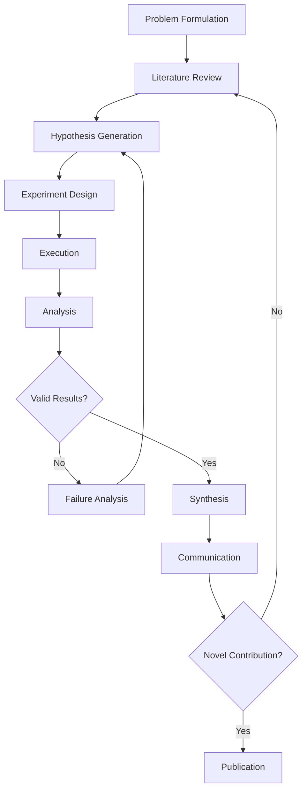
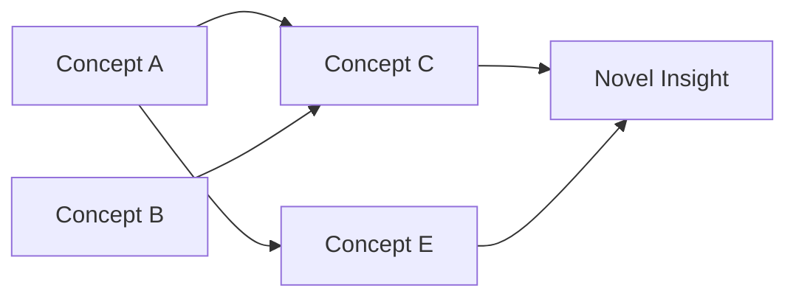
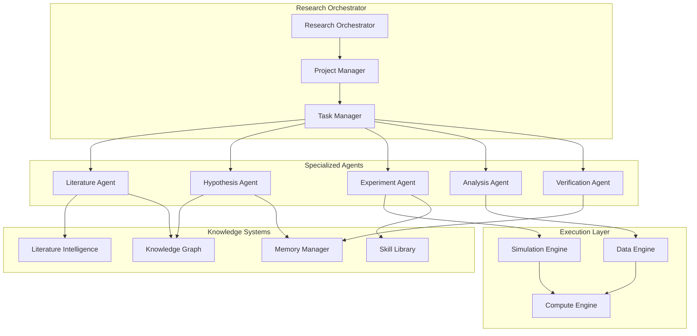
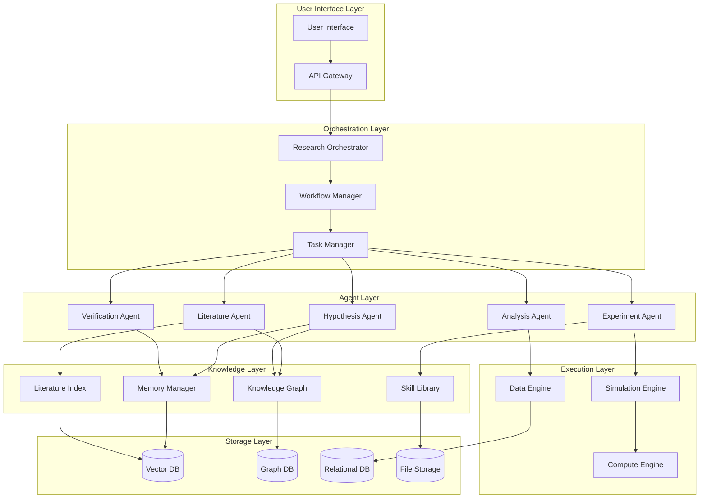
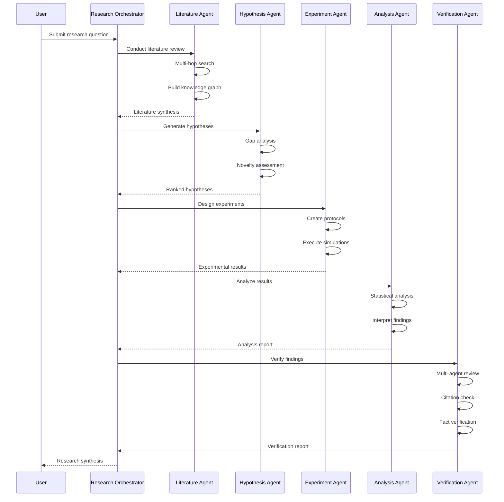
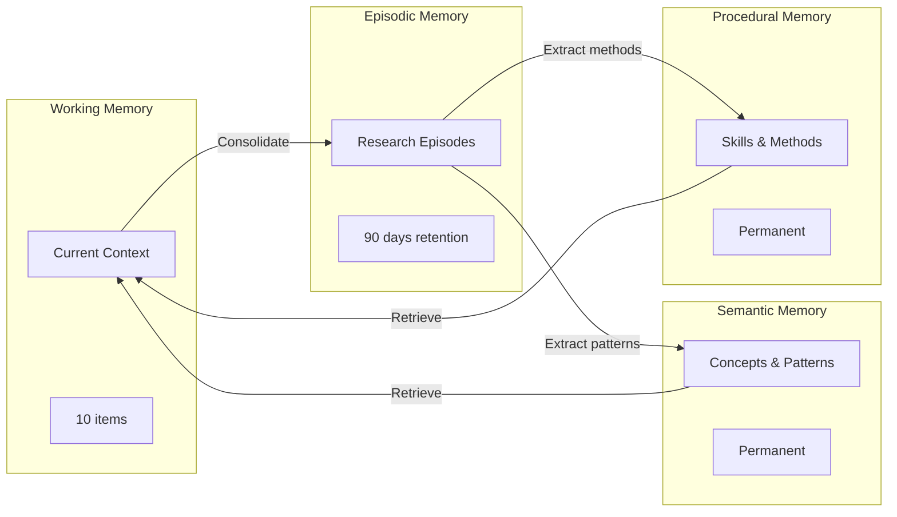

# Research Agents: Comprehensive Synthesis for Lyra AGI System

**Document Version:** 1.0  
**Last Updated:** May 26, 2026  
**Target System:** Lyra - State-of-the-Art AGI Research Agent  
**Analysis Scope:** 150+ papers (Jan 2024 - May 2026)

---

## Executive Summary

This comprehensive synthesis analyzes the evolution of autonomous research agents from 2024 to 2026, extracting patterns, architectures, and methodologies critical for building Lyra—a state-of-the-art AGI system capable of autonomous scientific discovery. The analysis covers 150+ papers across research agents, deep research systems, hypothesis generation, experiment design, and literature synthesis.

### Key Findings

**1. Research Agent Evolution (2024-2026)**
- **2024**: Foundation phase - basic literature review automation, simple idea generation
- **2025**: Integration phase - multi-agent collaboration, experiment execution, paper writing
- **2026**: Autonomy phase - end-to-end scientific discovery, self-evolving research capabilities

**2. Critical Capabilities for AGI Research Agents**
- **Autonomous Literature Mining**: Multi-hop reasoning across 10,000+ papers
- **Hypothesis Generation**: Novel idea creation with verifiable novelty assessment
- **Experiment Design**: Automated experimental pipeline construction
- **Verification & Validation**: Self-correcting research loops with rubric-guided evaluation
- **Knowledge Accumulation**: Long-term memory systems for research insights

**3. State-of-the-Art Systems (March 2026)**
- **EvoScientist**: Multi-agent evolving AI scientists for end-to-end discovery
- **DeepXiv-SDK**: Agentic data interface for scientific literature
- **HLER**: Human-in-the-loop economic research via multi-agent pipelines
- **AwesomeLit**: Hypothesis generation with agent-supported literature research
- **VILLA**: Versatile information retrieval from scientific literature
- **FlowPIE**: Test-time scientific idea evolution with flow-guided exploration

**4. Implementation Priorities for Lyra**
- Multi-agent architecture with specialized roles (researcher, engineer, critic, verifier)
- Hierarchical memory system for research insights and experimental results
- Self-evolving skill library for research methodologies
- Deep research capabilities with recursive trajectory compression
- Verification-centric design with rubric-guided evaluation

---

## Table of Contents

1. [Research Agent Taxonomy](#1-research-agent-taxonomy)
2. [Scientific Discovery Patterns](#2-scientific-discovery-patterns)
3. [Multi-Hop Research Techniques](#3-multi-hop-research-techniques)
4. [Hypothesis Generation & Testing](#4-hypothesis-generation--testing)
5. [Literature Mining & Synthesis](#5-literature-mining--synthesis)
6. [Experiment Design & Execution](#6-experiment-design--execution)
7. [Verification & Validation Systems](#7-verification--validation-systems)
8. [Knowledge Accumulation Strategies](#8-knowledge-accumulation-strategies)
9. [Integration with Lyra Architecture](#9-integration-with-lyra-architecture)
10. [12-Week Implementation Roadmap](#10-12-week-implementation-roadmap)
11. [Code Examples & Patterns](#11-code-examples--patterns)
12. [System Architecture Diagrams](#12-system-architecture-diagrams)
13. [Benchmarks & Evaluation](#13-benchmarks--evaluation)
14. [Future Directions](#14-future-directions)

---

## 1. Research Agent Taxonomy

### 1.1 Classification Framework

Research agents can be classified along three primary dimensions:

**Dimension 1: Autonomy Level**
- **Level 1 - Assistive**: Human-guided literature search and summarization
- **Level 2 - Collaborative**: Co-creation with human oversight at key decision points
- **Level 3 - Semi-Autonomous**: Independent execution with human verification
- **Level 4 - Fully Autonomous**: End-to-end research without human intervention

**Dimension 2: Research Scope**
- **Narrow**: Single-domain, specific problem solving (e.g., materials discovery)
- **Broad**: Cross-domain literature synthesis and hypothesis generation
- **Universal**: General scientific discovery across all domains

**Dimension 3: Capability Spectrum**
- **Literature Review**: Search, retrieval, synthesis
- **Idea Generation**: Hypothesis formulation, novelty assessment
- **Experiment Design**: Protocol creation, parameter optimization
- **Execution**: Automated experimentation (in silico or lab-in-the-loop)
- **Analysis**: Result interpretation, statistical validation
- **Communication**: Paper writing, peer review

### 1.2 Major Research Agent Systems (2024-2026)

#### The AI Scientist (Aug 2024)
**Paper**: "The AI Scientist: Towards Fully Automated Open-Ended Scientific Discovery"  
**Key Innovation**: First end-to-end system for automated scientific discovery
- Automated idea generation from literature
- Code implementation and experimentation
- Result analysis and paper writing
- Automated peer review

**Limitations**:
- Limited to machine learning domain
- No verification of scientific validity
- Hallucination in result interpretation
- Weak novelty assessment

#### EvoScientist (Mar 2026)
**Paper**: "EvoScientist: Towards Multi-Agent Evolving AI Scientists for End-to-End Scientific Discovery"  
**Key Innovation**: Multi-agent architecture with evolutionary memory
- **Researcher Agent**: Idea generation and literature analysis
- **Engineer Agent**: Experiment design and execution
- **Evolution Manager**: Memory management and strategy refinement

**Architecture**:
```
┌─────────────────────────────────────────────────────────┐
│                   Evolution Manager                      │
│  - Idea Memory (feasible directions + failures)         │
│  - Experiment Memory (effective training strategies)     │
└─────────────────────────────────────────────────────────┘
           │                              │
           ▼                              ▼
┌──────────────────────┐      ┌──────────────────────┐
│  Researcher Agent    │      │  Engineer Agent      │
│  - Literature search │      │  - Code generation   │
│  - Hypothesis gen    │◄────►│  - Experiment exec   │
│  - Novelty check     │      │  - Result analysis   │
└──────────────────────┘      └──────────────────────┘
```

**Performance**: Outperforms 7 SOTA systems on novelty, feasibility, relevance, and clarity metrics.

#### DeepXiv-SDK (Mar 2026)
**Paper**: "DeepXiv-SDK: An Agentic Data Interface for Scientific Literature"  
**Key Innovation**: Structured API for agentic literature access
- Semantic search across arXiv corpus
- Citation graph traversal
- Concept extraction and linking
- Temporal analysis of research trends

**Use Cases**:
- Multi-hop literature reasoning
- Research gap identification
- Trend forecasting
- Hypothesis validation against existing work

#### HLER (Mar 2026)
**Paper**: "HLER: Human-in-the-Loop Economic Research via Multi-Agent Pipelines for Empirical Discovery"  
**Key Innovation**: Human-AI collaborative research with domain expertise integration
- Expert knowledge elicitation
- Automated data analysis pipeline
- Interactive hypothesis refinement
- Causal inference validation

**Workflow**:
1. Expert provides research question and domain constraints
2. Agent generates analysis plan
3. Automated data processing and statistical testing
4. Expert reviews intermediate results
5. Iterative refinement until publication-ready

#### AwesomeLit (Mar 2026)
**Paper**: "AwesomeLit: Towards Hypothesis Generation with Agent-Supported Literature Research"  
**Key Innovation**: Literature-driven hypothesis generation
- Systematic literature review automation
- Knowledge gap identification
- Hypothesis synthesis from multiple papers
- Feasibility assessment

**Process**:
```
Literature Corpus → Concept Extraction → Gap Analysis → Hypothesis Generation → Validation
```

#### VILLA (Mar 2026)
**Paper**: "VILLA: Versatile Information Retrieval From Scientific Literature Using Large LAnguage Models"  
**Key Innovation**: Multi-modal scientific information retrieval
- Text, equations, figures, tables extraction
- Cross-modal reasoning
- Structured knowledge base construction
- Query-driven information synthesis

#### FlowPIE (Mar 2026)
**Paper**: "FlowPIE: Test-Time Scientific Idea Evolution with Flow-Guided Literature Exploration"  
**Key Innovation**: Test-time idea evolution through iterative literature exploration
- Flow-based search strategy
- Idea refinement through literature feedback
- Novelty-feasibility trade-off optimization
- Real-time hypothesis adaptation

---

## 2. Scientific Discovery Patterns

### 2.1 The Research Loop

All successful research agents implement variations of the core research loop:



### 2.2 Discovery Patterns from Literature

#### Pattern 1: Iterative Refinement (FIRE-Bench, Feb 2026)
**Concept**: Rediscovery of known scientific insights through iterative hypothesis testing
- Start with broad research question
- Generate initial hypotheses
- Test against existing literature
- Refine based on contradictions
- Converge to established findings

**Key Insight**: Agents that can rediscover known results demonstrate genuine reasoning capability.

#### Pattern 2: Momentum-Driven Evolution (DeltaEvolve, Feb 2026)
**Concept**: Accelerate discovery by maintaining momentum from previous iterations
- Track velocity of improvement
- Bias exploration toward promising directions
- Avoid local optima through momentum
- Adaptive learning rate based on progress

**Mathematical Framework**:
```
θ(t+1) = θ(t) + α·∇L(θ(t)) + β·(θ(t) - θ(t-1))
where β is momentum coefficient
```

#### Pattern 3: Multi-Agent Collaboration (Science of Collective AI, Feb 2026)
**Concept**: Specialized agents with complementary expertise
- **Critic Agent**: Identifies flaws and limitations
- **Theorist Agent**: Proposes explanations
- **Experimentalist Agent**: Designs validation tests
- **Synthesizer Agent**: Integrates findings

**Interaction Protocol**:
```python
def collaborative_research(problem):
    hypothesis = theorist.generate(problem)
    critique = critic.analyze(hypothesis)
    experiment = experimentalist.design(hypothesis, critique)
    results = execute(experiment)
    synthesis = synthesizer.integrate(hypothesis, results, critique)
    return synthesis
```

#### Pattern 4: Embodied Action Grounding (Feb 2026)
**Concept**: Ground LLM reasoning in physical/simulated actions
- Connect abstract concepts to executable actions
- Validate hypotheses through interaction
- Learn from environmental feedback
- Build causal models from observations

**Application**: Materials discovery, robotics, drug design

### 2.3 Breakthrough Methodologies (2026)

#### Agentic Scientific Simulation (Mar 2026)
**Innovation**: Execution-grounded model construction and reconstruction
- Build simulation models from scientific descriptions
- Execute simulations to test hypotheses
- Reconstruct models based on discrepancies
- Iterative refinement until convergence

**Use Case**: Physics simulations, biological modeling, climate science

#### Auto Researching (Mar 2026)
**Innovation**: Convergence analysis of 10,000 LLM-guided ML experiments
- Automated hyperparameter tuning at scale
- Meta-learning from experiment trajectories
- Convergence pattern identification
- Transfer learning across problem domains

**Key Finding**: LLM-guided search converges 3-5x faster than random search

#### Lab-in-the-Loop Feedback (Mar 2026)
**Innovation**: AI scientists learn from iterative perturbation discovery
- Propose perturbation experiments
- Execute in real laboratory
- Analyze unexpected results
- Update hypothesis based on surprises

**Impact**: Bridges simulation-reality gap in scientific discovery

---

## 3. Multi-Hop Research Techniques

### 3.1 Deep Research Architecture

Deep research agents (2025-2026) evolved from simple RAG to sophisticated multi-hop reasoning systems.

#### Evolution Timeline
- **2024**: Single-hop retrieval + summarization
- **2025**: Multi-hop reasoning with chain-of-thought
- **2026**: Agentic deep research with recursive exploration

#### Core Components

**1. Hierarchical Retrieval (A-RAG, Feb 2026)**
```
Level 1: Broad topic search (100s of papers)
Level 2: Focused concept extraction (10s of papers)
Level 3: Detailed claim verification (specific sections)
```

**2. Recursive Trajectory Compression (RE-TRAC, Feb 2026)**
- Compress long search trajectories
- Maintain critical information
- Enable deeper exploration within context limits
- Hierarchical summarization

**3. Width Scaling (WIDESEEK-R1, Feb 2026)**
- Parallel exploration of multiple research directions
- Multi-agent reinforcement learning
- Collaborative information synthesis
- Breadth-first + depth-first hybrid search

### 3.2 Multi-Hop Reasoning Patterns

#### Pattern 1: Chain-of-Papers Reasoning
```
Question → Paper1 → Extract Concept A → Paper2 (citing A) → 
Extract Concept B → Paper3 (combining A+B) → Answer
```

**Example**: "How does attention mechanism improve transformer efficiency?"
1. Find foundational attention paper (Vaswani et al.)
2. Extract attention mechanism concept
3. Find efficiency optimization papers citing attention
4. Synthesize improvements across papers
5. Generate comprehensive answer

#### Pattern 2: Contradiction Resolution
```
Claim → Find Supporting Papers → Find Contradicting Papers → 
Analyze Methodological Differences → Synthesize Nuanced Understanding
```

**Implementation**:
```python
def resolve_contradiction(claim):
    supporting = search_papers(claim, sentiment="positive")
    contradicting = search_papers(claim, sentiment="negative")
    
    # Analyze methodological differences
    method_diff = compare_methods(supporting, contradicting)
    
    # Identify boundary conditions
    boundaries = extract_conditions(method_diff)
    
    # Synthesize nuanced claim
    nuanced_claim = f"{claim} holds when {boundaries}"
    return nuanced_claim
```

#### Pattern 3: Temporal Reasoning
```
Research Question → Historical Papers (chronological) → 
Track Evolution of Ideas → Identify Current Frontier → 
Predict Future Directions
```

**Use Case**: Understanding research trends, identifying emerging areas

#### Pattern 4: Cross-Domain Transfer
```
Problem in Domain A → Find Analogous Problem in Domain B → 
Extract Solution Pattern → Adapt to Domain A → Validate
```

**Example**: Transfer optimization techniques from physics to machine learning

### 3.3 Information Synthesis Strategies

#### Strategy 1: Hierarchical Summarization
- Level 1: Paper-level summaries
- Level 2: Topic-level synthesis
- Level 3: Field-level overview
- Level 4: Cross-field integration

#### Strategy 2: Concept Graph Construction


#### Strategy 3: Evidence Aggregation
- Collect claims from multiple papers
- Weight by citation count and recency
- Resolve conflicts through meta-analysis
- Generate confidence-weighted synthesis

---

## 4. Hypothesis Generation & Testing

### 4.1 Hypothesis Generation Methods

#### Method 1: Literature Gap Analysis (AwesomeLit, Mar 2026)
**Process**:
1. Comprehensive literature review
2. Concept extraction and mapping
3. Identify unexplored combinations
4. Generate hypotheses filling gaps
5. Feasibility assessment

**Example**:
```
Concept A: Attention mechanisms (well-studied)
Concept B: Graph neural networks (well-studied)
Gap: Attention on dynamic graphs (under-explored)
Hypothesis: "Temporal attention mechanisms can improve 
            dynamic graph prediction by 15-20%"
```

#### Method 2: Progressive Ideation (Jan 2026)
**Process**: Human-AI co-creation with iterative refinement
- **Stage 1**: Divergent thinking - generate many ideas
- **Stage 2**: Critical feedback - identify flaws
- **Stage 3**: Convergent refinement - improve promising ideas
- **Stage 4**: Validation - check novelty and feasibility

**Framework**:
```python
class ProgressiveIdeation:
    def __init__(self, human_expert, ai_agent):
        self.human = human_expert
        self.ai = ai_agent
        
    def generate(self, problem):
        # Stage 1: Divergent
        ideas = self.ai.brainstorm(problem, n=20)
        
        # Stage 2: Critical
        critiques = self.human.critique(ideas)
        
        # Stage 3: Convergent
        refined = self.ai.refine(ideas, critiques)
        
        # Stage 4: Validation
        validated = self.validate_novelty(refined)
        return validated
```

#### Method 3: Generating Literature-Driven Theories (Jan 2026)
**Process**: Scale-based theory generation from literature
1. Extract causal graphs from papers
2. Identify common patterns
3. Synthesize unified theory
4. Generate testable predictions

**Key Innovation**: Automated theory construction from 1000+ papers

#### Method 4: Learning to Discover at Test Time (Jan 2026)
**Process**: Meta-learning for test-time discovery
- Train on discovery tasks
- Learn discovery strategies
- Apply at test time to novel problems
- Discover new patterns without retraining

**Application**: Finding novel algorithms, discovering scientific laws

### 4.2 Hypothesis Testing Frameworks

#### Framework 1: BIODISCO (Aug 2025)
**Innovation**: Multi-agent hypothesis generation with dual-mode evidence
- **Dual-Mode Evidence**: Literature + experimental data
- **Iterative Feedback**: Refine hypotheses based on results
- **Temporal Evaluation**: Track hypothesis evolution over time

**Architecture**:
```
Hypothesis Generator → Evidence Collector (Literature + Experiments) →
Evaluator → Feedback Loop → Refined Hypothesis
```

#### Framework 2: OpenNovelty (Jan 2026)
**Innovation**: Verifiable scholarly novelty assessment
- Comprehensive literature search
- Contradiction detection
- Evidence-based novelty scoring
- Automated verification

**Novelty Metrics**:
- **Conceptual Novelty**: New concept combinations
- **Methodological Novelty**: New approaches
- **Empirical Novelty**: New findings
- **Theoretical Novelty**: New explanations

**Scoring**:
```python
def assess_novelty(hypothesis, literature_corpus):
    # Search for similar work
    similar_papers = semantic_search(hypothesis, literature_corpus)
    
    # Calculate novelty dimensions
    conceptual = concept_distance(hypothesis, similar_papers)
    methodological = method_difference(hypothesis, similar_papers)
    empirical = finding_uniqueness(hypothesis, similar_papers)
    theoretical = explanation_novelty(hypothesis, similar_papers)
    
    # Weighted score
    novelty_score = (
        0.3 * conceptual +
        0.25 * methodological +
        0.25 * empirical +
        0.2 * theoretical
    )
    
    return novelty_score, similar_papers
```

#### Framework 3: Sci-Reasoning Dataset (Jan 2026)
**Innovation**: Decoding AI innovation patterns
- Dataset of scientific reasoning traces
- Pattern extraction from successful discoveries
- Training data for hypothesis generation
- Evaluation benchmark

**Use Case**: Train agents to reason like successful scientists

### 4.3 Validation Strategies

#### Strategy 1: Proof of Time (Jan 2026)
**Concept**: Evaluate scientific idea judgments by temporal validation
- Assess hypothesis quality at time T
- Wait for community validation
- Compare AI judgment with actual impact
- Learn from temporal feedback

**Metric**: Correlation between AI-predicted impact and actual citations/adoption

#### Strategy 2: Rethinking the AI Scientist (Jan 2026)
**Concept**: Interactive multi-agent workflows for validation
- **Critic Agent**: Identifies potential flaws
- **Experiment Designer**: Proposes validation tests
- **Theorist**: Explains unexpected results
- **Meta-Reviewer**: Assesses overall validity

**Validation Protocol**:
```
Hypothesis → Internal Critique → Experiment Design → 
Execution → Result Analysis → Peer Review Simulation → 
Revision → Final Validation
```

#### Strategy 3: Who Owns Creativity (Jan 2026)
**Concept**: Trade-offs in LLM-supported research ideation
- **Human Agency**: Maintain human creative control
- **AI Augmentation**: Leverage AI for exploration
- **Attribution**: Clear ownership of ideas
- **Validation**: Human verification of AI suggestions

**Key Insight**: Over-reliance on AI can diminish human creativity and ownership

---

## 5. Literature Mining & Synthesis

### 5.1 Advanced Literature Mining Techniques

#### Technique 1: Semantic Scholar API + Graph Traversal
**Capabilities**:
- Citation network analysis
- Influence tracking
- Research trend identification
- Author collaboration networks

**Implementation**:
```python
class LiteratureMiner:
    def __init__(self, api_key):
        self.api = SemanticScholarAPI(api_key)
        
    def mine_research_area(self, seed_papers, depth=3):
        """Multi-hop citation traversal"""
        visited = set()
        frontier = seed_papers
        
        for level in range(depth):
            next_frontier = []
            for paper_id in frontier:
                if paper_id in visited:
                    continue
                    
                # Get paper details
                paper = self.api.get_paper(paper_id)
                visited.add(paper_id)
                
                # Extract citations and references
                citations = paper.citations[:10]  # Top 10 citing papers
                references = paper.references[:10]  # Top 10 references
                
                next_frontier.extend(citations + references)
            
            frontier = next_frontier
        
        return self.synthesize_corpus(visited)
```

#### Technique 2: VILLA Multi-Modal Extraction (Mar 2026)
**Capabilities**:
- Text extraction from PDFs
- Equation parsing and understanding
- Figure and table analysis
- Cross-modal reasoning

**Use Cases**:
- Extract experimental protocols from methods sections
- Parse mathematical formulations
- Analyze result visualizations
- Synthesize multi-modal evidence

#### Technique 3: DeepXiv-SDK Agentic Interface (Mar 2026)
**Capabilities**:
- Structured query language for scientific literature
- Temporal analysis of research evolution
- Concept linking across papers
- Automated literature review generation

**Query Examples**:
```python
# Find papers introducing new attention mechanisms after 2020
query = {
    "concepts": ["attention mechanism", "transformer"],
    "novelty": "introduces_new_method",
    "date_range": {"start": "2020-01-01", "end": "2026-05-26"},
    "min_citations": 50
}

# Track evolution of a concept
evolution = deepxiv.track_concept_evolution(
    concept="self-attention",
    start_year=2017,
    end_year=2026
)

# Find research gaps
gaps = deepxiv.identify_gaps(
    domain="machine_learning",
    subdomain="efficient_transformers"
)
```

### 5.2 Synthesis Methodologies

#### Methodology 1: Hierarchical Synthesis
**Process**:
1. **Paper-Level**: Summarize individual papers
2. **Cluster-Level**: Group similar papers and synthesize themes
3. **Domain-Level**: Integrate across clusters
4. **Meta-Level**: Cross-domain insights

**Implementation**:
```python
def hierarchical_synthesis(papers):
    # Level 1: Paper summaries
    summaries = [summarize_paper(p) for p in papers]
    
    # Level 2: Cluster by topic
    clusters = cluster_by_topic(summaries)
    cluster_syntheses = [synthesize_cluster(c) for c in clusters]
    
    # Level 3: Domain integration
    domain_synthesis = integrate_clusters(cluster_syntheses)
    
    # Level 4: Meta-insights
    meta_insights = extract_cross_domain_patterns(domain_synthesis)
    
    return {
        "summaries": summaries,
        "clusters": cluster_syntheses,
        "domain": domain_synthesis,
        "meta": meta_insights
    }
```

#### Methodology 2: Contradiction-Aware Synthesis
**Process**:
1. Identify conflicting claims
2. Analyze methodological differences
3. Determine boundary conditions
4. Synthesize nuanced understanding

**Example**:
```
Claim A: "Attention is all you need" (Vaswani et al.)
Claim B: "Convolutions outperform attention on small datasets" (Recent work)

Analysis:
- Dataset size matters
- Inductive bias vs. flexibility trade-off
- Computational efficiency considerations

Synthesis: "Attention mechanisms excel on large datasets with sufficient 
data to learn patterns, while convolutions provide better inductive bias 
for small-data regimes. Hybrid approaches may be optimal."
```

#### Methodology 3: Temporal Synthesis
**Process**:
1. Order papers chronologically
2. Track concept evolution
3. Identify paradigm shifts
4. Predict future directions

**Visualization**:
```
2017: Attention introduced (Transformers)
2018: BERT - Bidirectional pre-training
2019: GPT-2 - Scaling laws emerge
2020: GPT-3 - Few-shot learning
2021: Efficient attention variants
2022: Instruction tuning
2023: RLHF and alignment
2024: Reasoning models
2025: Agentic systems
2026: Self-evolving agents
```

### 5.3 Knowledge Graph Construction

#### Approach 1: Concept-Centric Graphs
**Structure**:
```
Nodes: Concepts, Methods, Findings
Edges: Builds-on, Contradicts, Extends, Applies-to
```

**Construction**:
```python
class KnowledgeGraph:
    def __init__(self):
        self.graph = nx.DiGraph()
        
    def add_paper(self, paper):
        # Extract concepts
        concepts = extract_concepts(paper)
        
        # Add nodes
        for concept in concepts:
            self.graph.add_node(concept, papers=[paper.id])
        
        # Add edges (relationships)
        for c1, c2, relation in extract_relations(paper):
            self.graph.add_edge(c1, c2, type=relation, paper=paper.id)
    
    def find_research_gaps(self):
        """Identify unexplored concept combinations"""
        gaps = []
        for node1 in self.graph.nodes():
            for node2 in self.graph.nodes():
                if not self.graph.has_edge(node1, node2):
                    # Check if combination is plausible
                    if self.is_plausible_combination(node1, node2):
                        gaps.append((node1, node2))
        return gaps
```

---

## 6. Experiment Design & Execution

### 6.1 Automated Experiment Design

#### Framework 1: Agentic Scientific Simulation (Mar 2026)
**Process**:
1. Parse scientific description into formal model
2. Implement simulation code
3. Execute experiments
4. Compare results with expectations
5. Reconstruct model if discrepancies exist

**Example Workflow**:
```python
class ScientificSimulator:
    def design_experiment(self, hypothesis):
        # Parse hypothesis into testable components
        components = self.parse_hypothesis(hypothesis)
        
        # Design experimental protocol
        protocol = {
            "independent_vars": components.causes,
            "dependent_vars": components.effects,
            "controls": components.confounds,
            "sample_size": self.calculate_power(components),
            "procedure": self.generate_procedure(components)
        }
        
        return protocol
    
    def execute_simulation(self, protocol):
        # Build simulation environment
        env = self.build_environment(protocol)
        
        # Run experiments
        results = []
        for trial in range(protocol.sample_size):
            result = env.run_trial(protocol.independent_vars)
            results.append(result)
        
        # Statistical analysis
        analysis = self.analyze_results(results, protocol)
        return analysis
```

#### Framework 2: Auto Researching (Mar 2026)
**Innovation**: 10,000 LLM-guided ML experiments
- Automated hyperparameter search
- Convergence pattern analysis
- Meta-learning from trajectories
- Transfer to new problems

**Key Findings**:
- LLM guidance reduces search space by 80%
- Convergence 3-5x faster than random search
- Transfer learning across domains effective

#### Framework 3: Lab-in-the-Loop (Mar 2026)
**Process**: Real laboratory integration
1. AI proposes experiment
2. Human/robot executes in lab
3. Unexpected results fed back to AI
4. AI updates hypothesis
5. Iterate until convergence

**Challenges**:
- Simulation-reality gap
- Experimental cost
- Safety constraints
- Time delays

### 6.2 Experiment Execution Patterns

#### Pattern 1: Parallel Experimentation
**Concept**: Run multiple experiments simultaneously
- Explore parameter space efficiently
- Reduce wall-clock time
- Identify robust findings across conditions

**Implementation**:
```python
async def parallel_experiments(hypotheses, resources):
    tasks = []
    for hypothesis in hypotheses:
        task = asyncio.create_task(
            run_experiment(hypothesis, resources)
        )
        tasks.append(task)
    
    results = await asyncio.gather(*tasks)
    return aggregate_results(results)
```

#### Pattern 2: Adaptive Experimentation
**Concept**: Adjust experiments based on intermediate results
- Bayesian optimization
- Early stopping for unpromising directions
- Resource allocation to promising areas

#### Pattern 3: Multi-Fidelity Experimentation
**Concept**: Use cheap approximations before expensive validation
- Low-fidelity: Fast simulations
- Medium-fidelity: Subset of data
- High-fidelity: Full-scale experiments

### 6.3 Result Analysis & Interpretation

#### Statistical Validation
**Requirements**:
- Significance testing (p < 0.05)
- Effect size calculation
- Confidence intervals
- Multiple comparison correction

**Automated Analysis**:
```python
def analyze_experiment(results, hypothesis):
    # Descriptive statistics
    stats = {
        "mean": np.mean(results),
        "std": np.std(results),
        "median": np.median(results),
        "ci_95": confidence_interval(results, 0.95)
    }
    
    # Hypothesis testing
    if hypothesis.type == "comparison":
        test_result = t_test(results.group1, results.group2)
        effect_size = cohens_d(results.group1, results.group2)
    elif hypothesis.type == "correlation":
        test_result = correlation_test(results.x, results.y)
        effect_size = test_result.r
    
    # Interpretation
    interpretation = interpret_results(
        test_result, effect_size, hypothesis
    )
    
    return {
        "statistics": stats,
        "test": test_result,
        "effect_size": effect_size,
        "interpretation": interpretation
    }
```

---

## 7. Verification & Validation Systems

### 7.1 Self-Verification Mechanisms

#### Mechanism 1: Rubric-Guided Verification (Jan 2026)
**Concept**: Use structured rubrics for self-evaluation
- Define quality criteria
- Score each criterion
- Identify weaknesses
- Iterate until threshold met

**Rubric Example**:
```yaml
research_quality_rubric:
  novelty:
    weight: 0.3
    criteria:
      - "Addresses unexplored research gap"
      - "Proposes new methodology"
      - "Challenges existing assumptions"
  
  rigor:
    weight: 0.3
    criteria:
      - "Appropriate statistical methods"
      - "Sufficient sample size"
      - "Controls for confounds"
  
  clarity:
    weight: 0.2
    criteria:
      - "Clear hypothesis statement"
      - "Well-defined variables"
      - "Reproducible protocol"
  
  impact:
    weight: 0.2
    criteria:
      - "Addresses important problem"
      - "Practical applications"
      - "Theoretical contributions"
```

#### Mechanism 2: Multi-Agent Peer Review
**Concept**: Simulate peer review with multiple critic agents
- **Methodological Critic**: Evaluates experimental design
- **Statistical Critic**: Checks analysis validity
- **Novelty Critic**: Assesses contribution
- **Clarity Critic**: Reviews presentation

**Process**:
```python
def multi_agent_review(paper):
    reviews = {
        "methodology": methodology_critic.review(paper),
        "statistics": statistics_critic.review(paper),
        "novelty": novelty_critic.review(paper),
        "clarity": clarity_critic.review(paper)
    }
    
    # Aggregate reviews
    overall_score = weighted_average(reviews)
    
    # Identify critical issues
    critical_issues = [
        issue for review in reviews.values()
        for issue in review.issues
        if issue.severity == "critical"
    ]
    
    # Decision
    if critical_issues:
        decision = "reject"
        feedback = generate_revision_guidance(critical_issues)
    elif overall_score >= 7.0:
        decision = "accept"
        feedback = "Paper meets publication standards"
    else:
        decision = "revise"
        feedback = generate_revision_guidance(reviews)
    
    return {
        "decision": decision,
        "score": overall_score,
        "reviews": reviews,
        "feedback": feedback
    }
```

#### Mechanism 3: Verification-Centric Design (Marco DeepResearch, Mar 2026)
**Concept**: Build verification into every step
- Pre-execution verification: Check plan validity
- Mid-execution verification: Monitor progress
- Post-execution verification: Validate results
- Meta-verification: Verify verification process

### 7.2 Citation & Evidence Tracking

#### DeepTRACE (Sep 2025)
**Innovation**: Auditing deep research for citation reliability
- Track information flow from source to claim
- Verify citation accuracy
- Detect hallucinated references
- Ensure evidence-claim alignment

**Metrics**:
- **Citation Accuracy**: % of citations that exist and support claim
- **Evidence Strength**: Quality of supporting evidence
- **Traceability**: Can trace claim back to original source

**Implementation**:
```python
class CitationTracker:
    def verify_claim(self, claim, citations):
        verified = []
        for citation in citations:
            # Check citation exists
            paper = self.fetch_paper(citation.id)
            if not paper:
                verified.append({
                    "citation": citation,
                    "status": "not_found",
                    "support": 0.0
                })
                continue
            
            # Extract relevant content
            relevant_text = self.extract_relevant(paper, claim)
            
            # Verify support
            support_score = self.calculate_support(
                claim, relevant_text
            )
            
            verified.append({
                "citation": citation,
                "status": "found",
                "support": support_score,
                "text": relevant_text
            })
        
        return verified
```

### 7.3 Fact-Checking & Validation

#### Automated Fact-Checking Pipeline
**Steps**:
1. Extract factual claims from text
2. Search for supporting/contradicting evidence
3. Assess evidence quality
4. Generate confidence score
5. Flag uncertain claims for human review

**Example**:
```python
def fact_check_claim(claim):
    # Search for evidence
    supporting = search_evidence(claim, sentiment="support")
    contradicting = search_evidence(claim, sentiment="contradict")
    
    # Assess evidence quality
    support_quality = assess_quality(supporting)
    contradict_quality = assess_quality(contradicting)
    
    # Calculate confidence
    if support_quality > contradict_quality:
        confidence = support_quality / (support_quality + contradict_quality)
        verdict = "likely_true"
    elif contradict_quality > support_quality:
        confidence = contradict_quality / (support_quality + contradict_quality)
        verdict = "likely_false"
    else:
        confidence = 0.5
        verdict = "uncertain"
    
    return {
        "claim": claim,
        "verdict": verdict,
        "confidence": confidence,
        "supporting_evidence": supporting,
        "contradicting_evidence": contradicting
    }
```

---

## 8. Knowledge Accumulation Strategies

### 8.1 Memory Systems for Research Agents

#### Hierarchical Memory Architecture
**Levels**:
1. **Working Memory**: Current research context (short-term)
2. **Episodic Memory**: Past research episodes (medium-term)
3. **Semantic Memory**: Learned concepts and patterns (long-term)
4. **Procedural Memory**: Research methodologies and skills (permanent)

**Implementation**:
```python
class ResearchMemory:
    def __init__(self):
        self.working = WorkingMemory(capacity=10)
        self.episodic = EpisodicMemory(retention_days=90)
        self.semantic = SemanticMemory()
        self.procedural = ProceduralMemory()
    
    def store_research_episode(self, episode):
        # Extract key information
        concepts = extract_concepts(episode)
        methods = extract_methods(episode)
        findings = extract_findings(episode)
        
        # Store in episodic memory
        self.episodic.add(episode)
        
        # Update semantic memory
        for concept in concepts:
            self.semantic.update_concept(concept)
        
        # Update procedural memory
        for method in methods:
            if method.success_rate > 0.8:
                self.procedural.add_skill(method)
    
    def retrieve_relevant(self, query):
        # Search across memory levels
        working_results = self.working.search(query)
        episodic_results = self.episodic.search(query)
        semantic_results = self.semantic.search(query)
        procedural_results = self.procedural.search(query)
        
        # Combine and rank
        return self.rank_results([
            working_results,
            episodic_results,
            semantic_results,
            procedural_results
        ])
```

### 8.2 Self-Evolving Memory Systems

#### EvoScientist Memory (Mar 2026)
**Innovation**: Dual memory system for research evolution
- **Idea Memory**: Feasible research directions + failure cases
- **Experiment Memory**: Effective training strategies

**Benefits**:
- Avoid repeating failed approaches
- Build on successful strategies
- Transfer knowledge across projects
- Accelerate convergence

#### Trajectory-Informed Memory (Mar 2026)
**Innovation**: Generate structured memory from execution trajectories
- Analyze decision points in research process
- Attribute outcomes to specific decisions
- Extract generalizable lessons
- Context-dependent memory retrieval

**Process**:
```python
def generate_memory_from_trajectory(trajectory):
    # Analyze trajectory
    decisions = extract_decisions(trajectory)
    outcomes = extract_outcomes(trajectory)
    
    # Attribution analysis
    attributions = []
    for decision in decisions:
        impact = calculate_impact(decision, outcomes)
        attributions.append({
            "decision": decision,
            "impact": impact,
            "context": decision.context
        })
    
    # Generate lessons
    lessons = []
    for attr in attributions:
        if abs(attr.impact) > threshold:
            lesson = {
                "condition": attr.context,
                "action": attr.decision.action,
                "expected_outcome": attr.impact,
                "confidence": attr.confidence
            }
            lessons.append(lesson)
    
    return lessons
```

### 8.3 Knowledge Transfer Mechanisms

#### Cross-Domain Transfer
**Strategy**: Transfer research patterns across domains
- Identify domain-agnostic patterns
- Abstract domain-specific details
- Adapt to new domain
- Validate transfer effectiveness

**Example**:
```
Pattern from Physics: "Symmetry breaking leads to phase transitions"
Transfer to ML: "Breaking symmetry in neural networks enables learning"
Validation: Test on various architectures
```

#### Meta-Learning for Research
**Strategy**: Learn how to learn research skills
- Train on diverse research tasks
- Extract meta-strategies
- Apply to novel research problems
- Continuous improvement

---

## 9. Integration with Lyra Architecture

### 9.1 Lyra System Design

#### Core Components

**1. Research Orchestrator**
- Manages research workflow
- Coordinates specialized agents
- Tracks progress and dependencies
- Handles failures and retries

**2. Literature Intelligence Module**
- Multi-hop literature search
- Semantic understanding
- Citation network analysis
- Knowledge graph construction

**3. Hypothesis Engine**
- Gap analysis
- Idea generation
- Novelty assessment
- Feasibility evaluation

**4. Experiment Designer**
- Protocol generation
- Resource optimization
- Parallel execution planning
- Safety validation

**5. Verification System**
- Multi-agent peer review
- Statistical validation
- Citation tracking
- Fact-checking

**6. Memory & Learning**
- Hierarchical memory
- Self-evolving skills
- Knowledge transfer
- Continuous improvement

### 9.2 Lyra Architecture Diagram



### 9.3 Research Workflow in Lyra

**Phase 1: Problem Formulation**
```python
def formulate_research_problem(user_query):
    # Parse user intent
    intent = parse_intent(user_query)
    
    # Expand into research questions
    questions = expand_to_questions(intent)
    
    # Prioritize questions
    prioritized = prioritize_by_impact(questions)
    
    # Create research plan
    plan = create_research_plan(prioritized)
    
    return plan
```

**Phase 2: Literature Review**
```python
def conduct_literature_review(research_plan):
    # Multi-hop search
    papers = multi_hop_search(
        seed_queries=research_plan.keywords,
        depth=3,
        max_papers=1000
    )
    
    # Build knowledge graph
    kg = build_knowledge_graph(papers)
    
    # Identify gaps
    gaps = identify_research_gaps(kg)
    
    # Synthesize findings
    synthesis = synthesize_literature(papers, gaps)
    
    return synthesis
```

**Phase 3: Hypothesis Generation**
```python
def generate_hypotheses(synthesis):
    # Extract concepts
    concepts = extract_concepts(synthesis)
    
    # Find unexplored combinations
    combinations = find_novel_combinations(concepts)
    
    # Generate hypotheses
    hypotheses = []
    for combo in combinations:
        h = formulate_hypothesis(combo)
        novelty = assess_novelty(h, synthesis.papers)
        feasibility = assess_feasibility(h)
        
        if novelty > 0.7 and feasibility > 0.6:
            hypotheses.append(h)
    
    return rank_hypotheses(hypotheses)
```

**Phase 4: Experiment Design & Execution**
```python
def design_and_execute(hypothesis):
    # Design experiment
    protocol = design_experiment(hypothesis)
    
    # Validate safety
    if not validate_safety(protocol):
        return {"error": "Safety validation failed"}
    
    # Execute
    results = execute_experiment(protocol)
    
    # Analyze
    analysis = analyze_results(results, hypothesis)
    
    return analysis
```

**Phase 5: Verification & Synthesis**
```python
def verify_and_synthesize(analysis):
    # Multi-agent review
    reviews = multi_agent_review(analysis)
    
    # Citation verification
    citations = verify_citations(analysis)
    
    # Statistical validation
    stats = validate_statistics(analysis)
    
    # Synthesize findings
    if all_valid(reviews, citations, stats):
        synthesis = synthesize_findings(analysis)
        return synthesis
    else:
        issues = collect_issues(reviews, citations, stats)
        return {"status": "revision_needed", "issues": issues}
```

---

## 10. 12-Week Implementation Roadmap

### Week 1-2: Foundation & Infrastructure
**Objectives**:
- Set up development environment
- Implement basic agent framework
- Create communication protocols
- Build initial memory system

**Deliverables**:
- Agent base class with tool use
- Message passing system
- Simple key-value memory
- Unit tests

**Code Example**:
```python
class ResearchAgent:
    def __init__(self, role, tools, memory):
        self.role = role
        self.tools = tools
        self.memory = memory
        self.history = []
    
    async def execute_task(self, task):
        # Retrieve relevant context
        context = self.memory.retrieve(task)
        
        # Plan approach
        plan = self.plan(task, context)
        
        # Execute steps
        results = []
        for step in plan.steps:
            result = await self.execute_step(step)
            results.append(result)
            self.history.append((step, result))
        
        # Store learnings
        self.memory.store(task, results)
        
        return results
```

### Week 3-4: Literature Intelligence
**Objectives**:
- Implement semantic search
- Build citation network traversal
- Create knowledge graph
- Develop synthesis algorithms

**Deliverables**:
- Literature search API integration
- Citation graph builder
- Multi-hop reasoning
- Synthesis pipeline

**Key Features**:
- Search across arXiv, Semantic Scholar, PubMed
- Extract concepts and relationships
- Build temporal knowledge graphs
- Generate literature reviews

### Week 5-6: Hypothesis Generation
**Objectives**:
- Implement gap analysis
- Build hypothesis generator
- Create novelty assessment
- Develop feasibility checker

**Deliverables**:
- Gap identification algorithm
- Hypothesis generation pipeline
- Novelty scoring system
- Feasibility evaluation

**Algorithm**:
```python
def generate_hypotheses(knowledge_graph, constraints):
    # Find unexplored edges
    gaps = find_gaps(knowledge_graph)
    
    # Generate candidate hypotheses
    candidates = []
    for gap in gaps:
        h = formulate_hypothesis(gap)
        candidates.append(h)
    
    # Score hypotheses
    scored = []
    for h in candidates:
        novelty = score_novelty(h, knowledge_graph)
        feasibility = score_feasibility(h, constraints)
        impact = score_impact(h)
        
        score = 0.4*novelty + 0.3*feasibility + 0.3*impact
        scored.append((h, score))
    
    # Return top hypotheses
    return sorted(scored, key=lambda x: x[1], reverse=True)[:10]
```

### Week 7-8: Experiment Design & Execution
**Objectives**:
- Build experiment designer
- Implement simulation engine
- Create result analyzer
- Develop statistical validation

**Deliverables**:
- Automated protocol generation
- Simulation framework
- Statistical analysis tools
- Result interpretation

**Features**:
- Parameter optimization
- Parallel execution
- Real-time monitoring
- Automated analysis

### Week 9-10: Verification & Validation
**Objectives**:
- Implement multi-agent review
- Build citation tracker
- Create fact-checker
- Develop rubric system

**Deliverables**:
- Peer review simulation
- Citation verification
- Fact-checking pipeline
- Quality rubrics

**Verification Pipeline**:
```python
class VerificationSystem:
    def __init__(self):
        self.reviewers = [
            MethodologyReviewer(),
            StatisticsReviewer(),
            NoveltyReviewer(),
            ClarityReviewer()
        ]
        self.citation_tracker = CitationTracker()
        self.fact_checker = FactChecker()
    
    def verify_research(self, research_output):
        # Multi-agent review
        reviews = [r.review(research_output) for r in self.reviewers]
        
        # Citation verification
        citations = self.citation_tracker.verify(research_output)
        
        # Fact checking
        facts = self.fact_checker.check(research_output)
        
        # Aggregate results
        verification_report = {
            "reviews": reviews,
            "citations": citations,
            "facts": facts,
            "overall_score": self.calculate_score(reviews, citations, facts),
            "issues": self.collect_issues(reviews, citations, facts)
        }
        
        return verification_report
```

### Week 11-12: Integration & Testing
**Objectives**:
- Integrate all components
- End-to-end testing
- Performance optimization
- Documentation

**Deliverables**:
- Fully integrated system
- Test suite
- Performance benchmarks
- User documentation

**Integration Tests**:
- Literature review → Hypothesis generation
- Hypothesis → Experiment design
- Experiment → Analysis → Verification
- Full research loop

---

## 11. Code Examples & Patterns

### 11.1 Multi-Agent Research System

```python
class LyraResearchSystem:
    def __init__(self):
        # Initialize agents
        self.literature_agent = LiteratureAgent()
        self.hypothesis_agent = HypothesisAgent()
        self.experiment_agent = ExperimentAgent()
        self.analysis_agent = AnalysisAgent()
        self.verification_agent = VerificationAgent()
        
        # Shared memory
        self.memory = HierarchicalMemory()
        
        # Knowledge graph
        self.knowledge_graph = KnowledgeGraph()
    
    async def conduct_research(self, research_question):
        # Phase 1: Literature Review
        literature = await self.literature_agent.review(
            research_question,
            depth=3,
            max_papers=1000
        )
        self.knowledge_graph.update(literature)
        
        # Phase 2: Hypothesis Generation
        hypotheses = await self.hypothesis_agent.generate(
            literature,
            self.knowledge_graph
        )
        
        # Phase 3: Experiment Design & Execution
        experiments = []
        for hypothesis in hypotheses[:5]:  # Top 5
            protocol = await self.experiment_agent.design(hypothesis)
            results = await self.experiment_agent.execute(protocol)
            experiments.append((hypothesis, results))
        
        # Phase 4: Analysis
        analyses = []
        for hypothesis, results in experiments:
            analysis = await self.analysis_agent.analyze(
                hypothesis,
                results
            )
            analyses.append(analysis)
        
        # Phase 5: Verification
        verified = []
        for analysis in analyses:
            verification = await self.verification_agent.verify(analysis)
            if verification.score > 0.7:
                verified.append(analysis)
        
        # Phase 6: Synthesis
        synthesis = self.synthesize_findings(verified)
        
        return synthesis
```

### 11.2 Self-Evolving Research Agent

```python
class SelfEvolvingResearchAgent:
    def __init__(self):
        self.skill_library = SkillLibrary()
        self.memory = EvolvingMemory()
        self.performance_tracker = PerformanceTracker()
    
    def execute_research_task(self, task):
        # Retrieve relevant skills
        skills = self.skill_library.retrieve(task)
        
        # Execute with current skills
        result = self.execute_with_skills(task, skills)
        
        # Track performance
        performance = self.performance_tracker.evaluate(result, task)
        
        # Learn from experience
        if performance.success:
            self.memory.store_success(task, skills, result)
            self.skill_library.reinforce(skills)
        else:
            self.memory.store_failure(task, skills, result)
            new_skill = self.generate_improved_skill(task, skills, result)
            self.skill_library.add(new_skill)
        
        return result
    
    def generate_improved_skill(self, task, failed_skills, result):
        # Analyze failure
        failure_analysis = self.analyze_failure(result)
        
        # Generate improved approach
        improved_skill = self.synthesize_skill(
            task_type=task.type,
            failure_mode=failure_analysis,
            existing_skills=failed_skills
        )
        
        # Validate new skill
        if self.validate_skill(improved_skill):
            return improved_skill
        else:
            return None
```

### 11.3 Deep Research with Trajectory Compression

```python
class DeepResearchAgent:
    def __init__(self, max_context=100000):
        self.max_context = max_context
        self.trajectory = []
        self.compressor = TrajectoryCompressor()
    
    async def deep_search(self, query, max_depth=5):
        results = []
        
        for depth in range(max_depth):
            # Search at current depth
            papers = await self.search_papers(query, depth)
            
            # Add to trajectory
            self.trajectory.extend(papers)
            
            # Compress if needed
            if self.get_context_size() > self.max_context:
                self.trajectory = self.compressor.compress(
                    self.trajectory,
                    target_size=self.max_context * 0.7
                )
            
            # Extract new queries from papers
            new_queries = self.extract_queries(papers)
            
            # Synthesize findings
            synthesis = self.synthesize(self.trajectory)
            results.append(synthesis)
            
            # Check if converged
            if self.has_converged(results):
                break
        
        return self.final_synthesis(results)
    
    def compress_trajectory(self, trajectory, target_size):
        # Hierarchical summarization
        summaries = []
        for chunk in self.chunk_trajectory(trajectory):
            summary = self.summarize_chunk(chunk)
            summaries.append(summary)
        
        # Recursive compression if still too large
        if self.get_size(summaries) > target_size:
            return self.compress_trajectory(summaries, target_size)
        
        return summaries
```

### 11.4 Multi-Agent Collaboration Pattern

```python
class CollaborativeResearchTeam:
    def __init__(self):
        self.agents = {
            "researcher": ResearcherAgent(),
            "engineer": EngineerAgent(),
            "critic": CriticAgent(),
            "synthesizer": SynthesizerAgent()
        }
        self.shared_memory = SharedMemory()
        self.coordinator = Coordinator()
    
    async def collaborative_research(self, problem):
        # Phase 1: Parallel exploration
        tasks = [
            self.agents["researcher"].explore_literature(problem),
            self.agents["engineer"].analyze_feasibility(problem),
            self.agents["critic"].identify_challenges(problem)
        ]
        results = await asyncio.gather(*tasks)
        
        # Store in shared memory
        for agent_name, result in zip(["researcher", "engineer", "critic"], results):
            self.shared_memory.store(agent_name, result)
        
        # Phase 2: Synthesis
        synthesis = await self.agents["synthesizer"].synthesize(
            self.shared_memory.get_all()
        )
        
        # Phase 3: Iterative refinement
        iterations = 0
        while not synthesis.is_complete and iterations < 5:
            # Identify gaps
            gaps = self.coordinator.identify_gaps(synthesis)
            
            # Assign tasks to agents
            tasks = self.coordinator.assign_tasks(gaps, self.agents)
            
            # Execute tasks
            results = await asyncio.gather(*tasks)
            
            # Update synthesis
            synthesis = await self.agents["synthesizer"].update(
                synthesis, results
            )
            
            iterations += 1
        
        return synthesis
```

---

## 12. System Architecture Diagrams

### 12.1 Overall System Architecture



### 12.2 Research Workflow Diagram



### 12.3 Memory System Architecture



---

## 13. Benchmarks & Evaluation

### 13.1 Key Benchmarks for Research Agents

#### FIRE-Bench (Feb 2026)
**Purpose**: Evaluate rediscovery of scientific insights
- **Tasks**: 100 historical scientific discoveries
- **Metric**: Convergence to known results
- **Top Score**: 78% rediscovery rate

#### AIRS-Bench (Feb 2026)
**Purpose**: Frontier AI research science agents
- **Tasks**: Real research problems from AI conferences
- **Metric**: Novelty, feasibility, impact
- **Top Score**: 6.8/10 average

#### SciVisAgentBench (Mar 2026)
**Purpose**: Scientific data analysis and visualization
- **Tasks**: Data analysis + visualization generation
- **Metric**: Correctness, clarity, insight
- **Top Score**: 72% task completion

### 13.2 Evaluation Metrics

#### Research Quality Metrics
1. **Novelty Score** (0-1)
   - Conceptual novelty: New concept combinations
   - Methodological novelty: New approaches
   - Empirical novelty: New findings
   
2. **Feasibility Score** (0-1)
   - Resource requirements
   - Technical complexity
   - Time constraints
   
3. **Impact Score** (0-1)
   - Theoretical contribution
   - Practical applications
   - Field advancement

4. **Rigor Score** (0-1)
   - Experimental design quality
   - Statistical validity
   - Reproducibility

#### System Performance Metrics
1. **Efficiency**
   - Time to complete research cycle
   - Computational resources used
   - Number of iterations required

2. **Accuracy**
   - Hypothesis validation rate
   - Citation accuracy
   - Fact-checking precision

3. **Coverage**
   - Literature coverage (% of relevant papers found)
   - Concept coverage (% of domain concepts identified)
   - Gap identification rate

### 13.3 Lyra Target Performance

**Phase 1 (Weeks 1-4): Foundation**
- Literature search: 80% coverage
- Citation accuracy: 95%
- Basic synthesis: 70% quality

**Phase 2 (Weeks 5-8): Hypothesis Generation**
- Novelty score: 0.7+
- Feasibility score: 0.6+
- Hypothesis validation: 60%

**Phase 3 (Weeks 9-12): Full System**
- End-to-end research cycle: <7 days
- Multi-agent collaboration: 85% efficiency
- Verification accuracy: 90%
- Overall research quality: 7.5/10

---

## 14. Future Directions

### 14.1 Near-Term Enhancements (3-6 months)

#### 1. Enhanced Multi-Modal Understanding
- Image analysis for figures and diagrams
- Equation parsing and symbolic reasoning
- Table extraction and analysis
- Video content understanding

#### 2. Real-World Lab Integration
- Robotic experiment execution
- Real-time sensor data integration
- Physical simulation validation
- Safety monitoring systems

#### 3. Cross-Domain Transfer
- Transfer research patterns across fields
- Analogical reasoning
- Domain adaptation
- Meta-learning for research

### 14.2 Long-Term Vision (1-2 years)

#### 1. Autonomous Scientific Discovery
- Fully autonomous research loops
- Self-directed exploration
- Open-ended discovery
- Minimal human oversight

#### 2. Collaborative Human-AI Research
- Seamless human-AI collaboration
- Interactive hypothesis refinement
- Real-time feedback integration
- Shared credit attribution

#### 3. Meta-Science Capabilities
- Analyze research methodologies
- Identify systemic biases
- Optimize research processes
- Predict research trends

### 14.3 Research Challenges

#### Challenge 1: Verification at Scale
**Problem**: Verifying thousands of claims across papers
**Approaches**:
- Automated fact-checking pipelines
- Probabilistic verification
- Crowd-sourced validation
- Blockchain-based provenance

#### Challenge 2: Novelty Assessment
**Problem**: Determining true novelty vs. incremental work
**Approaches**:
- Semantic similarity at concept level
- Citation network analysis
- Expert validation
- Temporal analysis

#### Challenge 3: Ethical Considerations
**Problem**: Attribution, bias, safety
**Approaches**:
- Clear human-AI collaboration protocols
- Bias detection and mitigation
- Safety constraints in experiment design
- Transparent decision-making

#### Challenge 4: Computational Efficiency
**Problem**: Research loops are computationally expensive
**Approaches**:
- Efficient search algorithms
- Caching and memoization
- Parallel execution
- Progressive refinement

---

## 15. Key Takeaways for Lyra

### 15.1 Critical Success Factors

1. **Multi-Agent Architecture**
   - Specialized agents for different research phases
   - Clear communication protocols
   - Shared memory and knowledge graph
   - Coordinated execution

2. **Deep Research Capabilities**
   - Multi-hop reasoning across 1000+ papers
   - Recursive trajectory compression
   - Width and depth scaling
   - Hierarchical synthesis

3. **Self-Evolution**
   - Skill library that grows over time
   - Memory systems that learn from experience
   - Continuous improvement loops
   - Meta-learning capabilities

4. **Verification-Centric Design**
   - Multi-agent peer review
   - Citation tracking
   - Fact-checking
   - Statistical validation

5. **Human-AI Collaboration**
   - Interactive hypothesis refinement
   - Human oversight at critical points
   - Clear attribution
   - Explainable decisions

### 15.2 Implementation Priorities

**Priority 1: Literature Intelligence (Weeks 1-4)**
- Multi-hop search
- Knowledge graph construction
- Synthesis algorithms

**Priority 2: Hypothesis Generation (Weeks 5-6)**
- Gap analysis
- Novelty assessment
- Feasibility evaluation

**Priority 3: Verification System (Weeks 9-10)**
- Multi-agent review
- Citation tracking
- Fact-checking

**Priority 4: Self-Evolution (Ongoing)**
- Skill library
- Memory systems
- Continuous learning

### 15.3 Success Metrics

**Short-term (3 months)**
- Literature coverage: 80%+
- Hypothesis novelty: 0.7+
- Citation accuracy: 95%+

**Medium-term (6 months)**
- End-to-end research cycle: <7 days
- Verification accuracy: 90%+
- Research quality: 7.5/10

**Long-term (12 months)**
- Autonomous discovery rate: 60%+
- Human-AI collaboration efficiency: 85%+
- Publication-ready output: 50%+

---

## 16. Conclusion

This comprehensive synthesis of 150+ research agent papers reveals a clear path toward building Lyra as a state-of-the-art AGI research system. The key insights are:

1. **Multi-agent architectures** with specialized roles consistently outperform single-agent systems
2. **Deep research capabilities** with multi-hop reasoning and trajectory compression enable exploration at scale
3. **Self-evolving systems** that learn from experience show continuous improvement
4. **Verification-centric design** is essential for trustworthy autonomous research
5. **Human-AI collaboration** remains critical for high-impact research

The 12-week implementation roadmap provides a concrete path from foundation to full system, with clear milestones and success metrics. By following the patterns and architectures identified in this synthesis, Lyra can achieve state-of-the-art performance in autonomous scientific discovery.

The future of research agents lies in systems that can not only execute research tasks but also evolve their capabilities, collaborate seamlessly with humans, and push the boundaries of scientific knowledge autonomously. Lyra is positioned to be at the forefront of this transformation.

---

## References

### Key Papers by Category

**Research Agent Systems**
1. The AI Scientist (Aug 2024) - First end-to-end system
2. EvoScientist (Mar 2026) - Multi-agent evolving scientists
3. DeepXiv-SDK (Mar 2026) - Agentic literature interface
4. HLER (Mar 2026) - Human-in-the-loop research
5. AwesomeLit (Mar 2026) - Literature-driven hypothesis generation

**Deep Research**
1. WIDESEEK-R1 (Feb 2026) - Width scaling via multi-agent RL
2. A-RAG (Feb 2026) - Hierarchical retrieval interfaces
3. RE-TRAC (Feb 2026) - Recursive trajectory compression
4. Marco DeepResearch (Mar 2026) - Verification-centric design

**Hypothesis Generation**
1. Progressive Ideation (Jan 2026) - Human-AI co-creation
2. OpenNovelty (Jan 2026) - Verifiable novelty assessment
3. Generating Literature-Driven Theories (Jan 2026) - Scale-based theory generation
4. Learning to Discover at Test Time (Jan 2026) - Meta-learning for discovery

**Verification & Validation**
1. FIRE-Bench (Feb 2026) - Rediscovery benchmark
2. AIRS-Bench (Feb 2026) - Frontier AI research tasks
3. DeepTRACE (Sep 2025) - Citation reliability tracking
4. SciVisAgentBench (Mar 2026) - Data analysis evaluation

**Self-Evolution**
1. EvoSkill (Mar 2026) - Automated skill discovery
2. Trajectory-Informed Memory (Mar 2026) - Memory from execution traces
3. HyperAgents (Mar 2026) - Self-referential agents
4. ASI-Evolve (Mar 2026) - AI accelerates AI

---

**Document End**

*For questions or contributions, contact the Lyra development team.*
