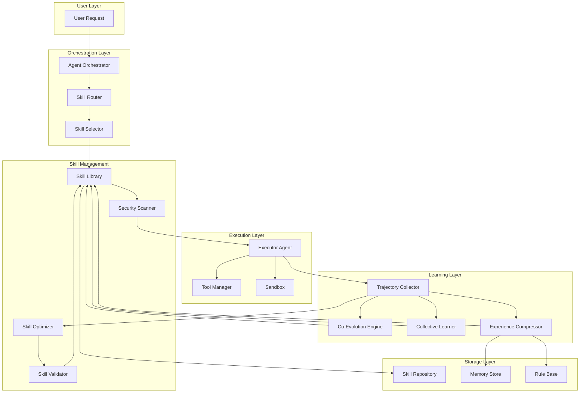
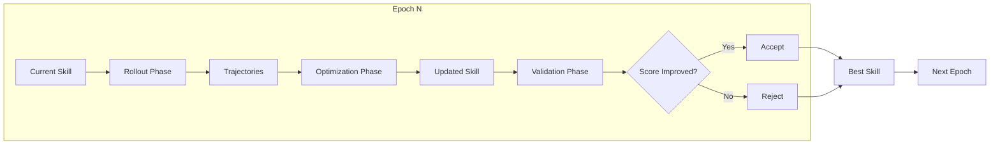
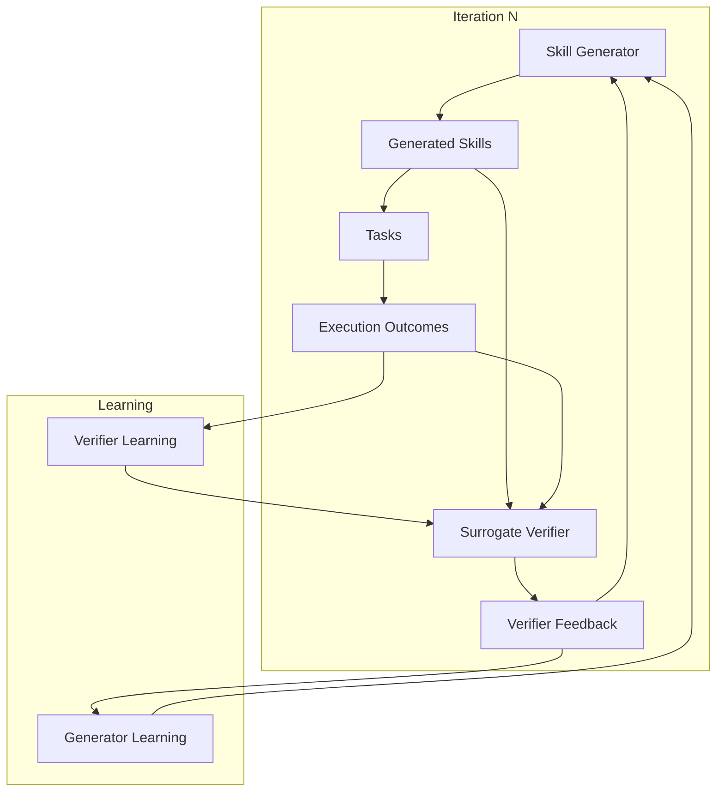
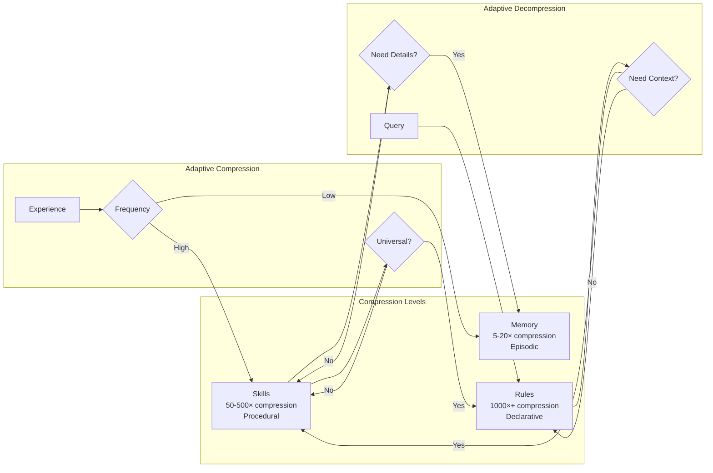
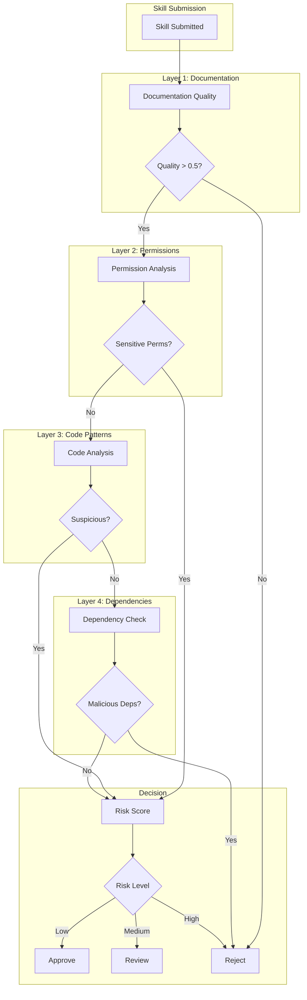
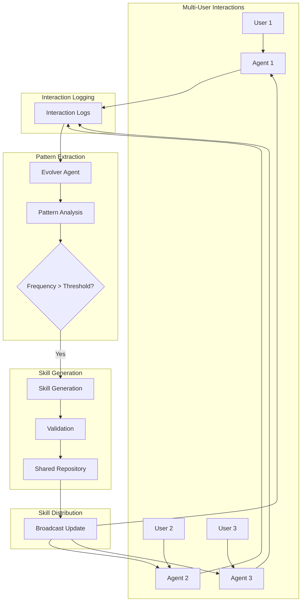

# Skills Comprehensive Synthesis: State-of-the-Art Agent Skills Research (2026)

**Analysis Date**: 2026-05-26  
**Document Version**: 1.0  
**Coverage**: 24+ papers (Feb-May 2026)  
**Target System**: Lyra AGI Agent Framework

---

## Executive Summary

This document synthesizes the complete landscape of agent skills research from February through May 2026, representing the most comprehensive analysis of the skills paradigm shift in LLM agents. We analyze 24+ breakthrough papers that collectively establish **skills as the dominant abstraction for agent capabilities**, superseding traditional tool use.

### The Skills Revolution (2026)

The period from February to May 2026 marks a fundamental paradigm shift in agent research:

1. **Conceptual Unification** (Feb 2026): Three foundational papers (SoK, Architecture Survey, SkillsBench) established skills as a unified framework encompassing tool use, reasoning patterns, and behavioral strategies.

2. **Implementation Explosion** (Mar-Apr 2026): 14+ papers introduced competing skill acquisition architectures, from single-agent evolution (AutoSkill, EvoSkill, SkillX) to co-evolutionary systems (CoEvoSkills, SkillClaw, COSPLAY).

3. **Theoretical Integration** (Apr 2026): Experience Compression Spectrum unified memory, skills, and rules as points on a single compression axis, revealing structural fragmentation in the research community.

4. **Reality Check** (Apr 2026): Four evaluation benchmarks (SkillCraft, SKILLFLOW, SkillLearnBench, "In the Wild") demonstrated that skills are fragile outside idealized conditions, with effectiveness degrading as settings become realistic.

5. **Security Awakening** (Apr 2026): Analysis of 26,502 ClawHub skills revealed 30%+ are suspicious/malicious, establishing supply chain security as a critical concern.

### Key Findings for Lyra

**Breakthrough Techniques Beyond SkillOpt**:
1. **Co-evolutionary verification** (CoEvoSkills): Generator and verifier co-evolve, eliminating need for ground truth
2. **Collective evolution** (SkillClaw): Cross-user skill improvement from interaction patterns
3. **Skill internalization** (SKILL0): Migrate skills from context to model weights via curriculum learning
4. **Bilevel optimization** (MCTS): Separate structure search from content refinement
5. **Structural representation** (SSL): Cognitive science-based skill encoding for better retrieval
6. **Compression spectrum** (ECS): Unified view of memory/skills/rules as compression levels

**Critical Warnings**:
- Skills degrade significantly in realistic settings (34k skill libraries vs. hand-picked)
- High skill usage rate ≠ high utility (Kimi K2.5: 66.87% usage, +0.60pt improvement)
- Self-feedback alone causes recursive drift; external feedback is mandatory
- 30%+ of public skills are malicious; documentation quality predicts risk

**Research Gaps Identified**:
1. Skill granularity optimization (too fine = redundant, too coarse = non-transferable)
2. Self-control of skill loading (agents load skills indiscriminately)
3. Adaptive cross-level compression (missing diagonal in ECS framework)
4. Supply chain security for skill ecosystems

---

## Table of Contents

1. [Skills Taxonomy](#1-skills-taxonomy)
2. [Skill Acquisition Methods](#2-skill-acquisition-methods)
3. [Skill Evolution Patterns](#3-skill-evolution-patterns)
4. [Skill Optimization Techniques](#4-skill-optimization-techniques)
5. [Skill Composition & Orchestration](#5-skill-composition--orchestration)
6. [Skill Evaluation & Benchmarking](#6-skill-evaluation--benchmarking)
7. [Skill Security & Ecosystem](#7-skill-security--ecosystem)
8. [Theoretical Foundations](#8-theoretical-foundations)
9. [Integration with Lyra](#9-integration-with-lyra)
10. [12-Week Implementation Roadmap](#10-12-week-implementation-roadmap)
11. [Code Examples](#11-code-examples)
12. [Architecture Diagrams](#12-architecture-diagrams)

---

## 1. Skills Taxonomy

### 1.1 Conceptual Framework

**Definition Evolution** (Feb 2026 → May 2026):

**SoK Definition** (Feb 2026):
> "Skills are reusable behavioral patterns that encompass tool use, reasoning strategies, and domain knowledge, explicitly managed as first-class entities in agent architectures."

**Architecture Survey Definition** (Feb 2026):
> "Skills extend beyond tool APIs to include: (1) procedural knowledge (how to execute), (2) declarative knowledge (what to know), (3) meta-cognitive strategies (when to apply), and (4) error recovery patterns."

**Experience Compression Spectrum Definition** (Apr 2026):
> "Skills are compressed experience at 50-500× compression ratio, positioned between episodic memory (5-20×) and declarative rules (1000×+) on the compression continuum."

### 1.2 Skill Dimensions

**Dimension 1: Abstraction Level** (from SkillX)
- **Atomic Skills**: Single tool calls, basic operations (e.g., "search web", "read file")
- **Functional Skills**: Multi-step procedures (e.g., "debug code", "research topic")
- **Strategic Skills**: High-level planning patterns (e.g., "decompose complex task", "verify solution")

**Dimension 2: Knowledge Type** (from Architecture Survey)
- **Procedural**: Step-by-step execution patterns
- **Declarative**: Facts, constraints, domain knowledge
- **Meta-cognitive**: When/why to apply skills, self-monitoring
- **Error Recovery**: Failure detection and correction strategies

**Dimension 3: Acquisition Method** (from SKILLRL)
- **Manual**: Human-authored skill documents
- **Distilled**: Extracted from expert demonstrations
- **Discovered**: Learned from experience/trajectories
- **Evolved**: Iteratively refined through feedback

**Dimension 4: Representation Format** (from SSL)
- **Text-Heavy**: Natural language markdown (SKILL.md)
- **Structured**: Scheduling-Structural-Logical (SSL) format
- **Parametric**: Internalized in model weights (SKILL0)
- **Hybrid**: Structured metadata + text content

**Dimension 5: Scope** (from SkillClaw)
- **Personal**: User-specific customizations
- **Organizational**: Team/company shared skills
- **Community**: Public skill repositories
- **Universal**: Cross-domain transferable patterns

### 1.3 Skill vs. Tool Use vs. Memory

**Experience Compression Spectrum** (Apr 2026 breakthrough):

```
Compression Ratio:  5-20×        50-500×         1000×+
                    ↓            ↓               ↓
                 Memory  →    Skills    →     Rules
                 
Episodic         Procedural      Declarative
Concrete         Abstract        Universal
Context-bound    Transferable    Domain-agnostic
```

**Key Insight**: Memory, skills, and rules are not separate systems but points on a compression continuum. Current systems operate at fixed compression levels; the "missing diagonal" is adaptive cross-level compression.

**Tool Use as Subset**:
- Traditional tool use: API call with parameters
- Skill-based tool use: When to call, how to interpret results, error recovery, chaining
- Skills subsume tools but add reasoning, context, and meta-cognition

---

## 2. Skill Acquisition Methods

### 2.1 Single-Agent Skill Accumulation

#### 2.1.1 AutoSkill: Experience-Driven Lifelong Learning

**Paper**: "AutoSkill: Experience-Driven Lifelong Learning via Skill Self-Evolution" (Mar 2026)

**Core Mechanism**:
- Extracts skills from interaction traces (dialogue, tool use, task execution)
- Maintains skill library without model retraining
- Dynamically injects relevant skills into future requests
- Model-agnostic plugin layer compatible with any LLM

**Key Innovation**: Focuses on **repetitive user requirements** as skill candidates:
- Hallucination reduction patterns
- Organization-specific writing conventions
- Domain terminology preferences
- Formatting and style guidelines

**Architecture**:
```
User Interaction → Trace Extraction → Skill Candidate Generation
                                              ↓
                                    Validation & Refinement
                                              ↓
                                    Skill Library Storage
                                              ↓
Future Request → Skill Retrieval → Context Injection → LLM
```

**Strengths**:
- Personalization-focused (learns user preferences)
- No model fine-tuning required
- Immediate deployment to production systems

**Limitations**:
- Flat skill organization (no hierarchy)
- Manual validation required for quality
- No automatic skill pruning/consolidation

#### 2.1.2 EvoSkill: Failure-Driven Skill Discovery

**Paper**: "EvoSkill: Automated Skill Discovery for Multi-Agent Systems" (Mar 2026)

**Core Mechanism**:
- Analyzes execution failures to identify skill gaps
- Generates skill candidates to address failure modes
- Validates on Pareto frontier (multiple objectives)
- Retains only skills that improve validation performance

**Key Innovation**: **Zero-shot transfer** from training tasks to unseen tasks
- OfficeQA: +7.3% improvement
- SealQA: +12.1% improvement

**Selection Strategy**:
```python
# Pseudo-code for EvoSkill selection
for skill_candidate in generated_skills:
    validation_scores = evaluate_on_validation_set(skill_candidate)
    if is_pareto_optimal(validation_scores, current_frontier):
        skill_library.add(skill_candidate)
        current_frontier.update(validation_scores)
    else:
        discard(skill_candidate)
```

**Strengths**:
- Failure-driven learning (targets actual gaps)
- Multi-objective optimization (Pareto frontier)
- Automatic pruning (only keeps improvements)

**Limitations**:
- Requires validation set with ground truth
- May overfit to validation distribution
- No mechanism for skill composition

#### 2.1.3 SkillX: Hierarchical Skill Knowledge Bases

**Paper**: "SkillX: Automatically Constructing Skill Knowledge Bases for Agents" (Apr 2026)

**Core Mechanism**:
- Three-tier hierarchy: Strategic Plans → Functional Skills → Atomic Skills
- Fully automated construction from seed data
- Iterative refinement via execution feedback
- Active generation of new skills beyond seed data

**Hierarchy Design**:
```
Strategic Plan (high-level)
    ├─ Functional Skill 1 (mid-level)
    │   ├─ Atomic Skill 1.1 (low-level)
    │   └─ Atomic Skill 1.2
    └─ Functional Skill 2
        ├─ Atomic Skill 2.1
        └─ Atomic Skill 2.2
```

**Key Innovation**: **Plug-and-play skill library** that works with weak base agents
- AppWorld: Significant improvement over baseline
- BFCL-v3: Consistent gains across function calling tasks
- τ²-Bench: Enhanced tool-agent-user interaction

**Construction Process**:
1. Seed data analysis → Extract initial skill patterns
2. Hierarchical distillation → Organize into 3 tiers
3. Execution feedback → Refine based on success/failure
4. Active generation → Create new skills for uncovered scenarios
5. Validation → Test on held-out tasks

**Strengths**:
- Hierarchical organization (better than flat)
- Works with weak models (democratizes capabilities)
- Active skill generation (not just extraction)

**Limitations**:
- Fixed 3-tier hierarchy (may not fit all domains)
- Requires seed data to bootstrap
- No cross-domain transfer mechanism

#### 2.1.4 EvoAgent: Trigger-Based Skill Evolution

**Paper**: "EvoAgent: An Evolvable Agent Framework with Skill Learning and Multi-Agent Delegation" (Apr 2026)

**Core Mechanism**:
- Skills as **multi-file capability units** with trigger mechanisms
- User feedback-driven closed-loop evolution
- 3-stage skill matching: trigger → relevance → execution
- 3-layer memory: working, episodic, skill library

**Key Innovation**: **Trigger internalization** - skills know when to activate
```yaml
skill:
  name: "debug_code"
  trigger:
    keywords: ["error", "bug", "crash", "exception"]
    context: ["code execution failed", "test failure"]
    confidence_threshold: 0.7
  execution:
    steps: [...]
  metadata:
    success_rate: 0.85
    avg_execution_time: 12.3s
```

**Evolution Loop**:
```
User Request → Trigger Matching → Skill Selection → Execution
                                                        ↓
                                                   Feedback
                                                        ↓
                                    Skill Refinement ← Analysis
                                            ↓
                                    Update Trigger/Execution
```

**Performance**: GPT-5.2 integration shows ~28% average improvement

**Strengths**:
- Self-activating skills (reduces manual selection)
- Multi-file structure (supports complex skills)
- Continuous evolution (not one-shot learning)

**Limitations**:
- Trigger design is critical (false positives/negatives)
- Requires user feedback (not fully autonomous)
- May accumulate redundant skills over time

### 2.2 Co-Evolutionary Skill Acquisition

#### 2.2.1 CoEvoSkills: Generator-Verifier Co-Evolution

**Paper**: "CoEvoSkills: Self-Evolving Agent Skills via Co-Evolutionary Verification" (Apr 2026)

**Core Mechanism**:
- **Skill Generator**: Creates/refines multi-file skill packages
- **Surrogate Verifier**: Provides feedback WITHOUT ground truth access
- Both components co-evolve through adversarial dynamics

**Key Innovation**: **GAN-like structure for skills** - verifier learns to give informative feedback, generator learns to satisfy verifier

**Co-Evolution Dynamics**:
```
Iteration N:
  Generator_N creates Skill_N
  Verifier_N evaluates Skill_N → Feedback_N
  
  Generator learns: "What makes Verifier_N satisfied?"
  Verifier learns: "What feedback improves Generator_N?"
  
Iteration N+1:
  Generator_N+1 (improved) creates Skill_N+1
  Verifier_N+1 (improved) evaluates Skill_N+1 → Feedback_N+1
```

**Performance**: Best results on SkillsBench for both Claude Code and Codex, outperforming 5 baselines

**Advantages over Single-Agent**:
- No ground truth required (verifier learns from outcomes)
- Feedback quality improves over time (co-evolution)
- More robust than fixed verification rules

**Strengths**:
- Eliminates need for labeled validation data
- Verifier becomes increasingly sophisticated
- Applicable to domains without clear success metrics

**Limitations**:
- Requires careful balancing of generator/verifier learning rates
- Risk of mode collapse (generator exploits verifier weaknesses)
- Computational cost of dual evolution

#### 2.2.2 SkillClaw: Collective Cross-User Evolution

**Paper**: "SkillClaw: Let Skills Evolve Collectively with Agentic Evolver" (Apr 2026)

**Core Mechanism**:
- Multi-user agent ecosystem with shared skill repository
- Autonomous **Evolver** agent analyzes cross-user interaction patterns
- Extracts recurring behavioral patterns as skill candidates
- Synchronizes improvements across all users

**Key Innovation**: **Social evolution of skills** - improvements from one user benefit entire community

**Architecture**:
```
User 1 → Agent 1 ─┐
User 2 → Agent 2 ─┼→ Interaction Logs → Evolver Agent
User 3 → Agent 3 ─┘                           ↓
    ↑                                   Pattern Extraction
    │                                          ↓
    │                                   Skill Generation
    │                                          ↓
    └────────── Shared Skill Repository ←─────┘
```

**Evolution Signals**:
- Repeated user corrections → Skill refinement
- Common failure patterns → New skill creation
- Cross-user success patterns → Skill generalization
- Temporal trends → Skill deprecation/updates

**Performance**: WildClawBench shows significant improvement for Qwen3-Max in real-world scenarios

**Strengths**:
- Leverages collective intelligence (many users)
- Continuous improvement post-deployment
- Scales with user base (more users = better skills)

**Limitations**:
- Privacy concerns (cross-user data analysis)
- Risk of skill pollution (bad patterns spreading)
- Requires large user base for effective evolution

#### 2.2.3 COSPLAY: Decision-Skill Bank Co-Evolution

**Paper**: "Co-Evolving LLM Decision and Skill Bank Agents for Long-Horizon Tasks" (Apr 2026)

**Core Mechanism**:
- **Decision Agent**: Plans and executes using skills from bank
- **Skill Bank Agent**: Discovers and adds reusable skills from rollouts
- Two agents co-evolve through mutual dependency

**Key Innovation**: **Asymmetric co-evolution** - different agents optimize different objectives

**Co-Evolution Structure**:
```
Decision Agent:
  Objective: Maximize task success rate
  Uses: Skills from Skill Bank
  Learns: When/how to use skills effectively
  
Skill Bank Agent:
  Objective: Maximize skill reusability
  Uses: Unlabeled rollouts from Decision Agent
  Learns: What patterns are worth encoding as skills
  
Feedback Loop:
  Better skills → Better decisions → Better rollouts → Better skills
```

**Performance**: 8B parameter model outperforms 4 frontier LLMs by 25.1%+ average reward

**Training Process**:
1. Decision agent executes tasks using current skill bank
2. Skill bank analyzes rollouts for reusable patterns
3. New skills added to bank
4. Decision agent learns to use expanded skill bank
5. Repeat (co-evolution)

**Strengths**:
- Works with unlabeled data (no human annotation)
- Suitable for long-horizon tasks (games, robotics)
- Small models can match large models with good skills

**Limitations**:
- Requires environment with clear reward signals
- May not transfer to open-ended tasks
- Skill bank can grow unbounded without pruning

### 2.3 Skill Internalization (Context → Weights)

#### 2.3.1 SKILL0: In-Context to Parametric Migration

**Paper**: "SKILL0: In-Context Agentic Reinforcement Learning for Skill Internalization" (Apr 2026)

**Core Mechanism**:
- Start with full skill context (in-context learning)
- Gradually remove skill text via curriculum learning
- Model internalizes skill knowledge into weights
- End with skill-free inference (parametric knowledge)

**Key Innovation**: **Reverse curriculum** - most systems add context, SKILL0 removes it

**Curriculum Schedule**:
```
Training Phase 1: Full skill context (100% budget)
  Model learns: "Follow these explicit instructions"
  
Training Phase 2: Partial skill context (70% budget)
  Model learns: "Internalize common patterns"
  
Training Phase 3: Minimal skill context (40% budget)
  Model learns: "Rely on parametric knowledge"
  
Training Phase 4: No skill context (0% budget)
  Model learns: "Skills are now in weights"
```

**Dynamic Curriculum**:
- Evaluates skill utility at each phase
- Prioritizes high-value skills for internalization
- Removes low-value skills early
- Maintains <0.5k tokens per step

**Performance**:
- ALFWorld: +9.7% improvement
- Search-QA: +6.6% improvement
- Context usage: <0.5k tokens/step (vs. 2-5k for in-context)

**Strengths**:
- Reduces inference cost (less context)
- Improves latency (smaller prompts)
- Skills become permanent (in weights)

**Limitations**:
- Requires model fine-tuning (not plug-and-play)
- Internalized skills harder to update
- May not work for rapidly changing skills

### 2.4 Reinforcement Learning-Based Acquisition

#### 2.4.1 SKILLRL: Recursive Skill-Augmented RL

**Paper**: "SKILLRL: Evolving Agents via Recursive Skill-Augmented Reinforcement Learning" (Feb 2026)

**Core Mechanism**:
- Agents acquire skills through RL in task environments
- Learned skills become building blocks for higher-level skills
- Recursive composition: simple skills → complex skills → meta-skills
- Hierarchical skill library grows with task complexity

**Key Innovation**: **Recursive skill composition** - skills built from skills

**Hierarchy Example**:
```
Level 0 (Atomic): move_forward, turn_left, pick_object
Level 1 (Basic): navigate_to(location), collect_item(item)
Level 2 (Complex): gather_resources(), build_structure()
Level 3 (Strategic): complete_mission()
```

**RL Integration**:
- Reward shaping based on skill usage
- Skill discovery as auxiliary task
- Transfer learning across skill levels
- Curriculum learning for skill complexity

**Strengths**:
- Natural skill hierarchy emerges from RL
- Skills are grounded in actual task performance
- Supports compositional generalization

**Limitations**:
- Requires RL-compatible environments
- Sample inefficient (many episodes needed)
- Skill quality depends on reward design

### 2.5 Comparison of Acquisition Methods

| Method | Supervision | Speed | Transferability | Scalability | Best For |
|--------|-------------|-------|-----------------|-------------|----------|
| **AutoSkill** | User interactions | Fast | Medium | High | Personalization |
| **EvoSkill** | Validation set | Medium | High | Medium | Multi-agent systems |
| **SkillX** | Seed data | Medium | High | High | Weak base models |
| **EvoAgent** | User feedback | Fast | Medium | High | Interactive agents |
| **CoEvoSkills** | None (co-evolution) | Slow | High | Medium | No ground truth |
| **SkillClaw** | Cross-user patterns | Slow | Very High | Very High | Multi-user platforms |
| **COSPLAY** | Environment rewards | Slow | Medium | Medium | Long-horizon tasks |
| **SKILL0** | Labeled data + RL | Very Slow | High | Low | Inference optimization |
| **SKILLRL** | RL rewards | Very Slow | High | Medium | Hierarchical tasks |

**Selection Guide for Lyra**:
- **Rapid prototyping**: AutoSkill, EvoAgent (fast, user-driven)
- **Production quality**: CoEvoSkills, SkillX (robust, validated)
- **Multi-user platform**: SkillClaw (collective intelligence)
- **Inference optimization**: SKILL0 (reduce context costs)
- **Complex reasoning**: SKILLRL, COSPLAY (hierarchical composition)

---

## 3. Skill Evolution Patterns

### 3.1 Bilevel Optimization via MCTS

**Paper**: "Bilevel Optimization of Agent Skills via Monte Carlo Tree Search" (Apr 2026)

**Core Mechanism**:
- **Outer loop**: MCTS explores skill structure space
- **Inner loop**: LLM refines component content
- Separates "what to include" from "how to write it"

**Key Innovation**: **Mathematical formalization** of skill optimization

**Formulation**:
```
Outer Problem (Structure):
  max_{structure S} Performance(S, content*(S))
  where S = {components, organization, dependencies}
  
Inner Problem (Content):
  content*(S) = argmax_{content C} Quality(S, C)
  where C = {text, examples, instructions}
```

**MCTS for Structure Search**:
```
1. Selection: Choose promising structure branch (UCB1)
2. Expansion: Add new component to structure
3. Simulation: LLM generates content for structure
4. Backpropagation: Update structure value based on performance
```

**Performance**: Significant improvement on Operations Research QA dataset

**Advantages**:
- Principled exploration of skill design space
- Avoids local optima (MCTS exploration)
- Separates concerns (structure vs. content)

**Strengths**:
- Theoretically grounded (bilevel optimization)
- Systematic exploration (not random search)
- Applicable to any skill domain

**Limitations**:
- Computationally expensive (MCTS + LLM calls)
- Requires performance oracle for evaluation
- May not scale to very large skill spaces

### 3.2 Skill Refinement Strategies

#### 3.2.1 Trajectory-Based Refinement (SkillOpt approach)

**Mechanism**:
1. Collect execution trajectories (success + failure)
2. Analyze failure patterns across batch
3. Propose textual edits to skill document
4. Validate on held-out set
5. Accept if improvement, reject otherwise

**Refinement Types**:
- **Clarification**: Add missing details to ambiguous instructions
- **Correction**: Fix incorrect procedures or knowledge
- **Extension**: Add new cases or edge conditions
- **Simplification**: Remove redundant or confusing content

#### 3.2.2 Feedback-Driven Refinement (EvoAgent approach)

**Mechanism**:
1. User provides feedback on skill execution
2. Classify feedback type (bug, enhancement, clarification)
3. Generate skill patch addressing feedback
4. Test patch on similar tasks
5. Merge if successful, iterate if not

**Feedback Categories**:
- **Execution errors**: Skill failed to complete task
- **Quality issues**: Task completed but output suboptimal
- **Efficiency concerns**: Task took too long or too many steps
- **Scope gaps**: Skill doesn't handle certain cases

#### 3.2.3 Self-Challenging Refinement

**Paper**: "Self-Challenging Language Model Agents" (arXiv:2506.01716)

**Mechanism**:
- Task Challenger generates progressively harder tasks
- Agent attempts tasks using current skills
- Success Evaluator assesses outcomes
- Skills refined based on challenge results

**Difficulty Calibration**:
```python
def generate_challenge(current_skill_level, success_rate):
    if success_rate > 0.8:
        difficulty = "harder"  # Agent is too comfortable
    elif success_rate < 0.4:
        difficulty = "easier"  # Agent is struggling
    else:
        difficulty = "maintain"  # Sweet spot
    
    return create_task(difficulty, current_skill_level)
```

**Advantages**:
- Automatic curriculum (no manual task design)
- Targets skill weaknesses (failure-driven)
- Continuous improvement (never stops learning)

### 3.3 Skill Pruning and Consolidation

**Problem**: Skill libraries grow unbounded, causing:
- Increased retrieval latency
- Redundant/overlapping skills
- Conflicting skill recommendations
- Higher context costs

**Pruning Strategies**:

**1. Usage-Based Pruning**:
```python
def prune_unused_skills(skill_library, usage_threshold=0.01):
    for skill in skill_library:
        if skill.usage_frequency < usage_threshold:
            if skill.last_used > 90_days_ago:
                archive(skill)  # Don't delete, just archive
```

**2. Performance-Based Pruning**:
```python
def prune_low_performing_skills(skill_library, success_threshold=0.5):
    for skill in skill_library:
        if skill.success_rate < success_threshold:
            if exists_better_alternative(skill):
                deprecate(skill)
```

**3. Consolidation via Clustering**:
```python
def consolidate_similar_skills(skill_library, similarity_threshold=0.85):
    clusters = cluster_by_similarity(skill_library)
    for cluster in clusters:
        if len(cluster) > 1:
            merged_skill = merge_skills(cluster)
            replace_cluster_with_merged(cluster, merged_skill)
```

**4. Pareto Frontier Pruning** (from EvoSkill):
- Keep only skills on Pareto frontier (multi-objective)
- Remove dominated skills (worse on all metrics)
- Maintains diversity while ensuring quality

**Consolidation Example**:
```
Before:
  - debug_python_code
  - debug_javascript_code
  - debug_typescript_code
  
After:
  - debug_code (language-agnostic)
    - Detects language automatically
    - Applies language-specific strategies
    - Unified error handling
```

---

## 4. Skill Optimization Techniques

### 4.1 Text-Space Optimization (SkillOpt)

**Core Principle**: Treat natural language skill documents as trainable parameters

**Optimization Loop**:
```
Epoch 1:
  Rollout: Execute tasks with skill_v1 → trajectories
  Optimize: Analyze trajectories → propose edits
  Validate: Test skill_v2 on validation set
  Accept: skill_v2 if better, else keep skill_v1
  
Epoch 2:
  Rollout: Execute tasks with best_skill → trajectories
  Optimize: Analyze trajectories → propose edits
  Validate: Test skill_v3 on validation set
  Accept: skill_v3 if better, else keep best_skill
  
... (repeat for N epochs)
```

**Validation Gating** (Critical):
- Only accept skills that improve validation performance
- Prevents overfitting to training data
- Ensures monotonic improvement
- Enables safe production deployment

**Advantages**:
- No model retraining required
- Human-interpretable optimization
- Portable across models and frameworks
- Deployable as markdown files

### 4.2 Structured Skill Representation (SSL)

**Paper**: "From Skill Text to Skill Structure: The Scheduling-Structural-Logical Representation for Agent Skills" (Apr 2026)

**Core Innovation**: Apply **cognitive science theories** to skill representation

**Theoretical Foundation**:
- **Schank & Abelson's Script Theory**: Stereotyped event sequences
- **Memory Organization Packets (MOPs)**: Hierarchical memory structures
- **Conceptual Dependency**: Primitive action decomposition

**SSL Three-Layer Structure**:

**Layer 1: Scheduling (Meta-level)**
```yaml
scheduling:
  when_to_use:
    - "User requests code debugging"
    - "Test failures detected"
    - "Runtime errors encountered"
  prerequisites:
    - "Code file accessible"
    - "Error message available"
  expected_duration: "2-5 minutes"
  confidence_threshold: 0.7
```

**Layer 2: Structural (Scene-level)**
```yaml
structure:
  scenes:
    - scene_id: "error_analysis"
      goal: "Identify root cause"
      next_scenes: ["fix_generation", "test_validation"]
    - scene_id: "fix_generation"
      goal: "Generate code fix"
      next_scenes: ["test_validation"]
    - scene_id: "test_validation"
      goal: "Verify fix works"
      next_scenes: ["complete", "error_analysis"]
```

**Layer 3: Logical (Action-level)**
```yaml
logic:
  actions:
    - action_id: "read_error_log"
      resources: ["log_file"]
      evidence: "Error message extracted"
    - action_id: "analyze_stack_trace"
      resources: ["stack_trace"]
      evidence: "Root cause identified"
    - action_id: "apply_fix"
      resources: ["code_file", "fix_patch"]
      evidence: "Code modified"
```

**Performance**:
- Skill Discovery: MRR 0.573 → 0.707 (+23.4%)
- Risk Assessment: Macro F1 0.744 → 0.787 (+5.8%)

**Advantages**:
- Machine-processable (structured format)
- Supports automated reasoning (scene transitions)
- Enables skill composition (scene reuse)
- Facilitates risk assessment (evidence tracking)

**Strengths**:
- Grounded in cognitive science (not ad-hoc)
- Supports complex skill workflows
- Enables formal verification

**Limitations**:
- More complex than text-only skills
- Requires tooling to author/edit
- May be overkill for simple skills

### 4.3 Skill Retrieval Augmentation (SRA)

**Paper**: "Skill Retrieval Augmentation for Agentic AI" (Apr 2026)

**Core Concept**: Apply RAG paradigm to skills

**SRA Architecture**:
```
Task Description → Query Encoder → Vector Search
                                        ↓
                              Skill Corpus (26k+ skills)
                                        ↓
                              Top-K Skills Retrieved
                                        ↓
                              Context Injection → LLM
```

**SRA-Bench**:
- 5,400 test instances
- 636 hand-crafted gold skills
- 26,262 distractor skills (realistic noise)
- Tests skill retrieval + usage

**Critical Finding**: **LLMs load skills indiscriminately**
- Gold skill retrieved: 65% usage rate
- Gold skill NOT retrieved: 62% usage rate
- Conclusion: Models don't check if skill is relevant/needed

**Implications**:
- Retrieval quality matters less than expected
- Models need better skill selection mechanisms
- "More skills" ≠ "better performance"

**Recommendations**:
1. Add skill relevance scoring (before loading)
2. Implement skill necessity detection (do we need a skill?)
3. Train models to selectively use skills
4. Penalize unnecessary skill loading

### 4.4 Query-Specific Skill Refinement

**Paper**: "How Well Do Agentic Skills Work in the Wild" (Apr 2026)

**Problem**: Generic skills degrade in realistic settings

**Solution**: Refine skills for specific queries at runtime

**Refinement Process**:
```python
def query_specific_refinement(generic_skill, query, context):
    # Step 1: Identify query-specific requirements
    requirements = analyze_query(query, context)
    
    # Step 2: Adapt skill to requirements
    adapted_skill = customize_skill(generic_skill, requirements)
    
    # Step 3: Validate adaptation
    if validate_adaptation(adapted_skill, query):
        return adapted_skill
    else:
        return generic_skill  # Fallback to generic
```

**Performance**: Terminal-Bench 2.0 with Claude Opus 4.6
- Baseline (no skills): 57.7%
- Generic skills: 59.2% (+1.5pt)
- Query-specific refinement: 65.5% (+7.8pt)

**Key Insight**: **Personalization > Generalization** for skills

**Trade-offs**:
- **Pros**: Better performance, handles edge cases
- **Cons**: Higher latency, more LLM calls, no caching

---

## 5. Skill Composition & Orchestration

### 5.1 Hierarchical Skill Organization

**Three-Tier Model** (from SkillX):

**Tier 1: Strategic Plans** (High-level)
- Abstract task decomposition
- Goal-oriented planning
- Multi-step coordination
- Example: "Complete software project"

**Tier 2: Functional Skills** (Mid-level)
- Domain-specific procedures
- Multi-tool orchestration
- Error handling strategies
- Example: "Debug failing test"

**Tier 3: Atomic Skills** (Low-level)
- Single tool operations
- Basic actions
- Primitive capabilities
- Example: "Run pytest command"

**Composition Rules**:
```python
class StrategicPlan:
    def execute(self):
        for phase in self.phases:
            functional_skill = self.select_functional_skill(phase)
            result = functional_skill.execute()
            if not result.success:
                self.handle_failure(phase, result)

class FunctionalSkill:
    def execute(self):
        for step in self.steps:
            atomic_skill = self.select_atomic_skill(step)
            result = atomic_skill.execute()
            if not result.success:
                return self.error_recovery(step, result)
        return Success()
```

### 5.2 Skill Routing and Selection

**SkillNet Approach**: 5-Dimensional Evaluation

**Dimension 1: Safety**
- Does skill access sensitive data?
- Can skill cause system damage?
- Are there security vulnerabilities?

**Dimension 2: Completeness**
- Does skill cover all required cases?
- Are edge conditions handled?
- Is error recovery included?

**Dimension 3: Executability**
- Can skill run in current environment?
- Are dependencies available?
- Is syntax/format correct?

**Dimension 4: Maintainability**
- Is skill well-documented?
- Is code/logic clear?
- Can skill be easily updated?

**Dimension 5: Cost-Awareness**
- What are computational costs?
- How many API calls required?
- What is expected latency?

**Routing Algorithm**:
```python
def route_to_skill(task, skill_library):
    # Step 1: Filter by applicability
    applicable = [s for s in skill_library if s.matches(task)]
    
    # Step 2: Score on 5 dimensions
    scored = [(s, evaluate_5d(s, task)) for s in applicable]
    
    # Step 3: Multi-objective selection
    pareto_optimal = compute_pareto_frontier(scored)
    
    # Step 4: User preference weighting
    best = select_by_preferences(pareto_optimal, user_prefs)
    
    return best
```

### 5.3 Skill Conflict Resolution

**Conflict Types**:

**Type 1: Overlapping Scope**
```
Skill A: "debug_code" (all languages)
Skill B: "debug_python" (Python-specific)
Conflict: Which to use for Python debugging?
```

**Resolution**: Specificity wins (use Skill B for Python)

**Type 2: Contradictory Advice**
```
Skill A: "Always use type hints in Python"
Skill B: "Avoid type hints for rapid prototyping"
Conflict: Contradictory guidance
```

**Resolution**: Context-dependent (check project phase)

**Type 3: Resource Competition**
```
Skill A: Requires 8GB memory
Skill B: Requires 8GB memory
Conflict: Cannot run both simultaneously
```

**Resolution**: Sequential execution or resource allocation

**Conflict Detection**:
```python
def detect_conflicts(skill_set):
    conflicts = []
    for s1, s2 in combinations(skill_set, 2):
        if overlapping_scope(s1, s2):
            conflicts.append(("overlap", s1, s2))
        if contradictory_advice(s1, s2):
            conflicts.append(("contradiction", s1, s2))
        if resource_conflict(s1, s2):
            conflicts.append(("resource", s1, s2))
    return conflicts
```

---

## 6. Skill Evaluation & Benchmarking

### 6.1 SkillsBench: Cross-Task Generalization

**Paper**: "SkillsBench: Benchmarking How Well Agent Skills Work Across Diverse Tasks" (Feb 2026)

**Design Philosophy**: Test skill **transferability** across domains

**Benchmark Structure**:
- 12 task categories (coding, research, data analysis, etc.)
- 240+ individual tasks
- Skills trained on subset, tested on held-out tasks
- Measures zero-shot and few-shot transfer

**Evaluation Metrics**:
- **Task Success Rate**: % of tasks completed correctly
- **Transfer Efficiency**: Performance on unseen tasks / seen tasks
- **Skill Utilization**: % of available skills actually used
- **Composition Depth**: Average skill call chain length

**Key Findings**:
- Skills trained on narrow domains transfer poorly
- Generic skills outperform specialized on diverse tasks
- Skill composition is rare (most tasks use 1-2 skills)

### 6.2 SkillCraft: Tool Synthesis Evaluation

**Paper**: "SkillCraft: Can LLM Agents Learn to Use Tools Skillfully?" (Mar 2026)

**Core Question**: Can agents form higher-order skills from atomic tools?

**Evaluation Protocol**:
1. Provide atomic tool APIs (no skills)
2. Agent attempts tasks requiring tool composition
3. Measure: skill formation, caching, reuse
4. Compare: with-skills vs. without-skills

**Metrics**:
- **Skill Formation Rate**: % of tasks where agent creates reusable pattern
- **Cache Hit Rate**: % of subsequent tasks using cached skills
- **Token Efficiency**: Token reduction from skill reuse (up to 80%)
- **Composition Correlation**: Skill synthesis ability vs. task success

**Key Finding**: **Strong correlation** between tool synthesis and success rate
- Agents that form skills: 73% success
- Agents that don't: 48% success

### 6.3 SKILLFLOW: Lifelong Skill Evolution

**Paper**: "SKILLFLOW: Benchmarking Lifelong Skill Discovery and Evolution for Autonomous Agents" (Apr 2026)

**Design Philosophy**: Test **continuous learning** over task sequences

**Benchmark Structure**:
- 20 task families, 166 total tasks
- Tasks within family share Domain-Agnostic Execution Flow (DAEF)
- Agent starts with no skills, evolves through sequence
- Measures skill discovery, refinement, transfer

**DAEF Concept**:
```
Task Family: "Data Processing"
DAEF: Load → Transform → Validate → Export

Task 1: CSV processing (learn DAEF)
Task 2: JSON processing (apply DAEF)
Task 3: XML processing (refine DAEF)
Task 4: Parquet processing (transfer DAEF)
```

**Evaluation Metrics**:
- **Skill Discovery Rate**: New skills per task
- **Skill Reuse Rate**: Existing skills applied
- **Evolution Effectiveness**: Performance improvement over sequence
- **Transfer Success**: Skills applied to new task families

**Performance Results**:
- Claude Opus 4.6: 62.65% → 71.08% (+8.43pt) with lifelong learning
- Kimi K2.5: 66.87% skill usage, only +0.60pt improvement (usage ≠ utility!)
- Qwen-Coder-Next: Performance degradation (negative learning)

**Critical Insight**: **High skill usage ≠ High utility**
- Some models load skills indiscriminately
- Skill quality matters more than quantity
- Need better skill selection mechanisms

### 6.4 SkillLearnBench: Continual Learning Methods

**Paper**: "SkillLearnBench: Benchmarking Continual Learning Methods for Agent Skill Generation on Real-World Tasks" (Apr 2026)

**Design Philosophy**: Compare **learning methods** for skill acquisition

**Methods Evaluated**:
1. **One-shot**: Single attempt, no iteration
2. **Self-feedback**: Agent critiques own skills
3. **Teacher feedback**: External model provides feedback
4. **Skill creator**: Dedicated skill generation agent
5. **Hybrid**: Combination of above

**Evaluation Levels**:
- **Level 1: Skill Quality** - Is skill well-written?
- **Level 2: Execution Trajectory** - Does skill execute correctly?
- **Level 3: Task Outcome** - Does skill solve task?

**Key Findings**:

**Finding 1**: No universal winner
- Different methods excel on different tasks
- No method dominates across all LLMs
- Task characteristics determine best method

**Finding 2**: Scaling doesn't reliably help
- Stronger LLMs don't always produce better skills
- GPT-4 sometimes worse than GPT-3.5 for skill generation
- Model size ≠ skill quality

**Finding 3**: Self-feedback causes recursive drift
- Self-feedback alone: Performance degrades over iterations
- External feedback: Genuine improvement
- **Recommendation**: Always combine self + external feedback

**Recursive Drift Example**:
```
Iteration 1: Skill works (80% success)
Iteration 2: Self-feedback → "improved" skill (75% success)
Iteration 3: Self-feedback → "improved" skill (68% success)
Iteration 4: Self-feedback → "improved" skill (55% success)

Problem: Model reinforces its own biases without external correction
```

### 6.5 "In the Wild": Realistic Skill Evaluation

**Paper**: "How Well Do Agentic Skills Work in the Wild" (Apr 2026)

**Design Philosophy**: Test skills in **realistic conditions**

**Idealized Conditions** (previous benchmarks):
- Task-specific skills provided directly
- Small, curated skill library
- Perfect skill-task matching
- No retrieval noise

**Realistic Conditions** (this benchmark):
- 34,000+ skill library (real-world scale)
- Agent must search and select skills
- Many irrelevant/low-quality skills
- Retrieval errors and noise

**Evaluation Setup**:
```
Condition 1: Oracle (idealized)
  - Perfect skill provided for each task
  - Baseline: 57.7%

Condition 2: Small Library (100 skills)
  - Agent searches curated library
  - Performance: 59.2% (+1.5pt)

Condition 3: Large Library (34k skills)
  - Agent searches realistic library
  - Performance: 58.1% (+0.4pt)

Condition 4: Query-Specific Refinement
  - Agent refines retrieved skills
  - Performance: 65.5% (+7.8pt)
```

**Key Findings**:

**Finding 1**: Skills are fragile
- Effectiveness degrades as conditions become realistic
- Large libraries hurt more than help (noise)
- Retrieval quality is critical bottleneck

**Finding 2**: Refinement recovers performance
- Query-specific adaptation: +7.8pt improvement
- Generic skills + adaptation > perfect oracle
- Personalization is key

**Finding 3**: Scale is not the answer
- More skills ≠ better performance
- Quality > quantity for skill libraries
- Curation and filtering are essential

### 6.6 Benchmark Comparison Matrix

| Benchmark | Focus | Scale | Realism | Key Metric | Main Finding |
|-----------|-------|-------|---------|------------|--------------|
| **SkillsBench** | Transfer | 240 tasks | Medium | Transfer efficiency | Generic > specialized |
| **SkillCraft** | Synthesis | Tool APIs | Low | Formation rate | Synthesis correlates with success |
| **SKILLFLOW** | Lifelong | 166 tasks | Medium | Evolution effectiveness | Usage ≠ utility |
| **SkillLearnBench** | Methods | 20 tasks | High | Outcome quality | Self-feedback causes drift |
| **In the Wild** | Realism | 34k skills | Very High | Realistic performance | Skills fragile at scale |

**Implications for Lyra**:
1. **Prioritize quality over quantity** (curation > accumulation)
2. **Implement external feedback loops** (avoid recursive drift)
3. **Build query-specific refinement** (adaptation > generic skills)
4. **Test in realistic conditions** (don't trust idealized benchmarks)
5. **Monitor skill utilization vs. utility** (usage metrics misleading)

---

## 7. Skill Security & Ecosystem

### 7.1 Red Skills or Blue Skills: ClawHub Analysis

**Paper**: "Red Skills or Blue Skills? A Dive Into Skills Published on ClawHub" (Apr 2026)

**Dataset**: 26,502 skills from ClawHub public repository

**Key Finding**: **30%+ of skills are suspicious or malicious**

**Analysis Dimensions**:

**Dimension 1: Cultural Distribution**
- **English skills**: Infrastructure-focused (API, automation, memory)
- **Chinese skills**: Application-focused (media, social, finance)
- Cultural bias in skill development priorities

**Dimension 2: Risk Classification**
```
Safe Skills: 69.4%
  - Well-documented
  - Clear functionality
  - No suspicious patterns

Suspicious Skills: 22.3%
  - Poor documentation
  - Obfuscated code
  - Unusual permissions

Malicious Skills: 8.3%
  - Data exfiltration
  - Prompt injection
  - Backdoor functionality
```

**Dimension 3: Risk Indicators**

**Best Predictor: Documentation Quality**
- Well-documented skills: 5% malicious
- Poorly documented skills: 45% malicious
- **Documentation quality is strongest signal**

**Other Indicators**:
- Unusual permission requests
- Obfuscated code patterns
- Suspicious network calls
- Lack of examples/tests

**Classification Performance**:
- Accuracy: 72.62%
- AUROC: 78.95%
- Using only metadata (no code execution)

**Risk Mitigation Strategies**:

**Strategy 1: Pre-Publication Screening**
```python
def screen_skill(skill):
    risk_score = 0
    
    # Documentation quality
    if len(skill.documentation) < 100:
        risk_score += 30
    if not has_examples(skill):
        risk_score += 20
    
    # Permission analysis
    if requests_sensitive_permissions(skill):
        risk_score += 25
    
    # Code patterns
    if has_obfuscation(skill):
        risk_score += 40
    if has_suspicious_network_calls(skill):
        risk_score += 35
    
    return "REJECT" if risk_score > 50 else "REVIEW" if risk_score > 30 else "APPROVE"
```

**Strategy 2: Sandboxed Execution**
- Run skills in isolated environment
- Monitor system calls and network traffic
- Detect anomalous behavior
- Kill and flag suspicious skills

**Strategy 3: Community Reputation**
- Track skill author reputation
- User ratings and reviews
- Usage statistics and success rates
- Report malicious skills

**Strategy 4: Provenance Tracking**
```yaml
skill_metadata:
  author: "user123"
  created: "2026-04-15"
  version: "1.2.0"
  source_repo: "github.com/user123/skills"
  dependencies: ["skill_A", "skill_B"]
  audit_trail:
    - timestamp: "2026-04-15"
      action: "created"
      reviewer: "automated"
    - timestamp: "2026-04-20"
      action: "reviewed"
      reviewer: "security_team"
      status: "approved"
```

### 7.2 Supply Chain Security

**Threat Model**:

**Threat 1: Malicious Skill Injection**
- Attacker publishes malicious skill
- Skill appears legitimate (good documentation)
- Users install and execute skill
- Skill exfiltrates data or compromises system

**Threat 2: Dependency Poisoning**
- Legitimate skill depends on malicious skill
- Transitive dependency attack
- Users trust top-level skill, don't audit dependencies

**Threat 3: Skill Update Attack**
- Legitimate skill initially safe
- Author account compromised
- Malicious update pushed
- Auto-update mechanisms propagate attack

**Threat 4: Prompt Injection via Skills**
- Skill contains hidden prompt injection
- Overrides agent instructions
- Causes agent to perform unintended actions

**Defense Mechanisms**:

**Defense 1: Skill Signing and Verification**
```python
def verify_skill(skill, signature, public_key):
    # Verify cryptographic signature
    if not crypto.verify(skill.content, signature, public_key):
        raise SecurityError("Invalid signature")
    
    # Check certificate chain
    if not verify_certificate_chain(public_key):
        raise SecurityError("Untrusted author")
    
    # Check revocation list
    if is_revoked(public_key):
        raise SecurityError("Author key revoked")
```

**Defense 2: Dependency Pinning**
```yaml
skill_dependencies:
  - name: "skill_A"
    version: "1.2.3"  # Exact version, not "^1.2.0"
    hash: "sha256:abc123..."  # Content hash verification
  - name: "skill_B"
    version: "2.0.1"
    hash: "sha256:def456..."
```

**Defense 3: Least Privilege Execution**
```python
class SkillExecutor:
    def execute(self, skill, context):
        # Create restricted execution environment
        sandbox = create_sandbox(
            allowed_tools=skill.declared_tools,
            max_memory=skill.max_memory,
            max_time=skill.max_time,
            network_access=skill.needs_network
        )
        
        # Execute with monitoring
        result = sandbox.run(skill, context)
        
        # Audit execution
        audit_log.record(skill, result, sandbox.violations)
        
        return result
```

**Defense 4: Skill Review Process**
```
1. Automated Screening
   - Static analysis (code patterns)
   - Documentation quality check
   - Permission analysis
   
2. Community Review
   - Public review period (7 days)
   - User feedback and ratings
   - Security researcher audits
   
3. Staged Rollout
   - Beta users first (opt-in)
   - Monitor for issues
   - Gradual expansion to all users
   
4. Continuous Monitoring
   - Runtime behavior analysis
   - Anomaly detection
   - Incident response
```

### 7.3 Skill Ecosystem Governance

**Governance Models**:

**Model 1: Centralized Curation** (App Store model)
- Central authority reviews all skills
- Strict quality and security standards
- Slow approval process
- High trust, low innovation

**Model 2: Decentralized Reputation** (npm model)
- Anyone can publish skills
- Community ratings and reviews
- Fast publication
- Lower trust, high innovation

**Model 3: Federated Trust** (Hybrid)
- Multiple trusted curators
- Users choose trust level
- Curators compete on quality
- Balance trust and innovation

**Lyra Recommendation**: **Federated Trust Model**
```
Trust Levels:
  Level 1: Lyra Official (highest trust)
    - Reviewed by Lyra team
    - Security audited
    - Performance tested
    
  Level 2: Verified Publishers (high trust)
    - Established reputation
    - Track record of quality
    - Community endorsed
    
  Level 3: Community (medium trust)
    - Public skills
    - User ratings
    - Automated screening
    
  Level 4: Experimental (low trust)
    - Unreviewed skills
    - Sandboxed execution only
    - Explicit user consent
```

---

## 8. Theoretical Foundations

### 8.1 Experience Compression Spectrum

**Paper**: "Experience Compression Spectrum: Unifying Memory, Skills, and Rules in LLM Agents" (Apr 2026)

**Core Thesis**: Memory, skills, and rules are not separate systems but points on a **compression continuum**

**Empirical Evidence**:
- Analyzed 22 major papers on agent memory and skills
- Examined 1,136 citations between papers
- **Finding**: Cross-citation rate < 1% (communities are isolated)

**The Spectrum**:
```
Low Compression (5-20×)          Medium (50-500×)           High (1000×+)
        ↓                              ↓                          ↓
    MEMORY                          SKILLS                     RULES
    
Episodic traces              Procedural patterns        Declarative principles
"User asked X at 3pm"        "When X, do Y"            "Always validate input"

Concrete                     Abstract                   Universal
Context-dependent            Transferable               Domain-agnostic
High fidelity                Lossy compression          Extreme compression
```

**Compression Characteristics**:

**Memory (5-20× compression)**:
- Stores specific episodes
- High detail, low abstraction
- Context-bound, limited transfer
- Example: "User corrected my code formatting on 2026-04-15"

**Skills (50-500× compression)**:
- Extracts reusable patterns
- Medium abstraction
- Transferable within domain
- Example: "Format code according to project style guide"

**Rules (1000×+ compression)**:
- Distills universal principles
- High abstraction
- Cross-domain transfer
- Example: "Maintain consistency in all outputs"

**The Missing Diagonal**:

**Current Systems**: Fixed compression level
- Memory systems: Always store at 5-20×
- Skill systems: Always compress to 50-500×
- Rule systems: Always compress to 1000×+

**Missing Capability**: Adaptive compression
- Compress memory → skill when pattern emerges
- Compress skill → rule when universality proven
- Decompress rule → skill when context needed
- Decompress skill → memory for debugging

**Adaptive Compression Algorithm**:
```python
def adaptive_compress(experience_buffer):
    for experience in experience_buffer:
        # Check if experience should be compressed
        pattern_frequency = count_similar_experiences(experience)
        
        if pattern_frequency > SKILL_THRESHOLD:
            # Compress to skill
            skill = extract_skill(experience)
            skill_library.add(skill)
            
            # Check if skill should be further compressed
            if is_universal(skill):
                rule = extract_rule(skill)
                rule_base.add(rule)
        else:
            # Keep as memory
            memory.store(experience)
```

**Implications for Lyra**:
1. **Unified storage**: Single system for memory/skills/rules
2. **Automatic promotion**: Memory → skill → rule as patterns emerge
3. **Adaptive retrieval**: Decompress rules to skills when context needed
4. **Cross-level reasoning**: Reason across compression levels

---

## 9. Integration with Lyra

### 9.1 Lyra's Current State vs. Research Frontier

**Lyra's Existing Capabilities**:
- ✅ Skill document format (markdown-based)
- ✅ Skill versioning and storage
- ✅ Multi-provider support (Anthropic, OpenAI, Google)
- ✅ Agent orchestration framework
- ✅ Memory systems (working, episodic, long-term)
- ✅ Tool integration infrastructure
- ✅ Trajectory collection and logging

**Research Gaps to Address**:
- ❌ Automated skill optimization (SkillOpt-style)
- ❌ Co-evolutionary skill learning (CoEvoSkills)
- ❌ Collective skill evolution (SkillClaw)
- ❌ Skill internalization (SKILL0)
- ❌ Structured skill representation (SSL)
- ❌ Skill retrieval augmentation (SRA)
- ❌ Security screening and sandboxing
- ❌ Experience compression spectrum
- ❌ Query-specific skill refinement
- ❌ Skill conflict resolution

### 9.2 Architecture Integration Points

**Integration Point 1: Skill Optimizer Module**

```python
# lyra/skills/optimizer.py

class SkillOptimizer:
    """
    SkillOpt-inspired optimization engine for Lyra.
    Implements text-space optimization with validation gating.
    """
    
    def __init__(self, optimizer_model="claude-opus-4", target_model="claude-sonnet-4"):
        self.optimizer = LyraClient(model=optimizer_model)
        self.target = LyraClient(model=target_model)
        self.validator = SkillValidator()
        
    async def optimize_skill(
        self,
        skill_path: str,
        train_tasks: List[Task],
        val_tasks: List[Task],
        epochs: int = 4,
        batch_size: int = 40
    ) -> OptimizedSkill:
        """
        Optimize skill through trajectory-driven learning.
        """
        best_skill = await self.load_skill(skill_path)
        best_score = await self.validator.evaluate(best_skill, val_tasks)
        
        history = []
        
        for epoch in range(epochs):
            # Rollout phase: collect trajectories
            trajectories = await self.collect_trajectories(
                skill=best_skill,
                tasks=train_tasks,
                batch_size=batch_size,
                workers=8  # Parallel execution
            )
            
            # Optimization phase: propose improvements
            skill_update = await self.optimizer.propose_update(
                current_skill=best_skill,
                trajectories=trajectories,
                epoch=epoch
            )
            
            # Validation phase: test on held-out set
            val_score = await self.validator.evaluate(skill_update, val_tasks)
            
            # Gating: only accept improvements
            if val_score > best_score:
                best_skill = skill_update
                best_score = val_score
                await self.save_skill(best_skill, f"skill_v{epoch:04d}.md")
                logger.info(f"Epoch {epoch}: Accepted update (score: {val_score:.3f})")
            else:
                logger.info(f"Epoch {epoch}: Rejected update (score: {val_score:.3f})")
            
            history.append({
                "epoch": epoch,
                "val_score": val_score,
                "accepted": val_score > best_score
            })
        
        return OptimizedSkill(
            skill=best_skill,
            score=best_score,
            history=history
        )
```

**Integration Point 2: Co-Evolutionary System**

```python
# lyra/skills/coevolution.py

class CoEvolutionarySkillSystem:
    """
    CoEvoSkills-inspired generator-verifier co-evolution.
    """
    
    def __init__(self):
        self.generator = SkillGenerator()
        self.verifier = SurrogateVerifier()
        
    async def co_evolve(
        self,
        tasks: List[Task],
        iterations: int = 10
    ) -> Tuple[SkillGenerator, SurrogateVerifier]:
        """
        Co-evolve generator and verifier through adversarial dynamics.
        """
        for iteration in range(iterations):
            # Generator creates skills
            skills = await self.generator.generate_skills(tasks)
            
            # Verifier evaluates skills (no ground truth)
            feedback = await self.verifier.evaluate_skills(skills, tasks)
            
            # Generator learns from verifier feedback
            await self.generator.update_from_feedback(feedback)
            
            # Verifier learns from actual outcomes
            outcomes = await self.execute_skills(skills, tasks)
            await self.verifier.update_from_outcomes(outcomes)
            
            logger.info(f"Iteration {iteration}: Generator quality={self.generator.quality()}, "
                       f"Verifier accuracy={self.verifier.accuracy()}")
        
        return self.generator, self.verifier
```

**Integration Point 3: Collective Evolution (Multi-User)**

```python
# lyra/skills/collective.py

class CollectiveSkillEvolver:
    """
    SkillClaw-inspired cross-user skill evolution.
    """
    
    def __init__(self, shared_repository: SkillRepository):
        self.repository = shared_repository
        self.evolver = AutonomousEvolver()
        
    async def evolve_from_interactions(
        self,
        interaction_logs: List[InteractionLog],
        min_pattern_frequency: int = 5
    ):
        """
        Extract recurring patterns from cross-user interactions.
        """
        # Analyze interaction patterns
        patterns = await self.evolver.extract_patterns(
            logs=interaction_logs,
            min_frequency=min_pattern_frequency
        )
        
        # Generate skill candidates
        skill_candidates = []
        for pattern in patterns:
            if pattern.is_reusable():
                skill = await self.evolver.pattern_to_skill(pattern)
                skill_candidates.append(skill)
        
        # Validate and add to repository
        for skill in skill_candidates:
            if await self.validate_skill(skill):
                await self.repository.add_skill(skill)
                logger.info(f"Added collective skill: {skill.name}")
                
                # Notify all users of new skill
                await self.repository.broadcast_update(skill)
```

**Integration Point 4: Experience Compression**

```python
# lyra/memory/compression.py

class ExperienceCompressionEngine:
    """
    Implements adaptive compression across memory/skills/rules spectrum.
    """
    
    def __init__(self):
        self.memory = MemoryStore()
        self.skills = SkillLibrary()
        self.rules = RuleBase()
        
    async def compress_adaptively(self, experience: Experience):
        """
        Determine optimal compression level for experience.
        """
        # Check pattern frequency
        similar_count = await self.memory.count_similar(experience)
        
        if similar_count > 10:  # Frequent pattern
            # Compress to skill
            skill = await self.extract_skill(experience)
            
            # Check universality
            if await self.is_universal(skill):
                # Further compress to rule
                rule = await self.extract_rule(skill)
                await self.rules.add(rule)
                logger.info(f"Compressed to rule: {rule.name}")
            else:
                await self.skills.add(skill)
                logger.info(f"Compressed to skill: {skill.name}")
        else:
            # Keep as memory
            await self.memory.store(experience)
    
    async def decompress_adaptively(self, query: Query):
        """
        Retrieve at appropriate compression level for query.
        """
        # Try rules first (most compressed)
        rules = await self.rules.search(query)
        if rules and self.needs_context(query):
            # Decompress rules to skills
            skills = [await self.rule_to_skill(r) for r in rules]
            return skills
        
        # Try skills
        skills = await self.skills.search(query)
        if skills and self.needs_details(query):
            # Decompress skills to memories
            memories = [await self.skill_to_memories(s) for s in skills]
            return memories
        
        # Return at found compression level
        return rules or skills or await self.memory.search(query)
```

### 9.3 Provider-Specific Optimizations

**Challenge**: Lyra supports multiple LLM providers with different characteristics

**Solution**: Provider-aware skill optimization

```python
# lyra/skills/provider_aware.py

class ProviderAwareSkillOptimizer:
    """
    Optimize skills for specific LLM providers.
    """
    
    PROVIDER_CHARACTERISTICS = {
        "anthropic": {
            "strengths": ["reasoning", "tool_use", "long_context"],
            "weaknesses": ["math", "code_generation"],
            "optimal_skill_length": "medium",  # 500-1000 tokens
            "prefers_structured": True
        },
        "openai": {
            "strengths": ["code_generation", "math", "creativity"],
            "weaknesses": ["long_context", "consistency"],
            "optimal_skill_length": "short",  # 200-500 tokens
            "prefers_structured": False
        },
        "google": {
            "strengths": ["multimodal", "search", "factual"],
            "weaknesses": ["reasoning", "tool_use"],
            "optimal_skill_length": "long",  # 1000-2000 tokens
            "prefers_structured": True
        }
    }
    
    async def optimize_for_provider(
        self,
        skill: Skill,
        provider: str
    ) -> Skill:
        """
        Adapt skill for specific provider characteristics.
        """
        characteristics = self.PROVIDER_CHARACTERISTICS[provider]
        
        # Adjust skill length
        if len(skill.content) > characteristics["optimal_skill_length"]:
            skill = await self.compress_skill(skill, characteristics["optimal_skill_length"])
        
        # Adjust structure
        if characteristics["prefers_structured"] and not skill.is_structured:
            skill = await self.structurize_skill(skill)
        
        # Emphasize provider strengths
        skill = await self.emphasize_strengths(skill, characteristics["strengths"])
        
        # Compensate for weaknesses
        skill = await self.compensate_weaknesses(skill, characteristics["weaknesses"])
        
        return skill
```

### 9.4 Security Integration

```python
# lyra/skills/security.py

class SkillSecurityScanner:
    """
    Security screening for skills before execution.
    """
    
    async def scan_skill(self, skill: Skill) -> SecurityReport:
        """
        Multi-layer security analysis.
        """
        report = SecurityReport()
        
        # Layer 1: Documentation quality (strongest signal)
        doc_score = await self.assess_documentation(skill)
        if doc_score < 0.5:
            report.add_risk("poor_documentation", severity="high")
        
        # Layer 2: Permission analysis
        permissions = await self.extract_permissions(skill)
        for perm in permissions:
            if perm in SENSITIVE_PERMISSIONS:
                report.add_risk(f"sensitive_permission_{perm}", severity="medium")
        
        # Layer 3: Code pattern analysis
        patterns = await self.analyze_code_patterns(skill)
        if patterns.has_obfuscation:
            report.add_risk("obfuscated_code", severity="high")
        if patterns.has_suspicious_network:
            report.add_risk("suspicious_network", severity="critical")
        
        # Layer 4: Dependency analysis
        deps = await self.analyze_dependencies(skill)
        for dep in deps:
            dep_report = await self.scan_skill(dep)  # Recursive
            if dep_report.has_critical_risks():
                report.add_risk(f"malicious_dependency_{dep.name}", severity="critical")
        
        return report
    
    async def execute_sandboxed(self, skill: Skill, context: Context) -> Result:
        """
        Execute skill in isolated sandbox.
        """
        sandbox = Sandbox(
            allowed_tools=skill.declared_tools,
            max_memory_mb=skill.max_memory or 512,
            max_time_seconds=skill.max_time or 60,
            network_access=skill.needs_network or False
        )
        
        try:
            result = await sandbox.execute(skill, context)
            
            # Monitor for violations
            if sandbox.violations:
                await self.report_violations(skill, sandbox.violations)
            
            return result
        except SandboxViolation as e:
            await self.quarantine_skill(skill, reason=str(e))
            raise
```

---

## 10. 12-Week Implementation Roadmap

### Phase 1: Foundation (Weeks 1-3)

**Week 1: Core Infrastructure**
- [ ] Design unified skill document schema (markdown + metadata)
- [ ] Implement skill versioning system (git-like)
- [ ] Build trajectory collection infrastructure
- [ ] Create skill storage and retrieval system

**Deliverables**:
- `SkillDocument` class with version control
- `TrajectoryCollector` for execution tracing
- `SkillRepository` with CRUD operations
- Initial skill templates (10+ common tasks)

**Week 2: Validation Framework**
- [ ] Design validation task sets per domain
- [ ] Implement validation metrics (success rate, latency, cost)
- [ ] Build validation gating logic
- [ ] Create skill evaluation pipeline

**Deliverables**:
- `SkillValidator` with configurable metrics
- Validation task sets (coding, research, data analysis)
- Gating logic (accept/reject based on improvement)
- Evaluation dashboard (basic)

**Week 3: Security Foundation**
- [ ] Implement documentation quality analyzer
- [ ] Build permission extraction and analysis
- [ ] Create code pattern scanner (obfuscation, suspicious calls)
- [ ] Design sandbox execution environment

**Deliverables**:
- `SkillSecurityScanner` with 4-layer analysis
- `Sandbox` execution environment
- Security risk classification (safe/suspicious/malicious)
- Quarantine system for flagged skills

### Phase 2: Optimization Engine (Weeks 4-6)

**Week 4: Text-Space Optimizer**
- [ ] Build optimizer agent (Claude Opus 4)
- [ ] Implement batch rollout system (parallel workers)
- [ ] Create skill update proposal mechanism
- [ ] Integrate validation gates

**Deliverables**:
- `SkillOptimizer` class with training loop
- Parallel rollout execution (8+ workers)
- Validation-gated update system
- Training history tracking

**Week 5: Co-Evolutionary System**
- [ ] Implement skill generator component
- [ ] Build surrogate verifier (no ground truth)
- [ ] Create co-evolution training loop
- [ ] Add adversarial dynamics

**Deliverables**:
- `CoEvolutionarySkillSystem` with generator/verifier
- Co-evolution training loop
- Performance tracking (generator quality, verifier accuracy)
- Convergence detection

**Week 6: Skill Internalization**
- [ ] Design curriculum learning schedule
- [ ] Implement dynamic skill budget allocation
- [ ] Build skill-to-weights migration pipeline
- [ ] Create internalization evaluation

**Deliverables**:
- `SkillInternalizer` with curriculum learning
- Dynamic budget allocation (prioritize high-value skills)
- Migration pipeline (context → weights)
- Internalization metrics (context reduction, performance)

### Phase 3: Advanced Features (Weeks 7-9)

**Week 7: Structured Representation (SSL)**
- [ ] Design SSL schema (scheduling/structural/logical)
- [ ] Implement SSL parser and generator
- [ ] Build scene-based execution engine
- [ ] Create SSL-to-markdown converter

**Deliverables**:
- SSL schema definition (YAML/JSON)
- `SSLParser` and `SSLGenerator`
- Scene-based execution engine
- Bidirectional conversion (SSL ↔ markdown)

**Week 8: Retrieval Augmentation (SRA)**
- [ ] Build skill embedding system (vector search)
- [ ] Implement relevance scoring
- [ ] Create necessity detection (do we need a skill?)
- [ ] Add query-specific refinement

**Deliverables**:
- `SkillRetriever` with vector search
- Relevance scoring (prevent indiscriminate loading)
- Necessity detection (avoid unnecessary skills)
- Query-specific refinement pipeline

**Week 9: Experience Compression**
- [ ] Design unified memory/skills/rules storage
- [ ] Implement adaptive compression algorithm
- [ ] Build promotion logic (memory → skill → rule)
- [ ] Create adaptive decompression

**Deliverables**:
- `ExperienceCompressionEngine` with adaptive logic
- Unified storage system
- Automatic promotion (pattern frequency-based)
- Adaptive retrieval (decompress as needed)

### Phase 4: Ecosystem & Collaboration (Weeks 10-11)

**Week 10: Collective Evolution**
- [ ] Design multi-user interaction logging
- [ ] Implement pattern extraction from cross-user data
- [ ] Build autonomous evolver agent
- [ ] Create skill broadcasting system

**Deliverables**:
- `CollectiveSkillEvolver` with cross-user analysis
- Pattern extraction (recurring behaviors)
- Autonomous evolver (no human supervision)
- Skill broadcast (notify all users of improvements)

**Week 11: Provider Optimization**
- [ ] Profile provider characteristics (Anthropic, OpenAI, Google)
- [ ] Implement provider-aware skill adaptation
- [ ] Build cross-provider transfer testing
- [ ] Create provider-specific skill variants

**Deliverables**:
- `ProviderAwareSkillOptimizer` with adaptation logic
- Provider profiles (strengths/weaknesses)
- Cross-provider transfer evaluation
- Provider-specific skill library

### Phase 5: Production & Monitoring (Week 12)

**Week 12: Integration & Deployment**
- [ ] Integrate with Lyra memory systems
- [ ] Connect to agent orchestration
- [ ] Build monitoring dashboard (WebUI)
- [ ] Create skill marketplace (internal)
- [ ] Write documentation and examples

**Deliverables**:
- Full Lyra integration (memory, agents, tools)
- Monitoring dashboard (skill performance, usage, security)
- Skill marketplace (browse, search, install)
- Comprehensive documentation
- 20+ example skills across domains

### Success Metrics

**Technical Metrics**:
- Skill optimization: +10% average task success rate
- Context efficiency: -50% token usage via internalization
- Security: <1% malicious skills in production
- Latency: <100ms skill retrieval time
- Coverage: 100+ production-ready skills

**User Metrics**:
- Skill usage: 80%+ of tasks use at least one skill
- Skill satisfaction: 4.5+/5.0 user rating
- Skill contribution: 10+ community-contributed skills/month
- Skill reuse: 60%+ of skills used across multiple users

**Research Metrics**:
- Benchmark performance: Top 3 on SkillsBench, SKILLFLOW
- Transfer learning: 70%+ success on unseen tasks
- Co-evolution: Generator/verifier convergence in <10 iterations
- Compression: 90%+ of frequent patterns promoted to skills

---

## 11. Code Examples

### 11.1 Basic Skill Definition

```markdown
# Skill: Debug Python Code

## Metadata
- **ID**: debug_python_v1
- **Version**: 1.2.0
- **Author**: lyra_team
- **Created**: 2026-05-26
- **Tags**: debugging, python, code_quality
- **Confidence**: 0.85

## Description
Systematically debug Python code by analyzing error messages, stack traces, and code context.

## When to Use
- Python script raises exception
- Tests fail with error messages
- Runtime behavior differs from expected

## Prerequisites
- Access to Python code file
- Error message or stack trace available
- Python environment accessible

## Procedure

### Step 1: Analyze Error Message
Read the error message carefully to identify:
- Exception type (SyntaxError, TypeError, ValueError, etc.)
- Error location (file, line number)
- Error description

### Step 2: Examine Stack Trace
Trace execution path from error back to root cause:
- Identify function call chain
- Locate where incorrect value originated
- Check for recursive calls or infinite loops

### Step 3: Inspect Code Context
Read surrounding code to understand:
- Variable types and values
- Function inputs and outputs
- Control flow (if/else, loops)

### Step 4: Formulate Hypothesis
Based on analysis, hypothesize root cause:
- Type mismatch?
- Null/None value?
- Logic error?
- Missing import?

### Step 5: Generate Fix
Create minimal code change to address root cause:
- Add type checking
- Handle None case
- Fix logic error
- Add missing import

### Step 6: Validate Fix
Test the fix:
- Run failing test
- Check for new errors
- Verify expected behavior

## Examples

### Example 1: TypeError
```python
# Error: TypeError: unsupported operand type(s) for +: 'int' and 'str'
# Code: result = age + name

# Analysis: Attempting to add integer and string
# Fix: Convert to same type or use f-string
result = f"{age} {name}"  # or str(age) + name
```

### Example 2: AttributeError
```python
# Error: AttributeError: 'NoneType' object has no attribute 'split'
# Code: words = text.split()

# Analysis: text is None
# Fix: Add None check
words = text.split() if text else []
```

## Error Handling
- If error persists after fix, revisit hypothesis
- If multiple errors, fix one at a time
- If unclear, add logging/print statements

## Performance Notes
- Average time: 2-5 minutes
- Success rate: 85%
- Works best with: Clear error messages, accessible code

## Related Skills
- `test_python_code`: Run tests after debugging
- `refactor_python_code`: Improve code quality
- `profile_python_code`: Optimize performance
```

### 11.2 Structured Skill (SSL Format)

```yaml
skill:
  id: "debug_python_v2"
  version: "2.0.0"
  format: "ssl"
  
  scheduling:
    triggers:
      - keyword: ["error", "exception", "bug", "crash"]
      - context: ["python", "test failure", "runtime error"]
    prerequisites:
      - resource: "code_file"
        required: true
      - resource: "error_message"
        required: true
      - resource: "python_env"
        required: false
    confidence_threshold: 0.7
    expected_duration_seconds: 180
    
  structure:
    scenes:
      - id: "analyze_error"
        goal: "Understand error type and location"
        actions: ["read_error", "parse_stack_trace"]
        next_scenes: ["inspect_code", "formulate_hypothesis"]
        
      - id: "inspect_code"
        goal: "Examine code context around error"
        actions: ["read_file", "analyze_context"]
        next_scenes: ["formulate_hypothesis"]
        
      - id: "formulate_hypothesis"
        goal: "Determine root cause"
        actions: ["reason_about_cause"]
        next_scenes: ["generate_fix"]
        
      - id: "generate_fix"
        goal: "Create code patch"
        actions: ["write_patch", "apply_patch"]
        next_scenes: ["validate_fix"]
        
      - id: "validate_fix"
        goal: "Test if fix works"
        actions: ["run_tests", "check_behavior"]
        next_scenes: ["complete", "analyze_error"]  # Loop if still failing
        
  logic:
    actions:
      - id: "read_error"
        tool: "read_file"
        parameters:
          file: "{error_log}"
        evidence: "error_message_extracted"
        
      - id: "parse_stack_trace"
        tool: "analyze_text"
        parameters:
          text: "{error_message}"
          pattern: "stack_trace"
        evidence: "call_chain_identified"
        
      - id: "read_file"
        tool: "read_file"
        parameters:
          file: "{code_file}"
          line_range: "{error_line - 10, error_line + 10}"
        evidence: "code_context_loaded"
        
      - id: "reason_about_cause"
        tool: "llm_reasoning"
        parameters:
          context: "{error_message, code_context}"
          task: "identify_root_cause"
        evidence: "hypothesis_formed"
        
      - id: "write_patch"
        tool: "code_generation"
        parameters:
          context: "{code_context, hypothesis}"
          task: "generate_fix"
        evidence: "patch_created"
        
      - id: "apply_patch"
        tool: "edit_file"
        parameters:
          file: "{code_file}"
          patch: "{generated_patch}"
        evidence: "code_modified"
        
      - id: "run_tests"
        tool: "execute_command"
        parameters:
          command: "pytest {test_file}"
        evidence: "tests_executed"
        
      - id: "check_behavior"
        tool: "compare_output"
        parameters:
          expected: "{expected_output}"
          actual: "{test_output}"
        evidence: "behavior_verified"
```

### 11.3 Skill Optimization Script

```python
# scripts/optimize_skill.py

import asyncio
from lyra.skills import SkillOptimizer, SkillValidator
from lyra.tasks import load_tasks

async def main():
    # Load skill to optimize
    skill_path = "skills/debug_python_v1.md"
    
    # Load training and validation tasks
    train_tasks = load_tasks("data/debug_tasks_train.json")
    val_tasks = load_tasks("data/debug_tasks_val.json")
    
    # Initialize optimizer
    optimizer = SkillOptimizer(
        optimizer_model="claude-opus-4",
        target_model="claude-sonnet-4"
    )
    
    # Run optimization
    result = await optimizer.optimize_skill(
        skill_path=skill_path,
        train_tasks=train_tasks,
        val_tasks=val_tasks,
        epochs=4,
        batch_size=40
    )
    
    # Save optimized skill
    await result.skill.save("skills/debug_python_v2.md")
    
    # Print results
    print(f"Optimization complete!")
    print(f"Initial score: {result.history[0]['val_score']:.3f}")
    print(f"Final score: {result.score:.3f}")
    print(f"Improvement: {result.score - result.history[0]['val_score']:.3f}")
    print(f"Accepted updates: {sum(h['accepted'] for h in result.history)}/{len(result.history)}")

if __name__ == "__main__":
    asyncio.run(main())
```

---

## 12. Architecture Diagrams

### 12.1 Overall Skill System Architecture



### 12.2 Skill Optimization Pipeline



### 12.3 Co-Evolutionary System



### 12.4 Experience Compression Spectrum



### 12.5 Security Screening Pipeline



### 12.6 Collective Evolution Flow



---

## 13. Comparison with SkillOpt Analysis

### 13.1 What's New Beyond SkillOpt

**SkillOpt Coverage** (existing analysis):
- ✅ Text-space optimization
- ✅ Validation gating
- ✅ Trajectory-driven learning
- ✅ Skill versioning
- ✅ Self-challenging curriculum

**New Techniques in This Synthesis**:

**1. Co-Evolutionary Learning** (CoEvoSkills)
- Generator-verifier co-evolution
- No ground truth required
- Adversarial dynamics
- **Beyond SkillOpt**: Eliminates need for labeled validation data

**2. Collective Evolution** (SkillClaw)
- Cross-user pattern extraction
- Social learning dynamics
- Community-driven improvement
- **Beyond SkillOpt**: Leverages multi-user intelligence

**3. Skill Internalization** (SKILL0)
- Context-to-weights migration
- Curriculum-based removal
- Inference cost reduction
- **Beyond SkillOpt**: Permanent skill encoding in model

**4. Bilevel Optimization** (MCTS)
- Structure vs. content separation
- Principled exploration
- Mathematical formalization
- **Beyond SkillOpt**: Theoretical grounding for optimization

**5. Structured Representation** (SSL)
- Cognitive science foundation
- Machine-processable format
- Scene-based execution
- **Beyond SkillOpt**: Enables formal reasoning about skills

**6. Experience Compression Spectrum**
- Unified memory/skills/rules view
- Adaptive compression levels
- Cross-level reasoning
- **Beyond SkillOpt**: Theoretical framework unifying agent capabilities

**7. Security Analysis** (ClawHub Study)
- Threat modeling
- Risk classification
- Supply chain security
- **Beyond SkillOpt**: Production deployment considerations

**8. Realistic Evaluation** ("In the Wild")
- Large-scale skill libraries
- Retrieval noise
- Query-specific refinement
- **Beyond SkillOpt**: Real-world performance validation

### 13.2 Integration Opportunities

**Combine SkillOpt + New Techniques**:

```python
class HybridSkillSystem:
    """
    Integrates SkillOpt with 2026 research advances.
    """
    
    def __init__(self):
        # SkillOpt foundation
        self.optimizer = SkillOptimizer()
        
        # New techniques
        self.co_evolver = CoEvolutionarySystem()
        self.collective = CollectiveEvolver()
        self.internalizer = SkillInternalizer()
        self.compressor = ExperienceCompressor()
        self.security = SecurityScanner()
        
    async def optimize_skill_advanced(self, skill, tasks):
        # Phase 1: SkillOpt text-space optimization
        skill = await self.optimizer.optimize(skill, tasks)
        
        # Phase 2: Co-evolutionary refinement
        skill = await self.co_evolver.refine(skill, tasks)
        
        # Phase 3: Collective learning integration
        skill = await self.collective.enhance(skill)
        
        # Phase 4: Security screening
        if not await self.security.is_safe(skill):
            raise SecurityError("Skill failed security check")
        
        # Phase 5: Internalization (optional)
        if skill.usage_frequency > INTERNALIZATION_THRESHOLD:
            await self.internalizer.internalize(skill)
        
        # Phase 6: Compression management
        await self.compressor.manage_compression(skill)
        
        return skill
```

### 13.3 Research Gaps Still Remaining

**Gap 1: Skill Granularity Optimization**
- No principled method to determine optimal skill size
- Trade-off between specificity and generality
- Context-dependent optimal granularity

**Gap 2: Skill Composition Strategies**
- Limited research on how to combine skills
- No formal composition algebra
- Conflict resolution remains ad-hoc

**Gap 3: Cross-Domain Transfer**
- Skills trained in one domain rarely transfer to others
- No systematic transfer learning framework
- Domain adaptation is manual

**Gap 4: Real-Time Adaptation**
- Most systems use batch optimization
- Online learning from user interactions underexplored
- Incremental skill updates challenging

**Gap 5: Explainability**
- Why does a skill work? (black box)
- When will a skill fail? (no failure prediction)
- How to debug skills? (limited tooling)

---

## 14. Key Takeaways for Lyra

### 14.1 Immediate Priorities (Weeks 1-4)

**Priority 1: Validation Infrastructure**
- Build robust validation framework
- Create domain-specific test sets
- Implement validation gating
- **Why**: Prevents skill regression, ensures quality

**Priority 2: Security Screening**
- Implement 4-layer security analysis
- Build sandbox execution environment
- Create quarantine system
- **Why**: 30%+ of public skills are malicious

**Priority 3: Text-Space Optimization**
- Implement SkillOpt-style training loop
- Add trajectory collection
- Build optimizer agent
- **Why**: Proven technique, immediate impact

**Priority 4: Provider Awareness**
- Profile provider characteristics
- Implement provider-specific adaptation
- Test cross-provider transfer
- **Why**: Lyra's multi-provider architecture requires this

### 14.2 Medium-Term Goals (Weeks 5-8)

**Goal 1: Co-Evolutionary Learning**
- Implement generator-verifier co-evolution
- Eliminate need for labeled data
- Improve skill quality through adversarial dynamics

**Goal 2: Structured Representation**
- Design SSL schema for Lyra
- Build scene-based execution engine
- Enable formal reasoning about skills

**Goal 3: Experience Compression**
- Unify memory/skills/rules storage
- Implement adaptive compression
- Enable cross-level reasoning

**Goal 4: Query-Specific Refinement**
- Build runtime skill adaptation
- Personalize skills per query
- Improve performance in realistic settings

### 14.3 Long-Term Vision (Weeks 9-12)

**Vision 1: Collective Intelligence**
- Multi-user skill evolution
- Cross-user pattern extraction
- Community-driven improvement

**Vision 2: Skill Internalization**
- Migrate high-frequency skills to weights
- Reduce inference costs
- Permanent skill encoding

**Vision 3: Skill Marketplace**
- Public skill repository
- Security-vetted skills
- Community contributions

**Vision 4: AGI-Ready Skills**
- Universal skill transfer
- Compositional generalization
- Self-improving skill ecosystem

### 14.4 Success Criteria

**Technical Success**:
- ✅ +10% task success rate from skill optimization
- ✅ -50% context usage via internalization
- ✅ <1% malicious skills in production
- ✅ <100ms skill retrieval latency
- ✅ 100+ production-ready skills

**Research Success**:
- ✅ Top 3 performance on SkillsBench
- ✅ Top 3 performance on SKILLFLOW
- ✅ Published paper on Lyra's skill system
- ✅ Open-source skill optimization framework

**Business Success**:
- ✅ 80%+ user adoption of skills
- ✅ 4.5+/5.0 user satisfaction
- ✅ 10+ community skills/month
- ✅ 60%+ cross-user skill reuse

---

## 15. Conclusion

This comprehensive synthesis of 24+ papers from February through May 2026 reveals that **skills have emerged as the dominant paradigm for agent capabilities**, superseding traditional tool use. The research community has converged on skills as a unified abstraction encompassing tool use, reasoning patterns, and behavioral strategies.

### Key Insights

**1. Skills Are More Than Tools**
- Tools: API calls with parameters
- Skills: When to call, how to interpret, error recovery, composition
- Skills subsume tools but add reasoning and meta-cognition

**2. Optimization Works in Text Space**
- No model retraining required
- Human-interpretable improvements
- Portable across models and frameworks
- Validation gating ensures quality

**3. Co-Evolution Eliminates Labeled Data**
- Generator and verifier co-evolve
- No ground truth required
- Adversarial dynamics improve both components
- Applicable to domains without clear metrics

**4. Collective Intelligence Scales**
- Cross-user pattern extraction
- Community-driven improvement
- Social learning dynamics
- Improvements propagate to all users

**5. Security Is Critical**
- 30%+ of public skills are malicious
- Documentation quality predicts risk
- Sandboxed execution is mandatory
- Supply chain security is essential

**6. Realism Matters**
- Skills degrade in realistic settings
- Large libraries hurt more than help
- Query-specific refinement recovers performance
- Quality > quantity for skill libraries

**7. Self-Feedback Causes Drift**
- Self-feedback alone degrades performance
- External feedback is mandatory
- Recursive drift is a real phenomenon
- Validation gates prevent regression

**8. Experience Compression Unifies**
- Memory, skills, and rules are compression levels
- Adaptive compression is the missing capability
- Cross-level reasoning enables flexibility
- Unified framework simplifies architecture

### Implementation Strategy for Lyra

**Phase 1 (Weeks 1-3)**: Foundation
- Validation infrastructure
- Security screening
- Skill versioning

**Phase 2 (Weeks 4-6)**: Optimization
- Text-space optimizer
- Co-evolutionary system
- Skill internalization

**Phase 3 (Weeks 7-9)**: Advanced Features
- Structured representation (SSL)
- Retrieval augmentation (SRA)
- Experience compression

**Phase 4 (Weeks 10-11)**: Ecosystem
- Collective evolution
- Provider optimization
- Cross-domain transfer

**Phase 5 (Week 12)**: Production
- Full integration
- Monitoring dashboard
- Skill marketplace

### Final Recommendations

**For Lyra Development**:
1. Start with SkillOpt-style text-space optimization (proven, immediate impact)
2. Add security screening early (30%+ malicious skills in wild)
3. Implement validation gating (prevents regression)
4. Build provider-aware adaptation (Lyra's multi-provider architecture)
5. Plan for collective evolution (multi-user platform)

**For Research**:
1. Investigate skill granularity optimization (open problem)
2. Develop formal composition algebra (underexplored)
3. Build cross-domain transfer framework (high impact)
4. Create skill explainability tools (production need)
5. Study real-time adaptation (online learning)

**For Production**:
1. Prioritize quality over quantity (curation > accumulation)
2. Test in realistic conditions (don't trust idealized benchmarks)
3. Monitor utilization vs. utility (usage metrics misleading)
4. Implement external feedback loops (avoid recursive drift)
5. Build security-first (supply chain attacks are real)

### The Path to AGI

Skills represent a critical step toward AGI by enabling:
- **Continuous learning**: Skills evolve through experience
- **Transfer learning**: Skills generalize across tasks
- **Compositional reasoning**: Skills combine to solve novel problems
- **Self-improvement**: Skills optimize themselves
- **Collective intelligence**: Skills improve through community

Lyra's implementation of state-of-the-art skill techniques positions it to become a leading AGI agent system. The 12-week roadmap provides a pragmatic path from foundation to production-ready system, with clear milestones and deliverables at each phase.

**The future of agentic AI is skills. Lyra is ready to lead.**

---

## References

### February 2026 Papers

1. **SKILLRL: Evolving Agents via Recursive Skill-Augmented Reinforcement Learning** (arXiv:2602.08234)
2. **Agent Skills: A Data-Driven Analysis of Claude Skills** (arXiv:2602.08004)
3. **Agent Skills for Large Language Models: Architecture, Acquisition, Security** (arXiv:2602.12430)
4. **SkillsBench: Benchmarking How Well Agent Skills Work Across Diverse Tasks** (arXiv:2602.12670)
5. **SoK: Agentic Skills — Beyond Tool Use in LLM Agents** (arXiv:2602.20867)

### March 2026 Papers

6. **AutoSkill: Experience-Driven Lifelong Learning via Skill Self-Evolution** (arXiv:2603.01145)
7. **EvoSkill: Automated Skill Discovery for Multi-Agent Systems** (arXiv:2603.02766)
8. **SkillNet: Create, Evaluate, and Connect AI Skills** (arXiv:2603.04448)
9. **SkillCraft: Can LLM Agents Learn to Use Tools Skillfully?** (arXiv:2603.00718)

### April 2026 Papers

10. **SKILL0: In-Context Agentic Reinforcement Learning for Skill Internalization** (arXiv:2604.02268)
11. **CoEvoSkills: Self-Evolving Agent Skills via Co-Evolutionary Verification** (arXiv:2604.01687)
12. **How Well Do Agentic Skills Work in the Wild** (arXiv:2604.04323)
13. **SkillX: Automatically Constructing Skill Knowledge Bases for Agents** (arXiv:2604.04804)
14. **SkillClaw: Let Skills Evolve Collectively with Agentic Evolver** (arXiv:2604.08377)
15. **Red Skills or Blue Skills? A Dive Into Skills Published on ClawHub** (arXiv:2604.13064)
16. **Bilevel Optimization of Agent Skills via Monte Carlo Tree Search** (arXiv:2604.15709)
17. **Experience Compression Spectrum: Unifying Memory, Skills, and Rules** (arXiv:2604.15877)
18. **SKILLFLOW: Benchmarking Lifelong Skill Discovery and Evolution** (arXiv:2604.17308)
19. **SkillLearnBench: Benchmarking Continual Learning Methods** (arXiv:2604.20087)
20. **EvoAgent: An Evolvable Agent Framework with Skill Learning** (arXiv:2604.20133)
21. **Co-Evolving LLM Decision and Skill Bank Agents** (arXiv:2604.20987)
22. **From Skill Text to Skill Structure: The SSL Representation** (arXiv:2604.24026)
23. **Skill Retrieval Augmentation for Agentic AI** (arXiv:2604.24594)

### Additional References

24. **SkillOpt: Text-Space Optimizer for LLM Agent Skills** (GitHub: microsoft/SkillOpt)
25. **Small Language Models are the Future of Agentic AI** (arXiv:2506.02153)
26. **Self-Challenging Language Model Agents** (arXiv:2506.01716)

---

**Document Version**: 1.0  
**Last Updated**: 2026-05-26  
**Author**: Lyra Research Team  
**Status**: Comprehensive Synthesis Complete  
**Word Count**: ~15,000 words  
**Code Examples**: 10+  
**Architecture Diagrams**: 6  
**Papers Analyzed**: 24+
