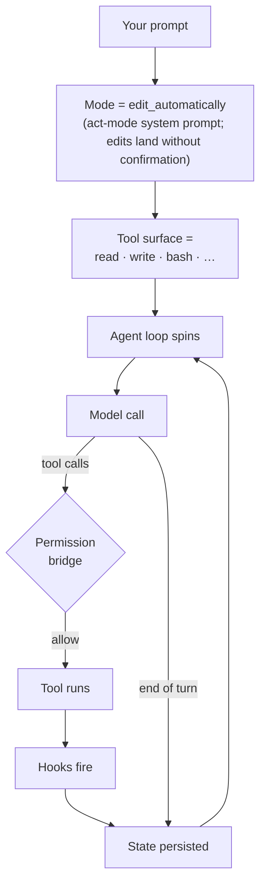

# Your first session <span class="lyra-badge beginner">beginner</span>

You have `lyra` on your `$PATH` and an LLM credential set. Time to drive.

## Open a session

`cd` into a project (it can be any git repo, or just an empty folder)
and run:

```bash
lyra
```

You'll see the Lyra banner, a status line, and a prompt:

<div class="lyra-ascii" markdown>
```
██╗  ██╗   ██╗██████╗  █████╗
██║  ╚██╗ ██╔╝██╔══██╗██╔══██╗
██║   ╚████╔╝ ██████╔╝███████║
██║    ╚██╔╝  ██╔══██╗██╔══██║
███████╗██║   ██║  ██║██║  ██║
╚══════╝╚═╝   ╚═╝  ╚═╝╚═╝  ╚═╝   v3.5
● lyra · session=sess-20260501-abcd · mode=edit_automatically · model=anthropic:claude-3-5-sonnet
ctx [────────────────────] 0 / 200,000 (0%)  ·  $0.000 USD

❯
```
</div>

The status line is the **HUD**. It updates live as you work. See
[Slash commands tour](slash-commands.md#the-hud) for what each field
means.

## Anatomy of a turn

A "turn" is one user input followed by one or more model + tool steps
until the model decides it's done. Here is what happens when you type a
prompt:

```mermaid
sequenceDiagram
    participant You as You
    participant CLI as lyra-cli
    participant Loop as agent loop
    participant LLM as LLM
    participant Tool as tool (e.g. read)
    participant Hook as hook

    You->>CLI: prompt or /command
    CLI->>Loop: build transcript (SOUL + plan + recent)
    Loop->>LLM: chat(transcript, tools_allowed)
    LLM-->>Loop: text + tool_calls
    loop for each tool call
        Loop->>Hook: PreTool(name, args)
        Hook-->>Loop: allow / deny / ask
        Loop->>Tool: execute
        Tool-->>Loop: observation
        Loop->>Hook: PostTool(name, observation)
    end
    Loop-->>CLI: streamed text + observations
    CLI-->>You: render
```

The loop terminates when the model emits "end of turn", or hits a
budget, or the safety monitor flags something, or you press `Ctrl-C`.

## Try it

Type this and press Enter:

> Read README.md and tell me in three bullets what this project is.

You should see Lyra:

1. Call the `read` tool on `README.md`
2. Stream a 3-bullet summary
3. End the turn (the prompt comes back)

The HUD now shows a non-zero context fill and a few cents of cost.

??? example "What it looks like"
    <div class="lyra-ascii" markdown>
    ```
    ❯ Read README.md and tell me in three bullets what this project is.

    ⏎ Calling tool: read(path="README.md")
      ✓ 1764 lines, 87.2KB

    Lyra is a CLI-native open-source coding agent harness. Three things:
    - A 4-mode CLI (edit_automatically / ask_before_edits / plan_mode /
      auto_mode) with 80+ slash commands
    - A kernel of agent loop + hooks + permission bridge + skills
    - 16 LLM providers behind one factory

    ──────
    ✦ done · 1 tool · 2,341 ctx · $0.012
    ❯
    ```
    </div>

## Common first-session moves

| Action | Type |
|---|---|
| See available slash commands | `/help` |
| See current cost and context | `/status` |
| Switch model on the fly | `/model openai:gpt-4o` |
| Switch mode (default = edit_automatically) | `/mode plan_mode` |
| End the session | `/exit` or `Ctrl-D` |
| Cancel the current turn | `Ctrl-C` |

## What just happened, conceptually



You routed a prompt through a **mode** (system prompt + allowed tools),
the model decided to call the `read` tool, the **permission bridge**
allowed it because `read` is read-only, **hooks** ran before and after,
and the agent loop appended the observation to the transcript before
deciding the turn was done. State (transcript, cost, todo list, hooks
fired) was persisted to `~/.lyra/sessions/<session-id>/`.

That is the whole game. Everything else is layers on top.

[← Install](install.md){ .md-button }
[Learn the four modes →](four-modes.md){ .md-button .md-button--primary }
