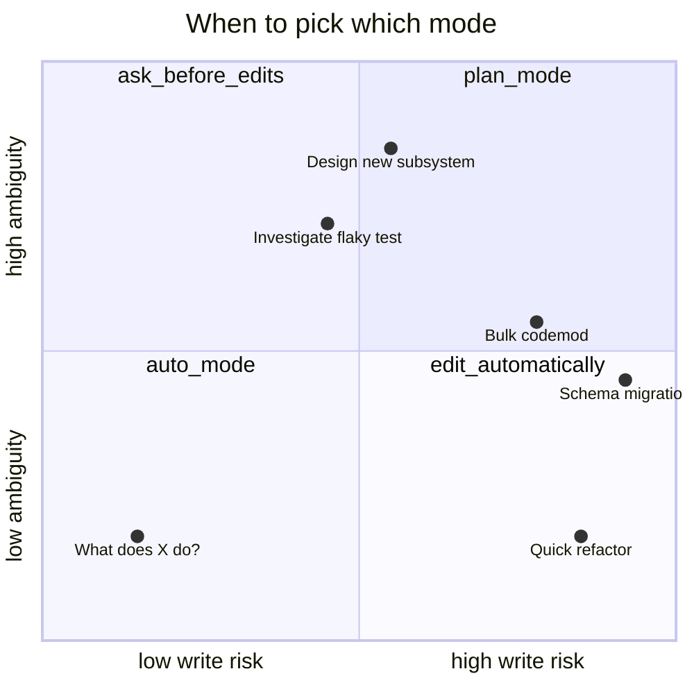
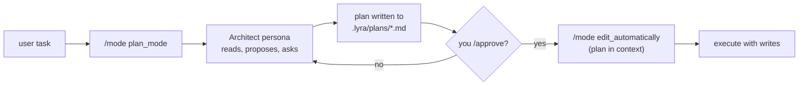

# The four modes beginner

Most coding agents have one mode: act. Lyra has four. Each one swaps the
**system prompt**, the **permission posture** (whether each write
pauses for your confirmation), and the **acceptance criteria** for the
turn.

Four modes — picked by you, the user — instead of one mode that hopes
to be right for every situation.

## At a glance

| Mode | Think of it as | Writes? | Permission posture |
|---|---|---|---|
| `edit_automatically` | A senior engineer with hands | Yes, immediately | `normal` — cached approvals |
| `ask_before_edits`   | A senior engineer who pauses at every checkpoint | Yes, after `y/N` | `strict` — re-prompt every time |
| `plan_mode`          | An architect at a whiteboard | **No** | Read-only |
| `auto_mode`          | A dispatcher reading your prompt | Depends on the turn | Inherits the chosen sub-mode |

You switch modes with `/mode <name>`, with **Tab** (cycles through the
rotation), or with the matching keybind in `/help`. The HUD displays
the current mode in the status line.

## `edit_automatically` — the default

The everyday mode. The system prompt instructs the model to act like a
senior engineer: read what it needs, propose the smallest correct
change, run the test, iterate. **Edits land without per-write
confirmation**, so you read the diff *after* it's applied. All tools
are available; permissions follow the cached-approval policy
(`permission_mode = normal`).

Pick this when: you have a clear, narrow task and want code on disk.

??? example
    > Add a `--verbose` flag to `cli.py` that turns on DEBUG-level logging.

## `ask_before_edits` — confirm every write

Same loop as `edit_automatically` — same system prompt scaffolding,
same tool surface — but **every write or destructive tool call
pauses** for you to approve. Reads, searches, and analysis are still
free. Permissions are `strict` (the approval cache is a no-op so the
prompt always fires).

The model is told to **bundle related writes** into single messages so
you're not death-by-OK'd, and to surface in **one sentence** what each
write does and why before it lands — that one sentence is what shows
in the confirmation prompt.

Pick this when: the task touches risky surfaces (migrations, deploys,
prod config), you're working on someone else's codebase you want to
keep intact, or you want to see the diff before it's on disk.

## `plan_mode` — design before code

The system prompt is `Plan-First`: think step-by-step, surface
trade-offs, propose multiple approaches before picking one, and **do
not write to disk**. The tool surface is restricted to read-only +
a scratch plan tool that writes to `.lyra/plans/<session>.md`.

When you approve the plan with `/approve`, Lyra automatically switches
to `edit_automatically` with the plan loaded into context.

Pick this when: the task touches >3 files, has architectural impact,
or has multiple valid approaches.

## `auto_mode` — let Lyra pick

A dispatcher mode. Each turn, a tiny **classifier** (pure function,
no LLM call, lives in `_classify_for_auto_mode`) reads your prompt
and routes it to one of the three real modes for that turn only.
Routing rules, in priority order:

| If your prompt contains… | Routes to | Why |
|---|---|---|
| `explain`, `how does`, `what is`, `design`, `compare`, … (or just `?`) | `plan_mode` | Read-only intent — no edits needed |
| `delete`, `rm`, `drop`, `migrate`, `git push`, `prod`, `production`, … | `ask_before_edits` | Risky / destructive — confirm each write |
| Anything else (with `fix`, `add`, `implement`, …) | `edit_automatically` | Default implementation case |

The session mode itself stays `auto_mode`; only the *behaviour for
the current turn* is borrowed. The router prepends a one-line
`[auto_mode → <picked>]` notice to every reply so you can see (and
override with `/mode`) which sub-mode it picked.

Pick this when: you're not sure which mode you want, or you want
Lyra to handle a mixed conversation (questions, edits, and risky ops)
without you having to swap modes by hand.

## How the mode actually changes behaviour

Behind the scenes a mode swap rebuilds three things on the next turn:

1. **System prompt** — pulled from
   `lyra_cli.interactive.session._MODE_SYSTEM_PROMPTS[mode]`.
2. **Permission posture** — the session's `permission_mode` is
   re-aligned so the substrate (`PermissionStack`,
   `ToolApprovalCache`) matches the new mode's intent. `yolo` is
   preserved across mode switches because it requires its own
   explicit opt-in via `/perm yolo` or `Alt+M`.
3. **Acceptance criteria** — what counts as "turn complete". For
   `plan_mode` it's "plan written and user approved". For
   `ask_before_edits` it's "all proposed writes either applied or
   rejected".

??? note "I want to read the prompt itself"
    Run `/mode show` to dump the current system prompt to the
    transcript. You'll see the `ReAct` / `Plan-First` / `Confirm-on-Write`
    scaffolding spelled out explicitly — these are the
    [prompt engineering patterns](../research/index.md) Lyra commits to.

## Coming from earlier Lyra versions?

Every prior mode name still works as a `/mode` argument; Lyra remaps
it on the spot and tells you about the rename in a one-line notice.

| You typed | Lyra remaps to | Why |
|---|---|---|
| `agent` (v3.2) | `edit_automatically` | Same shape, new label |
| `plan`  (v3.2) | `plan_mode`          | Renamed only |
| `debug` (v3.2) | `auto_mode`          | The dedicated debug mode is gone — its discipline survives as a [skill](../howto/debug-mode.md) |
| `ask`   (v3.2) | `plan_mode`          | Closest preserved read-only behaviour (`ask_before_edits` is **not** read-only) |
| `build` (v2.x) | `edit_automatically` | Transitively, via `agent` |
| `run`   (v2.x) | `edit_automatically` | Transitively, via `agent` |
| `explore` (v2.x) | `plan_mode`        | Transitively, via `ask` |
| `retro` (v2.x) | `auto_mode`          | Transitively, via `debug` |

[← First session](first-session.md){ .md-button }
[Tour the slash commands →](slash-commands.md){ .md-button .md-button--primary }
