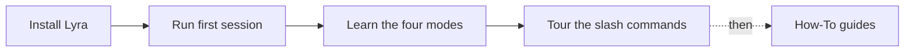

# Get Started beginner

This section walks you from a clean machine to a working Lyra session.
Read it in order; every page assumes the previous one.

## The four steps

| Step | Page | Time |
|------|------|------|
| 1 | [Install](install.md) | 2 min |
| 2 | [First session](first-session.md) | 10 min |
| 3 | [The four modes](four-modes.md) | 10 min |
| 4 | [Slash commands tour](slash-commands.md) | 10 min |

When you're done, you'll be able to:

- Start `lyra` from any project root
- Pick the right **mode** for the task at hand (act / design / hypothesise / inspect)
- Hit `/help`, `/status`, `/cost`, `/plan`, `/skills` and recognise what they show
- Switch between models without restarting

[Install →](install.md){ .md-button .md-button--primary }
