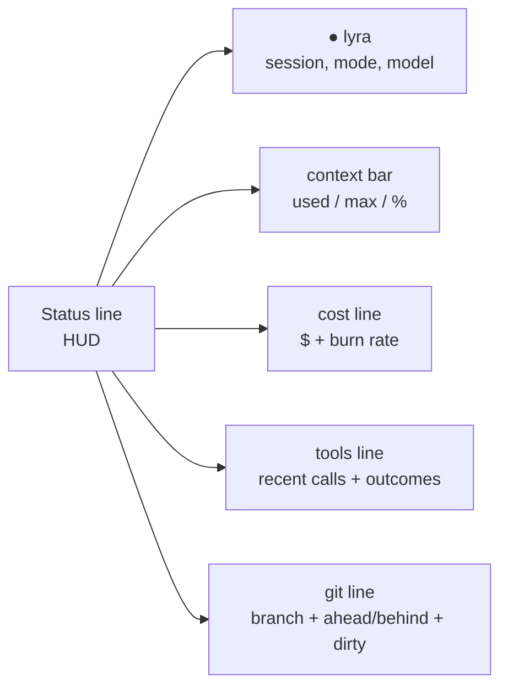

# Slash commands tour <span class="lyra-badge beginner">beginner</span>

Slash commands are how you talk to Lyra **out-of-band** — not through
the model. Anything starting with `/` is intercepted by the CLI before
the prompt is sent. They are how you switch modes, inspect state, run
tools directly, and manage skills, plugins, and MCP servers.

There are about 80, grouped into 12 categories. You don't have to
memorise them — `Tab` completes any prefix and `/help` shows the full
list. This page is a guided tour through the categories you'll touch
in the first hour.

## See them all

```bash
/help          # one-screen menu, grouped by category
/help <name>   # detailed help for one command
/help all      # the full reference, paged
```

## Session category — the ones you use first

| Command | What it does |
|---|---|
| `/help` | List commands |
| `/status` | Cost, context fill, model, mode, tool calls |
| `/cost` | Cost-only view, broken down by model |
| `/clear` | Clear the screen (transcript stays) |
| `/exit` / `/quit` | End the session |
| `/save` | Persist transcript + state right now |
| `/resume <id>` | Resume a previous session by id |

## Mode category

| Command | What it does |
|---|---|
| `/mode <name>` | Switch to `edit_automatically` / `ask_before_edits` / `plan_mode` / `auto_mode` |
| `/mode show` | Dump the current system prompt |
| `/approve` | Approve the current plan and switch back to `edit_automatically` |
| `/reject` | Reject the current plan and stay in `plan_mode` |

## Plan · Build · Run category

| Command | What it does |
|---|---|
| `/plan` | Force-enter `plan_mode` for this turn only |
| `/build` | Force-enter `edit_automatically` mode for this turn only |
| `/run <task>` | Single-shot: spawn a subagent to do `<task>` and return |
| `/diff` | Show the diff Lyra has produced this session |
| `/undo` | Revert the last edit (uses git stash) |

## Tools · Agents category

| Command | What it does |
|---|---|
| `/tools` | List enabled tools |
| `/tool <name> <args…>` | Call a tool directly, no model |
| `/agents` | List subagents in this session and their state |
| `/spawn <task>` | Spawn a parallel subagent in a worktree |

## Observability category

| Command | What it does |
|---|---|
| `/trace` | Open the trace viewer for this session |
| `/hir` | Show the Hierarchical Intermediate Representation |
| `/logs` | Tail this session's logs |
| `/why <id>` | Explain why a particular tool call ran |

## Skills · MCP · Plugins

| Command | What it does |
|---|---|
| `/skills` | List installed skills |
| `/skill add <path-or-url>` | Install a skill |
| `/mcp` | List MCP servers and their tool counts |
| `/mcp add <stdio-cmd-or-url>` | Add an MCP server to this session |
| `/plugin list` | List loaded plugins |

See the full [command reference](../reference/commands.md) for every
command, all flags, and which category each one belongs to.

## The HUD



The HUD is **9 widgets** rendered on every render tick. The default
`compact` preset shows identity + context bar + cost. Switch presets
with `/hud preset minimal|compact|full|inline` or preview them outside
a session with `lyra hud preview --preset <name>`.

<div class="lyra-ascii" markdown>
```
● lyra session=sess-20260501-abcd mode=edit_automatically model=anthropic:claude-3-5-sonnet…
ctx [███─────────────────────] 24,512 / 200,000 (12%)
$0.123 USD  ·  burn 0.05 USD/h
```
</div>

## Tab completion

Press `Tab` after any `/` prefix and the completer will offer all
matching commands, descriptions, and (for sub-commanded entries like
`/skill add`) the next arg. Pipe substitutions like `/run %file` are
expanded against the current file selection.

## What if I want to add my own?

You can. See [Write a slash command](../howto/write-slash-command.md)
for the recipe. Lyra has a **unified command registry** so a slash
command you register from a plugin appears in `/help`, in tab
completion, and in the HUD's "recent" line — automatically.

[← The four modes](four-modes.md){ .md-button }
[Continue to Core Concepts →](../concepts/index.md){ .md-button .md-button--primary }
