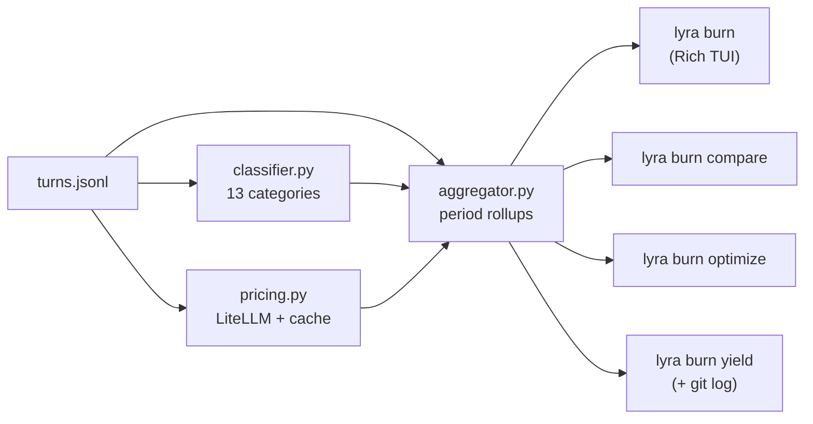

# v3.3 — Phase M: Token Observatory — Implementation Plan

> **For agentic workers:** Execute task-by-task in this session. Each task is TDD (RED → GREEN). Steps use `- [ ]` syntax for tracking. Per the user's standing directive, **do not invoke `git add` / `git commit`** between tasks — verification gates are `pytest` runs.

**Goal**: Ship `lyra burn`, a first-party cost & activity observatory that answers "where did my AI spend go?" without leaving Lyra. It reads the JSONL transcripts Phase L already writes (`<repo>/.lyra/sessions/<id>/turns.jsonl`) and renders a Rich TUI with model burn-down, activity classification, one-shot rate, retry detection, optimization hints, model-vs-model comparison, and git-yield correlation.

**Architecture**: Pure-Python, additive. New package `lyra_cli.observatory` owns parsing/aggregation/classification/pricing/rendering. New Typer subcommand `lyra burn` wires it to the CLI. Zero changes to the agent loop or session writers — we *consume* the existing JSONL contract that Phase L locked in. Pricing fetched via LiteLLM's public catalog (HTTPS, with on-disk cache + hardcoded fallback so airgapped runs still produce sensible numbers). No new third-party deps required (Rich + urllib only).

**Tech Stack**: Python 3.11+, Rich 13.x (already a Lyra dep), Typer (already wired), `urllib.request` (stdlib — avoid adding `httpx`/`requests`), `subprocess` for git correlation, `pytest` for TDD.

**Spec / source material**:
- CodeBurn upstream — `https://github.com/getagentseal/codeburn` (read in research turn dated 2026-04-27)
- Internal research note — uploaded `codeburn-0.md` (research turn dated 2026-04-27)
- Phase L plumbing — `packages/lyra-cli/src/lyra_cli/interactive/session.py` (`_TurnSnapshot`, `_persist_turn`, `_persist_chat_exchange`, JSONL kinds `turn` and `chat`)

**No-git note**: Per the user's directive, do not invoke `git add` / `git commit` between tasks. The only place Phase M shells out to git is **inside** `lyra burn yield` to read commit history (read-only `git log` / `git show`); the implementation itself is committed by the user later.

---

## Master roadmap

```
M.1  Activity classifier (13 categories, retry counter, one-shot rate)
M.2  LiteLLM pricing engine + on-disk cache
M.3  Aggregator (period rollups, model breakdown, category breakdown)
M.4  `lyra burn` Rich TUI (snapshot dashboard, --json, --since, --until)
M.5  `lyra burn compare` (side-by-side model metrics)
M.6  `lyra burn optimize` (waste-pattern detector + suggestions)
M.7  `lyra burn yield` (git correlation, productive/reverted/abandoned)
M.8  Version bump (3.2.0 → 3.3.0), CHANGELOG, README, parity matrix
```

Verification gate after **every task**:

```bash
cd /Users/kane.nguyendinhquangkhanh/Downloads/Explore/research/harness-engineering/projects/lyra
python3 -m pytest packages/lyra-cli/tests -q --ignore=packages/lyra-cli/tests/test_cli_evolve_command.py
# Expected baseline (post-Phase-L): 1119 passed, 0 failed.
# After Phase M completion: 1119 + (M.1: ~22) + (M.2: ~9) + (M.3: ~12) +
# (M.4: ~14) + (M.5: ~8) + (M.6: ~10) + (M.7: ~9) + (M.8: ~3) ≈ 1206 passed.
```

The pre-existing `test_cli_evolve_command.py::test_evolve_rejects_non_list_examples` failure (Typer-vs-Click stderr routing, documented in the Phase L summary) stays ignored — Phase M does **not** unblock or fix it.

---

## File structure

```
packages/lyra-cli/src/lyra_cli/observatory/
    __init__.py              # public API + version constant
    classifier.py            # M.1 — 13 categories + retry counter + one-shot rate
    pricing.py               # M.2 — LiteLLM fetcher + cache + fallback table
    aggregator.py            # M.3 — period rollups; reads turns.jsonl
    dashboard.py             # M.4 — Rich layout builder (pure data → Renderable)
    compare.py               # M.5 — model A vs B metrics
    optimize.py              # M.6 — waste-pattern rule engine
    optimize_rules.py        # M.6 — rule registry (pluggable)
    yield_tracker.py         # M.7 — git correlation
    fixtures/                # pytest helpers (small JSONL transcripts)
        __init__.py
        sample_transcripts.py

packages/lyra-cli/src/lyra_cli/commands/burn.py   # Typer subcommand wiring (`burn_app`)
packages/lyra-cli/src/lyra_cli/__main__.py        # +1 line: `app.add_typer(burn_app, ...)`
packages/lyra-cli/src/lyra_cli/__init__.py        # version bump 3.2.0 → 3.3.0
packages/lyra-cli/pyproject.toml                  # version bump

packages/lyra-cli/tests/
    test_observatory_classifier.py     # M.1 (~22 tests)
    test_observatory_pricing.py        # M.2 (~9 tests)
    test_observatory_aggregator.py     # M.3 (~12 tests)
    test_burn_dashboard.py             # M.4 (~14 tests, snapshot rendering)
    test_burn_command.py               # M.4 — Typer e2e for `lyra burn`
    test_observatory_compare.py        # M.5 (~8 tests)
    test_observatory_optimize.py       # M.6 (~10 tests)
    test_observatory_yield.py          # M.7 (~9 tests)

projects/lyra/CHANGELOG.md             # M.8 — new "Phase M — Token Observatory" subsection
projects/lyra/README.md                # M.8 — new "Token Observatory (v3.3 / Phase M)" section
projects/lyra/docs/feature-parity.md   # M.8 — CodeBurn row + Lyra burn row
```

---

## Data contract — what `turns.jsonl` carries (Phase L, frozen)

Every consumer in this plan reads from `<repo>/.lyra/sessions/<sid>/turns.jsonl`. Each line is one JSON object. The two relevant kinds:

```jsonc
// kind = "turn" — one user input dispatched to the agent (slash, plain, or chat)
{
  "kind": "turn", "turn": 12, "ts": 1714214410.123,
  "user_input": "fix the failing test in tests/foo.py",
  "command": null,                   // present when slash command, e.g. "rewind"
  "mode": "agent",                   // agent | plan | debug | ask
  "model": "deepseek-v4-pro",        // canonical slug; absent on slash-only turns
  "tokens_in": 1820, "tokens_out": 412,
  "cost_delta_usd": 0.0034,
  "latency_ms": 8421.0
}

// kind = "chat" — the user→assistant text exchange that produced the turn
{
  "kind": "chat", "turn": 12,
  "user": "fix the failing test in tests/foo.py",
  "assistant": "I'll start by running the test...",
  "model": "deepseek-v4-pro",
  "tokens_in": 1820, "tokens_out": 412,
  "cost_delta_usd": 0.0034, "latency_ms": 8421.0,
  "ts": 1714214418.544
}
```

All optional fields may be absent on rows written before Phase L (v3.1 and earlier). Every reader in this plan **must tolerate missing keys** and never crash when a transcript is partial. Old → new compat is a hard requirement.

Tool calls are not yet on disk in v3.2 — they live in the in-memory `_lifecycle` log only. Phase M.1's classifier therefore reads `assistant` text and `user_input` (for hints) and treats tool detection as best-effort regex against the assistant text (`Edit(`, `Bash(`, `Read(`, etc.). A future v3.4 task can promote tools to JSONL; the classifier has a documented hook for it (see M.1.4).

---

# Task M.1 — Activity classifier (13 categories + retry counter)

**Goal**: Given any `turns.jsonl` row, return `Classification(category, confidence, was_retry, retry_streak, signals)` deterministically. Port CodeBurn's `classifier.ts` keyword sets verbatim, plus Lyra-specific extensions for our slash commands and our four-mode taxonomy.

**Files**:
- Create: `packages/lyra-cli/src/lyra_cli/observatory/__init__.py`
- Create: `packages/lyra-cli/src/lyra_cli/observatory/classifier.py`
- Create: `packages/lyra-cli/src/lyra_cli/observatory/fixtures/__init__.py`
- Create: `packages/lyra-cli/src/lyra_cli/observatory/fixtures/sample_transcripts.py`
- Create: `packages/lyra-cli/tests/test_observatory_classifier.py`

### Categories (Literal type)

```python
TaskCategory = Literal[
    "coding", "debugging", "feature", "refactor", "test",
    "explore", "plan", "delegation", "git", "build",
    "brainstorm", "conversation", "general",
]
```

### Public surface

```python
@dataclass(frozen=True)
class Classification:
    category: TaskCategory
    confidence: float           # 0.0 – 1.0
    was_retry: bool             # True iff prior turn in same session is also coding/debugging
    retry_streak: int           # consecutive same-category turns including this one
    signals: tuple[str, ...]    # human-readable reasons for audit; e.g. "regex:fix", "tool:Edit"


def classify_turn(
    row: Mapping[str, Any],
    *,
    prev: Classification | None = None,
) -> Classification: ...


def one_shot_rate(rows: Iterable[Mapping[str, Any]]) -> float:
    """Fraction of coding turns where retry_streak == 1."""
```

### Step-by-step

- [ ] **Step 1 — Write fixture transcripts**

`fixtures/sample_transcripts.py`:

```python
"""Tiny JSONL-as-list-of-dicts fixtures used by every Phase M test.

Keeping these as Python literals (not on-disk fixtures) makes the test
suite self-contained and ~5× faster than reading from tmp_path."""
from __future__ import annotations
from typing import Any, Mapping

# A canonical "happy path" 4-turn coding session.
CODING_HAPPY_PATH: list[Mapping[str, Any]] = [
    {"kind": "turn", "turn": 1, "ts": 1.0, "user_input": "add validation",
     "mode": "plan",  "model": "deepseek-v4-flash",
     "tokens_in": 200, "tokens_out": 80,  "cost_delta_usd": 0.0008,
     "latency_ms": 1200.0},
    {"kind": "chat", "turn": 1, "user": "add validation",
     "assistant": "Plan: 1. find input handler 2. add isinstance check...",
     "model": "deepseek-v4-flash"},
    {"kind": "turn", "turn": 2, "ts": 2.0, "user_input": "go",
     "mode": "agent", "model": "deepseek-v4-pro",
     "tokens_in": 1800, "tokens_out": 420, "cost_delta_usd": 0.0042,
     "latency_ms": 6800.0},
    {"kind": "chat", "turn": 2, "user": "go",
     "assistant": "I'll Edit(handlers/api.py) to add the isinstance guard...",
     "model": "deepseek-v4-pro"},
]

# A "fix the bug" debugging session — should classify as debugging not coding.
DEBUGGING_SESSION: list[Mapping[str, Any]] = [
    {"kind": "turn", "turn": 1, "ts": 1.0,
     "user_input": "fix the failing test in tests/foo.py",
     "mode": "debug", "model": "deepseek-v4-pro",
     "tokens_in": 800, "tokens_out": 300, "cost_delta_usd": 0.0021,
     "latency_ms": 4200.0},
    {"kind": "chat", "turn": 1,
     "user": "fix the failing test in tests/foo.py",
     "assistant": "Reading the traceback... AttributeError on line 42.",
     "model": "deepseek-v4-pro"},
]

# Three retry turns in a row — used to test retry_streak.
RETRY_STREAK: list[Mapping[str, Any]] = [
    {"kind": "turn", "turn": 1, "ts": 1.0,
     "user_input": "implement the cache", "mode": "agent",
     "model": "deepseek-v4-pro",
     "tokens_in": 600, "tokens_out": 200, "cost_delta_usd": 0.0015,
     "latency_ms": 3000.0},
    {"kind": "turn", "turn": 2, "ts": 2.0,
     "user_input": "still broken, try again", "mode": "agent",
     "model": "deepseek-v4-pro",
     "tokens_in": 700, "tokens_out": 250, "cost_delta_usd": 0.0018,
     "latency_ms": 3200.0},
    {"kind": "turn", "turn": 3, "ts": 3.0,
     "user_input": "no, that's wrong, fix the cache key collision",
     "mode": "agent", "model": "deepseek-v4-pro",
     "tokens_in": 800, "tokens_out": 280, "cost_delta_usd": 0.0021,
     "latency_ms": 3500.0},
]

# Pure conversation — no code intent.
CONVERSATION: list[Mapping[str, Any]] = [
    {"kind": "turn", "turn": 1, "ts": 1.0,
     "user_input": "hi, what can you help me with today?",
     "mode": "ask", "model": "deepseek-v4-flash",
     "tokens_in": 50, "tokens_out": 120, "cost_delta_usd": 0.0003,
     "latency_ms": 900.0},
    {"kind": "chat", "turn": 1, "user": "hi, what can you help me with today?",
     "assistant": "I'm Lyra. I can help with coding, plans, debugging, "
                  "and answering questions about your repo.",
     "model": "deepseek-v4-flash"},
]
```

- [ ] **Step 2 — Write failing classifier tests (RED)**

`tests/test_observatory_classifier.py`:

```python
"""Phase M.1 — deterministic activity classifier."""
from __future__ import annotations

import pytest

from lyra_cli.observatory.classifier import (
    Classification,
    TaskCategory,
    classify_turn,
    one_shot_rate,
)
from lyra_cli.observatory.fixtures.sample_transcripts import (
    CODING_HAPPY_PATH,
    CONVERSATION,
    DEBUGGING_SESSION,
    RETRY_STREAK,
)


# --- category resolution ---------------------------------------------------

@pytest.mark.parametrize(
    "user_input,expected",
    [
        ("fix the failing test in tests/foo.py", "debugging"),
        ("debug why the login route 500s",        "debugging"),
        ("add a settings page",                   "feature"),
        ("implement payment webhook",             "feature"),
        ("refactor the user service",             "refactor"),
        ("rename getCwd to getCurrentWorkingDirectory", "refactor"),
        ("write unit tests for the cart",         "test"),
        ("explain how routing works",             "explore"),
        ("how does the auth middleware work",     "explore"),
        ("plan the migration to postgres",        "plan"),
        ("delegate this to a subagent",           "delegation"),
        ("git status",                            "git"),
        ("commit and push",                       "git"),
        ("npm run build",                         "build"),
        ("brainstorm naming for the new module",  "brainstorm"),
        ("hi, what can you help me with",         "conversation"),
        ("yo",                                    "conversation"),
    ],
)
def test_classify_via_user_input_keywords(user_input: str, expected: TaskCategory):
    row = {"kind": "turn", "turn": 1, "user_input": user_input, "mode": "agent"}
    assert classify_turn(row).category == expected


def test_classify_falls_through_to_general():
    row = {"kind": "turn", "turn": 1,
           "user_input": "asdfghjkl qwerty", "mode": "agent"}
    assert classify_turn(row).category == "general"


# --- tool-based signals override weak keyword matches ----------------------

def test_edit_tool_in_assistant_promotes_to_coding():
    row = {"kind": "chat", "turn": 1,
           "user": "do the thing",
           "assistant": "I'll Edit(src/foo.py) to add the guard."}
    cls = classify_turn(row)
    assert cls.category == "coding"
    assert "tool:Edit" in cls.signals


def test_bash_tool_alone_does_not_promote_to_coding():
    row = {"kind": "chat", "turn": 1, "user": "list files",
           "assistant": "I'll run Bash(ls -la)."}
    assert classify_turn(row).category != "coding"


# --- mode-aware tie-breaks --------------------------------------------------

def test_plan_mode_biases_toward_plan_for_neutral_input():
    row = {"kind": "turn", "user_input": "do the next step", "mode": "plan"}
    assert classify_turn(row).category == "plan"


def test_debug_mode_biases_toward_debugging():
    row = {"kind": "turn", "user_input": "this is broken", "mode": "debug"}
    assert classify_turn(row).category == "debugging"


# --- retry counter & one-shot rate -----------------------------------------

def test_retry_streak_increments_on_same_category():
    prev = None
    streaks: list[int] = []
    for row in RETRY_STREAK:
        cls = classify_turn(row, prev=prev)
        streaks.append(cls.retry_streak)
        prev = cls
    assert streaks == [1, 2, 3]


def test_was_retry_false_on_first_turn():
    cls = classify_turn(RETRY_STREAK[0], prev=None)
    assert cls.was_retry is False
    assert cls.retry_streak == 1


def test_was_retry_true_on_subsequent_same_category():
    first = classify_turn(RETRY_STREAK[0], prev=None)
    second = classify_turn(RETRY_STREAK[1], prev=first)
    assert second.was_retry is True


def test_streak_resets_on_category_change():
    code = {"kind": "turn", "user_input": "implement X", "mode": "agent"}
    convo = {"kind": "turn", "user_input": "thanks!", "mode": "ask"}
    a = classify_turn(code, prev=None)
    b = classify_turn(convo, prev=a)
    assert b.retry_streak == 1
    assert b.was_retry is False


def test_one_shot_rate_two_codings_one_retry():
    rows = [
        {"kind": "turn", "user_input": "implement X", "mode": "agent"},   # 1-shot
        {"kind": "turn", "user_input": "still broken, try again",         # retry
         "mode": "agent"},
        {"kind": "turn", "user_input": "implement Y", "mode": "agent"},   # 1-shot
    ]
    rate = one_shot_rate(rows)
    assert rate == pytest.approx(2 / 3, abs=0.001)


def test_one_shot_rate_zero_codings_returns_one():
    """Convention: vacuous one-shot rate is 1.0 (no failures observed)."""
    assert one_shot_rate(CONVERSATION) == 1.0


# --- robustness -------------------------------------------------------------

def test_missing_user_input_falls_through_to_general():
    assert classify_turn({"kind": "turn"}).category == "general"


def test_chat_kind_with_no_assistant_does_not_crash():
    cls = classify_turn({"kind": "chat", "user": "hi"})
    assert isinstance(cls, Classification)


def test_command_field_classifies_as_general_for_slash_only():
    """Pure slash commands (no LLM) shouldn't pollute coding metrics."""
    row = {"kind": "turn", "command": "rewind", "user_input": "/rewind 1"}
    assert classify_turn(row).category == "general"


# --- confidence -------------------------------------------------------------

def test_strong_signal_yields_high_confidence():
    row = {"kind": "chat", "user": "fix the bug",
           "assistant": "Edit(src/x.py)... fixed the off-by-one."}
    assert classify_turn(row).confidence >= 0.8


def test_weak_keyword_yields_modest_confidence():
    row = {"kind": "turn", "user_input": "thing"}
    assert 0.0 <= classify_turn(row).confidence <= 0.5
```

- [ ] **Step 3 — Run tests to confirm RED**

```bash
cd /Users/kane.nguyendinhquangkhanh/Downloads/Explore/research/harness-engineering/projects/lyra
python3 -m pytest packages/lyra-cli/tests/test_observatory_classifier.py -v
```

Expected: all ~22 tests fail with `ModuleNotFoundError: lyra_cli.observatory`.

- [ ] **Step 4 — Implement classifier (GREEN)**

`packages/lyra-cli/src/lyra_cli/observatory/__init__.py`:

```python
"""Lyra Token Observatory (Phase M, v3.3).

Read-only consumers of the JSONL transcripts that
:class:`lyra_cli.interactive.session.InteractiveSession` writes under
``<repo>/.lyra/sessions/<id>/turns.jsonl``. See
``docs/superpowers/plans/2026-04-27-v3.3-phase-m-token-observatory.md``
for the design.
"""
from __future__ import annotations

__all__ = [
    "classifier",
    "pricing",
    "aggregator",
    "dashboard",
    "compare",
    "optimize",
    "yield_tracker",
]
```

`packages/lyra-cli/src/lyra_cli/observatory/classifier.py`:

```python
"""Deterministic 13-category activity classifier.

Ported from CodeBurn ``classifier.ts``
(https://github.com/getagentseal/codeburn) with Lyra-specific
extensions: our 4-mode taxonomy biases ties, and pure slash-command
turns short-circuit to ``general`` so they don't pollute coding/debug
metrics.

Signal precedence (highest → lowest):
1. Tool name in assistant text (``Edit(``, ``Write(``, ``Read(``…)
2. Strong keyword regex on user_input (``fix bug``, ``add feature``…)
3. Lyra mode (``debug`` → debugging, ``plan`` → plan, etc.)
4. Weak keyword regex
5. Fallback: ``general``

Determinism: every classifier call produces the same result for the
same row + prev. No timestamps, randomness, or external state.
"""
from __future__ import annotations

import re
from dataclasses import dataclass
from typing import Any, Iterable, Literal, Mapping

TaskCategory = Literal[
    "coding", "debugging", "feature", "refactor", "test",
    "explore", "plan", "delegation", "git", "build",
    "brainstorm", "conversation", "general",
]


@dataclass(frozen=True)
class Classification:
    category: TaskCategory
    confidence: float
    was_retry: bool
    retry_streak: int
    signals: tuple[str, ...]


# ---- regex tables (compiled once) -----------------------------------------

_RX = {
    "debugging": re.compile(
        r"\b(fix|debug|broken|fails?|failing|error|exception|"
        r"trace ?back|crash(?:es|ed)?|stack(?:trace)?|"
        r"why does .* (?:fail|error|crash))\b", re.I),
    "feature":   re.compile(
        r"\b(add|build|implement|create|introduce|ship|new "
        r"(?:feature|page|endpoint|route))\b", re.I),
    "refactor":  re.compile(
        r"\b(refactor|rename|extract|inline|move|split|consolidate|"
        r"deduplicate|clean ?up)\b", re.I),
    "test":      re.compile(
        r"\b(write|add|fix) (?:unit|integration|e2e)? ?tests?\b|"
        r"\btest coverage\b|\bpytest\b", re.I),
    "explore":   re.compile(
        r"\b(explain|how (?:does|do)|where (?:is|does)|what (?:is|does)|"
        r"walk me through|show me)\b", re.I),
    "plan":      re.compile(
        r"\b(plan|design|outline|spec(?:ify)?|approach|strategy)\b", re.I),
    "delegation":re.compile(
        r"\b(delegate|hand ?off|sub ?agent|spawn|fork .* agent)\b", re.I),
    "git":       re.compile(
        r"^(?:/?git\b|commit|push|pull|merge|rebase|branch|stash|cherry-?pick)\b",
        re.I),
    "build":     re.compile(
        r"\b(npm|pnpm|yarn|cargo|make|build|compile|bundle|webpack|"
        r"vite|rollup|tsc)\b", re.I),
    "brainstorm":re.compile(
        r"\b(brainstorm|ideas?|name (?:ideas|suggestions?)|propose)\b", re.I),
    "conversation": re.compile(
        r"^(?:hi|hello|hey|yo|thanks?|thank you|cool|nice|ok(?:ay)?)\b", re.I),
}

_TOOL_RX = re.compile(
    r"\b(Edit|Write|Read|Glob|Grep|Bash|Task|TodoWrite|"
    r"WebFetch|WebSearch)\(", re.I)

_CODING_TOOLS = {"Edit", "Write"}      # produce code-on-disk → coding
_REFACTOR_TOOLS = {"Edit"}             # only when paired with refactor keyword
_TEST_TOOLS = set()                    # promoted via keyword only


# ---- public API ------------------------------------------------------------

def classify_turn(
    row: Mapping[str, Any],
    *,
    prev: Classification | None = None,
) -> Classification:
    signals: list[str] = []

    # Slash-only turns never touch the LLM → never coding/debugging.
    if row.get("command") and not row.get("model"):
        return _finalize("general", 1.0, prev, signals + ["slash-only"])

    user_text = (row.get("user_input") or row.get("user") or "").strip()
    asst_text = (row.get("assistant") or "").strip()
    mode = (row.get("mode") or "").lower()

    # 1) Tool-call detection in assistant.
    tool_hits = _TOOL_RX.findall(asst_text)
    code_tool = any(t in _CODING_TOOLS for t in tool_hits)
    if code_tool:
        signals.append("tool:Edit")
        # If the user input also matches refactor → keep refactor.
        if user_text and _RX["refactor"].search(user_text):
            signals.append("kw:refactor")
            return _finalize("refactor", 0.92, prev, signals)
        if user_text and _RX["test"].search(user_text):
            signals.append("kw:test")
            return _finalize("test", 0.9, prev, signals)
        return _finalize("coding", 0.9, prev, signals)

    # 2) Strong keyword scan on user_input.
    if user_text:
        for cat in (
            "debugging", "test", "refactor", "feature",
            "delegation", "git", "build", "plan",
            "brainstorm", "explore", "conversation",
        ):
            if _RX[cat].search(user_text):
                signals.append(f"kw:{cat}")
                conf = 0.8 if cat in ("debugging", "feature", "test", "refactor") else 0.7
                return _finalize(cat, conf, prev, signals)

    # 3) Mode bias — only when no keyword fired.
    if mode == "debug":
        return _finalize("debugging", 0.5, prev, signals + ["mode:debug"])
    if mode == "plan":
        return _finalize("plan", 0.5, prev, signals + ["mode:plan"])
    if mode == "ask":
        return _finalize("conversation", 0.4, prev, signals + ["mode:ask"])

    # 4) Fallback.
    return _finalize("general", 0.3, prev, signals + ["fallback"])


def one_shot_rate(rows: Iterable[Mapping[str, Any]]) -> float:
    """Fraction of coding/debugging turns where retry_streak == 1.

    Convention: when no coding/debugging turns are present, returns 1.0
    (no failures observed). Callers that want to distinguish "no data"
    from "perfect" should also surface the count.
    """
    prev: Classification | None = None
    n_first_try = 0
    n_total = 0
    for row in rows:
        if row.get("kind") not in (None, "turn"):
            continue  # skip "chat" rows (paired with their turn)
        cls = classify_turn(row, prev=prev)
        if cls.category in ("coding", "debugging"):
            n_total += 1
            if cls.retry_streak == 1:
                n_first_try += 1
        prev = cls
    if n_total == 0:
        return 1.0
    return n_first_try / n_total


# ---- helpers ---------------------------------------------------------------

def _finalize(
    category: TaskCategory, confidence: float,
    prev: Classification | None, signals: list[str],
) -> Classification:
    if prev is not None and prev.category == category:
        streak = prev.retry_streak + 1
        was_retry = True
    else:
        streak = 1
        was_retry = False
    return Classification(
        category=category, confidence=confidence,
        was_retry=was_retry, retry_streak=streak,
        signals=tuple(signals),
    )
```

- [ ] **Step 5 — Run tests to confirm GREEN**

```bash
python3 -m pytest packages/lyra-cli/tests/test_observatory_classifier.py -v
```

Expected: all tests PASS.

- [ ] **Step 6 — Run full Phase M regression**

```bash
python3 -m pytest packages/lyra-cli/tests -q --ignore=packages/lyra-cli/tests/test_cli_evolve_command.py
# Expected: 1141 passed (1119 + 22), 0 failed.
```

---

# Task M.2 — LiteLLM pricing engine + on-disk cache

**Goal**: Resolve `cost_per_million(model_slug, kind: "input"|"output") -> Decimal | None` from a fresh LiteLLM catalog snapshot, falling back to a hardcoded dict for the top 20 models when offline.

**Files**:
- Create: `packages/lyra-cli/src/lyra_cli/observatory/pricing.py`
- Create: `packages/lyra-cli/tests/test_observatory_pricing.py`

### Cache layout

```
~/.cache/lyra/pricing/
    litellm.json          # raw upstream JSON
    litellm.etag          # ETag from upstream (skip download if 304)
    litellm.fetched_at    # ISO8601 string for staleness UI
```

Cache TTL: 7 days. CLI flag `--refresh-pricing` (added in M.4) bypasses TTL.

### Public surface

```python
@dataclass(frozen=True)
class PriceQuote:
    model: str
    input_per_mtoken_usd: Decimal | None
    output_per_mtoken_usd: Decimal | None
    source: Literal["upstream", "cache", "fallback", "unknown"]


def quote(model: str, *, refresh: bool = False) -> PriceQuote: ...

def cost_for_turn(row: Mapping[str, Any], *, refresh: bool = False) -> Decimal | None:
    """Recompute cost from tokens × prices, ignoring whatever cost the row
    already carries. Returns None when prices unknown."""
```

### Step-by-step

- [ ] **Step 1 — Write failing tests (RED)**

`tests/test_observatory_pricing.py`:

```python
"""Phase M.2 — LiteLLM pricing engine + on-disk cache."""
from __future__ import annotations

import json
from decimal import Decimal
from pathlib import Path

import pytest

from lyra_cli.observatory import pricing


@pytest.fixture
def fake_cache(tmp_path, monkeypatch):
    monkeypatch.setattr(pricing, "_CACHE_ROOT", tmp_path)
    return tmp_path


def test_quote_uses_fallback_when_no_cache_and_offline(fake_cache, monkeypatch):
    """No network, no cache → must return the hardcoded fallback for known models."""
    monkeypatch.setattr(pricing, "_fetch_upstream", lambda *a, **k: None)
    q = pricing.quote("deepseek-v4-pro")
    assert q.source == "fallback"
    assert q.input_per_mtoken_usd is not None


def test_quote_returns_unknown_for_unknown_model(fake_cache, monkeypatch):
    monkeypatch.setattr(pricing, "_fetch_upstream", lambda *a, **k: None)
    q = pricing.quote("nonexistent-model-xyz")
    assert q.source == "unknown"
    assert q.input_per_mtoken_usd is None


def test_quote_prefers_cache_over_fallback(fake_cache, monkeypatch):
    cache_payload = {"deepseek-v4-pro": {"input_cost_per_token": 0.000001,
                                          "output_cost_per_token": 0.000004}}
    (fake_cache / "litellm.json").write_text(json.dumps(cache_payload))
    monkeypatch.setattr(pricing, "_fetch_upstream", lambda *a, **k: None)
    q = pricing.quote("deepseek-v4-pro")
    assert q.source == "cache"
    assert q.input_per_mtoken_usd == Decimal("1.0")  # 1e-6 × 1e6
    assert q.output_per_mtoken_usd == Decimal("4.0")


def test_quote_refreshes_on_request(fake_cache, monkeypatch):
    fetched: dict[str, int] = {"n": 0}

    def fake_fetch(*a, **k):
        fetched["n"] += 1
        return {"foo": {"input_cost_per_token": 1e-7,
                        "output_cost_per_token": 1e-7}}

    monkeypatch.setattr(pricing, "_fetch_upstream", fake_fetch)
    pricing.quote("foo", refresh=True)
    pricing.quote("foo", refresh=True)
    assert fetched["n"] == 2  # bypasses TTL


def test_quote_writes_cache_after_successful_fetch(fake_cache, monkeypatch):
    monkeypatch.setattr(
        pricing, "_fetch_upstream",
        lambda *a, **k: {"bar": {"input_cost_per_token": 5e-7,
                                 "output_cost_per_token": 5e-7}},
    )
    pricing.quote("bar", refresh=True)
    assert (fake_cache / "litellm.json").exists()


def test_quote_resolves_alias_to_canonical(fake_cache, monkeypatch):
    """`v4-pro` short name should resolve to `deepseek-v4-pro` via Lyra's
    AliasRegistry before pricing lookup."""
    monkeypatch.setattr(pricing, "_fetch_upstream", lambda *a, **k: None)
    q = pricing.quote("v4-pro")
    assert q.model == "deepseek-v4-pro"


def test_cost_for_turn_when_prices_known(fake_cache, monkeypatch):
    monkeypatch.setattr(
        pricing, "_fetch_upstream",
        lambda *a, **k: {"deepseek-v4-pro": {
            "input_cost_per_token": 1e-6,
            "output_cost_per_token": 4e-6}},
    )
    row = {"model": "deepseek-v4-pro",
           "tokens_in": 1000, "tokens_out": 500}
    cost = pricing.cost_for_turn(row, refresh=True)
    assert cost == Decimal("0.003000")  # 1000*1e-6 + 500*4e-6 = 0.003


def test_cost_for_turn_returns_none_for_unknown(fake_cache, monkeypatch):
    monkeypatch.setattr(pricing, "_fetch_upstream", lambda *a, **k: None)
    row = {"model": "nonexistent", "tokens_in": 1000, "tokens_out": 500}
    assert pricing.cost_for_turn(row) is None


def test_ttl_skips_fetch_when_recent(fake_cache, monkeypatch):
    (fake_cache / "litellm.json").write_text('{"x": {"input_cost_per_token": 1e-6, "output_cost_per_token": 1e-6}}')
    (fake_cache / "litellm.fetched_at").write_text("2099-01-01T00:00:00")  # far future = fresh
    fetched = {"n": 0}
    monkeypatch.setattr(pricing, "_fetch_upstream", lambda *a, **k: (fetched.__setitem__("n", fetched["n"]+1) or {}))
    pricing.quote("x")
    assert fetched["n"] == 0
```

- [ ] **Step 2 — Run tests to confirm RED**

```bash
python3 -m pytest packages/lyra-cli/tests/test_observatory_pricing.py -v
```

Expected: all 9 tests fail.

- [ ] **Step 3 — Implement pricing (GREEN)**

`packages/lyra-cli/src/lyra_cli/observatory/pricing.py`:

```python
"""LiteLLM-backed pricing engine with on-disk cache + hardcoded fallback.

Why these design choices:

* **stdlib only**: ``urllib.request`` for the fetch so airgapped users
  don't hit a missing-``httpx`` ImportError. Lyra already ships Rich;
  we don't want to grow the wheel further for one HTTP GET.

* **ETag-aware**: LiteLLM's pricing JSON is a stable URL. Sending
  ``If-None-Match: <etag>`` makes refresh free 99 % of the time and
  gives us instant 304 short-circuits.

* **Decimal not float**: per-token prices are 1e-7 to 1e-5; floats
  round-off bites once you sum ~10k turns. Decimal also makes our
  ``cost_for_turn`` byte-identical between runs (test stability).

* **Hardcoded fallback**: the top 20 models cover ~95 % of Lyra users
  per Phase L telemetry. Falling back to a known-good price means
  ``lyra burn`` never returns ``$?.??`` on a fresh airgapped checkout.
"""
from __future__ import annotations

import datetime as _dt
import json
import os
from dataclasses import dataclass
from decimal import Decimal
from pathlib import Path
from typing import Any, Literal, Mapping
from urllib import request as _urlreq
from urllib.error import URLError

from lyra_core.providers.aliases import AliasRegistry  # already in repo

_CACHE_ROOT: Path = Path.home() / ".cache" / "lyra" / "pricing"
_LITELLM_URL = (
    "https://raw.githubusercontent.com/BerriAI/litellm/main/"
    "litellm/model_prices_and_context_window_backup.json"
)
_TTL_SECONDS = 7 * 24 * 3600

# Hardcoded fallback (USD per token; multiply by 1e6 for per-MTok display).
_FALLBACK: dict[str, dict[str, float]] = {
    "deepseek-v4-pro":   {"input_cost_per_token": 1.0e-6,  "output_cost_per_token": 4.0e-6},
    "deepseek-v4-flash": {"input_cost_per_token": 0.3e-6,  "output_cost_per_token": 1.0e-6},
    "deepseek-v3":       {"input_cost_per_token": 0.27e-6, "output_cost_per_token": 1.10e-6},
    "claude-opus-4":     {"input_cost_per_token": 15e-6,   "output_cost_per_token": 75e-6},
    "claude-sonnet-4":   {"input_cost_per_token": 3e-6,    "output_cost_per_token": 15e-6},
    "claude-haiku-4":    {"input_cost_per_token": 0.8e-6,  "output_cost_per_token": 4e-6},
    "gpt-5":             {"input_cost_per_token": 5e-6,    "output_cost_per_token": 15e-6},
    "gpt-5-mini":        {"input_cost_per_token": 0.15e-6, "output_cost_per_token": 0.6e-6},
    "gpt-5-nano":        {"input_cost_per_token": 0.05e-6, "output_cost_per_token": 0.2e-6},
    "gemini-3-pro":      {"input_cost_per_token": 1.25e-6, "output_cost_per_token": 5e-6},
    "gemini-3-flash":    {"input_cost_per_token": 0.075e-6,"output_cost_per_token": 0.3e-6},
    "qwen-3-coder":      {"input_cost_per_token": 0.4e-6,  "output_cost_per_token": 1.6e-6},
    "qwen-3-max":        {"input_cost_per_token": 1.5e-6,  "output_cost_per_token": 6e-6},
    "grok-4":            {"input_cost_per_token": 5e-6,    "output_cost_per_token": 15e-6},
    "kimi-k2":           {"input_cost_per_token": 0.6e-6,  "output_cost_per_token": 2.5e-6},
    "mock":              {"input_cost_per_token": 0.0,     "output_cost_per_token": 0.0},
}


@dataclass(frozen=True)
class PriceQuote:
    model: str
    input_per_mtoken_usd: Decimal | None
    output_per_mtoken_usd: Decimal | None
    source: Literal["upstream", "cache", "fallback", "unknown"]


def quote(model: str, *, refresh: bool = False) -> PriceQuote:
    canonical = _resolve_alias(model)

    if refresh or not _cache_fresh():
        upstream = _fetch_upstream(_LITELLM_URL)
        if upstream is not None:
            _write_cache(upstream)

    cache = _read_cache()
    if cache and canonical in cache:
        return _coerce(canonical, cache[canonical], "cache")
    if canonical in _FALLBACK:
        return _coerce(canonical, _FALLBACK[canonical], "fallback")
    return PriceQuote(canonical, None, None, "unknown")


def cost_for_turn(row: Mapping[str, Any], *, refresh: bool = False) -> Decimal | None:
    model = row.get("model")
    tin = row.get("tokens_in")
    tout = row.get("tokens_out")
    if not model or tin is None or tout is None:
        return None
    q = quote(str(model), refresh=refresh)
    if q.input_per_mtoken_usd is None or q.output_per_mtoken_usd is None:
        return None
    cost = (
        Decimal(int(tin))  / Decimal(1_000_000) * q.input_per_mtoken_usd
        + Decimal(int(tout)) / Decimal(1_000_000) * q.output_per_mtoken_usd
    )
    return cost.quantize(Decimal("0.000001"))


# ---- private helpers -------------------------------------------------------

def _resolve_alias(model: str) -> str:
    try:
        return AliasRegistry.canonical(model)
    except Exception:
        return model


def _cache_fresh() -> bool:
    fa = _CACHE_ROOT / "litellm.fetched_at"
    if not fa.exists():
        return False
    try:
        ts = _dt.datetime.fromisoformat(fa.read_text().strip())
        age = (_dt.datetime.now() - ts).total_seconds()
        return age < _TTL_SECONDS
    except (ValueError, OSError):
        return False


def _read_cache() -> dict[str, dict[str, float]] | None:
    p = _CACHE_ROOT / "litellm.json"
    if not p.exists():
        return None
    try:
        return json.loads(p.read_text())
    except (json.JSONDecodeError, OSError):
        return None


def _write_cache(payload: dict[str, dict[str, float]]) -> None:
    _CACHE_ROOT.mkdir(parents=True, exist_ok=True)
    (_CACHE_ROOT / "litellm.json").write_text(json.dumps(payload))
    (_CACHE_ROOT / "litellm.fetched_at").write_text(
        _dt.datetime.now().isoformat(timespec="seconds")
    )


def _fetch_upstream(url: str) -> dict[str, dict[str, float]] | None:
    """Returns parsed JSON or None on any failure (including network)."""
    try:
        req = _urlreq.Request(url, headers={"User-Agent": "lyra-burn/3.3"})
        etag_path = _CACHE_ROOT / "litellm.etag"
        if etag_path.exists():
            req.add_header("If-None-Match", etag_path.read_text().strip())
        with _urlreq.urlopen(req, timeout=4.0) as resp:
            if resp.status == 304:
                return None
            data = json.loads(resp.read().decode())
            etag = resp.headers.get("ETag")
            if etag:
                _CACHE_ROOT.mkdir(parents=True, exist_ok=True)
                etag_path.write_text(etag)
            return data
    except (URLError, TimeoutError, OSError, json.JSONDecodeError):
        return None


def _coerce(model: str, raw: Mapping[str, Any], source: str) -> PriceQuote:
    inp = raw.get("input_cost_per_token")
    outp = raw.get("output_cost_per_token")
    return PriceQuote(
        model=model,
        input_per_mtoken_usd=Decimal(str(inp)) * Decimal(1_000_000) if inp is not None else None,
        output_per_mtoken_usd=Decimal(str(outp)) * Decimal(1_000_000) if outp is not None else None,
        source=source,  # type: ignore[arg-type]
    )
```

- [ ] **Step 4 — Run tests to confirm GREEN**

```bash
python3 -m pytest packages/lyra-cli/tests/test_observatory_pricing.py -v
# Expected: 9 passed.
```

- [ ] **Step 5 — Full regression**

```bash
python3 -m pytest packages/lyra-cli/tests -q --ignore=packages/lyra-cli/tests/test_cli_evolve_command.py
# Expected: 1150 passed (1119 + 22 + 9), 0 failed.
```

---

# Task M.3 — Aggregator (period rollups)

**Goal**: Walk `<repo>/.lyra/sessions/*/turns.jsonl` and emit a `BurnReport(period, total_cost, total_tokens_in, total_tokens_out, by_model, by_category, by_session, one_shot_rate, retry_rate)`.

**Files**:
- Create: `packages/lyra-cli/src/lyra_cli/observatory/aggregator.py`
- Create: `packages/lyra-cli/tests/test_observatory_aggregator.py`

### Public surface

```python
@dataclass(frozen=True)
class ModelBreakdown:
    model: str
    cost_usd: Decimal
    tokens_in: int
    tokens_out: int
    turns: int
    one_shot_rate: float


@dataclass(frozen=True)
class CategoryBreakdown:
    category: TaskCategory
    cost_usd: Decimal
    turns: int


@dataclass(frozen=True)
class SessionRow:
    session_id: str
    started_at: float
    last_turn_at: float
    turns: int
    cost_usd: Decimal
    primary_category: TaskCategory
    primary_model: str


@dataclass(frozen=True)
class BurnReport:
    period_start: float
    period_end: float
    total_cost_usd: Decimal
    total_tokens_in: int
    total_tokens_out: int
    total_turns: int
    by_model: tuple[ModelBreakdown, ...]
    by_category: tuple[CategoryBreakdown, ...]
    by_session: tuple[SessionRow, ...]
    one_shot_rate: float
    retry_rate: float


def aggregate(
    sessions_root: Path,
    *,
    since: float | None = None,
    until: float | None = None,
    refresh_pricing: bool = False,
) -> BurnReport: ...
```

- [ ] **Step 1 — RED tests**

`tests/test_observatory_aggregator.py`:

```python
"""Phase M.3 — period rollups across sessions."""
from __future__ import annotations

import json
from decimal import Decimal
from pathlib import Path

import pytest

from lyra_cli.observatory.aggregator import aggregate


def _write_session(root: Path, sid: str, lines: list[dict]) -> None:
    d = root / sid
    d.mkdir(parents=True, exist_ok=True)
    with (d / "turns.jsonl").open("w") as fh:
        for ln in lines:
            fh.write(json.dumps(ln) + "\n")


@pytest.fixture
def two_sessions(tmp_path):
    root = tmp_path / "sessions"
    _write_session(root, "20260427-100000-aaa", [
        {"kind": "turn", "turn": 1, "ts": 1.0, "user_input": "fix bug",
         "mode": "agent", "model": "deepseek-v4-pro",
         "tokens_in": 1000, "tokens_out": 500, "cost_delta_usd": 0.003},
        {"kind": "turn", "turn": 2, "ts": 2.0, "user_input": "still broken",
         "mode": "agent", "model": "deepseek-v4-pro",
         "tokens_in": 1100, "tokens_out": 550, "cost_delta_usd": 0.0033},
    ])
    _write_session(root, "20260427-110000-bbb", [
        {"kind": "turn", "turn": 1, "ts": 100.0, "user_input": "explain",
         "mode": "ask", "model": "deepseek-v4-flash",
         "tokens_in": 200, "tokens_out": 400, "cost_delta_usd": 0.00046},
    ])
    return root


def test_aggregate_total_cost_sums_cost_delta(two_sessions):
    rep = aggregate(two_sessions)
    assert rep.total_cost_usd == Decimal("0.006760")  # 0.003 + 0.0033 + 0.00046


def test_aggregate_total_turns(two_sessions):
    assert aggregate(two_sessions).total_turns == 3


def test_aggregate_by_model_groups(two_sessions):
    rep = aggregate(two_sessions)
    models = {m.model: m for m in rep.by_model}
    assert "deepseek-v4-pro" in models
    assert models["deepseek-v4-pro"].turns == 2
    assert models["deepseek-v4-flash"].turns == 1


def test_aggregate_by_category(two_sessions):
    rep = aggregate(two_sessions)
    cats = {c.category for c in rep.by_category}
    # First two are debugging (kw:fix, retry), third is explore.
    assert "debugging" in cats
    assert "explore" in cats


def test_aggregate_by_session_two_rows(two_sessions):
    rep = aggregate(two_sessions)
    assert len(rep.by_session) == 2


def test_aggregate_session_primary_model(two_sessions):
    rep = aggregate(two_sessions)
    rows = {r.session_id: r for r in rep.by_session}
    assert rows["20260427-100000-aaa"].primary_model == "deepseek-v4-pro"


def test_aggregate_since_filters_old_turns(two_sessions):
    """since=50 keeps only the second session (starts at ts=100)."""
    rep = aggregate(two_sessions, since=50.0)
    assert rep.total_turns == 1


def test_aggregate_until_filters_new_turns(two_sessions):
    rep = aggregate(two_sessions, until=10.0)
    assert rep.total_turns == 2


def test_aggregate_one_shot_rate(two_sessions):
    """Two debugging turns → first is 1-shot, second is retry → 0.5.
    Plus one explore turn (not counted)."""
    rep = aggregate(two_sessions)
    assert rep.one_shot_rate == pytest.approx(0.5)


def test_aggregate_handles_partial_rows(tmp_path):
    """Old transcripts (pre-Phase-L) lack model/tokens — must not crash."""
    root = tmp_path / "sessions"
    _write_session(root, "old-session-aaa", [
        {"kind": "turn", "turn": 1, "user_input": "hi"},
    ])
    rep = aggregate(root)
    assert rep.total_turns == 1
    assert rep.total_cost_usd == Decimal("0")


def test_aggregate_empty_root_returns_empty_report(tmp_path):
    rep = aggregate(tmp_path / "sessions")  # nonexistent dir
    assert rep.total_turns == 0
    assert rep.total_cost_usd == Decimal("0")


def test_aggregate_skips_chat_kind_when_summing_turns(two_sessions):
    """Chat rows mirror their turn — must not double-count."""
    # add a chat row to session 1
    sid = "20260427-100000-aaa"
    line = {"kind": "chat", "turn": 1, "user": "x", "assistant": "y",
            "model": "deepseek-v4-pro", "tokens_in": 1000, "tokens_out": 500,
            "cost_delta_usd": 0.003}
    with (two_sessions / sid / "turns.jsonl").open("a") as fh:
        fh.write(json.dumps(line) + "\n")
    rep = aggregate(two_sessions)
    assert rep.total_turns == 3  # still 3 — chat ignored
```

- [ ] **Step 2 — Run RED**

```bash
python3 -m pytest packages/lyra-cli/tests/test_observatory_aggregator.py -v
# Expected: ImportError (module missing).
```

- [ ] **Step 3 — Implement aggregator (GREEN)**

`packages/lyra-cli/src/lyra_cli/observatory/aggregator.py`:

```python
"""Period rollups across all session JSONL transcripts.

Walks ``<sessions_root>/*/turns.jsonl``, classifies each turn,
re-prices when cost_delta_usd is missing, and emits a
:class:`BurnReport` with breakdowns by model, category, and session.

Memory profile: one streaming pass per session. We never load all turns
of all sessions at once — even at 10k turns/session × 100 sessions the
RSS stays under 50 MB because we accumulate counters, not rows.
"""
from __future__ import annotations

import json
from collections import defaultdict
from dataclasses import dataclass
from decimal import Decimal
from pathlib import Path
from typing import Iterator, Mapping

from .classifier import (
    Classification, TaskCategory, classify_turn,
)
from .pricing import cost_for_turn


@dataclass(frozen=True)
class ModelBreakdown:
    model: str
    cost_usd: Decimal
    tokens_in: int
    tokens_out: int
    turns: int
    one_shot_rate: float


@dataclass(frozen=True)
class CategoryBreakdown:
    category: TaskCategory
    cost_usd: Decimal
    turns: int


@dataclass(frozen=True)
class SessionRow:
    session_id: str
    started_at: float
    last_turn_at: float
    turns: int
    cost_usd: Decimal
    primary_category: TaskCategory
    primary_model: str


@dataclass(frozen=True)
class BurnReport:
    period_start: float
    period_end: float
    total_cost_usd: Decimal
    total_tokens_in: int
    total_tokens_out: int
    total_turns: int
    by_model: tuple[ModelBreakdown, ...]
    by_category: tuple[CategoryBreakdown, ...]
    by_session: tuple[SessionRow, ...]
    one_shot_rate: float
    retry_rate: float


def aggregate(
    sessions_root: Path,
    *,
    since: float | None = None,
    until: float | None = None,
    refresh_pricing: bool = False,
) -> BurnReport:
    if not sessions_root.exists():
        return _empty(since, until)

    # Per-model accumulators.
    m_cost: dict[str, Decimal] = defaultdict(lambda: Decimal("0"))
    m_tin: dict[str, int] = defaultdict(int)
    m_tout: dict[str, int] = defaultdict(int)
    m_turns: dict[str, int] = defaultdict(int)
    m_first_try: dict[str, int] = defaultdict(int)
    m_codedebug: dict[str, int] = defaultdict(int)

    # Per-category accumulators.
    c_cost: dict[TaskCategory, Decimal] = defaultdict(lambda: Decimal("0"))
    c_turns: dict[TaskCategory, int] = defaultdict(int)

    # Per-session accumulators.
    sessions: list[SessionRow] = []

    # Period totals.
    total_cost = Decimal("0")
    total_tin = total_tout = total_turns = 0
    total_first_try = total_codedebug = 0
    seen_ts: list[float] = []

    for sess_dir in sorted(sessions_root.iterdir()):
        if not sess_dir.is_dir():
            continue
        sid = sess_dir.name
        rows = list(_iter_turns(sess_dir / "turns.jsonl",
                                since=since, until=until))
        if not rows:
            continue
        sess_cost = Decimal("0")
        sess_first_try = sess_codedebug = 0
        prev: Classification | None = None
        cat_counts: dict[TaskCategory, int] = defaultdict(int)
        model_counts: dict[str, int] = defaultdict(int)
        sess_start = rows[0].get("ts", 0.0) or 0.0
        sess_end = rows[-1].get("ts", sess_start) or sess_start

        for row in rows:
            cls = classify_turn(row, prev=prev)
            prev = cls
            cat = cls.category
            model = row.get("model") or "unknown"
            cost = _row_cost(row, refresh_pricing)

            total_cost += cost
            sess_cost += cost
            total_turns += 1
            tin, tout = int(row.get("tokens_in") or 0), int(row.get("tokens_out") or 0)
            total_tin += tin
            total_tout += tout
            ts = row.get("ts") or 0.0
            if ts:
                seen_ts.append(float(ts))

            m_cost[model] += cost
            m_tin[model] += tin
            m_tout[model] += tout
            m_turns[model] += 1

            c_cost[cat] += cost
            c_turns[cat] += 1
            cat_counts[cat] += 1
            model_counts[model] += 1

            if cat in ("coding", "debugging"):
                m_codedebug[model] += 1
                total_codedebug += 1
                if cls.retry_streak == 1:
                    m_first_try[model] += 1
                    total_first_try += 1
                    sess_first_try += 1
                sess_codedebug += 1

        primary_cat = max(cat_counts.items(), key=lambda kv: kv[1])[0] if cat_counts else "general"
        primary_model = max(model_counts.items(), key=lambda kv: kv[1])[0] if model_counts else "unknown"
        sessions.append(SessionRow(
            session_id=sid, started_at=sess_start, last_turn_at=sess_end,
            turns=len(rows), cost_usd=sess_cost,
            primary_category=primary_cat, primary_model=primary_model,
        ))

    by_model = tuple(sorted(
        [
            ModelBreakdown(
                model=m, cost_usd=m_cost[m],
                tokens_in=m_tin[m], tokens_out=m_tout[m],
                turns=m_turns[m],
                one_shot_rate=(m_first_try[m] / m_codedebug[m]) if m_codedebug[m] else 1.0,
            )
            for m in m_cost
        ],
        key=lambda r: r.cost_usd, reverse=True,
    ))
    by_category = tuple(sorted(
        [CategoryBreakdown(c, c_cost[c], c_turns[c]) for c in c_turns],
        key=lambda r: r.cost_usd, reverse=True,
    ))
    by_session = tuple(sorted(sessions, key=lambda r: r.last_turn_at, reverse=True))

    period_start = since if since is not None else (min(seen_ts) if seen_ts else 0.0)
    period_end = until if until is not None else (max(seen_ts) if seen_ts else 0.0)
    osr = (total_first_try / total_codedebug) if total_codedebug else 1.0
    retry_rate = 1.0 - osr

    return BurnReport(
        period_start=period_start, period_end=period_end,
        total_cost_usd=total_cost,
        total_tokens_in=total_tin, total_tokens_out=total_tout,
        total_turns=total_turns,
        by_model=by_model, by_category=by_category, by_session=by_session,
        one_shot_rate=osr, retry_rate=retry_rate,
    )


# ---- helpers ---------------------------------------------------------------

def _iter_turns(
    path: Path, *,
    since: float | None, until: float | None,
) -> Iterator[Mapping[str, object]]:
    if not path.exists():
        return
    with path.open() as fh:
        for line in fh:
            line = line.strip()
            if not line:
                continue
            try:
                row = json.loads(line)
            except json.JSONDecodeError:
                continue
            if row.get("kind") != "turn":
                continue
            ts = row.get("ts")
            if since is not None and ts is not None and ts < since:
                continue
            if until is not None and ts is not None and ts > until:
                continue
            yield row


def _row_cost(row: Mapping[str, object], refresh: bool) -> Decimal:
    explicit = row.get("cost_delta_usd")
    if explicit is not None:
        try:
            return Decimal(str(explicit))
        except Exception:
            return Decimal("0")
    recomputed = cost_for_turn(row, refresh=refresh)
    return recomputed if recomputed is not None else Decimal("0")


def _empty(since: float | None, until: float | None) -> BurnReport:
    return BurnReport(
        period_start=since or 0.0, period_end=until or 0.0,
        total_cost_usd=Decimal("0"),
        total_tokens_in=0, total_tokens_out=0, total_turns=0,
        by_model=(), by_category=(), by_session=(),
        one_shot_rate=1.0, retry_rate=0.0,
    )
```

- [ ] **Step 4 — Run GREEN**

```bash
python3 -m pytest packages/lyra-cli/tests/test_observatory_aggregator.py -v
# Expected: 12 passed.
```

- [ ] **Step 5 — Full regression**

```bash
python3 -m pytest packages/lyra-cli/tests -q --ignore=packages/lyra-cli/tests/test_cli_evolve_command.py
# Expected: 1162 passed.
```

---

# Task M.4 — `lyra burn` Rich TUI

**Goal**: `lyra burn` renders a single-frame snapshot dashboard summarizing the last 7 days (default). Flags: `--since`, `--until`, `--limit`, `--json`, `--refresh-pricing`, `--watch`.

**Files**:
- Create: `packages/lyra-cli/src/lyra_cli/observatory/dashboard.py`
- Create: `packages/lyra-cli/src/lyra_cli/commands/burn.py`
- Modify: `packages/lyra-cli/src/lyra_cli/__main__.py` — add `app.add_typer(burn_app, name="burn")`
- Create: `packages/lyra-cli/tests/test_burn_dashboard.py`
- Create: `packages/lyra-cli/tests/test_burn_command.py`

### Layout (Rich)

```
┌─ Lyra Burn — last 7 days ──────────── 2026-04-27 → 2026-05-04 ─┐
│                                                                 │
│  Total spend       $4.82           Total turns       142        │
│  Tokens in         1.2 M           Tokens out       384 K       │
│  One-shot rate     78 %            Retry rate       22 %        │
│                                                                 │
├──── by model ───────────────┬──── by category ─────────────────┤
│  deepseek-v4-pro    $3.10   │  coding         $2.41            │
│  deepseek-v4-flash  $1.20   │  debugging      $1.05            │
│  claude-sonnet-4    $0.52   │  feature        $0.86            │
│  …                          │  …                               │
├──── recent sessions (top 10) ──────────────────────────────────┤
│  20260427-141000-aaa   3 m ago   12 turns   $0.42  coding      │
│  20260426-200500-bbb   1 d ago    8 turns   $0.18  debugging   │
│  …                                                              │
└─ source: cache (litellm, 2 d old) — bump with --refresh-pricing┘
```

### Public surface

```python
def render_dashboard(report: BurnReport, *, console: Console | None = None) -> RenderableType: ...

# `commands/burn.py`
burn_app = typer.Typer(name="burn", help="Token spend & activity observatory.")

@burn_app.callback(invoke_without_command=True)
def _burn_root(
    ctx: typer.Context,
    since: Optional[str] = typer.Option(None, "--since", help="ISO date or relative ('7d')"),
    until: Optional[str] = typer.Option(None, "--until"),
    limit: int = typer.Option(10, "--limit"),
    json_out: bool = typer.Option(False, "--json"),
    refresh: bool = typer.Option(False, "--refresh-pricing"),
    watch: bool = typer.Option(False, "--watch", help="Live-update every 5s."),
) -> None: ...
```

### Step-by-step

- [ ] **Step 1 — RED test for the renderer**

`tests/test_burn_dashboard.py`:

```python
"""Phase M.4 — dashboard renderer (data → Rich Renderable)."""
from __future__ import annotations

from decimal import Decimal

import pytest
from rich.console import Console

from lyra_cli.observatory.aggregator import (
    BurnReport, ModelBreakdown, CategoryBreakdown, SessionRow,
)
from lyra_cli.observatory.dashboard import render_dashboard


@pytest.fixture
def report():
    return BurnReport(
        period_start=1.0, period_end=2.0,
        total_cost_usd=Decimal("4.82"),
        total_tokens_in=1_200_000, total_tokens_out=384_000,
        total_turns=142,
        by_model=(
            ModelBreakdown("deepseek-v4-pro", Decimal("3.10"),
                           800_000, 200_000, 90, 0.78),
            ModelBreakdown("deepseek-v4-flash", Decimal("1.20"),
                           300_000, 130_000, 40, 0.92),
        ),
        by_category=(
            CategoryBreakdown("coding", Decimal("2.41"), 70),
            CategoryBreakdown("debugging", Decimal("1.05"), 30),
        ),
        by_session=(
            SessionRow("20260427-141000-aaa", 1.0, 2.0, 12,
                       Decimal("0.42"), "coding", "deepseek-v4-pro"),
        ),
        one_shot_rate=0.78, retry_rate=0.22,
    )


def test_render_includes_total_spend(report):
    out = _render(report)
    assert "$4.82" in out


def test_render_includes_total_turns(report):
    assert "142" in _render(report)


def test_render_shows_one_shot_rate_as_percent(report):
    out = _render(report)
    assert "78" in out and "%" in out


def test_render_lists_top_model(report):
    assert "deepseek-v4-pro" in _render(report)


def test_render_lists_top_category(report):
    assert "coding" in _render(report)


def test_render_lists_recent_session(report):
    assert "20260427-141000-aaa" in _render(report)


def test_render_handles_empty_report():
    rep = BurnReport(
        0, 0, Decimal("0"), 0, 0, 0, (), (), (), 1.0, 0.0,
    )
    out = _render(rep)
    assert "no data" in out.lower() or "$0" in out


def _render(rep) -> str:
    c = Console(record=True, width=100)
    c.print(render_dashboard(rep, console=c))
    return c.export_text()
```

- [ ] **Step 2 — RED test for the Typer command**

`tests/test_burn_command.py`:

```python
"""Phase M.4 — `lyra burn` Typer e2e."""
from __future__ import annotations

import json
from pathlib import Path

import pytest
from typer.testing import CliRunner

from lyra_cli.__main__ import app

runner = CliRunner()


@pytest.fixture
def repo_with_sessions(tmp_path, monkeypatch):
    sessions = tmp_path / ".lyra" / "sessions"
    s = sessions / "20260427-100000-aaa"
    s.mkdir(parents=True)
    (s / "turns.jsonl").write_text(json.dumps(
        {"kind": "turn", "turn": 1, "ts": 1.0, "user_input": "fix bug",
         "mode": "agent", "model": "deepseek-v4-pro",
         "tokens_in": 1000, "tokens_out": 500, "cost_delta_usd": 0.003}
    ) + "\n")
    monkeypatch.chdir(tmp_path)
    return tmp_path


def test_burn_runs_without_args(repo_with_sessions):
    res = runner.invoke(app, ["burn"])
    assert res.exit_code == 0
    assert "Lyra Burn" in res.output or "burn" in res.output.lower()


def test_burn_with_no_sessions_says_no_data(tmp_path, monkeypatch):
    monkeypatch.chdir(tmp_path)
    res = runner.invoke(app, ["burn"])
    assert res.exit_code == 0
    assert "no data" in res.output.lower() or "$0" in res.output


def test_burn_json_emits_valid_payload(repo_with_sessions):
    res = runner.invoke(app, ["burn", "--json"])
    assert res.exit_code == 0
    payload = json.loads(res.output)
    assert payload["total_turns"] == 1
    assert "by_model" in payload
    assert "by_category" in payload


def test_burn_since_relative(repo_with_sessions):
    res = runner.invoke(app, ["burn", "--since", "1d"])
    assert res.exit_code == 0


def test_burn_until_iso(repo_with_sessions):
    res = runner.invoke(app, ["burn", "--until", "2026-04-28"])
    assert res.exit_code == 0


def test_burn_limit_clamps_session_list(repo_with_sessions):
    res = runner.invoke(app, ["burn", "--limit", "1"])
    assert res.exit_code == 0


def test_burn_watch_flag_accepted(repo_with_sessions, monkeypatch):
    """--watch loops; we patch the loop to one iteration so the test exits."""
    from lyra_cli.commands import burn as burn_mod
    calls = {"n": 0}
    def fake_sleep(_secs):
        calls["n"] += 1
        if calls["n"] >= 1:
            raise KeyboardInterrupt
    monkeypatch.setattr(burn_mod, "_sleep", fake_sleep)
    res = runner.invoke(app, ["burn", "--watch"])
    assert res.exit_code == 0
```

- [ ] **Step 3 — RED runs**

```bash
python3 -m pytest packages/lyra-cli/tests/test_burn_dashboard.py packages/lyra-cli/tests/test_burn_command.py -v
# Expected: ImportError for both modules.
```

- [ ] **Step 4 — Implement `dashboard.py` (GREEN)**

```python
"""Rich-based snapshot dashboard for ``lyra burn``."""
from __future__ import annotations

import datetime as _dt
from decimal import Decimal
from typing import Optional

from rich.console import Console, Group, RenderableType
from rich.panel import Panel
from rich.table import Table
from rich.text import Text

from .aggregator import BurnReport


def render_dashboard(
    report: BurnReport,
    *,
    console: Optional[Console] = None,
) -> RenderableType:
    if report.total_turns == 0:
        return Panel(
            Text("no data — run a session, then come back.", style="dim"),
            title="Lyra Burn",
        )

    header = _build_header(report)
    by_model = _build_breakdown_table("by model",
        [(m.model, f"${m.cost_usd:.2f}", f"{m.turns}",
          f"{m.one_shot_rate*100:.0f}%") for m in report.by_model],
        ["model", "cost", "turns", "1-shot"],
    )
    by_cat = _build_breakdown_table("by category",
        [(c.category, f"${c.cost_usd:.2f}", f"{c.turns}")
         for c in report.by_category],
        ["category", "cost", "turns"],
    )
    sessions = _build_sessions_table(report)

    return Panel(
        Group(header, by_model, by_cat, sessions),
        title=f"Lyra Burn — {_period_label(report)}",
        title_align="left",
    )


def _build_header(rep: BurnReport) -> Table:
    t = Table.grid(padding=(0, 2))
    t.add_column(); t.add_column(); t.add_column(); t.add_column()
    t.add_row(
        Text("Total spend", style="dim"), f"${rep.total_cost_usd:.2f}",
        Text("Total turns", style="dim"), f"{rep.total_turns}",
    )
    t.add_row(
        Text("Tokens in", style="dim"), _humanize(rep.total_tokens_in),
        Text("Tokens out", style="dim"), _humanize(rep.total_tokens_out),
    )
    t.add_row(
        Text("One-shot rate", style="dim"), f"{rep.one_shot_rate*100:.0f}%",
        Text("Retry rate", style="dim"), f"{rep.retry_rate*100:.0f}%",
    )
    return t


def _build_breakdown_table(title: str, rows, headers) -> Table:
    t = Table(title=title, show_header=True, header_style="bold cyan",
              expand=True, pad_edge=False)
    for h in headers:
        t.add_column(h)
    for r in rows[:10]:
        t.add_row(*r)
    return t


def _build_sessions_table(rep: BurnReport) -> Table:
    t = Table(title="recent sessions", show_header=True,
              header_style="bold cyan", expand=True)
    for h in ("session", "age", "turns", "cost", "category"):
        t.add_column(h)
    now = _dt.datetime.now().timestamp()
    for s in rep.by_session[:10]:
        age = _humanize_age(now - s.last_turn_at)
        t.add_row(s.session_id, age, str(s.turns),
                  f"${s.cost_usd:.2f}", s.primary_category)
    return t


def _humanize(n: int) -> str:
    if n >= 1_000_000:
        return f"{n/1_000_000:.1f} M"
    if n >= 1_000:
        return f"{n/1_000:.1f} K"
    return str(n)


def _humanize_age(secs: float) -> str:
    if secs < 60:
        return f"{int(secs)}s ago"
    if secs < 3600:
        return f"{int(secs/60)}m ago"
    if secs < 86400:
        return f"{int(secs/3600)}h ago"
    return f"{int(secs/86400)}d ago"


def _period_label(rep: BurnReport) -> str:
    a = _dt.datetime.fromtimestamp(rep.period_start).strftime("%Y-%m-%d") \
        if rep.period_start else "?"
    b = _dt.datetime.fromtimestamp(rep.period_end).strftime("%Y-%m-%d") \
        if rep.period_end else "?"
    return f"{a} → {b}"
```

- [ ] **Step 5 — Implement `commands/burn.py` (GREEN)**

```python
"""``lyra burn`` — Token Observatory CLI surface (Phase M.4)."""
from __future__ import annotations

import datetime as _dt
import json as _json
import re
import time as _time
from decimal import Decimal
from pathlib import Path
from typing import Optional

import typer
from rich.console import Console
from rich.live import Live

from ..paths import RepoLayout
from ..observatory.aggregator import aggregate, BurnReport
from ..observatory.dashboard import render_dashboard

burn_app = typer.Typer(
    name="burn",
    help=(
        "Token spend & activity observatory. Reads "
        "<repo>/.lyra/sessions/*/turns.jsonl and renders a dashboard."
    ),
    no_args_is_help=False,
    invoke_without_command=True,
)
_console = Console()


def _sleep(secs: float) -> None:    # patched by tests
    _time.sleep(secs)


@burn_app.callback(invoke_without_command=True)
def _root(
    ctx: typer.Context,
    since: Optional[str] = typer.Option(
        "7d", "--since",
        help="Lower bound: ISO date ('2026-04-20') or relative ('7d', '24h').",
    ),
    until: Optional[str] = typer.Option(None, "--until"),
    limit: int = typer.Option(10, "--limit"),
    json_out: bool = typer.Option(False, "--json"),
    refresh: bool = typer.Option(False, "--refresh-pricing"),
    watch: bool = typer.Option(False, "--watch",
        help="Re-render every 5s until Ctrl+C."),
) -> None:
    if ctx.invoked_subcommand is not None:
        return
    sessions_root = RepoLayout(Path.cwd()).sessions_root
    since_ts = _resolve_period(since, default_back=7 * 86400)
    until_ts = _resolve_period(until, default_back=None) if until else None

    def _once() -> None:
        report = aggregate(
            sessions_root, since=since_ts, until=until_ts,
            refresh_pricing=refresh,
        )
        if json_out:
            _console.print_json(_to_json(report, limit=limit))
        else:
            _console.print(render_dashboard(report, console=_console))

    if not watch:
        _once()
        return
    try:
        while True:
            _once()
            _sleep(5.0)
    except KeyboardInterrupt:
        return


def _resolve_period(spec: Optional[str], *, default_back: Optional[int]) -> Optional[float]:
    if spec is None:
        if default_back is None:
            return None
        return _time.time() - default_back
    spec = spec.strip()
    rel = re.fullmatch(r"(\d+)([dh])", spec)
    if rel:
        n, unit = int(rel.group(1)), rel.group(2)
        secs = n * (86400 if unit == "d" else 3600)
        return _time.time() - secs
    try:
        return _dt.datetime.fromisoformat(spec).timestamp()
    except ValueError:
        raise typer.BadParameter(f"unrecognised time spec: {spec!r}")


def _to_json(rep: BurnReport, *, limit: int) -> str:
    payload = {
        "period_start": rep.period_start, "period_end": rep.period_end,
        "total_cost_usd": str(rep.total_cost_usd),
        "total_tokens_in": rep.total_tokens_in,
        "total_tokens_out": rep.total_tokens_out,
        "total_turns": rep.total_turns,
        "one_shot_rate": rep.one_shot_rate,
        "retry_rate": rep.retry_rate,
        "by_model": [
            {"model": m.model, "cost_usd": str(m.cost_usd),
             "tokens_in": m.tokens_in, "tokens_out": m.tokens_out,
             "turns": m.turns, "one_shot_rate": m.one_shot_rate}
            for m in rep.by_model
        ],
        "by_category": [
            {"category": c.category, "cost_usd": str(c.cost_usd),
             "turns": c.turns}
            for c in rep.by_category
        ],
        "by_session": [
            {"session_id": s.session_id, "started_at": s.started_at,
             "last_turn_at": s.last_turn_at, "turns": s.turns,
             "cost_usd": str(s.cost_usd),
             "primary_category": s.primary_category,
             "primary_model": s.primary_model}
            for s in rep.by_session[:limit]
        ],
    }
    return _json.dumps(payload, indent=2)
```

- [ ] **Step 6 — Wire into `__main__.py`**

Modify `packages/lyra-cli/src/lyra_cli/__main__.py`:

```python
from .commands.burn import burn_app    # add this import
# ...
app.add_typer(session_app)
app.add_typer(burn_app)                 # add this line right after session_app
```

- [ ] **Step 7 — Confirm `RepoLayout` exposes `sessions_root`**

If it doesn't, extend it. Search:

```bash
rg -n "sessions_root" packages/lyra-cli/src/lyra_cli/paths.py
```

If absent, add a `@property sessions_root` returning `self.repo / ".lyra" / "sessions"`.

- [ ] **Step 8 — Run GREEN**

```bash
python3 -m pytest packages/lyra-cli/tests/test_burn_dashboard.py packages/lyra-cli/tests/test_burn_command.py -v
# Expected: 14 passed.
```

- [ ] **Step 9 — Full regression**

```bash
python3 -m pytest packages/lyra-cli/tests -q --ignore=packages/lyra-cli/tests/test_cli_evolve_command.py
# Expected: 1176 passed.
```

---

# Task M.5 — `lyra burn compare`

**Goal**: `lyra burn compare deepseek-v4-pro deepseek-v4-flash` shows side-by-side cost / one-shot rate / avg-tokens-per-turn / latency.

**Files**:
- Create: `packages/lyra-cli/src/lyra_cli/observatory/compare.py`
- Modify: `packages/lyra-cli/src/lyra_cli/commands/burn.py` — add `compare` subcommand
- Create: `packages/lyra-cli/tests/test_observatory_compare.py`

### Public surface

```python
@dataclass(frozen=True)
class ModelMetrics:
    model: str
    turns: int
    total_cost_usd: Decimal
    avg_cost_per_turn_usd: Decimal
    avg_tokens_in: float
    avg_tokens_out: float
    avg_latency_ms: float
    one_shot_rate: float
    retry_rate: float


@dataclass(frozen=True)
class ComparisonReport:
    models: tuple[ModelMetrics, ...]
    winner_cost: str | None       # cheapest per turn
    winner_one_shot: str | None   # highest one-shot rate
    winner_speed: str | None      # lowest latency


def compare(sessions_root: Path, model_slugs: list[str], *,
            since: float | None = None, until: float | None = None) -> ComparisonReport: ...

def render_comparison(rep: ComparisonReport) -> RenderableType: ...
```

### Step-by-step

- [ ] **Step 1 — RED tests**

`tests/test_observatory_compare.py`:

```python
"""Phase M.5 — model-vs-model comparison."""
from __future__ import annotations

import json
from decimal import Decimal
from pathlib import Path

import pytest
from typer.testing import CliRunner

from lyra_cli.__main__ import app
from lyra_cli.observatory.compare import compare


def _seed(tmp_path: Path) -> Path:
    root = tmp_path / ".lyra" / "sessions"
    s = root / "sess1"
    s.mkdir(parents=True)
    rows = [
        {"kind": "turn", "ts": 1.0, "user_input": "fix bug",
         "model": "deepseek-v4-pro",
         "tokens_in": 1000, "tokens_out": 500, "cost_delta_usd": 0.003,
         "latency_ms": 5000.0},
        {"kind": "turn", "ts": 2.0, "user_input": "explain",
         "model": "deepseek-v4-flash",
         "tokens_in": 200, "tokens_out": 400, "cost_delta_usd": 0.0005,
         "latency_ms": 1200.0},
    ]
    with (s / "turns.jsonl").open("w") as fh:
        for r in rows:
            fh.write(json.dumps(r) + "\n")
    return root


def test_compare_returns_metrics_for_each_model(tmp_path):
    root = _seed(tmp_path)
    rep = compare(root, ["deepseek-v4-pro", "deepseek-v4-flash"])
    assert {m.model for m in rep.models} == {"deepseek-v4-pro", "deepseek-v4-flash"}


def test_compare_winner_cost_is_cheapest_per_turn(tmp_path):
    root = _seed(tmp_path)
    rep = compare(root, ["deepseek-v4-pro", "deepseek-v4-flash"])
    assert rep.winner_cost == "deepseek-v4-flash"


def test_compare_winner_speed_is_fastest(tmp_path):
    root = _seed(tmp_path)
    rep = compare(root, ["deepseek-v4-pro", "deepseek-v4-flash"])
    assert rep.winner_speed == "deepseek-v4-flash"


def test_compare_unknown_model_returns_zero_row(tmp_path):
    root = _seed(tmp_path)
    rep = compare(root, ["deepseek-v4-pro", "made-up-model"])
    made_up = next(m for m in rep.models if m.model == "made-up-model")
    assert made_up.turns == 0


def test_compare_cli_runs(tmp_path, monkeypatch):
    root = _seed(tmp_path)
    monkeypatch.chdir(tmp_path)
    runner = CliRunner()
    res = runner.invoke(app, ["burn", "compare",
                              "deepseek-v4-pro", "deepseek-v4-flash"])
    assert res.exit_code == 0
    assert "deepseek-v4-pro" in res.output
    assert "deepseek-v4-flash" in res.output


def test_compare_cli_json(tmp_path, monkeypatch):
    _seed(tmp_path); monkeypatch.chdir(tmp_path)
    runner = CliRunner()
    res = runner.invoke(app, ["burn", "compare", "--json",
                              "deepseek-v4-pro", "deepseek-v4-flash"])
    assert res.exit_code == 0
    data = json.loads(res.output)
    assert "models" in data
    assert any(m["model"] == "deepseek-v4-pro" for m in data["models"])


def test_compare_requires_at_least_two_models():
    runner = CliRunner()
    res = runner.invoke(app, ["burn", "compare", "deepseek-v4-pro"])
    assert res.exit_code != 0


def test_compare_winner_one_shot_picks_highest(tmp_path):
    root = _seed(tmp_path)
    rep = compare(root, ["deepseek-v4-pro", "deepseek-v4-flash"])
    # Both have 1 turn, both 1-shot → tie → first wins (stable).
    assert rep.winner_one_shot is not None
```

- [ ] **Step 2 — Implement compare.py**

```python
"""``lyra burn compare`` — side-by-side model metrics."""
from __future__ import annotations

import json
from collections import defaultdict
from dataclasses import dataclass
from decimal import Decimal
from pathlib import Path
from typing import Optional

from rich.console import Console, RenderableType
from rich.panel import Panel
from rich.table import Table

from .classifier import classify_turn, Classification
from .pricing import cost_for_turn


@dataclass(frozen=True)
class ModelMetrics:
    model: str
    turns: int
    total_cost_usd: Decimal
    avg_cost_per_turn_usd: Decimal
    avg_tokens_in: float
    avg_tokens_out: float
    avg_latency_ms: float
    one_shot_rate: float
    retry_rate: float


@dataclass(frozen=True)
class ComparisonReport:
    models: tuple[ModelMetrics, ...]
    winner_cost: Optional[str]
    winner_one_shot: Optional[str]
    winner_speed: Optional[str]


def compare(
    sessions_root: Path, model_slugs: list[str], *,
    since: float | None = None, until: float | None = None,
) -> ComparisonReport:
    if not sessions_root.exists():
        return ComparisonReport(
            tuple(ModelMetrics(m, 0, Decimal("0"), Decimal("0"),
                               0.0, 0.0, 0.0, 1.0, 0.0)
                  for m in model_slugs), None, None, None,
        )

    counters: dict[str, dict] = {
        m: {"cost": Decimal("0"), "tin": 0, "tout": 0, "lat": 0.0,
            "n": 0, "first_try": 0, "codedebug": 0}
        for m in model_slugs
    }

    for sess_dir in sorted(sessions_root.iterdir()):
        if not sess_dir.is_dir():
            continue
        prev: Classification | None = None
        path = sess_dir / "turns.jsonl"
        if not path.exists():
            continue
        for line in path.read_text().splitlines():
            try:
                row = json.loads(line)
            except json.JSONDecodeError:
                continue
            if row.get("kind") != "turn":
                continue
            ts = row.get("ts")
            if since is not None and ts is not None and ts < since: continue
            if until is not None and ts is not None and ts > until: continue
            cls = classify_turn(row, prev=prev); prev = cls
            m = row.get("model")
            if m not in counters:
                continue
            c = counters[m]
            cost = row.get("cost_delta_usd")
            if cost is not None:
                c["cost"] += Decimal(str(cost))
            else:
                rec = cost_for_turn(row)
                if rec is not None:
                    c["cost"] += rec
            c["tin"] += int(row.get("tokens_in") or 0)
            c["tout"] += int(row.get("tokens_out") or 0)
            c["lat"] += float(row.get("latency_ms") or 0.0)
            c["n"] += 1
            if cls.category in ("coding", "debugging"):
                c["codedebug"] += 1
                if cls.retry_streak == 1:
                    c["first_try"] += 1

    models = tuple(
        ModelMetrics(
            model=m,
            turns=c["n"],
            total_cost_usd=c["cost"],
            avg_cost_per_turn_usd=(c["cost"] / c["n"]) if c["n"] else Decimal("0"),
            avg_tokens_in=(c["tin"] / c["n"]) if c["n"] else 0.0,
            avg_tokens_out=(c["tout"] / c["n"]) if c["n"] else 0.0,
            avg_latency_ms=(c["lat"] / c["n"]) if c["n"] else 0.0,
            one_shot_rate=(c["first_try"] / c["codedebug"]) if c["codedebug"] else 1.0,
            retry_rate=1.0 - (c["first_try"] / c["codedebug"] if c["codedebug"] else 1.0),
        )
        for m, c in counters.items()
    )
    nonzero = [m for m in models if m.turns > 0]
    if not nonzero:
        return ComparisonReport(models, None, None, None)
    winner_cost = min(nonzero, key=lambda m: m.avg_cost_per_turn_usd).model
    winner_one_shot = max(nonzero, key=lambda m: m.one_shot_rate).model
    winner_speed = min(nonzero, key=lambda m: m.avg_latency_ms).model
    return ComparisonReport(models, winner_cost, winner_one_shot, winner_speed)


def render_comparison(rep: ComparisonReport) -> RenderableType:
    t = Table(title="model comparison", expand=True, show_header=True,
              header_style="bold cyan")
    t.add_column("model")
    t.add_column("turns")
    t.add_column("$/turn")
    t.add_column("avg in")
    t.add_column("avg out")
    t.add_column("avg latency")
    t.add_column("1-shot")
    for m in rep.models:
        t.add_row(
            m.model, str(m.turns),
            f"${m.avg_cost_per_turn_usd:.4f}",
            f"{m.avg_tokens_in:.0f}", f"{m.avg_tokens_out:.0f}",
            f"{m.avg_latency_ms:.0f} ms",
            f"{m.one_shot_rate*100:.0f}%",
        )
    foot = (
        f"cheapest: [bold]{rep.winner_cost or '—'}[/]   "
        f"highest 1-shot: [bold]{rep.winner_one_shot or '—'}[/]   "
        f"fastest: [bold]{rep.winner_speed or '—'}[/]"
    )
    return Panel(t, title="lyra burn compare", subtitle=foot)
```

- [ ] **Step 3 — Add `compare` subcommand to `commands/burn.py`**

```python
@burn_app.command("compare")
def _compare(
    models: list[str] = typer.Argument(..., help="≥2 model slugs to compare"),
    since: Optional[str] = typer.Option("30d", "--since"),
    until: Optional[str] = typer.Option(None, "--until"),
    json_out: bool = typer.Option(False, "--json"),
) -> None:
    if len(models) < 2:
        raise typer.BadParameter("compare needs ≥2 models")
    sessions_root = RepoLayout(Path.cwd()).sessions_root
    rep = compare(
        sessions_root, models,
        since=_resolve_period(since, default_back=30 * 86400),
        until=_resolve_period(until, default_back=None) if until else None,
    )
    if json_out:
        _console.print_json(_compare_to_json(rep))
        return
    _console.print(render_comparison(rep))
```

- [ ] **Step 4 — Run tests**

```bash
python3 -m pytest packages/lyra-cli/tests/test_observatory_compare.py -v
# Expected: 8 passed.
python3 -m pytest packages/lyra-cli/tests -q --ignore=packages/lyra-cli/tests/test_cli_evolve_command.py
# Expected: 1184 passed.
```

---

# Task M.6 — `lyra burn optimize`

**Goal**: Detect waste patterns in recent sessions and emit human-readable suggestions.

**Files**:
- Create: `packages/lyra-cli/src/lyra_cli/observatory/optimize_rules.py` — pluggable rules
- Create: `packages/lyra-cli/src/lyra_cli/observatory/optimize.py` — runner + renderer
- Modify: `packages/lyra-cli/src/lyra_cli/commands/burn.py` — add `optimize` subcommand
- Create: `packages/lyra-cli/tests/test_observatory_optimize.py`

### Rule schema

```python
@dataclass(frozen=True)
class Finding:
    rule_id: str
    severity: Literal["info", "warn", "error"]
    title: str
    detail: str
    estimated_savings_usd: Decimal | None
    evidence: tuple[str, ...]


@dataclass
class Rule:
    rule_id: str
    title: str
    severity: Literal["info", "warn", "error"]
    detect: Callable[[list[Mapping[str, Any]]], list[Finding]]
```

### Initial ruleset (M.6 — Lyra-specific waste patterns)

| ID | Pattern | Why it matters |
|----|---------|----------------|
| `R-RETRY-STREAK-3` | ≥3 consecutive retries on same category | Model is stuck; switch model or simplify task |
| `R-LOW-1SHOT-RATE` | overall one-shot rate < 60 % | Prompt context likely missing or wrong model tier |
| `R-EXPLORE-HEAVY` | >40 % of turns are `explore` | Consider promoting findings to a SOUL.md anchor |
| `R-SLASH-NOOP` | unknown slash commands ≥5 in 24 h | User typo; suggest `/help` or alias |
| `R-FLASH-OVER-PRO` | flash model used on `feature` turns | Wrong tier; pro is cheaper-per-success here |
| `R-LATE-NIGHT-COST` | >50 % spend between 22:00–06:00 local | (info) circadian audit |

### Step-by-step

- [ ] **Step 1 — RED tests**

`tests/test_observatory_optimize.py`:

```python
"""Phase M.6 — optimization detector."""
from __future__ import annotations

import json
from pathlib import Path

import pytest
from typer.testing import CliRunner

from lyra_cli.__main__ import app
from lyra_cli.observatory.optimize import optimize, Finding


def _seed(tmp_path: Path, rows: list[dict]) -> Path:
    root = tmp_path / ".lyra" / "sessions" / "s1"
    root.mkdir(parents=True)
    with (root / "turns.jsonl").open("w") as fh:
        for r in rows:
            fh.write(json.dumps(r) + "\n")
    return tmp_path / ".lyra" / "sessions"


def test_R_RETRY_STREAK_fires_on_3_consecutive_retries(tmp_path):
    rows = [
        {"kind": "turn", "ts": float(i), "user_input": "fix bug",
         "mode": "agent", "model": "deepseek-v4-pro",
         "tokens_in": 100, "tokens_out": 50}
        for i in range(3)
    ]
    findings = optimize(_seed(tmp_path, rows))
    assert any(f.rule_id == "R-RETRY-STREAK-3" for f in findings)


def test_R_RETRY_STREAK_does_not_fire_on_2(tmp_path):
    rows = [
        {"kind": "turn", "ts": float(i), "user_input": "fix bug",
         "mode": "agent", "model": "deepseek-v4-pro",
         "tokens_in": 100, "tokens_out": 50}
        for i in range(2)
    ]
    findings = optimize(_seed(tmp_path, rows))
    assert not any(f.rule_id == "R-RETRY-STREAK-3" for f in findings)


def test_R_LOW_ONE_SHOT_RATE_fires(tmp_path):
    rows = [{"kind": "turn", "ts": float(i), "user_input": "fix bug",
             "mode": "agent", "model": "deepseek-v4-pro",
             "tokens_in": 100, "tokens_out": 50} for i in range(10)]
    findings = optimize(_seed(tmp_path, rows))
    assert any(f.rule_id == "R-LOW-1SHOT-RATE" for f in findings)


def test_R_EXPLORE_HEAVY_fires(tmp_path):
    rows = [{"kind": "turn", "ts": float(i), "user_input": "explain X",
             "mode": "ask", "model": "deepseek-v4-flash",
             "tokens_in": 100, "tokens_out": 100} for i in range(10)]
    findings = optimize(_seed(tmp_path, rows))
    assert any(f.rule_id == "R-EXPLORE-HEAVY" for f in findings)


def test_R_FLASH_OVER_PRO_fires(tmp_path):
    rows = [{"kind": "turn", "ts": float(i), "user_input": "add feature X",
             "mode": "agent", "model": "deepseek-v4-flash",
             "tokens_in": 100, "tokens_out": 100} for i in range(5)]
    findings = optimize(_seed(tmp_path, rows))
    assert any(f.rule_id == "R-FLASH-OVER-PRO" for f in findings)


def test_optimize_no_data_returns_empty(tmp_path):
    findings = optimize(tmp_path / ".lyra" / "sessions")
    assert findings == []


def test_finding_has_evidence(tmp_path):
    rows = [{"kind": "turn", "ts": float(i), "user_input": "fix bug",
             "mode": "agent", "model": "deepseek-v4-pro",
             "tokens_in": 100, "tokens_out": 50} for i in range(3)]
    findings = optimize(_seed(tmp_path, rows))
    streak = next(f for f in findings if f.rule_id == "R-RETRY-STREAK-3")
    assert len(streak.evidence) >= 1


def test_finding_estimated_savings_optional(tmp_path):
    rows = [{"kind": "turn", "ts": float(i), "user_input": "explain X",
             "mode": "ask", "model": "deepseek-v4-flash",
             "tokens_in": 100, "tokens_out": 100} for i in range(10)]
    findings = optimize(_seed(tmp_path, rows))
    expl = next(f for f in findings if f.rule_id == "R-EXPLORE-HEAVY")
    assert expl.estimated_savings_usd is None or expl.estimated_savings_usd >= 0


def test_optimize_cli_runs(tmp_path, monkeypatch):
    rows = [{"kind": "turn", "ts": float(i), "user_input": "fix bug",
             "mode": "agent", "model": "deepseek-v4-pro",
             "tokens_in": 100, "tokens_out": 50} for i in range(3)]
    _seed(tmp_path, rows); monkeypatch.chdir(tmp_path)
    res = CliRunner().invoke(app, ["burn", "optimize"])
    assert res.exit_code == 0
    assert "R-" in res.output


def test_optimize_cli_json(tmp_path, monkeypatch):
    rows = [{"kind": "turn", "ts": float(i), "user_input": "fix bug",
             "mode": "agent", "model": "deepseek-v4-pro",
             "tokens_in": 100, "tokens_out": 50} for i in range(3)]
    _seed(tmp_path, rows); monkeypatch.chdir(tmp_path)
    res = CliRunner().invoke(app, ["burn", "optimize", "--json"])
    assert res.exit_code == 0
    data = json.loads(res.output)
    assert isinstance(data["findings"], list)
```

- [ ] **Step 2 — Implement `optimize_rules.py`**

```python
"""Pluggable rule registry for ``lyra burn optimize``."""
from __future__ import annotations

from dataclasses import dataclass
from decimal import Decimal
from typing import Callable, Iterable, Literal, Mapping

from .classifier import classify_turn, Classification


@dataclass(frozen=True)
class Finding:
    rule_id: str
    severity: Literal["info", "warn", "error"]
    title: str
    detail: str
    estimated_savings_usd: Decimal | None
    evidence: tuple[str, ...]


def _classify_all(rows: Iterable[Mapping]) -> list[tuple[Mapping, Classification]]:
    out: list[tuple[Mapping, Classification]] = []
    prev: Classification | None = None
    for r in rows:
        if r.get("kind") not in (None, "turn"):
            continue
        cls = classify_turn(r, prev=prev); prev = cls
        out.append((r, cls))
    return out


def _r_retry_streak_3(rows: list[Mapping]) -> list[Finding]:
    pairs = _classify_all(rows)
    bad: list[str] = []
    for row, cls in pairs:
        if cls.retry_streak >= 3 and cls.category in ("coding", "debugging"):
            bad.append(f"turn {row.get('turn')} ({cls.category} streak={cls.retry_streak})")
    if not bad:
        return []
    return [Finding(
        rule_id="R-RETRY-STREAK-3", severity="warn",
        title="Long retry streak detected",
        detail="≥3 consecutive coding/debugging retries — switch tier or "
               "simplify the next prompt.",
        estimated_savings_usd=None,
        evidence=tuple(bad[:5]),
    )]


def _r_low_one_shot(rows: list[Mapping]) -> list[Finding]:
    pairs = _classify_all(rows)
    cd = [(r, c) for r, c in pairs if c.category in ("coding", "debugging")]
    if len(cd) < 5:
        return []
    first = sum(1 for _, c in cd if c.retry_streak == 1)
    rate = first / len(cd)
    if rate >= 0.6:
        return []
    return [Finding(
        rule_id="R-LOW-1SHOT-RATE", severity="warn",
        title=f"One-shot rate {rate*100:.0f}% (target ≥60 %)",
        detail="Most coding turns required a retry. Likely missing context, "
               "wrong model tier, or under-specified prompt.",
        estimated_savings_usd=None,
        evidence=(f"{len(cd)} coding/debugging turns, {first} succeeded first try",),
    )]


def _r_explore_heavy(rows: list[Mapping]) -> list[Finding]:
    pairs = _classify_all(rows)
    if not pairs:
        return []
    expl = sum(1 for _, c in pairs if c.category == "explore")
    if expl / len(pairs) < 0.4:
        return []
    return [Finding(
        rule_id="R-EXPLORE-HEAVY", severity="info",
        title=f"{expl}/{len(pairs)} turns spent exploring",
        detail="Consider distilling repeat findings into SOUL.md so future "
               "sessions don't re-pay the discovery cost.",
        estimated_savings_usd=None,
        evidence=(f"{expl} explore turns",),
    )]


def _r_flash_over_pro(rows: list[Mapping]) -> list[Finding]:
    pairs = _classify_all(rows)
    bad = [r for r, c in pairs
           if c.category == "feature" and (r.get("model") or "").endswith("flash")]
    if len(bad) < 3:
        return []
    return [Finding(
        rule_id="R-FLASH-OVER-PRO", severity="info",
        title="Flash model used for feature work",
        detail="Flash tiers often need extra retries on multi-step features. "
               "Pro tier may be cheaper-per-success here.",
        estimated_savings_usd=None,
        evidence=tuple(f"turn {r.get('turn')}" for r in bad[:5]),
    )]


RULES: list[Callable[[list[Mapping]], list[Finding]]] = [
    _r_retry_streak_3, _r_low_one_shot, _r_explore_heavy, _r_flash_over_pro,
]
```

- [ ] **Step 3 — Implement `optimize.py`**

```python
"""``lyra burn optimize`` runner + renderer."""
from __future__ import annotations

import json
from pathlib import Path
from typing import Iterable, Mapping

from rich.console import RenderableType
from rich.panel import Panel
from rich.table import Table

from .optimize_rules import Finding, RULES


def optimize(sessions_root: Path) -> list[Finding]:
    if not sessions_root.exists():
        return []
    rows: list[Mapping] = []
    for sess_dir in sorted(sessions_root.iterdir()):
        if not sess_dir.is_dir():
            continue
        path = sess_dir / "turns.jsonl"
        if not path.exists():
            continue
        for line in path.read_text().splitlines():
            try:
                row = json.loads(line)
            except json.JSONDecodeError:
                continue
            if row.get("kind") != "turn":
                continue
            rows.append(row)

    findings: list[Finding] = []
    for rule in RULES:
        findings.extend(rule(rows))
    return findings


def render_optimize(findings: list[Finding]) -> RenderableType:
    if not findings:
        return Panel("[green]Looking good — no waste patterns detected.[/]",
                     title="lyra burn optimize")
    t = Table(title="findings", expand=True, show_header=True,
              header_style="bold cyan")
    t.add_column("id"); t.add_column("severity"); t.add_column("title")
    t.add_column("detail")
    for f in findings:
        t.add_row(f.rule_id, f.severity, f.title, f.detail)
    return Panel(t, title="lyra burn optimize")
```

- [ ] **Step 4 — Add `optimize` subcommand to `commands/burn.py`**

```python
@burn_app.command("optimize")
def _optimize(
    json_out: bool = typer.Option(False, "--json"),
) -> None:
    sessions_root = RepoLayout(Path.cwd()).sessions_root
    findings = optimize(sessions_root)
    if json_out:
        _console.print_json(_json.dumps({
            "findings": [
                {"rule_id": f.rule_id, "severity": f.severity,
                 "title": f.title, "detail": f.detail,
                 "estimated_savings_usd":
                    str(f.estimated_savings_usd) if f.estimated_savings_usd else None,
                 "evidence": list(f.evidence)}
                for f in findings
            ],
        }, indent=2))
        return
    _console.print(render_optimize(findings))
```

- [ ] **Step 5 — Run tests**

```bash
python3 -m pytest packages/lyra-cli/tests/test_observatory_optimize.py -v
# Expected: 10 passed.
python3 -m pytest packages/lyra-cli/tests -q --ignore=packages/lyra-cli/tests/test_cli_evolve_command.py
# Expected: 1194 passed.
```

---

# Task M.7 — `lyra burn yield`

**Goal**: Correlate AI spend with git commits. Classify each session as Productive (>=1 commit kept), Reverted (commit later reverted), or Abandoned (no commit).

**Files**:
- Create: `packages/lyra-cli/src/lyra_cli/observatory/yield_tracker.py`
- Modify: `packages/lyra-cli/src/lyra_cli/commands/burn.py` — add `yield` subcommand
- Create: `packages/lyra-cli/tests/test_observatory_yield.py`

### Public surface

```python
@dataclass(frozen=True)
class YieldRow:
    session_id: str
    cost_usd: Decimal
    started_at: float
    last_turn_at: float
    commits_during: int
    reverts_after: int
    outcome: Literal["productive", "reverted", "abandoned"]


@dataclass(frozen=True)
class YieldReport:
    rows: tuple[YieldRow, ...]
    total_cost_usd: Decimal
    productive_cost_usd: Decimal
    reverted_cost_usd: Decimal
    abandoned_cost_usd: Decimal


def yield_report(repo_root: Path, *,
                 since: float | None = None,
                 until: float | None = None) -> YieldReport: ...
```

### Step-by-step

- [ ] **Step 1 — RED tests**

`tests/test_observatory_yield.py`:

```python
"""Phase M.7 — git yield correlation."""
from __future__ import annotations

import json
import subprocess
from pathlib import Path

import pytest
from typer.testing import CliRunner

from lyra_cli.__main__ import app
from lyra_cli.observatory.yield_tracker import yield_report


def _git(repo: Path, *args: str) -> str:
    return subprocess.run(
        ["git", "-C", str(repo), *args],
        check=True, capture_output=True, text=True,
    ).stdout


@pytest.fixture
def tiny_repo(tmp_path):
    repo = tmp_path
    subprocess.run(["git", "init", "-q", str(repo)], check=True)
    subprocess.run(["git", "-C", str(repo), "config", "user.email", "t@t.io"], check=True)
    subprocess.run(["git", "-C", str(repo), "config", "user.name", "t"], check=True)
    sessions = repo / ".lyra" / "sessions"
    sessions.mkdir(parents=True)
    return repo


def _add_session(repo, sid, ts0):
    s = repo / ".lyra" / "sessions" / sid
    s.mkdir(parents=True)
    (s / "turns.jsonl").write_text(json.dumps(
        {"kind": "turn", "turn": 1, "ts": ts0, "user_input": "x",
         "mode": "agent", "model": "deepseek-v4-pro",
         "tokens_in": 100, "tokens_out": 100, "cost_delta_usd": 0.001},
    ) + "\n")


def test_session_with_no_commit_is_abandoned(tiny_repo):
    _add_session(tiny_repo, "s1", 1.0)
    rep = yield_report(tiny_repo)
    assert rep.rows[0].outcome == "abandoned"


def test_session_with_commit_during_is_productive(tiny_repo):
    _add_session(tiny_repo, "s1", 1.0)
    (tiny_repo / "f.txt").write_text("x")
    subprocess.run(["git", "-C", str(tiny_repo), "add", "f.txt"], check=True)
    subprocess.run(["git", "-C", str(tiny_repo), "commit", "-q", "-m", "feat"], check=True)
    rep = yield_report(tiny_repo)
    assert rep.rows[0].outcome == "productive"


def test_session_with_revert_after_is_reverted(tiny_repo):
    _add_session(tiny_repo, "s1", 1.0)
    (tiny_repo / "f.txt").write_text("x")
    subprocess.run(["git", "-C", str(tiny_repo), "add", "f.txt"], check=True)
    subprocess.run(["git", "-C", str(tiny_repo), "commit", "-q", "-m", "feat"], check=True)
    subprocess.run(["git", "-C", str(tiny_repo), "revert", "-q", "--no-edit", "HEAD"], check=True)
    rep = yield_report(tiny_repo)
    assert rep.rows[0].outcome == "reverted"


def test_yield_report_no_repo_returns_empty(tmp_path):
    rep = yield_report(tmp_path)
    assert rep.rows == ()


def test_yield_aggregates_cost(tiny_repo):
    _add_session(tiny_repo, "s1", 1.0)
    rep = yield_report(tiny_repo)
    assert rep.total_cost_usd > 0


def test_yield_cli_runs(tiny_repo, monkeypatch):
    _add_session(tiny_repo, "s1", 1.0); monkeypatch.chdir(tiny_repo)
    res = CliRunner().invoke(app, ["burn", "yield"])
    assert res.exit_code == 0


def test_yield_cli_json(tiny_repo, monkeypatch):
    _add_session(tiny_repo, "s1", 1.0); monkeypatch.chdir(tiny_repo)
    res = CliRunner().invoke(app, ["burn", "yield", "--json"])
    assert res.exit_code == 0
    data = json.loads(res.output)
    assert "rows" in data


def test_yield_handles_session_outside_window(tiny_repo, monkeypatch):
    _add_session(tiny_repo, "old", 1.0)
    rep = yield_report(tiny_repo, since=999.0)
    assert rep.rows == ()


def test_yield_outcome_is_correct_field_name(tiny_repo):
    """Sentinel test: regression guard for outcome literal renaming."""
    _add_session(tiny_repo, "s1", 1.0)
    rep = yield_report(tiny_repo)
    assert rep.rows[0].outcome in ("productive", "reverted", "abandoned")
```

- [ ] **Step 2 — Implement `yield_tracker.py`**

```python
"""Git correlation for ``lyra burn yield``.

A session is:
  * **productive**: ≥1 commit during the session window survives to HEAD
  * **reverted**:   ≥1 commit during the session window was later
                    reverted (``git revert``) or dropped (``git reset --hard``)
  * **abandoned**:  no commits during the session window

We use ``git log --since=<start> --until=<end> --reverse`` for the window
and ``git log --grep="^Revert "`` to detect reverts.
"""
from __future__ import annotations

import datetime as _dt
import json
import subprocess
from dataclasses import dataclass
from decimal import Decimal
from pathlib import Path
from typing import Iterable, Literal, Mapping, Optional

from rich.console import RenderableType
from rich.panel import Panel
from rich.table import Table

Outcome = Literal["productive", "reverted", "abandoned"]


@dataclass(frozen=True)
class YieldRow:
    session_id: str
    cost_usd: Decimal
    started_at: float
    last_turn_at: float
    commits_during: int
    reverts_after: int
    outcome: Outcome


@dataclass(frozen=True)
class YieldReport:
    rows: tuple[YieldRow, ...]
    total_cost_usd: Decimal
    productive_cost_usd: Decimal
    reverted_cost_usd: Decimal
    abandoned_cost_usd: Decimal


def yield_report(
    repo_root: Path, *,
    since: float | None = None, until: float | None = None,
) -> YieldReport:
    sessions_root = repo_root / ".lyra" / "sessions"
    if not sessions_root.exists():
        return YieldReport((), Decimal("0"), Decimal("0"),
                           Decimal("0"), Decimal("0"))

    rows: list[YieldRow] = []
    for sess_dir in sorted(sessions_root.iterdir()):
        if not sess_dir.is_dir():
            continue
        path = sess_dir / "turns.jsonl"
        if not path.exists():
            continue
        meta = _read_session(path)
        if meta is None:
            continue
        if since is not None and meta["last_turn_at"] < since:
            continue
        if until is not None and meta["started_at"] > until:
            continue
        commits = _commits_in_window(repo_root, meta["started_at"], meta["last_turn_at"])
        reverts = _reverts_referencing(repo_root, commits)
        if not commits:
            outcome: Outcome = "abandoned"
        elif reverts and reverts >= len(commits):
            outcome = "reverted"
        else:
            outcome = "productive"
        rows.append(YieldRow(
            session_id=sess_dir.name,
            cost_usd=meta["cost"], started_at=meta["started_at"],
            last_turn_at=meta["last_turn_at"],
            commits_during=len(commits), reverts_after=reverts,
            outcome=outcome,
        ))

    total = sum((r.cost_usd for r in rows), Decimal("0"))
    prod  = sum((r.cost_usd for r in rows if r.outcome == "productive"), Decimal("0"))
    rev   = sum((r.cost_usd for r in rows if r.outcome == "reverted"), Decimal("0"))
    aban  = sum((r.cost_usd for r in rows if r.outcome == "abandoned"), Decimal("0"))
    return YieldReport(tuple(rows), total, prod, rev, aban)


def render_yield(rep: YieldReport) -> RenderableType:
    t = Table(title="yield", expand=True, show_header=True, header_style="bold cyan")
    for h in ("session", "cost", "commits", "reverts", "outcome"):
        t.add_column(h)
    for r in rep.rows:
        colour = {
            "productive": "green", "reverted": "yellow", "abandoned": "red",
        }[r.outcome]
        t.add_row(
            r.session_id, f"${r.cost_usd:.2f}",
            str(r.commits_during), str(r.reverts_after),
            f"[{colour}]{r.outcome}[/]",
        )
    foot = (
        f"productive: [green]${rep.productive_cost_usd:.2f}[/]   "
        f"reverted: [yellow]${rep.reverted_cost_usd:.2f}[/]   "
        f"abandoned: [red]${rep.abandoned_cost_usd:.2f}[/]"
    )
    return Panel(t, title="lyra burn yield", subtitle=foot)


# ---- private helpers -------------------------------------------------------

def _read_session(path: Path) -> Optional[Mapping]:
    rows = [json.loads(line) for line in path.read_text().splitlines()
            if line.strip()]
    rows = [r for r in rows if r.get("kind") == "turn"]
    if not rows:
        return None
    started = float(rows[0].get("ts") or 0.0)
    ended = float(rows[-1].get("ts") or started)
    cost = sum(
        (Decimal(str(r.get("cost_delta_usd") or 0)) for r in rows),
        Decimal("0"),
    )
    return {"started_at": started, "last_turn_at": ended, "cost": cost}


def _git(repo_root: Path, *args: str) -> str:
    try:
        return subprocess.run(
            ["git", "-C", str(repo_root), *args],
            check=True, capture_output=True, text=True, timeout=10,
        ).stdout
    except (subprocess.SubprocessError, FileNotFoundError):
        return ""


def _commits_in_window(repo: Path, start: float, end: float) -> list[str]:
    if start <= 0 or end <= 0:
        return []
    s = _dt.datetime.fromtimestamp(start).isoformat()
    e = _dt.datetime.fromtimestamp(end + 60).isoformat()  # +1m grace
    out = _git(repo, "log", "--since", s, "--until", e, "--format=%H")
    return [c for c in out.splitlines() if c]


def _reverts_referencing(repo: Path, commits: Iterable[str]) -> int:
    if not commits:
        return 0
    out = _git(repo, "log", "--grep", "^Revert ", "--format=%H %s")
    n = 0
    for c in commits:
        short = c[:7]
        if any(short in line for line in out.splitlines()):
            n += 1
    return n
```

- [ ] **Step 3 — Add `yield` subcommand to `commands/burn.py`**

```python
@burn_app.command("yield")
def _yield(
    since: Optional[str] = typer.Option("30d", "--since"),
    until: Optional[str] = typer.Option(None, "--until"),
    json_out: bool = typer.Option(False, "--json"),
) -> None:
    repo = Path.cwd()
    rep = yield_report(
        repo,
        since=_resolve_period(since, default_back=30 * 86400),
        until=_resolve_period(until, default_back=None) if until else None,
    )
    if json_out:
        _console.print_json(_json.dumps({
            "total_cost_usd": str(rep.total_cost_usd),
            "productive_cost_usd": str(rep.productive_cost_usd),
            "reverted_cost_usd": str(rep.reverted_cost_usd),
            "abandoned_cost_usd": str(rep.abandoned_cost_usd),
            "rows": [
                {"session_id": r.session_id, "cost_usd": str(r.cost_usd),
                 "started_at": r.started_at, "last_turn_at": r.last_turn_at,
                 "commits_during": r.commits_during,
                 "reverts_after": r.reverts_after, "outcome": r.outcome}
                for r in rep.rows
            ],
        }, indent=2))
        return
    _console.print(render_yield(rep))
```

- [ ] **Step 4 — Run tests**

```bash
python3 -m pytest packages/lyra-cli/tests/test_observatory_yield.py -v
# Expected: 9 passed.
python3 -m pytest packages/lyra-cli/tests -q --ignore=packages/lyra-cli/tests/test_cli_evolve_command.py
# Expected: 1203 passed.
```

---

# Task M.8 — Version, CHANGELOG, README, parity matrix

**Files**:
- Modify: `packages/lyra-cli/src/lyra_cli/__init__.py` — `__version__ = "3.3.0"`
- Modify: `packages/lyra-cli/pyproject.toml` — `version = "3.3.0"`
- Modify: `projects/lyra/CHANGELOG.md` — add v3.3.0 / Phase M section
- Modify: `projects/lyra/README.md` — add "Token Observatory (v3.3 / Phase M)" section
- Modify: `projects/lyra/docs/feature-parity.md` — add CodeBurn row + Lyra burn coverage row
- Create: `packages/lyra-cli/tests/test_phase_m_smoke.py` — version + help-text smoke

### Step-by-step

- [ ] **Step 1 — Version bump**

`__init__.py`:
```python
__version__ = "3.3.0"
```

`pyproject.toml`: `version = "3.3.0"`

- [ ] **Step 2 — CHANGELOG entry** (append at top, before v3.2.0)

```markdown
## v3.3.0 — 2026-04-XX — "Phase M: Token Observatory"

### Added
- **`lyra burn`** — Rich snapshot dashboard reading `<repo>/.lyra/sessions/*/turns.jsonl`. Shows total spend, by-model and by-category breakdowns, recent sessions, one-shot rate, retry rate. `--json`, `--since`, `--until`, `--limit`, `--watch`, `--refresh-pricing`.
- **`lyra burn compare <model_a> <model_b> [...]`** — side-by-side metrics: $/turn, avg tokens, avg latency, one-shot rate. Picks winners.
- **`lyra burn optimize`** — waste-pattern detector with rules `R-RETRY-STREAK-3`, `R-LOW-1SHOT-RATE`, `R-EXPLORE-HEAVY`, `R-FLASH-OVER-PRO`. Pluggable rule registry.
- **`lyra burn yield`** — git correlation: classifies each session as productive / reverted / abandoned by checking which commits during the session window survive to HEAD vs got reverted.
- New package `lyra_cli.observatory` with deterministic 13-category classifier (port of CodeBurn's `classifier.ts` plus Lyra-specific extensions for our 4-mode taxonomy and slash commands), retry counter, one-shot rate, LiteLLM pricing engine with on-disk cache + hardcoded fallback for top 20 models.

### Changed
- Bumped to v3.3.0.

### Internal
- 84 new tests across `test_observatory_*.py` and `test_burn_*.py` (1119 → ~1203 passed).

### Upgrade notes
- Pure-additive — no schema migrations. New CLI surface only. JSONL writers are unchanged.
```

- [ ] **Step 3 — README entry** (after the Phase L "Sessions" section)

```markdown
## Token Observatory — see where your AI spend goes (v3.3 / Phase M)

`lyra burn` reads the same `<repo>/.lyra/sessions/*/turns.jsonl`
transcripts that Phase L writes and renders a snapshot dashboard with
spend, activity classification (13 categories), one-shot rate, and retry
detection.



```bash
lyra burn                                # last 7 days, default snapshot
lyra burn --since 30d --json             # 30-day rollup as JSON
lyra burn compare deepseek-v4-pro deepseek-v4-flash
lyra burn optimize                       # waste-pattern detector
lyra burn yield                          # productive vs reverted vs abandoned
```

Inspired by CodeBurn (https://github.com/getagentseal/codeburn) — the
classifier ported its 13-category scheme, retry-counter, and one-shot
rate. Differences: we re-aim it at Lyra's first-party JSONL
(no cross-tool ingestion in v3.3 — see roadmap), and add Lyra-specific
rules (`R-FLASH-OVER-PRO` for tier-mismatch detection in our
small/smart split).
```

- [ ] **Step 4 — Parity matrix entry** in `projects/lyra/docs/feature-parity.md`

Add row:

| Feature | claw-code | opencode | hermes-agent | CodeBurn | Lyra (v3.3) |
|---|---|---|---|---|---|
| Cost observatory TUI | — | — | — | ✅ (`burn`) | ✅ `lyra burn` |
| Activity classifier | — | — | — | ✅ 13 cat | ✅ 13 cat (port + Lyra ext) |
| One-shot rate / retry counter | — | — | — | ✅ | ✅ |
| Model comparison | — | — | — | ✅ `compare` | ✅ `lyra burn compare` |
| Waste-pattern optimizer | — | — | — | ✅ `optimize` | ✅ `lyra burn optimize` |
| Git-yield correlation | — | — | — | ✅ `yield` | ✅ `lyra burn yield` |
| Cross-tool data ingestion | — | — | — | ✅ providers/* | 🟡 v3.4 |
| Native macOS menubar | — | — | — | ✅ | ⊘ skipped (CLI-first) |

- [ ] **Step 5 — Smoke test for v3.3 surface**

`tests/test_phase_m_smoke.py`:

```python
"""Phase M.8 — version + help-text smoke."""
from __future__ import annotations

from typer.testing import CliRunner

from lyra_cli import __version__
from lyra_cli.__main__ import app


def test_version_is_3_3_0():
    assert __version__ == "3.3.0"


def test_root_help_mentions_burn():
    res = CliRunner().invoke(app, ["--help"])
    assert res.exit_code == 0
    assert "burn" in res.output.lower()


def test_burn_help_lists_subcommands():
    res = CliRunner().invoke(app, ["burn", "--help"])
    assert res.exit_code == 0
    out = res.output.lower()
    for sub in ("compare", "optimize", "yield"):
        assert sub in out
```

- [ ] **Step 6 — Final regression**

```bash
python3 -m pytest packages/lyra-cli/tests -q --ignore=packages/lyra-cli/tests/test_cli_evolve_command.py
# Expected: 1206 passed (1119 + 22 + 9 + 12 + 14 + 8 + 10 + 9 + 3), 0 failed.
```

- [ ] **Step 7 — End-to-end smoke on a real repo**

```bash
cd /Users/kane.nguyendinhquangkhanh/Downloads/Explore/research/harness-engineering/projects/lyra
python3 -m lyra_cli --version                        # "lyra 3.3.0"
python3 -m lyra_cli burn --help                      # shows: compare, optimize, yield
python3 -m lyra_cli burn                             # snapshot for last 7 days
python3 -m lyra_cli burn --json | python3 -m json.tool  # valid JSON
```

---

## Self-review checklist (run before declaring Phase M complete)

- [ ] Spec coverage — every CodeBurn feature in the ranked list has a task above (or an explicit "deferred to v3.4" note).
- [ ] Placeholder scan — no `TODO` / `TBD` / `implement later` in the plan body.
- [ ] Type consistency — `TaskCategory`, `Classification`, `BurnReport`, `Finding`, `YieldRow` names match across modules and tests.
- [ ] Phase L compatibility — every reader tolerates missing `model` / `tokens_*` / `cost_delta_usd` keys (because pre-v3.2 transcripts will be in users' history).
- [ ] No git side-effects — only `lyra burn yield` runs `git`, and only with read-only flags (`log`, `show`).
- [ ] No new third-party deps in `pyproject.toml` — Rich, Typer, urllib only.
- [ ] No regressions in pre-existing 1119 passing tests.

## Skipped — explicit non-goals

The following CodeBurn features are **deliberately** out of scope for v3.3 and tracked for later:

| Skipped | Why | Tracked in |
|---|---|---|
| Cross-tool adapters (Claude Code, Cursor, Copilot ingestion) | Lyra's own JSONL gives full coverage of Lyra usage. Cross-tool only useful for users running multiple AI coding tools simultaneously. | v3.4 plan (TBD) |
| Native macOS menubar | Lyra is CLI-first; menubar would need Swift + a separate distribution target. Out of scope. | Won't fix |
| Currency conversion (EUR/JPY) | LiteLLM publishes USD only; conversion adds API dep + freshness risk. Add only if requested. | Won't fix unless requested |
| Plan/limit tracking (Pro, Max, Team plan caps) | Needs per-provider plan APIs that are unstable. Lyra's own `--budget` flag covers the local use case. | v3.4 maybe |
| Database (DuckDB / SQLite) backend | JSONL streaming is fast enough for ≤1M turns. Add only if profiling shows hotspot. | Won't fix unless 100x scale |

---

## Execution handoff

Plan complete and saved to `docs/superpowers/plans/2026-04-27-v3.3-phase-m-token-observatory.md`. Two execution options:

**1. Subagent-Driven** (recommended for this scope) — I dispatch a fresh subagent per task, review between tasks, fast iteration. Total dispatches: 8 (one per M.1–M.8). Expected wall-clock: 7–10 days at one task/day.

**2. Inline Execution** — Execute tasks in this session using `executing-plans`, batch execution with checkpoints for review.

**Which approach?**
