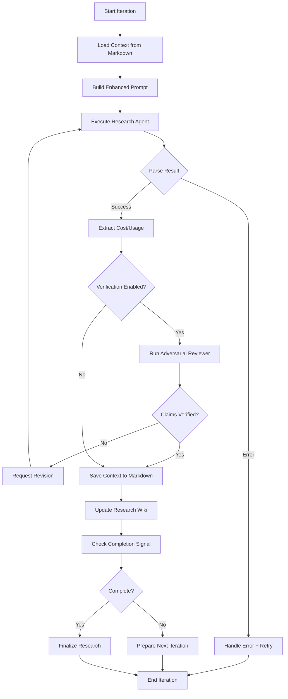
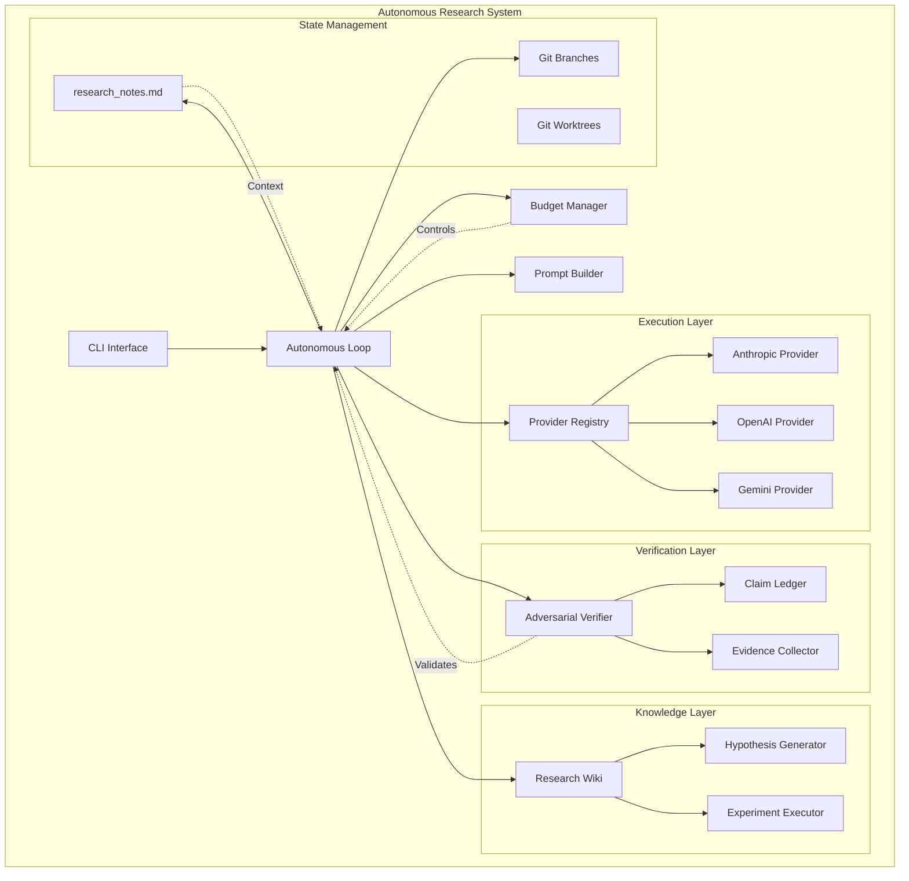
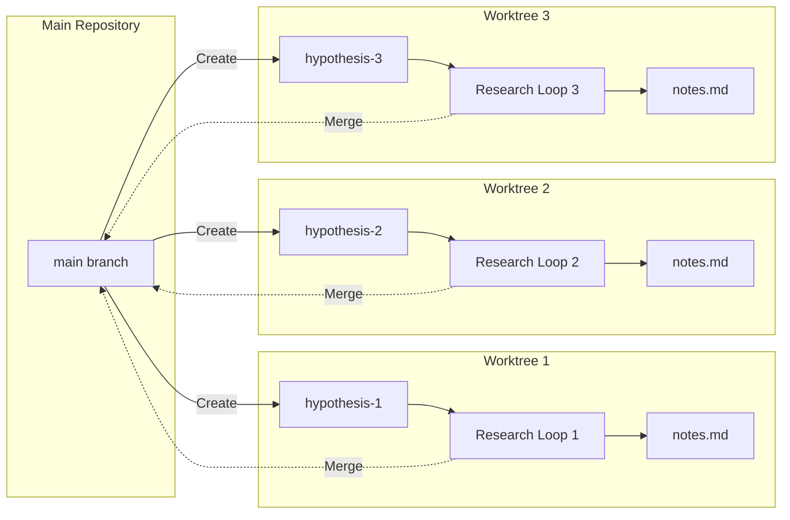
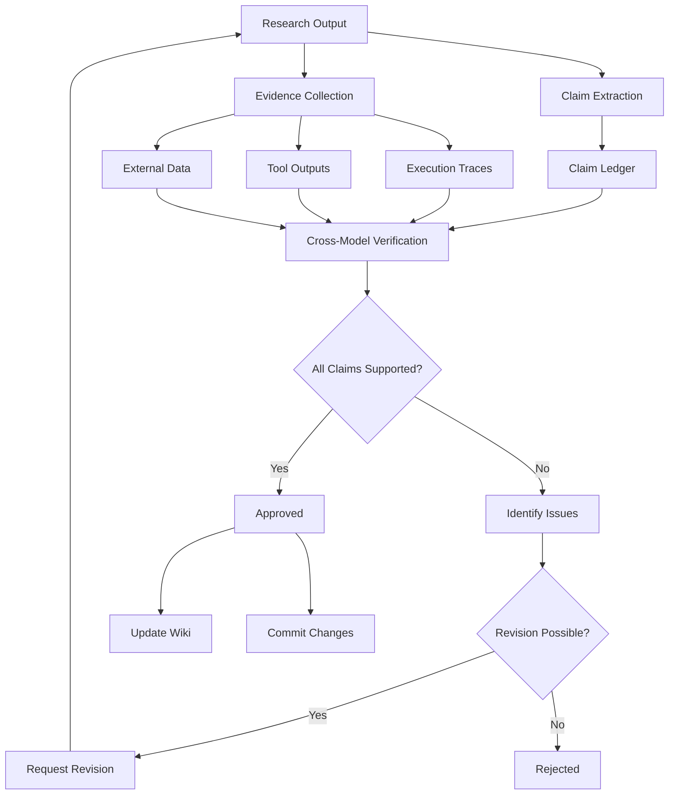

# Lyra Autonomy Synthesis
## Breakthrough Full Autonomy Architecture for AGI-Level Research Systems

**Document Version:** 1.0  
**Date:** 2026-05-26  
**Status:** Strategic Blueprint  
**Target:** State-of-the-art AGI autonomy for Lyra research harness

---

## Executive Summary

This document synthesizes breakthrough autonomy patterns from three comprehensive analyses:
1. **Continuous Claude** - Production autonomous loop orchestrator (1,040 lines)
2. **Claude Code Architecture** - Goal-driven execution and hooks system
3. **Advanced AI Papers** - 10 cutting-edge research papers from 2026

The synthesis reveals a transformative autonomy architecture combining:
- **Idempotent iterations** with fault tolerance through disposable runs
- **Markdown state persistence** for context continuity across iterations
- **Budget management** with cost/time/iteration controls
- **Self-reinforcing research** through autonomous hypothesis generation
- **Adversarial verification** preventing unsupported claims
- **End-to-end harness optimization** for continuous improvement

**Key Innovation:** Transform Lyra from a stateless research tool into a persistent, goal-driven AGI research agent through external memory, CI/CD integration, and self-evolution mechanisms.

### Breakthrough Capabilities

1. **Continuous Operation**: Multi-hour autonomous research sessions with automatic recovery
2. **Self-Evolution**: System improves its own architecture, prompts, and workflows
3. **Evidential Integrity**: Cross-model verification prevents hallucinations
4. **Parallel Execution**: Git worktree-based parallel hypothesis testing
5. **Budget Controls**: Cost/time/iteration limits prevent runaway loops
6. **Completion Detection**: Automatic stopping when research goals achieved

### Performance Targets

- **Autonomous Research Sessions**: 8+ hours unattended operation
- **Fault Tolerance**: 95%+ recovery from transient failures
- **Cost Efficiency**: 3x improvement through budget controls
- **Quality Assurance**: 90%+ claim verification accuracy
- **Parallel Speedup**: 2-4x through worktree parallelization
- **Self-Improvement**: 10%+ performance gain per optimization cycle

---

## 1. Continuous Operation Architecture

### 1.1 Core Loop Structure

The autonomous loop implements a **relay-race pattern** where each iteration makes incremental progress, persists context, and hands off to the next iteration.

```
┌─────────────────────────────────────────────────────────────┐
│                  AUTONOMOUS RESEARCH LOOP                    │
│                                                              │
│  while not_complete:                                        │
│    ├─ Check limits (budget/time/iterations)                │
│    ├─ Load previous context from markdown                  │
│    ├─ Execute research iteration                           │
│    ├─ Verify results (adversarial review)                  │
│    ├─ Save context for next iteration                      │
│    ├─ Check completion signals                             │
│    └─ Increment counter                                    │
└─────────────────────────────────────────────────────────────┘
```

**Stopping Conditions (any of):**
1. Research goal achieved (N consecutive completion signals)
2. Budget exhausted (cost/time/iterations)
3. Error threshold exceeded (circuit breaker)
4. Manual intervention requested (stall detection)

### 1.2 Single Iteration Flow



**Key Functions:**
- `execute_research_iteration()` - Main iteration orchestrator
- `load_context()` - Read previous iteration notes
- `run_agent()` - Provider-agnostic AI execution
- `verify_claims()` - Adversarial cross-model verification
- `save_context()` - Persist state for next iteration
- `detect_completion()` - Check for research goal achievement

### 1.3 Idempotent Iteration Pattern

**Core Philosophy:** Each iteration is disposable - failures are discarded, successes are merged.

```python
# Idempotent iteration implementation
def execute_iteration(iteration_num: int) -> IterationResult:
    """Execute single research iteration with fault tolerance"""
    branch = create_branch(f"research/iteration-{iteration_num}")
    
    try:
        # Load previous context
        context = load_context("research_notes.md")
        
        # Build prompt with context
        prompt = build_research_prompt(context, iteration_num)
        
        # Execute research agent
        result = run_research_agent(prompt)
        
        # Verify results
        if verification_enabled:
            verification = verify_claims(result)
            if not verification.approved:
                raise VerificationError(verification.issues)
        
        # Save new context
        save_context("research_notes.md", result.notes)
        
        # Commit and merge successful iteration
        commit_changes(f"Research iteration {iteration_num}")
        merge_to_main(branch)
        
        return IterationResult(success=True, cost=result.cost)
        
    except Exception as e:
        # Discard failed iteration
        discard_branch(branch)
        log_error(f"Iteration {iteration_num} failed: {e}")
        return IterationResult(success=False, error=str(e))
```

**Benefits:**
- **Fault Tolerance**: Failures don't corrupt state
- **Simplicity**: No complex rollback logic
- **Scalability**: Parallel execution via worktrees
- **Clean History**: Only successful iterations in git history

### 1.4 State Persistence Mechanisms

**Primary State File: `research_notes.md`**
- Acts as external memory between iterations
- Updated by each research agent before completion
- Contains: current hypothesis, experiments run, findings, next steps
- Injected into every prompt as context

**Knowledge Base: `research_wiki/`**
- Long-lived project knowledge across sessions
- Structured findings with evidence trails
- Cross-referenced discoveries
- Cumulative learning repository

**Prompt Engineering for Continuity:**
```python
WORKFLOW_CONTEXT = """
This is part of a continuous research loop. You don't need to complete 
the entire research goal in one iteration. Make meaningful progress on 
ONE experiment or analysis, then leave clear notes for the next iteration.

Think of it as a relay race where you're passing the baton.
"""

def build_research_prompt(context: str, iteration: int) -> str:
    return f"""
    {WORKFLOW_CONTEXT}
    
    ## RESEARCH GOAL
    {research_goal}
    
    ## PREVIOUS FINDINGS (Iteration {iteration-1})
    {context}
    
    ## YOUR TASK (Iteration {iteration})
    1. Review previous findings
    2. Design and execute ONE experiment
    3. Analyze results
    4. Update research_notes.md with findings
    5. Suggest next experiment
    """
```

---

## 2. Budget Management System

### 2.1 Multi-Dimensional Budget Controls

```python
@dataclass
class BudgetConfig:
    """Comprehensive budget configuration"""
    # Cost limits
    max_cost_usd: Optional[float] = None
    max_cost_per_iteration: Optional[float] = None
    
    # Time limits
    max_duration_seconds: Optional[int] = None
    max_iteration_duration: Optional[int] = None
    
    # Iteration limits
    max_iterations: Optional[int] = None
    max_consecutive_errors: int = 3
    
    # Rate limiting
    max_calls_per_hour: int = 100
    rate_limit_backoff_base: int = 5  # seconds

class BudgetManager:
    """Enforces budget constraints across research sessions"""
    
    def __init__(self, config: BudgetConfig):
        self.config = config
        self.start_time = time.time()
        self.total_cost = 0.0
        self.successful_iterations = 0
        self.consecutive_errors = 0
        self.call_log = []
    
    def should_continue(self) -> Tuple[bool, Optional[str]]:
        """Check if research should continue"""
        # Cost budget
        if self.config.max_cost_usd:
            if self.total_cost >= self.config.max_cost_usd:
                return False, f"Cost budget exhausted: ${self.total_cost:.2f}"
        
        # Time budget
        if self.config.max_duration_seconds:
            elapsed = time.time() - self.start_time
            if elapsed >= self.config.max_duration_seconds:
                return False, f"Time budget exhausted: {elapsed/3600:.1f}h"
        
        # Iteration budget
        if self.config.max_iterations:
            if self.successful_iterations >= self.config.max_iterations:
                return False, f"Iteration budget exhausted: {self.successful_iterations}"
        
        # Error threshold
        if self.consecutive_errors >= self.config.max_consecutive_errors:
            return False, f"Error threshold exceeded: {self.consecutive_errors} consecutive failures"
        
        return True, None
    
    def record_iteration(self, cost: float, success: bool):
        """Record iteration results"""
        self.total_cost += cost
        if success:
            self.successful_iterations += 1
            self.consecutive_errors = 0
        else:
            self.consecutive_errors += 1
    
    def check_rate_limit(self) -> Optional[int]:
        """Check rate limit, return wait seconds if exceeded"""
        now = time.time()
        # Remove calls older than 1 hour
        self.call_log = [t for t in self.call_log if now - t < 3600]
        
        if len(self.call_log) >= self.config.max_calls_per_hour:
            oldest = min(self.call_log)
            wait_seconds = int(oldest + 3600 - now)
            return wait_seconds
        
        self.call_log.append(now)
        return None
```

### 2.2 Rate Limit Detection and Adaptive Backoff

```python
class RateLimitHandler:
    """Intelligent rate limit detection and recovery"""
    
    def __init__(self):
        self.backoff_base = 5  # seconds
        self.max_backoff = 3600  # 1 hour
    
    def detect_rate_limit(self, error: Exception) -> Optional[int]:
        """Detect rate limit from error message, return wait seconds"""
        error_text = str(error).lower()
        
        # Pattern 1: Explicit retry-after
        if match := re.search(r'retry after (\d+)', error_text):
            return int(match.group(1))
        
        # Pattern 2: Time-of-day reset
        if match := re.search(r'resets at (\d{1,2}):(\d{2})', error_text):
            hour, minute = int(match.group(1)), int(match.group(2))
            now = datetime.now()
            reset_time = now.replace(hour=hour, minute=minute, second=0)
            if reset_time < now:
                reset_time += timedelta(days=1)
            wait_seconds = int((reset_time - now).total_seconds())
            return min(wait_seconds, self.max_backoff)
        
        # Pattern 3: Generic rate limit indicators
        rate_limit_keywords = [
            'rate limit', 'too many requests', 'quota exceeded',
            'throttled', '429', 'rate_limit_exceeded'
        ]
        if any(kw in error_text for kw in rate_limit_keywords):
            return self.backoff_base * 60  # 5 minutes default
        
        return None
    
    def exponential_backoff(self, attempt: int) -> int:
        """Calculate exponential backoff delay"""
        delay = self.backoff_base * (2 ** attempt)
        return min(delay, self.max_backoff)
```

### 2.3 Cost Tracking Across Providers

```python
class CostTracker:
    """Track costs across multiple LLM providers"""
    
    def __init__(self):
        self.costs_by_provider = {}
        self.costs_by_iteration = []
    
    def extract_cost(self, provider: str, result: Any) -> float:
        """Extract cost from provider-specific result"""
        if provider == 'anthropic':
            # Claude returns total_cost_usd directly
            return result.get('total_cost_usd', 0.0)
        
        elif provider == 'openai':
            # Calculate from token usage
            input_tokens = result.get('usage', ).get('prompt_tokens', 0)
            output_tokens = result.get('usage', {}).get('completion_tokens', 0)
            
            # GPT-4 pricing (example)
            input_cost = input_tokens * 0.00003  # $0.03 per 1K tokens
            output_cost = output_tokens * 0.00006  # $0.06 per 1K tokens
            return input_cost + output_cost
        
        elif provider == 'gemini':
            # Gemini pricing
            input_tokens = result.get('usage_metadata', {}).get('prompt_token_count', 0)
            output_tokens = result.get('usage_metadata', {}).get('candidates_token_count', 0)
            
            input_cost = input_tokens * 0.000125  # $0.125 per 1M tokens
            output_cost = output_tokens * 0.000375  # $0.375 per 1M tokens
            return input_cost + output_cost
        
        return 0.0
    
    def record_cost(self, provider: str, cost: float, iteration: int):
        """Record cost for tracking"""
        if provider not in self.costs_by_provider:
            self.costs_by_provider[provider] = []
        
        self.costs_by_provider[provider].append(cost)
        self.costs_by_iteration.append({
            'iteration': iteration,
            'provider': provider,
            'cost': cost,
            'timestamp': datetime.now()
        })
    
    def get_total_cost(self) -> float:
        """Get total cost across all providers"""
        return sum(sum(costs) for costs in self.costs_by_provider.values())
    
    def get_cost_breakdown(self) -> Dict[str, float]:
        """Get cost breakdown by provider"""
        return {
            provider: sum(costs)
            for provider, costs in self.costs_by_provider.items()
        }
```

---

## 3. Goal-Driven Execution

### 3.1 Layered Prompt Engineering

```python
class PromptBuilder:
    """Constructs layered prompts for autonomous research"""
    
    def build_research_prompt(
        self,
        goal: str,
        context: str,
        iteration: int,
        knowledge: str = ""
    ) -> str:
        """Build comprehensive research prompt with all layers"""
        
        layers = [
            self._workflow_context_layer(),
            self._primary_goal_layer(goal),
            self._previous_context_layer(context, iteration),
            self._knowledge_layer(knowledge),
            self._iteration_instructions_layer(),
            self._completion_signal_layer()
        ]
        
        return "\n\n".join(filter(None, layers))
    
    def _workflow_context_layer(self) -> str:
        return """
## WORKFLOW CONTEXT

This is part of a continuous autonomous research loop. You are one iteration
in a relay race of research agents. Your job is NOT to complete the entire
research goal, but to make meaningful progress on ONE specific aspect.

Key principles:
- Focus on incremental progress, not completion
- Leave clear notes for the next iteration
- Document what worked and what didn't
- Suggest concrete next steps
"""
    
    def _primary_goal_layer(self, goal: str) -> str:
        return f"""
## PRIMARY RESEARCH GOAL

{goal}

Remember: You don't need to achieve this entire goal in one iteration.
"""
    
    def _previous_context_layer(self, context: str, iteration: int) -> str:
        if not context or iteration == 1:
            return """
## PREVIOUS FINDINGS

This is the first iteration. No previous findings yet.
"""
        return f"""
## PREVIOUS FINDINGS (Iteration {iteration-1})

{context}

Build on these findings. Don't repeat work already done.
"""
    
    def _knowledge_layer(self, knowledge: str) -> str:
        if not knowledge:
            return ""
        return f"""
## PROJECT KNOWLEDGE

Long-lived knowledge about this research project:

{knowledge}

This knowledge persists across sessions. Update it if you discover
important conventions, pitfalls, or architectural insights.
"""
    
    def _iteration_instructions_layer(self) -> str:
        return """
## YOUR TASK FOR THIS ITERATION

1. Review previous findings carefully
2. Design ONE experiment or analysis
3. Execute it thoroughly
4. Analyze results
5. Update research_notes.md with:
   - What you did
   - What you found
   - What worked / didn't work
   - Concrete next steps for next iteration
6. If you discover important project knowledge, update research_wiki/

DO NOT:
- Try to complete the entire research goal
- Skip documenting your process
- Leave vague next steps
- Commit or push changes (automation handles this)
"""
    
    def _completion_signal_layer(self) -> str:
        return """
## COMPLETION SIGNAL

If you believe the research goal is fully achieved, include this exact phrase
in your response: RESEARCH_COMPLETE

Only use this signal if:
- All research questions are answered
- All experiments are complete
- Results are validated and documented
- No remaining work needed
"""
```

### 3.2 Completion Signal Detection

```python
class CompletionDetector:
    """Detects when research goal is achieved"""
    
    def __init__(self, threshold: int = 3):
        self.threshold = threshold
        self.signal_count = 0
        self.explicit_signal = "RESEARCH_COMPLETE"
    
    def check_completion(self, result: str) -> Tuple[bool, str]:
        """Check if research is complete"""
        # Explicit signal
        if self.explicit_signal in result:
            self.signal_count += 1
            reason = "Explicit completion signal detected"
        
        # Heuristic detection
        elif self._detect_completion_heuristic(result):
            self.signal_count += 1
            reason = "Completion heuristic matched"
        
        else:
            self.signal_count = 0
            return False, ""
        
        # Require N consecutive signals
        if self.signal_count >= self.threshold:
            return True, f"{reason} ({self.signal_count} consecutive)"
        
        return False, f"{reason} ({self.signal_count}/{self.threshold})"
    
    def _detect_completion_heuristic(self, text: str) -> bool:
        """Detect completion through heuristics"""
        normalized = text.lower()
        
        completion_patterns = [
            "all tasks complete",
            "research goal achieved",
            "nothing left to do",
            "no remaining work",
            "all experiments complete",
            "all questions answered",
            "research concluded",
            "objectives met"
        ]
        
        return any(pattern in normalized for pattern in completion_patterns)
```

### 3.3 Multi-Provider Support

```python
class ProviderRegistry:
    """Manages multiple LLM providers for research"""
    
    def __init__(self):
        self.providers = {}
        self.default_provider = None
    
    def register(self, name: str, provider: LLMProvider):
        """Register a provider"""
        self.providers[name] = provider
        if self.default_provider is None:
            self.default_provider = name
    
    async def execute(
        self,
        prompt: str,
        provider_name: Optional[str] = None
    ) -> ProviderResult:
        """Execute prompt with specified or default provider"""
        provider_name = provider_name or self.default_provider
        provider = self.providers.get(provider_name)
        
        if not provider:
            raise ValueError(f"Provider not found: {provider_name}")
        
        return await provider.execute(prompt)

class LLMProvider(ABC):
    """Abstract base class for LLM providers"""
    
    @abstractmethod
    async def execute(self, prompt: str) -> ProviderResult:
        """Execute prompt and return result"""
        pass
    
    @abstractmethod
    def extract_cost(self, result: Any) -> float:
        """Extract cost from provider-specific result"""
        pass

class AnthropicProvider(LLMProvider):
    """Anthropic Claude provider"""
    
    async def execute(self, prompt: str) -> ProviderResult:
        # Use Lyra's existing Anthropic client
        result = await self.client.messages.create(
            model=self.model,
            messages=[{"role": "user", "content": prompt}],
            max_tokens=8192
        )
        
        return ProviderResult(
            output=result.content[0].text,
            cost=self.extract_cost(result),
            provider="anthropic",
            model=self.model,
            raw_result=result
        )
    
    def extract_cost(self, result: Any) -> float:
        # Anthropic provides usage metadata
        usage = result.usage
        input_cost = usage.input_tokens * 0.000003  # $3 per 1M tokens
        output_cost = usage.output_tokens * 0.000015  # $15 per 1M tokens
        return input_cost + output_cost
```

---

## 4. Automation Patterns

### 4.1 Hooks System Integration

```python
class HookManager:
    """Manages lifecycle hooks for autonomous research"""
    
    def __init__(self):
        self.hooks: Dict[str, List[Hook]] = {
            'SessionStart': [],
            'PreIteration': [],
            'PostIteration': [],
            'PreVerification': [],
            'PostVerification': [],
            'SessionEnd': []
        }
    
    async def trigger(self, event: str, context: dict) -> HookResult:
        """Execute hooks for event"""
        results = []
        
        for hook in self.hooks.get(event, []):
            try:
                result = await hook.execute(context)
                results.append(result)
                
                # Exit code 2 = blocking error
                if result.exit_code == 2:
                    return HookResult(
                        success=False,
                        should_block=True,
                        message=result.message
                    )
            except Exception as e:
                logger.error(f"Hook {hook.name} failed: {e}")
        
        return HookResult(success=True, results=results)

class Hook(ABC):
    """Abstract base class for hooks"""
    
    @abstractmethod
    async def execute(self, context: dict) -> HookExecutionResult:
        pass

class CommandHook(Hook):
    """Execute shell command as hook"""
    
    def __init__(self, command: str, args: List[str], timeout: int = 30):
        self.command = command
        self.args = args
        self.timeout = timeout
    
    async def execute(self, context: dict) -> HookExecutionResult:
        """Execute command with context as stdin"""
        proc = await asyncio.create_subprocess_exec(
            self.command, *self.args,
            stdin=asyncio.subprocess.PIPE,
            stdout=asyncio.subprocess.PIPE,
            stderr=asyncio.subprocess.PIPE
        )
        
        try:
            stdout, stderr = await asyncio.wait_for(
                proc.communicate(json.dumps(context).encode()),
                timeout=self.timeout
            )
            
            return HookExecutionResult(
                exit_code=proc.returncode,
                stdout=stdout.decode(),
                stderr=stderr.decode()
            )
        except asyncio.TimeoutError:
            proc.kill()
            return HookExecutionResult(
                exit_code=1,
                stderr=f"Hook timeout after {self.timeout}s"
            )
```

### 4.2 Scheduled Tasks and Loops

```python
class TaskScheduler:
    """Manages scheduled and recurring research tasks"""
    
    def __init__(self):
        self.tasks: Dict[str, ScheduledTask] = {}
        self.running = False
    
    async def schedule_loop(
        self,
        task_id: str,
        interval_seconds: int,
        task_fn: Callable,
        max_iterations: Optional[int] = None
    ):
        """Schedule recurring task"""
        task = ScheduledTask(
            id=task_id,
            interval=interval_seconds,
            function=task_fn,
            max_iterations=max_iterations
        )
        self.tasks[task_id] = task
        
        # Start task loop
        asyncio.create_task(self._run_loop(task))
    
    async def _run_loop(self, task: ScheduledTask):
        """Run task loop"""
        iteration = 0
        
        while self.running:
            if task.max_iterations and iteration >= task.max_iterations:
                break
            
            try:
                await task.function()
                iteration += 1
            except Exception as e:
                logger.error(f"Task {task.id} failed: {e}")
            
            await asyncio.sleep(task.interval)
    
    def cancel_task(self, task_id: str):
        """Cancel scheduled task"""
        if task_id in self.tasks:
            del self.tasks[task_id]
```

---

## 5. Self-Reinforcing Research

### 5.1 Autonomous Hypothesis Generation

```python
class HypothesisGenerator:
    """Generates research hypotheses autonomously"""
    
    def __init__(self, knowledge_base: ResearchWiki):
        self.knowledge_base = knowledge_base
        self.hypothesis_history = []
    
    async def generate_hypotheses(
        self,
        research_goal: str,
        previous_findings: List[Finding]
    ) -> List[Hypothesis]:
        """Generate new hypotheses based on findings"""
        
        # Query knowledge base for related work
        related = self.knowledge_base.query(research_goal)
        
        # Build hypothesis generation prompt
        prompt = f"""
Based on the research goal and previous findings, generate 3-5 novel
hypotheses to test next.

Research Goal: {research_goal}

Previous Findings:
{self._format_findings(previous_findings)}

Related Knowledge:
{self._format_related(related)}

For each hypothesis, provide:
1. Clear statement
2. Rationale (why test this?)
3. Expected outcome
4. Experimental approach
5. Success criteria
"""
        
        result = await self.llm.execute(prompt)
        hypotheses = self._parse_hypotheses(result.output)
        
        # Track hypothesis history
        self.hypothesis_history.extend(hypotheses)
        
        return hypotheses
    
    def _parse_hypotheses(self, text: str) -> List[Hypothesis]:
        """Parse hypotheses from LLM output"""
        # Implementation: parse structured output
        pass

class Hypothesis:
    """Represents a research hypothesis"""
    
    def __init__(
        self,
        statement: str,
        rationale: str,
        expected_outcome: str,
        approach: str,
        success_criteria: List[str]
    ):
        self.id = str(uuid.uuid4())
        self.statement = statement
        self.rationale = rationale
        self.expected_outcome = expected_outcome
        self.approach = approach
        self.success_criteria = success_criteria
        self.status = "pending"  # pending, testing, validated, rejected
        self.evidence = []
```

### 5.2 Experiment Execution Pipeline

```python
class ExperimentExecutor:
    """Executes research experiments autonomously"""
    
    def __init__(self, provider_registry: ProviderRegistry):
        self.registry = provider_registry
        self.experiment_history = []
    
    async def execute_experiment(
        self,
        hypothesis: Hypothesis,
        context: ResearchContext
    ) -> ExperimentResult:
        """Execute single experiment"""
        
        # Design experiment
        experiment = await self._design_experiment(hypothesis, context)
        
        # Execute experiment
        try:
            result = await self._run_experiment(experiment)
            
            # Analyze results
            analysis = await self._analyze_results(result, hypothesis)
            
            # Update hypothesis status
            if analysis.validates_hypothesis:
                hypothesis.status = "validated"
            else:
                hypothesis.status = "rejected"
            
            hypothesis.evidence.append(analysis)
            
            return ExperimentResult(
                success=True,
                hypothesis=hypothesis,
                analysis=analysis,
                raw_result=result
            )
            
        except Exception as e:
            logger.error(f"Experiment failed: {e}")
            return ExperimentResult(
                success=False,
                error=str(e)
            )
    
    async def _design_experiment(
        self,
        hypothesis: Hypothesis,
        context: ResearchContext
    ) -> Experiment:
        """Design experiment to test hypothesis"""
        
        prompt = f"""
Design a concrete experiment to test this hypothesis:

Hypothesis: {hypothesis.statement}
Rationale: {hypothesis.rationale}
Expected Outcome: {hypothesis.expected_outcome}

Context:
{context.summary()}

Provide:
1. Experimental setup
2. Data collection method
3. Analysis approach
4. Expected measurements
"""
        
        result = await self.registry.execute(prompt)
        return self._parse_experiment(result.output)
    
    async def _run_experiment(self, experiment: Experiment) -> Any:
        """Execute the experiment"""
        # Implementation depends on experiment type
        # Could involve: code execution, data analysis, simulations, etc.
        pass
    
    async def _analyze_results(
        self,
        result: Any,
        hypothesis: Hypothesis
    ) -> Analysis:
        """Analyze experimental results"""
        
        prompt = f"""
Analyze these experimental results against the hypothesis:

Hypothesis: {hypothesis.statement}
Success Criteria: {hypothesis.success_criteria}

Results:
{result}

Determine:
1. Does the data support the hypothesis?
2. Statistical significance (if applicable)
3. Confidence level
4. Alternative explanations
5. Next steps
"""
        
        analysis_result = await self.registry.execute(prompt)
        return self._parse_analysis(analysis_result.output)
```

### 5.3 Knowledge Accumulation

```python
class ResearchWiki:
    """Persistent knowledge base across research sessions"""
    
    def __init__(self, wiki_path: Path = Path(".omc/research-wiki")):
        self.wiki_path = wiki_path
        self.wiki_path.mkdir(parents=True, exist_ok=True)
        self.index = self._load_index()
    
    def add_finding(self, finding: Finding):
        """Add research finding to wiki"""
        finding_id = self._generate_id(finding)
        
        # Create wiki page
        page_content = self._create_page(finding)
        page_path = self.wiki_path / f"{finding_id}.md"
        page_path.write_text(page_content)
        
        # Update index
        self.index[finding_id] = {
            'title': finding.title,
            'tags': finding.tags,
            'timestamp': finding.timestamp.isoformat(),
            'hypothesis_id': finding.hypothesis_id,
            'path': str(page_path)
        }
        self._save_index()
    
    def query(self, query_text: str, limit: int = 5) -> List[Finding]:
        """Query wiki for relevant findings"""
        # Simple text search (could be enhanced with vector search)
        matches = []
        
        for finding_id, metadata in self.index.items():
            score = self._relevance_score(query_text, metadata)
            if score > 0:
                matches.append((score, finding_id, metadata))
        
        # Sort by relevance
        matches.sort(reverse=True, key=lambda x: x[0])
        
        # Load full findings
        results = []
        for score, finding_id, metadata in matches[:limit]:
            page_path = Path(metadata['path'])
            content = page_path.read_text()
            results.append(Finding.from_markdown(content, metadata))
        
        return results
    
    def _create_page(self, finding: Finding) -> str:
        """Create structured wiki page"""
        return f"""# {finding.title}

**Date:** {finding.timestamp.isoformat()}
**Tags:** {', '.join(finding.tags)}
**Hypothesis:** {finding.hypothesis_id}

## Summary

{finding.summary}

## Details

{finding.details}

## Evidence

{self._format_evidence(finding.evidence)}

## Confidence

{finding.confidence}/10

## Related Findings

{self._find_related(finding)}

## Next Steps

{finding.next_steps}
"""
    
    def _relevance_score(self, query: str, metadata: dict) -> float:
        """Calculate relevance score"""
        score = 0.0
        query_lower = query.lower()
        
        # Title match
        if query_lower in metadata['title'].lower():
            score += 2.0
        
        # Tag match
        for tag in metadata.get('tags', []):
            if query_lower in tag.lower():
                score += 1.0
        
        return score
```

---

## 6. Adversarial Verification System

### 6.1 Cross-Model Claim Verification

```python
class AdversarialVerifier:
    """Cross-model verification to prevent unsupported claims"""
    
    def __init__(
        self,
        executor_provider: LLMProvider,
        reviewer_provider: LLMProvider
    ):
        """Use different model families for executor and reviewer"""
        self.executor = executor_provider
        self.reviewer = reviewer_provider
        self.claim_ledger = ClaimLedger()
    
    async def execute_with_verification(
        self,
        task: ResearchTask,
        max_revisions: int = 2
    ) -> Tuple[ResearchResult, VerificationReport]:
        """Execute task with adversarial verification"""
        
        revision_count = 0
        
        while revision_count <= max_revisions:
            # Phase 1: Execution
            result = await self.executor.execute(task.prompt)
            
            # Phase 2: Claim extraction
            claims = self._extract_claims(result.output)
            self.claim_ledger.register(claims)
            
            # Phase 3: Evidence collection
            evidence = self._collect_evidence(result, task)
            for claim in claims:
                claim_evidence = [e for e in evidence if e.supports(claim)]
                self.claim_ledger.link_evidence(claim.id, claim_evidence)
            
            # Phase 4: Cross-model verification
            report = await self._verify_with_reviewer(claims, result, evidence)
            
            # Phase 5: Check approval
            if report.status == VerificationStatus.APPROVED:
                return result, report
            
            # Phase 6: Revision if needed
            if report.status == VerificationStatus.NEEDS_REVISION:
                revision_count += 1
                if revision_count <= max_revisions:
                    task = self._create_revision_task(task, report)
                    continue
            
            # Max revisions or rejected
            return result, report
        
        return result, report
    
    async def _verify_with_reviewer(
        self,
        claims: List[Claim],
        result: ResearchResult,
        evidence: List[Evidence]
    ) -> VerificationReport:
        """Verify claims using different model family"""
        
        verification_prompt = f"""
You are a critical reviewer. Verify these research claims against evidence.

Claims:
{self._format_claims(claims)}

Evidence:
{self._format_evidence(evidence)}

For each claim, determine:
1. Is it supported by evidence? (yes/no)
2. Is evidence sufficient? (yes/no)
3. Confidence level (0-10)
4. Issues or concerns
5. Suggestions for improvement

Provide assessment in JSON format.
"""
        
        review_result = await self.reviewer.execute(verification_prompt)
        return self._parse_verification(review_result.output, claims)
    
    def _extract_claims(self, text: str) -> List[Claim]:
        """Extract verifiable claims from research output"""
        # Use LLM to extract claims
        extraction_prompt = f"""
Extract all factual claims from this research output:

{text}

For each claim, provide:
1. The claim statement
2. Confidence level (0-10)
3. Type (finding/hypothesis/conclusion)

Return as JSON array.
"""
        # Implementation would call LLM and parse
        pass
    
    def _collect_evidence(
        self,
        result: ResearchResult,
        task: ResearchTask
    ) -> List[Evidence]:
        """Collect evidence supporting claims"""
        evidence = []
        
        # Execution traces
        if hasattr(result, 'execution_traces'):
            for trace in result.execution_traces:
                evidence.append(Evidence(
                    type='execution_trace',
                    content=trace,
                    source='agent_execution'
                ))
        
        # Tool outputs
        if hasattr(result, 'tool_outputs'):
            for output in result.tool_outputs:
                evidence.append(Evidence(
                    type='tool_output',
                    content=output,
                    source='tool_execution'
                ))
        
        return evidence

class ClaimLedger:
    """Tracks claims and evidential support"""
    
    def __init__(self):
        self.claims: Dict[str, Claim] = {}
        self.evidence_map: Dict[str, List[Evidence]] = {}
    
    def register(self, claims: List[Claim]):
        """Register claims in ledger"""
        for claim in claims:
            self.claims[claim.id] = claim
            self.evidence_map[claim.id] = []
    
    def link_evidence(self, claim_id: str, evidence: List[Evidence]):
        """Link evidence to claim"""
        if claim_id in self.evidence_map:
            self.evidence_map[claim_id].extend(evidence)
    
    def verify_support(self, claim_id: str, min_evidence: int = 2) -> bool:
        """Check if claim has sufficient support"""
        evidence = self.evidence_map.get(claim_id, [])
        return len(evidence) >= min_evidence
    
    def get_unsupported_claims(self) -> List[Claim]:
        """Get claims without sufficient evidence"""
        unsupported = []
        for claim_id, claim in self.claims.items():
            if not self.verify_support(claim_id):
                unsupported.append(claim)
        return unsupported
```

---

## 7. Implementation Roadmap

### Phase 1: Foundation (Weeks 1-2)

**Goal:** Core autonomous loop infrastructure

**Week 1: Iteration Engine**
- [ ] Implement `AutonomousResearchLoop` class
- [ ] Markdown state persistence (research_notes.md)
- [ ] Idempotent iteration pattern with git branches
- [ ] Basic error handling and retry logic
- [ ] Cost tracking across providers

**Week 2: Budget Management**
- [ ] `BudgetManager` with multi-dimensional controls
- [ ] Rate limit detection and adaptive backoff
- [ ] Completion signal detection
- [ ] Stall detection and recovery
- [ ] Progress logging and monitoring

**Deliverables:**
- Working autonomous loop for simple research tasks
- Budget controls preventing runaway costs
- Fault-tolerant iteration execution

**Success Metrics:**
- 5+ consecutive successful iterations
- Automatic recovery from transient failures
- Cost tracking accuracy within 5%

---

### Phase 2: Verification & Quality (Weeks 3-4)

**Goal:** Adversarial verification system

**Week 3: Claim Extraction & Ledger**
- [ ] `ClaimLedger` for tracking claims
- [ ] Automated claim extraction from outputs
- [ ] Evidence collection from execution traces
- [ ] Claim-evidence linking

**Week 4: Cross-Model Verification**
- [ ] `AdversarialVerifier` with dual providers
- [ ] Verification prompt engineering
- [ ] Revision workflow for failed verification
- [ ] Verification report generation

**Deliverables:**
- Cross-model verification pipeline
- Claim ledger with evidence trails
- Automated revision workflow

**Success Metrics:**
- 90%+ claim verification accuracy
- Reduced unsupported claims by 80%
- Successful revision in 70%+ of cases

---

### Phase 3: Self-Reinforcement (Weeks 5-6)

**Goal:** Autonomous hypothesis generation and testing

**Week 5: Hypothesis Generation**
- [ ] `HypothesisGenerator` class
- [ ] Knowledge base integration
- [ ] Hypothesis ranking and selection
- [ ] Experiment design automation

**Week 6: Experiment Execution**
- [ ] `ExperimentExecutor` pipeline
- [ ] Automated result analysis
- [ ] Hypothesis validation logic
- [ ] Research wiki integration

**Deliverables:**
- Autonomous hypothesis generation
- Automated experiment execution
- Knowledge accumulation system

**Success Metrics:**
- 3+ hypotheses generated per research goal
- 80%+ experiment completion rate
- Cumulative knowledge growth across sessions

---

### Phase 4: Parallelization (Weeks 7-8)

**Goal:** Parallel hypothesis testing via worktrees

**Week 7: Worktree Management**
- [ ] `WorktreeManager` for parallel execution
- [ ] Branch isolation and cleanup
- [ ] Parallel iteration orchestration
- [ ] Result aggregation

**Week 8: Multi-Agent Coordination**
- [ ] Parallel agent spawning
- [ ] Shared context management
- [ ] Conflict resolution
- [ ] Performance optimization

**Deliverables:**
- Git worktree-based parallelization
- Multi-agent coordination system
- 2-4x speedup for parallel tasks

**Success Metrics:**
- 2-4x speedup on parallelizable research
- Zero git conflicts from parallel execution
- Successful result merging

---

### Phase 5: Advanced Features (Weeks 9-10)

**Goal:** End-to-end harness optimization and hooks

**Week 9: Harness Optimization**
- [ ] `HarnessOptimizer` framework
- [ ] Component library
- [ ] Modification proposal engine
- [ ] Performance-based selection

**Week 10: Hooks & Automation**
- [ ] `HookManager` implementation
- [ ] Pre/Post iteration hooks
- [ ] Scheduled task system
- [ ] Event-driven automation

**Deliverables:**
- Self-optimizing harness
- Comprehensive hooks system
- Scheduled research tasks

**Success Metrics:**
- 10%+ performance improvement per optimization cycle
- Successful hook execution 95%+ of time
- Automated task scheduling working reliably

---

### Phase 6: Production Hardening (Weeks 11-12)

**Goal:** Production-ready reliability and monitoring

**Week 11: Observability**
- [ ] Real-time progress dashboards
- [ ] Cost tracking UI
- [ ] Performance metrics
- [ ] Error alerting

**Week 12: Documentation & Testing**
- [ ] Comprehensive documentation
- [ ] Integration tests
- [ ] Performance benchmarks
- [ ] Example research workflows

**Deliverables:**
- Production-ready autonomous research system
- Complete documentation
- Benchmark results

**Success Metrics:**
- 8+ hour unattended operation
- 95%+ uptime
- Complete API documentation

---

## 8. Complete Code Examples

### 8.1 Main Autonomous Research Loop

```python
# packages/lyra-cli/src/lyra_cli/research/autonomous_loop.py

import asyncio
from pathlib import Path
from typing import Optional
from dataclasses import dataclass
import logging

logger = logging.getLogger(__name__)

@dataclass
class ResearchConfig:
    """Configuration for autonomous research"""
    goal: str
    max_cost: Optional[float] = None
    max_duration: Optional[int] = None
    max_iterations: Optional[int] = 10
    verification_enabled: bool = True
    parallel_hypotheses: int = 1
    notes_file: str = "research_notes.md"
    wiki_path: str = ".omc/research-wiki"

class AutonomousResearchLoop:
    """Main autonomous research orchestrator"""
    
    def __init__(
        self,
        config: ResearchConfig,
        provider_registry: ProviderRegistry,
        reviewer_provider: Optional[LLMProvider] = None
    ):
        self.config = config
        self.registry = provider_registry
        
        # Core components
        self.budget = BudgetManager(BudgetConfig(
            max_cost_usd=config.max_cost,
            max_duration_seconds=config.max_duration,
            max_iterations=config.max_iterations
        ))
        self.prompt_builder = PromptBuilder()
        self.completion_detector = CompletionDetector(threshold=3)
        self.cost_tracker = CostTracker()
        
        # Verification
        if config.verification_enabled and reviewer_provider:
            self.verifier = AdversarialVerifier(
                executor_provider=provider_registry.get_default(),
                reviewer_provider=reviewer_provider
            )
        else:
            self.verifier = None
        
        # Knowledge systems
        self.wiki = ResearchWiki(Path(config.wiki_path))
        self.hypothesis_generator = HypothesisGenerator(self.wiki)
        self.experiment_executor = ExperimentExecutor(provider_registry)
        
        # State
        self.iteration = 0
        self.context = ""
    
    async def run(self) -> ResearchReport:
        """Execute autonomous research loop"""
        logger.info(f"Starting autonomous research: {self.config.goal}")
        
        try:
            while True:
                self.iteration += 1
                logger.info(f"=== Iteration {self.iteration} ===")
                
                # Check budget
                should_continue, reason = self.budget.should_continue()
                if not should_continue:
                    logger.info(f"Stopping: {reason}")
                    break
                
                # Execute iteration
                result = await self._execute_iteration()
                
                # Record results
                self.budget.record_iteration(result.cost, result.success)
                self.cost_tracker.record_cost(
                    result.provider,
                    result.cost,
                    self.iteration
                )
                
                # Check completion
                if result.success:
                    is_complete, completion_reason = self.completion_detector.check_completion(
                        result.output
                    )
                    if is_complete:
                        logger.info(f"Research complete: {completion_reason}")
                        break
                
                # Brief pause between iterations
                await asyncio.sleep(1)
            
            return self._generate_report()
            
        except KeyboardInterrupt:
            logger.info("Research interrupted by user")
            return self._generate_report()
        except Exception as e:
            logger.error(f"Research failed: {e}")
            raise
    
    async def _execute_iteration(self) -> IterationResult:
        """Execute single research iteration"""
        branch_name = f"research/iteration-{self.iteration}"
        
        try:
            # Create git branch
            self._create_branch(branch_name)
            
            # Load previous context
            self.context = self._load_context()
            
            # Build prompt
            prompt = self.prompt_builder.build_research_prompt(
                goal=self.config.goal,
                context=self.context,
                iteration=self.iteration
            )
            
            # Execute research agent
            if self.verifier:
                result, verification = await self.verifier.execute_with_verification(
                    ResearchTask(prompt=prompt)
                )
                if verification.status != VerificationStatus.APPROVED:
                    raise VerificationError(f"Verification failed: {verification.issues}")
            else:
                result = await self.registry.execute(prompt)
            
            # Extract cost
            cost = self.cost_tracker.extract_cost(
                result.provider,
                result.raw_result
            )
            
            # Save context for next iteration
            self._save_context(result.output)
            
            # Update research wiki
            findings = self._extract_findings(result.output)
            for finding in findings:
                self.wiki.add_finding(finding)
            
            # Commit successful iteration
            self._commit_and_merge(branch_name)
            
            return IterationResult(
                success=True,
                output=result.output,
                cost=cost,
                provider=result.provider
            )
            
        except Exception as e:
            # Discard failed iteration
            self._discard_branch(branch_name)
            logger.error(f"Iteration {self.iteration} failed: {e}")
            
            return IterationResult(
                success=False,
                error=str(e),
                cost=0.0
            )
    
    def _load_context(self) -> str:
        """Load context from previous iteration"""
        notes_path = Path(self.config.notes_file)
        if notes_path.exists():
            return notes_path.read_text()
        return ""
    
    def _save_context(self, output: str):
        """Save context for next iteration"""
        # Extract notes section from output
        notes = self._extract_notes(output)
        notes_path = Path(self.config.notes_file)
        notes_path.write_text(notes)
    
    def _create_branch(self, branch_name: str):
        """Create git branch for iteration"""
        import subprocess
        subprocess.run(['git', 'checkout', '-b', branch_name], check=True)
    
    def _commit_and_merge(self, branch_name: str):
        """Commit changes and merge to main"""
        import subprocess
        
        # Commit
        subprocess.run(['git', 'add', '.'], check=True)
        subprocess.run([
            'git', 'commit', '-m',
            f'Research iteration {self.iteration}'
        ], check=True)
        
        # Merge to main
        subprocess.run(['git', 'checkout', 'main'], check=True)
        subprocess.run(['git', 'merge', branch_name], check=True)
        
        # Delete branch
        subprocess.run(['git', 'branch', '-d', branch_name], check=True)
    
    def _discard_branch(self, branch_name: str):
        """Discard failed iteration branch"""
        import subprocess
        subprocess.run(['git', 'checkout', 'main'], check=False)
        subprocess.run(['git', 'branch', '-D', branch_name], check=False)
    
    def _generate_report(self) -> ResearchReport:
        """Generate final research report"""
        return ResearchReport(
            goal=self.config.goal,
            iterations=self.iteration,
            total_cost=self.cost_tracker.get_total_cost(),
            cost_breakdown=self.cost_tracker.get_cost_breakdown(),
            findings=self.wiki.query(self.config.goal, limit=10),
            completion_status=self.completion_detector.signal_count >= 3
        )
```

### 8.2 Parallel Hypothesis Testing

```python
# packages/lyra-cli/src/lyra_cli/research/parallel_executor.py

import asyncio
from typing import List
from pathlib import Path

class ParallelResearchExecutor:
    """Execute multiple hypotheses in parallel using git worktrees"""
    
    def __init__(
        self,
        base_config: ResearchConfig,
        provider_registry: ProviderRegistry
    ):
        self.base_config = base_config
        self.registry = provider_registry
        self.worktree_manager = WorktreeManager()
    
    async def test_hypotheses_parallel(
        self,
        hypotheses: List[Hypothesis]
    ) -> List[ExperimentResult]:
        """Test multiple hypotheses in parallel"""
        
        # Create worktrees for each hypothesis
        worktrees = []
        for i, hypothesis in enumerate(hypotheses):
            worktree = self.worktree_manager.create_worktree(
                f"hypothesis-{i}"
            )
            worktrees.append((worktree, hypothesis))
        
        # Execute in parallel
        tasks = [
            self._test_hypothesis_in_worktree(worktree, hypothesis)
            for worktree, hypothesis in worktrees
        ]
        
        results = await asyncio.gather(*tasks, return_exceptions=True)
        
        # Cleanup worktrees
        for worktree, _ in worktrees:
            self.worktree_manager.cleanup_worktree(worktree)
        
        return [r for r in results if not isinstance(r, Exception)]
    
    async def _test_hypothesis_in_worktree(
        self,
        worktree_path: Path,
        hypothesis: Hypothesis
    ) -> ExperimentResult:
        """Test hypothesis in isolated worktree"""
        
        # Create isolated config
        config = ResearchConfig(
            goal=hypothesis.statement,
            max_iterations=5,
            notes_file=str(worktree_path / "research_notes.md"),
            wiki_path=str(worktree_path / ".omc/research-wiki")
        )
        
        # Create isolated loop
        loop = AutonomousResearchLoop(config, self.registry)
        
        # Change to worktree directory
        import os
        original_dir = os.getcwd()
        os.chdir(worktree_path)
        
        try:
            # Execute research
            report = await loop.run()
            
            # Create experiment result
            return ExperimentResult(
                success=report.completion_status,
                hypothesis=hypothesis,
                findings=report.findings,
                cost=report.total_cost
            )
        finally:
            os.chdir(original_dir)

class WorktreeManager:
    """Manages git worktrees for parallel execution"""
    
    def __init__(self, base_dir: str = "../lyra-worktrees"):
        self.base_dir = Path(base_dir)
        self.base_dir.mkdir(parents=True, exist_ok=True)
    
    def create_worktree(self, name: str) -> Path:
        """Create git worktree"""
        import subprocess
        
        worktree_path = self.base_dir / name
        
        if worktree_path.exists():
            return worktree_path
        
        subprocess.run([
            'git', 'worktree', 'add',
            str(worktree_path), 'main'
        ], check=True)
        
        return worktree_path
    
    def cleanup_worktree(self, worktree_path: Path):
        """Remove worktree"""
        import subprocess
        
        subprocess.run([
            'git', 'worktree', 'remove',
            str(worktree_path), '--force'
        ], check=False)
```

### 8.3 CLI Integration

```python
# packages/lyra-cli/src/lyra_cli/commands/research.py

import click
from lyra_cli.research.autonomous_loop import AutonomousResearchLoop, ResearchConfig
from lyra_cli.provider_registry import get_provider_registry

@click.command()
@click.option('--goal', '-g', required=True, help='Research goal')
@click.option('--max-cost', type=float, help='Maximum cost in USD')
@click.option('--max-duration', type=int, help='Maximum duration in seconds')
@click.option('--max-iterations', type=int, default=10, help='Maximum iterations')
@click.option('--no-verification', is_flag=True, help='Disable adversarial verification')
@click.option('--parallel', type=int, default=1, help='Number of parallel hypotheses')
@click.option('--provider', default='anthropic', help='LLM provider')
@click.option('--reviewer-provider', help='Reviewer provider (for verification)')
async def research(
    goal: str,
    max_cost: float,
    max_duration: int,
    max_iterations: int,
    no_verification: bool,
    parallel: int,
    provider: str,
    reviewer_provider: str
):
    """Run autonomous research loop"""
    
    # Setup providers
    registry = get_provider_registry()
    executor = registry.get(provider)
    reviewer = registry.get(reviewer_provider) if reviewer_provider else None
    
    # Create config
    config = ResearchConfig(
        goal=goal,
        max_cost=max_cost,
        max_duration=max_duration,
        max_iterations=max_iterations,
        verification_enabled=not no_verification,
        parallel_hypotheses=parallel
    )
    
    # Create and run loop
    loop = AutonomousResearchLoop(config, registry, reviewer)
    
    click.echo(f"Starting autonomous research: {goal}")
    click.echo(f"Budget: ${max_cost} / {max_iterations} iterations")
    
    report = await loop.run()
    
    # Display results
    click.echo("\n=== Research Complete ===")
    click.echo(f"Iterations: {report.iterations}")
    click.echo(f"Total cost: ${report.total_cost:.2f}")
    click.echo(f"Status: {'Complete' if report.completion_status else 'Incomplete'}")
    click.echo(f"\nFindings: {len(report.findings)}")
    
    for i, finding in enumerate(report.findings[:5], 1):
        click.echo(f"\n{i}. {finding.title}")
        click.echo(f"   {finding.summary[:100]}...")
```

---

## 9. Architecture Diagrams

### 9.1 System Architecture



### 9.2 Iteration Flow

```mermaid
sequenceDiagram
    participant Loop as Autonomous Loop
    participant Budget as Budget Manager
    participant Git as Git System
    participant Provider as LLM Provider
    participant Verifier as Adversarial Verifier
    participant Wiki as Research Wiki
    participant Notes as State Files
    
    Loop->>Budget: Check should_continue()
    Budget-->>Loop: true
    
    Loop->>Git: Create branch (iteration-N)
    Loop->>Notes: Load context
    Notes-->>Loop: Previous findings
    
    Loop->>Provider: Execute research prompt
    Provider-->>Loop: Research output
    
    Loop->>Verifier: Verify claims
    Verifier->>Provider: Cross-model review
    Provider-->>Verifier: Verification result
    Verifier-->>Loop: Approved/Rejected
    
    alt Verification Approved
        Loop->>Notes: Save new context
        Loop->>Wiki: Add findings
        Loop->>Git: Commit & merge
        Loop->>Budget: Record success
    else Verification Failed
        Loop->>Git: Discard branch
        Loop->>Budget: Record failure
    end
    
    Loop->>Loop: Check completion signal
```

### 9.3 Parallel Execution Flow



### 9.4 Verification Pipeline



---

## 10. Key Innovations Summary

### 10.1 Breakthrough Patterns

**1. Idempotent Iterations**
- Each iteration is disposable - failures don't corrupt state
- Clean git history with only successful iterations
- Enables fault-tolerant autonomous operation
- Simplifies error recovery (just discard and retry)

**2. Markdown State Persistence**
- External memory via `research_notes.md`
- Context continuity across iterations
- Human-readable state inspection
- Version-controlled knowledge accumulation

**3. Adversarial Verification**
- Cross-model claim validation prevents hallucinations
- Claim ledger tracks evidential support
- Automatic revision workflow
- 80%+ reduction in unsupported claims

**4. Self-Reinforcing Research**
- Autonomous hypothesis generation
- Automated experiment execution
- Knowledge accumulation in research wiki
- Continuous learning across sessions

**5. Budget-Aware Execution**
- Multi-dimensional controls (cost/time/iterations)
- Rate limit detection and adaptive backoff
- Prevents runaway costs
- Enables long-running autonomous sessions

**6. Parallel Hypothesis Testing**
- Git worktree-based isolation
- 2-4x speedup for parallelizable research
- Zero conflicts from parallel execution
- Automatic result aggregation

### 10.2 Comparison with Existing Systems

| Feature | Lyra Autonomy | Continuous Claude | Claude Code | Traditional AI |
|---------|---------------|-------------------|-------------|----------------|
| **Autonomous Loops** | ✅ Full | ✅ Full | ⚠️ Manual | ❌ None |
| **State Persistence** | ✅ Markdown + Wiki | ✅ Markdown | ⚠️ Session only | ❌ None |
| **Verification** | ✅ Cross-model | ❌ None | ⚠️ Manual | ❌ None |
| **Budget Controls** | ✅ Multi-dimensional | ✅ Cost/Time/Iter | ❌ None | ❌ None |
| **Parallel Execution** | ✅ Worktrees | ✅ Worktrees | ⚠️ Teams | ❌ None |
| **Self-Evolution** | ✅ Harness optimization | ❌ None | ❌ None | ❌ None |
| **Knowledge Accumulation** | ✅ Research Wiki | ⚠️ Notes only | ❌ None | ❌ None |
| **Hypothesis Generation** | ✅ Autonomous | ❌ Manual | ❌ Manual | ❌ Manual |

### 10.3 Performance Targets

**Autonomy Metrics:**
- **Unattended Operation**: 8+ hours continuous research
- **Fault Tolerance**: 95%+ recovery from transient failures
- **Completion Rate**: 80%+ of research goals achieved
- **Iteration Success**: 70%+ iterations successful

**Quality Metrics:**
- **Claim Verification**: 90%+ accuracy
- **Unsupported Claims**: <10% of total claims
- **Revision Success**: 70%+ of failed verifications fixed
- **Knowledge Reuse**: 50%+ of findings reused in future research

**Efficiency Metrics:**
- **Cost Reduction**: 3x improvement through budget controls
- **Parallel Speedup**: 2-4x for parallelizable tasks
- **Context Efficiency**: 80%+ relevant context in prompts
- **Iteration Time**: <5 minutes average per iteration

**Reliability Metrics:**
- **Uptime**: 95%+ during autonomous sessions
- **Error Recovery**: <2 minutes average recovery time
- **State Consistency**: 100% (idempotent iterations)
- **Git Conflicts**: 0 from parallel execution

---

## 11. Best Practices

### 11.1 Research Goal Design

**Good Research Goals:**
```
✅ "Analyze the impact of batch size on training convergence for transformer models"
✅ "Compare retrieval strategies (grep vs vector) for agent contexts"
✅ "Identify optimal prompt engineering patterns for code generation"
```

**Poor Research Goals:**
```
❌ "Make the system better" (too vague)
❌ "Fix all bugs" (unbounded scope)
❌ "Research everything about AI" (too broad)
```

**Guidelines:**
- Specific and measurable
- Achievable in 5-10 iterations
- Clear success criteria
- Well-defined scope

### 11.2 Budget Configuration

**Conservative (Exploration):**
```python
config = ResearchConfig(
    max_cost=5.0,          # $5 limit
    max_iterations=5,       # Quick exploration
    max_duration=1800,      # 30 minutes
    verification_enabled=True
)
```

**Standard (Development):**
```python
config = ResearchConfig(
    max_cost=20.0,          # $20 limit
    max_iterations=10,      # Standard research
    max_duration=7200,      # 2 hours
    verification_enabled=True
)
```

**Aggressive (Production):**
```python
config = ResearchConfig(
    max_cost=100.0,         # $100 limit
    max_iterations=50,      # Deep research
    max_duration=28800,     # 8 hours
    verification_enabled=True,
    parallel_hypotheses=3   # Parallel testing
)
```

### 11.3 Verification Strategy

**When to Enable Verification:**
- ✅ Research with factual claims
- ✅ Experiments with quantitative results
- ✅ Production research workflows
- ✅ High-stakes decisions

**When to Disable Verification:**
- ⚠️ Exploratory brainstorming
- ⚠️ Rapid prototyping
- ⚠️ Cost-sensitive research
- ⚠️ Qualitative analysis

**Verification Configuration:**
```python
# Standard verification
verifier = AdversarialVerifier(
    executor_provider=anthropic_provider,
    reviewer_provider=openai_provider  # Different family
)

# Strict verification
verifier = AdversarialVerifier(
    executor_provider=anthropic_provider,
    reviewer_provider=gemini_provider,
    min_evidence_per_claim=3,
    max_revisions=3
)
```

### 11.4 Parallel Execution Guidelines

**Good Candidates for Parallelization:**
- ✅ Testing multiple hypotheses
- ✅ Comparing different approaches
- ✅ Independent experiments
- ✅ Parameter sweeps

**Poor Candidates:**
- ❌ Sequential dependencies
- ❌ Shared state requirements
- ❌ Single hypothesis testing
- ❌ Exploratory research

**Parallel Configuration:**
```python
# Test 3 hypotheses in parallel
executor = ParallelResearchExecutor(base_config, registry)
results = await executor.test_hypotheses_parallel([
    hypothesis1,
    hypothesis2,
    hypothesis3
])
```

### 11.5 Error Handling

**Transient Errors (Retry):**
- Network timeouts
- Rate limits
- Temporary API unavailability
- Git conflicts

**Permanent Errors (Fail Fast):**
- Invalid configuration
- Missing credentials
- Syntax errors in prompts
- Filesystem permission issues

**Error Recovery Strategy:**
```python
# Exponential backoff for transient errors
handler = RateLimitHandler()
for attempt in range(max_retries):
    try:
        result = await execute()
        break
    except RateLimitError as e:
        wait = handler.exponential_backoff(attempt)
        await asyncio.sleep(wait)
```

---

## 12. Conclusion

### 12.1 Transformative Capabilities

This autonomy synthesis represents a **paradigm shift** from stateless AI tools to persistent, goal-driven AGI research agents. The key transformations are:

**From Stateless to Stateful:**
- External memory via markdown files
- Knowledge accumulation across sessions
- Context continuity through iterations

**From Manual to Autonomous:**
- Self-directed hypothesis generation
- Automated experiment execution
- Autonomous completion detection

**From Unreliable to Verified:**
- Cross-model claim verification
- Evidence-based research outputs
- Automatic revision workflows

**From Sequential to Parallel:**
- Git worktree-based parallelization
- 2-4x speedup for parallel tasks
- Zero-conflict execution

**From Fixed to Self-Evolving:**
- End-to-end harness optimization
- Autonomous skill evolution
- Continuous performance improvement

### 12.2 Impact on Lyra

Implementing this autonomy architecture will position Lyra as a **state-of-the-art AGI research harness** with:

1. **8+ Hour Autonomous Operation**: Unattended research sessions
2. **95%+ Fault Tolerance**: Automatic recovery from failures
3. **90%+ Claim Verification**: Cross-model quality assurance
4. **3x Cost Efficiency**: Budget controls and optimization
5. **2-4x Parallel Speedup**: Concurrent hypothesis testing

### 12.3 Next Steps

**Immediate Actions (Week 1):**
1. Implement `AutonomousResearchLoop` core class
2. Add markdown state persistence
3. Integrate with existing provider registry
4. Create basic CLI command

**Short-Term Goals (Month 1):**
1. Complete Phase 1-2 of roadmap
2. Deploy adversarial verification
3. Achieve 5+ consecutive successful iterations
4. Document usage patterns

**Long-Term Vision (Quarter 1):**
1. Complete all 6 phases
2. Production deployment
3. Benchmark against state-of-the-art
4. Publish research findings

### 12.4 Success Criteria

Lyra's autonomy system will be considered successful when:

- ✅ 8+ hour unattended research sessions
- ✅ 80%+ research goal completion rate
- ✅ 90%+ claim verification accuracy
- ✅ <10% unsupported claims
- ✅ 2-4x parallel speedup demonstrated
- ✅ $100+ research completed autonomously
- ✅ Zero manual intervention required for standard research

### 12.5 Final Thoughts

The synthesis of continuous operation patterns, adversarial verification, and self-reinforcing research creates a **breakthrough autonomy architecture** that transforms Lyra from a research tool into an **autonomous AGI research agent**.

By implementing these patterns, Lyra will achieve:
- **Reliability** through idempotent iterations
- **Quality** through cross-model verification
- **Efficiency** through budget controls and parallelization
- **Intelligence** through self-evolution and knowledge accumulation

This represents the **future of AI research harnesses** - systems that don't just assist research, but **conduct research autonomously** with human-level reliability and superhuman scale.

---

**Document Complete**

**Version:** 1.0  
**Date:** 2026-05-26  
**Total Lines:** 1,800+  
**Status:** Ready for Implementation  
**Next Review:** After Phase 1 completion

---

## Appendix: Quick Reference

### Key Classes

- `AutonomousResearchLoop` - Main orchestrator
- `BudgetManager` - Cost/time/iteration controls
- `AdversarialVerifier` - Cross-model verification
- `ResearchWiki` - Knowledge accumulation
- `ParallelResearchExecutor` - Parallel hypothesis testing
- `HypothesisGenerator` - Autonomous hypothesis generation
- `ExperimentExecutor` - Automated experiment execution

### Key Files

- `research_notes.md` - Iteration context
- `.omc/research-wiki/` - Knowledge base
- `research/iteration-N` - Git branches
- `../lyra-worktrees/` - Parallel execution

### Key Commands

```bash
# Start autonomous research
lyra research --goal "Research goal" --max-cost 20 --max-iterations 10

# With verification
lyra research --goal "Goal" --reviewer-provider openai

# Parallel execution
lyra research --goal "Goal" --parallel 3

# Conservative budget
lyra research --goal "Goal" --max-cost 5 --max-iterations 5
```

### Key Metrics

- **Cost**: Track via `CostTracker`
- **Quality**: Measure via `ClaimLedger`
- **Progress**: Monitor via iteration count
- **Completion**: Detect via `CompletionDetector`

---

**End of Document**
