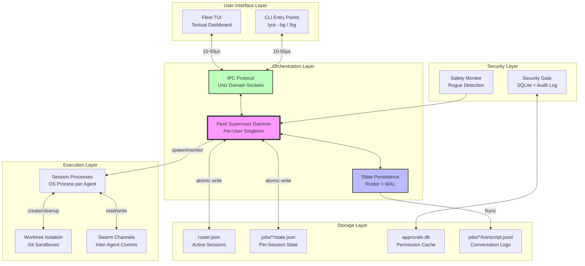
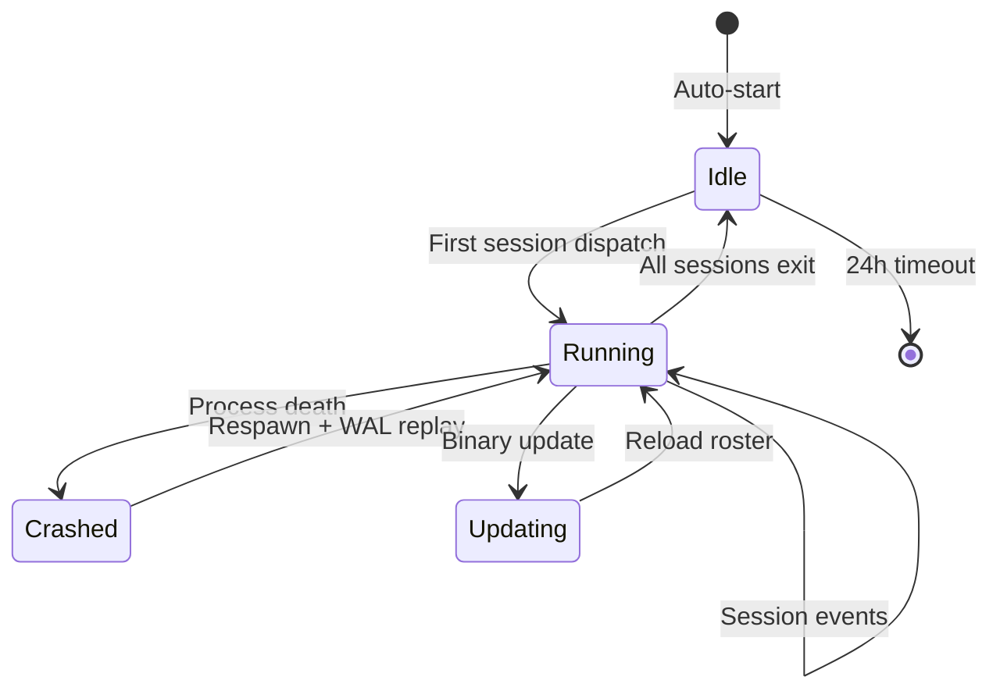
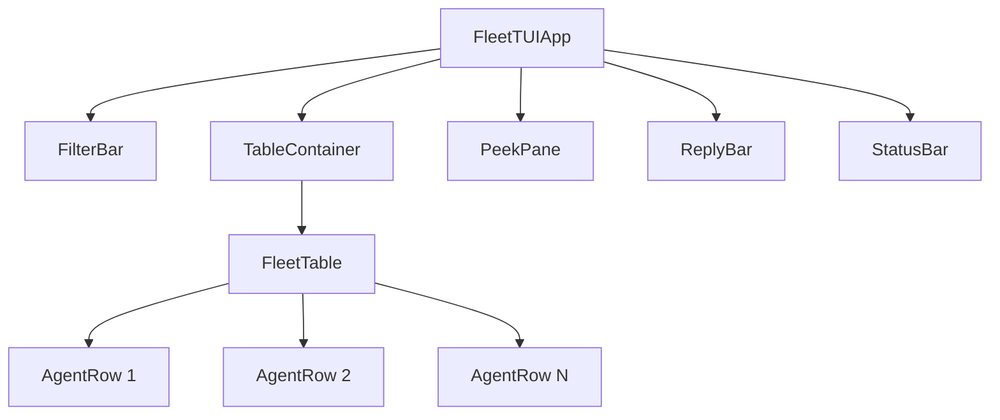
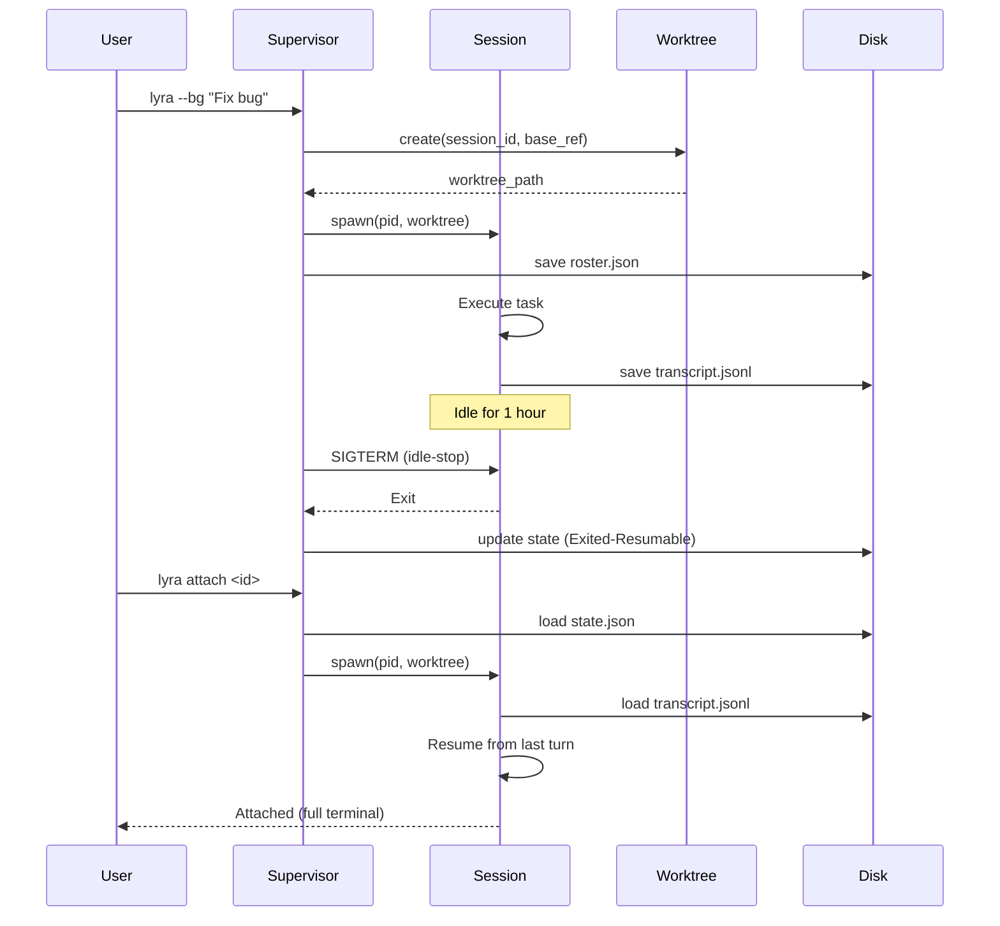
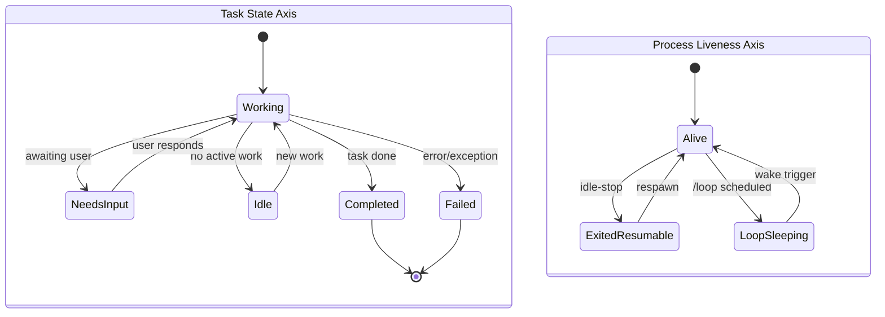
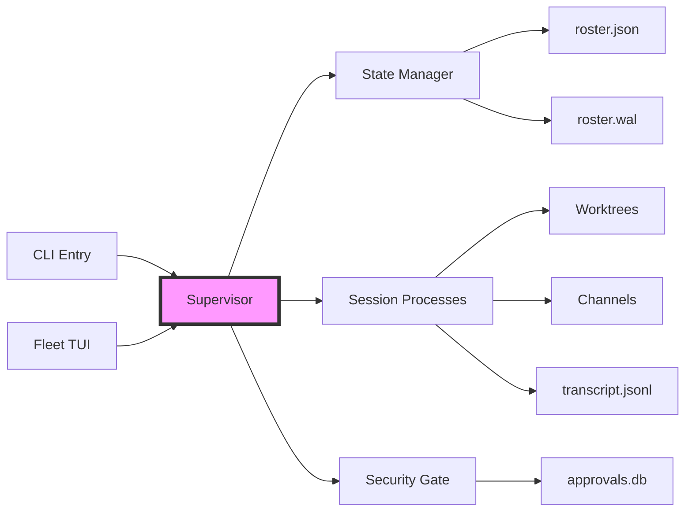

# Fleet Supervisor Architecture

**Document**: fleet-supervisor/architecture.md  
**Status**: Complete  
**Date**: 2026-06-02  
**Sources**: `packages/lyra-orchestration/`, `packages/lyra-fleet-tui/`, `lyra-upgrade/01-plans/agent-view-fleet-layer.md`, `lyra-upgrade/07-architecture-deep-dives/04-fleet-supervisor.md`

---

## Executive Summary

The Fleet Supervisor is Lyra's per-user daemon process that enables multi-agent parallelism through background session management. Unlike traditional terminal multiplexers, it provides a task-oriented fleet view where sessions survive terminal closure, system sleep, and binary updates. The architecture separates concerns across four layers: the supervisor daemon (process lifecycle), Fleet TUI (user interface), worktree isolation (file-level sandboxing), and swarm channels (inter-agent communication).

**Key Innovation**: Two-axis state model (task-state × process-liveness) enables "steer-by-exception" UX where users intervene only when sessions signal they need attention, collapsing fleet management from "monitor constantly" to "respond when flagged."

---

## System Overview

### High-Level Architecture



### Component Responsibilities

| Component | Purpose | Implementation | Persistence |
|-----------|---------|----------------|-------------|
| **Supervisor Daemon** | Session lifecycle, roster management, idle-stop, memory shedding | Python, 466 lines | `~/.lyra/daemon.pid`, `roster.json` |
| **Fleet TUI** | Terminal dashboard, steer-by-exception UX | Textual framework, 301 lines | View state only (no persistence) |
| **IPC Protocol** | Supervisor-client communication | Unix domain sockets, JSON | Ephemeral (socket file) |
| **State Manager** | Crash-safe persistence | Atomic writes + WAL | `roster.json`, `roster.wal`, backups |
| **Security Gate** | Permission approval cache | SQLite, SHA256 hashing | `approvals.db`, audit JSONL |
| **Worktree Isolation** | File-level sandboxing | Git worktrees | `.lyra/worktrees/*` |
| **Session Processes** | Agent execution | OS processes (PIDs) | `jobs/*/transcript.jsonl` |
| **Safety Monitor** | Rogue/stuck detection | Metrics analysis | In-memory (supervisor state) |

---

## Core Components

### 1. Supervisor Daemon

**Location**: `packages/lyra-orchestration/src/lyra_orchestration/fleet_supervisor.py`

**Responsibilities**:
- Auto-start on first background command
- Spawn session processes with isolated worktrees
- Monitor process liveness (heartbeat every 5s)
- Idle-stop after ~1 hour of inactivity
- Memory-pressure shedding (idle-first, then pinned)
- Self-exit when no sessions remain for 24 hours
- Crash recovery via roster.json + WAL replay

**Lifecycle**:



**Key Methods**:

```python
class FleetSupervisor:
    def start(self) -> None:
        """Start daemon, load roster from disk."""
        
    def dispatch(self, prompt: str, model: str, ...) -> SessionState:
        """Create new background session."""
        
    def attach(self, session_id: str) -> SessionState:
        """Attach terminal to session."""
        
    def stop_session(self, session_id: str) -> bool:
        """Terminate session gracefully."""
        
    def tick(self) -> None:
        """Periodic maintenance (15s interval):
        - Refresh row summaries
        - Stop idle sessions
        - Check memory pressure
        - Save roster to disk
        """
    
    def resume_session(self, session_id: str, prompt: str = None) -> SessionState:
        """Respawn exited session from disk state."""
```

**Performance**:
- Startup: <200ms (load roster + connect socket)
- Tick overhead: <10ms (state scan + summary refresh)
- State write: <10ms with fsync (atomic write pattern)

### 2. Fleet TUI

**Location**: `packages/lyra-fleet-tui/src/lyra_fleet_tui/app.py`

**Built on**: Textual framework (Rich-based terminal UI)

**Layout**:

```
┌─ Filter Bar ────────────────────────────────────────────┐
│ [a:executor] [s:Working] [search:"auth"]                │
├─────────────────────────────────────────────────────────┤
│ Fleet Table:                                            │
│ ◉ fix-auth-bug     Working   15K  $0.85  Fix auth...   │
│ ◉ refactor-api     Working    8K  $0.12  Rm deps...    │
│ • write-tests      NeedsInp   2K  $0.03  Ask: cov?     │
│ ◎ deploy-staging   Stopped   --    --    Canceled      │
├─────────────────────────────────────────────────────────┤
│ Peek Pane: (right dock)                                 │
│ Agent: fix-auth-bug                                     │
│ State: Working | Liveness: ◉                            │
│ Model: claude-opus-4                                    │
│ Tokens: 15,324 | Cost: $0.85                           │
├─────────────────────────────────────────────────────────┤
│ Status Bar:                                             │
│ 5 Agents | 2 Active | 1 Need Input | Tokens: 25K | $1  │
└─────────────────────────────────────────────────────────┘
```

**Widget Hierarchy**:



**Key Widgets**:

| Widget | Purpose | Reactivity | Lines |
|--------|---------|------------|-------|
| `FilterBar` | State/search filters | Updates on keypress | 30 |
| `FleetTable` | Session rows (10 columns) | Updates on data push | 61 |
| `AgentRow` | Single-line summary | Rich markup formatting | 42 |
| `PeekPane` | Detail view (right dock) | Reactive on selection | 45 |
| `ReplyBar` | Inline reply input | Activated by `r` key | 30 |
| `StatusBar` | Fleet-wide metrics | Updates every 15s | 28 |

**Data Flow**:

```python
# Supervisor pushes snapshot every 15s
def update_fleet(data: FleetData):
    self._fleet_data = data
    self._summary = FleetSummary.from_fleet_data(data)
    self._refresh_display()

# User actions trigger supervisor calls
def on_key_enter(row: AgentRow):
    supervisor.attach(row.agent_id)
```

### 3. IPC Protocol

**Transport**: Unix Domain Sockets (UDS)

**Socket Path**: `/tmp/lyra-{uid}/supervisor.sock`

**Note**: In the `~/.lyra/` directory tree, this socket may appear as `daemon.sock` when persisted to the Lyra home directory.

**Message Format**: 4-byte length header + JSON payload

```python
# Send message
payload = json.dumps(msg).encode('utf-8')
header = len(payload).to_bytes(4, 'big')
sock.sendall(header + payload)

# Receive message
header = sock.recv(4)
length = int.from_bytes(header, 'big')
payload = sock.recv(length)
return json.loads(payload)
```

**Why UDS over gRPC**:
- **Latency**: 10-50μs vs 100-500μs (10x faster)
- **Throughput**: 10GB/s vs 1GB/s
- **Complexity**: 50 lines vs 500+ lines (gRPC stubs)
- **Battle-tested**: tmux, Docker daemon, PostgreSQL

**Error Handling**:
- Connection refused → auto-start supervisor
- Timeout (5s) → exponential backoff (max 3 retries)
- Protocol mismatch → version negotiation handshake

### 4. State Persistence

**Strategy**: Atomic writes + Write-Ahead Log (WAL)

**Atomic Write Pattern**:

```python
def atomic_write_json(path: Path, data: dict, fsync: bool = True):
    """Write-temp-rename with fsync for durability."""
    fd, tmp = tempfile.mkstemp(dir=path.parent, prefix=f".{path.name}.")
    
    with os.fdopen(fd, 'w') as f:
        json.dump(data, f, indent=2)
        if fsync:
            f.flush()
            os.fsync(f.fileno())  # Force to disk
    
    os.replace(tmp, path)  # Atomic rename (POSIX guarantee)
    
    if fsync:
        dir_fd = os.open(path.parent, os.O_RDONLY)
        os.fsync(dir_fd)  # Sync directory entry
        os.close(dir_fd)
```

**WAL for Complex Transitions**:

```python
class StateManager:
    def recover(self):
        """Crash recovery: checkpoint + WAL replay."""
        self.state = self._load_checkpoint()  # roster.json
        self._replay_wal()  # Apply uncommitted operations
    
    def update(self, key: str, data: dict):
        """Update state with WAL logging."""
        self.wal_seq += 1
        entry = WALEntry(seq=self.wal_seq, op=UPDATE, key=key, data=data)
        self._append_wal(entry)  # Durable write
        self.state[key] = data   # In-memory update
```

**Corruption Detection** (5 heuristics):
1. Size check (empty or too small → reject)
2. JSON parse validation
3. Checksum validation (SHA256)
4. Schema validation (required fields)
5. Truncation markers (null bytes)

**Performance**:
- Write latency: <10ms with fsync
- Recovery time: <100ms (roster + WAL replay)
- Disk usage: ~100KB per 100 sessions

### 5. Security Gate

**Location**: `packages/lyra-orchestration/src/lyra_orchestration/security_gate.py`

**Purpose**: Prevent unwatched background sessions from silently gaining elevated permissions.

**Database Schema** (SQLite):

```sql
CREATE TABLE approval_grants (
    id INTEGER PRIMARY KEY,
    tool_name TEXT NOT NULL,
    permission_type TEXT NOT NULL,
    scope_hash TEXT NOT NULL,        -- SHA256 of tool:command
    approved_at REAL NOT NULL,
    expires_at REAL NOT NULL,
    risk_level TEXT NOT NULL,        -- LOW/MEDIUM/HIGH/CRITICAL
    session_id TEXT NOT NULL,
    revoked_at REAL,
    UNIQUE(tool_name, scope_hash, session_id)
);

CREATE INDEX idx_approval_lookup ON approval_grants(
    tool_name, expires_at
) WHERE revoked_at IS NULL;
```

**Risk Levels & Expiry**:

| Risk Level | Tools | Expiry | Examples |
|------------|-------|--------|----------|
| LOW | Read, Grep, Glob | 7 days | Read files, search |
| MEDIUM | Write, Edit, Git | 24 hours | File edits, commits |
| HIGH | Bash, WebFetch | 4 hours | Shell commands, network |
| CRITICAL | rm -rf, sudo, curl \| sh | Per-use only | Destructive ops |

**Command Hashing** (prevents replay attacks):

```python
def hash_scope(tool_name: str, command: str) -> str:
    """SHA256 hash prevents 'git push' approval from being reused for 'git push --force'."""
    raw = f"{tool_name}:{command}".encode("utf-8")
    return hashlib.sha256(raw).hexdigest()[:16]
```

**Approval Check Algorithm**:

```python
def check_approval(tool, command, session_id):
    # 1. Query active approvals
    approval = db.query_active(tool, session_id)
    if not approval:
        return REQUIRES_INTERACTIVE
    
    # 2. Hash matching (prevents replay)
    if hash_scope(tool, command) != approval.scope_hash:
        return DENIED
    
    # 3. Expiry check
    if approval.expires_at <= now():
        return EXPIRED
    
    return APPROVED
```

---

## Integration Points

### Supervisor → Worktrees

```python
# Create worktree before first file edit
worktree_info = worktree.create(
    session_id="abc123",
    base_ref="fresh"  # or "head"
)
# Returns: WorktreeInfo(path="/path/to/worktree", branch="lyra-session-abc123")
```

### Supervisor → rmux (Terminal Multiplexer)

```python
# Attach terminal to a running session
state = supervisor.attach(session_id="abc123")
# The attach() method returns SessionState with terminal control
```

**Note**: The `lyra-rmux` package exists for terminal multiplexing but the FleetSupervisor class does not expose a `get_pty()` method directly. The `attach()` method (line 299) handles terminal attachment to sessions.

### Supervisor → Swarm Channels (Monitoring Only)

```python
# Read channel messages to detect collusion
messages = channels.read(session_id="abc123")
if detect_collusion(messages):
    supervisor.flag_session(session_id="abc123", reason="collusion")
```

### Fleet TUI → Supervisor

```python
# Direct Python object passing (no serialization when in-process)
supervisor.update_fleet_ui(fleet_data)

# Or via IPC when separate processes
send_message(sock, {"cmd": "get_roster"})
fleet_data = recv_message(sock)
```

---

## Technology Stack

| Layer | Technology | Rationale |
|-------|-----------|-----------|
| **Daemon Process** | Python 3.11+ | Rapid prototyping, rich ecosystem |
| **Terminal UI** | Textual (Rich-based) | Modern TUI framework, reactive widgets |
| **IPC** | Unix Domain Sockets | 10x lower latency than gRPC |
| **State Storage** | JSON + WAL | Human-readable, crash-safe |
| **Security DB** | SQLite | ACID transactions, indexed queries |
| **Isolation** | Git Worktrees | Zero-config, cross-platform |
| **Process Mgmt** | OS processes (fork) | Crash isolation, OS-level monitoring |
| **Logs** | JSONL | Streaming-friendly, append-only |

**Why Not Alternatives**:
- **Not Rust/Go**: Prototyping speed prioritized over performance (daemon overhead is <5MB)
- **Not gRPC**: UDS 10x faster, 10x simpler for local-only comms
- **Not Docker**: Worktrees provide file isolation without container overhead
- **Not threads**: OS processes give crash isolation and clean termination

---

## Architecture Diagrams

### Sequence: Dispatch → Background → Respawn



### State Machine: Two-Axis Model



### Component Dependencies



---

## Deployment Model

### Single-User Daemon

```
~/.lyra/
├── daemon.pid              # Supervisor PID
├── daemon.sock             # IPC socket
├── roster.json             # Active sessions
├── roster.json.bak         # Backup
├── roster.wal              # Write-ahead log
├── approvals.db            # Permission cache
└── jobs/
    ├── abc123/
    │   ├── state.json
    │   ├── transcript.jsonl
    │   └── pty.sock
    └── def456/
        └── ...
```

### Multi-User (Future)

Each user runs their own supervisor:
- `/tmp/lyra-{uid}/supervisor.sock` (isolated by UID)
- `~/.lyra/` (per-user home directory)
- No cross-user visibility or coordination

### Cloud Execution (Not Supported)

Current architecture is local-only:
- Sessions are OS processes on the user's machine
- Supervisor dies on system shutdown
- No cloud persistence or execution

**Future Extension**: Cloud mode via container-per-session on Kubernetes.

---

## Scalability Considerations

### Session Limit

**Per-provider concurrency caps**:

| Provider | Cap | Basis |
|----------|-----|-------|
| Anthropic | 5 (free), 50 (pro), ∞ (team) | Subscription tier |
| OpenAI | Rate-limited by TPM | Tokens per minute |
| Google | 10 (free), 100 (paid) | Account tier |
| DeepSeek | 1400 RPM | Requests per minute |
| Local | Hardware-bound | CPU/memory |

**Enforcement**:
- Warn at 80% of quota
- Block new dispatches at 100%
- Suggest upgrading tier or stopping idle sessions

### Memory Pressure

**Algorithm**: idle-then-pinned-first
1. Stop idle, non-pinned sessions (state preserved)
2. Stop idle, pinned sessions (state preserved)
3. Never stop working sessions

**Thresholds**:
- 80% RAM usage → start shedding idle
- 90% RAM usage → aggressive shedding (pinned too)

**Overhead per session**:
- Baseline: ~50-100MB (Python process)
- 20 sessions: ~1-2GB total
- Mitigated by idle-stop after 1 hour

### Disk Usage

**Per session**:
- `state.json`: ~5KB
- `transcript.jsonl`: ~100KB-10MB (depends on turns)
- Worktree: ~200MB (full repo checkout)

**Cleanup policies**:
- Auto-delete unchanged worktrees immediately
- Keep changed worktrees until explicit cleanup
- Prune old transcripts after 30 days (configurable)

---

## Summary

The Fleet Supervisor architecture achieves multi-agent parallelism through a layered design that separates process lifecycle (supervisor), user interface (Fleet TUI), file isolation (worktrees), and inter-agent communication (channels). Key innovations include the two-axis state model for intuitive session visibility, crash-safe state persistence via atomic writes + WAL, and a security gate that prevents unwatched permission escalation while maintaining 24-hour approval windows.

**Core Strength**: Zero-config parallelism. Users type `lyra --bg` and get background execution with no Docker, Kubernetes, or queue system required.

**Core Limitation**: Local-only execution. Sessions die on system shutdown. Future cloud mode requires container-per-session orchestration.
