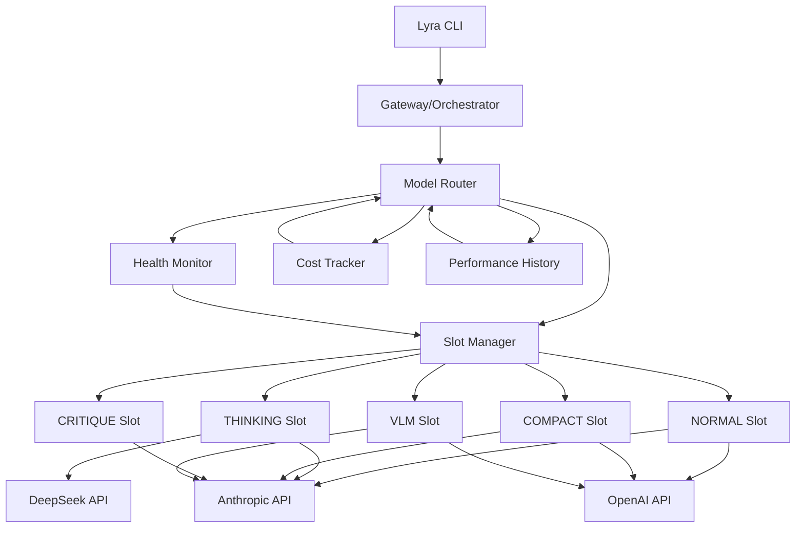
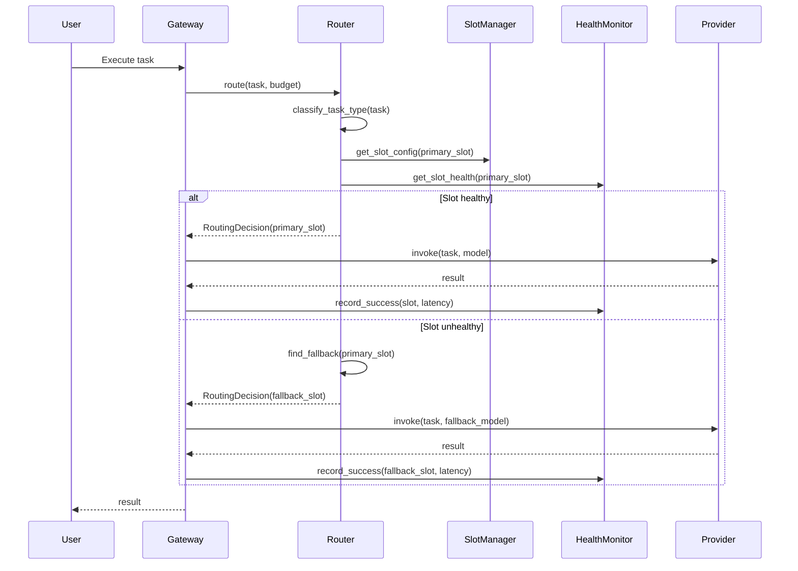

# Model Router System -- Architecture

## Overview

The **Model Router** is Lyra's intelligent inference orchestration system that dynamically routes tasks to the optimal LLM based on task characteristics, cost constraints, provider health, and performance history. It implements a **5-slot architecture** with automatic fallback, multi-turn context awareness, and cross-provider load balancing.

The router solves three core problems:
1. **Cost optimization**: Routing simple tasks to cheaper models
2. **Performance maximization**: Capability matching for accuracy
3. **Reliability**: Automatic failover when providers degrade

## System Context



## Core Components

### 1. Model Router (`router_v2.py`)

**Location**: `packages/lyra-model-router/src/lyra_model_router/router_v2.py`

**Responsibility**: Advanced multi-turn routing with tier-based model selection.

**Key Features**:
- **4-tier model pool**: REASONING, STANDARD, FAST, CHEAP
- **5 routing strategies**: COST_OPTIMAL, PERFORMANCE_MAX, BALANCED, MULTI_TURN, CONFORMAL
- **Budget enforcement**: Hard token/cost caps with graceful degradation
- **Multi-turn escalation**: Complexity >0.7 or tokens >50k escalates to reasoning tier

**Model Pool** (default):
```python
_DEFAULT_MODELS = (
    ModelSpec("claude-opus", tier=REASONING, cost=0.015/1k, accuracy=0.95),
    ModelSpec("claude-sonnet", tier=STANDARD, cost=0.003/1k, accuracy=0.88),
    ModelSpec("claude-haiku", tier=FAST, cost=0.001/1k, accuracy=0.80),
    ModelSpec("deepseek-pro", tier=REASONING, cost=0.008/1k, accuracy=0.92),
    ModelSpec("deepseek-flash", tier=CHEAP, cost=0.0005/1k, accuracy=0.75),
    ModelSpec("gpt-5", tier=STANDARD, cost=0.005/1k, accuracy=0.87),
    ModelSpec("gpt-5-nano", tier=FAST, cost=0.0008/1k, accuracy=0.78),
)
```

**Note**: Model version suffixes (e.g., "4.7", "4.6") have been generalized. The actual model IDs in code may differ from current API availability. Consult `models_v2.py` for the authoritative model pool.

**Multi-Turn Logic**:
```python
def _multi_turn_route(query, candidates):
    context_tokens = sum(turn.history_tokens for turn in history)
    avg_complexity = mean(turn.complexity for turn in history)

    # Escalate to reasoning tier if complex
    if avg_complexity > 0.7 or context_tokens > 50000:
        return best_reasoning_model(candidates)

    # Default to standard/fast tier
    return cheapest_standard_model(candidates)
```

### 2. Core Router (`lyra_core.orchestration.model_router`)

**Responsibility**: Route tasks to slots based on keyword analysis, budget constraints, and slot health.

**Key Classes**:
- `ModelRouter`: Main orchestrator with 5-slot dispatch
- `ModelSlot`: Enum defining NORMAL, THINKING, COMPACT, CRITIQUE, VLM
- `RoutingDecision`: Immutable result with primary slot, fallback, reasoning, cost estimate
- `SlotHealthStatus`: Real-time health tracking per slot (healthy/degraded/unavailable)

**Slot Configuration**:
| Slot | Cost Multiplier | Use Case | Typical Models |
|------|----------------|----------|----------------|
| NORMAL | 1.0x | General coding, refactor, debug | Claude Sonnet, GPT-5 |
| THINKING | 3.0x | Architecture, planning, research | Claude Opus, DeepSeek Pro |
| COMPACT | 0.33x | Quick lookups, typo fixes | Claude Haiku, GPT-5 Nano |
| CRITIQUE | 1.0x | Code review, verification | Claude Sonnet (low temp) |
| VLM | 1.5x | Screenshots, diagrams, UI review | Claude Vision, GPT Vision |

### 3. Supporting Modules

**Location**: `packages/lyra-model-router/src/lyra_model_router/`

| Module | Purpose |
|--------|---------|
| `capability_analyzer.py` | Task requirement analysis for routing category |
| `complexity_estimator.py` | Task complexity scoring |
| `confidence_escalation.py` | Confidence-based tier escalation |
| `cost_optimizer.py` | Cost-aware model selection |
| `cross_model_verifier.py` | Cross-model output verification |
| `knowing_doing_gap.py` | Gap analysis between capability and execution |
| `models_v2.py` | Model pool definitions and capabilities |
| `performance_history.py` | Historical performance tracking per model |
| `router_config.py` | Router configuration management |
| `task_classifier.py` | Task classification (keyword matching) |
| `usage_tracker.py` | Token usage and cost tracking |
| `exceptions.py` | Router-specific exceptions |

### 4. Health Monitor

**Responsibility**: Track slot health and trigger failover.

**Health States**:
- **HEALTHY**: Error count < 2, normal operation
- **DEGRADED**: Error count 2-4, routing continues with warnings
- **UNAVAILABLE**: Error count >= 5, slot excluded from routing

**Health Calculation**:
```python
def record_success(latency_ms):
    avg_latency_ms = avg_latency_ms * 0.7 + latency_ms * 0.3  # EMA
    error_count = max(0, error_count - 1)  # Decay errors on success
    recalculate_health()

def record_error(error):
    error_count += 1
    last_error = error
    recalculate_health()

def recalculate_health():
    if error_count >= 5: health = UNAVAILABLE
    elif error_count >= 2: health = DEGRADED
    else: health = HEALTHY
```

### 5. Cost Tracker & Performance History

**Responsibility**: Record routing decisions, track costs, analyze historical performance.

**Metrics Tracked**:
- Total decisions by tier/slot
- Cumulative cost ($)
- Cumulative tokens
- Average confidence score
- Fallback rate
- Per-model latency histogram

## Integration Points

### 1. Gateway Integration

Gateway consults router before every LLM invocation:

```python
class Gateway:
    def execute_task(self, task: str):
        # Route to optimal model slot
        decision = self.model_router.route(task, budget_multiplier=self.session.budget)

        # Resolve slot to concrete model
        model = self.resolve_model(decision.primary_slot)

        # Execute with fallback
        try:
            result = model.invoke(task)
            self.model_router.record_slot_result(decision.primary_slot, success=True)
        except Exception as e:
            if decision.fallback_slot:
                model = self.resolve_model(decision.fallback_slot)
                result = model.invoke(task)
            self.model_router.record_slot_result(decision.primary_slot, success=False, error=str(e))
```

### 2. Agent Loop Integration

Agent loop uses multi-turn routing for context-aware decisions:

```python
class AgentLoop:
    def run_turn(self, query: str, history: list[Turn]):
        # Record turn context
        turn_context = TurnContext(
            turn_index=len(history),
            query=query,
            history_tokens=sum(t.tokens for t in history),
            estimated_complexity=estimate_complexity(query),
        )
        self.intelligent_router.record_turn(turn_context)

        # Route with multi-turn strategy
        decision = self.intelligent_router.route(
            query,
            strategy=RoutingStrategy.MULTI_TURN,
            budget=self.session.budget,
        )

        # Execute with selected model
        return self.execute_with_model(decision.model, query)
```

## Technology Stack

### Core Technologies
- **Python 3.11+**: Type hints, dataclasses, enums
- **No external dependencies**: Zero-dependency routing logic (verified: lyra-model-router has `dependencies = []` in pyproject.toml)
- **Immutable data structures**: All decisions are frozen dataclasses

### Provider Integration
- **Anthropic SDK**: Claude models (via lyra-provider abstract interface)
- **OpenAI SDK**: GPT models (via lyra-provider abstract interface)
- **DeepSeek API**: DeepSeek models (via lyra-provider abstract interface)
- **Google Generative AI**: (via lyra-provider abstract interface, stub implementation)

**Note on documented claims**:
- **LiteLLM**: NOT used. Provider integration is handled by lyra-provider's own adapter layer.
- **Bedrock (AWS)**: NOT implemented. No Bedrock adapter exists.
- **Prometheus**: NOT wired into routing. No Prometheus dependency in any routing package.
- **OpenTelemetry**: Exists as separate `lyra-otel-tracer` package but is NOT wired into the routing system.

## Architecture Diagrams

### Routing Decision Flow



## Design Principles

### 1. **Fail-Fast with Graceful Degradation**

Never block the user. If all slots are unavailable, fallback to a hardcoded default model rather than raising an exception.

### 2. **Zero-Config Defaults**

Router works out-of-the-box with no configuration. Default slot configs and model pool cover most use cases.

### 3. **Immutable Decisions**

All `RoutingDecision` objects are frozen dataclasses. Once a decision is made, it cannot be mutated, enabling audit trails and reproducibility.

### 4. **Health-Aware Routing**

Health is tracked per-slot, not per-model. Provider degradation triggers automatic failover.

### 5. **Cost-Transparent**

Every decision includes `estimated_cost_multiplier`. Users can query `get_cost_estimate(task)` before execution.

### 6. **Provider-Agnostic**

Router operates on abstract slots and tiers. Adding a new provider requires only updating the model pool, not changing routing logic.

## Key Design Decisions

| Decision | Rationale | Trade-off |
|----------|-----------|-----------|
| **5 slots vs 3 slots** | CRITIQUE and VLM are specialized enough to warrant dedicated slots | More config complexity |
| **Keyword-based classification** | Fast (<1ms), deterministic, interpretable | Less accurate than ML classifier |
| **Error decay on success** | Slots recover naturally after transient failures | Slower recovery than immediate reset |
| **Budget as cost multiplier** | Simpler than absolute $ budget | Less precise for heterogeneous tasks |
| **Frozen dataclasses** | Immutable decisions enable audit trails | Slightly more memory overhead |

## Performance Characteristics

### Latency
- **Routing decision**: <1ms (keyword matching + dict lookups)
- **Health check**: <0.1ms (in-memory dict read)
- **Multi-turn routing**: <2ms (history aggregation + tier selection)

### Throughput
- **Concurrent routing**: Thread-safe (immutable decisions)
- **Bottleneck**: Provider API latency (100-800ms), not router logic

---

## References

- **RouteNLP**: Conformal Cascading for Large Language Models (58% cost reduction)
- **SCOPE**: RL-based Pre-hoc Routing (25.7% accuracy boost, 95.1% cost cut)
- `packages/lyra-model-router/src/lyra_model_router/` - Intelligent router implementation
- `packages/lyra-core/src/lyra_core/orchestration/model_router/` - Core 5-slot router
