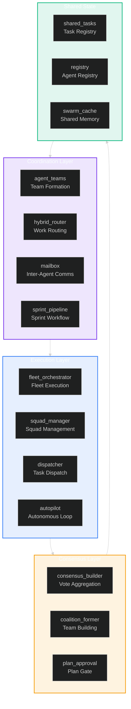
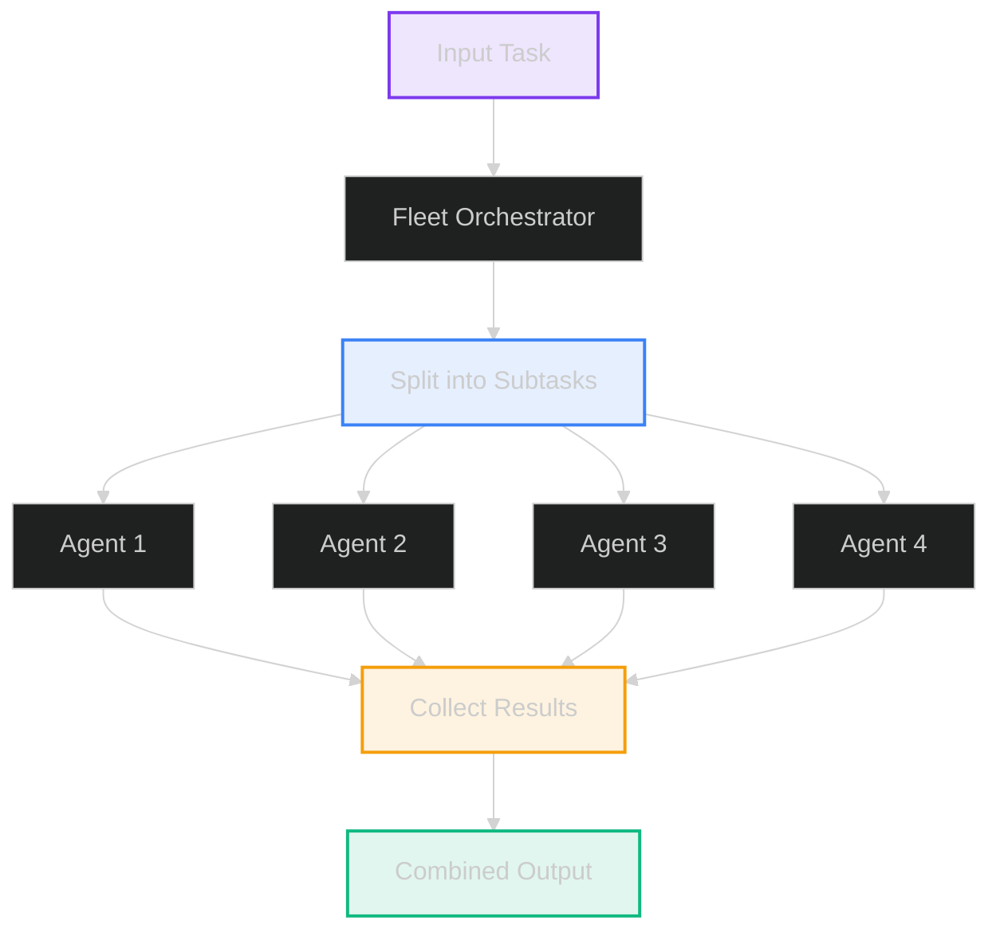
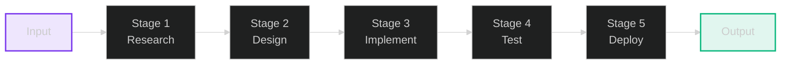
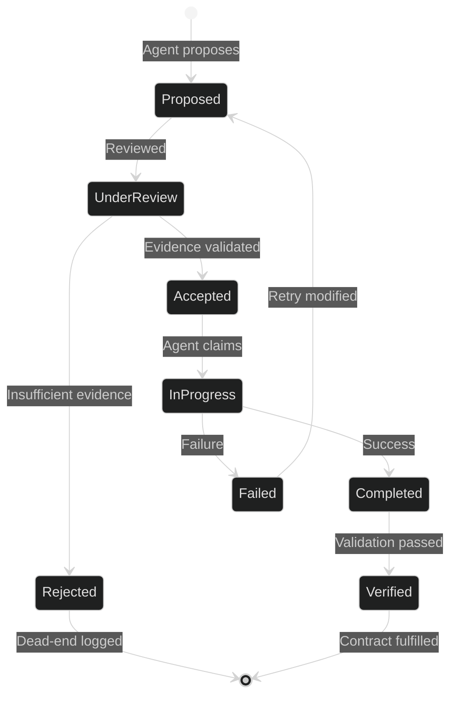
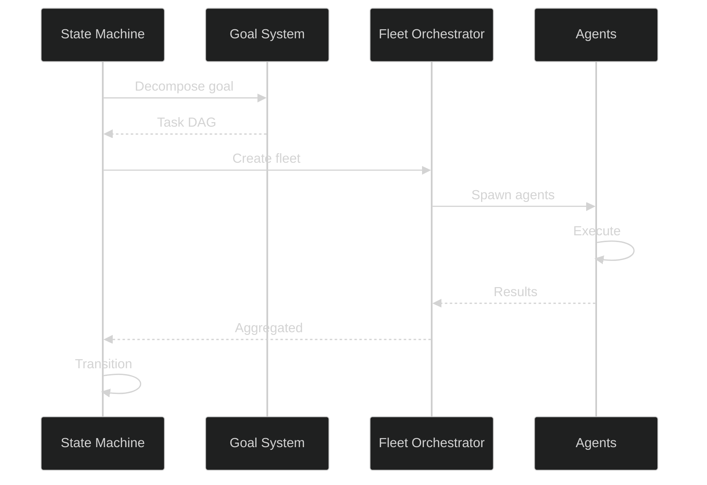

# Multi-Agent System Architecture

**Version:** 1.0  
**Date:** 2026-06-02  
**Status:** Active Development

---

## Executive Summary

Lyra's multi-agent system enables coordination through contract chains, consensus building, sprint pipelines, and self-claiming task models. The architecture spans three main packages:

- **lyra_core/teams/** (10 modules): Agent teams, hybrid routing, mailbox messaging, sprint pipelines, shared tasks, plan approval, executor adapter, cleanup, hooks, and registry
- **lyra-agent-swarm** (33+ modules): Fleet orchestration, squad management, consensus, coalition formation, discipline agents, swarm caching, autopilot, health monitoring, and more
- **lyra-orchestration**: Event bus, task queues, consensus protocol, worktree isolation, and fleet supervisor

### Core Capabilities

1. **Contract Chain System**: Formal agreements between agents with validation
2. **Consensus Building**: 4 aggregation methods (majority, weighted, unanimous, threshold)
3. **Sprint Pipeline**: Wave-based execution in dependency-ordered phases
4. **Self-Claiming Task Model**: Agents autonomously select tasks based on capability
5. **Fleet Orchestration**: Multi-pattern execution with squad management
6. **Mailbox Messaging**: Typed inter-agent communication channels

---

## System Overview

### High-Level Architecture



### Technology Stack

| Layer | Technology | Purpose |
|-------|-----------|---------|
| **Orchestration** | Pure Python asyncio | Multi-agent workflow coordination |
| **Agent Runtime** | Python 3.11+ | Core execution environment |
| **State Management** | In-memory dicts + JSON files | Agent and task state |
| **Concurrency** | asyncio + ThreadPoolExecutor | Parallel agent execution |
| **Isolation** | Git Worktrees | Sandboxed subagent execution |
| **Communication** | Native Python objects + Event Bus | Zero-overhead inter-agent messaging |

**Key finding**: The system does NOT use LangGraph, Chroma, LanceDB, MLFlow, Redis, or gRPC. Orchestration uses pure Python asyncio with custom coordinator patterns. State is managed via in-memory data structures and JSON file persistence.

---

## Core Components

### 1. lyra_core/teams/ — Team Coordination

**Location**: `packages/lyra-core/src/lyra_core/teams/`

The teams module provides foundational coordination primitives:

| Module | Purpose |
|--------|---------|
| `agent_teams.py` | Team formation, agent pool management, role assignment |
| `hybrid_router.py` | Multi-strategy task routing (keyword + semantic) |
| `mailbox.py` | Typed inter-agent message channels |
| `sprint_pipeline.py` | Wave-based execution with dependency ordering |
| `shared_tasks.py` | Self-claiming task registry with capability matching |
| `plan_approval.py` | Plan review and approval gate |
| `executor_adapter.py` | Agent execution environment adapter |
| `cleanup.py` | Session/team teardown and resource cleanup |
| `hooks.py` | Lifecycle hooks for team events |
| `registry.py` | Agent capability and metadata registry |

### 2. lyra-agent-swarm/ — Fleet & Swarm Execution

**Location**: `packages/lyra-agent-swarm/src/lyra_agent_swarm/`

The swarm package provides advanced execution and coordination capabilities:

| Module | Purpose |
|--------|---------|
| `fleet_orchestrator.py` | Multi-agent fleet execution with 5 execution patterns |
| `squad_manager.py` | Squad formation and lifecycle management |
| `dispatcher.py` | Task dispatch with priority-based scheduling |
| `consensus_builder.py` | Multi-strategy voting (majority, weighted, unanimous, threshold) |
| `coalition_former.py` | Shapley-value based team formation |
| `autopilot.py` | Autonomous agent loop execution |
| `sprint_model.py` | Sprint data model and workflow state |
| `swarm_cache.py` | Distributed swarm memory and state |
| `discipline_agents.py` | Role-specialized agents (analyst, experimenter, critic, synthesizer) |
| `compound_agent.py` | Composite agent patterns |
| `cross_agent_learning.py` | Shared learning across agent instances |
| `dynamic_reconfig.py` | Runtime team reconfiguration |
| `fleet_auto_scaler.py` | Automatic fleet scaling based on load |
| `goal_system.py` | Hierarchical goal decomposition |
| `hierarchical.py` | Hierarchical team structures |
| `team_messaging.py` | Team-scoped messaging channels |
| `recursive_link.py` | Recursive agent linking patterns |
| `speculative_router.py` | Predictive task routing |
| `request_batcher.py` | Task batching for efficiency |
| `health_monitor.py` | Agent health and liveness tracking |
| `memory_optimizer.py` | Swarm memory optimization |
| `byzantine_fault_tolerance.py` | Fault tolerance for unreliable agents |
| `leader_election.py` | Distributed leader selection |
| `log_replication.py` | State replication across agents |
| `raft_consensus.py` | Raft-based distributed consensus |
| `zero_trust_federation.py` | Cross-boundary agent federation |
| `swarm_visualizer.py` | Swarm state visualization |
| `continuous_guard.py` | Continuous security monitoring |
| `state_machine.py` | Agent lifecycle state machine |
| `exceptions.py` | Swarm-specific exception types |

### 3. lyra-orchestration/ — Infrastructure

**Location**: `packages/lyra-orchestration/src/lyra_orchestration/`

Provides infrastructure services used by both teams and swarm packages:

| Module | Purpose |
|--------|---------|
| `fleet_supervisor.py` | Per-user daemon for background session management (466 lines) |
| `event_bus.py` | Typed pub/sub for cross-agent communication |
| `task_queue.py` | Priority-based distributed task scheduling |
| `consensus.py` | Multi-strategy voting protocol |
| `coordinator.py` | Agent lifecycle coordination |
| `coalition_coordinator.py` | Bid-based scheduling for team formation |
| `worktree_isolate.py` | Git worktree-based process isolation |
| `cow_isolation.py` | Copy-on-write sandboxing |
| `security_gate.py` | Multi-layer permission authorization |

---

## Execution Patterns

### 1. Fan-Out Pattern

Parallel independent task execution.



**Use Cases**: Multi-file code analysis, parallel test execution, documentation generation across modules

### 2. Pipeline Pattern

Sequential processing stages with data flow.



**Use Cases**: Feature development workflow, data processing pipelines, CI/CD automation

### 3. Map-Reduce Pattern

Parallel processing with aggregation for large datasets.

**Use Cases**: Log analysis, batch processing, distributed computation

### 4. Tournament Pattern

Competitive selection among multiple approaches.

**Use Cases**: Algorithm comparison, A/B testing, solution optimization

### 5. Ensemble Pattern

Consensus from multiple diverse approaches.

**Use Cases**: Decision making under uncertainty, robust predictions

---

## Contract Chain System

### Contract Lifecycle



### Contract Structure

- **ID**: Unique identifier
- **Proposer**: Agent who proposed the work
- **Reviewer**: Agent assigned to review
- **Task**: Detailed work description with subtasks
- **Evidence**: Supporting data and confidence scores
- **State**: Current lifecycle state
- **Metadata**: Timestamps, dependencies, priority

### Evidence Requirements

All contracts must include:
1. **Rationale**: Why this approach is promising
2. **Prior Art**: Similar successful experiments
3. **Estimated Impact**: Expected improvement magnitude
4. **Risk Assessment**: Potential failure modes

---

## Wave-Based Execution

### Dependency Resolution

Tasks are organized into waves based on dependencies. Each wave executes in parallel; the next wave waits for the previous to complete. Implemented in `sprint_pipeline.py`.

**Wave Construction Algorithm:**
```python
def build_waves(tasks: list[Task]) -> list[list[Task]]:
    waves = []
    remaining = set(tasks)

    while remaining:
        # Find tasks with no unmet dependencies
        wave = [t for t in remaining if all(
            dep not in remaining for dep in t.dependencies
        )]

        if not wave:
            raise CyclicDependencyError()

        waves.append(wave)
        remaining -= set(wave)

    return waves
```

**Benefits:**
- Maximum parallelism within dependency constraints
- Automatic deadlock detection (cyclic dependencies)
- Efficient resource utilization

---

## Consensus Building

### Consensus Methods

| Method | Description | When to Use |
|--------|-------------|-------------|
| **Majority Vote** | Most common result wins | Binary decisions, clear options |
| **Weighted Vote** | Confidence-weighted aggregation | Uncertain outcomes, expert weighting |
| **Unanimous** | All agents must agree | Critical decisions, high-stakes |
| **Threshold** | N% agreement required | Configurable confidence levels |

### Implementation Example

```python
class ConsensusBuilder:
    def aggregate_votes(
        self,
        proposals: list[tuple[Agent, Proposal, float]],
        method: ConsensusMethod
    ) -> Proposal | None:
        if method == "majority":
            return max(proposals, key=lambda p: proposals.count(p[1]))[1]
        elif method == "weighted":
            scores = defaultdict(float)
            for agent, proposal, confidence in proposals:
                scores[proposal] += confidence
            return max(scores.items(), key=lambda x: x[1])[0]
```

---

## Subagent Architecture

### Isolation Model

Each subagent runs in an isolated environment managed by the EnterWorktree pattern in `.claude/worktrees/`. Subagent isolation uses git worktrees for filesystem sandboxing.

### Worktree Lifecycle

```bash
# Allocation
git worktree add -b <session-id>-sub-<n> \
    .claude/worktrees/<session-id>/<n> \
    <session-branch>

# Execution (isolated)
cd .claude/worktrees/<session-id>/<n>
# Subagent runs here

# Cleanup
git worktree remove .claude/worktrees/<session-id>/<n>
git branch -D <session-id>-sub-<n>
```

### Return Shapes

| Shape | Content | Use Case |
|-------|---------|----------|
| **observation** | Structured summary (default) | Most scenarios |
| **artifact** | File reference | Generated reports, diagrams |
| **raw_trace** | Full transcript | Debugging, analysis |

---

## Integration Points

### With Autonomy System



### With Memory System

Multi-agent experiences feed into the memory system:

- **Episodic Memory**: Experiment history and outcomes
- **Semantic Memory**: Extracted patterns and insights
- **Working Memory**: Active task context

### With Model Router

Agents leverage the model router (`lyra_model_router`) for:
- Capability-aware model selection
- Budget-constrained routing
- Multi-turn context-aware model switching

---

## Performance Characteristics

### Scalability Metrics

| Metric | Current | Configuration |
|--------|---------|---------------|
| **Concurrent Agents** | Configurable | Depends on CPU/memory |
| **Task Dispatch** | Priority-based | 3 priority queues |
| **Consensus Latency** | <500ms | In-memory voting |
| **State Sync** | Event-driven | EventBus pub/sub |

### Resource Requirements

**Minimum:**
- 4 CPU cores
- 16 GB RAM

**Recommended:**
- 16 CPU cores
- 64 GB RAM

---

## Security Considerations

### Isolation Guarantees

1. **Filesystem**: Subagents isolated in git worktrees
2. **Credentials**: No access to parent credentials
3. **State**: Read-only access to other teams' state
4. **Permission Gate**: `security_gate.py` provides multi-layer authorization

### Audit Trail

All agent actions are logged via the event bus:
- Contract proposals and reviews
- Experiment executions and results
- State modifications
- Team formations and reorganizations

---

## Observability

### Event Bus

The `lyra_orchestration.event_bus` provides:
- Typed pub/sub for all agent events
- Domain events: AgentStarted, AgentCompleted, AgentFailed, ScanCompleted, etc.
- Pydantic-based schema validation on events

### Key Metrics

- Agent utilization rates
- Task completion times
- Consensus success rates
- Sprint pipeline throughput

---

## Related Documentation

- [System Design](./system-design.md) - Detailed algorithms and data models
- [Tradeoffs](./tradeoffs.md) - Design decisions and alternatives
- [Implementation Guide](./implementation.md) - Code examples and deployment
- [Evaluation](./evaluation.md) - Performance benchmarks and metrics

---

**Version:** 1.0  
**Status:** Active Development  
**Last Updated:** 2026-06-02
