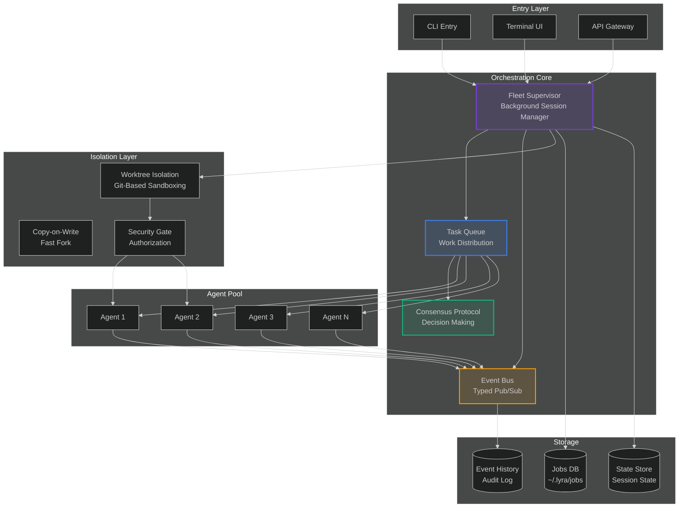
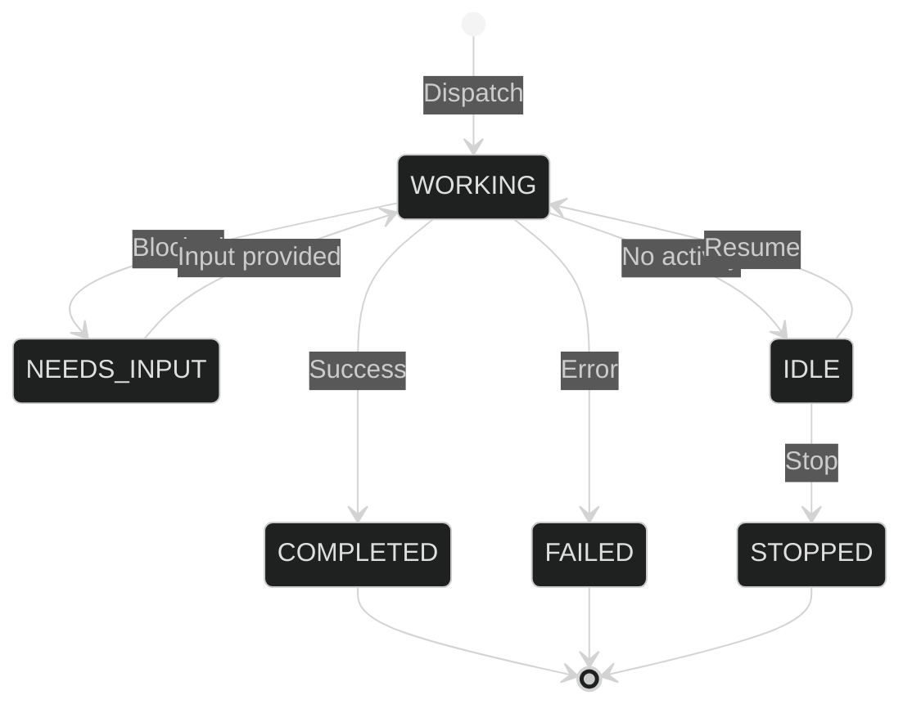
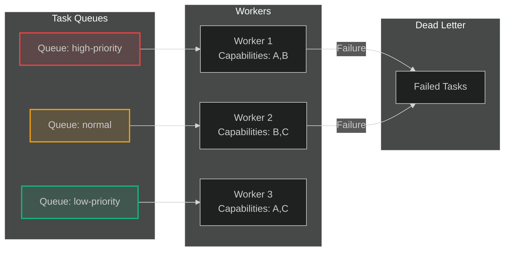
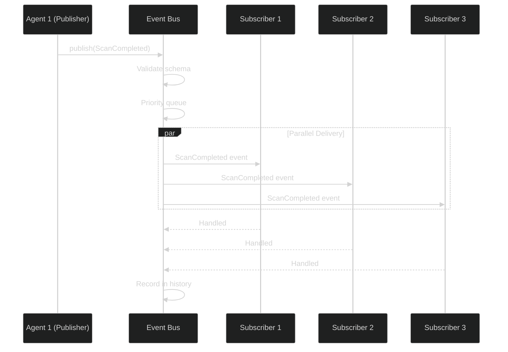
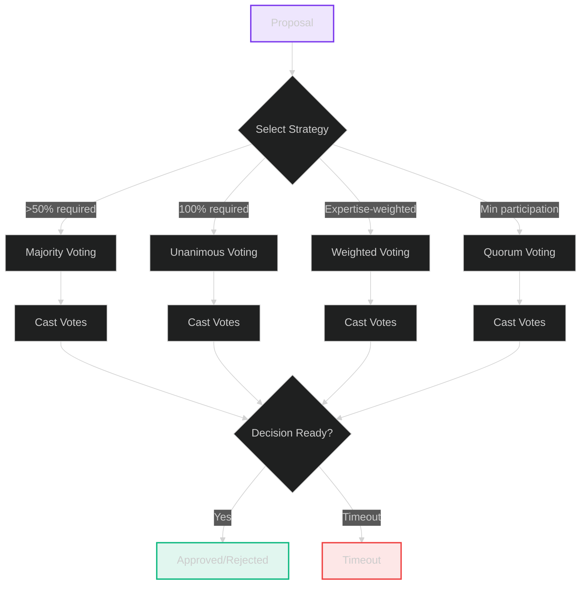
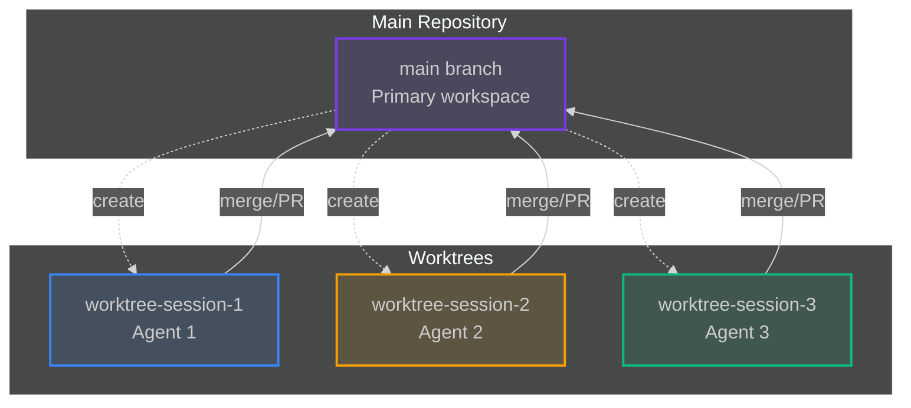
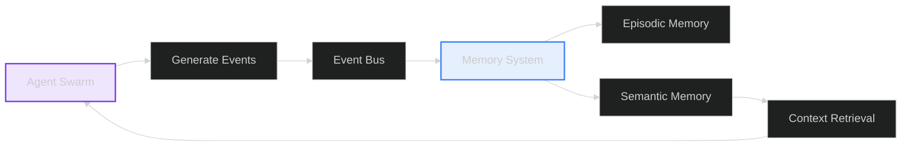
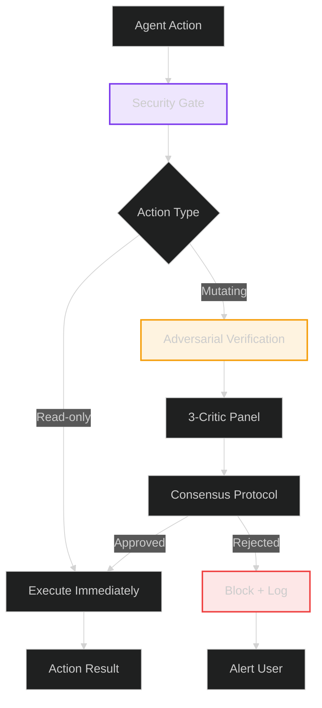
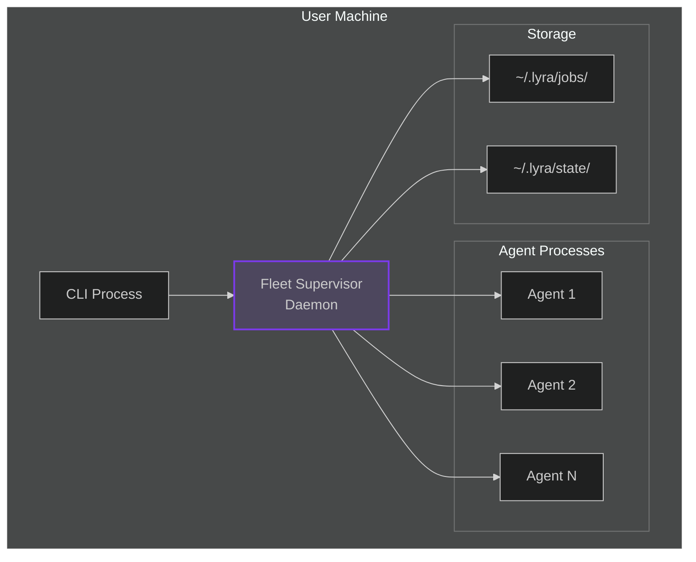
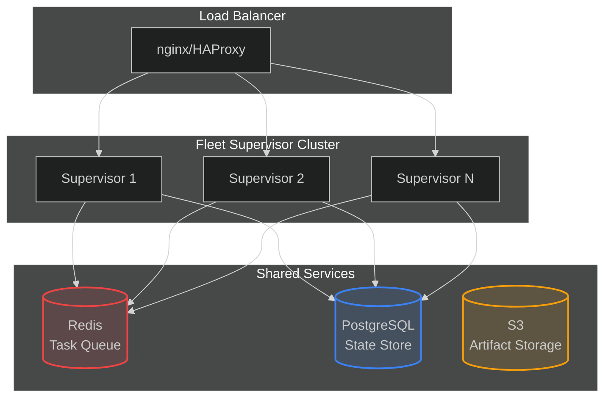

# Orchestration System Architecture

**Version**: 2.0  
**Date**: 2026-06-02  
**Status**: Production

---

## Executive Summary

Lyra's orchestration system enables sophisticated multi-agent coordination through distributed task queues, consensus protocols, event-driven communication, and worktree isolation. The system supports parallel agent execution, adversarial verification, typed inter-agent communication, and fleet management for autonomous research and complex task decomposition.

### Core Capabilities

1. **Fleet Supervisor**: Per-user daemon managing background agent sessions with lifecycle control
2. **Task Queue System**: Priority-based distributed task scheduling with retry logic
3. **Consensus Protocol**: Multi-strategy voting for agent decisions (majority, unanimous, weighted, quorum)
4. **Event Bus**: Typed pub/sub for cross-agent communication with zero serialization overhead
5. **Worktree Isolation**: Git-based process isolation for safe concurrent file editing
6. **Security Gate**: Multi-layer authorization with adversarial verification

---

## System Architecture

### High-Level Overview



---

## Core Components

### 1. Fleet Supervisor

**Purpose**: Per-user daemon that manages lifecycle of background agent sessions.

**Key Features**:
- Survives terminal close and machine sleep
- Each session runs as independent process
- State persisted to `~/.lyra/jobs/<session_id>/`
- Idle sessions auto-paused after 1 hour
- Self-exits when no active sessions
- Worktree isolation for parallel editing

**State Model** (Two orthogonal axes):



**Process Liveness States**:
- `ALIVE`: Process running
- `EXITED_RESUMABLE`: Process stopped, can restart from disk
- `LOOP_SLEEPING`: In sleep/wait cycle
- `DEAD`: Terminated, cannot resume

### 2. Task Queue System

**Purpose**: Distributed task queue for priority-based work distribution.

**Architecture**:



**Features**:
- Priority-based scheduling (CRITICAL > HIGH > NORMAL > LOW)
- Worker capability matching
- Max concurrent tasks per worker (default: 5)
- Automatic retry (max 3 attempts)
- Timeout handling (default: 300s)
- Dead letter queue for persistent failures

### 3. Event Bus

**Purpose**: Typed pub/sub system for cross-agent communication.

**Event Flow**:



**Domain Events**:
- `AgentStarted`, `AgentCompleted`, `AgentFailed`
- `ScanCompleted`, `VulnerabilityDiscovered`
- `ExploitAttempted`, `MemoryIngested`
- `IntegrationSynced`

**Performance**:
- Event delivery: <1ms per event
- Zero serialization overhead (native Python objects)
- Memory overhead: ~100KB per 1000 events

### 4. Consensus Protocol

**Purpose**: Multi-strategy voting for agent decisions.

**Voting Strategies**:



### 5. Worktree Isolation

**Purpose**: Git worktree-based process isolation for safe concurrent operations.

**Isolation Model**:



**Features**:
- 200-500ms creation time (vs 2-10s for containers)
- No Docker daemon required
- Built-in git integration
- Copy-on-write for efficiency
- `.worktreeinclude` for shared configs
- Non-destructive cleanup (STASH by default)

---

## Technology Stack

### Core Technologies

| Component | Technology | Purpose |
|-----------|-----------|---------|
| Runtime | Python 3.11+ | Core orchestration logic |
| Concurrency | asyncio | Async event handling |
| Persistence | JSON | Session state storage |
| Isolation | Git worktrees | Process sandboxing |
| IPC | Native Python | Zero-overhead communication |
| Schema Validation | Pydantic (event_bus.py only) | Event type validation |

### Dependencies

```python
# Core
asyncio         # Async runtime
dataclasses     # Data structures (most modules use frozen dataclasses)
enum            # Type-safe enums
typing          # Type hints
pathlib         # Path operations
json            # State serialization

# External
pydantic>=2.0          # Schema validation (event_bus.py uses BaseModel)
typing-extensions>=4.5  # Extended typing support
```

**Note**: Most orchestration modules (consensus.py, task_queue.py, coordinator.py, fleet_supervisor.py) use standard Python dataclasses with `frozen=True`, not Pydantic. Only `event_bus.py` uses Pydantic for event schema validation. The task_queue.py and consensus.py modules are independent components -- they are not wired together in the described Task Queue → Consensus Protocol pipeline. Each can be used standalone.

---

## Integration Points

### With Agent Loop

```mermaid
%%{init: {'theme': 'dark'}}%%
sequenceDiagram
    participant Loop as Agent Loop
    participant FS as Fleet Supervisor
    participant TQ as Task Queue
    participant Agent as Worker Agent
    
    Loop->>FS: dispatch(prompt)
    FS->>FS: Create session
    FS->>TQ: enqueue(task)
    TQ->>Agent: assign(task)
    Agent->>Agent: Execute
    Agent-->>TQ: complete(result)
    TQ-->>FS: Task completed
    FS-->>Loop: Session result
```

### With Memory System



### With Safety System



---

## Deployment Architecture

### Single-User Deployment



### Multi-User Deployment (Future)



---

## Performance Characteristics

### Scalability Metrics

| Metric | Current | Target | Notes |
|--------|---------|--------|-------|
| Concurrent agents | 10-20 | 100+ | Per supervisor |
| Tasks/second | 5-10 | 100+ | With distributed queue |
| Event delivery | <1ms | <1ms | In-memory |
| Session startup | 200-500ms | <200ms | Worktree creation |
| Memory per session | ~50MB | ~50MB | Includes agent |

### Bottlenecks

1. **Worktree creation**: 200-500ms per worktree (git operation)
2. **File I/O**: JSON serialization for state persistence
3. **Process spawning**: Python process startup overhead
4. **Git operations**: Worktree add/remove requires git locks

---

## Related Documentation

- [System Design](./system-design.md) - Detailed algorithms and data models
- [Tradeoffs](./tradeoffs.md) - Design decisions and alternatives
- [Implementation](./implementation.md) - Code examples and integration
- [Evaluation](./evaluation.md) - Benchmarks and performance analysis

---

<div align="center">

**Lyra Orchestration System Architecture**

Version 2.0 | 2026-06-02 | Production

[← Back to Systems](../) · [System Design →](./system-design.md)

</div>
