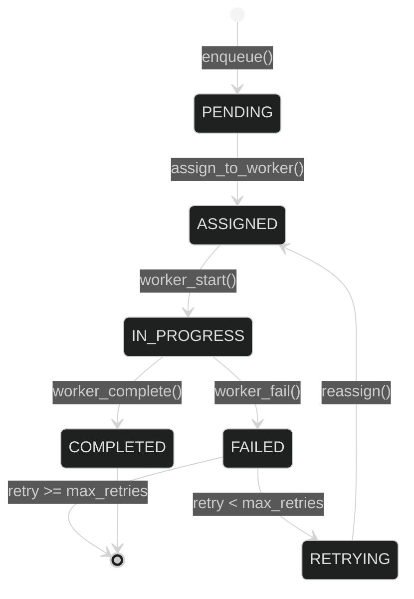
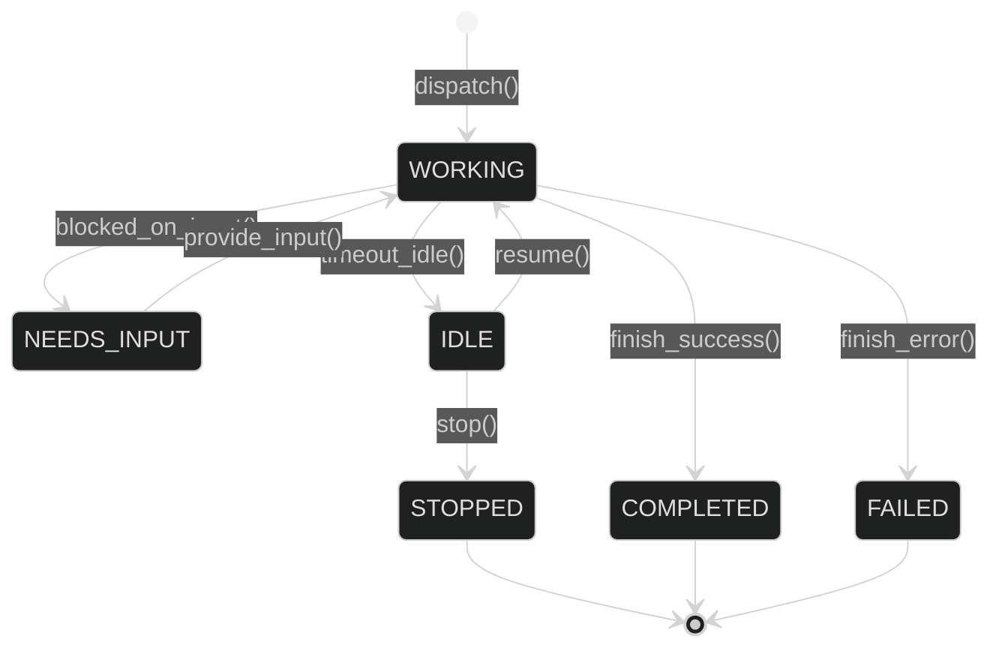
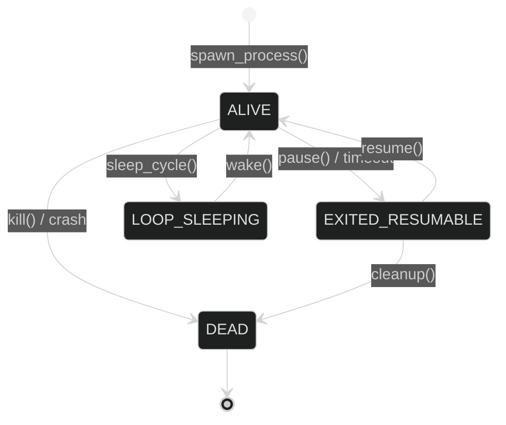

# Orchestration System Design

**Version**: 2.0  
**Date**: 2026-06-02  
**Status**: Production

---

## Executive Summary

This document details the internal design of Lyra's orchestration system: data models, algorithms, state machines, API contracts, and scalability mechanisms. The design emphasizes **type safety**, **fault tolerance**, **horizontal scalability**, and **zero-copy communication**.

---

## Data Models

### Task Queue Data Model

```python
from dataclasses import dataclass, field
from datetime import datetime
from enum import Enum
from typing import Any
from uuid import uuid4

class TaskPriority(Enum):
    """Task priority levels (sorted by urgency)."""
    LOW = 1
    NORMAL = 2
    HIGH = 3
    CRITICAL = 4

class TaskStatus(Enum):
    """Task lifecycle states."""
    PENDING = "pending"        # Waiting for assignment
    ASSIGNED = "assigned"      # Assigned to worker
    IN_PROGRESS = "in_progress"  # Worker executing
    COMPLETED = "completed"    # Successfully finished
    FAILED = "failed"          # Permanently failed
    RETRYING = "retrying"      # Failed, will retry

@dataclass(frozen=True)
class Task:
    """Immutable task definition."""
    task_id: str
    queue_name: str
    payload: dict[str, Any]
    priority: TaskPriority = TaskPriority.NORMAL
    max_retries: int = 3
    timeout: int = 300  # seconds
    created_at: datetime = field(default_factory=datetime.now)

@dataclass
class TaskState:
    """Mutable task execution state."""
    task: Task
    status: TaskStatus = TaskStatus.PENDING
    assigned_to: str | None = None
    assigned_at: datetime | None = None
    started_at: datetime | None = None
    completed_at: datetime | None = None
    result: dict[str, Any] | None = None
    error: str | None = None
    retry_count: int = 0

@dataclass
class Worker:
    """Worker registration and load tracking."""
    worker_id: str
    capabilities: set[str]  # Queue names this worker can handle
    max_concurrent: int = 5
    active_tasks: set[str] = field(default_factory=set)
    last_heartbeat: datetime = field(default_factory=datetime.now)
```

### Fleet Supervisor Data Model

```python
class TaskState(str, Enum):
    """Agent logical state (what it's doing)."""
    WORKING = "working"
    NEEDS_INPUT = "needs_input"
    IDLE = "idle"
    COMPLETED = "completed"
    FAILED = "failed"
    STOPPED = "stopped"

class ProcessLiveness(str, Enum):
    """Agent process state (is it alive?)."""
    ALIVE = "alive"
    EXITED_RESUMABLE = "exited_resumable"
    LOOP_SLEEPING = "loop_sleeping"
    DEAD = "dead"

@dataclass
class SessionState:
    """Complete background session state."""
    session_id: str
    name: str = ""
    task_state: TaskState = TaskState.WORKING
    process_liveness: ProcessLiveness = ProcessLiveness.ALIVE
    model: str = "auto"
    effort: str = "high"
    permission_mode: str = "default"
    pid: int | None = None
    worktree_path: str = ""
    summary: str = ""  # One-line status
    started_at: float = field(default_factory=time.time)
    last_active_at: float = field(default_factory=time.time)
    turns_completed: int = 0
    tokens_used: int = 0
    has_open_pr: bool = False
    error_message: str = ""
```

### Event Bus Data Model

```python
from pydantic import BaseModel

class Event(BaseModel):
    """Base event with typed schema validation."""
    event_id: str
    event_type: str
    timestamp: datetime
    priority: int = 0

class AgentStarted(Event):
    """Agent execution started event."""
    agent_id: str
    task_type: str
    model: str

class AgentCompleted(Event):
    """Agent execution completed event."""
    agent_id: str
    duration: float
    tokens_used: int
    result: dict[str, Any]

class ScanCompleted(Event):
    """Security scan completed event."""
    target: str
    findings: list[dict[str, Any]]
    scan_type: str

class VulnerabilityDiscovered(Event):
    """Vulnerability found event."""
    cve: str
    severity: str
    exploitable: bool
    affected_asset: str
    affected_service: str
```

### Consensus Protocol Data Model

```python
class VotingStrategy(Enum):
    """Consensus voting strategies."""
    MAJORITY = "majority"     # >50% approval
    UNANIMOUS = "unanimous"   # 100% approval
    WEIGHTED = "weighted"     # Expertise-weighted
    QUORUM = "quorum"         # Minimum participation

class VoteChoice(Enum):
    """Individual vote options."""
    APPROVE = "approve"
    REJECT = "reject"
    ABSTAIN = "abstain"

@dataclass(frozen=True)
class Vote:
    """Individual vote with rationale."""
    voter_id: str
    choice: VoteChoice
    weight: float = 1.0
    reason: str | None = None
    timestamp: datetime = field(default_factory=datetime.now)

@dataclass(frozen=True)
class Proposal:
    """Consensus proposal definition."""
    proposal_id: str
    topic: str
    description: str
    options: list[str]
    proposer_id: str
    voters: set[str]
    strategy: VotingStrategy
    quorum: float = 0.5  # 0.0-1.0
    timeout: int = 300  # seconds
    created_at: datetime = field(default_factory=datetime.now)

@dataclass
class ProposalState:
    """Mutable proposal voting state."""
    proposal: Proposal
    votes: dict[str, Vote] = field(default_factory=dict)
    decided: bool = False
    decision: str | None = None
    decided_at: datetime | None = None
```

---

## Core Algorithms

### 1. Task Assignment Algorithm

**Goal**: Match pending tasks to available workers based on capability and load.

```python
def assign_tasks(queue_name: str) -> None:
    """
    Assign pending tasks to available workers.
    
    Algorithm:
    1. Get pending tasks from queue (sorted by priority)
    2. Find workers with matching capability and capacity
    3. For each task, assign to worker with least load
    4. Update worker active_tasks set
    5. Start timeout handler for task
    
    Complexity: O(T × W) where T=tasks, W=workers
    """
    queue = self._queues.get(queue_name, [])
    
    # Find available workers with matching capability
    available = [
        w for w in self._workers.values()
        if queue_name in w.capabilities
        and len(w.active_tasks) < w.max_concurrent
    ]
    
    if not available:
        return
    
    for task_id in queue.copy():
        state = self._tasks[task_id]
        
        if state.status not in (TaskStatus.PENDING, TaskStatus.RETRYING):
            queue.remove(task_id)
            continue
        
        # Load balancing: assign to worker with least active tasks
        worker = min(available, key=lambda w: len(w.active_tasks))
        
        if len(worker.active_tasks) >= worker.max_concurrent:
            break
        
        # Assign task
        state.status = TaskStatus.ASSIGNED
        state.assigned_to = worker.worker_id
        state.assigned_at = datetime.now()
        worker.active_tasks.add(task_id)
        queue.remove(task_id)
        
        # Start timeout monitoring
        asyncio.create_task(self._handle_timeout(task_id))
```

**Time Complexity**: O(T × W) where T is tasks in queue, W is worker count  
**Space Complexity**: O(T + W) for task and worker tracking

### 2. Consensus Decision Algorithm

**Goal**: Determine if proposal can be decided based on voting strategy.

```python
def check_decision(proposal_id: str) -> None:
    """
    Check if proposal has reached consensus.
    
    Strategies:
    - MAJORITY: >50% approval required
    - UNANIMOUS: 100% approval required
    - WEIGHTED: Approval weighted by voter expertise
    - QUORUM: Minimum participation threshold
    """
    state = self._proposals[proposal_id]
    proposal = state.proposal
    
    # Check quorum first
    participation = len(state.votes) / len(proposal.voters)
    if participation < proposal.quorum:
        return  # Wait for more votes
    
    # Apply voting strategy
    if proposal.strategy == VotingStrategy.MAJORITY:
        approvals = sum(
            1 for v in state.votes.values()
            if v.choice == VoteChoice.APPROVE
        )
        rejections = sum(
            1 for v in state.votes.values()
            if v.choice == VoteChoice.REJECT
        )
        
        total = len(state.votes)
        if approvals > total / 2:
            state.decision = "approved"
        elif rejections > total / 2:
            state.decision = "rejected"
        elif len(state.votes) == len(proposal.voters):
            # All votes in, no majority
            state.decision = "rejected"
    
    elif proposal.strategy == VotingStrategy.UNANIMOUS:
        # Any rejection = proposal rejected
        if any(v.choice == VoteChoice.REJECT for v in state.votes.values()):
            state.decision = "rejected"
        elif len(state.votes) == len(proposal.voters):
            if all(v.choice == VoteChoice.APPROVE for v in state.votes.values()):
                state.decision = "approved"
            else:
                state.decision = "rejected"
    
    elif proposal.strategy == VotingStrategy.WEIGHTED:
        approve_weight = sum(
            v.weight for v in state.votes.values()
            if v.choice == VoteChoice.APPROVE
        )
        reject_weight = sum(
            v.weight for v in state.votes.values()
            if v.choice == VoteChoice.REJECT
        )
        total_weight = approve_weight + reject_weight
        
        if total_weight > 0 and approve_weight > total_weight / 2:
            state.decision = "approved"
        elif len(state.votes) == len(proposal.voters):
            state.decision = "rejected"
    
    if state.decision:
        state.decided = True
        state.decided_at = datetime.now()
        self._decision_events[proposal_id].set()
```

**Time Complexity**: O(V) where V is vote count  
**Space Complexity**: O(V) for vote storage

### 3. Event Bus Delivery Algorithm

**Goal**: Deliver events to subscribers in priority order with parallel execution.

```python
async def publish(event: Event) -> None:
    """
    Publish event to all subscribers.
    
    Algorithm:
    1. Validate event schema (Pydantic)
    2. Add to priority queue based on event.priority
    3. Find matching subscribers for event_type
    4. Deliver in parallel (asyncio.gather)
    5. Record in history for audit
    
    Complexity: O(S) where S=subscriber count
    """
    # Validate schema
    if not isinstance(event, Event):
        raise TypeError("Event must inherit from Event base class")
    
    event_type = event.event_type
    
    # Get matching subscribers
    subscribers = self._subscribers.get(event_type, [])
    
    if not subscribers:
        return
    
    # Parallel delivery
    tasks = [
        asyncio.create_task(handler(event))
        for handler in subscribers
    ]
    
    # Wait for all handlers (with timeout)
    await asyncio.gather(*tasks, return_exceptions=True)
    
    # Record in history
    self._history.append({
        "event_id": event.event_id,
        "event_type": event_type,
        "timestamp": event.timestamp.isoformat(),
        "subscriber_count": len(subscribers),
    })
```

**Time Complexity**: O(S) where S is subscriber count  
**Space Complexity**: O(H) where H is history size

### 4. Fleet Supervisor Tick Algorithm

**Goal**: Periodic maintenance for session lifecycle management.

```python
def tick(self) -> None:
    """
    Periodic maintenance (every 15 seconds).
    
    Operations:
    1. Refresh session summaries
    2. Stop idle unattached sessions
    3. Update process liveness
    4. Self-exit if no active sessions
    5. Persist state to disk
    """
    if not self._running:
        return
    
    now = time.time()
    
    for session_id, state in list(self._sessions.items()):
        # Refresh summary (cheap model call)
        if self._summary_fn and now - state.last_active_at >= 15:
            state.summary = self._summary_fn(state)
        
        # Stop idle sessions
        if (now - state.last_active_at) > self._idle_timeout:
            if state.process_liveness == ProcessLiveness.ALIVE:
                self._pause_session(session_id)
        
        # Update liveness
        if state.pid and not self._is_process_alive(state.pid):
            state.process_liveness = ProcessLiveness.EXITED_RESUMABLE
    
    # Self-exit if nothing is alive
    if not any(
        s.process_liveness == ProcessLiveness.ALIVE
        for s in self._sessions.values()
    ):
        self._running = False
    
    # Persist state
    self._save_roster()
```

**Time Complexity**: O(N) where N is session count  
**Space Complexity**: O(N) for session tracking

---

## State Management

### Task Queue State Transitions



### Session Lifecycle State Machine



### Process Liveness Tracking



---

## API Contracts

### Task Queue API

```python
class TaskQueue:
    async def enqueue(
        self,
        queue_name: str,
        payload: dict[str, Any],
        priority: TaskPriority = TaskPriority.NORMAL,
        max_retries: int = 3,
        timeout: int = 300,
    ) -> str:
        """Enqueue new task. Returns task_id."""
        
    async def register_worker(
        self,
        worker_id: str,
        capabilities: set[str],
        max_concurrent: int = 5,
    ) -> bool:
        """Register worker. Returns success status."""
        
    async def complete_task(
        self,
        task_id: str,
        worker_id: str,
        result: dict[str, Any],
    ) -> bool:
        """Mark task completed. Returns success status."""
        
    async def fail_task(
        self,
        task_id: str,
        worker_id: str,
        error: str,
    ) -> bool:
        """Mark task failed. Retries if under max_retries."""
```

### Fleet Supervisor API

```python
class FleetSupervisor:
    def dispatch(
        self,
        prompt: str,
        name: str = "",
        model: str = "auto",
        effort: str = "high",
        permission_mode: str = "default",
        auto_worktree: bool = True,
    ) -> SessionState:
        """Dispatch new background session. Returns session state."""
        
    def stop_session(self, session_id: str) -> bool:
        """Stop session and cleanup worktree. Returns success status."""
        
    def resume_session(
        self,
        session_id: str,
        prompt: str | None = None,
    ) -> SessionState | None:
        """Resume stopped session with optional new input."""
        
    def list_sessions(
        self,
        task_state: TaskState | None = None,
        needs_review: bool = False,
    ) -> list[SessionState]:
        """List sessions with optional filtering."""
```

### Event Bus API

```python
class EventBus:
    def subscribe(
        self,
        event_type: str,
        handler: Callable[[Event], Awaitable[None]],
    ) -> str:
        """Subscribe to event type. Returns subscription_id."""
        
    def unsubscribe(self, subscription_id: str) -> bool:
        """Unsubscribe handler. Returns success status."""
        
    async def publish(self, event: Event) -> None:
        """Publish event to all subscribers."""
```

### Consensus Protocol API

```python
class ConsensusProtocol:
    async def propose(
        self,
        topic: str,
        description: str,
        options: list[str],
        proposer_id: str,
        voters: set[str],
        strategy: VotingStrategy = VotingStrategy.MAJORITY,
        quorum: float = 0.5,
        timeout: int = 300,
    ) -> str:
        """Create proposal. Returns proposal_id."""
        
    async def vote(
        self,
        proposal_id: str,
        voter_id: str,
        choice: VoteChoice,
        weight: float = 1.0,
        reason: str | None = None,
    ) -> bool:
        """Cast vote. Returns acceptance status."""
        
    async def wait_for_decision(
        self,
        proposal_id: str,
        timeout: int | None = None,
    ) -> str | None:
        """Wait for decision. Returns decision or None on timeout."""
```

---

## Scalability Considerations

### Horizontal Scaling

**Current (Single-Node)**:
- All state in-memory
- Local filesystem for persistence
- Single Fleet Supervisor daemon

**Future (Distributed)**:
- Redis for task queue and session registry
- PostgreSQL for durable session state
- S3/object storage for artifacts
- Multiple Fleet Supervisor nodes with leader election

### Load Balancing

```python
# Round-robin worker selection
worker = workers[task_count % len(workers)]

# Least-loaded worker selection (current implementation)
worker = min(workers, key=lambda w: len(w.active_tasks))

# Weighted load balancing (future)
worker = weighted_choice(workers, weights=[w.capacity for w in workers])
```

### Backpressure Handling

```python
# Task queue backpressure
MAX_QUEUE_DEPTH = 1000

if len(queue) >= MAX_QUEUE_DEPTH:
    raise BackpressureError("Queue at capacity")

# Worker backpressure
if len(worker.active_tasks) >= worker.max_concurrent:
    return  # Don't assign more tasks
```

### Memory Management

```python
# Event history pruning
MAX_HISTORY_SIZE = 10_000

if len(self._history) > MAX_HISTORY_SIZE:
    self._history = self._history[-MAX_HISTORY_SIZE:]

# Dead letter queue size limit
MAX_DLQ_SIZE = 1000

if len(self._dead_letter) > MAX_DLQ_SIZE:
    self._dead_letter = self._dead_letter[-MAX_DLQ_SIZE:]
```

---

## Fault Tolerance

### Task Retry Logic

```python
if state.retry_count < state.task.max_retries:
    # Exponential backoff
    delay = 2 ** state.retry_count  # 1s, 2s, 4s
    await asyncio.sleep(delay)
    
    # Re-enqueue
    state.status = TaskStatus.RETRYING
    state.assigned_to = None
    queue.append(task_id)
else:
    # Move to dead letter queue
    state.status = TaskStatus.FAILED
    self._dead_letter.append(task_id)
```

### Worker Heartbeat Monitoring

```python
# Worker heartbeat check (every 30 seconds)
HEARTBEAT_TIMEOUT = 60  # seconds

for worker_id, worker in self._workers.items():
    if (time.time() - worker.last_heartbeat.timestamp()) > HEARTBEAT_TIMEOUT:
        # Worker presumed dead - reassign tasks
        for task_id in worker.active_tasks:
            await self._reassign_task(task_id)
        del self._workers[worker_id]
```

### Session Recovery

```python
# On supervisor restart
def _load_roster(self) -> None:
    """Load sessions from disk."""
    if not self._roster_path.exists():
        return
    
    roster = json.loads(self._roster_path.read_text())
    
    for session_id, data in roster.items():
        state = SessionState.from_dict(data)
        
        # Mark exited sessions as resumable
        if state.process_liveness == ProcessLiveness.ALIVE:
            state.process_liveness = ProcessLiveness.EXITED_RESUMABLE
        
        self._sessions[session_id] = state
```

---

## Related Documentation

- [Architecture](./architecture.md) - System overview and components
- [Tradeoffs](./tradeoffs.md) - Design decisions
- [Implementation](./implementation.md) - Code examples
- [Evaluation](./evaluation.md) - Performance benchmarks

---

<div align="center">

**Lyra Orchestration System Design**

Version 2.0 | 2026-06-02 | Production

[← Architecture](./architecture.md) · [Tradeoffs →](./tradeoffs.md)

</div>
