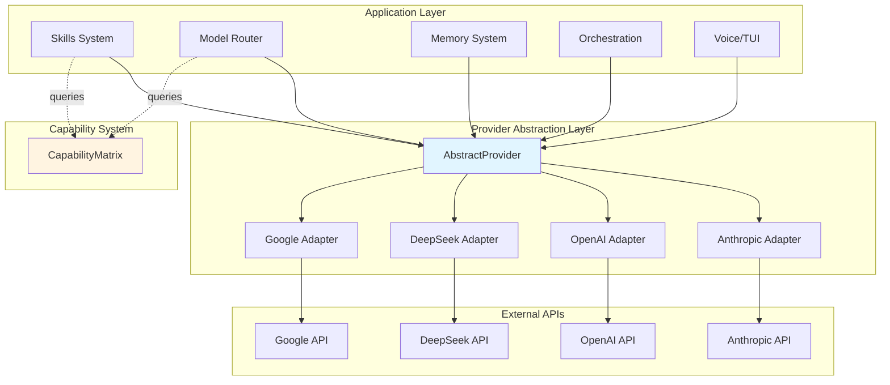
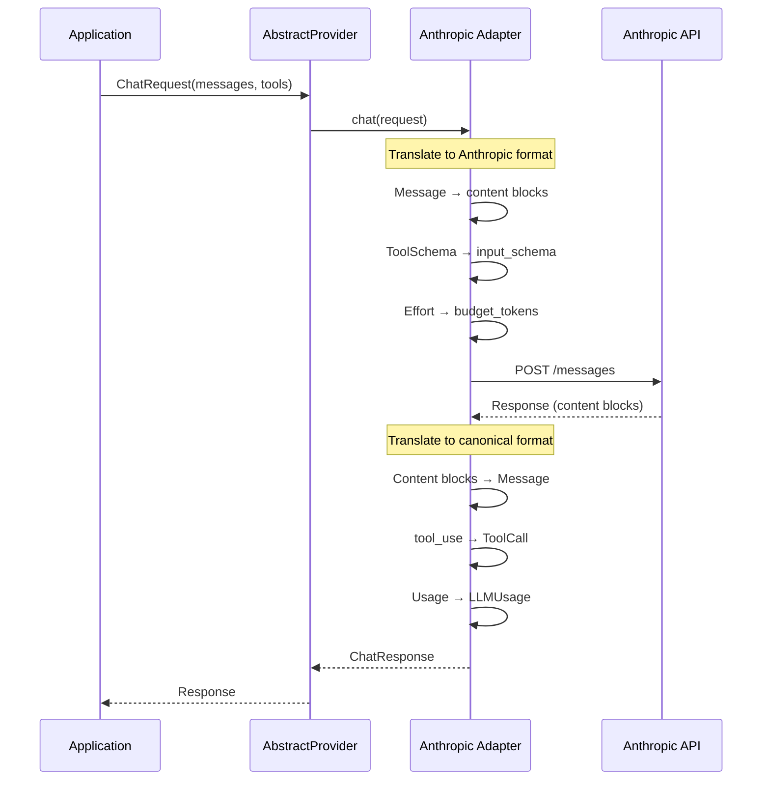
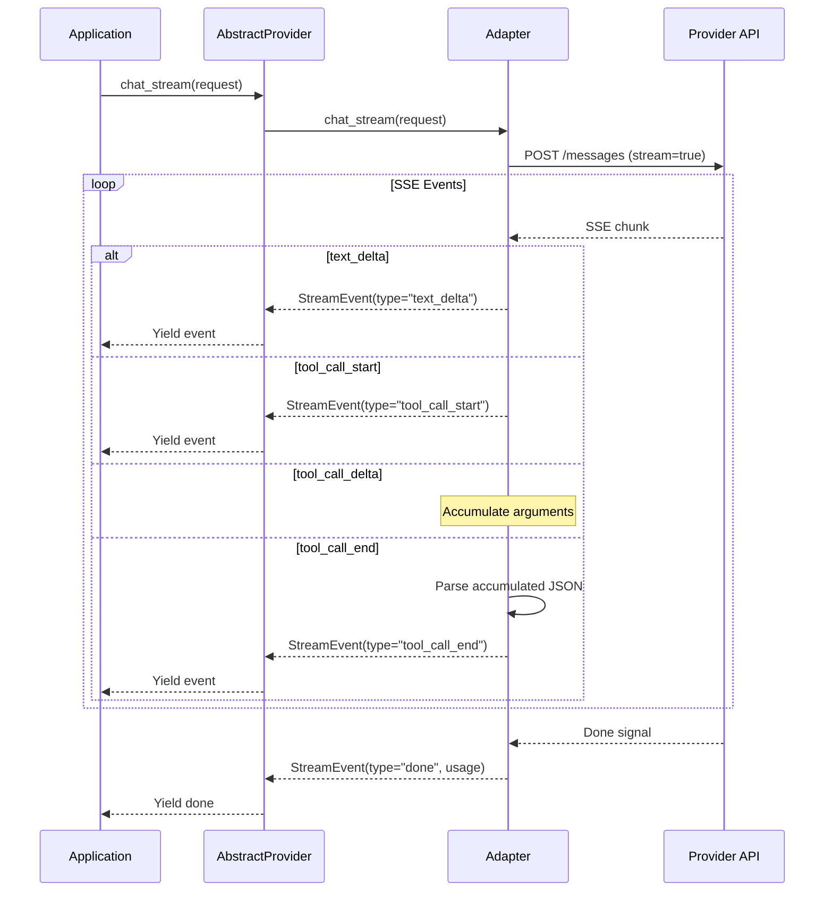
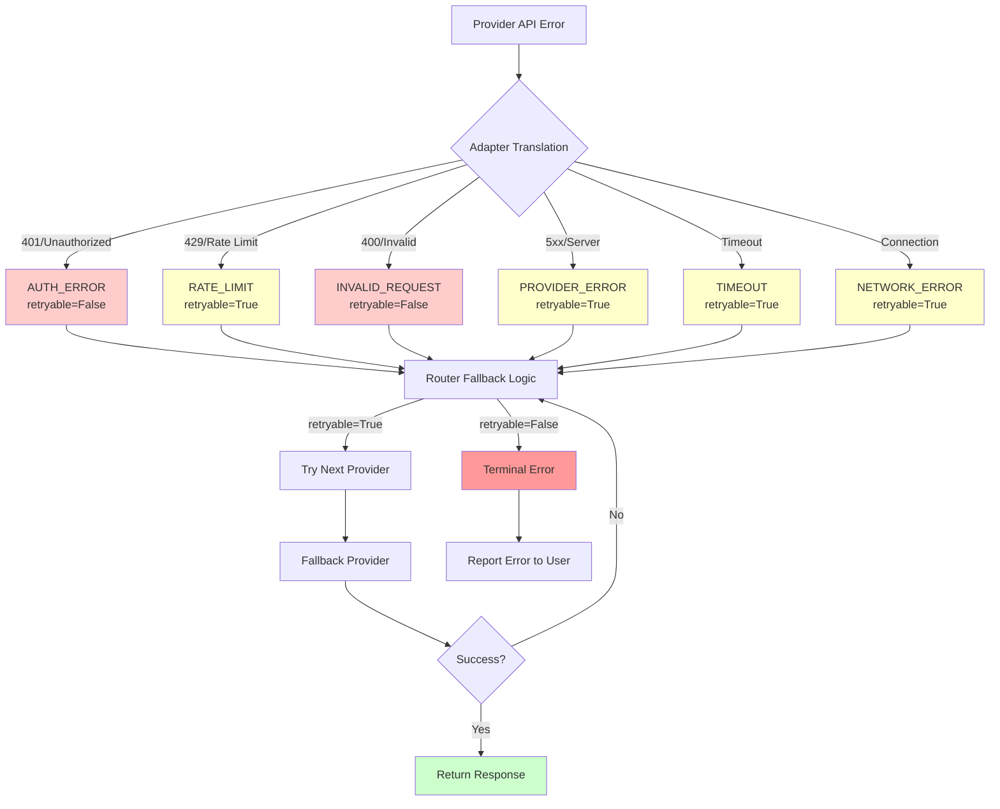
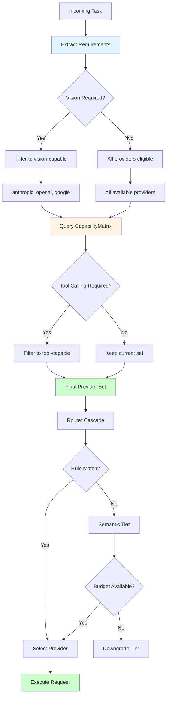

# Provider Abstraction System — Architecture

## Executive Summary

The provider abstraction layer is Lyra's architectural seam that decouples every higher-level capability (routing, skills, tools, memory, orchestration) from the specifics of any single AI provider. This abstraction normalizes multiple providers into a single canonical interface, enabling write-once-run-anywhere for all Lyra components.

**Key metrics:**
- **4 provider adapters** implemented (3 complete: Anthropic, OpenAI, DeepSeek; 1 stub: Google)
- **200K-1M** token context windows normalized
- **322 lines** of canonical interface code
- **Zero provider-specific code** above the abstraction boundary

**Note**: The aspiration of supporting 16+ providers is a future roadmap goal. The current implementation has 4 adapters.

---

## System Overview

### Problem Statement

Different LLM providers expose fundamentally incompatible APIs:

1. **Message formats differ**: Anthropic uses content blocks, OpenAI uses flat messages with tool_calls arrays, Google uses Part objects
2. **Tool calling varies**: Different schemas (input_schema vs parameters), different response formats (parsed dicts vs JSON strings)
3. **Streaming protocols diverge**: SSE event types, delta formats, termination signals all provider-specific
4. **Token accounting inconsistent**: Different field names (input_tokens vs prompt_tokens), cache tokens only on some providers
5. **Error taxonomies incompatible**: Different status codes, error strings, retry semantics

Without abstraction, every Lyra component would need provider-specific code, creating O(components × providers) maintenance burden.

### Solution Architecture

The provider abstraction creates a **canonical intermediate representation** that preserves full expressiveness while presenting a uniform interface:

```
Application Layer (Skills, Router, Memory, Orchestration)
                    ↓ uses only canonical types
        ┌───────────────────────────────────────┐
        │     AbstractProvider Interface         │
        │  (Message, ToolCall, ChatRequest,     │
        │   ChatResponse, StreamEvent)           │
        └───────────────────────────────────────┘
                    ↓ implemented by
    ┌──────────┬──────────┬──────────┬──────────┐
    │Anthropic │  OpenAI  │ DeepSeek │  Google  │
    │ Adapter  │ Adapter  │ Adapter  │ Adapter  │
    └─────┬────┴─────┬────┴─────┬────┴─────┬────┘
          │          │          │          │
          ↓          ↓          ↓          ↓
    [Provider-specific HTTP APIs]
```

---

## Core Components

### 1. Canonical Types (`interface.py`)

**Location:** `packages/lyra-provider/src/lyra_provider/interface.py` (322 lines)

#### Message Types

```python
@dataclass
class Message:
    """Unified message format across all providers."""
    role: MessageRole  # SYSTEM | USER | ASSISTANT | TOOL
    content: str | list[dict[str, Any]]
    tool_calls: list[ToolCall] | None = None
    tool_result: ToolResult | None = None
    name: str | None = None
```

**Design rationale:**
- Flat structure for common case (text-only messages)
- Optional tool_calls/tool_result for tool use scenarios
- Supports both string content and structured lists (for vision)

#### Tool Types

```python
@dataclass(frozen=True)
class ToolCall:
    """Tool invocation from model (immutable)."""
    id: str
    name: str
    arguments: dict[str, Any]  # Always parsed dict, never JSON string

@dataclass(frozen=True)
class ToolSchema:
    """Tool definition using JSON Schema."""
    name: str
    description: str
    parameters: dict[str, Any]  # JSON Schema object
```

**Immutability:** ToolCall and ToolSchema are frozen to prevent accidental mutation during streaming or multi-step tool execution.

#### Request/Response

```python
@dataclass
class ChatRequest:
    """Provider-agnostic chat request."""
    messages: list[Message]
    model: str
    tools: list[ToolSchema] | None = None
    max_tokens: int = 4096
    temperature: float | None = None
    stream: bool = False
    # Effort parameters (translated per-provider)
    effort_budget_tokens: int | None = None
    effort_instruction: str | None = None
    effort_reasoning: str | None = None
    extra: dict[str, Any] = field(default_factory=dict)

@dataclass
class ChatResponse:
    """Provider-agnostic chat response."""
    content: str
    model: str
    usage: LLMUsage | None = None
    tool_calls: list[ToolCall] | None = None
    finish_reason: str = "stop"
    latency_ms: float = 0.0
    provider: str = ""
    raw: Any = None  # Escape hatch for debugging
```

**Effort translation:** Three effort parameters enable per-provider mapping:
- `effort_budget_tokens` → Anthropic's `thinking.budget_tokens`
- `effort_reasoning` → OpenAI's `reasoning_effort`
- `effort_instruction` → DeepSeek/Google system prompt injection

#### Streaming

```python
@dataclass(frozen=True)
class StreamEvent:
    """Unified streaming event."""
    type: str  # text_delta | tool_call_start | tool_call_delta | 
               # tool_call_end | done | error
    content: str = ""
    tool_call: ToolCall | None = None
    usage: LLMUsage | None = None
    error: str | None = None
```

Six event types normalize three different streaming protocols (Anthropic SSE, OpenAI deltas, Google chunks).

#### Error Taxonomy

```python
class ErrorCode(str, Enum):
    AUTH_ERROR = "auth_error"
    RATE_LIMIT = "rate_limit"
    CONTEXT_OVERFLOW = "context_overflow"
    INVALID_REQUEST = "invalid_request"
    PROVIDER_ERROR = "provider_error"
    TIMEOUT = "timeout"
    NETWORK_ERROR = "network_error"
    UNKNOWN = "unknown"

@dataclass(frozen=True)
class ProviderError(Exception):
    code: ErrorCode
    message: str
    provider: str = ""
    retryable: bool = False  # Informs router fallback logic
    raw: Any = None
```

### 2. AbstractProvider Protocol

```python
class AbstractProvider(abc.ABC):
    """Contract every provider adapter must fulfill."""
    
    @abc.abstractmethod
    async def chat(self, request: ChatRequest) -> ChatResponse:
        """Send chat request, return complete response."""
        ...
    
    @abc.abstractmethod
    async def chat_stream(self, request: ChatRequest) -> AsyncIterator[StreamEvent]:
        """Send chat request, stream response events."""
        ...
    
    @abc.abstractmethod
    async def validate_api_key(self) -> bool:
        """Check API key validity."""
        ...
    
    @abc.abstractmethod
    async def list_models(self) -> list[str]:
        """Return available model IDs."""
        ...
    
    @abc.abstractmethod
    def supports_feature(self, feature: str) -> bool:
        """Check feature support (tool_calling, vision, etc.)."""
        ...
    
    @abc.abstractmethod
    def get_context_window(self, model: str) -> int:
        """Return context window size."""
        ...
```

**Minimal protocol:** Only 7 methods. Every adapter implements all 7, ensuring uniform capability across providers.

### 3. Provider Adapters

#### Anthropic Adapter (`anthropic.py`, 442 lines)

**API:** Anthropic Messages API v2023-06-01  
**Base URL:** `https://api.anthropic.com/v1`  
**HTTP Client:** httpx (primary), aiohttp (fallback)

**Key translations:**
- SYSTEM messages → separate `system` parameter (not a message)
- TOOL messages → user-role messages with `tool_result` content blocks
- Tool calls → `tool_use` content blocks (not flat array)
- Effort → `thinking.budget_tokens`
- Streaming → content_block_start/delta/stop → StreamEvent normalization

**Context window:** 200K tokens (all models)

**Features:**
```python
tool_calling=True
json_mode=True
vision=True
streaming=True
prompt_caching=True  # ~90% cost reduction for cached tokens
reasoning_budget=True  # Native budget_tokens API
```

**Unique capabilities:**
- Prompt caching with cache_read/cache_write token tracking
- Extended thinking with token budget control
- Vision support for image analysis

#### OpenAI Adapter (`openai.py`, 286 lines)

**API:** OpenAI Chat Completions API  
**Base URL:** `https://api.openai.com/v1`

**Key translations:**
- All four roles map 1:1 (system, user, assistant, tool)
- Tool calls → flat `tool_calls` array on assistant message
- Tool call arguments → JSON string (must parse)
- Effort → `reasoning_effort` (low/medium/high)

**Context window:** 128K (GPT-4o), 256K (GPT-5)

**Features:**
```python
tool_calling=True
json_mode=True
vision=True
streaming=True
reasoning_budget=True  # reasoning_effort API
```

**Code reuse:** Shares message/tool translation functions with DeepSeek adapter (both use OpenAI-compatible format).

#### DeepSeek Adapter (`deepseek.py`, 421 lines)

**API:** OpenAI-compatible Chat Completions  
**Base URL:** `https://api.deepseek.com/v1`

**Key translations:**
- Same message format as OpenAI
- Effort → system prompt injection (no native reasoning budget)
- Error handling → includes 402 "insufficient balance" handling

**Context window:** 128K tokens

**Features:**
```python
tool_calling=True
json_mode=False
vision=False
streaming=True
prompt_caching=False
reasoning_budget=False  # Uses prompt-based approach
```

**Effort mapping:**
```python
# Lyra effort → injected system prompt
LOW: "Be concise. Provide direct answers."
MEDIUM: "Think briefly before answering."
HIGH: "Think step by step. Be thorough."
XHIGH: "Think deeply. Consider multiple approaches."
```

**Cost optimization:** Cheapest provider (10-50x cheaper than Anthropic/OpenAI), making it ideal for bulk/background tasks.

#### Google Adapter (`google.py`, 78 lines — STUB)

**API:** Google Generative AI API  
**Base URL:** `https://generativelanguage.googleapis.com/v1beta`  
**Status:** Not yet implemented (stub raises NotImplementedError)

**Planned translations:**
- MessageRole.ASSISTANT → `model` role
- MessageRole.TOOL → `function` role
- Tool calls → `FunctionCall` Part objects
- SYSTEM messages → `system_instruction` field
- Effort → `thinkingConfig.thinkingBudget` or prompt injection

**Context window:** 1M tokens (largest of any provider)

**Features (when implemented):**
```python
tool_calling=True
json_mode=True
vision=True
streaming=True
max_context_tokens=1_000_000  # 5x larger than Anthropic
concurrent_limit=30  # Lower than other providers
```

### 4. Capability Matrix (`capability.py`, 197 lines)

**Purpose:** Single source of truth for provider feature support. Consulted by router, skills system, and workflow engine.

```python
@dataclass(frozen=True)
class ProviderCapability:
    provider: str
    tool_calling: bool = True
    json_mode: bool = False
    vision: bool = False
    streaming: bool = True
    prompt_caching: bool = False
    reasoning_budget: bool = False
    max_context_tokens: int = 128_000
    concurrent_limit: int = 50
    notes: str = ""
```

**Query interface:**
```python
matrix = get_capability_matrix()
matrix.supports("deepseek", "vision")  # False
matrix.get_context_window("google")  # 1_000_000
matrix.list_providers_supporting("vision")  # ["anthropic", "openai", "google"]
```

**Capability table:**

| Provider | Tool Call | JSON | Vision | Streaming | Cache | Reasoning | Context | Concurrent |
|----------|-----------|------|--------|-----------|-------|-----------|---------|------------|
| Anthropic | ✅ | ✅ | ✅ | ✅ | ✅ | ✅ budget_tokens | 200K | 50 |
| OpenAI | ✅ | ✅ | ✅ | ✅ | ❌ | ✅ reasoning_effort | 256K | 60 |
| DeepSeek | ✅ | ❌ | ❌ | ✅ | ❌ | ❌ prompt-based | 128K | 60 |
| Google | ✅ | ✅ | ✅ | ✅ | ❌ | ❌ prompt-based | 1M | 30 |

---

## Integration Points

### With Model Router

The ModelRouter (`packages/lyra-router/`) integrates with the provider layer at three stages:

**1. Pre-routing capability filter:**
```python
# Extract task requirements
required_features = extract_requirements(task)  # ["vision", "tool_calling"]

# Get capable providers
matrix = get_capability_matrix()
capable = set(matrix.list_providers())
for feature in required_features:
    capable &= set(matrix.list_providers_supporting(feature))

# Route only to capable providers
provider = router.route(task, allowed_providers=capable)
```

**2. Budget-aware model selection:**
```python
# BudgetTracker queries context windows for compaction decisions
context_limit = provider.get_context_window(model)
if current_tokens > context_limit * 0.8:
    trigger_compaction()
```

**3. Error handling and fallback:**
```python
try:
    response = await provider.chat(request)
except ProviderError as e:
    if e.retryable:
        # Try next provider in cascade
        provider = get_fallback_provider()
    else:
        # Terminal error (auth, invalid request)
        raise
```

### With Skills System

Skills declare capability requirements in YAML frontmatter:

```yaml
# skill.md frontmatter
---
name: image-analyzer
requires:
  - vision
  - tool_calling
provider_hints:
  prefer: anthropic  # Works best on Claude
  avoid: [deepseek]
---
```

The skill loader filters incompatible skills:
```python
available_providers = get_available_providers()
for skill in skills:
    required = skill.frontmatter.get("requires", [])
    if not all(any(matrix.supports(p, f) for p in available_providers)
               for f in required):
        logger.warning(f"Skipping {skill.name}: no provider supports {required}")
        continue
    register_skill(skill)
```

### With Effort System

The effort manager (`packages/lyra-effort/`) translates Lyra's effort scale to provider-specific parameters:

```python
def build_request(effort_level: EffortLevel, provider: str) -> ChatRequest:
    request = ChatRequest(...)
    
    if provider == "anthropic":
        request.effort_budget_tokens = EFFORT_TO_BUDGET[effort_level]
    elif provider == "openai":
        request.effort_reasoning = EFFORT_TO_REASONING[effort_level]
    elif provider in ["deepseek", "google"]:
        request.effort_instruction = EFFORT_TO_INSTRUCTION[effort_level]
    
    return request
```

### With Memory/Context System

Context compaction consults provider capabilities:

```python
context_window = provider.get_context_window(model)
compaction_threshold = context_window * THRESHOLD[provider]

# Provider-adaptive thresholds
THRESHOLD = {
    "anthropic": 0.80,  # 160K (leverage prompt caching)
    "deepseek": 0.60,   # 76K (smaller window, compact earlier)
    "google": 0.90,     # 900K (massive window, compact rarely)
    "openai": 0.70,     # 128K-256K context window
}
```

---

## Technology Stack

### Languages & Frameworks
- **Python 3.11+**: Core implementation language
- **asyncio**: Asynchronous I/O for concurrent provider requests
- **dataclasses**: Immutable canonical types
- **abc**: Abstract base class protocol enforcement

### HTTP Clients
- **httpx** (primary): Modern async HTTP client with excellent streaming support
- **aiohttp** (fallback): Alternative async client for environments without httpx

### Dependencies
```toml
[dependencies]
httpx = "^0.27.0"  # Primary HTTP client
aiohttp = "^3.9.0"  # Fallback HTTP client
```

No provider SDKs required — adapters use raw HTTP to avoid dependency bloat.

---

## Architecture Diagrams

### System Context



### Message Flow



### Streaming Flow



### Error Handling Flow



### Capability-Aware Routing



---

## Performance Characteristics

### Latency Overhead

Provider abstraction adds minimal latency:

| Operation | Overhead | Impact |
|-----------|----------|--------|
| Message translation | ~5-10μs | Negligible vs network (50-500ms) |
| Tool schema conversion | ~1-2μs per tool | Negligible |
| Streaming event normalization | ~20-50μs per event | Negligible vs model generation |
| Error translation | ~1-3μs | Negligible |

**Total overhead:** <100μs per request, <0.02% of typical request latency.

### Memory Overhead

```python
# Canonical types are lightweight
sizeof(Message) ≈ 200 bytes (excluding content)
sizeof(ToolCall) ≈ 150 bytes
sizeof(ChatRequest) ≈ 300 bytes (excluding messages)
sizeof(ChatResponse) ≈ 400 bytes (excluding content)

# A typical conversation (20 messages, 3 tools):
Memory = 20 * 200 + 3 * 150 + 300 + 400 ≈ 5.1 KB
```

Negligible compared to model response size (typically 10-100 KB).

### Scalability

**Concurrent requests:** Each adapter supports configurable connection pooling:
```python
ProviderConfig(
    max_concurrent=50,  # Per-provider connection limit
    timeout_seconds=120.0,
)
```

**Horizontal scaling:** Stateless design enables:
- Multiple provider instances per process
- Multi-process deployments (no shared state)
- Distributed deployments (provider selection via router)

---

## Security Considerations

### API Key Handling

```python
@dataclass
class ProviderConfig:
    api_key: str = ""
    
    def __repr__(self) -> str:
        """Mask API key to prevent leaks."""
        masked = (
            self.api_key[:8] + "..." + self.api_key[-4:]
            if len(self.api_key) > 12 else "***"
        )
        return f"ProviderConfig(api_key={masked!r}, ...)"
```

**Never logged in plaintext.** API keys are:
- Masked in `__repr__` output
- Never included in error messages
- Never included in `ChatResponse.raw` unless explicitly requested

### Request Validation

```python
# Adapters validate before sending to provider
def _validate_request(request: ChatRequest) -> None:
    if not request.messages:
        raise ValueError("ChatRequest must contain at least one message")
    if request.max_tokens < 1:
        raise ValueError("max_tokens must be positive")
    # ... additional validation
```

### HTTPS Enforcement

All adapters use HTTPS by default:
```python
base_url = config.base_url or "https://api.anthropic.com/v1"
# HTTP URLs raise an error in production mode
```

---

## Key Sources

**Implementation:**
- `packages/lyra-provider/src/lyra_provider/interface.py` — Canonical types and AbstractProvider protocol
- `packages/lyra-provider/src/lyra_provider/capability.py` — CapabilityMatrix with 6 provider records
- `packages/lyra-provider/src/lyra_provider/adapters/anthropic.py` — Complete Anthropic adapter
- `packages/lyra-provider/src/lyra_provider/adapters/openai.py` — Complete OpenAI adapter
- `packages/lyra-provider/src/lyra_provider/adapters/deepseek.py` — Complete DeepSeek adapter

**Architecture:**
- `lyra-upgrade/07-architecture-deep-dives/03-provider-abstraction.md` — Deep dive (1712 lines)
- `docs/howto/configure-providers.md` — User-facing configuration guide

**External:**
- Anthropic Messages API docs
- OpenAI Chat Completions API docs
- DeepSeek API docs
- Google Gemini API docs
