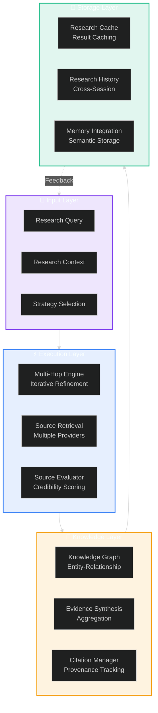
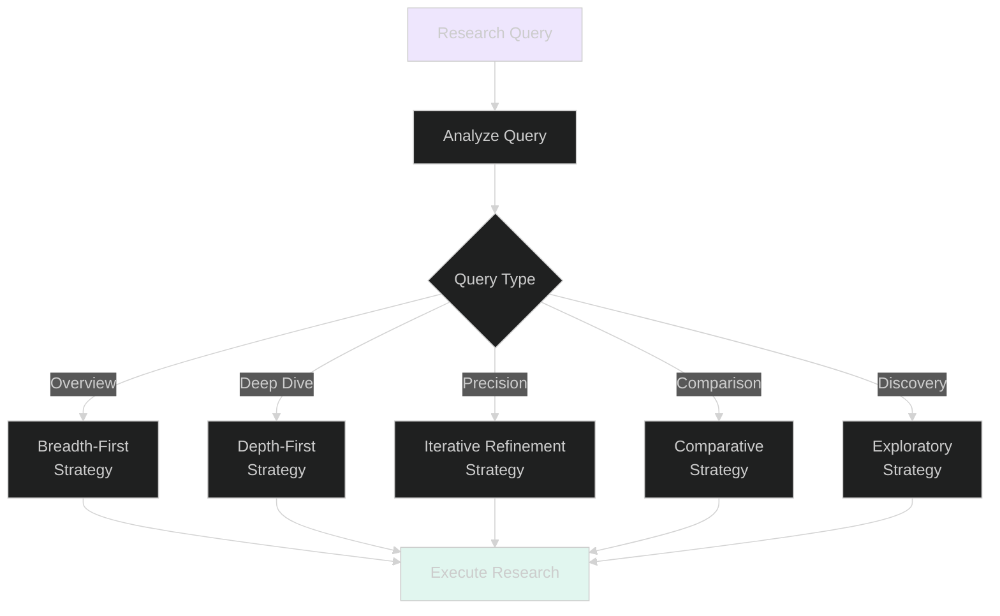
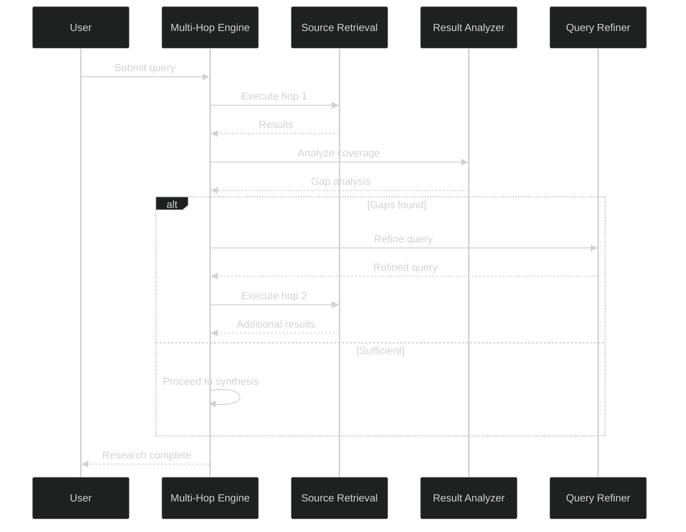
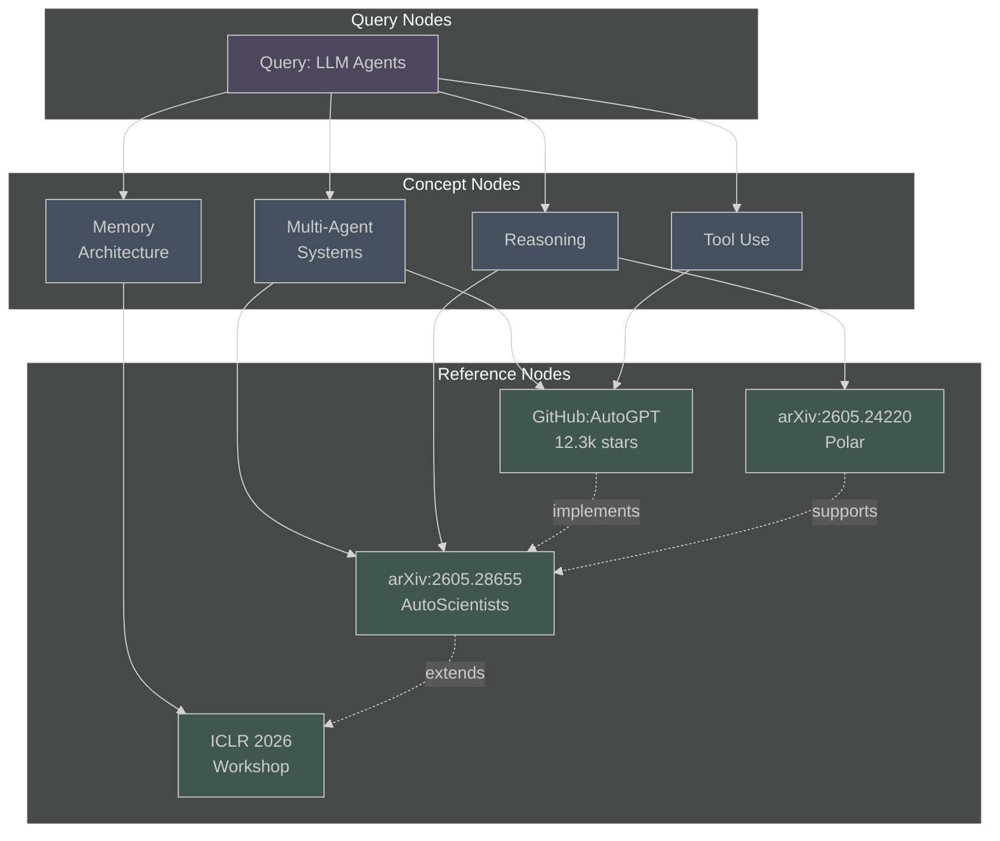
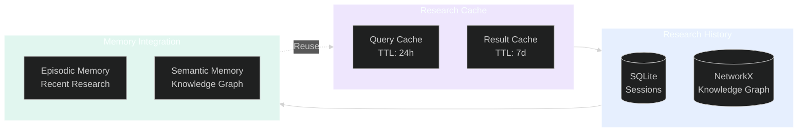
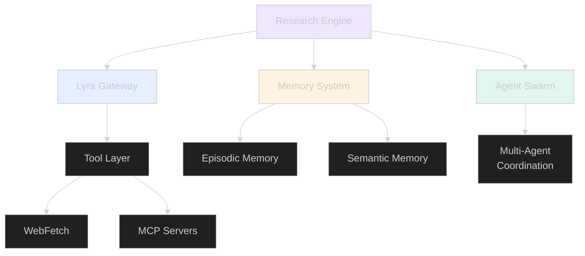
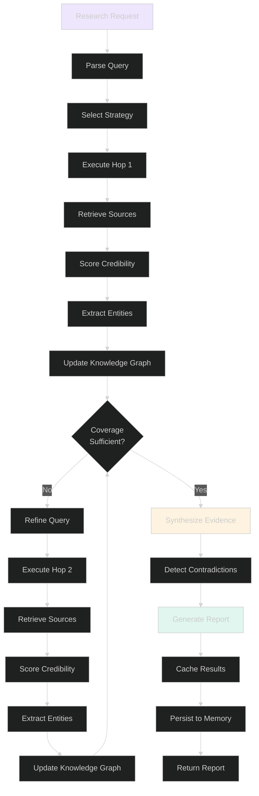
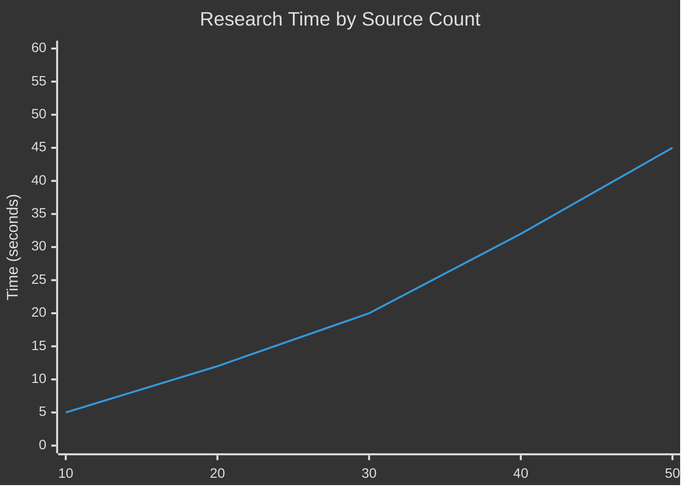

# Research Engine Architecture

**System:** Multi-Hop Deep Research Engine  
**Version:** 2.0  
**Status:** Active Development  
**Last Updated:** 2026-06-02

---

## Executive Summary

The Lyra Research Engine is a sophisticated multi-hop research system that combines iterative query refinement, knowledge graph construction, source credibility scoring, and evidence synthesis. It enables autonomous deep research across diverse sources with full citation provenance and cross-session knowledge persistence.

### Core Capabilities

1. **Multi-Hop Reasoning**: Iterative query refinement across 3-5 research hops
2. **Knowledge Graph**: Entity-relationship graph with 500+ nodes
3. **Source Credibility**: Multi-dimensional evaluation (authority, recency, citations, methodology, relevance)
4. **Evidence Synthesis**: Aggregation with contradiction detection
5. **Citation Management**: Full provenance tracking with citation traversal

---

## System Overview

### High-Level Architecture



---

## Component Architecture

### 1. Input Layer

The Input Layer handles query ingestion, context preparation, and strategy selection.

#### Components

| Component | Purpose | Technology |
|-----------|---------|------------|
| **Query Parser** | Parse and normalize research queries | Python NLP, regex |
| **Context Builder** | Assemble research context from prior sessions | SQLite, JSON |
| **Strategy Selector** | Choose optimal research strategy based on query type | ML classifier, rule-based |

#### Query Classification



---

### 2. Execution Layer

The Execution Layer orchestrates multi-hop research, retrieves sources, and evaluates credibility.

#### Multi-Hop Engine



#### Source Retrieval Providers

| Provider | Type | Use Case |
|----------|------|----------|
| **arXiv** | Academic papers | Scientific research |
| **GitHub** | Code repositories | Implementation examples |
| **Web Search** | General web | Broad coverage |
| **Academic DBs** | Papers, journals | Peer-reviewed research |
| **Documentation** | API docs, guides | Technical references |

---

### 3. Knowledge Layer

The Knowledge Layer constructs the knowledge graph, synthesizes evidence, and manages citations.

#### Knowledge Graph Structure



#### Graph Operations

| Operation | Description | Complexity |
|-----------|-------------|------------|
| **Add Node** | Insert entity or reference | O(1) |
| **Add Edge** | Create relationship | O(1) |
| **Query Subgraph** | Find related nodes | O(n + m) |
| **Traverse Paths** | Find paths between nodes | O(n²) |
| **Merge Duplicates** | Deduplicate entities | O(n log n) |
| **Community Detection** | Identify clusters | O(n²) |

---

### 4. Storage Layer

The Storage Layer persists research results, manages cache, and integrates with memory systems.

#### Storage Architecture



#### Data Persistence

| Store | Technology | Purpose | Retention |
|-------|------------|---------|-----------|
| **Query Cache** | In-memory | Fast repeated queries | 24 hours |
| **Result Cache** | SQLite + JSON | Cached research results | 7 days |
| **Session History** | SQLite | Research sessions | 30 days |
| **Knowledge Graph** | NetworkX + pickle | Entity-relationship graph | Persistent |
| **Memory Store** | SQLite FTS5 + sentence-transformers | Semantic search | Persistent |

---

## Integration Points

### Integration with Core Systems



### External Integrations

| System | Interface | Purpose |
|--------|-----------|---------|
| **Lyra Gateway** | Python API | Task routing, session management |
| **Memory System** | SQLite + NetworkX | Knowledge persistence |
| **Agent Swarm** | Python objects + EventBus | Multi-agent research coordination |
| **Tool Layer** | Python functions | Web fetch, MCP servers |
| **Context Engine** | Shared memory | Context assembly |

---

## Technology Stack

### Core Technologies

| Layer | Technology | Version | Purpose |
|-------|------------|---------|---------|
| **Language** | Python | 3.11+ | Core implementation |
| **Graph** | NetworkX | 3.2+ | Knowledge graph |
| **NLP** | spaCy | 3.7+ | Entity extraction |
| **Embeddings** | sentence-transformers | 2.3+ | Semantic search |
| **Database** | SQLite | 3.40+ | Structured storage |
| **Cache** | In-memory | - | Result caching |
| **HTTP** | requests | 2.31+ | Web requests |
| **PDF** | PyMuPDF, pdfplumber | - | Document parsing |

### Supporting Libraries

```python
# Core dependencies (from lyra-research pyproject.toml)
requests>=2.31.0             # HTTP requests
beautifulsoup4>=4.12.0       # HTML parsing
PyMuPDF>=1.23.0              # PDF parsing
pdfplumber>=0.10.0           # PDF table extraction
arxiv>=2.1.0                 # arXiv API
semanticscholar>=0.8.0       # Semantic Scholar API
networkx>=3.2                # Knowledge graph
spacy>=3.7.0                 # Entity extraction
sentence-transformers>=2.3.0 # Semantic embeddings
```

---

## Data Flow

### Complete Research Flow



---

## Performance Characteristics

### Throughput Metrics

| Metric | Target | Current | Notes |
|--------|--------|---------|-------|
| **Query Processing** | <5s | 3-4s | Single hop |
| **Multi-Hop Research** | <30s | 20-25s | 3-4 hops |
| **Graph Construction** | <10s | 8s | 50 entities |
| **Evidence Synthesis** | <15s | 12s | 20 sources |
| **Cache Hit Rate** | >60% | 55% | Improving |

### Scalability



---

## Security & Reliability

### Security Measures

1. **Input Validation**: Sanitize all research queries
2. **Source Verification**: Validate URLs and domains
3. **Rate Limiting**: Prevent abuse of external APIs
4. **Content Filtering**: Block malicious content
5. **Credential Management**: Secure API key storage

### Error Handling

| Error Type | Strategy | Recovery |
|------------|----------|----------|
| **Source Unavailable** | Fallback to alternate sources | Automatic |
| **API Rate Limit** | Exponential backoff | Automatic |
| **Parse Error** | Skip source, log error | Automatic |
| **Graph Corruption** | Rebuild from cache | Manual |
| **Memory Overflow** | Prune old entries | Automatic |

---

## Future Enhancements

### Phase 2 (Q3 2026)
- Real-time research monitoring
- Collaborative research sessions
- Automated literature reviews
- Research trend analysis

### Phase 3 (Q4 2026)
- Predictive research suggestions
- Automated hypothesis generation
- Cross-domain knowledge transfer
- Research quality prediction

---

## Related Documentation

- [System Design](./system-design.md) - Detailed design and algorithms
- [Tradeoffs](./tradeoffs.md) - Design decisions and alternatives
- [Implementation](./implementation.md) - Implementation guide
- [Evaluation](./evaluation.md) - Performance metrics and benchmarks

---

**Research Engine Architecture v2.0** | Last Updated: 2026-06-02
