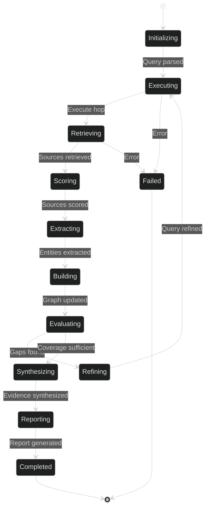

# Research Engine System Design

**System:** Multi-Hop Deep Research Engine  
**Version:** 2.0  
**Status:** Production  
**Last Updated:** 2026-06-02

---

## Overview

This document details the system design of the Lyra Research Engine, including data models, algorithms, APIs, state management, and scalability considerations.

---

## Data Models

### Core Data Structures

#### 1. Research Query

```python
@dataclass
class ResearchQuery:
    """Research query with context and strategy."""
    
    query_id: str
    text: str
    strategy: ResearchStrategy  # breadth_first, depth_first, iterative, etc.
    max_hops: int = 5
    max_sources: int = 50
    credibility_threshold: float = 0.7
    created_at: datetime
    
    # Context
    context: Dict[str, Any] = field(default_factory=dict)
    prior_queries: List[str] = field(default_factory=list)
    
    def to_dict(self) -> Dict[str, Any]:
        """Serialize to dictionary."""
        return asdict(self)
```

#### 2. Research Result

```python
@dataclass
class ResearchResult:
    """Single research source result."""
    
    result_id: str
    query_id: str
    source_type: str  # arxiv, github, web, academic_db
    title: str
    url: str
    content: str
    
    # Metadata
    authors: List[str]
    publication_date: Optional[datetime]
    citations: int
    
    # Credibility scoring
    credibility_score: float
    credibility_breakdown: Dict[str, float]  # authority, recency, citations, etc.
    
    # Extracted information
    entities: List[Entity]
    claims: List[Claim]
    
    retrieved_at: datetime
    
    def is_credible(self, threshold: float = 0.7) -> bool:
        """Check if result meets credibility threshold."""
        return self.credibility_score >= threshold
```

#### 3. Knowledge Graph Node

```python
@dataclass
class GraphNode:
    """Node in the knowledge graph."""
    
    node_id: str
    node_type: str  # query, concept, reference, person, organization
    label: str
    properties: Dict[str, Any]
    
    # Provenance
    source_result_ids: List[str]
    confidence: float
    created_at: datetime
    updated_at: datetime
    
    def __hash__(self):
        return hash(self.node_id)
```

#### 4. Knowledge Graph Edge

```python
@dataclass
class GraphEdge:
    """Edge in the knowledge graph."""
    
    edge_id: str
    source_node_id: str
    target_node_id: str
    edge_type: str  # supports, extends, contradicts, implements, is_a, part_of
    weight: float  # 0.0 to 1.0
    
    # Provenance
    evidence: List[str]  # result_ids supporting this edge
    confidence: float
    created_at: datetime
```

#### 5. Research Session

```python
@dataclass
class ResearchSession:
    """Complete research session state."""
    
    session_id: str
    query: ResearchQuery
    
    # Execution state
    current_hop: int
    completed_hops: List[ResearchHop]
    
    # Results
    all_results: List[ResearchResult]
    knowledge_graph: KnowledgeGraph
    
    # Synthesis
    synthesis: Optional[ResearchSynthesis]
    report: Optional[str]
    
    # Metadata
    started_at: datetime
    completed_at: Optional[datetime]
    total_sources: int
    cache_hits: int
    
    def is_complete(self) -> bool:
        """Check if research is complete."""
        return self.synthesis is not None and self.report is not None
```

---

## Core Algorithms

### 1. Multi-Hop Query Refinement

```python
class MultiHopEngine:
    """Multi-hop iterative research engine."""
    
    def execute_research(
        self,
        query: ResearchQuery,
        max_hops: int = 5
    ) -> ResearchSession:
        """Execute multi-hop research with iterative refinement."""
        
        session = ResearchSession(
            session_id=generate_id(),
            query=query,
            current_hop=0,
            completed_hops=[],
            all_results=[],
            knowledge_graph=KnowledgeGraph(),
            started_at=datetime.now()
        )
        
        current_query_text = query.text
        
        for hop in range(max_hops):
            logger.info(f"Executing hop {hop + 1}/{max_hops}")
            
            # Execute search for current query
            results = self.source_retriever.retrieve(
                query_text=current_query_text,
                max_results=query.max_sources // max_hops
            )
            
            # Score credibility
            scored_results = self.evaluator.score_batch(results)
            
            # Filter by credibility threshold
            credible_results = [
                r for r in scored_results 
                if r.credibility_score >= query.credibility_threshold
            ]
            
            # Extract entities and build knowledge graph
            for result in credible_results:
                entities = self.entity_extractor.extract(result.content)
                result.entities = entities
                self.graph_builder.add_result(session.knowledge_graph, result)
            
            # Store hop results
            hop_result = ResearchHop(
                hop_number=hop + 1,
                query_text=current_query_text,
                results=credible_results,
                entities_found=sum(len(r.entities) for r in credible_results)
            )
            session.completed_hops.append(hop_result)
            session.all_results.extend(credible_results)
            
            # Evaluate coverage and gaps
            coverage = self.coverage_analyzer.analyze(
                session.knowledge_graph,
                query.text
            )
            
            if coverage.is_sufficient():
                logger.info(f"Sufficient coverage achieved at hop {hop + 1}")
                break
            
            # Refine query for next hop
            if hop < max_hops - 1:
                gaps = coverage.identify_gaps()
                current_query_text = self.query_refiner.refine(
                    original_query=query.text,
                    current_results=session.all_results,
                    gaps=gaps
                )
                logger.info(f"Refined query: {current_query_text}")
        
        # Synthesize findings
        session.synthesis = self.synthesizer.synthesize(
            query=query,
            results=session.all_results,
            knowledge_graph=session.knowledge_graph
        )
        
        # Generate report
        session.report = self.report_generator.generate(session)
        session.completed_at = datetime.now()
        
        return session
```

### 2. Source Credibility Scoring

```python
class SourceEvaluator:
    """Evaluate source credibility across multiple dimensions."""
    
    WEIGHTS = {
        'authority': 0.25,
        'recency': 0.15,
        'citations': 0.20,
        'methodology': 0.25,
        'relevance': 0.15
    }
    
    def score(self, result: ResearchResult, query: str) -> float:
        """Calculate weighted credibility score."""
        
        scores = {}
        
        # Authority score (0-1)
        scores['authority'] = self._score_authority(result)
        
        # Recency score (0-1)
        scores['recency'] = self._score_recency(result.publication_date)
        
        # Citation impact score (0-1)
        scores['citations'] = self._score_citations(result.citations)
        
        # Methodology score (0-1)
        scores['methodology'] = self._score_methodology(result)
        
        # Relevance score (0-1)
        scores['relevance'] = self._score_relevance(result.content, query)
        
        # Calculate weighted average
        total_score = sum(
            scores[dim] * self.WEIGHTS[dim]
            for dim in self.WEIGHTS
        )
        
        result.credibility_breakdown = scores
        return total_score
    
    def _score_authority(self, result: ResearchResult) -> float:
        """Score based on source authority."""
        if result.source_type == 'arxiv':
            return 0.9 if self._is_peer_reviewed(result) else 0.7
        elif result.source_type == 'academic_db':
            return 0.95
        elif result.source_type == 'github':
            stars = result.properties.get('stars', 0)
            return min(1.0, stars / 5000)  # Cap at 5000 stars
        elif result.source_type == 'web':
            domain = urlparse(result.url).netloc
            return self._domain_authority_score(domain)
        return 0.5
    
    def _score_recency(self, pub_date: Optional[datetime]) -> float:
        """Score based on publication recency."""
        if not pub_date:
            return 0.5
        
        days_old = (datetime.now() - pub_date).days
        
        # Exponential decay with 2-year half-life
        half_life_days = 730
        return math.exp(-days_old / half_life_days)
    
    def _score_citations(self, citation_count: int) -> float:
        """Score based on citation impact."""
        if citation_count == 0:
            return 0.3
        
        # Logarithmic scale, caps at 1000 citations
        return min(1.0, math.log10(citation_count + 1) / 3.0)
    
    def _score_methodology(self, result: ResearchResult) -> float:
        """Score research methodology rigor."""
        indicators = [
            'methodology' in result.content.lower(),
            'experiment' in result.content.lower(),
            'evaluation' in result.content.lower(),
            'benchmark' in result.content.lower(),
            'reproducible' in result.content.lower(),
        ]
        return sum(indicators) / len(indicators)
    
    def _score_relevance(self, content: str, query: str) -> float:
        """Score relevance to query using TF-IDF."""
        from sklearn.feature_extraction.text import TfidfVectorizer
        from sklearn.metrics.pairwise import cosine_similarity
        
        vectorizer = TfidfVectorizer()
        vectors = vectorizer.fit_transform([query, content])
        similarity = cosine_similarity(vectors[0:1], vectors[1:2])[0][0]
        
        return float(similarity)
```

### 3. Knowledge Graph Construction

```python
class KnowledgeGraphBuilder:
    """Build knowledge graph from research results."""
    
    def add_result(self, graph: KnowledgeGraph, result: ResearchResult):
        """Add a research result to the knowledge graph."""
        
        # Create reference node
        ref_node = GraphNode(
            node_id=f"ref_{result.result_id}",
            node_type="reference",
            label=result.title,
            properties={
                'url': result.url,
                'source_type': result.source_type,
                'credibility': result.credibility_score,
                'publication_date': result.publication_date,
                'authors': result.authors
            },
            source_result_ids=[result.result_id],
            confidence=result.credibility_score,
            created_at=datetime.now(),
            updated_at=datetime.now()
        )
        graph.add_node(ref_node)
        
        # Extract and add entity nodes
        for entity in result.entities:
            entity_node = self._create_entity_node(entity, result)
            
            # Add or merge with existing node
            existing = graph.find_node_by_label(entity.text, entity.type)
            if existing:
                # Merge nodes
                existing.source_result_ids.append(result.result_id)
                existing.confidence = max(existing.confidence, entity.confidence)
                existing.updated_at = datetime.now()
                entity_node = existing
            else:
                graph.add_node(entity_node)
            
            # Create edge from reference to entity
            edge = GraphEdge(
                edge_id=generate_id(),
                source_node_id=ref_node.node_id,
                target_node_id=entity_node.node_id,
                edge_type="mentions",
                weight=entity.confidence,
                evidence=[result.result_id],
                confidence=entity.confidence,
                created_at=datetime.now()
            )
            graph.add_edge(edge)
        
        # Extract relationships between entities
        for rel in self._extract_relationships(result):
            self._add_relationship_edge(graph, rel, result)
    
    def _extract_relationships(
        self, 
        result: ResearchResult
    ) -> List[Relationship]:
        """Extract relationships from result content."""
        # Use NLP to extract subject-predicate-object triples
        doc = self.nlp(result.content)
        
        relationships = []
        for sent in doc.sents:
            # Extract dependency parse triples
            for token in sent:
                if token.dep_ in ('nsubj', 'dobj'):
                    subj = token.head.text
                    verb = token.text
                    obj = [child.text for child in token.children 
                           if child.dep_ == 'dobj']
                    
                    if obj:
                        relationships.append(Relationship(
                            subject=subj,
                            predicate=verb,
                            object=obj[0],
                            confidence=0.8
                        ))
        
        return relationships
```

### 4. Evidence Synthesis

```python
class EvidenceSynthesizer:
    """Synthesize evidence from multiple sources."""
    
    def synthesize(
        self,
        query: ResearchQuery,
        results: List[ResearchResult],
        knowledge_graph: KnowledgeGraph
    ) -> ResearchSynthesis:
        """Synthesize findings from research results."""
        
        # Extract all claims
        all_claims = []
        for result in results:
            claims = self._extract_claims(result)
            all_claims.extend(claims)
        
        # Group claims by topic
        claim_groups = self._group_claims_by_topic(all_claims)
        
        # Analyze agreement within each group
        findings = []
        for topic, claims in claim_groups.items():
            finding = self._analyze_claim_group(topic, claims)
            findings.append(finding)
        
        # Detect contradictions
        contradictions = self._detect_contradictions(findings)
        
        # Calculate overall confidence
        overall_confidence = self._calculate_confidence(findings)
        
        return ResearchSynthesis(
            query=query.text,
            findings=findings,
            contradictions=contradictions,
            overall_confidence=overall_confidence,
            source_count=len(results),
            graph_stats=knowledge_graph.get_stats()
        )
    
    def _analyze_claim_group(
        self,
        topic: str,
        claims: List[Claim]
    ) -> Finding:
        """Analyze a group of claims on the same topic."""
        
        # Calculate agreement level
        agreement_matrix = self._calculate_agreement(claims)
        agreement_level = agreement_matrix.mean()
        
        # Weight by source credibility
        weighted_claims = [
            (claim, claim.source.credibility_score)
            for claim in claims
        ]
        
        # Aggregate using weighted voting
        aggregated = self._weighted_aggregate(weighted_claims)
        
        # Determine confidence level
        if agreement_level > 0.8:
            confidence = "HIGH"
        elif agreement_level > 0.5:
            confidence = "MEDIUM"
        else:
            confidence = "LOW"
        
        return Finding(
            topic=topic,
            statement=aggregated,
            confidence=confidence,
            agreement_level=agreement_level,
            supporting_sources=len(claims),
            evidence=claims
        )
    
    def _detect_contradictions(
        self,
        findings: List[Finding]
    ) -> List[Contradiction]:
        """Detect contradictions between findings."""
        
        contradictions = []
        
        for i, f1 in enumerate(findings):
            for f2 in findings[i+1:]:
                if self._are_contradictory(f1, f2):
                    # Resolve using source credibility
                    resolution = self._resolve_contradiction(f1, f2)
                    
                    contradictions.append(Contradiction(
                        finding1=f1,
                        finding2=f2,
                        resolution=resolution
                    ))
        
        return contradictions
```

---

## API Design

### Research API

```python
class ResearchAPI:
    """Public API for research engine."""
    
    async def research(
        self,
        query: str,
        strategy: str = "iterative",
        max_hops: int = 5,
        max_sources: int = 50,
        credibility_threshold: float = 0.7
    ) -> ResearchSession:
        """Execute research query."""
        
        research_query = ResearchQuery(
            query_id=generate_id(),
            text=query,
            strategy=ResearchStrategy[strategy],
            max_hops=max_hops,
            max_sources=max_sources,
            credibility_threshold=credibility_threshold,
            created_at=datetime.now()
        )
        
        session = await self.engine.execute_research(research_query)
        
        # Cache results
        await self.cache.store(session)
        
        # Persist to memory
        await self.memory.persist(session)
        
        return session
    
    async def get_session(self, session_id: str) -> ResearchSession:
        """Retrieve research session."""
        return await self.cache.get(session_id)
    
    async def query_graph(
        self,
        session_id: str,
        node_type: Optional[str] = None,
        limit: int = 100
    ) -> List[GraphNode]:
        """Query knowledge graph."""
        session = await self.get_session(session_id)
        return session.knowledge_graph.query_nodes(
            node_type=node_type,
            limit=limit
        )
```

---

## State Management

### Session State Machine



### State Persistence

```python
class SessionStateManager:
    """Manage research session state."""
    
    def __init__(self, storage_path: Path):
        self.storage_path = storage_path
        self.active_sessions: Dict[str, ResearchSession] = {}
    
    async def save_state(self, session: ResearchSession):
        """Persist session state to disk."""
        session_dir = self.storage_path / session.session_id
        session_dir.mkdir(exist_ok=True)
        
        # Save session metadata
        metadata_path = session_dir / "metadata.json"
        with open(metadata_path, 'w') as f:
            json.dump({
                'session_id': session.session_id,
                'query': session.query.to_dict(),
                'current_hop': session.current_hop,
                'started_at': session.started_at.isoformat(),
                'completed_at': session.completed_at.isoformat() if session.completed_at else None
            }, f, indent=2)
        
        # Save results
        results_path = session_dir / "results.jsonl"
        with open(results_path, 'w') as f:
            for result in session.all_results:
                f.write(json.dumps(asdict(result), default=str) + '\n')
        
        # Save knowledge graph
        graph_path = session_dir / "knowledge_graph.pkl"
        with open(graph_path, 'wb') as f:
            pickle.dump(session.knowledge_graph, f)
        
        # Save report
        if session.report:
            report_path = session_dir / "report.md"
            report_path.write_text(session.report)
    
    async def load_state(self, session_id: str) -> ResearchSession:
        """Load session state from disk."""
        session_dir = self.storage_path / session_id
        
        if not session_dir.exists():
            raise ValueError(f"Session {session_id} not found")
        
        # Load metadata
        with open(session_dir / "metadata.json") as f:
            metadata = json.load(f)
        
        # Load results
        results = []
        with open(session_dir / "results.jsonl") as f:
            for line in f:
                results.append(ResearchResult(**json.loads(line)))
        
        # Load knowledge graph
        with open(session_dir / "knowledge_graph.pkl", 'rb') as f:
            knowledge_graph = pickle.load(f)
        
        # Reconstruct session
        session = ResearchSession(
            session_id=session_id,
            query=ResearchQuery(**metadata['query']),
            current_hop=metadata['current_hop'],
            completed_hops=[],
            all_results=results,
            knowledge_graph=knowledge_graph,
            started_at=datetime.fromisoformat(metadata['started_at']),
            completed_at=datetime.fromisoformat(metadata['completed_at']) if metadata['completed_at'] else None
        )
        
        return session
```

---

## Scalability Considerations

### Horizontal Scaling

1. **Stateless API Layer**: API servers are stateless, session state stored in Redis/DB
2. **Distributed Source Retrieval**: Parallelize source retrieval across worker pool
3. **Async I/O**: Use asyncio for concurrent HTTP requests
4. **Graph Partitioning**: Partition large knowledge graphs by topic clusters

### Performance Optimization

```python
class OptimizedMultiHopEngine:
    """Performance-optimized multi-hop engine."""
    
    async def execute_research_parallel(
        self,
        query: ResearchQuery
    ) -> ResearchSession:
        """Execute research with parallel source retrieval."""
        
        session = self._init_session(query)
        
        for hop in range(query.max_hops):
            # Parallel source retrieval
            tasks = [
                self._retrieve_from_provider(provider, query.text)
                for provider in self.providers
            ]
            
            results_batches = await asyncio.gather(*tasks)
            results = [r for batch in results_batches for r in batch]
            
            # Parallel credibility scoring
            scored_results = await self._score_parallel(results)
            
            # Sequential graph building (requires locking)
            for result in scored_results:
                self.graph_builder.add_result(session.knowledge_graph, result)
            
            # Evaluate coverage
            coverage = self.coverage_analyzer.analyze(
                session.knowledge_graph,
                query.text
            )
            
            if coverage.is_sufficient():
                break
        
        return session
```

### Caching Strategy

```python
class ResearchCache:
    """Multi-tier research result cache."""
    
    def __init__(self, redis_client, ttl_hours: int = 24):
        self.redis = redis_client
        self.ttl = ttl_hours * 3600
        self.memory_cache = LRUCache(maxsize=1000)
    
    async def get(self, query: str) -> Optional[ResearchSession]:
        """Get cached research results."""
        
        # Check memory cache first (L1)
        cache_key = self._hash_query(query)
        if cache_key in self.memory_cache:
            return self.memory_cache[cache_key]
        
        # Check Redis cache (L2)
        cached = await self.redis.get(f"research:{cache_key}")
        if cached:
            session = pickle.loads(cached)
            self.memory_cache[cache_key] = session
            return session
        
        return None
    
    async def store(self, query: str, session: ResearchSession):
        """Store research results in cache."""
        cache_key = self._hash_query(query)
        
        # Store in Redis with TTL
        await self.redis.setex(
            f"research:{cache_key}",
            self.ttl,
            pickle.dumps(session)
        )
        
        # Store in memory cache
        self.memory_cache[cache_key] = session
```

---

## Related Documentation

- [Architecture](./architecture.md) - System architecture overview
- [Tradeoffs](./tradeoffs.md) - Design decisions and alternatives
- [Implementation](./implementation.md) - Implementation guide
- [Evaluation](./evaluation.md) - Performance metrics and benchmarks

---

**Research Engine System Design v2.0** | Last Updated: 2026-06-02
