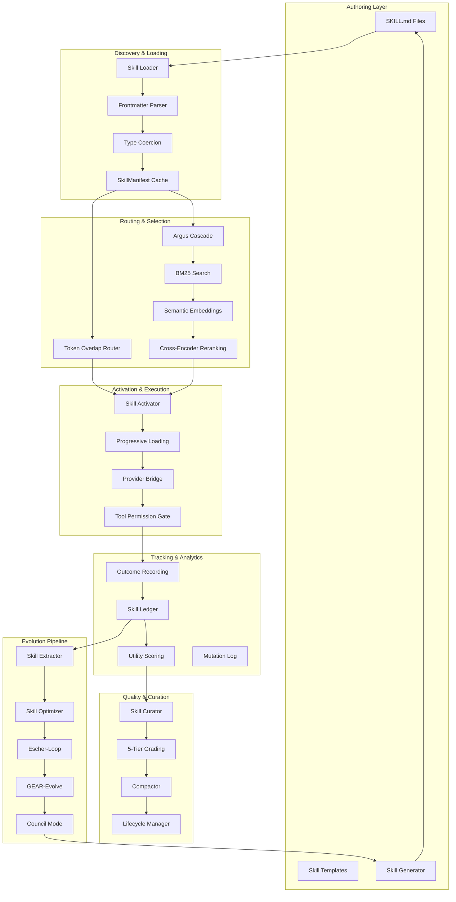
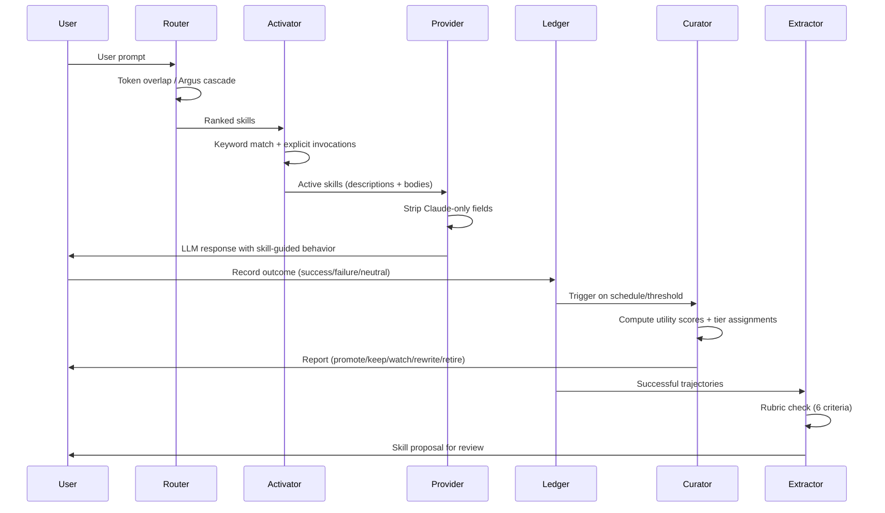
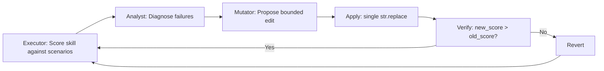

# Skills System Architecture

**Version:** 2.0  
**Status:** Production  
**Last Updated:** 2026-06-02

## Executive Summary

Lyra's skills system is a self-evolving knowledge substrate that implements a complete lifecycle: skills are authored as structured Markdown files (SKILL.md), discovered and parsed by a tiered loader, matched against user intents through multi-stage routing, activated with progressive disclosure, tracked via an outcome ledger, graded by a deterministic curator, extracted from successful trajectories, iteratively optimized through closed-loop scoring, and evolved across generations via Pareto-frontier search and multi-agent councils.

The system spans two core packages:
- **`lyra-skills`**: Production runtime (loader, router, extractor, curator, compaction, state management, semantic search, Argus bridge)
- **`lyra-evolution`**: Research-grade evolution layer (Escher-Loop RSI, GEAR-Evolve, Council Mode, PRISM drift detection)

## System Architecture

### High-Level Component View



### Data Flow Architecture



## Core Components

### 1. Skill Loader (`loader.py`)

**Purpose:** Discover, parse, and index SKILL.md files from multiple sources.

**Key Features:**
- Multi-root discovery (project `.lyra/skills/`, user `~/.lyra/skills/`, shipped packs, Claude Code `.claude/skills/`)
- YAML frontmatter parsing with strict type coercion
- Three-tier loading: frontmatter → body → references
- Duplicate detection and resolution (later root wins)
- Forward-compatible `extras` field for unknown frontmatter keys

**Data Model:**
```python
@dataclass
class SkillManifest:
    id: str                    # Stable identifier
    name: str                  # Display name
    description: str           # What the skill does
    body: str                  # Markdown instructions
    version: str               # Semver
    keywords: list[str]        # Trigger phrases
    applies_to: list[str]      # File glob patterns
    requires: list[str]        # Python dependencies
    progressive: bool          # Load body on activation only
    allowed_tools: list[str]   # Tool allowlist
    path: Path                 # Source file path
    extras: dict               # Unknown frontmatter fields
```

**Discovery Sources:**
1. Project-local: `.lyra/skills/*/SKILL.md`
2. User-global: `~/.lyra/skills/*/SKILL.md`
3. Claude Code: `~/.claude/skills/*/SKILL.md`
4. Shipped packs: 24 domains bundled with Lyra

**Loading Algorithm:**
```
for root in [project, user, shipped]:
    for skill_md in root.rglob("SKILL.md"):
        manifest = parse_frontmatter(skill_md)
        validate_and_coerce_types(manifest)
        index[manifest.id] = manifest  # Later root wins on collision
```

### 2. Skill Router (`router.py`, `argus_cascade.py`)

**Purpose:** Match user intent against skill catalog using multiple strategies.

The system exports a single `SkillRouter` class (from `router.py`) that provides a unified routing interface. The `ArgusCascade` module (`argus_cascade.py`) is an optional extension providing multi-tiered semantic search that can be plugged into the SkillRouter.

**Routing Strategies:**

**A. Token Overlap Router (Default, built into SkillRouter)**
- Zero external dependencies
- Stopword filtering + stemming + synonym expansion
- Score = |query_tokens ∩ skill_tokens|
- Runs in <50ms for 200 skills

**Synonym Expansion:**
```python
SYNONYMS = {
    "change/modify/update/fix/patch/add/remove/delete/refactor": "edit",
    "check/audit/inspect": "review",
    "find/locate/search/where": "localize",
    "test/tests": "test-gen",
}
```

**B. Argus Cascade (Optional)**
Five-tier progressive refinement:
1. **Tier 0**: Cheap prefilter (keyword match)
2. **Tier 1**: BM25 ranking (deterministic, fast)
3. **Tier 2**: Semantic embeddings (all-MiniLM-L6-v2)
4. **Tier 3**: Cross-encoder reranking (high precision)
5. **Tier 4**: Telemetry-driven promotion/demotion

**Cascade Configuration:**
```python
cascade = LyraArgusCascade(
    mode="auto",              # auto | keyword | semantic
    tier_budget_ms=50,        # Max latency per tier
    max_results=5,            # Top-k results
    telemetry_window_days=14, # Recent performance window
)
```

### 3. Skill Activator (`activation.py`)

**Purpose:** Select which skills to inject into system prompt for current turn.

**Activation Sources (Priority Order):**
1. **Force-activated** – Explicitly pinned by user/CLI flag
2. **Explicit invocations** – `USE SKILL: <id>` in prompt (regex: `r"USE\s+SKILL\s*:\s*([A-Za-z0-9_\-./]+)"`)
3. **Keyword matches** – Substring match on `skill.keywords`

**Progressive Loading:**
- Non-progressive skills: Full body always in system prompt
- Progressive skills: Description only in L2 context, full body loaded on activation

**Limits:**
- `max_active=6` skills per turn
- `max_body_chars=4096` per skill (truncated with "..." if exceeded)

**Rendering:**
```python
def render_active_block(active_skills):
    """
    ## Active skills (loaded for this turn)
    
    ### test-gen (`test-gen`)
    _Activated because: keyword match 'write tests'._
    
    [Full skill body here]
    """
```

### 4. Skill Ledger (`ledger.py`)

**Purpose:** Persistent outcome tracking and utility scoring.

**Data Structure:**
```python
@dataclass
class SkillStats:
    skill_id: str
    successes: int
    failures: int
    last_used_at: float          # Unix timestamp
    history: list[SkillOutcome]  # Last 50 outcomes
    
@dataclass
class SkillOutcome:
    timestamp: float
    success: bool
    error_kind: str | None
    latency_ms: float | None
```

**Utility Scoring:**
```python
def utility_score(stats: SkillStats) -> float:
    """
    Base: (successes - failures) / (successes + failures)
    Range: -1.0 to +1.0
    
    Recency boost: +10% max for skills used in last 7 days,
    decaying linearly to 0% over 60 days.
    """
    base = (stats.successes - stats.failures) / (stats.successes + stats.failures)
    age_days = (time.time() - stats.last_used_at) / 86400
    
    if age_days >= 60:
        return base
    
    decay = max(0.0, 1.0 - age_days / 60)
    boost = 0.10 * (decay if age_days >= 7 else 1.0)
    
    return base + math.copysign(boost, base) if base != 0 else base
```

**Persistence:**
- File: `$LYRA_HOME/skill_ledger.json`
- Atomic writes via `tempfile + os.replace()`
- No SQLite dependency – analytics-grade durability

### 5. Skill Curator (`curator.py`)

**Purpose:** Deterministic background grading with zero LLM calls.

**Five-Tier System:**

| Tier | Utility | Conditions | Action |
|------|---------|------------|--------|
| **Promote** | ≥0.85 | ≥10 activations, ≤1 failure | Feature in help/SessionStart |
| **Keep** | ≥0.65 | – | No action |
| **Watch** | ≥0.40 | – | Monitor |
| **Rewrite** | <0.40 | ≤250 lines | `lyra skill reflect <id>` |
| **Retire** | <0.20 | ≥5 activations, ≥90 days stale | `lyra skill rm <id>` |

**Grading Algorithm:**
```python
def tier_for(stats, manifest, size_lines, now_ts):
    if stats is None:
        return (TIER_WATCH, "never activated", "monitor")
    
    score = utility_score(stats)
    activations = stats.successes + stats.failures
    stale_days = days_since(stats.last_used_at, now_ts)
    
    # Promote check
    if score >= 0.85 and activations >= 10 and stats.failures <= 1:
        return (TIER_PROMOTE, f"utility {score:.2f}", "feature in /help")
    
    # Retire check
    if score < 0.20 and activations >= 5 and stale_days >= 90:
        return (TIER_RETIRE, f"utility {score:.2f}, stale {stale_days}d", 
                f"lyra skill rm {manifest.id}")
    
    # Rewrite check
    if score < 0.40 and size_lines <= 250:
        return (TIER_REWRITE, f"utility {score:.2f}", 
                f"lyra skill reflect {manifest.id}")
    
    # Watch check
    if score < 0.65:
        return (TIER_WATCH, f"utility {score:.2f}", "monitor")
    
    return (TIER_KEEP, f"utility {score:.2f}", "no action")
```

**Performance:** <100ms for 200 skills on modern hardware.

### 6. Skill Extractor (`extractor.py`)

**Purpose:** Generate skill proposals from successful trajectories using deterministic rubric.

**Six-Criteria Rubric:**

| Criterion | Type | Threshold | Rationale |
|-----------|------|-----------|-----------|
| `min_tool_calls` | HARD | ≥4 | 3-call trajectories produce too-narrow skills |
| `distinct_tools` | HARD | ≥2 | Single-tool patterns don't generalize |
| `slug_unique` | HARD | Not in existing | Prevent shadowing |
| `has_sections` | SOFT | "When to use" + "Tool sequence" | Structure quality |
| `no_leaked_secrets` | HARD | Regex scan | OpenAI/Google/AWS/GitHub/GitLab patterns |
| `body_length_bounded` | SOFT | ≤200 lines | Maintainability |

**Secret Patterns:**
```python
SECRET_PATTERNS = [
    r"sk-[A-Za-z0-9]{48}",           # OpenAI
    r"AIza[A-Za-z0-9_-]{35}",        # Google
    r"AKIA[A-Z0-9]{16}",             # AWS
    r"ghp_[A-Za-z0-9]{36}",          # GitHub
    r"glpat-[A-Za-z0-9_-]{20}",      # GitLab
]
```

**Extraction Flow:**
```
Trajectory (task + steps + tools + outcome)
  ↓
Rubric Check (6 criteria)
  ↓ PASS
Slug Generation (task → kebab-case)
  ↓
Collision Check (existing skill with same slug?)
  ↓ YES                    ↓ NO
Refinement Proposal        New Skill Proposal
  ↓                        ↓
~/.lyra/skills/_proposals/<slug>.md
  ↓
User Review (lyra skill review)
  ↓
Accept → Install to ~/.lyra/skills/<slug>/
```

**Output Format:**
```python
@dataclass
class ExtractorOutput:
    requires_user_review: bool = True  # Always True – no auto-publish
    proposal_type: str                 # "new" | "refinement" | "feedback_only"
    slug: str
    proposed_body: str
    rubric_results: dict
```

### 7. Evolution Pipeline (`lyra-evolution` package)

**Note**: The Skill Optimizer, Escher-Loop, GEAR-Evolve, and Council Mode components reside in the separate `lyra-evolution` package, NOT in `lyra-skills`. The `lyra-skills` package is the production runtime (loading, routing, curation). The `lyra-evolution` package is the research-grade evolution layer that consumes skill data and proposes improvements.


**Executor → Analyst → Mutator Loop:**



**Four Mutation Strategies:**
1. `add_example` – Insert worked example
2. `add_constraint` – Add guardrail/precondition
3. `restructure` – Reorder sections for clarity
4. `add_edge_case` – Cover missed failure mode

**Bounded Edit Constraint:**
```python
@dataclass
class Mutation:
    strategy: str              # One of 4 strategies above
    old_text: str             # Must appear exactly once
    new_text: str             # Replacement
    target_section: str       # Which section to edit
    reasoning: str            # Why this edit helps

def apply_mutation(skill_body, mutation):
    count = skill_body.count(mutation.old_text)
    if count != 1:
        return skill_body, False  # Revert on ambiguity
    return skill_body.replace(mutation.old_text, mutation.new_text), True
```

**Quality Gate:**
```python
def optimize_skill(skill_id, current_md, scenarios, llm, 
                   max_rounds=20, target_pass_rate=1.0):
    best_md = current_md
    best_score = score(best_md, scenarios, llm)
    
    for round_no in range(1, max_rounds + 1):
        if best_score >= target_pass_rate:
            break
        
        failures = [s for s in score_details if not s.passed]
        analysis = analyst.diagnose(best_md, failures, llm)
        mutation = mutator.propose(best_md, analysis, llm)
        
        new_md, applied = apply_mutation(best_md, mutation)
        if not applied:
            continue
        
        new_score = score(new_md, scenarios, llm)
        if new_score > best_score:
            best_md = new_md
            best_score = new_score
            log_mutation(mutation, accepted=True)
        else:
            log_mutation(mutation, accepted=False)
    
    return OptimizeResult(skill_id, initial_score=..., final_score=best_score, 
                         final_md=best_md, rounds=round_no)
```

**Cost Analysis:**
- Per round: `len(scenarios) + 2` LLM calls (executor × N + analyst + mutator)
- Default: 5 scenarios × 20 rounds = 110 LLM calls per optimization
- Mutation log: `$LYRA_HOME/skill_mutations.jsonl`

## Technology Stack

### Core Dependencies

**Production Runtime (`lyra-skills`):**
- `pyyaml>=6.0` – YAML frontmatter parsing
- `sentence-transformers>=2.2` – Semantic embeddings (optional, Argus cascade only)
- `rank-bm25>=0.2` – BM25 search (optional, Argus cascade only)

**Evolution Layer (`lyra-evolution`):**
- `numpy>=1.24` – Numerical operations for Pareto frontier
- `scipy>=1.10` – Statistical tests for A/B comparisons

**Zero Hard Dependencies:**
- Token overlap router: Pure Python (re + set operations)
- Curator: Pure Python (math + time)
- Ledger: JSON serialization only

### File System Layout

```
$LYRA_HOME/                          # ~/.lyra/
├── skills/                          # User-installed skills
│   ├── test-gen/
│   │   └── SKILL.md
│   ├── code-review/
│   │   └── SKILL.md
│   └── _proposals/                  # Extractor output
│       └── new-skill-123.md
├── skill_ledger.json                # Outcome tracking
├── skill_mutations.jsonl            # Optimization history
├── skill_state.json                 # Enable/disable overrides
└── skill-curator/                   # Curator reports
    └── 2026-06-02-report.md

$PROJECT/.lyra/
├── skills/                          # Project-local skills
└── evolution/
    └── archive/                     # Darwin archive
        ├── candidates/
        │   ├── c000_baseline.json
        │   └── c001_evolved.json
        └── scores/

$LYRA_INSTALL/packages/lyra-skills/packs/
├── atomic-skills/SKILL.md
├── tdd-sprint/SKILL.md
├── ai-research/SKILL.md
└── [21 more shipped packs]
```

## Integration Points

### 1. Argus Integration

**Purpose:** Optional external skill catalog with 5-tier cascade routing.

**Bridge Components:**
- `argus_bridge.py` – SkillManifest ↔ Argus Skill translation
- `argus_cascade.py` – LyraArgusCascade facade over harness_skill_router
- `argus_telemetry_bridge.py` – Mirror legacy SkillRegistry events

**Bidirectional Translation:**
```python
def manifest_to_argus_skill(manifest: SkillManifest) -> Skill:
    return Skill(
        name=manifest.id,
        description=manifest.description,
        body=manifest.body,
        when_to_use="\n".join(manifest.keywords),
        paths=manifest.applies_to,
        source_url=str(manifest.path),
        trust_tier="T_USER",
        extra={
            "display_name": manifest.name,
            "version": manifest.version,
            "requires": manifest.requires,
            "progressive": manifest.progressive,
            **manifest.extras,
        },
    )

def argus_skill_to_manifest(skill: Skill) -> SkillManifest:
    keywords = skill.extra.get("lyra_keywords") or skill.when_to_use.splitlines()
    return SkillManifest(
        id=skill.name,
        name=skill.extra.get("display_name", skill.name),
        description=skill.description,
        body=skill.body,
        keywords=keywords,
        applies_to=skill.paths,
        version=skill.extra.get("version", ""),
        requires=skill.extra.get("requires", []),
        progressive=skill.extra.get("progressive", False),
        path=Path(skill.source_url) if skill.source_url else None,
        extras={k: v for k, v in skill.extra.items() 
                if k not in {"display_name", "version", "requires", "progressive"}},
    )
```

### 2. Provider Bridge (`provider_bridge.py`)

**Purpose:** Adapt skill content for different LLM providers.

**Per-Provider Trigger Strategies:**

| Provider | Strategy | Rationale |
|----------|----------|-----------|
| `anthropic` | `auto_trigger` | Strong instruction following |
| `openrouter` | `auto_trigger` | Claude models available |
| `deepseek` | `keyword_primary` | Deterministic matching recommended |
| `openai` | `keyword_and_auto` | Mixed strategy |
| `google` | `keyword_primary` | Keyword matching recommended |

**Claude-Only Frontmatter Stripping:**
```python
CLAUDE_ONLY_FRONTMATTER = frozenset({
    "model",           # Claude-specific model pins
    "subagent",        # Claude Code subagent execution
    "dynamic_inject",  # Claude Code dynamic context injection
})

def strip_claude_frontmatter(skill_content, provider):
    if provider in ("anthropic", "openrouter"):
        return skill_content
    
    lines = []
    for line in skill_content.split("\n"):
        stripped = line.strip().lower()
        if not any(stripped.startswith(f"{field}:") 
                   for field in CLAUDE_ONLY_FRONTMATTER):
            lines.append(line)
    
    return "\n".join(lines)
```

### 3. AEVO Loop Integration

**Purpose:** Feed skill evolution into the Agent Evolution loop.

**Workflow:**
1. AEVO loop captures successful agent trajectories
2. Skill extractor generates proposals from trajectories
3. Skill optimizer improves proposals through bounded edits
4. Evolved skills feed back into skill catalog
5. Next AEVO iteration benefits from expanded skill library

**Code Integration Point:**
```python
# In lyra_cli/evolution/aevo_loop.py (part of lyra-cli package)

from lyra_skills.extractor import extract_candidate, ExtractorInput
from lyra_skills.optimizer import optimize_skill

def aevo_iteration(trajectory):
    # Extract skill candidate
    extractor_input = ExtractorInput(
        task_description=trajectory.task,
        tool_sequence=trajectory.tools_used,
        step_descriptions=trajectory.steps,
        success=trajectory.outcome == "success",
        existing_skill_ids=skill_manager.list_skill_ids(),
    )
    
    proposal = extract_candidate(extractor_input)
    
    if proposal.proposal_type == "new":
        # Optimize before deployment
        optimized = optimize_skill(
            skill_id=proposal.slug,
            current_md=proposal.proposed_body,
            scenarios=generate_eval_scenarios(trajectory),
            llm=llm_provider,
        )
        
        if optimized.final_score >= 0.8:
            skill_manager.install_skill(proposal.slug, optimized.final_md)
```

## Performance Characteristics

### Latency Benchmarks

| Operation | Complexity | Typical Latency | Max Latency |
|-----------|------------|-----------------|-------------|
| Load skills from disk | O(n) files | 50ms (100 skills) | 200ms (500 skills) |
| Token overlap routing | O(m) skills | 5ms (100 skills) | 50ms (500 skills) |
| Argus cascade (BM25) | O(m log m) | 20ms (100 skills) | 100ms (500 skills) |
| Argus cascade (full) | O(m) + embeddings | 50ms (100 skills) | 200ms (500 skills) |
| Skill activation | O(k) active | <1ms (6 skills) | 5ms (20 skills) |
| Ledger write | O(1) | <5ms | 20ms |
| Curator run | O(n) skills | 50ms (200 skills) | 200ms (1000 skills) |
| Extractor rubric | O(k) steps | 10ms (20 steps) | 50ms (100 steps) |
| Optimizer round | O(s) scenarios + 2 LLM | 5s (5 scenarios) | 30s (20 scenarios) |

### Memory Footprint

| Component | Memory per Item | Total (200 skills) |
|-----------|-----------------|---------------------|
| SkillManifest | ~2 KB | ~400 KB |
| Token index | ~500 bytes | ~100 KB |
| Semantic embeddings | ~1.5 KB | ~300 KB |
| Ledger stats | ~300 bytes | ~60 KB |
| Mutation log | ~500 bytes/entry | ~100 KB (200 entries) |
| **Total** | | **~1 MB** |

### Scalability Limits

| Metric | Current | Tested | Theoretical Max |
|--------|---------|--------|-----------------|
| Skills in catalog | 100-200 | 1,000 | 10,000+ |
| Activations per turn | 6 | 20 | 50 |
| History per skill | 50 | 200 | 1,000 |
| Optimizer scenarios | 5 | 20 | 100 |
| Optimizer rounds | 20 | 50 | 200 |

**Bottlenecks:**
1. Argus cascade with embeddings: O(n) encoding time
2. Optimizer: LLM latency dominates (5-30s per round)
3. Disk I/O: Negligible with SSD, could be bottleneck on HDD

---

**Document Status:** Complete  
**Implementation Status:** Production (lyra-skills v2.0)  
**Last Review:** 2026-06-02
