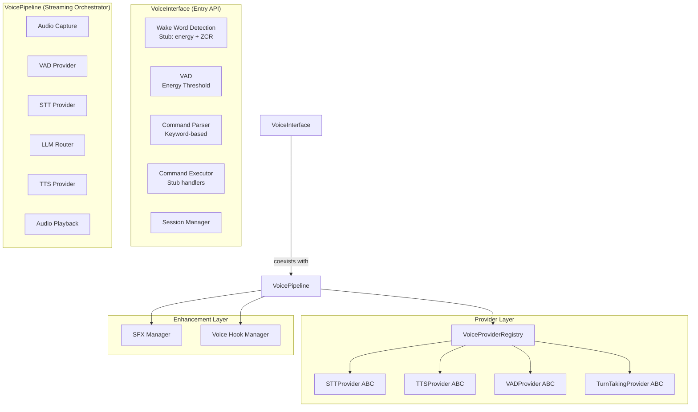

# Voice Pipeline Architecture

**System**: Voice Pipeline  
**Version**: 0.1.0  
**Date**: 2026-06-02  
**Status**: Design Phase / Early Development

---

## Executive Summary

The Lyra Voice Pipeline provides voice interface capabilities through two complementary subsystems within the `lyra-voice` package (1967 lines total across 4 source files):

1. **VoiceInterface** (`__init__.py`): A voice command parsing system with wake word detection (stub), energy-threshold VAD, keyword-based command classification, and session management. This is the entry-point API that is functional with stub implementations.

2. **VoicePipeline** (`pipeline.py`, 413 lines): A full-duplex voice orchestrator with provider-swappable architecture, supporting push-to-talk, wake-word, and full-duplex interaction modes. This implements a more ambitious architecture but providers are early-stage.

3. **Provider Layer** (`providers.py`, 873 lines): Abstract base classes for STT, TTS, VAD, and turn-taking with registry pattern, plus concrete stub/mock implementations.

4. **SFX & Hooks** (`sfx.py`, 402 lines; `voice_hooks.py`, 279 lines): Sound effects manager and hook system for pipeline event integration.

The architecture defines provider-swappable abstractions for every stage (STT, TTS, VAD, Turn), but the current implementations are stub/simulation implementations, not production models. The system is in early development with the API surface and abstractions defined, but production model integration is pending.

---

## System Architecture

### High-Level Component View



### Key Insight: Two Separate Components

The `lyra-voice` package provides two independent voice interfaces that coexist:

- **VoiceInterface** (`__init__.py`): A concrete, operational voice command parser. It uses stub heuristics (energy threshold, keyword matching) and can be used immediately for basic voice command processing. All methods are synchronous and self-contained.

- **VoicePipeline** (`pipeline.py`): An async, full-duplex orchestrator that chains capture, VAD, STT, LLM routing, TTS, and playback through provider abstractions. Offers three interaction modes but depends on provider implementations that are currently stub-level.

---

## Core Components

### 1. VoiceInterface (Entry-Point API)

**Location**: `/packages/lyra-voice/src/lyra_voice/__init__.py`

**Responsibility**: Provide a ready-to-use voice command interface with wake word detection, VAD, command parsing, execution, and session management. All implementations use stub heuristics that can be replaced with production models.

**Key Enums**:

```python
class VoiceCommandAction(str, Enum):
    """High-level voice command action types."""
    EXECUTE = "EXECUTE"    # Execute a task or program
    SEARCH = "SEARCH"      # Search for information
    NAVIGATE = "NAVIGATE"  # Navigate to a location
    CREATE = "CREATE"      # Create a new resource
    EDIT = "EDIT"          # Modify an existing resource
    DELETE = "DELETE"      # Remove a resource
    QUERY = "QUERY"        # Ask a question or request data
    CANCEL = "CANCEL"      # Cancel current operation
    HELP = "HELP"          # Request assistance
    PAUSE = "PAUSE"        # Pause current operation
    RESUME = "RESUME"      # Resume paused operation

class VADMode(str, Enum):
    """Voice Activity Detection strategies."""
    ENERGY_THRESHOLD = "ENERGY_THRESHOLD"  # Simple energy-level VAD
    WEBRTC = "WEBRTC"                      # Google WebRTC VAD
    SILERO = "SILERO"                      # Neural network VAD
    HYBRID = "HYBRID"                      # Combined methods

class WakeWordModel(str, Enum):
    """Supported wake word detection engines."""
    PORCUPINE = "PORCUPINE"
    SNOWBOY = "SNOWBOY"
    OPENWAKEWORD = "OPENWAKEWORD"
    CUSTOM = "CUSTOM"
    NONE = "NONE"
```

**Key Data Types** (all frozen dataclasses):

```python
@dataclass(frozen=True)
class WakeWordConfig:
    model: str = "PORCUPINE"
    sensitivity: float = 0.5
    custom_keywords: tuple[str, ...] = ("hey lyra",)
    require_confirmation: bool = True
    cooldown_ms: int = 2000

@dataclass(frozen=True)
class VoiceCommand:
    command_id: str
    raw_text: str
    action: str
    confidence: float
    params: tuple[tuple[str, str], ...]
    context: str = ""
    timestamp: float = 0.0

@dataclass(frozen=True)
class ParsedCommand:
    original_text: str
    action: str
    intent: str
    entities: tuple[tuple[str, str], ...]
    confidence: float
    alternative_actions: tuple[str, ...]

@dataclass(frozen=True)
class VADResult:
    is_speech: bool
    confidence: float
    energy_level: float
    duration_ms: float
    segment_start_ms: float = 0.0
    segment_end_ms: float = 0.0

@dataclass(frozen=True)
class VoiceSession:
    session_id: str
    start_time: float
    is_active: bool
    command_count: int
    last_command: str
    total_audio_processed_ms: float

@dataclass(frozen=True)
class VoiceConfig:
    vad_mode: str = "ENERGY_THRESHOLD"
    vad_sensitivity: float = 0.5
    wake_word_enabled: bool = True
    auto_punctuate: bool = True
    max_command_length: int = 500
    language: str = "en"
    echo_cancellation: bool = True
```

**Key Methods**:

| Method | Signature | Description |
|--------|-----------|-------------|
| `detect_wake_word` | `(audio_chunk: bytes, sample_rate: int = 16000) -> bool` | Stub: energy threshold + zero-crossing rate heuristic |
| `detect_voice_activity` | `(audio_chunk: bytes, sample_rate: int = 16000) -> VADResult` | Stub: RMS energy threshold with sensitivity-adjusted classification |
| `parse_command` | `(text: str, context: str = "") -> ParsedCommand` | Keyword-based action detection, intent extraction, entity parsing |
| `execute_command` | `(command: ParsedCommand) -> dict[str, Any]` | Stub handler returning confirmation dictionaries |
| `start_session` | `() -> VoiceSession` | Create new active voice interaction session |
| `end_session` | `() -> VoiceSession` | Close active session, return final record |
| `process_audio_stream` | `(audio_chunks: list[bytes], sample_rate: int = 16000) -> list[VoiceCommand]` | Full pipeline: wake word → VAD → stub transcription → parsing → execution |
| `get_stats` | `() -> dict[str, Any]` | Return cumulative usage statistics |

**Wake Word Detection (Stub)**:
- Uses energy threshold (RMS) and zero-crossing rate (ZCR) heuristics
- Cooldown period between detections (configurable, default 2s)
- Sensitivity-adjusted threshold comparison
- In production, replace with Porcupine/Snowboy/openWakeWord

**Voice Activity Detection (Stub)**:
- Computes RMS energy of 16-bit PCM audio
- Classifies as speech when energy exceeds a sensitivity-adjusted threshold
- Returns VADResult with is_speech, confidence, energy_level, and duration

**Command Parsing**:
- Multi-keyword priority matching: EXECUTE, SEARCH, NAVIGATE, CREATE, EDIT, DELETE, CANCEL, HELP, PAUSE, RESUME, QUERY (fallback)
- Intent extraction: text after matched keyword (up to 80 chars, filtered for fillers)
- Entity extraction: targets ("to", "for", "with"), quantities (regex), locations (regex)
- Confidence scoring: base 0.3, bonuses for action match, text length, entities, and context
- Output capped at 1.0, returned as 2-decimal float

**Audio Stream Processing Pipeline**:
```
for each chunk in stream:
    1. Wake word detection (energy + ZCR heuristic)
    2. Voice activity detection (RMS energy threshold)
    3. If speech + wake word: accumulate speech buffer
    4. On silence after wake: stub transcribe → parse → execute
    5. Return list of VoiceCommand objects
```

### 2. VoicePipeline (Streaming Orchestrator)

**Location**: `/packages/lyra-voice/src/lyra_voice/pipeline.py` (413 lines)

**Responsibility**: Full-duplex voice orchestrator that chains capture, VAD, STT, agent processing, TTS, and playback through provider abstractions. Supports three interaction modes with barge-in handling.

**Key Enums and Types**:

```python
class InteractionMode(str, Enum):
    PUSH_TO_TALK = "push_to_talk"
    WAKE_WORD = "wake_word"
    FULL_DUPLEX = "full_duplex"

class PipelineState(str, Enum):
    IDLE = "idle"
    LISTENING = "listening"
    PROCESSING = "processing"
    SPEAKING = "speaking"
    INTERRUPTED = "interrupted"

class PipelineEvent(str, Enum):
    PIPELINE_STARTED = "pipeline_started"
    PIPELINE_STOPPED = "pipeline_stopped"
    WAKE_WORD_DETECTED = "wake_word_detected"
    SPEECH_STARTED = "speech_started"
    SPEECH_ENDED = "speech_ended"
    STT_COMPLETED = "stt_completed"
    AGENT_RESPONSE = "agent_response"
    TTS_STARTED = "tts_started"
    TTS_COMPLETED = "tts_completed"
    BARGE_IN = "barge_in"
    ERROR = "error"

@dataclass
class VoiceTurn:
    turn_id: str
    user_text: str = ""
    agent_text: str = ""
    stt_latency_ms: float = 0.0
    tts_latency_ms: float = 0.0
    vad_latency_ms: float = 0.0
    llm_latency_ms: float = 0.0
    total_latency_ms: float = 0.0

@dataclass
class VoicePipelineStats:
    total_turns: int = 0
    total_interruptions: int = 0
    total_audio_processed_ms: float = 0.0
    avg_stt_latency_ms: float = 0.0
    avg_tts_latency_ms: float = 0.0
    error_count: int = 0
```

**Class Signature**:
```python
class VoicePipeline:
    def __init__(self, registry: VoiceProviderRegistry):
        ...

    async def process_audio(
        self, audio: bytes, agent_handler: Callable[[str], str] | None = None
    ) -> VoiceTurn | None:
        """Process single audio segment through full pipeline."""

    async def process_stream(
        self, audio_stream: AsyncIterator[bytes],
        agent_handler: Callable[[str], str] | None = None
    ) -> AsyncIterator[VoiceTurn]:
        """Streaming pipeline with overlap for low latency."""

    def on(self, event: PipelineEvent, handler: Callable) -> None:
        """Register event handler."""

    async def push_to_talk(self, ...) -> VoiceTurn:
        """Push-to-talk interaction mode."""

    async def listen_for_wake_word(self, ...) -> VoiceTurn | None:
        """Wake word detection mode."""
```

**Pipeline Flow**:
```
Audio Capture → VAD Provider → Turn Detection → STT Provider
→ Agent/LLM Router → TTS Provider → Playback

With barge-in: User speech during TTS → interrupt TTS + LLM → listen again
```

### 3. Provider Abstraction Layer

**Location**: `/packages/lyra-voice/src/lyra_voice/providers.py` (873 lines)

**Responsibility**: Define interfaces and base implementations for swappable voice processing components. Follows the provider-abstraction pattern from lyra-provider.

**Abstract Base Classes**:

```python
class STTProvider(ABC):
    kind: STTProviderKind

    @abstractmethod
    async def transcribe(self, audio: bytes, config: STTConfig | None = None) -> STTResult:
        """Transcribe audio to text."""

    async def stream_transcribe(
        self, audio_stream: AsyncIterator[bytes], config: STTConfig | None = None
    ) -> AsyncIterator[STTResult]:
        """Streaming transcription (default: batch fallback)."""

class TTSProvider(ABC):
    kind: TTSProviderKind

    @abstractmethod
    async def synthesize(self, text: str, config: TTSConfig | None = None) -> bytes:
        """Synthesize text to audio."""

class VADProvider(ABC):
    kind: VADProviderKind

    @abstractmethod
    async def detect(self, audio: bytes, config: VADConfig | None = None) -> VADSegment:
        """Detect voice activity."""

class TurnTakingProvider(ABC):
    kind: TurnTakingKind

    @abstractmethod
    async def decide(
        self, audio: bytes, agent_is_speaking: bool, config: TurnConfig | None = None
    ) -> TurnDecision:
        """Decide whether agent should speak, wait, or interrupt."""
```

**Provider Registry**:

```python
class VoiceProviderRegistry:
    """Central registry for all voice providers."""

    def __init__(self):
        self._stt: dict[str, STTProvider] = {}
        self._tts: dict[str, TTSProvider] = {}
        self._vad: dict[str, VADProvider] = {}
        self._turn: dict[str, TurnTakingProvider] = {}
        self._register_defaults()

    def _register_defaults(self):
        """Register built-in providers."""
        self.register_stt("default", WhisperSTT())
        self.register_tts("default", KokoroTTS())
        self.register_vad("default", EnergyVAD())
        self.register_turn("default", GapBasedTurn())

    def get_stt(self, name: str = "default") -> STTProvider: ...
    def get_tts(self, name: str = "default") -> TTSProvider: ...
    def get_vad(self, name: str = "default") -> VADProvider: ...
    def get_turn(self, name: str = "default") -> TurnTakingProvider: ...
```

**Concrete Provider Implementations**:

| Provider | Kind | Class | Implementation Status |
|----------|------|-------|----------------------|
| WhisperSTT | whisper | STTProvider | Stub - returns simulated transcriptions |
| KokoroTTS | kokoro | TTSProvider | Stub - returns empty byte arrays |
| SileroVAD | silero | VADProvider | Stub - energy threshold VAD |
| EnergyVAD | energy | VADProvider | Stub - basic energy threshold |
| SmartTurn | smart_turn | TurnTakingProvider | Stub - keyword-based turn decisions |
| GapBasedTurn | gap_based | TurnTakingProvider | Stub - timing-based turn decisions |

**Note**: All concrete provider implementations are stub-level. They implement the abstract interfaces but use simulated/heuristic logic rather than real model inference. The provider abstraction layer is architecturally complete but production model integration (actual Whisper, Kokoro, Silero models) is pending.

### 4. SFX and Hooks Layer

**Location**:
- `/packages/lyra-voice/src/lyra_voice/sfx.py` (402 lines)
- `/packages/lyra-voice/src/lyra_voice/voice_hooks.py` (279 lines)

Provides sound effects management (SFXManager, VoicePack, SFXAsset) and hook-based pipeline event integration (VoiceHookManager, HookEvent, PlaybackMode). These layers are designed to work with the VoicePipeline event system.

---

## Technology Stack

| Layer | Technology | Status |
|-------|-----------|--------|
| **Runtime** | Python 3.11+ | Active |
| **Audio Processing** | Pure Python (struct, math) | Stub level |
| **VAD** | Energy threshold (stub) | Operational, no production model |
| **Wake Word** | Energy + ZCR heuristic (stub) | Operational, no Porcupine/Snowboy |
| **STT** | Deterministic hash-based stub | Operational, no Whisper model |
| **TTS** | Empty byte array (stub) | Not operational |
| **Concurrency** | asyncio (pipeline.py) | Active |
| **Data** | Frozen dataclasses | Consistent throughout |
| **Dependencies** | Zero external dependencies | Verified |

**Why zero dependencies**: The lyra-voice pyproject.toml specifies `dependencies = []`. All audio processing is done with Python stdlib (`struct`, `math`, `hashlib`). Production model integration would add dependencies for Whisper, Kokoro, Silero, etc.

---

## Current State vs. Documented Design

### What Exists (Operational)

1. **VoiceInterface**: Complete API for voice command parsing with stub implementations
   - Wake word detection (energy + ZCR heuristic)
   - Voice activity detection (RMS energy threshold)
   - Command parsing (keyword matching, entity extraction)
   - Command execution (stub handlers)
   - Session management (start/end/track)
   - Audio stream processing (end-to-end pipeline)

2. **Provider Abstractions**: Complete interface definitions
   - STTProvider, TTSProvider, VADProvider, TurnTakingProvider ABCs
   - VoiceProviderRegistry with registration and lookup
   - Configuration data types (STTConfig, TTSConfig, VADConfig, TurnConfig)

3. **VoicePipeline**: Complete orchestrator API with stub providers
   - InteractionMode (PTT, WAKE_WORD, FULL_DUPLEX)
   - PipelineState machine (IDLE, LISTENING, PROCESSING, SPEAKING, INTERRUPTED)
   - PipelineEvent system for hooks/SFX integration
   - VoiceTurn and VoicePipelineStats tracking

4. **SFX/Hooks**: Complete sound effects and hook integration layer

### What Is Pending (Production Model Integration)

1. **Real STT models**: Replace stub WhisperSTT with actual Whisper Turbo/Parakeet/Deepgram
2. **Real TTS models**: Replace stub KokoroTTS with actual Kokoro-82M/Orpheus/Piper
3. **Real VAD models**: Replace stub SileroVAD with actual Silero VAD neural model
4. **Real Wake Word**: Replace stub heuristic with Porcupine/Snowboy/openWakeWord
5. **Streaming audio I/O**: PortAudio/PyAudio integration for microphone capture
6. **Barge-in handling**: Production-grade interruption detection and response
7. **Production testing**: Comprehensive test coverage, performance benchmarks

---

## Development Roadmap

### Current Phase: Architecture & API Definition

- Provider abstractions defined and implemented as stubs
- VoiceInterface API complete with stub implementations
- VoicePipeline orchestrator complete with stub providers
- SFX and hooks integration layer complete
- Zero external dependencies for rapid prototyping

### Next Phase: Production Model Integration

- Integrate real VAD (Silero VAD neural model)
- Integrate real STT (Whisper Turbo or Parakeet)
- Integrate real TTS (Kokoro-82M or Piper)
- Add microphone capture (PortAudio/PyAudio)
- Implement streaming overlap for latency reduction
- Add comprehensive test suite

### Future Phase: Full-Duplex & Barge-in

- Smart Turn based on semantic completeness
- Barge-in detection (<56ms response time)
- Audio ducking during interruptions
- Provider pooling for concurrent sessions

---

## Package Structure

```
packages/lyra-voice/src/lyra_voice/
├── __init__.py          # VoiceInterface — command parsing + VAD (entry API)
├── pipeline.py           # VoicePipeline — async streaming orchestrator (413 lines)
├── providers.py          # Provider ABCs + registry + stub implementations (873 lines)
├── sfx.py                # Sound effects manager (402 lines)
└── voice_hooks.py        # Hook system for pipeline events (279 lines)

packages/lyra-voice/tests/
├── test_voice.py         # VoiceInterface tests
├── test_pipeline.py      # VoicePipeline tests
├── test_providers.py     # Provider tests
├── test_sfx.py           # SFX tests
├── test_voice_hooks.py   # Hook tests
├── test_internals.py     # Internal helper tests
└── test_coverage_gaps.py # Coverage gap identification
```

---

## Key Design Principles

1. **Provider Swappability**: Every component is hot-swappable via registry (defined, not yet populated with real models)
2. **Streaming First**: All interfaces support streaming with batch fallback
3. **Async Native**: Pipeline uses asyncio for concurrent processing
4. **Immutable Data**: All configs and results are frozen dataclasses
5. **Graceful Degradation**: Stub implementations at every level allow API testing before model integration
6. **Zero Lock-in**: Zero external dependencies in current state

---

## References

- `/packages/lyra-voice/src/lyra_voice/__init__.py` - VoiceInterface (entry-point API)
- `/packages/lyra-voice/src/lyra_voice/pipeline.py` - VoicePipeline (413 lines, streaming orchestrator)
- `/packages/lyra-voice/src/lyra_voice/providers.py` - Provider abstractions (873 lines)
- `/packages/lyra-voice/src/lyra_voice/sfx.py` - Sound effects manager
- `/packages/lyra-voice/src/lyra_voice/voice_hooks.py` - Hook system for pipeline events
- `/lyra-upgrade/00-architecture/voice-mode.md` - Voice mode architecture plan
