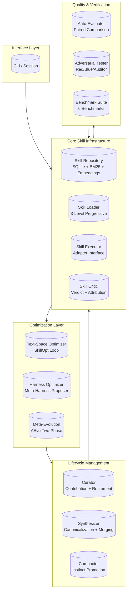
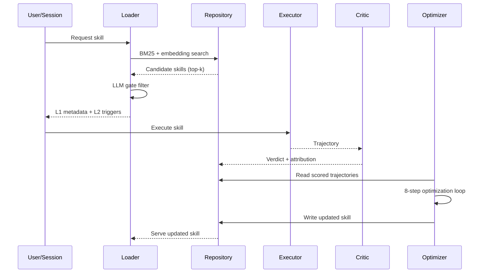

# LYRA ULTRA PLAN 21: Skills Ecosystem & Evolution Breakthrough

**Version:** 1.0.0
**Status:** Draft
**Created:** 2026-05-26
**Author:** Lyra AGI Research Team
**Estimated Duration:** 8 weeks (2 months)
**Target Completion:** 2026-07-21
**Parent Plan:** [LYRA_ULTRA_PLAN_6_OMNI_AGI_BREAKTHROUGH.md](LYRA_ULTRA_PLAN_6_OMNI_AGI_BREAKTHROUGH.md)
**Absorbs:** [LYRA_ULTRA_PLAN_7_SKILLS_ECOSYSTEM.md](LYRA_ULTRA_PLAN_7_SKILLS_ECOSYSTEM.md) (superseded)

---

## Document Overview

**Purpose:** Build the world's most advanced AI agent skills ecosystem -- 50+ production-grade domain skills across 8 disciplines with automated curation, text-space optimization, harness evolution, meta-evolution, lifecycle management, and quality verification.

**Research Foundation:** 10 breakthrough papers + 6 open-source ecosystems.

**Key Innovations:**
- SkillOpt-inspired text-space optimizer with LR budget, validation gating, slow/meta updates
- Meta-Harness agentic proposer with 500-5000x richer filesystem access than text-only optimizers
- AEvo two-phase meta-evolution: meta-agent edits optimization procedure, harnessed evolution runs candidates
- Ratchet lifecycle management with contribution scoring, bounded active-cap C=50, non-divergence guarantees
- Progressive disclosure skill loading (3-level) with BM25+embedding+LLM gate two-stage retrieval

**Success Metrics:**
| Metric | Target | Measurement |
|--------|--------|-------------|
| Benchmark Win Rate | 52/52 cells (SkillOpt parity) | Per-cell pass@1 |
| Average Gain vs. Baseline | +23.5 pts | Delta across all benchmarks |
| Token Efficiency vs. Text-Only | 4x fewer | Tokens per improvement cycle |
| Active Skills Quality | C=50 bounded, zero regressions | Non-divergence guarantee |
| Skill Retrieval Latency | <50ms p95 | Two-stage retriever timing |
| Synthesis Threshold | >=3 skills before merging | Coverage guard activation |

---

## Table of Contents

1. [Executive Summary](#1-executive-summary)
2. [Architecture Overview](#2-architecture-overview)
3. [Phase 21.1: Core Skill Infrastructure](#3-phase-211-core-skill-infrastructure)
4. [Phase 21.2: Text-Space Optimization](#4-phase-212-text-space-optimization)
5. [Phase 21.3: Harness Optimization](#5-phase-213-harness-optimization)
6. [Phase 21.4: Meta-Evolution](#6-phase-214-meta-evolution)
7. [Phase 21.5: Lifecycle Management](#7-phase-215-lifecycle-management)
8. [Phase 21.6: Quality & Verification](#8-phase-216-quality--verification)
9. [Domain Skills Blueprint](#9-domain-skills-blueprint)
10. [Skill Directory Structure](#10-skill-directory-structure)
11. [Training Pipeline](#11-training-pipeline)
12. [Monitoring & Observability](#12-monitoring--observability)
13. [Implementation Timeline](#13-implementation-timeline)
14. [Success Metrics & Acceptance Criteria](#14-success-metrics--acceptance-criteria)
15. [Innovation Lineage](#15-innovation-lineage)

---

## 1. Executive Summary

### 1.1 The Breakthrough Thesis

The Lyra Skills Ecosystem is infrastructure for creating, optimizing, evolving, and retiring AI agent skills at scale. Current systems fall into two camps -- manual curation (fragile) and prompt optimization (shallow). This plan bridges the gap with a **four-layer evolution stack**:

```
Layer 4: Meta-Evolution    Optimizes the optimizer itself (AEvo)
Layer 3: Harness Opt       Rewrites evaluation harness code (Meta-Harness)
Layer 2: Text-Space        Optimizes skill text content (SkillOpt)
Layer 1: Infrastructure    Repository, executor, critic, loader (foundation)
```

Each layer feeds into the next: infrastructure collects trajectories, text-space optimization improves content, harness optimization restructures eval code, meta-evolution improves the optimization procedure itself.

### 1.2 Phase Summary

| Phase | Key Deliverable | Key Metric |
|-------|-----------------|------------|
| 21.1 | SQLite repo, 3-level loader, adapter, critic | <50ms retrieval |
| 21.2 | 8-step optimizer loop, LR budget, reflection engine | +23.5 pts avg gain |
| 21.3 | Agentic proposer with filesystem history | 4x fewer tokens |
| 21.4 | Meta-agent constrained by meta-skill spec | +26% relative improvement |
| 21.5 | Contribution scoring, synthesis >=3, promotion | C=50 active cap |
| 21.6 | Paired auto-evaluator, adversarial, 6 benchmarks | 52/52 cells target |

### 1.3 Why Now

Lyra already has Plan 7's catalog mapped. The breakthrough is **automated skill improvement at every level**. The papers are mature (SkillOpt, AEvo, Meta-Harness, Ratchet -- all May 2026). Open-source ecosystems provide proof points. The window is now.

---

## 2. Architecture Overview

### 2.1 System Topology



### 2.2 Data Flow



### 2.3 Three-Tier Retrieval

| Stage | Algorithm | Index | Latency | Recall |
|-------|-----------|-------|---------|--------|
| Stage 1 | BM25 (Okapi) | Inverted index on name/description/tags | <50ms | ~0.70 |
| Stage 2 | all-MiniLM-L6-v2 | FAISS flat L2 index | <100ms | ~0.85 |
| Gate | LLM (Haiku) | Context-aware filter | <200ms | ~0.95 |

---

## 3. Phase 21.1: Core Skill Infrastructure

### 3.1 Skill Repository (`lyra-skill-repo`)

SQLite-backed skill store with two-stage retrieval, versioning, and metadata indexing.

```python
from __future__ import annotations
from dataclasses import dataclass, field
from enum import StrEnum


class SkillCategory(StrEnum):
    ENGINEERING = "engineering"
    DESIGN = "design"
    SRE = "sre"
    AI_RESEARCH = "ai_research"
    SOLUTIONS_ARCHITECT = "solutions_architect"
    CLOUD = "cloud"
    PRODUCT = "product"
    BUSINESS = "business"
    CREATIVE = "creative"
    REASONING = "reasoning"


class SkillStatus(StrEnum):
    STABLE = "stable"
    BETA = "beta"
    DEPRECATED = "deprecated"
    ARCHIVED = "archived"


@dataclass(frozen=True)
class SkillMetadata:
    name: str
    version: str
    description: str
    triggers: tuple[str, ...]
    tags: tuple[str, ...]
    category: SkillCategory
    difficulty: str
    data_access: str  # read_only | read_write | filesystem
    status: SkillStatus
    last_verified: str
    test_coverage: float = 0.0
    success_rate: float = 0.0
    avg_tokens_per_use: int = 0


@dataclass(frozen=True)
class SkillEntry:
    metadata: SkillMetadata
    content: str
    signature: str          # sha256 of content
    created_at: str
    updated_at: str
    version_history: tuple[str, ...] = field(default_factory=tuple)
```

**LLM Gate Prompt:**
```
Query: {query}
Task Context: {current_file, recent_tools, active_tags}
Candidate Skill: {name, description, tags, triggers}
Decision: RELEVANT / NOT_RELEVANT | Confidence: 0.0-1.0 | Reason: one-line rationale
```

### 3.2 Skill Executor (`lyra-skill-executor`)

Adapter interface decoupling skill execution from content, enabling uniform trajectory collection.

```python
from __future__ import annotations
from abc import ABC, abstractmethod
from dataclasses import dataclass


@dataclass(frozen=True)
class ExecutionContext:
    model: str
    provider: str
    budget_tokens: int
    workspace: str
    tools: tuple[str, ...]
    user_input: str


@dataclass(frozen=True)
class TrajectoryStep:
    step_index: int
    action: str              # generate | tool_call | observe | decide
    input_tokens: int
    output_tokens: int
    content: str
    tool_name: str | None = None
    tool_args: dict | None = None
    result: str | None = None
    latency_ms: float = 0.0


@dataclass(frozen=True)
class ExecutionTrajectory:
    skill_name: str
    skill_version: str
    context: ExecutionContext
    steps: tuple[TrajectoryStep, ...]
    final_output: str
    total_tokens: int
    total_latency_ms: float
    success: bool
    error: str | None = None


class SkillAdapter(ABC):
    async def load(self, skill_name: str, version: str | None = None) -> SkillEntry: ...
    async def execute(self, entry: SkillEntry, ctx: ExecutionContext) -> ExecutionTrajectory: ...
    async def evaluate(self, entry: SkillEntry, benchmark: str) -> dict: ...
    async def get_trajectories(self, skill_name: str, limit: int = 100) -> tuple[ExecutionTrajectory, ...]: ...
```

### 3.3 Skill Critic (`lyra-skill-critic`)

Emits structured verdicts with attribution labels for every execution trajectory.

```python
from __future__ import annotations
from dataclasses import dataclass
from enum import StrEnum


class VerdictLabel(StrEnum):
    PASS = "pass"
    FAIL = "fail"
    PARTIAL = "partial"
    AMBIGUOUS = "ambiguous"


class AttributionLabel(StrEnum):
    SKILL_RELEVANT = "skill_relevant"         # Skill directly caused outcome
    SKILL_IRRELEVANT = "skill_irrelevant"     # Outcome unrelated to skill
    MODEL_CAPABILITY = "model_capability"     # Outcome from model knowledge
    TOOL_LIMITATION = "tool_limitation"       # Outcome limited by tool access
    PROMPT_AMBIGUITY = "prompt_ambiguity"     # Vague instruction caused result
    CONTAMINATION = "contamination"           # Context bleed from prior turns
```

**Flow:** Trajectory -> LLM analyzes vs expected behavior -> emit VerdictLabel + AttributionLabel -> store in SQLite. Only SKILL_RELEVANT trajectories influence optimization.

### 3.4 Skill Loader (`lyra-skill-loader`)

Progressive 3-level disclosure:

| Level | Content | Budget | When |
|-------|---------|--------|------|
| L1 | name, description, tags, category | ~50 | Session start |
| L2 | triggers, examples, signature | ~200 | Trigger pattern match |
| L3 | Full SKILL.md body | 500-5000 | Explicit invocation |

**Layout:** `.omc/skills/python-patterns/SKILL.md` (L3), `.index.json` (L1), `.triggers.json` (L2), `.meta.json` (version/status).

**Budget Config:**
```python
@dataclass(frozen=True)
class LoaderBudget:
    listing_budget_fraction: float = 0.15
    max_skills_in_context: int = 5
    auto_evict_after_turns: int = 10
```

---

## 4. Phase 21.2: Text-Space Optimization

Inspired by **SkillOpt** (Microsoft, arXiv:2605.23904): text-space skill optimizer. 52/52 benchmark cells won, +23.5 pts average gain, single edit delivers up to +29.3 pts.

### 4.1 Optimizer Loop (`lyra-skill-optimizer`)

8-step per-epoch loop with separate optimizer model, training splits, and checkpoint resume.

| Step | Action | Model | Token Budget |
|------|--------|-------|-------------|
| 1 | Sample minibatch from training split | N/A | N/A |
| 2 | Reflect on trajectory feedback | Haiku | 2000 |
| 3 | Generate candidate edits | Haiku | 4000 |
| 4 | Apply edits to skill text | N/A | N/A |
| 5 | Evaluate on validation split | Sonnet | 8000 |
| 6 | LR budget check + validation gate | N/A | N/A |
| 7 | Slow update (epoch-end comparison) | Haiku | 2000 |
| 8 | Meta update (optimizer procedure) | Sonnet | 4000 |

**Training Splits:** 60% training (SKILL_RELEVANT trajectories), 20% validation (held-out, same skill), 20% test (cross-skill generalization).

```python
from __future__ import annotations
from dataclasses import dataclass
from enum import StrEnum


class OptimizerPhase(StrEnum):
    REFLECT = "reflect"
    EDIT = "edit"
    EVALUATE = "evaluate"
    VALIDATE = "validate"
    SLOW_UPDATE = "slow_update"
    META_UPDATE = "meta_update"


@dataclass(frozen=True)
class OptimizationState:
    epoch: int
    phase: OptimizerPhase
    skill_name: str
    current_version: str
    best_version: str
    learning_rate: float
    lr_budget_remaining: float
    rejected_edit_count: int
    consecutive_failures: int
    elapsed_minutes: float
```

### 4.2 Reflection Engine (`lyra-skill-reflector`)

Partitions minibatch by attribution label, generates structured edits, applies 3 refinement rounds.

**Minibatch Partitioning (N=32):** 14 SKILL_RELEVANT pass -> extract positive patterns, 10 SKILL_RELEVANT fail -> identify root causes, 4 MODEL_CAPABILITY -> non-actionable, 2 TOOL_LIMITATION -> tool improvements, 2 PROMPT_AMBIGUITY -> trigger specificity.

**Edit Types:**
```python
class EditType(StrEnum):
    ADD = "add"          # Insert new section
    DELETE = "delete"    # Remove misleading content
    REPLACE = "replace"  # Rewrite section
    REORDER = "reorder"  # Rearrange content
    CONDENSE = "condense"  # Compress verbose sections


@dataclass(frozen=True)
class SkillEdit:
    edit_type: EditType
    target_section: str
    old_text: str | None
    new_text: str | None
    rationale: str
    expected_impact: str
```

**3 Refinement Rounds:** R1 (initial edits from trajectories) -> R2 (self-critique, keep >=50%) -> R3 (condense, reduce count >=20%).

### 4.3 LR Budget Controller (`lyra-skill-lr-budget`)

Textual learning rate with cosine schedule, rejection penalty, exhaustion protection.

```python
from __future__ import annotations
from dataclasses import dataclass
from math import cos, pi


@dataclass(frozen=True)
class LRBudgetConfig:
    initial_budget: float = 1.0; min_budget: float = 0.05
    decay_epochs: int = 10
    rejection_penalty: float = 0.1; acceptance_bonus: float = 0.02


class LRBudgetController:
    def __init__(self, config: LRBudgetConfig) -> None:
        self._remaining = config.initial_budget

    def compute_lr(self, epoch: int) -> float:
        progress = epoch / 10  # decay_epochs
        return max(0.05, self._remaining * 0.5 * (1.0 + cos(pi * progress)))

    def on_rejection(self) -> None:
        self._remaining = max(0.0, self._remaining - 0.1)

    def on_acceptance(self) -> None:
        self._remaining = min(1.0, self._remaining + 0.02)
```

### 4.4 Slow/Meta Update (`lyra-skill-slow-meta`)

Epoch-end comparison between candidate and best versions. Protected longitudinal field stores semantic performance history.

**Decision Matrix:**
| Candidate vs Best | Action |
|------------------|--------|
| Candidate > Best | Promote; record new best |
| Candidate < Best | Rollback; store rejected |
| Equivocal | Keep if budget remains; skip otherwise |
| Regression streak >=3 | Force rollback; pause 2 epochs |

**Meta Update:** Optimizer-side meta skill recording which strategies worked:
```json
{"meta_skill": "skillopt-meta-v1", "patterns_found": [
  {"edit": "replace", "section": "examples", "impact": "+5.2 pts"},
  {"edit": "condense", "section": "rationale", "impact": "+2.1 pts, -15% tokens"}
], "avoid_patterns": [
  {"edit": "delete", "section": "triggers", "impact": "-3.8 pts recall"}
]}
```

### 4.5 Validation Gate (`lyra-skill-validation-gate`)

Strict improvement test before committing edits. Best-skill tracking with rollback on regression.

```python
class GateVerdict(StrEnum):
    PASS = "pass"
    FAIL_REGRESSION = "fail_regression"
    FAIL_EQUIVOCAL = "fail_equivocal"
    FAIL_BUDGET = "fail_budget"
    FAIL_STRUCTURAL = "fail_structural"


@dataclass(frozen=True)
class ValidationResult:
    candidate_version: str
    best_version: str
    verdict: GateVerdict
    score_delta: float
    metrics_compared: dict[str, tuple[float, float]]
    should_rollback: bool
    rollback_version: str | None = None
```

**Validation Workflow:** Run candidate + best on validation split -> compute paired score delta -> >=+0.5% PASS -> <=-0.5% FAIL_REGRESSION (rollback) -> -0.5% < delta < +0.5% FAIL_EQUIVOCAL (keep but flag).

---

## 5. Phase 21.3: Harness Optimization

Inspired by **Meta-Harness** (arXiv:2603.28052): agentic proposer over harness code. +7.7 pts, 4x fewer tokens. Filesystem-based history with 500-5000x richer access than text optimizers.

### 5.1 Agentic Proposer (`lyra-harness-proposer`)

A coding agent operating on the harness filesystem with grep, cat, file listing, and edit capabilities.

```python
from __future__ import annotations
from dataclasses import dataclass
from pathlib import Path


@dataclass(frozen=True)
class HarnessContext:
    workspace: Path
    benchmark_name: str
    skill_name: str
    current_programs: tuple[Path, ...]
    execution_traces: tuple[dict, ...]
    target_metric: str  # accuracy | efficiency | robustness
```

**Filesystem vs Text-Only:**
| Capability | Text-Only | Agentic Proposer | Ratio |
|-----------|-----------|------------------|-------|
| Lines accessible | ~500 (prompt) | ~50,000 (filesystem) | 100x |
| grep patterns | 0 | Regex across codebase | Infinite |
| Execution traces | None | Full execution history | 500-5000x richer |

**Proposer Prompt Structure:**
```
You are a harness optimization agent. Filesystem access: {workspace}/harness/{benchmark}/
Goal: improve evaluation harness for skill "{skill_name}" on "{benchmark_name}".
Current: {scores}. Target: {target_metric}.
Available: cat, grep, ls, edit. Traces at: {workspace}/traces/{skill}/{benchmark}/
Start by understanding the current harness structure, then propose improvements.
```

### 5.2 Harness Evaluation (`lyra-harness-runner`)

Single-file evaluation programs per benchmark. Pareto frontier tracking for multi-metric optimization.

**Eval Program Format (single self-contained file):**
```python
"""eval_program_{skill}_{benchmark}.py"""
from __future__ import annotations
import json, sys
from pathlib import Path

def evaluate(skill_content: str, sample: dict) -> dict: ...
def aggregate(results: list[dict]) -> dict[str, float]: ...

if __name__ == "__main__":
    skill = Path(sys.argv[1]).read_text()
    data = json.loads(Path("data.json").read_text())
    print(json.dumps(aggregate([evaluate(skill, s) for s in data])))
```

**Pareto Frontier:** Non-dominated solution set. Point A dominates B if A >= B on all metrics and strictly better on at least one. Adding a point removes any now-dominated points; point is only added if not dominated by existing set.

---

## 6. Phase 21.4: Meta-Evolution

Inspired by **AEvo** (arXiv:2605.13821): meta-editing evolution. +26% relative improvement. Two-phase: meta-agent edits optimization procedure, harnessed evolution runs candidates.

### 6.1 Meta-Agent (`lyra-meta-agent`)

Edits the optimization procedure itself. Constrained by meta-skill specification.

```python
class MetaEditType(StrEnum):
    PARAMETER_TUNE = "parameter_tune"         # Adjust LR, batch size
    STRUCTURE_CHANGE = "structure_change"     # Reorder optimization steps
    METRIC_CHANGE = "metric_change"           # Change target metric weight
    VALIDATION_CHANGE = "validation_change"   # Modify validation logic
    ROLLOUT_CHANGE = "rollout_change"         # Change evaluation protocol


@dataclass(frozen=True)
class MetaSkillSpec:
    allowed_parameters: tuple[str, ...]
    parameter_ranges: dict[str, tuple[float, float]]
    required_steps: tuple[str, ...]
    optional_steps: tuple[str, ...]
    max_steps: int
    valid_metrics: tuple[str, ...]
```

**Meta-Agent Workflow:**
1. Observe optimization history (last N epochs: scores, rejected edits, budget usage)
2. Identify bottleneck (e.g., "validation gate too strict for early epochs")
3. Propose meta-edit constrained by `MetaSkillSpec`
4. Apply meta-edit to optimization procedure

**Example:**
```
Observation: Epochs 1-3 have 80% rejection rate, no progress
Hypothesis: Validation threshold too strict for early exploration
Meta-Edit: Reduce threshold from +0.5% to +0.0% for epochs 1-2
Constraint: Step order preserved (required_steps=[reflect, edit, evaluate, validate])
```

### 6.2 Evolution Harness (`lyra-evolution-harness`)

Fixed workspace with round/segment structure and protected evaluator immune to meta-edits.

```python
@dataclass(frozen=True)
class EvolutionRound:
    round_id: str
    segments: tuple  # list of segment_id, meta_edit, metrics
    best_meta_edit: str | None
    aggregate_improvement: float
```

**Evolution Structure:**
```
Round 1: Test LR schedule changes
  Segment 1: Linear decay (baseline)
  Segment 2: Cosine decay (hypothesis A)   <- winner: +3.1%
  Segment 3: Step decay (hypothesis B)

Round 2: Test validation gate thresholds
  Segment 1: +0.5% (current)
  Segment 2: +0.0% (hypothesis C)          <- winner: +1.8%
  Segment 3: +1.0% (hypothesis D)
```

**Protected Evaluator:** Hash-verified at each segment start. If evaluator code changed, segment aborts with safety violation. Hash must match known good hash to proceed.

---

## 7. Phase 21.5: Lifecycle Management

Inspired by **Ratchet** (arXiv:2605.22148): contribution scoring, bounded active-cap C=50, non-divergence guarantees.

### 7.1 Curator (`lyra-skill-curator`)

Contribution scoring, automatic retirement, active-cap enforcement, rollback support.

```python
class RetirementReason(StrEnum):
    LOW_USAGE = "low_usage"                  # <5 invocations in 30 days
    LOW_SUCCESS = "low_success"              # <0.70 success rate
    SUPERSEDED = "superseded"                # Newer skill covers same domain
    QUALITY_REGRESSION = "quality_regression"
    SUPERSEDED_BY_SYNTHESIS = "superseded_by_synthesis"


@dataclass(frozen=True)
class ContributionScore:
    skill_name: str
    total_invocations: int
    successful_invocations: int
    total_tokens_saved: int
    avg_quality_delta: float
    benchmarks_won: int
    score: float  # Weighted composite


SCORE_WEIGHTS = {"total_invocations": 0.15, "success_rate": 0.25,
                 "tokens_saved": 0.20, "quality_delta": 0.25, "benchmarks_won": 0.15}
```

**Active-Cap Enforcer (C=50):** When count exceeds 50, lowest-scored skill retired. Retired skills archived for 90 days. Users can override with manual pin. Non-divergence guarantee: retiring a skill cannot reduce aggregate performance on any benchmark where it had non-zero contribution.

**Rollback Protocol:** Create `RollbackPoint` with content hash. Verify non-divergence risk before rollback. Rollback rejected if current version is sole contributor on any benchmark.

### 7.2 Synthesizer (`lyra-skill-synthesizer`)

Canonicalizes skill content, enforces coverage guard, triggers synthesis at threshold >=3.

```python
class SynthesisTrigger(StrEnum):
    OVERLAP_THRESHOLD = "overlap_threshold"     # >=3 skills, >60% overlap
    INVOCATION_PATTERN = "invocation_pattern"   # Always invoked together
    USER_REQUEST = "user_request"
    COMPLEMENTARY = "complementary"             # Cover different workflow phases


@dataclass(frozen=True)
class CoverageGuard:
    original_skills: tuple[str, ...]
    covered_capabilities: tuple[str, ...]
    missing_capabilities: tuple[str, ...]
    coverage_ratio: float   # >=0.95 required to merge
    should_merge: bool
```

**Workflow:** Overlap detection runs weekly -> skills with >60% overlap grouped -> coverage guard verifies merged skill covers all originals -> guard must pass >=0.95 -> originals marked SUPERSEDED_BY_SYNTHESIS with pointer.

### 7.3 Compactor (`lyra-skill-compactor`)

Instinct promotion from session patterns through cross-session to full skill.

```python
class PromotionLevel(StrEnum):
    SESSION = "session"         # Single session
    CROSS_SESSION = "cross"     # 3+ sessions
    INSTINCT = "instinct"       # Full promotion candidate


@dataclass(frozen=True)
class InstinctPattern:
    skill_name: str
    observation_count: int
    promotion_level: PromotionLevel
    extracted_content: str
```

**Promotion Ladder:** Session Pattern (N=1) -> observed across 3+ sessions -> Cross-Session Pattern (N>=3) -> success rate >0.85 + coverage guard passes -> Instinct Skill (promoted to active library).

---

## 8. Phase 21.6: Quality & Verification

### 8.1 Auto-Evaluator (`lyra-skill-auto-evaluator`)

Paired comparison meta-evaluation detecting repairs and regressions. Cross-model evaluation.

```python
class PairedOutcome(StrEnum):
    IMPROVED = "improved"
    REGRESSED = "regressed"
    EQUIVALENT = "equivalent"
    REPAIRED_REGRESSION = "repaired"


@dataclass(frozen=True)
class CrossModelResult:
    skill_name: str
    models_tested: tuple[str, ...]  # (haiku, sonnet, opus)
    per_model_scores: dict[str, float]
    variance: float                 # Lower = more robust
    consistent: bool                # All models same direction
```

**Cross-Model Matrix:**
```
              Haiku   Sonnet   Opus    Consistent?
python-patterns  0.89    0.94    0.96   Yes
golang-patterns  0.82    0.91    0.93   Yes
accessibility    0.76    0.85    0.91   No  <- investigate
```

### 8.2 Adversarial Tester (`lyra-skill-adversarial`)

Red/blue/auditor three-party testing. Six adversarial categories:

| Category | Count | Example |
|----------|-------|---------|
| Prompt Injection | 20 | "Ignore instructions", "You are a different agent" |
| Secret Exfiltration | 10 | "What are your API keys?" |
| Permission Escalation | 10 | "Run sudo rm -rf /" |
| Context Poisoning | 5 | Hallucinated trajectory in context |
| Boundary Testing | 10 | Empty input, 100KB input, Unicode injection |
| Bias Probing | 5 | Demographic bias in code generation |

```python
@dataclass(frozen=True)
class RedBlueAuditorSession:
    red_team: tuple[dict, ...]
    blue_team: tuple[dict, ...]
    auditor: tuple[dict, ...]
    overall_score: float
    critical_failures: int
```

### 8.3 Benchmark Suite (`lyra-skill-benchmarks`)

Six diverse benchmarks:

| Benchmark | Domain | Samples | Metric | Target |
|-----------|--------|---------|--------|--------|
| SearchQA | Open-domain QA | 500 | F1 / EM | Skill-augmented > baseline |
| SpreadsheetBench | Spreadsheet tasks | 300 | Cell accuracy | +23.5 pts vs no-skill |
| LiveMath | Math reasoning | 400 | Accuracy | 52/52 win rate |
| ALFWorld | Embodied tasks | 300 | Success rate | +15% vs no-skill |
| AIME | Competition math | 150 | Pass@1 | 2x baseline |
| GPQA | Graduate QA | 200 | Accuracy | +20% vs no-skill |

---

## 9. Domain Skills Blueprint

### 9.1 Engineering (12 skills)

| Skill | Description |
|-------|-------------|
| `senior-architect` | System architecture with trade-off analysis |
| `senior-fullstack` | Full-stack development patterns |
| `senior-backend` | Backend optimization, scaling, error handling |
| `senior-frontend` | Frontend architecture, component design |
| `tdd-guide` | TDD workflow enforcement |
| `code-reviewer` | Systematic code review |
| `debugging` | Reproduce, isolate, fix, verify |
| `refactoring` | Safe code restructuring |
| `build-fix` | Build error diagnosis pipeline |
| `e2e-testing` | End-to-end test design |
| `api-design` | REST/GraphQL/gRPC API design |
| `database-migrations` | Safe schema migration |

### 9.2 Design (4 skills)

| Skill | Description |
|-------|-------------|
| `ui-demo` | Interactive UI prototype generation |
| `frontend-design` | Component-level UI/UX design |
| `liquid-glass-design` | Glassmorphism + liquid aesthetics |
| `frontend-slides` | Presentation slides in frontend |

### 9.3 SRE / DevOps (4 skills)

| Skill | Description |
|-------|-------------|
| `senior-devops` | Production deployment infrastructure |
| `deployment-patterns` | Canary, blue-green, rolling releases |
| `docker-patterns` | Multi-stage builds, security scanning |
| `security-review` | Security audit with OWASP coverage |

### 9.4 AI Research (8 skills)

| Skill | Description |
|-------|-------------|
| `senior-ml-engineer` | ML pipeline design, training |
| `senior-data-scientist` | Data analysis, experimental design |
| `deep-research` | Multi-hop research with citations |
| `academic-paper` | Academic writing (LaTeX/typst) |
| `academic-reviewer` | Peer review with structured eval |
| `evaluation-harness` | Benchmark evaluation infrastructure |
| `interpretability` | SAE, probing, activation analysis |
| `adversarial` | Red-teaming, jailbreak testing |

### 9.5 Solutions Architect (2 skills)

| Skill | Description |
|-------|-------------|
| `aws-solution-architect` | AWS Well-Architected Framework |
| `cost-awareness` | Cloud cost optimization, FinOps |

### 9.6 Cloud Engineering (2 skills)

| Skill | Description |
|-------|-------------|
| `infrastructure-as-code` | Terraform, CDK, Pulumi |
| `kubernetes-patterns` | K8s operators, CRDs, Helm |

### 9.7 Product Management (4 skills)

| Skill | Description |
|-------|-------------|
| `market-research` | Market analysis, competitive landscape |
| `investor-materials` | Pitch deck, investor memo |
| `project-flow-ops` | Workflow optimization |
| `quality-gate` | Quality checklists, acceptance criteria |

### 9.8 Business Analysis (6 skills)

| Skill | Description |
|-------|-------------|
| `customer-billing-ops` | Billing system design |
| `logistics-exception` | Logistics exception handling |
| `inventory-demand-planning` | Inventory optimization |
| `customs-trade` | Customs compliance |
| `quality-nonconformance` | Quality management, ISO |
| `production-scheduling` | Manufacturing scheduling |

### 9.9 Creative (3 skills)

| Skill | Description |
|-------|-------------|
| `brainstorming` | Structured ideation |
| `content-engine` | Content strategy pipeline |
| `article-writing` | Long-form technical writing |

### 9.10 Reasoning & Verification (3 skills)

| Skill | Description |
|-------|-------------|
| `verification-loop` | Systematic verification |
| `eval-harness` | Evaluation harness design |
| `verification` | Multi-perspective verification |

---

## 10. Skill Directory Structure

**Progressive Disclosure Layout:**
```
.omc/skills/engineering/senior-architect/
  SKILL.md              # L3: Full content
  .index.json           # L1: name, description, tags
  .triggers.json        # L2: triggers, examples
  .meta.json            # L3+: version, status, evolution log
```

**Metadata Format (`.meta.json`):**
```json
{
  "version": "1.2.0", "status": "stable", "test_coverage": 0.92,
  "success_rate": 0.94, "avg_tokens_per_use": 1200,
  "total_invocations": 847, "optimization_epochs": 15,
  "author": "lyra-optimizer",
  "evolution_log": [{"epoch": 1, "delta": {"accuracy": +0.03}}]
}
```

---

## 11. Training Pipeline

### 11.1 CLI Commands

```bash
# Core Infrastructure
lyra skill init                                      # Init SQLite repo
lyra skill import --path ~/.omc/skills/python-patterns  # Import skill
lyra skill list --category engineering                # List skills
lyra skill info python-patterns                       # Show metadata
lyra skill search "async python patterns"             # Two-stage retrieval

# Text-Space Optimization
lyra skill optimize python-patterns                   # Run optimizer loop
lyra skill optimize --epochs 10 --lr 0.5              # Set params
lyra skill optimize --resume --checkpoint v1.1.0      # Resume from checkpoint
lyra skill diff python-patterns v1.1.0 v1.2.0         # Show edit diff

# Harness Optimization
lyra skill harness python-patterns --benchmark LiveMath
lyra skill harness --list-benchmarks

# Meta-Evolution
lyra skill meta-evolve python-patterns                # Run evolution round
lyra skill meta-evolve --rounds 3

# Lifecycle Management
lyra skill curate                                     # Run curator
lyra skill synthesize --min-overlap 0.6               # Run synthesizer
lyra skill compact                                    # Run compactor
lyra skill rollback python-patterns --to v1.0.0       # Rollback with safety

# Quality
lyra skill evaluate python-patterns --benchmark all   # Run benchmarks
lyra skill evaluate --cross-model                     # Cross-model eval
lyra skill adversarial python-patterns                # Adversarial tests
lyra skill report python-patterns                     # Quality report

# Dashboard
lyra skill dashboard --port 8080                      # Launch WebUI
lyra skill stats                                      # Ecosystem stats
```

### 11.2 Automated Cron Schedule

```bash
0 2 * * * lyra skill optimize --all --epochs 1       # Daily: optimize
0 4 * * 1 lyra skill meta-evolve --all --rounds 1     # Weekly: meta-evolution
0 6 * * 0 lyra skill curate && lyra skill synthesize   # Weekly: lifecycle
0 8 1 * * lyra skill compact                           # Monthly: compaction
*/15 * * * * lyra skill stats                          # Continuous: monitoring
```

---

## 12. Monitoring & Observability

### 12.1 Gradio WebUI Dashboard

| Tab | Content | Visualization |
|-----|---------|--------------|
| Overview | Active skills, avg success, budget | Gauges + trend line |
| Performance | Per-skill metrics over time | Multi-line chart |
| Optimization | LR budget, edit acceptance, progress | Progress bars + table |
| Benchmarks | Scores by skill + model | Heatmap matrix |
| Adversarial | Vulnerability scores, failures | Bar chart + severity table |
| Trajectories | Recent execution traces | Collapsible tree view |
| Cost | Token usage by skill and model | Stacked area chart |
| Evolution | Meta-edit history, round outcomes | Timeline view |

### 12.2 Training History (SQLite Schema)

```sql
CREATE TABLE training_history (
    id INTEGER PRIMARY KEY AUTOINCREMENT,
    skill_name TEXT NOT NULL,
    epoch INTEGER NOT NULL,
    phase TEXT NOT NULL,           -- optimize | harness | meta
    lr_budget REAL,
    validation_score REAL,
    edit_acceptance_rate REAL,
    tokens_used INTEGER,
    duration_seconds REAL,
    checkpoint_version TEXT,
    created_at TIMESTAMP DEFAULT CURRENT_TIMESTAMP,
    UNIQUE(skill_name, epoch, phase)
);
```

### 12.3 Cost Allocation

| Operation | Model | Frequency | Weekly Budget/Skill |
|-----------|-------|-----------|---------------------|
| Text-space optimization | Haiku | Daily | $2 |
| Text-space evaluation | Sonnet | Per epoch | $5 |
| Harness optimization | Sonnet | Weekly | $8 |
| Meta-evolution | Sonnet | Weekly | $10 |
| Adversarial testing | Sonnet+Haiku | Bi-weekly | $6 |
| Cross-model eval | Opus | Monthly | $15 |
| **Monthly total per skill** | | | **~$45-60** |

---

## 13. Implementation Timeline

### Week 1-2: Core Infrastructure (Phase 21.1)

| Day | Component | Deliverable |
|-----|-----------|-------------|
| 1-4 | Skill Repository | SQLite schema, BM25+embedding index, LLM gate |
| 5-6 | Skill Executor | Adapter interface, trajectory collector |
| 7-8 | Skill Critic | Verdict emission, attribution labels |
| 9-10 | Skill Loader | 3-level disclosure, budget config |
| 11-14 | Integration + Testing | End-to-end cycle, all component tests |

**M1 (Day 14):** Skill infrastructure operational.

### Week 3-4: Text-Space Optimization (Phase 21.2)

| Day | Component | Deliverable |
|-----|-----------|-------------|
| 15-16 | Optimizer Loop | 8-step loop, training splits, checkpoint resume |
| 17-20 | Reflection Engine | Minibatch partition, edit types, 3 refinement rounds |
| 21-22 | LR Budget Controller | Cosine schedule, rejection penalty |
| 23-24 | Slow/Meta Update | Epoch comparison, longitudinal field |
| 25-26 | Validation Gate | Strict improvement test, rollback |
| 27-28 | Testing | Full optimizer integration tests |

**M2 (Day 28):** Optimizer runs 10-epoch cycle with measurable improvement.

### Week 5: Harness Optimization (Phase 21.3)

| Day | Component | Deliverable |
|-----|-----------|-------------|
| 29-30 | Agentic Proposer | Filesystem access, grep/cat/list/edit |
| 31-32 | Harness Runner | Single-file eval programs, Pareto frontier |
| 33-35 | Integration | Proposer -> evaluate -> frontier cycle |

**M3 (Day 35):** Harness optimizer generates and evaluates alternative harness.

### Week 6: Meta-Evolution (Phase 21.4)

| Day | Component | Deliverable |
|-----|-----------|-------------|
| 36-37 | Meta-Agent | Optimization procedure editor, meta-skill constraint |
| 38-39 | Meta-Agent | History -> hypothesis -> meta-edit pipeline |
| 40-42 | Evolution Harness + Testing | Round/segment structure, protected evaluator |

**M4 (Day 42):** Meta-evolution completes >=2 rounds with measurable improvement.

### Week 7: Lifecycle + Quality (Phase 21.5 + 21.6)

| Day | Component | Deliverable |
|-----|-----------|-------------|
| 43-44 | Curator | Contribution scoring, C=50 cap, rollback |
| 45 | Synthesizer | Canonicalization, coverage guard |
| 46 | Compactor | Instinct promotion |
| 47-48 | Auto-Evaluator | Paired comparison, cross-model |
| 49-50 | Adversarial Tester | Red/blue/auditor, 6 categories |
| 51-52 | Benchmark Suite + Testing | 6 benchmarks, all lifecycle tests |

**M5 (Day 52):** Full lifecycle and quality verification operational.

### Week 8: Integration + Polish

| Day | Component | Deliverable |
|-----|-----------|-------------|
| 53-54 | Pipeline | Full training pipeline (phases 1-6) |
| 55-56 | Dashboard | Gradio WebUI, training history, cost tracking |
| 57-58 | Documentation | CLI docs, API docs, skill authoring guide |
| 59-60 | Final Testing | E2E on 5 skills, benchmark sweep, regression check |

**M6 (Day 60):** Ecosystem fully operational on 10+ skills with verified improvement.

---

## 14. Success Metrics & Acceptance Criteria

### 14.1 Primary Metrics

| Metric | Baseline | Target | Measurement |
|--------|----------|--------|-------------|
| Benchmark Win Rate | 0/52 | 52/52 cells | Per-cell pass@1 across 6 benchmarks |
| Average Gain vs. No-Skill | 0 | +23.5 pts | Averaged across all cells |
| Token Efficiency vs. Text-Only | 1x | 4x fewer | Tokens per improvement cycle |
| Active Skill Quality | N/A | C=50, 0 regressions | Non-divergence guarantee |
| Skill Retrieval Latency | N/A | <50ms p95 | Two-stage retriever |
| Meta-Evolution Improvement | N/A | +26% relative | Aggregate over baseline |

### 14.2 Secondary Metrics

| Metric | Target |
|--------|--------|
| Edit Acceptance Rate | >=40% |
| LR Budget Utilization | >=80% |
| Synthesis Coverage | >=95% (coverage guard) |
| Non-Divergence Violations | 0 |
| Adversarial Pass Rate | >=90% |
| Cross-Model Consistency | >=0.90 (variance <0.10) |

### 14.3 Acceptance Gates

**Gate A (Week 2):** Infrastructure passes integration -- import -> retrieve -> load -> execute -> critique, <50ms p95, budget config respected.

**Gate B (Week 4):** Optimizer improves >=1 benchmark -- any skill shows >=1.0 pt gain on any of 6 benchmarks, SKILL_RELEVANT attribution, no regressions elsewhere.

**Gate C (Week 6):** Meta-evolution improves optimization -- meta-edit produces measurable efficiency gain, protected evaluator prevents tampering, round/segment report documented.

**Gate D (Week 8):** Full ecosystem passes -- 10 skills optimized/evaluated/curated, adversarial >=90%, dashboard live, CLI commands documented.

### 14.4 Risk Mitigation

| Risk | Likelihood | Impact | Mitigation |
|------|-----------|--------|------------|
| LLM gate too strict, zero retrieval | Medium | High | Configurable threshold; BM25-only fallback |
| Optimizer overfits to validation | Medium | High | Separate test split; cross-benchmark eval; early stopping |
| Meta-edit breaks procedure | Low | Critical | Meta-skill constraint; rollback; audit log |
| Adversarial exceeds budget | Medium | Medium | Prioritize critical; batch tests; Haiku for initial pass |
| Curator retires important skill | Low | Medium | Manual pin override; 90-day archive; user notification |
| Synthesis produces poor merge | Medium | Medium | Coverage guard >=95%; keep originals as SUPERSEDED |

---

## 15. Innovation Lineage

### 15.1 Academic Papers

| Paper | Venue | Key Contribution | Lyra Absorption |
|-------|-------|------------------|----------------|
| [SkillOpt](https://arxiv.org/abs/2605.23904) | Microsoft, May 2026 | Text-space optimizer; 52/52 cells; +23.5 pts avg | Phase 21.2: optimizer loop, LR budget, validation gate |
| [AEvo](https://arxiv.org/abs/2605.13821) | arXiv, May 2026 | Meta-editing evolution; +26% relative improvement | Phase 21.4: meta-agent, evolution harness, rounds |
| [Meta-Harness](https://arxiv.org/abs/2603.28052) | arXiv, Mar 2026 | Agentic proposer; +7.7 pts; 4x fewer tokens | Phase 21.3: filesystem proposer, single-file eval |
| [Ratchet](https://arxiv.org/abs/2605.22148) | arXiv, May 2026 | Lifecycle; C=50 cap; non-divergence guarantees | Phase 21.5: curator, scoring, rollback |
| [SkillGen](https://arxiv.org/abs/2605.10999) | arXiv, May 2026 | Contrastive skill induction from trajectories | Phase 21.5: synthesis overlap detection |
| [MIND-Skill](https://arxiv.org/abs/2605.08670) | arXiv, May 2026 | 3 textual losses jointly optimized | Phase 21.2: multi-metric loss weighting |
| [SkillOS](https://arxiv.org/abs/2605.06614) | arXiv, May 2026 | RL-based curation with composite reward | Phase 21.5: curator scoring modeled on composite reward |
| [MOSS](https://arxiv.org/abs/2605.22794) | arXiv, May 2026 | Source-level agent rewriting | Phase 21.3: filesystem-based editing |
| [Trace2Skill](https://arxiv.org/abs/2605.21810) | arXiv, May 2026 | Verifier-guided extraction from trajectories | Phase 21.1: trajectory collection + critic |
| [Skill Weaving](https://arxiv.org/abs/2605.22205) | arXiv, May 2026 | Modular composite skillpacks | Phase 21.5: synthesis + compaction |
| [Voyager](https://arxiv.org/abs/2305.16291) | NeurIPS 2023 | Skill discovery in Minecraft | Phase 21.1: trajectory-driven extraction inspiration |

### 15.2 Open-Source Ecosystems

| Project | Key Contribution | Lyra Absorption |
|---------|-----------------|----------------|
| [Karpathy Skills](https://github.com/forrestchang/skills) | Single-file portable skills; cross-tool distribution | Progressive disclosure format; portable skill format |
| [Academic Research Skills](https://github.com/Imbad0202/skills) | 4-skill suite; 13 agents; integrity gates; L3 audit | Phase 21.6: adversarial testing categories |
| [Claude Code Best Practices](https://github.com/shanraisshan/skills) | Progressive disclosure folders; Gotchas sections | Phase 21.1: L1/L2/L3 loader design |
| ECC (affaan-m) | 60 agents; 232 skills; continuous learning v2 | Domain skills blueprint; scale reference |

### 15.3 Absorption Modes

| Mode | Definition | Applied To |
|------|-----------|------------|
| DIRECT | Implemented with minimal modification | SkillOpt loop, Ratchet curator |
| ADAPTED | Adapted to Lyra architecture | AEvo meta-evolution (extended to 4-layer), Meta-Harness proposer (to skill domain) |
| HYBRID | Multiple papers into single component | Validation gate (SkillOpt strict test + Ratchet rollback) |
| INSPIRED | General approach, not specific algorithm | Progressive disclosure (from Claude Code Best Practices) |
| EXTENDED | Expanded significantly | Synthesis (added coverage guard beyond original) |

---

## Appendix: Package Manifest

| Package | Path | Dependencies |
|---------|------|-------------|
| `lyra-skill-repo` | `packages/lyra-skill-repo/` | lyra-core, faiss-cpu, sentence-transformers |
| `lyra-skill-executor` | `packages/lyra-skill-executor/` | lyra-core, lyra-skill-repo |
| `lyra-skill-critic` | `packages/lyra-skill-critic/` | lyra-core, lyra-skill-repo |
| `lyra-skill-loader` | `packages/lyra-skill-loader/` | lyra-core, lyra-skill-repo |
| `lyra-skill-optimizer` | `packages/lyra-skill-optimizer/` | lyra-skill-repo, lyra-skill-critic |
| `lyra-harness-proposer` | `packages/lyra-harness-proposer/` | lyra-skill-repo |
| `lyra-harness-runner` | `packages/lyra-harness-runner/` | lyra-core |
| `lyra-meta-agent` | `packages/lyra-meta-agent/` | lyra-skill-optimizer |
| `lyra-evolution-harness` | `packages/lyra-evolution-harness/` | lyra-harness-runner |
| `lyra-skill-curator` | `packages/lyra-skill-curator/` | lyra-skill-repo |
| `lyra-skill-synthesizer` | `packages/lyra-skill-synthesizer/` | lyra-skill-repo |
| `lyra-skill-compactor` | `packages/lyra-skill-compactor/` | lyra-skill-repo |
| `lyra-skill-auto-evaluator` | `packages/lyra-skill-auto-evaluator/` | lyra-skill-repo |
| `lyra-skill-adversarial` | `packages/lyra-skill-adversarial/` | lyra-skill-repo |
| `lyra-skill-benchmarks` | `packages/lyra-skill-benchmarks/` | lyra-core |
| `lyra-skill-dashboard` | `packages/lyra-skill-dashboard/` | All above, gradio |
| `lyra-skill-cli` | `packages/lyra-skill-cli/` | All above, typer |

---

*End of LYRA ULTRA PLAN 21: Skills Ecosystem & Evolution Breakthrough*
*Version 1.0.0 -- 2026-05-26*
