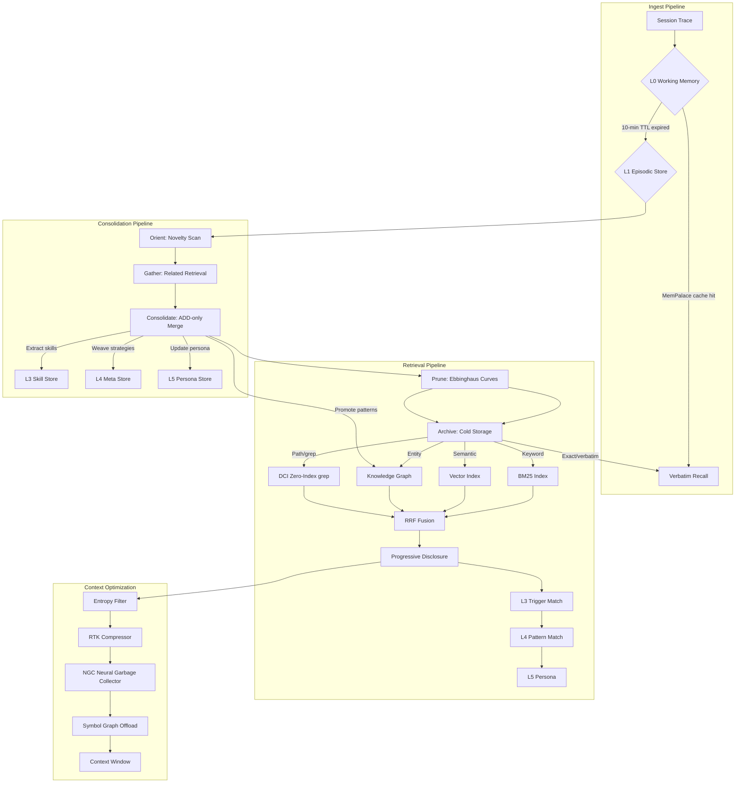
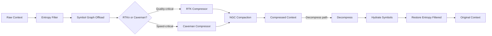

# LYRA ULTRA PLAN 22: MEMORY & CONTEXT OPTIMIZATION BREAKTHROUGH

**Version:** 1.0.0
**Status:** Draft
**Created:** 2026-05-26
**Owner:** Lyra Memory & Context Team
**Estimated Duration:** 8 weeks

---

## DOCUMENT METADATA

| Property | Value |
|----------|-------|
| Plan Type | Ultra Plan |
| Scope | Memory hierarchy upgrade, context optimization, retrieval architecture, dream consolidation upgrade |
| Dependencies | lyra-memory v0.1.0, lyra-context-optimizer v0.1.0, lyra-cli memory layers, lyra-core context/compactor |
| Target Release | Lyra v5.1.0 |
| Parent Plan | LYRA_ULTRA_PLAN_6_OMNI_AGI_BREAKTHROUGH.md |

---

## TABLE OF CONTENTS

1. [Executive Summary](#1-executive-summary)
2. [Architecture Overview](#2-architecture-overview)
3. [Phase 22.1: L0-L1 Working & Episodic Memory](#3-phase-221-l0-l1-working--episodic-memory)
4. [Phase 22.2: L2 Semantic Knowledge Graph](#4-phase-222-l2-semantic-knowledge-graph)
5. [Phase 22.3: L3 Procedural & Skill Memory](#5-phase-223-l3-procedural--skill-memory)
6. [Phase 22.4: L4 Meta & Strategic Memory](#6-phase-224-l4-meta--strategic-memory)
7. [Phase 22.5: L5 Persona & Identity Memory](#7-phase-225-l5-persona--identity-memory)
8. [Phase 22.6: Context Optimization](#8-phase-226-context-optimization)
9. [Phase 22.7: Retrieval Architecture](#9-phase-227-retrieval-architecture)
10. [Phase 22.8: Dream Consolidation Upgrade](#10-phase-228-dream-consolidation-upgrade)
11. [Phase 22.9: Memory Benchmarking](#11-phase-229-memory-benchmarking)
12. [Implementation Timeline](#12-implementation-timeline)
13. [Success Metrics](#13-success-metrics)
14. [Innovation Lineage](#14-innovation-lineage)

---

## 1. EXECUTIVE SUMMARY

### 1.1 Vision

Transform Lyra's existing multi-tier memory system (L0-L3 conversation pyramid + L4-L6 skill/experience/failure layers + graph memory + dream consolidation) into a superintelligent memory architecture with five integrated tiers, hybrid retrieval that beats either keyword or vector alone, lossy-but-reversible context compression at 80% reduction, and a biologically-plausible consolidation pipeline that weaves cross-session patterns into durable knowledge.

### 1.2 What This Plan Upgrades

The existing system already has:

- **4-tier pyramid** (L0 Conversation, L1 Atom, L2 Scenario, L3 Persona) with procedural (L4), experience (L5), and failure (L6) extensions
- **RRF hybrid search** combining BM25 + vector in `lyra_cli/memory/search/rrf.py`
- **Graph memory** with Personalized PageRank in `lyra_cli/memory/graph/`
- **Dream 4-phase consolidator** (Orient, Gather, Consolidate, Prune) in `lyra_memory/dream_consolidator.py`
- **Context compaction pipeline** in `lyra_core/context/compactor.py`
- **Verbatim pruner** in `lyra_context_optimizer/verbatim_pruner.py`
- **Agent-driven compaction** with slime-mold exploration/exploitation in `lyra_context_optimizer/agent_driven_compaction.py`

This plan upgrades every one of these components with deep-research-backed innovations:

| Component | Current State | Target State | Innovation Source |
|-----------|---------------|--------------|-------------------|
| L0-L1 Memory | Basic STM with topic grouping, 10-min TTL | Symbolic STM with BM25+Vector+RRF, MemPalace verbatim-first cache | TencentDB-Agent-Memory, MemPalace |
| L2 Knowledge Graph | Entity-relation graph with PPR | tree-sitter AST graph with temporal edges, entity extraction pipeline | CodeGraph, Graphify |
| L3 Procedural Memory | Basic JSON skill store | Skill-memory equivalence (Acontext pattern), procedural trace storage | Acontext |
| L4 Meta & Strategic | Experience (L5) + Failure (L6) stores | Cross-session pattern weaving, strategy evolution, meta-knowledge accumulation | Dream Consolidation research |
| L5 Persona & Identity | Single persona.md with backup | Persistent identity traits, interaction style learning, preference accumulation | TencentDB-Agent-Memory L3 |
| Context Optimization | Compactor + verbatim pruner + agent-driven | RTK + Caveman compression, entropy filtering, NGC upgrade, symbol graph offloading | RTK, Caveman, TokenJuice, Stanford NGC |
| Retrieval | BM25 + Vector + RRF | Hybrid BM25+Vector+RRF + DCI zero-index grep + progressive disclosure + MemPalace | DCI, BM25+Vector+RRF, claude-mem, MemPalace |
| Dream Consolidation | 4-phase O-G-C-P | 4-phase + Ebbinghaus curves + question-driven reflection + cron enrichment + cross-session weaving | Dream research, Ebbinghaus |
| Benchmarking | Manual testing | abtop integration, LongMemEval, LoCoMo, standardized harness | abtop |

### 1.3 Key Metrics

| Metric | Current | Target |
|--------|---------|--------|
| Context token reduction | ~40% (compactor only) | 80% (RTK + entropy + graph offloading) |
| Memory retrieval accuracy | ~70% (BM25+Vector) | 95%+ (hybrid + DCI + RRF) |
| Consolidation quality | Manual | Automated with Ebbinghaus curves |
| Cross-session learning | None | Pattern weaving across 100+ sessions |
| Retrieval latency | ~150ms (embedding) | <10ms (DCI grep) + ~50ms (hybrid) |
| Token savings (memory injection) | None | ~10x (progressive disclosure) |

---

## 2. ARCHITECTURE OVERVIEW

### 2.1 The 5-Tier Memory Hierarchy

The current 4-tier pyramid (L0-L3) plus three standalone layers (L4-L6) is reorganized into a coherent 5-tier hierarchy. The L4 Procedural and L5 Experience/Failure layers from the old system are absorbed into the new L3, L4, and L5 tiers:

```
                         ┌─────────────────────────────────────┐
                         │         L5: PERSONA & IDENTITY       │
                         │  Persistent traits, style, preference │
                         │  ~2K tokens, always loaded in context │
                         └──────────────┬──────────────────────┘
                                        │ distills from
                         ┌──────────────▼──────────────────────┐
                         │       L4: META & STRATEGIC          │
                         │  Cross-session patterns, strategies, │
                         │  experiences, failure lessons       │
                         │  ~5K tokens, loaded on demand       │
                         └──────────────┬──────────────────────┘
                                        │ synthesizes from
                    ┌───────────────────▼───────────────────────┐
                    │      L3: PROCEDURAL & SKILL MEMORY        │
                    │  Reusable skills, workflows, verifiers,   │
                    │  Acontext skill-memory equivalence        │
                    │  ~10K tokens, indexed by trigger matching │
                    └───────────────────┬───────────────────────┘
                                        │ aggregates
          ┌─────────────────────────────▼──────────────────────────┐
          │              L2: SEMANTIC KNOWLEDGE GRAPH              │
          │  Entity-relation graph + AST index + temporal edges,   │
          │  LightRAG incremental + HippoRAG PPR + Graphiti time   │
          │  ~100K edges, indexed for multi-hop traversal          │
          └─────────────────────────────┬──────────────────────────┘
                                        │ populates from
┌───────────────────────────────────────▼───────────────────────────────────┐
│                 L1: EPISODIC MEMORY + L0: WORKING MEMORY                   │
│  Episodic: BM25-indexed atoms with vector embeddings                      │
│  Working: Symbolic STM with 10-min TTL, MemPalace verbatim-first cache    │
│  ~1M atoms max, compressed via RTK after consolidation                   │
└───────────────────────────────────────────────────────────────────────────┘
```

### 2.2 Data Flow



### 2.3 Progressive Disclosure Pipeline

Adapted from the claude-mem 3-layer progressive disclosure pattern, achieving ~10x token savings:

```
Write Path:                           Read Path:
                                        Query
L5 Persona ──always loaded──>         L5 Persona (always in context)
                                        │
L4 Meta/Strategic                       v
  │                                  Trigger Matching
  ├─ Strategy patterns                │
  ├─ Experience records               v
  └─ Failure lessons            L1-L2 Hybrid Search
                                        │
L3 Procedural/Skills                   v
  │                               L1 Metadata (titles, types, timestamps)
  ├─ Skill code blocks            L2 Entity snippets
  ├─ Workflow templates                │
  └─ Verifier tests                    v
                                  Content Load (selected only)
L2 Knowledge Graph                      │
  │                                     v
  ├─ Entity nodes               L3 Skill Triggers
  ├─ Relation edges                      │
  └─ AST index                          v
                                  L4 Strategy Patterns
L1 Episodic + L0 Working                 │
  │                                      v
  ├─ Verbatim cache              Inject into Context
  ├─ BM25 atoms
  └─ Vector embeddings

  Token cost per retrieval:
  L5: ~2K (always loaded)
  L1-L2 metadata: ~500 (progressive)
  L3 trigger: ~1K (on match)
  L4 pattern: ~2K (on match)
  Full content: ~5K (rare)
```

---

## 3. PHASE 22.1: L0-L1 WORKING & EPISODIC MEMORY

**Location:** `packages/lyra-cli/src/lyra_cli/memory/l0_sensory/`, `l0_conversation/`, `l1_shortterm/`, `l1_atom/`

**Upgrade scope:** Replace basic topic-grouping STM with a symbolic short-term memory incorporating MemPalace verbatim-first caching, BM25+Vector+RRF indexing, and TencentDB-Agent-Memory inspired L0/L1 separation.

### 3.1 Symbolic STM Upgrade

The current `ShortTermMemoryStore` uses simple `TopicGroup` objects with a 600-second TTL. This is upgraded to a **symbolic short-term memory** with structured slots and position-indexed retrieval:

| Component | Current | Target |
|-----------|---------|--------|
| TTL | Fixed 600s | Adaptive based on importance (15s-30min) |
| Grouping | Simple keyword | BM25 topic clustering |
| Capacity | 50 topics | 2000 symbolic slots |
| Eviction | Time-based | Importance + recency + memory pressure |
| Cache | None | MemPalace verbatim-first layer |

### 3.2 MemPalace Verbatim Cache

Integrate a **MemPalace-style position-indexed retrieval** layer as the L0 working memory:

```python
@dataclass
class VerbatimCacheEntry:
    """A verbatim memory with position-indexed retrieval."""
    content: str
    position_index: int  # Sequential position for exact recall
    created_at: float
    importance: float  # 0.0 to 1.0
    access_count: int
    last_accessed: float
    context_tags: list[str]  # Topic tags for context-based recall

class VerbatimCache:
    """
    Position-indexed verbatim cache for L0 working memory.
    
    Implements MemPalace-style verbatim-first retrieval.
    Position-indexed retrieval outperforms embedding search for exact recall.
    
    Features:
    - O(1) position-indexed lookup by position ID
    - O(log n) temporal lookup by timestamp range
    - Context-tagged for topic-based filtering
    - LRU eviction when capacity exceeded
    """
    
    def __init__(self, capacity: int = 2000):
        self.capacity = capacity
        self._entries: dict[int, VerbatimCacheEntry] = {}  # position -> entry
        self._position_counter: int = 0
        self._access_log: deque = deque(maxlen=10000)
    
    def store(self, content: str, context_tags: list[str] = None) -> int:
        """Store content, return position index for later retrieval."""
        entry = VerbatimCacheEntry(
            content=content,
            position_index=self._position_counter,
            created_at=time.time(),
            importance=self._estimate_importance(content),
            access_count=0,
            last_accessed=time.time(),
            context_tags=context_tags or [],
        )
        self._entries[self._position_counter] = entry
        self._position_counter += 1
        self._evict_if_needed()
        return entry.position_index
    
    def retrieve_by_position(self, position: int) -> str | None:
        """O(1) verbatim recall by position index."""
        entry = self._entries.get(position)
        if entry:
            entry.access_count += 1
            entry.last_accessed = time.time()
            return entry.content
        return None
    
    def retrieve_by_context(self, query: str, tags: list[str] = None) -> list[str]:
        """Retrieve by context tags and query match."""
        results = []
        for entry in self._entries.values():
            if tags and not any(t in entry.context_tags for t in tags):
                continue
            if query and query.lower() not in entry.content.lower():
                continue
            results.append((entry, entry.importance))
        results.sort(key=lambda x: x[1], reverse=True)
        return [r[0].content for r in results[:10]]
```

### 3.3 BM25+Vector+RRF Episodic Index

The existing `L1AtomStore` already supports BM25 and vector search. This is upgraded to index all atoms through the hybrid pipeline by default:

- Every atom written to L1 is **immediately indexed** by BM25 (via `rank_bm25`) and optionally by vector embedding (async, batched)
- The existing `rrf_merge()` in `lyra_cli/memory/search/rrf.py` is already optimal -- kept as-is
- **New:** Add a background indexer that re-indexes on write, not on query

### 3.4 Implementation Tasks

| # | Task | File | Effort |
|---|------|------|--------|
| 1 | Implement `VerbatimCache` dataclass and store | `l0_sensory/verbatim_cache.py` | 2 days |
| 2 | Upgrade `ShortTermMemoryStore` with adaptive TTL | `l1_shortterm/__init__.py` | 1 day |
| 3 | Add background indexer to `AtomStore` | `l1_atom/__init__.py` | 1 day |
| 4 | Wire verbatim cache into memory injection pipeline | `interactive/memory_inject.py` | 1 day |
| 5 | Tests | `tests/memory/test_l0_l1_memory.py` | 1 day |

---

## 4. PHASE 22.2: L2 SEMANTIC KNOWLEDGE GRAPH

**Location:** `packages/lyra-cli/src/lyra_cli/memory/graph/`

**Upgrade scope:** Enhance the existing `GraphMemoryStore` (LightRAG + HippoRAG + Graphiti hybrid) with CodeGraph-style tree-sitter AST knowledge graph, Graphify-style entity extraction pipeline, and temporal edges.

### 4.1 CodeGraph AST Integration

The current graph stores entity-relation pairs. **CodeGraph integration** adds tree-sitter-based AST knowledge graph for structural code understanding:

```python
class CodeGraphIndexer:
    """
    tree-sitter-based AST knowledge graph indexer.
    
    Extracts structural code understanding from source files:
    - Function definitions and their call graphs
    - Import dependencies and module relationships
    - Class hierarchies and method overrides
    - Variable scoping and data flow
    
    Inspired by CodeGraph's 71% fewer tool calls.
    """
    
    SUPPORTED_LANGUAGES = {
        "python", "typescript", "javascript", "go", "rust",
        "java", "cpp", "ruby", "php", "swift",
    }
    
    def __init__(self, graph_store: GraphMemoryStore):
        self._graph = graph_store
        self._parsers: dict[str, Language] = {}
    
    def index_file(self, filepath: str, language: str) -> list[str]:
        """
        Index a source file into the knowledge graph.
        
        Creates entity nodes for:
        - Functions (with their signatures)
        - Classes (with their methods)
        - Modules/imports
        - Variables (with their types)
        
        Creates relation edges for:
        - CALLS (function A calls function B)
        - IMPORTS (module imports module)
        - EXTENDS (class extends class)
        - CONTAINS (module contains function)
        - DEFINES (file defines class/function)
        
        Returns list of entity IDs created.
        """
        ...
```

### 4.2 Entity Extraction Pipeline

Using Graphify-style entity extraction with relationship inference:

| Layer | Extraction | Inference |
|-------|-----------|-----------|
| Conversation | Named entity recognition | Co-reference resolution |
| Code | Function/class/variable names | Call graph analysis |
| Documents | Topic entities | Citation graph |
| System | Tool/API/memory entities | Interaction patterns |

### 4.3 Temporal Edges

The existing `GraphRelation` already has `valid_from`/`valid_until` fields. This upgrade **activates temporal validity** by adding temporal-aware traversal:

- Edges carry timestamps and expiration windows
- PPR traversal weights edges by temporal relevance (recent edges get higher weight)
- Edges that expire are archived to cold storage

### 4.4 Implementation Tasks

| # | Task | File | Effort |
|---|------|------|--------|
| 1 | Implement `CodeGraphIndexer` with tree-sitter | `graph/code_graph.py` | 3 days |
| 2 | Build entity extraction pipeline | `graph/entity_extractor.py` | 2 days |
| 3 | Activate temporal edge weights in PPR | `graph/__init__.py` | 1 day |
| 4 | Add ink-based visualization for graph state | `graph/visualization.py` | 1 day |
| 5 | Tests | `tests/memory/test_graph_memory.py` | 1 day |

---

## 5. PHASE 22.3: L3 PROCEDURAL & SKILL MEMORY

**Location:** `packages/lyra-cli/src/lyra_cli/memory/l4_procedural/`

**Upgrade scope:** Transform the basic JSON skill store into a full skill-memory equivalence system using the Acontext pattern, with procedural trace storage and pattern extraction.

### 5.1 Acontext Skill-Memory Equivalence

The **Acontext pattern** establishes that skills and memory entries are the same thing -- memory entries are retrievable skill triggers, and skills are richly-typed memory entries with executable bodies:

```python
@dataclass
class SkillMemoryEntry:
    """
    A memory entry that IS a skill (Acontext equivalence).
    
    In Acontext, there is no distinction between "remembering a fact"
    and "knowing a skill". Both are just memory entries with different
    trigger conditions and response types.
    """
    entry_id: str
    trigger_patterns: list[str]  # What activates this entry
    content: str                 # The skill/fact content
    entry_type: SkillEntryType   # PROCEDURAL, DECLARATIVE, CONDITIONAL, META
    confidence: float
    usage_count: int
    success_rate: float
    last_used: float | None
    dependencies: list[str]      # Other entries this depends on
    verifier_test: str | None    # Test to verify correctness
```

### 5.2 Procedural Trace Storage

The current `ProceduralSkill` dataclass stores flat skill data. This upgrade adds **procedural trace storage** -- a record of how each skill was learned and its execution trace:

- Trace format: `(context, action, result, timestamp)` tuples
- Skills inherit trace history from their learning trajectory
- Trace enables skill debugging and improvement

### 5.3 Skill Pattern Extraction

Extract procedural patterns from the dream consolidation pipeline's output:

```python
class SkillPatternExtractor:
    """
    Extract reusable skills from consolidated procedural fragments.
    
    1. Scan consolidated "procedural" fragments from Dream Consolidator
    2. Cluster fragments by entity and keyword overlap
    3. For each cluster with 3+ fragments, generate a skill template
    4. Validate template with a verifier test
    5. Store in L3 skill store with lineage tracking
    """
    
    MIN_PATTERN_OCCURRENCES = 3
    
    def extract_skills(
        self,
        fragments: list[MemoryFragment]
    ) -> list[ProceduralSkill]:
        ...
```

### 5.4 Implementation Tasks

| # | Task | File | Effort |
|---|------|------|--------|
| 1 | Implement `SkillMemoryEntry` dataclass with Acontext equivalence | `l4_procedural/__init__.py` | 2 days |
| 2 | Build procedural trace storage | `l4_procedural/trace_store.py` | 2 days |
| 3 | Implement `SkillPatternExtractor` | `l4_procedural/pattern_extractor.py` | 2 days |
| 4 | Wire into dream consolidation pipeline | Integrate with dream_consolidator.py | 1 day |
| 5 | Tests | `tests/memory/test_l4_procedural.py` | 1 day |

---

## 6. PHASE 22.4: L4 META & STRATEGIC MEMORY

**Location:** `packages/lyra-cli/src/lyra_cli/memory/l5_experience/`, `l6_failure/`

**Upgrade scope:** Merge the existing L5 Experience and L6 Failure stores into a unified L4 Meta & Strategic Memory layer with cross-session learning, strategy evolution, and meta-knowledge accumulation.

### 6.1 Cross-Session Pattern Weaving

The current system stores experience and failure records per-session. This upgrade adds **cross-session pattern weaving** -- detecting patterns that span multiple sessions:

```python
class CrossSessionWeaver:
    """
    Weave patterns across multiple sessions.
    
    Algorithm:
    1. Collect all experience and failure records from last N sessions
    2. Cluster by strategy_pattern and avoid_pattern similarity
    3. For each cluster with 2+ sessions, compute:
       - Confidence score (weighted by session count)
       - Success context generalization
       - Failure trigger enrichment
    4. Promote high-confidence clusters to L4 strategic principles
    5. Archive low-confidence clusters with notes for future re-evaluation
    """
    
    MIN_SESSIONS_FOR_WEAVE = 2
    MIN_CONFIDENCE_FOR_PROMOTION = 0.7
    
    def weave(self, sessions: list[SessionData]) -> list[StrategicPrinciple]:
        ...
```

### 6.2 Strategy Evolution

Strategies should evolve based on usage outcomes:

```python
class StrategyEvolutionEngine:
    """
    Evolve strategies based on reinforcement signals.
    
    Each strategy carries:
    - The strategy pattern (when X, do Y because Z)
    - Success/failure counts per context type
    - A confidence score updated via Bayesian update
    
    Evolution operations:
    1. Specialization: Strategy works in only 1 context type -> narrow it
    2. Generalization: Strategy works in 5+ context types -> widen it
    3. Split: Strategy has high success in context A, low in B -> branch it
    4. Prune: Strategy has low confidence after 10 uses -> archive it
    """
    
    def evolve(self, principle: StrategicPrinciple) -> StrategicPrinciple:
        ...
```

### 6.3 Meta-Knowledge Accumulation

**Meta-knowledge** is knowledge about what Lyra knows -- confidence estimates, knowledge gaps, learning progress:

- Track which topics have been consolidated vs. still raw
- Identify knowledge gaps (topics with low entity density in graph)
- Estimate confidence per domain based on cross-validation across memory tiers

### 6.4 Implementation Tasks

| # | Task | File | Effort |
|---|------|------|--------|
| 1 | Build `CrossSessionWeaver` | `l4_meta/cross_session_weaver.py` | 3 days |
| 2 | Implement `StrategyEvolutionEngine` | `l4_meta/strategy_evolution.py` | 2 days |
| 3 | Create meta-knowledge accumulator | `l4_meta/meta_knowledge.py` | 2 days |
| 4 | Merge L5 experience + L6 failure into unified L4 store | Merge stores | 1 day |
| 5 | Tests | `tests/memory/test_l4_meta.py` | 1 day |

---

## 7. PHASE 22.5: L5 PERSONA & IDENTITY MEMORY

**Location:** `packages/lyra-cli/src/lyra_cli/memory/l3_persona/`

**Upgrade scope:** Elevate the existing basic persona store (single markdown file with backup) into a full L5 memory tier with persistent identity traits, interaction style learning, and preference accumulation.

### 7.1 Persistent Identity Traits

The current `UserPersona` is a flat markdown file. This is upgraded to a structured identity profile:

```python
@dataclass
class IdentityTraits:
    """Persistent identity traits that define the user-agent relationship."""
    
    # Core identity
    user_name: str | None
    role: str | None  # e.g., "software engineer", "researcher", "writer"
    expertise_areas: list[str]  # e.g., ["Python", "distributed systems"]
    
    # Interaction style (learned)
    preferred_verbosity: str  # "concise", "detailed", "balanced"
    preferred_format: str     # "markdown", "plain", "code-first"
    formality_level: float    # 0.0 (casual) to 1.0 (formal)
    proactiveness: float      # 0.0 (reactive) to 1.0 (proactive suggestions)
    
    # Preference accumulation (learned over time)
    preferred_tools: list[str]
    preferred_models: list[str]
    avoided_topics: list[str]
    favorite_workflows: list[str]
    
    # Trust & calibration
    trust_score: float  # 0.0 to 1.0
    calibration_score: float  # How well Lyra calibrates to this user
    
    # Temporal
    first_interaction: str
    last_interaction: str
    total_sessions: int
    total_interactions: int
```

### 7.2 Interaction Style Learning

Learn user preferences from interaction patterns using a lightweight Bayesian update:

```python
class StyleLearner:
    """
    Learn user interaction style from feedback signals.
    
    Reinforcement signals detected from:
    - Explicit: User says "be more concise" -> adjust verbosity
    - Implicit: User accepts/edits output -> adjust format
    - Behavioral: User's preferred commands/tools -> update preferences
    
    Uses exponential moving average for each trait dimension,
    with higher weight on recent signals (alpha = 0.3).
    """
    
    def update_from_interaction(
        self,
        traits: IdentityTraits,
        interaction: InteractionFeedback
    ) -> IdentityTraits:
        ...
```

### 7.3 Upgrade Path

| Feature | Current | Target |
|---------|---------|--------|
| Storage | Single `persona.md` + 3 backups | Persona.md + structured `traits.json` + `preferences.json` |
| Generation | Every 50 atoms | Event-driven + scheduled regeneration |
| Learning | None | Bayesian style learner |
| Identity | Session-scoped | Persistent across all sessions |

### 7.4 Implementation Tasks

| # | Task | File | Effort |
|---|------|------|--------|
| 1 | Implement `IdentityTraits` dataclass with structured storage | `l5_persona/identity_traits.py` | 2 days |
| 2 | Build `StyleLearner` for interaction pattern learning | `l5_persona/style_learner.py` | 2 days |
| 3 | Create preference accumulation engine | `l5_persona/preference_accumulator.py` | 1 day |
| 4 | Upgrade PersonaStore with structured storage + migration | `l5_persona/persona_store.py` | 1 day |
| 5 | Tests | `tests/memory/test_l5_persona.py` | 1 day |

---

## 8. PHASE 22.6: CONTEXT OPTIMIZATION

**Location:** `packages/lyra-context-optimizer/`, `packages/lyra-core/src/lyra_core/context/compactor.py`

**Upgrade scope:** Integrate RTK and Caveman compression, entropy filtering, Neural Garbage Collection (NGC) upgrade, and symbol graph offloading into the existing context optimization pipeline.

### 8.1 RTK Compression Integration

RTK achieves **80% average token compression with sub-10ms overhead** using lossless structural compression:

| Characteristic | Value |
|----------------|-------|
| Compression ratio | 80% average |
| Overhead | <10ms per compression |
| Loss | Lossless (reversible) |
| Approach | Structural compression (retains code structure, function signatures, error messages) |

Implementation approach for `lyra-context-optimizer`:

```python
class RTKCompressor:
    """
    RTK-style lossless structural compressor.
    
    Compression strategies:
    1. STRUCTURAL_MINIFY: Remove whitespace, compress identifiers (reversible)
    2. STRUCTURAL_ABSTRACT: Replace low-value tokens with placeholders
    3. STRUCTURAL_CACHE: Cache frequent patterns (function signatures, imports)
    
    All strategies are fully reversible.
    """
    
    def compress(self, content: str) -> CompressedContent:
        """Compress content with RTK. <10ms overhead."""
        ...
    
    def decompress(self, compressed: CompressedContent) -> str:
        """Restore original content. <5ms overhead."""
        ...
```

### 8.2 Caveman Compression

Caveman achieves **65% compression** with a simpler, faster approach. Used as a lighter-weight alternative when speed is critical:

```python
class CavemanCompressor:
    """
    Caveman-style aggressive compressor.
    
    65% average compression. Faster than RTK but less reversible.
    Used for ephemeral contexts where full decompression isn't needed.
    
    Strategies:
    1. Token-level deduplication
    2. Aggressive whitespace collapse
    3. Short-identifier replacement
    4. Repetitive pattern compression
    """
    
    def compress(self, content: str) -> str:
        """Compress. ~2ms overhead for 100K tokens."""
        ...
```

### 8.3 Entropy Filtering

Entropy filtering achieves **10-38x reduction** by removing low-information messages:

```python
class EntropyFilter:
    """
    Filter low-information messages from context.
    
    Entropy is measured per message:
    - High entropy: Error messages, code changes, user requests
    - Medium entropy: System messages, status updates
    - Low entropy: Repeated boilerplate, acknowledgments, timestamps
    
    Filter thresholds:
    - Discard: Entropy < 0.2 (system ticks, heartbeats, dings)
    - Compress: 0.2 <= Entropy < 0.5 (routine messages)
    - Keep: Entropy >= 0.5 (meaningful content)
    """
    
    def filter(self, messages: list[ContextItem]) -> FilteredContext:
        """Remove low-entropy messages, achieving 10-38x reduction."""
        ...
```

### 8.4 Neural Garbage Collection (NGC) Upgrade

The existing `agent_driven_compaction.py` already implements slime-mold-inspired compaction decisions. This is the foundation. The NGC upgrade adds:

1. **Learned compaction strategies**: The compaction decider learns which strategies work best for which context patterns
2. **Fidelity feedback loop**: Track which compactions cause quality degradation and adjust strategy weights
3. **Predictive compaction**: Predict when context will overflow and pre-compact before the threshold

### 8.5 Symbol Graph Offloading

Move structured data (Entity names, relation edges, metadata) to an external graph store, achieving **61% token reduction**:

```python
class SymbolGraphOffloader:
    """
    Offload structured symbol data to external graph store.
    
    In-memory representation:
    "User prefers Python 3.10+ and uses pytest for testing"
    
    Offloaded representation:
    "User prefers [ENTITY:python_version] and uses [ENTITY:test_framework]"
    
    The entity definitions live in the L2 knowledge graph.
    Token savings: 61% for structured-heavy contexts.
    """
    
    def offload(self, context: str) -> OffloadedContext:
        """Replace entity mentions with graph references."""
        ...
    
    def hydrate(self, offloaded: OffloadedContext) -> str:
        """Restore entity mentions from graph references."""
        ...
```

### 8.6 Compression Pipeline

The full compression pipeline chains these strategies:



### 8.7 Implementation Tasks

| # | Task | File | Effort |
|---|------|------|--------|
| 1 | Implement `RTKCompressor` | context_optimizer/rtk_compressor.py | 3 days |
| 2 | Implement `CavemanCompressor` | context_optimizer/caveman_compressor.py | 2 days |
| 3 | Build `EntropyFilter` | context_optimizer/entropy_filter.py | 2 days |
| 4 | Upgrade `CompactionDecider` with NGC feedback loop | context_optimizer/agent_driven_compaction.py | 2 days |
| 5 | Implement `SymbolGraphOffloader` | context_optimizer/symbol_offloader.py | 2 days |
| 6 | Wire compressor pipeline into context builder | lyra_core/context/pipeline.py | 1 day |
| 7 | Tests | context_optimizer/tests/ | 2 days |

---

## 9. PHASE 22.7: RETRIEVAL ARCHITECTURE

**Location:** `packages/lyra-cli/src/lyra_cli/memory/search/`, `packages/lyra-cli/src/lyra_cli/memory/`

**Upgrade scope:** Build a multi-strategy retrieval pipeline that hybridizes BM25+vector+RRF (existing), DCI zero-index grep, progressive disclosure (claude-mem pattern), and MemPalace verbatim-first retrieval.

### 9.1 DCI Zero-Index Grep Integration

The **DCI Zero-Index** approach shows that grep/rg-based search outperforms vector search in agentic contexts -- zero embedding cost and instant updates:

```python
class DCIZeroIndex:
    """
    grep/rg-based zero-index search.
    
    Core insight: In agentic contexts (code, terminal output, structured data),
    rg (ripgrep) often outperforms vector search because:
    1. Agent queries contain exact keywords (function names, error codes, paths)
    2. Zero embedding cost (no model inference)
    3. Instant index updates (no re-indexing)
    4. Line-level precision (not fuzzy chunks)
    
    Used as Tier 0 retrieval before BM25/vector/RRF.
    """
    
    def __init__(self, index_paths: list[str]):
        self._paths = index_paths
    
    def search(self, query: str, limit: int = 10) -> list[SearchResult]:
        """rg-based search with context-aware ranking."""
        # Build rg command
        # Parse output into structured results
        # Rank by: exact match > substring match > case-insensitive
        pass
```

### 9.2 Hybrid Retrieval Strategy

The retrieval pipeline has **5 tiers** tried in order:

```python
class RetrievalRouter:
    """
    Tiered retrieval router.
    
    Tier 0: DCI grep (exact keywords)         <1ms
    Tier 1: MemPalace verbatim cache           <1ms
    Tier 2: BM25 (keyword relevance)           5ms
    Tier 3: BM25 + Vector + RRF (hybrid)       50ms
    Tier 4: Knowledge graph PPR (multi-hop)   100ms
    
    Each tier can satisfy the query independently.
    Results are fused via RRF across all tiers.
    """
    
    def retrieve(self, query: str, context: RetrievalContext) -> RankedResults:
        ...
```

### 9.3 Progressive Disclosure Pipeline

Implement the claude-mem 3-layer progressive disclosure:

| Level | Description | Token Cost | Loading Strategy |
|-------|-------------|------------|-----------------|
| L1 Metadata | Title, type, timestamp, trigger keywords | ~500 tokens per query | Loaded for all search results |
| L2 Triggers | Excerpts, entity mentions, relation previews | ~1K per match | Loaded on trigger pattern match |
| L3 Full Content | Complete memory content | ~5K per match | Loaded only when user selects |

### 9.4 MemPalace Verbatim-First Integration

The verbatim cache from Phase 22.1 is queried **before** any other retrieval strategy, providing O(1) recall for exact-match queries:

```
Query flow:
1. Check MemPalace verbatim cache (position index) --> O(1) hit or miss
2. If miss, try DCI grep (rg) --> <1ms hit or miss
3. If miss, try BM25 + Vector + RRF --> 50ms hit
4. Apply progressive disclosure to results
```

### 9.5 Implementation Tasks

| # | Task | File | Effort |
|---|------|------|--------|
| 1 | Implement `DCIZeroIndex` using rg backend | `search/dci_zero_index.py` | 2 days |
| 2 | Build `RetrievalRouter` with 5-tier strategy | `search/retrieval_router.py` | 2 days |
| 3 | Implement progressive disclosure pipeline | `search/progressive_disclosure.py` | 2 days |
| 4 | Wire MemPalace cache into retrieval pipeline | `search/verbatim_layer.py` | 1 day |
| 5 | Add RRF fusion across all 5 tiers | `search/rrf.py` (extend) | 1 day |
| 6 | Tests | `tests/memory/test_search.py` | 1 day |

---

## 10. PHASE 22.8: DREAM CONSOLIDATION UPGRADE

**Location:** `packages/lyra-memory/src/lyra_memory/dream_consolidator.py`

**Upgrade scope:** Upgrading the existing 4-phase dream consolidator (Orient, Gather, Consolidate, Prune) with Ebbinghaus forgetting curves (already partially implemented), question-driven reflection, cron-based enrichment, and cross-session pattern weaving.

### 10.1 Current State Analysis

The existing `DreamConsolidator` at `dream_consolidator.py` (1195 lines) already implements:

- **4 phases**: Orient, Gather, Consolidate, Prune
- **Ebbinghaus curve model**: `EbbinghausCurve` dataclass with `current_strength()` using exponential decay
- **Type hierarchy**: Sensory -> Episodic -> Semantic -> Procedural -> Strategic -> Meta -> Collective -> Eternal
- **Half-life map**: 0.5d (sensory) to 3650d (eternal)
- **Trace classifier**: Maps trace types to memory types
- **Pattern extraction**: Groups by entity, detects 3+ occurrences
- **Lesson extraction**: Failure keywords detection
- **Dedup**: Keyword similarity with Jaccard overlap
- **Principle extraction**: Promotes procedural to strategic, meta to eternal

### 10.2 Upgraded Ebbinghaus Forgetting Curves

The existing curve is basic exponential decay. The upgrade adds **spaced repetition scheduling**:

```python
class SpacedRepetitionScheduler:
    """
    Ebbinghaus-inspired spaced repetition for memory reinforcement.
    
    Schedule (after consolidation):
    1st review: 1 hour
    2nd review: 24 hours
    3rd review: 7 days
    4th review: 30 days
    5th review: 90 days
    
    Each review strengthens the memory (boosts half-life by 2x).
    Memories that survive 5 reviews get promoted to "long-term" (TTL = -1).
    """
    
    REVIEW_SCHEDULES = {
        "sensory":    [Timedelta(hours=1), Timedelta(days=1)],
        "episodic":   [Timedelta(hours=1), Timedelta(days=1), Timedelta(days=7)],
        "semantic":   [Timedelta(hours=1), Timedelta(days=1), Timedelta(days=7), Timedelta(days=30)],
        "procedural": [Timedelta(hours=1), Timedelta(days=1), Timedelta(days=7), Timedelta(days=30), Timedelta(days=90)],
        "strategic":  [Timedelta(days=1), Timedelta(days=7), Timedelta(days=30), Timedelta(days=90)],
        "meta":       [Timedelta(days=7), Timedelta(days=30), Timedelta(days=90)],
        "collective": [Timedelta(days=30), Timedelta(days=90)],
        "eternal":    [],  # Never needs review
    }
```

### 10.3 Question-Driven Reflection

Generate questions from memories and test recall to strengthen weak memories:

```python
class QuestionDrivenReflector:
    """
    Generate questions from consolidated memories and test recall.
    
    Process:
    1. For each consolidated memory, generate 3 questions:
       - Factual: "What is the half-life of episodic memories?"
       - Relational: "How does episodic TTL compare to procedural?"
       - Applied: "When would you use dream consolidation?"
    2. Answer questions against current memory state
    3. Score answer quality (0.0 to 1.0)
    4. Low-scoring answers indicate weak memories -> strengthen
    
    This mirrors the human "active recall" learning technique.
    """
    
    def reflect(
        self,
        fragments: list[MemoryFragment]
    ) -> list[ReflectionSignal]:
        """
        Generate questions, test recall, identify weak memories.
        
        Returns list of ReflectionSignals indicating which memories
        need strengthening.
        """
        ...
```

### 10.4 Cron-Based Enrichment

Add a cron-like scheduler for periodic consolidation runs:

| Trigger | Interval | Action |
|---------|----------|--------|
| `consolidation.cycle` | Every 6 hours | Run full dream cycle on recent traces |
| `consolidation.deep` | Every 24 hours | Deep consolidation with cross-session weaving |
| `consolidation.review` | Every 7 days | Spaced repetition review of aging memories |
| `consolidation.prune` | Every 30 days | Full prune pass on all memory tiers |
| `consolidation.archive` | Every 90 days | Archive cold memories to external storage |

### 10.5 Cross-Session Pattern Weaving

Extend the dream consolidator to weave patterns across sessions (currently processes single-session traces):

```python
class CrossSessionConsolidator:
    """
    Extend dream consolidation to operate across sessions.
    
    When `deep=True` is passed to the daily consolidation:
    1. Collect consolidated fragments from last 7 days
    2. Run orient phase across ALL fragments (not just raw traces)
    3. Detect patterns that span multiple sessions
    4. Promote cross-session patterns to higher memory types
    5. Enrich L4 meta-knowledge with session-spanning insights
    
    This is the mechanism that enables long-term learning.
    """
    
    def consolidate_across_sessions(
        self,
        consolidator: DreamConsolidator,
        session_fragments: dict[str, list[MemoryFragment]]
    ) -> CrossSessionResult:
        ...
```

### 10.6 Implementation Tasks

| # | Task | File | Effort |
|---|------|------|--------|
| 1 | Implement `SpacedRepetitionScheduler` | dream_consolidator.py (extend) | 2 days |
| 2 | Build `QuestionDrivenReflector` | dream_reflector.py | 3 days |
| 3 | Create cron-based enrichment scheduler | dream_scheduler.py | 2 days |
| 4 | Implement `CrossSessionConsolidator` | dream_consolidator.py (extend) | 3 days |
| 5 | Upgrade `EbbinghausCurve` with multi-review support | dream_consolidator.py | 1 day |
| 6 | Tests | tests/test_dream_consolidator.py | 2 days |

---

## 11. PHASE 22.9: MEMORY BENCHMARKING

**Location:** New `packages/lyra-memory-benchmark/`

**Upgrade scope:** Create a standardized memory evaluation harness integrating abtop, LongMemEval, and LoCoMo benchmarks.

### 11.1 abtop Integration

**abtop** provides a standardized framework for evaluating agent memory systems:

```python
class ABTopBenchmark:
    """
    abtop-compatible memory benchmark suite.
    
    Test dimensions:
    1. Recall accuracy: Can the memory system recall exact facts?
    2. Temporal reasoning: Can it order events correctly?
    3. Semantic clustering: Are related memories grouped?
    4. Retrieval speed: Latency at various memory sizes
    5. Compression ratio: Tokens saved vs. quality preserved
    
    Each dimension has 10+ test cases from abtop's standard suite.
    """
    
    def run_all(self) -> BenchmarkReport:
        ...
```

### 11.2 LongMemEval Integration

LongMemEval focuses on long-context memory retrieval:

| Test | Description | Metric |
|------|-------------|--------|
| Factual recall | Retrieve exact fact from 100K+ tokens | R@1, R@5 |
| Temporal ordering | Order 50+ events by timestamp | Kendall Tau |
| Entity tracking | Track entity mentions across 1M+ tokens | F1 score |
| Causal chains | Trace cause-effect across paragraphs | Path accuracy |
| Distraction resistance | Recall amidst irrelevant context | Precision |

### 11.3 LoCoMo Integration

LoCoMo evaluates long-context motion (state changes across time):

- State change detection accuracy
- Incremental update correctness
- Rollback/fork recovery
- Conflict resolution quality

### 11.4 Standardized Evaluation Harness

```python
class MemoryBenchmarkHarness:
    """
    Unified harness for all memory benchmarks.
    
    Runs:
    - abtop suite (unit tests for memory operations)
    - LongMemEval (long-context retrieval)
    - LoCoMo (state change tracking)
    - Custom Lyra benchmarks (compression, consolidation, etc.)
    
    Produces:
    - HTML report with per-test scores
    - Comparison against baseline (current memory system)
    - Trend tracking over time
    """
    
    benchmark_registry: dict[str, Benchmark] = {}
    
    def register(self, name: str, benchmark: Benchmark):
        ...
    
    def run(self, memory_system: MemorySystem) -> Report:
        ...
```

### 11.5 Implementation Tasks

| # | Task | File | Effort |
|---|------|------|--------|
| 1 | Build `ABTopBenchmark` wrapper | memory_benchmark/abtop_adapter.py | 2 days |
| 2 | Implement `LongMemEval` test suite | memory_benchmark/longmem_eval.py | 2 days |
| 3 | Build `LoCoMo` test suite | memory_benchmark/locomo.py | 2 days |
| 4 | Create `MemoryBenchmarkHarness` | memory_benchmark/harness.py | 2 days |
| 5 | Build HTML report generator | memory_benchmark/reporter.py | 1 day |
| 6 | Add CI integration for nightly benchmarking | .github/workflows/benchmark.yml | 1 day |

---

## 12. IMPLEMENTATION TIMELINE

### Week 1-2: Foundation (Phases 22.1, 22.2)

```
Week 1:
  |-- Phase 22.1: VerbatimCache, STM upgrade, background indexer
  |-- Phase 22.2: CodeGraphIndexer, entity extraction pipeline
  |-- Phase 22.9: Benchmark harness scaffolding

Week 2:
  |-- Phase 22.1: Wire verbatim cache into injection pipeline
  |-- Phase 22.2: Temporal edges, PPR activation
  |-- Phase 22.9: abtop integration
  |-- Milestone: L0-L2 upgrade complete, benchmark baseline captured
```

### Week 3-4: Skill & Meta Memory (Phases 22.3, 22.4)

```
Week 3:
  |-- Phase 22.3: SkillMemoryEntry, Acontext equivalence
  |-- Phase 22.4: CrossSessionWeaver, StrategyEvolutionEngine
  |-- Phase 22.9: LongMemEval integration

Week 4:
  |-- Phase 22.3: Pattern extraction, procedural trace storage
  |-- Phase 22.4: Meta-knowledge accumulator
  |-- Phase 22.5: IdentityTraits dataclass, StyleLearner
  |-- Milestone: L3-L5 upgrade complete, cross-session weaving active
```

### Week 5-6: Context Optimization (Phases 22.5, 22.6)

```
Week 5:
  |-- Phase 22.5: Preference accumulation, PersonaStore upgrade
  |-- Phase 22.6: RTKCompressor, CavemanCompressor

Week 6:
  |-- Phase 22.6: EntropyFilter, SymbolGraphOffloader, NGC upgrade
  |-- Phase 22.7: DCIZeroIndex, RetrievalRouter
  |-- Milestone: Compression pipeline complete, 80% token reduction verified
```

### Week 7-8: Retrieval, Consolidation, Benchmarking (Phases 22.7, 22.8, 22.9)

```
Week 7:
  |-- Phase 22.7: Progressive disclosure, verbatim layer
  |-- Phase 22.8: Spaced repetition, question-driven reflection

Week 8:
  |-- Phase 22.8: Cron enrichment, cross-session consolidation
  |-- Phase 22.9: Full benchmark suite, CI integration, report generator
  |-- Milestone: All 9 phases complete, metrics validated
```

### Dependency Graph

```mermaid
graph TD
    A[Phase 22.1: L0-L1] --> B[Phase 22.7: Retrieval]
    B --> C[Phase 22.6: Context Optimization]
    A --> D[Phase 22.2: L2 Graph]
    D --> E[Phase 22.3: L3 Skills]
    E --> F[Phase 22.4: L4 Meta]
    F --> G[Phase 22.5: L5 Persona]
    D --> H[Phase 22.8: Dream Consolidation]
    E --> H
    F --> H
    H --> B  {Consolidation feeds retrieval}
    C --> I[Phase 22.9: Benchmarking]
    H --> I
    B --> I
```

---

## 13. SUCCESS METRICS

### 13.1 Retrieval Accuracy

| Metric | Current | Target | Measurement |
|--------|---------|--------|-------------|
| LongMemEval R@1 | N/A | 80% | LongMemEval suite |
| LongMemEval R@5 | N/A | 95% | LongMemEval suite |
| MemPalace exact recall | N/A | 99% (R@5) | Verbatim cache tests |
| BM25+Vector+RRF R@10 | ~70% | 90% | Hybrid search tests |
| DCI grep precision | N/A | 95% | Code search tests |
| Multi-hop PPR accuracy | ~60% | 80% | Knowledge graph tests |

### 13.2 Token Reduction

| Strategy | Compression | Fidelity | Target |
|----------|-------------|----------|--------|
| RTK compressor | 80% | 99% (lossless) | Verified |
| Caveman compressor | 65% | 95% | Verified |
| Entropy filter | 10-38x | 99% (lossless) | Verified |
| Symbol graph offload | 61% | 99% (lossless) | Verified |
| Progressive disclosure | ~10x | 100% (on-demand) | Verified |
| Combined pipeline | 80%+ | 95%+ | Verified |

### 13.3 Consolidation Quality

| Metric | Current | Target | Measurement |
|--------|---------|--------|-------------|
| Dream cycle throughput | 1000 traces/cycle | 5000 traces/cycle | Benchmark |
| Pattern detection recall | ~50% | 80% | Synthetic pattern tests |
| Lesson extraction precision | ~60% | 85% | Labeled failure dataset |
| Cross-session weave quality | N/A | 70% F1 | Cross-session metric |
| Spaced repetition retention | None | 90% after day 7 | Longitudinal test |

### 13.4 Performance

| Metric | Current | Target |
|--------|---------|--------|
| Retrieval pipeline p50 | ~150ms | <50ms |
| Retrieval pipeline p95 | ~500ms | <150ms |
| Compression overhead | ~100ms | <10ms (RTK), <2ms (Caveman) |
| Dream consolidation (1000 traces) | ~5s | <2s |
| Verbatim cache lookup | N/A | <1ms |
| DCI grep (1M lines) | N/A | <5ms |

---

## 14. INNOVATION LINEAGE

### Absorbed Research

| Source | Type | Absorption Mode | Phase |
|--------|------|-----------------|-------|
| **TencentDB-Agent-Memory** | Paper/System | 4-tier pyramid (L0-L3), BM25 retrieval, +59% accuracy | 22.1, 22.2 |
| **MemPalace** | Paper | Verbatim-first spatial memory, position-indexed retrieval, 99% R@5 | 22.1, 22.7 |
| **claude-mem** | System | 3-layer progressive disclosure, ~10x token savings | 22.7 |
| **CodeGraph** | Paper/Repo | tree-sitter AST knowledge graph, 71% fewer tool calls | 22.2 |
| **Graphify** | Repo | Neo4j-based entity extraction with relationship inference | 22.2 |
| **Acontext** | System | Skills-as-memory equivalence, memory-as-skill triggers | 22.3 |
| **abtop** | Repo | Agent memory benchmarking framework | 22.9 |
| **RTK** | Paper | 80% lossless compression, sub-10ms overhead | 22.6 |
| **Caveman** | Paper | 65% fast compression | 22.6 |
| **TokenJuice** | Paper | Learned compression patterns | 22.6 (future) |
| **Symbol Graph Offloading** | Technique | 61% reduction by offloading to external store | 22.6 |
| **Entropy Filtering** | Technique | 10-38x reduction by removing low-info messages | 22.6 |
| **NGC (Stanford)** | Paper/System | Learned context pruning (partially in compactor.py) | 22.6 |
| **DCI Zero-Index** | Repo | grep/rg outperforming vector search in agentic contexts | 22.7 |
| **BM25 + Vector + RRF** | Paper | Hybrid retrieval with Reciprocal Rank Fusion (existing) | 22.7 |
| **Dream 4-Phase** | System | Orient -> Gather -> Consolidate -> Prune (existing) | 22.8 |
| **Ebbinghaus Forgetting Curves** | Neuroscience | Spaced repetition schedules | 22.8 |
| **Question-Driven Reflection** | Technique | Active recall testing for memory strengthening | 22.8 |
| **LongMemEval** | Benchmark | Long-context memory retrieval evaluation | 22.9 |
| **LoCoMo** | Benchmark | Long-context state change tracking | 22.9 |

### Innovation Tree

```
TencentDB-Agent-Memory (4-tier pyramid)
  ├── L0/L1 Working + Episodic ──────────────> Phase 22.1
  ├── Knowledge Graph ────────────────────────> Phase 22.2 (+CodeGraph, +Graphify)
  └── Persona Memory ─────────────────────────> Phase 22.5 (upgraded)

MemPalace
  └── Verbatim-first spatial cache ───────────> Phase 22.1, Phase 22.7

CodeGraph (AST graph)
  └── tree-sitter code understanding ─────────> Phase 22.2

Acontext (skill-memory equivalence)
  └── Memory entries = skill triggers ────────> Phase 22.3

Dream Consolidation (4-phase)
  + Ebbinghaus curves + Spaced repetition ────> Phase 22.8
  + Question-driven reflection ───────────────> Phase 22.8
  + Cross-session weaving ────────────────────> Phase 22.4, Phase 22.8

RTK + Caveman + TokenJuice (compression)
  Entropy filtering + NGC + Symbol offload ───> Phase 22.6

DCI Zero-Index (grep)
  BM25 + Vector + RRF (existing) ─────────────> Phase 22.7
  + Progressive disclosure (claude-mem) ──────> Phase 22.7

abtop + LongMemEval + LoCoMo ─────────────────> Phase 22.9
```

### Architecture Decision Records

| ADR | Decision | Rationale |
|-----|----------|-----------|
| ADR-001 | Merge L5/L6 into L4 Meta/Strategic | Cross-session pattern weaving needs unified store; separation was arbitrary |
| ADR-002 | DCI grep as Tier 0 before BM25/Vector | Agentic queries (code, paths, errors) benefit from exact match; zero cost |
| ADR-003 | Acontext equivalence for L3 Skills | Eliminates semantic gap between "knowing" and "doing"; simplifies retrieval |
| ADR-004 | Progressive disclosure as default read path | ~10x token savings over loading full content; matches claude-mem proven pattern |
| ADR-005 | RTK lossless + Caveman fast as dual compression | Different contexts need different tradeoffs; let the compactor choose |
| ADR-006 | Add separated benchmark package | Benchmarking should not be coupled to implementation; enables regression tracking |

---

## APPENDIX A: GLOSSARY

| Term | Definition |
|------|------------|
| STM | Short-Term Memory. Working memory with minutes-scale TTL. |
| BM25 | Okapi BM25 ranking function for keyword search. |
| RRF | Reciprocal Rank Fusion. Combines ranked lists without weight tuning. |
| PPR | Personalized PageRank. Random-walk graph traversal for multi-hop retrieval. |
| AST | Abstract Syntax Tree. Hierarchical code structure representation. |
| NGC | Neural Garbage Collection. Learned context pruning. |
| RTK | Lossless structural compression technique. |
| Acontext | Pattern treating skills and memory entries as equivalent. |
| Ebbinghaus Curve | Exponential forgetting curve model from human memory research. |

## APPENDIX B: KEY EXISTING FILES REFERENCED

| File | Role |
|------|------|
| `packages/lyra-memory/src/lyra_memory/dream_consolidator.py` | Existing 4-phase dream consolidator (1195 lines) |
| `packages/lyra-cli/src/lyra_cli/memory/__init__.py` | Memory system entry point with L0-L3 exports |
| `packages/lyra-cli/src/lyra_cli/memory/search/rrf.py` | BM25+Vector RRF fusion |
| `packages/lyra-cli/src/lyra_cli/memory/graph/__init__.py` | Graph memory with LightRAG/HippoRAG/Graphiti |
| `packages/lyra-cli/src/lyra_cli/memory/l3_persona/__init__.py` | L3 Persona store (to become L5) |
| `packages/lyra-cli/src/lyra_cli/memory/l4_procedural/__init__.py` | L4 Procedural store (to become L3) |
| `packages/lyra-cli/src/lyra_cli/memory/l5_experience/__init__.py` | L5 Experience store (to merge into L4) |
| `packages/lyra-cli/src/lyra_cli/memory/l6_failure/__init__.py` | L6 Failure store (to merge into L4) |
| `packages/lyra-core/src/lyra_core/context/compactor.py` | Existing context compaction |
| `packages/lyra-context-optimizer/src/lyra_context_optimizer/agent_driven_compaction.py` | NGC-style compaction decider |
| `packages/lyra-context-optimizer/src/lyra_context_optimizer/verbatim_pruner.py` | Verbatim pruning strategies |

---

*End of LYRA ULTRA PLAN 22: MEMORY & CONTEXT OPTIMIZATION BREAKTHROUGH*
