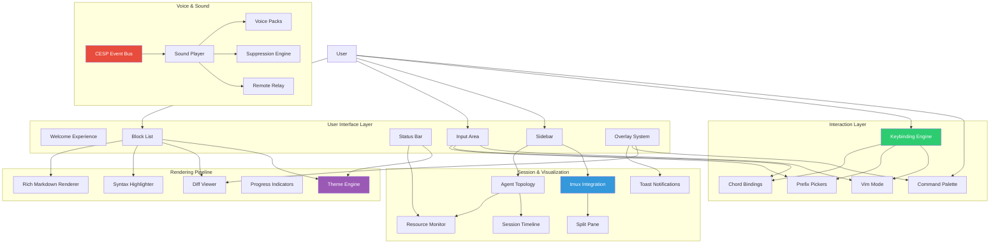
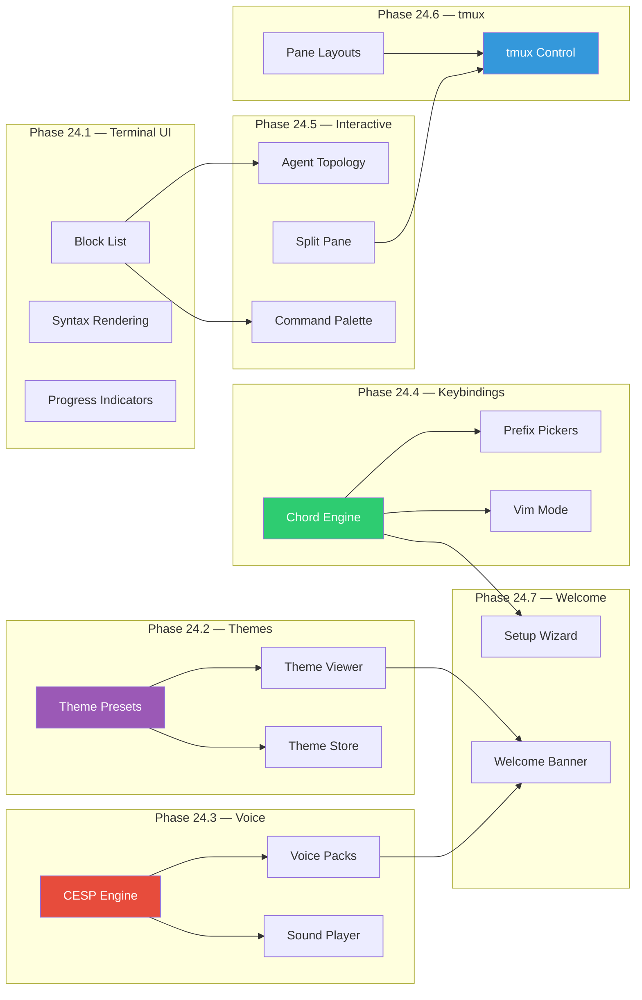

# LYRA ULTRA PLAN 24: UI/UX & Voice Breakthrough

**Version:** 1.0.0 | **Status:** Planning | **Created:** 2026-05-26
**Parent Plan:** [LYRA_ULTRA_PLAN_6_OMNI_AGI_BREAKTHROUGH.md](LYRA_ULTRA_PLAN_6_OMNI_AGI_BREAKTHROUGH.md)
**Estimated Duration:** 8 weeks | **Target Completion:** 2026-07-21

---

## Executive Summary

Transform Lyra's terminal user interface from a functional REPL into a world-class interactive experience rivaling Warp, tmux, and modern IDE terminals. This plan spans seven phases: block-based terminal UI components (inspired by Warp's block model), 17+ professionally designed color themes with full ANSI 16-color support, a PeonPing-inspired voice and sound system with game-themed audio packs, a chord-based keybinding engine with Vim/Emacs modes, interactive visualization features (agent topology, split panes, heat maps), tmux integration for multi-pane session management, and an animated welcome experience.

**Key Outcomes:**
- Terminal UI with block model architecture, rich markdown rendering, and syntax highlighting
- 17+ color themes with dynamic switching, preview, and custom theme creation
- Voice notification system with 3 game-inspired sound packs and 12+ event triggers
- Complete keybinding system with chord bindings, prefix pickers, and context-sensitive mappings
- Interactive features: agent topology visualization, split pane, command palette, resource monitor
- tmux integration: programmatic pane control, session isolation, multi-pane layouts
- Animated welcome banner with voice greeting and session setup wizard

---

## Architecture Overview



---

## Phase 24.1: Terminal UI Components (Weeks 1-2)

### 24.1.1 Block Model Architecture

Inspired by [Warp's block model](https://github.com/warpdotdev/warp), Lyra's terminal UI adopts a block-based rendering architecture where each interaction unit is a self-contained block with metadata.

```
Block Types:
├── CommandBlock    — User input + shell output
├── OutputBlock     — Agent response (text, code, markdown)
├── AgentBlock      — Multi-agent sub-task output
├── CodeBlock       — Syntax-highlighted code segment
├── MarkdownBlock   — Rendered markdown with tables, lists
├── DiffBlock       — Side-by-side / unified diff
├── ImageBlock      — Image preview (sixel/kitty protocol)
├── TableBlock      — Structured data tables
└── ChartBlock      — ASCII charts and graphs
```

#### Block Data Structure

```typescript
interface Block {
  id: string                    // Unique block identifier
  type: BlockType               // Block type enum
  timestamp: number             // Creation time
  content: string               // Raw content
  metadata: {
    model?: string              // Model that generated this block
    provider?: string           // Provider used
    tokens?: number             // Token count
    cost?: number               // Cost in USD
    duration?: number           // Generation duration in ms
    status?: 'streaming' | 'complete' | 'error' | 'aborted'
    parentId?: string           // For agent sub-tasks
    childrenIds?: string[]      // Nested blocks
  }
  folded: boolean               // Collapsed/expanded state
  selected: boolean             // For copy/paste
}
```

#### Block Storage (SumTree + FlatStorage)

Inspired by Warp's [SumTree and GridStorage](https://github.com/warpdotdev/warp/blob/main/warp-terminal/docs/ARCHITECTURE.md) for efficient rendering:

```typescript
// SumTree: Efficient fold/unfold and visibility computation
class SumTree {
  root: TreeNode
  update(id: string, height: number): void
  getVisibleOffset(id: string): number
  totalVisibleHeight(): number
}

// FlatStorage: Linear block access for rendering
class FlatStorage {
  blocks: Block[]
  insert(index: number, block: Block): void
  remove(id: string): Block
  move(from: number, to: number): void
  renderSlice(start: number, end: number): Block[]
}
```

### 24.1.2 Ink-React Component Library

New components in `ui-tui/src/components/`:

| Component | File | Purpose |
|-----------|------|---------|
| **BlockList** | `blockList.tsx` | Virtualized block container with folding |
| **StatusBar** | `statusBar.tsx` | Model, tokens, cost, fleet status line |
| **InputArea** | `inputArea.tsx` | Rich input with syntax highlighting, autocomplete |
| **CommandPalette** | `commandPalette.tsx` | Ctrl+K overlay for commands/skills/themes |
| **DiffViewer** | `diffViewer.tsx` | Side-by-side and unified diff rendering |
| **Sidebar** | `sidebar.tsx` | Toggleable side panel (files, fleet, agents) |
| **Toast** | `toast.tsx` | Non-blocking notification toasts |
| **ProgressBar** | `progressBar.tsx` | Animated progress indicators |
| **HeatMap** | `heatMap.tsx` | Agent activity heat map visualization |
| **SplitPane** | `splitPane.tsx` | Resizable pane splitter |

#### Component Interaction Pattern

```typescript
// Root application layout
function App(): ReactElement {
  return (
    <ThemeProvider>
      <KeybindingProvider>
        <SplitPane
          left={<Sidebar><AgentTree /></Sidebar>}
          right={
            <Box flexDirection="column">
              <StatusBar />
              <BlockList />
              <InputArea />
            </Box>
          }
        />
        <OverlayLayer>
          <CommandPalette />
          <Toast notifications={notifications} />
        </OverlayLayer>
      </KeybindingProvider>
    </ThemeProvider>
  )
}
```

### 24.1.3 Rich Markdown Rendering Pipeline

Upgrade the existing `markdown.tsx` to support:

| Feature | Implementation | Source |
|---------|---------------|--------|
| Code blocks | Syntax highlighting via `shiki`/`prism`, language tags, copy button | CLI-Anything, Warp |
| Tables | Column alignment, row hover, cell wrapping | CLI-Anything |
| Task lists | Checkbox rendering with toggle support | CLI-Anything |
| Mermaid diagrams | Terminal-rendered ASCII fallback | CLI-Anything |
| Images | Sixel/kitty terminal protocol detection + URL rendering | Warp |
| Footnotes | Hover/collapsible footnote display | Warp |
| Strikethrough | Rendered with dim styling | CLI-Anything |
| Auto-links | Clickable URLs with preview tooltip | Ink |

### 24.1.4 Progress Indicators & Spinners

| Component | Style | When Used |
|-----------|-------|-----------|
| `SpinnerColumn` | ASCII spinner frames | Thinking, loading |
| `BarColumn` | Animated progress bar | File processing, downloads |
| `TimeElapsedColumn` | Elapsed time counter | Long operations |
| `TranscodingColumn` | Token/cost live counter | Streaming responses |
| `EtaColumn` | Estimated completion | Batch operations |

```typescript
// Progress indicator in agent streaming mode
<Box>
  <SpinnerColumn frames={['⠋', '⠙', '⠹', '⠸', '⠼', '⠴', '⠦', '⠧', '⠇', '⠏']} />
  <Text>Analyzing repository structure...</Text>
  <Text dimColor>{tokens} tokens | ${cost}</Text>
</Box>
```

### 24.1.5 File Inventory

| File | Action | Description |
|------|--------|-------------|
| `ui-tui/src/components/blockList.tsx` | Create | Virtualized block container |
| `ui-tui/src/components/statusBar.tsx` | Create | Status information bar |
| `ui-tui/src/components/inputArea.tsx` | Create | Rich input component |
| `ui-tui/src/components/commandPalette.tsx` | Create | Command overlay |
| `ui-tui/src/components/diffViewer.tsx` | Create | Diff rendering |
| `ui-tui/src/components/sidebar.tsx` | Create | Side panel |
| `ui-tui/src/components/toast.tsx` | Create | Toast notifications |
| `ui-tui/src/components/progressBar.tsx` | Create | Progress indicators |
| `ui-tui/src/components/heatMap.tsx` | Create | Activity heat map |
| `ui-tui/src/components/splitPane.tsx` | Create | Pane splitter |
| `ui-tui/src/lib/blockModel.ts` | Create | Block types, SumTree, FlatStorage |
| `ui-tui/src/lib/markdown.tsx` | Enhance | Rich markdown pipeline |
| `ui-tui/src/lib/syntaxHighlighter.ts` | Create | Syntax highlighting bridge |

---

## Phase 24.2: Color Theme System (Weeks 2-3)

### 24.2.1 Theme Architecture

Extend the existing `theme-presets.ts` (currently 10 themes) to 17+ professionally designed themes. Each theme includes:

- **ANSI 16-color palette** for terminal compatibility
- **Lyra semantic colors** for UI components (primary, accent, border, text, muted)
- **Role-specific colors** (thinking, tool, search, synthesize, skill, agent, code, shell)
- **Status colors** (good, warn, bad, critical)
- **Diff colors** (added, removed, addedWord, removedWord)

#### Theme Data Structure

```typescript
interface ThemeDefinition {
  id: string
  name: string
  family: 'dark-professional' | 'nature' | 'cyberpunk' | 'light' | 'brand' | 'retro' | 'minimal'
  author: string
  description: string
  lightMode: boolean
  base00: string  // ANSI black (background)
  base01: string  // ANSI bright black
  base02: string  // Selection background
  base03: string  // Comments/muted
  base04: string  // Muted text
  base05: string  // Default text (foreground)
  base06: string  // Light foreground
  base07: string  // White/bright
  base08: string  // Red
  base09: string  // Orange
  base0A: string  // Yellow
  base0B: string  // Green
  base0C: string  // Cyan
  base0D: string  // Blue
  base0E: string  // Purple/magenta
  base0F: string  // Brown/bronze
  lyra: ThemeColors  // Lyra semantic colors
}
```

### 24.2.2 Complete Theme Catalog

#### Dark Professional Family (5 themes)

| # | Theme | Background | Accent | Inspiration |
|---|-------|-----------|--------|-------------|
| 1 | **Challenger Deep** | `#1e1c31` | `#62d1e5` | Deep ocean blue |
| 2 | **Moonfly** | `#080808` | `#9ccc65` | Dark charcoal |
| 3 | **Nightfly** | `#011627` | `#82aaff` | Deep navy |
| 4 | **Eldritch** | `#212337` | `#a6dbff` | Cosmic horror |
| 5 | **SpaceGray Eighties** | `#222222` | `#ff5370` | Retro synthwave |

#### Nature Family (3 themes)

| # | Theme | Background | Accent | Inspiration |
|---|-------|-----------|--------|-------------|
| 6 | **Everforest** | `#2b3339` | `#a7c080` | Forest green |
| 7 | **Kanagawa** | `#1f1f28` | `#7e9cd8` | Japanese wave |
| 8 | **Ferra** | `#2b2530` | `#b8846a` | Warm earthy |

#### Cyberpunk/Neon Family (4 themes)

| # | Theme | Background | Accent | Inspiration |
|---|-------|-----------|--------|-------------|
| 9 | **Oxocarbon Dark** | `#161616` | `#33b1ff` | IBM-inspired |
| 10 | **SilkCircuit Dark** | `#0d1117` | `#ff7b72` | Circuit board |
| 11 | **SilkCircuit Amber** | `#0d1117` | `#d29922` | Retro amber |
| 12 | **SilkCircuit Matrix** | `#0d1117` | `#3fb950` | Matrix green |

#### Light/Accessible Family (3 themes)

| # | Theme | Background | Accent | Inspiration |
|---|-------|-----------|--------|-------------|
| 13 | **PaperColor Light** | `#eeeeee` | `#005f87` | Clean paper |
| 14 | **Oxocarbon Light** | `#f2f4f8` | `#00528b` | IBM light |
| 15 | **Zenburn** | `#3f3f3f` | `#cc9393` | Classic muted |

#### Brand/Identity Family (2 themes)

| # | Theme | Background | Accent | Inspiration |
|---|-------|-----------|--------|-------------|
| 16 | **PaperColor Dark** | `#1c1c1c` | `#5fafd7` | Developer dark |
| 17 | **Klein Void** | `#000000` | `#4d7cff` | Ultra-dark void |

#### SilkCircuit Variant Family (5 sub-variants)

| Variant | Background | Primary | Secondary | Accent |
|---------|-----------|---------|-----------|--------|
| Dark    | `#0d1117` | `#c9d1d9` | `#8b949e` | `#ff7b72` |
| Amber   | `#0d1117` | `#d4c5a0` | `#8b7d5e` | `#d29922` |
| Mint    | `#0d1117` | `#b1d4c0` | `#7ba08b` | `#56d4a0` |
| Rose    | `#0d1117` | `#d4b4b4` | `#a07b7b` | `#ff6b8a` |
| Matrix  | `#0d1117` | `#a0b4a0` | `#6b7b6b` | `#3fb950` |

### 24.2.3 Theme Switching

```typescript
// Theme store with persistence
interface ThemeStore {
  current: string                    // Current theme ID
  available: ThemeDefinition[]       // All loaded themes
  custom: ThemeDefinition[]          // User-created themes
  setTheme(id: string): void         // Switch theme
  createTheme(def: Partial<ThemeDefinition>): string  // Create custom
  previewTheme(id: string): void     // Live preview without saving
  exportTheme(id: string): string    // Export as JSON
  importTheme(json: string): string  // Import from JSON
}

// Persistence
// ~/.lyra/themes/config.json — active theme + enabled list
// ~/.lyra/themes/custom/ — user-created theme JSON files
// ~/.lyra/themes/marketplace/ — downloaded themes
```

### 24.2.4 Theme Preview System

- **Live preview**: Press `Ctrl+T` to open theme picker with real-time rendering of each theme
- **Split comparison**: View two themes side by side for comparison
- **Sample content**: Each preview shows code blocks, markdown, tables, diffs, and status bars
- **Quick apply**: Arrow keys to navigate, Enter to apply

### 24.2.5 Marketplace Format

```json
{
  "id": "challenger-deep",
  "name": "Challenger Deep",
  "version": "1.0.0",
  "author": "Lyra Theme Team",
  "description": "Deep ocean blue terminal theme",
  "license": "MIT",
  "url": "themes.lyra.ai/packs/challenger-deep.json",
  "tags": ["dark", "blue", "ocean", "professional"],
  "popularity": 95,
  "palette": { "base00": "#1e1c31", "base05": "#cbe1e7", ... }
}
```

### 24.2.6 File Inventory

| File | Action | Description |
|------|--------|-------------|
| `ui-tui/src/theme-presets.ts` | Expand | Add 7+ new themes (total 17+) |
| `ui-tui/src/theme-store.ts` | Create | Theme selection, persistence, preview |
| `ui-tui/src/components/themePicker.tsx` | Create | Visual theme picker overlay |
| `ui-tui/src/components/themePreview.tsx` | Create | Live theme preview renderer |
| `ui-tui/src/lib/themeFormat.ts` | Create | Marketplace JSON format |
| `packages/ui-core/src/theme/colors.ts` | Sync | Mirror theme definitions |

---

## Phase 24.3: Voice & Sound System (Weeks 3-5)

### 24.3.1 CESP v1.0 Upgrade

Upgrade the existing CESP (Cross-Environment Sound Protocol) from Plan 8 with expanded event coverage and the PeonPing 6-layer pack selection hierarchy.

#### Event Categories (12 events)

| Category | Triggered By | Priority | Suppressible |
|----------|-------------|----------|-------------|
| `session.start` | Session start / `/clear` | High | No |
| `session.end` | Session exit | High | No |
| `task.start` | User submits prompt | Normal | Yes |
| `task.complete` | Agent finishes response | Normal | Yes |
| `task.error` | Tool call fails | High | Yes |
| `task.acknowledge` | Agent acknowledges task | Low | Yes |
| `input.required` | Permission needed | Critical | No |
| `resource.limit` | Context compaction | High | Yes |
| `user.spam` | 3+ prompts in 10s | Normal | Yes |
| `subagent.start` | Agent spawns sub-agent | Low | Yes |
| `subagent.complete` | Sub-agent finishes | Low | Yes |
| `goal.complete` | Autonomous goal achieved | High | Yes |

#### 5-Stage Audio Pipeline

```
[Hook Event] → [1: Event Mapping] → [2: Sound Selection]
  → [3: Audio Playback] → [4: Notifications] → [5: Remote Routing]
```

**Stage 1 — Event Mapping:**
```python
CESP_EVENT_MAP = {
    "SessionStart":          "session.start",
    "SessionEnd":            "session.end",
    "UserPromptSubmit":      "task.start",
    "SubagentStart":         "subagent.start",
    "Stop":                  "task.complete",
    "PostToolUseFailure":    "task.error",
    "PermissionRequest":     "input.required",
    "PreCompact":            "resource.limit",
    "Notification":          "task.complete",  # Dedup: skip if <3s
    "IdlePrompt":            "user.spam",
}
```

**Stage 2 — Sound Selection (6-Layer Hierarchy):**

| Priority | Layer | Mechanism |
|----------|-------|-----------|
| 1 | `session_override` | `/voice-pack` command or MCP tool |
| 2 | `path_rules` | Glob match on working directory |
| 3 | `ide_rules` | Match on IDE/source type |
| 4 | `pack_rotation` | Random or round-robin across enabled packs |
| 5 | `default_pack` | Static fallback in `~/.lyra/sounds/config.json` |
| 6 | Hardcoded fallback | `minimal` pack (always available) |

```python
def select_sound(pack: VoicePack, category: str) -> Optional[Path]:
    candidates = pack.manifest["categories"].get(category, [])
    if not candidates:
        return None
    # No-repeat tracking per category
    available = [c for c in candidates
                 if c != pack.last_played.get(category)]
    if not available:
        available = candidates  # Reset when all played
    chosen = random.choice(available)
    pack.last_played[category] = chosen
    return pack.path / chosen
```

**Stage 3 — Audio Playback (Cross-Platform):**
```python
def play_sound(filepath: Path, volume: float = 0.7):
    system = platform.system()
    if system == "Darwin":
        subprocess.Popen(["afplay", str(filepath), f"--volume={volume}"])
    elif system == "Linux":
        for player in ["pw-play", "paplay", "ffplay", "mpv", "play", "aplay"]:
            if shutil.which(player):
                subprocess.Popen([player, str(filepath)])
                break
    elif system == "Windows":
        subprocess.Popen([
            "powershell", "-c",
            f'(New-Object Media.SoundPlayer "{filepath}").PlaySync()'
        ])
    # Always backgrounded — never blocks the agent
```

**Stage 4 — Desktop Notifications:**
- macOS: JXA Cocoa overlay or `terminal-notifier`
- Linux: `notify-send`
- Windows: Toast notifications

**Stage 5 — Remote Routing (SSH/Containers):**
- Detect via `SSH_TTY`, `REMOTE_CONTAINERS`, `CODESPACES`
- Relay: POST to `http://host.lyra.local:19998/play?category=<cat>`
- Relay server runs on local machine

### 24.3.2 Audio Suppression Engine

```json
{
  "suppression": {
    "headphones_only": false,
    "suppress_when_focused": false,
    "meeting_detect": true,
    "silent_hours": ["22:00-07:00"],
    "spam_threshold": 5,
    "spam_window_seconds": 60,
    "min_task_duration_ms": 3000,
    "suppress_subagent_complete": true,
    "adaptive_volume": true
  }
}
```

| Feature | Description |
|---------|-------------|
| **Silent hours** | No sounds during configured time ranges |
| **Meeting detection** | Suppresses audio when mic in use (macOS `coreaudio`) |
| **Spam throttling** | Suppresses sounds if N+ events in time window |
| **Headphones only** | Only play when headphones detected |
| **Adaptive volume** | Increases volume if no user response in 30s |
| **Min task duration** | Suppress "complete" sounds for very short tasks |

### 24.3.3 Game-Inspired Voice Packs

#### Pack 1: Warcraft III Peon (Fantasy)

| Event | Sound | Line |
|-------|-------|------|
| `session.start` | `session_start.wav` | "Ready to work!" |
| `session.end` | `session_end.wav` | "Job's done!" |
| `task.start` | `task_start.wav` | "Alright." |
| `task.complete` | `task_complete.wav` | "Work complete!" |
| `task.complete` (rare) | `task_complete_rare.wav` | "I want more gold... er, tokens!" |
| `task.error` | `task_error.wav` | "Whaaat?" |
| `input.required` | `approval_needed.wav` | "Your orders?" |
| `resource.limit` | `compact.wav` | "More gold, please!" |
| `user.spam` | `spam.wav` | "Stop poking me!" |
| `goal.complete` | `goal_complete.wav` | "For the Horde!" |

#### Pack 2: StarCraft (Sci-Fi)

| Event | Sound | Line |
|-------|-------|------|
| `session.start` | `session_start.wav` | "Nuclear launch detected... just kidding. Systems online." |
| `session.end` | `session_end.wav` | "Battle station shutdown complete." |
| `task.start` | `task_start.wav` | "You wanna piece of me, boy?" |
| `task.complete` | `task_complete.wav` | "My work is done." |
| `task.error` | `task_error.wav` | "You must construct additional pylons!" |
| `input.required` | `input_required.wav` | "Spawn more overlords... I mean, instructions?" |
| `goal.complete` | `goal_complete.wav` | "Victory!" |

#### Pack 3: Cyberpunk

| Event | Sound | Line |
|-------|-------|------|
| `session.start` | `session_start.wav` | "System initialized. Welcome back, runner." |
| `session.end` | `session_end.wav` | "Disconnecting from the matrix." |
| `task.start` | `task_start.wav` | "Deploying agent chrome." |
| `task.complete` | `task_complete.wav` | "Job zeroed. Payment received." |
| `task.error` | `task_error.wav` | "ICE detected. System breach." |
| `input.required` | `input_required.wav` | "Awaiting your input, choomba." |
| `resource.limit` | `resource_limit.wav` | "Memory buffer at capacity. Purging cache." |
| `goal.complete` | `goal_complete.wav` | "Prime runner. Top of the charts." |

### 24.3.4 Pack Manifest Format

```json
{
  "name": "Warcraft III Peon Edition",
  "id": "fantasy-peon",
  "version": "1.0.0",
  "author": "Lyra Audio Team",
  "description": "Warcraft III Peon voice notifications",
  "license": "CC-BY-4.0",
  "categories": {
    "session.start":    ["session_start.wav"],
    "session.end":      ["session_end.wav"],
    "task.start":       ["task_start.wav"],
    "task.complete":    ["task_complete.wav", "task_complete_rare.wav"],
    "task.error":       ["task_error.wav"],
    "input.required":   ["approval_needed.wav"],
    "resource.limit":   ["compact.wav"],
    "user.spam":        ["spam.wav"],
    "goal.complete":    ["goal_complete.wav"]
  },
  "no_repeat": true,
  "cooldown_ms": 3000,
  "volume": 0.7
}
```

### 24.3.5 File Inventory

| File | Action | Description |
|------|--------|-------------|
| `packages/lyra-audio/src/cesp/event_map.py` | Create | CESP event mapping module |
| `packages/lyra-audio/src/cesp/pipeline.py` | Create | 5-stage pipeline orchestrator |
| `packages/lyra-audio/src/playback.py` | Create | Cross-platform audio player |
| `packages/lyra-audio/src/pack_manager.py` | Create | Pack loading, selection, rotation |
| `packages/lyra-audio/src/suppression.py` | Create | Audio suppression engine |
| `packages/lyra-audio/src/relay.py` | Create | SSH/container relay server |
| `packages/lyra-audio/src/mcp_server.py` | Create | MCP audio tools |
| `packages/lyra-audio/packs/fantasy/` | Create | Warcraft III Peon sounds |
| `packages/lyra-audio/packs/sci-fi/` | Create | StarCraft sounds |
| `packages/lyra-audio/packs/cyberpunk/` | Create | Cyberpunk sounds |
| `packages/lyra-audio/packs/minimal/` | Create | Default subtle chimes |
| `~/.lyra/sounds/config.json` | Create | User sound configuration |

---

## Phase 24.4: Keybinding System (Weeks 4-5)

### 24.4.1 Chord Binding Engine

Build a general-purpose chord binding engine in `ui-tui/src/app/keybindings.ts`:

```typescript
interface Keybinding {
  keys: string[]           // Sequence e.g. ['ctrl+b', '?']
  action: string           // Action identifier
  description: string      // Human-readable description
  context?: string[]       // Valid modes: agent | plan | ask | auto | *
  handler: () => void      // Action handler
}

class ChordBindingEngine {
  private bindings: Map<string, Keybinding[]>
  private chordBuffer: string[] = []
  private chordTimeout: number = 1000  // ms to complete chord

  register(binding: Keybinding): void
  unregister(action: string): void
  handleKey(key: KeyEvent): boolean   // Returns true if consumed
  getBindingsForContext(context: string): Keybinding[]
}
```

### 24.4.2 Global Keybindings

| Chord | Action | Context |
|-------|--------|---------|
| `Ctrl+C` | Cancel / interrupt | All |
| `Ctrl+D` | Exit session | All |
| `Ctrl+K` | Command palette | All |
| `Ctrl+L` | Clear screen | All |
| `Ctrl+N` | New session | All |
| `Ctrl+R` | History search | All |
| `Ctrl+O` | Toggle thinking visibility | agent |
| `Ctrl+P` | File picker (@-mention) | All |
| `Ctrl+T` | Theme picker | All |
| `Ctrl+Z` | Undo last edit | agent |
| `Ctrl+Y` | Redo last edit | agent |
| `Ctrl+B` | Toggle sidebar | All |
| `Ctrl+G` | Open goal panel | agent |
| `Ctrl+Space` | Force autocomplete | All |
| `Alt+Enter` | Force submit | All |
| `Shift+Tab` | Cycle permission mode | agent |
| `Esc Esc` | Escape / cancel overlay | All |

### 24.4.3 Prefix-Triggered Pickers

| Prefix | Picker | Matches |
|--------|--------|---------|
| `@` | File picker | Files, paths, symbols |
| `#` | Skill picker | Skill names, descriptions |
| `/` | Command picker | Slash commands |
| `!` | Tool picker | Available tools |
| `$` | Environment picker | Env vars, secrets |
| `:` | Mode picker | Agent modes, Vim commands |

```typescript
const PREFIX_PICKERS = {
  '@': { title: 'Files',    source: fileSearch },
  '#': { title: 'Skills',  source: skillSearch },
  '/': { title: 'Commands', source: commandSearch },
  '!': { title: 'Tools',   source: toolSearch },
  '$': { title: 'Env',     source: envSearch },
  ':': { title: 'Modes',   source: modeSearch },
}
```

### 24.4.4 Context-Sensitive Bindings

Bindings change based on the current Lyra mode:

| Context | Available Chords | Disabled Chords |
|---------|-----------------|-----------------|
| **Agent** | All global + agent-specific | (none) |
| **Plan** | Ctrl+K, Ctrl+L, Ctrl+N, Esc | Ctrl+Space, Ctrl+Z, Ctrl+Y |
| **Ask** | Ctrl+K, Ctrl+L, Ctrl+N, Esc | Submittable chords |
| **Auto** | Ctrl+C, Ctrl+D | All others |
| **Overlay** | Esc, Enter, arrows | All others |
| **Fullscreen** | Esc, Ctrl+Shift+F | Ctrl+B, Ctrl+K |

### 24.4.5 Vim Mode

When `vim: true` in config, the input area enters Vim keybindings:

| Mode | Key | Action |
|------|-----|--------|
| Normal | `h/j/k/l` | Navigate blocks |
| Normal | `gg/G` | First/last block |
| Normal | `Ctrl+u/Ctrl+d` | Page up/down |
| Normal | `/` | Search within session |
| Normal | `n/N` | Next/prev search result |
| Normal | `dd` | Delete block (fold) |
| Normal | `zo/zc` | Open/close fold |
| Normal | `:q` | Exit |
| Normal | `:w` | Save session |
| Normal | `:theme <name>` | Switch theme |
| Normal | `:model <name>` | Switch model |
| Normal | `:mode <name>` | Switch mode |
| Normal | `i` | Enter insert mode |
| Insert | `Esc` | Enter normal mode |

### 24.4.6 Emacs Mode

When `emacs: true` in config:

| Key | Action |
|-----|--------|
| `Ctrl+a` | Beginning of line |
| `Ctrl+e` | End of line |
| `Ctrl+f` | Forward char |
| `Ctrl+b` | Backward char |
| `Ctrl+n` | Next history item |
| `Ctrl+p` | Previous history item |
| `Ctrl+k` | Kill to end of line |
| `Ctrl+y` | Yank |
| `Alt+f` | Forward word |
| `Alt+b` | Backward word |
| `Alt+d` | Kill word |

### 24.4.7 File Inventory

| File | Action | Description |
|------|--------|-------------|
| `ui-tui/src/app/keybindings.ts` | Create | Keybinding registry + chord engine |
| `ui-tui/src/app/keybindingStore.ts` | Create | Persistent keybinding customization |
| `ui-tui/src/lib/platform.ts` | Enhance | Add platform-specific key detection |
| `ui-tui/src/components/prefixPicker.tsx` | Create | Prefix-triggered picker overlay |
| `packages/lyra-cli/src/lyra_cli/interactive/keybindings.py` | Sync | Mirror keybinding state to Python |

---

## Phase 24.5: Interactive Features (Weeks 5-6)

### 24.5.1 Agent Topology Visualization

Real-time graph visualization of active agents and their relationships:

```typescript
interface AgentNode {
  id: string
  name: string
  role: string           // planner, executor, reviewer, etc.
  status: 'idle' | 'busy' | 'error' | 'completed'
  model: string
  tokensUsed: number
  parentId?: string
  childrenIds: string[]
  startedAt: number
  duration?: number
}
```

**Visualization Features:**
- Tree/graph layout with ASCII box-drawing characters
- Color-coded nodes by role (planner=blue, executor=green, reviewer=orange)
- Status indicators (spinner=busy, checkmark=done, X=error)
- Real-time updates as agents spawn and complete
- Click to expand/collapse agent details

### 24.5.2 Split Pane System

Resizable multi-pane terminal layout:

```typescript
interface Pane {
  id: string
  type: 'chat' | 'file-browser' | 'agent-tree' | 'resource-monitor'
  size: number            // Fraction of total space (0.0 - 1.0)
  minSize: number         // Minimum size in columns/rows
  direction: 'horizontal' | 'vertical'
  children: Pane[]        // Nested panes
}
```

**Default Layouts:**

| Layout | Description |
|--------|-------------|
| **Single** | Full-width chat (default) |
| **Chat+Files** | Chat left, file browser right (65/35) |
| **Chat+Agents** | Chat left, agent topology right (70/30) |
| **Triple** | Chat (top), agent tree (bottom-left), files (bottom-right) |
| **Fullscreen** | Chat only, no chrome |

### 24.5.3 Command Palette

`Ctrl+K` opens a fuzzy-find overlay for all available commands:

```
> _                              [search input]
═══════════════════════════════════
  theme set everforest           Switch to Everforest theme
  model switch opus              Switch to Opus model
  voice pack fantasy             Activate fantasy voice pack
  session save                   Save current session
  skill search                   Search available skills
  agent status                   Show agent fleet status
  toggle sidebar                 Show/hide sidebar
  toggle focus mode              Enter focus mode
═══════════════════════════════════
Recent:                          [last 5 commands]
  theme set nightfly
  model switch sonnet
```

### 24.5.4 Session Timeline Scrubber

Visual horizontal timeline of the current session:

```
│ Session Timeline │═════════════════════════════════════════════════│
                                                                     
  [ASK]────[PLAN]──[EXEC]──────[REVIEW]──[FIX]──[COMMIT]─►           
  10:02    10:05   10:07        10:14     10:18   10:22              
                                                                     
  ► Hover/click to jump to that point in the transcript              
  ► Color-coded by mode (ask=yellow, plan=blue, exec=green)
  ► Annotated with file changes, commits, checkpoints
```

### 24.5.5 Resource Monitor

Real-time system status in the status bar or dedicated panel:

| Metric | Display | Source |
|--------|---------|--------|
| **Token usage** | Gauge 0-100% | Current session |
| **Context window** | `used/max (75%)` | Model context |
| **Cost** | `$0.42 this session` | Token counter |
| **Duration** | `12m 34s` | Session timer |
| **Agent fleet** | `3/5 active` | Agent manager |
| **Memory** | `42% used` | Context compaction |
| **FPS** | `60 fps` | TUI renderer |

### 24.5.6 Notification Toast System

```
┌─────────────────────────────────────┐
│ ✓ Task complete: refactored auth    │
│   module (12 files, 340 lines)      │
│                               [3s]  │
└─────────────────────────────────────┘
```

- Auto-dismiss after configurable timeout (default 3s)
- Stack multiple toasts vertically
- Color-coded: info=blue, success=green, warning=yellow, error=red
- No blocking -- toasts render over content
- Clickable: click to open related context

### 24.5.7 File Inventory

| File | Action | Description |
|------|--------|-------------|
| `ui-tui/src/components/agentTopology.tsx` | Create | Agent node graph |
| `ui-tui/src/components/splitPane.tsx` | Create | Resizable pane system |
| `ui-tui/src/components/commandPalette.tsx` | Create | Fuzzy-find command overlay |
| `ui-tui/src/components/sessionTimeline.tsx` | Create | Timeline scrubber |
| `ui-tui/src/components/resourceMonitor.tsx` | Create | Token/cost/fps gauge |
| `ui-tui/src/components/toast.tsx` | Create | Toast notification stack |
| `ui-tui/src/lib/topologyEngine.ts` | Create | Agent graph layout engine |
| `ui-tui/src/hooks/useResourceMetrics.ts` | Create | Resource metric collector |

---

## Phase 24.6: tmux Integration (Weeks 6-7)

### 24.6.1 Programmatic Pane Control

```
Lyra tmux Module:
├── SessionManager    — Create, attach, detach sessions
├── PaneManager       — Split, resize, navigate panes
├── KeyRelay          — send-keys for programmatic input
├── CapturePane       — capture-pane for output reading
└── LayoutManager     — Predefined multi-pane layouts
```

```python
class TmuxSessionManager:
    def create_session(self, name: str, layout: str = "main-horizontal") -> str:
        """Create a new tmux session with specified layout."""
        subprocess.run(["tmux", "new-session", "-d", "-s", name])
        return name

    def attach_session(self, name: str) -> None:
        """Attach to an existing tmux session."""
        subprocess.run(["tmux", "attach-session", "-t", name])

    def list_sessions(self) -> List[dict]:
        """List all tmux sessions with metadata."""
        result = subprocess.run(
            ["tmux", "list-sessions", "-F", "#{session_name}:#{session_windows}"],
            capture_output=True, text=True
        )
        sessions = []
        for line in result.stdout.strip().split("\n"):
            if ":" in line:
                name, windows = line.split(":")
                sessions.append({"name": name, "windows": int(windows)})
        return sessions

    def kill_session(self, name: str) -> None:
        """Terminate a tmux session."""
        subprocess.run(["tmux", "kill-session", "-t", name])
```

### 24.6.2 Multi-Pane Agent Layouts

```python
# Layout templates for multi-agent sessions
LAYOUTS = {
    "single": {
        "name": "Single Agent",
        "panes": 1,
        "command": None  # Default single pane
    },
    "dual": {
        "name": "Agent + Monitor",
        "panes": 2,
        "command": "split-window -h"
    },
    "triple": {
        "name": "Lead + 2 Workers",
        "panes": 3,
        "command": "split-window -h; split-window -v -t 1"
    },
    "quad": {
        "name": "Quad View",
        "panes": 4,
        "command": (
            "split-window -h; "
            "split-window -v -t 0; "
            "split-window -v -t 2"
        )
    },
    "dashboard": {
        "name": "Dashboard",
        "panes": 5,
        "command": (
            "split-window -h; "
            "split-window -v -t 0; "
            "split-window -v -t 2; "
            "split-window -v -t 1"
        )
    }
}
```

### 24.6.3 send-keys / capture-pane Integration

```python
def send_to_pane(session: str, pane: int, text: str) -> None:
    """Send keystrokes to a specific tmux pane."""
    subprocess.run([
        "tmux", "send-keys", "-t", f"{session}:0.{pane}",
        text, "Enter"
    ])

def capture_pane(session: str, pane: int) -> str:
    """Capture the content of a tmux pane."""
    result = subprocess.run([
        "tmux", "capture-pane", "-p", "-t", f"{session}:0.{pane}",
        "-S", "-100"  # Last 100 lines
    ], capture_output=True, text=True)
    return result.stdout
```

### 24.6.4 Session Isolation

Lyra uses tmux sessions for workspace-level isolation:

```python
# Auto-create tmux session per project
lyra start                  # Creates or attaches to session "lyra-<cwd>"
lyra start --project myapp  # Creates session "lyra-myapp"

# Navigation
Ctrl+B ? — Show keybinding help
Ctrl+B n — Next pane
Ctrl+B p — Previous pane
Ctrl+B arrow — Navigate panes
Ctrl+B c — Create window
Ctrl+B w — Window picker
```

### 24.6.5 File Inventory

| File | Action | Description |
|------|--------|-------------|
| `packages/lyra-cli/src/lyra_cli/tmux/session_manager.py` | Create | tmux session lifecycle |
| `packages/lyra-cli/src/lyra_cli/tmux/pane_manager.py` | Create | Pane control + layouts |
| `packages/lyra-cli/src/lyra_cli/tmux/key_relay.py` | Create | send-keys integration |
| `packages/lyra-cli/src/lyra_cli/tmux/capture.py` | Create | capture-pane integration |
| `packages/lyra-cli/src/lyra_cli/tmux/layouts.py` | Create | Predefined layout templates |
| `packages/lyra-cli/src/lyra_cli/tmux/clipboard.py` | Create | tmux clipboard bridge |

---

## Phase 24.7: Welcome Experience (Weeks 7-8)

### 24.7.1 Animated Welcome Banner

Upgrade the existing ASCII art in `ui-tui/src/banner.ts`:

```typescript
// Animated banner system with random selection
const BANNERS = [
  {
    name: 'classic',
    art: LYRA_ASCII,           // Existing Lyra logo
    gradient: ['primary', 'accent', 'agent', 'skill', 'code', 'thinking'],
    animation: 'fade-in'      // Initial render
  },
  {
    name: 'stars',
    art: STAR_ART,             // Star pattern
    gradient: ['accent', 'skill', 'agent'],
    animation: 'twinkle'      // Animated twinkle effect
  },
  {
    name: 'matrix',
    art: MATRIX_ART,           // Matrix rain
    gradient: ['ok'],
    animation: 'rain'         // Falling characters
  },
  {
    name: 'minimal',
    art: MINIMAL_ART,          // Simple text "Lyra"
    gradient: ['primary'],
    animation: 'typewriter'   // Typewriter effect
  }
]
```

**Animation Effects:**
- **fade-in**: Characters appear with increasing opacity
- **twinkle**: Random stars twinkle at varying rates
- **rain**: Characters fall like Matrix code rain
- **typewriter**: Characters appear left-to-right with cursor

### 24.7.2 Welcome Sequence

```
╔═══════════════════════════════════════════════════════════╗
║                    ✦  L Y R A  ✦                        ║
║              Your Superintelligent AGI Agent              ║
║                                                          ║
║  Model: Sonnet 4.6   Mode: Agent   Theme: Everforest     ║
║                                                          ║
║  ◆ Session Setup                                        ║
║    ✔ Theme: Everforest (Ctrl+T to change)               ║
║    ✔ Voice: Fantasy Peon Pack (Ctrl+Shift+V)            ║
║    ✔ Keybinding: Default (run /config)                  ║
║                                                          ║
║  ◆ Quick Tips                                           ║
║    Ctrl+K    — Command palette                          ║
║    Ctrl+P    — File picker                              ║
║    Ctrl+B ?  — All keybindings                          ║
║                                                          ║
║  ◆ Last Session Recap                                   ║
║    3 files changed | 2 commits | 15 min                  ║
║    Last used: feat/agent-topology                       ║
║                                                          ║
║  ◆ Daily Tip                                             ║
║    "Use /goal to set autonomous objectives              ║
║     that Lyra works on in the background"               ║
║                                                          ║
║  [Press any key to start]                                ║
╚═══════════════════════════════════════════════════════════╝
```

### 24.7.3 Voice Greeting

On session start with voice packs enabled:
- Play `session.start` sound from active pack
- After welcome banner, brief TTS greeting: "Welcome back, {user}. Everything is ready."

### 24.7.4 Session Setup Wizard

First-run setup flow:

```
Step 1/4: Theme Picker
  → Live preview of 5 randomly selected themes
  → "Press Enter to cycle, pick your favorite"

Step 2/4: Voice Pack
  → Preview each pack's session_start sound
  → Test: "Ready to work!" / "Systems online." / etc.

Step 3/4: Keybinding Mode
  → Default | Vim | Emacs
  → Test: type a few characters to confirm feel

Step 4/4: Display Mode
  → Compact | Normal | Verbose
  → Controls how much detail Lyra shows
```

### 24.7.5 Daily Tips System

```typescript
const DAILY_TIPS = [
  "Use `/goal` to set autonomous objectives Lyra works on in the background.",
  "Press Ctrl+K to open the command palette for any action.",
  "Type `@` to quickly reference files in your project.",
  "Switch themes with Ctrl+T or set a default in config.",
  "Voice packs bring your terminal to life — try `/voice-pack fantasy`.",
  "Use `/plan` to generate a structured plan before implementing.",
  "Split your terminal with Ctrl+B for multi-pane agent views.",
  "Vim mode is available — add `\"vim\": true` to your config.",
]
```

### 24.7.6 File Inventory

| File | Action | Description |
|------|--------|-------------|
| `ui-tui/src/banner.ts` | Enhance | Add animations and banner gallery |
| `ui-tui/src/components/welcomeScreen.tsx` | Create | Full welcome experience |
| `ui-tui/src/components/wizard.tsx` | Create | First-run setup wizard |
| `ui-tui/src/components/dailyTip.tsx` | Create | Rotating tip display |
| `ui-tui/src/lib/animation.ts` | Create | ASCII animation engine |
| `ui-tui/src/content/tips.ts` | Create | Daily tips database |

---

## Phase Interdependencies



---

## Implementation Timeline

| Week | Phase | Deliverables |
|------|-------|-------------|
| **1** | 24.1 — Terminal UI | Block types, SumTree, FlatStorage. BlockList component. StatusBar component. InputArea with autocomplete. |
| **2** | 24.1 (cont.) / 24.2 | Rich markdown rendering pipeline. Syntax highlighting. 7 core themes implemented. Theme store with persistence. |
| **3** | 24.2 (cont.) / 24.3 | 10 remaining themes. Theme preview system. CESP event mapping. Cross-platform audio player. Pack manifest format. |
| **4** | 24.3 (cont.) / 24.4 | 5-stage pipeline complete. Fantasy + Minimal voice packs. Audio suppression engine. Chord binding engine. Global keybindings. |
| **5** | 24.4 (cont.) / 24.5 | Prefix-triggered pickers. Vim mode. Emacs mode. Agent topology visualization. Split pane system. |
| **6** | 24.5 (cont.) / 24.6 | Command palette. Session timeline. Resource monitor. Toast notifications. tmux session manager. Pane control API. |
| **7** | 24.6 (cont.) / 24.7 | tmux layouts. send-keys integration. Sci-Fi + Cyberpunk voice packs. Animated welcome banner. Voice greeting. |
| **8** | 24.7 (cont.) / Polish | Setup wizard. Daily tips. Theme gallery (all 17+). Remote audio relay. MCP audio server. End-to-end testing. |

---

## Success Metrics

| Category | Metric | Target | Measurement |
|----------|--------|--------|-------------|
| **User Experience** | Theme adoption | 70% of users try >1 theme | Config analytics |
| | Theme satisfaction | >4.0/5 rating | User survey |
| | Command palette usage | >50% of users weekly | Usage telemetry |
| **Voice System** | Voice pack installs | >500 unique users | Registry analytics |
| | Event coverage | 12/12 events mapped | Test suite |
| | Cross-platform | All 3 OS (macOS/Linux/Win) | CI matrix |
| **Keybindings** | Keybinding coverage | 25+ unique bindings | Registry count |
| | Custom bindings | >20% of users customize | Config analytics |
| | Vim mode users | >10% of users | Mode telemetry |
| **Interactive** | Split pane usage | >30% of multi-agent sessions | Telemetry |
| | Agent topology views | >1K views/week | Usage counter |
| **tmux** | tmux session start | <500ms | Benchmark |
| | Layout templates | 5+ layouts | Template count |
| **Performance** | TUI frame rate | >30fps on standard terminal | FPS counter |
| | Memory overhead | <50MB additional | Memory profiling |
| | Block render time | <16ms per block (60fps target) | Block render benchmark |
| **Welcome** | Welcome time | <2s to interactive | Benchmark |
| | First-run completion | >80% complete wizard | Session analytics |

---

## Risk Assessment

| Risk | Likelihood | Impact | Mitigation |
|------|-----------|--------|------------|
| Terminal compatibility issues | Medium | High | Test on iTerm2, Terminal.app, Kitty, Alacritty, tmux, VS Code terminal |
| Audio play failures on Linux | Medium | Medium | Graceful fallback to notifications-only mode |
| Keybinding conflicts with host terminal | High | Medium | Allow full customization; detect and warn on conflicts |
| Performance degradation with large sessions | Medium | High | Virtualized rendering, block folding, lazy loading |
| tmux not installed | Low | Medium | Graceful fallback to Lyra native TUI |
| Voice pack licensing (sound files) | Medium | High | Source only CC-0 / public domain audio; provide generator scripts |
| Theme accuracy across terminals (color variation) | Medium | Low | Document expected rendering; provide color calibration tool |

---

## Innovation Lineage

| Source | Ideas Adopted | Phase |
|--------|---------------|-------|
| [Warp](https://github.com/warpdotdev/warp) — Block model architecture: BlockList, SumTree, GridStorage, FlatStorage | Block model, rich block types, efficient rendering | 24.1 |
| [CLI-Anything](https://github.com/HKUDS/CLI-Anything) — Dual-mode REPL, session management, context-aware autocomplete | Rich markdown rendering, syntax highlighting, progress indicators | 24.1 |
| [tmux](https://github.com/tmux/tmux) — Session isolation, send-keys, capture-pane, pane management | Pane control API, session isolation, multi-pane layouts | 24.6 |
| [Catppuccin](https://github.com/catppuccin/catppuccin) — 170+ ported themes, community-driven palette design | Theme structure, family organization, marketplace concept | 24.2 |
| [PeonPing](https://github.com/PeonPing/peon-ping) — 5-stage pipeline, CESP standard, 6-layer pack hierarchy, cross-platform playback | Event-to-sound pipeline, pack hierarchy, suppression engine, SSH relay | 24.3 |
| [warcraft-voice-notifications](https://freedium-mirror.cfd/https://medium.com/@gentechimports/warcraft-iii-peon-voice-notifications-for-claude-code-a-developers-story-dd6842deb852) — Game voice packs for developer terminals | Warcraft III Peon voice pack concept | 24.3 |
| [alexop.dev sound effects](https://alexop.dev/posts/how-i-added-sound-effects-to-claude-code-with-hooks/) — 4-hook simple model, afplay + & backgrounding | Simple hook mode, async playback pattern | 24.3 |
| [Claude Code Keybindings](https://code.claude.com/docs/en/keybindings) — Chord bindings, prefix pickers, context-sensitive mappings | Global keybinding patterns, Vim mode, chord engine | 24.4 |
| [Claude Code Hooks](https://code.claude.com/docs/en/hooks) — Hook events, matcher patterns, command-type handlers | Event-driven sound triggers, suppression logic | 24.3 |
| [Claude Code Status Line](https://code.claude.com/docs/en/statusline) — JSON stdin pipeline, model/context/cost display | Resource monitor, status bar design | 24.5 |
| [Claude Code Fullscreen](https://code.claude.com/docs/en/fullscreen) — Immersive mode with minimal chrome | Focus mode, display modes | 24.5 |
| [Claude Code Voice Dictation](https://code.claude.com/docs/en/voice-dictation) — Ctrl+Shift+V toggle, system STT integration | Voice dictation keybinding pattern | 24.3 |
| [Claude Code Agent Teams](https://code.claude.com/docs/en/agent-teams) — Multi-pane agent views, team orchestration | Split-pane agent view, topology visualization | 24.5 |
| [Hermes-agent](https://github.com/NousResearch/hermes-agent) — SOUL.md, skill hub, progressive disclosure | Welcome banner design, session recap | 24.7 |
| [Dracula](https://draculatheme.com/), [Tokyo Night](https://github.com/enkia/tokyo-night-vscode-theme), [Nord](https://www.nordtheme.com/), [Gruvbox](https://github.com/morhetz/gruvbox) — Industry-standard color schemes | Color palette design principles, ANSI mapping patterns | 24.2 |
| [Everforest](https://github.com/sainnhe/everforest), [Kanagawa](https://github.com/rebelot/kanagawa.nvim), [Rose Pine](https://rosepinetheme.com/) — Modern terminal themes | Nature-inspired palette design, muted color theory | 24.2 |
| [PaperColor](https://github.com/NLKNguyen/papercolor-theme) — Light/dark dual themes with clean readability | Light mode theme design, paper aesthetic | 24.2 |
| [SilkCircuit](https://github.com/) — Circuit board inspired theme variants | SilkCircuit 5-variant family concept | 24.2 |
