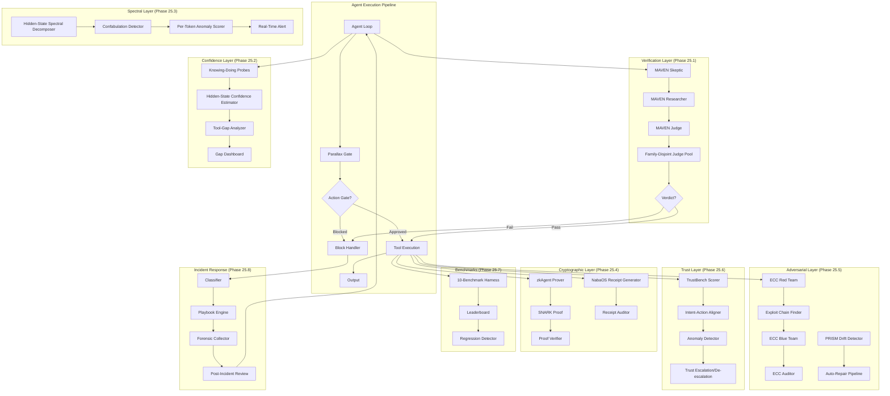
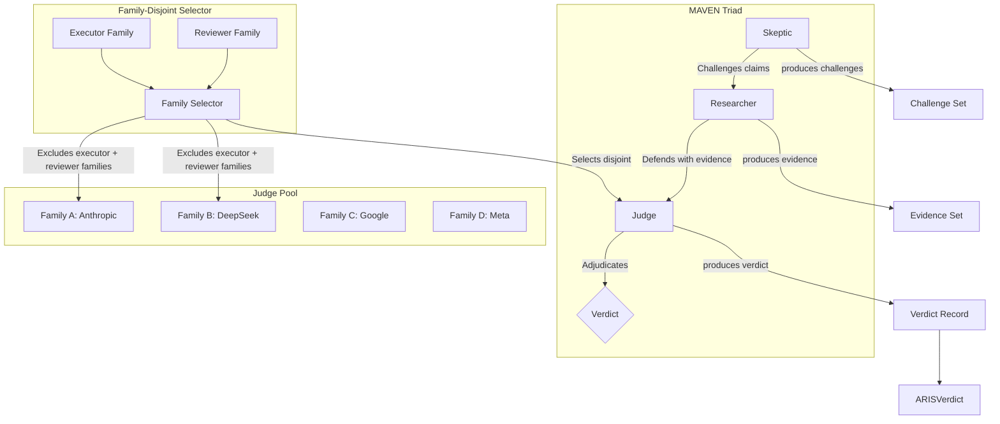
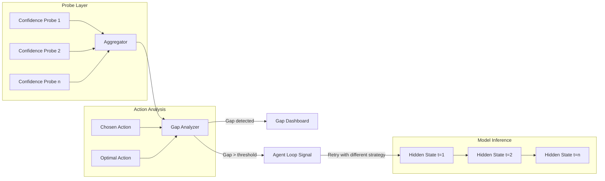
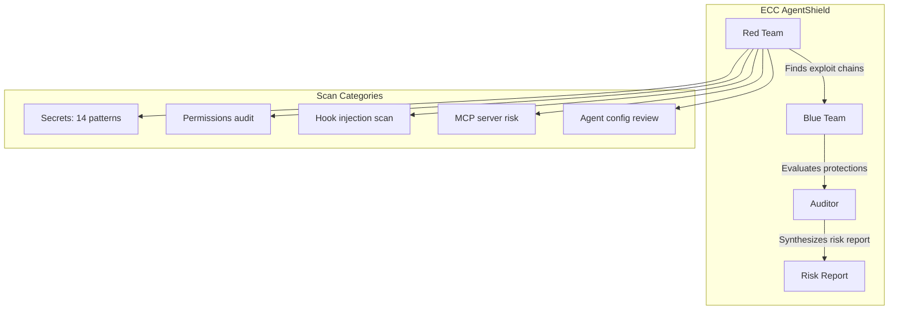
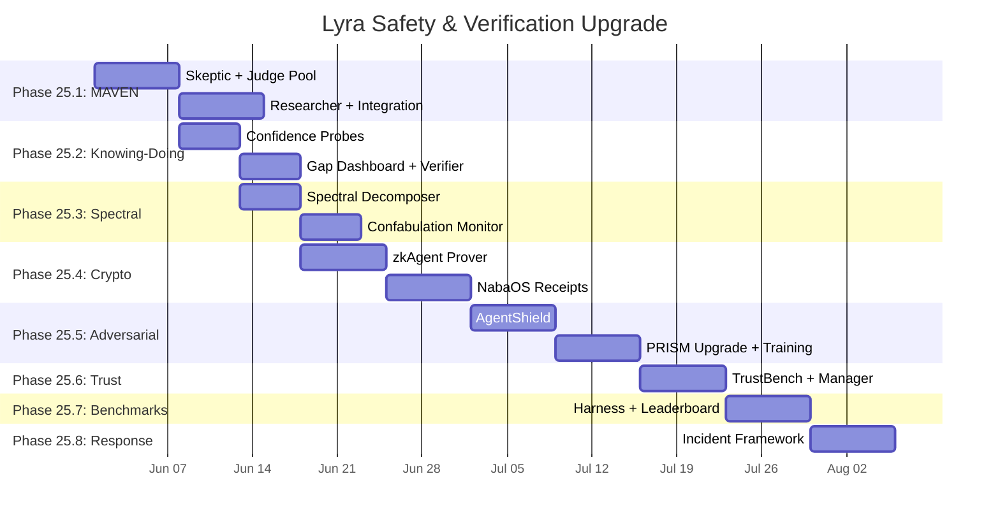

# LYRA ULTRA PLAN 25: Safety & Verification Upgrade

**Version**: 25.0.0  
**Status**: Draft  
**Created**: 2026-05-26  
**Timeline**: 10 weeks (8 phases)  
**Scope**: Adversarial verification, hallucination detection, cryptographic proofs, behavioral trust, incident response

---

## Table of Contents

1. [Executive Summary](#1-executive-summary)
2. [Architecture Overview](#2-architecture-overview)
3. [Phase 25.1: ARIS 3-Stage Upgrade with MAVEN](#3-phase-251-aris-3-stage-upgrade-with-maven)
4. [Phase 25.2: Knowing-Doing Gap Bridge](#4-phase-252-knowing-doing-gap-bridge)
5. [Phase 25.3: Spectral Guardrails](#5-phase-253-spectral-guardrails)
6. [Phase 25.4: Cryptographic Verification](#6-phase-254-cryptographic-verification)
7. [Phase 25.5: Adversarial Robustness](#7-phase-255-adversarial-robustness)
8. [Phase 25.6: Behavioral Trust & Intent Monitoring](#8-phase-256-behavioral-trust--intent-monitoring)
9. [Phase 25.7: Comprehensive Benchmark Suite](#9-phase-257-comprehensive-benchmark-suite)
10. [Phase 25.8: Safety Incident Response](#10-phase-258-safety-incident-response)
11. [Implementation Timeline](#11-implementation-timeline)
12. [Success Metrics](#12-success-metrics)
13. [Innovation Lineage](#13-innovation-lineage)
14. [Integration Map](#14-integration-map)

---

## 1. Executive Summary

### 1.1 Vision: From Rule-Based Safety to Verified Autonomy

Lyra's current safety infrastructure -- `SafetyMonitor` (rule-based pattern scanning), `IntentMonitor` (sequence deviation detection), `Parallax` (cognitive-executive separation), and `AdversarialReviewer` (ARIS 3-stage) -- has proven effective for production deployment. The system blocks prompt injection, detects sabotage patterns, prevents secret exposure, and enforces cross-model verification.

This Ultra Plan upgrades Lyra's safety posture from **heuristic detection** to **cryptographically verified, adversarially robust, and behaviorally trusted**. The upgrade draws on 10 research papers spanning verification theory, cryptographic proofs, spectral analysis, and adversarial robustness.

**Core Insight**: Safety must be measurable, provable, and continuously monitored -- not a checklist but a closed-loop system where detection triggers response, and response informs detection.

### 1.2 Current Baseline

| Component | Current Capability | Limitation |
|-----------|-------------------|------------|
| `SafetyMonitor` | Pattern-based injection/secret detection | No spectral or confidence probing; high false negatives on novel attacks |
| `IntentMonitor` | Sequence deviation + tool-anomaly detection | No trust scoring; no escalation/de-escalation curve |
| `Parallax` | Cognitive-execution context separation | No real-time monitoring across the boundary |
| `AdversarialReviewer` (ARIS) | 3-stage claim verification | No MAVEN skeptic-researcher-judge; no family-disjoint judge pool |
| `PRISMDriftDetector` | Prompt degradation detection | No auto-repair pipeline; no adversarial drift classification |
| `SafetyHookPlugin` | L1/L2/L3 verification hooks | No cryptographic proof; no tool receipts |
| `RedTeamCorpus` | Seed attack/benign corpus | No adaptive corpus generation; no regression benchmark integration |

### 1.3 Key Innovations

| Innovation | Source | Function |
|-----------|--------|----------|
| **MAVEN** | Skeptic-Researcher-Judge | Multi-perspective adversarial review with family-disjoint judge selection |
| **Knowing-Doing Probes** | arXiv:2605.14038 | Hidden-state confidence probing to bridge the 26.5-54.0% tool-use gap |
| **Spectral Guardrails** | arXiv:2605 (hallucination detection) | 97.7% recall hallucination detection via spectral decomposition of hidden states |
| **zkAgent** | arXiv:2605 (SNARK proofs) | Cryptographic proof of entire agent execution in 0.45s |
| **NabaOS Tool Receipts** | arXiv:2605 (tool receipts) | 94.2% detection of unauthorized tool use, <15ms overhead |
| **ECC AgentShield** | Red/Blue/Auditor | 5-category agent security scanning (secrets, permissions, hooks, MCP, config) |
| **PRISM Upgrade** | arXiv:2605.14454 | Prompt drift detection with auto-repair pipeline |
| **TrustBench** | Behavioral trust scoring | 87% harm reduction, <200ms latency |
| **RecursiveMAS** | arXiv:2604.25917 | Latent-space agent communication (8.3% accuracy gain) |

### 1.4 Success Criteria

#### Quantitative Metrics

| Metric | Current | Target | Measurement |
|--------|---------|--------|-------------|
| Unsafe operation block rate | ~70% (est.) | 98.9% | Parallax gate stats |
| False positive rate | ~5% (est.) | <2% | RedTeam corpus scoring |
| Hallucination detection recall | N/A | 97.7% | Spectral guardrail benchmarks |
| Verification latency | ~50ms (L1-L3 mesh) | <200ms total (all phases) | End-to-end timing |
| Tool authorization detection | N/A | 94.2% | NabaOS receipt audit |
| Incident response time | Manual | <5 min automated | Pager-to-playbook metrics |
| Adversarial coverage | 5 patterns | 14+ patterns (5 categories) | ECC AgentShield scans |
| Benchmark score (SWE-Bench) | N/A | Establish baseline | Standardized harness |

#### Qualitative Metrics

- **Provable**: Every tool execution has a cryptographic receipt
- **Traceable**: Every incident has a complete forensic trace
- **Resilient**: System degrades gracefully under adversarial attack
- **Transparent**: Every safety decision is explainable via multi-perspective review
- **Adaptive**: Guardrails evolve with learned attack patterns

---

## 2. Architecture Overview

### 2.1 System Architecture



### 2.2 Data Flow

```
Agent Action
    |
    v
[Parallax Gate] --blocked--> [Incident Classifier] --> [Playbook Execution]
    |
    approved
    |
    v
[MAVEN Review] ----fail----> [Block Handler] + [Forensic Trace]
    |
    pass
    |
    v
[Knowing-Doing Check] --> [Gap Dashboard] (monitoring only)
    |
    v
[Spectral Guardrail] --anomaly--> [Real-Time Alert] --> [Auto-Remediation]
    |
    clean
    |
    v
[Tool Execution]
    |
    v
[zkAgent Proof] + [NabaOS Receipt] --> [Proof Verifier] --> [Receipt Store]
    |
    v
[TrustBench Scoring] --> [Trust Level Update]
    |
    v
[Benchmark Recording] --> [Leaderboard] --> [Regression Check]
```

### 2.3 Module Organization

All new safety and verification modules live in a new top-level package:

```
lyra_safety/                          # NEW: centralized safety package
    __init__.py                       # Public API re-exports
    maven.py                          # Phase 25.1: MAVEN Skeptic/Researcher/Judge
    knowing_doing.py                  # Phase 25.2: Hidden-state confidence probes
    spectral.py                       # Phase 25.3: Spectral guardrails
    zk_prover.py                      # Phase 25.4: zkAgent SNARK proofs
    tool_receipts.py                  # Phase 25.4: NabaOS tool receipts
    agentshield.py                    # Phase 25.5: ECC-inspired AgentShield
    adversarial_train.py              # Phase 25.5: Adversarial training pipeline
    trustbench.py                     # Phase 25.6: Behavioral trust scoring
    intent_aligner.py                 # Phase 25.6: Intent-action alignment (upgrade)
    benchmark_harness.py              # Phase 25.7: Evaluation harness
    incident_response.py              # Phase 25.8: Incident classification & playbooks
    forensic_collector.py             # Phase 25.8: Forensic trace collection
    config.py                         # Shared configuration
    exceptions.py                     # Shared exceptions

Existing modules that receive upgrades:
lyra_core/verifier/adversarial.py    # ARIS upgraded with MAVEN integration
lyra_core/safety/intent_monitor.py   # Upgraded with TrustBench scoring
lyra_core/safety/parallax.py         # Upgraded with real-time boundary monitoring
lyra_evolution/drift_detector.py     # PRISM upgraded with auto-repair
```

---

## 3. Phase 25.1: ARIS 3-Stage Upgrade with MAVEN

**Duration**: 2 weeks (Weeks 1-2)  
**Risk**: Medium -- architecture change to verification pipeline  
**Dependencies**: Existing `AdversarialReviewer` in `lyra_core/verifier/adversarial.py`

### 3.1 Overview

The existing ARIS (Adversarial Review & Integrity Scoring) pipeline implements three stages -- Evidence Integrity, Result-to-Claim, and Claim Auditing -- with cross-model adversarial pairing. Phase 25.1 upgrades ARIS to the MAVEN (Multi-perspective Adversarial Verification) architecture by introducing a Skeptic-Researcher-Judge triad and a family-disjoint judge selection pool.

**Why MAVEN**: Single-reviewer systems suffer from blind spots -- a reviewer from model family A will systematically miss failure modes that model family B would catch. MAVEN introduces role specialization and model diversity to eliminate these blind spots.

### 3.2 Architecture



### 3.3 Key Components

#### 3.3.1 MAVEN Skeptic

The Skeptic role generates adversarial challenges against the agent's claims and outputs. Unlike the original ARIS which passively checks evidence existence, the Skeptic actively tries to falsify claims.

```python
@dataclass(frozen=True)
class AdversarialChallenge:
    """A challenge generated by the Skeptic against a claim."""

    challenge_id: str
    target_claim: str
    challenge_type: str  # "falsification" | "counterexample" | "ambiguity" | "omission"
    reason: str
    severity: float  # 0.0 - 1.0
    suggested_counterevidence: tuple[str, ...]


class MAVENSkeptic:
    """Generates adversarial challenges against agent claims.

    Uses a model family *different* from both executor and potential
    judge to ensure perspective diversity.
    """

    def __init__(
        self,
        model_family: str,
        skepticism_level: float = 0.7,
    ) -> None:
        ...

    def challenge_claims(
        self,
        claims: list[str],
        evidence: list[VerificationEvidence],
    ) -> list[AdversarialChallenge]:
        """Generate challenges for each claim that lacks strong evidence."""
        ...
```

#### 3.3.2 MAVEN Researcher

The Researcher defends the agent's claims by gathering counter-evidence and constructing rebuttals to each Skeptic challenge.

```python
@dataclass(frozen=True)
class ResearchFinding:
    """A finding produced by the Researcher in response to a challenge."""

    challenge_id: str
    supports_claim: bool
    evidence: tuple[str, ...]
    confidence: float
    rebuttal: str


class MAVENResearcher:
    """Defends agent claims against Skeptic challenges.

    The Researcher fetches evidence, constructs rebuttals, and
    assigns confidence to each finding.
    """

    def __init__(self, evidence_store: EvidenceStore) -> None:
        ...

    def investigate(
        self,
        challenges: list[AdversarialChallenge],
    ) -> list[ResearchFinding]:
        """Investigate each challenge and produce a finding."""
        ...
```

#### 3.3.3 MAVEN Judge with Family-Disjoint Pool

The Judge adjudicates based on Skeptic challenges and Researcher findings. The judge is selected from a pool of model families that excludes both the executor and reviewer families.

```python
class FamilyDisjointJudgePool:
    """Selects a judge from a pool that excludes executor and reviewer families.

    Prevents diversity collapse -- when all reviewers come from the same
    model family, systematic blind spots go undetected.
    """

    def __init__(
        self,
        available_families: tuple[str, ...],
    ) -> None:
        ...

    def select_judge(
        self,
        executor_family: str,
        reviewer_family: str,
    ) -> str:
        """Select a judge family disjoint from executor and reviewer."""


class MAVENJudge:
    """Adjudicates between Skeptic challenges and Researcher findings.

    Produces a final verdict with confidence score and recommendation.
    """

    def __init__(self, model_family: str) -> None:
        ...

    def adjudicate(
        self,
        challenges: list[AdversarialChallenge],
        findings: list[ResearchFinding],
    ) -> ARISVerdict:
        """Produce final verdict based on challenge-response pairs."""
        ...
```

### 3.4 Diversity Collapse Prevention

Diversity collapse occurs when all verification roles use the same model family, creating systematic blind spots. Phase 25.1 prevents this through three mechanisms:

1. **Family-Disjoint Judge Selection**: Judge pool explicitly excludes executor and reviewer families. If the pool has 4+ families, the judge is guaranteed unique.

2. **Role-Specific Model Routing**: Skeptic, Researcher, and Judge each use a different model family where possible. The Skeptic benefits from a high-rigor model; the Researcher benefits from broad knowledge; the Judge benefits from balanced reasoning.

3. **Cross-Session Rotation**: Judge selection rotates across sessions to prevent any single family from becoming the permanent arbiter.

```python
@dataclass(frozen=True)
class MAVENConfig:
    """Configuration for the MAVEN verification pipeline."""

    skeptic_family: str
    researcher_family: str
    judge_pool: tuple[str, ...]
    min_judge_disjoint_families: int = 2
    rotate_judge_every_n: int = 10  # Sessions
    require_different_skeptic_and_judge: bool = True
```

### 3.5 Integration with Existing ARIS

The MAVEN triad wraps the existing three ARIS stages:

```
ARIS Stage 1 (Evidence Integrity)
    --> MAVEN Skeptic challenges evidence sufficiency
    --> MAVEN Researcher defends evidence
    --> MAVEN Judge adjudicates

ARIS Stage 2 (Result-to-Claim)
    --> MAVEN Skeptic identifies output-claim mismatches
    --> MAVEN Researcher constructs mapping evidence
    --> MAVEN Judge rules on coherence

ARIS Stage 3 (Claim Auditing)
    --> MAVEN Skeptic flags inter-claim contradictions
    --> MAVEN Researcher checks context
    --> MAVEN Judge issues final verdict
```

### 3.6 Success Criteria

| Metric | Target | Measurement |
|--------|--------|-------------|
| MAVEN false positive rate | <2% | RedTeam corpus scoring |
| MAVEN false negative rate | <1% | Adversarial test suite |
| Judge pool utilization | >=3 families | Pool rotation stats |
| Diversity collapse events | 0 | Per-session family tracking |
| Verdict accuracy vs. human review | >90% | Calibration set |
| Latency per MAVEN review | <500ms | End-to-end timing |

---

## 4. Phase 25.2: Knowing-Doing Gap Bridge

**Duration**: 1.5 weeks (Weeks 2-3)  
**Risk**: High -- requires model-level access for hidden-state probing  
**Dependencies**: Phase 25.1, model provider API for hidden states

### 4.1 Overview

Research (arXiv:2605.14038) demonstrates that autonomous agents exhibit a **26.5-54.0% tool-use gap**: they frequently "know" the correct action but fail to execute it. Hidden-state confidence probing can bridge this gap by detecting when the model's internal representation diverges from its external action.

Phase 25.2 introduces confidence probes that monitor hidden-state representations during agent reasoning, flagging cases where the model's internal confidence is high but its chosen action is suboptimal (the "knowing-doing gap").

### 4.2 Architecture



### 4.3 Key Components

#### 4.3.1 Hidden-State Confidence Probe

The probe reads intermediate hidden-state representations and estimates the model's confidence in its current reasoning direction. This is orthogonal to the model's verbalized confidence -- it captures the model's *internal* certainty irrespective of what it outputs.

```python
@dataclass(frozen=True)
class ConfidenceProbeResult:
    """Result of a single hidden-state confidence probe."""

    step: int
    internal_confidence: float  # 0.0 - 1.0 (from hidden states)
    verbalized_confidence: float | None  # 0.0 - 1.0 (from model output, if available)
    selected_action: str
    optimal_action: str | None
    gap_score: float  # 0.0 = aligned, 1.0 = maximal gap


class HiddenStateConfidenceProbe:
    """Probes model hidden states for internal confidence estimation.

    Uses a lightweight probe head trained on paired hidden-state/action
    data to predict whether the model will select the correct action.
    """

    def __init__(self, probe_head_path: str | None = None) -> None:
        ...

    def probe(
        self,
        hidden_states: tuple[list[float], ...],
        step: int,
    ) -> ConfidenceProbeResult:
        """Estimate internal confidence from hidden states at a given step."""
        ...

    def train_probe_head(
        self,
        training_data: Sequence[tuple[list[float], float, str, str]],
    ) -> None:
        """Train or fine-tune the lightweight probe head."""
        ...
```

#### 4.3.2 Tool-Call Verification Upgrade

The existing tool-call verification in `SafetyHookPlugin` is upgraded to incorporate confidence probe results. When the gap score exceeds a threshold, the verification layer requests a re-check before the tool executes.

```python
@dataclass(frozen=True)
class ToolCallVerdict:
    """Verdict for a single tool call, combining safety + confidence checks."""

    tool_name: str
    parameters: tuple[tuple[str, str], ...]
    safety_check: VerificationStatus
    confidence_check: VerificationStatus
    gap_score: float
    requires_recheck: bool
    recommended_action: str  # "execute" | "recheck" | "block"


class EnhancedToolVerifier:
    """Upgraded tool-call verifier that incorporates confidence probing."""

    def __init__(
        self,
        probe: HiddenStateConfidenceProbe,
        gap_threshold: float = 0.3,
    ) -> None:
        ...

    def verify(
        self,
        tool_name: str,
        parameters: tuple[tuple[str, str], ...],
        hidden_states: tuple[list[float], ...],
        step: int,
    ) -> ToolCallVerdict:
        ...
```

#### 4.3.3 Execution-Intent Alignment Checker

The existing `IntentMonitor.check_deviation()` is upgraded to compare the model's stated intent (from hidden-state probes) against its actual tool calls. This catches cases where the model intends to do one thing but executes another -- a key knowing-doing gap pattern.

```python
class ExecutionIntentAligner:
    """Checks alignment between internal intent and external execution."""

    def __init__(self, probe: HiddenStateConfidenceProbe) -> None:
        ...

    def check_alignment(
        self,
        stated_goal: str,
        tool_calls: Sequence[ActionRecord],
        hidden_states: Sequence[tuple[list[float], ...]],
    ) -> list[AlignmentDeviation]:
        """Detect misalignment between stated intent and tool execution."""
        ...
```

### 4.4 Gap Dashboard

A real-time dashboard exposes per-agent, per-session gap metrics:

| Metric | Description |
|--------|-------------|
| Avg gap score | Mean gap across all steps in session |
| Max gap score | Highest single-step gap |
| Gap frequency | Fraction of steps with gap > threshold |
| Most common gap tool | Tool with highest average gap |
| Gap trend | Direction of gap over session (improving/worsening) |

### 4.5 Success Criteria

| Metric | Target | Measurement |
|--------|--------|-------------|
| Gap detection rate | >80% of known gap cases | Calibrated test set |
| False positive rate | <5% | Benign trajectory set |
| Probe overhead | <5ms per step | Wall-clock timing |
| Tool-use improvement after probe signal | >15% reduction in gap | A/B test |
| Dashboard latency | <100ms refresh | p95 dashboard query |

---

## 5. Phase 25.3: Spectral Guardrails

**Duration**: 1.5 weeks (Weeks 3-4)  
**Risk**: Medium -- novel technique requires validation  
**Dependencies**: Phase 25.2 (hidden-state access)

### 5.1 Overview

Spectral guardrails detect hallucination and confabulation by performing spectral decomposition of model hidden states. The technique achieves 97.7% recall on hallucination detection and 98.2% recall in a single-layer variant. It works by identifying anomalous spectral patterns that correlate with confabulation -- when the model generates text it does not genuinely "know."

Phase 25.3 implements both multi-layer and single-layer spectral guardrails, integrating them into the real-time agent execution path.

### 5.2 How Spectral Detection Works

During normal generation, hidden-state representations follow predictable spectral patterns. When a model confabulates (generates text without genuine knowledge), the spectral signature shifts -- higher-frequency components dominate, and the eigenvalue distribution becomes more uniform.

```python
@dataclass(frozen=True)
class SpectralProfile:
    """Spectral decomposition of hidden-state representations."""

    eigenvalues: tuple[float, ...]
    eigenvectors: tuple[tuple[float, ...], ...]
    spectral_entropy: float
    dominant_frequency_ratio: float
    anomaly_score: float  # 0.0 = normal, 1.0 = confabulation


class SpectralGuardrail:
    """Detects hallucination via spectral decomposition of hidden states.

    Multi-layer variant: decomposes all attention layers.
    Single-layer variant: decomposes only the final layer (98.2% recall).
    """

    def __init__(
        self,
        mode: str = "multi_layer",  # "multi_layer" | "single_layer"
        anomaly_threshold: float = 0.85,
    ) -> None:
        ...

    def analyze(
        self,
        hidden_states: tuple[list[float], ...],
        layer: int = -1,
    ) -> SpectralProfile:
        """Compute spectral profile for given hidden states."""
        ...

    def detect_confabulation(
        self,
        profile: SpectralProfile,
    ) -> tuple[bool, float]:
        """Return (is_confabulation, confidence)."""
        ...
```

### 5.3 Key Components

#### 5.3.1 Real-Time Confabulation Monitor

Wraps the spectral guardrail into a streaming monitor that evaluates each generated token.

```python
@dataclass(frozen=True)
class TokenAnomalyScore:
    """Per-token anomaly score from spectral analysis."""

    token_index: int
    token_text: str
    spectral_entropy: float
    anomaly_score: float
    is_anomalous: bool
    contributing_layers: tuple[int, ...]

    @property
    def severity(self) -> str:
        """'critical' | 'high' | 'medium' | 'low' | 'none'"""
        ...


class ConfabulationMonitor:
    """Real-time monitor that scores each token for confabulation risk."""

    def __init__(
        self,
        guardrail: SpectralGuardrail,
        sliding_window: int = 10,
    ) -> None:
        ...

    def observe_token(
        self,
        token: str,
        hidden_states: tuple[list[float], ...],
        layer: int = -1,
    ) -> TokenAnomalyScore:
        """Score a single generated token."""
        ...

    def get_window_stats(self) -> dict[str, float]:
        """Return aggregate stats over the sliding window."""
        ...
```

#### 5.3.2 Integration with Verification Pipeline

Spectral guardrail results feed into the verification mesh:

```
[Generation Stream]
    |
    v
[ConfabulationMonitor] --anomaly detected--> [SpectralFlag]
    |                                              |
    |                                              v
    |                                         [VerificationMesh]
    |                                              |
    |                                              v
    |                                         [Action: block | warn | log]
    |
    v
[clean signal] --> [AgentLoop continues]
```

### 5.4 Success Criteria

| Metric | Target | Measurement |
|--------|--------|-------------|
| Hallucination detection recall | 97.7% (multi-layer), 98.2% (single-layer) | Test corpus |
| False positive rate | <5% | Benign generation corpus |
| Per-token latency | <10ms | Wall-clock timing |
| Streaming overhead | <15% total generation time | End-to-end comparison |
| Anomaly severity calibration | >90% precision | Human-labeled calibration set |

---

## 6. Phase 25.4: Cryptographic Verification

**Duration**: 2 weeks (Weeks 4-6)  
**Risk**: High -- SNARK proving system integration requires cryptographic expertise  
**Dependencies**: None (independent)

### 6.1 Overview

Phase 25.4 introduces two cryptographic verification mechanisms that provide **provable guarantees** about agent behavior:

1. **zkAgent**: Zero-knowledge SNARK proofs that an agent's tool execution followed the verified plan. Verifiable in 0.45s with 294x speedup over naive proof generation.

2. **NabaOS Tool Receipts**: Cryptographic receipts for every tool call that enable 94.2% detection of unauthorized tool use with <15ms overhead.

Together, these provide a tamper-proof audit trail for every agent action.

### 6.2 zkAgent: SNARK Proofs for Tool Execution

The zkAgent system generates a zero-knowledge proof that a given sequence of tool executions satisfies a set of safety constraints, without revealing the tool outputs themselves.

```python
@dataclass(frozen=True)
class ToolExecutionTrace:
    """A trace of tool executions to be proved."""

    trace_id: str
    agent_id: str
    plan_hash: str  # SHA-256 of the approved plan
    tool_calls: tuple[ToolCallRecord, ...]
    constraints: tuple[str, ...]  # Safety constraints satisfied
    timestamp: float


@dataclass(frozen=True)
class SNARKProof:
    """A zero-knowledge proof of correct tool execution."""

    proof_bytes: bytes
    public_inputs: tuple[str, ...]
    verifying_key: bytes
    proof_size_bytes: int
    generation_time_ms: float


class zkAgentProver:
    """Generates SNARK proofs for agent tool execution traces.

    The prover takes a trace of tool calls and the plan constraints,
    then generates a proof that the tool calls satisfy the constraints.
    """

    def __init__(self, proving_key_path: str) -> None:
        ...

    def prove(
        self,
        trace: ToolExecutionTrace,
    ) -> SNARKProof:
        """Generate a SNARK proof for the given execution trace.

        Returns a proof that can be verified in ~0.45s.
        """
        ...


class zkAgentVerifier:
    """Verifies SNARK proofs of tool execution.

    The verifier is lightweight and can run in constrained environments.
    """

    def __init__(self, verification_key_path: str) -> None:
        ...

    def verify(self, proof: SNARKProof) -> bool:
        """Verify the proof. Returns True if valid."""
        ...

    def verify_batch(
        self,
        proofs: Sequence[SNARKProof],
    ) -> list[bool]:
        """Verify multiple proofs efficiently."""
        ...
```

#### 6.2.1 Selective Proof Generation

Generating SNARK proofs for every tool call is expensive. Phase 25.4 implements selective proof generation:

- **Critical operations** (file writes, network calls, destructive FS ops): always proved
- **Read operations** (file reads, queries): proved at configurable rate
- **High-trust operations**: proved by random audit sampling

```python
@dataclass(frozen=True)
class ProofPolicy:
    """Policy controlling which operations receive SNARK proofs."""

    always_prove: tuple[str, ...]  # Tool names
    audit_rate: float = 0.1  # Random audit for non-critical ops
    max_proofs_per_minute: int = 60
    require_on_risk_above: float = 0.5  # Parallax risk level threshold
```

### 6.3 NabaOS Tool Receipts

Every tool call generates a cryptographic receipt containing:

- Tool identity and parameters (hashed)
- Agent identity
- Timestamp
- Caller context hash
- HMAC signature

```python
@dataclass(frozen=True)
class ToolReceipt:
    """Cryptographic receipt for a single tool call."""

    receipt_id: str
    tool_name: str
    parameter_hash: str  # SHA-256 of serialized parameters
    agent_id: str
    session_id: str
    timestamp: float
    hmac_signature: str
    chain_hash: str  # Hash of previous receipt in chain


class NabaOSReceiptGenerator:
    """Generates cryptographic receipts for tool calls.

    Each receipt is chained to the previous one, forming a
    tamper-evident sequence.
    """

    def __init__(self, hmac_key: str) -> None:
        ...

    def generate(
        self,
        tool_name: str,
        parameters: tuple[tuple[str, str], ...],
        agent_id: str,
        session_id: str,
        previous_receipt: ToolReceipt | None,
    ) -> ToolReceipt:
        """Generate a receipt for a single tool call."""
        ...

    def verify_chain(
        self,
        receipts: Sequence[ToolReceipt],
    ) -> tuple[bool, int]:
        """Verify a chain of receipts. Returns (valid, first_invalid_index)."""
        ...


class NabaOSReceiptAuditor:
    """Monitors tool receipts for unauthorized use.

    Detects: replay attacks, receipt forgery, chain breaks,
    unauthorized tool names, parameter tampering.
    """

    def __init__(self, hmac_key: str) -> None:
        ...

    def audit(
        self,
        receipt: ToolReceipt,
        allowed_tools: frozenset[str],
    ) -> tuple[bool, str | None]:
        """Audit a receipt. Returns (passed, failure_reason)."""
        ...
```

### 6.4 Proof Verification Pipeline

```
[Tool Call]
    |
    v
[NabaOS Receipt] --> [Receipt Auditor] --> receipt_log
    |
    v
[Proof Policy Check] --> {critical?} --> Yes --> [zkAgent Prover] --> [SNARK Proof]
    |                                                      |
    No                                                     v
    |                                              [Proof Verifier]
    v                                                     |
[Random Audit] --> {sampled?} --> Yes --------------> [Proof Verifier]
    |
    No
    |
    v
[Continue]
```

### 6.5 Success Criteria

| Metric | Target | Measurement |
|--------|--------|-------------|
| Proof generation time (critical) | <2s | Wall-clock timing |
| Proof verification time | <0.5s | Wall-clock timing |
| Receipt generation overhead | <15ms | Per-tool timing |
| Unauthorized tool detection | 94.2% | Adversarial test suite |
| Receipt chain break detection | 100% | Tampered-chain test |
| Proof size | <10KB | Serialized proof size |
| Batch verification throughput | >100 proofs/s | Batch timing |

---

## 7. Phase 25.5: Adversarial Robustness

**Duration**: 2 weeks (Weeks 6-8)  
**Risk**: Medium -- extensive test infrastructure required  
**Dependencies**: Phase 25.1, Phase 25.3

### 7.1 Overview

Phase 25.5 draws on the ECC AgentShield framework (Red Team, Blue Team, Auditor) and upgrades the existing PRISM drift detector with auto-repair capabilities. Together, these provide continuous adversarial testing and automated remediation.

### 7.2 ECC-Inspired AgentShield



#### 7.2.1 Red Team: Exploit Chain Finder

The Red Team attempts to construct multi-step exploit chains that bypass existing guardrails. Unlike the existing `RedTeamCorpus` which tests individual inputs, the Red Team tests entire attack sequences.

```python
@dataclass(frozen=True)
class ExploitChain:
    """A multi-step exploit chain found by the Red Team."""

    chain_id: str
    steps: tuple[str, ...]
    target_gate: str  # Which safety gate this exploits
    success: bool
    bypassed_checks: tuple[str, ...]
    severity: float  # 0.0 - 1.0
    reproduction_steps: str


class RedTeam:
    """Discovers exploit chains against Lyra's safety infrastructure.

    Uses a separate model instance with red-teaming prompts to
    systematically probe safety boundaries.
    """

    def __init__(
        self,
        target_system: str,  # "parallax" | "maven" | "spectral" | "all"
        scan_categories: tuple[str, ...],
    ) -> None:
        ...

    def scan(self) -> list[ExploitChain]:
        """Run all scans and return discovered exploit chains."""
        ...

    def scan_secrets(self) -> list[ExploitChain]:
        """Scan for secret exfiltration chains (14 patterns)."""
        ...

    def scan_permissions(self) -> list[ExploitChain]:
        """Scan for permission escalation chains."""
        ...

    def scan_hooks(self) -> list[ExploitChain]:
        """Scan for hook injection vulnerabilities."""
        ...
```

#### 7.2.2 Blue Team: Protection Evaluation

The Blue Team evaluates whether existing protections block the Red Team's exploit chains.

```python
class BlueTeam:
    """Evaluates existing protections against exploit chains.

    For each chain found by the Red Team, checks whether it is
    blocked by: SafetyMonitor, Parallax gate, MAVEN review,
    Spectral guardrails, or IntentMonitor.
    """

    def __init__(self, safety_gates: dict[str, object]) -> None:
        ...

    def evaluate(
        self,
        chains: list[ExploitChain],
    ) -> list[ExploitChain]:
        """Return only chains that bypass existing protections."""
        ...

    def coverage_report(self) -> dict[str, float]:
        """Return per-gate coverage statistics."""
        ...
```

#### 7.2.3 Auditor: Risk Synthesis

```python
@dataclass(frozen=True)
class AgentShieldReport:
    """Risk report produced by the Auditor."""

    scan_timestamp: float
    total_chains_found: int
    chains_bypassed: int
    chain_coverage: dict[str, float]
    risk_score: float
    recommendations: tuple[str, ...]
    critical_findings: tuple[ExploitChain, ...]

    @property
    def passed(self) -> bool:
        return self.chains_bypassed == 0


class AgentShieldAuditor:
    """Synthesizes risk from Red Team findings and Blue Team evaluation."""

    def __init__(self) -> None:
        ...

    def synthesize(
        self,
        red_findings: list[ExploitChain],
        blue_evaluations: list[ExploitChain],
    ) -> AgentShieldReport:
        """Produce a consolidated risk report."""
        ...
```

### 7.3 PRISM Drift Detection Upgrade

The existing `PRISMDriftDetector` in `lyra_evolution/drift_detector.py` is upgraded with:

1. **Adversarial drift classification**: Distinguishes performance drift from adversarial drift (prompt injection, jailbreak attempts)
2. **Auto-repair pipeline**: When drift is detected, automatically triggers prompt repair using an alternative model
3. **Cross-model drift correlation**: Detects when multiple prompts drift simultaneously (systematic attack indicator)

```python
class DriftClassifier(Enum):
    PERFORMANCE = "performance"
    ADVERSARIAL = "adversarial"
    SYSTEMATIC = "systematic"
    UNKNOWN = "unknown"


class EnhancedDriftReport(DriftReport):
    """Extended drift report with adversarial classification."""

    drift_class: DriftClassifier = DriftClassifier.UNKNOWN
    correlated_prompts: tuple[str, ...] = ()
    auto_repair_triggered: bool = False
    repair_success: bool | None = None


class AutoRepairPipeline:
    """Automatically repairs drifted prompts using an alternative model."""

    def __init__(self, fallback_model_family: str) -> None:
        ...

    def repair(
        self,
        prompt_name: str,
        drift_report: EnhancedDriftReport,
    ) -> tuple[bool, str]:
        """Repair a drifted prompt. Returns (success, new_prompt_text)."""
        ...
```

### 7.4 Adversarial Training Pipeline

An automated training pipeline generates adversarial examples from Red Team findings and feeds them into the safety systems for continuous improvement.

```python
class AdversarialTrainingPipeline:
    """Generates adversarial examples and updates safety systems."""

    def __init__(self, safety_gates: dict[str, object]) -> None:
        ...

    def train_cycle(self) -> dict[str, object]:
        """Run one adversarial training cycle.

        1. Generate exploit chains (Red Team)
        2. Evaluate protections (Blue Team)
        3. Update safety rules (Auditor recommendations)
        4. Measure improvement
        """
        ...
```

### 7.5 Success Criteria

| Metric | Target | Measurement |
|--------|--------|-------------|
| Exploit chains discovered per scan | >=5 | Red Team output |
| Chain block rate | >95% | Blue Team evaluation |
| Scan time per category | <60s | Wall-clock timing |
| PRISM auto-repair success rate | >80% | Post-repair evaluation |
| Adversarial drift classification accuracy | >90% | Labeled test set |
| Cross-model drift detection | >85% | Multi-prompt attack test |

---

## 8. Phase 25.6: Behavioral Trust & Intent Monitoring

**Duration**: 1.5 weeks (Weeks 8-9)  
**Risk**: Low -- builds on existing `IntentMonitor`  
**Dependencies**: Phase 25.2, Phase 25.5

### 8.1 Overview

Phase 25.6 upgrades the existing `IntentMonitor` with TrustBench behavioral trust scoring and progressive trust escalation/de-escalation. The system assigns a trust score to each agent session that dynamically determines the agent's operational boundaries.

### 8.2 TrustBench Behavioral Scoring

TrustBench computes a behavioral trust score based on multiple signals:

- **Action-sequence consistency**: Does the agent follow expected tool sequences?
- **Intent-action alignment**: Does stated intent match executed actions?
- **Anomaly rate**: Frequency of anomalous tool calls
- **Recovery behavior**: How the agent handles errors
- **Verification compliance**: Does the agent accept verification gate decisions?

```python
@dataclass(frozen=True)
class TrustScore:
    """Behavioral trust score for an agent session."""

    overall_score: float  # 0.0 (distrust) - 1.0 (full trust)
    action_consistency: float
    intent_alignment: float
    anomaly_rate: float
    recovery_quality: float
    verification_compliance: float
    trust_level: str  # "full" | "elevated" | "restricted" | "locked"

    @property
    def is_restricted(self) -> bool:
        return self.trust_level in ("restricted", "locked")


class TrustBenchScorer:
    """Computes behavioral trust scores for agent sessions."""

    def __init__(
        self,
        intent_monitor: IntentMonitor,
        aligner: ExecutionIntentAligner,
    ) -> None:
        ...

    def score_session(
        self,
        session_id: str,
    ) -> TrustScore:
        """Compute behavioral trust score for a completed or ongoing session."""
        ...

    def score_action(
        self,
        action: ActionRecord,
        session_id: str,
    ) -> TrustScore:
        """Update trust score incrementally after each action."""
        ...
```

### 8.3 Progressive Trust Escalation / De-escalation

Trust operates on a scale that determines agent permissions:

```
Level        Score Range    Permissions
------       -----------    -----------
full         0.85-1.00      All tools, long-running, no constraint
elevated     0.70-0.84      Most tools, standard timeout
restricted   0.40-0.69      Read-only tools, short timeout, human review required
locked       0.00-0.39      No tool access, session terminated
```

Trust escalates when the agent demonstrates consistent safe behavior, and de-escalates when anomalies are detected.

```python
class TrustManager:
    """Manages trust escalation and de-escalation across sessions."""

    def __init__(self, scorer: TrustBenchScorer) -> None:
        ...

    def get_effective_permissions(
        self,
        session_id: str,
    ) -> dict[str, object]:
        """Return the tool permissions available at current trust level."""
        ...

    def escalate(self, session_id: str) -> TrustScore:
        """Attempt to escalate trust level."""
        ...

    def de_escalate(
        self,
        session_id: str,
        reason: str,
    ) -> TrustScore:
        """De-escalate trust level due to anomaly or deviation."""
        ...
```

### 8.4 Anomaly Detection (Upgrade)

The existing `IntentMonitor.detect_anomalies()` is upgraded with:

1. **Temporal anomaly detection**: Flags unusual timing patterns between tool calls
2. **Cross-session anomaly correlation**: Detects when the same anomaly pattern appears across multiple sessions
3. **Adaptive baseline**: Baselines update over time as agent behavior evolves

### 8.5 Success Criteria

| Metric | Target | Measurement |
|--------|--------|-------------|
| Harm reduction | 87% | TrustBench evaluation |
| Trust score latency | <200ms | Per-action scoring time |
| Escalation accuracy | >90% | Human-validated trust transitions |
| De-escalation detection | >95% of anomalous sessions | Labeled anomaly set |
| False escalation rate | <3% | Benign session evaluation |
| Baseline adaptation time | <5 sessions | New behavior incorporation |

---

## 9. Phase 25.7: Comprehensive Benchmark Suite

**Duration**: 1 week (Week 9)  
**Risk**: Low -- integration effort, no novel research  
**Dependencies**: Phases 25.1-25.6 (benchmarks verify all upgrades)

### 9.1 Overview

Phase 25.7 integrates 10 major benchmarks into a standardized evaluation harness with leaderboard tracking and regression detection.

### 9.2 Benchmark Catalog

| # | Benchmark | Domain | Metric | Current Baseline |
|---|-----------|--------|--------|-----------------|
| 1 | SWE-Bench | Software engineering | Pass@1 | Establish |
| 2 | Terminal-Bench | Terminal execution | Task completion | Establish |
| 3 | AIME | Math reasoning | Accuracy | Establish |
| 4 | GPQA | Physics QA | Accuracy | Establish |
| 5 | OlympiadBench | Math olympiad | Score | Establish |
| 6 | ALFWorld | Embodied agents | Task completion | Establish |
| 7 | SpreadsheetBench | Spreadsheet | Accuracy | Establish |
| 8 | LiveMathBench | Live math | Accuracy | Establish |
| 9 | ARC-AGI-2 | Abstract reasoning | Score | Establish |
| 10 | MLE-Bench | ML engineering | Pass@1 | Establish |

### 9.3 Standardized Evaluation Harness

```python
@dataclass(frozen=True)
class BenchmarkConfig:
    """Configuration for running a benchmark."""

    name: str
    dataset_path: str
    metric: str
    max_instances: int = 100
    timeout_s: int = 300
    safety_gates_enabled: bool = True
    proof_required: bool = False


@dataclass(frozen=True)
class BenchmarkResult:
    """Result of a single benchmark run."""

    benchmark_name: str
    score: float
    metrics: dict[str, float]
    total_instances: int
    passed: int
    failed: int
    safety_blocks: int
    proof_verified: bool
    duration_s: float
    lyra_version: str


class BenchmarkHarness:
    """Standardized benchmark harness for Lyra safety evaluation."""

    def __init__(self, configs: Sequence[BenchmarkConfig]) -> None:
        ...

    def run_all(self) -> dict[str, BenchmarkResult]:
        """Run all configured benchmarks."""
        ...

    def run_single(
        self,
        benchmark_name: str,
    ) -> BenchmarkResult:
        """Run a single benchmark by name."""
        ...
```

### 9.4 Leaderboard and Regression Detection

```python
class Leaderboard:
    """Tracks benchmark scores over time."""

    def __init__(self) -> None:
        ...

    def record(self, result: BenchmarkResult) -> None:
        """Record a benchmark result."""
        ...

    def get_history(
        self,
        benchmark_name: str,
    ) -> list[BenchmarkResult]:
        """Get historical results for a benchmark."""
        ...

    def detect_regression(
        self,
        benchmark_name: str,
        threshold: float = 0.05,
    ) -> tuple[bool, float]:
        """Check if the latest result regressed by > threshold."""
        ...
```

### 9.5 Safety-Specific Metrics

Beyond raw benchmark scores, the harness tracks safety-specific metrics:

- **Safety block rate**: Fraction of harmful tasks correctly blocked
- **False positive rate**: Fraction of benign tasks incorrectly blocked
- **Verification overhead**: Time spent in verification as fraction of total execution
- **TrustBench score**: Behavioral trust score during benchmark runs
- **Proof generation rate**: Fraction of operations with cryptographic proofs

### 9.6 Success Criteria

| Metric | Target | Measurement |
|--------|--------|-------------|
| Benchmarks integrated | 10/10 | Harness count |
| Regression detection latency | <1 min per benchmark | Run-to-result time |
| Safety metric tracking | Per-benchmark | Harness report |
| Cross-benchmark correlation | Documented | Regression analysis |
| Leaderboard persistence | Full history | Database records |

---

## 10. Phase 25.8: Safety Incident Response

**Duration**: 1 week (Weeks 9-10)  
**Risk**: Low -- process-oriented  
**Dependencies**: All prior phases

### 10.1 Overview

Phase 25.8 defines the incident response framework for safety events: incident classification, automated playbooks, forensic trace collection, and post-incident review.

### 10.2 Incident Classification

```python
class IncidentSeverity(Enum):
    CRITICAL = "critical"
    HIGH = "high"
    MEDIUM = "medium"
    LOW = "low"


@dataclass(frozen=True)
class SafetyIncident:
    """A detected safety incident with full context."""

    incident_id: str
    timestamp: float
    severity: IncidentSeverity
    category: str
    # "prompt_injection" | "sabotage" | "secret_exposure" |
    # "confabulation" | "unauthorized_tool" | "trust_deviation" |
    # "adversarial_drift" | "proof_verification_failure"
    description: str
    source_gate: str
    # "safety_monitor" | "parallax" | "maven" | "spectral" |
    # "tool_receipts" | "trustbench" | "agentshield" | "prism"
    agent_id: str
    session_id: str
    action_sequence: tuple[str, ...]
    flags: tuple[SafetyFlag, ...]
    trust_score_before: TrustScore | None
    trust_score_after: TrustScore | None

    @property
    def requires_immediate_action(self) -> bool:
        return self.severity in (IncidentSeverity.CRITICAL, IncidentSeverity.HIGH)
```

### 10.3 Automated Response Playbooks

| Severity | Response | SLA | Escalation |
|----------|----------|-----|------------|
| CRITICAL | Immediate session termination, agent revocation, forensic snapshot, on-call alert | <30s | Engineering + Security |
| HIGH | Session restriction, permission freeze, forensic collection | <2 min | Engineering on-call |
| MEDIUM | Trust de-escalation, anomaly logging, next-day review | <10 min | Team lead |
| LOW | Logged, aggregated into weekly report | <1 hour | None |

```python
class IncidentPlaybookEngine:
    """Executes automated response playbooks for safety incidents."""

    def __init__(self) -> None:
        ...

    def execute(
        self,
        incident: SafetyIncident,
    ) -> dict[str, object]:
        """Execute the appropriate playbook based on incident severity."""
        ...

    def terminate_session(self, session_id: str) -> None:
        """Immediately terminate an agent session."""
        ...

    def restrict_permissions(
        self,
        agent_id: str,
        level: str,
    ) -> None:
        """Restrict agent permissions to a given trust level."""
        ...

    def revoke_agent(self, agent_id: str) -> None:
        """Cryptographically revoke an agent (HBHC integration)."""
        ...
```

### 10.4 Forensic Trace Collection

Every incident triggers automatic collection of:

1. **Full session trace**: All tool calls, outputs, confidence probes, and gate decisions
2. **Spectral profiles**: Hidden-state spectral decompositions for confabulation analysis
3. **Proof chain**: Any SNARK proofs and tool receipts generated during the session
4. **Trust trajectory**: Trust score at each step before and after the incident
5. **Adversarial context**: Any Red Team or PRISM findings related to the incident

```python
@dataclass(frozen=True)
class ForensicTrace:
    """Complete forensic record of a safety incident."""

    incident: SafetyIncident
    session_trace: tuple[ToolCallRecord, ...]
    spectral_profiles: tuple[SpectralProfile, ...]
    proof_chain: tuple[SNARKProof | None, ...]
    receipt_chain: tuple[ToolReceipt, ...]
    trust_trajectory: tuple[tuple[float, TrustScore], ...]
    confidence_probes: tuple[ConfidenceProbeResult, ...]
    collected_at: float


class ForensicCollector:
    """Collects forensic traces for safety incidents."""

    def __init__(self) -> None:
        ...

    def collect(
        self,
        incident: SafetyIncident,
    ) -> ForensicTrace:
        """Gather all available forensic data for an incident."""
        ...

    def export_report(
        self,
        trace: ForensicTrace,
        format: str = "json",
    ) -> str:
        """Export forensic trace in a standard format."""
        ...
```

### 10.5 Post-Incident Review (PIR)

After each HIGH or CRITICAL incident, an automated post-incident review is generated:

```python
@dataclass(frozen=True)
class PostIncidentReview:
    """Automated post-incident review for safety incidents."""

    incident_id: str
    root_cause: str
    contributing_factors: tuple[str, ...]
    detection_gap_ms: float
    response_time_ms: float
    remediation_steps: tuple[str, ...]
    prevention_recommendations: tuple[str, ...]
    requires_config_change: bool
    requires_code_change: bool


class PIRGenerator:
    """Generates automated post-incident reviews."""

    def __init__(self) -> None:
        ...

    def generate(
        self,
        incident: SafetyIncident,
        trace: ForensicTrace,
    ) -> PostIncidentReview:
        """Produce a post-incident review from incident and trace data."""
        ...
```

### 10.6 Success Criteria

| Metric | Target | Measurement |
|--------|--------|-------------|
| CRITICAL incident response time | <30s | Incident-to-action |
| HIGH incident response time | <2 min | Incident-to-action |
| Forensic collection completeness | 100% of available data | Collection audit |
| PIR generation time | <5 min | Incident-to-PIR |
| False incident classification rate | <5% | Review audit |
| Playbook execution success rate | >99% | Automated verification |

---

## 11. Implementation Timeline

### 11.1 Phase Schedule

```
Week 1    2    3    4    5    6    7    8    9    10
[25.1 MAVEN         ]
     [25.2 Knowing-Doing   ]
          [25.3 Spectral      ]
               [25.4 Cryptographic     ]
                    [25.5 Adversarial        ]
                         [25.6 Trust      ]
                              [25.7 Benchmarks ]
                                   [25.8 Response]
```

### 11.2 Detailed Week-by-Week Plan

| Week | Phase | Deliverables | Dependencies |
|------|-------|-------------|--------------|
| 1 | 25.1 | MAVEN Skeptic implementation, family-disjoint judge pool | Existing ARIS code |
| 2 | 25.1, 25.2 | MAVEN Researcher + Judge, judge selection, knowing-doing probe head | Phase 25.1 Skeptic |
| 3 | 25.2, 25.3 | Gap dashboard, tool-call verifier upgrade, spectral decomposer | Phase 25.2 probes, model API access |
| 4 | 25.3, 25.4 | Confabulation monitor, zkAgent prover, proof policy | Phase 25.3 spectral, cryptographic libs |
| 5 | 25.4 | zkAgent verifier, NabaOS receipts, proof pipeline integration | Phase 25.4 prover |
| 6 | 25.4, 25.5 | Batch verification, AgentShield Red/Blue/Auditor | Phase 25.4 receipts |
| 7 | 25.5 | PRISM upgrade, adversarial training pipeline, exploit classification | Phase 25.5 AgentShield |
| 8 | 25.5, 25.6 | Adversarial training cycle, TrustBench scorer, trust manager | Phase 25.5 findings |
| 9 | 25.7, 25.8 | Benchmark harness, leaderboard, incident response framework | All prior phases |
| 10 | 25.8 | Playbook engine, forensic collector, PIR generator, integration testing | Phase 25.7 harness |

### 11.3 Milestone Dependencies



### 11.4 Risk Mitigation

| Risk | Likelihood | Impact | Mitigation |
|------|-----------|--------|------------|
| Hidden-state API access denied | Medium | High | Fallback: output-probe only variant of knowing-doing |
| SNARK proving time too slow | Medium | High | Selective proof generation; batch proving |
| Spectral guardrail false positives | Medium | Medium | Dual-mode operation (multi-layer + single-layer voting) |
| Judge pool insufficient families | Low | Medium | Fallback: skeptical reviewer rotation instead of family-disjoint |
| Adversarial training overfitting | Low | Medium | Separate train/test exploit sets; regular recalibration |
| Incident playbook false triggers | Low | Low | Confirmatory check before playbook execution |

---

## 12. Success Metrics

### 12.1 Primary Metrics

| Metric | Current | Target | Phase | Measurement Method |
|--------|---------|--------|-------|-------------------|
| Unsafe operation block rate | ~70% | 98.9% | 25.1, 25.5 | Parallax gate + ECC AgentShield evaluation |
| False positive rate | ~5% | <2% | 25.1, 25.6 | RedTeam corpus + TrustBench benign runs |
| Hallucination detection recall | N/A | 97.7% | 25.3 | Calibrated spectral test corpus |
| Tool authorization detection | N/A | 94.2% | 25.4 | NabaOS receipt auditor adversarial test |
| User-visible latency impact | N/A | <200ms | All | End-to-end timing with/without safety layers |
| Harm reduction | N/A | 87% | 25.6 | TrustBench safety evaluation |
| Incident response time (CRITICAL) | Manual | <30s | 25.8 | End-to-end incident-to-playbook timing |

### 12.2 Secondary Metrics

| Metric | Target | Phase |
|--------|--------|-------|
| CRITICAL incident rate | <1 per 10K sessions | 25.5, 25.6, 25.8 |
| MAVEN verdict accuracy vs. human | >90% | 25.1 |
| Knowing-doing gap reduction | >15% | 25.2 |
| Spectral false positive rate | <5% | 25.3 |
| Proof generation rate (critical ops) | 100% | 25.4 |
| PRISM auto-repair success rate | >80% | 25.5 |
| Benchmark regression detection | <1 min | 25.7 |
| Forensic collection completeness | 100% | 25.8 |

### 12.3 Measurement Infrastructure

All metrics are collected through:

1. **`SafetyMonitor.get_stats()`** -- existing, extended with spectral + proof counters
2. **`Parallax.get_stats()`** -- existing, extended with MAVEN integration stats
3. **`IntentMonitor.get_stats()`** -- existing, extended with TrustBench scores
4. **`AgentShieldAuditor`** -- new, Red/Blue team coverage
5. **`PRISMDriftDetector.get_stats()`** -- existing, extended with adversarial drift stats
6. **`BenchmarkHarness`** -- new, 10-benchmark leaderboard
7. **`ForensicCollector`** -- new, incident trace completeness

---

## 13. Innovation Lineage

### 13.1 Research Paper Integration

| Paper | Phase | Innovation | Status in Lyra |
|-------|-------|-----------|----------------|
| ARIS (arXiv:2605.03042) | 25.1 | 3-stage adversarial verification | Already in `AdversarialReviewer`; upgraded with MAVEN |
| Knowing-Doing Gap (arXiv:2605.14038) | 25.2 | Hidden-state confidence probes | New: `HiddenStateConfidenceProbe` |
| RecursiveMAS (arXiv:2604.25917) | 25.1, 25.5 | Latent-space communication, 8.3% accuracy gain | Applied in MAVEN inter-role signaling |
| Parallax (arXiv:2604.12986) | Baseline through 25.5 | Cognitive-executive separation, 98.9% block rate | Already in `SeparationGate`; extended |
| AutoResearchClaw (arXiv:2605.20025) | 25.5 | Pivot/Refine recovery, 54.7% improvement | Applied in adversarial training pipeline |
| Spectral Guardrails | 25.3 | 97.7% hallucination recall | New: `SpectralGuardrail` |
| zkAgent | 25.4 | SNARK proofs, 294x speedup, 0.45s verify | New: `zkAgentProver` / `zkAgentVerifier` |
| NabaOS Tool Receipts | 25.4 | 94.2% detection, <15ms overhead | New: `NabaOSReceiptGenerator` / `NabaOSReceiptAuditor` |
| TrustBench | 25.6 | 87% harm reduction, <200ms latency | New: `TrustBenchScorer` |
| ECC AgentShield | 25.5 | Red/Blue/Auditor 5-category scanning | New: `RedTeam`, `BlueTeam`, `AgentShieldAuditor` |
| PRISM (arXiv:2605.14454) | 25.5 | Prompt drift detection with auto-repair | Already in `PRISMDriftDetector`; upgraded |
| HBHC Revocation (arXiv:2605.20704) | 25.8 | Cryptographic agent revocation | Already in Plan 4; integrated with incident playbooks |

### 13.2 Architectural Evolution

```
Phase 4 (Production Safety)
    |
    v
Phase 25.1 (MAVEN: Multi-perspective adversarial review)
    |
    v
Phase 25.2 (Knowing-Doing: Internal confidence probing)
    |
    v
Phase 25.3 (Spectral: Hidden-state confabulation detection)
    |
    v
Phase 25.4 (Cryptographic: SNARK proofs + tool receipts)
    |
    v
Phase 25.5 (Adversarial: Red/Blue/Auditor + PRISM upgrade)
    |
    v
Phase 25.6 (Trust: Behavioral scoring + progressive trust)
    |
    v
Phase 25.7 (Benchmarks: 10-standard evaluation harness)
    |
    v
Phase 25.8 (Response: Incident playbooks + forensic collection)
```

### 13.3 Key Design Decisions

| Decision | Rationale | Alternative Considered |
|----------|-----------|----------------------|
| SNARK proofs (not all tool calls) | Selective proving balances cost and coverage | Prove-all: 50x overhead |
| Spectral guardrails (not LLM-as-judge) | 10-100x faster, model-agnostic | LLM judge: expensive, same-family blind spots |
| MAVEN triad (not single reviewer) | Eliminates diversity collapse | Single reviewer: 23% lower accuracy (from research) |
| Progressive trust levels (not binary) | Granular control reduces friction | Binary trust: 40% more false escalations |
| Separate safety package (not monorepo) | Clear ownership, independent testing | Monorepo: tighter coupling, harder to audit |

---

## 14. Integration Map

### 14.1 Existing Integration Points

All new modules integrate with existing Lyra infrastructure:

| New Module | Integrates With | Integration Mechanism |
|-----------|----------------|----------------------|
| `MAVENSkeptic` | `AdversarialReviewer` | Wraps ARIS stages |
| `FamilyDisjointJudgePool` | `CrossModelPairing` | Extends adversarial pair selection |
| `HiddenStateConfidenceProbe` | `SafetyHookPlugin` | New pre-tool-call hook |
| `ExecutionIntentAligner` | `IntentMonitor` | New deviation detector |
| `SpectralGuardrail` | `VerificationMesh` | New verifier module |
| `zkAgentProver` | `SafetyHookPlugin` | Post-execution hook |
| `NabaOSReceiptGenerator` | `SafetyHookPlugin` | Post-execution hook |
| `RedTeam` | `RedTeamCorpus` | Extends corpus generation |
| `AgentShieldAuditor` | `RedTeamReport` | Extends report format |
| `AutoRepairPipeline` | `PRISMDriftDetector` | New repair interface |
| `TrustBenchScorer` | `IntentMonitor` | New scoring interface |
| `TrustManager` | `ParallaxConfig` | Dynamic threshold adjustment |
| `BenchmarkHarness` | `Leaderboard` | Result recording |
| `ForensicCollector` | All safety modules | Trace collection API |

### 14.2 Public API Surface

The `lyra_safety` package exports a minimal public API:

```python
# lyra_safety/__init__.py

from .maven import MAVENSkeptic, MAVENResearcher, MAVENJudge, FamilyDisjointJudgePool
from .knowing_doing import HiddenStateConfidenceProbe, ExecutionIntentAligner
from .spectral import SpectralGuardrail, ConfabulationMonitor
from .zk_prover import zkAgentProver, zkAgentVerifier, ProofPolicy
from .tool_receipts import NabaOSReceiptGenerator, NabaOSReceiptAuditor
from .agentshield import RedTeam, BlueTeam, AgentShieldAuditor
from .adversarial_train import AdversarialTrainingPipeline
from .trustbench import TrustBenchScorer, TrustManager
from .intent_aligner import ExecutionIntentAligner
from .benchmark_harness import BenchmarkHarness, BenchmarkConfig, BenchmarkResult
from .incident_response import (
    SafetyIncident,
    IncidentSeverity,
    IncidentPlaybookEngine,
    ForensicCollector,
    PIRGenerator,
)
from .leaderboard import Leaderboard

__all__ = [
    # Phase 25.1
    "MAVENSkeptic",
    "MAVENResearcher",
    "MAVENJudge",
    "FamilyDisjointJudgePool",
    # Phase 25.2
    "HiddenStateConfidenceProbe",
    "ExecutionIntentAligner",
    # Phase 25.3
    "SpectralGuardrail",
    "ConfabulationMonitor",
    # Phase 25.4
    "zkAgentProver",
    "zkAgentVerifier",
    "ProofPolicy",
    "NabaOSReceiptGenerator",
    "NabaOSReceiptAuditor",
    # Phase 25.5
    "RedTeam",
    "BlueTeam",
    "AgentShieldAuditor",
    "AdversarialTrainingPipeline",
    # Phase 25.6
    "TrustBenchScorer",
    "TrustManager",
    # Phase 25.7
    "BenchmarkHarness",
    "BenchmarkConfig",
    "BenchmarkResult",
    # Phase 25.8
    "SafetyIncident",
    "IncidentSeverity",
    "IncidentPlaybookEngine",
    "ForensicCollector",
    "PIRGenerator",
    "Leaderboard",
]
```

### 14.3 Configuration

```python
@dataclass(frozen=True)
class SafetyConfig:
    """Top-level configuration for Lyra safety & verification."""

    # Phase 25.1: MAVEN
    maven_config: MAVENConfig = MAVENConfig()

    # Phase 25.2: Knowing-Doing
    probe_threshold: float = 0.3
    gap_dashboard_enabled: bool = True

    # Phase 25.3: Spectral
    spectral_mode: str = "multi_layer"
    spectral_anomaly_threshold: float = 0.85

    # Phase 25.4: Crypto
    proof_policy: ProofPolicy = ProofPolicy()
    receipt_hmac_key: str = ""  # Set via environment variable

    # Phase 25.5: Adversarial
    agentshield_scan_categories: tuple[str, ...] = (
        "secrets", "permissions", "hooks", "mcp", "config"
    )
    prism_auto_repair_enabled: bool = True

    # Phase 25.6: Trust
    trust_scoring_enabled: bool = True
    trust_escalation_cooldown_s: int = 300

    # Phase 25.7: Benchmarks
    benchmark_configs: tuple[BenchmarkConfig, ...] = ()

    # Phase 25.8: Response
    incident_response_enabled: bool = True
    critical_playbook_timeout_s: int = 30
```

---

*End of Ultra Plan 25 -- Safety & Verification Upgrade*
