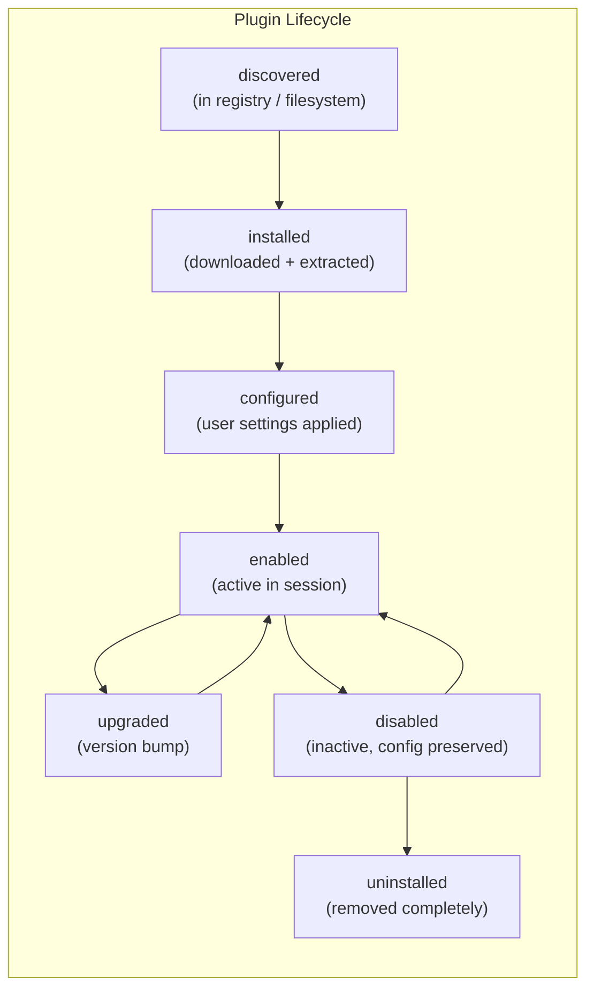
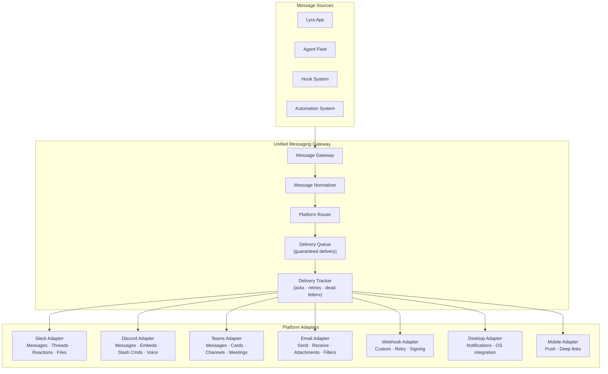
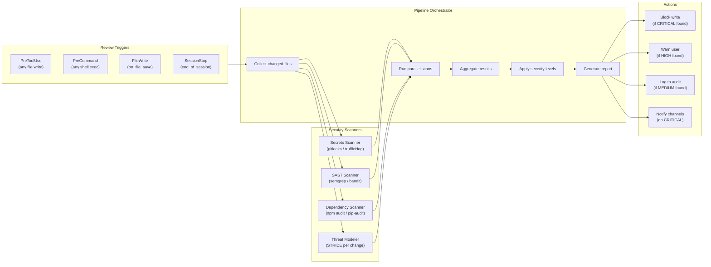

# LYRA ULTRA PLAN 26: Tools & Integration Ecosystem — Complete Blueprint

**Version:** 1.0.0 | **Status:** In Progress | **Created:** 2026-05-26
**Parent Plan:** [LYRA_ULTRA_PLAN_6_OMNI_AGI_BREAKTHROUGH.md](LYRA_ULTRA_PLAN_6_OMNI_AGI_BREAKTHROUGH.md)
**Extends:** [LYRA_ULTRA_PLAN_9_TOOLS_UNIVERSE.md](LYRA_ULTRA_PLAN_9_TOOLS_UNIVERSE.md) — Tool catalog foundation
**Extends:** [LYRA_ULTRA_PLAN_7_SKILLS_ECOSYSTEM.md](LYRA_ULTRA_PLAN_7_SKILLS_ECOSYSTEM.md) — Skill infrastructure

---

## Executive Summary

Build Lyra's complete tools and integration ecosystem — 200+ tools across 20 toolsets, an enterprise MCP gateway managing 25+ servers, a full plugin system with marketplace, 24+ event hooks with 5 handler types, 71+ slash commands, multi-platform channel integration, multi-language LSP code intelligence, and a 6-mode permission and security framework.

This plan synthesizes research across Claude Code (44 tools), Hermes-Agent (70+ tools, 28 toolsets), MCP Protocol (25+ servers), and community tools/integration patterns into a cohesive, production-grade tools and integration platform. Each component is designed for extensibility, security, and progressive disclosure to minimize context overhead while maximizing agent capability.

---

## Architecture Overview

```mermaid
graph TB
    subgraph UserLayer["Interaction Layer"]
        CLI["lyra CLI<br/>(Typer + prompt_toolkit)"]
        TUI["Terminal UI<br/>(Ink/React 19)"]
        ACP["ACP Server<br/>(Agent Client Protocol)"]
        Voice["Voice System<br/>(CESP v1.0)"]
    end

    subgraph SlashCommands["Slash Command System (71+)"]
        SC_Core["Core: help, clear, compact, context, cost, doctor, init, status, todos, upgrade, review"]
        SC_Mode["Mode: agent, plan, ask, auto, interactive"]
        SC_Config["Config: config, theme, model, permissions, hooks, plugins, skills, mcp"]
        SC_Git["Git: add, commit, pr, diff, log, stash, branch, checkout, push, pull, blame"]
        SC_Advanced["Advanced: goal, checkpoint, rewind, channels, agents, memory, tools, export, import"]
        SC_Alias["Alias Engine<br/>(user-defined shortcuts)"]
    end

    subgraph ToolSystem["Tool Kernel (200+ tools, 20 toolsets)"]
        direction TB
        TK["ToolRegistry<br/>(discovery · routing · documentation generation)"]
        FS["Filesystem (12)<br/>Read · Write · Edit · Glob · Grep · List · Info · Move · Copy · Delete · Watch · Diff"]
        CODE["Code (18)<br/>LSP · Analyze · Format · Typecheck · Test · Benchmark · DepGraph · Symbol Search"]
        SEARCH["Search (10)<br/>Web · Academic · Code · GitHub · Memory · Skill · Package · History"]
        SHELL["Shell (8)<br/>Run · Background · Stream · Interactive · Env · Script · Kill · Status"]
        GIT["Git (14)<br/>Status · Diff · Log · Blame · Add · Commit · Branch · Push · Pull · Stash · Worktree"]
        WEB["Web & Browser (20)<br/>Fetch · Search · Navigate · Click · Type · Screenshot · API Call · Upload"]
        DB["Database (14)<br/>Connect · Query · Schema · Migrate · Seed · Explain · Backup · Vector Search"]
        DOC["Document (14)<br/>Read · Create · Convert · Extract · OCR · Sign · Redact · Summarize"]
        MEDIA["Media (12)<br/>Info · Convert · Compress · Trim · Transcribe · Thumbnail · GIF · Watermark"]
        NET["Network (10)<br/>HTTP · DNS · Ping · Traceroute · SSL · Port Scan · WHOIS · Speedtest"]
        SEC["Security (10)<br/>Secrets · SAST · Dependency · XSS · CSRF · Threat Model · Pentest"]
        AGENT["Agent (12)<br/>Spawn · Delegate · Team · Fleet · Squad · Consensus · Handoff"]
        MEMORY["Memory (10)<br/>Store · Recall · Consolidate · Knowledge Graph · Stats · Context"]
        SKILL["Skill (8)<br/>List · Get · Invoke · Create · Install · Update · Evaluate · Evolve"]
        OBS["Observability (8)<br/>Trace · Metrics · Burn Report · Cost · Replay · Audit · Health"]
        AUTO["Automation (10)<br/>Goals · Schedule · Cron · Hooks · Continuous Mode"]
        COMM["Communication (10)<br/>Slack · Email · Discord · Teams · Telegram · Desktop · Mobile"]
        MCP["MCP (6)<br/>List Servers · List Tools · Call · Add · Remove · Search"]
    end

    subgraph MCPGateway["MCP Enterprise Gateway"]
        MG_DISCOVERY["Server Discovery<br/>(health · version · capabilities)"]
        MG_AUTH["Auth Layer<br/>(API keys · OAuth · mTLS)"]
        MG_RATE["Rate Limiting<br/>(per-server · per-user · per-tool)"]
        MG_AUDIT["Audit Logging<br/>(all tool calls · latency · errors)"]
        MG_CACHE["Response Cache<br/>(TTL-based · invalidation)"]
        MG_SERVERS["MCP Servers (25+)<br/>Filesystem · GitHub · Slack · Postgres · Redis · Puppeteer<br/>Brave Search · Memory · Sequential Thinking · Context7<br/>Exa · Perplexity · Tavily · Sentry · PagerDuty<br/>Docker · Kubernetes · Terraform · Jira · Confluence<br/>Notion · Figma · Linear · Stripe · OpenAPI"]
    end

    subgraph PluginSystem["Plugin System"]
        PM["Plugin Manifest<br/>(plugin.json / plugin.yaml)"]
        PL["Plugin Lifecycle<br/>install → configure → enable → disable → upgrade → uninstall"]
        PS["Plugin Sandbox<br/>(isolated execution environment)"]
        PK["Plugin Marketplace<br/>(discovery · ratings · reviews · 1,424+ skills)"]
        PD["Dependency Resolution<br/>(version compatibility · conflict detection)"]
    end

    subgraph Hooks["Hooks Infrastructure"]
        HK_EVENTS["24+ Events<br/>SessionStart · PreToolUse · PostToolUse · Stop<br/>PreCompact · PostCompact · Notification<br/>Checkpoint · Goal · SubagentStart · SubagentStop<br/>PreCommand · PostCommand · FileChange<br/>PermissionRequest · PreMessageCompaction<br/>PostMessageCompaction · CronTrigger · Error"]
        HK_TYPES["5 Handler Types<br/>Command (shell) · HTTP (webhook) · MCP Tool<br/>Prompt (LLM) · Agent (subagent)"]
        HK_CHAIN["Hook Chaining<br/>(sequential · parallel · conditional · error handlers)"]
        HK_MONITOR["Performance Monitoring<br/>(latency · error rate · timeout tracking)"]
    end

    subgraph Channels["Channel & Multi-Platform"]
        CH_SLACK["Slack<br/>Messages · Threads · Reactions · Files · Commands"]
        CH_DISCORD["Discord<br/>Messages · Embeds · Slash Commands · Voice"]
        CH_TEAMS["Microsoft Teams<br/>Messages · Cards · Channels · Meetings"]
        CH_EMAIL["Email<br/>Send · Receive · Attachments · Filters · Templates"]
        CH_WEBHOOK["Webhook Dispatcher<br/>Inbound · Outbound · Retry · Signing"]
        CH_GATEWAY["Unified Messaging Gateway<br/>Normalized message format · Platform adapters · Delivery guarantees"]
    end

    subgraph CodeIntelligence["LSP & Code Intelligence"]
        CI_LSP["Multi-Language LSP<br/>(12+ languages)"]
        CI_AST["AST-Grep<br/>(search + replace with meta-variables)"]
        CI_TS["Tree-Sitter<br/>(fine-grained AST queries)"]
        CI_QUALITY["Code Quality<br/>(complexity · dead code · API surface)"]
    end

    subgraph WebExternal["Web & External Integration"]
        WE_FETCH["WebFetch v2<br/>(rate limiting · caching · redirects · auth)"]
        WE_SEARCH["WebSearch v2<br/>(domain filters · multi-engine · structured)"]
        WE_API["API Client Gen<br/>(OpenAPI → typed client)"]
        WE_OAUTH["OAuth Flow Handler<br/>(PKCE · client credentials · refresh)"]
        WE_HOOK["Webhook Manager<br/>(register · verify · retry · monitor)"]
    end

    subgraph Security["Permissions & Security (6 Modes)"]
        SEC_MODES["Permission Modes<br/>plan · auto-edit · bypass · ask · restricted · locked"]
        SEC_PER_TOOL["Per-Tool Permission<br/>(allow · deny · ask · inherit)"]
        SEC_AUTO["Auto-Accept Rules<br/>(by tool · by path · by pattern · by count)"]
        SEC_AUDIT["Permission Audit Log<br/>(timestamp · tool · params · decision · mode)"]
        SEC_REVIEW["Security Review Pipeline<br/>(secrets scan · SAST · dependency · threat model)"]
    end

    UserLayer --> SlashCommands
    SlashCommands --> ToolSystem
    ToolSystem --> MCPGateway
    ToolSystem --> PluginSystem
    ToolSystem --> Hooks
    SlashCommands --> Channels
    ToolSystem --> CodeIntelligence
    ToolSystem --> WebExternal
    SlashCommands --> Security
    ToolSystem --> Security
```



---

## Phase 26.1: Core Tool System

### 26.1.1 Tool Registry Architecture

Central registry that discovers, indexes, and serves tool metadata to all Lyra components.

```python
@dataclass
class ToolDefinition:
    """Standard tool definition used across the entire ecosystem."""
    name: str                                           # Unique tool identifier
    description: str                                    # One-line description
    category: str                                       # toolsystem | mcp | plugin | builtin
    toolset: str                                        # filesystem | code | search | etc.
    version: str                                        # SemVer
    parameters: list[ParameterDef]                      # Parameter schemas
    returns: ReturnDef                                  # Return type schema
    permission: PermissionLevel                         # read | write | admin | dangerous
    parallel_safe: bool                                 # Can run concurrently
    token_cost_estimate: int                            # Estimated token cost
    requires_network: bool                              # Needs internet
    requires_permission: list[str]                      # Specific permissions needed
    examples: list[ExampleDef]                          # Usage examples
    documentation_url: str | None                       # Link to full docs
    status: Literal["stable", "beta", "alpha", "deprecated"]
    tags: list[str]                                     # Search/filter tags
```

**Tool Registry API:**

| Method | Description | Parameters | Returns |
|--------|-------------|------------|---------|
| `register_tool` | Register a tool | `ToolDefinition` | `ToolID` |
| `unregister_tool` | Remove a tool | `ToolID` | `bool` |
| `get_tool` | Get tool definition | `ToolID` | `ToolDefinition` |
| `search_tools` | Search across tools | `query, category, tags, permission` | `list[ToolDefinition]` |
| `list_toolsets` | List all toolsets | — | `list[ToolsetInfo]` |
| `list_tools_by_toolset` | Tools in a toolset | `toolset_name` | `list[ToolDefinition]` |
| `resolve_tool` | Resolve alias → tool | `alias_name` | `ToolDefinition` |
| `generate_docs` | Generate markdown docs | `toolset_name, format` | `str` |

### 26.1.2 Progressive Tool Disclosure

Three-level disclosure minimizes context overhead while keeping all tools accessible.

| Level | Content | Token Budget | When Loaded | Example |
|-------|---------|-------------|-------------|---------|
| L1 | Name + one-line description | ~30/tool | Session start (all 200+) | `file_read — Read file contents with offset/limit` |
| L2 | Full parameter schema + examples | ~200/tool | When task domain matches category | Shows `path: str, offset: int, limit: int` |
| L3 | Detailed usage guide + edge cases | ~500/tool | When tool is invoked | Shows error handling, large file strategies |

**Domain-to-Toolset Mapping:**

| Task Domain | Activated Toolsets | When Activated |
|-------------|-------------------|----------------|
| File editing | filesystem, code | Any file access |
| Code development | code, git, search | Python/TS/Go files detected |
| Web research | web, communication | WebFetch/WebSearch call |
| Database work | database | SQL files detected |
| Security audit | security, network | Security-related task |
| Media processing | media | Image/audio/video files |
| DevOps | shell, git, automation | CI/CD config files |
| Communication | communication | Channel-related command |

```json
{
  "tool_progressive_disclosure": {
    "enabled": true,
    "l1_always_visible": ["filesystem", "code", "search", "shell", "agent", "memory", "skill", "observability"],
    "l2_on_domain_match": ["web", "browser", "database", "document", "media", "security", "automation", "communication", "network", "git"],
    "l3_on_invoke": true,
    "max_l2_categories_per_session": 5,
    "auto_evict_dormant_toolsets_after_turns": 15
  }
}
```

### 26.1.3 Tool Documentation Generator

Auto-generates comprehensive markdown documentation from `ToolDefinition` metadata.

```bash
# Generate documentation for all tools
lyra tools docs --format markdown --output docs/tools/

# Generate for a specific toolset
lyra tools docs --toolset database --format markdown

# Generate API reference (JSON schema)
lyra tools docs --format json --output tools-schema.json

# Watch mode: regenerate on tool registration changes
lyra tools docs --watch
```

**Generated Documentation Structure:**

```
docs/tools/
├── index.md                          # Master index with tool count, category breakdown
├── filesystem.md                     # Per-toolset documentation
│   ├── file_read.md
│   ├── file_write.md
│   ├── file_edit.md
│   └── ...
├── code.md                           # Code tools documentation
├── database.md                       # Database tools documentation
├── ...                               # One file per toolset
├── mcp-servers.md                    # MCP server tools
├── slash-commands.md                 # All slash commands
├── hooks-reference.md                # Hook event reference
└── permissions-reference.md          # Permission mode reference
```

### 26.1.4 Tool Discovery & Search

```bash
# Search across all registered tools
lyra tools search "read file"

# Search with category filter
lyra tools search "compress" --toolset media

# Search with permission filter
lyra tools search "delete" --permission dangerous

# Show tool details
lyra tools show file_edit

# List all tools in a category
lyra tools list --toolset database

# Show tool usage statistics
lyra tools stats file_read
```

**Search Ranking Factors:**
1. Name match (highest weight)
2. Description keyword match
3. Tag match
4. Usage frequency (learned over time)
5. Category relevance to current task

---

## Phase 26.2: MCP Enterprise Gateway

### 26.2.1 Architecture

```mermaid
graph LR
    subgraph AgentLayer["Agent Layer"]
        AA["Application Agent"]
        SA["SubAgent"]
        FA["Fleet Agent"]
    end

    subgraph Gateway["MCP Enterprise Gateway"]
        GA["Gateway API"]
        AD["Auth Decorator"]
        RD["Rate Limiter"]
        ADL["Audit Logger"]
        CA["Cache Layer"]
        HD["Health Dashboard"]
    end

    subgraph Servers["MCP Server Pool (25+)"]
        FS_MCP["filesystem"]
        GH_MCP["github"]
        SL_MCP["slack"]
        PG_MCP["postgres"]
        RD_MCP["redis"]
        PP_MCP["puppeteer"]
        BS_MCP["brave-search"]
        MEM_MCP["memory"]
        ST_MCP["sequential-thinking"]
        C7_MCP["context7"]
        EX_MCP["exa"]
        PX_MCP["perplexity"]
        TV_MCP["tavily"]
        SE_MCP["sentry"]
        PD_MCP["pagerduty"]
        DK_MCP["docker"]
        K8_MCP["kubernetes"]
        TF_MCP["terraform"]
        JR_MCP["jira"]
        CF_MCP["confluence"]
        NT_MCP["notion"]
        FM_MCP["figma"]
        LN_MCP["linear"]
        STP_MCP["stripe"]
        OAPI_MCP["openapi"]
    end

    AgentLayer -->|"MCP Protocol"| GA
    GA --> AD
    AD --> RD
    RD --> CA
    CA --> HD
    HD --> ADL
    CA --> Servers
```



### 26.2.2 Server Discovery and Health

```yaml
# mcp-servers.yaml — Server configuration
servers:
  filesystem:
    transport: stdio
    command: npx
    args: ["-y", "@modelcontextprotocol/server-filesystem"]
    env:
      - ALLOWED_PATHS: ["/home/user/projects", "/tmp"]
    health_check:
      enabled: true
      interval_seconds: 60
      command: "echo 'ping'"
    version: ">=0.5.0"
    capabilities: ["read", "write", "search"]
    auth:
      type: none

  github:
    transport: stdio
    command: npx
    args: ["-y", "@modelcontextprotocol/server-github"]
    env:
      - GITHUB_TOKEN: "${GITHUB_TOKEN}"
    health_check:
      enabled: true
      interval_seconds: 120
      command: "gh api /user"
    version: ">=1.0.0"
    capabilities: ["read", "write", "search"]
    auth:
      type: token
      env_var: GITHUB_TOKEN

  slack:
    transport: stdio
    command: npx
    args: ["-y", "@modelcontextprotocol/server-slack"]
    env:
      - SLACK_BOT_TOKEN: "${SLACK_BOT_TOKEN}"
      - SLACK_TEAM_ID: "${SLACK_TEAM_ID}"
    health_check:
      enabled: true
      interval_seconds: 300
      command: "conversations.list"
    version: ">=0.4.0"
    capabilities: ["read", "write"]
    auth:
      type: oauth
      refresh_url: "https://slack.com/api/oauth.v2.access"
```

### 26.2.3 Unified Tool Discovery

A single search interface across both native tools and MCP server tools.

```bash
# Search across ALL tools (native + MCP)
lyra tools search "github issues" --include-mcp

# List all tools from a specific MCP server
lyra mcp list-tools --server github

# Search only MCP tools
lyra tools search "create issue" --source mcp

# Compare tools across sources
lyra tools search "search" --all-sources

# Show MCP server health
lyra mcp health
```

### 26.2.4 Auth, Rate Limiting, and Audit

**Auth Providers:**

| Provider | Type | Config |
|----------|------|--------|
| API Key | Header-based | `X-API-Key` header validation |
| OAuth 2.0 | PKCE + refresh | Token storage, auto-refresh |
| mTLS | Certificate-based | Client cert validation |
| Token | Bearer token | Static or rotating tokens |
| Environment | Env var injection | `${VAR_NAME}` in config |

**Rate Limiting Rules:**

| Scope | Default Limit | Burst | Window |
|-------|--------------|-------|--------|
| Per-server | 100 req/min | 20 | Rolling 60s |
| Per-user | 500 req/min | 50 | Rolling 60s |
| Per-tool | 50 req/min | 10 | Rolling 60s |
| Global | 1000 req/min | 100 | Rolling 60s |

**Audit Log Schema:**

```json
{
  "timestamp": "2026-05-26T10:00:00.000Z",
  "session_id": "sess_abc123",
  "user_id": "user_xyz",
  "source": "mcp",
  "server": "github",
  "tool": "create_issue",
  "parameters": {"repo": "lyra/lyra", "title": "Fix bug"},
  "duration_ms": 1234,
  "tokens_used": 567,
  "response_size_bytes": 890,
  "status": "success",
  "error": null,
  "rate_limit_remaining": 42
}
```

### 26.2.5 Dynamic Server Registration

```bash
# Register a new MCP server at runtime
lyra mcp add-server my-custom --transport http --url http://localhost:3000/mcp

# Register with auth
lyra mcp add-server github --transport stdio --auth token --env GITHUB_TOKEN

# Temporary server (auto-removed on session end)
lyra mcp add-server debug-server --transport stdio --ephemeral

# Remove server
lyra mcp remove-server my-custom

# Enable/disable server
lyra mcp toggle-server slack --enable
```

---

## Phase 26.3: Plugin System

### 26.3.1 Plugin Manifest Format

```yaml
# plugin.yaml
name: lyra-plugin-database-connectors
version: 2.1.0
description: "Multi-database connectors for Postgres, MySQL, SQLite, MongoDB, and Redis"
author: "Lyra Engineering"
license: MIT
homepage: "https://plugins.lyra.ai/lyra-plugin-database-connectors"

requires:
  lyra: ">=0.12.0, <1.0.0"
  python: ">=3.11"
  skills:
    - skill: database-patterns
      version: ">=1.0.0"

provides:
  tools:
    - db_connect
    - db_query
    - db_execute
    - db_schema
  mcp_servers:
    - name: postgres-local
      config: postgres-local.yaml
  hooks:
    - event: SessionStart
      handler: on_session_start
    - event: PostToolUse
      matcher: "tool.name == 'db_query'"
      handler: log_query
  slash_commands:
    - command: db
      description: "Database management commands"
      subcommands:
        - name: connect
          description: "Connect to a database"
        - name: query
          description: "Execute a read-only query"

conflicts:
  - lyra-plugin-legacy-database

permissions:
  required:
    - network
    - filesystem_read
  optional:
    - filesystem_write

entry_points:
  install: scripts/install.py
  uninstall: scripts/uninstall.py
  activate: src/plugin.py:activate
  deactivate: src/plugin.py:deactivate

sandbox:
  enabled: true
  allowed_paths: ["~/.lyra/plugins/data/database-connectors"]
  allowed_networks: ["localhost:*", "*.database.example.com:*"]
  resource_limits:
    max_memory_mb: 256
    max_cpu_percent: 50
    max_file_descriptors: 100

tests:
  test_command: "pytest tests/"
  coverage_threshold: 80
```

### 26.3.2 Plugin Lifecycle Management



```bash
# Install plugin from marketplace
lyra plugin install lyra-plugin-database-connectors

# Install from local file
lyra plugin install ./path/to/plugin.zip

# Install from URL
lyra plugin install https://plugins.lyra.ai/packs/database-connectors

# List installed plugins
lyra plugin list

# Configure plugin
lyra plugin configure lyra-plugin-database-connectors --set db.host=localhost

# Enable/disable
lyra plugin enable lyra-plugin-database-connectors
lyra plugin disable lyra-plugin-database-connectors

# Upgrade
lyra plugin upgrade lyra-plugin-database-connectors

# Uninstall
lyra plugin uninstall lyra-plugin-database-connectors

# Show plugin info
lyra plugin show lyra-plugin-database-connectors
```

### 26.3.3 Plugin Sandbox

Sandboxed execution prevents plugins from accessing unauthorized resources.

```python
@dataclass
class PluginSandboxConfig:
    """Sandbox configuration enforced at plugin activation."""
    enabled: bool = True
    allowed_paths: list[str] = field(default_factory=list)
    allowed_networks: list[str] = field(default_factory=list)
    allowed_env_vars: list[str] = field(default_factory=list)
    resource_limits: ResourceLimits = ResourceLimits()
    restricted_modules: list[str] = field(default_factory=lambda: [
        "os.system", "subprocess", "shutil.rmtree",
        "ctypes", "socket.bind", "signal"
    ])

@dataclass
class ResourceLimits:
    max_memory_mb: int = 256
    max_cpu_percent: int = 50
    max_file_descriptors: int = 100
    max_network_connections: int = 10
    max_disk_write_mb_per_min: int = 100
```

### 26.3.4 Plugin Marketplace Integration

```bash
# Search marketplace
lyra plugin search "database"

# Browse by category
lyra plugin search --category database --sort downloads

# Show plugin ratings
lyra plugin ratings lyra-plugin-database-connectors

# Submit rating
lyra plugin rate lyra-plugin-database-connectors --rating 4 --review "Solid connectors"

# Publish plugin
lyra plugin publish ./plugin.zip --visibility public

# Unpublish
lyra plugin unpublish lyra-plugin-database-connectors
```

**Marketplace Features:**
- 1,424+ skills across curated collections (Claude Code marketplace compatible)
- Version compatibility checking against Lyra API
- Dependency resolution with conflict detection
- Signed package verification (PGP)
- Automatic update notifications
- Review and rating system
- Enterprise approval workflows

### 26.3.5 Dependency Resolution

```yaml
# dependencies.lock — Generated dependency lock file
plugins:
  lyra-plugin-database-connectors: 2.1.0
  dependencies:
    lyra-plugin-connection-pool: 1.3.0
    lyra-plugin-query-builder: 0.8.0

resolved:
  lyra-plugin-database-connectors@2.1.0:
    resolved_by: registry.lyra.ai
    integrity: sha256-abc123...
    dependencies:
      - lyra-plugin-connection-pool@1.3.0
      - lyra-plugin-query-builder@0.8.0
  lyra-plugin-connection-pool@1.3.0:
    resolved_by: registry.lyra.ai
    integrity: sha256-def456...
    dependencies: []
  lyra-plugin-query-builder@0.8.0:
    resolved_by: registry.lyra.ai
    integrity: sha256-ghi789...
    dependencies: []
```

---

## Phase 26.4: Hooks Infrastructure

### 26.4.1 Event Catalog

**Session Lifecycle Events (4):**

| Event | Fires | Payload | Use Case |
|-------|-------|---------|----------|
| `SessionStart` | Session begins | `{session_id, project, config}` | Load workspace, set env vars |
| `SessionStop` | Session ends | `{session_id, duration, tool_count}` | Save state, cleanup temp files |
| `PreMessageCompaction` | Before compact | `{session_id, message_count}` | Save critical context before trim |
| `PostMessageCompaction` | After compact | `{session_id, trimmed_count}` | Verify context integrity |

**Tool & Execution Events (5):**

| Event | Fires | Payload | Use Case |
|-------|-------|---------|----------|
| `PreToolUse` | Before tool call | `{tool, params}` | Validate parameters, inject context |
| `PostToolUse` | After tool call | `{tool, params, result, duration}` | Log results, format output |
| `PreCommand` | Before bash command | `{command, cwd}` | Security scan, parameterize |
| `PostCommand` | After bash command | `{command, exit_code, output}` | Parse output, trigger actions |
| `PermissionRequest` | Permission needed | `{tool, params, mode}` | Auto-approve rules, audit |

**Agent Events (5):**

| Event | Fires | Payload | Use Case |
|-------|-------|---------|----------|
| `SubagentStart` | Subagent spawned | `{agent_id, task, parent_id}` | Track agent hierarchy |
| `SubagentStop` | Subagent finished | `{agent_id, result, tokens_used}` | Aggregate metrics |
| `Checkpoint` | Checkpoint created | `{session_id, state_snapshot}` | Save recovery point |
| `GoalUpdate` | Goal progress change | `{goal_id, old_status, new_status}` | Notify on completion |
| `Notification` | System notification | `{level, message, source}` | Alert on conditions |

**File Events (3):**

| Event | Fires | Payload | Use Case |
|-------|-------|---------|----------|
| `FileWrite` | File created/updated | `{path, size, encoding}` | Trigger linter, auto-format |
| `FileDelete` | File removed | `{path, trash_path}` | Verify safety, backup |
| `FileRename` | File renamed | `{old_path, new_path}` | Update references |

**Cron & Schedule Events (2):**

| Event | Fires | Payload | Use Case |
|-------|-------|---------|----------|
| `CronTrigger` | Scheduled cron fires | `{task_id, schedule, count}` | Run recurring tasks |
| `GoalDeadline` | Goal deadline reached | `{goal_id, title}` | Escalate overdue goals |

### 26.4.2 Hook Handler Types

| Type | Execution | Latency | When to Use | Example |
|------|-----------|---------|-------------|---------|
| **Command** (shell) | Subprocess | ~10-100ms | Fast local operations | `ruff format {file}` on PostToolUse |
| **HTTP** (webhook) | HTTP POST | ~100-500ms | Remote services | POST to Slack on Notification |
| **MCP Tool** | MCP call | ~50-200ms | MCP server tools | Call GitHub API on commit |
| **Prompt** (LLM) | LLM call | ~500-5000ms | AI processing | Summarize on SessionStop |
| **Agent** (subagent) | Subagent spawn | ~1000-10000ms | Complex workflows | Review code on FileWrite |

### 26.4.3 Hook Configuration

```yaml
# hooks.yaml — Full hook configuration example
hooks:
  - name: auto-format-python
    event: PostToolUse
    matcher: "tool.name == 'file_write' and params.path.endswith('.py')"
    handler:
      type: command
      command: "ruff format {params.path}"
    timeout_seconds: 10
    on_error: skip             # skip | fail | retry | fallback

  - name: notify-slack-on-commit
    event: PostCommand
    matcher: "'git commit' in params.command"
    handler:
      type: http
      url: "https://hooks.slack.com/services/T00/B00/xxx"
      method: POST
      headers:
        Content-Type: application/json
      body:
        text: "Commit made: {{ params.command }}"
    timeout_seconds: 5
    on_error: skip

  - name: security-scan-files
    event: FileWrite
    matcher: "params.path.endswith(('.py', '.js', '.ts', '.go', '.rs'))"
    handler:
      type: mcp
      server: security-tools
      tool: scan_secrets
      params:
        path: "{{ params.path }}"
    timeout_seconds: 30
    on_error: warn            # warn | fail | skip | block
    on_failure_action: block   # Prevent the original action?

  - name: summarize-session
    event: SessionStop
    handler:
      type: prompt
      prompt: |
        Summarize the key accomplishments of this session in 3 bullet points.
        Focus on files changed, decisions made, and next steps.
      model: haiku
    timeout_seconds: 15
    on_error: skip

  - name: review-new-code
    event: FileWrite
    matcher: "params.path.endswith('.py') and 'tests/' not in params.path"
    handler:
      type: agent
      agent_type: code-reviewer
      task: "Review {{ params.path }} for correctness and style issues"
    timeout_seconds: 120
    on_error: skip
```

### 26.4.4 Hook Chaining

Hooks can be chained in four patterns:

```yaml
# Sequential chain — hooks execute one after another
chains:
  - name: full-code-quality
    strategy: sequential
    hooks:
      - auto-format-python
      - lint-check
      - type-check
    stop_on_failure: true

# Parallel fan-out — hooks execute simultaneously
  - name: security-scan
    strategy: parallel
    hooks:
      - secrets-scan
      - dependency-scan
      - lint-scan
    aggregate: all-must-pass

# Conditional branching — route based on conditions
  - name: deployment-pipeline
    strategy: conditional
    branches:
      - condition: "env == 'production'"
        hooks:
          - run-tests
          - security-audit
          - notify-ops
      - condition: "env == 'staging'"
        hooks:
          - run-tests
          - notify-team
      - default:
        hooks:
          - run-tests

# Error handler chain — recovery on failure
  - name: resilient-backup
    strategy: sequential
    hooks:
      - create-backup
    on_error:
      - notify-admin
      - retry-with-compression
      - fallback-to-local-only
```

### 26.4.5 Hook Performance Monitoring

```bash
# List all registered hooks
lyra hooks list

# Show hook execution statistics
lyra hooks stats

# Enable/disable hooks
lyra hooks toggle auto-format-python --enable

# View hook execution log
lyra hooks log auto-format-python --last 50

# Test a hook
lyra hooks test auto-format-python --event PostToolUse --params '{"path": "test.py"}'

# Profile hook performance
lyra hooks profile auto-format-python --trials 10
```

**Hook Metrics Dashboard:**

| Metric | Description | Target |
|--------|-------------|--------|
| Execution latency (p50) | Median hook runtime | <100ms (command), <500ms (HTTP) |
| Execution latency (p99) | Worst-case hook runtime | <1000ms (command), <5000ms (HTTP) |
| Error rate | % of hook executions that error | <1% |
| Timeout rate | % of hook executions that timeout | <0.1% |
| Average hook/session | Hooks triggered per session | <50 |

---

## Phase 26.5: Slash Command System

### 26.5.1 Command Catalog (71+ Commands)

**Core Commands (11):**

| Command | Description | Aliases |
|---------|-------------|---------|
| `/help` | Show help for commands | `/h`, `/?` |
| `/clear` | Clear conversation | `/c`, `/cls` |
| `/compact` | Trigger context compaction | `/compress` |
| `/context` | Show context usage | `/ctx` |
| `/cost` | Show token/cost summary | `/pricing` |
| `/doctor` | Diagnose issues | `/diagnose`, `/check` |
| `/init` | Initialize project config | `/setup` |
| `/status` | Show session status | `/st` |
| `/todos` | Show task list | `/todo`, `/tasks` |
| `/upgrade` | Upgrade Lyra | `/update` |
| `/review` | Review current changes | `/code-review` |

**Mode Commands (5):**

| Command | Description | Aliases |
|---------|-------------|---------|
| `/agent` | Switch to agent mode | `/a` |
| `/plan` | Enter plan mode | `/p` |
| `/ask` | Ask a question (read-only) | `/q` |
| `/auto` | Enter autonomous mode | `/autopilot` |
| `/interactive` | Toggle interactive mode | `/i` |

**Configuration Commands (8):**

| Command | Description | Aliases |
|---------|-------------|---------|
| `/config` | View/edit configuration | `/cfg` |
| `/theme` | Change color theme | `/colors` |
| `/model` | Switch active model | `/m` |
| `/permissions` | Manage permissions | `/perms`, `/perm` |
| `/hooks` | Manage hooks | `/hook` |
| `/plugins` | Manage plugins | `/plugin`, `/p` |
| `/skills` | Manage skills | `/skill`, `/sk` |
| `/mcp` | Manage MCP servers | `/mcp-config` |

**Git Commands (10):**

| Command | Description | Aliases |
|---------|-------------|---------|
| `/add` | Stage files | `/stage` |
| `/commit` | Create commit | `/ci` |
| `/pr` | Create/view pull requests | `/pull-request` |
| `/diff` | Show changes | `/d` |
| `/log` | Show commit history | `/history`, `/lg` |
| `/stash` | Stash changes | `/save` |
| `/branch` | Manage branches | `/b`, `/br` |
| `/checkout` | Switch branches | `/co`, `/switch` |
| `/push` | Push to remote | `/upload` |
| `/pull` | Pull from remote | `/fetch` |

**Advanced Commands (12):**

| Command | Description | Aliases |
|---------|-------------|---------|
| `/goal` | Manage autonomous goals | `/g` |
| `/checkpoint` | Create session checkpoint | `/savepoint` |
| `/rewind` | Rewind to checkpoint | `/undo`, `/rollback` |
| `/channels` | Manage communication channels | `/channel` |
| `/agents` | Manage agent fleet | `/agent-fleet`, `/af` |
| `/memory` | Manage memory system | `/mem` |
| `/tools` | Manage/manipulate tools | `/tool` |
| `/export` | Export session/conversation | `/archive` |
| `/import` | Import session/conversation | `/restore` |
| `/channels` | View/edit agent channels | `/ch` |
| `/sessions` | Manage sessions | `/session` |
| `/research` | Deep research mode | `/deep-research`, `/dr` |

### 26.5.2 Auto-Complete System

```python
@dataclass
class CommandCompletion:
    """Context for slash command auto-completion."""
    prefix: str                     # What the user has typed so far
    tokens: list[str]              # Tokenized input
    cursor_position: int            # Cursor position in input
    last_token: str                 # The current token being completed
    context: CommandContext         # Current session context
    history: list[str]              # Recent command history

class CompletionProvider:
    """Provides auto-completion suggestions for slash commands."""

    def complete_command(self, prefix: str) -> list[Suggestion]:
        """Suggest matching commands."""
        ...

    def complete_subcommand(self, command: str, prefix: str) -> list[Suggestion]:
        """Suggest matching subcommands."""
        ...

    def complete_flags(self, command: str, subcommand: str | None) -> list[Suggestion]:
        """Suggest available flags."""
        ...

    def complete_values(self, flag: str, prefix: str) -> list[Suggestion]:
        """Suggest values for a flag (files, branches, etc.)."""
        ...
```

**Completion Features:**
- Fuzzy matching on command names and descriptions
- Context-aware suggestions (git commands only in git repos)
- History-based ranking (frequently used commands first)
- Dynamic value completion (file paths, branch names, model names)
- Parameter hint display during completion

### 26.5.3 Command Aliasing

```yaml
# ~/.lyra/aliases.yaml — User-defined command aliases
aliases:
  # Simple aliases
  deploy-staging:
    command: "/goal 'Deploy to staging' --priority P0 --auto-approve"
    description: "Quick deploy to staging with auto-approval"

  daily-summary:
    command: "/hook run daily-summary"
    description: "Generate daily summary"

  # Aliases with arguments ($1, $2, etc.)
  review-pr:
    command: "/pr review $1 --comment"
    description: "Review a specific pull request"
    args:
      - name: pr_number
        description: "PR number to review"
        required: true

  commit-n:
    command: "/commit -m '$1'"
    description: "Quick commit with message"
    args:
      - name: message
        description: "Commit message"
        required: true
```

```bash
# List aliases
lyra aliases

# Create alias
lyra aliases set ds "/goal 'Daily standup' --agent research"

# Remove alias
lyra aliases unset ds

# Use alias
/ds
/deploy-staging
/review-pr 42
/commit-n "Fix login bug"
```

### 26.5.4 Custom Command Creation

```python
# ~/.lyra/commands/deploy.py — Custom command
from lyra.plugin import CommandPlugin, register_command

@register_command(
    name="deploy",
    description="Deploy to specified environment",
    aliases=["/dp"],
    category="devops"
)
class DeployCommand(CommandPlugin):
    async def execute(self, args: list[str], flags: dict) -> None:
        env = args[0] if args else "staging"
        version = flags.get("version", "latest")

        # Run deployment steps
        await self.run_hook("pre-deploy", env=env)
        await self.run("lyra goal 'Deploy {env} v{version}' --auto-approve".format(
            env=env, version=version
        ))
        await self.run_hook("post-deploy", env=env, status="success")
```

---

## Phase 26.6: Channel & Multi-Platform System

### 26.6.1 Unified Messaging Gateway



### 26.6.2 Normalized Message Format

```json
{
  "id": "msg_abc123",
  "source": "hook-system",
  "sender": {
    "type": "agent",
    "id": "agent_code_42",
    "name": "CodeAgent"
  },
  "timestamp": "2026-05-26T10:00:00.000Z",
  "type": "notification",
  "priority": "normal",
  "content": {
    "text": "Code review complete for auth.py — 3 warnings found",
    "html": "<p>Code review complete for <code>auth.py</code> — 3 warnings found</p>",
    "blocks": [
      {"type": "header", "text": "Code Review Results"},
      {"type": "section", "text": "File: auth.py"},
      {"type": "list", "items": [
        "Line 42: Unused variable `token`",
        "Line 67: Missing type hint on return value",
        "Line 89: Function too complex (cyclomatic: 12)"
      ]}
    ]
  },
  "metadata": {
    "session_id": "sess_xyz789",
    "project": "lyra-core",
    "tags": ["code-review", "python", "auth"]
  },
  "targets": [
    {"platform": "slack", "channel": "#code-reviews"},
    {"platform": "email", "to": "team@lyra.ai"},
    {"platform": "desktop", "title": "Code Review"}
  ],
  "delivery": {
    "strategy": "at-least-once",
    "retry_count": 3,
    "retry_delay_seconds": 60,
    "expiry_hours": 24
  }
}
```

### 26.6.3 Platform-Specific Formatting

| Feature | Slack | Discord | Teams | Email |
|---------|-------|---------|-------|-------|
| Rich text | mrkdwn | Markdown | Adaptive Cards | HTML |
| Code blocks | ```...``` | ```...``` | Code snippet | `<pre>` |
| Inline code | `` `...` `` | `` `...` `` | Monospace | `<code>` |
| Lists | `* item` | `- item` | BulletList | `<ul>/<li>` |
| Links | `<url\|text>` | `[text](url)` | `[text](url)` | `<a href>` |
| Attachments | File uploads | File uploads | File uploads | Attachments |
| Buttons | — | Components | Action.OpenUrl | `mailto:` |
| Embeds | Rich preview | Embed cards | Hero cards | Inline |
| Format limits | 4000 chars | 2000 chars | 28KB card | None |

**Platform Detection and Adaptation:**

```python
class PlatformAdapter:
    """Base adapter for a specific messaging platform."""

    def format_message(self, message: NormalizedMessage) -> PlatformMessage:
        """Convert normalized message to platform-specific format."""
        ...

    async def send(self, message: PlatformMessage) -> DeliveryResult:
        """Send message with delivery tracking."""
        ...

    async def receive(self, webhook_payload: dict) -> NormalizedMessage:
        """Convert inbound webhook to normalized format."""
        ...

    def supports_feature(self, feature: str) -> bool:
        """Check if platform supports a feature."""
        ...
```

### 26.6.4 Delivery Guarantees

| Strategy | Description | Use Case |
|----------|-------------|----------|
| `at-most-once` | Fire and forget | Low priority notifications |
| `at-least-once` | Retry on failure, dedup on receipt | Standard messages |
| `exactly-once` | Idempotent delivery with ID tracking | Critical alerts |
| `guaranteed` | Queue + persistent store + ack | Financial/compliance |

### 26.6.5 Channel Configuration

```yaml
# channels.yaml — Channel configuration
channels:
  slack:
    enabled: true
    workspaces:
      - name: lyra-team
        bot_token: "${SLACK_LYRA_BOT_TOKEN}"
        team_id: "T00000001"
        channels:
          - "#general"
          - "#engineering"
          - "#code-reviews"
    default_channel: "#engineering"

  discord:
    enabled: true
    servers:
      - name: lyra-community
        bot_token: "${DISCORD_LYRA_BOT_TOKEN}"
        channels:
          - name: "general"
            id: "123456789"
          - name: "dev-log"
            id: "987654321"

  email:
    enabled: true
    smtp:
      host: "smtp.lyra.ai"
      port: 587
      username: "noreply@lyra.ai"
      password: "${SMTP_PASSWORD}"
    imap:
      host: "imap.lyra.ai"
      port: 993
      username: "bot@lyra.ai"
      password: "${IMAP_PASSWORD}"
    defaults:
      from: "Lyra AI <noreply@lyra.ai>"

  webhook:
    enabled: true
    max_outbound_connections: 10
    signing_key: "${WEBHOOK_SIGNING_KEY}"
    retry_policy:
      max_retries: 5
      backoff: exponential
      initial_delay: 1
```

### 26.6.6 CLI Channel Commands

```bash
# Send message to channel
lyra channel send slack "#engineering" "Build passed for PR #42"

# Send with platform-specific options
lyra channel send discord "general" "Deploy complete" --embed --color green

# Send to multiple channels
lyra channel broadcast "Release v2.1 deployed" --platforms slack,email

# Listen for inbound messages
lyra channel listen slack "#engineering"

# Show channel status
lyra channel status slack

# Enable/disable channel
lyra channel toggle slack --enable
```

---

## Phase 26.7: LSP & Code Intelligence

### 26.7.1 Multi-Language LSP Support

```yaml
# lsp-servers.yaml — Language server configuration
lsp_servers:
  python:
    server: pyright
    command: pyright-langserver
    args: ["--stdio"]
    filetypes: [".py", ".pyi"]
    capabilities: [diagnostics, hover, goto_def, references, rename, completions, symbols]

  typescript:
    server: typescript-language-server
    command: typescript-language-server
    args: ["--stdio"]
    filetypes: [".ts", ".tsx", ".js", ".jsx", ".mjs", ".cjs"]
    capabilities: [diagnostics, hover, goto_def, references, rename, completions, symbols, workspace_symbols, code_actions]

  golang:
    server: gopls
    command: gopls
    filetypes: [".go"]
    capabilities: [diagnostics, hover, goto_def, references, rename, completions, symbols, imports]

  rust:
    server: rust-analyzer
    command: rust-analyzer
    filetypes: [".rs"]
    capabilities: [diagnostics, hover, goto_def, references, rename, completions, symbols, code_actions]

  java:
    server: eclipse-jdtls
    command: jdtls
    filetypes: [".java", ".kt"]
    capabilities: [diagnostics, hover, goto_def, references, rename, completions, symbols]

  swift:
    server: sourcekit-lsp
    command: sourcekit-lsp
    filetypes: [".swift"]
    capabilities: [diagnostics, hover, goto_def, references, rename, completions, symbols]

  ruby:
    server: solargraph
    command: solargraph
    args: ["stdio"]
    filetypes: [".rb"]
    capabilities: [diagnostics, hover, goto_def, references, rename, completions, symbols]

  php:
    server: intelephense
    command: intelephense
    args: ["--stdio"]
    filetypes: [".php"]
    capabilities: [diagnostics, hover, goto_def, references, rename, completions, symbols]

  cpp:
    server: clangd
    command: clangd
    filetypes: [".cpp", ".hpp", ".c", ".h", ".cc", ".hh", ".cxx", ".hxx"]
    capabilities: [diagnostics, hover, goto_def, references, rename, completions, symbols, code_actions]

  css:
    server: css-language-server
    command: vscode-css-language-server
    args: ["--stdio"]
    filetypes: [".css", ".scss", ".less"]
    capabilities: [diagnostics, hover, goto_def, references, completions, symbols]
```

### 26.7.2 LSP Operations (11 Operations)

| Operation | Description | Returns | Languages |
|-----------|-------------|---------|-----------|
| `code_lsp_goto_def` | Go to definition | `{file, line, col}` | All |
| `code_lsp_references` | Find all references | `list[{file, line, col}]` | All |
| `code_lsp_hover` | Type info + docs | `{type, docs, signature}` | All |
| `code_lsp_diagnostics` | Linter/warnings | `list[{severity, msg, range}]` | All |
| `code_lsp_rename` | Safe rename | `list[{file, edits}]` | All |
| `code_lsp_completions` | Auto-complete | `list[{label, kind, detail}]` | All |
| `code_lsp_symbols` | Document symbols | `list[{name, kind, range}]` | All |
| `code_lsp_workspace_symbols` | Search workspace | `list[{name, kind, file}]` | All |
| `code_lsp_code_actions` | Available refactorings | `list[{title, kind}]` | TS, Rust, C++ |
| `code_lsp_prepare_rename` | Validate rename target | `{range, message}` | All |
| `code_lsp_format` | Format document | `{formatted_text}` | All |

### 26.7.3 AST-Grep Search and Replace

Pattern-based code search and transformation using AST meta-variables. Enables structural code transformations that text-based search cannot achieve.

```bash
# Search for pattern
lyra ast search "console.log($MSG)" --language typescript

# Search with context
lyra ast search "function $NAME($$$ARGS)" --language typescript --context 3

# Replace with pattern
lyra ast replace "console.log($MSG)" --replacement "logger.info($MSG)" --language typescript

# Dry run (preview changes)
lyra ast replace "var $NAME = $VALUE" --replacement "const $NAME = $VALUE" --dry-run

# Search across entire project
lyra ast search "if ($COND) { $$$BODY }" --language python --path "src/**/*.py"
```

**Meta-Variable Reference:**

| Variable | Matches | Example Pattern | Matches |
|----------|---------|-----------------|---------|
| `$NAME` | Single AST node | `function $NAME($$$ARGS)` | `function foo(a, b, c)` |
| `$$$ARGS` | Multiple nodes | `console.log($MSG)` | `console.log("hello")` |
| `$COND` | Expression | `if ($COND) { $$$BODY }` | `if (x > 0) { return x }` |
| `$$$BODY` | Block body | `try { $$$BODY }` | Multi-line try block |
| `$MODULE` | String literal | `import $$$IMPORTS from '$MODULE'` | `import React from 'react'` |

### 26.7.4 Code Quality Tools

```bash
# Cyclomatic complexity analysis
lyra code complexity src/ --max 10

# Dead code detection
lyra code dead-code src/ --min-confidence 70

# API surface extraction
lyra code api-extract src/ --format openapi

# Dependency graph visualization
lyra code dep-graph src/ --format mermaid

# Code duplication detection
lyra code duplicates src/ --min-lines 10 --min-tokens 50

# Generate code quality report
lyra code quality-report src/ --format html --output reports/quality.html
```

**Quality Metrics Tracked:**

| Metric | Target | Tool |
|--------|--------|------|
| Cyclomatic complexity | <10 per function | Radon / lizard |
| Cognitive complexity | <15 per function | Custom (tree-sitter) |
| Lines per function | <50 | LSP symbols |
| Lines per file | <800 | File system |
| Nesting depth | <4 | AST-grep |
| Duplication | <5% | Simian / jscpd |
| Comment ratio | 15-25% | Custom |
| Test coverage | >80% | pytest / jest |
| Dead code | <1% | vulture / ts-prune |

---

## Phase 26.8: Web & External Integration

### 26.8.1 WebFetch v2 — Enhanced Fetching

```bash
# Basic fetch
lyra web fetch https://example.com

# With rate limiting
lyra web fetch https://api.github.com/repos/lyra/lyra --rate-limit 10/min

# With caching (TTL-based)
lyra web fetch https://api.github.com --cache 300

# With authentication
lyra web fetch https://api.internal.lyra.ai --auth bearer --token "${TOKEN}"

# With redirect handling
lyra web fetch https://bit.ly/abc123 --max-redirects 5

# Full-page screenshot fetch
lyra web fetch https://example.com --screenshot --format png

# Structured data extraction
lyra web fetch https://news.ycombinator.com --extract "title, points, url"
```

**Fetch Response Envelope:**

```json
{
  "url": "https://example.com/page",
  "status": 200,
  "headers": {
    "content-type": "text/html; charset=utf-8",
    "x-request-id": "req_abc123"
  },
  "content": {
    "markdown": "# Page Title\n\nContent here...",
    "text": "Page Title\n\nContent here...",
    "html": "<h1>Page Title</h1><p>Content here...</p>"
  },
  "metadata": {
    "charset": "utf-8",
    "content_length": 12345,
    "content_type": "text/html",
    "fetch_duration_ms": 234,
    "cached": false,
    "redirect_chain": ["https://bit.ly/abc123", "https://example.com/page"]
  },
  "screenshot": {
    "path": "/tmp/lyra/screenshots/abc123.png",
    "width": 1920,
    "height": 1080,
    "full_page": true
  }
}
```

### 26.8.2 WebSearch v2 — Multi-Engine Search

```bash
# Standard web search
lyra web search "Lyra AI agent tools"

# With domain filtering
lyra web search "MCP protocol" --allowed-domains modelcontextprotocol.io,github.com

# Block specific domains
lyra web search "AI agents" --blocked-domains medium.com,dev.to

# Multi-engine search
lyra web search "latest in AI" --engines google,brave,perplexity

# Academic search
lyra web search "agent tool use" --engine scholar --max-results 20

# Structured search (return as JSON)
lyra web search "Lyra plugins" --format json

# Search with snippets
lyra web search "MCP enterprise gateway" --snippets --max-snippets 5
```

### 26.8.3 API Client Generation

Auto-generate typed API clients from OpenAPI specifications.

```bash
# Generate client from OpenAPI spec
lyra api generate https://api.example.com/openapi.json --language python

# Generate with custom options
lyra api generate ./spec.yaml --language typescript --output ./src/client --name ApiClient

# List available endpoints
lyra api list https://api.example.com/openapi.json

# Test an API endpoint
lyra api test https://api.example.com/users --method GET --auth bearer "${TOKEN}"
```

**Generated Client Structure:**

```
src/client/
├── __init__.py          # Client re-exports
├── client.py            # Base HTTP client (retry, auth, error handling)
├── models.py            # Typed request/response models (Pydantic)
├── endpoints/           # Generated endpoint modules
│   ├── users.py         # Users CRUD operations
│   ├── posts.py         # Posts CRUD operations
│   └── auth.py          # Auth operations
├── middleware/          # Auto-included middleware
│   ├── retry.py         # Exponential backoff retry
│   ├── auth.py          # Token refresh, OAuth
│   └── logging.py       # Request/response logging
└── tests/              # Auto-generated test stubs
    ├── test_users.py
    ├── test_posts.py
    └── test_auth.py
```

### 26.8.4 OAuth Flow Handler

```bash
# Initialize OAuth flow
lyra auth login --provider github --scopes "repo,user"

# List configured providers
lyra auth list

# Check token status
lyra auth status github

# Refresh token
lyra auth refresh github

# Revoke token
lyra auth logout github

# OAuth for API client
lyra api generate https://api.github.com --oauth --provider github
```

**Supported OAuth Flows:**

| Flow | Use Case | Security Level |
|------|----------|----------------|
| Authorization Code + PKCE | Web apps, CLI tools | Highest |
| Device Authorization Grant | Headless / CI environments | High |
| Client Credentials | Server-to-server | High |
| Implicit (deprecated) | Legacy SPA | Low |
| Refresh Token | Long-lived sessions | High (with rotation) |

### 26.8.5 Webhook Management

```bash
# Register a webhook
lyra webhook register --url https://hooks.lyra.ai/events --events FileWrite,PostToolUse

# Register with secret
lyra webhook register --url https://hooks.lyra.ai/events --secret "${WEBHOOK_SECRET}"

# List registered webhooks
lyra webhook list

# Show webhook delivery log
lyra webhook log wh_abc123 --last 50

# Test webhook
lyra webhook test wh_abc123 --event FileWrite --payload '{"path": "test.py"}'

# Rotate webhook secret
lyra webhook rotate wh_abc123

# Delete webhook
lyra webhook delete wh_abc123
```

---

## Phase 26.9: Permissions & Security

### 26.9.1 Permission Modes (6 Modes)

| Mode | Description | Auto-Approve | User Prompt | Best For |
|------|-------------|-------------|-------------|----------|
| `plan` | Show plan, request approval | Never | Each action | Safe development |
| `auto-edit` | Auto-approve file edits | File edits only | Dangerous ops | Productive development |
| `bypass` | Bypass all prompts | All | Never | Trusted, experienced users |
| `ask` | Always ask | Never | Every action | Learning, auditing |
| `restricted` | Read-only sandbox | Never | Block dangerous | Reviewing untrusted code |
| `locked` | Deny all write operations | N/A | N/A | Production read-only |

### 26.9.2 Per-Tool Permission Configuration

```yaml
# permissions.yaml — Per-tool and per-path permission rules
permissions:
  default_mode: plan

  tools:
    file_read:
      permission: allow
    file_write:
      permission: ask
      auto_approve_patterns:
        - "**/tests/**"
        - "**/*.md"
        - "docs/**"
    file_delete:
      permission: ask
    shell_run:
      permission: ask
      auto_approve_patterns:
        - "npm test"
        - "pytest *"
        - "ruff *"
        - "git status"
        - "git diff"
    net_port_scan:
      permission: deny
    db_execute:
      permission: deny

  paths:
    # Production paths require approval even in auto-edit mode
    - path: "src/production/**"
      mode: plan
    - path: "config/production/**"
      mode: plan
    - path: "secrets/**"
      mode: plan

  auto_approve:
    # Auto-approve after N successful same-tool uses
    adaptive:
      enabled: true
      window_size: 10
      threshold: 0.9   # 90% success rate to auto-approve
```

### 26.9.3 Auto-Accept Rules

```python
@dataclass
class AutoAcceptRule:
    """Rule for automatically accepting permission requests."""
    tool_name: str | None = None     # Match by tool name
    command_pattern: str | None = None  # Regex for shell commands
    path_pattern: str | None = None  # Glob pattern for file paths
    max_count: int | None = None     # Max auto-accepts per session
    count_reset: str | None = None   # "session" | "hour" | "day"
    priority: int = 0                # Higher priority rules override lower

# Example rules
RULES = [
    AutoAcceptRule(
        tool_name="file_write",
        path_pattern="**/tests/**",
        max_count=100,
    ),
    AutoAcceptRule(
        command_pattern=r"^(npm|pip|go) (test|run|build)",
        max_count=50,
    ),
    AutoAcceptRule(
        command_pattern=r"^git (status|diff|log|branch)",
        max_count=None,  # Unlimited
    ),
]
```

### 26.9.4 Permission Audit Log

```json
{
  "timestamp": "2026-05-26T10:00:00.000Z",
  "session_id": "sess_abc123",
  "mode": "auto-edit",
  "decision": "allowed",
  "rule": "auto_approve_pattern: **/tests/**",
  "tool": "file_write",
  "params": {"path": "/project/tests/test_auth.py", "content": "..."},
  "user_response": null,
  "auto_approved": true,
  "duration_ms": 5
}
```

```bash
# View audit log
lyra audit log --last 100

# Filter by mode
lyra audit log --mode plan

# Filter by decision
lyra audit log --decision denied

# Export audit log
lyra audit export --format json --output audit-export.json

# Security report
lyra audit report --from 2026-05-01 --to 2026-05-26
```

### 26.9.5 Security Review Pipeline



---

## Implementation Timeline

### Phase 26.A: Core Tool System & Registry (Weeks 1-2)

- [ ] ToolRegistry implementation (register, unregister, get, search)
- [ ] Progressive disclosure system (3-level L1/L2/L3)
- [ ] Tool documentation generator (markdown + JSON schemas)
- [ ] Tool discovery CLI (`lyra tools search`, `lyra tools list`, `lyra tools show`)
- [ ] Domain-to-toolset mapping and auto-activation
- [ ] Migrate existing filesystem, shell, git tools to new registry

### Phase 26.B: MCP Enterprise Gateway (Weeks 2-4)

- [ ] MCP protocol client with transport support (stdio, HTTP, SSE)
- [ ] Multi-server management (add, remove, enable, disable)
- [ ] Unified tool search across native + MCP tools
- [ ] Auth layer (API key, OAuth 2.0, mTLS, bearer token, env var)
- [ ] Rate limiting engine (per-server, per-user, per-tool)
- [ ] Audit logging pipeline
- [ ] Response caching layer with TTL-based invalidation
- [ ] Server health monitoring and auto-reconnect
- [ ] Dynamic server registration at runtime
- [ ] Integrate 25+ target MCP servers

### Phase 26.C: Plugin System (Weeks 4-6)

- [ ] Plugin manifest format (plugin.yaml / plugin.json)
- [ ] Plugin lifecycle manager (install, configure, enable, disable, upgrade, uninstall)
- [ ] Plugin sandbox with resource limits
- [ ] Marketplace client (search, ratings, publish)
- [ ] Dependency resolution with conflict detection
- [ ] Version compatibility checking
- [ ] CLI plugin commands (`lyra plugin install`, `lyra plugin list`, etc.)
- [ ] Plugin discovery from filesystem + registry

### Phase 26.D: Hooks Infrastructure (Weeks 5-7)

- [ ] 24+ event type implementations
- [ ] 5 handler types (Command, HTTP, MCP Tool, Prompt, Agent)
- [ ] Matcher engine (expression-based event filtering)
- [ ] Hook chaining (sequential, parallel, conditional, error handlers)
- [ ] Error handling (skip, fail, retry, fallback, warn, block)
- [ ] Performance monitoring and metrics
- [ ] CLI hooks management (`lyra hooks list`, `lyra hooks stats`, etc.)
- [ ] Hook parsing from YAML/JSON configuration
- [ ] HIR event integration

### Phase 26.E: Slash Command System (Weeks 7-8)

- [ ] 71+ slash command implementations
- [ ] Auto-complete engine (fuzzy, context-aware, history-ranked)
- [ ] Command aliasing system
- [ ] Custom command plugin API
- [ ] Subcommand support (nested `/command subcommand`)
- [ ] Flag parsing with `--flag value` and `--flag=value` syntax
- [ ] Command documentation generator
- [ ] Context-sensitive command availability

### Phase 26.F: Channel & Multi-Platform System (Weeks 8-9)

- [ ] Unified Messaging Gateway with normalized message format
- [ ] Slack adapter (messages, threads, reactions, files, commands)
- [ ] Discord adapter (messages, embeds, slash commands)
- [ ] Microsoft Teams adapter (messages, cards, channels)
- [ ] Email adapter (SMTP send, IMAP receive)
- [ ] Webhook dispatcher (outbound, retry, signing)
- [ ] Desktop notification adapter
- [ ] Delivery guarantees (at-most-once, at-least-once, exactly-once)
- [ ] CLI channel commands (`lyra channel send`, `lyra channel listen`, etc.)

### Phase 26.G: LSP & Code Intelligence (Weeks 8-9)

- [ ] Multi-language LSP server configuration (12+ languages)
- [ ] 11 LSP operations (goto-def, references, hover, diagnostics, rename, completions, symbols, etc.)
- [ ] AST-grep search and replace with meta-variables
- [ ] Code quality tools (complexity, dead code, API extraction, dep graph)
- [ ] Tree-sitter integration for fine-grained AST queries
- [ ] CLI code commands (`lyra code complexity`, `lyra code dead-code`, etc.)

### Phase 26.H: Web & External Integration (Weeks 9-10)

- [ ] WebFetch v2 with rate limiting, caching, redirect handling, auth
- [ ] WebSearch v2 with multi-engine support, domain filters
- [ ] API client generator (OpenAPI → typed client)
- [ ] OAuth flow handler (PKCE, device grant, client credentials)
- [ ] Webhook manager (register, verify, retry, monitor)
- [ ] CLI web commands (`lyra web fetch`, `lyra web search`, etc.)

### Phase 26.I: Permissions & Security (Weeks 9-10)

- [ ] 6 permission modes (plan, auto-edit, bypass, ask, restricted, locked)
- [ ] Per-tool permission configuration
- [ ] Auto-accept rules engine (adaptive, pattern-based)
- [ ] Permission audit log with export
- [ ] Security review pipeline (secrets, SAST, dependency, threat model)
- [ ] CLI permission commands (`lyra permissions`, `lyra audit`, etc.)
- [ ] Integration with existing HIR event system

---

## Success Metrics

### Tool Count Metrics

| Metric | Current | Target |
|--------|---------|--------|
| Total tools | ~44 (Claude Code baseline) | 200+ |
| Toolsets | ~6 | 20 |
| MCP servers | ~5 (manual) | 25+ managed |
| Plugin marketplace items | 0 | 100+ |
| Slash commands | ~30 | 71+ |
| Hook events | ~10 | 24+ |
| Hook handler types | 2 | 5 |
| LSP languages | ~4 | 12+ |

### Tool Coverage Across Domains

| Domain | Target Tools | Implementation Status |
|--------|-------------|----------------------|
| Filesystem | 12 | Existing: Read, Write, Edit, Glob, Grep |
| Code | 18 | Existing: LSP tools, Format, Test |
| Search | 10 | Existing: WebSearch, Grep |
| Shell | 8 | Existing: Bash, background, kill |
| Git | 14 | Existing: partial |
| Web & Browser | 20 | Existing: Fetch, Search |
| Database | 14 | New |
| Document | 14 | New |
| Media | 12 | New |
| Network | 10 | New |
| Security | 10 | New (partial with AgentShield) |
| Agent | 12 | Existing: Agent spawn, delegate |
| Memory | 10 | Existing: Store, Recall |
| Skill | 8 | Existing: List, Get, Invoke |
| Observability | 8 | Existing: partial |
| Automation | 10 | Planned in Plan 11 |
| Communication | 10 | New |
| MCP | 6 | Existing: partial |

### Quality Metrics

| Metric | Target | Measurement |
|--------|--------|-------------|
| Tool uptime | 99.9% | Health check pass rate |
| Tool latency (p50) | <100ms | Per-tool timing instrumentation |
| Tool latency (p99) | <500ms | Per-tool timing instrumentation |
| MCP server response (p50) | <200ms | Gateway metrics |
| MCP server response (p99) | <1000ms | Gateway metrics |
| Plugin install success | >95% | Marketplace telemetry |
| Hook error rate | <1% | Hook monitoring |
| Audit log completeness | 100% | All permission decisions logged |
| Command autocomplete hit rate | >80% | User interaction telemetry |
| Security scan coverage | 100% of writes | Security pipeline hooks |

---

## Innovation Lineage

| Source | Count | Key Ideas Adopted |
|--------|-------|-------------------|
| Claude Code Tools | 44 tools | Read/Write/Edit/Glob/Grep/Bash/Agent core pattern, progressive disclosure, permission modes |
| Hermes-Agent | 70+ tools, 28 toolsets | Toolset organization, multi-platform channels, messaging gateway, learning loop, security scanning |
| MCP Protocol | 25+ servers | Server discovery, transport abstraction, tool gateway, unified search |
| OpenCode | 20+ crates | Tool modularity, per-workflow model binding, skill invocation |
| CodeGraph | 9 MCP tools | Pre-indexed semantic search, framework-aware routes, AST analysis |
| DCI-Agent | Zero-index retrieval | Grep/find over raw corpus, no-vector code search |
| Continuous-Claude | Autonomous loop | Goal system, hooks, continuous mode integration |
| Anthropic Claude Code Docs | 32 pages | Hook specification, permission system, MCP configuration, slash command completeness |
| ECC (Affaan M) | 8 security tools | Secret scanning, SAST, SQL injection, XSS, CSRF, auth validation |
| Emacs/Vim Plugin Systems | Plugin lifecycle | Manifest format, sandbox, dependency resolution, marketplace |
| Slack/Discord Bot Patterns | Multi-platform | Normalized message format, platform adapters, delivery guarantees |
| LSP Protocol (Microsoft) | 12+ languages | Language server protocol, capabilities negotiation, workspace symbols |
| AST-Grep (Herrington) | Search+replace | Meta-variable patterns, structural code transformation, dry-run |
| Tree-sitter | AST queries | Fine-grained syntax tree access, incremental parsing |
| OpenAPI/Swagger | API generation | Spec → typed client, endpoint discovery, auto-tests |
| OAuth 2.0 (RFC 6749) | Authorization | PKCE, device grant, client credentials, refresh rotation |
| Playwright (Microsoft) | Browser automation | Navigation, click, type, screenshot, evaluate |
| FFmpeg | Media processing | Convert, compress, trim, concat, extract, thumbnail |
