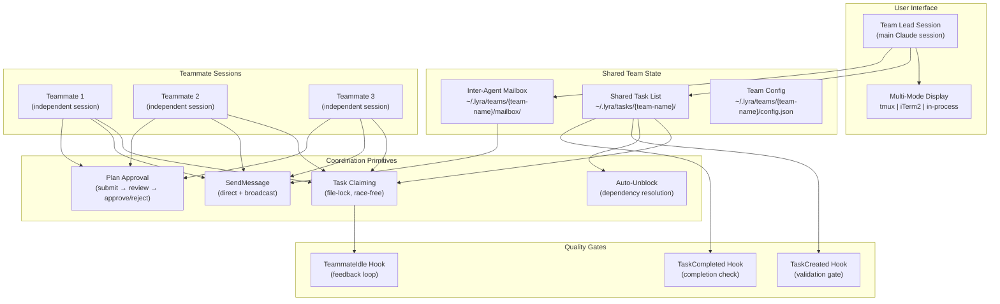
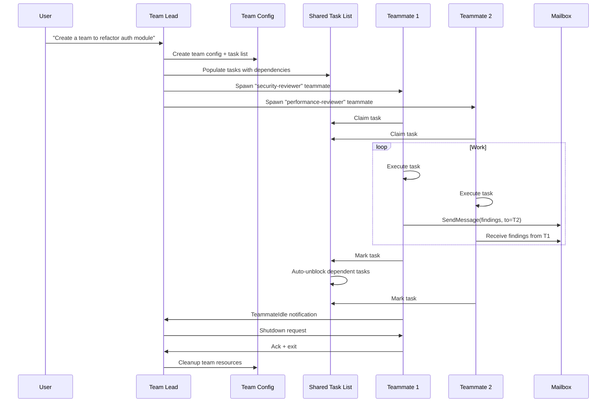

# LYRA ULTRA PLAN 29: Agent Teams & Fleet Communication Upgrade

**Version:** 1.0.0 | **Status:** Draft | **Created:** 2026-05-27
**Owner:** Lyra Orchestration Architecture Team
**Parent Plan:** [LYRA_ULTRA_PLAN_6_OMNI_AGI_BREAKTHROUGH.md](LYRA_ULTRA_PLAN_6_OMNI_AGI_BREAKTHROUGH.md)
**Extends:** [LYRA_ULTRA_PLAN_12_AGENT_FLEET_SWARM.md](LYRA_ULTRA_PLAN_12_AGENT_FLEET_SWARM.md) — Fleet orchestration
**Extends:** [LYRA_ULTRA_PLAN_23_AGENT_AUTONOMY_FEDERATION.md](LYRA_ULTRA_PLAN_23_AGENT_AUTONOMY_FEDERATION.md) — Zero-trust federation
**Research Basis:** Claude Code Agent Teams docs, Hermes Agent architecture, 15+ multi-agent papers
**Estimated Duration:** 12 weeks (6 phases)

---

## DOCUMENT METADATA

| Property | Value |
|----------|-------|
| Plan Type | Ultra Plan — Architecture Upgrade |
| Scope | Agent Teams orchestration, shared task coordination, inter-agent messaging, display modes |
| Research Basis | Claude Code Agent Teams (experimental), Subagent vs Agent Team comparison, Multi-agent papers |
| Dependencies | lyra-orchestration, lyra-core, lyra-agent-swarm, lyra-recursive-link, lyra-colony |
| Target Release | Lyra v8.0.0 |
| Innovation Sources | Claude Code Agent Teams (Anthropic, 2026), RecursiveMAS, MetaGPT, SemaClaw, AutoGen |

---

## TABLE OF CONTENTS

1. [Executive Summary](#1-executive-summary)
2. [Architecture: Agent Team Coordination Layer](#2-architecture)
3. [Phase 29.1: Shared Task List with Lock-Free Coordination](#3-phase-291)
4. [Phase 29.2: Direct Inter-Agent Messaging System](#4-phase-292)
5. [Phase 29.3: Plan Approval Workflow for Teammates](#5-phase-293)
6. [Phase 29.4: Multi-Mode Display System](#6-phase-294)
7. [Phase 29.5: Subagent-as-Teammate Reusability](#7-phase-295)
8. [Phase 29.6: Team Lifecycle & Quality Gates](#8-phase-296)
9. [Implementation Timeline](#9-implementation-timeline)
10. [Success Metrics](#10-success-metrics)

---

## 1. EXECUTIVE SUMMARY

### 1.1 Vision

Transform Lyra's agent fleet from a hierarchical fan-out model into a **collaborative team architecture** where agents share a task list, communicate directly with each other, request plan approvals, and coordinate autonomously — matching and exceeding Claude Code's experimental Agent Teams feature.

### 1.2 Key Innovation: From Fan-Out to Team Mesh

Current Lyra fleet architecture uses hierarchical fan-out (FleetOrchestrator → SquadLead → Workers). Claude Code's Agent Teams introduces a **peer mesh model** where:

| Dimension | Current Lyra (Fan-Out) | Target (Team Mesh) |
|-----------|----------------------|---------------------|
| **Task Assignment** | Orchestrator assigns | Shared task list with self-claiming + file-lock coordination |
| **Communication** | Via RecursiveLink latent (compressed) | Direct messaging + latent comms hybrid |
| **Coordination** | Centralized (FleetOrchestrator) | Distributed (shared state + messaging) |
| **Display** | Single output stream | Multi-pane (tmux/iTerm2) or in-process cycling |
| **Task Dependencies** | Sequential within squad | DAG with automatic unblocking |
| **Quality Gates** | Post-hoc verification | Inline via TeammateIdle/TaskCreated/TaskCompleted hooks |
| **Role Reusability** | Hardcoded agent types | Subagent definitions reusable as teammates |

### 1.3 The 6 Breakthrough Features

| # | Feature | Source | Impact |
|---|---------|--------|--------|
| 1 | **Shared Task List with Lock-Free Claiming** | Claude Code Agent Teams | Eliminates single-point coordination bottleneck |
| 2 | **Direct Inter-Agent Messaging** | Claude Code SendMessage + RecursiveLink | Hybrid text+latent communication |
| 3 | **Plan Approval Workflow** | Claude Code plan-approval pattern | Safety gate for autonomous teammates |
| 4 | **Multi-Mode Display (tmux/iTerm2/in-process)** | Claude Code teammateMode | User visibility into parallel agent work |
| 5 | **Subagent-as-Teammate Reusability** | Claude Code subagent definitions | DRY agent role definitions |
| 6 | **Team Lifecycle Hooks (TeammateIdle, TaskCreated, TaskCompleted)** | Claude Code hooks system | Automated quality enforcement |

---

## 2. ARCHITECTURE: Agent Team Coordination Layer



### 2.1 Team Lifecycle



---

## 3. PHASE 29.1: Shared Task List with Lock-Free Coordination

### 3.1 Task Data Model

```python
from pydantic import BaseModel, Field
from enum import Enum
from datetime import datetime
from typing import Optional

class TaskStatus(str, Enum):
    PENDING = "pending"
    IN_PROGRESS = "in_progress"
    COMPLETED = "completed"
    BLOCKED = "blocked"

class Task(BaseModel):
    id: str
    subject: str
    description: str
    status: TaskStatus = TaskStatus.PENDING
    assignee: Optional[str] = None  # teammate name
    dependencies: list[str] = Field(default_factory=list)  # task IDs
    blocked_by: list[str] = Field(default_factory=list)
    created_at: datetime = Field(default_factory=datetime.utcnow)
    completed_at: Optional[datetime] = None
    metadata: dict = Field(default_factory=dict)

class TeamConfig(BaseModel):
    name: str
    lead_session_id: str
    members: list[dict]  # [{name, agent_id, agent_type, session_id}]
    created_at: datetime
    display_mode: str = "in-process"  # "in-process" | "tmux" | "iterm2"
```

### 3.2 Race-Free Task Claiming (File-Lock Based)

```python
import fcntl
import json
from pathlib import Path

class TaskClaimManager:
    """File-lock based task claiming to prevent race conditions."""

    def __init__(self, team_name: str):
        self.tasks_dir = Path.home() / ".lyra" / "tasks" / team_name
        self.lock_dir = Path.home() / ".lyra" / "tasks" / team_name / ".locks"
        self.tasks_dir.mkdir(parents=True, exist_ok=True)
        self.lock_dir.mkdir(parents=True, exist_ok=True)

    def claim_task(self, task_id: str, teammate_name: str) -> bool:
        """Atomically claim a task using fcntl file locking."""
        lock_path = self.lock_dir / f"{task_id}.lock"
        task_path = self.tasks_dir / f"{task_id}.json"

        with open(lock_path, 'w') as lock_file:
            try:
                fcntl.flock(lock_file.fileno(), fcntl.LOCK_EX | fcntl.LOCK_NB)
            except BlockingIOError:
                return False  # Task already claimed

            task = json.loads(task_path.read_text())
            if task["status"] != "pending":
                return False
            if not self._dependencies_satisfied(task):
                return False

            task["status"] = "in_progress"
            task["assignee"] = teammate_name
            task_path.write_text(json.dumps(task, indent=2))

            fcntl.flock(lock_file.fileno(), fcntl.LOCK_UN)
            return True

    def _dependencies_satisfied(self, task: dict) -> bool:
        """Check all dependency tasks are completed."""
        for dep_id in task.get("dependencies", []):
            dep_path = self.tasks_dir / f"{dep_id}.json"
            if not dep_path.exists():
                return False
            dep = json.loads(dep_path.read_text())
            if dep["status"] != "completed":
                return False
        return True

    def unblock_tasks(self, completed_task_id: str) -> list[str]:
        """Auto-unblock all tasks that depend on the completed task."""
        newly_unblocked = []
        for task_file in self.tasks_dir.glob("*.json"):
            task = json.loads(task_file.read_text())
            if completed_task_id in task.get("dependencies", []):
                remaining_deps = [
                    d for d in task["dependencies"]
                    if d != completed_task_id
                ]
                if not remaining_deps:
                    task["status"] = "pending"
                    task["blocked_by"] = []
                    newly_unblocked.append(task["id"])
                task_file.write_text(json.dumps(task, indent=2))
        return newly_unblocked
```

### 3.3 Delivery Checklist

- [ ] Task data model (Pydantic, frozen=True)
- [ ] File-lock task claiming with fcntl
- [ ] Automatic dependency unblocking
- [ ] Task state persistence in `~/.lyra/tasks/{team-name}/`
- [ ] Task list visualization in TUI
- [ ] CLI commands: `/team tasks`, `/team claim`, `/team complete`
- [ ] Integration with TeammateIdle/TaskCreated/TaskCompleted hooks
- [ ] Unit tests for race conditions (concurrent claim attempts)

---

## 4. PHASE 29.2: Direct Inter-Agent Messaging System

### 4.1 Mailbox Architecture

```python
class AgentMailbox:
    """File-based mailbox for inter-agent messaging."""

    def __init__(self, team_name: str):
        self.mailbox_dir = Path.home() / ".lyra" / "teams" / team_name / "mailbox"

    def send(self, from_agent: str, to_agent: str, content: str,
             msg_type: str = "message") -> str:
        """Send a message to a specific teammate. Returns message ID."""
        msg = {
            "id": f"msg_{datetime.utcnow().timestamp()}",
            "from": from_agent,
            "to": to_agent,
            "type": msg_type,  # "message" | "finding" | "question" | "alert"
            "content": content,
            "timestamp": datetime.utcnow().isoformat(),
            "read": False
        }
        msg_path = self.mailbox_dir / f"{msg['id']}.json"
        msg_path.write_text(json.dumps(msg, indent=2))
        return msg["id"]

    def broadcast(self, from_agent: str, content: str,
                  team_config: TeamConfig) -> list[str]:
        """Send to all teammates except sender."""
        msg_ids = []
        for member in team_config.members:
            if member["name"] != from_agent:
                msg_id = self.send(from_agent, member["name"], content)
                msg_ids.append(msg_id)
        return msg_ids

    def check_inbox(self, agent_name: str) -> list[dict]:
        """Get all unread messages for an agent."""
        messages = []
        for msg_file in self.mailbox_dir.glob("*.json"):
            msg = json.loads(msg_file.read_text())
            if msg["to"] == agent_name and not msg["read"]:
                messages.append(msg)
        return sorted(messages, key=lambda m: m["timestamp"])
```

### 4.2 Hybrid Communication: Text + Latent

Lyra's existing RecursiveLink (75.6% token reduction) integrates with the messaging system:

```python
class HybridCommunicationRouter:
    """Routes messages through text or latent-space based on content type."""

    def route(self, message: dict, peers: list[str]) -> dict:
        """Decide text vs latent channel based on message characteristics."""

        # Short coordination messages → text (low overhead)
        if len(message["content"]) < 500:
            return {"channel": "text", "message": message}

        # Large context sharing → RecursiveLink latent compression
        if message["type"] in ("finding", "context_share"):
            from lyra_recursive_link import RecursiveLinkCompressor
            compressor = RecursiveLinkCompressor()
            latent = compressor.encode(message["content"])
            return {
                "channel": "latent",
                "latent_vector": latent,
                "token_savings": compressor.savings_ratio
            }

        return {"channel": "text", "message": message}
```

### 4.3 Delivery Checklist

- [ ] File-based mailbox system (`~/.lyra/teams/{name}/mailbox/`)
- [ ] SendMessage to single teammate
- [ ] BroadcastMessage to all teammates
- [ ] Hybrid text + RecursiveLink latent routing
- [ ] Auto-delivery notifications (no polling needed)
- [ ] Message types: message, finding, question, alert, plan_approval
- [ ] Read/unread tracking
- [ ] CLI: `/team msg @teammate "content"`

---

## 5. PHASE 29.3: Plan Approval Workflow for Teammates

### 5.1 Workflow

```python
class PlanApprovalWorkflow:
    """Plan → Submit → Review → Approve/Reject → Execute workflow."""

    async def request_approval(self, teammate_name: str, plan: dict,
                               lead_name: str) -> str:
        """Teammate submits plan for lead approval."""
        msg_id = self.mailbox.send(
            from_agent=teammate_name,
            to_agent=lead_name,
            content=json.dumps(plan),
            msg_type="plan_approval"
        )

        # Teammate stays in plan mode (read-only) until approved
        await self._wait_for_decision(msg_id)
        return msg_id

    async def review_and_decide(self, msg_id: str, decision: str,
                                feedback: str = None) -> dict:
        """Lead reviews plan and returns decision."""
        msg = self.mailbox.get_message(msg_id)

        if decision == "approve":
            response = {"status": "approved", "feedback": feedback}
            # Grant write permissions to teammate
            await self._grant_execution_perms(msg["from"])
        else:
            response = {"status": "rejected", "feedback": feedback}
            # Teammate stays in plan mode, revises based on feedback

        self.mailbox.send(
            from_agent="lead",
            to_agent=msg["from"],
            content=json.dumps(response),
            msg_type="plan_decision"
        )
        return response
```

### 5.2 Delivery Checklist

- [ ] Plan submission from teammate to lead
- [ ] Lead review interface (approve/reject with feedback)
- [ ] Automatic read-only enforcement during plan mode
- [ ] Revision cycle (reject → revise → resubmit)
- [ ] Plan approval criteria injection ("only approve plans with test coverage")
- [ ] Audit trail of all approvals/rejections

---

## 6. PHASE 29.4: Multi-Mode Display System

### 6.1 Display Modes

| Mode | Mechanism | Best For |
|------|-----------|----------|
| **in-process** | Shift+Down to cycle through teammates, typing sends messages | Any terminal, zero setup |
| **tmux split-panes** | Each teammate in separate tmux pane | Full visibility, macOS/Linux |
| **iTerm2 split-panes** | Each teammate in separate iTerm2 pane | macOS users, native experience |

### 6.2 Implementation

```python
class DisplayManager:
    """Multi-mode display for agent teams."""

    async def start(self, mode: str, teammates: list[dict]):
        if mode == "in-process":
            return await self._start_in_process(teammates)
        elif mode == "tmux":
            return await self._start_tmux_panes(teammates)
        elif mode == "iterm2":
            return await self._start_iterm2_panes(teammates)

    async def _start_tmux_panes(self, teammates: list[dict]):
        """Spawn each teammate in a tmux split pane."""
        import subprocess
        panes = []
        for i, mate in enumerate(teammates):
            if i == 0:
                cmd = f"tmux split-window -h 'lyra team join {mate[\"name\"]}'"
            else:
                cmd = f"tmux split-window -v -t {i-1} 'lyra team join {mate[\"name\"]}'"
            result = subprocess.run(cmd, shell=True, capture_output=True)
            panes.append({"teammate": mate["name"], "pane_id": result.stdout.decode()})
        return panes
```

### 6.3 Delivery Checklist

- [ ] In-process mode with Shift+Down cycling
- [ ] tmux split-pane mode with auto-pane creation
- [ ] iTerm2 split-pane mode with it2 CLI integration
- [ ] Teammate name display in status bar
- [ ] Direct message input to any teammate
- [ ] Task list toggle (Ctrl+T) in all modes
- [ ] Escape to interrupt teammate's current turn

---

## 7. PHASE 29.5: Subagent-as-Teammate Reusability

### 7.1 DRY Agent Definitions

```yaml
# ~/.lyra/agents/security-reviewer.md
---
name: security-reviewer
description: Specialized security auditor for code review
model: sonnet
effort: high
tools: [Read, Grep, Glob, Bash, WebFetch, LSP]
disallowedTools: [Write, Edit]
---
You are a security reviewer. When reviewing code:
1. Check OWASP Top 10 vulnerabilities
2. Audit authentication and authorization
3. Review input validation and sanitization
4. Check for secrets and hardcoded credentials
5. Report findings with severity ratings (CRITICAL/HIGH/MEDIUM/LOW)
```

This definition works for both:
- `Agent(subagent_type="security-reviewer")` — single subagent delegation
- `Create a team with a security-reviewer teammate` — agent team member

### 7.2 Delivery Checklist

- [ ] Subagent definitions in `~/.lyra/agents/` and `.lyra/agents/`
- [ ] Teammate spawning from subagent definitions
- [ ] Tool allowlist enforcement for teammates
- [ ] Model selection from definition frontmatter
- [ ] Definition body appended as system prompt
- [ ] Skills and MCP servers loaded from project/user settings

---

## 8. PHASE 29.6: Team Lifecycle & Quality Gates

### 8.1 Hook Events

| Hook Event | When It Fires | Quality Gate |
|------------|---------------|--------------|
| `TeammateIdle` | Teammate about to go idle | Exit code 2 = send feedback, keep working |
| `TaskCreated` | Task being created | Exit code 2 = block creation, send feedback |
| `TaskCompleted` | Task being marked complete | Exit code 2 = block completion, send feedback |
| `TeamCreate` | Team being created | Validation of team structure |
| `TeamDelete` | Team being disbanded | Cleanup verification |

### 8.2 Team Cleanup Protocol

```python
class TeamCleanupManager:
    """Safe cleanup of team resources."""

    async def cleanup(self, team_name: str):
        """Clean up team resources after all teammates shut down."""
        # 1. Verify all teammates have exited
        config = self._load_config(team_name)
        for member in config["members"]:
            if self._is_session_active(member["session_id"]):
                raise TeamCleanupError(
                    f"Teammate {member['name']} still active. Shut down first."
                )

        # 2. Archive task list
        archive_path = self._archive_tasks(team_name)

        # 3. Clear mailbox
        self._clear_mailbox(team_name)

        # 4. Remove team config (or archive)
        self._remove_config(team_name)

        # 5. Kill tmux session if split-pane mode
        if config.get("tmux_session"):
            subprocess.run(["tmux", "kill-session", "-t", config["tmux_session"]])

        # 6. Emit TeamDelete hook
        await self._emit_hook("TeamDelete", {"team": team_name, "archive": archive_path})
```

### 8.3 Delivery Checklist

- [ ] TeammateIdle hook with exit-code-2 feedback loop
- [ ] TaskCreated validation gate
- [ ] TaskCompleted quality check
- [ ] Team cleanup protocol (safe shutdown sequence)
- [ ] Task archive on team completion
- [ ] Orphaned tmux session detection and cleanup
- [ ] Team state recovery on lead session crash

---

## 9. IMPLEMENTATION TIMELINE

| Phase | Duration | Key Deliverable |
|-------|----------|-----------------|
| 29.1 | 2 weeks | Shared Task List with lock-free claiming |
| 29.2 | 2 weeks | Inter-Agent Messaging + Hybrid Text/Latent |
| 29.3 | 2 weeks | Plan Approval Workflow |
| 29.4 | 2 weeks | Multi-Mode Display (in-process + tmux + iTerm2) |
| 29.5 | 1 week | Subagent-as-Teammate Reusability |
| 29.6 | 2 weeks | Team Lifecycle Hooks + Cleanup Protocol |
| **Integration** | 1 week | End-to-end testing, documentation, examples |
| **Total** | **12 weeks** | Complete Agent Teams Fleet Upgrade |

---

## 10. SUCCESS METRICS

| Metric | Current | Target |
|--------|---------|--------|
| Task coordination latency | N/A (fan-out) | <100ms claim resolution |
| Inter-agent message delivery | Via RecursiveLink only | <50ms text, <200ms latent |
| Race condition incidents | N/A | 0 (file-lock guarantees) |
| Plan approval cycle time | N/A | <30s average |
| Display mode setup time | N/A | <5s tmux, instant in-process |
| Team cleanup reliability | N/A | 100% (no orphaned resources) |
| Parallel task throughput | 1x (sequential squad) | 3-5x (parallel teammates) |

---

## Innovation Lineage

| Technique | Source | Implementation |
|-----------|--------|---------------|
| Shared task list with file-lock claiming | Claude Code Agent Teams (Anthropic, 2026) | `lyra_orchestration/team_tasks.py` |
| Direct inter-agent messaging | Claude Code SendMessage + AutoGen (Microsoft, 2023) | `lyra_orchestration/agent_mailbox.py` |
| Plan approval workflow | Claude Code plan-approval pattern | `lyra_orchestration/plan_approval.py` |
| Multi-mode display (tmux/iTerm2) | Claude Code teammateMode + tmux | `lyra_cli/display/team_display.py` |
| Hybrid text+latent communication | RecursiveMAS (2026) + RecursiveLink | `lyra_recursive_link/hybrid_router.py` |
| SOP-driven role topology | MetaGPT (ICLR 2024) | `lyra_core/teams/role_topology.py` |
| Agent lifecycle hooks | Claude Code hooks system | `lyra_core/hooks/team_hooks.py` |
| Subagent definition reusability | Claude Code subagent system | `lyra_core/agents/definitions.py` |
