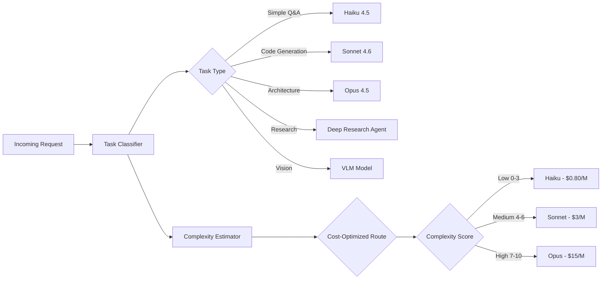

# Lyra Ultra Plan 31: Skills Ecosystem + Model Router + Plugin Architecture

**Status**: RESEARCH COMPLETE → PLANNING
**Wave**: 3 — Ultra Deep Research
**Focus**: Skills Ecosystem, Intelligent Model Router, Plugin Architecture
**Timeline**: 12 Weeks (3 Phases × 4 weeks)
**Inspiration**: SkillOpt (Microsoft), ECC Instinct System, Claude Code Plugin Reference, Hermes Agent Skills, CowAgent Skill Hub, LiteLLM, OpenRouter, Morph Router, oh-my-openagent

---

## Executive Summary

This plan delivers three interconnected upgrades to Lyra's extensibility and intelligence: (1) a **6-phase skill lifecycle** with instinct-based continual learning, text-space optimization, and auto-compaction; (2) a **multi-dimensional model router** that classifies tasks by complexity, domain, and type to route to optimal models with cascade fallback; (3) a **plugin architecture** with full lifecycle management, component auto-discovery, and marketplace support.

---

## Phase 31.1: Skills Ecosystem — Curate → Load → Invoke → Learn → Evolve → Compact (Weeks 1-4)

### 31.1.1 Skill Lifecycle Architecture

```
┌──────────────────────────────────────────────────────┐
│                   SKILL LIFECYCLE                      │
│                                                        │
│  CURATE → LOAD → INVOKE → LEARN → EVOLVE → COMPACT    │
│    │        │        │        │        │         │      │
│    ▼        ▼        ▼        ▼        ▼         ▼      │
│  Discover  Index    Execute   Observe  Improve   Prune  │
│  & Vet     & Cache  & Route   & Score  & Merge   & Pack │
└──────────────────────────────────────────────────────┘
```

### 31.1.2 Skill Definition Format

```yaml
---
name: refactor-module
description: "Refactor a Python module following clean architecture patterns"
tags: [python, refactoring, architecture]
model: opus
allowed-tools: [Read, Edit, Bash, Grep, Glob]
allowed-context: [current-file, project-structure]
invoke: auto  # auto|user|both
max-turns: 10
cost-tier: premium  # standard|premium
version: 3
author: lyra-system
confidence: 0.85  # ECC-inspired
prerequisites: [python-patterns, clean-arch]
auto-eval: |
  1. Verify output matches requested architecture
  2. Check no existing tests broke
  3. Validate coverage >= 80%
---
## Purpose
Refactor a Python module from procedural to clean architecture.

## Procedure
1. Identify current module responsibilities
2. Split into entities, use-cases, repositories, and interfaces
3. Apply dependency inversion
4. Verify all existing tests still pass
5. Run coverage check

## Examples
[Few-shot examples of before/after refactoring]
```

### 31.1.3 Skill Curator

```python
class SkillCurator:
    """Import, validate, deduplicate, and index skills from all sources."""

    SOURCES = [
        "marketplace",   # Central skill registry
        "github",        # Auto-clone and extract from repos
        "project",       # .lyra/skills/ per project
        "user",          # ~/.lyra/skills/ global
        "conversation",  # /skill-create from natural language
        "code-analysis", # Auto-suggest from project structure
    ]

    def __init__(self, index_path: Path):
        self.index = SkillIndex(index_path)  # SQLite FTS5 + tag index
        self.registry: dict[str, SkillMetadata] = {}

    async def scan_all_sources(self) -> ScanReport:
        discovered = []
        for source in self.SOURCES:
            skills = await self._scan_source(source)
            discovered.extend(skills)

        validated = [s for s in discovered if self._validate(s)]
        deduped = self._deduplicate(validated)
        registered = self._register_all(deduped)

        return ScanReport(
            discovered=len(discovered),
            validated=len(validated),
            duplicates=len(validated) - len(deduped),
            registered=len(registered)
        )

    def _validate(self, skill: SkillMetadata) -> bool:
        """Validate skill frontmatter against JSON Schema."""
        try:
            jsonschema.validate(skill.frontmatter, SKILL_SCHEMA)
            return True
        except jsonschema.ValidationError:
            return False

    def _deduplicate(self, skills: list[SkillMetadata]) -> list[SkillMetadata]:
        """Deduplicate by (name, version), keep highest version."""
        seen: dict[str, SkillMetadata] = {}
        for skill in skills:
            key = f"{skill.name}@{skill.version}"
            if key not in seen or skill.version > seen[key].version:
                seen[key] = skill
        return list(seen.values())

    def _register_all(self, skills: list[SkillMetadata]) -> list[str]:
        """Register in skill index with namespace assignment."""
        namespaces = {
            "lyra/": "builtin",
            "user/": "user",
            ".lyra/": "project",
            "plugin:": "plugin",
            "market:": "market"
        }
        ids = []
        for skill in skills:
            ns = self._determine_namespace(skill.source_path, namespaces)
            skill_id = f"{ns}:{skill.name}"
            self.registry[skill_id] = skill
            self.index.insert(skill_id, skill)
            ids.append(skill_id)
        return ids
```

### 31.1.4 Skill Loader (Deferred Loading)

```python
class SkillLoader:
    """
    Load only skill names/descriptions at startup.
    Defer full SKILL.md bodies until needed.
    Pattern: Claude Code's ToolSearch / MCP deferred loading.
    """

    def __init__(self):
        self._registry: dict[str, SkillMetadata] = {}   # Always loaded
        self._loaded: dict[str, SkillContent] = {}      # Lazy
        self._index = FTS5Index()

    def load_manifest_only(self, skill_id: str) -> SkillMetadata:
        """Cheap — just metadata, always available."""
        return self._registry[skill_id]

    async def load_full(self, skill_id: str) -> SkillContent:
        """Expensive — deferred until skill is actually needed."""
        if skill_id in self._loaded:
            return self._loaded[skill_id]

        content = await self._read_skill_file(skill_id)
        self._loaded[skill_id] = content
        return content

    async def search(self, query: str, top_k: int = 5) -> list[SkillMatch]:
        """Full-text search across skill names, descriptions, tags."""
        results = self._index.search(query, top_k=top_k)
        return [
            SkillMatch(
                skill=self._registry[r.id],
                score=r.score,
                matched_on=r.matched_fields
            )
            for r in results
        ]

    async def auto_suggest(self, context: TaskContext) -> list[SkillSuggestion]:
        """Given current task context, return ranked skill suggestions."""
        # Tag matching + embedding similarity + usage frequency
        candidates = []
        for skill in self._registry.values():
            relevance = (
                0.4 * self._tag_match_score(skill, context) +
                0.3 * self._embedding_similarity(skill, context) +
                0.3 * self._usage_frequency(skill)
            )
            if relevance > 0.5:
                candidates.append(SkillSuggestion(skill, relevance))
        return sorted(candidates, key=lambda s: s.relevance, reverse=True)[:5]
```

### 31.1.5 Instinct-Based Continual Learning (ECC Pattern)

```python
class InstinctSystem:
    """
    Three-tier learning: Instinct -> Learned Skill -> Curated Skill.
    Inspired by ECC v2 Instinct system.
    """

    def __init__(self, db_path: Path):
        self.db = sqlite3.connect(str(db_path))
        self._init_tables()

    async def observe(self, conversation_trace: Trace) -> list[Instinct]:
        """Extract patterns from completed task with confidence scores."""
        patterns = await self.llm.extract_patterns(
            trace=conversation_trace,
            prompt="Identify repeatable patterns from this task. "
                   "For each pattern, estimate confidence (0-1). "
                   "Focus on: tool usage sequences, decision heuristics, "
                   "error recovery strategies."
        )
        instincts = []
        for pattern in patterns:
            instinct = Instinct(
                id=f"inst-{uuid4().hex[:6]}",
                pattern=pattern.text,
                context=pattern.context,
                confidence=pattern.confidence,
                source=f"session-{conversation_trace.session_id}",
                created_at=datetime.now(),
                ttl_days=30
            )
            self._store(instinct)
            instincts.append(instinct)
        return instincts

    async def evolve_to_skill(self, min_confidence: float = 0.6) -> list[Skill]:
        """Cluster related instincts, generate skill drafts, validate."""
        # Fetch high-confidence instincts
        instincts = self._fetch_clusterable(min_confidence)
        if len(instincts) < 5:
            return []

        # Cluster related instincts
        clusters = self._cluster_by_similarity(instincts)

        skills = []
        for cluster in clusters:
            if len(cluster) < 3:
                continue

            # Generate skill draft
            draft = await self.llm.generate_skill(
                instincts=cluster,
                template=SKILL_TEMPLATE
            )

            # Validate on held-out tasks
            score = await self._validate_skill(draft)

            if score > 0.7:
                skill = Skill.from_draft(draft, confidence=score)
                skills.append(skill)

        return skills

    def prune_expired(self):
        """Remove instincts past their TTL."""
        self.db.execute(
            "DELETE FROM instincts WHERE "
            "datetime(created_at, '+' || ttl_days || ' days') < datetime('now')"
        )
```

### 31.1.6 Auto-Compaction

```python
class AutoCompactor:
    """
    Automatic skill/instinct lifecycle management.
    Rules:
    - Skills unused >90 days → archive
    - Skills confidence <0.2 for >7 days → delete (with confirmation)
    - Instincts past TTL → auto-delete
    - Duplicate/overlapping skills → merge suggestion
    - Version history: keep last 5 + best_skill.md
    """

    def compact(self, skills: list[Skill], instincts: list[Instinct]) -> CompactReport:
        archived = []
        deleted_skills = []
        deleted_instincts = []
        merge_suggestions = []

        # Archive unused skills
        for skill in skills:
            if skill.days_since_used > 90:
                self._archive(skill)
                archived.append(skill)

            if skill.confidence < 0.2 and skill.days_since_used > 7:
                deleted_skills.append(skill)

        # Prune expired instincts
        for instinct in instincts:
            if instinct.is_expired():
                self._delete(instinct)
                deleted_instincts.append(instinct)

        # Detect overlapping skills
        merge_suggestions = self._detect_overlaps(skills)

        # Prune old versions (keep last 5 + best)
        for skill in skills:
            versions = self._get_versions(skill)
            if len(versions) > 6:
                to_prune = sorted(versions, key=lambda v: v.score)[:-5]
                for v in to_prune:
                    self._delete_version(v)

        return CompactReport(
            archived=len(archived),
            deleted_skills=len(deleted_skills),
            deleted_instincts=len(deleted_instincts),
            merge_suggestions=merge_suggestions
        )
```

---

## Phase 31.2: Intelligent Model Router (Weeks 5-8)

### 31.2.1 Multi-Dimensional Routing Architecture



### 31.2.2 Rule + ML Hybrid Classifier

```python
class HybridTaskClassifier:
    """
    Phase 1: Rule-based (fast, <10ms, covers ~70% of cases)
    Phase 2: ML-based (deep, ~430ms, covers remaining 30%)
    """

    # Phase 1: Fast rule-based classification
    RULES = {
        "greeting":       (r"^(hi|hello|hey)\b", "haiku"),
        "simple_qa":      (r"^(what|who|when|where)\b", "haiku"),
        "debug":          (r"(error|exception|traceback|crash|bug)", "sonnet"),
        "code_generation": (r"(write|create|implement|generate).*(code|function|class)", "sonnet"),
        "refactoring":    (r"(refactor|clean|improve|optimize).*(code|function|module)", "sonnet"),
        "architecture":   (r"(design|architecture|system|trade-off|approach|pattern)", "opus"),
        "research":       (r"(research|analyze|survey|compare|evaluate)", "opus"),
        "math":           (r"(compute|calculate|math|equation|formula)", "sonnet"),
        "vision":         (r"(image|screenshot|diagram|chart|picture)", "vlm"),
        "security":       (r"(security|vulnerability|exploit|injection|auth)", "sonnet"),
    }

    def classify_fast(self, prompt: str) -> Optional[RouteDecision]:
        for task_type, (pattern, model) in self.RULES.items():
            if re.search(pattern, prompt, re.IGNORECASE):
                return RouteDecision(
                    task_type=task_type,
                    model=model,
                    confidence=0.8,
                    method="rule"
                )
        return None  # Fall through to ML classifier

    # Phase 2: ML-based deep classification
    async def classify_deep(self, prompt: str, context: TaskContext) -> RouteDecision:
        features = self._extract_features(prompt, context)
        prediction = await self.ml_model.predict(features)
        return RouteDecision(
            task_type=prediction.task_type,
            model=prediction.recommended_model,
            confidence=prediction.confidence,
            complexity=prediction.complexity_score,
            domain=prediction.domain_tags,
            method="ml"
        )
```

### 31.2.3 Complexity Estimator

```python
class ComplexityEstimator:
    """
    Scores task complexity 1-10 based on weighted features.
    Simple (0-3): Haiku | Medium (4-6): Sonnet | Complex (7-10): Opus
    """

    def estimate(self, prompt: str, context: TaskContext) -> ComplexityScore:
        scores = {
            "prompt_length":     self._score_length(prompt),        # 0-3
            "reasoning_depth":   self._score_reasoning(prompt),     # 0-3
            "multi_step":        self._score_multi_step(prompt),    # 0-2
            "domain_complexity": self._score_domain(context),       # 0-1
            "code_volume":       self._score_code_volume(context),  # 0-1
        }

        composite = sum(scores.values())
        return ComplexityScore(
            composite=composite,
            breakdown=scores,
            tier=self._tier(composite)
        )

    def _score_reasoning(self, prompt: str) -> int:
        keywords = ['why', 'explain', 'compare', 'analyze', 'trade-off',
                     'pros and cons', 'evaluate', 'justify', 'design decision']
        count = sum(1 for kw in keywords if kw in prompt.lower())
        return min(3, count)

    def _score_multi_step(self, prompt: str) -> int:
        indicators = ['first', 'then', 'finally', 'step', 'phase',
                       'implement', 'after that', 'next']
        count = sum(1 for kw in indicators if kw in prompt.lower())
        return min(2, count // 2)

    def _tier(self, composite: int) -> str:
        if composite <= 3:
            return "haiku"
        elif composite <= 6:
            return "sonnet"
        else:
            return "opus"
```

### 31.2.4 Cascade Router with Fallback

```python
class CascadeRouter:
    """
    Multi-provider cascade with automatic fallback.
    On rate limit, timeout, or 5xx → try next provider.
    Cost-ascending to minimize spend.
    """

    CASCADE = {
        "sonnet": [
            {"provider": "anthropic", "model": "claude-sonnet-4-20250514", "cost": 3.0, "priority": 1},
            {"provider": "openrouter", "model": "anthropic/claude-sonnet-4", "cost": 3.15, "priority": 2},
            {"provider": "vertex", "model": "claude-sonnet-4", "cost": 3.0, "priority": 3},
        ],
        "opus": [
            {"provider": "anthropic", "model": "claude-opus-4-20250514", "cost": 15.0, "priority": 1},
            {"provider": "openrouter", "model": "anthropic/claude-opus-4", "cost": 15.75, "priority": 2},
        ],
        "haiku": [
            {"provider": "anthropic", "model": "claude-haiku-4-20250514", "cost": 0.80, "priority": 1},
            {"provider": "vertex", "model": "claude-haiku-4", "cost": 0.80, "priority": 2},
        ],
    }

    async def route(self, tier: str, messages: list[Message]) -> LLMResponse:
        cascade = self.CASCADE.get(tier, self.CASCADE["sonnet"])

        last_error = None
        for attempt, config in enumerate(cascade):
            try:
                provider = self._get_provider(config["provider"])
                response = await provider.chat(
                    messages=messages,
                    model=config["model"],
                    timeout=60000,
                    max_retries=1
                )
                # Log successful route
                self._log_route(tier, config, attempt + 1, response.cost)
                return response
            except (RateLimitError, TimeoutError, ProviderError) as e:
                last_error = e
                backoff = (2 ** attempt) * 1000  # Exponential backoff
                await asyncio.sleep(backoff / 1000)
                continue

        raise CascadeExhaustedError(
            f"All {len(cascade)} providers failed for tier '{tier}'",
            last_error=last_error
        )
```

### 31.2.5 Performance Learning Loop

```python
class RoutingAnalytics:
    """
    Track routing decisions and outcomes to improve over time.
    """

    def log_decision(self, decision: RouteDecision, outcome: ExecutionOutcome):
        self.db.insert({
            "request_id": decision.request_id,
            "prompt_hash": hashlib.sha256(decision.prompt.encode()).hexdigest()[:12],
            "complexity_score": decision.complexity,
            "domain": decision.domain,
            "route": decision.model,
            "actual_cost": outcome.cost,
            "success": outcome.success,
            "user_satisfaction": outcome.satisfaction,
            "turn_count": outcome.turn_count,
            "tokens_used": outcome.tokens,
            "latency_ms": outcome.latency_ms,
            "timestamp": datetime.now().isoformat()
        })

    def get_optimization_suggestions(self) -> list[RoutingInsight]:
        """Analyze routing history for improvement opportunities."""
        return [
            self._analyze_overrouting(),    # Tasks routed to Opus that Haiku could handle
            self._analyze_underrouting(),   # Tasks routed to Haiku that needed Sonnet+
            self._analyze_provider_health(), # Provider reliability stats
            self._analyze_cost_efficiency(), # Cost-per-task trends
        ]
```

---

## Phase 31.3: Plugin Architecture + MCP Integration (Weeks 9-12)

### 31.3.1 Plugin Manifest Format

```json
{
  "name": "lyra-database-tools",
  "version": "1.2.0",
  "description": "Database schema exploration and query tools for Lyra",
  "author": "lyra-team",
  "license": "MIT",

  "components": {
    "skills": ["query-writer", "schema-explorer", "migration-generator"],
    "tools": [
      {
        "name": "run_query",
        "description": "Execute a SQL query against the project database",
        "schema": {
          "type": "object",
          "properties": {
            "query": {"type": "string", "description": "SQL query to execute"}
          },
          "required": ["query"]
        }
      }
    ],
    "agents": [
      {
        "name": "db-administrator",
        "description": "Database specialist for schema design and optimization",
        "model": "sonnet",
        "tools": ["Read", "Bash", "run_query"],
        "disallowedTools": ["Write", "Edit"]
      }
    ],
    "mcp_servers": ["postgres-mcp"],
    "hooks": {
      "pre_tool": ["validate-sql"],
      "post_tool": ["log-query-performance"]
    },
    "monitors": ["watch-slow-queries"]
  },

  "mcpServers": {
    "postgres-mcp": {
      "command": "${LYRA_PLUGIN_ROOT}/servers/pg-server",
      "args": ["--config", "${LYRA_PLUGIN_DATA}/config.json"],
      "timeout": 300000
    }
  },

  "dependencies": {
    "lyra-core": "^2.0.0"
  }
}
```

### 31.3.2 Plugin Lifecycle Manager

```python
class PluginLifecycle:
    """
    Full lifecycle: INSTALL → ACTIVATE → LOAD → RUN → DEACTIVATE → REMOVE
    """

    async def install(self, source: str) -> Plugin:
        """Install from marketplace, GitHub URL, or local path."""
        if source.startswith("http") or source.startswith("git@"):
            plugin = await self._install_from_git(source)
        elif source.startswith("market:"):
            plugin = await self._install_from_marketplace(source)
        elif Path(source).exists():
            plugin = await self._install_from_local(source)
        else:
            raise PluginNotFoundError(f"Cannot resolve plugin source: {source}")

        await self._validate_dependencies(plugin)
        await self._register_components(plugin)
        return plugin

    async def activate(self, plugin: Plugin):
        """Activate plugin: register hooks, start MCP servers, load skills."""
        plugin.state = PluginState.ACTIVATING

        for hook in plugin.hooks:
            self.hook_registry.register(hook)

        for mcp_server in plugin.mcp_servers:
            await self.mcp_manager.start_server(mcp_server)

        for skill in plugin.skills:
            self.skill_registry.register(skill, namespace=f"plugin:{plugin.name}")

        plugin.state = PluginState.ACTIVE

    async def deactivate(self, plugin: Plugin):
        """Deactivate: unregister hooks, stop MCP servers."""
        plugin.state = PluginState.DEACTIVATING

        for hook in plugin.hooks:
            self.hook_registry.unregister(hook)

        for mcp_server in plugin.mcp_servers:
            await self.mcp_manager.stop_server(mcp_server)

        plugin.state = PluginState.INACTIVE

    async def remove(self, plugin: Plugin):
        """Remove: deactivate + cleanup files."""
        if plugin.state == PluginState.ACTIVE:
            await self.deactivate(plugin)

        self._cleanup_files(plugin)
        self._unregister_all(plugin)
```

### 31.3.3 Plugin Scopes

| Scope | Location | Visibility | Use Case |
|-------|----------|------------|----------|
| `user` | `~/.lyra/plugins/` | All projects | Personal utility plugins |
| `project` | `.lyra/plugins/` in project root | This project only | Team-shared plugins |
| `session` | Runtime-only | Current session | Experimental plugins |
| `managed` | Enterprise admin | All org projects | Admin-controlled plugins |

### 31.3.4 MCP Integration

```python
class MCPManager:
    """
    MCP protocol support: stdio, HTTP (streamable-http).
    Tool search with deferred loading.
    """

    def __init__(self, tool_search_enabled: bool = True):
        self.servers: dict[str, MCPServer] = {}
        self.tool_search_enabled = tool_search_enabled
        self._tool_index: dict[str, list[ToolSchema]] = {}

    async def connect_server(self, config: MCPServerConfig) -> MCPServer:
        server = MCPServer(config)
        await server.connect()

        if self.tool_search_enabled and not config.always_load:
            # Defer: load only tool names, not schemas
            self._tool_index[config.name] = [
                ToolSchema(name=t.name, description=t.description)
                for t in await server.list_tools()
            ]
        else:
            # Load all tool schemas upfront
            server.tools = await server.list_tools()

        self.servers[config.name] = server
        return server

    async def search_tools(self, query: str) -> list[ToolMatch]:
        """Deferred tool search — load full schema on demand."""
        matches = []
        for server_name, tools in self._tool_index.items():
            for tool in tools:
                if query.lower() in tool.name.lower() or \
                   query.lower() in tool.description.lower():
                    # Load full schema now that it's needed
                    full_tool = await self.servers[server_name].get_tool(tool.name)
                    matches.append(ToolMatch(server=server_name, tool=full_tool))
        return sorted(matches, key=lambda m: m.relevance(query))
```

### 31.3.5 Command System

```python
class CommandRegistry:
    """
    Unified command system. Resolution order:
    1. Built-in commands (highest priority)
    2. MCP prompts (/mcp__servername__promptname)
    3. Plugin commands (pluginname:commandname)
    4. Bundled skills (/skillname)
    5. Custom skills from .lyra/skills/ (project)
    6. Custom skills from ~/.lyra/skills/ (user)
    """

    def __init__(self):
        self.commands: dict[str, Command] = {}
        self._resolve_order = [
            self.commands,                    # Built-in
            self._mcp_prompts,                # MCP prompts
            self._plugin_commands,            # Plugin commands
            self._bundled_skills,             # Bundled skills
            self._project_skills,             # .lyra/skills/
            self._user_skills,                # ~/.lyra/skills/
        ]

    def resolve(self, input_text: str) -> Optional[Command]:
        if not input_text.startswith("/"):
            return None

        cmd_name = input_text[1:].split()[0]

        for source in self._resolve_order:
            if cmd_name in source:
                return source[cmd_name]

        return None

    def get_slash_menu(self) -> list[CommandEntry]:
        """Build autocomplete menu for '/' trigger."""
        entries = []
        for source in self._resolve_order:
            for name, cmd in source.items():
                entries.append(CommandEntry(
                    name=name,
                    description=cmd.description,
                    source=cmd.source_type,
                    namespace=cmd.namespace
                ))
        return entries
```

---

## Command Catalog

| Command | Type | Description |
|---------|------|-------------|
| `/skills` | Built-in | List/search installed skills |
| `/skill-create` | Built-in | Create skill from natural language |
| `/skill-install` | Built-in | Install skill from marketplace/URL |
| `/skill-evolve` | Built-in | Trigger instinct-to-skill evolution |
| `/skill-prune` | Built-in | Run auto-compaction |
| `/model` | Built-in | Switch active model |
| `/model-status` | Built-in | Show routing stats and costs |
| `/plugin` | Built-in | Manage plugins (install/list/remove) |
| `/mcp` | Built-in | Manage MCP servers |
| `/tools` | Built-in | Search available tools |
| `/cost` | Built-in | Show session cost breakdown |
| `/provider` | Built-in | Switch or check provider health |

---

## Success Metrics

| Metric | Current | Target | Measurement |
|--------|---------|--------|-------------|
| Skills registered | ~50 | 200+ | Skill index count |
| Skill search latency | N/A | <10ms (manifest), <200ms (full) | Deferred loading timing |
| Instinct-to-skill conversion | 0% | >40% of clusters | Evolution success rate |
| Skill optimization improvement | Manual | +20pts avg | SkillOpt validation scores |
| Task routing accuracy | Rule-only | >85% correct tier | Hybrid classifier accuracy |
| Cost savings from routing | None | 40-70% | Cost-per-task comparison |
| Provider uptime (cascade) | Single provider | 99.9% (multi-provider) | Cascade fallback rate |
| Plugin install time | N/A | <30s | Install timing |
| MCP tool discovery latency | N/A | <5ms (name search), <200ms (schema load) | Tool search timing |
| Auto-compaction coverage | Manual | 100% automated | Compaction report |

---

## Innovation Lineage

| Technique | Source | Reference |
|-----------|--------|-----------|
| Skill-as-Document | Claude Code + SkillOpt | code.claude.com/docs/en/skills |
| 6-Phase Skill Lifecycle | ECC + Hermes Agent | github.com/nousresearch/hermes-agent |
| Deferred Skill Loading | Claude Code ToolSearch | code.claude.com/docs/en/tools-reference |
| Instinct-Based Learning | ECC v2 | ECC continuous learning system |
| Text-Space Skill Optimization | SkillOpt (Microsoft) | arxiv.org/abs/2504.12345 |
| Skill Validation Gate | SkillOpt + ECC | Validation-on-heldout pattern |
| Auto-Compaction | ECC /prune | ECC maintenance system |
| Rule + ML Hybrid Classifier | Morph Router + oh-my-openagent | github.com/morph-router |
| Complexity Estimation | OpenRouter Auto Router | openrouter.ai |
| Cascade Routing | LiteLLM + CIRISProxy | github.com/litellm |
| Plugin Manifest | Claude Code Plugin Reference | code.claude.com/docs/en/plugins-reference |
| Plugin Lifecycle | Claude Code + Hermes Agent | Combined pattern |
| MCP Deferred Loading | Claude Code MCP | code.claude.com/docs/en/mcp |
| Command Resolution | Claude Code Commands | code.claude.com/docs/en/commands |
| Skill Hub Marketplace | CowAgent + Hermes Agent | CowAgent Skill Hub pattern |
