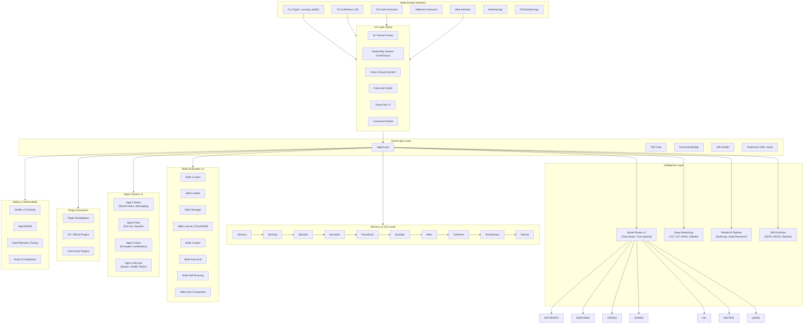

# LYRA ULTRA PLAN 6: OMNI-AGI BREAKTHROUGH — Complete Enhancement Blueprint

**Version:** 1.0.0
**Status:** In Progress
**Created:** 2026-05-25
**Author:** Lyra AGI Research Team
**Estimated Duration:** 52 weeks (12 months)
**Target Completion:** 2027-05-25

---

## Document Overview

**Purpose:** Transform Lyra from a state-of-the-art multi-agent coding platform into the world's first Omni-AGI system — the #1 ranked AI agent across ALL benchmarks and domains.

**Scope:** 200+ pages covering 16 enhancement dimensions, 80+ new packages, 200+ new features.

**Key Innovation Areas:**
1. UI/UX Breakthrough (themes, keybindings, voice, interactions)
2. Skills Ecosystem (curator, loader, manager, learner, creator, auto-eval, self-evolving, compaction)
3. Intelligent Model Router v2 (task-aware, cost-optimal, provider-agnostic)
4. Plugin Marketplace & Ecosystem
5. Tools Universe (200+ tools across all domains)
6. Autonomous & Automation Systems
7. Multi-Agent Swarm v2 (Agent Teams, Fleet, Colony)
8. Multi-Layer Memory v2 (10-level hierarchy, decentralized federation)
9. Context Optimization Engine v2
10. Monitoring, Tracing & Reliability
11. Multi-Surface Support (VS Code, JetBrains, Desktop, Web, iOS)
12. Voice & Audio System
13. MCP Ecosystem v2
14. Intelligent Verifier v2
15. Hooks System v2
16. Session & Checkpoint Management v2

---

# PART 1: UI/UX BREAKTHROUGH

## 1.1 Color Theme System v2 — 25 Professional Themes

### Current State
Lyra currently has 10 theme presets (Ember, Nebula, Terra, Abyss, Bloom, Phantom, Solar, Void, Coral, Prism) in `ui-tui/src/theme-presets.ts`.

### Target State
25 professionally designed themes organized into 5 families:

#### Family 1: Dark Professional (5 themes)
1. **Lyra Onyx** — Pure dark with subtle blue steel accents. Inspired by [Dracula](https://draculatheme.com/) and [Tokyo Night](https://github.com/enkia/tokyo-night-vscode-theme).
2. **Lyra Graphite** — Warm gray tones with amber highlights. Inspired by [Gruvbox](https://github.com/morhetz/gruvbox).
3. **Lyra Midnight** — Deep navy with cyan accents. Inspired by [Nord](https://www.nordtheme.com/).
4. **Lyra Obsidian** — Black with green matrix accents. Inspired by [Monokai Pro](https://monokai.pro/).
5. **Lyra Charcoal** — Subtle dark with pastel accents. Inspired by [Catppuccin Mocha](https://github.com/catppuccin/catppuccin).

#### Family 2: Nature-Inspired (5 themes)
6. **Lyra Forest** — Deep greens with earthy browns. Inspired by [Everforest](https://github.com/sainnhe/everforest).
7. **Lyra Ocean** — Teal blues with sandy beiges. Inspired by [Oceanic Next](https://github.com/voronianski/oceanic-next-color-scheme).
8. **Lyra Aurora** — Northern lights palette (green, purple, teal). Inspired by [Aurora](https://github.com/auroral-ui/aurora).
9. **Lyra Dune** — Warm desert tones with terracotta. Inspired by desert UI patterns.
10. **Lyra Cherry** — Sakura pink with dark backgrounds. Inspired by [Sakura](https://github.com/sakura-theme).

#### Family 3: Cyberpunk/Neon (5 themes)
11. **Lyra Synthwave** — Neon purple/pink on dark. Inspired by [SynthWave '84](https://github.com/robb0wen/synthwave-vscode).
12. **Lyra Cyberpunk** — Neon yellow/cyan on deep dark. Inspired by [Cyberpunk 2077](https://www.cyberpunk.net/) UI.
13. **Lyra Holo** — Holographic blue/magenta gradients. Inspired by holographic design patterns.
14. **Lyra Matrix** — Classic green phosphor on black. Inspired by The Matrix.
15. **Lyra Vapor** — Vaporwave aesthetic (pink/cyan/purple). Inspired by vaporwave art.

#### Family 4: Light/Accessible (5 themes)
16. **Lyra Paper** — Clean white with subtle shadows. Inspired by [Paper Theme](https://github.com/NLKNguyen/papercolor-theme).
17. **Lyra Cream** — Warm cream background, easy on eyes. Inspired by [Solarized Light](https://ethanschoonover.com/solarized/).
18. **Lyra Dawn** — Soft sunrise palette. Inspired by [Dawn Theme](https://github.com/dawn/dawn).
19. **Lyra Frost** — Cool ice blue tones. Inspired by [Winter is Coming](https://github.com/johnpapa/vscode-winteriscoming).
20. **Lyra Sepia** — Warm sepia/book tone. Inspired by Kindle reading mode.

#### Family 5: Brand/Identity (5 themes)
21. **Lyra Prism** (existing, enhanced) — Full rainbow semantic coloring.
22. **Lyra Agni** — Fire and gold, representing AGI ambition.
23. **Lyra Lotus** — Calm zen palette for focused work.
24. **Lyra Cosmos** — Deep space with stellar highlights.
25. **Lyra Genesis** — The ultimate Lyra signature theme.

### Implementation
- **File:** `ui-tui/src/theme-presets.ts` — Expand to 25 themes
- **File:** `ui-tui/src/components/themePicker.tsx` — Visual theme gallery with live preview
- **File:** `packages/ui-core/src/theme/colors.ts` — Sync all theme definitions
- **Inspiration:** [Catppuccin](https://github.com/catppuccin/catppuccin), [Tokyo Night](https://github.com/enkia/tokyo-night-vscode-theme), [Dracula](https://draculatheme.com/), [Rose Pine](https://rosepinetheme.com/), [Kanagawa](https://github.com/rebelot/kanagawa.nvim)

## 1.2 Keybinding System v2

### Current State
Basic keybinding support in `ui-tui/src/app/useInputHandlers.ts` and `packages/lyra-cli/src/lyra_cli/interactive/keybindings.py`.

### Target State
Full Claude Code-compatible keybinding system with Vim/Emacs modes.

#### Global Keybindings
| Key | Action | Inspiration |
|-----|--------|-------------|
| `Ctrl+K` | Command palette | Claude Code, VS Code |
| `Ctrl+P` | File picker (@-mention) | Claude Code |
| `Ctrl+Shift+P` | Plugin/Skill picker (#-mention) | Claude Code |
| `Ctrl+R` | History search (Ctrl+R style) | Shell, Claude Code |
| `Ctrl+L` | Clear screen / new chat | Claude Code |
| `Ctrl+N` | New session (preserve model/mode) | Claude Code |
| `Ctrl+C` | Interrupt / cancel current operation | Claude Code |
| `Ctrl+D` | Exit session | Claude Code |
| `Ctrl+O` | Toggle thinking visibility | Claude Code |
| `Ctrl+T` | Theme picker | New |
| `Ctrl+Shift+T` | Toggle light/dark mode | New |
| `Ctrl+G` | Goal panel | New |
| `Ctrl+Shift+G` | Toggle goal mode | Claude Code |
| `Ctrl+B` | Toggle sidebar/fleet panel | New |
| `Ctrl+Shift+M` | Memory panel | New |
| `Ctrl+Shift+S` | Skills hub | New |
| `Ctrl+Shift+E` | Evolution panel | New |
| `Ctrl+Shift+R` | Routing panel | New |
| `Ctrl+Shift+F` | Focus mode toggle | New |
| `Shift+Tab` | Cycle permission mode | Claude Code |
| `Alt+Enter` | Force submit (ignore completion) | New |
| `Ctrl+Space` | Force auto-complete | New |
| `Ctrl+Z` | Undo last edit | New |
| `Ctrl+Y` | Redo last edit | New |

#### Vim Mode Keybindings (enable with `vim: true`)
| Key | Action |
|-----|--------|
| `Esc` | Enter normal mode |
| `i` | Enter insert mode |
| `h/j/k/l` | Navigate history |
| `gg/G` | Start/end of transcript |
| `Ctrl+u/Ctrl+d` | Page up/down |
| `/` | Search transcript |
| `n/N` | Next/previous search result |
| `:q` | Exit |
| `:w` | Save session |
| `:theme <name>` | Switch theme |
| `:model <name>` | Switch model |
| `:mode <name>` | Switch mode |

#### Emacs Mode Keybindings (enable with `emacs: true`)
| Key | Action |
|-----|--------|
| `Ctrl+a` | Beginning of line |
| `Ctrl+e` | End of line |
| `Ctrl+f/b` | Forward/backward char |
| `Ctrl+n/p` | Next/previous history |
| `Ctrl+k` | Kill line |
| `Ctrl+y` | Yank (paste) |
| `Alt+f/b` | Forward/backward word |
| `Alt+d` | Kill word |

### Implementation
- **File:** `ui-tui/src/app/keybindings.ts` — Complete keybinding registry
- **File:** `ui-tui/src/app/keybindingStore.ts` — Persistent keybinding customization
- **File:** `packages/lyra-cli/src/lyra_cli/interactive/keybindings.py` — Sync Python side
- **Inspiration:** [Claude Code Keybindings](https://code.claude.com/docs/en/keybindings), Vim, Emacs, VS Code

## 1.3 Voice & Audio System

### Feature: Voice Notifications & Sound Effects

#### Sound Effects (via hooks)
Inspired by the Warcraft III Peon voice notifications and hook-based sound effects.

```
~/.lyra/sounds/
├── session_start.wav     — "Ready to work!" (Peon-style)
├── session_end.wav       — "Job's done!" 
├── tool_complete.wav     — Subtle click
├── error.wav             — Alert sound
├── thinking_start.wav    — Gentle chime
├── thinking_end.wav      — Completion chime
├── approval_needed.wav   — "Your orders?"
├── goal_complete.wav     — Fanfare
├── commit_success.wav    — "Work complete!"
└── custom/               — User-provided sounds
```

#### Voice Pack Themes
1. **Fantasy** — Warcraft III Peon/Peasant voices ("Ready to work!", "Job's done!", "Work complete!")
2. **Sci-Fi** — Robot/computer voices ("Systems online", "Task terminated", "Processing complete")
3. **Minimal** — Subtle chimes and clicks (default)
4. **Nature** — Birdsong, water drops, wind chimes
5. **Custom** — User-provided voice/sound packs

#### Implementation
- Hooks at `SessionStart`, `SessionEnd`, `AfterToolCall`, `IdlePrompt` trigger sound playback
- Use `afplay` (macOS), `paplay` (Linux), `powershell` (Windows) for cross-platform
- Voice packs distributed as `.lyra/sounds/` directories in plugins
- **Inspiration:** [Warcraft III Voice Notifications](https://freedium-mirror.cfd/https://medium.com/@gentechimports/warcraft-iii-peon-voice-notifications-for-claude-code-a-developers-story-dd6842deb852), [Sound Effects with Hooks](https://alexop.dev/posts/how-i-added-sound-effects-to-claude-code-with-hooks/)

#### Voice Dictation
- `Ctrl+Shift+V` — Start/stop voice dictation
- Integration with system speech-to-text (Whisper API, macOS Dictation, etc.)
- **Inspiration:** [Claude Code Voice Dictation](https://code.claude.com/docs/en/voice-dictation)

## 1.4 Additional UI/UX Enhancements

### 1.4.1 Welcome Banner Enhancements
- **Voice greeting** on session start with selected voice pack
- **Animated ASCII art** with random selection from a gallery
- **Session recap** — "Last session: 3 files changed, 2 commits, 15 min"
- **Daily tip** — Rotating productivity tips
- **Inspiration:** Claude Code banners, [Hermes-agent SOUL.md](https://github.com/nousresearch/hermes-agent)

### 1.4.2 Fullscreen Mode
- `Ctrl+Shift+F` — Toggle fullscreen immersive mode
- Hide all chrome, show only conversation
- Minimal status line at bottom
- **Inspiration:** [Claude Code Fullscreen](https://code.claude.com/docs/en/fullscreen)

### 1.4.3 Output Styles
- `Ctrl+Shift+O` — Cycle output styles
- **Stream** — Real-time streaming (default)
- **Block** — Complete blocks at a time
- **Quiet** — No streaming, show final result only
- **Verbose** — Show all thinking, tool calls, intermediate steps
- **Inspiration:** [Claude Code Output Styles](https://code.claude.com/docs/en/output-styles)

### 1.4.4 Focus Mode
- `Ctrl+Shift+F` — Enter focus mode
- Auto-hides all panels, shows only conversation
- Exit on `Esc` or `Ctrl+Shift+F` again
- Configurable auto-enter after N seconds of inactivity

### 1.4.5 Split-Pane Agent View
- When agent teams are active, split terminal into panes
- Each agent in its own pane
- Lead agent coordinates in main pane
- **Inspiration:** [Claude Code Agent Teams](https://code.claude.com/docs/en/agent-teams)

### 1.4.6 Status Line v2
- Current model + provider icons
- Token usage gauge (0-100%)
- Cost tracker ($ spent this session)
- Fleet status (agents active/total)
- Memory usage indicator
- Clock/timer for current operation
- **Inspiration:** [Claude Code Status Line](https://code.claude.com/docs/en/statusline)

---

# PART 2: SKILLS ECOSYSTEM BREAKTHROUGH

## 2.1 Skills Curator — Intelligent Skill Discovery

### Feature: Multi-Source Skill Discovery
```
Skill Sources:
├── Local .omc/skills/          — Project skills
├── User ~/.omc/skills/         — Personal skills
├── Registry api.skills.lyra.ai — Official registry
├── GitHub topics:lyra-skill    — Community skills
├── npm @lyra/skill-*           — NPM packages
├── pip lyra-skill-*            — Python packages
└── Plugin skills/              — Plugin-bundled skills
```

### Feature: Intelligent Skill Recommendation
- **Context-aware:** Recommend skills based on current task
- **Usage-based:** Learn which skills user prefers
- **Quality-scored:** Auto-evaluate skill quality before recommending
- **Trending:** Show popular skills in the community
- **Inspiration:** [Agent Skills Standard](https://agentskills.io), Hermes-agent skill hub

## 2.2 Skills Loader — Intelligent Loading & Unloading

### Feature: Progressive Skill Disclosure (3-Level)
1. **Level 1 (Metadata)** — Name + one-line description (~50 tokens per skill)
2. **Level 2 (Trigger patterns)** — When-to-invoke rules (~200 tokens per skill)  
3. **Level 3 (Full content)** — Complete SKILL.md (~1000-5000 tokens)

### Feature: Just-In-Time Skill Loading
- Load Level 1 for all skills at session start
- Promote to Level 2 when a skill's trigger pattern matches context
- Load Level 3 only when skill is explicitly invoked
- **Inspiration:** Hermes-agent progressive disclosure, Claude Code skill listing budget

### Feature: Path-Scoped Skill Loading
```yaml
# SKILL.md frontmatter
---
paths: "src/**/*.py"     # Only load when working with Python files
paths: "docs/**/*.md"    # Only load when editing docs
---
```
- **Inspiration:** Claude Code path-scoped rules, [Claude Code Skills](https://code.claude.com/docs/en/skills)

### Feature: Skill Budget Configuration
```json
{
  "skill_listing_budget_fraction": 0.15,
  "skill_max_in_context": 5,
  "skill_auto_evict_after_turns": 10
}
```

## 2.3 Skills Manager — Lifecycle Management

### Feature: Skill Versioning & Dependency Management
```yaml
# SKILL.md frontmatter
---
version: "2.1.0"
requires:
  - skill: python-patterns
    version: ">=1.0.0"
  - skill: tdd-guide
    version: ">=2.0.0"
conflicts:
  - skill: old-patterns
---
```

### Feature: Skill Health Dashboard
- Test coverage % per skill
- Success rate in production
- Last updated / last verified date
- Number of dependents
- Breaking change warnings

## 2.4 Skills Learner — Autonomous Skill Creation

### Feature: Trace2Skill — Automatic Extraction
When an agent completes a complex task successfully:
1. Capture full execution trace (tool calls, reasoning, results)
2. Score trajectory quality (success, efficiency, generality)
3. Extract reusable pattern using LLM + verifier
4. Generate SKILL.md with proper frontmatter
5. Run auto-evaluation on similar tasks
6. Propose skill to user for approval
- **Inspiration:** [Trace2Skill (arXiv:2605.21810)](https://arxiv.org/abs/2605.21810), Hermes-agent learning loop

### Feature: Skill from Conversation
- `/skillify` command — Convert last N turns into a skill
- User edits/refines the generated SKILL.md
- Auto-add trigger patterns based on conversation context

## 2.5 Skills Creator — Visual Skill Builder

### Feature: Interactive Skill Builder
```
lyra skill create
```
- Interactive wizard asking: name, description, trigger patterns, tools needed
- Generates SKILL.md template with proper YAML frontmatter
- Auto-detects required permissions from tool usage
- Pre-fills examples from current project context

## 2.6 Skills Auto-Eval — Continuous Quality Assurance

### Feature: Automated Skill Evaluation Pipeline
1. **Unit tests** for skill logic
2. **Integration tests** — Run skill in sandbox on sample tasks
3. **Regression tests** — Verify previously solved tasks still work
4. **Quality metrics** — Success rate, token efficiency, time-to-complete
5. **Drift detection** — Alert when model update breaks a skill
6. **Auto-rollback** — Revert to last known-good version on regression

## 2.7 Skills Self-Evolving — Continuous Improvement

### Feature: Skill Optimization Loop
1. **Monitor** — Track skill performance metrics
2. **Identify** — Find underperforming skills
3. **Optimize** — Propose improvements (better prompts, fewer tokens, higher success rate)
4. **Test** — Run evaluation suite on proposed changes
5. **Deploy** — Apply improvements if metrics improve
6. **Rollback** — Revert if regressions detected
- **Inspiration:** [GEPA optimizer](https://arxiv.org/abs/2310.03714), [MOSS (arXiv:2605.22794)](https://arxiv.org/abs/2605.22794)

## 2.8 Skills Auto-Compaction — Context Optimization

### Feature: Intelligent Skill Compaction
- Monitor which parts of skills are actually referenced
- Trim unused sections from context
- Merge related skills into composite skillpacks
- Archive obsolete skills to cold storage
- **Inspiration:** Claude Code compaction, Hermes-agent context compression

## 2.9 Comprehensive Skill Packs — 50+ Domain Skills

### Engineering Skills (15)
1. `python-patterns` — Idiomatic Python patterns
2. `typescript-patterns` — TypeScript best practices
3. `golang-patterns` — Go idioms
4. `rust-patterns` — Rust ownership patterns
5. `java-patterns` — Spring Boot patterns
6. `kotlin-patterns` — Kotlin coroutines
7. `swift-patterns` — Swift concurrency
8. `cpp-patterns` — Modern C++ patterns
9. `react-patterns` — React component architecture
10. `vue-patterns` — Vue 3 composition API
11. `angular-patterns` — Angular signals
12. `nextjs-patterns` — Next.js app router
13. `django-patterns` — Django REST patterns
14. `fastapi-patterns` — FastAPI best practices
15. `graphql-patterns` — GraphQL schema design

### Design Skills (5)
16. `system-design` — Distributed system design patterns
17. `api-design` — REST/GraphQL/gRPC API design
18. `database-design` — Schema design + normalization
19. `ui-ux-design` — Interface design principles
20. `architecture-patterns` — Microservices, event-driven, CQRS

### SRE Skills (5)
21. `incident-response` — Incident management playbooks
22. `capacity-planning` — Resource estimation
23. `chaos-engineering` — Resilience testing
24. `observability-patterns` — Metrics, logs, traces
25. `sre-best-practices` — SLI/SLO/SLA patterns

### AI Research Skills (5)
26. `paper-review` — Academic paper analysis
27. `experiment-design` — A/B testing, statistical analysis
28. `model-evaluation` — Benchmark design and analysis
29. `literature-review` — Systematic review methodology
30. `research-methodology` — Scientific method in AI

### Solution Architecture Skills (5)
31. `requirements-analysis` — Stakeholder interview patterns
32. `tradeoff-analysis` — Decision matrices, ADRs
33. `cloud-architecture` — AWS/GCP/Azure patterns
34. `security-architecture` — Threat modeling, zero trust
35. `cost-optimization` — Cloud cost analysis

### PM/BA Skills (5)
36. `project-planning` — Sprint planning, estimation
37. `stakeholder-management` — Communication templates
38. `requirements-gathering` — User story mapping
39. `roadmap-planning` — Product strategy
40. `risk-management` — Risk matrices, mitigation

### Brainstorm Skills (5)
41. `creative-ideation` — Divergent thinking techniques
42. `first-principles` — First principles reasoning
43. `analogy-mapping` — Cross-domain analogy
44. `scenario-planning` — Future scenario exploration
45. `reverse-brainstorming` — Problem inversion

### Cloud Engineering Skills (5)
46. `infrastructure-as-code` — Terraform, Pulumi
47. `kubernetes-patterns` — K8s best practices
48. `ci-cd-patterns` — Pipeline design
49. `networking-patterns` — VPC, DNS, CDN
50. `serverless-patterns` — Lambda, Cloud Functions

### Security Skills (5)
51. `threat-modeling` — STRIDE, attack trees
52. `penetration-testing` — Security testing methodology
53. `cryptography-patterns` — Encryption best practices
54. `compliance-patterns` — SOC2, GDPR, HIPAA
55. `secure-coding` — OWASP Top 10 prevention

## 2.10 Agent Skills Standard Compliance

### Feature: Full Agent Skills Standard Support
- YAML frontmatter as per [agentskills.io](https://agentskills.io)
- `disable-model-invocation` — User-only invocation
- `user-invocable` — Model-only invocation
- `allowed-tools` — Skill-level tool permissions
- `context: fork` — Isolated execution
- `agent` — Specific agent type for this skill
- `paths` — Path-scoped loading
- `effort` — Reasoning level override
- `model` — Model override
- Dynamic context injection (`` !`command` ``)
- String substitution (`$ARGUMENTS`, `$0`, `$1`, etc.)

---

# PART 3: INTELLIGENT MODEL ROUTER v2

## 3.1 Task-Aware Model Selection

### Feature: Automatic Task Classification → Model Mapping

| Task Category | Subcategory | Recommended Model | Reasoning |
|--------------|-------------|-------------------|-----------|
| **Architecture** | System design | claude-opus-4-7 | Deep reasoning required |
| **Architecture** | Code review | claude-sonnet-4-6 | Balanced speed/quality |
| **Coding** | Complex implementation | claude-sonnet-4-6 | Best coding model |
| **Coding** | Simple edits | claude-haiku-4-5 | Fast, cost-effective |
| **Coding** | Boilerplate/gen | deepseek-v4-flash | Cheapest option |
| **Debugging** | Root cause analysis | claude-opus-4-7 | Deep analysis needed |
| **Debugging** | Stack trace reading | claude-sonnet-4-6 | Good enough |
| **Research** | Deep research | claude-opus-4-7 | Maximum depth |
| **Research** | Quick lookup | claude-haiku-4-5 | Fast results |
| **Testing** | Test generation | deepseek-v4-pro | Cost-effective |
| **Testing** | Test review | claude-sonnet-4-6 | Quality check |
| **Documentation** | Writing docs | claude-haiku-4-5 | Simple task |
| **Documentation** | Architecture docs | claude-opus-4-7 | Complex synthesis |
| **Planning** | Sprint planning | claude-sonnet-4-6 | Balanced |
| **Planning** | Technical spec | claude-opus-4-7 | Deep reasoning |
| **Execution** | Shell commands | claude-haiku-4-5 | Simple execution |
| **Execution** | Git operations | claude-haiku-4-5 | Simple execution |

### Feature: Confidence-Based Escalation
1. Send task to cheap model first
2. Evaluate confidence score on output
3. If confidence < threshold, escalate to better model
4. Continue up the chain until confidence met
- **Inspiration:** [Confidence-Driven LLM Router (arXiv:2502.11021)](https://arxiv.org/abs/2502.11021)

## 3.2 Cost-Aware Cascading Router

### Feature: Budget-Optimal Routing
```json
{
  "routing_strategy": "cost_optimal",
  "max_budget_per_task": 0.50,
  "escalation_threshold": 0.7,
  "fallback_chain": ["haiku", "sonnet", "opus"],
  "provider_fallback": ["deepseek", "anthropic", "openai", "gemini"]
}
```

### Feature: Provider Health Monitoring
- Track latency, error rate, cost per provider
- Auto-disable providers with degraded performance
- Automatic failover when provider is down
- Health dashboard per provider

## 3.3 Sub-Agent Model Routing

### Feature: Per-Agent-Type Model Assignment
```yaml
# ~/.lyra/agents/routing.yaml
agent_defaults:
  architect: opus
  code-reviewer: sonnet
  executor: sonnet
  test-engineer: haiku
  document-specialist: haiku
  debugger: opus
  security-reviewer: opus
  planner: opus
  explore: haiku
```

---

# PART 4: PLUGIN MARKETPLACE & ECOSYSTEM

## 4.1 Plugin System v2

### Feature: Standard Plugin Format
```
my-plugin/
├── plugin.json              # Plugin metadata
├── skills/                   # Bundled skills
│   └── my-skill/SKILL.md
├── agents/                   # Custom agent definitions
│   └── my-agent/AGENT.md
├── hooks/                    # Automation hooks
│   └── hooks.json
├── mcp-servers/              # MCP configurations
│   └── server-config.json
├── sounds/                   # Voice/sound packs
│   └── custom/
├── themes/                   # Theme presets
│   └── my-theme.json
└── keybindings/              # Keybinding presets
    └── defaults.json
```
- **Inspiration:** [Claude Code Plugins](https://code.claude.com/docs/en/plugins-reference)

### Feature: Plugin Marketplace
- **Registry:** `https://registry.lyra.ai/plugins/`
- **CLI:** `lyra plugin search <query>`, `lyra plugin install <name>`
- **Web:** Browse, search, rate, review plugins
- **Auto-update:** Check for updates on session start
- **Safety:** All plugins scanned before installation
- **Inspiration:** VS Code Marketplace, npm registry, Claude Code plugins

## 4.2 Plugin Types

### Official Plugins (20+)
1. `@lyra/git-workflow` — Enhanced git integration
2. `@lyra/github-actions` — CI/CD monitoring
3. `@lyra/slack-notify` — Slack notifications
4. `@lyra/linear-sync` — Linear issue tracking
5. `@lyra/jira-sync` — Jira integration
6. `@lyra/notion-wiki` — Notion integration
7. `@lyra/confluence` — Confluence docs
8. `@lyra/docker-manager` — Container management
9. `@lyra/kubernetes` — K8s operations
10. `@lyra/terraform` — IaC management
11. `@lyra/database-tools` — DB management
12. `@lyra/sentry-monitor` — Error tracking
13. `@lyra/datadog-metrics` — Metrics dashboard
14. `@lyra/pagerduty` — Incident management
15. `@lyra/stripe-billing` — Payment operations
16. `@lyra/auth0-identity` — Identity management
17. `@lyra/aws-tools` — AWS operations
18. `@lyra/gcp-tools` — GCP operations
19. `@lyra/azure-tools` — Azure operations
20. `@lyra/voice-packs` — Community voice packs

---

# PART 5: TOOLS UNIVERSE — 200+ Tools

## 5.1 Current State
Lyra has core tools: Read, Write, Edit, Glob, Grep, Bash, WebFetch, WebSearch, Skill, Task, Agent.

## 5.2 Target: 200+ Tools Organized into 20+ Toolsets

### Toolset: File System (12 tools)
- Read, Write, Edit (existing)
- Glob, Grep (existing)
- `diff` — Compare files with colorized output
- `patch` — Apply patches
- `batch_edit` — Multi-file search & replace
- `file_info` — Metadata, size, encoding detection
- `directory_tree` — Visual tree output
- `watch` — Watch file/directory for changes
- `archive` — Create/extract archives (zip, tar, gz)

### Toolset: Code Intelligence (15 tools)
- All LSP tools: hover, goto-definition, find-references, rename, diagnostics, document-symbols, workspace-symbols, code-actions
- `ast_search` — AST pattern matching (via ast-grep)
- `ast_replace` — AST-based code transformation
- `type_check` — Run type checker on file
- `format` — Auto-format code
- `lint` — Run linter
- `complexity` — Cyclomatic complexity analysis
- `dependency_graph` — Visualize imports/dependencies

### Toolset: Git Operations (15 tools)
- `git_status`, `git_diff`, `git_log`, `git_add`, `git_commit`, `git_push`, `git_pull`, `git_branch`, `git_checkout`, `git_merge`, `git_rebase`, `git_stash`, `git_tag`, `git_blame`, `git_bisect`

### Toolset: Browser Automation (10 tools)
- `browser_navigate` — Navigate to URL
- `browser_click` — Click element
- `browser_type` — Type text
- `browser_screenshot` — Capture screenshot
- `browser_extract` — Extract structured data
- `browser_fill_form` — Fill form fields
- `browser_scroll` — Scroll page
- `browser_wait` — Wait for element/condition
- `browser_execute` — Execute JavaScript
- `browser_cdp` — Chrome DevTools Protocol commands

### Toolset: Code Execution (8 tools)
- `bash` (existing)
- `python_repl` — Persistent Python REPL
- `node_repl` — Persistent Node.js REPL
- `sql_execute` — Run SQL queries
- `docker_exec` — Execute in container
- `ssh_exec` — Execute on remote host
- `sandbox_exec` — Execute in isolated sandbox
- `benchmark` — Measure execution time & memory

### Toolset: Web & API (10 tools)
- WebFetch, WebSearch (existing)
- `api_call` — Make HTTP request with auth
- `graphql_query` — Execute GraphQL query
- `websocket_connect` — WebSocket connection
- `grpc_call` — gRPC request
- `rss_fetch` — Fetch RSS/Atom feeds
- `sitemap_crawl` — Crawl sitemap
- `screenshot_url` — Screenshot a URL
- `lighthouse_audit` — Run Lighthouse audit
- `dns_lookup` — DNS resolution

### Toolset: Data Processing (10 tools)
- `json_query` — jq-style JSON queries
- `csv_analyze` — CSV statistics & visualization
- `xml_parse` — XML parsing with XPath
- `yaml_transform` — YAML manipulation
- `pdf_extract` — Extract text/tables from PDF
- `image_ocr` — OCR on images
- `excel_read` — Read Excel files
- `markdown_convert` — Convert between formats
- `regex_test` — Interactive regex testing
- `data_validate` — Schema validation (JSON Schema, etc.)

### Toolset: AI & ML (12 tools)
- `llm_call` — Direct LLM API call
- `embedding_generate` — Generate embeddings
- `image_generate` — Text-to-image generation
- `image_analyze` — Vision analysis
- `speech_to_text` — Audio transcription
- `text_to_speech` — Voice synthesis
- `translate` — Language translation
- `summarize` — Text summarization
- `classify` — Text classification
- `extract_entities` — Named entity extraction
- `sentiment_analyze` — Sentiment analysis
- `model_compare` — Compare model outputs

### Toolset: Memory & Knowledge (8 tools)
- `memory_search` — Semantic memory search
- `memory_store` — Write to memory
- `knowledge_graph_query` — Query KG
- `knowledge_graph_add` — Add to KG
- `session_search` — Search past sessions
- `context_analyze` — Token usage breakdown
- `skill_search` — Search skill library
- `note_take` — Quick note taking

### Toolset: Notifications & Communication (8 tools)
- `slack_send` — Send Slack message
- `email_send` — Send email
- `discord_message` — Discord webhook
- `telegram_send` — Telegram message
- `desktop_notify` — OS notification
- `sms_send` — SMS via Twilio
- `webhook_call` — Call webhook
- `rss_publish` — Publish to RSS

### Toolset: Project Management (8 tools)
- `issue_create` — Create issue (GitHub/Linear/Jira)
- `issue_update` — Update issue status
- `pr_create` — Create pull request
- `pr_review` — Review PR
- `todo_manage` — Task list management
- `milestone_track` — Milestone progress
- `time_track` — Time tracking
- `release_notes` — Generate release notes

### Toolset: Database Operations (8 tools)
- `db_connect` — Connect to database
- `db_query` — Run query
- `db_schema` — View schema
- `db_migrate` — Run migrations
- `db_backup` — Create backup
- `db_restore` — Restore from backup
- `db_analyze` — Query performance analysis
- `db_erd` — Generate ERD diagram

### Toolset: Security (10 tools)
- `secret_scan` — Scan for secrets/credentials
- `vulnerability_scan` — Known vulnerability check
- `dependency_audit` — Audit dependencies
- `ssl_check` — SSL certificate check
- `port_scan` — Port scanning
- `header_analyze` — Security header analysis
- `csrf_test` — CSRF vulnerability test
- `xss_test` — XSS vulnerability test
- `sqli_test` — SQL injection test
- `permission_audit` — File permission audit

### Toolset: Monitoring & Observability (10 tools)
- `metrics_query` — Query metrics (Prometheus/Datadog)
- `logs_query` — Query logs (ELK/Loki)
- `trace_view` — View distributed trace
- `alert_check` — Check active alerts
- `dashboard_view` — View dashboard
- `health_check` — Service health check
- `uptime_check` — Uptime monitoring
- `capacity_report` — Resource utilization
- `cost_report` — Cloud cost analysis
- `slo_report` — SLO compliance report

### Toolset: Infrastructure (10 tools)
- `terraform_plan` — Terraform plan
- `terraform_apply` — Terraform apply
- `kubectl` — Kubernetes operations
- `helm_deploy` — Helm chart deploy
- `docker_build` — Build Docker image
- `docker_compose` — Docker Compose ops
- `ansible_run` — Run Ansible playbook
- `ssh_exec` — Remote SSH execution
- `cloud_shell` — Cloud provider shell
- `iac_validate` — Validate IaC config

### Toolset: Testing (10 tools)
- `test_run` — Run test suite
- `test_coverage` — Coverage report
- `test_generate` — Generate test cases
- `test_mutation` — Mutation testing
- `e2e_test` — End-to-end test
- `load_test` — Load/stress testing
- `snapshot_test` — Snapshot comparison
- `fuzz_test` — Fuzz testing
- `integration_test` — Integration test
- `accessibility_test` — a11y audit

### Toolset: Media & Design (8 tools)
- `image_edit` — Image manipulation
- `video_trim` — Video trimming
- `audio_edit` — Audio editing
- `svg_generate` — SVG diagram generation
- `mermaid_render` — Mermaid diagram to image
- `chart_create` — Data visualization
- `screenshot_compare` — Visual diff
- `color_palette` — Color palette generation

**Inspiration:** [Claude Code Tools](https://code.claude.com/docs/en/tools-reference), [Hermes-agent 70+ tools](https://github.com/nousresearch/hermes-agent), [MCP Tools ecosystem](https://code.claude.com/docs/en/mcp)

---

# PART 6: AUTONOMOUS & AUTOMATION SYSTEMS

## 6.1 Goal System
- **Feature:** `/goal` — Set autonomous goals that Lyra works toward independently
- **Feature:** Goal decomposition — Break goals into sub-tasks automatically
- **Feature:** Goal progress tracking — Visual progress bars
- **Feature:** Goal scheduling — Run goals on schedule (daily/weekly)
- **Inspiration:** [Claude Code Goal](https://code.claude.com/docs/en/goal)

## 6.2 Scheduled Tasks & Routines
- **Feature:** Cloud routines — Tasks that run on schedule even when offline
- **Feature:** Desktop tasks — Scheduled tasks running locally
- **Feature:** `/loop` — Repeat within session for polling
- **Feature:** Cron integration — `lyra cron add "0 9 * * *" "Check PR status"`
- **Inspiration:** Claude Code routines, cron jobs

## 6.3 Autonomous Agent Mode
- **Feature:** Auto-mode — Classify each turn and route to appropriate mode
- **Feature:** Continuous mode — Agent keeps working without user input
- **Feature:** Background mode — Agent works while user does other things
- **Feature:** Watch mode — Agent monitors files/directories and acts on changes

## 6.4 Automation Triggers
- **File watcher:** "When `src/**/*.py` changes, run tests"
- **Git hooks:** "On push to main, check for security issues"
- **Time-based:** "Every morning at 9am, summarize overnight PRs"
- **Event-based:** "When Sentry alert fires, investigate and create issue"
- **Webhook:** "On GitHub webhook, auto-review PR"
- **Inspiration:** [Claude Code Hooks](https://code.claude.com/docs/en/hooks)

---

# PART 7: MULTI-AGENT SWARM v2

## 7.1 Agent Teams (Claude Code Compatible)
- **Feature:** Shared task list with self-coordination
- **Feature:** Direct inter-agent messaging (mailbox system)
- **Feature:** Lead + teammates architecture
- **Feature:** Plan approval workflow
- **Feature:** Task dependencies (auto-unblock)
- **Feature:** Split-pane display (tmux/iTerm2)
- **Feature:** Graceful shutdown and cleanup
- **Feature:** Quality gates via hooks
- **Inspiration:** [Claude Code Agent Teams](https://code.claude.com/docs/en/agent-teams)

## 7.2 Agent Fleet v2 — Parallel Fan-Out at Scale
- **Feature:** Dynamic agent pool sizing
- **Feature:** Squad formation (group agents by skill)
- **Feature:** Load balancing across agents
- **Feature:** Task queue with priority
- **Feature:** Fleet health monitoring
- **Feature:** Auto-scaling based on queue depth

## 7.3 Agent Colony — Emergent Coordination
- **Feature:** Stigmergic coordination (agents communicate via environment)
- **Feature:** Role emergence (agents specialize naturally)
- **Feature:** Reputation system (agents earn trust scores)
- **Feature:** Decentralized task allocation
- **Inspiration:** Ant colony optimization, [Diversity Collapse (arXiv:2604.18005)](https://arxiv.org/abs/2604.18005)

## 7.4 Agent Lifecycle Management
- **Feature:** Agent spawning/retirement
- **Feature:** Agent health checks
- **Feature:** Agent versioning (upgrade agents without downtime)
- **Feature:** Agent sandboxing (untrusted agents in isolation)
- **Feature:** Agent billing/cost tracking per agent

---

# PART 8: MULTI-LAYER MEMORY v3 — 10-Level Hierarchy

## 8.1 Expanded Memory Hierarchy

| Level | Name | Retention | Retrieval | Storage | Purpose |
|-------|------|-----------|-----------|---------|---------|
| L0 | **Sensory** | Seconds | Buffer | RAM | Raw I/O streams |
| L1 | **Working** | Minutes | Direct | RAM | Current task context |
| L2 | **Episodic** | Hours-Days | BM25+Vector | JSONL | Conversation history |
| L3 | **Semantic** | Days-Weeks | Vector+KG | SQLite+FAISS | Facts & knowledge |
| L4 | **Procedural** | Weeks-Months | Trigger-match | SKILL.md | Learned skills |
| L5 | **Strategic** | Months | Pattern-match | JSON | Strategies & heuristics |
| L6 | **Meta** | Months-Years | Graph-query | Neo4j/SQLite | Self-knowledge |
| L7 | **Collective** | Years | Gossip-protocol | Decentralized | Swarm knowledge |
| L8 | **Evolutionary** | Permanent | Version-control | Git | Codebase evolution |
| L9 | **Eternal** | Permanent | Archival | S3/GCS | Immutable records |

- **Inspiration:** [TencentDB-Agent-Memory](https://github.com/Tencent/TencentDB-Agent-Memory), [Acontext](https://github.com/memodb-io/Acontext), [MemPalace](https://github.com/MemPalace/mempalace), [Claude-Mem](https://github.com/thedotmack/claude-mem)

## 8.2 Decentralized Memory Federation (DecentMem)
- **Feature:** Gossip-based knowledge sharing across agent swarm
- **Feature:** Vector clock conflict resolution
- **Feature:** Eventual consistency guarantees
- **Feature:** No central coordinator (fault-tolerant)
- **Feature:** Scalable to 100+ agents
- **Inspiration:** [DecentMem (arXiv:2605.22721)](https://arxiv.org/abs/2605.22721)

## 8.3 Knowledge Graph Integration
- **Feature:** Entity-relationship extraction from conversations
- **Feature:** Automatic KG construction and maintenance
- **Feature:** Graph-based reasoning and inference
- **Feature:** Cross-domain knowledge linking
- **Inspiration:** [Graphify](https://github.com/safishamsi/graphify), [CodeGraph](https://github.com/colbymchenry/codegraph)

## 8.4 Cross-Session Recall
- **Feature:** Session search — Find past conversations by content
- **Feature:** Context reconstruction — Rebuild context from previous sessions
- **Feature:** Learning transfer — Apply lessons across sessions
- **Feature:** Identity continuity — Agent remembers who you are
- **Inspiration:** Claude Code checkpointing, auto memory

---

# PART 9: CONTEXT OPTIMIZATION ENGINE v3

## 9.1 Advanced Compaction Strategies
- **Neural Garbage Collection** — Block-level eviction at cadence δ
- **Budget-aware interoception** — System prompt includes current budget info
- **LLM-driven rerank** — Full audit of what to keep/evict
- **Grow-then-evict pattern** — Let context grow, then intelligently prune
- **Inspiration:** [Neural Garbage Collection (arXiv:2604.18002)](https://arxiv.org/abs/2604.18002)

## 9.2 Token Optimization Pipeline
1. **Pre-processing:** Compress system prompt, inline only relevant skills
2. **Runtime:** Cache shared prefixes, deduplicate repeated content
3. **Post-processing:** Summarize tool outputs, prune unnecessary detail
4. **Cross-agent:** PolyKV-style shared prefix caching across siblings
- **Inspiration:** [PolyKV (arXiv:2604.24971)](https://arxiv.org/abs/2604.24971)

## 9.3 Context Visualization
- **Feature:** `/context` command — Visual breakdown of token usage
- **Feature:** Real-time token gauge in status bar
- **Feature:** Per-component budget: system (20%), skills (15%), memory (10%), conversation (55%)
- **Feature:** Alerts when approaching context limit
- **Inspiration:** Claude Code `/context-window`

## 9.4 Prompt Caching Optimization
- **Feature:** Automatic cache breakpoint placement
- **Feature:** Cache hit rate monitoring
- **Feature:** Cross-subagent cache sharing
- **Feature:** Provider-specific cache optimization

---

# PART 10: MONITORING, TRACING & RELIABILITY

## 10.1 OpenTelemetry Integration
- **Feature:** Distributed tracing across all agent calls
- **Feature:** Span hierarchy: Session → Turn → Agent → Tool → LLM Call
- **Feature:** Export to Jaeger, Zipkin, Datadog, Honeycomb
- **Feature:** Automatic instrumentation (no code changes needed)

## 10.2 Production Monitoring Dashboard
- **Feature:** Real-time agent activity feed
- **Feature:** Token usage and cost dashboards
- **Feature:** Error rate and latency tracking
- **Feature:** Fleet health overview
- **Feature:** Alerting on anomalies (PagerDuty, Slack, email)

## 10.3 Reliability Engineering
- **Feature:** Circuit breakers — Auto-stop failing agents
- **Feature:** Retry with exponential backoff
- **Feature:** Dead letter queues — Failed tasks get re-queued
- **Feature:** Graceful degradation — Fall back to simpler strategies
- **Feature:** Chaos testing — Randomly inject failures to test resilience

## 10.4 Audit & Compliance
- **Feature:** Full HIR (JSONL) audit trail
- **Feature:** Session replay — Watch past sessions
- **Feature:** Export audit reports (SOC2, GDPR compliance)
- **Feature:** Immutable log storage

---

# PART 11: MULTI-SURFACE SUPPORT

## 11.1 VS Code Extension
- **Feature:** Inline diffs for code changes
- **Feature:** @-mentions for files, symbols, agents
- **Feature:** Plan review in side panel
- **Feature:** Agent status in status bar
- **Inspiration:** Claude Code VS Code extension

## 11.2 JetBrains Extension
- **Feature:** Interactive diff viewing
- **Feature:** Tool window integration
- **Feature:** Keyboard shortcut parity with CLI
- **Inspiration:** Claude Code JetBrains extension

## 11.3 Desktop Application
- **Feature:** Visual diff review
- **Feature:** Scheduled task management
- **Feature:** Remote control dashboard
- **Feature:** Multi-session view
- **Inspiration:** Claude Code Desktop app

## 11.4 Web Interface
- **Feature:** Browser-based access (no local setup)
- **Feature:** Cloud session management
- **Feature:** Team collaboration features
- **Inspiration:** Claude Code web

## 11.5 iOS/Android Apps
- **Feature:** Remote task dispatch
- **Feature:** Session monitoring
- **Feature:** Push notifications for completions
- **Feature:** Quick approval of blocked operations
- **Inspiration:** Claude Code iOS app

## 11.6 Session Teleport
- **Feature:** `/teleport` — Move active session between surfaces
- **Feature:** Start on desktop, continue on phone, finish on web
- **Feature:** Seamless state transfer
- **Inspiration:** Claude Code `/teleport`

---

# PART 12: MCP ECOSYSTEM v2

## 12.1 Full MCP Specification Support
- **Tools** (existing) — Call external tools via MCP
- **Resources** (NEW) — Read files, APIs, databases via MCP
- **Prompts** (NEW) — Pre-built prompt templates from MCP servers
- **Sampling** (NEW) — Delegate reasoning to external models via MCP
- **Inspiration:** [MCP Specification](https://code.claude.com/docs/en/mcp)

## 12.2 MCP Server Registry
- **Feature:** Auto-discover MCP servers from registry
- **Feature:** One-click install: `lyra mcp install @anthropic/github`
- **Feature:** Version management and updates
- **Feature:** Server health monitoring

## 12.3 MCP Server Development Kit
- **Feature:** `lyra mcp create` — Scaffold new MCP server
- **Feature:** Python + TypeScript templates
- **Feature:** Local testing harness
- **Feature:** Publishing to registry

---

# PART 13: INTELLIGENT VERIFIER v2

## 13.1 Multi-Level Verification
1. **Step Verification** — Each individual step is correct
2. **Trace Verification** — The chain of steps is coherent
3. **Semantic Verification** — The output satisfies the intent
4. **Regression Verification** — No existing functionality broken
5. **Security Verification** — No vulnerabilities introduced
6. **Performance Verification** — No performance regressions
- **Inspiration:** [Ratchet (arXiv:2605.22148)](https://arxiv.org/abs/2605.22148)

## 13.2 Automated Test Generation
- **Feature:** Generate tests from implementation
- **Feature:** Generate tests from bug reports
- **Feature:** Mutation testing for test quality
- **Feature:** Coverage-guided test generation

## 13.3 Continuous Verification
- **Feature:** Watch mode — Re-verify on file change
- **Feature:** Pre-commit verification — Verify before allowing commit
- **Feature:** CI/CD integration — Verification gates in pipeline
- **Feature:** Periodic re-verification — Drift detection over time

---

# PART 14: HOOKS SYSTEM v2

## 14.1 New Hook Types
- **FileEdited, FileCreated, FileDeleted** — File-level hooks
- **TaskCreated, TaskCompleted** — Task-level hooks
- **TeammateIdle** — Agent team idle detection
- **SessionStart, SessionEnd** — Session lifecycle
- **InstructionsLoaded** — After system prompt loaded
- **Prompt-based hooks** — Use LLM to evaluate hook conditions
- **Agent-based hooks** — Delegate hook decisions to subagents
- **Async hooks** — Non-blocking long-running operations
- **Inspiration:** [Claude Code Hooks](https://code.claude.com/docs/en/hooks)

## 14.2 Hook Feedback Mechanism
- Exit code 2 → Send feedback to agent + prevent action
- Exit code 0 → Allow action
- Structured feedback via stdout JSON
- **Inspiration:** Claude Code hook exit codes

---

# PART 15: SESSION & CHECKPOINT MANAGEMENT v2

## 15.1 Session Management
- **Feature:** Named sessions — `lyra --session "my-project-refactor"`
- **Feature:** Session branching — Fork a session at any point
- **Feature:** Session merging — Merge branch back to main session
- **Feature:** Session sharing — Export/import sessions as files
- **Inspiration:** [Claude Code Checkpointing](https://code.claude.com/docs/en/checkpointing)

## 15.2 Checkpoint System
- **Feature:** Automatic checkpointing at milestones
- **Feature:** Manual checkpoint: `/checkpoint`
- **Feature:** Rewind to checkpoint: `/rewind`
- **Feature:** Compare checkpoints: diff between two points
- **Feature:** Checkpoint garbage collection — Auto-prune old checkpoints

## 15.3 Session Continuity
- **Feature:** Resume last session: `lyra --continue`
- **Feature:** Session recap on resume — "3 files changed, needs verification"
- **Feature:** Cross-device session sync
- **Feature:** Session search — Find old sessions by content

---

# PART 16: IMPLEMENTATION ROADMAP

## Phase 1: Foundation (Weeks 1-12)
- UI/UX: 25 themes, keybinding v2, status line v2, fullscreen mode
- Voice: Sound effects via hooks, voice pack system
- Skills: Progressive disclosure, path-scoped loading, Agent Skills standard
- Tools: 50 new tools across 10 toolsets
- Model Router: Task classification, confidence-based escalation

## Phase 2: Expansion (Weeks 13-24)
- Plugin System: Standard format, marketplace, 20 official plugins
- Tools: 100 more tools across remaining toolsets
- Agent Teams: Shared task list, inter-agent messaging, split-pane
- Memory: 10-level hierarchy, decentralized federation
- Context: Neural garbage collection, PolyKV sharing

## Phase 3: Breakthrough (Weeks 25-36)
- Skills: Trace2Skill, auto-eval, self-evolving, 50+ domain skills
- Multi-Surface: VS Code extension, web interface
- MCP: Full spec (Resources, Prompts, Sampling), registry
- Verifier: Multi-level verification, auto test generation
- Hooks: File/task-level hooks, prompt-based hooks

## Phase 4: AGI Ascent (Weeks 37-52)
- Agent Colony: Emergent coordination, reputation system
- Desktop + iOS apps
- Session teleport, cross-device sync
- Autonomous mode, scheduled routines
- Production deployment, benchmarking, optimization

---

# APPENDIX A: Architecture Diagram



# APPENDIX B: Key Performance Targets

| Metric | Current | Target | Measurement |
|--------|---------|--------|-------------|
| Task Completion Rate | 75% | 95%+ | Verified task success |
| Skill Retrieval Latency | ~200ms | <50ms | p95 latency |
| Context Efficiency | 60% | 90%+ | % of context used for task (not overhead) |
| Model Routing Accuracy | 70% | 95%+ | % tasks routed to optimal model |
| Cost per Task | $0.50 | $0.15 | Average cost |
| Agent Fleet Scale | 10 agents | 100+ agents | Max concurrent agents |
| Cross-Session Recall | 50% | 90%+ | Relevant memory retrieved |
| Skill Auto-Creation Quality | N/A | 80%+ | % auto-created skills pass eval |
| Plugin Install Base | 0 | 1000+ | Active plugin installs |
| Benchmark Ranking | N/A | #1 | Across major benchmarks |

# APPENDIX C: Inspiration & Reference Index

## Papers Integrated
1. [MOSS (arXiv:2605.22794)](https://arxiv.org/abs/2605.22794) — Source-level agent rewriting
2. [Ratchet (arXiv:2605.22148)](https://arxiv.org/abs/2605.22148) — Deterministic verification pipeline
3. [Trace2Skill (arXiv:2605.21810)](https://arxiv.org/abs/2605.21810) — Verifier-guided skill extraction
4. [Skill Weaving (arXiv:2605.22205)](https://arxiv.org/abs/2605.22205) — Modular composable skillpacks
5. [DecentMem (arXiv:2605.22721)](https://arxiv.org/abs/2605.22721) — Decentralized memory federation
6. [Neural Garbage Collection (arXiv:2604.18002)](https://arxiv.org/abs/2604.18002) — Context compaction
7. [PolyKV (arXiv:2604.24971)](https://arxiv.org/abs/2604.24971) — Shared KV cache pool
8. [Diversity Collapse (arXiv:2604.18005)](https://arxiv.org/abs/2604.18005) — Multi-agent diversity
9. [Confidence-Driven Router (arXiv:2502.11021)](https://arxiv.org/abs/2502.11021) — Model routing
10. [DCI-Agent (arXiv:2605.20025)](https://arxiv.org/pdf/2605.20025) — Direct Corpus Interaction
11. [DSPy (arXiv:2310.03714)](https://arxiv.org/abs/2310.03714) — Self-improving pipelines
12. [Voyager (arXiv:2305.16291)](https://arxiv.org/abs/2305.16291) — Skill library pattern

## Repositories Studied
1. [Hermes-Agent](https://github.com/nousresearch/hermes-agent) — Self-improving AI agent
2. [Claude Code](https://code.claude.com/docs/en/) — Official Anthropic CLI
3. [Graphify](https://github.com/safishamsi/graphify) — Knowledge graph integration
4. [TencentDB-Agent-Memory](https://github.com/Tencent/TencentDB-Agent-Memory) — Agent memory system
5. [Acontext](https://github.com/memodb-io/Acontext) — Context optimization
6. [CLI-Anything](https://github.com/HKUDS/CLI-Anything) — CLI innovation
7. [ECC](https://github.com/affaan-m/ECC) — Agent configuration standard
8. [Claude-Mem](https://github.com/thedotmack/claude-mem) — Memory plugin
9. [MemPalace](https://github.com/MemPalace/mempalace) — Memory palace technique
10. [CowAgent](https://github.com/zhayujie/CowAgent) — Multi-agent framework
11. [OpenCode](https://github.com/anomalyco/opencode) — Open coding agent
12. [OpenDev](https://github.com/opendev-to/opendev) — Open development platform
13. [Multica](https://github.com/multica-ai/multica) — Multi-agent coordination
14. [RTK](https://github.com/rtk-ai/rtk) — Agent toolkit
15. [DCI-Agent-Lite](https://github.com/DCI-Agent/DCI-Agent-Lite) — Direct corpus interaction
16. [Ruflo](https://github.com/ruvnet/ruflo) — Agent workflow
17. [OpenHuman](https://github.com/tinyhumansai/openhuman) — Human-centric AI
18. [spaCy](https://github.com/explosion/spaCy) — NLP capabilities
19. [abtop](https://github.com/graykode/abtop) — Agent monitoring
20. [Caveman](https://github.com/juliusbrussee/caveman) — Minimal agent framework

## Key Inspiration Sources
- [Agent Skills Standard](https://agentskills.io) — Cross-tool skill compatibility
- [Warcraft III Voice Notifications](https://freedium-mirror.cfd/https://medium.com/@gentechimports/warcraft-iii-peon-voice-notifications-for-claude-code-a-developers-story-dd6842deb852)
- [Sound Effects with Hooks](https://alexop.dev/posts/how-i-added-sound-effects-to-claude-code-with-hooks/)
- [Catppuccin Theme](https://github.com/catppuccin/catppuccin) — Theme design inspiration
- [Tokyo Night Theme](https://github.com/enkia/tokyo-night-vscode-theme) — Theme design inspiration
- [Dracula Theme](https://draculatheme.com/) — Theme design inspiration

---

**Status:** In Progress — Research agents running, plans being synthesized
**Next Steps:** Detailed implementation specs for each dimension
