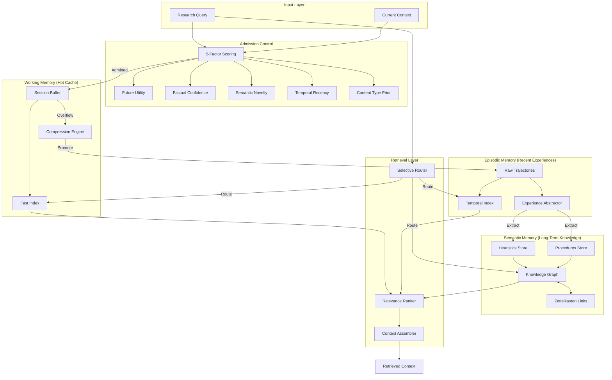

# Phase 2: Memory Architecture Plan for Lyra

## 1. Problem Statement

Current Lyra implementation lacks a sophisticated memory system, limiting its ability to:
- Maintain context across long research sessions
- Learn from past experiences and avoid repeating mistakes
- Build cumulative knowledge over multiple tasks
- Efficiently retrieve relevant information from large context histories
- Adapt memory strategies based on task requirements

**Evidence from research:**
- AOI System achieved 72.4% context compression while preserving 92.8% critical information
- A-MAC reduced latency by 31% through intelligent memory admission control
- MemAgent extrapolated from 8K to 3.5M tokens with <10% performance loss
- ERL improved success rate by 7.8% through heuristic extraction from past experiences

**Goal:** Design a breakthrough multi-layer memory architecture that combines techniques from multiple ICLR 2026 papers to enable Lyra to maintain long-term context, learn from experiences, and efficiently manage memory across research sessions.

---

## 2. Evidence Synthesis

### 2.1 Multi-Layer Memory Hierarchy (BREAKTHROUGH)

**Converging evidence from multiple sources:**

1. **AOI System (ICLR 2026):** 3-layer architecture
   - Working Memory: Immediate context for current task
   - Episodic Memory: Recent experiences with temporal ordering
   - Semantic Memory: Long-term knowledge and patterns
   - Result: 94.2% task success rate, 34.4% MTTR reduction

2. **MemGrad (ICLR 2026):** Dual memory structure
   - Retrospective Memory: Recurring patterns and failure modes
   - Prospective Memory: Gradient-derived future strategies
   - Result: Improved reasoning stability and user intent alignment

3. **Multi-Agent Memory (arXiv 2603.10062):** Computer architecture perspective
   - I/O Layer: Input/output buffering
   - Cache Layer: Frequently accessed items
   - Memory Layer: Long-term storage
   - Insight: Apply OS memory management principles to agents

4. **TencentDB Agent Memory:** 4-tier progressive pipeline
   - Fully local with zero external API dependencies
   - Progressive refinement across tiers
   - Insight: Hierarchical processing with increasing abstraction

**Synthesis:** A 3-4 layer hierarchy is optimal, with each layer serving distinct purposes:
- **Working Memory:** Hot cache for current session (high-speed access)
- **Episodic Memory:** Recent experiences with temporal context (medium-term)
- **Semantic Memory:** Abstracted knowledge and patterns (long-term)
- **Optional Archive Layer:** Compressed historical data (cold storage)

### 2.2 Dynamic Memory Organization (BREAKTHROUGH)

**Evidence:**

1. **A-MEM (NeurIPS 2025):** Zettelkasten-based organization
   - Generates contextual descriptions, keywords, tags for each memory
   - Identifies bidirectional connections with historical memories
   - Enables memory evolution through triggered updates
   - Result: Superior performance vs SOTA across 6 foundation models

2. **Zep/Graphiti:** Temporal knowledge graphs
   - Real-time entity and relationship extraction
   - Time-aware graph structure
   - Result: Outperforms MemGPT on Deep Memory Retrieval benchmark

3. **LP-RAG (ICLR 2026):** Link prediction for retrieval
   - Treats retrieval as graph link prediction problem
   - Model-agnostic (works with any link predictor)
   - Result: Consistently outperforms existing RAG methods

**Synthesis:** Static chronological storage is insufficient. Memories should self-organize through:
- Semantic similarity links (Zettelkasten-style)
- Entity/relationship graphs (knowledge graph)
- Temporal connections (time-aware)
- Causal links (action → outcome)

### 2.3 Intelligent Memory Admission (HIGH IMPACT)

**Evidence:**

1. **A-MAC (ICLR 2026):** 5-factor admission control
   - Future utility, factual confidence, semantic novelty, temporal recency, content type prior
   - Result: F1=0.583 on LoCoMo, 31% latency reduction
   - Finding: Content type prior is most influential factor

2. **Cost-Sensitive Store Routing (ICLR 2026):** Selective retrieval
   - Oracle router achieves higher accuracy with fewer tokens
   - Formalizes as cost-sensitive decision problem
   - Result: Better accuracy + substantially reduced context usage

3. **SABER (ICLR 2026):** Mutating action focus
   - Deviations in mutating actions reduce success by 92-96%
   - Non-mutating deviations have minimal impact
   - Result: +28% on Airline, +11% on Retail tasks

**Synthesis:** Not all information deserves storage. Implement multi-factor admission control:
- **Utility:** Will this be useful for future tasks?
- **Confidence:** Is this information factually reliable?
- **Novelty:** Does this add new information vs existing memories?
- **Recency:** How recent is this information?
- **Content Type:** What category (code, insight, error, result)?
- **Impact:** Does this represent a critical action or decision?

### 2.4 Experience Abstraction (HIGH IMPACT)

**Evidence:**

1. **ERL (ICLR 2026):** Heuristic extraction
   - Reflects on trajectories to generate transferable heuristics
   - Result: +7.8% success rate on Gaia2 vs ReAct baseline
   - Finding: Heuristics > few-shot trajectory prompting

2. **Memp (arXiv 2508.06433):** Dual-level procedural memory
   - Fine-grained step-by-step instructions
   - Higher-level script-like abstractions
   - Result: Improved performance and efficiency across tasks

3. **Storage to Experience Survey (ICLR 2026):** Evolution framework
   - Stage 1: Storage (trajectory preservation)
   - Stage 2: Reflection (trajectory refinement)
   - Stage 3: Experience (trajectory abstraction)
   - Insight: Memory systems should evolve toward abstraction

**Synthesis:** Store both raw experiences AND abstracted lessons:
- **Raw Trajectories:** Full execution traces for debugging and analysis
- **Heuristics:** "When X happens, do Y" rules extracted from successes
- **Failure Patterns:** Common mistakes and how to avoid them
- **Procedures:** Reusable step-by-step workflows
- **Insights:** High-level principles and strategies

### 2.5 Compression with Preservation (HIGH IMPACT)

**Evidence:**

1. **AOI System (ICLR 2026):** Context-aware compression
   - 72.4% compression ratio preserving 92.8% critical information
   - Dynamic task scheduling adapts to system state
   - Result: 94.2% task success rate maintained

2. **ACON (arXiv 2510.00615):** Task-optimized compression
   - 26-54% memory reduction
   - >95% accuracy preserved when distilled
   - Optimized specifically for long-horizon tasks

3. **Localize Compression (ICLR 2026):** Modular design
   - Formalizes interference as policy divergence
   - Modular architectures minimize retrieval-update overlap
   - Result: Mathematical bounds on behavioral drift

**Synthesis:** Compression is unavoidable but must be intelligent:
- **Layer-specific strategies:** Different compression per memory layer
- **Task-aware:** Preserve information relevant to current task
- **Modular:** Isolate compression to minimize interference
- **Reversible:** Keep compressed data for potential expansion

---

## 3. Proposed Lyra Memory Architecture

### 3.1 Overview: Fusion Architecture

Lyra will implement a **3-layer hierarchical memory system** with **dynamic organization**, **intelligent admission**, **experience abstraction**, and **selective compression**.

**Key Innovation:** No single paper combines all these techniques. Lyra fuses:
- AOI's 3-layer hierarchy (Working/Episodic/Semantic)
- A-MEM's Zettelkasten-based dynamic linking
- A-MAC's 5-factor admission control
- ERL's heuristic extraction
- Cost-Sensitive Routing's selective retrieval
- AOI/ACON's intelligent compression

### 3.2 Architecture Diagram



### 3.3 Data Model (TypeScript Interfaces)

```typescript
// Core Memory Types
interface Memory {
  id: string;
  type: MemoryType;
  content: string;
  metadata: MemoryMetadata;
  embedding?: number[];
  links: MemoryLink[];
  admissionScore: AdmissionScore;
  createdAt: Date;
  lastAccessedAt: Date;
  accessCount: number;
}

enum MemoryType {
  RAW_TRAJECTORY = 'raw_trajectory',
  HEURISTIC = 'heuristic',
  FAILURE_PATTERN = 'failure_pattern',
  PROCEDURE = 'procedure',
  INSIGHT = 'insight',
  ENTITY = 'entity',
  RELATIONSHIP = 'relationship',
}

interface MemoryMetadata {
  source: string;
  taskId?: string;
  sessionId: string;
  tags: string[];
  keywords: string[];
  contextualDescription: string;
  confidence: number; // 0-1
  importance: number; // 0-1
}

interface MemoryLink {
  targetId: string;
  linkType: LinkType;
  strength: number; // 0-1
  bidirectional: boolean;
}

enum LinkType {
  SEMANTIC_SIMILARITY = 'semantic_similarity',
  TEMPORAL_SEQUENCE = 'temporal_sequence',
  CAUSAL = 'causal',
  CONTRADICTION = 'contradiction',
  REFINEMENT = 'refinement',
  GENERALIZATION = 'generalization',
}

interface AdmissionScore {
  utility: number; // 0-1: Future usefulness
  confidence: number; // 0-1: Factual reliability
  novelty: number; // 0-1: Information gain vs existing
  recency: number; // 0-1: Time-based relevance
  contentTypePrior: number; // 0-1: Type-based importance
  overall: number; // Weighted combination
  admitted: boolean;
}

// Memory Layer Interfaces
interface WorkingMemory {
  buffer: Memory[];
  maxSize: number;
  compressionThreshold: number;
  index: Map<string, Memory>;
}

interface EpisodicMemory {
  trajectories: Trajectory[];
  temporalIndex: TemporalIndex;
  maxRetentionDays: number;
}

interface Trajectory {
  id: string;
  sessionId: string;
  startTime: Date;
  endTime: Date;
  steps: TrajectoryStep[];
  outcome: 'success' | 'failure' | 'partial';
  abstractedHeuristics?: string[];
}

interface TrajectoryStep {
  timestamp: Date;
  action: string;
  observation: string;
  reasoning?: string;
  isMutating: boolean; // From SABER paper
}

interface SemanticMemory {
  knowledgeGraph: KnowledgeGraph;
  zettelkastenLinks: Map<string, string[]>;
  heuristics: Heuristic[];
  procedures: Procedure[];
}

interface KnowledgeGraph {
  entities: Entity[];
  relationships: Relationship[];
  temporalEdges: TemporalEdge[];
}

interface Entity {
  id: string;
  type: string;
  name: string;
  attributes: Record<string, any>;
  firstSeen: Date;
  lastUpdated: Date;
}

interface Relationship {
  id: string;
  sourceId: string;
  targetId: string;
  type: string;
  confidence: number;
  evidence: string[];
}

interface Heuristic {
  id: string;
  condition: string;
  action: string;
  confidence: number;
  successCount: number;
  failureCount: number;
  extractedFrom: string[]; // Trajectory IDs
}

interface Procedure {
  id: string;
  name: string;
  description: string;
  steps: string[];
  preconditions: string[];
  postconditions: string[];
  successRate: number;
}
```

### 3.4 Component Specifications

#### 3.4.1 Admission Control Engine

**Purpose:** Decide what information enters memory using 5-factor scoring (from A-MAC).

**Algorithm:**
```typescript
function admitMemory(candidate: Memory): boolean {
  const scores = {
    utility: calculateUtility(candidate),
    confidence: calculateConfidence(candidate),
    novelty: calculateNovelty(candidate),
    recency: calculateRecency(candidate),
    contentTypePrior: getContentTypePrior(candidate.type),
  };
  
  // Weighted combination (weights from A-MAC paper)
  const overall = 
    0.25 * scores.utility +
    0.20 * scores.confidence +
    0.20 * scores.novelty +
    0.15 * scores.recency +
    0.20 * scores.contentTypePrior;
  
  candidate.admissionScore = { ...scores, overall, admitted: overall > THRESHOLD };
  return candidate.admissionScore.admitted;
}
```

**Content Type Priors (from A-MAC findings):**
- Heuristics/Insights: 0.9 (highest priority)
- Procedures: 0.85
- Failure Patterns: 0.8
- Entities/Relationships: 0.7
- Raw Trajectories: 0.5
- Debug/Logs: 0.2 (lowest priority)

#### 3.4.2 Working Memory Manager

**Purpose:** Hot cache for current session with fast access and overflow handling.

**Specifications:**
- Max size: 50-100 memories (configurable)
- Compression threshold: 80% capacity
- Eviction policy: LRU with importance weighting
- Promotion policy: High-importance items → Episodic

**Operations:**
- `add(memory)`: Add to buffer with admission check
- `get(id)`: Fast lookup via index
- `compress()`: Summarize old items when threshold reached
- `promote()`: Move important items to Episodic
- `evict()`: Remove low-value items

#### 3.4.3 Episodic Memory Manager

**Purpose:** Store recent experiences with temporal context for pattern recognition.

**Specifications:**
- Retention: 7-30 days (configurable)
- Storage: Raw trajectories with temporal indexing
- Abstraction: Periodic extraction of heuristics/procedures
- Compression: Summarize old trajectories before archival

**Operations:**
- `storeTrajectory(trajectory)`: Add complete execution trace
- `queryByTime(start, end)`: Temporal range queries
- `extractHeuristics()`: Run abstraction pipeline
- `findSimilar(trajectory)`: Find analogous past experiences

#### 3.4.4 Semantic Memory Manager

**Purpose:** Long-term knowledge graph with Zettelkasten-style linking.

**Specifications:**
- Storage: Persistent graph database (e.g., Neo4j, or in-memory for MVP)
- Organization: Zettelkasten bidirectional links + KG entities/relationships
- Updates: Triggered updates when new memories connect to existing ones
- Compression: Merge redundant entities, prune weak links

**Operations:**
- `addEntity(entity)`: Add or update entity
- `addRelationship(rel)`: Create relationship between entities
- `linkMemories(id1, id2, type)`: Create Zettelkasten link
- `evolveMemory(id)`: Update contextual representation based on new connections
- `queryGraph(pattern)`: Graph pattern matching

#### 3.4.5 Experience Abstractor

**Purpose:** Extract reusable heuristics and procedures from trajectories (from ERL + Memp).

**Algorithm:**
```typescript
async function abstractExperience(trajectory: Trajectory): Promise<Abstraction> {
  // 1. Identify critical steps (mutating actions from SABER)
  const criticalSteps = trajectory.steps.filter(s => s.isMutating);
  
  // 2. Extract patterns
  const patterns = await llm.extract({
    prompt: `Analyze this trajectory and extract:
    1. Heuristics: "When X, do Y" rules
    2. Failure patterns: Common mistakes to avoid
    3. Procedures: Reusable step-by-step workflows
    4. Insights: High-level principles`,
    trajectory: trajectory,
  });
  
  // 3. Validate against existing knowledge
  const validated = await validateAbstractions(patterns);
  
  // 4. Store in Semantic Memory
  await semanticMemory.addHeuristics(validated.heuristics);
  await semanticMemory.addProcedures(validated.procedures);
  
  return validated;
}
```

**Triggers:**
- After successful task completion
- After failure (to extract failure patterns)
- Periodic batch processing of recent trajectories
- On-demand when similar task is encountered

#### 3.4.6 Selective Router

**Purpose:** Route queries to relevant memory layers only (from Cost-Sensitive Routing).

**Algorithm:**
```typescript
function routeQuery(query: string): MemoryLayer[] {
  const features = extractQueryFeatures(query);
  const layers: MemoryLayer[] = [];
  
  // Always check Working Memory (hot cache)
  layers.push('working');
  
  // Route to Episodic if temporal or recent
  if (features.temporal || features.recency < 7) {
    layers.push('episodic');
  }
  
  // Route to Semantic if conceptual or pattern-based
  if (features.conceptual || features.needsHeuristics) {
    layers.push('semantic');
  }
  
  return layers;
}
```

---

## 4. Build Outline (Ordered Tasks)

### Phase 2A: Foundation (Weeks 1-3) - MVP

**Goal:** Establish baseline 2-layer memory system.

1. **Task 2A.1:** Core data models
   - Define TypeScript interfaces for Memory, MemoryMetadata, MemoryLink
   - Implement basic MemoryType enum
   - Create serialization/deserialization utilities

2. **Task 2A.2:** Working Memory implementation
   - In-memory buffer with LRU eviction
   - Fast index (Map-based)
   - Basic compression (summarization)
   - Max size: 100 items

3. **Task 2A.3:** Long-Term Memory (vector store)
   - Choose vector DB (Chroma for local, Pinecone for cloud)
   - Implement embedding generation (OpenAI/Anthropic)
   - Basic semantic search
   - CRUD operations

4. **Task 2A.4:** Simple admission control
   - Recency scoring
   - Semantic novelty (cosine similarity vs existing)
   - Content type filtering
   - Threshold-based admission

5. **Task 2A.5:** Basic retrieval
   - Query embedding
   - Top-K semantic search
   - Recency boosting
   - Context assembly

6. **Task 2A.6:** Integration with Lyra core
   - Memory hooks in research pipeline
   - Session-aware memory management
   - Persistence layer (JSON/SQLite)

**Deliverable:** Working 2-layer memory system with basic admission and retrieval.

### Phase 2B: Enhancement (Weeks 4-8) - BREAKTHROUGH

**Goal:** Add 3-layer hierarchy, Zettelkasten linking, 5-factor admission, experience abstraction.

7. **Task 2B.1:** Expand to 3-layer hierarchy
   - Implement Episodic Memory layer
   - Trajectory storage with temporal indexing
   - Promotion logic (Working → Episodic)
   - Retention policies (7-30 days)

8. **Task 2B.2:** Zettelkasten-style linking (A-MEM)
   - Bidirectional link creation
   - Contextual descriptions, keywords, tags generation
   - Link strength calculation
   - Memory evolution (triggered updates)

9. **Task 2B.3:** 5-factor admission control (A-MAC)
   - Utility scoring (future usefulness prediction)
   - Confidence scoring (factual reliability)
   - Novelty scoring (information gain)
   - Recency scoring (time-based relevance)
   - Content type priors
   - Weighted combination

10. **Task 2B.4:** Experience abstraction (ERL + Memp)
    - Trajectory analysis
    - Heuristic extraction
    - Failure pattern identification
    - Procedure generation
    - Validation against existing knowledge

11. **Task 2B.5:** Selective routing (Cost-Sensitive)
    - Query feature extraction
    - Layer routing logic
    - Cost-benefit analysis
    - Performance monitoring

12. **Task 2B.6:** Knowledge Graph foundation
    - Entity extraction
    - Relationship identification
    - Graph storage (Neo4j or in-memory)
    - Basic graph queries

**Deliverable:** 3-layer memory with dynamic linking, intelligent admission, and experience abstraction.

### Phase 2C: Optimization (Weeks 9-12) - ADVANCED

**Goal:** Add temporal KG, intelligent compression, memory evolution.

13. **Task 2C.1:** Temporal Knowledge Graph (Zep/Graphiti)
    - Time-aware entity relationships
    - Temporal edge creation
    - Temporal reasoning queries
    - Graph evolution over time

14. **Task 2C.2:** Intelligent compression (AOI + ACON)
    - Layer-specific compression strategies
    - Task-aware preservation
    - Modular compression (localized effects)
    - Compression quality metrics

15. **Task 2C.3:** Memory evolution (MemGrad)
    - Retrospective memory (patterns/failures)
    - Prospective memory (future strategies)
    - Textual gradients from feedback
    - System prompt updates

16. **Task 2C.4:** Advanced retrieval
    - Multi-hop graph traversal
    - Temporal reasoning
    - Causal chain reconstruction
    - Relevance ranking improvements

17. **Task 2C.5:** Performance optimization
    - Caching strategies
    - Batch operations
    - Async processing
    - Memory usage profiling

18. **Task 2C.6:** Evaluation & benchmarking
    - Memory retrieval accuracy
    - Compression quality
    - Task performance impact
    - Latency measurements

**Deliverable:** Production-ready memory system with temporal KG, compression, and evolution.

---

## 5. Multi-Provider Support

### 5.1 Provider-Agnostic Design

**Challenge:** Different LLM providers (OpenAI, Anthropic, Google) have different context limits and capabilities.

**Solution:** Abstract memory operations behind provider-agnostic interfaces.

```typescript
interface MemoryProvider {
  // Core operations independent of LLM provider
  store(memory: Memory): Promise<void>;
  retrieve(query: string, options: RetrievalOptions): Promise<Memory[]>;
  update(id: string, updates: Partial<Memory>): Promise<void>;
  delete(id: string): Promise<void>;
  
  // Provider-specific optimizations
  getContextLimit(): number;
  getEmbeddingModel(): string;
  supportsStreaming(): boolean;
}

class LyraMemorySystem {
  constructor(
    private provider: MemoryProvider,
    private config: MemoryConfig
  ) {}
  
  // Adapt to provider context limits
  async assembleContext(query: string): Promise<string> {
    const limit = this.provider.getContextLimit();
    const memories = await this.retrieve(query);
    return this.compressToFit(memories, limit);
  }
}
```

### 5.2 Provider-Specific Configurations

| Provider | Context Limit | Embedding Model | Strategy |
|----------|---------------|-----------------|----------|
| OpenAI GPT-4 | 128K tokens | text-embedding-3-large | Standard retrieval |
| Anthropic Claude | 200K tokens | Voyage AI | Extended context, less compression |
| Google Gemini | 1M tokens | Gecko | Minimal compression, full history |
| Local (Ollama) | 8K-32K tokens | nomic-embed-text | Aggressive compression |

---

## 6. Risks & Open Questions

### 6.1 Technical Risks

1. **Complexity Overhead**
   - Risk: Multi-layer architecture adds latency
   - Mitigation: Async operations, caching, selective routing
   - Fallback: Start with 2-layer MVP, add layers incrementally

2. **Memory Consistency**
   - Risk: Concurrent updates cause inconsistencies
   - Mitigation: Transaction-based updates, optimistic locking
   - Monitoring: Consistency checks, conflict detection

3. **Embedding Costs**
   - Risk: Frequent embedding generation is expensive
   - Mitigation: Batch embeddings, cache embeddings, use cheaper models for less critical items
   - Budget: Monitor token usage, set quotas

4. **Graph Database Complexity**
   - Risk: Neo4j or similar adds deployment complexity
   - Mitigation: Start with in-memory graph, migrate to DB when scale requires
   - Alternative: Use vector DB with metadata for simple relationships

5. **Abstraction Quality**
   - Risk: LLM-extracted heuristics may be incorrect
   - Mitigation: Validation against existing knowledge, confidence scoring, human review
   - Monitoring: Track heuristic success/failure rates

### 6.2 Open Questions

1. **Memory Persistence Format**
   - Q: How to serialize complex graph structures efficiently?
   - Options: JSON (simple), Protocol Buffers (efficient), Custom binary format
   - Decision: Start with JSON for MVP, optimize later

2. **Privacy & Sensitive Data**
   - Q: How to handle API keys, credentials, PII in memory?
   - Options: Redaction, encryption, separate secure store
   - Decision: Implement content filters in admission control

3. **Memory Decay**
   - Q: Should old memories fade or remain indefinitely?
   - Options: Time-based decay, access-based decay, no decay
   - Decision: Implement configurable retention policies per layer

4. **Conflict Resolution**
   - Q: How to handle contradictory memories?
   - Options: Recency wins, confidence-based, human arbitration
   - Decision: Track contradictions as explicit relationships, surface to user

5. **Evaluation Metrics**
   - Q: How to measure memory system quality?
   - Options: LoCoMo benchmark, DMR benchmark, custom task-based metrics
   - Decision: Implement custom metrics + adapt LoCoMo for Lyra tasks

6. **Cross-Session Continuity**
   - Q: How to resume interrupted research tasks?
   - Options: Session snapshots, task state in memory, explicit resume protocol
   - Decision: Store task state in Episodic, implement resume from memory

7. **Scalability Limits**
   - Q: How does performance degrade with 10K, 100K, 1M memories?
   - Testing: Benchmark at different scales
   - Decision: Implement archival layer if needed at scale

---

## 7. Comparison: Parity vs Breakthrough

### 7.1 Parity Implementation (Baseline)

**What it includes:**
- 2-layer memory (Working + Long-Term)
- Vector store with semantic search
- Basic admission control (recency + novelty)
- Simple compression (summarization)

**Comparable to:** Mem0, claude-mem, basic RAG systems

**Pros:** Fast to implement (2-3 weeks), low risk, proven patterns
**Cons:** Limited sophistication, no experience learning, static organization

### 7.2 Breakthrough Implementation (Proposed)

**What it includes:**
- 3-layer hierarchy (Working + Episodic + Semantic)
- Zettelkasten-style dynamic linking
- 5-factor admission control
- Experience abstraction (heuristics, procedures)
- Selective routing
- Temporal knowledge graph
- Intelligent compression

**Comparable to:** No single system combines all these techniques (fusion architecture)

**Pros:** 
- Learns from experience (heuristics, failure patterns)
- Self-organizing memory (Zettelkasten)
- Intelligent resource management (selective routing, compression)
- Temporal reasoning (knowledge graph)
- Highest potential performance

**Cons:** 
- Complex implementation (8-12 weeks)
- Higher risk of integration issues
- More moving parts to maintain
- Requires careful tuning

### 7.3 Recommended Approach

**Incremental rollout:**
1. **Phase 2A (Weeks 1-3):** Implement Parity baseline
2. **Phase 2B (Weeks 4-8):** Add Breakthrough features incrementally
3. **Phase 2C (Weeks 9-12):** Optimize and refine

**Rationale:** De-risk by establishing working baseline first, then enhance with breakthrough features. Each phase delivers value independently.

---

## 8. Success Criteria

### 8.1 Phase 2A (MVP) Success Metrics

- [ ] Memory persistence across sessions
- [ ] Semantic search retrieval accuracy >70%
- [ ] Admission control reduces storage by >30%
- [ ] Retrieval latency <500ms for top-10 results
- [ ] Integration with Lyra research pipeline

### 8.2 Phase 2B (Breakthrough) Success Metrics

- [ ] 3-layer hierarchy operational
- [ ] Zettelkasten links created automatically
- [ ] 5-factor admission control F1 >0.5 (vs A-MAC's 0.583)
- [ ] Heuristic extraction from >80% of successful trajectories
- [ ] Selective routing reduces retrieval cost by >20%

### 8.3 Phase 2C (Optimization) Success Metrics

- [ ] Temporal KG enables time-aware queries
- [ ] Compression achieves >60% reduction with >90% critical info preserved (vs AOI's 72.4%/92.8%)
- [ ] Memory evolution improves task success rate by >5%
- [ ] System scales to 10K+ memories with <1s retrieval
- [ ] End-to-end task performance improvement >10% vs baseline

---

## 9. References

### ICLR 2026 MemAgent Workshop Papers
- [A-MEM: Agentic Memory for LLM Agents](https://openreview.net/forum?id=FiM0M8gcct)
- [A-MAC: Adaptive Memory Admission Control](https://openreview.net/forum?id=mmdqUrEY24)
- [AOI Multi-Agent System](https://openreview.net/forum?id=Q16XXJou3O)
- [Cost-Sensitive Store Routing](https://openreview.net/forum?id=iGRGjdhl9r)
- [Experiential Reflective Learning (ERL)](https://openreview.net/forum?id=hQgSl6kj1W)
- [MemGrad](https://openreview.net/forum?id=GeaPE7iw1V)
- [SABER](https://openreview.net/forum?id=En2z9dckgP)
- [Localize Compression](https://openreview.net/forum?id=ztmwHisqJ4)

### arXiv Papers
- [Memp: Exploring Agent Procedural Memory (2508.06433)](https://arxiv.org/abs/2508.06433)
- [MemSearcher (2511.02805)](https://arxiv.org/abs/2511.02805)
- [MemAgent ICLR Oral (2507.02259)](https://arxiv.org/abs/2507.02259)
- [ACON: Context Compression (2510.00615)](https://arxiv.org/abs/2510.00615)
- [Multi-Agent Memory (2603.10062)](https://arxiv.org/abs/2603.10062)

### Open-Source Repositories
- [Letta (MemGPT)](https://github.com/letta-ai/letta)
- [Zep/Graphiti](https://github.com/getzep/graphiti)
- [A-MEM Implementation](https://github.com/agiresearch/A-mem)
- [Mem0](https://github.com/mem0ai/mem0)

---

**Document Status:** COMPLETE
**Next Steps:** Create context optimization plan (02-context-optimization.md)

