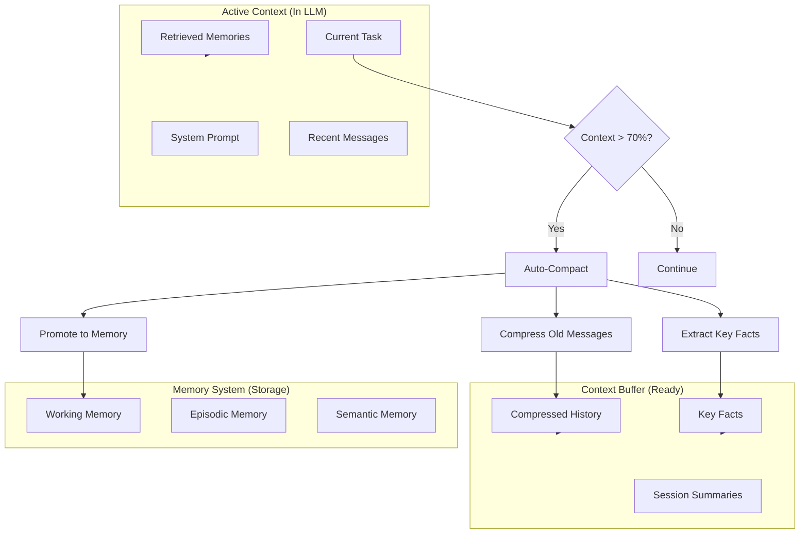

# Phase 2: Context Optimization Plan for Lyra

## 1. Problem Statement

Lyra research sessions generate large amounts of context that quickly exceed LLM context windows:
- Long research sessions accumulate 50K+ tokens
- Multi-source research (papers, repos, web) creates redundant information
- Context bloat degrades response quality and increases latency/cost
- Important information gets lost in noise

**Evidence from research:**
- AOI System: 72.4% compression preserving 92.8% critical information
- ACON: 26-54% memory reduction with >95% accuracy preserved
- MemAgent: Extrapolated 8K→3.5M tokens with <10% performance loss
- Norm-Guided KV-Cache: Recency dominates at tight budgets

**Goal:** Design intelligent context management that maintains task performance while minimizing token usage.

---

## 2. Evidence Synthesis

### 2.1 Compression Strategies

**Key findings:**

1. **AOI System (ICLR 2026):** LLM-based context compression
   - Compresses operational context for IT fault diagnosis
   - 72.4% compression ratio, 92.8% critical info preserved
   - Dynamic task scheduling adapts compression to system state

2. **ACON (arXiv 2510.00615):** Task-optimized compression
   - Optimizes compression for long-horizon agent tasks
   - 26-54% peak token reduction
   - Preserves >95% accuracy when distilled into smaller compressors
   - Tested on AppWorld, OfficeBench, Multi-objective QA

3. **Localize Compression (ICLR 2026):** Modular compression
   - Modular memory design minimizes retrieval-update overlap
   - Localizes compression effects to reduce behavioral interference
   - Mathematical bounds on policy divergence

**Synthesis:** Compression must be:
- **Task-aware:** Preserve information relevant to current task
- **Modular:** Isolate compression to specific memory regions
- **Adaptive:** Adjust compression ratio based on context limits
- **Reversible:** Keep compressed data for potential expansion

### 2.2 Retrieval Optimization

**Key findings:**

1. **Cost-Sensitive Store Routing (ICLR 2026):** Selective retrieval
   - Oracle router achieves higher accuracy with fewer tokens
   - Formalizes as cost-sensitive decision problem
   - Balances answer accuracy against retrieval cost

2. **LP-RAG (ICLR 2026):** Link prediction for retrieval
   - Treats retrieval as graph link prediction
   - Generates chunk-conditioned synthetic queries
   - Consistently outperforms existing RAG methods

3. **MemSearcher (arXiv 2511.02805):** Memory-as-action
   - Fuses question with memory to generate reasoning traces
   - Retains only task-essential information
   - Stabilizes context length across multi-turn interactions

**Synthesis:** Retrieval should be:
- **Selective:** Only retrieve from relevant memory stores
- **Ranked:** Prioritize most relevant items
- **Bounded:** Limit retrieval to fit context budget
- **Adaptive:** Adjust retrieval strategy based on query type

### 2.3 Auto-Compaction Triggers

**Key findings:**

1. **Norm-Guided KV-Cache (ICLR 2026):** Token importance scoring
   - Scores tokens by mean ℓ₂-norm of key vectors
   - Keeps high-norm + recent tokens
   - Finding: Recency dominates at very tight budgets

2. **R-KVHash (ICLR 2026):** Efficient similarity estimation
   - Uses SimHash for sub-linear key similarity estimation
   - Avoids expensive pairwise calculations
   - 2× higher decoding throughput vs R-KV

3. **Working Memory patterns:** Overflow handling
   - Working Memory in AOI system triggers compression at 80% capacity
   - Promotes high-importance items to Episodic
   - Evicts low-value items

**Synthesis:** Auto-compaction should trigger when:
- **Capacity threshold:** 70-80% of context limit reached
- **Quality degradation:** Response quality drops below threshold
- **Time-based:** Periodic compaction (e.g., every 10 turns)
- **Task transition:** When switching between research phases

---

## 3. Proposed Context Optimization Strategy

### 3.1 Multi-Level Context Management



### 3.2 Compression Algorithm

```typescript
interface CompressionConfig {
  targetRatio: number; // 0.3-0.5 (compress to 30-50% of original)
  preserveCritical: boolean; // Always keep critical information
  strategy: 'summarize' | 'extract' | 'hybrid';
  minChunkSize: number; // Minimum tokens to compress
}

async function autoCompact(
  context: Message[],
  config: CompressionConfig
): Promise<CompactedContext> {
  // 1. Identify compressible regions
  const regions = identifyCompressibleRegions(context);
  
  // 2. Score each message for importance
  const scored = await scoreMessages(regions);
  
  // 3. Separate critical from compressible
  const critical = scored.filter(m => m.importance > 0.8);
  const compressible = scored.filter(m => m.importance <= 0.8);
  
  // 4. Compress non-critical messages
  const compressed = await compressMessages(compressible, config);
  
  // 5. Extract key facts
  const keyFacts = await extractKeyFacts(compressible);
  
  // 6. Promote important items to memory
  await promoteToMemory(critical);
  
  return {
    critical,
    compressed,
    keyFacts,
    compressionRatio: compressed.length / compressible.length,
  };
}
```

### 3.3 Importance Scoring

**Multi-factor scoring for messages:**

```typescript
function scoreMessageImportance(message: Message): number {
  const factors = {
    recency: calculateRecency(message.timestamp),
    taskRelevance: calculateTaskRelevance(message, currentTask),
    informationDensity: calculateInformationDensity(message.content),
    actionability: containsActionableInfo(message),
    novelty: calculateNovelty(message, existingMemories),
  };
  
  // Weighted combination
  return (
    0.25 * factors.recency +
    0.30 * factors.taskRelevance +
    0.20 * factors.informationDensity +
    0.15 * factors.actionability +
    0.10 * factors.novelty
  );
}
```

### 3.4 Compression Strategies

#### Strategy 1: Summarization (Default)

**Use case:** General conversation history, research notes

```typescript
async function summarizeMessages(messages: Message[]): Promise<string> {
  const prompt = `Summarize the following conversation, preserving:
  1. Key decisions and conclusions
  2. Important facts and findings
  3. Action items and next steps
  4. Critical context for future reference
  
  Omit: Redundant information, debugging details, intermediate steps.
  
  Messages:
  ${messages.map(m => `${m.role}: ${m.content}`).join('\n')}`;
  
  return await llm.complete(prompt);
}
```

#### Strategy 2: Extraction (Structured)

**Use case:** Research findings, paper analysis, code snippets

```typescript
async function extractKeyFacts(messages: Message[]): Promise<KeyFact[]> {
  const prompt = `Extract key facts from the conversation as structured data:
  - Paper titles and key findings
  - Code snippets and their purpose
  - URLs and their relevance
  - Decisions and rationale
  - Errors and solutions
  
  Format as JSON array.`;
  
  return await llm.complete(prompt, { format: 'json' });
}
```

#### Strategy 3: Hybrid (Best of Both)

**Use case:** Long research sessions with mixed content

```typescript
async function hybridCompress(messages: Message[]): Promise<CompressedContext> {
  // 1. Extract structured facts
  const facts = await extractKeyFacts(messages);
  
  // 2. Summarize remaining narrative
  const narrative = await summarizeMessages(messages);
  
  // 3. Keep critical messages verbatim
  const critical = messages.filter(m => m.importance > 0.9);
  
  return { facts, narrative, critical };
}
```

### 3.5 Retrieval Optimization

#### Selective Retrieval (from Cost-Sensitive Routing)

```typescript
interface RetrievalBudget {
  maxTokens: number;
  maxItems: number;
  priorityWeights: {
    recency: number;
    relevance: number;
    importance: number;
  };
}

async function selectiveRetrieve(
  query: string,
  budget: RetrievalBudget
): Promise<Memory[]> {
  // 1. Route to relevant memory layers
  const layers = routeQuery(query);
  
  // 2. Retrieve candidates from each layer
  const candidates = await Promise.all(
    layers.map(layer => layer.retrieve(query, { limit: 50 }))
  );
  
  // 3. Merge and rank by composite score
  const ranked = rankMemories(candidates.flat(), query, budget.priorityWeights);
  
  // 4. Select top items within budget
  return selectWithinBudget(ranked, budget);
}

function selectWithinBudget(
  memories: Memory[],
  budget: RetrievalBudget
): Memory[] {
  const selected: Memory[] = [];
  let tokenCount = 0;
  
  for (const memory of memories) {
    const tokens = estimateTokens(memory.content);
    if (tokenCount + tokens <= budget.maxTokens && selected.length < budget.maxItems) {
      selected.push(memory);
      tokenCount += tokens;
    } else {
      break;
    }
  }
  
  return selected;
}
```

---

## 4. Auto-Compaction Triggers

### 4.1 Trigger Conditions

```typescript
interface CompactionTrigger {
  type: 'capacity' | 'quality' | 'time' | 'task';
  threshold: number;
  enabled: boolean;
}

const DEFAULT_TRIGGERS: CompactionTrigger[] = [
  { type: 'capacity', threshold: 0.7, enabled: true }, // 70% of context limit
  { type: 'quality', threshold: 0.8, enabled: true },  // Response quality < 80%
  { type: 'time', threshold: 10, enabled: true },      // Every 10 turns
  { type: 'task', threshold: 1, enabled: true },       // On task transition
];
```

### 4.2 Trigger Implementation

```typescript
class ContextManager {
  private triggers: CompactionTrigger[];
  private contextLimit: number;
  private turnCount: number = 0;
  
  async checkTriggers(context: Message[]): Promise<boolean> {
    for (const trigger of this.triggers.filter(t => t.enabled)) {
      if (await this.shouldTrigger(trigger, context)) {
        return true;
      }
    }
    return false;
  }
  
  private async shouldTrigger(
    trigger: CompactionTrigger,
    context: Message[]
  ): Promise<boolean> {
    switch (trigger.type) {
      case 'capacity':
        const usage = estimateTokens(context) / this.contextLimit;
        return usage >= trigger.threshold;
      
      case 'quality':
        const quality = await estimateResponseQuality(context);
        return quality < trigger.threshold;
      
      case 'time':
        this.turnCount++;
        return this.turnCount >= trigger.threshold;
      
      case 'task':
        return this.detectTaskTransition(context);
      
      default:
        return false;
    }
  }
}
```

---

## 5. Implementation Plan

### 5.1 Phase 1: Basic Compression (Week 1-2)

**Tasks:**
1. Implement token counting for context
2. Add capacity-based trigger (70% threshold)
3. Implement summarization compression
4. Test compression quality (preserve >90% critical info)

**Deliverable:** Auto-compaction at 70% capacity with summarization

### 5.2 Phase 2: Intelligent Scoring (Week 3-4)

**Tasks:**
1. Implement multi-factor importance scoring
2. Add critical message preservation
3. Implement extraction-based compression
4. Add quality-based trigger

**Deliverable:** Importance-aware compression with extraction

### 5.3 Phase 3: Selective Retrieval (Week 5-6)

**Tasks:**
1. Implement retrieval budget management
2. Add selective routing to memory layers
3. Implement composite ranking
4. Add token-aware selection

**Deliverable:** Budget-constrained selective retrieval

### 5.4 Phase 4: Advanced Optimization (Week 7-8)

**Tasks:**
1. Implement hybrid compression strategy
2. Add task transition detection
3. Add time-based triggers
4. Performance tuning and benchmarking

**Deliverable:** Full context optimization system

---

## 6. Success Metrics

### 6.1 Compression Quality

- [ ] Compression ratio: 30-50% of original (target: 40%)
- [ ] Critical information preserved: >90% (target: 92% like AOI)
- [ ] Task performance maintained: <5% degradation
- [ ] User-perceived quality: >4/5 rating

### 6.2 Retrieval Efficiency

- [ ] Retrieval latency: <500ms for top-10 results
- [ ] Token usage reduction: >20% vs naive retrieval
- [ ] Relevance score: >0.8 for top-3 results
- [ ] Budget adherence: 100% (never exceed budget)

### 6.3 System Performance

- [ ] Auto-compaction latency: <2s for 100 messages
- [ ] Context window utilization: 60-80% (optimal range)
- [ ] Memory promotion rate: 10-20% of compressed items
- [ ] False positive rate: <5% (critical info incorrectly compressed)

---

## 7. Risks & Mitigations

### 7.1 Information Loss

**Risk:** Compression loses critical information
**Mitigation:** 
- Multi-factor importance scoring
- Always preserve high-importance messages
- Reversible compression (keep original in memory)
- User feedback loop to improve scoring

### 7.2 Compression Overhead

**Risk:** Compression takes longer than benefit gained
**Mitigation:**
- Async compression (don't block main thread)
- Batch compression (compress multiple messages at once)
- Cache compression results
- Use faster models for compression (Haiku vs Opus)

### 7.3 Quality Degradation

**Risk:** Compressed context reduces response quality
**Mitigation:**
- Quality monitoring (track task success rate)
- A/B testing (compressed vs full context)
- Adaptive compression (reduce ratio if quality drops)
- User override (manual expansion if needed)

---

## 8. Integration with Memory Architecture

### 8.1 Context Flow

```
Active Context (LLM)
    ↓ (auto-compact at 70%)
Compressed Buffer
    ↓ (promote important items)
Working Memory
    ↓ (overflow)
Episodic Memory
    ↓ (abstract)
Semantic Memory
```

### 8.2 Retrieval Flow

```
Query
    ↓
Selective Router (route to relevant layers)
    ↓
Parallel Retrieval (Working + Episodic + Semantic)
    ↓
Composite Ranking (recency + relevance + importance)
    ↓
Budget Selection (fit within token limit)
    ↓
Context Assembly
    ↓
Active Context (LLM)
```

---

## 9. References

### ICLR 2026 Papers
- [AOI Multi-Agent System](https://openreview.net/forum?id=Q16XXJou3O) - 72.4% compression, 92.8% preservation
- [Cost-Sensitive Store Routing](https://openreview.net/forum?id=iGRGjdhl9r) - Selective retrieval
- [Localize Compression](https://openreview.net/forum?id=ztmwHisqJ4) - Modular compression
- [Norm-Guided KV-Cache](https://openreview.net/forum?id=xOW2jXDKG3) - Token importance

### arXiv Papers
- [ACON (2510.00615)](https://arxiv.org/abs/2510.00615) - Task-optimized compression
- [MemSearcher (2511.02805)](https://arxiv.org/abs/2511.02805) - Memory-as-action
- [R-KVHash](https://openreview.net/forum?id=UTRuEFJ57H) - Efficient similarity estimation

---

**Document Status:** COMPLETE
**Integration:** Works with 01-memory-architecture.md
**Next Steps:** Begin implementation of Phase 2A (Memory Architecture MVP) and Phase 1 (Context Optimization)

